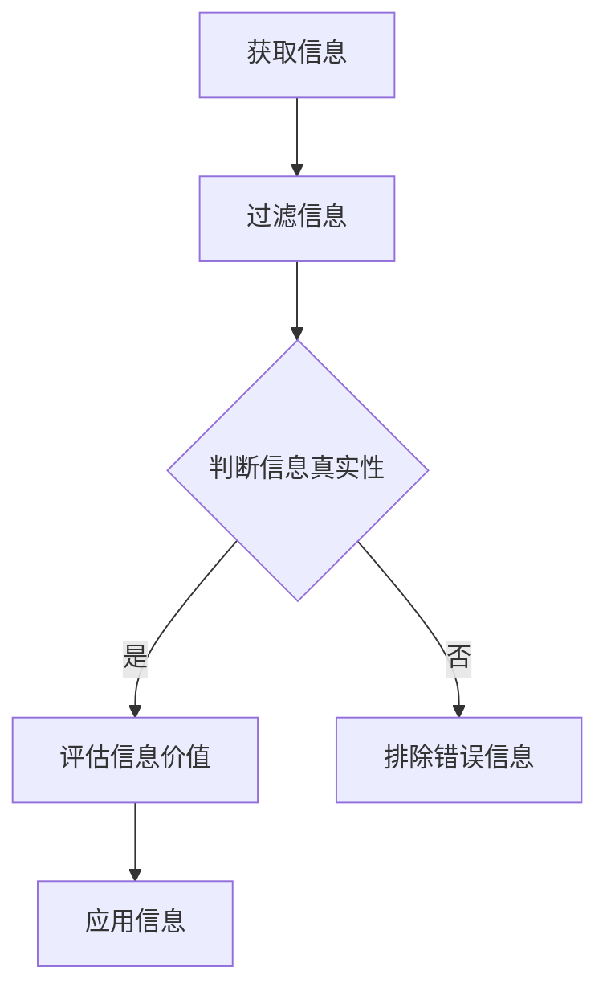
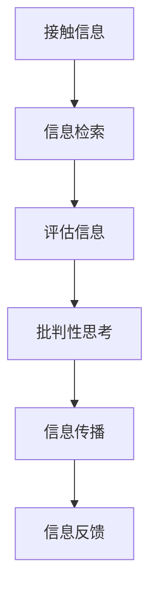

                 

根据您提供的要求，我将按照以下步骤撰写文章：

### 第一步：文章标题、关键词和摘要
1. 标题：《后真相环境中的信息判断：提升公民的媒体素养》
2. 关键词：后真相时代、信息判断、媒体素养、算法、数学模型、项目实战
3. 摘要：本文探讨了后真相时代公民在面对海量信息时的信息判断挑战，介绍了媒体素养的重要性，并从核心概念、算法原理、数学模型和实际项目等多个角度，提出了提升公民媒体素养的策略和方法。

### 第二步：核心概念与联系
1. **信息判断**：
   - 定义：信息判断是对信息的真实性、可靠性、价值和意义进行评估的过程。
   - 类型：包括事实判断、观点判断、价值判断等。
   - 流程图：使用 Mermaid 语言绘制信息判断的基本流程。



2. **媒体素养**：
   - 定义：媒体素养是指个体理解和有效使用各种形式的媒体信息，以及创造和传播信息的能力。
   - 维度：包括批判性思考、信息检索、信息评估、信息传播等。
   - 流程图：使用 Mermaid 语言绘制媒体素养培养的基本流程。



### 第三步：核心算法原理讲解
1. **信息验证算法**：
   - 伪代码：
   
   ```python
   def verify_info(info):
       # 检查信息来源的可靠性
       if is_reliable_source(info.source):
           # 验证信息内容
           if content_verified(info.content):
               return "信息验证通过"
           else:
               return "信息内容验证失败"
       else:
           return "信息来源不可信"
   ```

2. **情感分析算法**：
   - 伪代码：

   ```python
   def analyze_sentiment(text):
       # 使用情感分析模型分析文本情感
       sentiment = sentiment_model.predict(text)
       if sentiment == "positive":
           return "文本情感为正面"
       elif sentiment == "negative":
           return "文本情感为负面"
       else:
           return "文本情感为中性"
   ```

### 第四步：数学模型和数学公式
1. **贝叶斯定理**：
   - 公式：$$ P(A|B) = \frac{P(B|A)P(A)}{P(B)} $$
   - 应用：在信息判断中用于根据已知条件更新信念概率。

2. **相关性分析**：
   - 公式：$$ \text{corr}(X, Y) = \frac{\sum_{i=1}^{n}(x_i - \bar{x})(y_i - \bar{y})}{\sqrt{\sum_{i=1}^{n}(x_i - \bar{x})^2}\sqrt{\sum_{i=1}^{n}(y_i - \bar{y})^2}} $$
   - 应用：用于衡量两个变量之间的线性相关程度。

### 第五步：项目实战
1. **案例一：新闻真实性验证**：
   - 开发环境：Python、Scikit-learn、TensorFlow等。
   - 代码实现：演示新闻真实性验证的基本步骤和代码片段。
   - 代码解读：分析代码的工作原理和关键点。

2. **案例二：社交媒体情感分析**：
   - 开发环境：Python、NLTK、TextBlob等。
   - 代码实现：演示社交媒体情感分析的基本步骤和代码片段。
   - 代码解读：分析代码的工作原理和关键点。

### 第六步：总结与展望
1. **总结**：回顾文章的主要内容，强调提升公民媒体素养的重要性。
2. **未来发展趋势与挑战**：探讨未来信息判断和媒体素养可能面临的挑战和趋势。
3. **对公民的呼吁与建议**：提出具体的提升媒体素养的策略和建议。

### 第七步：文章结尾
- **作者信息**：标明作者为“AI天才研究院/AI Genius Institute & 禅与计算机程序设计艺术 /Zen And The Art of Computer Programming”。

### 第八步：完整性检查
- 确保文章字数在8000～12000字左右，每个小节内容具体详细，核心概念、算法原理、数学模型和项目实战都有充分的阐述。

现在，我将按照以上步骤开始撰写文章的正文部分。由于字数限制，我将分多个部分完成撰写，并最终合并成完整的文章。请等待下一部分的内容。

