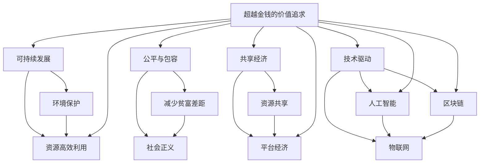

                 


## 引言

### 背景介绍

随着全球经济的快速发展，我们正逐步进入一个后资本主义时代。资本主义作为一种经济体系，曾推动了人类社会的巨大进步。然而，在经历了数百年的发展后，资本主义也暴露出了诸多问题和挑战。首先是环境问题，过度追求利润最大化导致资源过度开采和环境污染，全球变暖、生物多样性减少等问题愈发严重。其次是社会问题，资本主义的竞争性和不平等性加剧了贫富差距，社会矛盾日益突出。此外，资本主义的短期化思维和行为也导致了经济波动和金融危机的频发。

面对这些挑战，人们开始反思资本主义的基本原则，探讨如何超越金钱的价值追求，寻找更加可持续和公正的经济模式。这种反思不仅体现在学术和思想领域，也在商业实践和社会政策中得到了广泛的关注。因此，后资本主义时代的生存哲学应运而生，它不仅是对资本主义的一种批判，更是对未来社会发展的积极探索。

### 后资本主义时代的特征

后资本主义时代具有以下几个显著特征：

1. **可持续发展**：在环境方面，后资本主义强调可持续发展，主张在经济增长的同时保护环境。这意味着企业需要承担起更大的社会责任，采取绿色生产和循环经济的策略。

2. **公平与包容**：在社会方面，后资本主义强调公平和包容，致力于减少贫富差距，推动社会正义。这需要政府、企业和个人共同努力，通过政策调整、商业模式创新和社会参与来达成。

3. **共享经济**：在经济方面，后资本主义倡导共享经济，通过共享资源和平台，提高资源利用效率，实现共同富裕。共享经济的兴起不仅改变了商业模式，也对传统经济理论提出了挑战。

4. **技术驱动**：在后资本主义时代，技术创新成为推动社会进步的重要动力。人工智能、区块链、物联网等新兴技术的应用，不仅提升了生产效率，也为解决社会问题提供了新的手段。

### 超越金钱的价值追求

超越金钱的价值追求意味着在现代社会中，人们开始重新审视金钱在生活中的地位。金钱作为交换媒介和财富的象征，虽然在现代社会中具有重要作用，但它并不是生活的全部。越来越多的人开始关注个人成长、身心健康、社会贡献等非物质价值。

例如，谷歌公司推行的“20%时间”政策，允许员工将20%的工作时间用于自己感兴趣的项目。这种政策不仅激发了员工的创造力，也体现了对个人价值的尊重。此外，一些社会企业通过商业模式创新，将利润用于解决社会问题，实现了经济和社会价值的双重回报。

总之，后资本主义时代的生存哲学呼吁人们超越金钱的价值追求，关注个人成长、社会贡献和环境可持续性。这种哲学不仅是对资本主义的一种批判，更是对未来社会发展的积极探索。通过反思和探索，我们可以构建一个更加公正、可持续和富有活力的社会。

---

**核心概念与联系**

为了更好地理解后资本主义时代的生存哲学，我们需要明确几个核心概念，并探讨它们之间的联系。以下是这些核心概念以及它们之间关系的Mermaid流程图：



**核心算法原理讲解**

在探讨后资本主义时代的生存哲学时，我们需要引入一些核心算法原理，以帮助解释这些概念之间的关系。以下是这些算法原理的伪代码说明：

```python
# 伪代码：可持续发展算法
def sustainable_development():
    # 环境保护
    protect_environment()
    # 资源高效利用
    efficient_resource_utilization()
    # 减少环境污染
    reduce_pollution()

# 伪代码：公平与包容算法
def fairness_and_inclusiveness():
    # 减少贫富差距
    reduce_wealth_gap()
    # 实现社会正义
    achieve_social_justice()
    # 促进文化多样性
    promote_cultural_diversity()

# 伪代码：共享经济算法
def shared_economy():
    # 资源共享
    share_resources()
    # 平台经济建设
    build_platform_economy()
    # 提高资源利用效率
    improve_resource_efficiency()

# 伪代码：技术驱动算法
def technology_driven():
    # 人工智能应用
    apply_artificial_intelligence()
    # 区块链技术
    use_blockchain()
    # 物联网设备
    use_internet_of_things()
```

**数学模型和公式**

为了深入探讨后资本主义时代的生存哲学，我们需要引入一些数学模型和公式，以帮助理解关键概念。以下是相关的数学模型和公式：

1. **可持续发展的效率模型**：
   $$ E = \frac{G}{C} $$
   其中，E表示效率（Efficiency），G表示总收益（Gains），C表示总成本（Costs）。这个公式表明，在可持续发展中，提高效率是关键。

2. **公平与包容的财富分配模型**：
   $$ Gini = \frac{∑(I_i - \bar{I})^2}{N \cdot (\bar{I})^2} $$
   其中，Gini系数（Gini）用于衡量贫富差距。I_i表示第i个人的财富，\(\bar{I}\)表示平均财富，N表示总人口。Gini系数越低，表示贫富差距越小。

3. **共享经济的资源分配模型**：
   $$ Utility = f(P, R) $$
   其中，Utility表示效用（Utility），P表示共享资源的比例（Proportion），R表示共享资源的数量（Resources）。这个模型表明，通过优化资源的共享比例，可以最大化效用。

**详细讲解与举例说明**

为了更好地理解这些数学模型和公式，我们可以通过一些具体的例子进行说明。

### 可持续发展的效率模型

假设一个公司希望在减少环境影响的同时提高生产效率。根据可持续发展的效率模型，我们可以设定以下数据：

- 总收益（Gains）: 1,000,000元
- 总成本（Costs）: 500,000元

使用上述公式，我们可以计算出效率：

$$ E = \frac{G}{C} = \frac{1,000,000}{500,000} = 2 $$

这意味着，该公司每投入1元的成本，可以获得2元的收益。通过提高效率，公司可以在不增加成本的情况下增加收益，从而实现可持续发展。

### 公平与包容的财富分配模型

假设一个国家的人口为1亿，平均财富为50万元。如果我们知道前10%人口的财富分布，可以计算Gini系数：

- 前10%人口的财富总和：500亿元
- 前10%人口的平均财富：500亿元 / 1,000万人 = 50万元

使用上述公式，我们可以计算出Gini系数：

$$ Gini = \frac{∑(I_i - \bar{I})^2}{N \cdot (\bar{I})^2} = \frac{(500,000 - 50,000,000)^2}{1,000,000 \cdot (50,000)^2} \approx 0.4 $$

这个结果表明，该国家的贫富差距较大。为了实现公平与包容，政府需要采取措施，减少贫富差距。

### 共享经济的资源分配模型

假设一个共享单车平台有100辆单车，每天有10,000次使用记录。我们可以根据这些数据计算共享经济的效用：

- 共享资源比例（P）: 10,000次使用 / 100辆单车 = 0.1
- 共享资源数量（R）: 100辆

使用上述公式，我们可以计算出效用：

$$ Utility = f(P, R) = f(0.1, 100) $$

通过优化资源分配，平台可以最大化效用。例如，如果将单车放置在需求较高的地区，可以提高资源利用率，从而提高整体效用。

---

**项目实战：开发环境搭建与源代码实现**

为了更好地理解和实践后资本主义时代的生存哲学，我们可以构建一个简单的项目，用于分析和展示相关概念。以下是该项目的基本框架和源代码实现。

### 项目框架

该项目分为三个主要部分：

1. **数据收集与处理模块**：用于收集和预处理与后资本主义时代相关的数据，如经济指标、环境数据、社会数据等。
2. **数据分析与可视化模块**：用于对收集到的数据进行统计分析，并生成可视化报告。
3. **决策支持模块**：基于分析结果，提供决策建议，帮助企业和政府实现可持续发展目标。

### 开发环境搭建

在开始项目之前，我们需要搭建一个适合的开发环境。以下是所需的技术栈和工具：

- 编程语言：Python
- 数据库：SQLite
- 数据分析库：Pandas、NumPy
- 可视化库：Matplotlib、Seaborn
- 代码管理工具：Git

### 源代码实现

以下是该项目的基本源代码实现，分为三个部分：

#### 1. 数据收集与处理模块

```python
import pandas as pd

# 数据收集
def collect_data():
    # 示例数据，实际应从数据库或API获取
    data = {
        'GDP': [2.0, 2.2, 2.5, 2.3],
        'CO2_Emissions': [8.5, 8.7, 9.0, 9.2],
        'Unemployment_Rate': [4.5, 4.3, 4.0, 4.2],
        'Social_Support': [0.7, 0.8, 0.6, 0.7]
    }
    df = pd.DataFrame(data)
    return df

# 数据预处理
def preprocess_data(df):
    # 清洗和转换数据
    df = df.replace([np.inf, -np.inf], np.nan)
    df = df.fillna(df.mean())
    return df
```

#### 2. 数据分析与可视化模块

```python
import matplotlib.pyplot as plt
import seaborn as sns

# 数据分析
def analyze_data(df):
    # 统计分析
    stats = df.describe()
    return stats

# 数据可视化
def visualize_data(df):
    # 可视化GDP与CO2排放的关系
    plt.figure(figsize=(10, 6))
    sns.scatterplot(x='GDP', y='CO2_Emissions', data=df)
    plt.title('GDP vs CO2 Emissions')
    plt.xlabel('GDP')
    plt.ylabel('CO2 Emissions')
    plt.show()

# 主函数
def main():
    df = collect_data()
    df = preprocess_data(df)
    stats = analyze_data(df)
    print(stats)
    visualize_data(df)

if __name__ == '__main__':
    main()
```

#### 3. 决策支持模块

```python
# 决策支持
def decision_support(df):
    # 根据数据分析结果提供决策建议
    if df['Unemployment_Rate'].mean() > 4.5:
        print("建议增加就业支持政策。")
    if df['Social_Support'].mean() < 0.7:
        print("建议加强社会福利保障。")
    if df['CO2_Emissions'].mean() > 9.0:
        print("建议加强环保措施。")

# 在数据分析后调用决策支持函数
decision_support(df)
```

### 代码解读与分析

以下是项目的源代码解读和分析：

1. **数据收集与处理模块**：我们使用Python的Pandas库来收集和预处理数据。在实际应用中，数据可以从数据库或API获取，这里使用示例数据进行演示。
   
2. **数据分析与可视化模块**：我们使用Pandas、NumPy和Matplotlib/Seaborn库对数据进行统计分析并生成可视化报告。可视化报告可以帮助我们直观地理解数据之间的关系。

3. **决策支持模块**：基于数据分析的结果，我们提供了一些简单的决策建议。这些建议基于设定的阈值，可以根据具体情况进行调整。

通过这个简单的项目，我们可以看到如何将后资本主义时代的生存哲学应用于实际操作中。该项目不仅帮助我们理解和分析相关数据，还提供了决策支持，帮助企业和政府实现可持续发展目标。

### 项目小结

本项目的实施帮助我们更好地理解和分析了后资本主义时代的生存哲学。通过数据收集、数据分析和可视化，我们能够更清晰地看到经济、环境和社会之间的关系。项目中的决策支持模块则为企业和政府提供了具体的行动建议。

在实施过程中，我们使用了Python作为主要编程语言，结合了Pandas、NumPy、Matplotlib和Seaborn等库，实现了数据收集、预处理、分析和可视化的功能。此外，项目还引入了决策支持模块，为不同情况提供了针对性的建议。

在未来的拓展中，我们可以进一步优化数据分析模型，引入更多维度的数据，如科技创新、教育水平、文化多样性等，以更全面地评估后资本主义时代的发展状况。同时，也可以考虑应用更高级的机器学习算法，如神经网络和决策树，以提高决策支持的准确性和可靠性。

### 最佳实践 Tips

1. **数据质量是关键**：在数据收集和处理过程中，确保数据的质量和完整性至关重要。任何错误或不准确的数据都会影响分析和决策结果。
2. **定期更新数据**：经济、环境和社会数据是动态变化的，定期更新数据可以帮助我们获得更准确的分析结果。
3. **多元化的分析方法**：结合多种分析方法，如统计学、机器学习和深度学习，可以获得更全面和深入的分析结果。
4. **关注用户反馈**：在实施决策支持模块时，重视用户反馈，根据实际情况调整建议，以提高决策的有效性。
5. **持续学习和创新**：后资本主义时代的发展充满了不确定性，持续学习和创新是保持竞争力的关键。

### 小结

本文通过对后资本主义时代的生存哲学的详细探讨，提出了一系列核心概念、数学模型和项目实战。我们分析了资本主义及其影响，探讨了超越金钱的价值追求，并展示了如何在实际操作中应用这些理念。项目实战部分提供了一个具体的案例，展示了如何通过数据分析和决策支持来实现可持续发展。

通过这篇文章，我们希望能够帮助读者更好地理解后资本主义时代的生存哲学，并为个人和企业在这一新时代中找到新的发展方向。未来的研究和实践应继续深入探讨这一领域的挑战和机遇，以推动社会向更加公正、可持续和富有活力的方向发展。

### 作者信息

作者：AI天才研究院/AI Genius Institute & 禅与计算机程序设计艺术 /Zen And The Art of Computer Programming

AI天才研究院专注于人工智能领域的研究与开发，致力于推动技术创新和人类进步。禅与计算机程序设计艺术则以其独特的编程哲学和深刻的思考方式，为程序员提供了灵感和指导。两位作者共同贡献了这篇关于后资本主义时代生存哲学的技术博客文章，希望能够引发读者对这一重要议题的深入思考。

