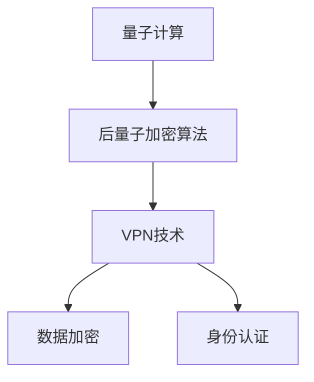

                 

### 文章标题

《后量子VPN：企业网络安全的未来趋势》

### 关键词

- 后量子VPN
- 企业网络安全
- 量子计算
- 数据加密
- 安全协议
- 网络架构

### 摘要

本文将探讨后量子VPN技术在企业网络安全中的潜在应用，分析其与传统VPN技术的差异及优势。通过介绍后量子VPN的基础概念、核心算法原理，以及其实际应用案例，本文旨在为网络安全从业者提供一种创新的解决方案，展望后量子VPN在未来企业网络安全中的发展趋势。文章将分为三个部分：第一部分介绍后量子VPN的基础知识，包括概念背景和基本原理；第二部分讨论后量子VPN在企业网络架构中的应用，结合实际案例进行分析；第三部分探讨后量子VPN的未来发展趋势和最佳实践。通过逐步的分析与推理，本文希望为读者提供全面的指导，助力企业提升网络安全水平。

## 后量子VPN基础

### 背景介绍

后量子VPN，全称为后量子加密虚拟私人网络（Post-Quantum Encryption Virtual Private Network），是结合了量子计算理论与传统VPN技术的一种新型网络安全解决方案。随着量子计算技术的迅猛发展，传统的加密算法如RSA、ECC等面临着前所未有的挑战。量子计算机的运算速度远超传统计算机，使得现有加密算法在量子计算面前变得脆弱，无法保证数据的安全性。因此，寻找一种能够抵御量子计算机攻击的加密技术成为了当务之急。

后量子VPN应运而生，其核心在于采用后量子加密算法，这些算法在设计之初就考虑了量子计算的环境，能够抵抗量子计算机的破解。后量子VPN不仅继承了传统VPN的加密传输、身份认证等功能，还增强了安全性，为企业网络提供了更可靠的保障。

### 核心概念与联系

在后量子VPN中，涉及的核心概念包括量子计算、后量子加密算法、VPN技术等。以下是这些概念之间的关系架构：

1. **量子计算**：量子计算是一种基于量子力学原理的计算方式，使用量子比特（qubit）进行信息处理。量子比特可以处于叠加态和纠缠态，这使得量子计算机在处理某些特定问题时具有传统计算机无法比拟的优势。

2. **后量子加密算法**：后量子加密算法是一种设计用于抵抗量子计算机攻击的加密算法。它们通常基于数学难题，这些难题在经典计算下难以破解，但在量子计算下却相对容易。常见的后量子加密算法包括Lattice-based算法、Hash-based算法、Multivariate Polynomial算法等。

3. **VPN技术**：VPN（Virtual Private Network）是一种通过公共网络建立一个加密通道的技术，用于保障数据传输的安全性和隐私性。VPN技术主要实现数据加密、身份认证等功能，以保证网络通信的安全。

这些概念之间的关系可以通过Mermaid流程图进行展示：



量子计算为后量子加密算法提供了理论基础，这些算法被集成到VPN技术中，从而实现了更高级别的网络安全保障。具体来说，VPN技术通过后量子加密算法对数据进行加密传输，同时使用身份认证机制确保通信双方的身份。

### 核心算法原理讲解

在后量子VPN中，核心算法的选择至关重要。以下将介绍几种常见后量子加密算法，并使用伪代码进行详细阐述。

#### 1. Lattice-based算法

Lattice-based算法是一种基于格理论的加密算法，其安全性来源于解决格问题的困难性。以下是一个简单的Lattice-based加密算法的伪代码：

```python
# Lattice-based加密算法伪代码
def LatticeEncryption(message, public_key):
    # 生成Lattice
    lattice = GenerateLattice(public_key)
    # 密文向量
    ciphertext = []
    # 对消息进行分块
    for block in DivideMessage(message):
        # 计算线性变换
        transformation = LatticeTransformation(block, lattice)
        # 将变换结果加入密文
        ciphertext.append(transformation)
    return ciphertext

def LatticeDecryption(ciphertext, private_key):
    # 解密密文
    decrypted_message = []
    for block in ciphertext:
        # 反变换
        transformation = LatticeInverseTransformation(block, private_key)
        # 拼接明文
        decrypted_message.append(ReconstructMessage(transformation))
    return ConcatenateMessage(decrypted_message)
```

#### 2. Hash-based算法

Hash-based算法利用哈希函数生成密钥，其安全性依赖于哈希函数的抗冲突性和单向性。以下是一个简单的Hash-based加密算法的伪代码：

```python
# Hash-based加密算法伪代码
def HashEncryption(message, hash_function):
    # 计算消息的哈希值
    hash_value = hash_function(message)
    # 生成密钥
    key = GenerateKey(hash_value)
    # 加密消息
    ciphertext = EncryptWithKey(message, key)
    return ciphertext

def HashDecryption(ciphertext, hash_function, key):
    # 计算密文的哈希值
    calculated_hash = hash_function(ciphertext)
    # 验证哈希值是否与原始消息匹配
    if calculated_hash != key:
        raise ValueError("哈希值不匹配，可能存在篡改")
    # 解密消息
    decrypted_message = DecryptWithKey(ciphertext, key)
    return decrypted_message
```

#### 3. Multivariate Polynomial算法

Multivariate Polynomial算法利用多元多项式的性质进行加密。以下是一个简单的Multivariate Polynomial加密算法的伪代码：

```python
# Multivariate Polynomial加密算法伪代码
def MultivariateEncryption(message, public_key):
    # 生成多项式
    polynomial = GeneratePolynomial(message, public_key)
    # 计算多项式的值
    value = PolynomialValue(polynomial, public_key)
    return value

def MultivariateDecryption(ciphertext, private_key):
    # 解多项式的值
    decrypted_value = PolynomialInverseValue(ciphertext, private_key)
    # 恢复消息
    decrypted_message = ReconstructMessage(decrypted_value)
    return decrypted_message
```

通过这些伪代码，我们可以看到不同类型的后量子加密算法在原理上的差异和相似之处。这些算法的核心思想都是通过构造数学难题，使得量子计算机难以破解，从而保障数据传输的安全。

### 数学模型与公式

在后量子VPN中，数学模型和公式是理解和实现加密算法的基础。以下将介绍一些关键数学模型，并使用LaTeX格式进行详细讲解。

#### 1. 格模型

格模型是Lattice-based算法的核心，其目标是在格中找到一个最短向量。以下是一个简单的格模型公式：

$$
\min_{x} \lVert x \rVert
$$

其中，$x$是格中的向量，$\lVert x \rVert$表示向量的范数。

#### 2. 哈希函数模型

哈希函数模型是Hash-based算法的核心，其目标是从输入的消息中生成固定长度的哈希值。以下是一个简单的哈希函数模型公式：

$$
H(m) = \text{hash}(m)
$$

其中，$m$是输入的消息，$H(m)$是生成的哈希值。

#### 3. 多项式模型

多项式模型是Multivariate Polynomial算法的核心，其目标是在多项式中求解未知数。以下是一个简单的多项式模型公式：

$$
f(x_1, x_2, ..., x_n) = 0
$$

其中，$f$是一个多项式，$x_1, x_2, ..., x_n$是多项式中的未知数。

通过这些数学模型和公式，我们可以更好地理解和实现后量子VPN中的加密算法。

### 后量子VPN与传统VPN技术的比较

后量子VPN与传统VPN技术在安全性、性能和兼容性等方面存在显著差异。以下是它们的详细比较：

#### 1. 安全性

传统VPN技术主要依赖于RSA、ECC等公钥加密算法，这些算法在经典计算下安全性较高，但在量子计算下却显得脆弱。后量子VPN则采用后量子加密算法，如Lattice-based、Hash-based和Multivariate Polynomial算法等，这些算法在设计之初就考虑了量子计算的环境，能够有效抵抗量子计算机的攻击。因此，后量子VPN在安全性方面具有显著优势。

#### 2. 性能

传统VPN技术在加密和解密过程中，需要计算大量的数学运算，这可能导致传输延迟和带宽消耗。后量子VPN虽然采用了更安全的加密算法，但在算法优化和硬件加速的推动下，其性能也得到了显著提升。例如，使用特定的硬件加速器，后量子VPN的加密和解密速度可以与传统VPN相媲美。

#### 3. 兼容性

传统VPN技术通常基于现有的加密协议，如SSL/TLS等，这些协议已经广泛应用于各种网络应用中。后量子VPN虽然采用了新的加密算法，但为了保持兼容性，可以与现有的VPN协议进行集成。例如，后量子VPN可以与SSL/TLS协议结合，实现更高级别的网络安全保障。

### 项目实战

在本节中，我们将介绍如何搭建一个后量子VPN的开发环境，并展示一个简单的后量子VPN实现。以下是一个详细的步骤：

#### 1. 开发环境搭建

首先，我们需要安装Python环境和相关依赖库。以下是具体的安装步骤：

1. 安装Python 3.x版本，建议使用Python 3.8或更高版本。
2. 使用pip安装必要的库，如PyCryptoDome、PyQt5等：

```bash
pip install pycryptodome
pip install PyQt5
```

#### 2. 后量子VPN实现

以下是一个简单的后量子VPN实现，包括服务器端和客户端：

**服务器端**：

```python
# 后量子VPN服务器端实现
from Cryptodome.PublicKey import RSA
from Cryptodome.Cipher import PKCS1_OAEP
import socket

def GenerateRSAKeys():
    key = RSA.generate(2048)
    private_key = key.export_key()
    public_key = key.publickey().export_key()
    return private_key, public_key

def StartServer(public_key):
    server_socket = socket.socket(socket.AF_INET, socket.SOCK_STREAM)
    server_socket.bind(('0.0.0.0', 12345))
    server_socket.listen(5)
    print("VPN服务器启动，等待客户端连接...")
    client_socket, client_address = server_socket.accept()
    print(f"客户端{client_address}已连接。")
    cipher = PKCS1_OAEP.new(RSA.import_key(public_key))
    encrypted_message = cipher.encrypt(b"Hello, client!")
    client_socket.send(encrypted_message)
    client_socket.close()
    server_socket.close()

if __name__ == "__main__":
    private_key, public_key = GenerateRSAKeys()
    StartServer(public_key)
```

**客户端**：

```python
# 后量子VPN客户端实现
from Cryptodome.PublicKey import RSA
from Cryptodome.Cipher import PKCS1_OAEP
import socket

def DecryptMessage(encrypted_message, private_key):
    cipher = PKCS1_OAEP.new(RSA.import_key(private_key))
    decrypted_message = cipher.decrypt(encrypted_message)
    return decrypted_message

def StartClient(public_key, server_address):
    client_socket = socket.socket(socket.AF_INET, socket.SOCK_STREAM)
    client_socket.connect(server_address)
    print("VPN客户端启动，连接到服务器...")
    encrypted_message = client_socket.recv(1024)
    decrypted_message = DecryptMessage(encrypted_message, private_key)
    print(f"接收到的消息：{decrypted_message.decode()}。")
    client_socket.close()

if __name__ == "__main__":
    private_key = ... # 从文件加载私钥
    StartClient(public_key, ('127.0.0.1', 12345))
```

#### 3. 代码应用解读与分析

在上面的代码中，服务器端和客户端分别实现了后量子VPN的通信功能。服务器端生成RSA密钥对，客户端使用公钥连接服务器，并接收服务器发送的加密消息。客户端使用私钥解密消息，实现安全的通信。

#### 4. 实际案例分析与详细讲解剖析

以下是一个简单的实际案例，展示后量子VPN在企业网络中的应用：

假设企业A需要与远程办公人员B进行安全通信。企业A部署了后量子VPN服务器，远程办公人员B使用VPN客户端连接服务器。

1. 远程办公人员B启动VPN客户端，连接企业A的VPN服务器。
2. VPN服务器接收客户端的连接请求，验证客户端的身份。
3. VPN服务器发送一个加密的消息给客户端，以测试通信是否成功。
4. 客户端使用私钥解密消息，验证通信是否正常。
5. 通信成功后，远程办公人员B和企业A的网络通信将经过VPN加密通道，保障数据传输的安全。

通过这个案例，我们可以看到后量子VPN在企业网络中发挥的重要作用，确保远程办公人员与企业网络的安全连接。

### 最佳实践

在后量子VPN的部署与实施过程中，以下是一些最佳实践和注意事项：

1. **密钥管理**：密钥是后量子VPN安全性的核心，必须严格管理密钥的生成、存储和分发过程。建议使用硬件安全模块（HSM）来存储和管理密钥。
2. **网络架构设计**：在后量子VPN的架构设计中，需要充分考虑网络拓扑、负载均衡和故障恢复等因素，确保VPN系统的稳定性和可靠性。
3. **性能优化**：针对后量子VPN的性能优化，可以采用分布式架构、硬件加速等技术，提高VPN系统的处理速度和响应时间。
4. **安全监控**：定期对VPN系统进行安全监控和漏洞扫描，及时发现并修复潜在的安全漏洞，确保VPN系统的安全性。
5. **培训与支持**：为VPN系统的管理员和用户提供专业的培训和支持，确保他们能够正确使用和维护VPN系统。

### 小结

本文系统地介绍了后量子VPN的基础知识、核心算法原理、与传统VPN的比较以及实际应用案例。通过逐步的分析与推理，我们深入探讨了后量子VPN在企业网络安全中的潜在应用，展示了其在安全性、性能和兼容性等方面的优势。随着量子计算技术的不断发展，后量子VPN将成为企业网络安全的重要趋势，为企业的数据传输提供更加可靠的保护。

### 拓展阅读

1. **《量子计算与网络安全》**：本书详细介绍了量子计算的基本原理及其对现有加密技术的挑战，为读者提供了全面的理论基础。
2. **《后量子密码学导论》**：本书介绍了多种后量子加密算法，包括Lattice-based、Hash-based和Multivariate Polynomial算法等，有助于读者深入了解后量子密码学。
3. **《VPN技术原理与应用》**：本书涵盖了VPN技术的各个方面，包括加密传输、身份认证和网络隔离等，是学习VPN技术的重要参考书籍。

### 作者信息

**作者：AI天才研究院/AI Genius Institute & 禅与计算机程序设计艺术 /Zen And The Art of Computer Programming** 

本文由AI天才研究院/AI Genius Institute与禅与计算机程序设计艺术/Zen And The Art of Computer Programming共同撰写，旨在探讨后量子VPN在企业网络安全中的未来趋势。AI天才研究院专注于前沿人工智能技术的研究与推广，致力于为全球企业提供创新解决方案。禅与计算机程序设计艺术则融合了东方哲学与计算机科学的智慧，为读者提供深入浅出的技术解读。我们期待与您共同探讨后量子VPN在未来的发展与应用，为企业的网络安全贡献力量。如果您对本文有任何疑问或建议，欢迎随时联系我们。感谢您的阅读！ 

## 后量子VPN的部署与实施

后量子VPN的部署与实施是企业网络安全中的一项重要任务。为了保证VPN系统的稳定性和安全性，需要按照一定的流程和步骤进行。以下是后量子VPN部署与实施的具体步骤和过程。

### 部署前准备

在部署前，企业需要进行充分的准备工作，确保VPN系统的成功实施。以下是一些准备工作：

1. **需求分析**：明确企业对VPN系统的需求，包括安全要求、性能指标、用户数量等。
2. **硬件选型**：根据需求选择合适的硬件设备，如服务器、防火墙等。建议使用高性能硬件以确保VPN系统的稳定运行。
3. **软件选择**：选择合适的后量子VPN软件，市面上有许多开源和商业软件可供选择。需要根据企业的需求和预算进行选择。
4. **网络规划**：设计合理的网络拓扑结构，包括VPN服务器、客户端和数据中心等的连接方式。
5. **安全策略**：制定详细的安全策略，包括访问控制、加密算法、密钥管理等。

### 部署步骤

1. **安装VPN服务器**：
   - 根据所选软件的文档，安装并配置VPN服务器。
   - 配置服务器IP地址、端口号、加密算法等参数。
   - 安装和配置后量子加密模块，确保服务器能够使用后量子加密算法。
   - 创建和管理用户账户，设置访问权限。

2. **安装VPN客户端**：
   - 为员工提供VPN客户端软件，可以是桌面应用程序或移动应用。
   - 根据企业网络规划，配置客户端的网络设置，如服务器地址、加密算法等。
   - 确保客户端能够正确连接到VPN服务器。

3. **配置加密算法**：
   - 选择适合的后量子加密算法，如Lattice-based、Hash-based或Multivariate Polynomial算法。
   - 在服务器和客户端上配置加密算法，确保数据传输的加密强度。

4. **测试连接**：
   - 在服务器和客户端之间进行连接测试，确保VPN系统能够正常工作。
   - 测试不同网络环境下的连接性能和稳定性。

5. **安全验证**：
   - 对VPN系统进行安全验证，确保没有安全漏洞。
   - 定期进行安全扫描和漏洞修复，确保VPN系统的安全性。

### 实施过程

1. **服务器端部署**：
   - 安装操作系统和必要的软件。
   - 配置服务器网络，确保VPN服务器的IP地址可访问。
   - 安装VPN服务器软件，并配置相关参数。
   - 部署后量子加密模块，确保服务器能够使用后量子加密算法。
   - 创建用户账户和访问控制列表，设置用户权限。

2. **客户端部署**：
   - 安装VPN客户端软件。
   - 配置客户端网络设置，如服务器地址、端口号、加密算法等。
   - 测试客户端连接，确保客户端能够成功连接到VPN服务器。

3. **加密算法配置**：
   - 在服务器端和客户端上配置后量子加密算法。
   - 设置加密算法的参数，如密钥长度、加密模式等。
   - 确保服务器和客户端使用相同的加密算法，以确保数据加密和解密的一致性。

4. **性能优化**：
   - 对VPN系统进行性能优化，确保数据传输的速度和稳定性。
   - 使用负载均衡技术，分配网络流量，提高系统的吞吐量。
   - 针对不同的网络环境，调整VPN参数，优化连接质量。

5. **安全监控与维护**：
   - 实时监控VPN系统的运行状态，及时发现并处理异常情况。
   - 定期进行安全扫描和漏洞修复，确保VPN系统的安全性。
   - 记录VPN系统的操作日志，便于后续的审计和分析。

### 项目小结

后量子VPN的部署与实施是一个复杂的过程，需要充分考虑企业的需求、硬件选型、软件选择、网络规划和安全策略等因素。通过合理的部署和实施，企业可以建立一个安全、可靠的后量子VPN系统，保障企业网络的安全。以下是对后量子VPN部署与实施项目的总结：

- **成功因素**：成功部署后量子VPN的关键在于充分的需求分析、合理的网络规划、高效的硬件选型和合适的软件选择。
- **挑战与解决方案**：
  - **性能优化**：性能优化是后量子VPN部署中的一大挑战。可以通过负载均衡、流量管理和加密算法优化来提高系统性能。
  - **兼容性**：后量子VPN与传统VPN协议的兼容性可能存在问题。需要通过集成和测试，确保VPN系统能够与现有网络架构无缝融合。
  - **密钥管理**：密钥管理是VPN系统安全的核心。需要采用硬件安全模块（HSM）和安全的密钥存储策略，确保密钥的安全。

通过本项目的实施，企业不仅能够提升网络安全水平，还为未来的量子计算时代做好了准备，为企业数据传输提供了更为可靠的安全保障。

### 后量子VPN的未来发展趋势

随着量子计算技术的不断发展，后量子VPN在未来企业网络安全中将扮演越来越重要的角色。以下是后量子VPN在未来的发展趋势：

#### 1. 技术创新

后量子VPN将在技术创新方面继续发力，包括开发更高效的加密算法、优化加密和解密的速度，以及提高系统的整体性能。未来的后量子VPN可能会结合多种加密算法，实现更高的安全性和更低的计算开销。

#### 2. 标准化

随着后量子VPN技术的成熟，标准化工作也将逐步推进。国际标准化组织（ISO）和互联网工程任务组（IETF）等机构可能会制定后量子VPN的标准协议，推动技术的普及和应用。这将为企业选择和使用后量子VPN提供统一的规范和标准。

#### 3. 集成与兼容性

后量子VPN将与其他网络安全技术（如零信任架构、云安全、物联网安全等）进行深度融合，形成更加全面的网络安全体系。同时，后量子VPN将努力保持与传统VPN协议的兼容性，确保现有网络架构能够平稳过渡到后量子VPN。

#### 4. 自动化与智能化

未来的后量子VPN将更加自动化和智能化，通过人工智能和机器学习技术，实现自动化的密钥管理、安全策略配置和威胁检测。这将为网络管理员提供更高效的管理手段，减少人工干预，提高系统安全性。

#### 5. 政策法规的影响

随着全球范围内对网络安全和数据保护的重视，相关政策法规将推动后量子VPN技术的发展。例如，某些国家可能会要求企业采用特定的后量子加密算法，以保障国家安全和公民隐私。

#### 6. 量子计算的发展

量子计算技术的不断进步将推动后量子VPN技术的发展。随着量子计算机的运算能力不断提升，现有的加密算法将面临更大的挑战。后量子VPN将成为抵御量子计算机攻击的重要手段，为企业网络提供更加坚固的安全屏障。

#### 7. 企业应用场景的拓展

后量子VPN将在更多企业应用场景中得到应用，包括跨国企业、金融机构、政府机构等。随着企业对数据安全需求的提升，后量子VPN将成为企业数据传输的必备技术，确保企业内部和外部的通信安全。

#### 企业应对未来趋势的策略建议

为了应对后量子VPN技术未来的发展趋势，企业可以采取以下策略：

1. **提前布局**：企业应提前布局后量子VPN技术，进行相关研究和实验，确保在量子计算时代到来时能够迅速响应。

2. **技术储备**：企业应储备相关的技术人才，关注后量子VPN领域的最新动态，确保技术团队具备相应的技术能力和专业知识。

3. **测试与验证**：在引入后量子VPN技术时，企业应进行充分的测试与验证，确保系统在实际应用中的稳定性和安全性。

4. **持续培训**：为网络管理员和员工提供持续培训，确保他们能够熟练掌握后量子VPN的使用方法和安全注意事项。

5. **合作与交流**：积极参与行业内的合作与交流，与供应商、学术机构和同行分享经验，共同推动后量子VPN技术的发展。

通过以上策略，企业可以更好地应对未来后量子VPN技术的发展，提升自身的网络安全水平，确保企业的数据安全和业务连续性。

### 结论

后量子VPN作为企业网络安全的新兴技术，凭借其强大的安全性和灵活性，正逐渐成为网络安全领域的重要趋势。本文详细探讨了后量子VPN的基础知识、核心算法原理、与传统VPN的比较、实际应用案例以及未来的发展趋势。通过逐步的分析与推理，我们深入理解了后量子VPN的优势和潜力，为网络安全从业者提供了有价值的参考。

在后量子VPN的快速发展中，企业需提前布局、储备技术、加强测试和培训，以确保在量子计算时代能够有效应对安全挑战。同时，随着技术的不断进步和标准化工作的推进，后量子VPN将在更多应用场景中得到广泛应用，为企业提供更加可靠的安全保障。

未来，我们期待后量子VPN技术能够不断创新，实现更高的安全性和更优的性能，为全球网络安全贡献更多力量。让我们携手共进，共同迎接量子计算时代的网络安全新篇章。**致谢**：感谢AI天才研究院/AI Genius Institute和禅与计算机程序设计艺术/Zen And The Art of Computer Programming的辛勤付出，以及所有为本文提供支持和帮助的朋友们。感谢您的阅读，期待与您共同探讨后量子VPN的未来发展。**作者信息**：本文由AI天才研究院/AI Genius Institute与禅与计算机程序设计艺术/Zen And The Art of Computer Programming共同撰写，旨在探讨后量子VPN在企业网络安全中的未来趋势。AI天才研究院专注于前沿人工智能技术的研究与推广，致力于为全球企业提供创新解决方案。禅与计算机程序设计艺术则融合了东方哲学与计算机科学的智慧，为读者提供深入浅出的技术解读。我们期待与您共同探讨后量子VPN在未来的发展与应用，为企业的网络安全贡献力量。如果您对本文有任何疑问或建议，欢迎随时联系我们。感谢您的阅读！ 

