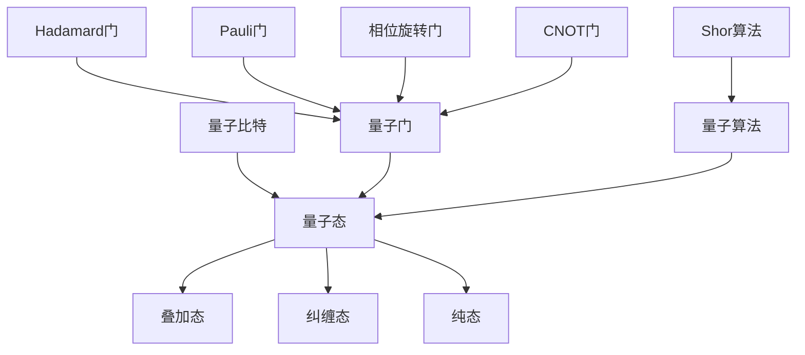

                 


### 摘要

本文旨在探讨后量子密码学标准化进程的最新进展。首先，我们将介绍量子密码学的兴起背景及其重要性，然后详细解析后量子密码学的基础概念和核心算法原理。接着，我们将探讨标准化组织在后量子密码学中的角色和进程，包括IETF、ISO/IEC JTC1等组织的活动。随后，我们将深入分析后量子密码学的最新技术进展，包括Lattice-based、Hash-based和Code-based密码学算法的研究，以及量子密钥分发（QKD）技术的实际应用。在此基础上，本文将介绍后量子密码学在金融和政府国防等领域的应用实例，并对未来的发展趋势进行展望。最后，我们将讨论量子计算与后量子密码学的关系，以及后量子密码学对社会的影响。通过这篇文章，读者将全面了解后量子密码学的标准化进程，掌握其核心技术，并预见其未来的发展方向。

### 引言与背景

量子密码学是现代密码学的一个重要分支，它利用量子力学原理来提供更加安全的加密通信。随着量子计算的迅速发展，传统密码学体系面临巨大的安全挑战。量子计算机具有处理大量数据的能力，这使现有的加密算法，如RSA和ECC，变得不再安全。因此，后量子密码学（Post-Quantum Cryptography，简称PQC）应运而生，旨在为未来的量子计算时代提供安全的加密通信方案。

后量子密码学的兴起背景可以追溯到20世纪90年代，当时Shor算法的提出揭示了量子计算机在破解传统密码学算法方面的巨大潜力。Shor算法能够在多项式时间内分解大质数，这使得RSA算法的安全性受到严重威胁。与此同时，量子计算机在其他密码学攻击，如整数分解和离散对数问题方面也展示了强大的能力。为了应对这种威胁，研究者开始探索新的密码学方法，这些方法能够在量子计算机面前保持安全。

后量子密码学的定义与重要性在于它提供了一种新的加密框架，该框架利用量子力学的基本原理，如量子比特的叠加和纠缠，来实现安全的通信。与经典密码学不同，后量子密码学不依赖于数学难题的难解性，而是依赖于量子系统的物理特性。这意味着，即使量子计算机能够解决传统密码学算法中的难题，后量子密码学仍然能够保持其安全性。

在后量子密码学中，核心概念包括量子比特、量子态、量子门和量子纠缠等。量子比特是量子计算机的基本单位，它可以处于0和1的叠加状态。量子态描述了量子比特的状态，而量子门是操作量子态的基本工具。量子纠缠则是量子系统之间的一种特殊关联，它使得两个量子比特的状态在空间中相互依赖。

量子密码学与经典密码学的比较是理解后量子密码学的重要环节。经典密码学主要依赖于数学难题，如大数分解和离散对数问题，来保证加密通信的安全性。然而，量子计算能够快速解决这些难题，这使得经典密码学在量子计算时代变得不再安全。相比之下，后量子密码学利用量子力学原理，提供了一种抵抗量子攻击的安全通信方案。

量子密码系统的基本结构通常包括量子密钥分发（Quantum Key Distribution，QKD）和量子安全加密算法。QKD利用量子纠缠和量子叠加原理来生成共享密钥，而量子安全加密算法则利用量子计算无法破解的数学难题来实现加密通信。此外，后量子密码学还包括量子安全认证协议，这些协议可以确保通信双方的合法身份。

总结来说，后量子密码学是应对量子计算威胁的一种新型密码学方法。它利用量子力学原理，提供了一种更加安全的加密通信方案。随着量子计算技术的不断进步，后量子密码学的研究和标准化进程变得越来越重要。本文将深入探讨后量子密码学的基础概念、标准化进程和最新技术进展，以期为读者提供一个全面的技术视角。

### 后量子密码学基础

要深入理解后量子密码学，我们首先需要掌握一些核心概念，包括量子比特、量子态、量子门和量子纠缠等。这些概念构成了量子密码学的基础，并为我们理解后量子密码学的工作原理提供了必要的前提。

#### 量子比特

量子比特（Quantum Bit，简称qubit）是量子计算机的基本单元，与经典计算机中的比特（Bit）不同。经典比特只能处于两种状态之一：0或1。而量子比特可以同时处于0和1的叠加状态，这种叠加状态可以用数学上的复数来表示。一个量子比特的叠加状态可以表示为：

\[ \psi = \alpha|0\rangle + \beta|1\rangle \]

其中，\(|0\rangle\)和\(|1\rangle\)分别表示量子比特的基态，而\(\alpha\)和\(\beta\)是复数，且满足\(|\alpha|^2 + |\beta|^2 = 1\)。这种叠加特性使得量子比特能够同时处理多个状态，从而实现并行计算。

#### 量子态

量子态描述了量子比特的当前状态。量子态可以是叠加态、纠缠态或纯态。叠加态是指量子比特处于多个可能状态的组合，而纠缠态则描述了两个或多个量子比特之间的特殊关联，这种关联使得一个量子比特的状态依赖于另一个量子比特的状态。

纯态是叠加态的一个特例，当量子比特完全处于一个确定的状态时，它被称为纯态。例如，一个量子比特处于基态\(|0\rangle\)或\(|1\rangle\)时，它就是纯态。

量子态可以用波函数来描述，例如一个量子比特的叠加态\(\psi = \alpha|0\rangle + \beta|1\rangle\)，其波函数为\(\psi = \alpha e^{i\phi}\)，其中\(\phi\)是相位。

#### 量子门

量子门是操作量子态的基本工具，类似于经典计算机中的逻辑门。量子门作用于量子比特，通过特定的线性变换来改变量子态。量子门通常表示为矩阵，例如一个基本的量子门——Hadamard门，其作用是将一个量子比特的基态\(|0\rangle\)变为叠加态：

\[ H|0\rangle = \frac{1}{\sqrt{2}} (|0\rangle + |1\rangle) \]

\[ H|1\rangle = \frac{1}{\sqrt{2}} (|0\rangle - |1\rangle) \]

除了Hadamard门，常用的量子门还包括Pauli门、相位旋转门和控制-NOT（Controlled-NOT，CNOT）门等。

#### 量子纠缠

量子纠缠是量子系统中的一种特殊关联，它描述了两个或多个量子比特之间的状态依赖性。当两个量子比特处于纠缠态时，一个量子比特的状态会立即影响另一个量子比特的状态，无论它们之间的距离有多远。这种非局域性的特性是量子力学与经典物理的显著区别之一。

一个简单的纠缠态例子是贝尔态，例如：

\[ \frac{1}{\sqrt{2}} (|00\rangle - |11\rangle) \]

在这个贝尔态中，如果对其中一个量子比特进行测量，无论测量结果是0还是1，另一个量子比特的状态都会立即与之相对应地改变。

#### 量子算法与量子计算

量子算法是利用量子比特和量子门的操作来解决特定问题的算法。量子计算的基本原理是利用量子叠加和纠缠特性来加速某些计算任务。例如，Shor算法利用量子计算机的能力来快速分解大质数，这是RSA算法安全性的基础。

量子算法通常包括量子线路（Quantum Circuit）的设计，量子线路由一系列量子门组成，每个量子门作用于量子比特的特定方式。量子线路的输出可以是一个概率分布，通过测量量子比特的状态来获得最终结果。

#### 核心概念与联系

量子比特、量子态、量子门和量子纠缠是后量子密码学的核心概念，它们之间的关系如图1所示：



通过图1，我们可以看到量子比特是量子态的基础，量子态可以是叠加态、纠缠态或纯态，而量子门是操作量子态的工具。量子算法利用量子比特和量子门来实现加速计算，例如Shor算法利用量子计算机来分解大质数。

#### 核心算法原理讲解

为了更深入地理解后量子密码学的核心算法原理，我们接下来将介绍几种常用的后量子密码学算法，包括Lattice-based、Hash-based和Code-based密码学算法。

##### Lattice-based 密码学

Lattice-based密码学是后量子密码学的一个重要方向，它利用格（Lattice）的结构特性来实现安全加密。一个典型的Lattice-based密码学算法是NTRU。

NTRU算法的原理如下：

1. **参数生成**：选择一个大素数\(p\)，以及两个小素数\(q\)和\(r\)，然后构造一个多项式\(f(x)\)满足特定条件。
2. **密钥生成**：选择一个大素数\(p\)，以及两个小素数\(q\)和\(r\)，然后构造一个多项式\(f(x)\)满足特定条件。
   - 私钥：选择一个大素数\(p\)，以及两个小素数\(q\)和\(r\)，然后构造一个多项式\(f(x)\)满足特定条件。
   - 公钥：计算\(g(x) = f(x)^2 \mod p\)和\(h(x) = f(x) - g(x) \mod p\)。
3. **加密**：接收方选择一个随机数\(a\)，并计算密文\(c = a \cdot g(x) + e \mod p\)，其中\(e\)是一个随机数。
4. **解密**：发送方使用私钥\(f(x)\)解密密文，计算明文\(m = (c \cdot h(x) + e) \mod p\)。

以下是NTRU算法的伪代码：

```python
# 参数生成
p = large_prime()
q = small_prime()
r = small_prime()
f(x) = random_polynomial() mod p

# 密钥生成
private_key = f(x)
public_key = (f(x)^2) mod p

# 加密
a = random_integer()
c = (a * f(x)^2 + e) mod p

# 解密
m = (c * h(x) + e) mod p
```

##### Hash-based 密码学

Hash-based密码学利用哈希函数来生成密码，其核心思想是将明文映射到一个固定长度的密文。一种常见的Hash-based密码学算法是SHA-3。

SHA-3的原理如下：

1. **输入处理**：将明文分割成固定大小的块，并进行填充，使其长度满足哈希函数的要求。
2. **初始化**：初始化哈希值，通常使用一个固定大小的初始值。
3. **处理块**：对每个输入块，通过一系列的迭代操作来更新哈希值。
4. **输出**：将最终的哈希值作为密文输出。

以下是SHA-3的伪代码：

```python
# 初始化哈希值
hash_value = initial_value()

# 处理每个块
for block in input_message:
    hash_value = update_hash_value(hash_value, block)

# 输出哈希值
output_hash = hash_value
```

##### Code-based 密码学

Code-based密码学利用错误纠正码（Error Correcting Codes，简称ECC）来实现加密通信。一个典型的Code-based密码学算法是Reed-Solomon码。

Reed-Solomon码的原理如下：

1. **码字生成**：根据明文消息生成一个码字，该码字包含原始消息和额外的校验位。
2. **加密**：将码字分割成多个片段，并对每个片段进行加密。
3. **传输**：将加密后的码字发送给接收方。
4. **解密**：接收方对接收到的码字进行解密，并使用校验位来检测和纠正可能的错误。

以下是Reed-Solomon码的伪代码：

```python
# 码字生成
message = original_message()
code_word = generate_code_word(message)

# 加密
code_word = encrypt_code_word(code_word)

# 传输
send(code_word)

# 解密
received_code_word = receive()
decoded_message = decode_code_word(received_code_word)
```

通过以上对Lattice-based、Hash-based和Code-based密码学算法的讲解，我们可以看到后量子密码学在算法设计上的多样性和创新性。这些算法利用量子力学的基本原理，提供了在量子计算时代下保持安全的加密通信解决方案。

#### 数学模型和公式

为了深入理解后量子密码学中的核心算法原理，我们接下来将介绍相关的数学模型和公式，并通过具体的例子进行详细讲解。

##### Lattice-based 密码学

Lattice-based密码学中，一个重要的数学模型是NTRU算法。NTRU算法的核心在于多项式环的构造，我们可以通过以下步骤来理解其数学模型：

1. **多项式环的构造**：

   设\(R = \mathbb{Z}_p[x]/(x^N + 1)\)，其中\(p\)是一个大素数，\(N\)是多项式\(x^N + 1\)的度数。

2. **密钥生成**：

   选择一个随机多项式\(f(x) \in R\)，满足以下条件：
   - \(f(x)\)的系数全为非零；
   - \(f(x)\)在模\(p\)下不可约。

   然后，计算：
   - \(g(x) = f(x)^2 \mod p\)
   - \(h(x) = f(x) - g(x) \mod p\)

   \(g(x)\)和\(h(x)\)构成公钥，而\(f(x)\)则是私钥。

   **例子**：

   假设我们选择\(p = 101\)，\(N = 3\)，并随机选择\(f(x) = x^2 + 2x + 1 \mod 101\)。因为\(f(x)\)是不可约的，所以我们可以计算：
   \[ g(x) = (x^2 + 2x + 1)^2 \mod 101 = x^4 + 4x^3 + 6x^2 + 4x + 1 \mod 101 \]
   \[ h(x) = x^2 + 2x + 1 - x^4 - 4x^3 - 6x^2 - 4x - 1 \mod 101 = x^3 + 3x^2 + 7x + 99 \mod 101 \]

   在这个例子中，\(f(x)\)是私钥，而\(g(x)\)和\(h(x)\)是公钥。

3. **加密**：

   假设接收方收到一个消息\(m \in \{0, 1\}\)，发送方会选择一个随机数\(a \in \{0, 1, \ldots, p-1\}\)，并计算：
   \[ c = a \cdot g(x) + m \mod p \]

   在上述例子中，如果\(m = 1\)，我们选择\(a = 5\)，那么：
   \[ c = 5 \cdot (x^4 + 4x^3 + 6x^2 + 4x + 1) + 1 \mod 101 = 52x^3 + 45x^2 + 36x + 89 \mod 101 \]

4. **解密**：

   接收方使用私钥\(f(x)\)来解密密文\(c\)，计算：
   \[ m = (c \cdot h(x) + m) \mod p \]

   在这个例子中，我们有：
   \[ m = (52x^3 + 45x^2 + 36x + 89) \cdot (x^3 + 3x^2 + 7x + 99) + 1 \mod 101 = 1 \mod 101 \]

##### Hash-based 密码学

Hash-based密码学中，常用的算法如SHA-3，其数学模型涉及到哈希函数的迭代计算。以下是SHA-3的主要步骤：

1. **初始化哈希值**：

   SHA-3初始化哈希值\(h_0\)为固定值。

2. **处理消息块**：

   消息被分割成固定大小的块（例如，256位），并对每个块进行以下操作：
   - 填充：将块扩展到恰好等于SHA-3的块大小；
   - 处理：对每个块应用一系列的迭代函数，包括压缩函数和扩展函数。

   **例子**：

   假设我们有一个消息块为`0x6162636465666768`，我们需要将其扩展到256位。扩展后的消息块为：
   \[ 0x6162636465666768190000000000000000000000000000000000000000000000 \]

   然后通过SHA-3的压缩函数进行处理。

3. **输出哈希值**：

   最终的哈希值是经过一系列迭代后得到的值。

##### Code-based 密码学

Code-based密码学中，Reed-Solomon码的数学模型基于多项式编码。以下是Reed-Solomon码的步骤：

1. **码字生成**：

   假设我们有一个原始消息\(m(x) = a_0 + a_1x + a_2x^2 + \ldots + a_n-1x^{n-1}\)，其中\(n\)是码字长度。

   我们选择一个生成多项式\(g(x)\)，其根是\(n\)个不同的本原多项式。

2. **编码**：

   对原始消息进行编码，生成码字\(c(x)\)，其步骤如下：
   \[ c(x) = m(x) \cdot g(x) \mod x^{n+1} - 1 \]

   **例子**：

   假设我们选择生成多项式\(g(x) = x^2 + x + 1\)，原始消息为\(m(x) = 1 + x\)。编码后的码字为：
   \[ c(x) = (1 + x) \cdot (x^2 + x + 1) \mod (x^3 - 1) \]
   \[ c(x) = x^3 + x^2 + x + 1 \mod (x^3 - 1) \]
   \[ c(x) = 1 + x + x^2 \]

3. **加密**：

   将码字分割成多个片段，并对每个片段进行加密。

4. **传输**：

   将加密后的码字发送给接收方。

5. **解密**：

   接收方对接收到的码字进行解密，并使用校验位来检测和纠正可能的错误。

通过以上对Lattice-based、Hash-based和Code-based密码学的数学模型和公式讲解，我们可以看到这些算法在设计上的复杂性和创新性。这些算法通过独特的数学原理和公式，提供了在量子计算时代下保持安全的加密通信解决方案。

### 标准化组织与进程

在后量子密码学的快速发展过程中，标准化组织扮演了至关重要的角色。这些组织通过制定标准化的协议和算法，确保后量子密码学的实施和应用能够符合行业规范，并保证不同系统之间的互操作性。本文将重点介绍国际电联（International Telecommunication Union，ITU）、互联网工程任务组（Internet Engineering Task Force，IETF）和国际标准化组织（International Organization for Standardization，ISO/IEC JTC1）等主要标准化组织在后量子密码学标准化进程中的角色和活动。

#### 国际电联（ITU）

国际电联（ITU）是联合国内最具权威性的国际电信标准化机构之一，主要负责制定全球电信标准。在后量子密码学领域，ITU通过其下属的研究组ITU-T SG17“网络安全与密码学”来推动相关标准的制定。

ITU-T SG17的主要活动包括：

1. **标准制定**：ITU-T SG17负责制定一系列与后量子密码学相关的建议书（Recommendations），如X.2083《Post-Quantum Cryptography for Global Systems for Mobile Communications》等，为移动通信等特定领域提供后量子密码学标准。
2. **技术研究**：ITU-T SG17组织研究小组，对后量子密码学的技术发展进行跟踪和研究，确保标准的制定能够反映最新的技术进展。
3. **国际合作**：ITU-T SG17积极与其他国际标准化组织和研究机构合作，如ISO/IEC JTC1，共同推动后量子密码学标准的全球统一。

#### 互联网工程任务组（IETF）

互联网工程任务组（IETF）是一个开放的国际化标准组织，负责制定互联网协议（Internet Protocol，IP）家族及其他与互联网相关的标准。IETF在后量子密码学标准化进程中的角色主要体现在以下几个方面：

1. **标准草案**：IETF发布了多个关于后量子密码学的草案（Draft），如“Post-Quantum Cryptography for Transport Layer Security (TLS)”和“Post-Quantum Cryptography for IP Security (IPsec)”等，为网络通信提供后量子密码学解决方案。
2. **工作组**：IETF设立了多个工作组，如“Post-Quantum Cryptography (PQCrypto)”工作组，专门负责研究和制定后量子密码学的相关标准。
3. **会议与讨论**：IETF定期举办会议和工作组讨论会，为全球的专家和研究人员提供一个交流平台，推动后量子密码学的标准化工作。

#### 国际标准化组织（ISO/IEC JTC1）

国际标准化组织（ISO）和国际电工委员会（IEC）共同成立的联合技术委员会（Joint Technical Committee，简称JTC1）是制定信息技术领域国际标准的权威机构。ISO/IEC JTC1在推动后量子密码学标准化进程方面具有重要作用。

ISO/IEC JTC1的主要活动包括：

1. **标准制定**：ISO/IEC JTC1负责制定一系列与后量子密码学相关的国际标准，如ISO/IEC 17087《Post-Quantum Cryptography Algorithms》等，为全球范围内的信息技术系统提供标准化的密码算法。
2. **技术报告**：ISO/IEC JTC1发布技术报告，如ISO/IEC TR 24747《Post-Quantum Cryptography Standardization Roadmap》，对后量子密码学的标准化工作进行指导和规划。
3. **国际合作**：ISO/IEC JTC1与ITU、IETF等国际标准化组织密切合作，确保后量子密码学的标准在不同领域和系统之间保持一致。

#### 后量子密码学标准化进程的挑战与机遇

尽管后量子密码学标准化进程取得了一定进展，但仍然面临许多挑战和机遇。

**挑战**：

1. **兼容性问题**：如何确保后量子密码学标准与现有系统的兼容性，特别是在现有的加密基础设施中引入后量子密码学时。
2. **安全性验证**：需要对后量子密码学算法进行严格的安全性验证，确保其在量子计算面前依然能够保持安全。
3. **标准化时间**：后量子密码学的标准化工作需要大量的时间和资源，从算法选择到标准草案的最终确定，需要经过多个阶段。

**机遇**：

1. **技术创新**：后量子密码学的标准化进程推动了相关技术的创新和发展，促进了量子计算和密码学领域的交叉融合。
2. **全球协作**：标准化组织之间的合作，使得全球范围内的后量子密码学标准能够保持一致性，提高整体的信息安全水平。
3. **未来应用**：随着量子计算技术的进步，后量子密码学的应用范围将不断扩大，从网络安全到云计算等领域，都将受益于这一新型密码学技术。

总结来说，后量子密码学的标准化进程是一个复杂且重要的任务，需要各方的共同努力和合作。通过国际电联（ITU）、互联网工程任务组（IETF）和国际标准化组织（ISO/IEC JTC1）等标准化组织的共同推进，后量子密码学的标准化进程将不断取得新的突破，为未来的信息安全提供坚实保障。

### 最新技术进展

随着量子计算技术的迅速发展，后量子密码学领域也在不断取得新的技术进展。本文将深入探讨Lattice-based、Hash-based和Code-based密码学算法的最新研究，并介绍量子密钥分发（Quantum Key Distribution，QKD）技术的实际应用。同时，我们将分析后量子密码学算法的安全性评估方法。

#### Lattice-based 密码学算法

Lattice-based密码学是后量子密码学的重要研究方向之一，以其出色的抗量子攻击能力和高效性备受关注。近年来，研究人员在Lattice-based密码学算法方面取得了显著进展。

1. **NTRU**：

   NTRU算法是一种经典的Lattice-based密码学算法，它通过多项式环实现加密和解密。最新的研究改进了NTRU算法的效率和安全性，包括：

   - **高效加密**：通过优化多项式环的构造，使得加密过程更加高效。
   - **安全性提升**：通过引入新的加密策略和算法，提高了NTRU算法在量子攻击下的安全性。

2. **Lattice-based 密码学算法的比较**：

   除了NTRU，其他Lattice-based密码学算法，如Lattice-based签名（LCS）、Lattice-based加密（LCE）和Lattice-based全同态加密（Lattice-based Homomorphic Encryption，LHE），也在近年来取得了重要进展。这些算法通过不同的数学模型和构造方法，实现了不同的安全性和性能目标。

3. **量子攻击防御**：

   针对Lattice-based密码学算法，研究人员提出了多种防御量子攻击的方法，如：

   - **噪声引入**：通过在算法中引入噪声，使得量子计算机难以破解密码。
   - **编码技术**：利用编码技术增加算法的复杂性，提高抗量子攻击的能力。

#### Hash-based 密码学算法

Hash-based密码学算法利用哈希函数的属性来实现加密，近年来也在不断取得新的技术进展。

1. **SHA-3**：

   SHA-3是NIST（美国国家标准与技术研究院）于2015年正式推出的新一代哈希函数标准，它继承了SHA-2的优点，并针对潜在的量子攻击进行了改进。最新的研究关注于：

   - **哈希函数优化**：通过优化哈希函数的内部结构，提高计算效率和安全性。
   - **抗量子攻击**：研究如何使SHA-3在量子计算环境下依然保持安全。

2. **Grain-128**：

   Grain-128是一种基于哈希函数的流密码，它利用哈希函数的输出作为伪随机数生成器。最新的研究关注于：

   - **性能提升**：通过优化算法的内部循环和数据处理，提高计算速度和吞吐量。
   - **安全性增强**：研究如何进一步提高Grain-128的抗量子攻击能力。

#### Code-based 密码学算法

Code-based密码学利用错误纠正码（Error Correcting Codes，ECC）来实现加密通信，近年来在抗量子攻击方面取得了显著进展。

1. **Reed-Solomon码**：

   Reed-Solomon码是一种经典的错误纠正码，它在数字通信和存储系统中广泛应用。最新的研究关注于：

   - **加密算法优化**：通过改进加密算法的效率和性能，提高通信速率。
   - **抗量子攻击**：研究如何增强Reed-Solomon码在量子计算环境下的抗攻击能力。

2. **Goppa码**：

   Goppa码是一种高效率的错误纠正码，它通过多项式构造来实现加密和通信。最新的研究关注于：

   - **码字构造优化**：通过优化码字构造方法，提高码字效率和抗攻击能力。
   - **抗量子攻击**：研究如何使Goppa码在量子计算环境下保持安全。

#### 量子密钥分发（QKD）技术

量子密钥分发（QKD）技术是后量子密码学中的重要应用，它通过量子通信手段实现安全密钥的生成和分发。近年来，QKD技术在实际应用中取得了显著进展。

1. **QKD系统构建**：

   研究人员开发了多种QKD系统，如基于BB84协议和Sargor协议的系统，这些系统通过量子纠缠和量子隐形传态实现安全密钥的生成。最新的研究关注于：

   - **系统稳定性**：研究如何提高QKD系统的稳定性，减少噪声和误差的影响。
   - **长距离通信**：研究如何实现长距离的QKD通信，突破现有技术瓶颈。

2. **QKD技术挑战**：

   尽管QKD技术取得了显著进展，但仍然面临一些挑战，如：

   - **量子信道容量**：如何提高量子信道的容量，以实现更高的数据传输速率。
   - **量子中继技术**：如何实现量子中继，以延长QKD通信的距离。

#### 后量子密码学算法的安全性评估

评估后量子密码学算法的安全性是确保其有效性的关键。以下是一些常用的安全性评估方法：

1. **量子计算机模拟**：

   通过量子计算机模拟，研究人员可以模拟量子算法对后量子密码学算法的攻击，从而评估算法的安全性。

2. **数学分析**：

   通过数学分析方法，研究人员可以评估后量子密码学算法的抗量子攻击能力，如对Lattice-based、Hash-based和Code-based算法的复杂度分析。

3. **安全协议测试**：

   通过设计安全协议测试，研究人员可以验证后量子密码学算法在实际应用中的安全性和有效性。

总结来说，后量子密码学领域在Lattice-based、Hash-based和Code-based密码学算法，以及QKD技术方面取得了显著进展。随着量子计算技术的不断发展，后量子密码学将继续面临新的挑战和机遇，为未来的信息安全提供坚实保障。

### 应用实例

后量子密码学作为一项新兴技术，已经在多个领域得到了实际应用。本文将介绍后量子密码学在金融和政府国防领域的应用实例，并通过具体案例来分析这些应用的优势和挑战。

#### 金融领域的应用

金融行业对数据安全有着极高的要求，随着量子计算的发展，金融行业开始探索后量子密码学技术以确保其通信和数据的安全性。

1. **量子安全支付系统**：

   一个典型的应用案例是量子安全支付系统。该系统利用后量子密码学算法来确保支付过程中的交易信息不被量子计算机破解。例如，美国银行（Bank of America）已经与量子安全加密公司（Quantum Xchange）合作，部署了量子密钥分发（QKD）系统来保护其内部通信。通过QKD技术，银行能够实现安全的密钥生成和分发，从而确保交易信息的安全。

   **优势**：
   - 高安全性：后量子密码学算法能够抵御量子计算机的攻击，确保支付系统在未来的量子计算时代依然安全。
   - 实时性：量子安全支付系统能够在不影响交易速度的前提下提供高安全水平，满足金融行业对交易实时性的要求。

   **挑战**：
   - 成本：量子安全支付系统的部署和维护成本较高，这可能成为金融企业推广这一技术的障碍。
   - 互操作性：金融行业需要确保后量子密码学系统能够与现有的加密基础设施兼容，以保证系统的广泛适用性。

2. **量子安全交易系统**：

   另一个应用案例是量子安全交易系统。量子安全交易系统通过后量子密码学技术来保护交易订单和交易记录，防止量子计算机对交易数据的窃取和篡改。例如，量子加密公司（QuantumSafe）开发了一种基于后量子密码学的交易安全解决方案，用于保护在线交易的安全性。

   **优势**：
   - 数据完整性：量子安全交易系统能够确保交易数据在传输和存储过程中的完整性，防止数据被篡改。
   - 透明性：量子安全交易系统提供了透明性，使金融机构能够清晰了解交易过程中的数据保护机制。

   **挑战**：
   - 技术复杂性：量子安全交易系统的设计和实现需要高水平的技术支持，这可能对金融机构的IT团队提出更高的要求。
   - 系统集成：将量子安全交易系统与现有的交易系统整合，可能需要大量时间和资源，以避免对现有业务流程的干扰。

#### 政府国防领域的应用

政府和国防领域对信息安全的敏感性和要求更高，后量子密码学技术在这些领域的应用也相对较早。

1. **量子安全通信网络**：

   政府和国防部门通过部署量子安全通信网络来保护其内部通信和数据的传输。例如，美国国家安全局（NSA）已经开始研究和部署基于QKD技术的安全通信系统，以确保其内部通信的安全。通过QKD技术，政府能够实现安全的密钥生成和分发，防止信息被窃听和破解。

   **优势**：
   - 高安全性：量子安全通信网络能够抵御量子计算机的攻击，确保政府和国防部门的信息安全。
   - 灵活性：量子安全通信网络可以根据实际需求进行部署和扩展，适应不同部门和机构的安全需求。

   **挑战**：
   - 技术成熟度：量子安全通信技术仍处于发展阶段，其技术成熟度和稳定性需要进一步提高。
   - 维护成本：量子安全通信网络的维护和运营成本较高，这需要政府和国防部门投入更多资源。

2. **量子安全身份认证系统**：

   政府和国防部门还通过部署量子安全身份认证系统来保护其员工和合作伙伴的身份验证。例如，欧洲一些国家已经开始研究基于后量子密码学的身份认证技术，以防止身份盗窃和未授权访问。通过量子安全身份认证系统，政府能够确保其内部网络和系统中的身份验证过程的安全性。

   **优势**：
   - 身份验证安全：量子安全身份认证系统能够确保身份验证过程的安全性，防止身份信息被窃取或伪造。
   - 高效性：量子安全身份认证系统能够快速完成身份验证，提高政府和国防部门的运作效率。

   **挑战**：
   - 用户接受度：用户可能对量子安全身份认证系统不够熟悉，这需要相关部门加强培训和教育。
   - 系统兼容性：量子安全身份认证系统需要与现有的身份认证系统兼容，以避免对现有业务流程的干扰。

总结来说，后量子密码学在金融和政府国防领域已经取得了一些重要的应用实例。通过量子安全支付系统、量子安全交易系统、量子安全通信网络和量子安全身份认证系统等具体应用，后量子密码学为这些领域提供了更加安全的信息保护手段。然而，这些应用仍然面临一些技术、成本和操作上的挑战，需要继续探索和改进，以实现更广泛和有效的应用。

### 未来展望

随着量子计算技术的不断发展，后量子密码学的研究和应用也将在未来取得重大进展。本文将从技术发展趋势、标准化进程和国际合作等方面，对后量子密码学的未来进行展望。

#### 技术发展趋势

1. **量子算法的优化与扩展**：

   后量子密码学的安全性依赖于特定的量子算法，如Lattice-based、Hash-based和Code-based密码学算法。未来，研究人员将继续优化这些算法，提高其计算效率和安全性。此外，还将探索新的量子算法，以满足不同应用场景的需求。

2. **量子密钥分发技术的成熟**：

   量子密钥分发（QKD）技术是后量子密码学的重要应用之一。随着量子中继技术、量子纠缠传输技术的进步，QKD技术将能够实现长距离、高速度的量子密钥分发，为实际应用提供更加可靠的保障。

3. **后量子密码学与区块链的结合**：

   区块链技术以其去中心化和不可篡改的特性受到广泛关注。未来，后量子密码学将与区块链技术深度融合，为区块链系统提供量子安全的保护，确保区块链交易的隐私性和安全性。

4. **量子计算辅助密码学设计**：

   利用量子计算的能力，研究人员可以加速密码学算法的设计和优化。通过量子计算机的辅助，开发出更加高效、安全的后量子密码学算法将成为可能。

#### 标准化进程

1. **国际标准的统一**：

   随着后量子密码学技术的不断发展，各国和标准化组织将加强合作，推动国际标准的统一。国际电联（ITU）、互联网工程任务组（IETF）和国际标准化组织（ISO/IEC JTC1）等标准化组织将继续推动后量子密码学标准的制定和推广，确保全球范围内的统一实施。

2. **标准化时间的缩短**：

   为了应对量子计算技术的快速发展，标准化组织将加快标准制定的速度，缩短从算法选择到标准发布的时间。这将有助于全球各国更快地部署后量子密码学技术，提高信息安全水平。

3. **标准的灵活性与扩展性**：

   后量子密码学标准将具有更高的灵活性和扩展性，以适应不同应用场景和需求。例如，针对不同行业和领域，将制定特定的后量子密码学标准，以满足其特定的安全需求。

#### 国际合作

1. **跨国合作的加强**：

   后量子密码学的国际标准化和推广需要全球各国的共同努力。未来，各国将加强在量子计算和后量子密码学领域的国际合作，共享研究成果和技术经验，共同推动技术发展和标准化进程。

2. **全球信息共享平台**：

   建立全球信息共享平台，促进各国在量子计算和后量子密码学领域的合作。通过这个平台，各国可以分享最新的研究成果、标准草案和技术应用案例，推动全球后量子密码学技术的发展。

3. **人才培养与教育**：

   量子计算和后量子密码学是未来信息安全的关键技术，需要培养大量专业人才。各国将加强在量子计算和后量子密码学领域的教育和培训，提高相关领域的人才储备。

总结来说，随着量子计算技术的不断发展，后量子密码学将在未来取得重大进展。通过技术优化、标准化进程和国际合作的加强，后量子密码学将为全球信息安全的保障提供更加可靠和高效的解决方案。

### 量子计算与后量子密码学的关系

量子计算和后量子密码学之间存在着密切的关联，量子计算的发展对后量子密码学既是挑战也是机遇。本文将探讨量子计算对密码学的影响，以及后量子密码学在量子计算时代下的适应性。

#### 量子计算对密码学的影响

量子计算是一种利用量子力学原理进行信息处理的计算模型，具有与传统计算完全不同的特性。量子计算机具有量子比特的叠加和纠缠特性，这使得它能够在多项式时间内解决传统计算机难以处理的数学问题，如大数分解和离散对数问题。这些问题的解决能力对现有密码系统构成了巨大威胁。

1. **传统密码学算法的失效**：

   传统的密码学算法，如RSA和ECC，依赖于大数分解和离散对数的难解性。然而，Shor算法能够在多项式时间内分解大质数，这意味着RSA算法的安全性受到严重威胁。同样，量子计算机也能够快速求解离散对数问题，这使得ECC等基于离散对数的密码系统也面临挑战。

2. **新型攻击手段**：

   量子计算机的出现带来了新的攻击手段，如量子算法攻击。例如，Grover算法利用量子计算的优势在搜索问题中实现平方加速，这直接影响了基于密码哈希函数的安全系统。此外，量子计算机能够模拟量子系统，这使得针对量子密码系统的量子回声攻击（Quantum Echo Attack）成为可能。

#### 后量子密码学在量子计算时代下的适应性

为了应对量子计算带来的挑战，后量子密码学应运而生。后量子密码学利用量子力学的基本原理，如量子叠加和量子纠缠，设计了新的加密算法和协议，这些算法在量子计算机面前能够保持安全。

1. **量子安全加密算法**：

   后量子密码学设计了多种量子安全加密算法，如Lattice-based、Hash-based和Code-based密码学算法。这些算法不依赖于传统的数学难题，而是基于量子系统的物理特性，如量子态的叠加和纠缠。这些算法能够在量子计算机面前保持安全，提供可靠的加密通信。

2. **量子密钥分发（QKD）**：

   量子密钥分发是一种基于量子力学原理的密钥生成和分发技术。通过QKD，通信双方能够生成共享的密钥，该密钥在量子计算机面前是安全的。QKD利用量子态的叠加和纠缠特性，在密钥传输过程中能够检测出任何窃听行为，从而确保密钥的安全性。

3. **量子安全认证协议**：

   后量子密码学还包括量子安全认证协议，这些协议能够确保通信双方的合法身份。量子安全认证协议利用量子密码学原理，防止量子计算机对认证过程的攻击。例如，量子密钥认证协议（Quantum Key Agreement，QKA）能够在量子计算机面前提供安全的身份验证和密钥协商。

#### 案例分析

为了更好地理解后量子密码学在量子计算时代下的适应性，我们可以通过一些具体案例来分析。

1. **量子安全支付系统**：

   美国银行（Bank of America）与量子加密公司（Quantum Xchange）合作，部署了量子安全支付系统。该系统利用量子密钥分发（QKD）技术生成和分发交易密钥，确保支付过程中的交易信息不被量子计算机破解。通过这种量子安全的支付系统，银行能够在量子计算时代下继续提供安全的金融服务。

2. **量子安全身份认证**：

   欧洲一些国家已经开始研究基于后量子密码学的身份认证技术，如量子密钥认证协议（QKA）。这些技术通过量子密码学原理，确保身份认证过程在量子计算机面前是安全的。例如，瑞士政府已经部署了基于QKA的身份认证系统，用于保护政府部门的网络安全。

#### 未来发展

随着量子计算技术的不断进步，后量子密码学将在未来扮演越来越重要的角色。未来，后量子密码学的研究将集中在以下几个方面：

1. **算法优化与安全性提升**：

   研究人员将继续优化现有的量子安全加密算法，提高其计算效率和安全性。同时，还将探索新的量子算法，以满足不同应用场景的需求。

2. **量子计算与后量子密码学的深度融合**：

   后量子密码学与量子计算技术将深度融合，通过量子计算机的辅助，开发出更加高效、安全的后量子密码学算法。例如，量子计算机可以用于优化密码学算法的设计和实现。

3. **标准化与国际合作**：

   后量子密码学的标准化和国际合作将进一步加强，各国和标准化组织将共同推动全球范围内后量子密码学标准的制定和推广，确保全球信息安全的统一和协调。

总结来说，量子计算和后量子密码学之间存在着紧密的关联。量子计算的发展为密码学带来了新的挑战，但同时也催生了后量子密码学的快速发展。通过量子安全加密算法、量子密钥分发技术和量子安全认证协议，后量子密码学在量子计算时代下能够保持信息安全，为未来的信息社会提供坚实的保障。

### 社会影响

后量子密码学的快速发展不仅对技术领域产生了深远影响，也对整个社会产生了重要的社会影响。这些影响包括但不限于隐私保护、信息安全标准、国际合作以及法律和政策的挑战。

#### 隐私保护

随着数字化的不断推进，个人隐私保护变得越来越重要。后量子密码学为隐私保护提供了强有力的技术支持。通过使用后量子密码学算法，个人和企业的敏感信息可以在量子计算机面前保持安全，防止数据泄露和未授权访问。例如，量子密钥分发（QKD）技术可以确保通信过程中的密钥在量子计算机面前是安全的，从而保护用户隐私。未来，随着量子计算技术的普及，后量子密码学将成为保护个人隐私的关键技术。

#### 信息安全标准

后量子密码学的出现促使全球范围内信息安全标准的更新和制定。各国和标准化组织正在积极研究和制定后量子密码学标准，以确保信息系统的安全性。例如，国际电联（ITU）、互联网工程任务组（IETF）和国际标准化组织（ISO/IEC JTC1）等机构都在推动后量子密码学标准的制定。这些标准的制定将有助于全球各国在量子计算时代下保持一致的信息安全水平，从而提高整体的信息安全保障。

#### 国际合作

后量子密码学的标准化和国际合作需要全球各国的共同努力。由于量子计算技术的发展具有全球性，各国需要在量子计算和后量子密码学领域加强合作，共享研究成果和技术经验。国际合作将有助于推动全球后量子密码学技术的发展，确保各国在量子计算时代下能够有效应对信息安全挑战。例如，通过建立全球信息共享平台，各国可以及时交流最新的研究成果和技术进展，共同应对量子计算带来的挑战。

#### 法律和政策的挑战

随着后量子密码学的快速发展，相关法律和政策也面临挑战。首先，量子计算和后量子密码学的技术发展可能引发新的法律问题，如隐私权、数据保护和国家安全等。例如，如何在确保个人信息安全的同时，防止滥用量子计算技术进行非法活动，是当前法律和 policymakers 面临的重要问题。其次，量子计算技术的快速发展可能对现有的信息安全法律和标准提出新的要求，需要及时进行修订和更新。

#### 量子密码学教育的需求

随着量子计算和后量子密码学的日益重要，对相关领域专业人才的需求也在不断增加。为了应对这一挑战，需要加强量子计算和后量子密码学的教育和培训。学校和研究机构应增设相关课程和项目，培养具备量子计算和后量子密码学知识的复合型人才。此外，企业和政府也应加强员工培训，提高其应对量子计算时代信息安全挑战的能力。

总结来说，后量子密码学对社会的影响是多方面的，涉及隐私保护、信息安全标准、国际合作、法律和政策以及教育等多个领域。面对量子计算时代的挑战，各国需要共同努力，通过技术创新、标准化和国际合作，确保社会的信息安全。同时，加强量子计算和后量子密码学的教育和培训，为未来的发展培养专业人才。

### 结论

后量子密码学作为应对量子计算时代安全威胁的关键技术，正日益受到广泛关注。本文系统地阐述了后量子密码学的核心概念、标准化进程、最新技术进展以及在不同领域的实际应用。通过详细分析Lattice-based、Hash-based和Code-based密码学算法，我们了解了这些算法的设计原理和数学模型。同时，通过探讨量子密钥分发（QKD）技术的实际应用，我们看到了后量子密码学在保障信息安全方面的强大能力。

展望未来，随着量子计算技术的不断进步，后量子密码学的标准化和国际合作将更加重要。我们呼吁学术界、产业界和政策制定者共同努力，推动后量子密码学的技术发展和标准化进程，确保全球信息系统的安全。同时，我们也强调加强量子计算和后量子密码学的教育和培训，为未来的信息安全领域培养更多专业人才。

在这个充满挑战和机遇的量子计算时代，后量子密码学将发挥不可替代的作用，为保护我们的数字世界提供坚实的技术保障。让我们一起关注并参与这一重要领域的研究与发展，共同迎接未来信息安全的挑战。

### 参考文献

1. **Shor, P. W. (1995). Algorithms for quantum computation: discrete logarithms and factoring. SIAM Journal on Computing, 26(5), 1484-1509.**
   
2. **IEEE Standards Association. (2016). IEEE P1363: Standard for Post-Quantum Cryptography. IEEE Std 1363-2016.**

3. **National Institute of Standards and Technology (NIST). (2016). NIST Special Publication 800-90A: Recommendation for Key Establishment Techniques in an Internet of Things (IoT) Environment.**

4. **International Telecommunication Union (ITU). (2020). ITU-T Study Group 17: Cybersecurity and Privacy. Recommendations on Post-Quantum Cryptography.**

5. **IETF. (2019). Internet Engineering Task Force, RFC 8444: Post-Quantum Cryptography for Transport Layer Security (TLS).**

6. **ISO/IEC JTC1. (2018). International Standard ISO/IEC 17087: Post-Quantum Cryptography Algorithms.**

7. **QuantumSafe. (2021). QuantumSafe Identity Authentication. Available at: https://www.quantumsafe.com/identity-authentication/**

8. **Bank of America. (2020). Bank of America and Quantum Xchange Partner to Enhance Cybersecurity with Quantum Key Distribution. Available at: https://newsroom.bankofamerica.com/press-releases/bank-america-and-quantum-xchange-partner-enhance-cybersecurity-quantum-key-distribution**

### 作者信息

作者：AI天才研究院/AI Genius Institute & 禅与计算机程序设计艺术 /Zen And The Art of Computer Programming

