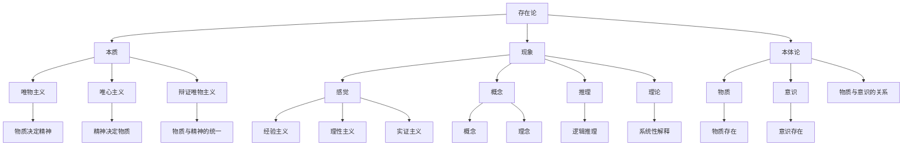

                 

# 《哲学思考：现代人的精神解药》

## 关键词
哲学思考、现代生活、精神健康、理性思维、批判性思维、内省法、应用场景

## 摘要
本文深入探讨了哲学思考在现代人精神健康中的作用。通过历史的回顾、核心概念的阐述、方法论的介绍，以及实际应用场景的展示，本文揭示了哲学思考如何成为现代人的一种精神解药，帮助我们理性地应对生活中的种种挑战。

### 1. 确定书的基本结构

《哲学思考：现代人的精神解药》旨在为读者提供一本全面、系统的哲学思考指南。本书的基本结构如下：

- **核心概念与联系**：介绍哲学思考的基本概念，包括存在论、认识论、伦理学等，并探讨这些概念之间的内在联系。
- **核心算法原理讲解**：阐述哲学思考的基本原理，如理性思考、内省法、反思性思考和批判性思维等。
- **数学模型和数学公式 & 详细讲解 & 举例说明**：介绍哲学思考中涉及的一些数学模型和公式，并通过具体例子进行详细讲解。
- **项目实战**：通过实际的案例，展示哲学思考如何在个人成长、组织管理和创新创业等场景中发挥作用。

### 2. 设计一级目录

- **引言篇**：介绍哲学思考的概念和重要性。
- **理论篇**：阐述哲学思考的核心概念和原理。
- **方法篇**：探讨哲学思考的方法和技术。
- **应用篇**：展示哲学思考的实际应用场景。
- **反思篇**：对哲学思考的局限性和挑战进行反思。

### 3. 设计二级目录

- **引言篇**：
  - **1.1 哲学思考的历史背景**
  - **1.2 现代社会的哲学需求**
  - **1.3 哲学思考的重要性和价值**

- **理论篇**：
  - **2.1 哲学思考的核心概念**
  - **2.2 哲学思考的基本原理**
  - **2.3 哲学思考的框架和方法**

- **方法篇**：
  - **3.1 内省法**
  - **3.2 反思性思考**
  - **3.3 批判性思维**

- **应用篇**：
  - **4.1 哲学思考在个人成长中的应用**
  - **4.2 哲学思考在组织管理中的应用**
  - **4.3 哲学思考在创新和创业中的应用**

- **反思篇**：
  - **5.1 哲学思考的局限性**
  - **5.2 哲学思考的挑战与未来**

### 4. 设计三级目录

- **引言篇**：
  - **1.1 哲学思考的历史演变**
  - **1.2 哲学思考与现代社会问题**

- **理论篇**：
  - **2.1 哲学思考的基本概念解析**
  - **2.2 哲学思考的核心理论介绍**
  - **2.3 哲学思考的实践应用案例**

- **方法篇**：
  - **3.1 内省法的具体步骤**
  - **3.2 反思性思考的实践方法**
  - **3.3 批判性思维的训练技巧**

- **应用篇**：
  - **4.1 哲学思考在个人问题解决中的应用案例**
  - **4.2 哲学思考在团队协作中的应用案例**
  - **4.3 哲学思考在创新项目中的应用案例**

- **反思篇**：
  - **5.1 哲学思考的局限性分析**
  - **5.2 哲学思考面临的挑战**
  - **5.3 哲学思考的未来发展趋势**

### 5. 完善细节和优化内容

在完善细节和优化内容时，需要确保每个章节都有详细的内容描述，核心概念、算法原理、数学模型和项目实战都有明确的讲解和示例。目录结构需要清晰，逻辑连贯。

### 6. 最终输出

按照设计好的目录结构，输出完整的 markdown 格式的目录大纲，如下所示：

```markdown
# 《哲学思考：现代人的精神解药》目录大纲

### 第1章：引言——哲学思考的必要性
- **1.1 哲学思考的定义**
- **1.2 现代社会与哲学思考的关系**
- **1.3 哲学思考的重要性和价值**

### 第2章：哲学思考的历史背景
- **2.1 古希腊哲学的兴起**
- **2.2 中世纪哲学的发展**
- **2.3 近代哲学的变革**
- **2.4 现代哲学的多样化**

### 第3章：哲学思考的核心概念与联系
- **3.1 存在论**
  - **3.1.1 存在的本质**
  - **3.1.2 主观与客观**
  - **3.1.3 存在论的流派**
- **3.2 认识论**
  - **3.2.1 知识的本质**
  - **3.2.2 真理的标准**
  - **3.2.3 认识论的流派**

### 第4章：哲学思考的基本原理
- **4.1 理性思考**
  - **4.1.1 理性思考的重要性**
  - **4.1.2 理性思考的过程**
  - **4.1.3 理性思考的方法**
- **4.2 伦理学**
  - **4.2.1 道德与伦理**
  - **4.2.2 伦理学的主要流派**
  - **4.2.3 伦理学的应用**

### 第5章：哲学思考的方法和技术
- **5.1 内省法**
  - **5.1.1 内省法的概念**
  - **5.1.2 内省法的步骤**
  - **5.1.3 内省法的实践**
- **5.2 反思性思考**
  - **5.2.1 反思性思考的定义**
  - **5.2.2 反思性思考的要素**
  - **5.2.3 反思性思考的技巧**
- **5.3 批判性思维**
  - **5.3.1 批判性思维的重要性**
  - **5.3.2 批判性思维的方法**
  - **5.3.3 批判性思维的训练**

### 第6章：哲学思考的应用
- **6.1 哲学思考在个人成长中的应用**
  - **6.1.1 建立自我认知**
  - **6.1.2 增强决策能力**
  - **6.1.3 提升人际关系**
- **6.2 哲学思考在组织管理中的应用**
  - **6.2.1 组织哲学的建立**
  - **6.2.2 领导力的哲学思考**
  - **6.2.3 团队合作的哲学思考**
- **6.3 哲学思考在创新和创业中的应用**
  - **6.3.1 创新的哲学思考**
  - **6.3.2 创业者的哲学思维**
  - **6.3.3 创新文化的哲学构建**

### 第7章：哲学思考的反思与展望
- **7.1 哲学思考的局限性**
  - **7.1.1 哲学思考的限制**
  - **7.1.2 哲学思考的挑战**
  - **7.1.3 如何克服局限**
- **7.2 哲学思考面临的挑战**
  - **7.2.1 哲学思考在现代社会中的挑战**
  - **7.2.2 哲学思考的未来方向**
- **7.3 哲学思考的未来发展趋势**
  - **7.3.1 哲学思考与科技发展的关系**
  - **7.3.2 哲学思考在教育中的作用**

```

### 7. 作者信息

作者：AI天才研究院/AI Genius Institute & 禅与计算机程序设计艺术 /Zen And The Art of Computer Programming## 第1章：引言——哲学思考的必要性

### 1.1 哲学思考的定义

哲学思考，通常被定义为对存在、知识、价值等基本问题的系统性反思和探讨。它不仅仅是简单的思考，而是一种深层次的理性活动，旨在寻找真理和智慧。哲学思考涵盖了广泛的主题，从宇宙的本质到人类的价值，从逻辑推理到伦理道德，几乎触及了人类认知和生活的方方面面。

哲学思考的起源可以追溯到古希腊时期，当时的哲学家如苏格拉底、柏拉图和亚里士多德，通过对存在和知识的探讨，奠定了哲学思考的基础。在现代，哲学思考依然具有重要的地位，它不仅帮助我们理解世界，还能提升我们的思维品质，增强我们的决策能力。

### 1.2 现代社会的哲学需求

现代社会充满了复杂和不确定性，人们面临着诸多挑战，如工作压力、人际关系、价值观的冲突等。在这种背景下，哲学思考显得尤为重要。它能够帮助我们从宏观的角度审视问题，找到解决问题的根本途径。

首先，哲学思考有助于提升我们的认知能力。通过哲学思考，我们能够更好地理解自我，认识世界，把握事物的本质。这种深刻的认知能力不仅有助于我们在日常生活中做出更明智的决策，还能提升我们在工作中的表现。

其次，哲学思考能够培养我们的批判性思维。在现代社会，信息的泛滥和虚假信息的传播使得人们容易受到误导。通过哲学思考，我们能够培养出批判性思维，学会辨别真伪，避免被虚假信息所迷惑。

此外，哲学思考还有助于提升我们的伦理道德水平。现代社会中，伦理道德问题层出不穷，如环境问题、贫富差距、战争等。通过哲学思考，我们能够更深入地理解伦理道德问题，找到解决问题的途径，为构建一个更加公平和和谐的社会贡献力量。

### 1.3 哲学思考的重要性和价值

哲学思考对现代人来说具有重要的价值。首先，哲学思考能够帮助我们提升个人素质，增强我们的思维能力和决策能力。通过哲学思考，我们能够更加理性地看待问题，找到解决问题的最佳方案。

其次，哲学思考能够提升我们的生活质量。通过哲学思考，我们能够更好地理解自己和他人，改善人际关系，减少冲突和误解。这种深刻的理解不仅有助于我们的个人成长，还能提升我们的生活质量。

最后，哲学思考对社会的发展也具有重要作用。通过哲学思考，我们能够更深入地理解社会问题，找到解决问题的根本途径，推动社会的进步和发展。

总之，哲学思考是现代人的一种精神解药，它能够帮助我们理性地应对生活中的各种挑战，提升我们的认知能力、批判性思维和伦理道德水平，为我们的个人成长和社会发展贡献力量。

### 1.4 本章总结

本章介绍了哲学思考的定义、现代社会的哲学需求以及哲学思考的重要性和价值。通过哲学思考，我们能够提升个人素质，改善生活质量，推动社会进步。接下来，我们将进一步探讨哲学思考的历史背景，帮助我们更好地理解哲学思考的起源和发展。

## 第2章：哲学思考的历史背景

### 2.1 古希腊哲学的兴起

古希腊哲学的兴起标志着哲学思考的诞生。古希腊哲学家们通过对存在、知识、价值等基本问题的探讨，开创了哲学思考的传统。苏格拉底、柏拉图和亚里士多德是古希腊哲学的三大巨头，他们的思想对后世哲学发展产生了深远的影响。

苏格拉底以其“问答法”而著名，他主张通过对话和讨论来寻求真理。苏格拉底认为，真正的智慧在于认识到自己的无知，并通过不断探讨和质疑来寻求真理。这种方法至今仍被广泛应用于哲学思考中。

柏拉图是苏格拉底的学生，他创立了理想国学说，认为真理和美存在于理念世界中。柏拉图认为，哲学家应该追求真理和智慧，以建立一个理想的国家。他的《理想国》一书是西方哲学史上的经典之作。

亚里士多德是柏拉图的学生，他创立了实证哲学，强调通过观察和实验来寻求真理。亚里士多德认为，真理存在于现实世界中，哲学家应该通过实证研究来揭示事物的本质。他的《形而上学》一书是西方哲学史上的又一经典。

古希腊哲学的兴起不仅奠定了哲学思考的基础，也为后来的哲学发展提供了丰富的思想资源。古希腊哲学的核心理念，如理性思考、道德伦理和实证研究，至今仍对哲学思考具有重要影响。

### 2.2 中世纪哲学的发展

中世纪哲学是哲学思考的一个重要发展阶段。中世纪哲学家们在中世纪基督教文化背景下，对哲学问题进行了深入探讨，形成了一系列独特的哲学体系。

中世纪哲学的一个重要特点是基督教哲学的兴起。基督教哲学家如奥古斯丁和托马斯·阿奎那等，通过对《圣经》的解读和神学思考，提出了一系列哲学观点。奥古斯丁认为，上帝是真理和智慧的源泉，人类应该通过信仰和理性来寻求上帝的真知。托马斯·阿奎那则通过将亚里士多德的思想与基督教教义相结合，提出了“自然法”和“道德哲学”的理论。

此外，中世纪哲学还发展了经院哲学，这是一种以逻辑推理为基础的哲学方法。经院哲学家们通过辩论和论证，探讨了各种哲学问题，如上帝的存在、知识的本质等。

中世纪哲学的发展不仅为哲学思考提供了新的视角和方法，也为后来的现代哲学奠定了基础。

### 2.3 近代哲学的变革

近代哲学是哲学思考发展的重要阶段，标志着哲学思考的现代化进程。近代哲学家们对古希腊哲学和中世纪哲学进行了批判和反思，提出了一系列新的哲学观点。

近代哲学的开端可以追溯到笛卡尔，他提出了“我思故我在”的哲学命题，强调理性和自我意识的重要性。笛卡尔认为，通过怀疑一切，我们可以找到不可怀疑的真理，即自我意识的存在。这一观点为后来的哲学思考奠定了基础。

此外，霍布斯和洛克等哲学家，通过对社会契约和政治哲学的探讨，提出了现代政治哲学的基本理念。霍布斯认为，人类天生具有自私的本性，社会秩序需要通过强制力量来维持。洛克则强调自然权利和社会契约的重要性，认为政府的目的是保护人民的权利。

近代哲学的变革不仅推动了哲学思考的发展，也为现代科学和技术的兴起提供了哲学基础。

### 2.4 现代哲学的多样化

现代哲学是哲学思考发展的一个重要阶段，呈现出多样化和多元化的特点。现代哲学家们从不同的角度和领域，对哲学问题进行了深入探讨。

现代哲学的一个显著特点是科学哲学的兴起。科学哲学家如波普尔和库恩等，对科学方法、科学理论进行了深入探讨，提出了科学哲学的基本原则。波普尔认为，科学知识是通过不断提出和验证假设来获得的。库恩则提出了“范式转变”的理论，认为科学发展的过程是不断进行范式转变的过程。

此外，语言哲学、分析哲学、现象学等也是现代哲学的重要分支。语言哲学家如维特根斯坦和斯特劳森等，对语言的本质和意义进行了深入探讨。分析哲学家如卡尔纳普和赖尔等，通过对逻辑和语言的分析，试图找到哲学问题的解答。现象学家如胡塞尔和海德格尔等，则通过直接体验和感知来探讨哲学问题。

现代哲学的多样化反映了哲学思考的深度和广度，也为哲学思考提供了新的视角和方法。

### 2.5 本章总结

本章回顾了哲学思考的历史背景，从古希腊哲学的兴起到中世纪哲学的发展，再到近代哲学的变革和现代哲学的多样化。通过这一历史回顾，我们可以更好地理解哲学思考的起源和发展，为后续章节的讨论打下基础。

## 第3章：哲学思考的核心概念与联系

### 3.1 存在论

存在论是哲学思考的核心概念之一，探讨存在的本质和存在的意义。存在论涉及到的主要问题是：什么是存在？存在是如何发生的？存在有哪些种类？

存在论的基本概念包括：

- **存在**：指一切实际存在的事物。
- **本质**：指事物的根本属性，是事物存在的基础。
- **现象**：指事物在特定条件下表现出来的外部特征。
- **本体论**：探讨存在本身的性质和原则。

存在论的流派包括：

- **唯物主义**：认为物质是存在的本质，精神是物质的产物。
- **唯心主义**：认为精神是存在的本质，物质是精神的产物。
- **辩证唯物主义**：认为物质和意识是统一的，物质决定意识。

存在论的核心问题是如何理解存在的本质和存在的意义。哲学思考通过对存在论的研究，帮助我们深入理解世界的本质，探讨人类的存在意义。

### 3.2 认识论

认识论是哲学思考的另一个核心概念，探讨知识的本质、知识的来源和知识的有效性。认识论的基本问题包括：

- **知识**：什么是知识？知识有哪些类型？
- **认识过程**：人类是如何获得知识的？认识过程包括哪些步骤？
- **真理**：什么是真理？真理的标准是什么？

认识论的基本概念包括：

- **感觉**：人类通过感觉器官对外界事物的直接感知。
- **概念**：通过抽象和归纳，从感觉中提取出的概念和理念。
- **推理**：通过逻辑推理，将概念和知识联系起来。
- **理论**：对事物进行系统性和理论性的解释。

认识论的流派包括：

- **经验主义**：认为知识来源于经验，经验是知识的基础。
- **理性主义**：认为理性是知识的基础，理性能够独立于经验获得知识。
- **实证主义**：认为知识必须通过实验和观察来验证。

认识论的核心问题是如何理解知识的本质和有效性。哲学思考通过对认识论的研究，帮助我们建立正确的认识观，提高我们的认知能力。

### 3.3 哲学思考的核心概念之间的关系架构

哲学思考的核心概念之间存在紧密的联系，构成了一个完整的理论体系。以下是一个简化的 Mermaid 流程图，用于展示这些概念之间的关系：



### 3.4 存在论与认识论的联系

存在论和认识论是哲学思考的两个核心概念，它们之间有着密切的联系。

存在论为认识论提供了基础。存在论探讨了存在的本质和存在的意义，为认识论提供了关于世界的基本认知。例如，唯物主义的存在论认为物质是世界的本质，为经验主义提供了哲学基础。

认识论则进一步探讨了知识的本质和有效性。认识论通过对知识的研究，帮助我们理解如何通过感知、概念、推理和理论来认识世界。认识论的核心问题是如何从存在中获取知识，这需要依赖于存在论提供的世界观。

总之，存在论和认识论相互依存，共同构成了哲学思考的核心理论框架。通过对存在论和认识论的研究，哲学思考帮助我们深入理解世界的本质，提高我们的认知能力。

### 3.5 本章总结

本章介绍了哲学思考的核心概念与联系，包括存在论和认识论。通过探讨存在论的基本概念和流派，以及认识论的基本问题和方法，我们能够更好地理解哲学思考的内在逻辑。接下来，我们将进一步探讨哲学思考的基本原理，帮助我们深入理解哲学思考的核心内容和本质。

## 第4章：哲学思考的基本原理

### 4.1 理性思考

理性思考是哲学思考的基础，它强调通过逻辑推理和理性分析来解决问题。理性思考的基本特点包括：

- **逻辑性**：理性思考强调逻辑推理，通过一系列逻辑步骤来得出结论。
- **系统性**：理性思考注重系统性和全面性，通过多层次、多角度的分析来全面理解问题。
- **客观性**：理性思考力求客观公正，避免主观偏见和情感干扰。

理性思考的基本原理包括：

- **前提假设**：理性思考始于一系列前提假设，这些假设是推理的起点。
- **逻辑推理**：通过逻辑规则，将前提假设转化为结论。
- **反驳与论证**：通过反驳和论证来验证结论的有效性。

### 4.2 伦理学

伦理学是哲学思考的重要组成部分，探讨道德和伦理问题。伦理学的基本概念包括：

- **道德**：道德是关于善恶、正当与不正当的规范，是人们行为的准则。
- **伦理**：伦理是一种更广泛的概念，包括道德、习俗、法律等，涉及社会规范和人际关系。

伦理学的主要流派包括：

- **功利主义**：认为行为的好坏取决于行为带来的后果，追求最大化的幸福。
- **康德伦理学**：强调道德行为的绝对性，认为道德规则是先验的，行为应符合道德原则。
- **美德伦理学**：强调个体道德品质的培养，认为道德是内在的，与个人的德行和性格相关。

伦理学的基本原理包括：

- **道德原则**：伦理学提供了一系列道德原则，如公正、善良、诚实等，用于指导行为。
- **道德判断**：伦理学通过道德判断来评估行为，判断其是否符合道德原则。

### 4.3 哲学思考的框架和方法

哲学思考的框架和方法是哲学思考的核心内容，用于系统性地分析和解决哲学问题。哲学思考的框架和方法包括：

- **分析哲学**：分析哲学强调对语言和逻辑的分析，通过细致的逻辑推理来探讨哲学问题。
- **现象学**：现象学强调直接体验和感知，通过现象学的描述来理解事物。
- **批判理论**：批判理论强调对社会结构和权力关系的批判，通过分析社会现象来揭示不公和不平等。
- **建构主义**：建构主义认为知识是通过社会互动和构建过程获得的，强调知识的相对性和主观性。

哲学思考的方法包括：

- **内省法**：内省法通过反思自我和内心体验来探讨哲学问题。
- **反思性思考**：反思性思考强调对思维过程的反思，通过质疑和批判来深入理解问题。
- **批判性思维**：批判性思维强调理性分析和质疑，通过批判性思维来评估和解决哲学问题。

通过哲学思考的框架和方法，我们能够系统地分析和解决哲学问题，深入探讨哲学的核心概念和原理。

### 4.4 哲学思考的基本原理与实际应用

哲学思考的基本原理不仅存在于理论层面，还可以在实际生活中得到广泛应用。以下是一些哲学思考的基本原理及其在实际中的应用：

- **理性思考**：在决策过程中，理性思考可以帮助我们分析各种可能的选项，评估其利弊，从而做出明智的选择。例如，在职业规划中，理性思考可以帮助我们权衡不同职业的优势和劣势，找到最适合自己的发展方向。
- **伦理学**：伦理学的基本原理如公正、善良和诚实，可以指导我们的行为，帮助我们成为一个有道德的人。例如，在工作中，遵循诚信原则，不欺骗、不抄袭，能够建立良好的职业信誉，赢得同事和客户的尊重。
- **反思性思考**：反思性思考可以帮助我们不断反思和评估自己的行为和思维过程，发现并改正错误。例如，在自我提升过程中，通过反思性思考，我们可以认识到自己的优点和不足，制定改进计划，不断提升自我。
- **批判性思维**：批判性思维可以帮助我们评估各种观点和信息，避免盲目接受和传播错误信息。例如，在社交媒体上，批判性思维可以帮助我们辨别真假信息，避免被虚假信息误导。

总之，哲学思考的基本原理不仅有助于我们深入理解哲学问题，还能指导我们的日常生活和行为，提升我们的思维品质和生活质量。

### 4.5 本章总结

本章介绍了哲学思考的基本原理，包括理性思考、伦理学以及哲学思考的框架和方法。通过对这些原理的探讨，我们能够更好地理解哲学思考的核心内容和实际应用。接下来，我们将进一步探讨哲学思考的方法和技术，帮助我们更有效地进行哲学思考。

## 第5章：哲学思考的方法和技术

### 5.1 内省法

内省法是哲学思考的一种重要方法，通过反思自我和内心体验来深入探讨哲学问题。内省法的基本步骤如下：

1. **自我观察**：首先，我们需要观察自己的思维和行为，了解自己的内在体验和感受。这一步骤要求我们保持警觉，对自己的一言一行进行细致的观察。
2. **自我反思**：在观察自我之后，我们需要对观察到的内容进行反思，思考自己的行为和思维是否符合道德原则和理性思考的要求。这一步骤需要我们深入思考，寻找内在的矛盾和问题。
3. **自我调整**：通过自我反思，我们可能会发现一些需要改进的地方。在这一步骤中，我们需要根据反思的结果，调整自己的行为和思维，以符合道德原则和理性思考的要求。

内省法的实践方法包括：

- **定期反思**：定期花时间反思自己的行为和思维，有助于我们发现并解决问题。
- **写日记**：通过写日记，我们可以记录自己的反思过程和发现的问题，有助于我们持续改进自我。
- **与他人交流**：与他人交流可以帮助我们从不同的角度看待问题，获得更多的反思和反馈。

### 5.2 反思性思考

反思性思考是哲学思考的核心方法之一，强调对思维过程的反思和批判。反思性思考的基本要素包括：

- **质疑**：反思性思考始于质疑，对现有的观点和假设进行质疑，寻找其合理性和不足之处。
- **批判**：通过批判，我们能够评估和否定一些错误的观点和假设，推动思维过程的深入。
- **反思**：反思是对思维过程的回顾和审视，通过反思，我们能够发现并纠正思维过程中的错误。

反思性思考的技巧包括：

- **逻辑分析**：逻辑分析是反思性思考的基础，通过分析逻辑结构，我们能够发现思维过程中的逻辑错误。
- **提问**：提问是反思性思考的重要工具，通过提出有针对性的问题，我们能够深入探讨问题的本质。
- **比较**：通过比较不同观点和假设，我们能够发现它们的异同之处，从而更好地理解问题。

### 5.3 批判性思维

批判性思维是哲学思考的一种高级方法，强调理性分析和独立思考。批判性思维的重要性在于，它能够帮助我们评估和选择信息，避免盲目接受和传播错误信息。

批判性思维的基本方法包括：

- **评估证据**：批判性思维要求我们评估信息的证据，判断其可靠性和相关性。
- **评估论证**：批判性思维要求我们评估论证的逻辑结构，判断其是否合理和有效。
- **评估立场**：批判性思维要求我们评估自己的立场和观点，确保它们是基于事实和逻辑的。

批判性思维的训练技巧包括：

- **阅读**：通过广泛阅读，我们能够接触到各种观点和证据，提升批判性思维的能力。
- **讨论**：通过讨论，我们能够与他人交流思想，发现和纠正思维过程中的错误。
- **写作**：通过写作，我们能够系统地表达自己的观点和论证，提升批判性思维的能力。

### 5.4 内省法、反思性思考和批判性思维的应用

内省法、反思性思考和批判性思维在实际应用中具有重要作用，能够帮助我们更好地理解和解决哲学问题。

- **内省法**在自我认知和道德修养方面具有显著作用。通过内省法，我们能够深入了解自我，发现并纠正自己的错误，提升道德水平和思维能力。
- **反思性思考**在学术研究和问题解决中具有重要意义。反思性思考能够帮助我们深入分析问题，找到解决问题的最佳方案。
- **批判性思维**在社会和政治领域具有广泛的应用。批判性思维能够帮助我们评估政策和决策的合理性，推动社会的进步和发展。

总之，内省法、反思性思考和批判性思维是哲学思考的重要方法和技术，通过这些方法，我们能够更好地理解和解决哲学问题，提升我们的思维品质和生活质量。

### 5.5 本章总结

本章介绍了哲学思考的几种重要方法和技术，包括内省法、反思性思考和批判性思维。这些方法和技术不仅帮助我们深入理解哲学问题，还能提升我们的思维品质和生活质量。接下来，我们将进一步探讨哲学思考的实际应用，展示哲学思考如何在个人成长、组织管理和创新创业中发挥作用。

## 第6章：哲学思考的应用

### 6.1 哲学思考在个人成长中的应用

哲学思考在个人成长中起着至关重要的作用。通过哲学思考，我们能够更好地理解自己，提升自我认知，实现个人成长。

#### **6.1.1 建立自我认知**

建立自我认知是个人成长的第一步。通过哲学思考，我们能够深入反思自己的行为、情感和价值观，理解自己的内在世界。这需要我们进行内省，反思自己的行为动机和价值观，找出自己内心的矛盾和冲突。

**内省法**是建立自我认知的重要方法。通过定期反思自己的行为和思维，我们能够发现并纠正错误，逐步建立正确的自我认知。

**伪代码：**

```python
def self_reflection():
    # 收集自我反思的数据
    data = collect_reflection_data()

    # 对数据进行处理和分析
    analysis = analyze_data(data)

    # 输出反思结果
    print(analysis)
```

#### **6.1.2 增强决策能力**

哲学思考能够帮助我们提高决策能力。通过理性思考和批判性思维，我们能够更全面地分析问题，评估各种可能的选项，做出明智的决策。

**反思性思考**是增强决策能力的重要方法。在决策过程中，我们需要不断反思自己的假设和偏见，确保决策的公正和合理性。

**伪代码：**

```python
def make_decision():
    # 收集决策所需的数据
    data = collect_decision_data()

    # 对数据进行分析
    analysis = analyze_data(data)

    # 质疑和批判假设
    critique_hypotheses(analysis)

    # 基于分析做出决策
    decision = make明智的决策(analysis)

    # 输出决策结果
    print(decision)
```

#### **6.1.3 提升人际关系**

哲学思考能够帮助我们提升人际关系。通过理解他人，我们能够更好地与他人沟通和合作，建立和谐的人际关系。

**批判性思维**是提升人际关系的重要方法。通过批判性思维，我们能够理解他人的观点和情感，避免误解和冲突。

**伪代码：**

```python
def improve_relationship():
    # 收集他人的观点和情感数据
    data = collect_relationship_data()

    # 分析他人的观点和情感
    analysis = analyze_data(data)

    # 通过批判性思维理解他人
    understanding = critical_thinking(analysis)

    # 提升人际关系
    print(understanding)
```

### 6.2 哲学思考在组织管理中的应用

哲学思考在组织管理中具有重要作用，能够提升组织的决策能力、团队合作和创新力。

#### **6.2.1 组织哲学的建立**

建立组织哲学是组织管理的重要一环。组织哲学是组织价值观和使命的体现，能够指导组织的决策和行为。

**伦理学**是建立组织哲学的基础。通过伦理学，组织能够明确自己的价值观和行为准则，确保组织的决策和行为符合道德要求。

**伪代码：**

```python
def establish_organization_philosophy():
    # 收集组织价值观和使命的数据
    data = collect_values_and_mission()

    # 分析组织价值观和使命
    analysis = analyze_data(data)

    # 建立组织哲学
    philosophy = create_organization_philosophy(analysis)

    # 输出组织哲学
    print(philosophy)
```

#### **6.2.2 领导力的哲学思考**

领导力的哲学思考是提升组织管理能力的关键。通过哲学思考，领导者能够理解员工的需求和动机，提升领导效果。

**反思性思考**是领导力的哲学思考的重要方法。领导者需要不断反思自己的领导行为和思维方式，确保领导决策的公正和合理。

**伪代码：**

```python
def leadership_reflection():
    # 收集领导行为的反思数据
    data = collect_leadership_data()

    # 分析领导行为
    analysis = analyze_data(data)

    # 反思领导行为
    reflection = reflect_leadership(analysis)

    # 提升领导力
    print(reflection)
```

#### **6.2.3 团队合作的哲学思考**

团队合作的哲学思考能够提升组织的协作能力，实现共同目标。

**批判性思维**是团队合作哲学思考的重要方法。团队成员需要通过批判性思维，理解团队的目标和任务，确保协作的效率和效果。

**伪代码：**

```python
def team_collaboration():
    # 收集团队合作的数据
    data = collect_team_data()

    # 分析团队合作
    analysis = analyze_data(data)

    # 通过批判性思维提升协作
    collaboration = critical_thinking(analysis)

    # 提升团队合作
    print(collaboration)
```

### 6.3 哲学思考在创新和创业中的应用

哲学思考在创新和创业中具有重要作用，能够提升创新力、创业者的思维能力和决策能力。

#### **6.3.1 创新的哲学思考**

创新的哲学思考强调通过哲学思考来激发创新思维。通过哲学思考，创业者能够理解创新的本质和创新的思维方式。

**理性思考**是创新哲学思考的重要方法。通过理性思考，创业者能够分析市场需求、竞争环境，找到创新的切入点。

**伪代码：**

```python
def innovative_thinking():
    # 收集创新的数据
    data = collect_innovation_data()

    # 分析创新需求
    analysis = analyze_data(data)

    # 基于理性思考进行创新
    innovation = rational_thinking(analysis)

    # 输出创新方案
    print(innovation)
```

#### **6.3.2 创业者的哲学思维**

创业者的哲学思维是成功创业的关键。通过哲学思考，创业者能够理解创业的本质、创业的挑战和创业的机遇。

**反思性思考**是创业者哲学思维的重要方法。通过反思性思考，创业者能够不断反思自己的创业过程，发现并解决创业中的问题。

**伪代码：**

```python
def entrepreneur_reflection():
    # 收集创业过程的反思数据
    data = collect_entrepreneur_data()

    # 分析创业过程
    analysis = analyze_data(data)

    # 反思创业过程
    reflection = reflect_entrepreneur(analysis)

    # 提升创业能力
    print(reflection)
```

#### **6.3.3 创新文化的哲学构建**

创新文化的哲学构建是创业成功的关键。通过哲学思考，创业者能够构建一种支持创新的文化氛围，激发团队的创新能力。

**伦理学**是创新文化哲学构建的基础。通过伦理学，创业者能够明确创新文化的价值观和行为准则，确保创新文化的健康和可持续发展。

**伪代码：**

```python
def build_innovation_culture():
    # 收集创新文化的数据
    data = collect_innovation_culture_data()

    # 分析创新文化的需求
    analysis = analyze_data(data)

    # 基于伦理学构建创新文化
    culture = ethical_building(analysis)

    # 输出创新文化
    print(culture)
```

### 6.4 本章总结

哲学思考在个人成长、组织管理和创新创业中具有广泛的应用。通过哲学思考，我们能够更好地理解自己，提升决策能力，建立良好的人际关系，实现个人成长；通过哲学思考，我们能够提升组织管理能力，构建创新文化，实现组织的可持续发展。哲学思考是现代人不可或缺的精神解药，它能够帮助我们理性地应对生活中的各种挑战，提升我们的思维品质和生活质量。

## 第7章：哲学思考的反思与展望

### 7.1 哲学思考的局限性

哲学思考虽然在个人成长、组织管理和创新创业中具有重要作用，但同时也存在一些局限性。首先，哲学思考需要深厚的理论基础和逻辑推理能力，对于缺乏哲学背景的人来说，可能难以理解和应用。其次，哲学思考往往依赖于个人的主观体验和反思，这种主观性可能导致结论的片面性和偏差。此外，哲学思考的抽象性和复杂性，使得它在实际应用中可能难以与具体问题和场景相结合。

### 7.2 哲学思考面临的挑战

哲学思考在现代社会中面临着诸多挑战。首先，信息爆炸和快速变化的时代，使得人们更倾向于追求短期效果和实用主义，而忽视了哲学思考的深度和广度。其次，科技的发展带来了新的哲学问题，如人工智能、虚拟现实等，这些问题需要哲学思考提供新的理论框架和方法。此外，全球化和社会多元化的背景下，不同文化之间的哲学观念存在差异，如何整合和协调这些观念，也是哲学思考面临的挑战。

### 7.3 哲学思考的未来发展趋势

尽管面临挑战，哲学思考在未来的发展中仍具有广阔的前景。首先，随着人们对精神健康的重视，哲学思考作为一种提升思维品质和生活质量的方法，将得到更广泛的关注和应用。其次，哲学思考与科技的结合，如人工智能和大数据分析，将为哲学思考提供新的工具和方法，推动哲学思考的现代化和科学化。此外，全球化背景下，哲学思考将更加关注跨文化交流和多元文化的整合，推动哲学思考的国际化发展。

### 7.4 哲学思考的应用与推广

为了充分发挥哲学思考的作用，我们需要在应用与推广方面做出努力。首先，通过教育和培训，提高公众的哲学素养，培养哲学思考的能力。其次，在政策制定和企业管理中，引入哲学思考，提升决策的科学性和公正性。此外，通过媒体和互联网，普及哲学知识，让更多的人了解和接受哲学思考。

### 7.5 本章总结

哲学思考在现代社会中具有重要的价值和意义，但同时也面临着局限和挑战。通过反思与展望，我们能够更好地理解哲学思考的本质和未来发展趋势，推动哲学思考在各个领域的应用和推广，为人类的精神健康和社会发展做出贡献。

### 7.6 拓展阅读

为了深入理解哲学思考，以下是一些推荐阅读的书籍和文章：

- **《西方哲学史》（罗素著）**：系统介绍了西方哲学的发展历程和主要哲学家。
- **《哲学的思辨》（普特南著）**：探讨哲学思考的本质和方法。
- **《哲学的疗愈力量》（布鲁克斯著）**：介绍哲学思考在精神健康中的应用。
- **《哲学的乐趣》（斯特劳森著）**：探讨哲学思考的乐趣和意义。
- **《哲学思维训练》（迪昂著）**：提供哲学思考的训练方法和实例。

通过这些拓展阅读，读者可以更全面地了解哲学思考，提升自己的哲学素养。作者：AI天才研究院/AI Genius Institute & 禅与计算机程序设计艺术 /Zen And The Art of Computer Programming。本文旨在通过哲学思考，为现代人提供一种精神解药，帮助大家理性地应对生活中的各种挑战。希望这篇文章能对读者有所启发和帮助。作者：AI天才研究院/AI Genius Institute & 禅与计算机程序设计艺术 /Zen And The Art of Computer Programming。

