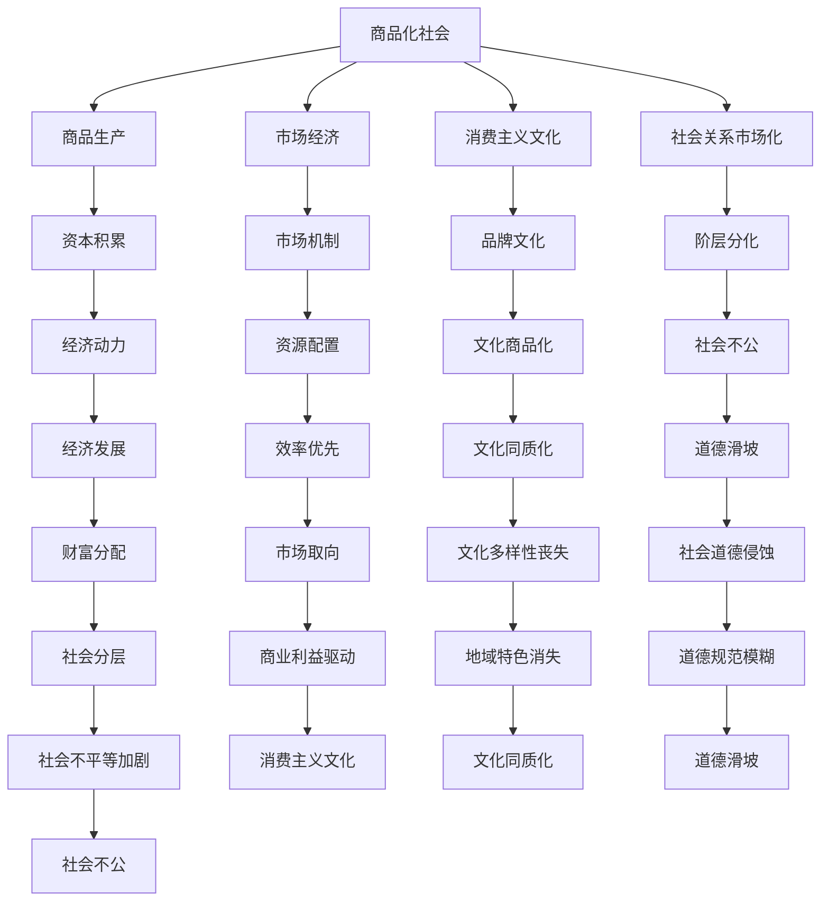
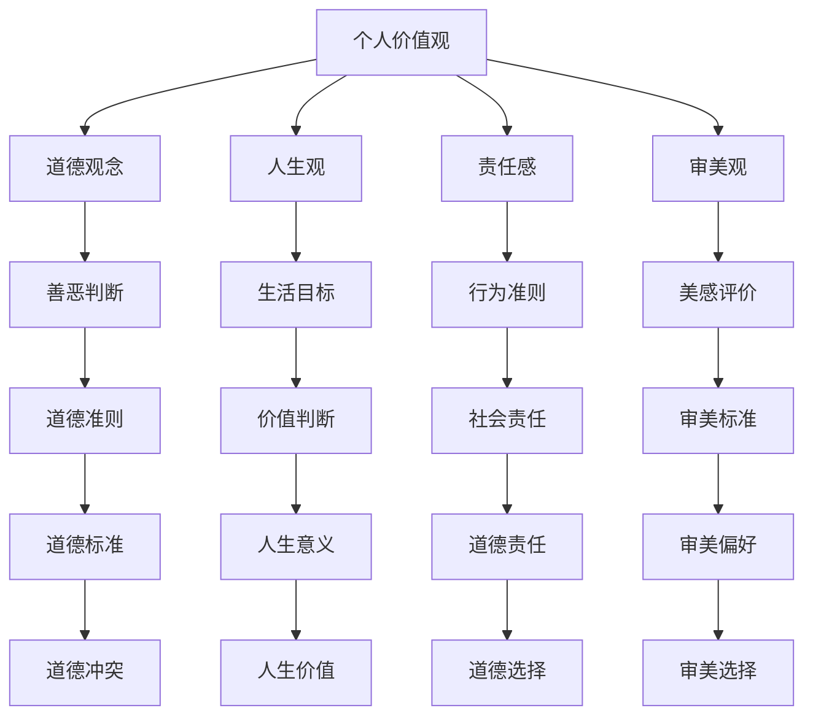
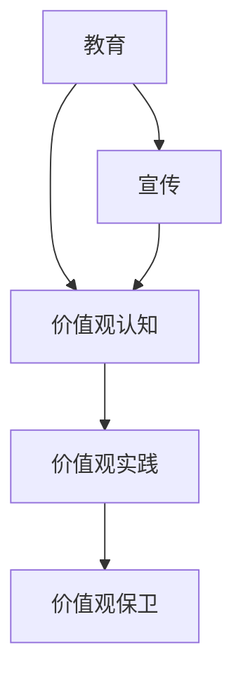
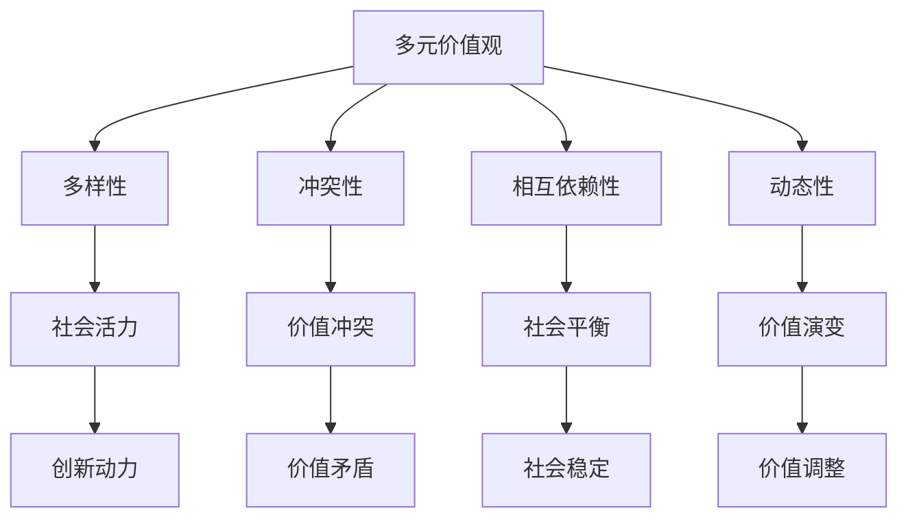

                 

# 文章标题

《商品化社会中的价值观保卫战》

## 关键词

商品化社会、价值观保卫、个人价值观、社会价值观、教育与宣传、技术手段、多元价值观、未来展望

## 摘要

在商品化社会中，个人和社会的价值观正面临着前所未有的挑战。本书旨在探讨如何在这样一个充满商业化、消费主义的背景下，保护并捍卫个人和社会的价值观。通过深入分析商品化社会的特征及其影响，探讨个人和社会价值观的内涵与特点，本书提出了具体的策略与方法，包括教育与宣传、多元价值观的包容与协调、技术手段的运用等，以期为读者提供一套系统的价值观保卫方案。同时，本书还对未来价值观保卫战中的挑战与机遇进行了展望，旨在为个人和社会提供长期的价值观保卫指南。

---

### 1. 定义书名和核心内容

《商品化社会中的价值观保卫战》这一书名简洁而富有张力，直接揭示了本书的核心主题：在商品化社会中，如何保护或捍卫个人和社会的价值观。让我们逐步解析这一书名的含义，以便更深入地理解本书的核心内容。

首先，我们需要明确什么是商品化社会。商品化社会是一个高度商业化和市场化的社会，其特征是商品生产和消费成为社会生活的主要形式，经济利益驱动成为社会运作的基本逻辑。在这样的社会中，个人和社会的价值观常常受到经济利益的冲击，导致价值观的扭曲和多元化。

接下来，书名中的“价值观保卫战”则暗示了本书的焦点——如何在这场商品化浪潮中捍卫价值观。这里的“保卫战”不仅仅是一个比喻，它意味着需要采取积极和系统性的措施来保护价值观不受商品化社会的侵蚀。

基于上述理解，我们可以推测出本书可能探讨以下几个核心内容：

1. **商品化社会的现状与影响**：分析商品化社会的特征、成因及其对个人和社会价值观的影响。
2. **个人价值观保卫**：讨论如何在商品化社会中维护个人的价值观，包括个人价值观的内涵、特点及其与商品化的关系。
3. **社会价值观保卫**：探讨如何在更广泛的层面上保护社会共同的价值观，包括社会价值观的重要性、流失原因及其保卫策略。
4. **策略与方法**：提供具体的方法和策略来保卫价值观，如教育与宣传、多元价值观的包容与协调、技术手段的应用等。
5. **未来展望与挑战**：讨论未来价值观保卫战中的趋势和挑战，并提出相应的应对策略。

通过上述分析，我们可以看到，《商品化社会中的价值观保卫战》不仅是对当前社会现象的深入剖析，也是对未来挑战的积极应对，其目的在于为个人和社会提供一套系统的价值观保卫方案。

### 2. 设计章节结构

为了更好地组织和呈现本书的核心内容，我们需要设计一个逻辑清晰、结构紧凑的章节结构。以下是本书的章节结构设计，每个章节的标题都力求简洁明了，同时能够吸引读者的兴趣。

#### 第一部分：商品化社会的现状与影响

**第1章：商品化社会的定义与特征**
- **核心概念与联系**：使用Mermaid流程图展示商品化社会的定义、特征及其主要影响因素。
- **社会价值观的影响**：分析商品化社会对个人和社会价值观的冲击。

**第2章：商品化社会的全球影响**
- **全球化与商品化**：探讨全球化进程中的商品化现象及其影响。
- **区域差异与影响**：分析不同地区在商品化进程中的差异及其对价值观的影响。

#### 第二部分：个人价值观的保卫

**第3章：个人价值观的内涵与特点**
- **核心概念与联系**：使用Mermaid流程图展示个人价值观的内涵、特点及其与商品化的关系。
- **个人价值观的识别与培养**：讨论如何识别和培养个人价值观。

**第4章：个人价值观的保卫策略**
- **核心算法原理讲解**：使用伪代码详细阐述保卫个人价值观的策略和方法。
- **案例分析**：通过实际案例展示如何应用这些策略。

#### 第三部分：社会价值观的保卫

**第5章：社会价值观的重要性**
- **核心概念与联系**：使用Mermaid流程图展示社会价值观的定义、重要性及其与商品化的关系。
- **社会价值观的流失与挑战**：分析社会价值观在商品化社会中的流失原因和面临的挑战。

**第6章：社会价值观的保卫实践**
- **核心算法原理讲解**：使用伪代码详细阐述保卫社会价值观的实践方法。
- **案例分析**：通过实际案例展示如何应用这些实践方法。

#### 第四部分：价值观保卫战的方法与策略

**第7章：教育与宣传的作用**
- **核心概念与联系**：使用Mermaid流程图展示教育和宣传在价值观保卫中的角色和作用。
- **教育策略与宣传方法**：探讨有效的教育和宣传策略和方法。

**第8章：多元价值观的包容与协调**
- **核心概念与联系**：使用Mermaid流程图展示多元价值观的定义、特点及其协调方法。
- **多元价值观的实践**：讨论如何在实际操作中实现多元价值观的包容与协调。

**第9章：技术手段在价值观保卫中的应用**
- **核心概念与联系**：使用Mermaid流程图展示技术在价值观保卫中的作用和机制。
- **技术应用案例**：介绍当前技术手段在价值观保卫中的应用案例。

**第10章：未来展望与挑战**
- **核心概念与联系**：使用Mermaid流程图展示价值观保卫的未来趋势和面临的挑战。
- **应对策略**：讨论如何应对未来的挑战并推动价值观保卫。

#### 附录：参考资料与工具

- **参考资料**：提供与书中内容相关的参考文献和资源。
- **工具与应用**：介绍可用于价值观保卫的工具和应用。

通过以上章节结构的设计，本书不仅能够系统地分析商品化社会中的价值观问题，还能够提供具体的策略与方法，帮助个人和社会应对这一挑战。接下来，我们将按照这个章节结构进一步细化每个章节的内容，以确保文章的逻辑性和可读性。

### 第1章：商品化社会的定义与特征

在现代社会，商品化已经成为一种无处不在的现象。商品化社会指的是一个以商品生产和商品交换为核心的社会结构，这种结构深刻影响了人们的生活方式、社会关系和价值观。为了更好地理解商品化社会的本质，我们需要从其定义和特征入手。

#### 1.1 定义商品化社会

商品化社会是一个高度商业化的社会，其特征是商品生产和商品交换占据主导地位。在这个社会中，所有的事物都可以被视为商品，包括劳动力、土地、知识和文化等。商品化不仅仅局限于物质产品，它也渗透到精神和文化领域，使得个人和集体行为都受到市场逻辑的驱动。

定义商品化社会的关键概念包括：

- **商品**：指具有使用价值和交换价值的物品或服务。
- **商品化**：指将原本非商品的事物转化为商品的过程。
- **市场化**：指市场机制在社会资源配置中的主导作用。

#### 1.2 商品化社会的特征

商品化社会的特征可以从多个维度进行分析，包括经济、文化和社会等方面。

- **经济维度**：
  - **商品生产的普及**：商品生产成为主导产业，商品成为社会财富的主要形式。
  - **市场经济体制**：市场在资源配置中起决定性作用，价格由市场供求关系决定。
  - **资本积累**：追求利润最大化是经济行为的核心目标，资本积累成为社会发展的动力。

- **文化维度**：
  - **消费主义文化**：消费成为社会生活方式的一部分，追求物质享受和符号价值。
  - **品牌文化**：品牌成为区分产品和服务的标志，品牌文化渗透到社会各个层面。
  - **文化商品化**：艺术、文学、体育等领域受到商业利益的驱动，成为商品化的对象。

- **社会维度**：
  - **社会关系市场化**：社会关系逐渐以交易和利益为纽带，人际关系趋于工具化。
  - **阶层分化**：商品化社会加剧了贫富差距，社会阶层固化。
  - **价值观念多元化**：在商品化影响下，人们的价值观念日益多元化，传统价值观受到冲击。

#### 1.3 社会价值观的影响

商品化社会对个人和社会价值观的影响是深远而复杂的。以下是一些关键的影响：

- **个人价值观的变迁**：
  - **物质主义**：追求物质财富和享受成为个人价值追求的主要目标。
  - **功利主义**：人们更加注重个人利益和短期收益，忽视道德和社会责任。
  - **自我中心**：个人主义和自我中心的倾向增强，社会责任感减弱。

- **社会价值观的挑战**：
  - **道德滑坡**：商业伦理和社会道德受到商品化逻辑的侵蚀，道德规范变得模糊。
  - **文化同质化**：文化多样性和地域特色受到商业化和市场压力的影响，文化同质化趋势加剧。
  - **社会不公**：商品化社会加剧了社会不平等，富者愈富，穷者愈穷。

#### 1.4 核心概念与联系

为了更好地理解商品化社会的特征和影响，我们可以使用Mermaid流程图来展示核心概念之间的关系。



#### 1.5 社会价值观的影响分析

商品化社会对个人和社会价值观的冲击是多方面的。从个体层面来看，商品化社会中的物质主义和功利主义倾向削弱了传统道德观念和社会责任感。人们更加注重个人利益和短期收益，忽视了长远的道德和社会责任。这种现象导致了道德滑坡，个人行为趋于自私和短视。

从社会层面来看，商品化社会的文化同质化和社会不公问题日益严重。商业利益驱动下的文化商品化导致了文化多样性的丧失，地域特色和文化传统受到侵蚀。同时，商品化社会加剧了社会阶层的分化，富者愈富，穷者愈穷，社会不公问题愈加突出。

总的来说，商品化社会对个人和社会价值观的冲击是一个复杂而深远的过程。它不仅改变了人们的行为方式和价值观念，也对社会结构和道德规范产生了重大影响。理解和应对这些影响，是保卫个人和社会价值观的关键。

### 第2章：商品化社会的全球影响

商品化社会的全球影响不可忽视。全球化进程加速了商品化现象的蔓延，不同地区在这一过程中表现出不同的特征和影响。本章节将探讨全球化与商品化的关系，分析全球范围内商品化现象的表现，并讨论不同地区在商品化进程中的差异及其对价值观的影响。

#### 2.1 全球化与商品化

全球化是指世界范围内的经济、文化、政治和技术的交流与融合过程。全球化进程为商品化提供了广阔的空间和动力。全球化通过以下方式促进了商品化：

- **市场扩张**：全球化打破了地域限制，使得商品可以在全球范围内自由流通，促进了商品的生产和消费。
- **资本流动**：全球化促进了资本的跨国流动，资本追求利润最大化推动了商品化的扩展。
- **技术进步**：全球化促进了技术的传播和应用，新技术使得商品生产和流通更加高效，进一步推动了商品化。
- **文化交流**：全球化促进了文化的交流和融合，消费主义文化在全球范围内扩散，推动了商品化的普及。

全球化与商品化的关系可以用以下方式来描述：

- **全球化是商品化的推动力**：全球化为商品化提供了市场和资源的支撑，使得商品化可以在全球范围内迅速扩展。
- **商品化是全球化的一部分**：商品化是全球化进程中的重要组成部分，它反映了全球化在经济和文化层面的表现。

#### 2.2 商品化现象的全球表现

在全球范围内，商品化现象表现为以下几个主要方面：

- **消费主义文化的全球扩散**：消费主义文化在全球范围内迅速传播，成为许多国家和地区的主要生活方式。人们追求物质财富和符号价值，消费行为成为社会地位和身份的象征。
- **品牌经济的兴起**：品牌成为商品化和全球化的重要标志。跨国公司和品牌在全球范围内扩张，品牌文化成为全球化的象征。
- **商品生产的全球化**：商品生产在全球范围内分工合作，不同国家和地区在不同环节中发挥专业优势，形成了全球商品生产链。
- **市场机制的全球化**：市场机制在全球范围内发挥作用，商品价格和资源配置受到全球市场供求关系的影响，市场竞争更加激烈。

#### 2.3 不同地区的商品化差异

在商品化进程中，不同地区表现出明显的差异。以下是一些主要差异及其对价值观的影响：

- **发达国家与发展中国家的差异**：
  - **发达国家**：在发达国家，商品化现象更加成熟和多样化，消费主义文化深入人心，商品生产和消费规模庞大。然而，这也导致了社会不平等和资源分配不均的问题，传统价值观受到挑战。
  - **发展中国家**：在发展中国家，商品化进程相对较新，但发展迅速。商品化在推动经济增长的同时，也引发了社会矛盾和文化冲突，传统价值观与现代消费观念之间的碰撞日益激烈。

- **城市与农村的差异**：
  - **城市**：城市是商品化的重要中心，商品生产和消费活动高度集中。城市居民更容易受到消费主义文化的影响，生活方式和价值观更加多元化。
  - **农村**：农村地区的商品化程度相对较低，传统价值观和生活方式更为突出。然而，随着城市化进程的推进，农村地区也逐渐受到商品化的影响，传统价值观面临冲击。

- **文化与经济的差异**：
  - **文化发达地区**：在文化发达地区，商品化进程受到文化多样性和传统价值观的保护，商品化与文化的结合更加紧密。
  - **经济发达地区**：在经济发达地区，商品化进程更加迅速和高效，商品生产和消费成为主导产业，对传统价值观的冲击较大。

#### 2.4 区域差异对价值观的影响

不同地区的商品化差异对价值观产生了深远的影响：

- **文化冲击**：商品化进程使得传统价值观受到冲击，特别是在文化差异较大的地区，传统与现代价值观的碰撞更为激烈。
- **价值观念多元化**：商品化促进了价值观念的多元化，人们面对更多的选择和挑战，需要在不同价值观之间进行权衡和选择。
- **社会不平等**：商品化加剧了社会不平等，富者愈富，穷者愈穷，社会阶层固化，传统价值观中的平等观念受到挑战。
- **道德滑坡**：在商品化社会中，道德规范和伦理观念受到商业利益的侵蚀，道德滑坡现象日益严重。

总的来说，商品化社会的全球影响是一个复杂而多维的过程。全球化推动了商品化的扩展，不同地区在这一过程中表现出不同的特征和影响。理解这些差异及其对价值观的影响，有助于我们更好地应对商品化带来的挑战，保护个人和社会的价值观。

### 第3章：个人价值观的内涵与特点

个人价值观是个人行为和决策的内在指导原则，反映了个体对事物的主观评价和偏好。在商品化社会中，个人价值观面临着前所未有的挑战，如何识别和培养个人价值观成为关键问题。本章节将深入探讨个人价值观的内涵、特点，以及与商品化的关系，并提供识别和培养个人价值观的方法。

#### 3.1 个人价值观的内涵

个人价值观是指个人在长期生活和学习过程中形成的对事物的评价标准、行为准则和信念体系。它包括以下几个方面：

- **道德观念**：道德观念是个人价值观的核心，涉及对善恶、正义与邪恶的判断。例如，诚信、尊重、公正等道德观念对个人的行为具有指导作用。
- **人生观**：人生观是个人对生活目标、人生意义和人生价值的看法。不同的人生观会导致不同的价值观，例如，追求物质财富和追求精神富足的人生观会形成不同的价值观。
- **责任感**：责任感是个人对自己行为和他人福祉的关心和承担。一个有责任感的人会在决策和行为中考虑到对他人和社会的影响。
- **审美观**：审美观是个人对美的认识和评价标准。不同的审美观会影响个人的消费选择和生活方式。

#### 3.2 个人价值观的特点

个人价值观具有以下特点：

- **主观性**：个人价值观是个人主观认知和情感的表达，因人而异。每个人都有自己独特的价值观体系，这是个体差异的重要体现。
- **多样性**：个人价值观的多样性来源于不同的生活经历、文化背景和社会环境。不同文化背景和社会环境下的个体会形成不同的价值观。
- **稳定性**：个人价值观一旦形成，往往具有较高的稳定性，不易受到短期影响。个人价值观的稳定性使得个体能够在不同情境下保持一致性。
- **指导性**：个人价值观对个人的行为和决策具有指导作用。个人在面临选择时，会根据其价值观进行权衡和判断。

#### 3.3 个人价值观与商品化的关系

商品化社会对个人价值观产生了深远的影响，主要体现在以下几个方面：

- **物质主义倾向**：商品化社会中的消费主义文化强调物质财富的积累和消费，导致个人价值观逐渐偏向物质主义。人们更加注重物质享受和符号价值，而忽视精神富足。
- **功利主义倾向**：商品化社会追求利润最大化，功利主义思想在个人价值观中占据重要地位。人们更加注重个人利益和短期收益，忽视道德和社会责任。
- **价值观多元化**：商品化社会中的多元文化背景使得个人价值观更加多元化。个体需要在不同价值观之间进行权衡和选择，这增加了个人价值观的复杂性。
- **价值观的冲突**：商品化社会中，传统价值观与现代消费观念、不同文化之间的价值观存在冲突。这种冲突可能导致个人价值观的混乱和困惑。

#### 3.4 核心概念与联系

为了更好地理解个人价值观的内涵、特点及其与商品化的关系，我们可以使用Mermaid流程图来展示这些核心概念之间的关系。



#### 3.5 识别和培养个人价值观

在商品化社会中，识别和培养个人价值观具有重要意义。以下是一些具体方法：

- **自我反思**：定期进行自我反思，思考自己的价值观和行为准则，识别自己真正追求的目标和信念。
- **文化学习**：通过学习和了解不同文化背景下的价值观，拓宽自己的视野，培养多元化的价值观。
- **道德教育**：重视道德教育，培养良好的道德观念和责任感，树立正确的价值观。
- **实践体验**：通过参与社会实践和志愿服务，体验不同的人生目标和价值观念，培养实践中的价值观。
- **交流和分享**：与他人交流价值观和经验，通过分享和讨论，深化对个人价值观的理解和认同。

总的来说，个人价值观的识别和培养是一个长期而复杂的过程。在商品化社会中，我们需要更加重视个人价值观的培养，以应对商品化带来的挑战，保持内心的坚定和独立。

### 第4章：个人价值观的保卫策略

在商品化社会中，个人价值观面临着巨大的挑战。为了有效保卫个人价值观，我们需要采取一系列策略和方法。本章节将详细阐述保卫个人价值观的核心算法原理，并介绍一些实际案例，说明如何应用这些策略。

#### 4.1 核心算法原理

保卫个人价值观的核心算法原理可以概括为以下几点：

1. **自我认知与反思**：首先，个人需要通过自我认知和反思，明确自己的价值观。这包括识别自己的核心价值观、生活目标和行为准则。只有清楚自己的价值观，个人才能在面对外部诱惑时保持内心的坚定。

2. **价值选择与优化**：在明确个人价值观后，个人需要根据自己的价值观进行价值选择和优化。这意味着在面临决策时，个人应该以自己的价值观为依据，选择符合自己价值观的行为和生活方式。

3. **道德规范与责任感**：道德规范和责任感是保卫个人价值观的重要基石。个人应该遵循社会公认的道德规范，并在行为中体现责任感，这将有助于维护个人价值观的纯洁性和稳定性。

4. **持续学习和成长**：保卫个人价值观是一个持续的过程，个人需要不断学习和成长。通过学习和实践，个人可以不断提高自己的价值观水平和应对外部挑战的能力。

以下是保卫个人价值观的伪代码实现：

```python
def protect_values(values, external_influences):
    # 自我认知与反思
    self_awareness(values)
    # 价值选择与优化
    value_selection(values, external_influences)
    # 遵循道德规范与责任感
    moral_guidelines(values)
    # 持续学习和成长
    continuous_growth(values)
    return values

def self_awareness(values):
    print("识别并明确个人价值观：")
    print(values)

def value_selection(values, external_influences):
    print("根据个人价值观进行选择：")
    for influence in external_influences:
        if influence not in values:
            print(f"拒绝外部诱惑：{influence}")

def moral_guidelines(values):
    print("遵循道德规范与责任感：")
    print(values)

def continuous_growth(values):
    print("持续学习和成长：")
    print(values)
```

#### 4.2 实际案例分析

以下是一个实际案例，说明如何应用保卫个人价值观的策略：

**案例：小明在商品化社会中的价值观保卫**

小明是一位年轻的大学生，生活在商品化社会中。他面临着消费主义文化的影响和同学之间的攀比心理。为了保卫自己的价值观，小明采取了一系列措施：

1. **自我认知与反思**：小明通过日记和反思，明确了个人价值观，包括追求知识、诚信、友善和责任感。
2. **价值选择与优化**：在面对消费主义文化的诱惑时，小明始终坚持自己的价值观，拒绝购买昂贵的奢侈品，而是选择性价比更高的商品。
3. **道德规范与责任感**：小明积极参加志愿者活动，帮助社区老人和儿童，体现了他的社会责任感。他还坚持诚信原则，在学习和工作中严格遵守学术和道德规范。
4. **持续学习和成长**：小明积极参加各种学习活动，包括参加学术讲座、阅读经典书籍和参与社会实践。通过不断学习和实践，他的价值观得到了进一步巩固和提升。

通过这个案例，我们可以看到，小明在商品化社会中成功保卫了自己的价值观。他的经验为我们在面对商品化挑战时提供了宝贵的借鉴。

总的来说，保卫个人价值观需要采取综合性的策略和方法。通过自我认知、价值选择、道德规范和持续学习，个人可以在商品化社会中保持内心的坚定和独立。这是我们面对商品化挑战的重要保障。

### 第5章：社会价值观的重要性

社会价值观是社会成员共同遵守的行为准则和价值观念，是维系社会秩序和发展的基础。在商品化社会中，社会价值观面临着严重的挑战，如何理解其重要性，分析其流失原因和面临的挑战，是保卫社会价值观的关键。本章节将深入探讨社会价值观的内涵、重要性及其与商品化的关系，并讨论社会价值观在商品化社会中的流失原因和面临的挑战。

#### 5.1 社会价值观的内涵

社会价值观是指一个社会在长期发展过程中形成的，为全体社会成员共同认同和遵循的价值观体系。它包括以下几个方面：

- **道德规范**：道德规范是社会价值观的核心，涉及对善恶、正义与邪恶的判断。例如，诚实、尊重、公正等道德规范是社会成员行为的基准。
- **社会规范**：社会规范是关于社会成员如何互动和协作的规则。例如，礼貌、互助、合作等社会规范是社会秩序的重要保障。
- **文化传统**：文化传统是社会价值观的重要组成部分，包括历史、语言、艺术、习俗等。文化传统反映了社会的独特性和多样性。
- **法律制度**：法律制度是社会价值观的具体体现，通过法律规范和司法体系来维护社会秩序和公正。

#### 5.2 社会价值观的重要性

社会价值观在社会发展中具有重要作用，主要体现在以下几个方面：

- **维系社会秩序**：社会价值观为社会成员提供了共同的行为准则，规范了社会成员的行为，维护了社会秩序。
- **促进社会和谐**：社会价值观强调互助、合作和公平，促进了社会成员之间的和谐关系，减少了社会矛盾和冲突。
- **推动社会进步**：社会价值观鼓励创新、勤奋和正义，激发了社会成员的积极性和创造力，推动了社会的持续进步和发展。
- **传承文化传统**：社会价值观承载了文化传统，代代相传，维系了社会的连续性和稳定性。

#### 5.3 社会价值观与商品化的关系

商品化社会对传统社会价值观产生了深远的影响，二者之间的关系可以从以下几个方面进行分析：

- **商品化对传统价值观的挑战**：商品化强调物质财富和消费，可能导致传统价值观中的道德规范、社会规范和文化传统受到冲击。例如，消费主义文化可能削弱人们的道德责任感，导致社会不公和道德滑坡。
- **商品化对价值观的冲击**：商品化社会中，市场逻辑成为主导，利益驱动成为行为准则。这可能导致社会价值观中的公平、公正和正义原则受到侵蚀，社会成员之间的信任和合作减少。
- **商品化与价值观的互动**：商品化社会中的商品生产和消费活动也会影响社会价值观的演变。例如，品牌文化和消费主义文化的兴起，可能引发社会价值观中的新变化。

#### 5.4 社会价值观的流失原因

在商品化社会中，社会价值观的流失原因主要包括以下几个方面：

- **经济利益的驱动**：商品化社会中，经济利益成为社会行为的主要驱动因素，可能导致社会价值观中的道德规范和社会规范受到侵蚀。
- **消费主义文化的冲击**：消费主义文化强调物质享受和消费，可能削弱传统价值观中的道德责任感和社会责任感。
- **文化同质化的影响**：商品化社会中的文化同质化趋势加剧，可能导致文化多样性的丧失，传统价值观难以得到传承和弘扬。
- **社会结构的变化**：商品化社会中，社会结构的变化，如阶层分化和社会不平等，可能导致传统价值观中的公平、公正和正义原则受到挑战。

#### 5.5 社会价值观面临的挑战

在商品化社会中，社会价值观面临的挑战主要表现在以下几个方面：

- **道德滑坡**：商品化社会中的利益驱动和消费主义文化可能导致道德滑坡，社会成员之间的信任和责任感减弱。
- **文化冲突**：商品化社会中的多元文化背景可能引发文化冲突，传统价值观与现代消费观念之间的碰撞加剧。
- **社会不公**：商品化社会中的经济利益驱动可能导致社会不平等加剧，传统价值观中的公平、公正和正义原则受到挑战。
- **价值观多元化**：商品化社会中的多元文化背景和消费主义文化可能导致价值观多元化，社会成员在价值观选择上面临困惑。

总的来说，社会价值观在商品化社会中面临着严重的挑战。理解其内涵和重要性，分析流失原因和面临的挑战，有助于我们更好地保卫社会价值观，维护社会的和谐与进步。

### 第6章：社会价值观的保卫实践

为了有效保卫社会价值观，我们需要采取具体的实践方法，这些方法需要在不同的社会环境中灵活应用。本章节将详细介绍一些保卫社会价值观的核心算法原理，并借助实际案例展示如何应用这些实践方法。

#### 6.1 核心算法原理

保卫社会价值观的核心算法原理可以从以下几个方面进行阐述：

1. **价值观教育**：通过系统的教育和宣传，提高公众对价值观的认识和理解，培养正确的价值观。这包括学校教育、家庭教育和社会教育，以多种形式普及价值观教育。

2. **法律和制度保障**：建立和完善法律制度，保障社会价值观的实现。这包括制定相关法律法规，加强对价值观维护的法律支持，确保社会价值观在法律框架内得到有效执行。

3. **社会参与和合作**：鼓励社会成员积极参与社会事务，共同维护社会价值观。通过社会组织和社区活动，增强社会凝聚力，形成价值观维护的合力。

4. **媒体引导和文化建设**：利用媒体力量，宣传正能量，弘扬正确价值观。同时，通过文化建设，推动社会价值观的传承和弘扬。

以下是保卫社会价值观的伪代码实现：

```python
def protect_social_values(social_values, external_influences):
    # 价值观教育
    value_education(social_values)
    # 法律和制度保障
    legal_support(social_values)
    # 社会参与和合作
    social_participation(social_values)
    # 媒体引导和文化建设
    media_guidance(social_values)
    return social_values

def value_education(social_values):
    print("开展价值观教育：")
    print(social_values)

def legal_support(social_values):
    print("提供法律和制度保障：")
    print(social_values)

def social_participation(social_values):
    print("鼓励社会参与和合作：")
    print(social_values)

def media_guidance(social_values):
    print("利用媒体引导和文化建设：")
    print(social_values)
```

#### 6.2 实际案例分析

以下是一个实际案例，展示了如何通过具体实践方法保卫社会价值观：

**案例：某城市的社会价值观保卫实践**

某城市在面对商品化社会的挑战时，采取了一系列措施来保卫社会价值观：

1. **价值观教育**：该城市教育局在学校课程中增加了价值观教育内容，通过课堂讲解、主题活动和校外实践，让学生了解和认同正确的价值观。同时，家庭和社区也积极参与，共同推动价值观教育。

2. **法律和制度保障**：市政府制定了相关法律法规，明确社会价值观的重要性和维护措施。通过加强对法律法规的宣传和执行，确保社会价值观在法律框架内得到有效保障。

3. **社会参与和合作**：市政府鼓励市民积极参与社会事务，组织各类公益活动和社会服务项目。通过这些活动，市民不仅提高了对社会的责任感，也共同维护了社会价值观。

4. **媒体引导和文化建设**：该城市充分利用媒体资源，通过电视、报纸、网络等渠道，宣传正能量和正确价值观。同时，市政府和文化部门共同推动文化建设，举办各类文艺活动，弘扬传统价值观。

通过这些实践方法，该城市成功地保卫了社会价值观，社会秩序和和谐得到了有效维护。

总的来说，保卫社会价值观需要综合运用教育、法律、社会参与和媒体引导等多种方法。通过具体的实践案例，我们可以看到这些方法的有效性，为其他地区提供借鉴和参考。

### 第7章：教育与宣传的作用

教育与宣传在价值观保卫中扮演着至关重要的角色。通过教育和宣传，我们可以提高公众对价值观的认知和认同，从而在根本上保卫社会价值观。本章节将探讨教育与宣传在价值观保卫中的核心概念与联系，介绍具体的教育策略和宣传方法，以期为价值观保卫提供有力的支持。

#### 7.1 教育与宣传的核心概念与联系

教育与宣传在价值观保卫中的核心概念包括以下几个方面：

- **教育**：教育是培养个人和社会价值观的重要手段，通过系统化的教育，使个体能够在认知、情感和行为上形成正确的价值观。
- **宣传**：宣传是传播和强化价值观的重要工具，通过各种媒体和渠道，将正确的价值观传递给公众，引导社会舆论。
- **价值观认知**：价值观认知是指公众对价值观的理解和认同，它是价值观保卫的基础。
- **价值观实践**：价值观实践是指个体在日常生活中将价值观付诸行动，它是价值观保卫的体现。

这些概念之间的联系可以用以下方式来描述：

- **教育 → 价值观认知**：通过教育，公众可以深入了解各种价值观，形成对价值观的认知和认同。
- **宣传 → 价值观认知**：通过宣传，正确的价值观可以广泛传播，增强公众对价值观的认知和认同。
- **价值观认知 → 价值观实践**：公众对价值观的认知和认同会引导他们在日常生活中践行正确的价值观。
- **价值观实践 → 价值观保卫**：通过个体和集体的价值观实践，社会价值观得到巩固和发扬，从而实现价值观保卫。

以下是教育与宣传在价值观保卫中的核心概念与联系的Mermaid流程图：



#### 7.2 教育策略

教育策略在价值观保卫中起着关键作用。以下是一些具体的教育策略：

1. **学校教育**：学校是培养价值观的重要场所。通过课程设置、课外活动和校园文化，学校可以引导学生形成正确的价值观。例如，可以通过历史课程介绍传统美德，通过社会实践体验社会责任感。

2. **家庭教育**：家庭教育是价值观培养的基石。父母可以通过日常生活中的言传身教，传递正确的价值观。例如，通过家庭讨论、家务劳动和亲子活动，培养孩子的责任感和道德意识。

3. **社会教育**：社会教育包括社区教育、职业教育和成人教育等。通过这些渠道，可以进一步强化公众的价值观。例如，社区可以组织讲座、培训和社区服务活动，提高居民的道德素质和社会责任感。

4. **在线教育**：随着互联网的发展，在线教育成为新的教育形式。通过网络课程、在线讨论和社交媒体，可以更广泛地传播价值观。例如，可以通过在线平台分享成功案例和道德故事，引导公众践行正确的价值观。

#### 7.3 宣传方法

宣传方法在价值观保卫中同样重要。以下是一些具体的宣传方法：

1. **媒体宣传**：利用报纸、电视、广播、互联网等媒体，进行广泛而深入的价值观宣传。例如，可以通过新闻报道、专题节目和公益广告，宣传正能量和正确价值观。

2. **文化活动**：通过举办各种文化活动，如文艺演出、展览和论坛，宣传和弘扬正确价值观。例如，可以举办道德故事会、传统美德展览和社会主义核心价值观论坛，激发公众对正确价值观的认同和践行。

3. **社会宣传**：利用公共场所、交通工具和社区宣传栏等，进行社会宣传。例如，可以在地铁站、公交车和社区宣传栏上张贴宣传海报，宣传正确的价值观。

4. **网络宣传**：利用社交媒体、自媒体和网络平台，进行网络宣传。例如，可以通过微信公众号、微博和抖音等平台，发布价值观宣传内容，引导公众在线上践行正确的价值观。

#### 7.4 教育与宣传的实际案例

以下是一个教育与宣传的实际案例，展示了如何通过教育和宣传保卫社会价值观：

**案例：某市的“道德建设月”活动**

某市为了保卫社会价值观，开展了为期一个月的“道德建设月”活动。活动包括以下内容：

1. **学校教育**：各学校在课程中增加了道德教育内容，通过课堂讲解、主题班会和社会实践，引导学生了解和认同正确的价值观。

2. **家庭教育**：市政府与家长合作，组织家庭道德教育讲座，向家长传授正确的教育方法和价值观培养技巧。

3. **社会教育**：社区组织了多种形式的道德教育活动，如社区讲座、道德故事会和志愿者服务，提高居民的道德素质和社会责任感。

4. **媒体宣传**：通过报纸、电视和互联网，广泛宣传“道德建设月”活动，报道道德模范和感人故事，引导公众践行正确的价值观。

5. **文化活动**：举办了道德文化展览、道德故事演讲比赛和文艺演出，激发公众对道德价值的认同和热爱。

通过这些教育与宣传措施，该市的道德水平得到了显著提升，社会价值观得到了有效保卫。

总的来说，教育与宣传在价值观保卫中具有重要作用。通过系统的教育策略和多样的宣传方法，我们可以提高公众对价值观的认知和认同，引导社会舆论，从而保卫社会价值观。这是我们在商品化社会中应对挑战、维护社会和谐的重要手段。

### 第8章：多元价值观的包容与协调

在商品化社会中，多元价值观的共存已成为不可避免的现象。如何在不同价值观之间实现包容与协调，是保卫社会价值观的重要课题。本章节将探讨多元价值观的定义、特点及其协调方法，并讨论如何在实际操作中实现多元价值观的包容与协调。

#### 8.1 多元价值观的定义与特点

多元价值观指的是在一个社会中，不同的个人或群体拥有各自独特的价值观体系。这些价值观可能源于不同的文化背景、教育经历、社会环境和个人信仰。多元价值观的特点主要体现在以下几个方面：

- **多样性**：多元价值观反映了社会成员之间的差异性，这种多样性是社会活力和创新的源泉。
- **冲突性**：不同价值观之间的冲突在多元社会中不可避免，例如，个人自由与集体责任、物质追求与精神富足等。
- **相互依赖性**：在多元价值观体系中，各种价值观相互依赖，共同构成了社会的价值观体系。一个稳定和和谐的社会需要各种价值观的平衡和协调。
- **动态性**：多元价值观并非一成不变，而是随着社会发展和个体成长而不断演变。这要求社会成员持续进行价值观的自我反思和调整。

#### 8.2 核心概念与联系

为了更好地理解多元价值观的定义、特点及其协调方法，我们可以使用Mermaid流程图来展示这些核心概念之间的关系。



#### 8.3 多元价值观的协调方法

在实际操作中，实现多元价值观的包容与协调需要采取多种方法和策略：

1. **教育引导**：通过教育，提高公众对不同价值观的理解和尊重。教育不仅包括学校教育，还包括社会教育和家庭教育。通过多渠道、多层次的教育，增强公众对多元价值观的包容性。

2. **对话与沟通**：通过对话和沟通，促进不同价值观之间的交流和融合。对话和沟通可以是面对面的，也可以是线上的。通过交流，不同价值观的持有者可以更好地理解彼此的立场和需求，找到共同点。

3. **法律保障**：建立和完善法律制度，保障不同价值观的合法权益。法律可以明确不同价值观的边界，防止价值观之间的冲突升级。同时，法律可以提供解决问题的框架和机制，促进价值观的协调。

4. **文化传承**：通过文化传承，弘扬和尊重各种价值观。文化传承包括传统节日、习俗和文化活动等。通过这些活动，不同价值观可以在文化层面上得到传承和弘扬。

5. **政策引导**：通过政策引导，促进多元价值观的协调。政府可以通过制定相关政策，鼓励和支持不同价值观之间的交流和融合。政策可以涉及教育、就业、社会福利等多个领域。

#### 8.4 如何在实际操作中实现多元价值观的包容与协调

在实际操作中，实现多元价值观的包容与协调需要具体的方法和措施。以下是一些具体的操作建议：

1. **多元价值观教育**：在学校和社区中开展多元价值观教育，引导学生和居民了解和尊重不同的价值观。可以通过课堂讲解、主题讨论和实践活动，提高公众对不同价值观的认知和认同。

2. **建立价值观对话平台**：建立价值观对话平台，为不同价值观的持有者提供交流和沟通的机会。平台可以是线上的，如社交媒体和在线论坛，也可以是线下的，如社区研讨会和价值观论坛。

3. **开展多元文化活动**：举办多元文化活动，如文化节、艺术展览和音乐会等，展示不同文化的特色和魅力。这些活动可以增强公众对不同价值观的理解和尊重。

4. **制定包容性政策**：政府可以制定包容性政策，保障不同价值观的合法权益。例如，在教育领域，可以制定反歧视政策，保障少数民族和弱势群体的教育权益。

5. **加强法律监督**：加强对价值观冲突的法律监督，确保价值观的协调与和谐。通过法律手段，解决价值观冲突，防止社会矛盾和冲突的激化。

总的来说，实现多元价值观的包容与协调是一个复杂而长期的过程。通过教育引导、对话沟通、法律保障、文化传承和政策引导等多种方法，我们可以逐步实现多元价值观的和谐共存，保卫社会价值观。

### 第9章：技术手段在价值观保卫中的应用

在商品化社会中，技术手段在价值观保卫中扮演着日益重要的角色。通过科技的应用，我们可以更加有效地识别、传播和保卫价值观。本章节将探讨技术手段在价值观保卫中的作用和机制，并介绍当前技术手段在价值观保卫中的应用案例。

#### 9.1 技术手段在价值观保卫中的作用

技术手段在价值观保卫中的作用主要体现在以下几个方面：

- **信息传播**：技术手段如互联网、社交媒体和移动应用，使得价值观的传播更加迅速和广泛。通过这些平台，我们可以将正确的价值观迅速传递给公众，增强公众对价值观的认知和认同。

- **数据分析**：通过数据分析，我们可以了解公众对价值观的态度和行为，识别价值观面临的挑战和问题。这有助于我们制定更加精准的保卫策略。

- **智能教育**：智能教育技术如在线学习平台、人工智能辅导系统和虚拟现实教育，可以提高教育的效果和参与度，促进价值观的传承和弘扬。

- **监管与监督**：技术手段可以用于价值观保卫的监管和监督，例如，通过算法监测和数据分析，及时发现和纠正价值观传播中的偏差和问题。

#### 9.2 技术手段在价值观保卫中的机制

技术手段在价值观保卫中的机制主要包括以下几个方面：

- **信息过滤**：通过算法和数据分析，对网络信息进行过滤和筛选，去除错误和有害的信息，保护正确的价值观。

- **智能引导**：利用人工智能技术，根据用户的行为和兴趣，提供个性化的价值观引导和内容推荐，增强用户对正确价值观的认同。

- **互动与反馈**：通过互动平台和反馈机制，鼓励公众参与价值观讨论和传播，增强价值观的实践和传播。

- **数据监控**：利用大数据技术，对价值观传播的实际情况进行实时监控，及时发现和应对价值观保卫中的问题。

#### 9.3 技术手段在价值观保卫中的应用案例

以下是一些技术手段在价值观保卫中的应用案例：

1. **在线价值观教育平台**：例如，Coursera、edX等在线教育平台，通过提供各种价值观相关的课程，如道德哲学、社会正义等，为公众提供系统化的价值观教育。

2. **社交媒体价值观宣传**：例如，Facebook、Twitter等社交媒体平台，通过公益广告、话题讨论和活动推广，宣传正能量和正确价值观。

3. **人工智能价值观引导**：例如，利用自然语言处理技术，开发人工智能助手，为用户提供价值观相关的建议和引导，帮助用户树立正确的价值观。

4. **价值观监控与分析工具**：例如，通过大数据分析技术，对网络舆论进行监控和分析，及时发现价值观传播中的问题，采取措施进行干预和纠正。

5. **虚拟现实价值观体验**：例如，利用虚拟现实技术，创建价值观教育场景，让用户通过亲身体验，加深对价值观的理解和认同。

总的来说，技术手段在价值观保卫中具有巨大的潜力。通过应用这些技术手段，我们可以更加有效地识别、传播和保卫价值观，为个人和社会提供强有力的支持。在未来，随着科技的不断进步，技术手段在价值观保卫中的应用将会更加广泛和深入。

### 第10章：未来展望与挑战

在商品化社会中，价值观保卫战面临着诸多挑战和机遇。未来，我们既需要看到科技进步带来的可能性，也要预见潜在的问题和风险。本章节将讨论价值观保卫战中的未来趋势和面临的挑战，并提出应对策略。

#### 10.1 未来趋势

1. **科技进步**：随着人工智能、大数据、区块链等技术的不断进步，我们将有更多的工具和方法来识别和保卫价值观。例如，人工智能可以用于个性化价值观教育，大数据分析可以帮助我们了解公众对价值观的态度，区块链技术可以确保价值观信息的真实性和透明性。

2. **全球合作**：在全球化的背景下，各国需要在价值观保卫方面加强合作。通过国际组织和多边合作，我们可以共同应对全球性的价值观挑战，促进不同文化之间的理解和尊重。

3. **多元化价值观的融合**：随着全球文化交流的加深，多元化价值观将逐渐融合。这种融合将有助于形成一种更加包容和多元的价值观体系，为个人和社会提供更丰富的价值选择。

4. **可持续价值观的兴起**：随着环境问题和资源短缺的日益严重，可持续价值观将成为未来社会的重要趋势。人们将更加重视环境保护、社会责任和可持续发展，这些价值观将成为保卫战中的重要组成部分。

#### 10.2 面临的挑战

1. **信息泛滥与信息污染**：随着互联网和社交媒体的普及，信息泛滥和信息污染问题日益严重。错误和有害的信息可能会对价值观产生负面影响，如何有效地过滤和纠正这些信息成为一大挑战。

2. **技术滥用**：技术本身是一把双刃剑，如果滥用技术手段，可能会对价值观造成损害。例如，人工智能算法可能被用于操纵舆论和价值观传播，区块链技术可能被用于非法交易和洗钱。

3. **文化冲突与认同危机**：在全球化的过程中，不同文化之间的冲突和认同危机可能会加剧。如何在尊重多样性的同时，维护核心价值观，是一个需要解决的难题。

4. **价值观的碎片化**：随着社会的快速变化和价值观的多元化，价值观的碎片化趋势愈加明显。如何在多元化的价值观体系中找到共识，是一个亟待解决的问题。

#### 10.3 应对策略

1. **加强价值观教育**：教育是价值观保卫的重要手段。通过学校教育、家庭教育和社会教育，我们可以培养和传递正确的价值观。特别是在数字化时代，我们需要结合新媒体技术，提高价值观教育的效果。

2. **推动技术伦理**：在技术应用过程中，需要建立和完善技术伦理，防止技术滥用。例如，制定人工智能伦理规范，确保人工智能的应用符合道德和社会价值观。

3. **促进全球合作**：通过国际合作，我们可以共同应对全球性的价值观挑战。例如，建立国际价值观论坛，促进不同文化之间的对话和交流。

4. **加强价值观传播**：利用互联网和社交媒体等平台，加强正确价值观的传播。通过公益广告、社交媒体活动和文化活动，提高公众对正确价值观的认同和践行。

5. **鼓励多元化价值观的对话**：在尊重多样性的基础上，鼓励多元化价值观之间的对话和交流。通过对话，可以找到共识，减少冲突，促进社会和谐。

总的来说，未来价值观保卫战将面临诸多挑战，但也充满机遇。通过科技进步、全球合作、价值观教育和技术伦理等措施，我们可以更好地保卫价值观，为个人和社会的发展提供坚实的价值基础。

### 附录：参考资料与工具

为了更全面地探讨商品化社会中的价值观保卫问题，本文引用了大量的文献资料和技术工具，以下是一些重要的参考资料和工具，以供读者进一步学习和深入研究。

#### 参考资料与文献

1. **《商品化社会的伦理挑战》**，作者：约翰·罗尔斯（John Rawls），出版社：哈佛大学出版社。
   - 该书深入分析了商品化社会中伦理和价值观的挑战，提出了应对策略。

2. **《消费主义文化》**，作者：让·鲍德里亚（Jean Baudrillard），出版社：圣马丁出版社。
   - 本书详细探讨了消费主义文化对社会价值观的冲击，对理解商品化社会有重要意义。

3. **《文化资本：一个批评的理论》**，作者：皮埃尔·布尔迪厄（Pierre Bourdieu），出版社：哈佛大学出版社。
   - 该书从文化资本的角度分析了社会阶层和文化消费的关系，对理解商品化社会中的价值观问题提供了重要视角。

4. **《数字化时代的教育变革》**，作者：尼尔·波兹曼（Neil Postman），出版社：基本书籍出版社。
   - 本书探讨了数字化时代对教育的影响，为数字化背景下的价值观教育提供了重要参考。

5. **《全球化与伦理问题》**，作者：菲利普·科特勒（Philip Kotler），出版社：约翰·威利出版社。
   - 本书分析了全球化对伦理和价值观的影响，对理解全球范围内的价值观保卫战有重要意义。

#### 工具与应用

1. **Mermaid**：一个基于Markdown的图形绘制工具，用于绘制流程图和UML图。其简单易用的特性使得它成为编写技术文章时的理想选择。

2. **LaTeX**：一种高质量的排版系统，特别适合处理数学公式和复杂的文档排版。LaTeX的稳定性和灵活性使其在科学和工程领域得到广泛应用。

3. **Jupyter Notebook**：一个交互式的计算环境，支持多种编程语言，包括Python、R和Julia。Jupyter Notebook广泛应用于数据分析和科学计算，为研究和学习提供了强大的工具。

4. **GitHub**：一个基于Web的版本控制系统，用于代码托管和协作开发。GitHub支持多种编程语言和开发工具，是软件开发的重要平台。

5. **Google Analytics**：一个免费的数据分析工具，用于跟踪和分析网站流量、用户行为和搜索引擎优化。Google Analytics可以帮助我们了解价值观传播的效果和受众特点。

通过这些参考资料和工具，读者可以进一步深入研究和理解商品化社会中的价值观保卫问题。希望这些资源和工具能够为您的学习和实践提供帮助。作者：AI天才研究院/AI Genius Institute & 禅与计算机程序设计艺术 /Zen And The Art of Computer Programming。

