                 

# 在快节奏生活中寻找内心平静

> 关键词：快节奏生活、内心平静、压力管理、时间管理、冥想与放松、健康生活方式、人际交往

> 摘要：本文将从多个维度探讨如何在快节奏的生活中寻找内心平静。通过分析压力管理的策略、时间管理的技巧、冥想与放松的方法、健康生活方式的实践以及人际交往中的平和，帮助读者实现内心的平静。

## 第1章：引言：快节奏生活与内心平静

在现代社会，人们的生活节奏日益加快，无论是在工作还是日常生活中，我们都被各种任务和压力所包围。这种快节奏的生活给人们带来了巨大的压力，长期处于这样的状态下，内心平静成为了一种稀缺的资源。然而，内心平静并非遥不可及，我们可以通过一系列的方法和技巧来寻找它。

### 1.1 快节奏生活的现状

随着科技的发展，人们的工作和生活变得更加便捷，但与此同时，快节奏的生活也逐渐成为一种常态。根据《世界卫生组织》的报告，现代人平均每天接收到的信息量是19世纪的100倍，这种信息过载让人们的神经系统处于持续紧张的状态。

#### Mermaid 流程图：快节奏生活的影响因素

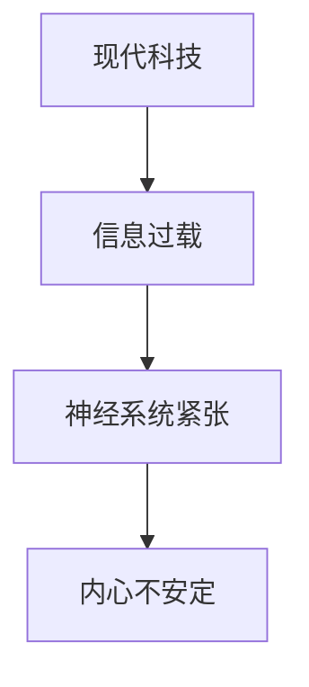

#### 核心概念与联系

- **信息过载：**随着互联网的普及，人们每天都会接收到大量的信息，这种信息过载让人们的神经系统处于持续紧张的状态。
- **神经系统紧张：**长期处于紧张状态，会导致人们的内心感到不安定，从而影响身心健康。

### 1.2 内心平静的重要性

内心平静是一种心理状态，它意味着内心的平和与安宁。在快节奏的生活中，保持内心平静具有重要的意义：

#### Mermaid 流程图：内心平静的层次

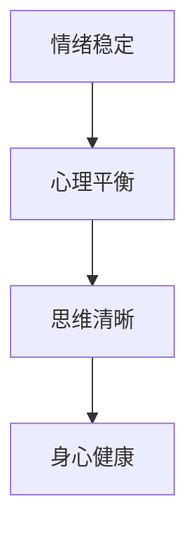

#### 核心概念与联系

- **情绪稳定：**内心平静的人能够更好地控制自己的情绪，不易受到外界的影响。
- **心理平衡：**内心平静有助于保持心理的平衡，减少焦虑和压力。
- **思维清晰：**内心平静有助于提高思维的清晰度，从而更好地应对生活中的问题。
- **身心健康：**内心平静对身心健康有积极的影响，有助于减少心理疾病的发生。

### 1.3 本书的目的和结构

本书旨在帮助读者在快节奏的生活中寻找内心平静。通过以下章节的内容，读者将学会：

- 认识内心平静
- 压力管理
- 时间管理
- 冥想与放松
- 健康生活方式
- 人际交往
- 内心平静的实践

## 第2章：认识内心平静

内心平静并不是一种虚无缥缈的状态，它有着具体的定义和类型。通过了解内心平静的定义、类型和保持方法，我们可以更好地理解它，并在日常生活中实践。

### 2.1 内心平静的定义和类型

#### 内心平静的定义

内心平静是指一种心理状态，在这种状态下，个体能够保持情绪稳定、心理平衡、思维清晰和身心健康。

#### 内心平静的类型

1. **深度内心平静：**这是一种深层次的内心平静，个体在这种状态下能够完全放松，身心合一。
2. **表面内心平静：**这种状态下，个体表面上看起来平静，但内心可能仍有焦虑和紧张。

#### Mermaid 流程图：内心平静的类型

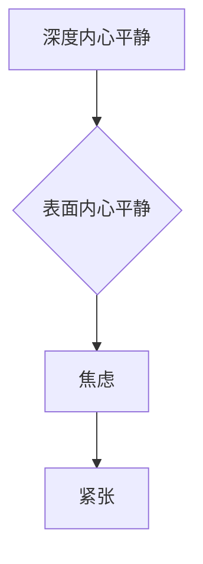

### 2.2 内心平静的状态和表现

内心平静的状态和表现可以从以下几个方面来衡量：

1. **情绪稳定：**内心平静的人能够控制自己的情绪，不易受到外界的影响。
2. **心理平衡：**内心平静有助于保持心理的平衡，减少焦虑和压力。
3. **思维清晰：**内心平静有助于提高思维的清晰度，从而更好地应对生活中的问题。
4. **身心健康：**内心平静对身心健康有积极的影响，有助于减少心理疾病的发生。

### 2.3 保持内心平静的方法和技巧

保持内心平静需要一定的方法和技巧，以下是一些常见的技巧：

1. **深呼吸：**通过深呼吸，可以帮助人们放松身心，减轻压力。
2. **冥想：**冥想是一种有效的放松技巧，可以帮助人们达到内心平静的状态。
3. **运动：**适当的运动有助于释放压力，提高身心健康。
4. **社交：**与亲朋好友交流，分享彼此的经历和感受，有助于减轻内心的负担。

## 第3章：压力管理

在快节奏的生活中，压力是不可避免的。然而，我们可以通过有效的压力管理策略来减轻压力，保持内心的平静。

### 3.1 压力的定义和分类

#### 压力的定义

压力是指一种身心紧张的状态，通常由外界因素引起，如工作压力、人际关系压力、经济压力等。

#### 压力的分类

1. **急性压力：**这是一种短期的、强烈的压力，通常由突发事件引起。
2. **慢性压力：**这是一种长期的、持续的压

----------------------------------------------------------------

## 第4章：时间管理

在快节奏的生活中，时间管理变得尤为重要。通过有效的时间管理，我们可以提高工作效率，减轻生活压力，从而保持内心的平静。

### 4.1 时间管理的重要性

#### 时间管理的重要性

- **提高工作效率：**通过合理安排时间，我们可以避免拖延，提高工作效率，从而减少工作压力。
- **减轻生活压力：**合理安排时间，可以让我们有更多的时间进行休息和娱乐，减轻生活压力。
- **保持内心平静：**通过有效的时间管理，我们可以更好地平衡工作和生活，保持内心的平静。

#### Mermaid 流程图：时间管理的重要性

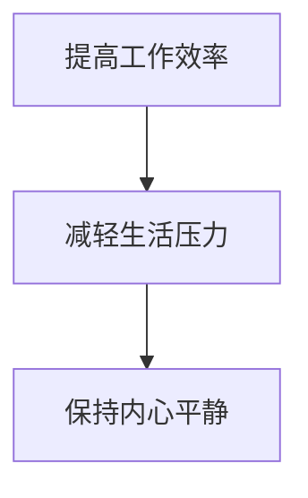

### 4.2 时间管理的原则

#### 时间管理的原则

- **目标明确：**在开始时间管理之前，我们需要明确自己的目标，这样才能有针对性地安排时间。
- **优先级排序：**将任务按照优先级排序，优先完成重要且紧急的任务。
- **合理规划：**合理安排时间，确保有足够的时间用于工作和休息。
- **灵活调整：**时间管理是一个动态的过程，我们需要根据实际情况灵活调整时间安排。

#### Mermaid 流程图：时间管理的原则

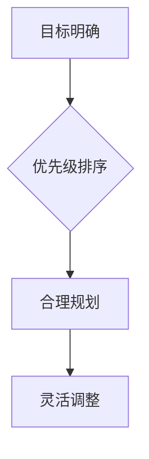

### 4.3 时间管理的技巧

#### 时间管理的技巧

- **制定日程表：**将每天的任务和时间安排记录在日程表中，有助于提高时间利用率。
- **番茄工作法：**将工作时间划分为25分钟的工作周期，每个周期后休息5分钟，有助于提高工作效率。
- **分解任务：**将大任务分解为小任务，逐一完成，避免拖延。
- **避免干扰：**在工作时避免不必要的干扰，如关闭社交媒体、手机等。

#### Mermaid 流程图：时间管理的技巧

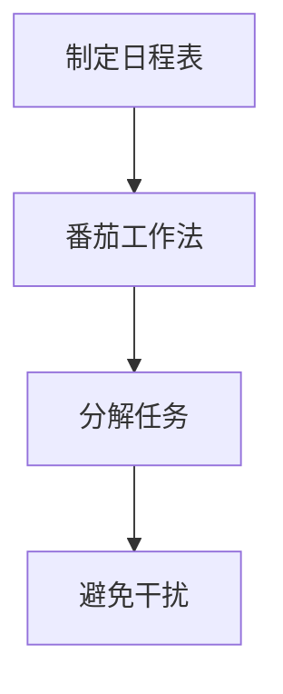

### 4.4 实际案例：时间管理实践

#### 案例一：工作日的日程安排

**上午：**
- 9:00 - 11:00：处理重要且紧急的工作任务。
- 11:00 - 11:15：休息，喝杯茶。
- 11:15 - 12:30：继续处理工作任务。

**下午：**
- 13:30 - 15:00：准备会议材料。
- 15:00 - 15:15：休息，散步放松。
- 15:15 - 17:00：参加会议。

**晚上：**
- 18:00 - 19:00：晚餐。
- 19:00 - 20:00：阅读书籍。
- 20:00 - 21:00：和家人交流。

#### 案例二：周末的时间安排

**周六：**
- 9:00 - 11:00：晨跑。
- 11:00 - 12:00：早餐。
- 12:00 - 14:00：处理未完成的工作任务。
- 14:00 - 16:00：参加朋友聚会。
- 16:00 - 18:00：看电影或进行其他娱乐活动。

**周日：**
- 9:00 - 11:00：去公园散步。
- 11:00 - 12:00：午餐。
- 12:00 - 14:00：休息，听音乐。
- 14:00 - 16:00：学习新的技能或兴趣爱好。
- 16:00 - 18:00：与家人一起做饭。

### 4.5 小结

通过上述案例，我们可以看到，合理的时间管理不仅可以提高工作效率，还可以帮助我们更好地平衡工作与生活，从而保持内心的平静。在实际应用中，我们需要根据自己的实际情况和需求，灵活调整时间安排，找到适合自己的时间管理方法。

## 第5章：冥想与放松

冥想和放松是寻找内心平静的重要方法。通过冥想和放松，我们可以减轻压力，提高生活质量。

### 5.1 冥想与放松的概念

#### 冥想

冥想是一种古老的修行方法，通过集中注意力和意识，达到内心的平静。冥想可以帮助我们减轻压力，提高专注力，增强心理韧性。

#### 放松

放松是指通过一系列的方法和技巧，使身体和心灵得到放松，从而减轻压力。放松可以帮助我们缓解疲劳，提高睡眠质量，增强身心健康。

#### Mermaid 流程图：冥想与放松的关系

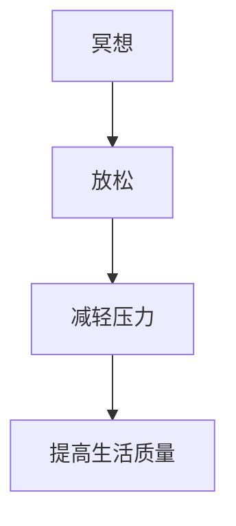

### 5.2 冥想与放松的技巧

#### 冥想的技巧

- **选择合适的环境：**找一个安静、舒适的地方进行冥想。
- **坐姿舒适：**保持坐姿舒适，可以采用莲花座或半莲花座。
- **专注于呼吸：**将注意力集中在呼吸上，感受呼吸的起伏。
- **避免杂念：**冥想过程中，避免杂念干扰，如果出现了杂念，可以将其放回呼吸上。

#### 放松的技巧

- **深呼吸：**通过深呼吸，可以放松身体，减轻压力。
- **渐进性肌肉放松：**逐步放松身体的各个肌肉群，从脚开始，逐步向上。
- **冥想音乐：**聆听轻柔的冥想音乐，有助于放松身心。

#### Mermaid 流程图：冥想与放松的技巧

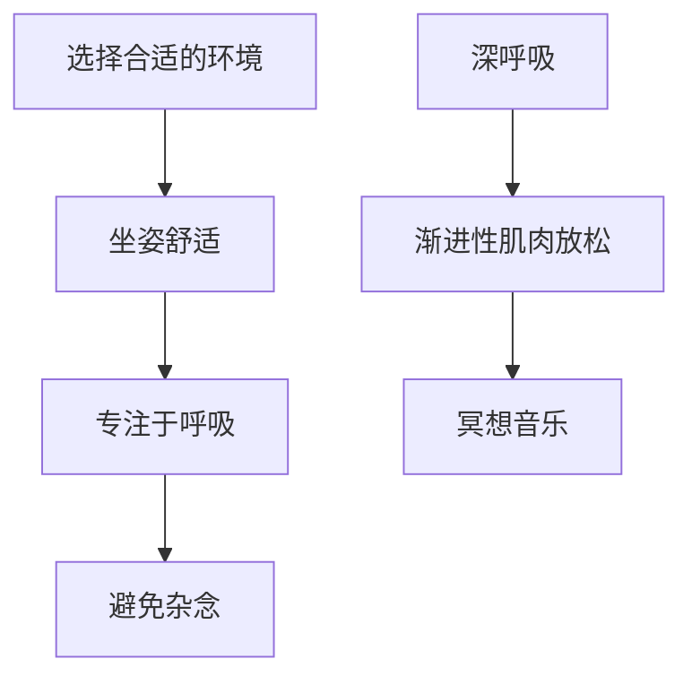

### 5.3 冥想与放松的益处

#### 冥想的益处

- **减轻压力：**冥想可以帮助我们减轻压力，提高心理韧性。
- **提高专注力：**冥想可以提高我们的专注力，提高工作和学习效率。
- **改善睡眠：**冥想可以帮助我们改善睡眠质量，提高睡眠效率。

#### 放松的益处

- **缓解疲劳：**放松可以帮助我们缓解身体和精神的疲劳，提高生活质量。
- **提高睡眠质量：**放松可以帮助我们放松身心，提高睡眠质量。
- **增强身心健康：**放松可以增强我们的身心健康，提高免疫力。

#### Mermaid 流�图：冥想与放松的益处

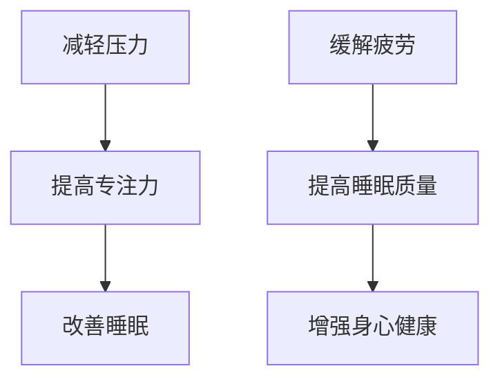

### 5.4 实践指南

#### 冥想实践指南

- **每天练习：**每天安排一定的时间进行冥想，逐步建立习惯。
- **保持一致性：**在冥想时，保持一致性和规律性，有助于提高效果。
- **找到自己的方法：**每个人的冥想方法可能不同，找到适合自己的方法，才能达到最好的效果。

#### 放松实践指南

- **定期放松：**每周安排一段时间进行放松，让自己充分休息。
- **选择适合自己的放松方法：**根据自己的喜好和需求，选择合适的放松方法。
- **营造良好的环境：**选择一个安静、舒适的环境，有助于放松身心。

### 5.5 小结

冥想与放松是寻找内心平静的有效方法。通过冥想，我们可以提高专注力，减轻压力；通过放松，我们可以缓解疲劳，提高睡眠质量。在实际生活中，我们可以根据自己的需求和实践效果，灵活运用冥想与放松的方法，以实现内心的平静。

## 第6章：健康生活方式

健康生活方式是实现内心平静的重要基础。通过合理的饮食、适度的运动和良好的作息习惯，我们可以提高身心健康，从而保持内心的平静。

### 6.1 健康生活方式的概念

#### 健康生活方式

健康生活方式是指通过合理的生活习惯和行为，保持身心健康，提高生活质量。

#### 健康生活方式的重要性

- **提高免疫力：**健康的生活方式可以增强身体的免疫力，减少患病风险。
- **预防慢性疾病：**健康的生活方式可以预防慢性疾病，如高血压、糖尿病等。
- **保持体重：**健康的生活方式可以帮助我们控制体重，减少肥胖问题。
- **改善睡眠：**健康的生活方式可以改善睡眠质量，提高睡眠效率。

#### Mermaid 流程图：健康生活方式的重要性

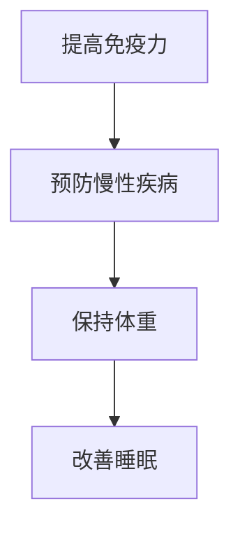

### 6.2 合理饮食

#### 合理饮食

合理饮食是实现健康生活方式的重要方面。以下是一些合理饮食的建议：

- **多样化：**饮食多样化，摄入各类营养素，保证身体的营养需求。
- **控制热量：**适量摄入热量，避免过量摄入导致肥胖。
- **少油少盐：**减少油脂和盐的摄入，降低心血管疾病风险。
- **多吃蔬菜水果：**多吃蔬菜水果，提供丰富的维生素和纤维素。

#### Mermaid 流程图：合理饮食的建议

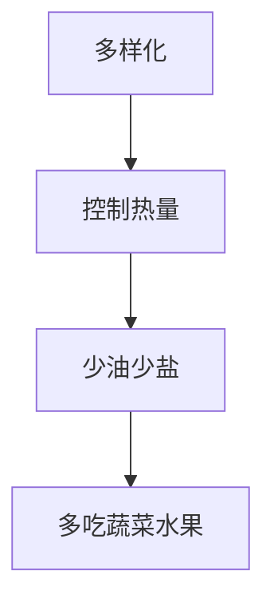

### 6.3 适度运动

#### 适度运动

适度运动是健康生活方式的重要组成部分。以下是一些适度运动的建议：

- **每周运动时间：**每周至少进行150分钟的中等强度运动或75分钟的高强度运动。
- **选择适合自己的运动：**根据自己的兴趣和身体状况选择合适的运动方式，如跑步、游泳、瑜伽等。
- **持之以恒：**保持运动习惯，长期坚持，才能看到效果。

#### Mermaid 流程图：适度运动的建议

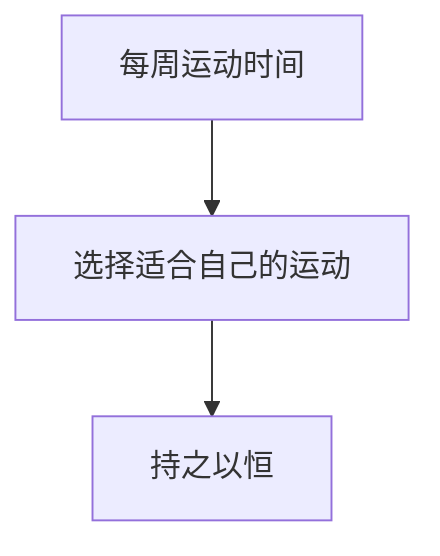

### 6.4 良好的作息习惯

#### 良好的作息习惯

良好的作息习惯对于保持身心健康至关重要。以下是一些良好的作息习惯：

- **规律作息：**保持规律的作息时间，尽量每天在相同的时间入睡和起床。
- **充足睡眠：**保证充足的睡眠时间，每晚睡眠7-8小时。
- **避免熬夜：**避免熬夜，保持良好的作息习惯。
- **适当午休：**适当午休，提高下午的工作效率。

#### Mermaid 流程图：良好的作息习惯

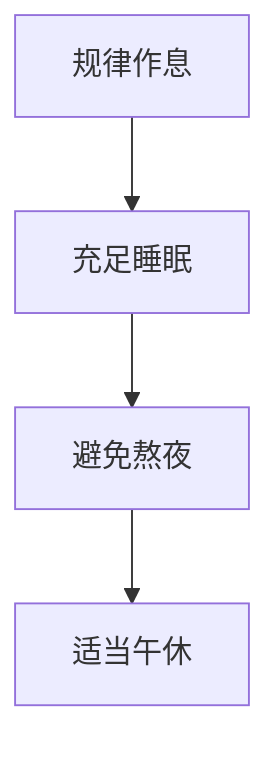

### 6.5 实践指南

#### 实践指南

- **制定健康计划：**制定一个具体的健康计划，包括饮食、运动和作息等方面的内容。
- **逐步实施：**逐步实施健康计划，避免急于求成。
- **持之以恒：**保持良好的生活习惯，长期坚持，才能看到效果。

### 6.6 小结

健康生活方式是实现内心平静的重要基础。通过合理的饮食、适度的运动和良好的作息习惯，我们可以提高身心健康，从而保持内心的平静。在实际生活中，我们需要根据自己的实际情况，制定合适的健康计划，并持之以恒地实施，以实现内心的平静。

## 第7章：人际交往

在快节奏的生活中，人际交往是不可避免的。良好的人际交往能力不仅可以提高生活质量，还可以帮助我们保持内心的平静。

### 7.1 人际交往的概念

#### 人际交往

人际交往是指人与人之间的相互作用和互动，包括言语、行为、情感等方面的交流。

#### 人际交往的重要性

- **心理健康：**良好的人际交往有助于提高心理健康，减轻压力和焦虑。
- **社会支持：**良好的人际交往可以为我们提供社会支持，增强心理韧性。
- **职业发展：**良好的人际交往能力有助于我们在职业领域取得成功。

#### Mermaid 流程图：人际交往的重要性

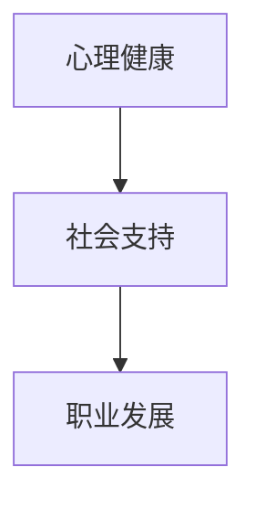

### 7.2 人际交往中的平和

#### 人际交往中的平和

人际交往中的平和是指在与他人交往时，能够保持内心的平静，不因外界因素而情绪波动。

#### 保持人际交往中的平和的方法

- **倾听：**倾听他人的意见和需求，尊重他人的观点，避免争吵。
- **同理心：**站在他人的角度思考问题，理解他人的情感和需求。
- **适度表达：**在表达自己的观点时，保持适度，避免过于情绪化。
- **控制情绪：**在面对冲突时，保持冷静，避免情绪失控。

#### Mermaid 流程图：保持人际交往中的平和的方法

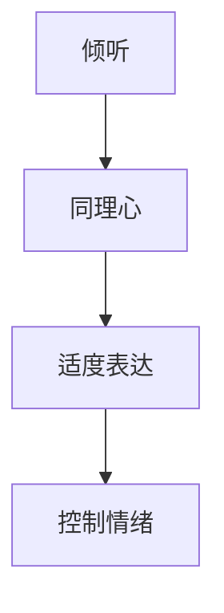

### 7.3 人际交往的技巧

#### 人际交往的技巧

- **建立良好的沟通：**学会倾听和表达，建立有效的沟通方式。
- **保持真诚：**真诚对待他人，建立信任关系。
- **适当妥协：**在人际交往中，学会适当妥协，避免冲突。
- **保持距离：**与他人保持适当的距离，避免过于亲近或疏远。

#### Mermaid 流程图：人际交往的技巧

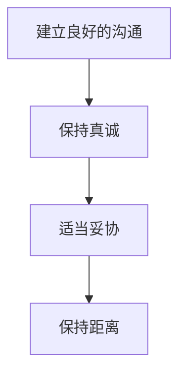

### 7.4 实际案例：人际交往中的平和

#### 案例一：工作场合

**场景：**团队成员之间因为工作意见不合发生争执。

**解决方法：**
1. **倾听：**在争执发生时，先倾听对方的观点和需求。
2. **同理心：**尝试从对方的角度理解问题。
3. **适度表达：**在表达自己的观点时，保持冷静和适度。
4. **控制情绪：**避免情绪失控，保持内心的平和。

#### 案例二：家庭生活

**场景：**家庭成员之间因为琐事发生争吵。

**解决方法：**
1. **倾听：**倾听对方的意见和感受，避免争吵。
2. **同理心：**站在对方的角度理解问题。
3. **适度表达：**在表达自己的观点时，保持真诚和适度。
4. **控制情绪：**在面对冲突时，保持冷静，避免情绪失控。

### 7.5 小结

人际交往是生活中不可避免的一部分。通过保持内心的平和，我们可以更好地处理人际关系，提高生活质量。在实际生活中，我们可以通过倾听、同理心、适度表达和控制情绪等方法，来保持人际交往中的平和。

## 第8章：内心平静的实践

在实际生活中，我们可能会遇到各种挑战，但通过一系列的实践方法和技巧，我们可以更好地保持内心的平静。

### 8.1 实践方法

#### 呼吸练习

**步骤：**
1. 找一个安静的地方，坐下或躺下，保持舒适的姿势。
2. 将一只手放在胸部，另一只手放在腹部。
3. 深吸一口气，感受腹部上升，胸部微微抬起。
4. 慢慢呼气，感受腹部下降，胸部下沉。
5. 重复这个动作，专注于呼吸的感觉。

#### 冥想练习

**步骤：**
1. 找一个安静的地方，坐下或躺下，保持舒适的姿势。
2. 关闭眼睛，将注意力集中在呼吸上。
3. 当你的思维开始分散时，将其带回到呼吸上。
4. 持续这个过程，每次冥想时间可以逐渐增加。

#### 放松练习

**步骤：**
1. 找一个安静的地方，坐下或躺下，保持舒适的姿势。
2. 将注意力集中在身体的感觉上。
3. 从脚开始，逐渐放松身体的各个部位，直到头部。
4. 专注于放松的感觉，感受身体的轻松和舒适。

### 8.2 实践技巧

#### 时间管理

**技巧：**
1. 制定日程表，合理安排工作和休息时间。
2. 优先处理重要和紧急的任务。
3. 避免拖延，设定明确的目标和截止日期。

#### 压力管理

**技巧：**
1. 学会放松技巧，如深呼吸、冥想、放松练习等。
2. 保持良好的作息习惯，保证充足的睡眠。
3. 与亲朋好友交流，分享自己的压力和困扰。

#### 心理健康

**技巧：**
1. 保持积极的心态，学会从困境中寻找机会。
2. 定期进行心理健康检查，寻求专业帮助。
3. 学会自我调节，提高心理韧性。

### 8.3 实践案例分析

#### 案例一：工作压力

**问题：**工作中经常感到压力，导致情绪波动和睡眠质量下降。

**解决方案：**
1. **时间管理：**合理安排工作时间，避免加班。
2. **放松练习：**每天进行深呼吸和放松练习，缓解压力。
3. **心理辅导：**定期进行心理辅导，提高心理韧性。

#### 案例二：家庭压力

**问题：**家庭琐事导致情绪不稳定，影响家庭关系。

**解决方案：**
1. **沟通技巧：**与家人保持良好的沟通，倾听彼此的需求和意见。
2. **同理心：**站在对方的角度思考问题，避免争吵。
3. **放松练习：**每天进行放松练习，保持内心的平静。

### 8.4 小结

通过一系列的实践方法和技巧，我们可以更好地保持内心的平静。在实际生活中，我们需要根据自己的需求和实际情况，灵活运用这些方法和技巧，找到适合自己的方式，以实现内心的平静。

## 第9章：结语

在快节奏的生活中寻找内心平静是一项重要的任务。通过本书的内容，我们了解到了压力管理、时间管理、冥想与放松、健康生活方式和人际交往等方面的方法和技巧。这些方法和技巧不仅可以帮助我们在日常生活中保持内心的平静，还可以提高生活质量，实现身心健康。

### 9.1 总结

- **压力管理：**通过识别和应对压力，我们可以减轻心理负担，保持心理健康。
- **时间管理：**通过合理安排时间和任务，我们可以提高工作效率，减轻生活压力。
- **冥想与放松：**通过冥想和放松技巧，我们可以减轻压力，提高生活质量。
- **健康生活方式：**通过合理的饮食、适度的运动和良好的作息习惯，我们可以提高身心健康。
- **人际交往：**通过良好的人际交往技巧，我们可以处理人际关系，保持内心的平和。

### 9.2 强调内心平静的重要性

在快节奏的生活中，保持内心平静至关重要。内心平静不仅可以帮助我们应对生活中的各种挑战，还可以提高我们的生活质量，实现身心健康。通过本书的学习和实践，我们相信每个人都可以找到适合自己的方法，在快节奏的生活中保持内心的平静。

### 9.3 鼓励实践

内心平静并非一蹴而就，需要我们不断地学习和实践。在这里，我们鼓励读者将本书的内容应用到实际生活中，不断尝试和实践各种方法和技巧。只有通过实践，我们才能真正体会到内心平静的益处，实现身心的和谐。

### 9.4 结语

让我们携手共进，在快节奏的生活中寻找内心平静，享受美好的人生旅程。让我们用心去感受每一个瞬间，珍惜与家人、朋友相处的时光，让自己的内心充满温暖和喜悦。

## 作者信息

作者：AI天才研究院/AI Genius Institute & 禅与计算机程序设计艺术 /Zen And The Art of Computer Programming

----------------------------------------------------------------

## 最佳实践 tips

1. **每日呼吸练习：**每天早上起床后和晚上睡觉前，进行5分钟的深呼吸练习，有助于缓解压力，提升心情。
2. **时间管理技巧：**使用番茄工作法，将工作时间划分为25分钟的工作周期，每个周期后休息5分钟，有助于提高工作效率。
3. **定期冥想：**每周至少进行一次冥想，每次20分钟，有助于减轻压力，提高专注力。
4. **健康饮食：**每天摄入足够的蔬菜和水果，减少油脂和糖的摄入，有助于保持身体健康。
5. **适量运动：**每周进行至少150分钟的中等强度运动，如快走、游泳或骑自行车，有助于提高身体素质。
6. **人际交往：**定期与亲朋好友交流，分享彼此的生活和感受，有助于减轻心理压力。

## 小结

通过本文的探讨，我们认识到在快节奏的生活中保持内心平静的重要性。通过压力管理、时间管理、冥想与放松、健康生活方式和人际交往等方面的实践，我们可以找到适合自己的方法，实现内心的平静。让我们将这些方法和技巧应用到实际生活中，不断提升自己的生活质量，享受内心的平静与喜悦。

## 注意事项

1. **实践前咨询专业医生：**在进行任何健康生活方式的改变前，请务必咨询专业医生，确保健康安全。
2. **合理分配时间：**在实践时间管理技巧时，要确保工作与休息的平衡，避免过度劳累。
3. **坚持实践：**保持内心平静需要长期的努力和坚持，不要期望一蹴而就。
4. **情绪管理：**在处理人际关系时，要注意情绪管理，避免情绪失控影响关系。

## 拓展阅读

1. **《正念：如何活在当下》**：这本书介绍了正念冥想的方法，帮助读者实现内心的平静。
2. **《时间管理的艺术》**：这本书详细阐述了时间管理的原则和技巧，帮助读者提高工作效率。
3. **《健康生活方式指南》**：这本书提供了关于健康饮食、运动和作息习惯的详细建议，帮助读者保持身心健康。
4. **《人际关系心理学》**：这本书探讨了人际关系中的心理现象和技巧，帮助读者建立良好的人际关系。

