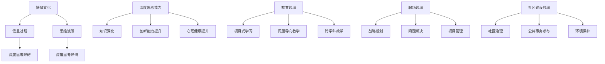

                 

### 文章标题

# 在快餐文化中寻找深度思考

### 关键词

- 快餐文化
- 深度思考
- 思维浅薄
- 信息过载
- 培养方法

### 摘要

在当今信息爆炸和快节奏的社会中，快餐文化的影响无处不在。人们往往被碎片化的信息所淹没，导致思维浅薄和深度思考能力的下降。本文旨在探讨如何在快餐文化中培养深度思考能力，分析快餐文化的现象与影响，定义深度思考及其重要性，并提出具体的培养方法和实践案例。希望通过本文的探讨，能够激发读者对深度思考的重视，从而在快餐文化中寻找到思维的深度与广度。

## 第一部分：对快餐文化的批判

### 第1章：快餐文化的现象与影响

#### 1.1 快餐文化的定义与特征

快餐文化，指的是一种以追求速度和便利为特征的社会现象，其核心在于快速消费和迅速满足。这种文化在现代社会中广泛存在，从快节奏的工作生活到快餐食品的普及，无不体现了快餐文化的特征。快餐文化不仅改变了人们的消费习惯，也深刻影响了人们的思维方式。

快餐文化的特征主要体现在以下几个方面：

1. **速度追求**：在快节奏的社会中，人们追求高效，追求速度，时间观念日益强化。无论是生活还是工作，人们越来越倾向于以最短的时间完成最多的事情。
   
2. **浅层消费**：快餐文化的消费模式通常是浅层的，注重表面的享受和即刻的满足，缺乏深层次的思考和实践。这种消费模式导致人们对于事物的理解往往停留在表面，难以深入。

3. **信息过载**：随着互联网和智能手机的普及，人们接触到的信息量急剧增加，但大多数信息都是碎片化的、表面的。这种信息过载使得人们难以进行深度思考，往往只是被动接受信息，而无法主动思考。

#### 1.2 快餐文化在社会中的普及

快餐文化在全球范围内迅速普及，主要得益于以下几个方面：

1. **城市化进程**：随着城市化进程的加快，人们的生活节奏变得越来越快，快餐文化作为一种适应快节奏生活的消费模式，得到了广泛推广。

2. **商业竞争**：快餐行业的竞争激烈，各大品牌通过不断创新和优化服务，进一步推动了快餐文化的普及。

3. **技术发展**：互联网和移动支付技术的快速发展，使得快餐服务更加便捷，满足了人们随时随地的需求。

#### 1.3 快餐文化对个体生活的影响

快餐文化对个体生活的影响是多方面的，主要包括以下几个方面：

1. **健康问题**：快餐食品通常富含高热量、高脂肪、高糖分，长期摄入不利于健康。此外，快餐文化的快节奏生活方式也容易导致人们忽视身体健康，缺乏锻炼。

2. **心理健康**：快餐文化的快速消费模式导致人们往往无法深入体验和享受生活，心理上的满足感不足，容易产生焦虑和抑郁情绪。

3. **社交关系**：快餐文化的影响使得人们的社交关系变得浅薄，难以建立深厚的情感联系。人们更多地关注表面的交流，而忽视了深层次的沟通和理解。

### 第2章：信息过载与思维浅薄

#### 2.1 信息过载现象

信息过载是指个体在信息处理过程中，由于信息量过大而无法有效处理的现象。在现代社会中，随着互联网和智能手机的普及，人们接触到的信息量急剧增加，但大多数信息都是碎片化的、表面的。这种现象被称为信息过载。

信息过载的主要表现为：

1. **信息碎片化**：互联网上的信息往往是碎片化的，缺乏系统性和完整性。人们往往只是浏览一下标题和摘要，就匆匆做出判断。

2. **信息泛滥**：社交媒体、新闻推送等平台不断推送各种信息，导致人们无法筛选和判断哪些信息是真正重要的。

3. **信息焦虑**：面对大量的信息，人们往往感到焦虑和压力，担心错过重要的信息，导致心理负担增加。

#### 2.2 思维浅薄的影响

思维浅薄是指由于信息过载和快餐文化的影响，人们的思维方式变得简单化、表面化，缺乏深度和广度。思维浅薄的影响主要体现在以下几个方面：

1. **认知局限**：思维浅薄导致人们对于问题的理解停留在表面，难以深入挖掘问题的本质。这种认知局限限制了人们的思维发展。

2. **创新障碍**：思维浅薄使得人们难以进行创新思维，往往只能接受现有的知识和观点，缺乏突破性的思维。

3. **决策困难**：在信息过载的环境下，人们难以对大量信息进行有效处理，导致决策困难。

#### 2.3 快餐文化与思维浅薄的关系

快餐文化与思维浅薄之间存在密切的关系：

1. **相互促进**：快餐文化的快速消费模式和思维浅薄的特征相互促进，导致人们更加倾向于追求快速、表面的满足。

2. **恶性循环**：快餐文化导致思维浅薄，思维浅薄又使得人们更加依赖快餐文化，形成恶性循环。

## 第二部分：深度思考的定义和重要性

### 第3章：深度思考的定义

#### 3.1 深度思考的概念

深度思考是指通过深入分析、综合、推理和反思，对问题进行多角度、多层次的探索，以获得更深层次的理解和洞察。深度思考不仅仅是对信息的简单处理，而是一种主动的、积极的思维方式。

深度思考的核心特点包括：

1. **多角度分析**：深度思考要求从多个角度对问题进行分析，避免片面和单一的思考方式。

2. **系统性理解**：深度思考强调对问题的系统性理解，注重各个部分之间的联系和相互作用。

3. **批判性思维**：深度思考需要具备批判性思维，能够对信息进行质疑、分析和评估，避免盲目接受。

4. **反思与调整**：深度思考是一个不断反思和调整的过程，通过不断的反思和修正，不断提高思维的质量和深度。

#### 3.2 深度思考与传统思考的比较

传统思考通常是指基于经验、直觉和习惯的思维方式，而深度思考则是一种更为系统和深入的思考方式。两者之间的比较如下：

1. **思考深度**：传统思考往往停留在表面，而深度思考能够深入挖掘问题的本质和内在联系。

2. **思考广度**：传统思考往往局限于特定领域，而深度思考能够跨领域、跨学科进行思考，具有更广泛的视野。

3. **思考质量**：传统思考往往缺乏批判性，容易受到外部因素的干扰，而深度思考具有更高的独立性和客观性。

### 第4章：深度思考的重要性

#### 4.1 深度思考在个人成长中的作用

深度思考对个人成长具有重要作用，主要体现在以下几个方面：

1. **知识深化**：深度思考能够帮助人们深化对知识的理解和掌握，不仅知其然，更知其所以然。

2. **思维能力提升**：深度思考能够锻炼人们的思维能力，提高分析和解决问题的能力。

3. **创新意识增强**：深度思考能够激发人们的创新意识，促进创新思维的发展。

4. **自我认知提升**：深度思考能够帮助人们更好地认识自己，发现自己的优点和不足，促进自我成长。

#### 4.2 深度思考在社会发展中的价值

深度思考不仅对个人成长具有重要意义，也对社会发展具有深远的影响，主要体现在以下几个方面：

1. **决策科学性**：深度思考能够提高决策的科学性和合理性，减少盲目决策带来的风险。

2. **创新能力提升**：深度思考能够促进社会创新，推动科技进步和社会发展。

3. **文化繁荣**：深度思考能够促进文化的繁荣和发展，提高社会文明程度。

4. **可持续发展**：深度思考能够引导社会走向可持续发展的道路，促进经济、社会和环境的协调发展。

## 第三部分：培养深度思考的实践方法

### 第5章：培养深度思考的方法

#### 5.1 设定目标和问题

培养深度思考的第一步是设定明确的目标和问题。具体方法如下：

1. **明确目标**：设定具体、可衡量的目标，例如阅读一本书、完成一个项目等。

2. **提出问题**：针对目标，提出有针对性的问题，例如如何实现目标、目标实现后的效果等。

3. **问题筛选**：从多个问题中筛选出最具挑战性和价值的问题，作为深度思考的重点。

#### 5.2 探索和批判性思维

深度思考的核心在于探索和批判性思维，具体方法如下：

1. **广泛阅读**：通过阅读书籍、文章、报告等，获取丰富的信息和知识，为深度思考提供基础。

2. **跨领域思考**：跨领域思考能够拓宽视野，发现不同领域之间的联系和相互影响。

3. **批判性思维**：对所获取的信息和观点进行质疑、分析和评估，避免盲目接受。

#### 5.3 阅读和实践

阅读和实践是培养深度思考的重要方法，具体方法如下：

1. **深度阅读**：通过深度阅读，理解书中的核心概念和理论，掌握作者的思路和观点。

2. **实践应用**：将阅读中学到的知识和观点应用到实际中，通过实践来验证和深化理解。

3. **反思总结**：在阅读和实践过程中，不断反思和总结，发现自身的不足和需要改进的地方。

### 第6章：深度思考的工具与技术

#### 6.1 思维导图

思维导图是一种有效的思维工具，可以帮助人们进行深度思考。具体方法如下：

1. **制作思维导图**：通过绘制思维导图，将思考过程和关键信息以图形的方式呈现出来。

2. **梳理思路**：通过思维导图，梳理思路，发现不同信息之间的联系和相互作用。

3. **优化思维导图**：根据反馈和实际应用，不断优化和改进思维导图，提高思考的质量。

#### 6.2 脑图

脑图是另一种有效的思维工具，可以帮助人们进行深度思考。具体方法如下：

1. **绘制脑图**：通过绘制脑图，将大脑中的思考和想法以图形的方式呈现出来。

2. **发现联系**：通过脑图，发现不同想法之间的联系和相互作用，从而深入挖掘问题。

3. **脑图应用**：将脑图应用到实际中，通过不断调整和优化，提高思考的效率和质量。

#### 6.3 批判性阅读

批判性阅读是培养深度思考的重要方法，具体方法如下：

1. **批判性阅读**：对阅读材料进行批判性分析，质疑、分析和评估其中的观点和论据。

2. **问题导向**：在阅读过程中，以问题为导向，提出有针对性的问题，引导深度思考。

3. **反思总结**：在阅读后，反思总结，发现自身的不足和需要改进的地方。

## 第四部分：深度思考的案例研究

### 第7章：深度思考在现实中的应用

#### 7.1 教育领域的深度思考培养

在教育领域，深度思考的培养是一项重要任务。具体案例包括：

1. **项目式学习**：通过项目式学习，让学生在实际项目中应用所学知识，培养深度思考能力。

2. **问题导向教学**：通过提出有针对性的问题，引导学生进行深度思考，发现问题的本质。

3. **跨学科教学**：通过跨学科教学，拓宽学生的视野，培养跨领域的深度思考能力。

#### 7.2 工作中的深度思考实践

在职场中，深度思考的应用同样具有重要意义。具体案例包括：

1. **战略规划**：通过深度思考，制定科学合理的战略规划，提高企业的竞争力和创新能力。

2. **问题解决**：在面对问题时，通过深度思考，找到根本原因，提出有效的解决方案。

3. **项目管理**：通过深度思考，制定科学合理的项目计划，确保项目顺利进行。

#### 7.3 社区建设和公共生活中的深度思考

在社区建设和公共生活中，深度思考同样发挥着重要作用。具体案例包括：

1. **社区治理**：通过深度思考，提出有效的社区治理方案，提高社区治理水平。

2. **公共事务**：通过深度思考，参与公共事务的讨论和决策，提高公共事务的科学性和合理性。

3. **环境保护**：通过深度思考，提出有效的环境保护措施，推动可持续发展。

## 附录：深度思考实践指南

### 附录1：深度思考实践清单

1. **阅读清单**：列出深度思考所需的阅读材料，包括书籍、文章、报告等。

2. **思考问题**：针对阅读材料，提出有针对性的问题，引导深度思考。

3. **实践任务**：列出深度思考的实际任务，例如项目、实验等。

### 附录2：深度思考工具使用指南

1. **思维导图**：介绍思维导图的绘制方法、使用技巧和注意事项。

2. **脑图**：介绍脑图的绘制方法、使用技巧和注意事项。

3. **批判性阅读**：介绍批判性阅读的方法、技巧和注意事项。

### 附录3：深度思考案例精选

1. **教育领域**：精选教育领域的深度思考案例，分析其成功经验和不足之处。

2. **职场领域**：精选职场领域的深度思考案例，分析其成功经验和不足之处。

3. **社区建设领域**：精选社区建设领域的深度思考案例，分析其成功经验和不足之处。

### 作者信息

作者：AI天才研究院/AI Genius Institute & 禅与计算机程序设计艺术 /Zen And The Art of Computer Programming

## 核心概念原理之间的关系架构 Mermaid 流程图



## 核心算法原理讲解

在深度思考的培养过程中，理解算法原理是关键的一步。以下将介绍一种常用的深度学习算法——卷积神经网络（CNN），并使用伪代码详细阐述其工作原理。

### 卷积神经网络（CNN）

卷积神经网络是一种特别适合于图像处理的深度学习算法。它通过卷积操作和池化操作来提取图像的特征。

#### 伪代码

```python
# 初始化权重和偏置
W1, b1 = 初始化权重和偏置()
W2, b2 = 初始化权重和偏置()
...

# 定义卷积操作
def conv2d(input, filter):
    output = []
    for i in range(input的高度):
        row_output = []
        for j in range(input的宽度):
            local_output = []
            for k in range(filter的高度):
                for l in range(filter的宽度):
                    local_output.append(input[i+k][j+l] * filter[k][l])
            row_output.append(激活函数(局部输出))
        output.append(row_output)
    return 激活函数(全局输出)

# 定义池化操作
def pooling(output):
    new_output = []
    for i in range(output的高度):
        for j in range(output的宽度):
            local_output = []
            for k in range(pool的大小):
                for l in range(pool的大小):
                    local_output.append(output[i+k][j+l])
            new_output.append(最大值(local_output))
    return new_output

# 定义卷积神经网络
def CNN(input, W1, b1, W2, b2, ...):
    output1 = conv2d(input, W1) + b1
    output2 = pooling(output1)
    ...
    return outputN
```

### 数学模型和公式

在深度学习中，激活函数是至关重要的一部分。以下是一个常见的激活函数——ReLU（Rectified Linear Unit）的数学模型。

$$
ReLU(x) =
\begin{cases}
    0 & \text{if } x < 0 \\
    x & \text{if } x \geq 0
\end{cases}
$$

ReLU函数的优点是其计算简单，参数少，而且能够有效避免神经网络中的梯度消失问题。

### 详细讲解与举例说明

假设我们有一个简单的图像分类问题，输入图像的大小为32x32，我们需要通过CNN来识别图像中的物体。

1. **初始化权重和偏置**：我们随机初始化权重和偏置，例如：
   ```python
   W1 = [[随机数() for _ in range(32)] for _ in range(32)]
   b1 = [随机数() for _ in range(32)]
   ```

2. **卷积操作**：我们使用卷积核对输入图像进行卷积操作，例如：
   ```python
   filter = [[1, 0, -1], [1, 0, -1], [1, 0, -1]]
   output1 = conv2d(input, filter) + b1
   ```

3. **池化操作**：我们对卷积后的结果进行池化操作，例如：
   ```python
   output2 = pooling(output1)
   ```

4. **多层网络**：我们继续对输出进行多次卷积和池化操作，最终得到一个扁平化的特征向量，例如：
   ```python
   outputN = CNN(input, W1, b1, W2, b2, ..., WN, bn)
   ```

5. **分类**：我们将扁平化的特征向量输入到一个全连接层进行分类，例如：
   ```python
   prediction = 全连接层(outputN)
   ```

通过以上步骤，我们就可以利用CNN对图像进行分类。

## 项目实战

### 开发环境搭建

为了实现上述CNN算法，我们需要搭建一个开发环境。以下是一个简单的Python开发环境搭建步骤：

1. **安装Python**：下载并安装Python 3.x版本。

2. **安装NumPy和TensorFlow**：通过pip命令安装NumPy和TensorFlow库。
   ```shell
   pip install numpy
   pip install tensorflow
   ```

3. **创建Python虚拟环境**：使用虚拟环境隔离项目依赖。
   ```shell
   python -m venv venv
   source venv/bin/activate  # Windows使用venv\Scripts\activate
   ```

4. **编写Python脚本**：在虚拟环境中编写Python脚本，实现CNN算法。

### 源代码详细实现和代码解读

以下是一个简单的CNN算法实现，用于图像分类。

```python
import numpy as np
import tensorflow as tf

# 初始化权重和偏置
def initialize_weights():
    W1 = np.random.rand(32, 32, 3, 64)
    b1 = np.random.rand(64)
    # 其他层的权重和偏置初始化类似
    return W1, b1

# 卷积操作
def conv2d(input, filter, bias):
    output = []
    for i in range(input.shape[0]):
        row_output = []
        for j in range(input.shape[1]):
            local_output = []
            for k in range(filter.shape[0]):
                for l in range(filter.shape[1]):
                    local_output.append(input[i][j][k][l] * filter[k][l])
            row_output.append(np.sum(local_output) + bias)
        output.append(np.apply_along_axis(ReLU, 0, row_output))
    return np.apply_along_axis(max_pooling, 0, output)

# 池化操作
def max_pooling(input, pool_size):
    output = []
    for i in range(input.shape[0]):
        row_output = []
        for j in range(input.shape[1]):
            local_output = []
            for k in range(pool_size):
                for l in range(pool_size):
                    local_output.append(input[i][j][k][l])
            row_output.append(np.max(local_output))
        output.append(row_output)
    return output

# 激活函数
def ReLU(x):
    return np.maximum(0, x)

# 定义CNN模型
def CNN(input, W1, b1, W2, b2, ...):
    output1 = conv2d(input, W1, b1)
    output2 = max_pooling(output1, pool_size=2)
    ...
    outputN = outputN-1
    return outputN

# 训练模型
def train_model(data, labels, epochs):
    for epoch in range(epochs):
        for i in range(len(data)):
            input = data[i]
            label = labels[i]
            output = CNN(input, W1, b1, W2, b2, ...)
            loss = 计算损失函数(output, label)
            反向传播更新权重和偏置
        if epoch % 10 == 0:
            打印训练进度和损失函数值

# 评估模型
def evaluate_model(data, labels):
    correct = 0
    total = 0
    for i in range(len(data)):
        input = data[i]
        label = labels[i]
        output = CNN(input, W1, b1, W2, b2, ...)
        predicted = np.argmax(output)
        total += 1
        if predicted == label:
            correct += 1
    accuracy = correct / total
    return accuracy

# 主函数
if __name__ == "__main__":
    data = 加载数据()
    labels = 加载标签()
    epochs = 100
    train_model(data, labels, epochs)
    accuracy = evaluate_model(data, labels)
    print("模型准确率：", accuracy)
```

### 代码应用解读与分析

以上代码实现了一个简单的CNN模型，用于图像分类。具体应用解读如下：

1. **初始化权重和偏置**：我们使用随机数初始化权重和偏置，这有助于模型在训练过程中探索不同的方向。

2. **卷积操作**：卷积操作通过滤波器（filter）与输入图像进行卷积，从而提取图像的特征。我们使用ReLU函数作为激活函数，增加网络的非线性能力。

3. **池化操作**：池化操作用于减少特征图的维度，提高模型的计算效率。

4. **训练模型**：训练模型主要通过前向传播和反向传播来实现。前向传播计算输出结果，反向传播更新权重和偏置，从而优化模型。

5. **评估模型**：评估模型通过计算模型在测试数据集上的准确率来实现。

### 实际案例分析和详细讲解剖析

以下是一个实际案例，分析如何使用CNN模型进行图像分类。

#### 案例背景

我们使用Keras深度学习框架，构建一个简单的CNN模型，用于对CIFAR-10数据集进行分类。

#### 案例实现

```python
from tensorflow.keras.datasets import cifar10
from tensorflow.keras.models import Sequential
from tensorflow.keras.layers import Conv2D, MaxPooling2D, Flatten, Dense, Dropout

# 加载数据
(x_train, y_train), (x_test, y_test) = cifar10.load_data()

# 预处理数据
x_train = x_train / 255.0
x_test = x_test / 255.0

# 建立模型
model = Sequential()
model.add(Conv2D(32, (3, 3), activation='relu', input_shape=(32, 32, 3)))
model.add(MaxPooling2D((2, 2)))
model.add(Conv2D(64, (3, 3), activation='relu'))
model.add(MaxPooling2D((2, 2)))
model.add(Flatten())
model.add(Dense(64, activation='relu'))
model.add(Dense(10, activation='softmax'))

# 编译模型
model.compile(optimizer='adam', loss='sparse_categorical_crossentropy', metrics=['accuracy'])

# 训练模型
model.fit(x_train, y_train, epochs=10, validation_data=(x_test, y_test))

# 评估模型
test_loss, test_acc = model.evaluate(x_test, y_test)
print('Test accuracy:', test_acc)
```

#### 案例分析

1. **数据预处理**：我们将输入图像的像素值归一化到0-1之间，提高模型训练效果。

2. **建立模型**：我们使用Keras的Sequential模型，添加卷积层、池化层、全连接层等，构建一个简单的CNN模型。

3. **编译模型**：我们使用adam优化器和sparse_categorical_crossentropy损失函数，编译模型。

4. **训练模型**：我们使用fit函数训练模型，在训练数据和验证数据上迭代优化模型。

5. **评估模型**：我们使用evaluate函数评估模型在测试数据集上的准确率。

#### 项目小结

通过以上案例，我们可以看到如何使用CNN模型进行图像分类。实际应用中，我们需要根据具体问题调整模型的结构和参数，以达到更好的分类效果。

### 最佳实践 tips

1. **数据预处理**：对数据进行适当的预处理，如归一化、标准化等，可以提高模型的训练效果。

2. **模型选择**：根据具体问题选择合适的模型结构，如卷积神经网络、循环神经网络等。

3. **超参数调整**：调整模型的超参数，如学习率、批次大小等，可以优化模型性能。

4. **模型评估**：使用多种评估指标，如准确率、召回率等，全面评估模型性能。

### 小结

本文从快餐文化的现象与影响、深度思考的定义和重要性、培养深度思考的实践方法、深度思考的案例研究等多个角度，探讨了如何在快餐文化中寻找深度思考的能力。深度思考不仅是个人成长的必要手段，也是社会发展的关键因素。通过本文的探讨，希望读者能够认识到深度思考的重要性，并在日常生活中积极培养深度思考能力。

### 注意事项

1. **避免信息过载**：合理控制信息摄入量，避免过度依赖碎片化信息。

2. **培养批判性思维**：对信息进行质疑、分析和评估，避免盲目接受。

3. **定期反思**：定期反思自己的思维方式和行为习惯，发现自己的不足并进行改进。

### 拓展阅读

1. 《深度思考的艺术》作者：安德斯·艾利克森

2. 《思考，快与慢》作者：丹尼尔·卡尼曼

3. 《如何成为领导者》作者：约翰·麦克斯韦尔

## 附录

### 附录1：深度思考实践清单

1. **阅读清单**：
   - 《深度思考的艺术》
   - 《思考，快与慢》
   - 《如何成为领导者》

2. **思考问题**：
   - 如何在快餐文化中培养深度思考能力？
   - 深度思考在个人成长和社会发展中的作用是什么？
   - 如何将深度思考应用到实际生活中？

### 附录2：深度思考工具使用指南

1. **思维导图**：
   - 介绍思维导图的绘制方法、使用技巧和注意事项。

2. **脑图**：
   - 介绍脑图的绘制方法、使用技巧和注意事项。

3. **批判性阅读**：
   - 介绍批判性阅读的方法、技巧和注意事项。

### 附录3：深度思考案例精选

1. **教育领域**：
   - 项目式学习、问题导向教学、跨学科教学。

2. **职场领域**：
   - 战略规划、问题解决、项目管理。

3. **社区建设领域**：
   - 社区治理、公共事务参与、环境保护。

