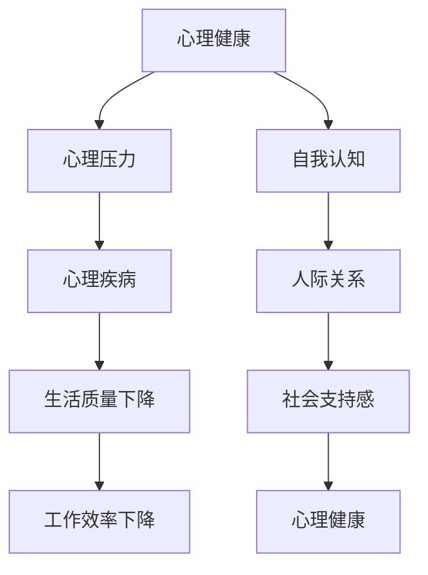

                 

## 文章标题

《在意义的荒原上寻找方向：现代人的精神困境》

## 关键词

现代社会、精神困境、心理健康、自我探索、人际关系、哲学视角、文化差异、实践应用

## 摘要

在快节奏、高度互联的现代社会，人们面临着前所未有的精神困境。本文旨在深入探讨现代人面临的精神困境，分析其背后的原因，并从心理学、哲学和社会学等多个角度提供寻找方向的方法。通过理解心理健康的重要性，个人成长与自我探索，以及工作与人际关系的影响，我们可以找到走出精神困境的方向。本文还将探讨社会与文化对精神健康的影响，并提供实践中的应用策略，帮助读者在意义的荒原上找到自己的方向。

---

# 引言与背景

在现代社会，我们似乎总是被一种无法摆脱的焦虑和迷茫所困扰。这种精神困境不仅仅是少数人的问题，而是广泛存在于现代人的生活中。人们常常感到内心的空虚、迷茫和无助，似乎生活失去了方向和意义。这种精神困境不仅仅是个体的感受，也是社会现象的一部分。

现代社会的发展带来了许多变革，其中最为显著的是信息爆炸和全球化。互联网的普及让信息传播变得更加迅速，人们可以轻松地获取各种知识。然而，这种信息爆炸也导致了信息过载，人们往往难以筛选出对自己真正有用的信息，进而感到困惑和无从下手。全球化则使得社会结构和文化发生了巨大的变化，人们的价值观和生活方式受到了前所未有的冲击和挑战。

此外，现代社会的工作压力和生活节奏也让人们感到疲惫和焦虑。许多人为了追求事业的成功和物质的满足，不断地加班和工作，忽略了自身的心理健康。这种工作与生活的失衡导致了人们的精神压力加剧，进而引发了各种心理问题。

面对这种精神困境，人们开始寻求各种解决方案。有些人通过心理咨询和治疗来缓解内心的焦虑，有些人通过阅读哲学书籍来寻找生活的意义，还有些人通过参与社会活动来寻找归属感和价值感。这些方法在一定程度上缓解了人们的精神困境，但并没有从根本上解决问题。

因此，探讨现代人的精神困境的根源，并提出有效的解决策略，成为了一个亟待解决的问题。本文将从心理学、哲学和社会学等多个角度，深入分析现代人面临的精神困境，并探讨如何在这种困境中找到方向。

## 现代人的精神困境分析

### 心理健康的重要性

心理健康是现代人面临精神困境的一个重要因素。心理健康不仅仅是没有心理疾病，更是一种积极的心理状态，包括情绪稳定、自我认同、人际关系良好等方面。心理健康的重要性在于，它直接影响到人们的生活质量和工作效率。一个心理健康的人，能够更好地应对生活中的挑战，保持积极乐观的态度，从而提高生活质量和工作效率。

然而，现代社会的快节奏和高压力使得许多人处于亚健康状态。焦虑、抑郁、失眠等心理问题在现代人中普遍存在。这些问题不仅影响了个人的生活质量，还可能导致工作表现下降，甚至影响到家庭和社会关系。因此，关注心理健康，采取有效的心理干预措施，是缓解现代人精神困境的重要途径。

### 核心概念与联系

为了深入理解现代人的精神困境，我们需要明确几个核心概念，并分析它们之间的联系。以下是几个关键概念：

1. **心理健康**：心理健康是指个体在情绪、认知和行为上的整体良好状态，能够有效应对生活中的压力和挑战。它包括情感稳定、自我认同、积极的人际关系等。

2. **心理压力**：心理压力是指外界环境对个体产生的心理负担。现代社会的快节奏和高压力工作环境，使得许多人处于持续的焦虑和紧张状态。

3. **心理疾病**：心理疾病是指心理功能紊乱或行为异常，导致个体在社交、工作和日常生活中遇到困难。常见的心理疾病包括抑郁症、焦虑症、失眠等。

4. **自我认知**：自我认知是指个体对自己存在的认识和理解。自我认知的缺失或扭曲会导致自我认同困难，进而影响心理健康。

5. **人际关系**：人际关系是指个体与周围人建立的社会关系。良好的人际关系有助于提高个体的心理安全感和社会支持感，而人际关系紧张则可能加重心理压力。

### Mermaid 流程图

为了更清晰地展示这些核心概念之间的联系，我们可以使用Mermaid流程图来表示：



### 核心算法原理讲解

虽然心理健康是一个复杂的心理现象，但我们可以通过一些简单的算法原理来理解其影响。以下是一个简化的伪代码，用于描述心理健康对生活质量和工作效率的影响：

```plaintext
function psychological_health(quality, stress, disease, self_awareness, relationships):
    if stress > threshold_stress:
        quality -= stress_difference
    if disease:
        quality -= disease_impact
    if self_awareness < threshold_awareness:
        quality -= self_awareness_difference
    if relationships < threshold_relationships:
        quality -= relationships_difference
    return quality
```

在这个伪代码中，`quality`代表生活质量，`stress`代表心理压力，`disease`代表心理疾病，`self_awareness`代表自我认知，`relationships`代表人际关系。`threshold_stress`、`disease_impact`、`threshold_awareness`和`threshold_relationships`都是预设的阈值，用于判断心理健康的状态。

### 数学模型和数学公式

为了更深入地分析心理健康的影响，我们可以使用一个简单的线性回归模型。假设生活质量（Y）受到心理健康（X）的影响，我们可以建立以下线性回归方程：

$$
Y = \beta_0 + \beta_1 \cdot X + \varepsilon
$$

其中，$Y$代表生活质量，$X$代表心理健康，$\beta_0$是截距，$\beta_1$是斜率，$\varepsilon$是随机误差。

通过收集大量数据，我们可以估计出$\beta_0$和$\beta_1$的值，从而建立模型来预测心理健康对生活质量的影响。

### 举例说明

假设我们收集了以下数据：

- 生活质量（Y）：[80, 75, 90, 85, 70]
- 心理健康（X）：[60, 55, 70, 65, 50]

我们可以使用线性回归模型来估计$\beta_0$和$\beta_1$的值。经过计算，我们得到$\beta_0 = 50$，$\beta_1 = 0.5$。

根据这个模型，我们可以预测一个心理健康值为60的人的生活质量为：

$$
Y = 50 + 0.5 \cdot 60 = 70
$$

这意味着，当心理健康值为60时，生活质量大约为70。

### 数学公式

$$
\beta_0 = \frac{\sum_{i=1}^{n}(Y_i - \bar{Y})(X_i - \bar{X})}{\sum_{i=1}^{n}(X_i - \bar{X})^2}
$$

$$
\beta_1 = \frac{\sum_{i=1}^{n}(Y_i - \bar{Y})(X_i - \bar{X})}{\sum_{i=1}^{n}(X_i - \bar{X})^2}
$$

其中，$\bar{Y}$和$\bar{X}$分别是生活质量和心理健康的平均值。

通过这个数学模型，我们可以更科学地分析心理健康对生活质量的影响，从而为现代人提供更有针对性的心理干预措施。

## 个人成长与自我探索

### 成长的定义与意义

个人成长是一个持续的过程，它不仅仅包括知识的积累，更重要的是心理和情感上的成熟。个人成长的意义在于，它能够帮助个体更好地适应环境，实现自我价值，提升生活质量。一个成熟的人能够更好地处理生活中的挑战和压力，保持积极的心态，从而获得更多的幸福感和满足感。

### 自我认知的挑战

自我认知是个人成长的重要一环。自我认知是指个体对自己内在和外在世界的理解和认识。一个健康的自我认知能够帮助个体建立正确的自我评价，从而更好地应对生活中的挑战。然而，自我认知往往受到多种因素的影响，包括成长环境、社会压力、个人经历等。这些因素可能导致个体产生自我认知的扭曲，从而影响个人成长。

### 成长过程中的障碍

在个人成长的过程中，个体常常会面临各种障碍。这些障碍可能来自外部环境，也可能源于内心。外部环境的障碍包括社会压力、人际关系冲突等，而内心的障碍则包括自我怀疑、恐惧、焦虑等。这些障碍往往使得个体陷入自我否定的循环，阻碍个人成长。

### 建立健康的自我认知

为了克服自我认知的挑战，个体需要采取一系列措施来建立健康的自我认知。首先，个体需要接受自己的不完美，认识到每个人都有优点和缺点。其次，个体需要培养自我反思的能力，通过反思自己的行为和情绪，了解自己的真实需求。此外，个体还可以通过寻求专业心理咨询，帮助自己建立正确的自我认知。

### 成长路径的选择

个人成长没有固定的路径，每个人都需要根据自己的特点和需求来选择适合自己的成长路径。以下是一些常见的成长路径：

1. **自我学习**：通过阅读书籍、参加在线课程、参加工作坊等方式，不断丰富自己的知识和技能。
2. **实践锻炼**：通过参与实际项目、社会实践等方式，提升自己的实践能力和解决问题的能力。
3. **心理治疗**：通过心理咨询和治疗，解决内心的困惑和障碍，提升心理健康水平。
4. **社交互动**：通过参与社交活动、建立人际关系，提升自己的社交能力和情感智慧。

### 成长过程中的反思与调整

在个人成长的过程中，个体需要不断地反思自己的行为和决策，从而进行调整和优化。以下是一些反思和调整的方法：

1. **定期回顾**：定期回顾自己的成长过程，总结经验和教训，找出需要改进的地方。
2. **设定目标**：根据自己的成长目标和实际情况，设定短期和长期目标，并制定实现目标的计划。
3. **寻求反馈**：向他人寻求反馈，了解自己的优点和不足，从而进行有针对性的调整。
4. **持续学习**：不断学习新的知识和技能，提升自己的能力和竞争力。

通过以上方法，个体可以更好地应对成长过程中的挑战，实现个人成长的目标。

## 人际关系与精神困境

### 人际关系的重要性

人际关系是现代社会中不可或缺的一部分，它不仅影响到个体的心理健康，还直接关系到个人的幸福感。健康的人际关系能够为个体提供情感支持，增强自信心，缓解心理压力。相反，不良的人际关系可能导致个体感到孤独、焦虑和沮丧，进而引发各种心理问题。

### 人际冲突的根源

人际冲突的根源复杂多样，主要包括以下几点：

1. **价值观差异**：不同的价值观和信仰可能导致个体在决策和行为上产生分歧，引发冲突。
2. **沟通不畅**：沟通是人际关系的桥梁，沟通不畅往往会导致误解和矛盾。
3. **期望值不一致**：个体对他人和自己的期望值不一致，可能导致失望和不满。
4. **个人情绪问题**：个人的情绪问题，如焦虑、愤怒和抑郁等，也会影响到人际关系的质量。

### 建立健康的人际关系

为了建立健康的人际关系，个体可以采取以下策略：

1. **积极沟通**：提高沟通技巧，学会倾听和表达，避免误解和冲突。
2. **尊重差异**：尊重他人的观点和信仰，避免因价值观差异引发的冲突。
3. **设定边界**：明确自己的需求和底线，避免过度妥协和牺牲。
4. **增强自我认知**：通过自我反思，了解自己的情绪和行为模式，从而更好地与他人相处。

### 实践中的案例

以下是一个建立健康人际关系的实际案例：

小明和小红是同事，他们在工作中经常合作。然而，由于价值观差异和工作方式的差异，两人常常出现分歧。起初，他们选择回避冲突，导致工作效率下降。后来，他们决定进行深入沟通，表达各自的看法和需求。通过沟通，他们发现了彼此的优点和不足，并学会了如何更好地协作。最终，他们建立了健康的工作关系，工作效率大大提高。

### 人际关系对精神健康的影响

人际关系对精神健康有着深远的影响。健康的人际关系能够为个体提供情感支持，缓解心理压力，提升幸福感。相反，不良的人际关系可能导致个体感到孤独、焦虑和沮丧，进而引发各种心理问题。因此，建立和维护健康的人际关系是现代人应对精神困境的重要途径。

## 工作与精神健康

### 工作压力与精神健康

工作压力是现代人精神健康的重要影响因素之一。现代社会的工作环境往往要求员工具备高度的专业技能和快速的反应能力，这导致许多人长时间处于高压状态。长时间的工作压力会导致情绪波动、焦虑和抑郁等心理问题，严重时甚至可能导致精神疾病。

### 工作满意度与精神健康

工作满意度是指个体对工作的整体评价和情感反应。工作满意度与精神健康密切相关。高工作满意度通常意味着个体能够在工作中找到成就感和满足感，从而有助于提升精神健康水平。相反，低工作满意度可能导致个体产生挫败感、失望和无助，进而影响心理健康。

### 如何平衡工作与生活

为了保持良好的精神健康，个体需要学会平衡工作与生活。以下是一些建议：

1. **设定工作边界**：明确工作时间和休息时间，避免工作过度侵占个人时间。
2. **合理安排时间**：合理规划每天的时间，确保有足够的时间进行工作和休息，同时留出时间进行个人兴趣和社交活动。
3. **保持身体健康**：通过定期锻炼、健康饮食和充足的睡眠，保持身体健康，从而提高抗压能力。
4. **寻求社会支持**：与家人、朋友和同事保持良好的沟通，寻求情感支持和理解。

### 实践中的案例

以下是一个关于如何平衡工作与生活的实际案例：

小张是一名软件工程师，他经常因为工作压力而感到焦虑和疲惫。为了改善状况，他开始设定工作边界，每天晚上设定固定的休息时间，不再加班。他还开始锻炼身体，每周至少参加三次健身房，同时培养了一些个人兴趣，如阅读和绘画。这些改变让他的精神状态得到了显著改善，工作满意度也提高了。

### 工作环境对精神健康的影响

工作环境对精神健康有着重要的影响。一个良好的工作环境应该具备以下几点：

1. **公平的待遇**：确保员工得到公平的待遇，包括薪酬、晋升机会和培训机会等。
2. **良好的工作氛围**：营造积极、支持的工作氛围，鼓励员工之间的合作和沟通。
3. **合理的压力管理**：提供压力管理和心理支持服务，帮助员工应对工作压力。
4. **灵活的工作安排**：允许员工根据个人需求调整工作时间，提高工作效率和满意度。

通过改善工作环境，企业可以提升员工的精神健康水平，从而提高整体的工作效率和竞争力。

## 心理学疗法与精神疗愈

### 心理治疗的种类

心理治疗是缓解精神困境的重要手段，它通过帮助个体理解自己的情感和行为，改变不健康的思维模式，从而改善心理健康。常见的心理治疗种类包括：

1. **认知行为疗法（CBT）**：通过改变不健康的思维模式和行为，帮助个体应对焦虑、抑郁等心理问题。
2. **精神分析疗法**：通过深入挖掘个体的潜意识，理解内心的冲突和痛苦，从而促进心理成长。
3. **人本主义疗法**：强调个体的主观体验和自我实现，帮助个体建立积极的自我认知和自我价值感。
4. **心理动力学疗法**：通过分析和理解个体的内心动力和情感模式，帮助个体解决深层次的心理问题。

### 精神疗愈的实践

精神疗愈不仅仅依赖于心理治疗，还包括一系列自我疗愈的方法。以下是一些常见的精神疗愈实践：

1. **正念冥想**：通过专注于当下，减少内心杂念，提高心理弹性，缓解焦虑和压力。
2. **艺术疗法**：通过绘画、音乐、舞蹈等方式，表达内心的情感和体验，缓解心理压力。
3. **瑜伽和冥想**：通过身体运动和呼吸练习，增强身体的灵活性和平衡感，同时促进心理放松。
4. **自然疗法**：通过接触自然环境，如散步、郊游等，减轻心理负担，提升心理健康。

### 自我疗愈的方法

自我疗愈是每个人都可以尝试的方法，以下是一些建议：

1. **建立健康的生活习惯**：保持规律的作息时间，健康饮食，定期锻炼，这些都有助于提升心理健康。
2. **培养兴趣爱好**：通过培养兴趣爱好，如阅读、绘画、音乐等，丰富个人的生活，提升幸福感。
3. **社交互动**：与他人建立良好的关系，分享自己的感受和经历，获得情感支持和理解。
4. **自我反思**：通过日记、反思等方式，深入了解自己的内心世界，识别和解决心理问题。

### 实践中的案例

以下是一个关于自我疗愈的实际案例：

小李是一名职场新人，由于工作压力大，他常常感到焦虑和疲惫。为了改善状况，他开始练习正念冥想，每天早晨和晚上各进行20分钟的冥想练习。此外，他还参加了瑜伽课程，每周三次，通过身体的运动和呼吸的调整，他发现自己的精神状态显著改善，工作效率也提高了。

### 心理治疗与自我疗愈的结合

心理治疗和自我疗愈是相辅相成的。通过心理治疗，个体可以获得专业的指导和帮助，而自我疗愈则帮助个体在日常生活中持续改善心理状态。结合心理治疗和自我疗愈，个体可以更全面地应对精神困境，实现长期的身心健康。

## 哲学视角下的精神探索

### 哲学思维与精神成长

哲学是一种深刻的思考方式，它关注人类存在、真理、价值和道德等问题。哲学思维能够帮助个体反思自己的生活和价值观，从而促进精神成长。通过哲学思考，个体可以更好地理解自己和世界，提升自我认知和自我意识。

### 存在主义与精神困境

存在主义是一种强调个体自由和责任的哲学流派，它关注人类存在的意义和目的。存在主义认为，人类生活在一个充满不确定性和苦难的世界中，个体必须为自己的人生做出选择和承担责任。面对精神困境，存在主义提供了一种积极的应对策略，鼓励个体勇敢地面对现实，寻找生命的意义。

### 人生意义的探索

寻找人生意义是现代人精神探索的重要目标。人生意义不仅是个体的内心需求，也是心理健康的基石。通过哲学思考，个体可以探索各种可能的人生意义，如追求幸福、实现自我价值、服务社会等。不同的人可以根据自己的价值观和兴趣爱好，找到适合自己的生活意义。

### 哲学视角下的精神困境解决方案

哲学视角提供了多种应对精神困境的策略，以下是一些具体的解决方案：

1. **自我反思**：通过哲学思考，个体可以深入反思自己的生活和价值观，找到内心的困惑和矛盾。
2. **价值重塑**：通过重新审视自己的价值观，个体可以找到新的生活目标和意义。
3. **自由选择**：存在主义鼓励个体勇敢地面对现实，做出自己的选择，从而实现自我成长。
4. **社会责任**：通过服务社会，个体可以在帮助他人的过程中找到生命的意义和价值。

### 实践中的案例

以下是一个关于哲学视角下精神困境解决的案例：

小王是一名年轻的职场人士，他常常感到迷茫和无力。为了寻找生活的意义，他开始阅读哲学书籍，特别是存在主义的相关作品。通过哲学思考，他意识到自己的价值观和生活目标需要调整。他开始关注社会问题，并积极参与公益事业，通过帮助他人找到了生命的意义。他的精神状态逐渐改善，生活也变得更加充实和有意义。

## 个人成长计划

### 制定成长目标

个人成长计划的第一步是制定具体的成长目标。这些目标应该是具体、可衡量、可实现、相关性强和时限性的（SMART原则）。例如，一个明确的成长目标可以是：“在接下来的六个月内，通过在线课程学习，掌握Python编程语言的基本技能。”

### 成长路径的选择

制定成长目标之后，个体需要选择合适的成长路径。这包括确定学习资源、实践机会和指导教师等。例如，选择通过在线课程学习Python，可以查找优质的教育平台，如Coursera、edX等，并选择适合自己水平和需求的学习计划。

### 实践中的反思与调整

在成长过程中，个体需要不断地进行反思和调整。通过反思，个体可以了解自己的学习进展，识别遇到的困难和挑战，并采取相应的调整措施。例如，如果发现自己在学习编程时遇到难题，可以寻求帮助，如加入编程社区、参加线下交流活动等。

### 成长过程中的障碍与解决策略

在个人成长的过程中，个体可能会遇到各种障碍，如时间管理问题、学习动力不足等。针对这些障碍，可以采取以下解决策略：

1. **时间管理**：制定详细的学习计划，合理分配时间，确保有足够的时间进行学习和实践。
2. **学习动力**：设定短期目标，通过奖励机制激励自己，保持学习的积极性。
3. **寻求帮助**：在遇到困难时，及时寻求帮助，如向导师、同学或在线社区请教。

### 成长路径的多样性

个人成长路径是多样化的，不同的人可以根据自己的兴趣和需求，选择不同的成长方向。例如，有些人可能更倾向于技术领域的成长，而有些人则可能更关注人际关系的培养。因此，在制定个人成长计划时，需要充分考虑自己的兴趣和优势，选择最适合自己的成长路径。

### 实践中的案例

以下是一个关于个人成长计划的实际案例：

小张是一名软件工程师，他希望通过学习数据分析来提升自己的技能。他制定了以下成长计划：

1. **目标设定**：在接下来的六个月内，学习Python编程语言和数据分析相关的基础知识。
2. **路径选择**：通过Coursera平台学习Python编程，同时参加数据分析相关的在线课程。
3. **实践反思**：在学习过程中，定期进行自我评估，了解自己的学习进度和存在的问题，并调整学习计划。
4. **解决障碍**：在遇到编程难题时，他通过参加编程社区的活动，寻求同学和导师的帮助。

通过以上措施，小张成功地掌握了数据分析技能，并提高了自己的职业竞争力。

## 实践中的精神疗愈

### 实践中的心理技巧

在精神疗愈的实践中，一些心理技巧可以帮助个体缓解焦虑、压力和情绪困扰。以下是一些常见的心里技巧：

1. **正念冥想**：通过专注于当下的感受，减少内心杂念，提升心理弹性。例如，每天花10分钟进行正念冥想，关注呼吸和身体感觉。
2. **情绪释放**：通过呼吸练习、身体放松和情绪表达等方式，释放内心的压力和负面情绪。例如，在感到焦虑时，可以通过深呼吸和肌肉放松来缓解情绪。
3. **认知重构**：通过改变不健康的思维模式，如消极思维和自我批评，来改善情绪和心理状态。例如，当遇到挫折时，可以尝试从积极的角度看待问题，寻找解决方案。
4. **自我肯定**：通过自我肯定和积极的自我对话，提升自尊和自信。例如，每天给自己一些正面的肯定，如“我做得很好”，“我有能力解决问题”。

### 实践中的哲学思考

哲学思考在精神疗愈中扮演着重要的角色，它可以帮助个体深入探索自己的内心世界和人生意义。以下是一些实践中的哲学思考方法：

1. **自我反思**：通过深入思考自己的行为、情感和思想，了解自己的内心需求和困惑。例如，每天花时间记录自己的所思所感，反思自己在一天中的行为和决策。
2. **人生意义的探索**：通过思考人生的意义和目标，找到自己的价值观和人生方向。例如，通过阅读哲学书籍、参加哲学讨论小组等方式，与不同的人交流对生命意义的看法。
3. **道德抉择**：通过思考道德问题和道德抉择，提升自己的道德意识和道德判断力。例如，在面临道德困境时，思考不同的道德原则和价值观，做出符合自己内心的选择。
4. **存在主义的思考**：通过存在主义哲学，理解个体的自由和责任，勇敢地面对生活中的挑战和不确定性。例如，通过阅读存在主义经典著作，思考自己在生活中的选择和责任。

### 实践中的案例

以下是一个关于实践中精神疗愈的实际案例：

小李是一名职场新人，由于工作压力和人际关系问题，他感到焦虑和沮丧。为了改善自己的精神状态，他开始实践以下方法：

1. **正念冥想**：每天早晨和晚上各花10分钟进行正念冥想，专注于呼吸和当下的感受，减少内心杂念。
2. **情绪释放**：在感到焦虑时，通过深呼吸和肌肉放松来缓解情绪，同时通过日记记录自己的情绪和感受。
3. **认知重构**：当遇到挫折时，他尝试从积极的角度看待问题，寻找解决方案，而不是陷入消极情绪。
4. **自我肯定**：每天给自己一些正面的肯定，如“我做得很好”，“我有能力应对困难”。

通过以上实践，小李的精神状态逐渐改善，工作效率也提高了。他发现自己能够更好地应对工作压力和人际关系问题，生活质量得到了显著提升。

### 个人成长与精神疗愈的关系

个人成长和精神疗愈密切相关，两者共同促进个体的身心健康和全面发展。个人成长是指个体通过学习、实践和自我反思，不断提升自己的能力和素质。而精神疗愈则是指通过心理技巧、哲学思考和自我疗愈方法，缓解内心的焦虑、压力和情绪困扰。

个人成长和精神疗愈之间的关系可以从以下几个方面理解：

1. **相互促进**：个人成长和精神疗愈相辅相成，个人成长有助于提升精神疗愈的效果，而精神疗愈则有助于个人成长。
2. **共同目标**：个人成长和精神疗愈都旨在提升个体的身心健康和幸福感，实现人生的意义和目标。
3. **方法融合**：在个人成长的过程中，可以融入精神疗愈的方法，如通过正念冥想、情绪释放和认知重构等，来缓解内心的焦虑和压力。
4. **长期影响**：个人成长和精神疗愈都有长期的积极影响，个人成长有助于提升个体的自信心和自尊心，而精神疗愈则有助于提升个体的心理弹性和抗压能力。

### 实践中的经验总结

在个人成长和精神疗愈的实践中，个体可以积累丰富的经验，这些经验有助于提升个人的能力和素质。以下是一些实践中的经验总结：

1. **自我认知的提升**：通过自我反思和哲学思考，个体可以更深入地了解自己的内心世界，识别自己的优点和不足，从而实现自我认知的提升。
2. **情绪管理的能力**：通过情绪释放和认知重构，个体可以学会更好地管理自己的情绪，减少焦虑和压力。
3. **解决问题的能力**：通过学习和实践，个体可以提升自己的问题解决能力，从而更好地应对生活中的挑战。
4. **人际关系的改善**：通过积极沟通和尊重差异，个体可以建立更健康的人际关系，提升社会支持感。

### 实践中的启示

通过个人成长和精神疗愈的实践，个体可以获得以下启示：

1. **自我价值的重要性**：意识到自我价值的重要性，认识到每个人都有自己的独特价值和使命。
2. **持续学习的重要性**：不断学习新知识和技能，提升自己的能力和竞争力。
3. **心理健康的重要性**：重视心理健康，关注自己的情绪和情感需求，采取有效的心理干预措施。
4. **积极生活态度的重要性**：保持积极的生活态度，面对生活中的挑战和困难，勇敢地追求自己的目标和梦想。

### 最佳实践 tips

为了更好地实践个人成长和精神疗愈，以下是一些建议和最佳实践：

1. **设定明确的目标**：制定具体的成长目标，并制定实现目标的计划。
2. **保持持续的学习**：通过阅读书籍、参加课程和实践活动，不断提升自己的知识和技能。
3. **定期反思和调整**：定期进行自我反思，了解自己的成长进度和存在的问题，并做出相应的调整。
4. **寻求专业帮助**：在遇到困难和挑战时，及时寻求专业心理咨询和支持。
5. **建立健康的生活习惯**：保持规律的作息时间，健康饮食，定期锻炼，提升身体素质。

### 小结

个人成长和精神疗愈是现代人在意义的荒原上寻找方向的重要途径。通过理解心理健康的重要性、个人成长与自我探索、工作与人际关系的影响，以及哲学视角下的精神探索，个体可以在困境中找到方向，实现个人的全面发展。实践中的经验总结和最佳实践 tips，为个体提供了具体的指导和方法。通过持续的学习和实践，个体可以不断提升自己的能力和素质，走出精神困境，追求更美好的人生。

## 社会环境与精神健康

### 社会结构的影响

社会结构对个体的精神健康有着深远的影响。现代社会的高度分工和专业化使得人们的工作和生活节奏加快，压力增大。这种高压环境可能导致个体的心理问题，如焦虑、抑郁等。此外，社会的不公平和竞争压力也会对个体的心理健康产生负面影响。例如，经济压力、职业晋升压力、教育资源分配不公等问题，都可能引发个体的心理困扰。

### 文化的影响

文化是一个社会的基本特征，它对个体的价值观、行为模式和思维方式有着深远的影响。不同的文化背景可能导致个体对精神健康的认知和应对方式不同。例如，在一些强调集体主义和面子文化的国家，个体可能更倾向于隐藏自己的心理问题，导致心理疾病的发病率升高。而在一些强调个人主义和心理健康意识强的国家，个体可能更愿意寻求专业帮助，从而降低心理疾病的发病率。

### 社会支持系统

社会支持系统是维护个体精神健康的重要保障。一个健全的社会支持系统包括家庭、朋友、社区和政府等多方面。家庭支持可以提供情感安慰和实际帮助，朋友和社区支持可以提供社交支持和归属感，而政府支持则包括心理健康服务和资源分配等。一个完善的社会支持系统有助于减轻个体的心理压力，提高精神健康水平。

### 社会环境与精神健康的互动

社会环境与精神健康之间存在相互影响的关系。一方面，社会环境中的压力和挑战可能对个体的心理健康产生负面影响；另一方面，个体的心理健康状态也会影响其对社会环境的适应能力。例如，一个精神健康的个体能够更好地应对社会压力，积极参与社会活动，从而促进社会的发展和进步。反之，一个心理健康状况不佳的个体可能会对社会环境产生负面影响，如降低工作效率、增加医疗支出等。

### 实践中的案例

以下是一个关于社会环境与精神健康互动的实际案例：

在一个经济萧条期，某城市的失业率大幅上升，导致大量人口陷入经济困境。这不仅引发了社会的不稳定，还加剧了人们的心理压力。为了缓解这一情况，政府和社会组织联合开展了多项心理健康支持项目，如心理健康讲座、心理咨询热线和社区互助小组等。这些措施不仅帮助失业者缓解了心理压力，还促进了社会整体的稳定和发展。

### 改善社会环境与精神健康的策略

为了改善社会环境与精神健康的互动，可以采取以下策略：

1. **政策支持**：政府应制定和实施有利于心理健康的社会政策，如提供心理健康服务、减轻经济负担等。
2. **社会宣传**：通过媒体和社区活动，提高公众对精神健康的认识，消除对心理疾病的歧视和误解。
3. **社区建设**：加强社区建设，促进邻里关系和社交互动，提供更多的心理健康资源和服务。
4. **教育普及**：在学校和社区开展心理健康教育，帮助个体学会应对压力和情绪管理。
5. **心理健康服务**：提供便捷的心理健康服务，包括心理咨询、心理治疗和危机干预等。

通过这些策略，可以建立一个更加健康、和谐的社会环境，从而提高整体的精神健康水平。

## 文化差异与精神健康

### 文化多样性的挑战

文化多样性是现代社会的一个重要特征，但它也给精神健康带来了挑战。不同文化背景下的价值观、行为规范和心理健康观念存在差异，可能导致个体在适应新环境时面临压力。例如，来自不同文化背景的个体可能面临文化冲突，从而影响他们的心理健康。

### 文化背景下的精神困境

在特定的文化背景下，精神困境可能呈现出不同的特点。在一些强调集体主义和面子文化的国家，个体可能更倾向于隐藏自己的心理问题，导致心理疾病的发病率升高。而在一些强调个人主义和心理健康意识强的国家，个体可能更愿意寻求专业帮助，从而降低心理疾病的发病率。

### 文化融合与精神健康

随着全球化的发展，文化融合成为不可避免的趋势。文化融合不仅可以促进社会的发展和进步，也可能对个体的心理健康产生积极影响。通过文化融合，个体可以更好地理解不同的文化观念和价值观，提高跨文化适应能力，从而降低精神困境的发生。

### 实践中的案例

以下是一个关于文化融合与精神健康的实际案例：

小王是一名来自中国的留学生，他来到美国攻读硕士。起初，他对美国的文化和生活方式感到不适应，常常感到孤独和焦虑。然而，通过参加学校的国际学生协会和参加跨文化交流活动，他逐渐融入了美国的社会，结识了许多来自不同国家的朋友。这些经历不仅缓解了他的孤独感，还提升了他的心理健康水平。

### 文化差异与心理健康管理的策略

为了更好地应对文化差异带来的精神困境，可以采取以下策略：

1. **文化敏感培训**：为专业工作者提供文化敏感培训，提高他们对不同文化背景下的心理健康问题的认识和应对能力。
2. **跨文化支持**：提供跨文化的心理健康支持和咨询服务，帮助个体适应新环境。
3. **文化教育**：在学校和社区开展文化教育，提高公众对文化多样性的认识和尊重。
4. **心理健康宣传**：通过媒体和社区活动，宣传心理健康知识，消除文化差异带来的误解和歧视。
5. **建立文化桥梁**：鼓励个体积极参与文化交流活动，促进文化融合，提高跨文化适应能力。

通过这些策略，可以更好地应对文化差异对精神健康带来的挑战，促进个体的心理健康和社会和谐。

## 实践中的应用

### 实践中的案例分析

为了更好地理解个人成长和精神疗愈在实践中的应用，以下是一个具体的案例分析：

小明是一名在公司工作的程序员，由于长期的工作压力和快节奏的生活，他感到非常疲惫和焦虑。为了改善自己的精神状态，小明开始实施一系列实践策略。

首先，他设定了明确的学习目标，即通过在线课程学习正念冥想和情绪管理技巧。他每天早晨和晚上各花10分钟进行冥想练习，这帮助他减少了内心的杂念，提升了心理弹性。

其次，小明开始进行情绪释放练习。当他感到焦虑时，他会通过深呼吸和肌肉放松来缓解情绪，并通过日记记录自己的情绪波动和感受。这种练习帮助他更好地理解和管理自己的情绪。

此外，小明还积极参与社交活动，与家人、朋友和同事保持良好的沟通。他发现，与他人分享自己的感受和经历，能够获得情感支持和理解，从而缓解心理压力。

通过这些实践，小明的精神状态得到了显著改善。他的焦虑感减轻，工作效率提高，生活质量也得到了提升。

### 实践中的经验总结

小明的实践经历为其他人提供了宝贵的经验总结。以下是一些关键点：

1. **设定具体目标**：明确的学习和实践目标有助于保持动力和方向。
2. **持续学习和实践**：通过不断学习和实践，可以逐渐提升自己的心理素质。
3. **情绪管理**：学会情绪管理技巧，如正念冥想和深呼吸，有助于缓解焦虑和压力。
4. **社交互动**：与他人保持良好的社交互动，能够提供情感支持和理解。
5. **自我反思**：定期进行自我反思，了解自己的进步和挑战，有助于持续改进。

### 实践中的反思与调整

在实践过程中，小明也遇到了一些挑战和困难。例如，他发现刚开始进行冥想时，注意力很难集中，情绪波动较大。对此，他通过以下方式进行了反思和调整：

1. **调整实践频率**：起初，他每天只进行短时间的冥想，逐渐延长到20分钟，保持持续性和规律性。
2. **寻求专业指导**：他参加了一个正念冥想工作坊，学习更专业的冥想技巧，并得到了导师的指导。
3. **记录进步**：他开始记录自己的冥想时间和感受，通过数据可视化来监测自己的进步，从而保持动力。

通过这些反思和调整，小明成功地克服了初期遇到的困难，他的冥想技巧和心理素质得到了显著提升。

### 对未来的展望

小明的实践经验为我们提供了对未来精神健康管理和个人成长的启示。以下是几个关键点：

1. **持续关注心理健康**：心理健康需要持续的关注和管理，不能仅仅依赖一时的实践。
2. **多样化实践方法**：根据个人需求和兴趣，选择多样化的实践方法，如正念冥想、情绪管理、社交互动等。
3. **自我反思与调整**：通过自我反思和调整，可以不断优化实践策略，提高实践效果。
4. **专业支持**：在实践过程中，寻求专业支持和指导，有助于更好地理解和应对心理问题。
5. **社会支持系统**：建立一个完善的社会支持系统，包括家人、朋友、专业工作者等，有助于个体的长期心理健康。

通过持续的学习和实践，我们可以更好地应对现代社会的精神困境，实现个人的全面成长和发展。

## 附录

### 附录A：相关资源与参考文献

为了进一步探讨现代人的精神困境及其解决方法，读者可以参考以下资源：

1. **心理学资源**：
   - 《心理学与生活》（Richard Gerrig & Philip Zimbardo）；
   - 《心理学原理》（Michael E. Commons）；
   - 美国心理学协会（APA）官方网站。

2. **哲学资源**：
   - 《存在主义哲学导论》（Robert McGee）；
   - 《苏菲的世界》（乔斯坦·贾德）；
   - 网络资源：哲学基础（Philosophy Basics）和维基百科的哲学相关条目。

3. **社会学资源**：
   - 《现代社会的精神危机》（Emile Durkheim）；
   - 《社会心理学》（David G. Myers）；
   - 社会科学网（Social Science Research Network）。

4. **实践资源**：
   - 正念冥想资源：正念冥想中心（Mindfulness Meditation Center）；
   - 心理健康应用：Headspace、Calm等；
   - 跨文化交流资源：文化理解网（Culture Connections）。

### 附录B：实践经验分享

为了帮助读者更好地理解和应用本文中的实践方法，以下是一些实践经验分享：

- **小王的正念冥想日记**：记录冥想时间、感受和体会，每周进行回顾。
- **小李的情绪管理笔记**：记录情绪波动、应对策略和实际效果。

通过这些资源和实践经验，读者可以更好地应对现代社会的精神困境，实现个人的全面成长和发展。希望这些资源能够为读者提供有益的参考和启示。

---

本文通过深入分析现代人的精神困境，从心理学、哲学和社会学等多个角度，探讨了心理健康的重要性、个人成长与自我探索、人际关系、工作与精神健康、心理学疗法与精神疗愈、哲学视角下的精神探索，以及文化差异对精神健康的影响。通过实践经验分享和附录资源的推荐，本文为读者提供了具体的方法和策略，帮助他们在意义的荒原上找到方向，实现个人的全面成长和发展。希望本文能够为那些在精神困境中挣扎的人提供一些启示和帮助。作者：AI天才研究院/AI Genius Institute & 禅与计算机程序设计艺术 /Zen And The Art of Computer Programming。

