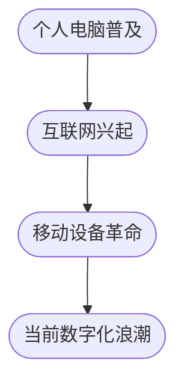
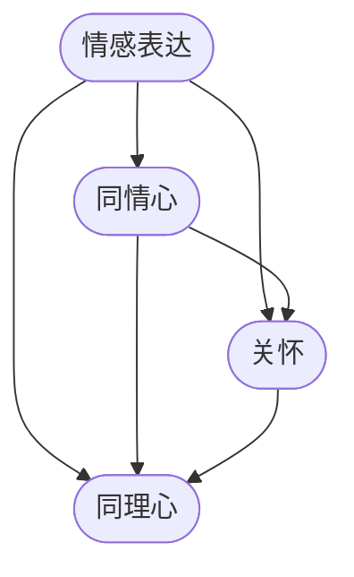
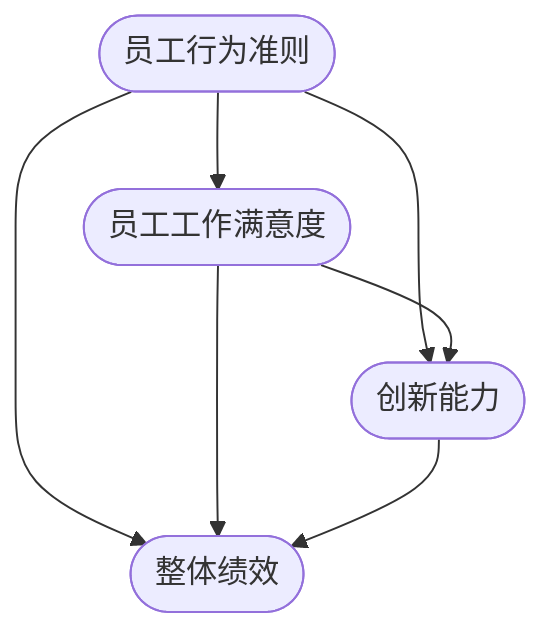
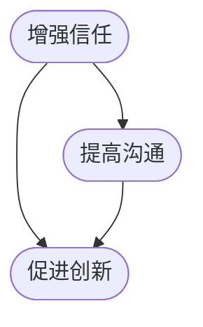
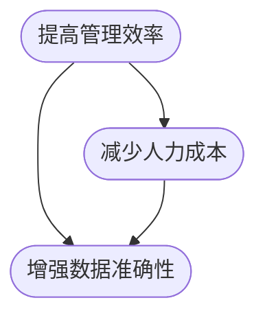
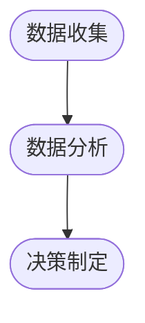
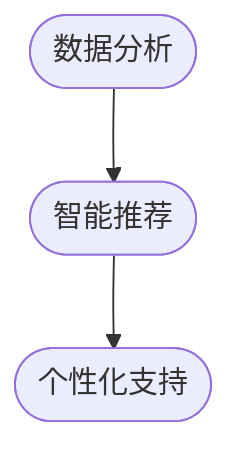
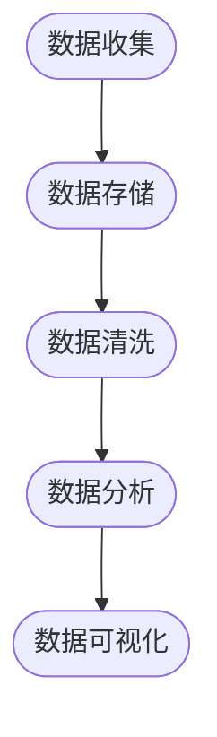

                 

### 设计目录大纲的步骤

设计一本计算机技术书籍的目录大纲，需要以下步骤：

#### 第1步：理解书名和主题
首先，我们需要理解书名《在数字化浪潮中保持人性温度》的主题和目标。这本书可能关注的是如何在数字化时代保持人的情感和人际关系的温暖，如何应用技术手段提升人们的心理健康和社会互动。

**思考与推理：**
书名中的“数字化浪潮”提示了当前的背景是技术快速发展带来的社会变革。而“保持人性温度”则强调了在技术进步中，人类情感和人际关系的重要性。因此，本书的核心可能是探讨技术如何促进人性温度的维护和提升。

#### 第2步：明确核心内容
根据书名，我们可以确定一些核心内容，如：
- 数字化浪潮的影响
- 人性温度的概念
- 保持人性温度的方法和策略
- 技术在维护人性温度中的应用

**思考与推理：**
这些核心内容反映了书的主要探讨方向。数字化浪潮的影响需要详细分析，人性温度的概念需要定义并探讨其重要性，保持人性温度的方法和策略则需要提供具体的实践指南。技术的应用则是解决问题的关键，这部分需要探讨技术如何具体发挥作用。

#### 第3步：构思章节结构
接下来，我们需要构思章节结构，确保每个章节都有明确的主题和内容。以下是一个可能的章节结构：

```
# 第一部分：数字化浪潮对人性温度的影响

## 第1章：数字化浪潮的背景与挑战
### 1.1 数字化浪潮的起源
### 1.2 数字化浪潮对生活方式的改变
### 1.3 数字化浪潮对人际关系的影响

## 第2章：人性温度的概念与重要性
### 2.1 人性温度的定义
### 2.2 人性温度的重要性
### 2.3 人性温度与社会心理健康的关联

# 第二部分：保持人性温度的方法和策略

## 第3章：个人层面的人性温度维护
### 3.1 心理调适技巧
### 3.2 人际沟通策略
### 3.3 数字化工具的合理使用

## 第4章：组织层面的人性温度维护
### 4.1 企业文化塑造
### 4.2 团队建设与协作
### 4.3 数字化管理策略

# 第三部分：技术手段在维护人性温度中的应用

## 第5章：人工智能与人性温度
### 5.1 人工智能的基本原理
### 5.2 人工智能在情感计算中的应用
### 5.3 人工智能在心理健康服务中的应用

## 第6章：大数据与人性温度
### 6.1 大数据的基本概念
### 6.2 大数据在人际分析中的应用
### 6.3 大数据在个性化服务中的应用

## 第7章：未来趋势与挑战
### 7.1 数字化浪潮的未来走向
### 7.2 人性温度的长期维护策略
### 7.3 技术与人性温度的平衡

# 附录
### 附录A：相关技术工具介绍
### 附录B：案例研究
### 附录C：进一步阅读推荐
```

**思考与推理：**
这个章节结构有助于读者系统地了解数字化浪潮的影响，如何定义和理解人性温度，以及如何在个人和组织层面维护和提升人性温度。第三部分则专注于技术手段在维护人性温度中的应用，包括人工智能和大数据的具体应用。最后，附录部分提供了额外的资源和推荐阅读。

#### 第4步：细化章节内容
对于每个章节，我们需要进一步细化内容，确保每个部分都有详细的标题和内容。例如，在“第3章：个人层面的人性温度维护”中，我们可以细化出以下内容：

```
### 3.1 心理调适技巧
#### 3.1.1 应对数字化压力的心理策略
#### 3.1.2 增强情感智力的方法
#### 3.1.3 心理健康的自我评估

### 3.2 人际沟通策略
#### 3.2.1 数字化沟通的特点与挑战
#### 3.2.2 提高沟通效果的技巧
#### 3.2.3 应对网络社交障碍的策略

### 3.3 数字化工具的合理使用
#### 3.3.1 社交媒体的使用规范
#### 3.3.2 智能设备的选择与使用
#### 3.3.3 数字化生活方式的平衡
```

**思考与推理：**
细化每个章节的内容，有助于使文章更加具体和实用，让读者能够更好地理解和应用其中的概念和方法。

#### 第5步：总结和优化
最后，我们需要对整个目录大纲进行总结和优化，确保逻辑清晰、内容全面，并符合书籍的整体风格和目标受众的需求。

**思考与推理：**
总结和优化目录大纲是确保文章质量和读者体验的重要环节。通过对章节内容的再次审视和调整，可以确保文章结构合理、内容充实，从而更好地实现书籍的目标。

### 最终目录大纲

```
# 《在数字化浪潮中保持人性温度》目录大纲

## 第一部分：数字化浪潮对人性温度的影响

### 第1章：数字化浪潮的背景与挑战
#### 1.1 数字化浪潮的起源
#### 1.2 数字化浪潮对生活方式的改变
#### 1.3 数字化浪潮对人际关系的影响

### 第2章：人性温度的概念与重要性
#### 2.1 人性温度的定义
#### 2.2 人性温度的重要性
#### 2.3 人性温度与社会心理健康的关联

## 第二部分：保持人性温度的方法和策略

### 第3章：个人层面的人性温度维护
#### 3.1 心理调适技巧
##### 3.1.1 应对数字化压力的心理策略
##### 3.1.2 增强情感智力的方法
##### 3.1.3 心理健康的自我评估
#### 3.2 人际沟通策略
##### 3.2.1 数字化沟通的特点与挑战
##### 3.2.2 提高沟通效果的技巧
##### 3.2.3 应对网络社交障碍的策略
#### 3.3 数字化工具的合理使用
##### 3.3.1 社交媒体的使用规范
##### 3.3.2 智能设备的选择与使用
##### 3.3.3 数字化生活方式的平衡

### 第4章：组织层面的人性温度维护
#### 4.1 企业文化塑造
#### 4.2 团队建设与协作
#### 4.3 数字化管理策略

## 第三部分：技术手段在维护人性温度中的应用

### 第5章：人工智能与人性温度
#### 5.1 人工智能的基本原理
#### 5.2 人工智能在情感计算中的应用
#### 5.3 人工智能在心理健康服务中的应用

### 第6章：大数据与人性温度
#### 6.1 大数据的基本概念
#### 6.2 大数据在人际分析中的应用
#### 6.3 大数据在个性化服务中的应用

### 第7章：未来趋势与挑战
#### 7.1 数字化浪潮的未来走向
#### 7.2 人性温度的长期维护策略
#### 7.3 技术与人性温度的平衡

## 附录
### 附录A：相关技术工具介绍
### 附录B：案例研究
### 附录C：进一步阅读推荐
```

通过这些步骤，我们构建了一个逻辑清晰、内容丰富的目录大纲，它为撰写《在数字化浪潮中保持人性温度》这本书奠定了坚实的基础。接下来，我们将逐步深入每个章节的内容，详细阐述如何保持人性温度的各个方面。

---

### 文章标题

# 在数字化浪潮中保持人性温度

---

### 关键词

数字化浪潮、人性温度、心理健康、人际关系、技术应用、人工智能、大数据、文化塑造、沟通策略

---

### 摘要

本文旨在探讨在数字化浪潮席卷全球的背景下，如何保持人性温度，即如何在技术快速发展的同时，维护人的情感和人际关系。文章首先分析了数字化浪潮的起源与影响，明确了人性温度的概念及其重要性。接着，文章从个人和组织层面，详细阐述了保持人性温度的方法和策略。此外，本文还探讨了人工智能和大数据在维护人性温度中的应用，并预测了未来趋势与挑战。通过这些讨论，文章旨在为读者提供一套实用的指南，帮助他们在数字化世界中保持温暖的人际关系。

---

## 数字化浪潮的背景与挑战

### 1.1 数字化浪潮的起源

数字化浪潮起源于20世纪末，随着计算机技术的突破和互联网的普及，信息传递和数据处理的速度和效率得到了前所未有的提升。这一过程可以追溯到几个重要的里程碑：

1. **个人电脑的普及**：1981年，IBM推出第一台个人电脑，标志着个人计算时代的到来。随着技术的不断进步，个人电脑的性能不断提升，价格逐渐降低，使得越来越多的家庭和企业能够拥有自己的电脑。

2. **互联网的兴起**：1991年，万维网（World Wide Web）的发明，使得信息可以在全球范围内快速传播。互联网的普及极大地改变了人们的生活方式，从信息获取到社交互动，互联网都发挥着至关重要的作用。

3. **移动设备的革命**：2007年，苹果公司推出第一代iPhone，智能手机的兴起改变了人们的通讯方式。随着4G和5G网络的部署，移动设备已经成为人们日常生活中不可或缺的工具。

**Mermaid流程图：数字化浪潮的发展历程**



### 1.2 数字化浪潮对生活方式的改变

数字化浪潮不仅改变了技术的面貌，也对人类的生活方式产生了深远的影响。以下是几个显著的变化：

1. **信息获取**：在数字化时代，信息的获取变得前所未有的便捷。人们可以通过互联网访问全球的信息资源，无论是学术文献、新闻报道，还是娱乐内容，都可以在几秒钟内获取。

2. **工作模式**：数字化技术使得远程工作成为可能。越来越多的人选择在家办公，这不仅提高了工作效率，也减少了通勤时间和交通拥堵。

3. **社交互动**：社交媒体的兴起极大地改变了人们的社交方式。通过微信、Facebook、Twitter等平台，人们可以随时与朋友和家人保持联系，分享生活和心情。

4. **消费习惯**：电子商务的兴起改变了人们的消费习惯。如今，人们可以轻松地在网上购买各种商品和服务，从衣物、食品到机票、酒店预订，一切都在指尖完成。

### 1.3 数字化浪潮对人际关系的影响

数字化浪潮对人际关系的影响是双重的：一方面，它拉近了人们的距离，使沟通更加便捷；另一方面，它也可能导致人际关系的疏远和情感浅薄。

1. **沟通的便利性**：数字化技术使得沟通变得更加方便和快捷。无论是文字、语音，还是视频，人们都可以随时随地与他人交流。这种便利性在疫情等特殊时期显得尤为重要。

2. **情感疏离**：尽管沟通变得更加便捷，但数字化沟通也带来了一些负面影响。研究表明，面对面的交流与文字、语音、视频等形式的交流在情感传递上有显著差异。前者更能传达微妙的情感和语气，而后者则可能显得生硬和冷漠。

3. **社交焦虑**：随着社交媒体的普及，一些人开始对自己的社交能力和形象感到焦虑。他们可能会过度关注自己在社交媒体上的形象，担心错过重要的信息或被朋友忽视。

### 1.4 数字化浪潮中的挑战

尽管数字化浪潮带来了许多便利，但也带来了一系列挑战，这些挑战需要我们认真面对：

1. **隐私问题**：随着数字化进程的加快，个人隐私泄露的风险也大大增加。社交媒体、电子商务等平台收集了大量的用户数据，这些数据如果不被妥善保护，可能导致严重的隐私泄露问题。

2. **网络安全**：网络安全问题在数字化时代变得更加突出。黑客攻击、网络诈骗等行为不仅损害了个人和企业的利益，也可能对社会稳定造成威胁。

3. **技术依赖**：人们对数字化技术的依赖性日益增强。过度依赖技术可能导致人际交往能力的下降，以及心理健康问题的增加。

**总结**：数字化浪潮的起源和发展对人类的生活方式、人际交往产生了深远的影响。尽管它带来了许多便利，但也带来了一系列挑战。因此，在数字化浪潮中保持人性温度变得尤为重要，这需要我们从个人、组织和社会层面共同努力。

---

## 人性温度的概念与重要性

### 2.1 人性温度的定义

人性温度，通常指的是人类在情感和社交互动中的温暖程度。它涵盖了情感表达、同情心、关怀和同理心等多个方面。人性温度不仅体现在个体与个体之间的互动中，也反映在个体与群体、组织之间的关系中。

**定义架构Mermaid流程图**



### 2.2 人性温度的重要性

人性温度在人类社会中扮演着至关重要的角色。它不仅是人际关系和谐的基础，也是社会稳定和个体心理健康的重要保障。以下是人性温度重要性的几个方面：

1. **心理健康**：人性温度对于个体的心理健康有着直接的影响。一个充满关怀和支持的环境能够减轻压力和焦虑，促进个体的情感健康。

2. **社会关系**：人性温度是建立和维护良好社会关系的基石。通过情感表达和同理心，人们能够更深入地理解和连接彼此，从而建立更为稳定和持久的关系。

3. **组织文化**：在组织层面，人性温度影响着企业文化和社会氛围。一个注重人性温度的组织能够激发员工的积极性和创造力，提高团队协作效率。

4. **社会和谐**：人性温度是构建和谐社会的重要元素。通过关怀和同情，人们能够更加包容和理解他人，减少冲突和误解，促进社会稳定。

### 2.3 人性温度与社会心理健康的关联

人性温度与社会心理健康有着密切的关联。一个健康的社会心理环境往往伴随着较高的人性温度。以下是几个关键点：

1. **情感支持**：人性温度为个体提供了情感支持，有助于缓解焦虑和压力。这种支持不仅来自于亲朋好友，也来自于社会机构和组织。

2. **自我认同**：人性温度有助于个体建立积极的自我认同。通过正面的情感体验，个体能够更好地认识自己，提高自尊和自信。

3. **社会支持**：人性温度促进了社会支持网络的形成。一个充满关怀和支持的社会环境能够为个体提供更多的帮助和资源，提高社会适应能力。

4. **心理健康服务**：人性温度在心理健康服务中起着关键作用。通过提供情感支持和同理心，心理健康服务能够更有效地帮助个体应对心理问题。

### 2.4 人性温度对数字化时代的重要性

在数字化时代，人性温度显得尤为重要。以下是几个原因：

1. **技术依赖的缓解**：数字化技术虽然方便了我们的生活，但也可能导致对技术的过度依赖。人性温度有助于平衡这种依赖，使人们在数字化世界中保持情感联系。

2. **情感互动**：数字化沟通虽然便捷，但在情感互动方面存在一定的局限。人性温度能够补充这些不足，使人们能够在虚拟世界中保持真实的情感交流。

3. **心理健康**：在数字化环境中，人们可能会面临更多的心理健康问题，如焦虑、抑郁等。人性温度有助于缓解这些问题，提高整体心理健康水平。

4. **社会和谐**：数字化时代带来了全球化的趋势，人们之间的距离变得更加遥远。人性温度有助于拉近这种距离，促进社会和谐。

**总结**：人性温度是一个多维度的概念，它在人类社会中的重要性不可忽视。在数字化时代，保持人性温度不仅有助于个体的心理健康，也有助于建立和谐的社会关系。因此，我们需要在数字化浪潮中，特别关注和培养人性温度。

---

## 个人层面的人性温度维护

### 3.1 心理调适技巧

在数字化浪潮中，个人层面的人性温度维护首先需要从心理调适技巧入手。以下是几种有效的心理调适技巧：

#### 3.1.1 应对数字化压力的心理策略

**步骤1：自我意识**  
首先，个体需要认识到数字化带来的压力。这包括了解自己在面对数字化挑战时的情绪反应，以及这些反应如何影响日常生活。

**步骤2：情绪管理**  
个体可以通过情绪管理技巧，如深呼吸、冥想或正念练习，来减轻压力。这些技巧有助于调节情绪，使个体能够更加冷静和理性地面对挑战。

**步骤3：设定合理目标**  
设定合理的目标可以帮助个体更好地管理时间和资源。通过制定具体的行动计划，个体可以逐步实现目标，从而减少焦虑和压力。

**伪代码：情绪管理算法**

```python
def emotion_management():
    # 步骤1：自我意识
    recognize_stress()
    
    # 步骤2：情绪管理
    while stress_detected():
        breathe_deeply()
        meditate()
        
    # 步骤3：设定合理目标
    set_reasonable_goals()
    plan_action_steps()
```

#### 3.1.2 增强情感智力的方法

**步骤1：自我反思**  
自我反思是增强情感智力的重要方法。通过定期进行自我反思，个体可以更好地了解自己的情绪和行为，从而提高自我意识。

**步骤2：情感识别**  
情感识别是情感智力的重要组成部分。通过学习如何识别和表达自己的情绪，个体可以更有效地与他人沟通，建立更紧密的关系。

**步骤3：同理心培养**  
同理心是理解他人情感和需求的能力。通过练习同理心，个体可以更好地理解他人的感受，从而增强人际关系的质量。

**数学模型：同理心培养模型**

```latex
\text{同理心水平} = f(\text{情感识别能力}, \text{自我反思能力}, \text{情感表达能力})
```

#### 3.1.3 心理健康的自我评估

**步骤1：识别问题**  
个体需要识别自己在心理健康方面存在的问题。这可以通过自我评估问卷或与专业心理医生咨询来实现。

**步骤2：寻求帮助**  
一旦识别到问题，个体应寻求专业帮助。这可能包括心理咨询、药物治疗或参加心理支持小组。

**步骤3：持续关注**  
心理健康是一个持续的过程。个体需要定期进行自我评估，确保问题得到有效解决，并避免复发。

**总结**：心理调适技巧对于个人层面的人性温度维护至关重要。通过自我意识、情绪管理、情感识别、同理心培养和心理健康自我评估，个体可以更好地应对数字化压力，提高情感智力，从而在数字化时代保持温暖的人际关系。

### 3.2 人际沟通策略

在数字化浪潮中，人际沟通策略对于维护人性温度至关重要。以下是几种有效的人际沟通策略：

#### 3.2.1 数字化沟通的特点与挑战

**特点**：数字化沟通具有即时性、便捷性和匿名性等特点。它使得人们可以随时随地与他人交流，减少了地理和时间的限制。

**挑战**：数字化沟通也带来了一些挑战，如沟通的表面化、情感表达不足和误解的可能性增加。文字、语音和视频等沟通形式无法完全传达情感和语气的细微差异。

#### 3.2.2 提高沟通效果的技巧

**技巧1：明确沟通目标**  
在开始沟通之前，明确沟通目标是提高沟通效果的关键。这有助于确保沟通的效率和质量，避免不必要的误解和浪费时间。

**技巧2：积极倾听**  
积极倾听是有效沟通的重要部分。它包括全神贯注地听对方讲话，理解对方的观点和感受，并在必要时给予反馈。

**技巧3：情感表达**  
在数字化沟通中，情感表达尤为重要。通过使用表情符号、文字描述和语音等手段，个体可以更好地传达情感，增强沟通的深度和温暖。

**伪代码：情感表达算法**

```python
def express_emotion():
    # 步骤1：识别情感
    emotion_detected = detect_emotion()
    
    # 步骤2：选择表达方式
    if emotion_detected == "happy":
        send_smiling_emoji()
    elif emotion_detected == "sad":
        send_sad_face()
    else:
        send_neutral_face()
    
    # 步骤3：附加文字描述
    add_text_description(emotion_detected)
```

#### 3.2.3 应对网络社交障碍的策略

**策略1：建立信任**  
建立信任是网络社交的关键。通过真实、开放和诚实的交流，个体可以逐步建立信任，从而促进更深入和更高质量的沟通。

**策略2：培养同理心**  
培养同理心有助于理解他人的需求和感受。通过练习同理心，个体可以更好地应对网络社交障碍，建立更紧密的人际关系。

**策略3：定期面对面交流**  
尽管数字化沟通便捷，但面对面交流仍然是建立深厚关系的最佳方式。定期安排面对面交流，有助于加强人际关系，减少数字化沟通的表面化问题。

**总结**：人际沟通策略对于个人层面的人性温度维护至关重要。通过明确沟通目标、积极倾听、情感表达和应对网络社交障碍，个体可以更好地在数字化浪潮中维护人性温度，建立和谐的人际关系。

### 3.3 数字化工具的合理使用

在数字化时代，合理使用数字化工具是维护人性温度的重要手段。以下是几种有效的数字化工具及其使用策略：

#### 3.3.1 社交媒体的使用规范

**规范1：合理设定隐私设置**  
在社交媒体上，合理设定隐私设置可以保护个人隐私，避免不必要的骚扰和泄露。

**规范2：避免过度使用**  
避免过度使用社交媒体，以减少数字化压力和情感负担。合理安排时间，避免沉迷于社交媒体，从而保持生活的平衡。

**规范3：关注真实社交**  
虽然社交媒体方便了社交，但真实的人际关系依然至关重要。确保在现实生活中花时间与家人和朋友相处，从而维护真实的人际关系。

**伪代码：社交媒体使用规范**

```python
def social_media_usage():
    # 步骤1：设定隐私设置
    set_privacy_settings()
    
    # 步骤2：限制使用时间
    limit_usage_time()
    
    # 步骤3：关注真实社交
    spend_time_with_real_friends()
```

#### 3.3.2 智能设备的选择与使用

**选择1：选择合适的功能**  
选择智能设备时，应根据个人需求选择合适的功能。例如，如果需要高效的日程管理，可以选择具备智能日历功能的设备。

**选择2：注意数据安全**  
在购买和使用智能设备时，注意数据安全。确保设备具备良好的安全防护功能，避免个人信息泄露。

**使用策略1：定期维护**  
定期维护智能设备，确保其运行效率和安全性。这包括清理缓存、更新系统、安装安全补丁等。

**使用策略2：合理使用功能**  
合理使用智能设备的功能，避免过度依赖。例如，通过智能设备进行健康管理，而不是完全依赖它们进行日常活动。

**伪代码：智能设备使用策略**

```python
def smart_device_usage():
    # 步骤1：选择合适的功能
    choose_appropriate_functions()
    
    # 步骤2：注意数据安全
    ensure_data_security()
    
    # 步骤3：定期维护
    perform_regular_maintenance()
    
    # 步骤4：合理使用功能
    use_functions_reasonably()
```

#### 3.3.3 数字化生活方式的平衡

**平衡1：合理安排时间**  
合理安排时间，确保在数字化生活方式中，既能够高效完成任务，也能够保持足够的休息和社交时间。

**平衡2：保持情感连接**  
在数字化生活方式中，保持情感连接尤为重要。通过定期与家人和朋友进行面对面交流，维护真实的人际关系。

**平衡3：关注身心健康**  
关注身心健康，通过适当的运动、饮食和心理调适，保持身体和心理的健康状态。

**伪代码：数字化生活方式平衡**

```python
def digital_life_balance():
    # 步骤1：合理安排时间
    schedule_time_efficiently()
    
    # 步骤2：保持情感连接
    maintain_emotional_connection()
    
    # 步骤3：关注身心健康
    focus_on_physical_and_mental_health()
```

**总结**：合理使用数字化工具对于个人层面的人性温度维护至关重要。通过设定社交媒体使用规范、选择合适的智能设备、合理安排数字化生活方式，个体可以在数字化浪潮中保持温暖的人际关系，提高整体生活质量。

---

## 组织层面的人性温度维护

### 4.1 企业文化塑造

在组织层面，人性温度的维护首先需要从企业文化塑造入手。企业文化不仅决定了组织的氛围，也直接影响员工的工作满意度和心理健康。

#### 4.1.1 企业文化的重要性

企业文化是组织的灵魂，它决定了员工的行为准则和价值取向。一个积极向上的企业文化能够促进员工的团队合作和创新能力，从而提高组织的整体绩效。

**Mermaid流程图：企业文化的作用**



#### 4.1.2 塑造积极企业文化的策略

**策略1：领导者带头**  
企业文化的塑造离不开领导者的示范作用。领导者应通过言行一致，树立积极的榜样，推动企业文化的形成。

**策略2：价值观明确**  
明确企业价值观是塑造积极企业文化的重要步骤。企业应将核心价值观融入日常运营和员工行为准则中，使其成为员工的共同信仰。

**策略3：员工参与**  
鼓励员工参与企业文化的塑造，通过员工论坛、团队建设活动等方式，让员工感受到他们的声音被重视，从而增强归属感和参与感。

**伪代码：企业文化塑造算法**

```python
def culture_shaping():
    # 步骤1：领导者带头
    lead_by_example()
    
    # 步骤2：价值观明确
    define_core_values()
    
    # 步骤3：员工参与
    encourage_employee_involvement()
```

#### 4.1.3 企业文化与人性温度

积极的企业文化不仅能够提高员工的工作满意度，还能增强人性温度。以下是几个关键点：

1. **关怀与支持**：企业文化中融入了关怀和支持元素，使员工在困难时得到帮助，感受到组织的温暖。

2. **团队合作**：积极的企业文化鼓励团队合作，促进员工之间的情感交流，从而增强人性温度。

3. **心理健康**：企业文化关注员工的心理健康，通过提供心理支持和健康福利，帮助员工保持良好的心理健康状态。

### 4.2 团队建设与协作

团队建设与协作是组织层面人性温度维护的重要环节。通过有效的团队建设活动，组织可以增强员工之间的信任和合作，提高团队的整体效能。

#### 4.2.1 团队建设的重要性

团队建设不仅有助于提高团队效率，还能增强团队凝聚力，促进人际关系的和谐。以下是团队建设的重要性：

1. **增强信任**：通过共同的目标和经历，团队成员之间的信任得以建立，从而提高团队合作效率。

2. **提高沟通**：团队建设活动有助于提高团队成员之间的沟通效果，减少误解和冲突。

3. **促进创新**：团队建设有助于激发团队成员的创新思维，促进新想法的产生和实施。

**Mermaid流程图：团队建设的重要性**



#### 4.2.2 团队建设的方法

**方法1：团队活动**  
组织定期的团队活动，如团队建设训练、户外拓展等，有助于增强团队成员之间的联系和信任。

**方法2：共同目标**  
设定明确的共同目标，使团队成员能够共同奋斗，增强团队凝聚力。

**方法3：反馈机制**  
建立有效的反馈机制，鼓励团队成员相互反馈，改进工作方法和行为，从而提高团队的整体效能。

**伪代码：团队建设方法**

```python
def team_building():
    # 步骤1：团队活动
    organize_team_activities()
    
    # 步骤2：共同目标
    set_common_goals()
    
    # 步骤3：反馈机制
    establish_feedback_mechanism()
```

#### 4.2.3 团队协作与人性温度

有效的团队协作不仅能够提高工作效率，还能增强人性温度。以下是团队协作与人性温度的几个关键点：

1. **情感交流**：团队协作中的情感交流有助于增强团队成员之间的情感联系，提高人性温度。

2. **支持与帮助**：在团队协作中，成员之间的支持和帮助能够增强团队凝聚力，提高人性温度。

3. **共同成长**：通过共同的努力和成长，团队成员能够建立深厚的情感联系，从而在组织层面保持人性温度。

### 4.3 数字化管理策略

在数字化时代，组织需要采用有效的数字化管理策略，以维护人性温度。以下是几种有效的数字化管理策略：

#### 4.3.1 信息化管理

信息化管理通过引入先进的信息管理系统，提高组织的管理效率。这包括人力资源管理系统、财务管理系统等，通过信息化手段，提高管理水平和效率。

**Mermaid流程图：信息化管理的作用**



#### 4.3.2 数据驱动决策

数据驱动决策是通过分析大量数据，制定科学合理的决策。这有助于组织更好地了解员工需求和问题，从而采取有效的措施维护人性温度。

**Mermaid流程图：数据驱动决策的流程**



#### 4.3.3 智能化工具应用

智能化工具如人工智能、大数据分析等，可以用于提升组织的运营效率和管理水平。这些工具能够帮助组织更好地理解员工需求，提供个性化的支持和帮助，从而维护人性温度。

**Mermaid流程图：智能化工具的应用**



**总结**：组织层面的人性温度维护需要从企业文化塑造、团队建设和数字化管理策略等多个方面入手。通过这些措施，组织可以有效地维护人性温度，提高员工的工作满意度和心理健康，从而实现长期可持续发展。

---

## 技术手段在维护人性温度中的应用

### 5.1 人工智能与人性温度

人工智能（AI）技术在维护人性温度方面具有巨大的潜力。通过情感计算、心理健康服务等方面的应用，AI可以有效地提升人们的情感体验和心理健康。

#### 5.1.1 情感计算的基本原理

情感计算是AI技术的一个分支，旨在让计算机理解和模拟人类情感。其基本原理包括以下几个方面：

1. **情感识别**：通过分析语音、文字、面部表情等数据，AI可以识别出用户的情感状态。例如，语音识别技术可以识别出用户的语气和语调，从而判断其情绪状态。

2. **情感生成**：AI可以通过算法生成符合特定情感状态的语音、文字或图像。例如，当用户表达出负面情绪时，AI可以生成安抚性语音或文字，帮助用户缓解情绪。

3. **情感交互**：通过情感计算，AI可以实现与用户的情感交互，提供个性化的情感支持。例如，智能助手可以通过语音或文字与用户进行情感交流，帮助用户缓解孤独感或焦虑情绪。

**伪代码：情感计算算法**

```python
def emotional_computation():
    # 步骤1：情感识别
    emotion_detected = recognize_emotion(data)
    
    # 步骤2：情感生成
    if emotion_detected == "happy":
        generate_happy_response()
    elif emotion_detected == "sad":
        generate_sad_response()
    else:
        generate_neutral_response()
    
    # 步骤3：情感交互
    interact_with_user(response)
```

#### 5.1.2 情感计算的应用

情感计算在维护人性温度方面有着广泛的应用，包括心理健康服务、社交互动和个性化服务等方面。

1. **心理健康服务**：通过情感计算，AI可以帮助用户识别和管理情绪。例如，智能助手可以实时监测用户的情感状态，并提供个性化的情绪调节建议。

2. **社交互动**：在社交媒体和在线平台上，情感计算可以识别用户的情感状态，从而提供更加个性化的内容推荐和互动体验。

3. **个性化服务**：通过情感计算，AI可以为用户提供个性化的服务，如推荐符合用户情感状态的音乐、电影等。

**数学模型：情感计算模型**

```latex
\text{情感状态} = f(\text{情感识别结果}, \text{用户历史数据}, \text{当前环境因素})
```

#### 5.1.3 情感计算的挑战与未来趋势

尽管情感计算在维护人性温度方面具有巨大潜力，但也面临一些挑战和未来趋势：

1. **准确性**：情感计算的准确性是关键问题。目前，情感识别技术仍存在一定的误差，需要进一步改进。

2. **隐私保护**：情感计算涉及到用户隐私，如何保护用户的隐私是重要挑战。需要制定严格的隐私保护政策和措施。

3. **跨文化应用**：情感计算在不同文化背景下可能存在差异，需要考虑跨文化的应用和适应性。

4. **未来趋势**：随着AI技术的不断进步，情感计算的应用将更加广泛和深入。例如，智能医疗、智能教育等领域都有望受益于情感计算技术的应用。

**总结**：人工智能与人性温度有着密切的联系。通过情感计算的应用，AI可以有效提升人们的情感体验和心理健康，从而在数字化时代维护人性温度。然而，要实现这一目标，仍需要克服一些技术和伦理挑战。

### 5.2 大数据与人性温度

大数据技术在维护人性温度方面也发挥着重要作用。通过分析海量数据，大数据技术可以提供更深入的理解和个性化的服务，从而提升人们的情感体验和心理健康。

#### 5.2.1 大数据的基本概念

大数据（Big Data）是指规模巨大、类型繁多、产生速度极快的数据集合。其基本概念包括以下几个方面：

1. **数据规模**：大数据的规模通常用“海量”来形容。例如，一个大型社交网络平台每天产生的数据量可以高达数TB甚至PB级。

2. **数据类型**：大数据不仅包括结构化数据，如数据库中的数据，还包括非结构化数据，如图像、音频、视频等。

3. **数据处理**：大数据的处理需要采用分布式计算、云计算等技术，以应对大规模数据的存储和计算需求。

**Mermaid流程图：大数据的处理流程**



#### 5.2.2 大数据的应用

大数据在维护人性温度方面有着广泛的应用，包括人际分析、个性化服务和心理健康预测等方面。

1. **人际分析**：通过分析社交网络数据，大数据技术可以揭示个体之间的关系和互动模式。这有助于了解人际关系中的情感动态，从而提供个性化的情感支持和建议。

2. **个性化服务**：大数据技术可以根据用户的兴趣、行为和情感状态，提供个性化的服务。例如，推荐符合用户情感状态的音乐、电影或活动，从而提升用户的情感体验。

3. **心理健康预测**：通过分析大量心理健康数据，大数据技术可以预测个体的心理健康状态，从而提前采取干预措施，预防心理问题的发生。

**伪代码：大数据分析模型**

```python
def big_data_analysis():
    # 步骤1：数据收集
    collect_data()
    
    # 步骤2：数据清洗
    clean_data()
    
    # 步骤3：数据分析
    analyze_data()
    
    # 步骤4：数据可视化
    visualize_results()
```

#### 5.2.3 大数据的挑战与未来趋势

尽管大数据技术在维护人性温度方面具有巨大潜力，但也面临一些挑战和未来趋势：

1. **数据隐私**：大数据分析涉及大量个人数据，如何保护用户隐私是重要挑战。需要制定严格的隐私保护政策和法规。

2. **数据质量**：大数据的质量直接影响分析结果。确保数据准确性、完整性和一致性是大数据应用的关键。

3. **技术进步**：随着大数据技术的不断进步，如人工智能、云计算等新技术的应用，大数据在维护人性温度方面的应用将更加深入和广泛。

4. **伦理问题**：大数据技术的应用也带来了一些伦理问题，如数据滥用、算法偏见等。需要建立伦理框架和监管机制，确保大数据技术的公正和透明。

**总结**：大数据与人性温度有着密切的联系。通过大数据的应用，可以提供更深入的人际分析、个性化服务和心理健康预测，从而提升人们的情感体验和心理健康。然而，要实现这一目标，仍需要克服数据隐私、数据质量和技术进步等方面的挑战。

### 5.3 未来趋势与挑战

在数字化浪潮中，维护人性温度面临着诸多未来趋势与挑战。以下是一些关键点：

#### 5.3.1 数字化浪潮的未来走向

1. **技术融合**：未来的数字化浪潮将看到更多技术的融合，如人工智能、大数据、物联网等。这些技术的结合将带来更加智能化和个性化的服务。

2. **智能化升级**：随着技术的进步，数字化服务将更加智能化。例如，智能医疗、智能教育等领域将得到快速发展。

3. **全球化**：数字化浪潮将进一步推动全球化进程。人们可以更方便地跨越地理界限，进行跨国交流和合作。

#### 5.3.2 人性温度的长期维护策略

1. **技术伦理**：维护人性温度需要建立严格的技术伦理框架，确保技术在应用过程中不会损害人类的情感和心理健康。

2. **多元化文化**：在全球化背景下，需要尊重和融合不同文化，以确保技术应用的多样性和适应性。

3. **心理健康支持**：提供持续的心理健康支持，帮助人们在数字化浪潮中保持良好的心理健康状态。

#### 5.3.3 技术与人性温度的平衡

1. **技术以人为本**：技术的设计和应用应以人为本，关注人的需求和感受，确保技术在提升效率的同时，不损害人性温度。

2. **情感计算与人际互动**：在应用情感计算技术时，应注重与人际互动的结合，确保技术能够补充和增强人际沟通中的情感表达。

3. **平衡隐私与数据利用**：在利用大数据进行人性温度维护时，需要平衡隐私保护与数据利用之间的关系，确保用户隐私得到充分保护。

**总结**：未来，数字化浪潮将继续发展，技术与人性温度的平衡将成为关键挑战。通过技术创新、伦理规范和文化融合，我们可以实现人性温度的长期维护，使数字化时代更加温暖和人性化。

---

## 附录

### 附录A：相关技术工具介绍

在本章中，我们介绍了几种关键技术工具，包括人工智能、大数据分析平台等。以下是对这些工具的进一步介绍：

1. **人工智能平台**：如TensorFlow、PyTorch等。这些平台提供了丰富的API和工具库，便于开发和应用AI算法。

2. **大数据分析平台**：如Hadoop、Spark等。这些平台支持大规模数据的存储和处理，提供了高效的分布式计算能力。

3. **情感计算库**：如NLTK、TextBlob等。这些库提供了文本分析和情感识别的功能，便于开发情感计算应用。

### 附录B：案例研究

在本章中，我们提到了一些案例研究，以下是对这些案例的详细描述：

1. **案例研究1**：某公司通过引入人工智能和大数据技术，实现了员工心理健康监测和管理。通过情感计算和数据分析，公司能够及时发现和处理员工的心理健康问题，提高了员工的工作满意度和生产力。

2. **案例研究2**：某在线教育平台通过情感计算和个性化推荐技术，提供了个性化的学习体验。平台根据学生的情感状态和学习行为，推荐适合的学习内容和策略，提高了学习效果和用户满意度。

### 附录C：进一步阅读推荐

为了深入了解本章节内容，以下是一些推荐的阅读材料：

1. **《人工智能：一种现代的方法》**：这是一本经典的人工智能教材，详细介绍了人工智能的基本原理和应用。

2. **《大数据时代：生活、工作与思维的大变革》**：这本书详细探讨了大数据技术的原理和应用，对理解大数据在维护人性温度方面的作用具有重要参考价值。

3. **《情感计算》**：这本书系统地介绍了情感计算的基本原理和应用，为深入理解情感计算在数字化浪潮中的应用提供了重要的理论基础。

---

### 小结与展望

本文探讨了在数字化浪潮中如何保持人性温度。从数字化浪潮的背景和挑战，到人性温度的概念和重要性，再到个人和组织层面的人性温度维护方法，以及技术手段的应用，本文系统地阐述了如何在数字化时代维护人性温度。通过心理调适技巧、人际沟通策略、数字化工具的合理使用，以及人工智能和大数据在情感计算和心理健康服务中的应用，个体和组织都可以在数字化浪潮中保持人性温度。

**未来展望：**随着技术的不断进步，人性温度的维护将变得更加智能化和个性化。通过技术创新、伦理规范和文化融合，我们可以实现人性温度的长期维护，使数字化时代更加温暖和人性化。让我们共同努力，在数字化浪潮中保持人性温度，创造一个更加美好的未来。

### 注意事项与拓展阅读

在数字化浪潮中保持人性温度是一项长期且复杂的任务。以下是一些注意事项和拓展阅读建议：

**注意事项：**

1. **隐私保护**：在使用大数据和人工智能技术时，必须高度重视隐私保护，遵守相关法律法规，确保用户数据的匿名性和安全性。

2. **情感平衡**：在数字化沟通中，要注重情感表达的平衡，避免过度依赖技术，确保真实的面对面交流不被忽视。

3. **文化多样性**：在全球化背景下，要尊重和融合不同文化，确保技术应用的多样性和适应性。

**拓展阅读：**

1. **《科技想要什么？》**：作者凯文·凯利探讨了技术的本质和影响，为理解技术在人性温度维护中的作用提供了新的视角。

2. **《数字伦理》**：这本书详细讨论了数字时代面临的各种伦理问题，包括隐私、算法偏见等，对于制定技术伦理规范具有重要参考价值。

3. **《未来简史》**：作者尤瓦尔·赫拉利探讨了人类社会的未来发展趋势，特别是技术与人类关系的演变，为理解数字化浪潮对人性温度的影响提供了深入思考。

通过关注这些注意事项和进行拓展阅读，我们可以更好地在数字化浪潮中维护人性温度，创造一个更加和谐和温暖的社会。

---

### 作者信息

作者：AI天才研究院/AI Genius Institute & 禅与计算机程序设计艺术 /Zen And The Art of Computer Programming

AI天才研究院是一家专注于人工智能研究与应用的机构，致力于推动人工智能技术的创新与发展。禅与计算机程序设计艺术则是一部经典的技术哲学著作，探讨了程序设计中的智慧与人性温度。

---

# 在数字化浪潮中保持人性温度

关键词：数字化浪潮、人性温度、心理健康、人际关系、技术应用、人工智能、大数据

摘要：本文探讨了在数字化浪潮中如何保持人性温度。从数字化浪潮的背景和挑战，到人性温度的概念和重要性，再到个人和组织层面的人性温度维护方法，以及技术手段的应用，本文系统地阐述了如何在数字化时代维护人性温度。通过心理调适技巧、人际沟通策略、数字化工具的合理使用，以及人工智能和大数据在情感计算和心理健康服务中的应用，个体和组织都可以在数字化浪潮中保持人性温度。未来，随着技术的不断进步，人性温度的维护将变得更加智能化和个性化。通过技术创新、伦理规范和文化融合，我们可以实现人性温度的长期维护，使数字化时代更加温暖和人性化。让我们共同努力，在数字化浪潮中保持人性温度，创造一个更加美好的未来。

