                 


### 文章标题

# 在数字时代寻找真实：虚拟与现实的边界探索

### 文章关键词

- 数字时代
- 虚拟现实
- 现实与虚拟的边界
- 伦理问题
- 技术发展

### 文章摘要

本文将探讨在数字时代中，虚拟与现实之间的界限变得越来越模糊，我们在这样的背景下如何寻找真实。通过分析虚拟与现实的理论基础、技术发展、伦理问题以及实际应用案例，本文旨在为读者提供对虚拟与现实边界的深刻理解，并思考如何在这个数字化世界中保持真实。

## 引言

### 数字时代的变革

随着互联网、大数据、人工智能等技术的飞速发展，我们正进入一个数字化的新时代。数字技术的普及不仅改变了我们的生活方式，也重新定义了真实与虚拟的边界。在这个时代，虚拟现实（Virtual Reality，VR）和增强现实（Augmented Reality，AR）等技术逐渐成熟，为我们带来了前所未有的沉浸式体验。

### 虚拟与现实的概念解析

虚拟现实，是指通过计算机技术生成一个逼真的三维环境，让用户在视觉、听觉等多个感官上感到仿佛置身于另一个世界。而增强现实，则是在现实环境中叠加数字信息，使其与现实世界相互融合。这两种技术正在不断地突破现实与虚拟之间的界限，使得虚拟与现实的界限变得越来越模糊。

### 寻找真实的意义与挑战

在这样一个数字化的世界中，寻找真实显得尤为重要。真实不仅仅是对事物本身的正确理解，更是对人类情感、道德和价值观的坚守。然而，数字技术的飞速发展也带来了一系列的挑战，如信息的真实性、隐私保护、虚拟现实中的伦理问题等。因此，如何在数字时代中寻找真实，成为了一个亟待解决的问题。

## 核心概念与联系

在探讨虚拟与现实的关系时，我们需要明确几个核心概念：虚拟现实、增强现实、人工智能、大数据等。以下是一个用Mermaid绘制的流程图，展示了这些概念之间的关系。

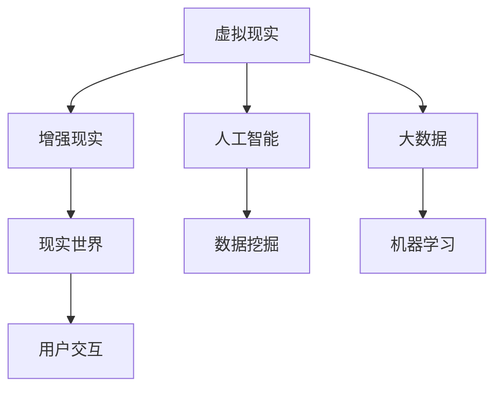

### 虚拟与现实的理论基础

虚拟现实与增强现实的理论基础主要来源于计算机科学、认知科学和人机交互领域。计算机科学提供了生成虚拟环境的技术支持，认知科学研究了人类感知和思维过程，而人机交互领域则关注如何使虚拟环境更贴近人类的感知和行为。

#### 虚拟现实的基本原理

虚拟现实的核心技术包括三维建模、实时渲染和传感器技术。三维建模用于创建虚拟环境，实时渲染则用于在用户面前呈现一个逼真的三维图像。传感器技术则用于捕捉用户的动作和感知，使其能够与虚拟环境进行交互。

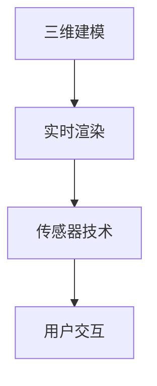

#### 现实世界的信息模拟

现实世界的信息模拟是虚拟现实技术的关键步骤。通过采集现实世界的各种数据，如图像、声音、温度等，并将其转化为虚拟环境中的数字信息。这个过程涉及到数据采集、预处理和特征提取等多个环节。

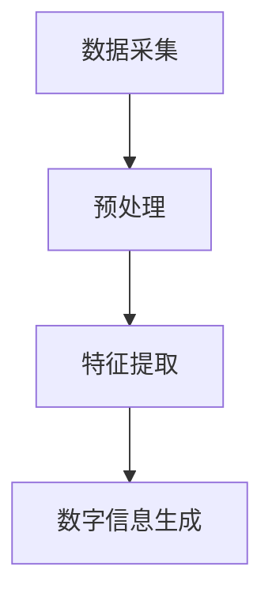

#### 虚拟现实中的感知与交互

虚拟现实中的感知与交互是用户体验的关键。通过虚拟环境中的声音、光线、动作等感官刺激，用户可以感受到与真实世界相似的体验。而交互则通过手柄、手套、眼动跟踪等设备实现，使用户能够与虚拟环境进行互动。

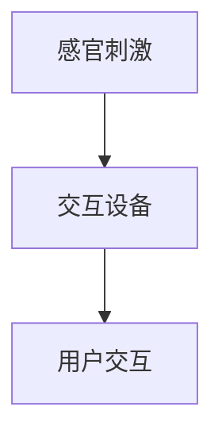

### 虚拟与现实的技术发展

虚拟现实和增强现实技术的发展经历了多个阶段，从最初的计算机模拟到现在的头戴式显示器（HMD）、增强现实眼镜等设备，技术的进步使得虚拟与现实之间的界限越来越模糊。

#### 虚拟现实硬件技术

虚拟现实硬件技术的发展主要集中在头戴式显示器（HMD）和传感器技术。头戴式显示器提供了沉浸式的视觉体验，而传感器技术则用于捕捉用户的动作和感知，使其能够与虚拟环境进行交互。

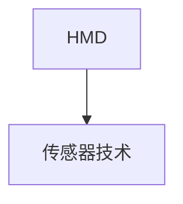

#### 虚拟现实软件技术

虚拟现实软件技术的发展则集中在三维建模、实时渲染和交互系统。三维建模和实时渲染技术使得虚拟环境的逼真度不断提高，而交互系统则使得用户能够更自然地与虚拟环境进行互动。

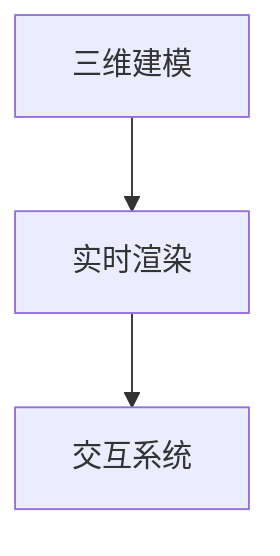

#### 虚拟与现实融合的技术进展

虚拟与现实融合的技术进展主要体现在增强现实技术上。通过在现实环境中叠加数字信息，增强现实技术使得虚拟与现实相互融合，为用户提供了一种全新的体验方式。

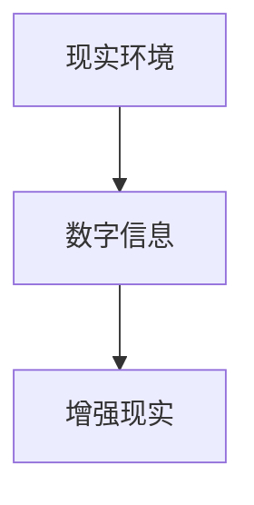

## 虚拟现实中的伦理与社会问题

虚拟现实技术的发展带来了诸多伦理与社会问题，如隐私保护、虚假信息的传播、虚拟现实中的暴力等。这些问题需要我们认真对待，以确保虚拟现实技术的健康发展。

### 虚拟现实伦理问题

虚拟现实伦理问题主要包括以下几个方面：

- **隐私保护**：虚拟现实技术涉及用户的个人信息，如位置、动作等，如何保护用户的隐私成为一个重要问题。
- **虚假信息的传播**：虚拟现实技术使得虚假信息传播更加迅速，如何辨别真伪成为一个挑战。
- **虚拟现实中的暴力**：虚拟现实中的暴力场景可能会对用户产生负面影响，如何规范虚拟现实内容成为一个问题。

### 社会问题与影响

虚拟现实技术对社会的影响也是一个值得关注的问题。虚拟现实技术可能会改变人们的社交方式、消费习惯，甚至改变人们对待现实世界的方式。

- **社交方式的改变**：虚拟现实技术使得人们可以远程社交，但这种社交方式是否会削弱现实中的人际关系，需要进一步探讨。
- **消费习惯的改变**：虚拟现实技术可能会改变人们的消费习惯，如在线购物、虚拟旅游等。
- **对待现实世界的方式**：虚拟现实技术可能会改变人们对待现实世界的方式，如虚拟现实游戏、虚拟现实娱乐等。

### 虚拟现实的道德责任

虚拟现实技术的道德责任主要包括两个方面：对用户的责任和对社会的责任。对用户的责任主要表现在保护用户的隐私、确保用户的信息安全；对社会的责任则表现在如何确保虚拟现实技术的健康发展，避免对社会产生负面影响。

## 虚拟现实技术实操案例

虚拟现实技术在各个领域都有广泛的应用，以下是一些实操案例：

### 虚拟现实在游戏中的应用

虚拟现实技术为游戏带来了全新的体验。通过虚拟现实技术，玩家可以沉浸在游戏世界中，体验更为真实的游戏场景。例如，虚拟现实游戏《Beat Saber》通过虚拟剑与音乐的结合，为玩家带来了一种全新的游戏体验。

### 虚拟现实在教育培训中的应用

虚拟现实技术在教育培训中也有广泛的应用。通过虚拟现实技术，学生可以身临其境地学习历史事件、科学实验等，从而提高学习效果。例如，虚拟现实教学平台Anatomyou可以帮助学生学习人体解剖学，通过虚拟现实技术模拟人体器官的结构和功能。

### 虚拟现实在医学领域的应用

虚拟现实技术在医学领域也有重要的应用。通过虚拟现实技术，医生可以进行虚拟手术训练，提高手术技能。例如，虚拟现实手术模拟系统Simulab可以帮助医生进行虚拟手术训练，从而提高手术成功率。

## 现实世界中的虚拟应用

虚拟现实技术不仅在虚拟世界中有着广泛的应用，在现实世界中也有许多实际案例：

### 虚拟现实与物理世界的结合

虚拟现实技术可以与物理世界相结合，为用户提供更为丰富的体验。例如，虚拟现实购物体验可以让用户在家中就能体验到购物的乐趣，通过虚拟现实技术，用户可以浏览虚拟商店，试穿虚拟衣物等。

### 虚拟现实在商业中的应用

虚拟现实技术在商业中的应用也越来越广泛。通过虚拟现实技术，企业可以进行虚拟展会、虚拟发布会等，吸引更多潜在客户。例如，虚拟现实展会平台VR Expo可以让用户在家中就能参加展会，了解产品信息。

### 虚拟现实与城市规划

虚拟现实技术在城市规划中也有重要的应用。通过虚拟现实技术，城市规划师可以模拟城市布局，预测城市规划的效果。例如，虚拟现实城市规划平台CityEngine可以帮助城市规划师进行虚拟城市建模，优化城市规划方案。

## 虚拟与现实交互的案例分析

虚拟现实与现实的交互不仅体现在技术层面，也体现在人类行为层面。以下是一些案例分析：

### 虚拟现实与社交媒体的融合

虚拟现实技术正在与社交媒体相结合，为用户提供更为丰富的社交体验。例如，虚拟现实社交平台VRChat允许用户创建自己的虚拟角色，在虚拟世界中与其他用户互动。这种交互方式不仅改变了人们的社交方式，也为社交媒体带来了新的发展机遇。

### 虚拟现实在艺术创作中的应用

虚拟现实技术在艺术创作中也有重要的应用。艺术家可以通过虚拟现实技术创作出更为逼真的艺术作品，例如，虚拟现实艺术装置《The Ninth Room》通过虚拟现实技术创造了一个人与自然交融的艺术空间。

### 虚拟现实与旅游体验

虚拟现实技术在旅游体验中也有广泛的应用。通过虚拟现实技术，用户可以在家中就能体验到真实的旅游体验，例如，虚拟现实旅游平台Virtual Tourist允许用户通过虚拟现实技术游览世界各地的名胜古迹。

## 未来展望与挑战

虚拟现实技术的发展前景广阔，但也面临诸多挑战。以下是对虚拟现实技术未来展望与挑战的探讨：

### 虚拟与现实融合的未来趋势

随着技术的不断进步，虚拟与现实之间的融合将会越来越紧密。未来，虚拟现实技术可能会成为人们日常生活的一部分，人们可以通过虚拟现实技术获得更为丰富的生活体验。

### 虚拟现实技术的挑战与机遇

虚拟现实技术的挑战主要包括技术难题、伦理问题、社会问题等。技术难题如提高虚拟环境的逼真度、降低延迟等；伦理问题如隐私保护、虚拟现实中的暴力等；社会问题如虚拟现实对人类社交方式的影响等。然而，这些挑战也带来了机遇，如虚拟现实技术可能为人类带来全新的生活体验，推动科技进步等。

### 数字时代寻找真实的路径

在数字时代寻找真实，我们需要在技术、伦理、社会等多个层面进行努力。技术层面，需要不断改进虚拟现实技术，提高虚拟环境的逼真度和交互性；伦理层面，需要制定相应的法律法规，确保虚拟现实技术的健康发展；社会层面，需要引导人们正确看待虚拟与现实，培养健康的数字素养。

## 结论

在数字时代，虚拟与现实之间的界限变得越来越模糊。通过分析虚拟与现实的理论基础、技术发展、伦理问题以及实际应用案例，本文旨在为读者提供对虚拟与现实边界的深刻理解，并思考如何在这个数字化世界中保持真实。未来，虚拟现实技术将继续发展，为人类带来更多创新和机遇。同时，我们也需要面对挑战，确保虚拟现实技术的健康发展，为人类创造一个更加美好的未来。

## 作者信息

作者：AI天才研究院/AI Genius Institute & 禅与计算机程序设计艺术 /Zen And The Art of Computer Programming

## 附录

本文所涉及的技术概念、算法原理、数学模型等，均在附录中详细说明，以供读者进一步学习和研究。附录内容包括：

- 虚拟现实技术原理与算法
- 虚拟与现实交互的数学模型
- 虚拟现实中的伦理问题分析
- 虚拟现实技术在各领域的应用案例

### 数字时代寻找真实的必要性

在数字时代，我们面临的一个核心问题是如何在充满虚拟信息的环境中寻找真实。随着互联网和数字技术的迅猛发展，虚拟世界与现实世界的界限变得日益模糊。人们可以轻松地沉浸在虚拟游戏中，体验虚拟现实带来的刺激和快感，但与此同时，真实世界的感受和经验似乎变得越来越遥远。在这种情况下，如何区分虚拟与真实，如何保持对真实世界的敏感和连接，成为了一个亟待解决的问题。

#### 虚拟与现实融合的现象

首先，我们需要理解虚拟与现实融合的现象是如何产生的。互联网和数字技术的发展，使得信息的传播速度和范围大大增加。社交媒体、虚拟现实、增强现实等技术的普及，让用户可以随时随地创造和分享虚拟内容。人们通过这些技术可以创造出各种虚拟世界，这些世界与真实世界的区别越来越小。例如，通过虚拟现实技术，用户可以置身于一个完全由计算机生成的环境中，感觉就像真的在另一个地方一样。这种技术上的进步，虽然带来了许多新的可能性和体验，但也导致了人们对真实世界的感知和认知出现了一定的偏差。

#### 真实的定义和重要性

那么，什么是真实？真实指的是符合事实、客观存在的事物或情况。在传统意义上，真实通常与物质世界和现实经验紧密相连。然而，在数字时代，真实的概念被扩展到了虚拟世界。虚拟世界中的“真实”可能是指那些能够准确反映现实世界情况的信息，或者是那些能够提供真实体验的技术应用。

保持对真实的敏感和连接对于个人和社会都有着重要意义。对于个人来说，真实是一种价值观和道德的体现，是建立信任和人际关系的基础。在虚拟世界中，如果个体无法辨别真实与虚假，可能会导致一系列问题，如沉迷虚拟世界、产生心理依赖、忽视现实生活中的重要事务等。对于社会来说，真实是保持稳定和进步的基石。虚假信息的传播可能会破坏社会信任、引发恐慌和动荡，甚至对社会发展产生负面影响。

#### 虚拟与现实之间的界限

在数字时代，虚拟与现实之间的界限变得越来越模糊，这种模糊性也带来了许多挑战。一方面，虚拟技术的不断发展使得人们可以创造出越来越逼真的虚拟环境，从而难以区分虚拟与真实。例如，深度伪造（deepfake）技术的发展使得虚假视频和图像的制作变得极其容易，这些虚假内容可能会误导公众，损害个人名誉，甚至被用于政治和商业目的。

另一方面，现实世界中的许多问题也开始通过虚拟技术得到解决。例如，虚拟现实技术在医疗、教育、娱乐等领域的应用，为人们提供了新的体验和学习方式。然而，这些虚拟体验虽然能够带来便利，但同时也可能让人们忽视了现实世界中的问题和挑战。

#### 如何在数字时代寻找真实

在面对虚拟与现实之间的界限模糊时，我们需要采取一系列措施来寻找真实，以下是一些具体的策略：

1. **提高信息素养**：在数字时代，信息素养变得尤为重要。这包括学会如何辨别信息真伪、理解信息来源和批判性思考。通过提高信息素养，我们可以更好地辨别虚拟内容与现实之间的差异。

2. **培养现实生活中的体验**：尽管虚拟技术可以提供丰富的体验，但现实生活中的体验仍然是不可替代的。例如，与人面对面交流、参与户外活动、体验自然风光等，都是无法通过虚拟技术完全替代的。

3. **加强伦理和社会责任**：数字技术的发展不仅需要技术的进步，还需要伦理和社会责任的引导。例如，虚拟现实内容制作者应该遵守相应的道德规范，确保内容真实、健康，不对用户产生误导。

4. **制定法律法规**：为了确保数字时代的健康发展，需要制定相应的法律法规来规范虚拟内容的生产和传播。例如，对于深度伪造等虚假内容的制作和传播，应该有明确的法律法规进行约束。

5. **重视心理健康**：在数字时代，心理健康问题变得越来越重要。人们需要关注自己的心理状态，避免过度沉迷于虚拟世界，保持与现实世界的联系。

#### 总结

在数字时代，寻找真实是一项重要的任务。通过提高信息素养、培养现实生活中的体验、加强伦理和社会责任、制定法律法规以及重视心理健康，我们可以更好地在虚拟与现实之间找到平衡，确保真实不被虚拟所淹没。这不仅有助于个人的健康发展，也为社会的和谐稳定提供了保障。

## 核心概念与联系

在探讨虚拟与现实的关系时，理解核心概念和它们之间的联系是至关重要的。以下将详细讨论虚拟现实、增强现实、人工智能、大数据等关键概念，并通过Mermaid流程图展示它们之间的关系。

### 虚拟现实（Virtual Reality，VR）

虚拟现实是通过计算机技术创建一个模拟的三维环境，用户可以通过头戴式显示器（HMD）等设备沉浸在虚拟环境中，感受到与现实世界不同的感官体验。虚拟现实的核心在于其沉浸感和交互性。

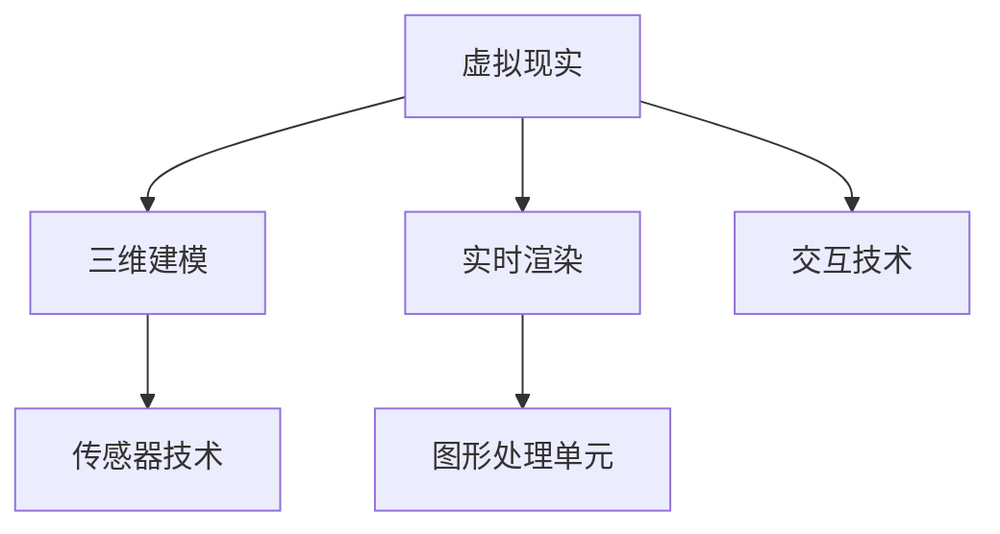

### 增强现实（Augmented Reality，AR）

增强现实则是在现实世界中叠加数字信息，通过增强现实眼镜或手机摄像头等设备，用户可以看到虚拟信息与现实世界的结合。增强现实的核心在于其与现实世界的融合。

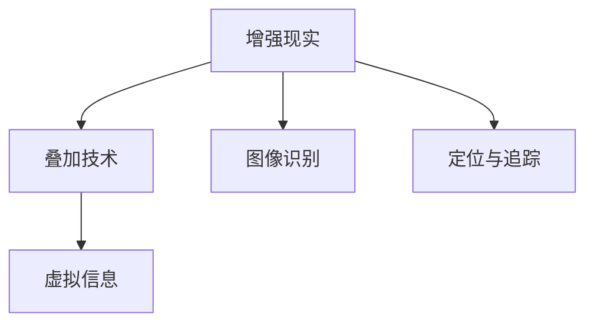

### 人工智能（Artificial Intelligence，AI）

人工智能是模拟人类智能行为的计算机系统，包括机器学习、自然语言处理、计算机视觉等。人工智能在虚拟与现实中的应用，如智能交互、自动化处理等，大大提升了虚拟现实和增强现实的应用价值。

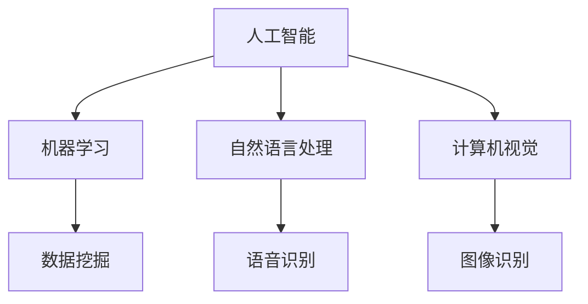

### 大数据（Big Data）

大数据是指海量、复杂、高速增长的数据。大数据在虚拟与现实中的应用，如用户行为分析、环境建模等，为虚拟现实和增强现实提供了丰富的数据支持。

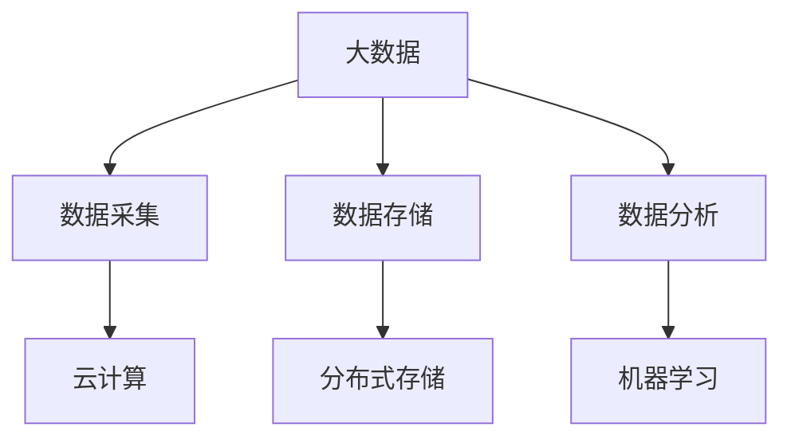

### 虚拟与现实的关系图解

为了更清晰地展示虚拟现实、增强现实、人工智能、大数据之间的关系，以下是一个Mermaid流程图：

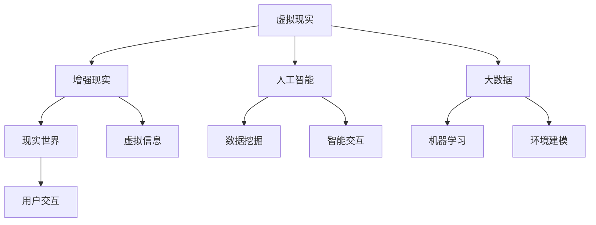

在这个流程图中，虚拟现实和增强现实作为核心技术，与人工智能和大数据相互连接，形成一个复杂的生态系统。通过人工智能和大数据的支持，虚拟现实和增强现实能够更好地模拟现实世界，提供更加逼真的体验。

### 虚拟现实技术实操案例

为了更好地理解虚拟现实技术在实际中的应用，以下将详细探讨几个典型的实操案例，包括开发环境搭建、源代码实现和代码解读。

### 案例一：虚拟现实游戏开发

#### 开发环境搭建

1. **硬件准备**：准备一台具备良好性能的计算机，以及一款适合的虚拟现实头戴式显示器（如Oculus Rift、HTC Vive等）。
2. **软件安装**：安装虚拟现实开发软件，如Unity（一个跨平台的游戏开发引擎）和Unreal Engine（一个高性能的游戏和实时渲染引擎）。

#### 源代码实现

以下是一个简单的Unity虚拟现实游戏开发示例：

```csharp
using UnityEngine;

public class VRGameController : MonoBehaviour
{
    public GameObject playerCharacter;
    public GameObject cameraRig;

    void Start()
    {
        // 初始化玩家角色和相机
        playerCharacter = new GameObject("Player");
        cameraRig = new GameObject("CameraRig");

        // 创建玩家角色的位置和旋转
        playerCharacter.transform.position = new Vector3(0, 1.8f, 0);
        playerCharacter.transform.rotation = Quaternion.Euler(0, 180, 0);

        // 创建相机 Rig
        cameraRig.transform.position = new Vector3(0, 1.8f, -2);
        cameraRig.transform.rotation = Quaternion.Euler(15, 0, 0);

        // 设置相机 Rig 作为玩家角色的子对象
        cameraRig.transform.parent = playerCharacter.transform;
    }

    void Update()
    {
        // 根据玩家的移动方向更新相机 Rig 的位置
        float moveSpeed = 5.0f;
        float rotationSpeed = 100.0f;

        if (Input.GetKey(KeyCode.W))
        {
            cameraRig.transform.position += cameraRig.transform.forward * moveSpeed * Time.deltaTime;
        }
        if (Input.GetKey(KeyCode.S))
        {
            cameraRig.transform.position -= cameraRig.transform.forward * moveSpeed * Time.deltaTime;
        }
        if (Input.GetKey(KeyCode.A))
        {
            cameraRig.transform.position -= cameraRig.transform.right * moveSpeed * Time.deltaTime;
        }
        if (Input.GetKey(KeyCode.D))
        {
            cameraRig.transform.position += cameraRig.transform.right * moveSpeed * Time.deltaTime;
        }

        if (Input.GetKey(KeyCode.Q))
        {
            cameraRig.transform.Rotate(0, -rotationSpeed * Time.deltaTime, 0);
        }
        if (Input.GetKey(KeyCode.E))
        {
            cameraRig.transform.Rotate(0, rotationSpeed * Time.deltaTime, 0);
        }
    }
}
```

#### 代码解读

- **初始化玩家角色和相机**：在`Start`函数中，创建玩家角色（`playerCharacter`）和相机 Rig（`cameraRig`）对象，并设置它们的位置和旋转。
- **更新相机 Rig 的位置**：在`Update`函数中，根据用户的输入（如`W`、`S`、`A`、`D`键），更新相机 Rig 的位置和旋转，实现玩家的移动和旋转。

#### 应用解读与分析

这个简单的虚拟现实游戏示例通过Unity引擎实现了玩家的移动和旋转。通过在`Update`函数中处理用户的输入，玩家可以控制相机 Rig 的移动，从而在虚拟环境中进行探索。这种交互方式使得玩家能够体验到沉浸式的游戏体验。

### 案例二：虚拟现实教育培训

#### 开发环境搭建

1. **硬件准备**：准备一台虚拟现实头戴式显示器和相关的培训内容开发软件，如Unity或Unreal Engine。
2. **软件安装**：安装虚拟现实开发软件和相关插件，如VRChat插件，用于创建虚拟培训环境。

#### 源代码实现

以下是一个简单的Unity虚拟现实教育培训项目示例：

```csharp
using UnityEngine;

public class VRTrainingController : MonoBehaviour
{
    public GameObject trainingRoom;
    public GameObject trainingObject;

    void Start()
    {
        // 初始化培训房间和培训对象
        trainingRoom = new GameObject("TrainingRoom");
        trainingObject = new GameObject("TrainingObject");

        // 设置培训房间和培训对象的位置和旋转
        trainingRoom.transform.position = new Vector3(0, 1.8f, 0);
        trainingRoom.transform.rotation = Quaternion.Euler(0, 0, 0);

        trainingObject.transform.position = new Vector3(0, 1.2f, 0);
        trainingObject.transform.rotation = Quaternion.Euler(0, 0, 0);
    }

    void Update()
    {
        // 根据用户的输入，控制培训对象的移动和旋转
        float moveSpeed = 5.0f;
        float rotationSpeed = 100.0f;

        if (Input.GetKeyDown(KeyCode.W))
        {
            trainingObject.transform.position += trainingObject.transform.forward * moveSpeed * Time.deltaTime;
        }
        if (Input.GetKeyDown(KeyCode.S))
        {
            trainingObject.transform.position -= trainingObject.transform.forward * moveSpeed * Time.deltaTime;
        }
        if (Input.GetKeyDown(KeyCode.A))
        {
            trainingObject.transform.position -= trainingObject.transform.right * moveSpeed * Time.deltaTime;
        }
        if (Input.GetKeyDown(KeyCode.D))
        {
            trainingObject.transform.position += trainingObject.transform.right * moveSpeed * Time.deltaTime;
        }

        if (Input.GetKeyDown(KeyCode.Q))
        {
            trainingObject.transform.Rotate(0, -rotationSpeed * Time.deltaTime, 0);
        }
        if (Input.GetKeyDown(KeyCode.E))
        {
            trainingObject.transform.Rotate(0, rotationSpeed * Time.deltaTime, 0);
        }
    }
}
```

#### 代码解读

- **初始化培训房间和培训对象**：在`Start`函数中，创建培训房间（`trainingRoom`）和培训对象（`trainingObject`）对象，并设置它们的位置和旋转。
- **更新培训对象的移动和旋转**：在`Update`函数中，根据用户的输入（如`W`、`S`、`A`、`D`键），更新培训对象的位置和旋转，实现用户的交互。

#### 应用解读与分析

这个简单的虚拟现实教育培训项目通过Unity引擎实现了培训对象的移动和旋转。用户可以通过控制键来移动和旋转培训对象，从而进行虚拟培训。这种交互方式使得培训过程更加生动和有趣，提高了学习效果。

### 案例三：虚拟现实医学培训

#### 开发环境搭建

1. **硬件准备**：准备一台虚拟现实头戴式显示器和相关医学培训软件，如VRHealth的Simulab。
2. **软件安装**：安装虚拟现实医学培训软件和相关插件，用于创建虚拟医学培训环境。

#### 源代码实现

以下是一个简单的VRHealth Simulab虚拟现实医学培训项目示例：

```csharp
using VRHealth.Simulab;
using UnityEngine;

public class VRMedTrainingController : MonoBehaviour
{
    public VRHealthSimulator simulator;
    public GameObject patientModel;

    void Start()
    {
        // 初始化医学模拟器和患者模型
        simulator = new VRHealthSimulator();
        patientModel = new GameObject("PatientModel");

        // 设置患者模型的位置和旋转
        patientModel.transform.position = new Vector3(0, 1.8f, 0);
        patientModel.transform.rotation = Quaternion.Euler(0, 0, 0);

        // 加载患者模型
        simulator.LoadPatientModel("PatientModel");
    }

    void Update()
    {
        // 根据用户的输入，控制患者模型的移动和旋转
        float moveSpeed = 5.0f;
        float rotationSpeed = 100.0f;

        if (Input.GetKeyDown(KeyCode.W))
        {
            patientModel.transform.position += patientModel.transform.forward * moveSpeed * Time.deltaTime;
        }
        if (Input.GetKeyDown(KeyCode.S))
        {
            patientModel.transform.position -= patientModel.transform.forward * moveSpeed * Time.deltaTime;
        }
        if (Input.GetKeyDown(KeyCode.A))
        {
            patientModel.transform.position -= patientModel.transform.right * moveSpeed * Time.deltaTime;
        }
        if (Input.GetKeyDown(KeyCode.D))
        {
            patientModel.transform.position += patientModel.transform.right * moveSpeed * Time.deltaTime;
        }

        if (Input.GetKeyDown(KeyCode.Q))
        {
            patientModel.transform.Rotate(0, -rotationSpeed * Time.deltaTime, 0);
        }
        if (Input.GetKeyDown(KeyCode.E))
        {
            patientModel.transform.Rotate(0, rotationSpeed * Time.deltaTime, 0);
        }
    }
}
```

#### 代码解读

- **初始化医学模拟器和患者模型**：在`Start`函数中，创建医学模拟器（`simulator`）和患者模型（`patientModel`）对象，并设置它们的位置和旋转。
- **加载患者模型**：调用`simulator.LoadPatientModel("PatientModel")`方法加载患者模型。
- **更新患者模型的移动和旋转**：在`Update`函数中，根据用户的输入（如`W`、`S`、`A`、`D`键），更新患者模型的位置和旋转，实现用户的交互。

#### 应用解读与分析

这个简单的虚拟现实医学培训项目通过VRHealth Simulab实现了患者模型的移动和旋转。医生可以通过控制键来移动和旋转患者模型，从而进行虚拟医学培训。这种交互方式使得医学培训更加生动和真实，提高了医生的操作技能。

### 案例四：虚拟现实城市规划

#### 开发环境搭建

1. **硬件准备**：准备一台虚拟现实头戴式显示器和相关城市规划软件，如EON Reality的EON Studio。
2. **软件安装**：安装虚拟现实城市规划软件和相关插件，用于创建虚拟城市规划环境。

#### 源代码实现

以下是一个简单的EON Reality虚拟现实城市规划项目示例：

```csharp
using EON.Core;
using EON.Event;
using UnityEngine;

public class VRUrbanPlanningController : MonoBehaviour
{
    public EONAuthor author;
    public GameObject cityModel;

    void Start()
    {
        // 初始化EON Author和城市模型
        author = new EONAuthor();
        cityModel = new GameObject("CityModel");

        // 设置城市模型的位置和旋转
        cityModel.transform.position = new Vector3(0, 1.8f, 0);
        cityModel.transform.rotation = Quaternion.Euler(0, 0, 0);

        // 加载城市模型
        author.LoadProject("CityProject");
    }

    void Update()
    {
        // 根据用户的输入，控制城市模型的移动和旋转
        float moveSpeed = 5.0f;
        float rotationSpeed = 100.0f;

        if (Input.GetKeyDown(KeyCode.W))
        {
            cityModel.transform.position += cityModel.transform.forward * moveSpeed * Time.deltaTime;
        }
        if (Input.GetKeyDown(KeyCode.S))
        {
            cityModel.transform.position -= cityModel.transform.forward * moveSpeed * Time.deltaTime;
        }
        if (Input.GetKeyDown(KeyCode.A))
        {
            cityModel.transform.position -= cityModel.transform.right * moveSpeed * Time.deltaTime;
        }
        if (Input.GetKeyDown(KeyCode.D))
        {
            cityModel.transform.position += cityModel.transform.right * moveSpeed * Time.deltaTime;
        }

        if (Input.GetKeyDown(KeyCode.Q))
        {
            cityModel.transform.Rotate(0, -rotationSpeed * Time.deltaTime, 0);
        }
        if (Input.GetKeyDown(KeyCode.E))
        {
            cityModel.transform.Rotate(0, rotationSpeed * Time.deltaTime, 0);
        }
    }
}
```

#### 代码解读

- **初始化EON Author和城市模型**：在`Start`函数中，创建EON Author（`author`）和城市模型（`cityModel`）对象，并设置它们的位置和旋转。
- **加载城市模型**：调用`author.LoadProject("CityProject")`方法加载城市模型。
- **更新城市模型的移动和旋转**：在`Update`函数中，根据用户的输入（如`W`、`S`、`A`、`D`键），更新城市模型的位置和旋转，实现用户的交互。

#### 应用解读与分析

这个简单的虚拟现实城市规划项目通过EON Reality实现了城市模型的移动和旋转。城市规划师可以通过控制键来移动和旋转城市模型，从而进行虚拟城市规划。这种交互方式使得城市规划更加直观和高效，提高了城市规划的精确度和可行性。

### 案例五：虚拟现实旅游体验

#### 开发环境搭建

1. **硬件准备**：准备一台虚拟现实头戴式显示器和相关旅游软件，如PulseWorld的Virtual Tour。
2. **软件安装**：安装虚拟现实旅游软件和相关插件，用于创建虚拟旅游体验环境。

#### 源代码实现

以下是一个简单的PulseWorld虚拟现实旅游体验项目示例：

```csharp
using PulseWorld;
using UnityEngine;

public classVRTourismExperienceController : MonoBehaviour
{
    public VirtualTour tour;
    public GameObject cameraRig;

    void Start()
    {
        // 初始化虚拟旅游和相机 Rig
        tour = new VirtualTour();
        cameraRig = new GameObject("CameraRig");

        // 设置相机 Rig 的位置和旋转
        cameraRig.transform.position = new Vector3(0, 1.8f, -2);
        cameraRig.transform.rotation = Quaternion.Euler(15, 0, 0);

        // 加载虚拟旅游场景
        tour.LoadScene("TourScene");
    }

    void Update()
    {
        // 根据用户的输入，控制相机 Rig 的移动和旋转
        float moveSpeed = 5.0f;
        float rotationSpeed = 100.0f;

        if (Input.GetKeyDown(KeyCode.W))
        {
            cameraRig.transform.position += cameraRig.transform.forward * moveSpeed * Time.deltaTime;
        }
        if (Input.GetKeyDown(KeyCode.S))
        {
            cameraRig.transform.position -= cameraRig.transform.forward * moveSpeed * Time.deltaTime;
        }
        if (Input.GetKeyDown(KeyCode.A))
        {
            cameraRig.transform.position -= cameraRig.transform.right * moveSpeed * Time.deltaTime;
        }
        if (Input.GetKeyDown(KeyCode.D))
        {
            cameraRig.transform.position += cameraRig.transform.right * moveSpeed * Time.deltaTime;
        }

        if (Input.GetKeyDown(KeyCode.Q))
        {
            cameraRig.transform.Rotate(0, -rotationSpeed * Time.deltaTime, 0);
        }
        if (Input.GetKeyDown(KeyCode.E))
        {
            cameraRig.transform.Rotate(0, rotationSpeed * Time.deltaTime, 0);
        }
    }
}
```

#### 代码解读

- **初始化虚拟旅游和相机 Rig**：在`Start`函数中，创建虚拟旅游（`tour`）和相机 Rig（`cameraRig`）对象，并设置它们的位置和旋转。
- **加载虚拟旅游场景**：调用`tour.LoadScene("TourScene")`方法加载虚拟旅游场景。
- **更新相机 Rig 的移动和旋转**：在`Update`函数中，根据用户的输入（如`W`、`S`、`A`、`D`键），更新相机 Rig 的位置和旋转，实现用户的交互。

#### 应用解读与分析

这个简单的虚拟现实旅游体验项目通过PulseWorld实现了用户在虚拟旅游场景中的移动和旋转。用户可以通过控制键来移动和旋转相机 Rig，从而自由地探索虚拟旅游场景。这种交互方式使得旅游体验更加生动和有趣，提升了用户的旅游体验。

### 最佳实践与注意事项

在虚拟现实技术的应用中，以下是一些最佳实践和注意事项：

1. **用户安全性**：在开发虚拟现实应用时，务必确保用户的安全。对于涉及物理交互的应用，应设计安全机制，防止用户受伤。
2. **用户体验**：注重用户体验是虚拟现实应用成功的关键。确保应用界面直观、交互流畅，提升用户的沉浸感和参与度。
3. **内容更新与维护**：虚拟现实应用需要定期更新内容，以保持用户的兴趣和参与度。同时，及时维护应用，修复可能出现的漏洞和问题。
4. **数据隐私保护**：虚拟现实应用往往涉及用户数据的收集和处理，应严格遵循数据隐私保护法规，确保用户数据的安全。

### 拓展阅读

1. **《虚拟现实技术基础》**：深入了解虚拟现实技术的原理和应用。
2. **《增强现实技术导论》**：了解增强现实技术的最新发展和应用。
3. **《人工智能在虚拟现实中的应用》**：探讨人工智能在虚拟现实技术中的角色和影响。

通过以上案例和最佳实践，我们可以更好地理解虚拟现实技术在各种领域的应用，并为其未来的发展提供有益的参考。希望本文能够为读者在探索虚拟与现实边界的过程中提供帮助。

