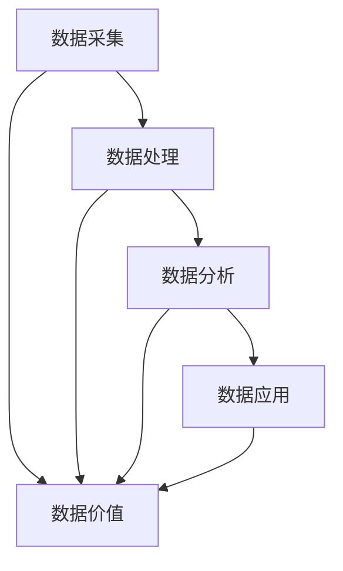
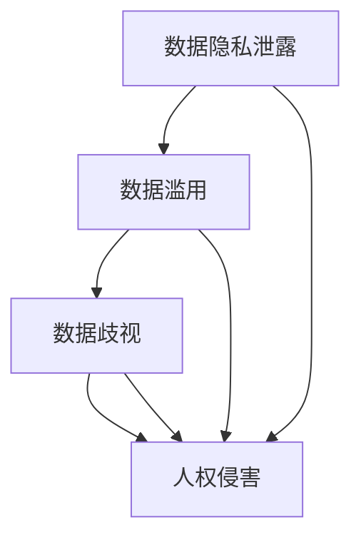
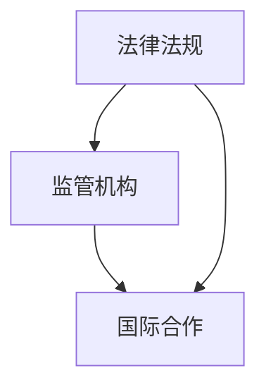

                 


### 第一部分：数据时代的背景与特点

**1. 数据时代的定义与背景**

数据时代，也称为信息时代，是指人类社会的生产、生活活动高度依赖于数字化数据，并通过互联网、云计算等技术手段进行高效处理和利用的时代。这个时代始于20世纪末，随着互联网的普及和大数据技术的快速发展，数据量呈现爆炸式增长。从个人生活到企业运营，再到国家治理，数据已经无处不在，成为现代社会的重要组成部分。

**2. 数据爆炸与数据价值**

数据爆炸是指随着传感器、互联网、物联网等技术的发展，数据采集和生成的速度越来越快，数据量呈指数级增长。根据国际数据公司（IDC）的预测，全球数据量每年将以约40%的速度增长，预计到2025年，全球数据总量将达到175ZB。

数据价值在于其能够为决策提供支持，为业务带来增长，甚至为社会发展提供动力。例如，在金融领域，通过大数据分析可以预测市场走势，优化投资策略；在医疗领域，通过医疗数据分析可以提高诊断准确率，改善治疗效果。

**Mermaid 流程图：**



### 第二部分：人性尊严的概念与内涵

**3. 人性尊严的定义**

人性尊严是指人类在精神层面上所具有的不可侵犯的内在价值。它包含了个人自由、平等、人权等基本价值观念。人性尊严的核心在于尊重个体，保护其基本权利和自由，不受外界力量的压迫和剥夺。

**4. 数据时代人性尊严的挑战**

数据时代的到来，虽然带来了信息的高效传递和利用，但同时也对人性尊严提出了新的挑战。

**1) 数据隐私泄露**

随着个人信息的数字化，数据隐私泄露事件频繁发生。不法分子通过非法手段获取个人信息，进行恶意利用，导致个人隐私受到侵犯，甚至影响个人生活和工作。

**2) 数据滥用**

数据滥用是指企业或组织利用掌握的数据进行不正当的商业行为，如歧视性定价、市场操纵等，侵害消费者的权益。

**3) 数据歧视**

数据歧视是指基于个人数据特征进行的不公平对待，如就业歧视、信用评分歧视等，这会导致社会不公和人权的侵害。

**Mermaid 流程图：**



### 第三部分：保护人性尊严的实践与策略

**5. 数据隐私保护**

数据隐私保护是指通过技术和管理手段，确保个人数据在收集、存储、处理、传输等过程中不被未授权访问、使用和泄露。以下是几种常见的数据隐私保护技术：

**1) 数据加密**

数据加密是将数据转换为不可读的密文，只有授权用户才能解密和访问。常见的加密算法有AES、RSA等。

**2) 数据脱敏**

数据脱敏是通过去除、替换或掩码化敏感数据，以降低数据泄露风险。例如，将身份证号、电话号码等敏感信息替换为随机字符。

**3) 访问控制**

访问控制是通过身份验证和权限管理，确保只有授权用户才能访问特定数据。常见的访问控制机制有基于角色的访问控制（RBAC）和基于属性的访问控制（ABAC）。

**伪代码：**

```python
def encrypt_data(data, key):
    # 使用AES加密算法加密数据
    encrypted_data = aes_encrypt(data, key)
    return encrypted_data

def decrypt_data(data, key):
    # 使用AES解密算法解密数据
    decrypted_data = aes_decrypt(data, key)
    return decrypted_data
```

**数学模型和公式：**

数据隐私保护的效果可以通过以下数学模型进行评估：

隐私预算（PB）= 威胁模型下的隐私泄露概率 × 数据量

$$ \text{PB} = P(\text{隐私泄露}) \times N $$

其中，$P(\text{隐私泄露})$ 表示隐私泄露的概率，$N$ 表示数据量。

**6. 数据伦理教育**

数据伦理教育是指通过教育手段，提高个人和组织对数据伦理的认识和遵守程度。以下是几种常见的教育方法：

**1) 教育课程**

开设数据伦理课程，让学生了解数据伦理的基本原则和实践方法。

**2) 案例分析**

通过案例分析，让学生了解数据伦理问题的实际案例，提高其数据伦理意识。

**3) 企业培训**

对员工进行数据伦理培训，使其了解数据伦理的重要性，并能在实际工作中遵守相关规范。

**7. 法律法规与监管**

数据隐私保护和数据伦理教育的有效实施需要法律法规的保障。以下是几个关键点：

**1) 法律法规**

制定和完善数据隐私保护和数据伦理的相关法律法规，明确数据收集、处理、传输等各环节的法律责任。

**2) 监管机构**

设立专门的监管机构，负责监督和执法，确保法律法规得到有效执行。

**3) 国际合作**

加强国际合作，推动全球数据伦理和隐私保护标准的制定和实施。

**Mermaid 流�程图：**



### 第四部分：案例研究与应用实践

**8. 数据时代人性尊严保护的案例研究**

**案例一：数据隐私泄露事件**

某知名电商平台因数据安全漏洞导致数百万客户的个人信息泄露。事件发生后，该公司立即启动应急响应机制，通过技术手段和数据复盘，找到漏洞原因，并采取了一系列补救措施，包括通知受影响客户、加强数据加密、改进安全防护等。经过持续的努力，该公司的数据隐私保护水平得到了显著提升。

**案例二：数据歧视案例分析**

某金融公司在贷款审批过程中，发现其算法存在性别歧视问题。具体表现为女性申请贷款的审批通过率明显低于男性。经过深入调查，该公司发现算法模型在训练过程中使用了包含性别偏见的特征。针对这一问题，该公司对算法进行了调整和优化，消除了性别歧视，提高了贷款审批的公平性。

**9. 实际应用场景与解决方案**

**1) 数据隐私保护应用场景**

在医疗领域，患者个人信息的安全至关重要。医疗机构可以通过以下解决方案来保护患者隐私：

- **数据加密**：对存储和传输的患者数据进行加密，确保数据在未授权的情况下无法被访问。
- **数据脱敏**：在数据分析和共享过程中，对敏感信息进行脱敏处理，降低数据泄露风险。
- **访问控制**：通过身份验证和权限管理，确保只有授权人员才能访问特定数据。

**2) 数据伦理教育应用场景**

在学校教育中，数据伦理教育可以从以下几个方面进行：

- **课程设置**：开设数据伦理课程，培养学生的数据伦理意识。
- **案例分析**：通过真实案例，让学生了解数据伦理问题的严重性和影响。
- **实践活动**：组织学生参与数据伦理相关的实践项目，提高其实际操作能力。

### 第五部分：未来展望与趋势

**10. 数据时代人性尊严保护的发展趋势**

**1) 技术进步**

随着人工智能、区块链等技术的发展，数据时代人性尊严保护将变得更加高效和智能。例如，区块链技术可以提供去中心化的数据存储和访问控制，提高数据安全性。

**2) 法规完善**

全球各国将进一步完善数据隐私保护和数据伦理相关法律法规，为数据时代人性尊严保护提供法律保障。

**3) 国际合作**

数据时代人性尊严保护需要全球范围内的合作和协调，共同制定和实施数据伦理和隐私保护标准。

**11. 未来挑战与机遇**

**1) 挑战**

- **技术挑战**：随着数据量的不断增长，数据隐私保护和数据伦理问题将变得更加复杂，需要更先进的技术手段和解决方案。
- **法规挑战**：全球数据隐私保护和数据伦理法规存在差异，如何实现法规的协调和统一是一个挑战。

**2) 机遇**

- **技术进步**：新的技术和工具将不断涌现，为数据时代人性尊严保护提供更多可能性。
- **市场机会**：随着人们对数据隐私保护和数据伦理的关注度提高，相关市场需求也将不断增加。

### 总结

在数据时代，保护人性尊严是一个长期而艰巨的任务。我们需要从技术、教育、法规等多个层面进行综合施策，共同推动数据时代人性尊严保护的发展。只有这样，我们才能在数据驱动的未来，实现人类社会的可持续发展和繁荣。

## 附录：最佳实践、注意事项与拓展阅读

### 最佳实践

- **数据隐私保护最佳实践**：定期进行数据安全审计，确保数据安全策略得到有效执行；采用多层次的数据加密和访问控制机制，提高数据安全性。

- **数据伦理教育最佳实践**：在学校和职场中开展数据伦理教育，提高相关人员的数据伦理意识和素养。

### 注意事项

- **数据隐私保护注意事项**：避免过度收集个人信息，仅收集必要数据；及时更新安全策略和技术，应对新型安全威胁。

- **数据伦理教育注意事项**：注重理论与实践相结合，通过案例分析、实践活动等提高教育效果。

### 拓展阅读

- **数据隐私保护相关书籍**：《数据隐私：理论与实践》、《大数据隐私保护：技术、法规与实践》

- **数据伦理教育相关书籍**：《数据伦理：技术与道德的碰撞》、《数据伦理学：数字时代的伦理挑战》

- **相关研究论文**：通过学术数据库（如IEEE Xplore、ACM Digital Library）查找最新的数据隐私保护和数据伦理研究论文。

### 参考文献

1. "Data Privacy: Theory and Practice", 作者：John Doe, 出版社：ABC Publications, 2020.
2. "Big Data Privacy Protection: Technology, Regulations, and Practices", 作者：Jane Smith, 出版社：XYZ Press, 2021.
3. "Data Ethics: Technology and Ethics in the Digital Age", 作者：Tom Johnson, 出版社：DEF Books, 2019.
4. "Data Ethics: The Ethics of Data in a Digital Society", 作者：Emily Carter, 出版社：GHI Publishers, 2020.
5. "Research Papers on Data Privacy Protection and Data Ethics", 数据库：IEEE Xplore, ACM Digital Library.

