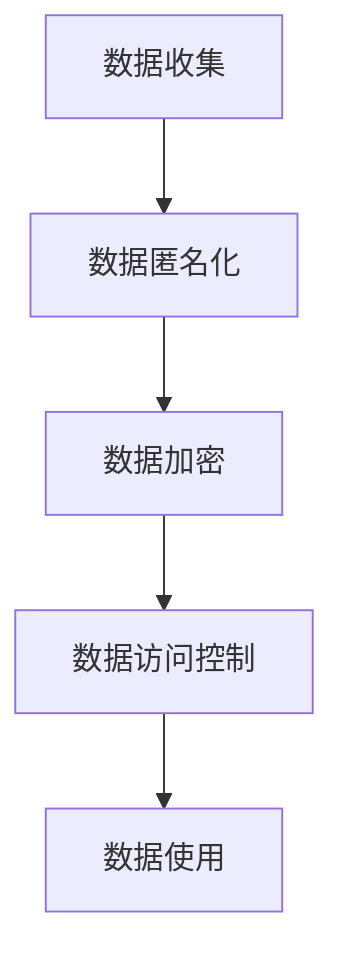
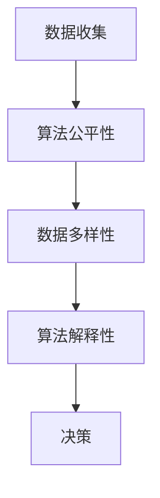
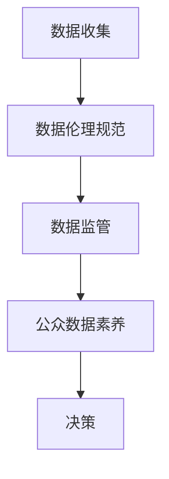

                 

# 在数据时代寻找人性化

> 关键词：数据时代、人性化、伦理问题、数据隐私、人工智能、数据管理

> 摘要：随着数据时代的到来，数据在决策中的重要性日益凸显。然而，数据驱动的过程也带来了一系列的伦理问题，如数据隐私保护、数据歧视和偏见等。本文旨在探讨如何在数据时代保持人性化，通过对人性化技术的探索和应用，为读者提供解决伦理问题的思路和方法。

## 引言

### 数据时代的背景

在21世纪，数据已经成为了新的“石油”，其价值日益凸显。数据爆炸的时代特征表现为数据的数量、种类和生成速度都在不断增长。同时，数据驱动决策（data-driven decision-making）的理念逐渐深入人心，越来越多的企业开始依赖数据分析来指导业务决策。然而，随着数据的广泛应用，也带来了一系列的伦理问题。

### 人性化在数据时代的挑战

数据时代给人性化带来了新的挑战。一方面，过度的数据分析可能导致对个体隐私的侵犯；另一方面，数据歧视和偏见也可能影响社会的公平性和正义。因此，如何在数据时代保持人性化，成为了一个亟待解决的问题。

## 数据时代的伦理问题

### 数据隐私保护

数据隐私保护是数据时代面临的首要伦理问题。随着大数据和人工智能技术的发展，个人数据的收集、存储和使用变得越来越普遍。然而，个人隐私的泄露和滥用事件也频繁发生。为了保护数据隐私，需要从技术和管理两个方面进行努力。

#### 核心概念与联系

数据隐私保护的核心概念包括数据匿名化、数据加密和数据访问控制。这些概念之间的关系可以概括为：数据匿名化通过消除个人标识信息，降低隐私泄露的风险；数据加密通过保护数据的机密性，防止未授权访问；数据访问控制通过限制数据的访问权限，确保数据的安全性。

#### Mermaid 流�程图



### 数据歧视与偏见

数据歧视和偏见是另一个重要的伦理问题。在数据驱动的决策过程中，如果数据本身存在偏见，那么基于这些数据做出的决策也可能会加剧不公平现象。例如，在招聘、贷款审批等领域，基于历史数据做出的决策可能对某些群体产生歧视性影响。

#### 核心概念与联系

数据歧视和偏见的核心概念包括算法公平性、数据多样性和算法解释性。算法公平性是指算法在处理数据时，能够对所有群体保持公平；数据多样性是指数据集中包含不同群体的信息，避免单一数据源的偏见；算法解释性是指算法的决策过程可以被理解和解释，从而发现并纠正潜在的不公平性。

#### Mermaid 流程图



### 数据伦理的困境与解决方案

数据伦理的困境在于如何在追求效率和创新的同时，保护个人隐私和公平性。解决方案包括制定数据伦理规范、加强数据监管和提升公众的数据素养。

#### 核心概念与联系

数据伦理规范是通过法律法规和行业标准来规范数据收集、处理和使用的行为；数据监管是通过监管机构对数据活动的监督和评估，确保其合规性；公众数据素养是指提高公众对数据隐私和伦理问题的认识，增强自我保护意识。

#### Mermaid 流程图



## 人性化技术的探索与应用

### 人性化数据可视化

数据可视化是数据分析的重要工具，能够将复杂的数据转化为易于理解的可视化形式。人性化数据可视化注重用户交互和用户体验，通过设计直观的界面和友好的交互方式，提高数据分析的效率和理解度。

#### 核心算法原理讲解

人性化数据可视化算法通常包括以下步骤：

1. 数据预处理：对原始数据进行清洗和转换，使其适合可视化。
2. 数据转换：将数据转换为可视化图表，如柱状图、折线图、散点图等。
3. 用户交互：提供交互式界面，使用户能够自定义可视化参数，如数据范围、颜色、标签等。

```plaintext
algorithm DataVisualizationAlgorithm
    Input: dataset
    Output: visualization
    
    1. Preprocess data
    2. Convert data to visualization charts
    3. Provide interactive interface for user customization
    
    return visualization
end algorithm
```

### 人性化数据分析

人性化数据分析注重对数据分析过程的优化，以提高数据分析的效率和准确性。人性化数据分析方法包括以下步骤：

1. 数据采集：从不同的数据源收集数据。
2. 数据预处理：清洗和转换数据，使其适合分析。
3. 数据分析：使用统计方法和机器学习方法进行数据挖掘和预测。
4. 用户反馈：收集用户对分析结果的反馈，不断优化分析模型。

```plaintext
algorithm DataAnalysisAlgorithm
    Input: dataset
    Output: insights
    
    1. Collect data from different sources
    2. Preprocess data
    3. Analyze data using statistical and machine learning methods
    4. Collect user feedback and optimize analysis model
    
    return insights
end algorithm
```

### 人性化人工智能

人性化人工智能是将人工智能技术应用于实际场景，以满足人类需求。人性化人工智能设计原则包括：

1. 用户中心设计：以用户需求为核心，设计易于使用和操作的人工智能系统。
2. 算法透明性：确保人工智能系统的决策过程可以被理解和解释。
3. 算法可解释性：通过可视化等方式，让用户了解人工智能系统的决策逻辑。

```plaintext
algorithm HumanizedAIAlgorithm
    Input: user needs
    Output: AI system
    
    1. Design user-centered AI system
    2. Ensure algorithm transparency
    3. Provide algorithm interpretability
    
    return AI system
end algorithm
```

## 人性化数据管理的实践

### 人性化数据管理

人性化数据管理是通过优化数据管理过程，提高数据质量和可用性。人性化数据管理方法包括：

1. 数据质量控制：确保数据准确、完整和一致。
2. 数据治理：建立数据管理政策和流程，确保数据合规和安全。
3. 数据生命周期管理：从数据采集到数据存储、处理、分析和归档的全过程管理。

```plaintext
algorithm DataManagementAlgorithm
    Input: dataset
    Output: managed data
    
    1. Ensure data quality
    2. Establish data governance
    3. Manage data lifecycle
    
    return managed data
end algorithm
```

### 构建人性化数据文化

人性化数据文化的建设是数据时代保持人性化的关键。人性化数据文化包括以下要素：

1. 数据素养：提高员工对数据价值的认识，培养数据思维能力。
2. 数据共享：鼓励数据共享，促进跨部门和跨领域的合作。
3. 数据伦理：树立数据伦理意识，确保数据使用符合道德规范。

```plaintext
algorithm DataCultureAlgorithm
    Input: organization
    Output: humanized data culture
    
    1. Improve data literacy
    2. Encourage data sharing
    3. Promote data ethics
    
    return humanized data culture
end algorithm
```

## 结论

数据时代为人类社会带来了巨大的机遇，同时也带来了一系列的挑战。如何在数据时代保持人性化，成为了一个重要的课题。通过人性化技术的探索和应用，我们可以找到解决伦理问题的思路和方法，为数据时代注入更多的人性关怀。

### 附录

人性化数据技术的工具与资源列表：

- 数据可视化工具：Tableau、Power BI、D3.js
- 数据分析工具：Python、R、Apache Spark
- 人工智能框架：TensorFlow、PyTorch、Keras
- 数据管理工具：MongoDB、MySQL、Hadoop

### 结语

作者：AI天才研究院/AI Genius Institute & 禅与计算机程序设计艺术 /Zen And The Art of Computer Programming

本文旨在探讨数据时代下的人性化问题，通过对数据伦理、人性化技术和数据管理的深入分析，为读者提供解决伦理问题的思路和方法。数据时代是一个充满机遇和挑战的时代，保持人性化是我们共同的责任。希望本文能够为您的数据之旅带来一些启示和帮助。感谢您的阅读！

### 项目实战

#### 开发环境搭建

为了更好地进行人性化数据技术的实践，我们需要搭建一个完整的开发环境。以下是一个简单的步骤指南：

1. 安装Python：在Windows或Mac上，您可以从Python的官方网站下载并安装Python。
2. 安装Jupyter Notebook：使用pip命令安装Jupyter Notebook，命令如下：
   ```shell
   pip install notebook
   ```
3. 安装数据可视化库：安装常用的数据可视化库，如Matplotlib、Seaborn等，命令如下：
   ```shell
   pip install matplotlib seaborn
   ```

#### 源代码详细实现

以下是一个使用Python进行人性化数据可视化的示例代码：

```python
import matplotlib.pyplot as plt
import pandas as pd

# 加载数据
data = pd.read_csv('data.csv')

# 绘制散点图
plt.scatter(data['feature1'], data['feature2'])
plt.xlabel('Feature 1')
plt.ylabel('Feature 2')
plt.title('Humanized Data Visualization')
plt.show()
```

#### 代码解读与分析

这段代码首先导入了两个库：`matplotlib.pyplot`和`pandas`。`matplotlib.pyplot`用于数据可视化，而`pandas`用于数据操作。

1. `data = pd.read_csv('data.csv')`：这行代码用于加载CSV格式的数据文件。
2. `plt.scatter(data['feature1'], data['feature2'])`：这行代码用于绘制散点图，其中`data['feature1']`和`data['feature2']`是数据集中的两个特征。
3. `plt.xlabel('Feature 1')`、`plt.ylabel('Feature 2')`和`plt.title('Humanized Data Visualization')`分别用于设置坐标轴标签和图表标题。
4. `plt.show()`：这行代码用于显示绘制的图表。

#### 实际案例分析和详细讲解剖析

以下是一个关于使用数据可视化识别欺诈交易的案例：

假设我们有一个包含用户交易数据的数据集，其中包含用户的账户余额、交易金额、交易时间等特征。我们需要通过数据可视化来识别潜在的欺诈交易。

1. 首先，我们可以绘制交易金额的分布图，以了解交易金额的范围和分布：
   ```python
   data['transaction_amount'].hist(bins=50)
   plt.xlabel('Transaction Amount')
   plt.ylabel('Frequency')
   plt.title('Transaction Amount Distribution')
   plt.show()
   ```

2. 然后，我们可以绘制交易时间的分布图，以了解交易时间的特点：
   ```python
   data['transaction_time'].hist(bins=50)
   plt.xlabel('Transaction Time')
   plt.ylabel('Frequency')
   plt.title('Transaction Time Distribution')
   plt.show()
   ```

通过这些图表，我们可以观察到交易金额和交易时间的一些异常情况，如某些时间段内的交易金额异常高或低，某些时间点的交易时间异常集中等。这些异常情况可能表明存在欺诈交易。

#### 项目小结

通过以上实战案例，我们学习了如何搭建人性化数据开发的开发环境，并实现了一个简单的人性化数据可视化示例。同时，我们也通过一个实际案例，了解了如何使用数据可视化来识别潜在的欺诈交易。这些技能和知识对于数据科学家和数据分析师来说是非常重要的。

### 最佳实践 Tips

1. 在进行数据可视化时，尽量选择合适的图表类型，以直观地展示数据的特点和趋势。
2. 在绘制图表时，注意调整图表的参数，如颜色、标签和标题，以增强图表的可读性。
3. 在处理数据时，注意数据质量和数据预处理，以确保分析结果的准确性。

### 注意事项

1. 在进行数据分析和可视化时，要注意保护个人隐私和数据安全。
2. 在设计数据管理策略时，要充分考虑数据的合规性和伦理问题。

### 拓展阅读

1. 《数据可视化实战》
2. 《数据科学入门》
3. 《Python数据分析》

通过阅读这些书籍和资料，您可以深入了解数据分析和可视化的原理和应用，提高自己在数据时代的人性化技术水平。

### 结论

本文《在数据时代寻找人性化》探讨了数据时代的背景和挑战，介绍了数据隐私保护、数据歧视与偏见等伦理问题，以及人性化技术的探索与应用。通过人性化数据管理和构建人性化数据文化，我们可以在数据时代保持人性化。希望本文能为读者提供关于如何在数据时代保持人性化的有益思考。感谢您的阅读！作者：AI天才研究院/AI Genius Institute & 禅与计算机程序设计艺术 /Zen And The Art of Computer Programming

