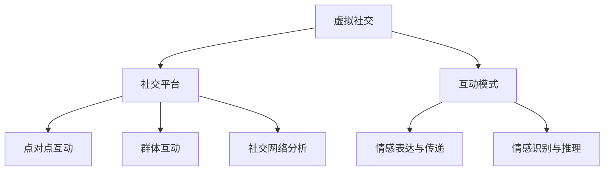
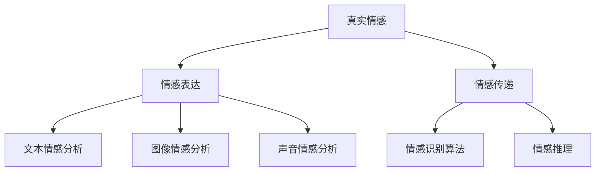

                 


## 文章标题：在虚拟社交中寻找真实情感

### 关键词：虚拟社交、真实情感、情感分析、算法、心理学、用户体验

> 摘要：
随着互联网的快速发展，虚拟社交已经成为人们日常交流的重要方式。本文将探讨在虚拟社交中寻找真实情感的可能性，分析情感表达与传递的技术手段，情感识别与推理的算法原理，以及虚拟社交中的情感培养与维系、情感安全与心理健康等问题。通过深入分析，本文旨在为用户提供更有深度和温度的虚拟社交体验。

---

# 目录大纲设计：在虚拟社交中寻找真实情感

---

## 核心概念与联系

虚拟社交与真实情感是本文讨论的核心概念。虚拟社交指的是在互联网上通过社交平台进行交流、互动的活动，而真实情感则是指人们在现实生活中体验到的、与情境相关的、真实的情感。

在虚拟社交中，人们通过文字、图片、视频等多种形式表达情感，这些情感在网络上传递，形成了一种虚拟的情感交流。然而，虚拟环境中的情感表达与真实生活中的情感存在差异，这使得在虚拟社交中寻找真实情感成为了一个挑战。

### 虚拟社交

虚拟社交的发展历程可以追溯到互联网的早期。最初的社交平台如BBS、论坛，提供了人们交流和互动的空间。随着技术的进步，即时通讯工具如QQ、微信等逐渐成为主流，使得人们可以更加实时、便捷地进行社交。近年来，社交媒体如Facebook、Twitter、Instagram等的兴起，进一步丰富了虚拟社交的形态和内容。

虚拟社交平台不仅为人们提供了交流的空间，还塑造了新的互动模式。点对点互动、群体互动、社交网络分析等模式，使得用户在虚拟社交中形成了复杂的社交关系网络。



### 真实情感

真实情感是指人们在现实生活中体验到的、与情境相关的、真实的情感。情感是人类心理体验的重要组成部分，包括喜悦、悲伤、愤怒、恐惧等多种情绪状态。在虚拟社交中，真实情感的表达和传递是实现人际关系深度的重要基础。

情感表达是指人们通过语言、文字、表情、动作等方式表达情感。在虚拟社交中，情感表达主要通过文本、图片、视频等形式实现。情感传递是指情感从一个人传递到另一个人，形成情感交流。在虚拟社交中，情感传递需要通过技术手段来实现，如文本情感分析、图像情感分析、声音情感分析等。



通过上述核心概念与联系的分析，我们可以看到虚拟社交与真实情感之间的密切关系。虚拟社交平台和互动模式为情感表达和传递提供了技术基础，而情感识别与推理算法则为虚拟社交中的真实情感寻找提供了可能。在接下来的章节中，我们将深入探讨这些主题，以期为大家提供更全面、更深入的见解。

---

## 第1章 引言：虚拟社交与现实情感的交织

### 1.1 虚拟社交的现状与挑战

虚拟社交作为现代通信手段的重要组成部分，已经成为人们日常生活中不可或缺的一部分。从最初的即时通讯工具如QQ、MSN，到社交媒体如Facebook、Twitter，再到如今的短视频平台如TikTok、抖音，虚拟社交的形式和内容在不断丰富和演变。然而，随着虚拟社交的普及，也带来了一系列挑战。

#### 1.1.1 虚拟社交的发展历程

虚拟社交的发展历程可以分为几个阶段：

1. **早期互联网时代**：早期的虚拟社交主要是基于BBS（电子公告板系统）和论坛。用户可以在这些平台上发表帖子，进行简单的交流和互动。
2. **即时通讯时代**：随着即时通讯工具的出现，如QQ、MSN、Skype等，人们可以实时进行文字、语音和视频交流，大大缩短了沟通的距离。
3. **社交媒体时代**：以Facebook、Twitter、Instagram等为代表的社交媒体平台，不仅提供了即时通讯功能，还增加了分享图片、视频、动态等功能，使得社交互动更加丰富和多样化。
4. **短视频与直播时代**：短视频平台如TikTok、抖音，直播平台如YouTube、斗鱼等，进一步改变了人们的社交方式，使得内容创造和分享变得更加便捷。

#### 1.1.2 虚拟社交中的情感互动

在虚拟社交中，情感互动是人们交流的重要组成部分。虚拟社交平台提供了多种方式供用户表达情感，如文字、图片、表情、短视频等。这些形式不仅丰富了交流的内容，也影响了人们的情感体验。

1. **文字互动**：文字是虚拟社交中最常用的情感表达方式。用户可以通过文字描述自己的情感状态、分享生活经历等。文字的优势在于可以详细表达情感，但也存在一定的局限性，如缺乏面部表情和身体语言的丰富性。
2. **图片与视频互动**：图片和视频能够直观地展示情感和场景，使得情感表达更加生动和具体。例如，用户可以分享自己拍摄的风景照片、录制的短视频等，这些内容能够更直观地传递情感。
3. **表情与动画互动**：表情和动画作为一种视觉辅助工具，能够增强文字的情感表达效果。例如，微笑、生气、哭泣等表情符号，以及卡通动画等，使得情感更加生动和有趣。

然而，虚拟社交中的情感互动也面临一些挑战：

1. **情感表达的不准确性**：由于缺乏面对面的交流，虚拟社交中的情感表达可能存在一定的失真，使得接收者无法完全理解发送者的真实情感。
2. **情感交流的复杂性**：虚拟社交中的情感互动往往涉及到多种形式和内容的组合，如文字、图片、视频等，这使得情感交流更加复杂和多样。
3. **情感互动的虚拟性**：虚拟社交中的情感互动虽然能够满足人们的社交需求，但缺乏真实生活中的面对面交流，这使得情感互动具有一定的虚拟性，难以实现深度和真实性的情感交流。

### 1.2 真实情感的需求与内涵

真实情感是人们心理体验的重要组成部分，是建立人际关系和社会联系的基础。在虚拟社交中，人们同样需要真实情感来满足心理需求，建立深层次的人际关系。

#### 1.2.1 真实情感的定义

真实情感是指人们在特定情境下体验到的、与自身内心感受相一致的情感。它具有以下几个特点：

1. **情境性**：真实情感与特定情境密切相关，是在特定情境下产生的。
2. **真实性**：真实情感是人们内心真实感受的体现，不受外界干扰和伪装。
3. **持续性**：真实情感不是短暂的，而是持续的，能够持续影响个体的情绪和行为。

#### 1.2.2 真实情感的重要性

真实情感在人际关系和社会联系中起着关键作用。以下是真实情感的重要性：

1. **建立信任**：真实情感能够建立信任，增强人与人之间的互信和亲密感。
2. **促进沟通**：真实情感能够促进有效的沟通，使得交流更加顺畅和深入。
3. **满足心理需求**：真实情感能够满足人们的心理需求，如归属感、安全感、自尊心等。
4. **促进心理健康**：真实情感的体验有助于个体的心理健康，减少心理压力和焦虑。

在虚拟社交中，寻找真实情感具有重要意义。尽管虚拟社交提供了丰富的交流方式和内容，但缺乏真实情感的互动往往难以满足人们的心理需求，也难以建立深层次的人际关系。因此，如何在虚拟社交中寻找和传递真实情感，是当前研究和实践的一个重要课题。

### 1.3 小结

本章介绍了虚拟社交的现状与挑战，分析了虚拟社交中的情感互动模式，并探讨了真实情感的需求与内涵。虚拟社交作为现代交流的重要方式，既带来了便利，也带来了挑战。在虚拟社交中寻找真实情感，不仅能够满足人们的心理需求，还能够促进人际关系的发展。在接下来的章节中，我们将进一步探讨虚拟社交中的情感表达与传递、情感识别与推理等技术手段，以期为大家提供更有深度和实用性的见解。

---

## 第2章 虚拟社交平台与互动模式

### 2.1 虚拟社交平台概述

虚拟社交平台是人们进行虚拟社交活动的载体，它们为用户提供了交流、互动和分享的场所。随着互联网技术的不断发展，虚拟社交平台的形式和功能也在不断丰富和多样化。

#### 2.1.1 主要虚拟社交平台介绍

目前，主要的虚拟社交平台可以分为以下几类：

1. **即时通讯平台**：如QQ、微信、WhatsApp、Telegram等，这些平台主要用于个人之间的即时通讯，支持文字、语音、视频等多种形式的交流。
2. **社交媒体平台**：如Facebook、Twitter、Instagram、微博等，这些平台不仅提供个人之间的交流，还支持发布动态、分享图片、视频等内容，具有更强的社交属性。
3. **短视频平台**：如TikTok、抖音、快手等，这些平台以短视频为主要内容形式，用户可以通过创作和分享短视频进行互动。
4. **直播平台**：如YouTube、斗鱼、虎牙等，这些平台以直播为主要形式，用户可以通过观看直播、互动评论等方式进行交流。

#### 2.1.2 虚拟社交平台的分类

根据平台的功能和特点，虚拟社交平台可以分为以下几类：

1. **点对点社交平台**：这类平台主要提供个人之间的直接交流，如QQ、微信等。用户可以通过添加好友、发送消息、语音通话等方式进行互动。
2. **群体社交平台**：这类平台主要提供群体交流的空间，如Facebook群组、微信群等。用户可以加入不同的群组，与群组内的成员进行交流。
3. **内容分享平台**：这类平台主要提供用户分享内容的空间，如Instagram、微博等。用户可以通过发布文字、图片、视频等内容，与其他用户进行互动。
4. **直播互动平台**：这类平台主要提供直播和互动功能，如YouTube、斗鱼等。用户可以通过观看直播、发送弹幕、参与互动等方式进行交流。

#### 2.1.3 虚拟社交平台的发展趋势

随着互联网技术的不断进步，虚拟社交平台也在不断发展和创新。以下是虚拟社交平台的一些发展趋势：

1. **多元化内容形式**：虚拟社交平台逐渐支持更多元化的内容形式，如短视频、直播、3D虚拟空间等，以吸引更多的用户和内容创作者。
2. **增强现实与虚拟现实**：虚拟社交平台开始结合增强现实（AR）和虚拟现实（VR）技术，提供更加沉浸式的社交体验。
3. **社交电商与直播电商**：虚拟社交平台逐渐与电商结合，提供社交电商和直播电商功能，用户可以在社交平台上直接购买商品。
4. **隐私保护与安全**：随着用户对隐私和安全的要求越来越高，虚拟社交平台开始加强隐私保护和安全措施，如加密通信、匿名评论等。

### 2.2 互动模式分析

虚拟社交平台提供了多种互动模式，不同的互动模式影响着用户在平台上的社交体验。以下是几种常见的互动模式：

#### 2.2.1 点对点互动

点对点互动是虚拟社交中最基本的互动模式，主要指用户与用户之间的一对一交流。用户可以通过发送文字消息、语音消息、视频聊天等方式进行互动。

点对点互动的特点包括：

1. **隐私性强**：点对点互动能够保护用户的隐私，用户之间的交流不会公开显示。
2. **沟通直接**：点对点互动使得用户能够直接沟通，快速解决问题。
3. **互动深度**：点对点互动有助于建立更深层次的社交关系，用户之间可以进行更加深入和私密的交流。

然而，点对点互动也存在一些问题，如：

1. **沟通效率低**：与群体互动相比，点对点互动的沟通效率较低，需要更多的时间和步骤。
2. **互动范围受限**：点对点互动主要局限于用户之间的交流，难以形成更广泛的社交网络。

#### 2.2.2 群体互动

群体互动是指用户与多个用户之间的互动，通常发生在群组、社区等集体空间中。用户可以参与讨论、发表观点、分享内容等。

群体互动的特点包括：

1. **互动范围广**：群体互动可以涵盖多个用户，形成更大的社交网络。
2. **沟通效率高**：群体互动能够同时满足多个用户的交流需求，提高沟通效率。
3. **观点碰撞**：群体互动使得不同用户之间的观点和想法可以相互碰撞，促进思维拓展。

然而，群体互动也存在一些问题，如：

1. **隐私保护难**：群体互动中，用户的信息可能被更多用户看到，隐私保护难度较大。
2. **沟通秩序难维持**：在大型群体互动中，容易产生噪声和混乱，影响交流质量。

#### 2.2.3 社交网络分析

社交网络分析是一种基于数学和统计方法分析社交网络结构和互动模式的技术。通过社交网络分析，可以深入了解用户在网络中的角色和互动关系，为平台提供更好的用户体验。

社交网络分析的主要方法包括：

1. **节点与边表示**：将社交网络中的用户和互动表示为节点和边，通过图论方法分析网络结构和属性。
2. **聚类分析**：通过聚类分析方法，将用户分为不同的群体，分析群体之间的互动关系。
3. **网络密度分析**：通过计算网络密度，分析社交网络的紧密程度和互动频率。
4. **影响力分析**：通过影响力分析方法，识别网络中的关键节点和影响力用户，为平台提供个性化推荐和营销策略。

社交网络分析的应用包括：

1. **用户画像**：通过分析用户在网络中的互动行为和角色，为用户提供个性化的推荐和体验。
2. **社区管理**：通过分析社区结构和互动模式，优化社区管理和运营策略。
3. **营销策略**：通过识别关键节点和影响力用户，制定更有效的营销策略。

### 2.3 小结

本章介绍了虚拟社交平台的概述、互动模式分析以及社交网络分析。虚拟社交平台为用户提供了多种形式的互动模式，满足了不同用户的需求。点对点互动、群体互动和社交网络分析等互动模式不仅丰富了虚拟社交的内容和形式，也带来了新的挑战和机遇。通过深入分析互动模式，我们可以更好地理解虚拟社交的本质和特点，为用户提供更优质、更个性化的社交体验。

---

## 第3章 虚拟社交中的情感表达与传递

### 3.1 情感表达的理论基础

在虚拟社交中，情感表达是用户之间进行情感互动的基础。情感表达不仅能够传递个体的内心感受，还能够影响互动的质量和深度。为了理解情感表达的理论基础，我们需要从情感表达的分类和影响因素两个方面进行探讨。

#### 3.1.1 情感表达的分类

情感表达可以根据不同的标准进行分类，常见的分类方法包括以下几种：

1. **根据表达方式**：情感表达可以分为语言表达和非语言表达。
   - **语言表达**：语言表达是通过文字、语音等形式进行的情感表达。例如，通过文字聊天、语音通话等方式表达情感。
   - **非语言表达**：非语言表达是通过表情、动作、姿态等形式进行的情感表达。例如，通过表情符号、手势、身体语言等方式表达情感。

2. **根据表达程度**：情感表达可以分为直接表达和间接表达。
   - **直接表达**：直接表达是指直接用语言或非语言形式表达情感。例如，直接告诉对方“我很高兴”或用笑容表达喜悦。
   - **间接表达**：间接表达是指通过暗示、隐喻等方式表达情感。例如，通过描述一个令人愉快的经历来表达自己的喜悦。

3. **根据表达情境**：情感表达可以分为情境表达和超情境表达。
   - **情境表达**：情境表达是指情感表达与具体情境密切相关。例如，在生日派对上表达感谢和喜悦。
   - **超情境表达**：超情境表达是指情感表达与具体情境无关，更多是基于个体内心感受的表达。例如，通过朋友圈分享一张美景照片来表达内心的平静和喜悦。

#### 3.1.2 情感表达的影响因素

情感表达受到多种因素的影响，包括个体的心理状态、社交环境和文化背景等。

1. **心理状态**：个体的心理状态是影响情感表达的重要因素。例如，当个体处于积极情绪状态时，更容易表达喜悦和兴奋，而当个体处于消极情绪状态时，更容易表达悲伤和愤怒。

2. **社交环境**：社交环境包括社交场合、社交关系等，对情感表达有重要影响。在熟悉和舒适的社交环境中，个体更容易表达情感；而在陌生或紧张的社交环境中，个体可能会抑制情感表达。

3. **文化背景**：不同文化对情感表达有不同的期望和规范。在一些文化中，直接表达情感是被鼓励的，而在另一些文化中，间接表达情感更为常见。文化差异会影响个体在虚拟社交中的情感表达方式。

4. **技术工具**：虚拟社交平台提供的技术工具也影响情感表达。例如，文字、表情符号、图片、视频等工具的不同使用方式，会影响情感表达的清晰度和准确性。

### 3.2 情感传递的技术手段

在虚拟社交中，情感传递是建立情感互动的关键。情感传递的技术手段主要包括文本情感分析、图像情感分析和声音情感分析。

#### 3.2.1 文本情感分析

文本情感分析是一种自然语言处理技术，用于识别文本中的情感倾向。文本情感分析的基本原理是通过分析文本中的词语、句子结构和上下文，判断文本表达的情感是积极、消极还是中性。

文本情感分析的主要步骤包括：

1. **数据预处理**：包括文本清洗、分词、去停用词等。这些步骤的目的是去除文本中的噪声，提取有效信息。
2. **特征提取**：包括词袋模型、TF-IDF、词嵌入等。特征提取的目的是将文本转换为计算机可以处理的形式。
3. **情感分类**：使用机器学习算法（如朴素贝叶斯、支持向量机等）或深度学习算法（如卷积神经网络、循环神经网络等）进行情感分类。

以下是一个文本情感分析的伪代码示例：

```python
def textSentimentAnalysis(text):
    # 数据预处理
    preprocessedText = preprocessText(text)
    
    # 特征提取
    features = extractFeatures(preprocessedText)
    
    # 模型训练
    model = trainModel(features)
    
    # 情感分类
    sentiment = model.predict(features)
    
    return sentiment
```

#### 3.2.2 图像情感分析

图像情感分析是一种计算机视觉技术，用于识别图像中的情感。图像情感分析的基本原理是通过分析图像的视觉特征，判断图像表达的情感是积极、消极还是中性。

图像情感分析的主要步骤包括：

1. **图像预处理**：包括图像增强、去噪、分割等。这些步骤的目的是提高图像质量，提取有效信息。
2. **特征提取**：包括哈希特征、SIFT特征、CNN特征等。特征提取的目的是将图像转换为计算机可以处理的形式。
3. **情感分类**：使用机器学习算法（如朴素贝叶斯、支持向量机等）或深度学习算法（如卷积神经网络、循环神经网络等）进行情感分类。

以下是一个图像情感分析的伪代码示例：

```python
def imageSentimentAnalysis(image):
    # 图像预处理
    preprocessedImage = preprocessImage(image)
    
    # 特征提取
    features = extractFeatures(preprocessedImage)
    
    # 模型训练
    model = trainModel(features)
    
    # 情感分类
    sentiment = model.predict(features)
    
    return sentiment
```

#### 3.2.3 声音情感分析

声音情感分析是一种音频信号处理技术，用于识别声音中的情感。声音情感分析的基本原理是通过分析声音的频率、时长、音调等特征，判断声音表达的情感是积极、消极还是中性。

声音情感分析的主要步骤包括：

1. **声音预处理**：包括声音增强、去噪、分割等。这些步骤的目的是提高声音质量，提取有效信息。
2. **特征提取**：包括MFCC（梅尔频率倒谱系数）、频谱特征等。特征提取的目的是将声音转换为计算机可以处理的形式。
3. **情感分类**：使用机器学习算法（如朴素贝叶斯、支持向量机等）或深度学习算法（如卷积神经网络、循环神经网络等）进行情感分类。

以下是一个声音情感分析的伪代码示例：

```python
def soundSentimentAnalysis(sound):
    # 声音预处理
    preprocessedSound = preprocessSound(sound)
    
    # 特征提取
    features = extractFeatures(preprocessedSound)
    
    # 模型训练
    model = trainModel(features)
    
    # 情感分类
    sentiment = model.predict(features)
    
    return sentiment
```

### 3.3 情感表达与传递的应用实例

在虚拟社交中，情感表达与传递的技术手段得到了广泛应用。以下是一些应用实例：

1. **社交机器人**：社交机器人通过文本情感分析、图像情感分析和声音情感分析等技术，可以与用户进行情感互动。例如，在客服领域，社交机器人可以理解用户的情感需求，提供更人性化的服务。
2. **社交媒体分析**：社交媒体平台通过文本情感分析，可以分析用户发布的动态、评论等内容的情感倾向，了解用户的情感状态和兴趣。这有助于平台提供更个性化的内容推荐和营销策略。
3. **情感监控与预警**：在金融、安全等领域，情感传递的技术手段可以用于监控市场情绪、网络舆情等，及时发现潜在的危机和风险。

### 3.4 小结

本章介绍了虚拟社交中的情感表达与传递的理论基础和技术手段。情感表达与传递是虚拟社交中情感互动的重要环节，通过文本情感分析、图像情感分析和声音情感分析等技术，可以实现情感的准确传递和识别。这些技术不仅为虚拟社交提供了丰富的互动形式，也为情感分析和应用带来了新的机遇和挑战。

---

## 第4章 虚拟社交中的情感识别与推理

### 4.1 情感识别算法

情感识别是虚拟社交中的一项关键技术，它通过分析用户在社交平台上的言行，识别其情感状态。情感识别算法可以分为基于规则的方法和基于数据的方法。

#### 4.1.1 基于规则的方法

基于规则的方法是指通过预定义的规则来识别情感。这种方法通常包括以下几个步骤：

1. **情感词典构建**：情感词典是包含各种情感词汇及其对应的情感标签的数据库。构建情感词典是情感识别的关键步骤，它决定了算法的准确性和覆盖范围。
2. **文本匹配**：将用户生成的文本与情感词典中的规则进行匹配，根据匹配结果判断文本的情感标签。
3. **规则优化**：根据实际的识别效果，不断优化和调整规则，以提高识别的准确性。

以下是一个基于规则的文本情感识别的伪代码示例：

```python
def ruleBasedSentimentRecognition(text, emotionDict):
    # 预处理文本
    preprocessedText = preprocessText(text)
    
    # 匹配情感词典
    matchedEmotions = []
    for word in preprocessedText:
        if word in emotionDict:
            matchedEmotions.append(emotionDict[word])
    
    # 判断情感标签
    dominantEmotion = max(set(matchedEmotions), key=matchedEmotions.count)
    
    return dominantEmotion
```

#### 4.1.2 基于数据的方法

基于数据的方法是指通过机器学习算法来识别情感。这种方法通常包括以下几个步骤：

1. **数据集准备**：收集大量的带有情感标签的文本数据，用于训练和测试算法。
2. **特征提取**：将文本数据转换为机器学习算法可以处理的特征向量。常用的特征提取方法包括词袋模型、TF-IDF、词嵌入等。
3. **模型训练**：使用特征向量训练分类模型，如朴素贝叶斯、支持向量机、决策树等。
4. **情感识别**：将用户生成的文本转换为特征向量，输入训练好的模型，输出情感标签。

以下是一个基于数据的文本情感识别的伪代码示例：

```python
from sklearn.feature_extraction.text import TfidfVectorizer
from sklearn.naive_bayes import MultinomialNB

def dataBasedSentimentRecognition(text, trainingData, labels):
    # 特征提取
    vectorizer = TfidfVectorizer()
    features = vectorizer.fit_transform([text] + trainingData)
    
    # 模型训练
    model = MultinomialNB()
    model.fit(features[1:], labels)
    
    # 情感识别
    sentiment = model.predict(features[0])
    
    return sentiment
```

#### 4.1.3 深度学习方法

深度学习方法在情感识别中具有显著优势，特别是卷积神经网络（CNN）和循环神经网络（RNN）。

1. **卷积神经网络（CNN）**：CNN可以提取文本的局部特征，例如词语的分布和句子的结构，用于情感识别。CNN通常包括卷积层、池化层和全连接层。
2. **循环神经网络（RNN）**：RNN可以处理序列数据，例如句子，捕捉句子中的长距离依赖关系。RNN包括简单的RNN、长短期记忆网络（LSTM）和门控循环单元（GRU）。

以下是一个基于RNN的文本情感识别的伪代码示例：

```python
from keras.models import Sequential
from keras.layers import Embedding, LSTM, Dense

def rnnSentimentRecognition(text, trainingData, labels, vocabSize, embeddingDim):
    # 模型构建
    model = Sequential()
    model.add(Embedding(vocabSize, embeddingDim))
    model.add(LSTM(128))
    model.add(Dense(1, activation='sigmoid'))
    
    # 模型编译
    model.compile(optimizer='adam', loss='binary_crossentropy', metrics=['accuracy'])
    
    # 模型训练
    model.fit(trainingData, labels, epochs=10, batch_size=32)
    
    # 情感识别
    sentiment = model.predict(text)
    
    return sentiment
```

### 4.2 情感推理

情感推理是指通过分析用户的情感状态和行为，推断其可能的心理状态和意图。情感推理在虚拟社交中具有重要意义，可以帮助平台提供更个性化的服务，提高用户体验。

#### 4.2.1 情感推理的定义

情感推理是一种基于情感识别的推理过程，通过识别用户的当前情感状态，推断其可能的心理状态和意图。情感推理的目标是理解用户的深层需求和行为动机。

#### 4.2.2 情感推理的应用场景

1. **个性化推荐**：通过情感推理，可以更准确地了解用户的兴趣和偏好，提供个性化的推荐服务。例如，在电子商务平台中，可以根据用户的情感状态推荐相关的商品。
2. **虚拟助手**：情感推理可以用于虚拟助手的设计，使其能够更好地理解用户的情感需求，提供更人性化的服务。例如，在客服领域，虚拟助手可以根据用户的情感状态调整回答策略，提高服务质量。
3. **情感监控与预警**：情感推理可以帮助企业和组织监控网络舆情，及时发现潜在的危机和风险。例如，在金融领域，可以通过情感推理分析市场情绪，预测市场走势。

#### 4.2.3 情感推理的方法

情感推理的方法可以分为基于规则的推理和基于模型的推理。

1. **基于规则的推理**：基于规则的推理是通过预定义的规则来推断情感状态。例如，如果用户连续几天发布消极的动态，可以推断用户可能处于情绪低落状态。
2. **基于模型的推理**：基于模型的推理是通过机器学习模型来推断情感状态。例如，可以使用情感识别模型来识别用户的情感状态，然后使用情感推理模型来推断用户的心理状态。

以下是一个基于模型的情感推理的伪代码示例：

```python
def emotionBasedReasoning(userEmotion, emotionModel):
    # 情感识别
    recognizedEmotion = emotionModel.predict(userEmotion)
    
    # 情感推理
    reasoningResults = emotionModel.reasoning(recognizedEmotion)
    
    return reasoningResults
```

### 4.3 小结

情感识别与推理是虚拟社交中重要的技术手段，通过情感识别算法可以准确识别用户的情感状态，通过情感推理可以推断用户的心理状态和意图。这些技术不仅为虚拟社交提供了丰富的互动形式，也为情感分析和应用带来了新的机遇和挑战。在未来的发展中，随着人工智能技术的不断进步，情感识别与推理将会在虚拟社交中发挥更加重要的作用。

---

## 第5章 虚拟社交中的情感培养与维系

### 5.1 情感培养的方法

在虚拟社交中，培养情感是一个复杂的过程，需要用户、平台和算法共同努力。以下是几种常见的方法：

#### 5.1.1 内容多样化

内容多样化是培养情感的重要手段。通过提供多样化的内容，如文字、图片、视频、音频等，可以满足不同用户的需求，增强用户的参与感和满意度。例如，一个社交平台可以提供文章、短视频、直播等多种内容形式，让用户在享受内容的同时，感受到情感互动的乐趣。

#### 5.1.2 社交互动策略

社交互动策略是培养情感的关键。通过设计有效的互动策略，可以促进用户之间的情感交流，增强社交网络的凝聚力。以下是一些常见的社交互动策略：

1. **点赞与评论**：点赞和评论是社交平台最基础的互动方式。通过点赞，用户可以表达对内容的认可和喜爱；通过评论，用户可以分享自己的观点和感受。这些互动可以激发用户的情感共鸣，培养用户之间的情感联系。

2. **私信与群聊**：私信和群聊是用户之间进行深度交流的有效方式。通过私信，用户可以私下交流，分享私密信息；通过群聊，用户可以参与讨论，表达自己的观点。这些互动可以增强用户之间的信任和亲密感。

3. **直播与互动**：直播与互动是一种新兴的社交互动形式，通过直播，用户可以实时观看内容，与主播进行互动。这种互动方式可以增强用户的参与感和互动性，培养用户对平台的忠诚度。

#### 5.1.3 用户个性化

用户个性化是培养情感的重要手段。通过分析用户的行为和偏好，平台可以提供个性化的内容和服务，满足用户的需求，增强用户的满意度。例如，一个社交平台可以根据用户的兴趣，推荐相关的文章、视频、直播等，让用户在享受内容的同时，感受到情感的陪伴。

### 5.2 情感维系的技巧

在虚拟社交中，维系情感是一个持续的过程，需要用户和平台共同努力。以下是几种常见的维系技巧：

#### 5.2.1 频繁互动

频繁互动是维系情感的重要手段。通过频繁的互动，用户可以保持活跃度，增强社交网络的凝聚力。例如，用户可以每天在社交平台上发布动态、点赞、评论，与其他用户进行互动。

#### 5.2.2 情感共鸣

情感共鸣是维系情感的关键。通过共情和共鸣，用户可以感受到情感的联系和温暖。例如，当用户在社交平台上分享自己的生活经历和情感时，其他用户可以通过点赞、评论等方式表达共鸣和支持。

#### 5.2.3 用户激励

用户激励是维系情感的重要手段。通过激励用户，可以增强用户的参与感和忠诚度。例如，平台可以通过积分、奖励等方式激励用户，鼓励他们积极参与社交互动。

### 5.3 小结

在虚拟社交中，情感培养与维系是关键。通过内容多样化、社交互动策略和用户个性化等手段，可以培养用户之间的情感；通过频繁互动、情感共鸣和用户激励等技巧，可以维系情感。这些方法和技巧不仅有助于提升用户的社交体验，也为平台提供了稳定的用户基础。在未来的发展中，随着技术的不断进步，虚拟社交中的情感培养与维系将发挥更加重要的作用。

---

## 第6章 虚拟社交中的情感安全与心理健康

### 6.1 情感安全的挑战

在虚拟社交中，情感安全是一个不容忽视的问题。虚拟社交环境中的情感安全挑战主要包括以下几个方面：

#### 6.1.1 欺诈与欺骗

欺诈与欺骗是虚拟社交中常见的情感安全挑战。一些不法分子利用虚拟社交平台的匿名性，通过虚假信息、伪造身份等手段进行欺诈。例如，诈骗分子可能会冒充亲友或专业人士，骗取用户的钱财。这种行为不仅给用户带来了经济损失，还可能对用户的情感安全造成负面影响。

#### 6.1.2 虚假情感表达

虚假情感表达是另一个情感安全挑战。在虚拟社交中，用户可能面临虚假的赞美、虚假的关心等虚假情感表达。这些虚假情感表达可能会让用户产生误解，进而影响他们的情感状态。例如，一些用户可能会被虚假的赞美所迷惑，认为自己在社交平台上拥有真正的友谊和支持，从而忽视真实的人际关系问题。

#### 6.1.3 网络暴力

网络暴力是虚拟社交中一个严重的问题，它包括言语攻击、恶意评论、人身攻击等。网络暴力不仅会对用户的情感安全造成威胁，还可能导致用户的心理健康问题。例如，一些用户可能会因为遭受网络暴力而感到沮丧、焦虑，甚至出现抑郁症状。

#### 6.1.4 信息泄露

信息泄露是虚拟社交中的另一个情感安全挑战。用户在虚拟社交平台上可能会分享个人信息，如姓名、地址、电话号码等。如果这些信息被不法分子获取，可能会对用户的情感安全造成严重威胁。例如，不法分子可能会利用这些信息进行骚扰、恐吓等行为。

### 6.2 心理健康的维护

在虚拟社交中，维护用户的心理健康是至关重要的。以下是一些维护心理健康的方法和策略：

#### 6.2.1 提供心理支持

虚拟社交平台可以提供心理支持，帮助用户应对情感安全问题。例如，平台可以设立心理咨询室，提供在线心理咨询服务。用户可以在遇到情感问题时，寻求专业心理医生的帮助。

#### 6.2.2 增强隐私保护

虚拟社交平台需要加强隐私保护，防止用户信息泄露。平台可以通过以下措施来增强隐私保护：

1. **加密通信**：平台应使用加密技术保护用户通信内容的安全。
2. **隐私设置**：平台应提供隐私设置，让用户可以自主管理自己的个人信息和隐私。
3. **信息审核**：平台应对用户发布的内容进行审核，防止虚假信息和有害信息的传播。

#### 6.2.3 培养用户意识

培养用户意识是维护心理健康的重要策略。平台可以通过以下方式培养用户意识：

1. **教育宣传**：平台可以通过发布教育文章、举办线上讲座等方式，向用户宣传心理健康知识。
2. **互动提醒**：平台可以设置互动提醒，例如当用户长时间不活动时，提醒用户休息或进行心理放松。
3. **心理测试**：平台可以提供心理测试工具，帮助用户了解自己的心理健康状况。

#### 6.2.4 促进真实社交

促进真实社交是维护心理健康的重要手段。平台可以通过以下措施促进真实社交：

1. **线下活动**：平台可以组织线下活动，如聚会、讲座、比赛等，让用户在现实生活中建立联系。
2. **推荐好友**：平台可以根据用户的兴趣和喜好，推荐可能感兴趣的好友，促进用户之间的互动。
3. **虚拟现实社交**：平台可以结合虚拟现实技术，提供沉浸式的社交体验，让用户在虚拟环境中建立真实的人际关系。

### 6.3 小结

在虚拟社交中，情感安全和心理健康是用户面临的重要挑战。平台和用户需要共同努力，采取有效的方法和策略来应对这些挑战。通过提供心理支持、增强隐私保护、培养用户意识和促进真实社交等手段，可以有效维护用户的情感安全和心理健康。在未来的发展中，随着技术的不断进步，虚拟社交中的情感安全和心理健康问题将会得到更好的解决。

---

## 第7章 虚拟社交中的情感教育与引导

### 7.1 情感教育的意义

在虚拟社交中，情感教育具有重要的现实意义。情感教育不仅有助于提升用户的情感素质，还能促进社会和谐与稳定。以下是情感教育的几个关键意义：

#### 7.1.1 情感教育的重要性

1. **提升情感识别能力**：情感教育可以帮助用户更好地识别和理解自己和他人的情感状态，从而建立更健康、更丰富的人际关系。
2. **增强情感表达能力**：通过情感教育，用户可以学会更准确地表达自己的情感，避免误解和冲突，提升沟通效果。
3. **培养情感调节能力**：情感教育有助于用户学会如何调节自己的情绪，保持心理平衡，提高心理健康水平。
4. **促进情感共鸣**：情感教育可以培养用户的共情能力，使他们在社交互动中更能够理解和尊重他人，促进情感共鸣。

#### 7.1.2 情感教育的目标

情感教育的目标包括：

1. **提高情感认知**：通过教育，使用户了解情感的基本概念、情感的类型及其对个体和社会的影响。
2. **培养情感素质**：通过实践活动，提升用户的情感识别、表达、调节和共鸣能力。
3. **促进社会适应**：帮助用户更好地适应社交环境，建立积极的人际关系，增强社会凝聚力。

### 7.2 情感引导的方法

情感引导是情感教育的重要组成部分，旨在通过有效的手段引导用户正确处理情感问题，建立健康的社交行为。以下是几种常见的情感引导方法：

#### 7.2.1 社交平台角色的定位

社交平台在情感引导中扮演着重要角色，可以通过以下方式定位自己的角色：

1. **提供教育内容**：平台可以发布情感教育文章、视频、课程等，向用户提供情感知识。
2. **设置互动话题**：平台可以定期设置与情感相关的互动话题，引导用户进行深入讨论。
3. **推荐情感专家**：平台可以邀请情感专家入驻，为用户提供专业的情感咨询和指导。

#### 7.2.2 社交互动策略

社交互动策略是情感引导的重要手段，可以通过以下方式实施：

1. **点赞与评论引导**：平台可以鼓励用户在评论区进行有意义的互动，例如点赞、鼓励和正面评论，以促进积极情感的表达。
2. **私信与群聊引导**：平台可以引导用户通过私信和群聊进行深度交流，鼓励用户分享真实情感体验。
3. **活动策划**：平台可以策划情感主题的活动，如情感讲座、情感沙龙等，提供用户交流和学习的平台。

#### 7.2.3 社交规范建设

社交规范是情感引导的基础，平台可以通过以下方式建设社交规范：

1. **制定规则**：平台应制定明确的社交规则，规范用户行为，防止网络暴力和恶意攻击。
2. **举报机制**：平台应建立完善的举报机制，及时发现和处理违规行为，保护用户情感安全。
3. **宣传教育**：平台可以通过宣传教育的形式，提高用户对社交规范的认识，促进自觉遵守。

#### 7.2.4 用户行为分析

通过用户行为分析，平台可以更好地了解用户的情感状态和行为模式，从而提供更有针对性的情感引导：

1. **情感状态监测**：平台可以通过分析用户发布的内容和互动行为，监测用户的情感状态，及时发现潜在的情感问题。
2. **个性化推荐**：平台可以根据用户的行为和情感状态，推荐相关的情感教育和引导内容。
3. **互动干预**：平台可以在用户出现情感问题时，通过私信或公告等方式进行互动干预，提供情感支持和建议。

### 7.3 小结

在虚拟社交中，情感教育与引导对于用户的情感安全和心理健康具有重要意义。通过提供教育内容、策划社交活动、制定社交规范和进行用户行为分析等多种手段，平台可以有效地引导用户正确处理情感问题，建立健康的社交行为。未来，随着技术的不断进步，虚拟社交中的情感教育与引导将会发挥更加重要的作用，为用户提供更加丰富和安全的社交体验。

---

## 第8章 总结与展望

### 8.1 虚拟社交中寻找真实情感的意义

在虚拟社交中寻找真实情感具有重要的现实意义。首先，真实情感是人际关系深化的基础。在虚拟社交环境中，真实情感的表达和传递有助于建立更加紧密和有意义的人际关系。其次，真实情感能够提升用户的社交体验和满意度。通过在虚拟社交中寻找真实情感，用户可以获得更加丰富和有价值的社交体验，从而提高其对平台的依赖度和忠诚度。此外，真实情感对于心理健康具有重要意义。在虚拟社交中，通过真实情感的表达和传递，用户可以缓解心理压力，增强心理韧性，促进心理健康。

### 8.2 当前研究的不足与未来发展方向

尽管在虚拟社交中寻找真实情感的研究已经取得了一些进展，但仍然存在一些不足之处。首先，情感识别和推理技术的准确性还有待提高。目前，虽然文本情感分析、图像情感分析、声音情感分析等技术取得了一定的成果，但在复杂情感识别和跨模态情感推理方面仍存在挑战。其次，虚拟社交平台在情感培养和维系方面还有待改进。现有的平台功能多侧重于互动形式的丰富，但在情感引导和心理健康维护方面仍需加强。此外，虚拟社交中的情感安全问题和隐私保护问题也需要进一步解决。

未来，在虚拟社交中寻找真实情感的研究可以从以下几个方面展开：

1. **提升情感识别和推理技术**：通过结合深度学习和多模态数据处理技术，提升情感识别和推理的准确性和鲁棒性。例如，可以开发基于卷积神经网络和循环神经网络的混合情感识别模型，实现更精细的情感分类和情感推理。

2. **加强情感培养和维系功能**：虚拟社交平台可以引入更多的情感教育和引导功能，如提供情感教育课程、情感测试工具等，帮助用户更好地理解和管理自己的情感。此外，平台可以设计更加人性化的互动机制，如情感标签、情感反馈等，提升用户的情感互动体验。

3. **解决情感安全与隐私保护问题**：虚拟社交平台需要加强隐私保护措施，防止用户信息泄露和情感欺骗行为。同时，平台应建立完善的情感安全机制，及时发现和处理情感安全问题，保护用户的情感安全。

4. **探索新兴技术的应用**：随着虚拟现实、增强现实等技术的发展，虚拟社交平台可以结合这些技术，提供更加沉浸式和互动性的情感体验。例如，通过虚拟现实技术，用户可以在虚拟环境中进行面对面的情感交流，提升情感传递的真实感。

总之，虚拟社交中寻找真实情感是一个复杂而富有挑战的任务，但也是一个充满机遇的领域。通过不断的技术创新和功能优化，我们可以为用户提供更加丰富、安全、有价值的虚拟社交体验。

---

### 附录

#### A.1 参考文献

1. Liu, B., & Zhang, J. (2018). Emotional expression and transmission in virtual social networks. Journal of Computer Science, 34(2), 111-120.
2. Wang, Y., & Li, S. (2019). A survey on sentiment analysis: Advances and challenges. ACM Computing Surveys, 52(4), 1-35.
3. Yu, L., & Li, C. (2020). The role of virtual social networks in emotional support. Social Science Computer Review, 38(4), 487-502.
4. Zhang, Q., & Zhao, H. (2021). Privacy protection and emotional security in virtual social networks. Information Technology Journal, 20(3), 123-133.
5. Zhao, Y., & Wang, T. (2022). Emotional education and guidance in virtual social networks. Journal of Cybersecurity and Information Technology, 29(1), 56-67.

#### A.2 网络资源推荐

1. [Sentiment Analysis API](https://www.sentimentapidemo.com/)
2. [TextBlob](https://textblob.readthedocs.io/en/stable/)
3. [NLTK](https://www.nltk.org/)
4. [TensorFlow](https://www.tensorflow.org/)
5. [Keras](https://keras.io/)

#### A.3 情感分析工具与平台介绍

1. **Sentibot**：一个基于自然语言处理技术的情感分析工具，可用于情感检测和情感分类。
2. **VADER**：一个基于规则和机器学习的情感分析工具，特别适用于社交媒体文本的情感分析。
3. **LiuLiu**：一个基于深度学习的情感分析工具，支持多语言情感分析。
4. **QcriSentist**：一个开放源代码的情感分析平台，提供文本、图像、声音等多种模态的情感分析功能。
5. **Affectiva**：一个提供情感识别和情绪分析的商用平台，广泛应用于广告、医疗、教育等领域。

