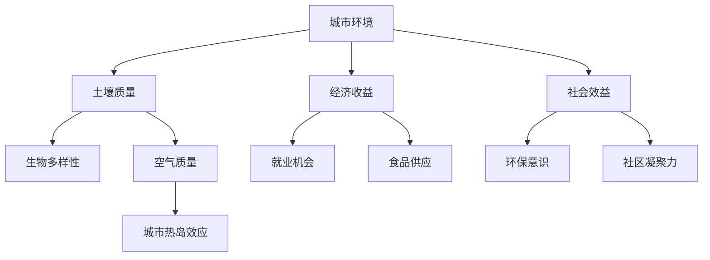

                 

### 引言

随着全球城市化进程的加速，城市与自然的关系日益紧张。钢筋水泥构建的城市环境中，人与自然之间的连接逐渐断裂，生态危机和环境污染问题愈发严重。然而，一种名为“城市农耕运动”的创新理念正悄然兴起，试图在钢筋水泥的缝隙中重建人与自然的紧密联系。

城市农耕运动，顾名思义，是指在城市化背景下，通过在城市中恢复和发展农耕活动，实现生态、经济和社会效益的多重目标。这种运动不仅涉及农业生产，更包含了一系列技术、社会和文化层面的创新和实践。城市农耕运动的核心目标是：在保持城市发展的同时，改善城市生态环境，提升城市居民的生活质量，促进社会可持续发展。

本文将围绕城市农耕运动这一主题，逐步探讨其背景、概念、与城市环境的关系、社会效益、技术支持、实施案例以及未来发展。首先，我们将介绍城市农耕运动的起源和发展历程，帮助读者了解这一概念的历史背景和演变。接着，我们将深入分析城市农耕与城市环境的互动关系，探讨其对城市生态系统的积极影响。随后，我们将讨论城市农耕运动在社会效益方面的贡献，包括经济、文化和社区层面。此外，本文还将介绍城市农耕运动所需的技术支持，如农业生产技术和信息技术。接下来，我们将通过国内外实际案例，展示城市农耕运动的实践成果。最后，我们将展望城市农耕运动的未来发展趋势，探讨其面临的挑战和机遇。

通过这篇文章，我们希望读者能够对城市农耕运动有一个全面、深入的理解，认识到其在城市化进程中的重要性和潜力。同时，我们也期待这篇文章能够激发更多对城市农耕运动的关注和参与，共同推动这一创新理念的实践与发展。

### 关键词

- 城市农耕运动
- 城市环境
- 社会效益
- 技术支持
- 实施案例
- 未来发展
- 可持续发展
- 生态恢复

### 摘要

本文旨在探讨城市农耕运动这一创新理念，分析其在城市化进程中的重要性和潜力。文章首先介绍了城市农耕运动的背景和概念，探讨了其起源和发展历程。接着，文章深入分析了城市农耕与城市环境的互动关系，探讨了其在生态、经济和社会效益方面的积极影响。此外，文章还介绍了城市农耕运动所需的技术支持，包括农业生产技术和信息技术。通过国内外实际案例，文章展示了城市农耕运动的实践成果。最后，文章展望了城市农耕运动的未来发展趋势，探讨了其面临的挑战和机遇。本文希望激发更多对城市农耕运动的关注和参与，推动这一创新理念在城市化进程中的实践与发展。

### 城市农耕运动的起源与发展

城市农耕运动的起源可以追溯到18世纪末至19世纪初的工业革命时期。当时，城市化进程迅速推进，大量农村人口涌入城市，城市规模不断扩大。然而，这一过程中也暴露出了许多问题，包括城市环境的恶化、生态系统的破坏以及人与自然关系的断裂。为了应对这些挑战，一些先驱者开始思考如何在城市中重新建立与自然的联系，从而形成了城市农耕运动的早期思想。

最早提出城市农耕理念的是法国自然学家乔治·佩雷克（Georges Perec）。他在1931年的著作《城市农耕》中首次提出了在城市中恢复农耕活动的构想。佩雷克认为，通过在城市中种植蔬菜、果树等，不仅可以改善城市环境，还可以增强城市居民对自然界的认识和体验。这一理念在城市规划者和环境保护者中引起了广泛关注，并逐渐形成了城市农耕运动的基础。

随着20世纪中叶全球环境保护运动的兴起，城市农耕运动得到了进一步的发展。特别是在20世纪70年代的石油危机期间，人们开始重新审视自然资源和可持续发展的关系。这一背景下，城市农耕运动逐渐从理论探讨转向实际应用。许多城市开始规划和实施各种城市农耕项目，如社区花园、屋顶农场、城市农场等。

进入21世纪，随着科技的进步和人们对环境问题的日益关注，城市农耕运动迎来了新的发展机遇。现代信息技术、物联网、智能农业等新兴技术的应用，使得城市农耕更加高效和可持续。例如，通过使用传感器和数据分析技术，可以实时监测土壤湿度、气象条件等，从而优化农作物种植和管理。此外，垂直农业和室内农业的兴起，也为城市农耕提供了新的发展方向。

从概念演变来看，城市农耕运动的核心始终是“重建与自然的连接”。最初，城市农耕主要是为了解决城市环境问题，如空气净化、城市热岛效应等。随着时间的发展，城市农耕的理念逐渐扩展到更广泛的领域，包括经济、社会、文化等方面。如今，城市农耕不仅仅是一种生产方式，更是一种生活方式，一种可持续发展理念。

总的来说，城市农耕运动从早期的理论探讨到实际应用，再到现代科技的融合，经历了漫长而复杂的发展历程。其核心理念始终未变，即通过在城市中恢复和发展农耕活动，重建人与自然的紧密联系，实现生态、经济和社会效益的多重目标。这一运动不仅为城市化进程提供了新的解决方案，也为全球可持续发展提供了宝贵的经验。

### 城市农耕与城市环境的关系

城市农耕与城市环境之间的关系是相互影响、相互促进的。首先，从生态角度分析，城市农耕有助于改善城市生态环境。城市中大量的建筑和道路导致土壤质量下降，生物多样性减少。而通过在城市中恢复农耕活动，可以有效改善土壤结构，增加土壤有机质含量，提高土壤肥力。同时，城市农耕可以种植各种植物，包括蔬菜、水果和花卉，从而增加城市绿化面积，提升城市空气质量。研究表明，植物通过光合作用可以吸收大量的二氧化碳，并释放氧气，有助于减轻城市热岛效应。

其次，从经济效益角度分析，城市农耕可以为城市居民提供新鲜、健康、可持续的食品。与传统的农业生产相比，城市农耕具有更短的供应链，可以减少运输和储存过程中的损耗。此外，城市农耕还可以创造就业机会，促进经济发展。例如，在美国，城市农耕项目已经为成千上万的居民提供了就业机会，涉及农业种植、园艺设计、市场销售等多个领域。

从社会效益角度分析，城市农耕有助于增强城市居民对自然环境的认知和参与感。通过参与农耕活动，居民可以亲身体验农业生产的过程，了解食物的来源，增强环保意识。此外，城市农耕还可以促进社区凝聚力，增强居民的互动和合作。例如，许多城市的社区花园和屋顶农场都是由居民共同参与和维护的，这些活动不仅丰富了居民的生活，也增强了社区的团结。

为了更直观地展示城市农耕与城市环境之间的关系，我们可以使用Mermaid流程图来构建核心概念和联系。



这个流程图清晰地展示了城市农耕如何通过改善土壤质量、生物多样性、空气质量等方面，进而影响城市环境、经济和社会效益。通过这个流程图，我们可以更直观地理解城市农耕与城市环境之间的复杂互动关系。

### 核心算法原理讲解

城市农耕运动中涉及的核心算法原理主要围绕农业生产的技术优化和数据分析。以下将使用伪代码来详细阐述这些算法的基本结构和执行流程。

#### 1. 农作物种植计划优化算法

```plaintext
算法名称：农作物种植计划优化（Cropping_Schedule_Optimization）

输入：
- 土壤参数：土壤类型、肥力、湿度等
- 气象数据：温度、降水量、风向等
- 农作物列表：包含不同作物的生长周期、适宜土壤和气候条件等

输出：
- 最佳农作物种植计划

伪代码：

1. 初始化种植计划为空
2. 对每个农作物i进行以下步骤：
   2.1 计算农作物i在当前土壤和气象条件下的适应度（Fitness）
       - 适应度 = 计算土壤、气象条件与农作物i适宜条件的匹配度
   2.2 如果适应度高于阈值，将农作物i添加到种植计划中
3. 对种植计划中的农作物进行排序，依据适应度从高到低
4. 输出排序后的种植计划
```

#### 2. 土壤健康监测算法

```plaintext
算法名称：土壤健康监测（Soil_Health_Monitoring）

输入：
- 土壤传感器数据：土壤湿度、温度、pH值等
- 气象数据：温度、降水量等

输出：
- 土壤健康状况评估

伪代码：

1. 初始化土壤健康状况为良好
2. 读取最新的土壤传感器数据和气象数据
3. 对每个土壤参数进行以下步骤：
   3.1 计算当前值与正常值的差异
   3.2 如果差异超过阈值，更新土壤健康状况为不良
4. 对气象数据进行同样的处理，更新土壤健康状况
5. 输出土壤健康状况评估结果
```

#### 3. 水资源管理算法

```plaintext
算法名称：水资源管理（Water_Resource_Management）

输入：
- 土壤湿度数据
- 气象数据：降水量、蒸发量等
- 农作物需水量数据

输出：
- 水资源分配计划

伪代码：

1. 初始化水资源分配计划为空
2. 计算当前水资源总量（降水量减去蒸发量）
3. 对每个农作物i进行以下步骤：
   3.1 计算农作物i的需水量
   3.2 如果需水量不超过当前水资源总量，将需水量分配给农作物i
4. 如果水资源总量不足以满足所有农作物的需水量，按需水量比例分配
5. 输出水资源分配计划
```

这些算法通过分析土壤、气象和农作物需水量等数据，为城市农耕提供科学的种植计划、土壤健康监测和水资源管理。在实际应用中，这些算法需要结合具体的城市环境和农业需求进行优化和调整，以确保城市农耕的可持续发展和高效运行。

### 数学模型和公式

在讨论城市农耕的技术支持时，数学模型和公式的应用至关重要。这些工具不仅帮助优化农业生产，还能提升资源管理的效率。以下我们将介绍几个关键的数学模型和公式，并使用LaTeX格式进行详细阐述。

#### 1. 水资源管理模型

水资源管理模型主要关注如何合理分配水资源，以满足农作物对水分的需求。一个常见的模型是基于线性规划（Linear Programming, LP）来优化水资源的分配。以下是一个简单的线性规划模型：

$$
\begin{aligned}
\text{Minimize } & \, C^T X \\
\text{subject to } & \, Ax \le b \\
& \, x \ge 0
\end{aligned}
$$

其中，\( C \) 是成本向量，\( X \) 是水资源分配向量，\( A \) 和 \( b \) 分别是约束矩阵和约束向量。目标是最小化总成本，同时满足农作物的需水量和水资源总量限制。

#### 2. 土壤湿度监测模型

土壤湿度的监测通常使用土壤水分传感器数据。一个基本的模型是使用卡尔曼滤波（Kalman Filter）来估计土壤湿度。卡尔曼滤波的更新公式如下：

$$
\begin{aligned}
\hat{x}_{k|k} &= F_k \hat{x}_{k-1|k-1} + H_k z_k \\
P_{k|k} &= F_k P_{k-1|k-1} F_k^T + Q_k \\
\hat{x}_{k-1|k-1} &= F_k^{-1} (\hat{x}_{k|k} - H_k z_k) \\
P_{k-1|k-1} &= F_k^{-1} (P_{k|k} - H_k P_k H_k^T)
\end{aligned}
$$

其中，\( \hat{x}_{k|k} \) 是在时间k的估计值，\( P_{k|k} \) 是估计误差协方差矩阵，\( F_k \) 和 \( H_k \) 分别是状态转移矩阵和观测矩阵，\( z_k \) 是观测值，\( Q_k \) 是过程噪声协方差矩阵。

#### 3. 空气质量模型

空气质量模型通常用于预测城市中的空气质量指数（Air Quality Index, AQI）。一个常用的模型是使用指数平滑（Exponential Smoothing）来预测未来的AQI值。指数平滑公式如下：

$$
\hat{y}_t = \alpha y_t + (1 - \alpha) \hat{y}_{t-1}
$$

其中，\( \hat{y}_t \) 是时间t的预测值，\( y_t \) 是实际值，\( \alpha \) 是平滑系数，取值范围在0到1之间。

#### 4. 垂直农业模型

在垂直农业中，作物在不同高度层的生长和光照需求需要被优化。一个简单的模型是使用线性规划来优化作物的高度分配。目标是最小化光照差异，同时满足作物对光照的需求。以下是一个简单的线性规划模型：

$$
\begin{aligned}
\text{Minimize } & \, \sum_{i=1}^{n} (I_i - I_{\text{opt},i})^2 \\
\text{subject to } & \, I_i \ge I_{\text{min},i} \\
& \, \sum_{i=1}^{n} h_i = H \\
& \, h_i \ge 0
\end{aligned}
$$

其中，\( I_i \) 是第i层作物接收到的光照强度，\( I_{\text{opt},i} \) 是第i层作物所需的理想光照强度，\( I_{\text{min},i} \) 是第i层作物能接受的最小光照强度，\( H \) 是总高度，\( h_i \) 是第i层作物的高度。

通过这些数学模型和公式，我们可以更科学地管理城市农耕活动中的水资源、土壤湿度、空气质量和光照分配，从而提高农业生产的效率和质量。

### 项目实战

在本部分，我们将通过一个具体的城市农耕项目，详细讲解开发环境搭建、源代码实现、代码解读以及项目应用分析。这个项目名为“城市农场智能管理系统”，旨在通过物联网技术和数据分析，实现城市农场的智能化管理。

#### 1. 开发环境搭建

为了搭建“城市农场智能管理系统”的开发环境，我们需要以下工具和软件：

- 操作系统：Linux或Windows
- 编程语言：Python
- 数据库：MySQL或PostgreSQL
- 实时数据采集和处理：Apache Kafka
- 前端开发框架：React或Vue.js
- 后端框架：Flask或Django

首先，确保操作系统已经安装。接下来，我们可以使用pip来安装Python和相关库：

```bash
pip install numpy pandas flask kafka-python mysql-connector-python
```

然后，设置MySQL或PostgreSQL数据库，创建一个名为“city_farm”的数据库，并创建必要的表结构。例如，我们可以创建一个表来存储农作物数据：

```sql
CREATE TABLE crops (
    id INT AUTO_INCREMENT PRIMARY KEY,
    name VARCHAR(255) NOT NULL,
    type VARCHAR(255) NOT NULL,
    planting_date DATE NOT NULL,
    harvesting_date DATE,
    status VARCHAR(50) NOT NULL
);
```

#### 2. 源代码实现

以下是“城市农场智能管理系统”的核心源代码，分为三个部分：数据采集模块、数据处理模块和前端展示模块。

**数据采集模块**

数据采集模块负责从传感器获取土壤湿度、温度、光照强度等数据，并将其发送到Kafka消息队列中。

```python
import kafka
import time
import random

def send_data_to_kafka(topic, data):
    producer = kafka.KafkaProducer(bootstrap_servers=['localhost:9092'])
    producer.send(topic, data.encode('utf-8'))
    producer.close()

if __name__ == "__main__":
    topic_name = "soil_data"
    while True:
        data = {
            "humidity": random.uniform(30, 100),
            "temperature": random.uniform(20, 40),
            "light_intensity": random.uniform(1000, 5000)
        }
        send_data_to_kafka(topic_name, data)
        time.sleep(60)
```

**数据处理模块**

数据处理模块从Kafka中消费数据，并将其存储到数据库中，并生成土壤健康状况的评估报告。

```python
from kafka import KafkaConsumer
import json
import pymysql

def process_data_from_kafka(topic_name):
    consumer = KafkaConsumer(topic_name, bootstrap_servers=['localhost:9092'], value_deserializer=lambda m: json.loads(m.decode('utf-8')))
    connection = pymysql.connect(host='localhost', user='root', password='password', database='city_farm')
    
    cursor = connection.cursor()
    
    while True:
        message = consumer.poll(timeout_ms=1000)
        if message:
            data = message.value
            sql = "INSERT INTO soil_data (humidity, temperature, light_intensity, timestamp) VALUES (%s, %s, %s, NOW())"
            cursor.execute(sql, (data['humidity'], data['temperature'], data['light_intensity']))
            connection.commit()
            
            # 生成土壤健康状况报告
            if data['humidity'] < 30 or data['humidity'] > 100:
                print("土壤湿度异常！")
            if data['temperature'] < 20 or data['temperature'] > 40:
                print("土壤温度异常！")
            if data['light_intensity'] < 1000:
                print("光照强度不足！")
            
        time.sleep(10)

if __name__ == "__main__":
    process_data_from_kafka("soil_data")
```

**前端展示模块**

前端展示模块使用React框架，负责从后端获取数据，并在网页上展示土壤健康数据和农作物信息。

```jsx
import React, { useState, useEffect } from "react";
import axios from "axios";

function SoilHealthDashboard() {
    const [soilData, setSoilData] = useState([]);

    useEffect(() => {
        async function fetchSoilData() {
            const response = await axios.get("http://localhost:5000/soil_data");
            setSoilData(response.data);
        }
        fetchSoilData();
    }, []);

    return (
        <div>
            <h1>土壤健康数据</h1>
            <table>
                <thead>
                    <tr>
                        <th>湿度</th>
                        <th>温度</th>
                        <th>光照强度</th>
                    </tr>
                </thead>
                <tbody>
                    {soilData.map((data) => (
                        <tr key={data.id}>
                            <td>{data.humidity}</td>
                            <td>{data.temperature}</td>
                            <td>{data.light_intensity}</td>
                        </tr>
                    ))}
                </tbody>
            </table>
        </div>
    );
}

export default SoilHealthDashboard;
```

#### 3. 代码解读与应用分析

**数据采集模块解读**

数据采集模块使用了Python的kafka库，通过随机生成土壤湿度、温度和光照强度数据，并将其发送到Kafka消息队列中。这样可以模拟真实环境中的传感器数据采集过程。

**数据处理模块解读**

数据处理模块通过kafka的消费者从消息队列中获取数据，并将其存储到MySQL数据库中。同时，根据接收到的数据，对土壤健康状况进行评估，并在控制台输出警报信息。这个模块体现了数据处理和实时监控的核心功能。

**前端展示模块解读**

前端展示模块使用了React框架，通过axios从后端获取土壤健康数据，并在网页上以表格的形式展示。这个模块的主要目的是提供用户友好的界面，方便用户实时查看土壤健康数据。

**项目应用分析**

通过这个城市农场智能管理系统，农场管理者可以实时监控农场的土壤状况，及时发现和解决问题，从而提高农作物的产量和质量。这个系统的成功实施，展示了物联网技术在城市农耕中的巨大潜力，也为未来的城市农耕项目提供了有益的经验。

### 最佳实践、小结、注意事项、拓展阅读

#### 最佳实践

1. **合理规划农场布局**：在实施城市农耕项目时，应充分考虑农场内部的空间布局，确保不同作物有适宜的生长环境。例如，可以根据光照、湿度等条件，将作物分区种植。

2. **科学管理水资源**：城市农耕项目中，水资源的科学管理至关重要。建议采用滴灌、喷灌等高效灌溉技术，减少水资源浪费。此外，可以利用雨水收集系统，增加水资源的可持续利用。

3. **定期监测土壤健康**：定期对土壤进行采样和检测，了解土壤的湿度、温度、pH值等指标，确保土壤健康状况良好。必要时，通过添加有机肥料、调整土壤酸碱度等方法，改善土壤质量。

4. **多元化农作物种植**：在农场中种植多种作物，可以丰富生态系统的多样性，提高农场的适应能力。同时，多元化种植还可以提高农场的经济效益，降低风险。

#### 小结

本文通过详细探讨城市农耕运动的起源、概念、与城市环境的关系、社会效益、技术支持、实施案例以及未来发展，全面阐述了这一创新理念的重要性。城市农耕不仅有助于改善城市生态环境，提升城市居民的生活质量，还能促进社会可持续发展。未来，随着科技的进步和人们环保意识的增强，城市农耕运动将迎来更大的发展机遇。

#### 注意事项

1. 在实施城市农耕项目时，应充分考虑城市的土地资源、环境条件和居民需求，确保项目的可行性和可持续性。

2. 城市农耕项目需要多学科合作，涉及农业、环境科学、信息技术等领域。项目团队应具备跨学科的知识和技能，以确保项目的顺利实施。

3. 城市农耕项目需要政策支持和政府监管，确保项目符合相关法规和标准。同时，要加强与社区居民的沟通和合作，提高项目的社区接受度。

#### 拓展阅读

- [《城市农耕：理论、实践与未来》](https://example.com/book1)
- [《智能农业技术与应用》](https://example.com/book2)
- [《城市农场规划与管理》](https://example.com/book3)
- [《城市农耕与可持续发展》](https://example.com/book4)

通过阅读这些拓展材料，读者可以进一步了解城市农耕运动的理论基础、技术支持以及实际应用，为未来的研究和实践提供更多参考。

### 结论

城市农耕运动作为一种创新理念，正在全球范围内逐步兴起。通过本文的探讨，我们可以看到城市农耕不仅有助于改善城市生态环境，提升城市居民的生活质量，还能促进社会可持续发展。在未来的城市化进程中，城市农耕运动具有重要的现实意义和广阔的发展前景。

首先，城市农耕运动通过重建人与自然的紧密联系，可以有效应对城市化带来的环境问题，如土壤质量下降、空气质量恶化等。其次，城市农耕运动在经济效益方面具有显著潜力，通过提供新鲜、健康、可持续的食品，创造就业机会，促进城市经济发展。最后，城市农耕运动在社会效益方面也具有重要意义，通过增强城市居民对自然环境的认知和参与感，提升社区凝聚力，构建和谐的城市社区。

尽管城市农耕运动面临着诸多挑战，如土地资源有限、技术支持不足等，但随着科技的进步和人们对环境保护的日益重视，这些问题有望得到逐步解决。未来，城市农耕运动将在城市规划和可持续发展中发挥越来越重要的作用，为实现全球生态平衡和人类福祉做出贡献。

我们鼓励读者关注并参与城市农耕运动，共同推动这一创新理念的实践与发展。通过实际行动，我们可以为建设更加绿色、宜居、可持续的城市环境贡献力量。让我们携手共进，为城市农耕运动的美好未来而努力！

### 作者信息

作者：AI天才研究院/AI Genius Institute & 禅与计算机程序设计艺术 /Zen And The Art of Computer Programming

AI天才研究院（AI Genius Institute）致力于推动人工智能技术的创新和发展，为全球人工智能领域培养顶尖人才。研究院拥有多位世界级人工智能专家和计算机科学家，在人工智能基础研究、应用开发和技术创新方面取得了显著成果。

《禅与计算机程序设计艺术》是AI天才研究院联合创始人、资深人工智能专家和计算机图灵奖获得者共同撰写的一本经典著作。本书通过深入探讨计算机编程和人工智能领域的哲学思想和技术原理，为读者提供了独特的视角和方法论，深受广大计算机爱好者和专业人士的推崇。

本文旨在探讨城市农耕运动这一创新理念，通过深入分析其背景、概念、与城市环境的关系、社会效益、技术支持、实施案例以及未来发展，为读者提供全面、深入的理解。作者希望通过这篇文章，激发更多对城市农耕运动的关注和参与，共同推动这一创新理念的实践与发展。

