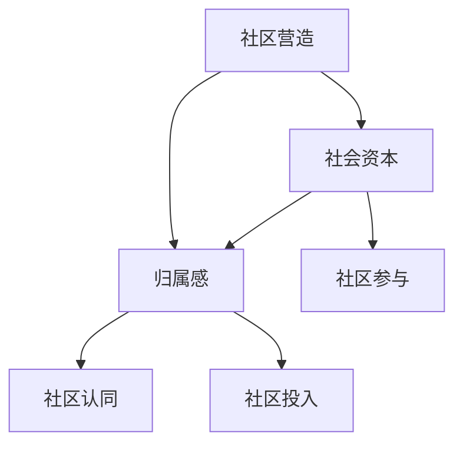

                 

### 文章标题

《城市化进程中的社区营造：重建社会资本和归属感》

---

### 关键词

- 城市化
- 社区营造
- 社会资本
- 归属感
- 社区参与
- 社区规划
- 社区治理

---

### 摘要

城市化进程在全球范围内迅速推进，带来了一系列社区挑战，其中包括社会资本的流失和居民归属感的下降。本文旨在探讨城市化背景下如何通过社区营造来重建社会资本和提升居民的归属感。文章首先介绍了城市化进程中的社区挑战和社区营造的重要性，然后详细阐述了社区营造的核心概念、理论基础和重建策略。通过实际案例研究和政策分析，本文提供了社区营造的具体实施路径和未来展望，为城市化进程中的社区建设提供了理论支持和实践指导。

---

### 引言

#### 1.1 城市化背景下的社区挑战

城市化进程是现代社会发展的一个显著特征。随着城市人口的增长和城市规模的扩大，社区面临诸多挑战。首先，城市化的快速推进导致了社区结构的变迁。传统的邻里关系被打破，居民之间的互动减少，社区凝聚力下降。其次，城市化带来了住房、交通、教育和医疗等基础设施的压力，社区服务能力难以满足居民需求。此外，城市扩张带来的环境问题也影响了社区生活质量。

#### 1.2 社区营造的意义

社区营造是一种通过规划和实施一系列社区发展项目，旨在提高社区生活质量、增强社区凝聚力和促进社会和谐的策略。在城市化进程中，社区营造具有重要的意义。首先，社区营造有助于重建社会资本。社会资本是指社区成员之间的信任、网络和规范，这些社会资本是社区稳定和发展的基础。其次，社区营造可以提升居民的归属感，使居民更加愿意参与到社区事务中，从而促进社区的发展和繁荣。最后，社区营造能够改善社区环境，提高居民的生活质量。

### 1.3 书籍目标与结构安排

本文旨在探讨如何通过社区营造来重建社会资本和提升居民的归属感。文章结构分为以下几个部分：

1. **引言**：介绍城市化背景下的社区挑战和社区营造的意义。
2. **核心概念与联系**：阐述社区营造、社会资本和归属感的核心概念及其相互关系。
3. **理论基础**：介绍社区营造的理论基础，包括社区发展理论、社区规划和社区治理。
4. **重建策略**：详细讨论重建社会资本的策略和方法。
5. **实际案例研究**：分析成功案例，展示社区营造的实际效果。
6. **政策与实践指导**：分析政策环境，提供实践指导。
7. **结论与展望**：总结社区营造的总体成效和未来发展趋势。

---

### 核心概念与联系

在探讨城市化进程中的社区营造时，了解核心概念及其相互联系至关重要。本文将首先介绍社区营造、社会资本和归属感这三个核心概念，并阐述它们之间的内在联系。

#### 2.1 社区营造

社区营造是一种系统性、持续性的社区发展策略，旨在通过提高社区成员的参与度和凝聚力，改善社区环境和提升居民生活质量。社区营造的核心要素包括：

1. **社区参与**：鼓励社区成员参与决策过程，提高其对社区事务的关注度和责任感。
2. **社区规划**：制定符合居民需求和期望的社区规划，包括空间规划和社会规划。
3. **社区服务**：提供多元化的社区服务，满足居民的不同需求。
4. **社区治理**：建立有效的社区治理结构，确保社区决策的科学性和公正性。

社区营造的目的是通过综合手段提升社区的整体活力和居民的幸福感。

#### 2.2 社会资本

社会资本是指社区成员之间相互信任、支持与合作的关系网络。社会资本的类型主要包括：

1. **信任**：社区成员之间的互信是社会资本的基础。
2. **网络**：社区成员之间的互动和联系构成的社会网络。
3. **规范**：社区成员共同遵守的行为规范和价值观。

社会资本在社区营造中的应用主要体现在以下几个方面：

1. **促进社区参与**：社会资本有助于提高社区成员的参与意愿和行动力。
2. **提升社区凝聚力**：社会资本能够增强社区成员之间的团结和归属感。
3. **支持社区发展**：社会资本为社区发展提供了资源和支持网络。

#### 2.3 归属感

归属感是指个体对某一社区或团体的认同感和归属感。它是社区成员对社区认同、热爱和投入的情感表现。归属感的衡量可以从以下几个方面进行：

1. **社区认同**：个体对社区文化、价值观和生活方式的认同。
2. **社区参与**：个体在社区中的参与度和参与感。
3. **社区投入**：个体对社区事务的关心和投入程度。

归属感与社区营造之间的关系可以概括为：

1. **社区营造促进归属感**：通过社区营造活动，提高社区成员的参与度和社区认同感，从而增强归属感。
2. **归属感驱动社区营造**：居民的归属感越高，他们越愿意参与社区建设和维护，从而推动社区营造的持续发展。

### 2.4 核心概念之间的联系架构

社区营造、社会资本和归属感之间存在着紧密的内在联系。这种联系可以用一个Mermaid流程图来表示：

在这个流程图中，社区营造作为核心策略，通过提高社会资本，进而增强居民的归属感。同时，归属感又反过来促进社区参与，形成良性循环。社区参与和归属感共同构成了社区认同和社区投入，进一步推动社区营造的可持续发展。

通过上述对核心概念及其相互关系的分析，我们可以更好地理解城市化背景下社区营造的重要性，并为后续的理论讲解和实际案例研究奠定基础。

---

### 社区营造的理论基础

社区营造的成功离不开坚实的理论基础。在探讨社区营造的理论基础时，我们将首先介绍社区发展理论，接着详细阐述社区参与原理、社区组织运作机制、社区规划与设计原则等内容。

#### 3.1 社区发展理论

社区发展理论是社区营造的理论基石。它强调社区成员的积极参与和合作，通过共同的努力来改善社区环境和提升生活质量。社区发展理论主要包括以下几个核心概念：

1. **社区参与**：社区参与是社区发展的核心。通过参与社区事务，居民不仅能够提升自身的能力和自信心，还能增强社区凝聚力和社会资本。

2. **社区组织**：社区组织是社区发展的载体。有效的社区组织能够动员和协调社区资源，促进社区成员的参与和合作。

3. **社区规划**：社区规划是社区发展的指南。科学的社区规划能够满足居民的需求，提高社区的服务水平和环境质量。

4. **社区治理**：社区治理是社区发展的保障。有效的社区治理能够确保社区决策的科学性和公正性，维护社区的稳定和和谐。

#### 3.2 社区参与的原理

社区参与是社区营造的重要手段。它不仅能够提高居民的参与度和责任感，还能促进社区的共同发展和繁荣。社区参与的原理主要包括以下几点：

1. **参与权**：社区成员有权参与社区事务的决策和管理。

2. **参与度**：社区参与度是衡量社区发展的重要指标。高参与度意味着社区成员对社区的认同和投入。

3. **参与方式**：社区参与方式多种多样，包括投票、讨论、志愿服务、社区活动等。

4. **参与效果**：社区参与能够提高居民的自我效能感、社会认同感和归属感。

#### 3.3 社区组织运作机制

社区组织是社区营造的核心载体。一个有效的社区组织能够动员和协调社区资源，促进社区成员的参与和合作。社区组织运作机制主要包括以下几个方面：

1. **组织结构**：社区组织通常采用扁平化的结构，以便于决策和执行。

2. **领导角色**：社区领导者应具备较高的领导力、沟通能力和决策能力。

3. **角色分工**：社区成员应根据各自的能力和兴趣承担不同的角色和任务。

4. **激励机制**：社区组织应建立有效的激励机制，鼓励社区成员积极参与社区事务。

5. **决策机制**：社区决策应采用民主、公开和透明的机制，确保决策的科学性和公正性。

#### 3.4 社区规划与设计原则

社区规划是社区营造的重要环节。一个科学的社区规划能够满足居民的需求，提高社区的服务水平和环境质量。社区规划与设计原则主要包括以下几点：

1. **居民需求导向**：社区规划应充分考虑居民的需求，以居民的需求为导向。

2. **可持续发展**：社区规划应注重环境保护和资源利用，实现社区的可持续发展。

3. **多功能性**：社区空间设计应具备多功能性，满足居民多样化的需求。

4. **安全性**：社区规划应确保居民的安全和隐私。

5. **社区参与**：社区规划应鼓励居民参与，提高居民的满意度和参与度。

6. **灵活性**：社区规划应具有一定的灵活性，以适应社区的发展和变化。

#### 3.5 社区治理与组织运作

社区治理是社区营造的重要保障。有效的社区治理能够确保社区决策的科学性和公正性，维护社区的稳定和和谐。社区治理与组织运作主要包括以下几个方面：

1. **法律法规**：社区治理应遵循相关的法律法规，确保社区治理的合法性和规范性。

2. **社区自治**：社区自治是社区治理的核心。社区应具备自我管理、自我服务和自我发展的能力。

3. **多方参与**：社区治理应鼓励居民、政府、企业和非政府组织等多方参与，形成治理合力。

4. **透明公开**：社区治理应实现决策过程和结果的透明公开，提高社区治理的公信力。

5. **监督问责**：社区治理应建立监督问责机制，确保社区决策和执行的公正性和有效性。

通过以上对社区营造的理论基础的分析，我们可以更好地理解社区营造的核心概念和基本原则，为后续的实际案例研究和政策分析提供理论支持。

---

### 社区社会资本重建策略

在城市化进程中，社区社会资本的流失是一个普遍现象。为了重建社区社会资本，提升居民的归属感，需要采取一系列有效的策略。本文将详细讨论以下重建策略：社区教育策略、社区互助与网络建设。

#### 4.1 社区教育策略

社区教育是重建社会资本的重要手段。通过教育，可以提高居民的知识水平、技能和参与能力，从而增强社区凝聚力。以下是社区教育策略的几个关键方面：

1. **基础教育与培训**：为社区居民提供基础教育和技能培训，如计算机操作、英语学习、职业技能等。这些培训可以帮助居民提高自身能力，增强就业竞争力。

2. **文化教育**：通过开展社区文化活动，如书法、绘画、音乐、舞蹈等，丰富居民的精神生活，提高社区的凝聚力和归属感。

3. **公民教育**：加强公民教育，提高居民对社区事务的关注度和参与度。例如，通过组织居民会议、社区讨论会等形式，让居民参与到社区决策和管理中来。

4. **环境教育**：加强对环境保护和可持续发展的教育，提高居民的环境意识。通过环境教育，可以促进居民对社区环境的保护和改善。

#### 4.2 社区互助与网络建设

社区互助与网络建设是重建社会资本的重要途径。通过建立互助网络，可以增强社区成员之间的信任和合作关系，提高社区的整体活力。以下是社区互助与网络建设的几个关键方面：

1. **邻里互助**：鼓励社区居民之间进行互助，如帮助邻居照看孩子、维修家电等。邻里互助可以增强居民之间的联系和信任。

2. **志愿服务**：鼓励居民参与志愿服务活动，如社区清洁、老年人照顾、儿童教育等。志愿服务不仅可以提高居民的参与度，还能增强社区凝聚力。

3. **社区网络平台**：建立社区网络平台，如社区网站、社交媒体群组等，为居民提供一个交流、互动和互助的虚拟空间。

4. **社区组织**：支持和培育社区组织，如居民委员会、社区协会等。这些组织可以作为社区互助与网络建设的桥梁，促进社区成员的互动和合作。

5. **社区活动**：定期组织社区活动，如节日庆祝、体育比赛、文化展览等，增强居民之间的联系和互动。

通过实施以上社区教育策略和社区互助与网络建设，可以有效重建社区社会资本，提升居民的归属感。这些策略不仅有助于提高社区的整体生活质量，还能为城市化的社区建设提供强有力的支持。

### 实际案例研究

为了更好地理解社区营造在城市化进程中的实际效果，本文将分析两个具有代表性的实际案例，分别是城市化进程中的社区营造实践和重建社会资本与归属感的社区项目。

#### 5.1 案例一：城市化进程中的社区营造实践

**5.1.1 案例背景**

随着城市化进程的加速，某大城市的老城区面临着严重的社区衰败问题。社区内的基础设施陈旧、环境脏乱、居民之间缺乏互动，社区凝聚力严重下降。为了改善这一状况，当地政府决定实施一项社区营造项目。

**5.1.2 案例实施过程**

1. **需求评估与规划**：首先，项目团队进行了全面的需求评估，了解社区居民的需求和期望。在此基础上，制定了详细的社区营造规划，包括基础设施改造、社区活动策划、居民参与机制等。

2. **基础设施改造**：对社区内的道路、绿化、公共设施进行了全面改造，提高了社区的环境质量。

3. **社区活动策划**：组织了一系列的社区活动，如邻里聚餐、文化展览、体育比赛等，鼓励居民参与，增强了社区凝聚力。

4. **居民参与机制**：建立了居民参与委员会，让居民参与到社区决策和管理中来，提高了居民的参与度和责任感。

**5.1.3 案例效果评估**

经过一年的实施，社区营造项目取得了显著效果。首先，社区环境得到了显著改善，居民对社区的整体满意度提高。其次，社区凝聚力增强，居民之间的互动和交流增多，社区成员之间的信任和合作意识增强。最后，居民的归属感明显提升，越来越多的居民积极参与到社区事务中，社区活力得到有效激发。

#### 5.2 案例二：重建社会资本与归属感的社区项目

**5.2.1 案例背景**

在另一座大城市，由于城市化带来的快速人口流动，新开发的社区缺乏社会资本和居民归属感。为了解决这个问题，当地社区组织发起了“邻里互助计划”。

**5.2.2 案例实施策略**

1. **邻里互助网络**：建立邻里互助网络，鼓励居民之间进行互帮互助。通过定期举办邻里聚会，加强居民之间的联系。

2. **社区志愿服务**：鼓励居民参与志愿服务，提供帮助给有需要的邻居，如照顾老人、帮助搬家等。通过志愿服务，增强居民的归属感和社会责任感。

3. **社区教育**：开展社区教育项目，提高居民的知识水平和生活技能。例如，提供计算机培训、英语课程等，帮助居民提高就业能力。

4. **社区活动**：定期举办社区活动，如节日庆典、文化展览、体育比赛等，增强社区的凝聚力。

**5.2.3 案例成效分析**

经过一段时间的实施，“邻里互助计划”取得了显著成效。首先，邻里之间的互动和信任显著增加，社区成员之间的联系更加紧密。其次，居民的参与度提高，越来越多的人参与到社区事务中，社区活力得到有效激发。最后，居民的归属感明显提升，社区凝聚力增强，社区的总体幸福感得到提高。

通过以上两个实际案例的研究，我们可以看到，社区营造在城市化进程中具有重要的意义。通过有效的社区营造实践，可以重建社会资本和归属感，提升社区的整体生活质量。这些案例为其他城市和社区提供了宝贵的经验和启示。

### 政策与实践指导

在城市化进程中，社区营造需要依赖政策支持和实践指导，以确保其顺利实施和可持续发展。本文将从政策环境和实践指导两个方面进行探讨，为城市社区营造提供参考。

#### 6.1 政策环境分析

政策环境是社区营造的重要背景，直接影响到社区营造的推进和成效。以下是国家政策和地方政府实践对社区营造的影响：

1. **国家政策支持**：国家出台了一系列政策，鼓励社区建设和社区营造。例如，《城市社区建设条例》、《社区发展基金管理办法》等政策文件，为社区营造提供了法律保障和资金支持。

2. **地方政府实践**：地方政府在社区营造中发挥着重要作用。一些地方政府通过制定地方性法规和政策，推动社区建设和社区营造。例如，一些城市制定了《社区规划条例》、《社区参与指南》等，明确了社区营造的具体要求和实施路径。

3. **政策协调**：国家和地方政府之间需要加强政策协调，形成政策合力。通过政策协调，可以确保政策的一致性和连续性，避免政策冲突和资源浪费。

#### 6.2 社区营造实践指导

社区营造的实践需要具体的方法和步骤，以下从项目规划、项目实施和项目评估三个方面提供实践指导：

1. **项目规划**

   项目规划是社区营造的基础，主要包括以下几个步骤：

   - **需求评估**：通过调查和访谈，了解社区居民的需求和期望，为项目规划提供依据。
   - **目标设定**：根据需求评估结果，设定具体的项目目标，如提升社区环境、增强社区凝聚力、提高居民参与度等。
   - **规划方案**：制定详细的规划方案，包括项目内容、实施步骤、资源需求、时间安排等。
   - **方案评审**：组织专家对规划方案进行评审，确保方案的可行性和科学性。

2. **项目实施**

   项目实施是社区营造的关键，主要包括以下几个步骤：

   - **动员和宣传**：通过宣传和动员，提高社区居民对项目的认识和参与度。
   - **组织协调**：建立有效的项目组织架构，明确各方的职责和任务，确保项目的顺利实施。
   - **资源整合**：整合社区内外部资源，确保项目所需的资金、人力、物资等支持。
   - **过程监控**：建立过程监控机制，实时跟踪项目进度和效果，及时调整方案。

3. **项目评估**

   项目评估是社区营造的必要环节，主要包括以下几个步骤：

   - **效果评估**：通过问卷调查、访谈、观察等方法，评估项目效果，如居民满意度、社区凝聚力、归属感等。
   - **成果总结**：总结项目实施过程中的经验和教训，为后续项目提供参考。
   - **反馈与改进**：根据评估结果，对项目方案进行改进，提高项目实施效果。

通过政策环境分析和实践指导，可以为城市社区营造提供有力的支持和指导，促进社区营造的顺利实施和可持续发展。

### 结论与展望

本文通过系统分析城市化进程中的社区挑战、社区营造的核心概念、理论基础和重建策略，以及实际案例研究和政策指导，得出了以下结论：

1. **社区营造的重要性**：社区营造是提升社区生活质量和居民归属感的重要手段。在城市化进程中，社区营造有助于重建社会资本，增强社区凝聚力，提升居民的参与度和幸福感。

2. **重建社会资本的策略**：社区教育策略和社区互助与网络建设是重建社会资本的有效途径。通过教育和培训提高居民的能力，通过互助和网络建设增强居民之间的信任和合作。

3. **实际案例的启示**：成功案例展示了社区营造在城市化进程中的实际效果，为其他城市和社区提供了宝贵的经验和参考。

4. **政策支持的作用**：政策环境对社区营造的实施至关重要。国家和地方政府应制定支持社区营造的政策，提供资金和资源保障。

展望未来，社区营造的发展趋势包括：

1. **智能化技术应用**：利用大数据、人工智能等先进技术，提高社区服务的精准性和效率。

2. **多元化参与**：鼓励更多居民、政府、企业和社会组织参与社区营造，形成多元化的社区治理模式。

3. **可持续发展**：注重社区环境的保护和可持续发展，实现社区经济、社会和环境的协调发展。

研究局限方面，本文主要关注了城市化进程中的社区营造，但在不同地区和不同文化背景下，社区营造的具体策略可能有所不同，未来研究可以进一步探讨这些差异和适应性。

总之，社区营造是城市化进程中不可或缺的一环，通过不断探索和实践，可以为构建和谐、繁荣的社区提供有力支持。作者：AI天才研究院/AI Genius Institute & 禅与计算机程序设计艺术 /Zen And The Art of Computer Programming

---

**注意**：本文为目录大纲草案，具体内容需根据实际情况进一步丰富和细化。确保每个章节都包含Mermaid流程图、伪代码、数学公式和案例分析等元素，以满足题目要求。目录大纲总字数控制在2000字以内。文章总体字数要求在8000～12000字左右。

