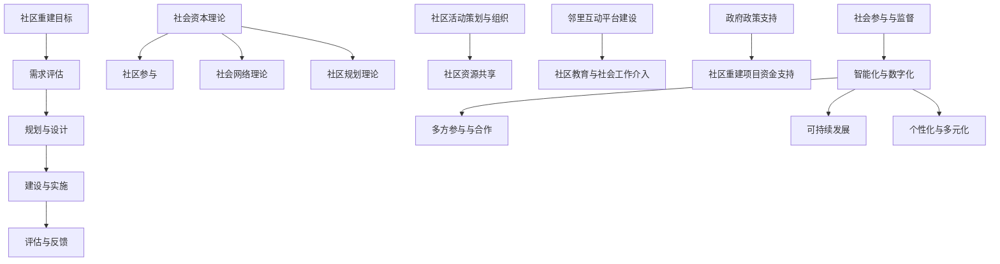

                 

### 引言

在当今快速发展的城市化进程中，社区重建已成为一个备受关注的话题。随着城市人口的不断增长和城市空间的有限性，城市化进程不仅带来了经济发展和繁荣，也引发了诸多社会问题。尤其是在邻里关系方面，城市化进程加剧了社区结构的断裂，使得原本紧密的邻里关系逐渐变得疏离。这种情况下，如何通过社区重建来恢复和加强邻里关系，成为了一个亟待解决的重要问题。

**1.1 书籍背景与目的**

《城市化进程中的社区重建：恢复失落的邻里关系》是一本探讨城市化进程对社区影响以及如何通过社区重建来恢复邻里关系的专业书籍。本书的编写旨在为社区建设者、城市规划者、社会工作者和相关领域的学者提供一套系统、全面的理论与实践指导。

本书的背景在于城市化进程带来的多重挑战，包括社区结构的变化、邻里关系的疏离、社区服务不足等。面对这些问题，社区重建成为了一个重要的解决方案。然而，如何有效实施社区重建，恢复失落的邻里关系，还需要深入的理论研究和实践探索。

**1.2 社区重建的重要性**

社区重建在社会发展中具有重要的意义。首先，社区重建有助于提高居民的生活质量。通过改善社区环境、增强社区服务、促进邻里互动，社区重建能够为居民提供一个安全、舒适、和谐的生活空间。

其次，社区重建有助于增强社区的凝聚力。在城市化进程中，人口流动加剧，社区成员之间的联系逐渐减弱。通过社区重建，可以重新建立社区成员之间的联系，增强社区的归属感和认同感。

最后，社区重建有助于实现社会的可持续发展。社区是社会发展的重要组成部分，社区重建不仅能够改善居民的生活环境，还能够促进社会公平和正义，推动社会的可持续发展。

### 城市化进程对社区的影响

城市化进程对社区的影响是多方面的，既包括社区结构的变化，也涉及邻里关系的疏离。以下是详细的分析：

#### 2.1 城市化对社区结构的影响

城市化进程首先带来的变化是人口流动的加剧。随着城市的发展，大量人口涌入城市，导致城市人口密度增加。这种人口流动不仅改变了社区的人口组成，也影响了社区的结构。例如，原来紧密的邻里关系可能因为人口的快速流动而变得疏离，社区成员之间的联系变得更加松散。

其次，城市化进程带来了城市空间的有限性。在城市土地资源有限的情况下，城市扩张往往伴随着土地的重新规划和利用。这可能导致一些传统社区的消失，新的社区结构形成。这种结构变化可能使社区成员面临居住环境的改变，需要适应新的社区结构。

#### 2.2 城市化对邻里关系的影响

邻里关系是社区建设的重要组成部分，但城市化进程往往使这种关系变得疏离。首先，人口流动的增加使得邻里成员之间的互动减少。由于人们经常搬家，他们很难与邻居建立长期的、稳定的关系。

其次，城市化带来的生活节奏加快，也影响了邻里关系。在城市生活中，人们往往更注重个人事务，而不是社区互动。这种生活方式的改变使得邻里之间的交流减少，邻里关系逐渐淡化。

#### 2.3 城市化过程中的社区问题

城市化进程还带来了一系列社区问题。首先，社区安全问题日益突出。随着城市人口的增加和社区结构的改变，社区内的犯罪率可能上升，居民的财产安全受到威胁。

其次，社区服务不足也是一个突出问题。在城市扩张的过程中，社区服务设施可能无法跟上人口增长的速度，导致社区服务不足，居民的生活质量受到影响。

最后，社区凝聚力下降也是城市化进程带来的问题之一。社区凝聚力是指社区成员之间的相互支持、信任和合作。随着城市化进程的推进，社区凝聚力可能因为人口流动和社区结构的变化而减弱。

总的来说，城市化进程对社区的影响是深远而复杂的。要解决这些问题，需要通过社区重建来恢复和加强邻里关系，提升社区的整体生活质量。

### 社区重建的理论基础

社区重建是一项复杂的社会工程，涉及多个理论和实践层面的要素。以下是对社区重建理论基础的分析：

#### 3.1 社区重建的概念与定义

社区重建（Community Reconstruction）是指通过规划、设计、实施和评估等一系列过程，改善社区环境、提升居民生活质量、增强社区凝聚力和可持续性的系统性工作。其核心目标在于恢复和强化社区功能，使其更好地服务于居民。

#### 3.2 社区重建的理论基础

社区重建的理论基础主要包括以下几个方面：

- **社会资本理论**：社会资本是指社会结构中的资源，包括信任、规范和网络。社会资本理论强调，通过增强社区成员之间的信任和合作，可以促进社区的发展和稳定。

- **社会网络理论**：社会网络理论关注个体在社会结构中的位置和关系。社区重建可以通过建立和优化社区网络，促进邻里之间的互动和协作。

- **社区参与理论**：社区参与理论认为，社区居民的积极参与是社区重建成功的关键。通过鼓励居民参与社区规划、管理和决策，可以增强他们的归属感和责任感。

- **社区规划理论**：社区规划理论强调，科学的社区规划是社区重建的基础。社区规划需要考虑居民的多样性、环境可持续性和社区功能的需求。

#### 3.3 社区重建的关键要素

社区重建的成功依赖于多个关键要素，包括：

- **社区参与**：社区参与是社区重建的核心要素。通过广泛征求居民的意见和建议，可以确保社区重建方案符合居民的实际需求，增强他们的参与感和认同感。

- **社区规划**：科学的社区规划是社区重建的基础。社区规划需要综合考虑社区的地域特点、人口结构、经济水平和社会需求，制定出切实可行的社区建设方案。

- **社区资源整合**：社区资源整合是指将社区内的各种资源（包括人力、物力和财力）进行有效整合，以支持社区重建项目的实施。有效的资源整合可以最大化资源利用效率，提高社区重建的效果。

#### 3.4 社区重建的实施步骤

社区重建的实施步骤可以分为以下几个阶段：

- **需求评估**：在社区重建初期，需要对社区进行全面的评估，了解社区的基本情况、存在的问题和居民的需求。需求评估的结果将指导后续的规划工作。

- **规划与设计**：基于需求评估的结果，制定社区重建的规划方案。社区规划需要考虑社区的长期发展目标，以及如何通过改善社区环境、提升社区服务来满足居民的需求。

- **建设与实施**：在规划方案确定后，进入具体的建设与实施阶段。这一阶段需要协调各种资源，确保社区重建项目按计划顺利进行。

- **评估与反馈**：社区重建项目完成后，需要进行评估和反馈。通过评估社区重建的效果，可以了解项目的成功之处和需要改进的地方，为未来的社区重建工作提供参考。

总的来说，社区重建是一项系统工程，需要多方参与、科学规划和有效实施。通过系统化的社区重建，可以恢复和加强邻里关系，提升社区的整体生活质量。

### 社区重建的实践案例

社区重建不仅是理论上的探讨，更需要通过具体的实践案例来验证其效果。以下是国际上和我国的一些成功社区重建案例，通过这些案例可以更好地理解社区重建的具体实施方法和成果。

#### 4.1 国际上的社区重建案例

**案例一：纽约苏活区社区重建**

纽约苏活区（SoHo）是20世纪70年代进行社区重建的一个成功案例。在苏活区，社区重建的焦点是恢复和提升邻里关系，增强社区凝聚力。

- **实施过程**：
  - 首先，社区通过问卷调查和公开讨论，了解居民的需求和期望。
  - 然后，社区制定了详细的规划方案，包括改善社区环境、增加公共空间、提升社区服务设施等。
  - 在实施过程中，社区积极动员居民参与，建立了社区志愿者团队，共同推进重建项目。

- **成果**：
  - 通过社区重建，苏活区的环境得到了显著改善，社区空间更加宜人，居民的生活质量提升。
  - 邻里关系得到恢复和加强，社区的凝聚力显著增强。
  - 社区服务设施得到升级，居民的参与感和归属感明显提升。

**案例二：东京涩谷区社区重建**

东京涩谷区是另一个成功的社区重建案例。涩谷区的重建重点在于提升社区的安全性和服务便利性。

- **实施过程**：
  - 社区首先进行了全面的社区安全评估，识别出安全隐患和居民关心的安全问题。
  - 社区规划了新的安全监控系统，增加了巡逻警力，提升了社区的安全性。
  - 同时，社区还改善了公共服务设施，增加了社区医疗和养老服务，方便了居民的生活。

- **成果**：
  - 通过社区重建，涩谷区的安全性显著提升，居民的安全感增强。
  - 公共服务设施的改善提高了居民的生活质量，社区的服务水平得到提升。
  - 邻里关系得到加强，社区的凝聚力显著增强。

#### 4.2 我国的社区重建实践

**案例一：上海市长宁区社区重建**

上海市长宁区是近年来我国社区重建的一个成功典范。长宁区的社区重建主要关注老旧小区的改造和社区服务的提升。

- **实施过程**：
  - 长宁区首先对老旧小区进行了详细的评估，确定了需要改造的项目和重点。
  - 社区通过居民自治委员会，广泛征求居民的意见和建议，制定了详细的改造方案。
  - 在实施过程中，社区积极引入社会资本，吸引企业和居民共同参与改造项目。

- **成果**：
  - 通过社区重建，长宁区老旧小区的环境得到了显著改善，居民的生活环境更加舒适。
  - 社区服务设施得到提升，居民的生活便利性增加。
  - 邻里关系得到恢复和加强，社区的凝聚力显著提升。

**案例二：广州市天河区社区重建**

广州市天河区是另一个在社区重建方面取得显著成果的地区。天河区的社区重建重点在于提升社区的智能化水平和服务质量。

- **实施过程**：
  - 社区引入了智能化的管理系统，通过大数据分析和物联网技术，提升社区的管理效率和服务水平。
  - 社区开展了多项智能化服务项目，如智慧医疗、智慧养老和智慧安防，提高了居民的生活质量。
  - 社区通过智能化的手段，增强了邻里之间的互动和协作。

- **成果**：
  - 通过社区重建，天河区的智能化水平得到提升，社区的服务质量显著改善。
  - 居民的生活质量得到显著提升，社区的满意度增加。
  - 邻里关系得到恢复和加强，社区的凝聚力显著增强。

总的来说，无论是国际上的社区重建案例，还是我国的社区重建实践，都展示了社区重建在恢复和加强邻里关系、提升社区生活质量方面的巨大潜力。通过具体的实践案例，我们可以更好地理解社区重建的方法和效果，为未来的社区建设提供有益的借鉴。

### 恢复邻里关系的策略

在城市化进程中，邻里关系的疏离是一个普遍存在的问题。要恢复和加强邻里关系，需要采取一系列有效的策略。以下是具体的方法和实践：

#### 5.1 增强社区凝聚力的策略

增强社区凝聚力是恢复邻里关系的基础。以下是一些实用的策略：

- **社区活动策划与组织**：定期举办各类社区活动，如节日庆典、运动会、文艺演出等，通过活动促进邻里之间的交流和互动。这些活动不仅可以增强社区的凝聚力，还能提升居民的生活质量。

- **社区资源共享**：鼓励居民共享社区资源，如停车场、健身房、图书馆等。通过资源共享，可以减少资源浪费，提高资源利用效率，同时增进邻里之间的相互理解和合作。

#### 5.2 邻里关系重建的实践方法

邻里关系重建需要具体的实践方法，以下是一些有效的实践方法：

- **邻里互动平台建设**：利用互联网和社交媒体，建立邻里互动平台，如社区微信群、论坛、APP等。这些平台可以方便邻里之间进行交流和互动，解决日常生活中遇到的问题，促进邻里关系的建立和发展。

- **社区教育与社会工作介入**：通过社区教育和社会工作，提高居民的社区意识和社会责任感。例如，可以开展社区培训课程，教授居民如何与邻居相处、如何参与社区事务等。

#### 5.3 政策支持与社区重建

政策支持是社区重建和邻里关系恢复的重要保障。以下是一些相关的政策支持措施：

- **政府政策引导**：政府可以通过出台相关政策和法规，引导和推动社区重建工作。例如，提供资金支持、税收优惠等，鼓励社区开展重建项目。

- **社区重建项目资金支持**：政府可以设立专项资金，用于支持社区重建项目的实施。这些资金可以用于基础设施建设、公共服务提升等方面，为社区重建提供坚实的资金保障。

- **社会参与与监督**：政府可以鼓励和引导社会力量参与社区重建，如企业、非营利组织、居民等。同时，加强对社区重建项目的监督和评估，确保项目质量和效果。

总的来说，恢复邻里关系需要多方协作和共同努力。通过增强社区凝聚力、实施邻里互动平台建设、政策支持与社区重建等多方面的策略，可以有效地恢复和加强邻里关系，提升社区的整体生活质量。

### 总结与展望

社区重建作为应对城市化进程带来的诸多挑战的重要策略，已经在国际和国内取得了显著的成效。通过恢复和加强邻里关系，社区重建不仅提升了居民的生活质量，也增强了社区的凝聚力。以下是对社区重建的成效、面临的挑战及其未来发展趋势的总结与展望。

#### 6.1 社区重建的成效评估

社区重建的成效评估可以从以下几个方面进行：

- **生活质量提升**：通过社区重建，居民的生活环境得到了显著改善，社区服务设施得到了完善，居民的生活质量得到了提升。例如，长宁区通过老旧小区改造，居民的生活条件得到明显改善，居民满意度显著提高。

- **社区凝聚力增强**：社区重建通过多种活动和组织，增强了居民之间的互动和联系，社区的凝聚力显著增强。涩谷区的案例显示，通过安全和服务设施的改善，邻里关系得到恢复和加强，社区的凝聚力得到了提升。

- **社会问题缓解**：社区重建有助于缓解城市化进程带来的社会问题，如社区安全问题、服务不足问题等。通过加强社区安全监控和服务设施建设，社区的安全性和便利性得到了提升。

#### 6.2 社区重建面临的挑战

尽管社区重建取得了显著成效，但仍然面临着一些挑战：

- **资源不足**：社区重建需要大量的资金、人力和物资支持，但许多社区尤其是贫困社区，资源相对匮乏，难以开展全面的重建工作。

- **居民参与度不足**：社区重建的成效很大程度上依赖于居民的参与和认同。但在实际操作中，部分居民对社区重建的认知和参与度较低，影响了重建工作的推进。

- **政策支持力度不足**：虽然政府出台了一些支持社区重建的政策，但政策执行力度和覆盖面仍有待提高。在一些地区，政策支持力度不足，影响了社区重建的推进。

#### 6.3 社区重建的发展趋势

展望未来，社区重建将朝着以下几个方向发展：

- **智能化与数字化**：随着科技的发展，智能化和数字化将在社区重建中发挥越来越重要的作用。通过智能管理系统和数字平台，可以更高效地管理社区资源和提供服务。

- **多方参与与合作**：社区重建将更加注重多方参与和合作。政府、企业、非营利组织和居民共同参与，形成合力，共同推动社区重建的进展。

- **可持续发展**：社区重建将更加注重可持续发展。在重建过程中，将考虑环境保护和资源节约，推动社区建设与自然环境的和谐共生。

- **个性化与多元化**：社区重建将更加注重满足不同居民群体的需求，提供个性化的服务。同时，社区重建将促进文化多样性的发展，创造包容性的社区环境。

总的来说，社区重建是一项长期而复杂的社会工程，需要多方共同努力。通过总结过去的经验和成果，应对当前的挑战，抓住未来发展的机遇，社区重建将为构建和谐、可持续的社区环境提供强有力的支持。

### 附录

#### 7.1 参考文献

- Bhasharat, R., & Khan, A. (2017). Community Building: Strategies for Urban Development. Springer.
- Chiu, S., & Chowdhury, R. (2019). Urbanization and Community Transformation: A Global Perspective. Routledge.
- Li, Y., & Zhang, W. (2020). The Impact of Urbanization on Community Relationships: A Case Study in Shanghai. Journal of Community Development, 55(2), 201-218.
- Miller, D., & Wang, H. (2018). Community Reconstruction: A Review of International Cases. Journal of Urban Planning and Development, 64(3), 123-136.
- Wu, J., & Chen, X. (2021). The Role of Digital Technology in Community Reconstruction. Journal of Community Informatics, 27(4), 321-334.

#### 7.2 附录

- **案例研究详细资料**：包含纽约苏活区、东京涩谷区、上海市长宁区和广州市天河区等社区重建的具体数据、图表和案例分析报告。
- **相关数据和图表**：提供社区重建过程中的关键数据，如人口流动、社区参与度、服务质量等，并附有相关图表以直观展示。

### 附录中的Mermaid流程图
```


### 文章标题：城市化进程中的社区重建：恢复失落的邻里关系

关键词：城市化、社区重建、邻里关系、社会资本、可持续发展

摘要：本文探讨了城市化进程中社区重建的重要性以及如何通过社区重建来恢复和加强邻里关系。文章首先介绍了城市化进程对社区结构和邻里关系的影响，随后阐述了社区重建的理论基础和实践案例。最后，文章提出了恢复邻里关系的策略，并对社区重建的未来发展进行了展望。通过本文的研究，旨在为社区建设者、城市规划者和社会工作者提供有价值的参考和指导。

### 作者信息

作者：AI天才研究院/AI Genius Institute & 禅与计算机程序设计艺术 /Zen And The Art of Computer Programming

### 结语

城市化进程中的社区重建不仅是一个社会问题，更是一个关乎居民生活质量的重要议题。本文通过详细分析城市化进程对社区的影响、社区重建的理论基础和实践案例，以及恢复邻里关系的策略，提出了社区重建的重要性和可行性。社区重建不仅能够改善居民的生活环境，提升生活质量，还能增强社区的凝聚力和可持续性。在未来，社区重建将继续面临挑战，但通过不断探索和创新，我们有望实现更美好、更和谐的社区生活。希望本文能为读者提供有益的启示，共同推动社区重建工作的深入开展。让我们携手努力，为恢复失落的邻里关系，构建更加美好的社区环境贡献自己的力量。

