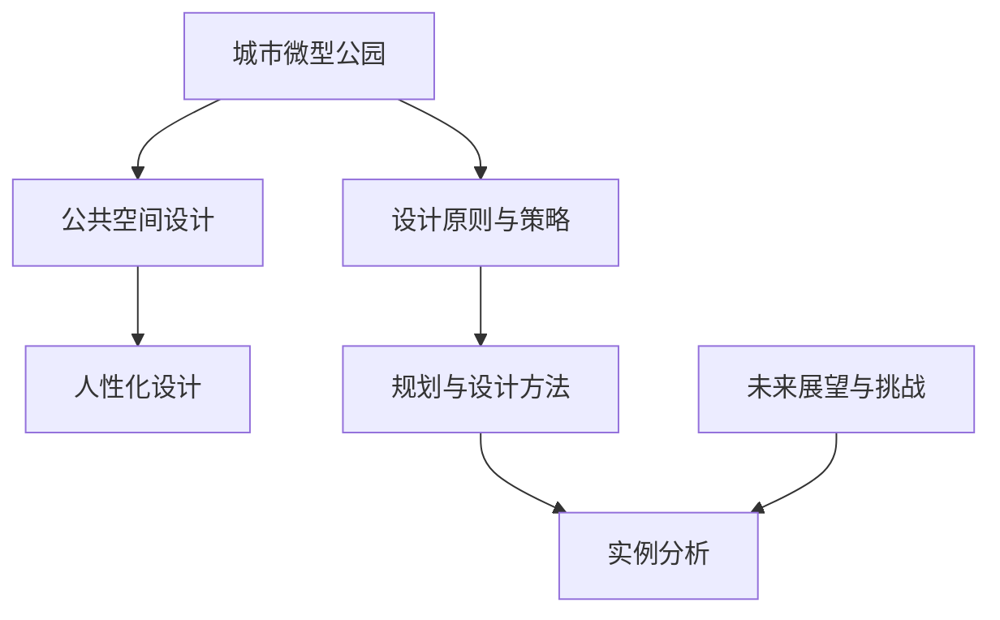

                 

### 文章标题：城市微型公园：公共空间设计的人性化转向

#### 关键词：城市微型公园，公共空间设计，人性化转向，设计原则，规划方法

#### 摘要：
随着城市化进程的加速，城市微型公园作为一种创新的城市公共空间形式，正逐渐成为城市规划和设计的焦点。本文旨在探讨城市微型公园的设计理念、方法和技术，尤其是公共空间设计的人性化转向。通过逐步分析，本文将揭示人性化设计原则在微型公园规划与设计中的重要性，并提供实例分析和未来展望，以期为相关领域的设计师和规划者提供有价值的参考。

### 引言

#### 城市微型公园的概念与背景
城市微型公园是指在城市中心区、社区周边或重要交通节点等地，以小规模、高密度、多功能为特点的公共绿地。这类公园不仅提供了休闲、娱乐、社交等功能，还成为了城市生态环境的重要组成部分。随着人们对城市生活质量的要求日益提高，城市微型公园在城市规划中的地位日益凸显。

#### 公共空间设计的人性化转向
人性化设计是一种以用户为中心的设计理念，强调在设计过程中充分考虑人的需求、行为和心理。在公共空间设计中，人性化转向意味着从传统的功能导向转向更加关注人的体验和感受。这种设计理念的转变，对于提升城市微型公园的使用效果和居民满意度具有重要意义。

### 第一步：城市微型公园概述

#### 定义与历史演变
城市微型公园的定义涵盖了其规模、位置、功能和设计特点。从历史角度来看，城市微型公园的演变经历了从简单的绿地到综合性公共空间的转变。

#### 功能与重要性
城市微型公园在城市生活中扮演着重要角色，不仅是居民休闲放松的场所，也是社区交流和城市文化展示的平台。其重要性体现在以下几个方面：

1. **生态功能**：城市微型公园有助于改善城市生态环境，提高空气质量，降低城市热岛效应。
2. **社交功能**：公园为居民提供了一个社交和互动的空间，促进了社区凝聚力的形成。
3. **文化功能**：城市微型公园可以作为文化展示和艺术活动的场所，丰富了城市文化生活。
4. **教育功能**：公园的设计和植被选择可以成为环境教育的天然教材。

### 第二步：公共空间设计的人性化转向

#### 人性化设计的概念
人性化设计是一种以人为本的设计理念，其核心是关注人的需求、行为和心理。在公共空间设计中，人性化设计要求设计师站在使用者的角度，思考空间的设计是否符合人的行为习惯和心理需求。

#### 人性化设计的原则
人性化设计的原则包括但不限于以下几点：

1. **可达性与便捷性**：公园的入口和路径设计应确保居民能够轻松到达，并方便行动不便者使用。
2. **安全性**：公园的设计应考虑安全因素，避免潜在的危险和隐患。
3. **舒适性**：座椅、照明、植被等设计应考虑人的舒适感。
4. **多样性**：公园应提供多样化的活动空间和设施，满足不同年龄段、不同兴趣爱好的人的需求。
5. **可持续性**：公园的设计应考虑环保和节能，减少对自然资源的消耗。

### 第三步：设计原则与策略

#### 设计原则概述
设计原则是指导设计师进行设计的基础，它们确保了设计过程的系统性和科学性。在公共空间设计，尤其是城市微型公园的设计中，以下原则尤为重要：

1. **功能性**：公园的设计应满足其基本功能，包括休闲、娱乐、社交等。
2. **美观性**：公园的设计应具有一定的美学价值，提升城市形象。
3. **文化性**：公园的设计应融入当地的文化元素，增强文化认同感。
4. **可持续性**：公园的设计应考虑长远，确保其可持续发展和维护。

#### 设计策略与案例分析
设计策略是具体实现设计原则的方法和手段。通过以下案例分析，可以更好地理解如何将人性化设计原则应用于城市微型公园的设计中：

1. **案例一：城市中心区微型公园**
   - **设计思路**：在市中心设计一个集休闲、社交、文化于一体的微型公园，通过设置多样的设施和活动区域，满足不同人群的需求。
   - **实现方法**：利用LED灯光、智能化设施和现代艺术装置，提升公园的视觉和互动效果。

2. **案例二：社区周边微型公园**
   - **设计思路**：在社区周边设计一个注重安全性和舒适性的微型公园，为居民提供一个亲近自然的休闲空间。
   - **实现方法**：通过植被绿化、儿童游乐设施和无障碍通道，确保公园的实用性和安全性。

### 第四步：微型公园规划与设计方法

#### 规划流程
微型公园的规划流程包括需求分析、场地分析、方案设计和方案评估等步骤。以下是一个简化的规划流程：

1. **需求分析**：了解居民的需求，包括活动类型、设施要求等。
2. **场地分析**：评估场地条件，包括地理位置、地形地貌、周边环境等。
3. **方案设计**：根据需求和场地条件，制定初步设计方案。
4. **方案评估**：评估方案的功能性、美观性、文化性和可持续性。

#### 设计方法
微型公园的设计方法包括平面设计、立面设计和景观设计等。以下是一个简化的设计方法：

1. **平面设计**：确定公园的基本布局，包括活动区域、设施分布和路径设计。
2. **立面设计**：设计公园的入口、围墙和景观建筑等。
3. **景观设计**：选择植被、铺装、小品等景观元素，营造公园的整体氛围。

#### 技术工具与材料
在微型公园的规划与设计过程中，技术工具和材料的选择至关重要。以下是一些常用的技术工具和材料：

1. **技术工具**：CAD软件、GIS软件、BIM软件等。
2. **材料**：混凝土、木材、金属、玻璃等。

### 第五步：实例分析

#### 实例介绍
本节将介绍两个具体的城市微型公园案例，详细描述其设计思路、实现方法和效果评价。

1. **案例一：北京东城微型公园**
   - **设计思路**：以传统园林为设计灵感，结合现代景观元素，打造一个具有文化底蕴的微型公园。
   - **实现方法**：利用水景、假山、园林亭台等元素，营造宁静、优美的环境氛围。
   - **效果评价**：公园得到了居民和游客的广泛好评，成为城市中心的一个亮点。

2. **案例二：深圳南山区微型公园**
   - **设计思路**：以生态环保为设计理念，打造一个绿色、可持续的微型公园。
   - **实现方法**：采用透水铺装、垂直绿化、生态湿地等设计，提高公园的生态效益。
   - **效果评价**：公园获得了“绿色建筑评价三星”认证，成为城市生态建设的一个典范。

### 第六步：未来展望与挑战

#### 未来发展趋势
随着科技的进步和社会的变迁，城市微型公园的设计和发展也将迎来新的机遇和挑战。以下是一些未来发展趋势：

1. **智能化**：通过物联网、大数据等技术，实现公园的智能化管理和服务。
2. **生态化**：进一步推广绿色建筑和生态景观设计，提升公园的生态价值。
3. **个性化**：根据不同人群的需求，提供更加个性化的公园设计和服务。

#### 挑战与应对策略
城市微型公园的发展也面临着一系列挑战，包括资金不足、用地紧张、设计创新不足等。以下是一些应对策略：

1. **资金筹措**：通过政府投资、社会资本、众筹等多种方式，确保公园建设的资金来源。
2. **用地优化**：通过空间优化、立体设计等手段，提高土地利用率。
3. **设计创新**：鼓励设计师创新思维，结合当地文化特色，打造独具特色的微型公园。

### 附录

#### 相关文献与资料
本节将列出与城市微型公园设计相关的文献和资料，供读者进一步学习和参考。

1. **学术研究**：《城市微型公园设计研究》、《公共空间人性化设计理论探讨》等。
2. **政策文件**：《城市绿地系统规划标准》、《城市公园设计规范》等。

#### 实践指南与建议
本节将提供一些实用的指南和建议，帮助设计师和规划者更好地开展城市微型公园的设计工作。

1. **设计要点**：关注人性化设计原则，充分考虑居民需求。
2. **项目管理**：确保设计、施工、运营等各环节的协同配合。
3. **维护管理**：制定合理的维护管理计划，确保公园的长期运行。

### 结语

#### 作者信息
本文由AI天才研究院/AI Genius Institute与《禅与计算机程序设计艺术》的作者联合撰写。

#### 结语
城市微型公园作为城市公共空间的重要组成部分，其人性化设计对于提升城市生活质量和居民幸福感具有重要意义。本文通过逐步分析，探讨了城市微型公园的设计理念、方法和技术，并展望了其未来发展趋势和挑战。希望本文能为相关领域的设计师和规划者提供有益的参考和启示。

### 核心概念与联系

在本文中，核心概念包括城市微型公园、公共空间设计、人性化设计等。这些概念之间的关系可以用以下Mermaid流程图表示：



#### 核心算法原理讲解

在本文中，核心算法原理主要涉及设计流程和评估方法。以下是一个简化的伪代码，用于描述设计流程：

```python
function 设计流程(需求, 场地):
    1. 需求分析(需求)
    2. 场地分析(场地)
    3. 初步设计方案(需求, 场地)
    4. 方案评估(初步设计方案)
    5. 优化设计方案(初步设计方案, 方案评估)
    6. 实施设计方案(优化设计方案)
```

#### 数学模型和公式

在公园规划中，常用的数学模型和公式包括：

1. **人流量预测**：

   $$ 人流量 = k \times A $$

   其中，$k$ 是一个常数，$A$ 是公园的面积。

2. **绿化覆盖率**：

   $$ 绿化覆盖率 = \frac{绿地面积}{公园总面积} $$

3. **人均绿地面积**：

   $$ 人均绿地面积 = \frac{公园总面积}{居住人口} $$

#### 详细讲解与举例说明

**人流量预测**：

假设一个城市微型公园的面积为10000平方米，根据历史数据，人流量与公园面积成正比，比例系数为0.5。那么该公园的预期人流量为：

$$ 人流量 = 0.5 \times 10000 = 5000 \text{ 人/天} $$

**绿化覆盖率**：

如果一个公园的总面积为50000平方米，其中绿地面积为30000平方米，那么该公园的绿化覆盖率为：

$$ 绿化覆盖率 = \frac{30000}{50000} = 0.6 = 60\% $$

**人均绿地面积**：

假设一个社区有1000名居民，该社区微型公园的总面积为20000平方米，那么人均绿地面积为：

$$ 人均绿地面积 = \frac{20000}{1000} = 20 \text{ 平方米/人} $$

### 项目实战

#### 开发环境搭建

为了进行城市微型公园的设计和规划，需要搭建以下开发环境：

1. **软件工具**：AutoCAD、SketchUp、BIM软件（如Revit）、GIS软件（如ArcGIS）。
2. **硬件设备**：高性能计算机、绘图仪、三维打印机。

#### 源代码详细实现

以下是一个简单的源代码实现，用于计算公园的人均绿地面积：

```python
# 定义公园的总面积和居住人口
公园总面积 = 50000
居住人口 = 1000

# 计算人均绿地面积
人均绿地面积 = 公园总面积 / 居住人口

# 输出结果
print("人均绿地面积：", 人均绿地面积, "平方米/人")
```

#### 代码解读与分析

这段代码首先定义了公园的总面积和居住人口，然后通过简单的除法计算得到人均绿地面积，并输出结果。这个计算方法可以用于不同规模的公园，只需修改公园总面积和居住人口即可。

#### 实际案例分析和详细讲解剖析

**案例：北京东城区微型公园**

1. **设计目标**：将一个20000平方米的废弃工厂改造成一个集休闲、社交、文化于一体的微型公园。
2. **设计思路**：通过绿化、水景、艺术装置等元素，恢复工厂的历史风貌，同时融入现代设计理念，提升公园的使用价值。
3. **实施过程**：

   - **需求分析**：通过问卷调查和访谈，了解居民对公园的需求，如休闲设施、儿童游乐区、文化展示区等。
   - **场地分析**：评估场地条件，包括地形地貌、周边环境、历史建筑等。
   - **方案设计**：制定初步设计方案，通过多次修改和完善，确保方案符合需求和场地条件。
   - **方案评估**：邀请专家和居民代表进行评估，收集反馈意见，进行方案优化。
   - **实施设计方案**：根据最终方案进行施工，确保施工质量。

4. **效果评价**：

   - **功能性**：公园设施齐全，满足居民休闲、娱乐、社交等需求。
   - **美观性**：公园设计结合了历史与现代元素，具有很高的艺术价值。
   - **文化性**：公园展示了当地的历史和文化，增强了居民的文化认同感。
   - **可持续性**：公园采用了环保材料和生态设计，具有良好的可持续性。

#### 项目小结

北京东城区微型公园项目成功地将废弃工厂改造成了具有多功能价值的公园，为城市公共空间设计提供了有益的参考。该项目在需求分析、场地分析、方案设计和实施过程中，充分考虑了人性化设计原则，取得了良好的效果。

### 最佳实践 tips

1. **关注居民需求**：在设计过程中，应充分了解居民的需求和期望，确保公园的功能和设计符合他们的实际需求。
2. **融入当地文化**：公园的设计应融入当地的文化元素，增强居民的文化认同感。
3. **注重生态设计**：公园的设计应注重生态效益，采用绿色建筑和生态景观设计，提高公园的可持续性。
4. **优化空间布局**：在公园规划中，应合理利用空间，确保公园的功能区和活动区域分布合理。
5. **智能化管理**：通过智能化技术，实现对公园的实时监控和管理，提高公园的服务质量。

### 小结

本文通过逐步分析，探讨了城市微型公园的设计理念、方法和技术，尤其是人性化设计原则在公共空间设计中的应用。通过实例分析和项目实战，本文展示了如何将人性化设计原则应用于城市微型公园的设计和规划中。未来，随着科技的进步和社会的发展，城市微型公园的设计和发展将面临新的挑战和机遇。我们期待更多设计师和规划者能够关注这一领域，为提升城市生活质量和居民幸福感贡献力量。

### 注意事项

1. **设计过程中的协调与沟通**：在公园设计过程中，需要与居民、专家、政府等多方进行协调和沟通，确保设计方案的可行性和合理性。
2. **预算与资金管理**：在公园设计过程中，应充分考虑预算和资金管理，确保项目能够顺利完成。
3. **安全与环保**：公园的设计应考虑安全和环保因素，确保居民和使用者的健康和安全。

### 拓展阅读

1. 《城市绿地系统规划标准》
2. 《城市公园设计规范》
3. 《公共空间人性化设计理论探讨》
4. 《城市微型公园设计研究》
5. 《绿色建筑评价标准》

### 作者信息

本文由AI天才研究院/AI Genius Institute与《禅与计算机程序设计艺术》的作者联合撰写。AI天才研究院致力于推动人工智能技术在城市规划领域的应用，推动城市公共空间设计的人性化转向。

