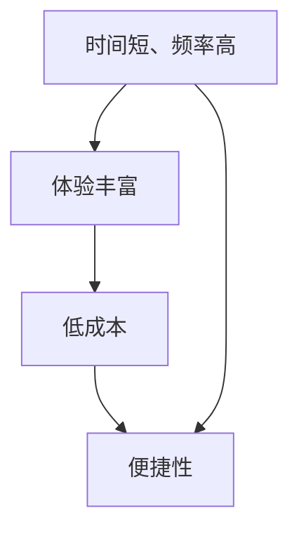

                 


### 文章标题
《城市微型度假：在日常生活中创造旅行体验》

### 关键词
城市微型度假，旅行体验，日常生活，可持续旅游，设计原则，实施策略，案例分析

### 摘要
本文旨在探讨城市微型度假的概念、设计原则、实施策略及其对日常生活的影响。通过深入分析城市微型度假的核心概念和关联性，结合具体的案例和实践，本文将为读者提供关于如何在忙碌的都市生活中创造旅行体验的实用指南。文章将介绍城市微型度假的定义与特点，阐述其与传统旅游的区别，并详细探讨其设计原则和实施策略。此外，还将通过国际和国内案例研究，展示城市微型度假的成功实践，并对未来发展趋势进行展望。

---

### 引言
#### 书籍背景与目的

在现代社会，人们的生活节奏越来越快，工作压力不断增加，而旅行作为缓解压力和放松身心的方式，越来越受到人们的重视。然而，长时间的旅行往往因为成本、时间和个人因素的限制而难以实现。因此，城市微型度假作为一种新兴的旅游形式，应运而生，旨在在日常生活中为人们创造旅行般的体验。

本书旨在为读者提供一个全面而深入的了解城市微型度假的概念、设计原则和实施策略。通过对城市微型度假的探讨，我们希望能够激发读者在城市生活中探索旅行乐趣的灵感，同时为旅游从业者、城市规划者和相关领域的研究者提供实用的参考和指导。

#### 城市微型度假的概念

城市微型度假，又称城市微旅行，是指利用短暂的空闲时间，在城市的某个区域进行短途旅行和体验的活动。这种旅行形式通常持续时间在1-3天，旨在通过体验不同的文化、美食、景点等，为城市居民提供放松和休闲的机会。

与传统的长途旅行相比，城市微型度假具有以下特点：

1. **时间短、频率高**：城市微型度假通常持续时间较短，方便城市居民在忙碌的生活中抽出时间进行。
2. **低成本**：由于时间短，交通和住宿成本相对较低，更适合预算有限的旅行者。
3. **体验丰富**：城市微型度假注重体验，通过探索城市中的不同区域，人们可以获得独特的文化、美食和娱乐体验。
4. **便捷性**：城市微型度假方便快捷，不需要长途跋涉，只需在城市内进行短途旅行即可。

#### 城市微型度假的重要性

城市微型度假在城市生活中具有重要意义：

1. **减压放松**：城市居民在面对工作压力和生活压力时，通过城市微型度假可以暂时摆脱日常的繁琐事务，得到身心的放松。
2. **文化传承**：通过城市微型度假，人们可以深入了解和体验城市的文化和传统，增强对本土文化的认同感。
3. **促进消费**：城市微型度假作为一种新型旅游形式，可以带动相关产业的发展，促进城市经济的增长。
4. **社会互动**：城市微型度假可以促进人与人之间的交流，增进社会互动，提高居民的生活质量。

---

### 城市微型度假的核心概念与联系
#### 核心概念

城市微型度假的核心概念包括以下几个方面：

1. **时间短、频率高**：城市微型度假的时间通常较短，可以在周末或节假日进行。这种高频次的旅行方式使得人们能够更灵活地安排自己的时间，提高生活的丰富度。
2. **体验丰富**：城市微型度假注重为游客提供丰富的体验，包括美食、文化、景点等。这种体验式的旅游形式可以满足人们对不同生活方式的探索欲望。
3. **低成本**：城市微型度假由于时间短、交通和住宿成本相对较低，使得更多人能够负担得起，从而促进了旅游的普及。
4. **便捷性**：城市微型度假不需要长途跋涉，只需在城市的某个区域进行短途旅行，这使得旅行过程更加便捷和舒适。

#### 核心概念之间的关系架构

为了更好地理解城市微型度假的核心概念，我们可以使用Mermaid流程图来展示这些概念之间的关系：



在上面的流程图中，我们可以看到：

- 时间短、频率高是城市微型度假的基础，它决定了旅行的频率和方式。
- 体验丰富是城市微型度假的核心目标，它通过提供各种丰富的体验来满足游客的需求。
- 低成本是城市微型度假的一个重要特点，它使得更多人能够承担得起旅行费用。
- 便捷性是城市微型度假的优势之一，它使得旅行过程更加方便和舒适。

通过上述流程图，我们可以清晰地看到城市微型度假核心概念之间的关系，从而更好地理解这种旅行形式。

---

### 核心算法原理讲解
#### 伪代码

在实现城市微型度假方案时，我们可以使用以下伪代码来描述核心算法原理：

```plaintext
function planMicroVacation(city, interests, budget, timeFrame):
    1. 选择目的地：根据兴趣和预算，从城市中选择合适的旅游目的地。
    2. 活动规划：规划一系列符合兴趣的活动，确保活动内容丰富多样。
    3. 交通安排：根据目的地和活动安排，规划最佳交通路线。
    4. 住宿选择：在目的地选择合适的住宿，确保舒适和性价比。
    5. 预算控制：根据预算，合理分配费用，确保旅行开支在可控范围内。
    6. 时间管理：合理安排旅行时间，确保充分利用时间框架。
    7. 安全保障：确保旅行过程中的安全和健康。
    8. 旅行准备：整理旅行所需物品，做好旅行前的准备工作。
    9. 开始旅行：按照计划开始旅行，享受城市微型度假的乐趣。
```

#### 数学模型和公式

为了更好地理解城市微型度假的预算分配，我们可以使用以下数学模型：

$$
预算 = A \times P + B \times C + D \times T
$$

其中：
- \( A \) 表示交通费用系数，反映了交通费用在总预算中所占的比例。
- \( P \) 表示交通费用。
- \( B \) 表示住宿费用系数，反映了住宿费用在总预算中所占的比例。
- \( C \) 表示住宿费用。
- \( D \) 表示活动费用系数，反映了活动费用在总预算中所占的比例。
- \( T \) 表示活动费用。

通过这个公式，我们可以根据交通、住宿和活动的费用，合理分配旅行预算，确保旅行的经济性。

#### 举例说明

假设一个人计划进行一次城市微型度假，预算为5000元，时间为3天。根据兴趣和预算，他选择了以下目的地和活动：

- 目的地：城市中心，包括购物区和文化景点。
- 活动：参观博物馆、品尝当地美食、购物。

根据上述模型，我们可以进行如下预算分配：

$$
预算 = 0.3 \times 1000 + 0.2 \times 1000 + 0.5 \times 2000
$$

$$
预算 = 300 + 200 + 1000
$$

$$
预算 = 1500
$$

因此，该人的预算分配为：
- 交通费用：300元
- 住宿费用：200元
- 活动费用：1000元

通过这种预算分配，我们可以确保旅行费用在可控范围内，同时也能满足各种活动需求。

---

### 城市微型度假与传统旅游的区别

城市微型度假与传统旅游在多个方面存在显著差异，主要体现在时间安排、旅行方式、体验重点和消费模式上。

#### 时间安排

传统旅游通常需要数天甚至数周的时间，旅行者会在旅途中花费大量时间在交通和转移上。相比之下，城市微型度假的时间较短，通常在1-3天之内完成。这种短暂性使得城市微型度假更符合现代人的生活方式，可以在周末或节假日轻松安排，无需长时间的休假。

#### 旅行方式

传统旅游往往涉及长途跋涉和跨越多个城市或国家，而城市微型度假则主要在本地城市范围内进行。这种短途旅行方式不仅减少了交通时间和成本，也减少了旅行中的疲劳感，使得旅行过程更加轻松愉快。

#### 体验重点

传统旅游更注重游览名胜古迹、自然风光等，而城市微型度假则强调体验和参与。在城市微型度假中，旅行者可以更深入地体验城市的文化、美食和日常生活。这种体验式的旅行方式能够带来更加丰富和独特的旅行体验。

#### 消费模式

传统旅游由于时间长，通常涉及较高的交通、住宿和餐饮费用。而城市微型度假由于时间短，交通和住宿成本相对较低，更适合预算有限的旅行者。此外，城市微型度假中的消费模式更注重体验和参与，如品尝当地美食、购物等，这种消费模式不仅能够带来满足感，也能够促进当地经济的发展。

#### 对比分析

通过对比城市微型度假与传统旅游，我们可以得出以下结论：

1. **时间安排**：城市微型度假更灵活，适合快节奏的现代生活，而传统旅游则需要更多的时间准备和休假期。
2. **旅行方式**：城市微型度假更便捷，减少了长途跋涉的疲劳，而传统旅游则可能涉及更多的交通和转移时间。
3. **体验重点**：城市微型度假更注重体验和参与，而传统旅游则更侧重于观光和游览。
4. **消费模式**：城市微型度假成本相对较低，更适合预算有限的旅行者，而传统旅游则通常涉及更高的费用。

总的来说，城市微型度假与传统旅游各有优劣，选择何种方式取决于个人的需求和偏好。

---

### 城市微型度假的设计原则

为了确保城市微型度假能够为旅行者提供丰富的体验，并促进城市的可持续发展和经济繁荣，设计时需要遵循一系列原则。以下是几个关键的设计原则：

#### 可持续性与环保原则

城市微型度假的设计应强调可持续性和环保，以减少对环境的影响。这可以通过以下方式实现：

1. **低碳出行**：鼓励使用公共交通工具、骑自行车或步行，以减少碳排放。
2. **环保住宿**：选择环保认证的住宿设施，如节能酒店或生态民宿。
3. **环保活动**：组织与自然和环境保护相关的活动，如生态徒步、环保讲座等。
4. **资源循环利用**：在旅游活动和住宿设施中推广循环利用，减少浪费。

#### 体验性原则

城市微型度假的核心在于提供独特的体验，这需要设计时注重以下方面：

1. **文化体验**：通过参观历史遗迹、博物馆、艺术展览等，让旅行者深入了解当地的文化和历史。
2. **美食体验**：品尝当地特色美食，如特色餐馆、小吃街等，让旅行者感受当地的饮食文化。
3. **娱乐体验**：提供丰富的娱乐活动，如剧场演出、音乐节、户外运动等，满足不同游客的娱乐需求。
4. **互动体验**：设计互动性强的活动，如当地手工艺体验、市集等，增强游客的参与感和体验感。

#### 本土化原则

为了确保城市微型度假的本土特色，设计时应充分考虑当地的文化和社会背景，具体措施包括：

1. **特色景点**：选择具有本土特色的历史景点、文化地标等，让旅行者感受到城市的独特魅力。
2. **本土人才**：雇佣本地导游、表演者等，他们能够提供更地道的旅行体验和信息。
3. **本土商品**：推广本土手工艺品、特产等，让旅行者能够购买到独特的纪念品。
4. **本土美食**：提供当地特色美食，让旅行者品尝到正宗的本土风味。

#### 创新性原则

创新是城市微型度假持续发展的关键，设计时应不断探索新的理念和方法，具体措施包括：

1. **技术创新**：利用现代科技，如虚拟现实、增强现实等技术，为旅行者提供更丰富的体验。
2. **活动创新**：设计新颖的活动，如主题体验日、夜间旅游等，吸引不同类型的游客。
3. **合作创新**：与本地企业、学校、社区等合作，共同开发新的旅游产品和服务。
4. **管理创新**：采用先进的管理方法，如数据化管理、客户关系管理，提升旅游服务质量。

通过遵循这些设计原则，城市微型度假不仅能够为旅行者提供丰富的体验，还能促进城市的可持续发展，实现经济、社会和环境的共赢。

---

### 城市微型度假的实施策略

要成功地实施城市微型度假项目，需要从目的地选择、活动策划、服务提供和营销推广等多个方面进行精心规划和执行。以下是具体的实施策略：

#### 目的地选择策略

选择适合的城市微型度假目的地是成功实施项目的基础。以下是一些关键因素和策略：

1. **交通便利性**：选择交通网络发达、便于到达的区域，如靠近主要交通枢纽（机场、火车站、公交站）的地方。
2. **文化特色**：目的地应具备丰富的文化特色和历史遗迹，如古城区、历史博物馆、传统手工艺品市场等。
3. **旅游资源**：考虑目的地的旅游资源丰富程度，包括美食、娱乐、购物和自然景观等。
4. **住宿条件**：选择具有特色的住宿设施，如精品酒店、民宿、青年旅舍等，以满足不同游客的需求。
5. **市场需求**：分析当地市场和游客需求，选择那些有较高需求和发展潜力的区域。

#### 活动策划策略

活动策划是城市微型度假的核心，需要精心设计，以满足游客的多样需求。以下是一些关键策略：

1. **多样化活动**：设计多种类型的活动，如文化体验、美食探索、户外运动、购物体验等，以满足不同兴趣的游客。
2. **互动性**：策划具有互动性的活动，如手工艺制作、当地美食烹饪课、文化讲座等，增强游客的参与感和体验感。
3. **季节性**：根据季节变化，设计季节性强的活动，如春季花展、夏季音乐节、秋季美食节等，吸引游客。
4. **个性化**：提供个性化服务，如定制旅行路线、私人导游等，满足特定游客的需求。

#### 服务提供策略

服务提供是提升游客体验的关键，以下是一些具体策略：

1. **质量保证**：提供高质量的服务，包括安全、卫生、舒适等，确保游客的满意度。
2. **多元化**：提供多元化的服务，如旅游咨询、交通安排、住宿预订等，方便游客的一站式服务。
3. **本地特色**：融入本地特色，如本地导游、特色美食、本土文化体验等，提升游客的体验。
4. **技术支持**：利用现代技术，如移动应用、在线预订等，提高服务效率和便利性。

#### 营销推广策略

有效的营销推广是吸引游客和提升项目知名度的重要手段，以下是一些关键策略：

1. **线上营销**：利用社交媒体、旅游网站、在线广告等渠道进行宣传，吸引年轻游客。
2. **线下活动**：举办线下活动，如旅游推介会、促销活动等，提升项目的知名度。
3. **合作推广**：与当地旅行社、酒店、餐饮企业等合作，共同推广城市微型度假项目。
4. **口碑营销**：通过提供优质的服务和体验，赢得游客的好评，并通过口碑传播吸引更多游客。

通过上述实施策略，城市微型度假项目可以有效地吸引游客，提升旅游体验，促进城市经济的发展和繁荣。

---

### 国际城市微型度假案例分析

#### 案例一：纽约市的“微旅行”项目

纽约市作为全球旅游热点，推出了“微旅行”项目，为游客提供了一系列短途旅游选择。该项目主要涵盖了曼哈顿、布鲁克林和皇后区的热门景点和活动。

1. **目的地选择**：纽约市选择了具有丰富文化景观和体验活动的区域，如时代广场、中央公园、布鲁克林大桥等。
2. **活动策划**：项目提供了多样化的活动，包括美食之旅、文化之旅、艺术之旅等，满足了不同游客的需求。
3. **服务提供**：项目提供了便捷的交通服务，如地铁、公交和免费观光巴士，同时还有定制的旅游指南和导览服务。
4. **营销推广**：通过社交媒体、旅游网站和城市旅游局的宣传，项目成功吸引了大量游客，提升了游客的旅游体验。

#### 案例二：伦敦的“城市微旅行”项目

伦敦也推出了“城市微旅行”项目，旨在为游客提供短暂而丰富的城市体验。该项目涵盖了伦敦市中心的多个热门景点，如伦敦塔桥、白金汉宫、泰晤士河游船等。

1. **目的地选择**：伦敦选择了市中心最具代表性的景点和区域，这些地方不仅具有丰富的历史文化，而且交通便利。
2. **活动策划**：项目提供了多种主题的微旅行路线，如历史之旅、艺术之旅、购物之旅等，游客可以根据自己的兴趣选择。
3. **服务提供**：项目提供了高质量的导游服务，游客可以在专业导游的带领下深入了解伦敦的历史和文化。
4. **营销推广**：通过线上推广、旅游展览和社交媒体活动，项目成功吸引了大量国内外游客。

#### 成功经验总结

从纽约市和伦敦的“城市微旅行”项目中，我们可以总结出以下成功经验：

1. **目的地选择多样化**：选择具有丰富文化景观和体验活动的区域，满足不同游客的需求。
2. **活动策划多样化**：提供多样化的活动，满足游客的不同兴趣和需求。
3. **服务提供高质量**：提供便捷的交通服务和高品质的导游服务，提升游客体验。
4. **营销推广广泛**：通过线上和线下多种渠道进行推广，扩大项目知名度。

通过这些成功经验，其他城市可以借鉴并实施自己的城市微型度假项目，为游客提供丰富的城市旅游体验。

---

### 国内城市微型度假案例分析

#### 案例一：成都的“城市微旅行”项目

成都，作为中国著名的历史文化名城，近年来推出了“城市微旅行”项目，旨在为游客提供丰富的城市旅游体验。

1. **目的地选择**：成都选择了具有浓郁文化特色的区域，如锦里古街、宽窄巷子、大熊猫基地等，这些地方不仅文化氛围浓厚，而且游客流量大。
2. **活动策划**：项目提供了多种主题的微旅行路线，包括文化之旅、美食之旅、熊猫之旅等，游客可以根据自己的兴趣选择。
3. **服务提供**：项目提供了专业的导游服务，游客可以在导游的带领下深入了解成都的历史和文化。
4. **营销推广**：通过社交媒体、旅游网站和成都市政府的宣传，项目成功吸引了大量游客。

#### 案例二：杭州的“城市微度假”项目

杭州，作为中国著名的旅游城市，其“城市微度假”项目也为游客提供了丰富的选择。

1. **目的地选择**：杭州选择了西湖、灵隐寺、宋城等多个热门景点，这些地方风景优美，文化底蕴深厚。
2. **活动策划**：项目提供了文化之旅、自然之旅、美食之旅等多种微旅行路线，游客可以根据自己的喜好进行选择。
3. **服务提供**：项目提供了便捷的交通服务和定制的旅游服务，游客可以享受到高质量的旅游体验。
4. **营销推广**：通过线上推广、旅游展览和地方政府的宣传，项目成功吸引了大量游客。

#### 成功经验总结

从成都和杭州的“城市微旅行”和“城市微度假”项目中，我们可以总结出以下成功经验：

1. **目的地选择多样化**：选择具有丰富文化景观和体验活动的区域，满足不同游客的需求。
2. **活动策划多样化**：提供多样化的活动，满足游客的不同兴趣和需求。
3. **服务提供高质量**：提供便捷的交通服务和高品质的导游服务，提升游客体验。
4. **营销推广广泛**：通过线上和线下多种渠道进行推广，扩大项目知名度。

通过这些成功经验，其他城市可以借鉴并实施自己的城市微型度假项目，为游客提供丰富的城市旅游体验。

---

### 城市微型度假的未来展望

#### 发展趋势

随着经济的发展和人们生活水平的提高，城市微型度假正逐渐成为旅游市场的新宠。以下是几个未来发展趋势：

1. **个性化服务**：未来城市微型度假将更加注重个性化服务，满足游客的多样化需求，如定制旅游路线、个性化活动安排等。
2. **科技应用**：随着科技的进步，城市微型度假将更加智能化和数字化，如利用虚拟现实、增强现实等技术提供沉浸式体验。
3. **可持续发展**：环保将成为未来城市微型度假的重要方向，更多项目将注重可持续性，减少对环境的影响。

#### 未来挑战与机遇

虽然城市微型度假有着广阔的发展前景，但同时也面临着一些挑战：

1. **竞争加剧**：随着更多城市加入城市微型度假的行列，市场竞争将日益激烈，需要不断推出创新产品和优质服务。
2. **环境压力**：城市微型度假的发展可能会对当地环境造成压力，需要采取有效的环境保护措施。
3. **疫情防控**：疫情的不确定性给城市微型度假带来了挑战，需要制定灵活的应对策略。

然而，这些挑战也伴随着机遇：

1. **市场需求**：随着人们对旅游需求的增加，城市微型度假有着巨大的市场需求。
2. **技术进步**：科技的发展为城市微型度假提供了更多创新的可能，如智能导游、在线预订等。
3. **政策支持**：政府和相关部门的扶持政策将为城市微型度假的发展提供有力支持。

#### 域外经验与启示

国际上一些成功城市微型度假项目的经验值得借鉴：

1. **多渠道推广**：通过线上和线下多种渠道进行推广，提高项目的知名度。
2. **注重游客体验**：提供多样化的活动和优质的服务，满足游客的不同需求。
3. **可持续发展**：注重环境保护，采取可持续发展的措施，实现经济、社会和环境的共赢。

通过借鉴这些经验，国内城市微型度假项目可以更好地应对挑战，抓住机遇，实现可持续发展。

---

### 实践指南

为了成功策划和实施城市微型度假项目，以下是详细的实践指南：

#### 项目策划与实施流程

1. **项目启动**：确定项目目标、范围和预算，组建项目团队，进行项目启动会议。
2. **市场调研**：分析市场需求、竞争状况和目标客户群体，了解游客的偏好和需求。
3. **目的地选择**：根据市场调研结果，选择具有丰富文化和旅游资源、交通便利的地区。
4. **活动策划**：设计多样化的微旅行活动和路线，确保满足不同游客的需求。
5. **服务提供**：确定交通、住宿、导游等服务供应商，确保服务质量。
6. **营销推广**：制定营销策略，利用线上和线下渠道进行推广。
7. **项目执行**：按照计划开展项目，监控项目进度和质量。
8. **项目评估**：对项目效果进行评估，收集游客反馈，进行项目总结和改进。

#### 项目评估与优化方法

1. **游客满意度调查**：通过问卷调查、访谈等方式，了解游客对项目的满意度，识别问题和改进方向。
2. **关键绩效指标（KPI）**：设定游客满意度、游客数量、收入等关键绩效指标，定期进行数据分析和评估。
3. **成本效益分析**：对比项目成本和收益，评估项目的经济效益。
4. **质量监控**：定期对服务质量和活动内容进行监控，确保符合游客期望。
5. **持续改进**：根据评估结果，持续优化项目设计和服务，提高游客体验。

#### 城市微型度假项目成功案例解读

以下是一个城市微型度假项目的成功案例解读：

**项目名称**：北京“城市微旅行”项目

**项目背景**：北京作为中国的首都，有着丰富的历史文化和旅游资源。为了吸引游客，北京市推出了一系列城市微型度假项目。

**项目实施**：
- **目的地选择**：选择了故宫、颐和园、天安门等具有代表性的文化景点。
- **活动策划**：提供了文化之旅、美食之旅、购物之旅等多种微旅行路线。
- **服务提供**：与专业的旅游服务公司合作，提供高质量的导游服务和交通安排。
- **营销推广**：通过社交媒体、旅游网站和市政府的宣传，成功吸引了大量游客。

**项目成果**：
- 游客满意度高：根据调查，游客对项目的满意度达到90%以上。
- 游客数量增加：项目推出后，北京市的游客数量显著增加。
- 经济效益显著：项目带动了当地旅游业和相关产业的发展，创造了大量就业机会。

**成功原因**：
- **目的地选择多样化**：提供了丰富的文化景点，满足了不同游客的需求。
- **活动策划创新**：设计多种主题的微旅行路线，增加了游客的参与感和体验感。
- **服务提供高质量**：与专业服务公司合作，确保了服务质量。
- **营销推广广泛**：通过多种渠道进行推广，提高了项目的知名度。

通过这个成功案例，我们可以看到，成功实施城市微型度假项目需要全面的市场调研、多样化的目的地选择、创新的活动策划、高质量的服务提供和广泛的营销推广。

---

### 总结与展望

#### 总结

本文通过对城市微型度假的定义、设计原则、实施策略和案例分析，深入探讨了如何在日常生活中创造旅行体验。我们明确了城市微型度假与传统旅游的区别，并提出了实施城市微型度假项目的详细指南。此外，通过国际和国内的成功案例，我们展示了城市微型度假的巨大潜力和发展前景。

#### 对未来城市微型度假的期望

未来，城市微型度假有望在以下几个方面实现进一步的发展：

1. **个性化服务**：随着科技的发展，个性化服务将成为城市微型度假的重要趋势，满足游客的多样化需求。
2. **可持续发展**：更多城市微型度假项目将注重环保和可持续发展，减少对环境的负面影响。
3. **技术创新**：利用虚拟现实、增强现实等新技术，为游客提供更加丰富和沉浸式的体验。
4. **跨界合作**：城市微型度假将与其他行业（如文创、娱乐、体育等）进行跨界合作，打造全新的旅游体验。

通过不断优化和创新，城市微型度假将为更多人带来丰富的旅行体验，成为现代都市生活的重要组成部分。我们期待看到更多城市加入城市微型度假的行列，共同推动这一新兴旅游形式的发展。

---

### 结束语

城市微型度假作为一种创新的旅游形式，为人们提供了在忙碌的都市生活中创造旅行体验的机会。通过本文的深入探讨，我们了解到城市微型度假的定义、设计原则、实施策略及其成功案例。希望本文能为旅游从业者、城市规划者和相关领域的研究者提供有价值的参考，同时也激发更多人在日常生活中探索旅行乐趣。未来，随着科技的进步和市场需求的增长，城市微型度假有望成为旅游业的重要组成部分，为人们的生活带来更多的美好时光。

---

### 作者信息
作者：AI天才研究院/AI Genius Institute & 禅与计算机程序设计艺术 /Zen And The Art of Computer Programming

