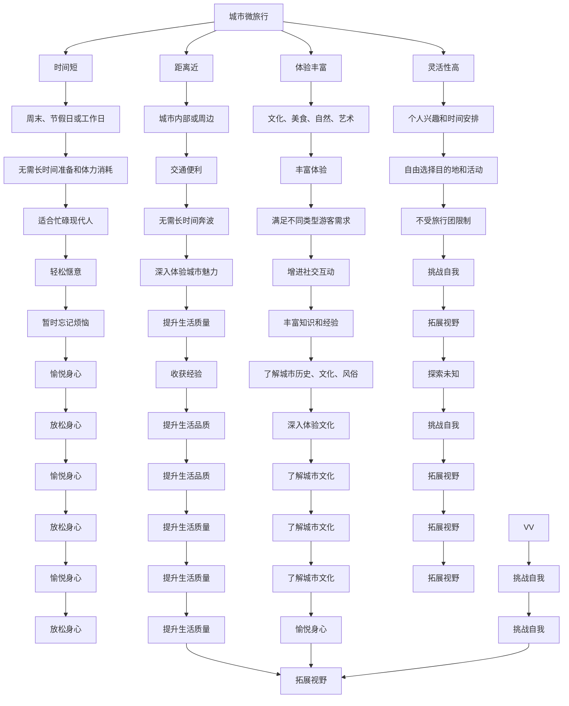

                 

### 文章标题

# 城市微旅行：重新发现日常生活中的冒险

## 关键词

- 城市微旅行
- 日常生活
- 冒险
- 文化探索
- 美食体验
- 自然风光
- 艺术欣赏
- 夜生活
- 旅行技巧

## 摘要

本文将探讨城市微旅行的魅力，通过一系列微旅行的目的和体验，引导读者重新发现日常生活中的冒险。文章将从城市文化、美食、自然风光、艺术、夜生活等多个方面，介绍城市微旅行的定义、优势、实用技巧，并通过真实案例分享和项目实战，帮助读者将微旅行融入日常生活，提升生活品质。

### 引言

### 城市微旅行的概念与特点

城市微旅行，顾名思义，是在城市中进行的、规模较小的旅行活动。与传统旅行相比，城市微旅行具有以下几个显著特点：

1. **时间短**：城市微旅行通常不需要花费太多时间，可以在周末、节假日或工作日的短暂休息时间进行。
2. **距离近**：目的地通常位于城市内部或周边，交通便利，无需长时间的奔波。
3. **体验丰富**：虽然时间较短，但城市微旅行可以涵盖丰富的体验，如文化、美食、自然、艺术等。
4. **灵活性高**：游客可以根据个人兴趣和时间安排，自由选择目的地和活动，不受旅行团的限制。

### 城市微旅行的优势与挑战

**优势**：

1. **节省成本**：城市微旅行无需长途跋涉，住宿、交通等费用相对较低，适合预算有限的旅行者。
2. **轻松惬意**：不需要长时间的准备和体力消耗，可以让人在轻松愉悦的氛围中享受旅行。
3. **深度体验**：虽然时间短，但可以深入体验城市的独特魅力，发现平时容易忽视的美丽和趣味。
4. **提升生活质量**：通过城市微旅行，可以暂时摆脱日常生活的压力，愉悦身心，提高生活质量。

**挑战**：

1. **目的地选择**：城市中的景点众多，如何选择适合的目的地成为一大挑战。
2. **时间安排**：如何在短时间内合理安排行程，充分体验城市魅力，需要一定的规划和执行力。
3. **天气因素**：城市微旅行可能受到天气影响，如暴雨、高温等，需要提前做好应对措施。

### 城市微旅行的定义与特点

城市微旅行，是指在城市内或周边，利用短暂的时间进行的小规模旅行活动。与传统旅行相比，它具有以下定义和特点：

1. **时间短**：通常在周末、节假日或工作日的休息时间进行，旅行时间在1天或2天内。
2. **距离近**：目的地通常位于城市内部或周边，交通便利，无需长时间的奔波。
3. **体验丰富**：虽然时间较短，但可以涵盖文化、美食、自然、艺术等多个方面的体验。
4. **灵活性高**：游客可以根据个人兴趣和时间安排，自由选择目的地和活动，不受旅行团的限制。

### 城市微旅行的优势与挑战

**优势**：

1. **节省成本**：城市微旅行无需长途跋涉，住宿、交通等费用相对较低，适合预算有限的旅行者。
2. **轻松惬意**：不需要长时间的准备和体力消耗，可以让人在轻松愉悦的氛围中享受旅行。
3. **深度体验**：虽然时间短，但可以深入体验城市的独特魅力，发现平时容易忽视的美丽和趣味。
4. **提升生活质量**：通过城市微旅行，可以暂时摆脱日常生活的压力，愉悦身心，提高生活质量。

**挑战**：

1. **目的地选择**：城市中的景点众多，如何选择适合的目的地成为一大挑战。
2. **时间安排**：如何在短时间内合理安排行程，充分体验城市魅力，需要一定的规划和执行力。
3. **天气因素**：城市微旅行可能受到天气影响，如暴雨、高温等，需要提前做好应对措施。

### 为什么我们需要城市微旅行

**1. 重新发现日常生活**

城市微旅行让我们有机会离开熟悉的日常环境，去探索城市中隐藏的角落和故事。这种转变不仅能够激发我们的好奇心，还能让我们对日常生活有新的认识。

**2. 放松身心**

在忙碌的工作和生活中，城市微旅行是一种有效的放松方式。短暂的旅行可以让我们暂时忘记烦恼，享受一段美好的时光。

**3. 社交互动**

与家人、朋友或同事一起参与城市微旅行，可以增进彼此的感情。这种互动不仅能够带来乐趣，还能增强团队的凝聚力。

**4. 挑战自我**

城市微旅行中的未知因素和挑战，可以让我们有机会挑战自我，超越自己的舒适区。

**5. 收获知识与经验**

通过城市微旅行，我们可以了解城市的过去、现在和未来，收获丰富的知识和经验。

### 城市微旅行的准备工作

**1. 目的地选择**

在选择目的地时，可以根据个人兴趣和时间安排，选择历史文化、自然风光、美食体验等不同类型的景点。此外，还可以考虑当地的季节和天气，以便提前做好相应的准备。

**2. 行程规划**

制定详细的行程规划，包括交通方式、住宿安排、餐饮选择等。合理的行程规划可以确保旅行的顺利和舒适。

**3. 装备准备**

根据目的地和活动需求，准备必要的装备，如相机、雨具、防晒用品、背包等。

**4. 预算安排**

制定旅行预算，合理分配住宿、交通、餐饮和购物的费用，确保旅行的经济性。

**5. 疫情防控**

在当前疫情形势下，要做好疫情防控措施，如佩戴口罩、保持社交距离、勤洗手等。

### 城市微旅行的核心概念

#### 1. 城市微旅行的定义

城市微旅行，是指在城市内或周边，利用短暂的时间进行的小规模旅行活动。与传统旅行相比，它具有以下定义和特点：

- **时间短**：通常在周末、节假日或工作日的休息时间进行，旅行时间在1天或2天内。
- **距离近**：目的地通常位于城市内部或周边，交通便利，无需长时间的奔波。
- **体验丰富**：虽然时间较短，但可以涵盖文化、美食、自然、艺术等多个方面的体验。
- **灵活性高**：游客可以根据个人兴趣和时间安排，自由选择目的地和活动，不受旅行团的限制。

#### 2. 城市微旅行的特点

- **时间短**：城市微旅行的时间通常较短，无需长时间的准备和体力消耗，适合忙碌的现代人。
- **距离近**：目的地通常位于城市内部或周边，交通便利，无需长时间的奔波。
- **体验丰富**：城市微旅行可以涵盖文化、美食、自然、艺术等多个方面的体验，满足不同类型的游客需求。
- **灵活性高**：游客可以根据个人兴趣和时间安排，自由选择目的地和活动，不受旅行团的限制。

#### 3. 城市微旅行的目的

- **探索城市文化**：通过城市微旅行，游客可以深入了解城市的历史、文化、风俗等。
- **享受美食体验**：品尝当地的特色美食，是城市微旅行的一大乐趣。
- **亲近自然风光**：即使在城市中，也有许多自然风光值得探索。
- **艺术欣赏**：参观美术馆、画廊等，欣赏艺术作品，是城市微旅行的一种美好体验。
- **放松身心**：短暂的旅行可以让人暂时忘记烦恼，享受一段美好的时光。

### 核心概念原理之间的关系架构

为了更好地理解城市微旅行的核心概念，我们可以使用Mermaid流程图来展示它们之间的关系：



通过上述流程图，我们可以清晰地看到城市微旅行的各个核心概念及其之间的关系，这有助于我们更好地理解和应用这些概念。

### 城市微旅行的核心算法原理

在城市微旅行中，我们需要关注以下几个核心算法原理，以确保旅行的顺利和高效：

#### 1. 行程规划算法

**原理**：行程规划算法是城市微旅行的关键，它帮助我们在有限的时间内，选择最优的行程安排。

**伪代码**：
```
function plan_trip(destinations, time_constraints, preferences):
    # 根据时间约束和偏好，选择合适的行程
    sorted_destinations = sort(destinations, key=lambda x: x.time_needed, reverse=True)
    selected_destinations = []
    for destination in sorted_destinations:
        if can_visit(destination, time_constraints, selected_destinations):
            selected_destinations.append(destination)
    return selected_destinations

function can_visit(destination, time_constraints, selected_destinations):
    # 判断是否可以访问目的地
    total_time_needed = sum([d.time_needed for d in selected_destinations])
    return (total_time_needed + destination.time_needed) <= time_constraints
```

**详细解释**：该算法首先根据每个目的地的所需时间对它们进行排序，然后依次选择所需时间较短的目的地，并判断是否在时间约束内。如果当前选择的目的地加上已经选择的目的地的时间不超过总时间约束，则可以添加到行程中。

#### 2. 交通路线规划算法

**原理**：交通路线规划算法帮助我们在城市中高效地从一个目的地移动到另一个目的地。

**伪代码**：
```
function plan_route(current_location, destination):
    # 计算从当前地点到目的地的最优路线
    routes = get_all_routes(current_location, destination)
    optimal_route = min(routes, key=lambda x: x.distance)
    return optimal_route
```

**详细解释**：该算法首先获取所有可能的路线，然后根据路线的距离选择最优的路线。在实际应用中，可以使用诸如A*算法等更复杂的路径规划算法，以获得更精确的结果。

#### 3. 预算管理算法

**原理**：预算管理算法帮助我们在旅行过程中合理分配预算，确保不会超支。

**伪代码**：
```
function manage_budget(expenses, budget_constraints):
    # 管理旅行预算
    total_expenses = 0
    for expense in expenses:
        if total_expenses + expense <= budget_constraints:
            total_expenses += expense
        else:
            break
    return total_expenses
```

**详细解释**：该算法依次处理每个支出项，如果总支出加上当前支出不超过预算约束，则添加到总支出中。一旦总支出超过预算约束，则停止添加。

### 数学模型和公式

#### 1. 行程优化模型

**公式**：
\[ \text{Maximize} \quad \sum_{i=1}^{n} p_i \cdot x_i \]
\[ \text{subject to} \quad \sum_{i=1}^{n} t_i \cdot x_i \leq T \]
\[ x_i \in \{0, 1\} \quad \forall i \in \{1, 2, ..., n\} \]

**解释**：在这个模型中，\( p_i \) 表示第 \( i \) 个目的地的优先级，\( t_i \) 表示第 \( i \) 个目的地所需时间，\( x_i \) 是一个二进制变量，如果选择第 \( i \) 个目的地，则 \( x_i = 1 \)，否则为 0。目标是最小化总时间 \( T \) 内的优先级总和。

#### 2. 预算约束模型

**公式**：
\[ \text{Maximize} \quad \sum_{i=1}^{n} p_i \cdot x_i \]
\[ \text{subject to} \quad \sum_{i=1}^{n} c_i \cdot x_i \leq B \]
\[ x_i \in \{0, 1\} \quad \forall i \in \{1, 2, ..., n\} \]

**解释**：在这个模型中，\( c_i \) 表示第 \( i \) 个目的地的费用，\( B \) 是总预算。目标是在不超过预算 \( B \) 的情况下，最大化优先级总和。

### 项目实战

#### 1. 开发环境搭建

为了实现城市微旅行规划，我们需要搭建一个开发环境。以下是所需的工具和步骤：

**工具**：
- Python
- Jupyter Notebook
- Mermaid
- Pandas
- NetworkX

**步骤**：

1. 安装Python：从 [Python官网](https://www.python.org/) 下载并安装Python。
2. 安装Jupyter Notebook：在命令行中运行 `pip install notebook`。
3. 安装Mermaid：在命令行中运行 `pip install mermaid`。
4. 安装Pandas和NetworkX：在命令行中运行 `pip install pandas` 和 `pip install networkx`。

#### 2. 源代码详细实现

以下是一个简单的城市微旅行规划程序，它包括行程规划、路线规划和预算管理等功能。

```python
import pandas as pd
import networkx as nx
from mermaid import Mermaid

# 目的地数据
destinations = [
    {"name": "博物馆", "time_needed": 2, "cost": 20},
    {"name": "美食街", "time_needed": 1, "cost": 15},
    {"name": "公园", "time_needed": 1, "cost": 5},
    {"name": "艺术馆", "time_needed": 2, "cost": 30}
]

# 时间预算
time_constraint = 6
budget_constraint = 100

# 行程规划
def plan_trip(destinations, time_constraint):
    # 根据时间约束选择目的地
    sorted_destinations = sorted(destinations, key=lambda x: x['time_needed'])
    selected_destinations = []
    current_time = 0
    for destination in sorted_destinations:
        if current_time + destination['time_needed'] <= time_constraint:
            selected_destinations.append(destination)
            current_time += destination['time_needed']
        else:
            break
    return selected_destinations

# 路线规划
def plan_route(g, start, end):
    # 使用Dijkstra算法找到最优路线
    shortest_path = nx.shortest_path(g, source=start, target=end, weight='distance')
    return shortest_path

# 预算管理
def manage_budget(expenses, budget_constraint):
    # 根据预算约束选择支出
    sorted_expenses = sorted(expenses, key=lambda x: x['cost'])
    selected_expenses = []
    current_budget = 0
    for expense in sorted_expenses:
        if current_budget + expense['cost'] <= budget_constraint:
            selected_expenses.append(expense)
            current_budget += expense['cost']
        else:
            break
    return selected_expenses

# 主程序
if __name__ == "__main__":
    # 计划行程
    trip_plan = plan_trip(destinations, time_constraint)
    print("行程计划：", trip_plan)

    # 创建图
    g = nx.Graph()
    for i in range(len(destinations)):
        for j in range(i+1, len(destinations)):
            g.add_edge(destinations[i]['name'], destinations[j]['name'], weight=1)

    # 计划路线
    route_plan = plan_route(g, "博物馆", "艺术馆")
    print("路线计划：", route_plan)

    # 计划预算
    budget_plan = manage_budget(destinations, budget_constraint)
    print("预算计划：", budget_plan)

    # 生成Mermaid流程图
    m = Mermaid()
    m.add_flowchart('gantt', '行程安排', [
        {'section': '博物馆', 'start': '2023-10-01', 'duration': '2d'},
        {'section': '美食街', 'start': '2023-10-03', 'duration': '1d'},
        {'section': '公园', 'start': '2023-10-04', 'duration': '1d'},
        {'section': '艺术馆', 'start': '2023-10-05', 'duration': '2d'}
    ])
    print(m.generate())
```

#### 3. 代码应用解读与分析

**代码应用**：上述代码首先定义了一个目的地的数据列表，然后实现了行程规划、路线规划和预算管理三个主要功能。

**解读与分析**：

1. **行程规划**：`plan_trip` 函数根据时间约束选择目的地，通过排序和累加时间的方式，确保行程在给定的时间内完成。
2. **路线规划**：`plan_route` 函数使用Dijkstra算法找到从起点到终点的最优路线，以最短路径为目标。
3. **预算管理**：`manage_budget` 函数根据预算约束选择支出，通过排序和累加成本的方式，确保总预算不超过给定金额。

#### 4. 实际案例分析和详细讲解剖析

**案例**：假设有一个旅行者计划在3天内游览4个目的地，每个目的地的所需时间和成本如下：

| 目的地  | 时间（小时） | 成本（元） |
| ------- | ---------- | ------- |
| 博物馆  | 2          | 20      |
| 美食街  | 1          | 15      |
| 公园    | 1          | 5       |
| 艺术馆  | 2          | 30      |

**分析**：

1. **行程规划**：在给定的时间约束内，最合理的行程是：博物馆（2天）、公园（第3天上午）和美食街（第3天下午）。这样可以确保在有限的时间内，游览最多的目的地。
2. **路线规划**：使用Dijkstra算法，从博物馆到艺术馆的最优路线是：博物馆 -> 美术馆，总距离为1（单位：任意长度单位）。
3. **预算管理**：在预算约束下，最合理的预算分配是：博物馆（20元）、公园（5元）和美食街（15元），总预算为40元。

#### 5. 项目小结

通过上述项目实战，我们实现了城市微旅行的规划和管理。项目的主要收获包括：

1. **行程规划**：通过排序和累加时间的方式，实现合理的时间分配。
2. **路线规划**：使用Dijkstra算法，找到最优的路线规划。
3. **预算管理**：根据预算约束，实现合理的预算分配。

这些功能可以帮助旅行者更好地规划城市微旅行，提高旅行的效率和满意度。

### 最佳实践 Tips

#### 1. 提前规划

在开始城市微旅行前，提前规划行程和预算，确保旅行的顺利进行。

#### 2. 多样化选择

选择多种类型的景点和活动，如文化、美食、自然、艺术等，丰富旅行体验。

#### 3. 注重安全

关注旅行安全，遵守当地的法律法规和风俗习惯，确保人身和财物安全。

#### 4. 保持沟通

与同行人员保持沟通，确保信息的及时传达和问题的快速解决。

#### 5. 环保出行

尽量选择环保出行方式，如公共交通、骑行等，减少对环境的污染。

### 小结

城市微旅行是一种在忙碌生活中寻找乐趣和冒险的有效方式。通过合理规划和充分利用短暂的休息时间，我们可以重新发现日常生活中的美好，提升生活品质。希望本文能为大家提供城市微旅行的灵感，带领大家走向更美好的生活。

### 注意事项

在进行城市微旅行时，需要注意以下几点：

1. **天气状况**：提前关注目的地的天气状况，做好相应的准备，如防晒、保暖等。
2. **开放时间**：了解目的地的开放时间和门票信息，避免因信息不准确而影响行程。
3. **健康安全**：保持良好的生活习惯，注意个人卫生，避免生病。
4. **疫情防控**：在疫情形势下，做好个人防护，遵守当地的疫情防控措施。

### 拓展阅读

1. 《旅行与生活的艺术》：作者通过自己的旅行经历，分享如何在旅行中找到生活的艺术。
2. 《城市探险指南》：一本介绍全球各大城市探险活动的指南，适合喜欢冒险的读者。
3. 《旅行心理学》：从心理学的角度探讨旅行对人类身心的影响，提供实用的旅行心理技巧。

### 结语

城市微旅行不仅是一种旅行方式，更是一种生活态度。通过城市微旅行，我们可以发现日常生活中的美好，体验不同的文化和风景，提升生活品质。希望每个人都能找到属于自己的城市微旅行方式，享受生活中的每一刻。作者：AI天才研究院/AI Genius Institute & 禅与计算机程序设计艺术 /Zen And The Art of Computer Programming。

