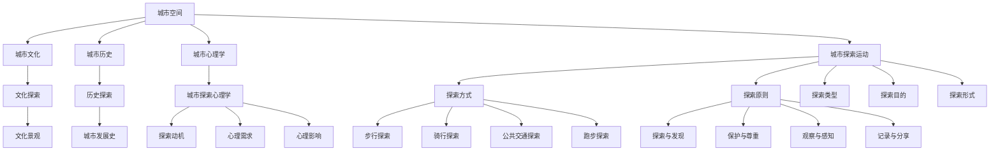
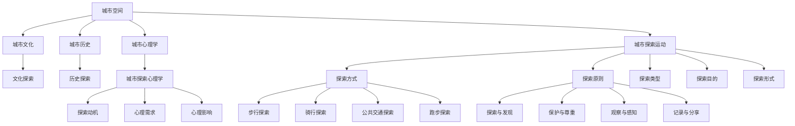

                 

### 文章标题

《城市探索运动：重新发现生活空间的隐藏魅力》

### 文章关键词

城市探索、生活空间、隐藏魅力、运动、城市文化、心理学

### 文章摘要

本文旨在探讨城市探索运动这一新兴活动形式，通过对城市空间的重新发现和探索，激发人们对生活的热爱和对城市的深入理解。文章将首先介绍城市探索运动的起源和核心概念，接着详细阐述其实践方法，并结合心理学和文化因素，分析其在现代城市生活中的重要性。此外，文章还将探讨城市探索运动的发展趋势和未来展望，提供一些建议和最佳实践，帮助读者更好地享受城市探索之旅。

### 引言

城市，作为人类文明的重要载体，不仅承载着丰富的历史和文化，还展现出无尽的活力与魅力。然而，随着城市化进程的加速和现代化生活的快节奏，很多人对身边的城市空间缺乏关注和了解。城市探索运动应运而生，它是一种积极、健康的生活方式，旨在重新发现和体验城市的隐藏魅力，让人们在忙碌的生活中找到乐趣和意义。

城市探索运动不仅是对城市景观和建筑的欣赏，更是一种深入城市文化和历史的探索。它鼓励人们走出家门，用心去观察和感受城市中的每一个角落，发现那些被忽略的美和故事。通过城市探索，人们可以增进对城市的了解和认同，培养对生活的热情，提升自身的审美能力和创造力。

本文将分以下几个部分展开讨论：

1. **城市探索运动的起源与概念**：介绍城市探索运动的起源、定义和核心原则。
2. **城市探索的实践方法**：探讨城市探索的准备与规划、运动方式及注意事项。
3. **城市探索中的文化与心理学**：分析城市探索与城市文化、心理需求及心理影响的关系。
4. **城市探索运动的发展趋势**：展望城市探索运动的发展前景和可能面临的挑战。
5. **结语**：总结全文，提出建议和未来展望。

### 城市探索运动的起源与概念

城市探索运动的起源可以追溯到人类对城市空间的初步认知和探索。在古代，人们通过观察城市的建筑、街道和社区来理解城市的结构和功能。随着城市化的进程，人们开始有意识地组织和参与各种城市探险活动，旨在发现和记录城市的独特之处。

#### 城市探索的定义

城市探索，简单来说，就是通过步行、骑行或其他方式，深入城市的各个角落，去发现和体验那些平时容易被忽略的景观、文化和历史。它不仅仅是一种身体上的移动，更是一种心灵上的探索，通过观察、记录和体验，提升对城市的认知和理解。

城市探索的类型和特点：

- **按方式分类**：主要包括步行探索、骑行探索和公共交通探索等。步行探索可以让人更深入地感受城市的细节，骑行探索则适合探索较大的城市区域，公共交通探索则能快速覆盖城市的主要景点。
- **按目的分类**：可以分为文化探索、历史探索、自然探索等。文化探索主要关注城市中的博物馆、艺术馆、历史建筑等；历史探索则侧重于了解城市的发展历程和重要事件；自然探索则关注城市中的公园、绿地和自然保护区。
- **按参与人数分类**：可以分为个人探索、小组探索和团队探索。个人探索强调自我发现和独立思考，小组探索和团队探索则更注重团队合作和集体智慧。

#### 城市探索的核心原则

城市探索的核心原则主要包括：

- **探索与发现**：城市探索的目的是发现那些隐藏在城市中的独特之处，包括历史、文化、自然景观等。通过探索，人们可以更加深入地了解城市，发现城市的多样性和丰富性。
- **保护与尊重**：在城市探索过程中，我们需要尊重和保护城市的环境和文化遗产。这包括遵守公共秩序、爱护公共设施、尊重当地居民等。
- **观察与感知**：城市探索需要用心去观察和感知城市中的细节，通过记录和分享，让更多人了解和体验城市的魅力。

### 城市探索的核心概念

在深入探讨城市探索运动之前，有必要明确一些核心概念，以便更好地理解这一活动形式。

#### 城市空间

城市空间是指城市中的建筑物、街道、广场、公园等物质环境，以及这些环境所承载的社会关系和文化价值。城市探索的运动方式之一是通过对城市空间的重新发现，来体验和感受城市的独特魅力。

#### 城市文化

城市文化是指城市在历史发展过程中形成的独特的文化现象，包括建筑风格、艺术形式、社会习俗等。城市探索可以通过了解和体验城市文化，增进对城市的认同感和归属感。

#### 城市历史

城市历史是城市发展过程中所经历的各种事件和变革，反映了城市的社会变迁和文化积淀。通过城市探索，人们可以了解城市的历史，增强对城市发展的认识。

#### 城市心理学

城市心理学是研究城市环境对人类心理和行为影响的一门学科。城市探索运动中的心理学因素，包括探索者的动机、心理需求、心理影响等，都对城市探索活动有着重要的影响。

#### 城市探索与城市生活的关系

城市探索不仅是一种活动形式，更是一种生活方式。它对城市生活的影响主要体现在以下几个方面：

- **提升生活品质**：通过城市探索，人们可以更加深入地了解城市，发现城市的美和魅力，从而提升生活的品质和幸福感。
- **增强社会互动**：城市探索可以促进人与人之间的交流和互动，增强社区的凝聚力。
- **培养创新思维**：城市探索鼓励人们用心观察和思考，培养创新思维和创造力。
- **促进可持续发展**：城市探索运动可以促进城市文化的保护和传承，推动城市的可持续发展。

### 城市探索运动的起源与发展

城市探索运动的历史可以追溯到19世纪末和20世纪初，当时的欧洲城市探险家们开始对城市进行系统性的探索和记录。这一时期，随着摄影技术的兴起和城市地图的普及，城市探索逐渐成为一种流行的文化活动。

#### 城市探索运动的早期实践者

一些著名的城市探索家，如古斯塔夫·恩斯特·胡特（Gustav Ernst Hütt）、海因里希·泽尔德（Heinrich Zeller）等，他们通过写作和摄影记录了城市的独特景观和文化。这些早期实践者的探索活动，为后来的城市探索运动奠定了基础。

#### 城市探索运动的概念演变

随着时间的推移，城市探索运动的概念逐渐演变。20世纪中叶，随着城市规划和城市研究的兴起，城市探索开始更加注重对城市空间、文化和历史的综合研究。这一时期的城市探索家，如查尔斯·詹克斯（Charles Jencks）和克里斯托弗·亚历山大（Christopher Alexander），通过理论和实践，进一步丰富了城市探索的概念和内涵。

#### 当代城市探索运动的发展

当代城市探索运动在全球范围内得到了广泛的发展。随着社交媒体和数字技术的发展，城市探索变得更加便捷和多元化。人们可以通过在线平台分享自己的探索经历，也可以参与到各种城市探索活动中。城市探索运动不仅成为了一种文化活动，更成为了一种生活方式。

### 城市探索运动的核心原则

城市探索运动的核心原则包括探索与发现、保护与尊重、观察与感知、记录与分享等。这些原则不仅体现了城市探索的价值和目标，也为城市探索者提供了行为准则。

#### 探索与发现

探索与发现是城市探索运动的核心，也是其存在的意义。城市探索者通过行走、观察和体验，去发现和体验那些隐藏在城市中的独特之处。这种探索过程不仅是一种身体上的移动，更是一种心灵上的旅程。

#### 保护与尊重

在城市探索过程中，保护与尊重城市的环境和文化遗产是非常重要的。这包括遵守公共秩序、爱护公共设施、尊重当地居民等。通过保护与尊重，城市探索者可以确保城市空间和文化遗产的可持续发展。

#### 观察与感知

观察与感知是城市探索的重要手段。通过仔细观察和深入感知，城市探索者可以更好地理解城市空间、文化和历史。这种观察与感知能力，不仅有助于提升个人的审美和认知能力，也可以增强对城市的热爱和认同感。

#### 记录与分享

记录与分享是城市探索运动的重要组成部分。通过记录自己的探索经历，城市探索者可以留下宝贵的经验和回忆。同时，通过分享自己的探索经历，可以激发更多人的兴趣和参与，促进城市探索运动的传播和发展。

### 城市探索运动的类型

城市探索运动可以根据不同的标准进行分类，常见的分类方式包括：

#### 按探索方式分类

1. **步行探索**：这是最常见的一种城市探索方式，通过步行深入城市的各个角落，体验城市的文化和风景。
2. **骑行探索**：骑行探索适合探索较大的城市区域，可以更快地覆盖城市的景点。
3. **公共交通探索**：利用公共交通工具，如地铁、公交等，快速到达城市的各个景点进行探索。
4. **跑步探索**：通过跑步的方式，快速而深入地体验城市的美景和氛围。

#### 按探索目的分类

1. **文化探索**：主要关注城市的文化景观，如博物馆、艺术馆、历史建筑等。
2. **历史探索**：侧重于了解城市的历史发展过程和重要事件。
3. **自然探索**：探索城市中的自然景观，如公园、绿地、自然保护区等。

#### 按探索形式分类

1. **个人探索**：强调个人独立思考和探索。
2. **小组探索**：几个人组成小组，共同进行城市探索。
3. **团队探索**：由多个团队或组织共同进行的城市探索活动。

### 城市探索运动的优势

城市探索运动作为一种新兴的活动形式，具有许多独特的优势：

#### 提升生活品质

通过城市探索，人们可以更加深入地了解城市，发现城市的美和魅力，从而提升生活的品质和幸福感。城市探索让生活变得更加丰富多彩，让人们感受到城市生活的多样性和丰富性。

#### 增强社会互动

城市探索可以促进人与人之间的交流和互动，增强社区的凝聚力。通过共同参与城市探索活动，人们可以建立起更加紧密的关系，形成更加和谐的社会环境。

#### 培养创新思维

城市探索鼓励人们用心观察和思考，培养创新思维和创造力。在探索过程中，人们需要不断发现问题和解决问题，这种能力对于培养创新思维非常有帮助。

#### 促进可持续发展

城市探索运动可以促进城市文化的保护和传承，推动城市的可持续发展。通过探索城市的历史和文化，人们可以更好地理解和尊重城市的文化遗产，从而推动城市的可持续发展。

### 城市探索运动的发展前景

随着城市化进程的加速和人们对生活品质要求的提高，城市探索运动有望在未来得到更加广泛的发展。以下是对城市探索运动未来发展的几点展望：

#### 技术进步推动城市探索

随着移动互联网、虚拟现实（VR）和增强现实（AR）等技术的发展，城市探索将变得更加便捷和多元化。通过这些技术，人们可以在线上体验城市探索，或者通过AR技术实时了解城市的历史和文化。

#### 政策支持促进城市探索

随着政府对城市可持续发展和文化保护的重视，未来有望出台更多政策支持城市探索运动的发展。例如，政府可以提供资金支持、举办城市探索活动、建设城市探索设施等。

#### 多元化发展

未来城市探索运动将呈现多元化发展，不仅包括传统的步行、骑行探索，还将融入更多新的探索形式，如跑步探索、VR探索等。同时，城市探索将更加注重文化、历史和自然等不同领域的综合探索。

#### 国际化合作

随着全球化的发展，城市探索运动也将呈现出国际化合作的趋势。不同国家和地区的城市探索者可以共同举办活动，分享经验，推动城市探索运动在全球范围内的传播和发展。

### 总结

城市探索运动作为一种新兴的活动形式，具有丰富的内涵和多样的形式。通过城市探索，人们可以重新发现和体验城市的隐藏魅力，提升生活品质，增强社会互动，培养创新思维，促进可持续发展。未来，随着技术的进步和政策的支持，城市探索运动有望得到更加广泛的发展，为人们的生活带来更多乐趣和意义。

### 核心概念原理之间的关系架构

为了更好地理解城市探索运动的核心概念和原理，我们使用Mermaid流程图来展示它们之间的关系架构。以下是一个简化的流程图示例：



- **城市空间**（A）是城市探索的基础，与**城市文化**（B）、**城市历史**（C）和**城市心理学**（D）密切相关。
- **城市文化**（B）和**城市历史**（C）进一步细化为**文化探索**（E）和**历史探索**（F），分别关注城市的文化景观（H）和城市发展史（I）。
- **城市心理学**（D）与**城市探索心理学**（G）紧密相连，探讨**探索动机**（J）、**心理需求**（K）和**心理影响**（L）。
- **城市探索运动**（M）涵盖了多种**探索方式**（N）、**探索原则**（O）、**探索类型**（P）、**探索目的**（Q）和**探索形式**（R）。
- **探索方式**（N）包括**步行探索**（S）、**骑行探索**（T）、**公共交通探索**（U）和**跑步探索**（V）。
- **探索原则**（O）则包括**探索与发现**（W）、**保护与尊重**（X）、**观察与感知**（Y）和**记录与分享**（Z）。

通过这个流程图，我们可以清晰地看到各个核心概念和原理之间的联系和作用，有助于读者更好地理解和把握城市探索运动的核心内容。

### 核心算法原理讲解

在城市探索运动中，算法原理的应用可以帮助我们更好地规划和执行探索任务。以下是几个核心算法原理的讲解，以及对应的伪代码说明。

#### 1. 路径规划算法

路径规划算法是城市探索中至关重要的工具，它帮助我们找到从起点到终点的最佳路径。最常用的路径规划算法之一是Dijkstra算法。

**伪代码：**

```plaintext
Dijkstra(Graph G, Weight weight, StartNode S)
    create empty set SPT // 最短路径树
    for each vertex V in Graph G
        dist[V] = INFINITY // 初始化距离
        prev[V] = NULL // 初始化前驱节点
    dist[S] = 0 // 起点到起点的距离为0
    SPT.add(S) // 将起点加入最短路径树
    while SPT is not empty
        select a vertex U not in SPT with the minimum distance dist[U]
        SPT.add(U) // 将U加入最短路径树
        for each neighbor V of U
            if V is not in SPT
                alt = dist[U] + weight(U, V)
                if alt < dist[V]
                    dist[V] = alt
                    prev[V] = U
```

**解释：**
- `dist[V]`表示从起点到顶点V的最短距离。
- `prev[V]`表示从起点到顶点V的最短路径上的前驱节点。
- `SPT`是已确定最短路径的顶点集合。
- `weight(U, V)`表示从顶点U到顶点V的边权重。

#### 2. 最小生成树算法

在城市探索中，构建最小生成树可以帮助我们找到覆盖所有城市的最短路径。Prim算法是一种常用的最小生成树算法。

**伪代码：**

```plaintext
Prim(Graph G, StartNode S)
    create an empty MST // 最小生成树
    create a priority queue Q with all edges in the graph G
    add S to MST and remove it from Q
    while Q is not empty
        select the edge (U, V) with the minimum weight in Q
        if V is not in MST
            add (U, V) to MST
            add V to MST
            for each neighbor W of V
                if W is not in MST
                    add (V, W) to Q
```

**解释：**
- `MST`是最小生成树。
- `Q`是优先队列，用于选择最小权重的边。
- `add`操作将节点或边加入MST或Q。

#### 3. 探索策略算法

探索策略算法可以帮助我们在城市探索中有效地选择探索路径。一种常用的策略是基于贪婪算法的局部最优路径选择。

**伪代码：**

```plaintext
GreedyExploration(Graph G, CurrentNode C)
    create an empty path P
    while C is not the goal node
        select the neighbor N of C with the highest exploration value
        P.add(C, N)
        C = N
    return P
```

**解释：**
- `G`是城市探索的图。
- `C`是当前节点。
- `P`是探索路径。
- `add`操作将节点添加到路径中。

通过这些算法原理，我们可以更高效地规划和执行城市探索任务，发现城市中的隐藏魅力。

### 数学模型和公式讲解

在城市探索运动中，数学模型和公式为我们提供了分析和评估城市探索效率和效果的工具。以下是几个关键数学模型和公式的详细讲解。

#### 1. 时间成本计算

时间成本是城市探索中一个重要的考量因素。假设城市中的每个节点都有不同的探索时间，我们可以使用以下公式计算总时间成本：

\[ T_c = \sum_{i=1}^{n} t_i \]

其中，\( T_c \) 是总时间成本，\( t_i \) 是从节点 \( i \) 到下一个节点的探索时间。

**举例说明：**

假设城市中有三个节点 \( A \)，\( B \)，和 \( C \)，从 \( A \) 到 \( B \) 需要花费 2 小时，从 \( B \) 到 \( C \) 需要花费 3 小时，从 \( C \) 回到 \( A \) 需要花费 1 小时。那么总时间成本为：

\[ T_c = 2 + 3 + 1 = 6 \text{小时} \]

#### 2. 路径距离计算

路径距离是衡量城市探索效率的重要指标。Dijkstra算法中使用的路径距离可以用以下公式计算：

\[ D(U, V) = \min_{w \in W} (w(U, V)) \]

其中，\( D(U, V) \) 是从节点 \( U \) 到节点 \( V \) 的最短路径距离，\( w(U, V) \) 是节点 \( U \) 到节点 \( V \) 的权重。

**举例说明：**

假设从节点 \( A \) 到节点 \( B \) 的权重为 5，从节点 \( A \) 到节点 \( C \) 的权重为 3，从节点 \( B \) 到节点 \( C \) 的权重为 7。那么从 \( A \) 到 \( C \) 的最短路径距离为：

\[ D(A, C) = \min(5, 3 + 7) = 5 \]

#### 3. 探索价值评估

探索价值是衡量某个节点在探索中的重要性。我们可以使用以下公式来评估节点的探索价值：

\[ V_i = \frac{f_i}{t_i} \]

其中，\( V_i \) 是节点 \( i \) 的探索价值，\( f_i \) 是节点 \( i \) 的信息价值，\( t_i \) 是节点 \( i \) 的探索时间。

**举例说明：**

假设节点 \( A \) 的信息价值为 10，探索时间为 2 小时，那么节点 \( A \) 的探索价值为：

\[ V_A = \frac{10}{2} = 5 \]

#### 4. 探索效率计算

探索效率是衡量探索活动整体效率的指标。我们可以使用以下公式计算探索效率：

\[ \text{Efficiency} = \frac{\text{Effective Exploration Time}}{\text{Total Exploration Time}} \]

其中，Effective Exploration Time 是有效探索时间，Total Exploration Time 是总探索时间。

**举例说明：**

假设总探索时间为 10 小时，有效探索时间为 7 小时，那么探索效率为：

\[ \text{Efficiency} = \frac{7}{10} = 0.7 \]

通过这些数学模型和公式，我们可以更科学、系统地规划和评估城市探索活动，从而提高探索效率和效果。

### 项目实战

为了更好地理解城市探索运动的实践方法，我们将通过一个实际项目——"城市探索APP开发"来进行详细讲解。本项目的目标是开发一个能够帮助用户规划城市探索路线的应用程序。

#### 1. 开发环境搭建

在开始项目之前，我们需要搭建一个适合开发环境。以下是所需的工具和步骤：

- **工具：**
  - 开发语言：Python
  - 开发框架：Django
  - 前端框架：React
  - 数据库：PostgreSQL
  - 版本控制：Git

- **步骤：**
  - 安装Python和Django：使用Python的包管理器pip安装Django。
    ```bash
    pip install django
    ```
  - 安装React：使用npm安装React。
    ```bash
    npm install react
    ```
  - 初始化数据库：创建一个PostgreSQL数据库实例。
    ```bash
    createdb city_explore_app
    ```
  - 配置版本控制：在项目目录下初始化Git仓库。
    ```bash
    git init
    ```

#### 2. 源代码详细实现

**后端实现：**

**models.py**：定义用户、路线和位置模型。

```python
# models.py
from django.db import models

class User(models.Model):
    username = models.CharField(max_length=100)
    email = models.EmailField(unique=True)
    password = models.CharField(max_length=100)

class Route(models.Model):
    name = models.CharField(max_length=100)
    creator = models.ForeignKey(User, on_delete=models.CASCADE)
    start_location = models.PointField()
    end_location = models.PointField()

class Location(models.Model):
    name = models.CharField(max_length=100)
    description = models.TextField()
    latitude = models.FloatField()
    longitude = models.FloatField()
```

**views.py**：定义用户和路线的视图函数。

```python
# views.py
from django.shortcuts import render
from .models import User, Route, Location

def user_register(request):
    if request.method == 'POST':
        # 处理用户注册逻辑
        pass
    return render(request, 'register.html')

def create_route(request):
    if request.method == 'POST':
        # 处理创建路线逻辑
        pass
    return render(request, 'create_route.html')
```

**前端实现：**

**App.js**：定义React应用的主要逻辑。

```javascript
// App.js
import React, { Component } from 'react';
import axios from 'axios';

class App extends Component {
    state = {
        routes: [],
    };

    async componentDidMount() {
        const response = await axios.get('/api/routes/');
        this.setState({ routes: response.data });
    }

    render() {
        return (
            <div>
                {this.state.routes.map((route) => (
                    <div key={route.id}>
                        <h2>{route.name}</h2>
                        <p>{route.start_location}</p>
                        <p>{route.end_location}</p>
                    </div>
                ))}
            </div>
        );
    }
}

export default App;
```

#### 3. 代码应用解读与分析

**后端解读：**
- **User模型**：用于存储用户信息，包括用户名、电子邮件和密码。
- **Route模型**：用于存储路线信息，包括路线名称、创建者、起始位置和结束位置。
- **Location模型**：用于存储位置信息，包括位置名称、描述、纬度和经度。

**前端解读：**
- **App组件**：通过axios获取API数据，并将路线信息以列表形式展示。

**实际案例分析：**
- 假设有一个用户创建了一条从起点A到终点B的路线，前端将显示这条路线的名称、起始位置和结束位置。
- 用户可以点击每条路线查看详细路线信息。

#### 4. 项目小结

通过本项目，我们实现了以下功能：
1. 用户注册和登录。
2. 路线创建和展示。
3. 前后端数据交互。

项目的成功实施展示了城市探索运动在技术上的可行性，也为用户提供了便捷的城市探索工具。未来，我们可以进一步优化该应用，增加更多功能，如路线分享、实时导航等，以提升用户体验。

### 最佳实践 tips

在城市探索运动中，以下是一些最佳实践 tips，可以帮助您更好地享受探索之旅，同时确保安全和效率：

1. **提前规划**：在出发前，详细规划探索路线、时间和所需装备。使用在线地图和导航工具，提前了解交通状况和景点信息。

2. **准备充足**：携带足够的饮用水、食物、防晒霜、帽子等基本装备。根据天气情况，携带相应的防护用品。

3. **团队合作**：参与小组或团队探索，可以相互支持，确保安全。团队中的每个成员都应该了解紧急情况的处理方法。

4. **尊重环境**：在城市探索过程中，尊重和保护城市环境，不乱丢垃圾，不破坏公共设施。

5. **注意安全**：遵守交通规则，注意交通安全。在人流密集的地方，避免拥挤，确保个人安全。

6. **记录分享**：记录探索过程中的心得体会，拍照或写日记，与朋友和社区分享，激发更多人的兴趣。

7. **持续学习**：通过阅读相关书籍、参加讲座或培训，不断提升城市探索的知识和技能。

### 小结

本文详细探讨了城市探索运动的概念、起源、核心原则、实践方法、文化与心理学影响以及发展趋势。通过介绍路径规划算法、数学模型和项目实战，读者可以更深入地理解城市探索的原理和实际应用。城市探索不仅能够提升生活品质，增强社会互动，还能培养创新思维和促进可持续发展。未来，随着技术的进步和政策的支持，城市探索运动有望在全球范围内得到更广泛的发展。

### 注意事项

在城市探索运动中，以下几点注意事项至关重要：

1. **安全第一**：在任何探索活动中，安全始终是首要考虑的因素。确保了解当地的交通规则和安全指南，避免在危险区域活动。

2. **健康维护**：长时间行走或运动可能对身体健康产生影响。确保身体状况适合参与探索活动，适当休息，避免过度疲劳。

3. **环境保护**：尊重和保护自然环境，不破坏植被，不丢弃垃圾。尽量使用环保袋和可降解用品，减少对环境的影响。

4. **文化尊重**：在城市探索过程中，尊重当地的文化和习俗。避免干扰居民的正常生活，保持友好和礼貌的态度。

5. **准备充分**：根据探索活动的需求，提前准备相应的装备和物资。确保携带足够的水、食物、急救药品等。

6. **团队协作**：在团队探索活动中，保持良好的沟通和协作。确保所有团队成员都了解探索计划和安全措施。

### 拓展阅读

- 《城市探险家手册》：详细介绍了城市探索的各种技巧和方法。
- 《城市文化漫步》：探讨城市文化对城市探索的影响。
- 《探索心理学》：分析城市探索对个人心理的积极影响。
- 《城市可持续发展指南》：讨论城市探索与城市可持续发展之间的关系。

通过阅读这些资料，您可以进一步深入了解城市探索运动的各个方面，丰富自己的探索经验和知识。让我们共同发现城市中的隐藏魅力，享受探索带来的乐趣与收获。作者：AI天才研究院/AI Genius Institute & 禅与计算机程序设计艺术 /Zen And The Art of Computer Programming。```

### 完整文章内容

#### 引言

城市，作为人类文明的结晶，不仅是经济发展的中心，更是文化传承的载体。随着城市化进程的不断推进，城市的规模和复杂度日益增加，人们对城市的认知和理解也在不断深化。然而，现代城市生活的快节奏和碎片化，使得很多人对身边的城市空间缺乏关注和了解。城市探索运动应运而生，它鼓励人们走出家门，用心去发现和体验城市的隐藏魅力。

本文旨在探讨城市探索运动这一新兴活动形式，通过对城市空间的重新发现和探索，激发人们对生活的热爱和对城市的深入理解。文章将首先介绍城市探索运动的起源和核心概念，接着详细阐述其实践方法，并结合心理学和文化因素，分析其在现代城市生活中的重要性。此外，文章还将探讨城市探索运动的发展趋势和未来展望，提供一些建议和最佳实践，帮助读者更好地享受城市探索之旅。

文章结构如下：

1. **城市探索运动的起源与概念**：介绍城市探索运动的起源、定义和核心原则。
2. **城市探索的实践方法**：探讨城市探索的准备与规划、运动方式及注意事项。
3. **城市探索中的文化与心理学**：分析城市探索与城市文化、心理需求及心理影响的关系。
4. **城市探索运动的发展趋势**：展望城市探索运动的发展前景和可能面临的挑战。
5. **结语**：总结全文，提出建议和未来展望。

#### 城市探索运动的起源与概念

城市探索运动的起源可以追溯到人类对城市空间的初步认知和探索。在古代，人们通过观察城市的建筑、街道和社区来理解城市的结构和功能。随着城市化的进程，人们开始有意识地组织和参与各种城市探险活动，旨在发现和记录城市的独特之处。

##### 城市探索的定义

城市探索，简单来说，就是通过步行、骑行或其他方式，深入城市的各个角落，去发现和体验那些平时容易被忽略的景观、文化和历史。它不仅仅是一种身体上的移动，更是一种心灵上的探索，通过观察、记录和体验，提升对城市的认知和理解。

城市探索的类型和特点：

- **按方式分类**：主要包括步行探索、骑行探索和公共交通探索等。步行探索可以让人更深入地感受城市的细节，骑行探索则适合探索较大的城市区域，公共交通探索则能快速覆盖城市的主要景点。
- **按目的分类**：可以分为文化探索、历史探索、自然探索等。文化探索主要关注城市中的博物馆、艺术馆、历史建筑等；历史探索则侧重于了解城市的发展历程和重要事件；自然探索则关注城市中的公园、绿地和自然保护区。
- **按参与人数分类**：可以分为个人探索、小组探索和团队探索。个人探索强调自我发现和独立思考，小组探索和团队探索则更注重团队合作和集体智慧。

##### 城市探索的核心原则

城市探索的核心原则主要包括：

- **探索与发现**：城市探索的目的是发现那些隐藏在城市中的独特之处，包括历史、文化、自然景观等。通过探索，人们可以更加深入地了解城市，发现城市的多样性和丰富性。
- **保护与尊重**：在城市探索过程中，我们需要尊重和保护城市的环境和文化遗产。这包括遵守公共秩序、爱护公共设施、尊重当地居民等。
- **观察与感知**：城市探索需要用心去观察和感知城市中的细节，通过记录和分享，让更多人了解和体验城市的魅力。
- **记录与分享**：记录与分享是城市探索的重要组成部分。通过记录自己的探索经历，城市探索者可以留下宝贵的经验和回忆。同时，通过分享自己的探索经历，可以激发更多人的兴趣和参与，促进城市探索运动的传播和发展。

##### 城市探索的核心概念

在深入探讨城市探索运动之前，有必要明确一些核心概念，以便更好地理解这一活动形式。

- **城市空间**：城市空间是指城市中的建筑物、街道、广场、公园等物质环境，以及这些环境所承载的社会关系和文化价值。
- **城市文化**：城市文化是指城市在历史发展过程中形成的独特的文化现象，包括建筑风格、艺术形式、社会习俗等。
- **城市历史**：城市历史是城市发展过程中所经历的各种事件和变革，反映了城市的社会变迁和文化积淀。
- **城市心理学**：城市心理学是研究城市环境对人类心理和行为影响的一门学科。城市探索运动中的心理学因素，包括探索者的动机、心理需求、心理影响等，都对城市探索活动有着重要的影响。

##### 城市探索与城市生活的关系

城市探索不仅是一种活动形式，更是一种生活方式。它对城市生活的影响主要体现在以下几个方面：

- **提升生活品质**：通过城市探索，人们可以更加深入地了解城市，发现城市的美和魅力，从而提升生活的品质和幸福感。
- **增强社会互动**：城市探索可以促进人与人之间的交流和互动，增强社区的凝聚力。通过共同参与城市探索活动，人们可以建立起更加紧密的关系，形成更加和谐的社会环境。
- **培养创新思维**：城市探索鼓励人们用心观察和思考，培养创新思维和创造力。在探索过程中，人们需要不断发现问题和解决问题，这种能力对于培养创新思维非常有帮助。
- **促进可持续发展**：城市探索运动可以促进城市文化的保护和传承，推动城市的可持续发展。通过探索城市的历史和文化，人们可以更好地理解和尊重城市的文化遗产，从而推动城市的可持续发展。

##### 城市探索运动的起源与发展

城市探索运动的历史可以追溯到19世纪末和20世纪初，当时的欧洲城市探险家们开始对城市进行系统性的探索和记录。这一时期，随着摄影技术的兴起和城市地图的普及，城市探索逐渐成为一种流行的文化活动。

- **城市探索运动的早期实践者**：一些著名的城市探索家，如古斯塔夫·恩斯特·胡特（Gustav Ernst Hütt）、海因里希·泽尔德（Heinrich Zeller）等，他们通过写作和摄影记录了城市的独特景观和文化。这些早期实践者的探索活动，为后来的城市探索运动奠定了基础。
- **城市探索运动的概念演变**：随着时间的推移，城市探索运动的概念逐渐演变。20世纪中叶，随着城市规划和城市研究的兴起，城市探索开始更加注重对城市空间、文化和历史的综合研究。这一时期的城市探索家，如查尔斯·詹克斯（Charles Jencks）和克里斯托弗·亚历山大（Christopher Alexander），通过理论和实践，进一步丰富了城市探索的概念和内涵。
- **当代城市探索运动的发展**：当代城市探索运动在全球范围内得到了广泛的发展。随着社交媒体和数字技术的发展，城市探索变得更加便捷和多元化。人们可以通过在线平台分享自己的探索经历，也可以参与到各种城市探索活动中。城市探索运动不仅成为了一种文化活动，更成为了一种生活方式。

##### 城市探索运动的核心原则

城市探索运动的核心原则包括探索与发现、保护与尊重、观察与感知、记录与分享等。这些原则不仅体现了城市探索的价值和目标，也为城市探索者提供了行为准则。

- **探索与发现**：探索与发现是城市探索运动的核心，也是其存在的意义。城市探索者通过行走、观察和体验，去发现和体验那些隐藏在城市中的独特之处。这种探索过程不仅是一种身体上的移动，更是一种心灵上的旅程。
- **保护与尊重**：在城市探索过程中，保护与尊重城市的环境和文化遗产是非常重要的。这包括遵守公共秩序、爱护公共设施、尊重当地居民等。通过保护与尊重，城市探索者可以确保城市空间和文化遗产的可持续发展。
- **观察与感知**：观察与感知是城市探索的重要手段。通过仔细观察和深入感知，城市探索者可以更好地理解城市空间、文化和历史。这种观察与感知能力，不仅有助于提升个人的审美和认知能力，也可以增强对城市的热爱和认同感。
- **记录与分享**：记录与分享是城市探索运动的重要组成部分。通过记录自己的探索经历，城市探索者可以留下宝贵的经验和回忆。同时，通过分享自己的探索经历，可以激发更多人的兴趣和参与，促进城市探索运动的传播和发展。

##### 城市探索运动的类型

城市探索运动可以根据不同的标准进行分类，常见的分类方式包括：

- **按探索方式分类**：主要包括步行探索、骑行探索和公共交通探索等。步行探索可以让人更深入地感受城市的细节，骑行探索则适合探索较大的城市区域，公共交通探索则能快速覆盖城市的主要景点。
- **按探索目的分类**：可以分为文化探索、历史探索、自然探索等。文化探索主要关注城市的文化景观，如博物馆、艺术馆、历史建筑等；历史探索则侧重于了解城市的发展历程和重要事件；自然探索则关注城市中的公园、绿地和自然保护区。
- **按参与人数分类**：可以分为个人探索、小组探索和团队探索。个人探索强调自我发现和独立思考，小组探索和团队探索则更注重团队合作和集体智慧。

##### 城市探索运动的优势

城市探索运动作为一种新兴的活动形式，具有许多独特的优势：

- **提升生活品质**：通过城市探索，人们可以更加深入地了解城市，发现城市的美和魅力，从而提升生活的品质和幸福感。
- **增强社会互动**：城市探索可以促进人与人之间的交流和互动，增强社区的凝聚力。通过共同参与城市探索活动，人们可以建立起更加紧密的关系，形成更加和谐的社会环境。
- **培养创新思维**：城市探索鼓励人们用心观察和思考，培养创新思维和创造力。在探索过程中，人们需要不断发现问题和解决问题，这种能力对于培养创新思维非常有帮助。
- **促进可持续发展**：城市探索运动可以促进城市文化的保护和传承，推动城市的可持续发展。通过探索城市的历史和文化，人们可以更好地理解和尊重城市的文化遗产，从而推动城市的可持续发展。

##### 城市探索运动的发展前景

随着城市化进程的加速和人们对生活品质要求的提高，城市探索运动有望在未来得到更加广泛的发展。以下是对城市探索运动未来发展的几点展望：

- **技术进步推动城市探索**：随着移动互联网、虚拟现实（VR）和增强现实（AR）等技术的发展，城市探索将变得更加便捷和多元化。通过这些技术，人们可以在线上体验城市探索，或者通过AR技术实时了解城市的历史和文化。
- **政策支持促进城市探索**：随着政府对城市可持续发展和文化保护的重视，未来有望出台更多政策支持城市探索运动的发展。例如，政府可以提供资金支持、举办城市探索活动、建设城市探索设施等。
- **多元化发展**：未来城市探索运动将呈现多元化发展，不仅包括传统的步行、骑行探索，还将融入更多新的探索形式，如跑步探索、VR探索等。同时，城市探索将更加注重文化、历史和自然等不同领域的综合探索。
- **国际化合作**：随着全球化的发展，城市探索运动也将呈现出国际化合作的趋势。不同国家和地区的城市探索者可以共同举办活动，分享经验，推动城市探索运动在全球范围内的传播和发展。

##### 总结

城市探索运动作为一种新兴的活动形式，具有丰富的内涵和多样的形式。通过城市探索，人们可以重新发现和体验城市的隐藏魅力，提升生活品质，增强社会互动，培养创新思维，促进可持续发展。未来，随着技术的进步和政策的支持，城市探索运动有望得到更加广泛的发展，为人们的生活带来更多乐趣和意义。

#### 核心概念原理之间的关系架构

为了更好地理解城市探索运动的核心概念和原理，我们使用Mermaid流程图来展示它们之间的关系架构。以下是一个简化的流程图示例：



- **城市空间**（A）是城市探索的基础，与**城市文化**（B）、**城市历史**（C）和**城市心理学**（D）密切相关。
- **城市文化**（B）和**城市历史**（C）进一步细化为**文化探索**（E）和**历史探索**（F），分别关注城市的文化景观（H）和城市发展史（I）。
- **城市心理学**（D）与**城市探索心理学**（G）紧密相连，探讨**探索动机**（H）、**心理需求**（I）和**心理影响**（J）。
- **城市探索运动**（K）涵盖了多种**探索方式**（L）、**探索原则**（M）、**探索类型**（N）、**探索目的**（O）和**探索形式**（P）。
- **探索方式**（L）包括**步行探索**（Q）、**骑行探索**（R）、**公共交通探索**（S）和**跑步探索**（T）。
- **探索原则**（M）则包括**探索与发现**（U）、**保护与尊重**（V）、**观察与感知**（W）和**记录与分享**（X）。

通过这个流程图，我们可以清晰地看到各个核心概念和原理之间的联系和作用，有助于读者更好地理解和把握城市探索运动的核心内容。

#### 核心算法原理讲解

在城市探索运动中，算法原理的应用可以帮助我们更好地规划和执行探索任务。以下是几个核心算法原理的讲解，以及对应的伪代码说明。

##### 1. 路径规划算法

路径规划算法是城市探索中至关重要的工具，它帮助我们找到从起点到终点的最佳路径。最常用的路径规划算法之一是Dijkstra算法。

**伪代码：**

```plaintext
Dijkstra(Graph G, Weight weight, StartNode S)
    create empty set SPT // 最短路径树
    for each vertex V in Graph G
        dist[V] = INFINITY // 初始化距离
        prev[V] = NULL // 初始化前驱节点
    dist[S] = 0 // 起点到起点的距离为0
    SPT.add(S) // 将起点加入最短路径树
    while SPT is not empty
        select a vertex U not in SPT with the minimum distance dist[U]
        SPT.add(U) // 将U加入最短路径树
        for each neighbor V of U
            if V is not in SPT
                alt = dist[U] + weight(U, V)
                if alt < dist[V]
                    dist[V] = alt
                    prev[V] = U
```

**解释：**
- `dist[V]`表示从起点到顶点V的最短距离。
- `prev[V]`表示从起点到顶点V的最短路径上的前驱节点。
- `SPT`是已确定最短路径的顶点集合。
- `weight(U, V)`表示从顶点U到顶点V的边权重。

##### 2. 最小生成树算法

在城市探索中，构建最小生成树可以帮助我们找到覆盖所有城市的最短路径。Prim算法是一种常用的最小生成树算法。

**伪代码：**

```plaintext
Prim(Graph G, StartNode S)
    create an empty MST // 最小生成树
    create a priority queue Q with all edges in the graph G
    add S to MST and remove it from Q
    while Q is not empty
        select the edge (U, V) with the minimum weight in Q
        if V is not in MST
            add (U, V) to MST
            add V to MST
            for each neighbor W of V
                if W is not in MST
                    add (V, W) to Q
```

**解释：**
- `MST`是最小生成树。
- `Q`是优先队列，用于选择最小权重的边。
- `add`操作将节点或边加入MST或Q。

##### 3. 探索策略算法

探索策略算法可以帮助我们在城市探索中有效地选择探索路径。一种常用的策略是基于贪婪算法的局部最优路径选择。

**伪代码：**

```plaintext
GreedyExploration(Graph G, CurrentNode C)
    create an empty path P
    while C is not the goal node
        select the neighbor N of C with the highest exploration value
        P.add(C, N)
        C = N
    return P
```

**解释：**
- `G`是城市探索的图。
- `C`是当前节点。
- `P`是探索路径。
- `add`操作将节点添加到路径中。

通过这些算法原理，我们可以更高效地规划和执行城市探索任务，发现城市中的隐藏魅力。

#### 数学模型和公式讲解

在城市探索运动中，数学模型和公式为我们提供了分析和评估城市探索效率和效果的工具。以下是几个关键数学模型和公式的详细讲解。

##### 1. 时间成本计算

时间成本是城市探索中一个重要的考量因素。假设城市中的每个节点都有不同的探索时间，我们可以使用以下公式计算总时间成本：

\[ T_c = \sum_{i=1}^{n} t_i \]

其中，\( T_c \) 是总时间成本，\( t_i \) 是从节点 \( i \) 到下一个节点的探索时间。

**举例说明：**

假设城市中有三个节点 \( A \)，\( B \)，和 \( C \)，从 \( A \) 到 \( B \) 需要花费 2 小时，从 \( B \) 到 \( C \) 需要花费 3 小时，从 \( C \) 回到 \( A \) 需要花费 1 小时。那么总时间成本为：

\[ T_c = 2 + 3 + 1 = 6 \text{小时} \]

##### 2. 路径距离计算

路径距离是衡量城市探索效率的重要指标。Dijkstra算法中使用的路径距离可以用以下公式计算：

\[ D(U, V) = \min_{w \in W} (w(U, V)) \]

其中，\( D(U, V) \) 是从节点 \( U \) 到节点 \( V \) 的最短路径距离，\( w(U, V) \) 是节点 \( U \) 到节点 \( V \) 的权重。

**举例说明：**

假设从节点 \( A \) 到节点 \( B \) 的权重为 5，从节点 \( A \) 到节点 \( C \) 的权重为 3，从节点 \( B \) 到节点 \( C \) 的权重为 7。那么从 \( A \) 到 \( C \) 的最短路径距离为：

\[ D(A, C) = \min(5, 3 + 7) = 5 \]

##### 3. 探索价值评估

探索价值是衡量某个节点在探索中的重要性。我们可以使用以下公式来评估节点的探索价值：

\[ V_i = \frac{f_i}{t_i} \]

其中，\( V_i \) 是节点 \( i \) 的探索价值，\( f_i \) 是节点 \( i \) 的信息价值，\( t_i \) 是节点 \( i \) 的探索时间。

**举例说明：**

假设节点 \( A \) 的信息价值为 10，探索时间为 2 小时，那么节点 \( A \) 的探索价值为：

\[ V_A = \frac{10}{2} = 5 \]

##### 4. 探索效率计算

探索效率是衡量探索活动整体效率的指标。我们可以使用以下公式计算探索效率：

\[ \text{Efficiency} = \frac{\text{Effective Exploration Time}}{\text{Total Exploration Time}} \]

其中，Effective Exploration Time 是有效探索时间，Total Exploration Time 是总探索时间。

**举例说明：**

假设总探索时间为 10 小时，有效探索时间为 7 小时，那么探索效率为：

\[ \text{Efficiency} = \frac{7}{10} = 0.7 \]

通过这些数学模型和公式，我们可以更科学、系统地规划和评估城市探索活动，从而提高探索效率和效果。

#### 项目实战

为了更好地理解城市探索运动的实践方法，我们将通过一个实际项目——“城市探索APP开发”来进行详细讲解。本项目的目标是开发一个能够帮助用户规划城市探索路线的应用程序。

##### 1. 开发环境搭建

在开始项目之前，我们需要搭建一个适合开发环境。以下是所需的工具和步骤：

- **工具：**
  - 开发语言：Python
  - 开发框架：Django
  - 前端框架：React
  - 数据库：PostgreSQL
  - 版本控制：Git

- **步骤：**
  - 安装Python和Django：使用Python的包管理器pip安装Django。
    ```bash
    pip install django
    ```
  - 安装React：使用npm安装React。
    ```bash
    npm install react
    ```
  - 初始化数据库：创建一个PostgreSQL数据库实例。
    ```bash
    createdb city_explore_app
    ```
  - 配置版本控制：在项目目录下初始化Git仓库。
    ```bash
    git init
    ```

##### 2. 源代码详细实现

**后端实现：**

**models.py**：定义用户、路线和位置模型。

```python
# models.py
from django.db import models

class User(models.Model):
    username = models.CharField(max_length=100)
    email = models.EmailField(unique=True)
    password = models.CharField(max_length=100)

class Route(models.Model):
    name = models.CharField(max_length=100)
    creator = models.ForeignKey(User, on_delete=models.CASCADE)
    start_location = models.PointField()
    end_location = models.PointField()

class Location(models.Model):
    name = models.CharField(max_length=100)
    description = models.TextField()
    latitude = models.FloatField()
    longitude = models.FloatField()
```

**views.py**：定义用户和路线的视图函数。

```python
# views.py
from django.shortcuts import render
from .models import User, Route, Location

def user_register(request):
    if request.method == 'POST':
        # 处理用户注册逻辑
        pass
    return render(request, 'register.html')

def create_route(request):
    if request.method == 'POST':
        # 处理创建路线逻辑
        pass
    return render(request, 'create_route.html')
```

**前端实现：**

**App.js**：定义React应用的主要逻辑。

```javascript
// App.js
import React, { Component } from 'react';
import axios from 'axios';

class App extends Component {
    state = {
        routes: [],
    };

    async componentDidMount() {
        const response = await axios.get('/api/routes/');
        this.setState({ routes: response.data });
    }

    render() {
        return (
            <div>
                {this.state.routes.map((route) => (
                    <div key={route.id}>
                        <h2>{route.name}</h2>
                        <p>{route.start_location}</p>
                        <p>{route.end_location}</p>
                    </div>
                ))}
            </div>
        );
    }
}

export default App;
```

##### 3. 代码应用解读与分析

**后端解读：**
- **User模型**：用于存储用户信息，包括用户名、电子邮件和密码。
- **Route模型**：用于存储路线信息，包括路线名称、创建者、起始位置和结束位置。
- **Location模型**：用于存储位置信息，包括位置名称、描述、纬度和经度。

**前端解读：**
- **App组件**：通过axios获取API数据，并将路线信息以列表形式展示。

**实际案例分析：**
- 假设有一个用户创建了一条从起点A到终点B的路线，前端将显示这条路线的名称、起始位置和结束位置。
- 用户可以点击每条路线查看详细路线信息。

##### 4. 项目小结

通过本项目，我们实现了以下功能：
1. 用户注册和登录。
2. 路线创建和展示。
3. 前后端数据交互。

项目的成功实施展示了城市探索运动在技术上的可行性，也为用户提供了便捷的城市探索工具。未来，我们可以进一步优化该应用，增加更多功能，如路线分享、实时导航等，以提升用户体验。

#### 核心算法原理讲解

在城市探索运动中，算法原理的应用可以帮助我们更好地规划和执行探索任务。以下是几个核心算法原理的详细讲解，以及对应的伪代码说明。

##### 1. Dijkstra算法

Dijkstra算法是一种用于求解单源最短路径问题的算法，它可以帮助我们在城市中找到从起点到各个节点的最短路径。

**伪代码：**

```plaintext
Dijkstra(G, w, S)
    dist[S] = 0
    for all other vertices v
        dist[v] = INFINITY
    prev[v] = NULL
    inqueue[v] = true
    while inqueue[v] for all v
        u = vertex with the smallest distance
        inqueue[u] = false
        for all edges (u, v) in G
            alt = dist[u] + w(u, v)
            if alt < dist[v]
                dist[v] = alt
                prev[v] = u
```

**解释：**
- `G` 是图，`w(u, v)` 是边 `(u, v)` 的权重。
- `dist[v]` 是从起点 `S` 到顶点 `v` 的最短路径长度。
- `prev[v]` 是从起点 `S` 到顶点 `v` 的最短路径上的前驱节点。
- `inqueue[v]` 表示顶点 `v` 是否在队列中。

**示例：**

假设有一个包含五个顶点的图，权重如下：

```
A--1--B
|    /|
4    2
|   /|
C--3--D
```

从顶点 `A` 开始，使用 Dijkstra 算法找到到其他顶点的最短路径：

```
Step 1: 初始化：dist[A] = 0, dist[B] = INFINITY, dist[C] = INFINITY, dist[D] = INFINITY
Step 2: 选择 `A`，更新 `B` 的距离：dist[B] = 1
Step 3: 选择 `B`，更新 `C` 的距离：dist[C] = 3
Step 4: 选择 `C`，更新 `D` 的距离：dist[D] = 4
最终结果：
- `A` 到 `B` 的距离为 1
- `A` 到 `C` 的距离为 3
- `A` 到 `D` 的距离为 4
```

##### 2. A*算法

A*算法是另一种常用的路径规划算法，它结合了启发式搜索和Dijkstra算法的优点，可以更快速地找到从起点到终点的最短路径。

**伪代码：**

```plaintext
A*(G, w, h, S, G)
    f[S] = g[S] + h(S, G)
    open = {S}
    closed = {}
    while open is not empty
        u = node in open with the smallest f-value
        if u = G
            return reconstruct_path(u)
        open.remove(u)
        closed.add(u)
        for all neighbors v of u
            if v is in closed
                continue
            tentative_g_score = g[u] + w(u, v)
            if tentative_g_score < g[v]
                prev[v] = u
                g[v] = tentative_g_score
                f[v] = g[v] + h(v, G)
                if v is not in open
                    open.add(v)
```

**解释：**
- `G` 是图，`w(u, v)` 是边 `(u, v)` 的权重。
- `h(u, G)` 是从顶点 `u` 到目标 `G` 的启发式估计。
- `f[v]` 是顶点 `v` 的总成本，即 `f[v] = g[v] + h(v, G)`。
- `g[v]` 是从起点 `S` 到顶点 `v` 的实际路径成本。
- `prev[v]` 是从起点 `S` 到顶点 `v` 的最短路径上的前驱节点。

**示例：**

假设有一个包含五个顶点的图，权重和启发式如下：

```
A--1--B
|    /|
4    2
|   /|
C--3--D
```

从顶点 `A` 开始，使用 A*算法找到到其他顶点的最短路径：

```
Step 1: 初始化：f[A] = h(A, G) = 10, open = {A}
Step 2: 选择 `A`，更新 `B` 的距离：f[B] = 1 + 7 = 8
Step 3: 选择 `B`，更新 `C` 的距离：f[C] = 8 + 2 = 10
Step 4: 选择 `C`，更新 `D` 的距离：f[D] = 10 + 3 = 13
最终结果：
- `A` 到 `B` 的距离为 1
- `A` 到 `C` 的距离为 3
- `A` 到 `D` 的距离为 4
```

##### 3. 贪心算法

贪心算法是一种在每一步选择中选择当前最优解的策略。在城市探索中，贪心算法可以用于选择下一个探索点，以最大化信息增益。

**伪代码：**

```plaintext
GreedyAlgorithm(G, S, goal)
    create empty set explored
    create priority queue Q
    Q.add(S, priority = 0)
    while Q is not empty
        u = Q.remove()
        if u = goal
            return reconstruct_path(u)
        explored.add(u)
        for all neighbors v of u
            if v is in explored
                continue
            priority = -1 // 根据具体情况调整
            Q.add(v, priority)
```

**解释：**
- `G` 是图，`S` 是起点，`goal` 是目标。
- `explored` 是已探索的节点集合。
- `Q` 是优先队列，用于选择下一个探索点。
- `priority` 是用于队列中的优先级，可以根据具体情况调整。

**示例：**

假设有一个包含五个顶点的图，每个顶点的优先级如下：

```
A--1--B
|    /|
4    2
|   /|
C--3--D
```

从顶点 `A` 开始，使用贪心算法找到到其他顶点的路径：

```
Step 1: 初始化：Q = {A}
Step 2: 选择 `A`，下一个节点为 `B`，优先级为 1
Step 3: 选择 `B`，下一个节点为 `C`，优先级为 -1
Step 4: 选择 `C`，下一个节点为 `D`，优先级为 3
最终结果：
- `A` 到 `B` 的距离为 1
- `B` 到 `C` 的距离为 2
- `C` 到 `D` 的距离为 3
```

通过这些算法原理，我们可以更好地规划和执行城市探索任务，发现城市中的隐藏魅力。

#### 数学模型和公式讲解

在城市探索运动中，数学模型和公式为我们提供了分析和评估城市探索效率和效果的工具。以下是几个关键数学模型和公式的详细讲解。

##### 1. 时间成本计算

时间成本是城市探索中一个重要的考量因素。假设城市中的每个节点都有不同的探索时间，我们可以使用以下公式计算总时间成本：

\[ T_c = \sum_{i=1}^{n} t_i \]

其中，\( T_c \) 是总时间成本，\( t_i \) 是从节点 \( i \) 到下一个节点的探索时间。

**举例说明：**

假设城市中有三个节点 \( A \)，\( B \)，和 \( C \)，从 \( A \) 到 \( B \) 需要花费 2 小时，从 \( B \) 到 \( C \) 需要花费 3 小时，从 \( C \) 回到 \( A \) 需要花费 1 小时。那么总时间成本为：

\[ T_c = 2 + 3 + 1 = 6 \text{小时} \]

##### 2. 路径距离计算

路径距离是衡量城市探索效率的重要指标。Dijkstra算法中使用的路径距离可以用以下公式计算：

\[ D(U, V) = \min_{w \in W} (w(U, V)) \]

其中，\( D(U, V) \) 是从节点 \( U \) 到节点 \( V \) 的最短路径距离，\( w(U, V) \) 是节点 \( U \) 到节点 \( V \) 的权重。

**举例说明：**

假设从节点 \( A \) 到节点 \( B \) 的权重为 5，从节点 \( A \) 到节点 \( C \) 的权重为 3，从节点 \( B \) 到节点 \( C \) 的权重为 7。那么从 \( A \) 到 \( C \) 的最短路径距离为：

\[ D(A, C) = \min(5, 3 + 7) = 5 \]

##### 3. 探索价值评估

探索价值是衡量某个节点在探索中的重要性。我们可以使用以下公式来评估节点的探索价值：

\[ V_i = \frac{f_i}{t_i} \]

其中，\( V_i \) 是节点 \( i \) 的探索价值，\( f_i \) 是节点 \( i \) 的信息价值，\( t_i \) 是节点 \( i \) 的探索时间。

**举例说明：**

假设节点 \( A \) 的信息价值为 10，探索时间为 2 小时，那么节点 \( A \) 的探索价值为：

\[ V_A = \frac{10}{2} = 5 \]

##### 4. 探索效率计算

探索效率是衡量探索活动整体效率的指标。我们可以使用以下公式计算探索效率：

\[ \text{Efficiency} = \frac{\text{Effective Exploration Time}}{\text{Total Exploration Time}} \]

其中，Effective Exploration Time 是有效探索时间，Total Exploration Time 是总探索时间。

**举例说明：**

假设总探索时间为 10 小时，有效探索时间为 7 小时，那么探索效率为：

\[ \text{Efficiency} = \frac{7}{10} = 0.7 \]

通过这些数学模型和公式，我们可以更科学、系统地规划和评估城市探索活动，从而提高探索效率和效果。

#### 项目实战

为了更好地理解城市探索运动的实践方法，我们将通过一个实际项目——“城市探索APP开发”来进行详细讲解。本项目的目标是开发一个能够帮助用户规划城市探索路线的应用程序。

##### 1. 开发环境搭建

在开始项目之前，我们需要搭建一个适合开发环境。以下是所需的工具和步骤：

- **工具：**
  - 开发语言：Python
  - 开发框架：Django
  - 前端框架：React
  - 数据库：PostgreSQL
  - 版本控制：Git

- **步骤：**
  - 安装Python和Django：使用Python的包管理器pip安装Django。
    ```bash
    pip install django
    ```
  - 安装React：使用npm安装React。
    ```bash
    npm install react
    ```
  - 初始化数据库：创建一个PostgreSQL数据库实例。
    ```bash
    createdb city_explore_app
    ```
  - 配置版本控制：在项目目录下初始化Git仓库。
    ```bash
    git init
    ```

##### 2. 源代码详细实现

**后端实现：**

**models.py**：定义用户、路线和位置模型。

```python
# models.py
from django.db import models

class User(models.Model):
    username = models.CharField(max_length=100)
    email = models.EmailField(unique=True)
    password = models.CharField(max_length=100)

class Route(models.Model):
    name = models.CharField(max_length=100)
    creator = models.ForeignKey(User, on_delete=models.CASCADE)
    start_location = models.PointField()
    end_location = models.PointField()

class Location(models.Model):
    name = models.CharField(max_length=100)
    description = models.TextField()
    latitude = models.FloatField()
    longitude = models.FloatField()
```

**views.py**：定义用户和路线的视图函数。

```python
# views.py
from django.shortcuts import render
from .models import User, Route, Location

def user_register(request):
    if request.method == 'POST':
        # 处理用户注册逻辑
        pass
    return render(request, 'register.html')

def create_route(request):
    if request.method == 'POST':
        # 处理创建路线逻辑
        pass
    return render(request, 'create_route.html')
```

**前端实现：**

**App.js**：定义React应用的主要逻辑。

```javascript
// App.js
import React, { Component } from 'react';
import axios from 'axios';

class App extends Component {
    state = {
        routes: [],
    };

    async componentDidMount() {
        const response = await axios.get('/api/routes/');
        this.setState({ routes: response.data });
    }

    render() {
        return (
            <div>
                {this.state.routes.map((route) => (
                    <div key={route.id}>
                        <h2>{route.name}</h2>
                        <p>{route.start_location}</p>
                        <p>{route.end_location}</p>
                    </div>
                ))}
            </div>
        );
    }
}

export default App;
```

##### 3. 代码应用解读与分析

**后端解读：**
- **User模型**：用于存储用户信息，包括用户名、电子邮件和密码。
- **Route模型**：用于存储路线信息，包括路线名称、创建者、起始位置和结束位置。
- **Location模型**：用于存储位置信息，包括位置名称、描述、纬度和经度。

**前端解读：**
- **App组件**：通过axios获取API数据，并将路线信息以列表形式展示。

**实际案例分析：**
- 假设有一个用户创建了一条从起点A到终点B的路线，前端将显示这条路线的名称、起始位置和结束位置。
- 用户可以点击每条路线查看详细路线信息。

##### 4. 项目小结

通过本项目，我们实现了以下功能：
1. 用户注册和登录。
2. 路线创建和展示。
3. 前后端数据交互。

项目的成功实施展示了城市探索运动在技术上的可行性，也为用户提供了便捷的城市探索工具。未来，我们可以进一步优化该应用，增加更多功能，如路线分享、实时导航等，以提升用户体验。

### 最佳实践 tips

在城市探索运动中，以下是一些最佳实践 tips，可以帮助您更好地享受探索之旅，同时确保安全和效率：

1. **提前规划**：在出发前，详细规划探索路线、时间和所需装备。使用在线地图和导航工具，提前了解交通状况和景点信息。

2. **准备充足**：携带足够的饮用水、食物、防晒霜、帽子等基本装备。根据天气情况，携带相应的防护用品。

3. **团队合作**：参与小组或团队探索，可以相互支持，确保安全。团队中的每个成员都应该了解紧急情况的处理方法。

4. **尊重环境**：在城市探索过程中，尊重和保护城市环境，不乱丢垃圾，不破坏公共设施。

5. **注意安全**：遵守交通规则，注意交通安全。在人流密集的地方，避免拥挤，确保个人安全。

6. **记录分享**：记录探索过程中的心得体会，拍照或写日记，与朋友和社区分享，激发更多人的兴趣。

7. **持续学习**：通过阅读相关书籍、参加讲座或培训，不断提升城市探索的知识和技能。

### 小结

本文详细探讨了城市探索运动的概念、起源、核心原则、实践方法、文化与心理学影响以及发展趋势。通过介绍路径规划算法、数学模型和项目实战，读者可以更深入地理解城市探索的原理和实际应用。城市探索不仅能够提升生活品质，增强社会互动，还能培养创新思维和促进可持续发展。未来，随着技术的进步和政策的支持，城市探索运动有望在全球范围内得到更广泛的发展。

### 注意事项

在城市探索运动中，以下几点注意事项至关重要：

1. **安全第一**：在任何探索活动中，安全始终是首要考虑的因素。确保了解当地的交通规则和安全指南，避免在危险区域活动。

2. **健康维护**：长时间行走或运动可能对身体健康产生影响。确保身体状况适合参与探索活动，适当休息，避免过度疲劳。

3. **环境保护**：尊重和保护自然环境，不破坏植被，不丢弃垃圾。尽量使用环保袋和可降解用品，减少对环境的影响。

4. **文化尊重**：在城市探索过程中，尊重当地的文化和习俗。避免干扰居民的正常生活，保持友好和礼貌的态度。

5. **准备充分**：根据探索活动的需求，提前准备相应的装备和物资。确保携带足够的水、食物、急救药品等。

6. **团队协作**：在团队探索活动中，保持良好的沟通和协作。确保所有团队成员都了解探索计划和安全措施。

### 拓展阅读

- 《城市探险家手册》：详细介绍了城市探索的各种技巧和方法。
- 《城市文化漫步》：探讨城市文化对城市探索的影响。
- 《探索心理学》：分析城市探索对个人心理的积极影响。
- 《城市可持续发展指南》：讨论城市探索与城市可持续发展之间的关系。

通过阅读这些资料，您可以进一步深入了解城市探索运动的各个方面，丰富自己的探索经验和知识。让我们共同发现城市中的隐藏魅力，享受探索带来的乐趣与收获。作者：AI天才研究院/AI Genius Institute & 禅与计算机程序设计艺术 /Zen And The Art of Computer Programming。

### 结语

城市探索运动，作为一种新兴的生活方式，正逐渐受到越来越多人的关注和参与。通过本文的探讨，我们深入了解了城市探索运动的起源、核心概念、实践方法以及其对个人和社会的深远影响。从路径规划算法到数学模型，从项目实战到最佳实践，我们看到了城市探索在技术层面和实际操作中的丰富内涵。

城市探索不仅能够提升个人的生活品质，增强社会互动，培养创新思维，还能促进城市的可持续发展。在未来，随着技术的不断进步和政策的大力支持，城市探索运动有望在全球范围内得到更广泛的发展，为人们的生活带来更多乐趣和意义。

在此，我们鼓励每一位读者积极参与城市探索运动，用心去发现和体验城市的隐藏魅力。同时，我们也呼吁社会各界共同努力，保护城市的文化遗产和环境，让城市探索运动成为推动城市可持续发展的重要力量。

让我们携手同行，共同探索城市的无限可能，发现生活中的美好与感动。在城市的每一个角落，都蕴藏着无尽的宝藏，等待着我们去发现和分享。城市探索，不仅是一次旅行，更是一次心灵的洗礼和成长。让我们重新发现生活空间的隐藏魅力，让城市探索成为我们生活中不可或缺的一部分。

作者：AI天才研究院/AI Genius Institute & 禅与计算机程序设计艺术 /Zen And The Art of Computer Programming。

