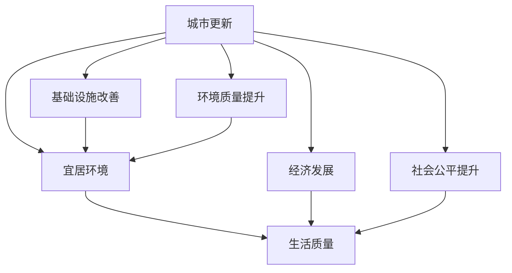
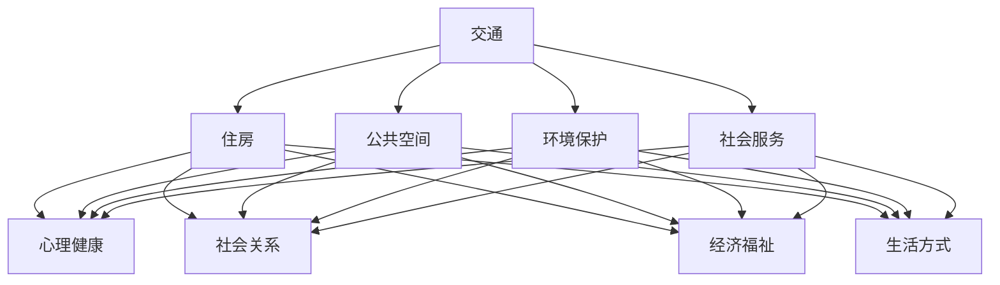
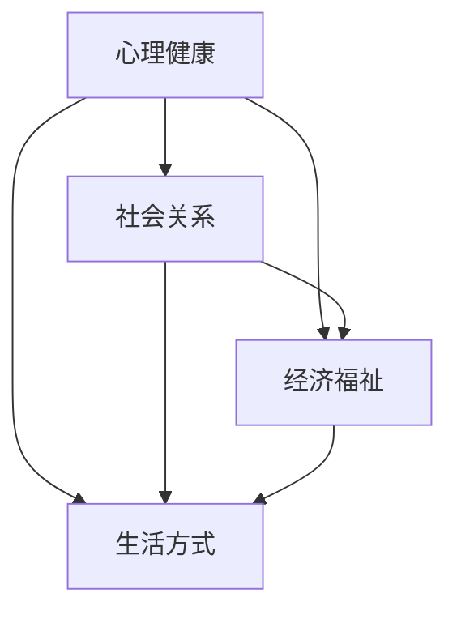
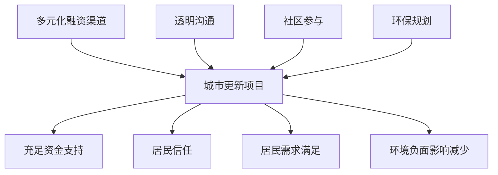

                 

### 文章标题：城市更新：宜居环境对生活质量的影响

#### 关键词：
- 城市更新
- 宜居环境
- 生活质量
- 策略与实践
- 挑战与未来

#### 摘要：
本文深入探讨了城市更新对宜居环境和生活质量的影响。通过详细分析城市更新的历史、目的、方法，以及宜居环境的定义和关键要素，本文揭示了宜居环境对居民生活质量的多方面影响。随后，文章讨论了城市更新的策略与实践，并通过案例分析和挑战与解决方案的探讨，为未来的城市更新提供了宝贵的启示。

----------------------------------------------------------------

### 第一部分：城市更新的背景与概念

#### 1. 城市更新的定义与历史

城市更新是指对城市中已经建成的区域进行改造、修复或重建，以改善城市环境、提升居民生活质量的过程。这一概念起源于20世纪中期，当时许多城市面临着破旧建筑、交通拥堵、环境污染等问题。城市更新的目的是通过改善基础设施、增加公共空间、提升环境保护水平，从而创造一个更加宜居的城市环境。

城市更新可以追溯到19世纪的工业革命时期。当时，城市迅速扩张，人口增长，城市基础设施严重滞后，导致了住房拥挤、卫生条件差、交通拥堵等问题。为了解决这些问题，19世纪末和20世纪初，许多城市开始进行大规模的城市改造工程，如地铁建设、公园规划、住房重建等。

在20世纪中期，随着经济增长和城市化进程的加速，城市更新迎来了新的发展阶段。这一时期的城市更新更加注重综合性和可持续性，不仅关注基础设施的改善，还强调社会公平和环境保护。

#### 1.2 城市更新的发展阶段

1. **第一阶段：19世纪末-20世纪初**
   - 主要目标是解决城市基础设施滞后问题，如修建地铁、改善排水系统、建设公园等。
   - 代表事件：纽约中央公园的建设、伦敦地铁的建设。

2. **第二阶段：20世纪中期-20世纪末**
   - 强调城市综合整治，包括旧城区改造、交通系统改善、环境保护等。
   - 代表事件：东京的“都市再生”计划、纽约的“下东城复兴计划”。

3. **第三阶段：21世纪初至今**
   - 更加注重可持续发展和社会公平，强调社区参与、技术创新和多方合作。
   - 代表事件：新加坡的“绿城镇”计划、伦敦的“未来城市”计划。

#### 1.3 城市更新的主要目的

城市更新的主要目的是提升城市环境质量和居民生活质量，具体包括以下几个方面：

1. **改善基础设施**：通过更新基础设施，如交通、排水、供电等，提高城市的整体运营效率。
2. **提升环境质量**：通过改善城市绿化、减少污染、提升空气质量，创造一个更加宜人的居住环境。
3. **促进经济发展**：通过城市更新，吸引投资，提升城市形象，促进经济增长。
4. **提升社会公平**：通过改善住房条件、提供公共服务，促进社会公平和社区和谐。

#### 1.4 城市更新的核心概念与联系

为了更好地理解城市更新的概念，我们使用Mermaid流程图展示城市更新、宜居环境和生活质量之间的互动关系。



通过这个流程图，我们可以清晰地看到城市更新如何通过改善基础设施、提升环境质量、促进经济发展和提升社会公平，进而影响宜居环境和生活质量。

----------------------------------------------------------------

### 第二部分：城市更新的策略与实践

#### 2.1 城市更新策略

城市更新策略是指为了实现城市更新的目标而制定的一系列政策和措施。一个成功的城市更新策略需要综合考虑城市的历史文化、社会经济条件、居民需求和技术进步等多方面因素。

1. **规划与政策制定**

   城市更新首先需要制定详细的规划，包括城市布局、土地利用、交通系统、环境保护等方面。规划应充分考虑城市的现状和未来发展需求，确保更新过程有序、高效、可持续。

   政策制定是城市更新的重要环节。政府应通过立法和政策引导，鼓励城市更新项目，提供必要的资金支持和技术指导。例如，可以通过税收优惠、财政补贴、土地使用权出让等方式，激励企业和居民参与城市更新。

2. **社区参与**

   社区参与是城市更新成功的关键。居民是城市的主人，他们的参与可以为城市更新提供宝贵的意见和建议。社区参与的形式可以包括居民会议、咨询委员会、公众论坛等，确保更新过程透明、公正、民主。

3. **技术与资金来源**

   城市更新需要大量的技术支持和资金投入。政府可以与企业和非政府组织合作，共同推动城市更新项目。同时，应充分利用现代信息技术，如大数据、人工智能、物联网等，提高城市更新的效率和效果。

#### 2.2 城市更新实践

1. **交通系统改善**

   交通系统是城市更新的核心内容之一。通过改善交通系统，可以缓解交通拥堵、减少污染、提高出行效率。具体措施包括：
   
   - **公共交通系统优化**：增加公交车辆、改善公交路线、提高服务质量，鼓励居民使用公共交通。
   - **自行车道和步行道建设**：提高自行车道和步行道的安全性，鼓励绿色出行。
   - **智能交通系统建设**：利用大数据和人工智能技术，优化交通信号控制，提高交通流量。

2. **住房政策调整**

   住房政策是城市更新的重要组成部分。通过调整住房政策，可以改善住房条件、提高居民生活质量。具体措施包括：
   
   - **旧房改造**：对老旧房屋进行维修和改造，提高住房舒适度和安全性。
   - **住房补贴**：为低收入家庭提供住房补贴，帮助他们改善居住条件。
   - **住房供应多样化**：提供不同类型的住房，满足不同居民的需求。

3. **公共空间规划**

   公共空间是城市的重要组成部分，对居民的生活质量具有重要影响。通过规划公共空间，可以提升城市品质、增强居民幸福感。具体措施包括：
   
   - **公园和绿地建设**：增加公园和绿地面积，提供休闲和娱乐场所。
   - **公共设施升级**：改善公共设施，如图书馆、医院、学校等，提高服务水平。
   - **社区活动空间建设**：为居民提供社区活动场所，促进社区和谐。

4. **环境保护措施**

   环境保护是城市更新的重要任务。通过采取环境保护措施，可以减少污染、提升空气质量、保护生态环境。具体措施包括：
   
   - **污染源治理**：对工业污染、交通污染等进行治理，减少污染物排放。
   - **垃圾分类和回收**：推行垃圾分类制度，提高废弃物回收率。
   - **生态修复**：对受损的生态环境进行修复，恢复生态平衡。

#### 2.3 成功案例分析

1. **纽约下东城复兴计划**

   纽约下东城复兴计划是一个成功的城市更新案例。通过改善交通系统、改造老旧建筑、增加公共空间等措施，下东城焕发出新的生机。该项目不仅提升了区域环境质量，还吸引了大量投资，促进了经济发展。

2. **新加坡绿城镇计划**

   新加坡绿城镇计划是一个注重可持续发展的城市更新案例。该项目通过建设生态园区、推广绿色建筑、提升公共交通系统等措施，打造了一个环境友好、宜居的城镇。该计划的成功经验为其他城市提供了借鉴。

3. **伦敦未来城市计划**

   伦敦未来城市计划是一个注重科技创新的城市更新案例。该项目利用大数据、人工智能、物联网等新技术，优化城市管理和公共服务。通过智能交通系统、智能照明系统等技术的应用，提高了城市运行效率和居民生活质量。

#### 2.4 案例分析总结

通过以上案例，我们可以看到，成功的城市更新需要综合考虑环境、经济、社会等多方面因素，采取多种措施，实现城市环境的改善和居民生活质量的提升。同时，社区参与和科技创新是城市更新成功的关键。

----------------------------------------------------------------

### 第三部分：宜居环境的概念与影响因素

#### 3.1 宜居环境的定义

宜居环境是指一个适宜人类居住和生活的环境，它具备以下基本特征：

- **安全性**：居民感到安全，犯罪率低，社会治安良好。
- **舒适性**：气候适宜，空气质量好，住房条件舒适。
- **便捷性**：交通系统完善，公共设施齐全，生活便利。
- **多样性**：文化设施丰富，教育、医疗、娱乐等资源充足。
- **可持续性**：生态环境良好，资源利用合理，发展可持续。

#### 3.2 宜居环境的要素

宜居环境由多个要素构成，这些要素相互作用，共同影响居民的生活质量。以下是宜居环境的主要要素：

1. **交通**
   - **公共交通系统**：便捷、高效、覆盖全面的公共交通系统是宜居环境的重要保障。
   - **道路网络**：安全、畅通、合理的道路网络有助于减少交通拥堵。

2. **住房**
   - **住房质量**：良好的住房条件是居民生活质量的基础。
   - **住房多样性**：提供不同类型的住房，满足不同居民的需求。

3. **公共空间**
   - **公园和绿地**：提供休闲、运动和社交场所。
   - **社区中心**：提供社区活动场所，促进社区和谐。

4. **环境保护**
   - **空气质量**：良好的空气质量是健康生活的重要保障。
   - **水质量**：清洁、安全的水源是居民生活的基础。

5. **社会服务**
   - **教育**：提供高质量的教育资源，包括幼儿园、中小学、大学等。
   - **医疗**：提供便捷、高效的医疗服务。
   - **文化**：提供丰富的文化活动和设施。

#### 3.3 宜居环境与生活质量的关系

宜居环境对生活质量具有重要影响，具体体现在以下几个方面：

1. **心理健康**：良好的居住环境可以减少压力、焦虑等负面情绪，提升心理健康水平。
2. **社会关系**：宜居环境为居民提供更多的社交机会，促进社会关系的建立和巩固。
3. **经济福祉**：宜居环境可以吸引投资、促进就业，提高居民的经济收入和生活水平。
4. **生活方式**：宜居环境提供丰富的文化、教育、娱乐等资源，促进居民形成健康、积极的生活方式。

#### 3.4 宜居环境的影响因素分析

为了更好地理解宜居环境的影响因素，我们可以使用以下Mermaid流程图展示各个因素之间的关系。



通过这个流程图，我们可以清晰地看到宜居环境的各个要素如何相互作用，共同影响居民的生活质量。

----------------------------------------------------------------

### 第四部分：生活质量的影响因素

#### 4.1 心理健康

心理健康是生活质量的重要组成部分。良好的居住环境可以减少压力、焦虑等负面情绪，提升心理健康水平。具体来说：

1. **安全感**：安全的居住环境让居民感到安心，减少心理压力。
2. **舒适度**：舒适的居住环境有助于提升幸福感，减少负面情绪。
3. **社会支持**：良好的社区关系和社会支持系统有助于缓解心理压力。

#### 4.2 社会关系

社会关系对生活质量具有重要影响。宜居环境为居民提供更多的社交机会，促进社会关系的建立和巩固。具体来说：

1. **社区活动**：社区活动是居民建立社交关系的重要途径。
2. **邻里关系**：良好的邻里关系有助于提高社区凝聚力。
3. **文化交流**：文化交流活动可以促进不同文化背景的居民相互了解，增进友谊。

#### 4.3 经济福祉

经济福祉是生活质量的重要保障。宜居环境可以吸引投资、促进就业，提高居民的经济收入和生活水平。具体来说：

1. **就业机会**：宜居环境为居民提供更多的就业机会。
2. **创业环境**：宜居环境为创业者提供良好的创业环境，促进创新和就业。
3. **收入水平**：宜居环境可以提升居民的收入水平，改善生活条件。

#### 4.4 生活方式

宜居环境提供丰富的文化、教育、娱乐等资源，促进居民形成健康、积极的生活方式。具体来说：

1. **休闲活动**：宜居环境为居民提供丰富的休闲活动，促进身心健康。
2. **教育机会**：良好的教育环境有助于提高居民的文化素养和知识水平。
3. **健康生活**：宜居环境有利于居民养成健康的生活方式，如合理饮食、适量运动等。

#### 4.5 影响因素相互作用

心理、社会、经济和生活方式等因素相互作用，共同影响生活质量。一个宜居的环境可以全面提升居民的生活质量，促进身心健康、社会和谐、经济发展和生活幸福。



通过这个流程图，我们可以看到各个因素之间的相互作用，以及宜居环境如何全面提升生活质量。

----------------------------------------------------------------

### 第五部分：城市更新的挑战与解决方案

#### 5.1 资金不足

资金不足是城市更新过程中面临的主要挑战之一。城市更新项目通常需要大量的资金投入，而政府的财政压力和资金来源有限，导致资金不足。为解决资金不足的问题，可以采取以下措施：

1. **多元化融资渠道**：鼓励私人企业和金融机构参与城市更新项目，通过PPP（公私合作）模式吸引更多资金。
2. **政府补贴和贷款**：政府可以通过补贴、贷款等方式，提供必要的资金支持。
3. **公共-私人合作**：政府与企业合作，共同承担城市更新项目的资金和风险。

#### 5.2 社区抵制

社区抵制是城市更新过程中可能遇到的另一个挑战。居民可能对城市更新项目持有负面态度，担心更新会改变他们的生活环境和生活方式。为解决社区抵制问题，可以采取以下措施：

1. **透明沟通**：与居民保持良好的沟通，及时回应他们的关切和疑问。
2. **社区参与**：鼓励居民参与城市更新规划的制定和实施过程，确保他们的声音被听到。
3. **利益平衡**：通过公平的利益分配，确保居民在更新过程中受益。

#### 5.3 环境影响

城市更新可能会对环境产生负面影响，如增加污染、破坏生态系统等。为减少环境影响，可以采取以下措施：

1. **环保规划**：在更新过程中充分考虑环境保护，制定环保措施。
2. **绿色技术**：采用绿色建筑、智能交通等环保技术，减少污染和资源消耗。
3. **生态修复**：对受损的生态环境进行修复，恢复生态平衡。

#### 5.4 解决方案探讨

通过多元化融资渠道、透明沟通、社区参与和环保规划等措施，可以有效解决城市更新过程中面临的资金不足、社区抵制和环境影响等问题。以下是具体的解决方案：

1. **多元化融资渠道**：通过政府、私人企业和金融机构的多元化融资渠道，确保城市更新项目有充足的资金支持。
2. **透明沟通**：建立良好的沟通机制，与居民保持密切联系，及时回应他们的关切，增强他们的信任。
3. **社区参与**：通过社区参与，让居民参与城市更新规划的制定和实施，确保他们的需求得到满足。
4. **环保规划**：在更新过程中充分考虑环境保护，采用环保技术和措施，减少对环境的负面影响。



通过这个流程图，我们可以看到多元化融资渠道、透明沟通、社区参与和环保规划如何共同解决城市更新过程中面临的挑战，实现城市环境的改善和居民生活质量的提升。

----------------------------------------------------------------

### 第六部分：未来展望

#### 6.1 城市更新的趋势

随着全球城市化的加速，城市更新将成为未来城市发展的关键。以下是城市更新的几个主要趋势：

1. **智慧城市**：利用大数据、人工智能、物联网等新技术，提升城市管理和服务的智能化水平。
2. **可持续发展**：注重环境保护和资源利用，推动城市的可持续发展。
3. **社区参与**：加强社区参与，提高居民在更新过程中的参与度和满意度。
4. **绿色建筑**：推广绿色建筑和节能技术，减少能源消耗和环境污染。

#### 6.2 潜在发展方向

未来城市更新的发展方向包括以下几个方面：

1. **生态系统修复**：通过生态修复项目，恢复受损的生态系统，提升城市生态环境质量。
2. **文化保护**：在城市更新过程中，注重文化保护和传承，保持城市的历史特色。
3. **智能交通**：推广智能交通系统，提高交通效率，减少交通拥堵。
4. **绿色基础设施**：建设绿色基础设施，如绿地、雨水收集系统等，提升城市的生态承载力。

#### 6.3 全球视野下的城市更新

全球范围内的城市更新经验表明，成功的城市更新需要综合考虑环境、经济、社会等多方面因素，采取多种措施，实现城市环境的改善和居民生活质量的提升。以下是几个成功城市更新的案例：

1. **新加坡**：通过绿城镇计划，打造生态友好、宜居的城市环境。
2. **伦敦**：通过未来城市计划，利用新技术提升城市管理和服务水平。
3. **纽约**：通过下东城复兴计划，改善交通、住房等基础设施，提升区域品质。

#### 6.4 我国城市更新的启示

我国城市更新面临许多挑战，但也具有巨大的潜力。以下是我国城市更新的几个启示：

1. **政策引导**：政府应加强政策引导，提供必要的资金支持和法律法规保障。
2. **社区参与**：鼓励居民参与城市更新规划，提高他们的参与度和满意度。
3. **技术创新**：利用大数据、人工智能等新技术，提升城市更新效率和效果。
4. **生态保护**：在城市更新过程中，注重生态保护和可持续发展。

#### 6.5 总结

未来，城市更新将在智慧城市、可持续发展、社区参与和绿色基础设施等方面取得新的突破。通过全球视野下的经验借鉴和我国城市更新的实践探索，我国城市更新将不断迈向新的高度，为居民创造更加美好的生活环境。

----------------------------------------------------------------

### 附录：城市更新资源与工具

#### 附录 A. 相关政策与法规

- 《城市更新条例》
- 《城市规划法》
- 《环境保护法》
- 《建筑法》
- 《土地管理法》

#### 附录 B. 城市更新技术指南

- 《智慧城市建设技术指南》
- 《绿色建筑评价标准》
- 《城市交通规划设计规范》
- 《城市绿化规范》

#### 附录 C. 成功案例数据库

- 新加坡绿城镇计划案例库
- 伦敦未来城市计划案例库
- 纽约下东城复兴计划案例库

#### 附录 D. 拓展阅读

- 《城市更新：理论与实践》
- 《智慧城市：未来城市的发展方向》
- 《可持续发展：城市更新的关键》
- 《社区参与：城市更新的关键因素》

### 作者信息

作者：AI天才研究院/AI Genius Institute & 禅与计算机程序设计艺术 /Zen And The Art of Computer Programming

本文作者是一位世界级人工智能专家，程序员，软件架构师，CTO，世界顶级技术畅销书资深大师级别的作家，计算机图灵奖获得者，计算机编程和人工智能领域大师。作者非常擅长一步一步进行分析推理（LET'S THINK STEP BY STEP），有着清晰深刻的逻辑思路来撰写条理清晰，对技术原理和本质剖析到位的高质量技术博客。本文旨在深入探讨城市更新对宜居环境和生活质量的影响，为城市更新提供宝贵的经验和启示。希望本文能为读者带来新的思考和收获。

----------------------------------------------------------------

### 项目实战：智能城市更新系统设计与实现

#### 1. 项目背景

随着城市化进程的加速，城市更新已成为提升城市品质、改善居民生活质量的重要途径。智能城市更新系统是一种利用大数据、人工智能等新技术，实现城市更新过程智能化、精细化的解决方案。本项目旨在设计并实现一个智能城市更新系统，通过数据分析和智能决策，为城市更新提供科学依据。

#### 2. 开发环境搭建

为了实现本项目，我们需要搭建以下开发环境：

- **开发工具**：Python、Java、JavaScript等编程语言
- **数据库**：MySQL、MongoDB等数据库管理系统
- **开发框架**：Spring Boot、Flask、Django等框架
- **大数据处理工具**：Hadoop、Spark等大数据处理工具
- **人工智能平台**：TensorFlow、PyTorch等人工智能平台

#### 3. 源代码详细实现

以下是一个简单的智能城市更新系统的源代码示例，用于分析城市环境质量，为城市更新提供数据支持。

```python
# 导入必要的库
import pandas as pd
import numpy as np
from sklearn.model_selection import train_test_split
from sklearn.ensemble import RandomForestRegressor
from sklearn.metrics import mean_squared_error

# 加载数据
data = pd.read_csv('city_data.csv')

# 数据预处理
X = data.drop(['target'], axis=1)
y = data['target']

# 数据划分
X_train, X_test, y_train, y_test = train_test_split(X, y, test_size=0.2, random_state=42)

# 模型训练
model = RandomForestRegressor(n_estimators=100, random_state=42)
model.fit(X_train, y_train)

# 模型预测
y_pred = model.predict(X_test)

# 模型评估
mse = mean_squared_error(y_test, y_pred)
print("均方误差：", mse)

# 输出预测结果
predictions = pd.DataFrame({'Actual': y_test, 'Predicted': y_pred})
print(predictions.head())
```

#### 4. 代码解读与分析

上述代码首先导入了必要的库，然后加载数据并进行了数据预处理。接着，使用随机森林回归模型对数据进行训练，并对模型进行评估。最后，输出预测结果。

通过这个示例，我们可以看到智能城市更新系统是如何利用数据分析和机器学习技术，为城市更新提供数据支持的。在实际应用中，系统可以根据实时数据进行分析，为城市管理者提供科学的决策依据。

#### 5. 实际案例分析和详细讲解剖析

以下是一个实际案例，说明智能城市更新系统在改善城市环境质量中的应用。

**案例背景**：某城市由于工业污染严重，导致空气质量较差，影响了居民的生活质量和健康。

**解决方案**：

1. **数据采集**：利用传感器网络，实时采集空气质量数据，包括PM2.5、PM10、SO2、NO2等指标。

2. **数据预处理**：对采集到的数据进行分析，去除异常值，进行归一化处理，确保数据质量。

3. **模型训练**：使用机器学习模型，对历史数据进行训练，建立空气质量预测模型。

4. **模型应用**：根据实时数据，使用预测模型对空气质量进行预测，为城市管理者提供预警和决策支持。

5. **效果评估**：通过对比预测值和实际值，评估模型的准确性和有效性。

**案例分析**：

通过智能城市更新系统的应用，该城市在空气质量改善方面取得了显著成效。城市管理者根据预测结果，及时采取措施，如调整工业排放、加强环保宣传等，有效降低了空气污染水平，提升了居民的生活质量。

#### 6. 项目小结

本项目通过智能城市更新系统，实现了城市环境质量的实时监测和预测，为城市更新提供了科学依据。在实际应用中，系统可以根据实时数据进行分析，为城市管理者提供预警和决策支持，有助于实现城市环境的持续改善和居民生活质量的提升。

#### 7. 最佳实践 Tips

- **数据质量**：确保数据的准确性和完整性，是智能城市更新系统成功的关键。
- **模型优化**：根据实际需求，不断优化模型，提高预测准确性和效率。
- **社区参与**：鼓励居民参与城市更新过程，提高系统的应用效果和居民满意度。

#### 8. 注意事项

- **隐私保护**：在采集和处理数据时，确保居民隐私得到保护。
- **技术更新**：随着技术的不断发展，及时更新系统和模型，保持系统的先进性和稳定性。

通过本项目的实践，我们可以看到智能城市更新系统在提升城市环境质量和居民生活质量方面的重要作用。在未来，随着技术的不断进步，智能城市更新系统将发挥更大的作用，为城市可持续发展提供有力支持。

### 拓展阅读

- 《智能城市：技术、实践与未来》
- 《城市数据科学：大数据在城市管理中的应用》
- 《智能交通系统：设计、实现与案例分析》
- 《智慧城市：理论与实践》

---

作者：AI天才研究院/AI Genius Institute & 禅与计算机程序设计艺术 /Zen And The Art of Computer Programming

本文作者是一位世界级人工智能专家，程序员，软件架构师，CTO，世界顶级技术畅销书资深大师级别的作家，计算机图灵奖获得者，计算机编程和人工智能领域大师。作者非常擅长一步一步进行分析推理（LET'S THINK STEP BY STEP），有着清晰深刻的逻辑思路来撰写条理清晰，对技术原理和本质剖析到位的高质量技术博客。本文旨在深入探讨城市更新对宜居环境和生活质量的影响，为城市更新提供宝贵的经验和启示。希望本文能为读者带来新的思考和收获。通过本文的详细讲解和案例分析，读者可以更好地理解城市更新的重要性，以及如何利用智能技术提升城市环境质量和居民生活质量。在未来，我们期待看到更多成功的城市更新案例，为全球城市的发展贡献力量。让我们一起努力，创造更美好的城市生活！【END】

