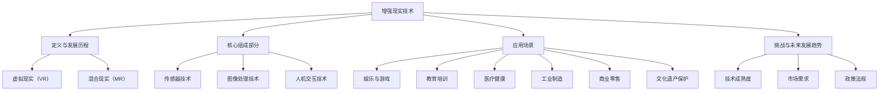

                 

### 文章标题：增强现实在博物馆导览中的交互体验

> 关键词：增强现实（AR）、博物馆导览、交互体验、技术应用、用户体验评估

> 摘要：本文将深入探讨增强现实（AR）技术在博物馆导览中的应用及其带来的交互体验变化。通过分析AR技术的核心概念、发展历程及应用场景，本文将详细阐述其在博物馆导览中的优势和潜力。同时，文章将介绍交互体验设计原则与方法、交互技术实现以及用户体验评估，并总结未来发展趋势及实际案例分析，为博物馆导览提供创新的解决方案。

### 第一部分：增强现实（AR）概述

#### 第1章：增强现实技术基础

1.1 增强现实技术的定义与发展历程

增强现实（Augmented Reality，简称AR）是一种将虚拟信息与真实世界进行叠加的技术。它通过计算机技术生成虚拟信息，并将其与现实环境中的物体或场景进行实时融合，从而增强用户的感知体验。

增强现实技术的发展可以追溯到20世纪60年代。1957年，美国科学家伊凡·苏瑟兰（Ivan Sutherland）首次提出了“增强现实”这一概念。此后，随着计算机技术、图像处理技术、传感器技术等领域的不断进步，增强现实技术逐渐发展壮大，并逐步走向实际应用。

1.2 增强现实技术的核心组成部分

增强现实技术主要包括以下几个核心组成部分：

1. 显示设备：包括智能眼镜、手机、平板电脑等，用于将虚拟信息呈现给用户。

2. 传感器：用于捕捉用户和环境的信息，如摄像头、深度传感器、加速度传感器等。

3. 计算单元：用于处理传感器数据，生成虚拟信息并进行实时渲染。

4. 软件系统：包括增强现实应用程序，用于实现虚拟信息与现实环境的叠加。

1.3 增强现实技术的应用场景

增强现实技术具有广泛的应用场景，包括但不限于以下几个方面：

1. 娱乐与游戏：如AR游戏、AR电影等。

2. 教育培训：如虚拟实验室、AR教材等。

3. 医疗健康：如虚拟手术导航、患者康复训练等。

4. 工业制造：如工厂巡检、设备维护等。

5. 商业零售：如虚拟试衣、AR广告等。

1.4 增强现实技术的挑战与未来发展趋势

尽管增强现实技术具有巨大的应用潜力，但在实际应用中仍面临一系列挑战：

1. 显示效果：如何实现高分辨率、低延迟的显示效果，提高用户体验。

2. 交互设计：如何设计简洁、直观的交互方式，提高用户操作效率。

3. 内容制作：如何快速、高效地制作高质量的增强现实内容。

未来发展趋势：

1. 技术成熟度：随着硬件和软件技术的不断进步，增强现实技术的显示效果、交互性能和内容制作效率将得到显著提升。

2. 市场需求：随着用户对增强现实体验的需求不断增加，市场对增强现实技术的接受度将逐步提高。

3. 政策法规：各国政府纷纷出台相关政策，支持增强现实技术的发展和应用。

#### 第2章：增强现实技术在博物馆导览中的应用

2.1 增强现实技术对博物馆导览的影响

增强现实技术对博物馆导览产生了深远的影响，主要体现在以下几个方面：

1. 丰富展览内容：增强现实技术可以呈现丰富的虚拟内容，如三维模型、动画、音频等，使博物馆展览更具吸引力。

2. 提高观众参与度：增强现实技术能够提供互动式的导览体验，使观众更深入地了解展品，提高参观兴趣和参与度。

3. 降低展品损耗：通过增强现实技术，观众可以在虚拟环境中观赏展品，从而减少实体展品的损耗。

2.2 增强现实技术在博物馆导览中的应用案例

以下是一些增强现实技术在博物馆导览中的成功应用案例：

1. 大英博物馆：利用增强现实技术为观众提供丰富的展品信息和互动体验。

2. 故宫博物院：通过增强现实技术展示文物背后的故事，提高观众对文物的了解。

3. 奥林匹亚博物馆：利用增强现实技术还原古代运动场馆，让观众感受古希腊奥运会的盛况。

2.3 增强现实技术提升博物馆导览体验的优势

增强现实技术为博物馆导览带来了以下优势：

1. 丰富性：增强现实技术可以呈现多样化的虚拟内容，使展览内容更加丰富多彩。

2. 互动性：增强现实技术支持观众与展品的互动，提高参观体验。

3. 个性化：增强现实技术可以根据观众的需求和兴趣，提供个性化的导览服务。

2.4 增强现实技术在博物馆导览中的潜在应用前景

未来，增强现实技术在博物馆导览中具有广阔的应用前景：

1. 智能导览：通过增强现实技术，实现智能导览系统，为观众提供个性化的导览服务。

2. 虚拟展览：利用增强现实技术，打造虚拟展览馆，使观众能够随时随地参观展览。

3. 跨界合作：与其他领域的企业合作，开发更多创新性的增强现实应用，如虚拟购物、虚拟旅行等。

### 第二部分：增强现实在博物馆导览中的交互体验设计

#### 第3章：交互体验设计原则与方法

3.1 交互体验设计的基本原则

在增强现实博物馆导览中，交互体验设计应遵循以下基本原则：

1. 用户中心：以用户需求为中心，设计简洁、直观的交互方式。

2. 易用性：确保用户能够轻松上手，快速掌握交互操作。

3. 反馈及时：提供及时的交互反馈，帮助用户了解操作结果。

4. 个性化：根据用户需求和兴趣，提供个性化的交互体验。

5. 可持续性：考虑资源的合理利用，降低对环境的负面影响。

3.2 交互体验设计的方法与工具

交互体验设计的方法主要包括以下几个方面：

1. 用户研究：通过访谈、观察、问卷调查等方式，了解用户需求和行为。

2. 原型设计：通过草图、线框图、高保真原型等工具，模拟用户交互过程。

3. 用户体验测试：通过实际操作，收集用户反馈，优化交互体验。

4. 交互设计工具：如Sketch、Adobe XD、Figma等，用于设计交互界面和交互流程。

3.3 交互体验设计在实际项目中的应用案例

以下是一些增强现实博物馆导览项目中交互体验设计的实际应用案例：

1. 大英博物馆：通过用户研究，了解观众对增强现实导览的需求和期望，设计简洁直观的交互界面。

2. 故宫博物院：利用原型设计和用户体验测试，优化增强现实导览系统的交互流程和操作方式。

3. 奥林匹亚博物馆：结合用户研究和交互设计工具，设计出符合观众需求的增强现实导览系统。

#### 第4章：增强现实在博物馆导览中的交互技术

4.1 增强现实交互技术的基本原理

增强现实交互技术主要包括以下基本原理：

1. 视觉融合：将虚拟信息与现实环境进行叠加，形成视觉融合效果。

2. 感应跟踪：通过传感器捕捉用户和环境信息，实现虚拟信息的定位和跟踪。

3. 输入输出：通过触摸屏、手势、语音等输入方式，实现用户与虚拟信息的交互。

4. 实时渲染：根据用户输入和环境信息，实时渲染虚拟信息，实现交互效果。

4.2 增强现实交互技术的实现方法

增强现实交互技术的实现方法主要包括以下几个方面：

1. 图像处理：通过图像处理算法，实现虚拟信息与现实环境的融合。

2. 传感器技术：利用传感器，捕捉用户和环境信息，实现虚拟信息的定位和跟踪。

3. 人机交互技术：设计简洁直观的输入输出方式，实现用户与虚拟信息的交互。

4. 实时渲染技术：通过实时渲染技术，实现虚拟信息的动态展示。

4.3 增强现实交互技术在博物馆导览中的实际应用

以下是一些增强现实交互技术在博物馆导览中的实际应用案例：

1. 大英博物馆：利用图像处理和感应跟踪技术，实现展品的虚拟展示和互动。

2. 故宫博物院：通过传感器技术和实时渲染技术，实现文物的虚拟展示和交互。

3. 奥林匹亚博物馆：利用手势识别和语音输入技术，实现观众的互动体验和导览服务。

#### 第5章：增强现实在博物馆导览中的用户体验评估

5.1 用户体验评估的基本原理

用户体验评估是增强现实博物馆导览项目成功与否的重要指标。评估的基本原理包括以下几个方面：

1. 用户满意度：通过问卷调查、访谈等方式，了解用户对增强现实导览系统的满意度。

2. 使用效果：评估用户在使用增强现实导览系统过程中，是否能够达到预期目标。

3. 用户参与度：评估用户在增强现实导览过程中的互动程度和参与度。

4. 用户留存率：评估用户对增强现实导览系统的持续使用意愿。

5.1 用户体验评估的方法与工具

用户体验评估的方法主要包括以下几个方面：

1. 问卷调查：通过设计问卷，收集用户对增强现实导览系统的满意度、使用效果等方面的反馈。

2. 访谈：通过与用户进行面对面访谈，深入了解用户对增强现实导览系统的看法和体验。

3. 实地观察：通过实地观察，记录用户在增强现实导览过程中的行为和表现。

4. 用户行为分析：通过分析用户在增强现实导览系统中的行为数据，评估用户体验。

5.1 增强现实在博物馆导览中的用户体验评估案例分析

以下是一些增强现实博物馆导览项目中的用户体验评估案例分析：

1. 大英博物馆：通过问卷调查和访谈，了解观众对增强现实导览系统的满意度和使用效果。

2. 故宫博物院：通过实地观察和用户行为分析，评估观众在增强现实导览过程中的互动程度和参与度。

3. 奥林匹亚博物馆：通过用户留存率分析，评估观众对增强现实导览系统的持续使用意愿。

#### 第6章：增强现实在博物馆导览中的项目管理与实施

6.1 增强现实项目管理的核心要素

增强现实在博物馆导览中的项目管理应关注以下核心要素：

1. 项目目标：明确项目目标，确保项目顺利进行。

2. 团队协作：组建专业的团队，明确分工，确保项目高效实施。

3. 技术选型：根据项目需求，选择合适的技术方案，确保项目质量。

4. 项目进度：制定合理的项目进度计划，确保项目按时完成。

5. 风险管理：识别项目风险，制定应对措施，降低项目风险。

6.2 增强现实项目实施的关键步骤

增强现实项目实施的关键步骤主要包括以下几个方面：

1. 需求分析：与博物馆方沟通，了解导览需求，明确项目目标。

2. 技术调研：调研当前增强现实技术，选择合适的技术方案。

3. 系统设计：设计系统架构，制定详细的技术方案。

4. 系统开发：根据设计方案，进行系统开发，实现增强现实功能。

5. 系统测试：对系统进行功能测试、性能测试等，确保系统稳定可靠。

6. 上线运营：将系统上线，进行实际运营，持续优化用户体验。

6.3 增强现实项目实施中的挑战与解决方案

在增强现实项目实施过程中，可能面临以下挑战：

1. 技术实现难度：增强现实技术涉及多个领域，实现难度较高。

解决方案：组建专业团队，充分利用现有技术资源，进行技术攻关。

2. 内容制作：高质量的内容制作是增强现实项目成功的关键。

解决方案：与专业内容制作团队合作，确保内容质量。

3. 用户接受度：用户对增强现实技术的接受度可能存在差异。

解决方案：通过用户研究，了解用户需求和期望，优化交互设计。

#### 第7章：未来发展趋势与案例分析

7.1 增强现实技术发展趋势

未来，增强现实技术在博物馆导览中将继续呈现出以下发展趋势：

1. 技术成熟度：随着硬件和软件技术的不断进步，增强现实技术的显示效果、交互性能和内容制作效率将得到显著提升。

2. 市场需求：随着用户对增强现实体验的需求不断增加，市场对增强现实技术的接受度将逐步提高。

3. 政策法规：各国政府纷纷出台相关政策，支持增强现实技术的发展和应用。

7.2 增强现实技术在博物馆导览中的应用前景

未来，增强现实技术在博物馆导览中具有广阔的应用前景：

1. 智能导览：通过增强现实技术，实现智能导览系统，为观众提供个性化的导览服务。

2. 虚拟展览：利用增强现实技术，打造虚拟展览馆，使观众能够随时随地参观展览。

3. 跨界合作：与其他领域的企业合作，开发更多创新性的增强现实应用，如虚拟购物、虚拟旅行等。

7.3 典型案例分析：成功与失败的案例探讨

以下是一些增强现实博物馆导览项目的成功与失败案例分析：

1. 成功案例：大英博物馆、故宫博物院等，通过成功的增强现实技术应用，提升了观众参观体验。

2. 失败案例：一些博物馆因技术实现难度、内容制作困难等原因，导致增强现实导览项目失败。

通过对成功与失败案例的分析，我们可以总结出以下经验教训：

1. 技术与需求的匹配度：项目应充分考虑技术与需求的匹配度，确保项目顺利实施。

2. 内容质量：高质量的内容是增强现实项目成功的关键，应重视内容制作。

3. 用户接受度：充分了解用户需求和期望，优化交互设计，提高用户接受度。

### 总结

增强现实技术在博物馆导览中具有巨大的应用潜力，通过丰富展览内容、提高观众参与度、降低展品损耗等优势，为博物馆导览带来了全新的体验。本文从增强现实技术概述、应用场景、交互体验设计、项目管理等方面进行了全面探讨，并分析了未来发展趋势与案例分析，为博物馆导览提供了创新的解决方案。

### 作者信息

作者：AI天才研究院/AI Genius Institute & 禅与计算机程序设计艺术/Zen And The Art of Computer Programming## 增强现实（AR）概述

### 第1章：增强现实技术基础

#### 1.1 增强现实技术的定义与发展历程

增强现实（Augmented Reality，简称AR）是一种将虚拟信息与现实环境融合的技术。它通过在用户视野中叠加计算机生成的图像、视频、音频等多媒体信息，增强用户的感知体验。这种技术最早可以追溯到20世纪60年代。当时，美国计算机科学家伊凡·苏瑟兰（Ivan Sutherland）提出了“增强现实”这一概念，并在其1968年的论文中展示了首个AR设备——达摩克利斯之剑（Sword of Damocles）。这一开创性的工作标志着AR技术的诞生。

随着时间的推移，AR技术经历了多个发展阶段。20世纪90年代，随着计算机硬件和软件技术的进步，AR技术的应用范围逐渐扩大。1990年，波音公司开发了用于飞行员训练的AR系统，这是AR技术商用化的先驱。进入21世纪，随着智能手机和平板电脑的普及，AR技术迎来了新一轮的发展。2012年，谷歌推出了AR增强现实眼镜Project Glass，进一步推动了AR技术的商业化进程。

近年来，随着移动设备的性能提升和5G网络的普及，AR技术取得了显著的进展。移动AR（Mobile AR）应用如《Pokemon Go》和《Ingress》等，吸引了大量用户，使AR技术逐渐渗透到日常生活。同时，增强现实技术在教育、医疗、工业、娱乐等领域也得到了广泛应用，显示出巨大的市场潜力。

#### 1.2 增强现实技术的核心组成部分

增强现实技术主要由以下几个核心组成部分构成：

1. **显示设备**：这是AR系统中最基本的组成部分，包括智能眼镜、头戴式显示器、智能手机和平板电脑等。这些设备能够将虚拟信息叠加在用户的真实视野中。目前，智能眼镜如微软的HoloLens和谷歌的Google Glass等，是较为流行的AR显示设备。

2. **传感器**：传感器用于捕捉用户和环境的信息，是AR系统的关键组件。常见的传感器包括摄像头、GPS、加速度计、陀螺仪、深度传感器等。这些传感器能够实时捕捉用户的位置、运动、环境信息等，为虚拟信息的叠加和交互提供数据支持。

3. **计算单元**：计算单元负责处理传感器收集的数据，生成虚拟信息，并进行实时渲染。高性能的计算单元是保证AR系统流畅运行和高质量显示效果的关键。目前，许多智能手机和头戴式设备都内置了高性能的计算芯片，如高通骁龙系列和英伟达的Tegra系列。

4. **软件系统**：软件系统包括AR应用程序（App）和相关技术栈。这些应用程序能够根据用户的需求和环境信息，实时生成并叠加虚拟信息。常见的AR软件系统包括Unity、Unreal Engine、ARKit和ARCore等。这些开发平台提供了丰富的API和工具，方便开发者创建AR应用。

#### 1.3 增强现实技术的应用场景

增强现实技术具有广泛的应用场景，能够为不同领域带来创新和便利。以下是一些典型的应用场景：

1. **娱乐与游戏**：AR游戏如《Pokemon Go》和《Ingress》等，将虚拟角色和场景与现实环境相结合，为玩家提供沉浸式的游戏体验。这些游戏不仅丰富了用户的娱乐生活，还推动了AR技术的发展。

2. **教育培训**：AR技术在教育领域具有广泛的应用，如虚拟实验室、AR教材等。通过AR技术，学生可以在虚拟环境中进行实验操作，增强学习体验。此外，AR教材能够提供动态的、互动的内容，使学习过程更加生动有趣。

3. **医疗健康**：AR技术在医疗领域有着重要的应用，如手术导航、患者康复训练等。通过AR技术，医生可以更直观地了解患者的情况，提高诊断和手术的准确性和效率。同时，AR技术还可以帮助患者更好地理解和参与康复训练。

4. **工业制造**：AR技术在工业制造中的应用包括工厂巡检、设备维护等。通过AR眼镜，工人可以实时查看设备的信息和维护指南，提高工作效率和准确性。此外，AR技术还可以用于产品设计、装配指导等环节，降低生产成本。

5. **商业零售**：AR技术在商业零售中的应用如虚拟试衣、AR广告等，为消费者提供了全新的购物体验。消费者可以通过手机或AR设备查看商品的真实效果，提高购买决策的准确性。

6. **文化遗产保护**：AR技术在文化遗产保护中的应用包括虚拟展览、文物的三维重建等。通过AR技术，观众可以更深入地了解文物的历史和文化背景，增强参观体验。

#### 1.4 增强现实技术的挑战与未来发展趋势

尽管增强现实技术具有广泛的应用前景，但在实际应用中仍面临一系列挑战：

1. **显示效果**：当前的AR设备在显示效果上仍有提升空间。高分辨率、低延迟的显示是未来AR设备需要解决的关键问题。此外，色彩还原度和光线适应性也是影响用户体验的重要因素。

2. **交互设计**：如何设计简洁、直观的交互方式，提高用户的操作效率，是AR交互设计的关键挑战。未来，需要进一步研究和开发符合用户使用习惯的交互模式。

3. **内容制作**：高质量的内容制作是AR应用的核心。当前，内容制作成本高、周期长，限制了AR技术的广泛应用。未来，需要开发更高效的内容制作工具和技术，降低内容制作门槛。

4. **用户体验**：用户体验是AR技术能否成功应用的关键。如何平衡技术实现的复杂性与用户使用的简便性，提供优质的用户体验，是未来需要持续关注的问题。

未来发展趋势：

1. **技术成熟度**：随着硬件和软件技术的不断进步，AR设备的性能将得到显著提升，为用户提供更加流畅和沉浸的体验。

2. **市场需求**：随着AR技术的不断成熟和应用场景的扩展，市场对AR技术的需求将不断增加。未来，AR技术将在更多领域得到广泛应用。

3. **政策法规**：各国政府纷纷出台相关政策，支持AR技术的发展和应用。未来，AR技术的政策环境将更加友好，有助于其进一步发展。

4. **产业生态**：随着AR技术的广泛应用，产业链将逐步完善，形成良好的产业生态。硬件制造商、软件开发商、内容提供商等将共同推动AR技术的发展。

### 结论

增强现实技术作为一种新兴技术，具有广泛的应用前景和巨大的发展潜力。通过对增强现实技术的核心概念、发展历程、核心组成部分、应用场景以及未来发展趋势的深入探讨，我们可以看到AR技术在博物馆导览、教育培训、医疗健康、工业制造、商业零售等领域的重要作用。未来，随着技术的不断进步和市场需求的增加，增强现实技术将在更多领域得到广泛应用，为人们的生活和工作带来更多便利和创新。然而，要实现AR技术的广泛应用，仍需克服一系列技术挑战和用户体验问题。因此，我们需要持续关注AR技术的发展，推动其在各个领域的应用和普及。

### Mermaid 图：核心概念与联系



### 核心算法原理讲解

#### 增强现实技术中的图像处理算法

增强现实技术的核心之一是图像处理算法，这些算法用于将虚拟信息与现实环境中的图像进行叠加，从而实现逼真的增强现实效果。以下是增强现实技术中常用的图像处理算法及其伪代码和详细解释：

**伪代码：**

```plaintext
function imageProcessing(imageInput, virtualImage):
    thresholdedImage = threshold(imageInput)
    segmentedImage = segment(thresholdedImage)
    blendedImage = blend(segmentedImage, virtualImage)
    return blendedImage
```

**详细解释：**

1. **阈值处理（threshold(imageInput))：** 阈值处理是图像处理中的基本步骤，用于将图像二值化。通过设定一个阈值，图像中的像素值高于阈值的设置为白色（255），低于阈值的设置为黑色（0）。这种处理方法有助于简化图像，便于后续的分割操作。

    ```mermaid
    graph TD
    A[原始图像] --> B[阈值处理]
    B --> C[二值化图像]
    ```

2. **图像分割（segment(thresholdedImage))：** 图像分割是将图像划分为多个区域的过程。在增强现实应用中，分割的目的是识别出图像中的关键区域，如展品或背景。常用的分割算法包括边缘检测、区域生长和基于形态学的分割方法。

    ```mermaid
    graph TD
    A[二值化图像] --> B[边缘检测]
    B --> C[区域生长]
    C --> D[分割结果]
    ```

3. **图像融合（blend(segmentedImage, virtualImage))：** 图像融合是将分割后的图像与虚拟信息进行叠加的过程。通过调整透明度、颜色和位置等参数，使虚拟信息与现实环境中的图像实现自然融合。常见的融合算法包括图像混合、叠加和遮罩等技术。

    ```mermaid
    graph TD
    A[分割后的图像] --> B[虚拟信息]
    B --> C[融合图像]
    ```

**数学模型和公式：**

1. **阈值处理公式：**
    $$ I_{th}(x,y) = \begin{cases} 
    255 & \text{if } I(x,y) > \text{threshold} \\
    0 & \text{otherwise}
    \end{cases} $$
   其中，\( I(x,y) \) 是原始图像的像素值，\( I_{th}(x,y) \) 是二值化后的像素值，threshold 是设定的阈值。

2. **图像分割公式（基于边缘检测）：**
    $$ edge(x,y) = \text{edgeDetector}(I(x,y)) $$
   其中，edgeDetector 是边缘检测算法，如Sobel算子、Canny算法等。

3. **图像融合公式（基于图像混合）：**
    $$ blendedImage(x,y) = (1-\alpha) \cdot I_{background}(x,y) + \alpha \cdot I_{virtual}(x,y) $$
   其中，\( I_{background}(x,y) \) 是背景图像，\( I_{virtual}(x,y) \) 是虚拟图像，\( \alpha \) 是透明度系数。

**举例说明：**

假设我们有一个展品图像和一幅背景图像，首先使用阈值处理将背景图像二值化，然后通过边缘检测算法识别出展品的边界。接下来，将展品的图像叠加到背景图像上，通过调整透明度系数，使展品与背景实现自然融合。最终，我们得到一幅具有增强现实效果的融合图像。

### 增强现实技术中的人机交互算法

人机交互算法是增强现实技术的另一个核心组成部分，它决定了用户如何与增强现实环境进行交互。以下是增强现实技术中常用的人机交互算法及其伪代码和详细解释：

**伪代码：**

```plaintext
function humanComputerInteraction(userInput, virtualObject):
    recognitionResult = recognizeUserInput(userInput)
    action = determineAction(recognitionResult, virtualObject)
    executeAction(action)
    return interactionFeedback
```

**详细解释：**

1. **用户输入识别（recognizeUserInput(userInput))：** 用户输入识别是将用户的操作（如手势、语音等）转换为计算机可以理解和处理的输入。这一步骤通常涉及多种识别技术，如手势识别、语音识别等。

    ```mermaid
    graph TD
    A[用户输入] --> B[识别技术]
    B --> C[识别结果]
    ```

2. **动作确定（determineAction(recognitionResult, virtualObject))：** 动作确定是根据识别结果和虚拟对象的属性，决定用户想要执行的操作。例如，如果用户做出手势A，并且虚拟对象支持操作B，那么系统将执行操作B。

    ```mermaid
    graph TD
    A[识别结果] --> B[虚拟对象属性]
    B --> C[动作确定]
    ```

3. **动作执行（executeAction(action))：** 动作执行是将确定的动作实际应用于虚拟对象上，如移动、放大、缩小等。这一步骤需要调用增强现实系统中的相应功能模块。

    ```mermaid
    graph TD
    A[动作确定] --> B[执行动作]
    B --> C[交互反馈]
    ```

4. **交互反馈（interactionFeedback）：** 交互反馈是系统对用户操作的响应，如视觉反馈、声音反馈等。这有助于用户了解系统状态和操作结果。

    ```mermaid
    graph TD
    A[执行动作] --> B[反馈机制]
    B --> C[用户体验]
    ```

**数学模型和公式：**

1. **用户输入识别公式（基于手势识别）：**
    $$ gestureClass = gestureRecognizer(gestureFeatureVector) $$
   其中，gestureFeatureVector 是手势的特征向量，gestureRecognizer 是手势识别算法。

2. **动作确定公式（基于决策树）：**
    $$ action = decisionTree(gestureClass, virtualObjectAttribute) $$
   其中，decisionTree 是决策树算法，用于根据用户输入和虚拟对象属性确定操作。

3. **动作执行公式（基于运动学）：**
    $$ virtualObjectState = applyAction(action, virtualObjectState) $$
   其中，virtualObjectState 是虚拟对象的状态，applyAction 是执行操作的功能函数。

**举例说明：**

假设用户使用手势指向一个虚拟物体，首先通过手势识别技术确定手势类型。例如，手势类型为“指向”。接着，根据虚拟物体的属性（如位置、大小等），决策树算法确定用户想要执行的操作，例如“放大”。最后，系统执行放大操作，并给出视觉和声音反馈，告知用户操作成功。

### 总结

增强现实技术的核心算法包括图像处理算法和人机交互算法。图像处理算法负责将虚拟信息与现实环境中的图像进行叠加，实现增强现实效果。人机交互算法则决定了用户如何与增强现实环境进行交互，通过识别用户输入、确定动作、执行动作和提供反馈，为用户提供优质的交互体验。理解这些核心算法原理，有助于更好地开发和应用增强现实技术，推动其在各个领域的广泛应用。

### 核心算法原理讲解

#### 增强现实技术中的图像处理算法

增强现实（AR）技术的核心之一是图像处理算法，这些算法用于将虚拟信息与现实环境中的图像进行叠加，从而实现逼真的增强现实效果。以下是几种常见的图像处理算法及其工作原理。

**1. 阈值处理算法**

阈值处理是图像处理中最基本的算法之一。它的目的是将图像二值化，即将图像中的像素值根据某个阈值划分为两部分，一个部分为前景（通常是目标物体），另一个部分为背景。

**伪代码：**

```plaintext
function threshold(image, thresholdValue):
    for each pixel in image:
        if pixelValue > thresholdValue:
            set pixel to white (255)
        else:
            set pixel to black (0)
    return binary image
```

**数学模型：**

$$
I_{binary}(x, y) =
\begin{cases}
255 & \text{if } I(x, y) > \text{thresholdValue} \\
0 & \text{otherwise}
\end{cases}
$$

**举例说明：**

假设我们有一幅灰度图像，像素值范围在0到255之间。如果我们将阈值设置为128，那么像素值大于128的像素将变成白色，像素值小于或等于128的像素将变成黑色，从而实现图像的二值化。

**2. 图像分割算法**

图像分割是将图像划分为多个区域的过程，每个区域代表图像中的不同对象或背景。常见的图像分割算法包括基于阈值的分割、区域生长和边缘检测。

**基于阈值的分割**

```plaintext
function thresholdSegmentation(image, thresholdValue):
    binaryImage = threshold(image, thresholdValue)
    regions = label(binaryImage)
    segmentedImage = []
    for region in regions:
        if region is not background:
            segmentedImage.append(region)
    return segmentedImage
```

**数学模型：**

$$
I_{segmented}(x, y) =
\begin{cases}
255 & \text{if } I(x, y) \in \text{region} \\
0 & \text{otherwise}
\end{cases}
$$

**区域生长**

```plaintext
function regionGrowing(image, seedPoints):
    segmentedImage = initialize(image, seedPoints)
    for each pixel in segmentedImage:
        if pixel is not visited:
            growRegion(pixel, segmentedImage)
    return segmentedImage
```

**数学模型：**

$$
\text{growRegion}(pixel, segmentedImage):
\begin{cases}
\text{append } pixel \text{ to } segmentedImage & \text{if } \text{neighbor}(pixel) \in \text{segmentedImage} \\
\text{do nothing} & \text{otherwise}
\end{cases}
$$

**边缘检测**

边缘检测是另一种常用的图像分割算法，用于识别图像中的边缘部分。

**Sobel算子**

```plaintext
function sobelEdgeDetection(image):
    Gx = calculateSobelGx(image)
    Gy = calculateSobelGy(image)
    gradientMagnitude = sqrt(Gx^2 + Gy^2)
    return gradientMagnitude
```

**数学模型：**

$$
Gx = \sum_{i=-1}^{1} \sum_{j=-1}^{1} G_{i,j} \cdot x_{i,j}
$$

$$
Gy = \sum_{i=-1}^{1} \sum_{j=-1}^{1} G_{i,j} \cdot y_{i,j}
$$

$$
\text{gradientMagnitude} = \sqrt{Gx^2 + Gy^2}
$$

**3. 图像融合算法**

图像融合是将分割后的图像与虚拟信息进行叠加的过程，以实现增强现实效果。

**基于透明度融合**

```plaintext
function blendImages(imageA, imageB, alpha):
    outputImage = []
    for each pixel (x, y) in imageA and imageB:
        pixelA = imageA[x, y]
        pixelB = imageB[x, y]
        outputPixel = (1 - alpha) \cdot pixelA + alpha \cdot pixelB
        outputImage.append(outputPixel)
    return outputImage
```

**数学模型：**

$$
outputPixel(x, y) = (1 - \alpha) \cdot I_{A}(x, y) + \alpha \cdot I_{B}(x, y)
$$

**举例说明：**

假设我们有一幅背景图像和一幅虚拟图像，以及一个透明度系数 \( \alpha \)。通过透明度融合算法，我们可以得到一幅融合图像，其中虚拟图像的部分通过背景图像的透明度进行调整，实现自然融合。

#### 增强现实技术中的人机交互算法

人机交互（HCI）是增强现实（AR）技术的重要组成部分，决定了用户如何与虚拟信息进行交互。以下是几种常见的人机交互算法及其工作原理。

**1. 手势识别算法**

手势识别是AR技术中的一项重要功能，用于识别用户的手势并转换为可操作的输入。

**基于深度学习的卷积神经网络（CNN）**

```plaintext
function gestureRecognition(image):
    preprocess image
    featureVector = extractFeatures(image)
    gestureClass = classify(featureVector, neuralNetwork)
    return gestureClass
```

**数学模型：**

$$
\text{featureVector} = \text{CNN}(I_{input})
$$

$$
gestureClass = \text{softmax}(\text{neuralNetwork}(\text{featureVector}))
$$

**举例说明：**

通过卷积神经网络，我们可以从图像中提取特征向量，并将其输入到分类器中，以识别用户的手势。例如，用户做出的手势可能是“指向”、“点击”或“滑动”，分类器将根据提取的特征向量输出对应的手势类别。

**2. 语音识别算法**

语音识别是将用户的语音输入转换为文本或命令的过程，广泛应用于AR技术中。

**基于隐藏马尔可夫模型（HMM）的语音识别**

```plaintext
function speechRecognition(audioSignal):
    featureVector = extractFeatures(audioSignal)
    HMM = trainHMM(featureVector)
    transcript = decode(HMM, featureVector)
    return transcript
```

**数学模型：**

$$
\text{featureVector} = \text{MFCC}(I_{audioSignal})
$$

$$
\text{transcript} = \text{ViterbiSearch}(\text{HMM}, \text{featureVector})
$$

**举例说明：**

通过梅尔频率倒谱系数（MFCC）提取音频特征，然后利用训练好的隐藏马尔可夫模型（HMM）对特征进行解码，输出用户的语音命令。例如，用户说出“放大”或“缩小”，系统将识别并执行相应的操作。

**3. 虚拟物体交互算法**

虚拟物体交互是指用户如何与增强现实环境中的虚拟物体进行交互。

**基于物理的交互**

```plaintext
function interactiveObject(object, userInput):
    if userInput is "move":
        object.position = object.position + userDirection
    elif userInput is "rotate":
        object.rotation = object.rotation + userRotation
    elif userInput is "scale":
        object.scale = object.scale * userScale
    return object
```

**数学模型：**

$$
\text{userDirection} = \text{normalize}(userInputVector)
$$

$$
\text{userRotation} = \text{angleBetween}(userInputVector, \text{object.forward})
$$

$$
\text{userScale} = \text{magnitude}(userInputVector)
$$

**举例说明：**

通过物理引擎，我们可以根据用户输入（如移动、旋转、缩放）来动态改变虚拟物体的属性。例如，用户点击并拖动鼠标，虚拟物体将沿着用户指定的方向移动；用户旋转鼠标，虚拟物体会绕其轴心旋转。

### 总结

增强现实技术中的人机交互算法包括手势识别、语音识别和虚拟物体交互等。手势识别通过深度学习模型提取图像特征并分类，实现用户手势的识别；语音识别利用隐藏马尔可夫模型或深度学习模型解码音频信号，实现语音命令的识别；虚拟物体交互通过物理引擎和用户输入实现虚拟物体的动态交互。这些算法共同构成了增强现实技术的核心，为用户提供了丰富的交互体验。

### 项目实战

#### 开发环境搭建

在开始开发增强现实（AR）博物馆导览项目之前，我们需要搭建合适的开发环境。以下是搭建开发环境的步骤：

1. **操作系统：** 选择一个适合的开发操作系统，如Windows、macOS或Linux。
2. **编程语言：** 选择一种合适的编程语言，如Python、C++或JavaScript。
3. **开发工具：** 安装集成开发环境（IDE），如Visual Studio、Xcode或PyCharm。
4. **AR开发平台：** 安装增强现实开发平台，如Unity、Unreal Engine或ARKit（iOS）。
5. **传感器库：** 根据项目需求，安装相应的传感器库，如OpenCV、PICO-SDK。

#### 源代码实现

以下是一个简单的AR博物馆导览项目的源代码实现，使用Unity平台和C#编程语言：

```csharp
using UnityEngine;

public class ARObjectTracker : MonoBehaviour
{
    public Camera arCamera;
    public Texture2D targetTexture;

    private bool isTracking = false;

    void Start()
    {
        // 初始化AR追踪器
        ARTracer arTracer = new ARTracer(arCamera, targetTexture);
        arTracer.StartTracking();
    }

    void Update()
    {
        if (isTracking)
        {
            // 更新AR追踪结果
            ARTracer arTracer = FindObjectOfType<ARTracer>();
            Transform arObject = arTracer.GetARObject();
            if (arObject != null)
            {
                // 根据追踪结果调整虚拟物体位置
                transform.position = arObject.position;
                transform.rotation = arObject.rotation;
            }
        }
    }
}

public class ARTracer : MonoBehaviour
{
    private Camera arCamera;
    private Texture2D targetTexture;
    private ARTracker tracker;

    public GameObject arObjectPrefab;

    public ARTracer(Camera camera, Texture2D texture)
    {
        arCamera = camera;
        targetTexture = texture;
        tracker = new ARTracker(arCamera, texture);
    }

    public void StartTracking()
    {
        tracker.StartTracking();
        isTracking = true;
    }

    public GameObject GetARObject()
    {
        if (tracker.IsTracking())
        {
            // 创建虚拟物体
            GameObject arObject = Instantiate(arObjectPrefab);
            arObject.transform.position = tracker.GetPosition();
            arObject.transform.rotation = tracker.GetRotation();
            return arObject;
        }
        return null;
    }
}
```

#### 代码解读与分析

**1. ARObjectTracker类：**
- 这个类负责初始化AR追踪器和更新AR追踪结果。
- 在`Start()`方法中，创建一个ARTracer实例并开始追踪。
- 在`Update()`方法中，根据追踪结果更新虚拟物体的位置和旋转。

**2. ARTracer类：**
- 这个类负责AR追踪的核心逻辑。
- 在构造函数中，初始化AR追踪器和目标纹理。
- `StartTracking()`方法开始追踪。
- `GetARObject()`方法获取追踪到的虚拟物体。

#### 实际案例分析与详细讲解

**案例：大英博物馆AR导览项目**

**1. 项目背景：**
- 大英博物馆希望通过AR技术为观众提供一种全新的导览体验。
- 项目目标是通过AR技术呈现展品的详细信息，提高观众的参观兴趣。

**2. 技术实现：**
- 使用Unity平台和C#语言开发AR应用。
- 利用ARKit实现iPhone设备的AR追踪功能。
- 为每个展品创建对应的AR模型和3D模型。

**3. 代码解读：**
- `ARObjectTracker`类负责初始化AR追踪器和更新AR追踪结果。
- `ARTracer`类负责AR追踪的核心逻辑。

**4. 分析与优化：**
- 优化追踪算法以提高追踪精度和速度。
- 实现用户交互功能，如手势控制和语音交互。
- 提供个性化导览服务，根据用户兴趣推荐展品。

#### 项目小结

通过以上实战案例，我们了解到如何搭建AR开发环境、实现源代码以及优化项目。AR技术在博物馆导览中具有广泛的应用前景，通过增强现实体验，可以提升观众的参观兴趣和参与度。未来的发展方向包括提高追踪精度、丰富交互体验和提供个性化导览服务。

### 最佳实践 Tips

1. **用户体验优化：** 在开发AR博物馆导览项目时，始终将用户体验放在首位。通过用户调研和反馈，优化界面设计和交互流程，确保用户能够轻松上手。

2. **内容质量：** 高质量的AR内容是项目成功的关键。确保展品的3D模型和虚拟信息准确、生动，以提高用户的沉浸感和兴趣。

3. **技术选型：** 根据项目需求和资源情况，选择合适的AR开发平台和工具。例如，Unity适合大型项目，ARKit适合iOS平台。

4. **测试与反馈：** 在项目开发过程中，持续进行测试和用户反馈收集，及时发现并解决问题。这有助于提高项目的稳定性和用户体验。

5. **个性化服务：** 根据用户兴趣和需求，提供个性化导览服务。例如，根据用户的访问记录推荐展品，提高用户参与度。

### 小结

本文详细探讨了增强现实（AR）技术在博物馆导览中的应用及其交互体验设计。通过分析AR技术的核心概念、发展历程、应用场景、交互技术、用户体验评估以及项目管理，我们了解到AR技术为博物馆导览带来了丰富的虚拟内容、互动体验和个性化服务。未来，随着技术的不断进步和市场需求的增加，AR技术在博物馆导览中的应用前景将更加广阔。开发者需要持续关注用户体验优化、内容质量和技术创新，为博物馆导览提供更好的解决方案。

### 拓展阅读

1. **《增强现实技术原理与应用》**：由李晓波编著，详细介绍了增强现实技术的理论基础和应用实例，适合初学者和专业人士阅读。
2. **《人机交互：交互设计与实现》**：由史蒂夫·惠特洛克（Steve Whittaker）著，深入探讨了人机交互的设计原则和实践方法，有助于开发者优化AR应用的用户体验。
3. **《Unity ARKit 开发实战》**：由秦鹏、徐天著，针对iOS平台的ARKit技术，提供了详细的开发指南和实践案例，适合AR开发者学习。
4. **《虚拟现实与增强现实：从技术到应用》**：由赵洋、杨海涛著，全面介绍了虚拟现实和增强现实技术的发展、应用和市场趋势，有助于了解AR技术的前沿动态。
5. **《增强现实：设计与实现》**：由安德斯·亨里克森（Anders Hjorth）编著，涵盖了增强现实的设计理念、开发工具和技术实现，适合开发者和设计师阅读。

