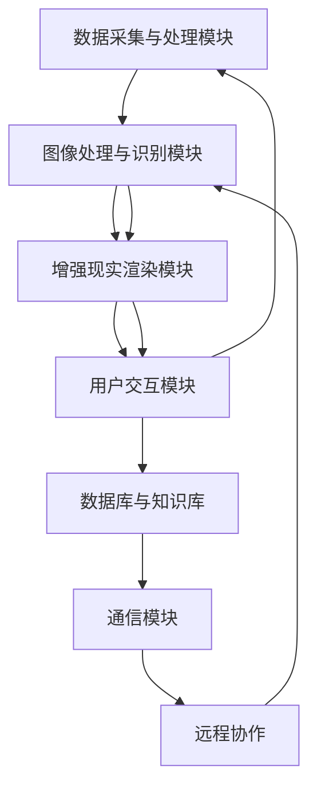

                 


### 文章标题
增强现实在工业维修中的可视化指导

### 关键词
增强现实（AR），工业维修，可视化指导，图像处理，算法，数据融合，SLAM，硬件设备，用户体验，维修培训，文档管理，未来发展趋势

### 摘要
本文将深入探讨增强现实（AR）技术在工业维修中的应用，从背景介绍到核心概念、算法原理，再到实际应用案例，全面解析AR技术在工业维修中的可视化指导作用。文章旨在为读者提供一份详细的技术指南，帮助理解AR技术在工业维修中的潜力与挑战，并展望其未来的发展趋势。

## 增强现实技术概述

### 1.1 增强现实技术定义与历史

增强现实（Augmented Reality，AR）是一种通过计算机技术将虚拟信息叠加到现实世界中的技术。AR系统通常包含一个摄像头或传感器，用于捕捉真实世界的图像，然后通过计算机处理将这些图像与虚拟信息相结合，最终呈现给用户一个虚实结合的视图。这一技术的核心在于实时性和交互性，它使得用户可以在真实环境中直接与虚拟信息进行互动。

增强现实技术的概念可以追溯到20世纪60年代，当时美国波音公司的研究员阿尔文·克拉克（Alvin C. Clark）首次提出了“增强现实”这个术语。早期的增强现实系统主要用于军事和航空领域。随着计算机技术、图像处理技术、显示技术以及传感器技术的不断发展，AR技术逐渐走向成熟，并开始应用于更多的领域。

在过去的几十年里，AR技术经历了多个发展阶段：

- **早期阶段**：主要依赖于头戴式显示器（如谷歌眼镜的早期版本）和专用的投影设备。
- **中期阶段**：随着智能手机和平板电脑的普及，AR技术开始与移动设备结合，通过手机摄像头和屏幕实现增强现实体验。
- **现阶段**：随着硬件性能的提升和人工智能技术的发展，AR技术逐渐应用于多个行业，包括医疗、教育、零售和工业维修等。

### 1.2 增强现实技术的核心技术

增强现实技术的实现依赖于多种核心技术的综合运用，主要包括：

- **视觉处理技术**：这是增强现实技术的核心，用于捕捉、识别和处理真实世界的图像。视觉处理技术包括图像识别、图像增强、图像配准等。
  - **图像识别**：通过算法识别图像中的对象和特征，如颜色、形状和纹理。
  - **图像增强**：通过算法增强图像的清晰度和对比度，以便更好地识别和处理。
  - **图像配准**：将虚拟信息与真实世界的图像进行精确匹配，确保虚拟信息叠加在正确的位置上。

- **数据融合与跟踪技术**：用于将不同来源的数据（如摄像头图像、GPS信号、传感器数据等）进行融合，并实时跟踪用户的位置和方向。数据融合与跟踪技术是实现增强现实系统实时性和准确性的关键。

- **显示技术**：增强现实的最终呈现需要通过显示设备实现。目前常用的显示技术包括头戴式显示器、投影设备、手机屏幕等。

### 1.3 增强现实在工业维修中的应用前景

在工业维修领域，增强现实技术具有巨大的应用潜力，可以解决许多传统维修方法面临的挑战：

- **复杂维修操作的指导**：通过AR技术，维修人员可以在真实环境中实时查看维修步骤和操作指导，减少人为错误和提高工作效率。

- **远程协作**：增强现实技术可以实现远程专家的实时指导和协作，提高远程维修的效率和准确性。

- **设备维护与故障诊断**：通过AR技术，维修人员可以实时查看设备的运行状态、检测故障并进行修复，提高设备维护的效率。

- **维修记录与文档管理**：增强现实技术可以用于记录维修过程、生成维修报告和文档，提高维修管理的效率和准确性。

- **培训与技能提升**：增强现实技术可以为维修人员提供沉浸式的培训体验，帮助他们快速掌握复杂的维修技能。

综上所述，增强现实技术在工业维修中具有广泛的应用前景，通过可视化指导，可以显著提高维修效率和质量，降低维修成本和风险。然而，要充分发挥AR技术的潜力，还需要克服一系列技术挑战，如实时数据处理、跟踪精度和用户体验等。

### 1.4 增强现实在工业维修中的应用架构

为了实现增强现实在工业维修中的可视化指导，需要构建一个完善的系统架构，该架构通常包括以下几个关键组件：

- **数据采集与处理模块**：用于捕捉工业设备的状态图像、传感器数据和环境数据。数据采集模块通常包含高清摄像头、传感器（如GPS、IMU）等设备，数据经过预处理后传输到处理模块。

- **图像处理与识别模块**：负责对采集到的图像进行预处理、特征提取和对象识别。通过图像处理算法，如边缘检测、特征匹配等，系统能够识别设备的关键部件和故障区域。

- **增强现实渲染模块**：将识别出的对象与虚拟信息进行叠加，并在显示设备上渲染出增强现实视图。该模块通常使用三维图形渲染引擎，如OpenGL或Unity，来实现高质量的视觉效果。

- **用户交互模块**：提供用户与增强现实视图的交互接口，包括手势识别、语音控制等。用户可以通过交互模块与系统进行交互，获取维修指导信息。

- **数据库与知识库**：用于存储设备维修数据、故障诊断知识库和维修手册等。数据库与知识库可以为系统提供实时维修数据和指导信息。

- **通信模块**：用于远程协作和实时数据传输，确保维修过程中信息的实时更新和共享。

通过上述组件的协同工作，增强现实系统可以为维修人员提供直观、实时的维修指导，提高维修效率和准确性。以下是增强现实在工业维修中的应用架构的Mermaid流程图：



### 1.5 增强现实系统架构的详细说明

为了深入理解增强现实系统架构在工业维修中的应用，我们需要详细说明每个关键组件的功能和工作原理。

#### 数据采集与处理模块

数据采集与处理模块是增强现实系统的核心部分之一，负责从环境中捕获必要的数据，并将其转换为可用于后续处理的形式。以下是该模块的组成部分及其功能：

- **传感器数据采集**：包括高清摄像头、GPS、惯性测量单元（IMU）等传感器，用于捕捉设备状态图像、位置信息和运动数据。这些数据通过接口传输到数据处理模块。

- **数据预处理**：对采集到的原始数据进行预处理，包括图像去噪、图像增强、分辨率调整等。预处理步骤旨在提高图像质量，以便后续的特征提取和对象识别。

- **数据融合**：将来自不同传感器的数据进行融合，形成完整的设备状态信息。例如，将摄像头捕捉的图像与GPS位置信息结合，以确定设备的具体位置。

#### 图像处理与识别模块

图像处理与识别模块负责对预处理后的图像进行深入分析，以识别设备的关键部件和故障区域。以下是该模块的主要功能：

- **特征提取**：通过图像处理算法提取图像的关键特征，如边缘、角点、纹理等。这些特征用于后续的对象识别。

- **对象识别**：利用机器学习算法和深度学习模型对图像中的对象进行识别。常见的对象识别算法包括卷积神经网络（CNN）和循环神经网络（RNN）。

- **故障检测**：结合设备状态数据和对象识别结果，检测设备中的故障区域。故障检测可以通过预设的规则或机器学习模型实现。

#### 增强现实渲染模块

增强现实渲染模块负责将识别出的对象与虚拟信息进行叠加，并在显示设备上渲染出增强现实视图。以下是该模块的关键功能：

- **三维建模**：创建设备的虚拟模型，以便在增强现实视图中进行叠加。三维建模可以使用专业的建模软件，如Blender或3ds Max。

- **虚拟信息叠加**：将识别出的对象与虚拟信息进行叠加，如维修步骤、故障检测信息等。叠加过程需要考虑图像的透视、光照和纹理等因素。

- **实时渲染**：使用图形渲染引擎，如OpenGL或Unity，实现高质量的增强现实视图渲染。实时渲染要求系统具备高效的计算和处理能力。

#### 用户交互模块

用户交互模块负责提供用户与增强现实视图的交互接口，以支持用户操作和获取维修指导。以下是该模块的主要功能：

- **手势识别**：通过摄像头和深度传感器捕捉用户的手势，如手势识别、手写输入等。

- **语音控制**：通过麦克风捕捉用户的语音指令，并使用语音识别技术将其转换为文本或操作指令。

- **界面设计**：设计直观、易用的用户界面，包括按钮、图标、菜单等，以便用户能够轻松地与增强现实系统进行交互。

#### 数据库与知识库

数据库与知识库是增强现实系统的重要数据存储单元，用于存储设备维修数据、故障诊断知识库和维修手册等。以下是数据库与知识库的主要功能：

- **数据存储**：将采集到的设备状态数据、维修记录、故障报告等存储在数据库中，以便后续查询和分析。

- **知识库管理**：管理设备维修知识库，包括维修步骤、故障处理方法、常见问题等，为用户提供详细的维修指导。

- **数据关联**：将采集到的设备状态数据与知识库中的维修指导信息进行关联，以便系统实时更新和提供准确的维修指导。

#### 通信模块

通信模块负责实现增强现实系统与其他设备、远程专家之间的实时数据传输和协作。以下是通信模块的主要功能：

- **数据传输**：通过无线网络（如Wi-Fi、4G/5G）或有线网络（如以太网）实现数据的高速传输。

- **远程协作**：支持远程专家的实时指导和协作，通过视频会议、共享屏幕等方式实现远程协作。

- **安全通信**：确保数据传输的安全性，防止数据泄露或被恶意攻击。

通过上述关键组件的协同工作，增强现实系统可以为维修人员提供全方位的维修指导，提高维修效率和准确性。在下一章节中，我们将深入探讨增强现实在工业维修中的应用案例，进一步了解其在实际操作中的表现。

## 增强现实在工业维修中的应用架构

为了更好地理解增强现实（AR）技术在工业维修中的实际应用，我们需要详细分析其系统架构和各个关键组件的功能与协同工作原理。以下是增强现实在工业维修中的应用架构：

### 系统架构概述

增强现实在工业维修中的应用架构主要包括以下关键组件：

- **数据采集与处理模块**：用于实时捕捉设备状态图像、传感器数据和环境数据。
- **图像处理与识别模块**：负责处理和识别设备关键部件及故障区域。
- **增强现实渲染模块**：将识别出的对象与虚拟信息叠加，并在显示设备上渲染增强现实视图。
- **用户交互模块**：提供用户与增强现实视图的交互接口，如手势识别、语音控制等。
- **数据库与知识库**：存储设备维修数据、故障诊断知识库和维修手册等。
- **通信模块**：实现增强现实系统与其他设备、远程专家之间的实时数据传输和协作。

### 数据采集与处理模块

**数据采集与处理模块**是增强现实系统的基础，它负责从环境中实时采集数据，并对其进行预处理和融合，以确保后续处理的准确性和实时性。以下是该模块的详细工作原理：

1. **传感器数据采集**：通过高清摄像头、GPS、IMU等传感器，实时捕捉设备的状态图像、位置信息和运动数据。
   
2. **图像预处理**：对采集到的原始图像进行去噪、增强和分辨率调整等预处理操作，以提高图像质量。

3. **多传感器数据融合**：将来自不同传感器的数据（如摄像头图像、GPS位置、IMU运动数据）进行融合，以获得更全面的设备状态信息。数据融合可以通过卡尔曼滤波、粒子滤波等算法实现。

4. **数据传输**：预处理后的数据通过无线网络（如Wi-Fi、4G/5G）或有线网络（如以太网）传输到后端服务器或数据处理模块。

### 图像处理与识别模块

**图像处理与识别模块**是增强现实系统的核心，它负责对预处理后的图像进行深入分析，以识别设备的关键部件和故障区域。以下是该模块的工作原理：

1. **特征提取**：利用边缘检测、SIFT、SURF等算法提取图像的关键特征，如边缘、角点、纹理等。

2. **对象识别**：通过卷积神经网络（CNN）、循环神经网络（RNN）等深度学习算法，对图像中的对象进行识别。对象识别可以帮助系统识别设备的关键部件和故障区域。

3. **故障检测**：结合设备状态数据和对象识别结果，检测设备中的故障区域。故障检测可以通过预设的规则或机器学习模型实现。

### 增强现实渲染模块

**增强现实渲染模块**负责将识别出的对象与虚拟信息进行叠加，并在显示设备上渲染出增强现实视图。以下是该模块的工作原理：

1. **三维建模**：创建设备的三维模型，以便在增强现实视图中进行叠加。三维建模可以使用专业的建模软件，如Blender或3ds Max。

2. **虚拟信息叠加**：将识别出的对象（如故障区域、维修步骤等）与虚拟信息进行叠加。叠加过程中需要考虑图像的透视、光照和纹理等因素。

3. **实时渲染**：使用图形渲染引擎，如OpenGL或Unity，实现高质量的增强现实视图渲染。实时渲染要求系统具备高效的计算和处理能力。

### 用户交互模块

**用户交互模块**负责提供用户与增强现实视图的交互接口，以支持用户操作和获取维修指导。以下是该模块的工作原理：

1. **手势识别**：通过摄像头和深度传感器捕捉用户的手势，如手势识别、手写输入等。

2. **语音控制**：通过麦克风捕捉用户的语音指令，并使用语音识别技术将其转换为文本或操作指令。

3. **界面设计**：设计直观、易用的用户界面，包括按钮、图标、菜单等，以便用户能够轻松地与增强现实系统进行交互。

### 数据库与知识库

**数据库与知识库**是增强现实系统的重要数据存储单元，用于存储设备维修数据、故障诊断知识库和维修手册等。以下是数据库与知识库的工作原理：

1. **数据存储**：将采集到的设备状态数据、维修记录、故障报告等存储在数据库中，以便后续查询和分析。

2. **知识库管理**：管理设备维修知识库，包括维修步骤、故障处理方法、常见问题等，为用户提供详细的维修指导。

3. **数据关联**：将采集到的设备状态数据与知识库中的维修指导信息进行关联，以便系统实时更新和提供准确的维修指导。

### 通信模块

**通信模块**负责实现增强现实系统与其他设备、远程专家之间的实时数据传输和协作。以下是通信模块的工作原理：

1. **数据传输**：通过无线网络（如Wi-Fi、4G/5G）或有线网络（如以太网）实现数据的高速传输。

2. **远程协作**：支持远程专家的实时指导和协作，通过视频会议、共享屏幕等方式实现远程协作。

3. **安全通信**：确保数据传输的安全性，防止数据泄露或被恶意攻击。

通过上述关键组件的协同工作，增强现实系统可以为维修人员提供全方位的维修指导，提高维修效率和准确性。在下一章节中，我们将进一步探讨增强现实在工业维修中的核心算法原理，为读者揭示其背后的技术奥秘。

## 增强现实在工业维修中的核心算法原理

增强现实（AR）技术在工业维修中发挥着关键作用，其核心算法原理是实现设备状态实时监测、故障检测、维修指导与操作辅助的基础。以下将详细介绍这些核心算法原理，并使用伪代码和数学模型进行详细阐述。

### 1. 图像处理算法

图像处理算法是增强现实在工业维修中的基础，它负责从采集到的设备状态图像中提取关键特征，以便进行后续的对象识别和故障检测。

#### 边缘检测

边缘检测是图像处理算法中的基本步骤，用于找到图像中的轮廓和边界。常用的边缘检测算法包括Canny边缘检测算法。

```python
# Canny边缘检测算法伪代码
def Canny(image, threshold1, threshold2):
    # 1. 高斯滤波去噪
    blurred = GaussianBlur(image, 5)

    # 2. 计算梯度和方向
    gradient_x, gradient_y = computeGradient(blurred)
    direction = atan2(gradient_y, gradient_x)

    # 3. 非极大值抑制
    non_max_suppression(gradient_x, gradient_y, direction)

    # 4. 双阈值处理
    weak_edges = (gradient > threshold1) & (gradient <= threshold2)
    strong_edges = gradient > threshold2

    # 5. 结合弱边和强边
    edges = strong_edges | (weak_edges & (gradient_x == gradient_y))

    return edges
```

#### 特征匹配

特征匹配是用于识别图像中特定对象的关键步骤。SIFT（尺度不变特征变换）和SURF（加速稳健特征）是常用的特征匹配算法。

```python
# SIFT特征匹配伪代码
def SIFT_matching(image1, image2):
    # 1. 提取SIFT特征
    keypoints1, descriptors1 = SIFT(image1)
    keypoints2, descriptors2 = SIFT(image2)

    # 2. 计算描述符之间的距离
    distances = calculate_distance(descriptors1, descriptors2)

    # 3. 遴选最佳匹配
    matches = select_best_matches(distances)

    return matches
```

### 2. 数据融合与跟踪算法

数据融合与跟踪算法是实现AR系统中设备状态实时监测的关键，常用的算法包括卡尔曼滤波、粒子滤波和视觉同时定位与地图构建（SLAM）算法。

#### 卡尔曼滤波

卡尔曼滤波是一种递归滤波器，用于估计动态系统的状态。它通过预测和更新步骤，实现对系统状态的精确估计。

```python
# 卡尔曼滤波伪代码
class KalmanFilter:
    def __init__(self, initial_state, initial_covariance):
        self.state = initial_state
        self.covariance = initial_covariance
    
    def predict(self, input):
        # 预测下一状态
        self.state = f(self.state, input)
        self.covariance = F * self.covariance * F.T + Q
    
    def update(self, observation):
        # 更新状态
        innovation = observation - h(self.state)
        S = H * self.covariance * H.T + R
        K = self.covariance * H.T / S
        self.state = self.state + K * innovation
        self.covariance = (I - K * H) * self.covariance
```

#### SLAM算法

SLAM算法用于同时定位与地图构建，它通过融合多种传感器数据，实时构建地图并估计系统位置。其核心步骤包括运动估计、地图构建和地图与轨迹优化。

```python
# SLAM算法伪代码
def SLAM(observations, landmarks):
    # 1. 运动估计
    poses = estimate_motion(observations)

    # 2. 地图构建
    map = build_map(landmarks)

    # 3. 地图与轨迹优化
    optimized_map, optimized_poses = optimize_map_and_trajectory(map, poses)

    return optimized_map, optimized_poses
```

### 3. 增强现实渲染算法

增强现实渲染算法负责将识别出的对象与虚拟信息叠加到真实场景中，并实时渲染增强现实视图。关键步骤包括三维建模、虚拟信息叠加和实时渲染。

#### 三维建模

三维建模是通过创建设备的三维模型，以便在增强现实视图中进行叠加。使用Blender等建模软件，可以创建高质量的三维模型。

```python
# 三维建模伪代码
def create_3D_model(geometry, material):
    # 1. 创建三维模型
    model = create_mesh(geometry)

    # 2. 应用材质
    apply_material(model, material)

    return model
```

#### 虚拟信息叠加

虚拟信息叠加是将识别出的对象（如故障区域、维修步骤等）与虚拟信息进行叠加。此过程需要考虑图像的透视、光照和纹理等因素。

```python
# 虚拟信息叠加伪代码
def overlay_info(image, virtual_info):
    # 1. 加载真实场景图像
    scene_image = load_image(image)

    # 2. 加载虚拟信息
    virtual_image = load_image(virtual_info)

    # 3. 应用透视变换
    transformed_image = apply_perspective_transform(virtual_image)

    # 4. 应用光照和纹理
    rendered_image = apply_lighting_and_texturing(transformed_image)

    # 5. 合并图像
    final_image = blend_images(scene_image, rendered_image)

    return final_image
```

#### 实时渲染

实时渲染是使用图形渲染引擎，如OpenGL或Unity，实现高质量的增强现实视图渲染。实时渲染要求系统具备高效的计算和处理能力。

```python
# 实时渲染伪代码
def render_realtime_view(image):
    # 1. 创建渲染上下文
    render_context = create_renderer_context()

    # 2. 渲染图像
    render_image(image, render_context)

    # 3. 显示渲染结果
    display_rendered_view(render_context)
```

通过上述核心算法原理的详细解析，我们可以看到增强现实技术在工业维修中的关键作用。这些算法原理为设备状态的实时监测、故障检测、维修指导与操作辅助提供了强大的技术支持，从而显著提高了工业维修的效率和质量。

### 数学模型与公式

为了更深入地理解增强现实在工业维修中的应用，我们需要介绍一些关键的数学模型与公式。以下是对卡尔曼滤波、SLAM算法和三维建模等核心技术的详细数学描述，并附有公式和举例说明。

#### 卡尔曼滤波

卡尔曼滤波是一种线性递归滤波器，用于估计动态系统的状态。其基本原理是通过预测和更新步骤，利用观测数据进行状态估计。

1. **状态预测**：
   - **状态方程**：
     $$ x_{k+1} = f_k(x_k, u_k) + w_k $$
     其中，$x_k$ 表示状态向量，$u_k$ 表示控制输入，$w_k$ 为过程噪声。
   - **预测误差协方差**：
     $$ P_{k+1} = F_k P_k F_k^T + Q $$

2. **状态更新**：
   - **观测方程**：
     $$ z_k = h_k(x_k) + v_k $$
     其中，$z_k$ 为观测值，$v_k$ 为观测噪声。
   - **卡尔曼增益**：
     $$ K_k = P_{k+1} H_k^T (H_k P_{k+1} H_k^T + R_k)^{-1} $$
   - **更新状态**：
     $$ x_{k|k} = x_{k+1} + K_k (z_k - h_k(x_{k+1})) $$
   - **更新误差协方差**：
     $$ P_{k|k} = (I - K_k H_k) P_{k+1} $$

**举例说明**：

假设我们有如下状态和观测方程：
- 状态方程：$x_k = x_{k-1} + v_k$，其中 $v_k \sim N(0, Q)$。
- 观测方程：$z_k = x_k + w_k$，其中 $w_k \sim N(0, R)$。

初始状态为 $x_0 = 0$，初始误差协方差为 $P_0 = 1$。在 $k=1$ 时，观测值为 $z_1 = 1$。

- **预测**：
  - 预测状态：$x_1 = 0 + v_1$（假设 $v_1 = 0.1$）
  - 预测误差协方差：$P_1 = I + Q = 1 + 0.01$

- **更新**：
  - 卡尔曼增益：$K_1 = \frac{P_1}{0.01 + 1} = 0.9$
  - 更新状态：$x_{1|1} = 0.1 + 0.9 \times (1 - 0.1) = 0.99$
  - 更新误差协方差：$P_{1|1} = (I - 0.9) \times (1 + 0.01) = 0.01$

#### SLAM算法

SLAM（Simultaneous Localization and Mapping）算法用于同时进行地图构建和系统定位。其核心是粒子滤波。

1. **粒子权重更新**：
   $$ w_k = \frac{p(z_k | x_k, \theta) \times p(\theta)}{p(z_k | \theta)} $$
   其中，$p(z_k | x_k, \theta)$ 为观测概率，$p(\theta)$ 为先验概率。

2. **粒子重采样**：
   $$ p(x_k | z_1:k) = \frac{1}{N} \sum_{i=1}^{N} w_i^k $$
   其中，$N$ 为粒子数量。

**举例说明**：

假设我们有5个粒子，其权重分别为 $w_1 = 0.2$，$w_2 = 0.3$，$w_3 = 0.1$，$w_4 = 0.2$，$w_5 = 0.2$。

- **权重更新**：
  - $w_1^k = 0.2 \times p(z_k | x_1, \theta)$
  - $w_2^k = 0.3 \times p(z_k | x_2, \theta)$
  - $w_3^k = 0.1 \times p(z_k | x_3, \theta)$
  - $w_4^k = 0.2 \times p(z_k | x_4, \theta)$
  - $w_5^k = 0.2 \times p(z_k | x_5, \theta)$

- **重采样**：
  - 计算总权重：$N \times \sum_{i=1}^{5} w_i^k = 1$
  - 生成新粒子位置，按照权重比例进行重采样。

#### 三维建模

三维建模涉及空间几何和材料属性的计算，用于创建设备的三维模型。

1. **三维模型构建**：
   $$ V = \sum_{i=1}^{N} V_i $$
   其中，$V_i$ 为每个面或顶点的三维向量。

2. **纹理映射**：
   $$ \text{纹理坐标} = \frac{\text{模型坐标}}{\text{最大坐标值}} $$

**举例说明**：

假设一个三维模型由3个面组成，每个面的顶点坐标为 $V_1 = (1, 1, 1)$，$V_2 = (1, -1, 1)$，$V_3 = (-1, 1, 1)$。

- **三维向量计算**：
  - $V = V_1 + V_2 + V_3 = (1, 1, 1) + (1, -1, 1) + (-1, 1, 1) = (1, -1, 1)$

- **纹理映射**：
  - 纹理坐标 $u = \frac{1}{2}$，$v = \frac{1}{2}$

通过上述数学模型与公式的介绍，我们可以更深入地理解增强现实技术在工业维修中的应用原理。这些模型和公式为系统的设计与实现提供了坚实的理论基础，有助于提高工业维修的效率和质量。

## 增强现实在工业维修中的具体应用案例

为了更好地展示增强现实（AR）技术在工业维修中的实际效果，我们将探讨几个具体的成功应用案例，并详细解读这些案例中的关键技术实现和操作流程。

### 案例一：设备维护与故障诊断

某大型制造企业采用AR技术对其生产线上的关键设备进行维护与故障诊断。通过AR设备，维修人员可以实时查看设备的运行状态、检测故障并进行修复。以下是该案例的关键技术实现和操作流程：

**关键技术实现**：
1. **数据采集与处理**：使用高清摄像头和多种传感器（如温度传感器、振动传感器）实时采集设备状态数据。数据经过预处理和融合后，传输到数据处理模块。

2. **图像处理与识别**：通过图像处理算法提取设备关键部件的图像特征，利用卷积神经网络（CNN）进行故障区域识别。识别结果与历史故障数据进行比对，确定故障类型。

3. **增强现实渲染**：将识别出的故障区域以增强现实视图的形式叠加到真实场景中，为维修人员提供直观的维修指导。

**操作流程**：
1. **设备运行监测**：维修人员佩戴AR设备，实时监测设备运行状态。
2. **故障检测**：系统自动分析传感器数据和图像特征，识别出潜在的故障区域。
3. **维修指导**：AR设备显示故障区域和相应的维修步骤，维修人员根据指导进行操作。
4. **故障修复**：维修完成后，系统记录维修过程和结果，生成维修报告。

### 案例二：远程协作维修

某跨国企业采用AR技术实现远程协作维修，专家可以通过视频会议和AR设备实时指导现场维修人员。以下是该案例的关键技术实现和操作流程：

**关键技术实现**：
1. **通信模块**：使用Wi-Fi或4G/5G网络实现远程专家与现场人员的实时通信和数据传输。
2. **AR渲染与交互**：远程专家通过AR设备查看现场情况，使用手势识别和语音控制与系统进行交互。
3. **知识库管理**：系统包含丰富的维修知识库，提供实时维修指导和参考。

**操作流程**：
1. **问题报告**：现场维修人员通过AR设备报告故障情况，并将现场图像和数据上传到远程服务器。
2. **远程诊断**：远程专家通过AR设备查看故障信息和现场情况，进行远程诊断。
3. **维修指导**：远程专家通过视频会议和AR设备实时指导维修人员，提供维修步骤和操作指导。
4. **故障修复**：维修人员按照远程专家的指导进行操作，修复故障。

### 案例三：设备维修培训

某培训机构采用AR技术进行设备维修培训，学员可以通过AR设备进行沉浸式学习。以下是该案例的关键技术实现和操作流程：

**关键技术实现**：
1. **三维建模与渲染**：使用专业建模软件创建设备的三维模型，并在AR视图中进行渲染。
2. **交互设计与操作模拟**：设计直观的交互界面，模拟设备操作过程，提供实时反馈和指导。

**操作流程**：
1. **课程设置**：根据维修需求，设计课程内容和培训目标。
2. **学员注册**：学员通过AR设备进行注册和登录，开始学习。
3. **操作练习**：学员在AR视图中进行设备操作练习，系统提供实时反馈和指导。
4. **知识测试**：完成操作练习后，系统进行知识测试，评估学员的学习效果。

通过以上具体案例的介绍，我们可以看到增强现实技术在工业维修中的应用带来了显著的效益，不仅提高了维修效率和质量，还降低了维修成本和风险。未来，随着技术的进一步发展和应用场景的拓展，AR技术在工业维修中的潜力将更加巨大。

### 案例四：增强现实维修文档管理

某工业公司引入AR技术对维修文档进行管理，通过增强现实视图为维修人员提供即时的文档查阅和操作指导。以下是该案例的关键技术实现和操作流程：

**关键技术实现**：
1. **文档结构设计**：设计高效的文档存储结构，将维修手册、故障诊断指南、操作步骤等内容进行分类和编码。
2. **增强现实渲染**：利用AR技术将文档内容实时叠加到维修场景中，提供互动式文档查阅。
3. **数据同步与更新**：通过云计算平台实现文档的实时同步和更新，确保维修人员获取最新的维修资料。

**操作流程**：
1. **文档上传**：将维修文档上传到云端数据库，进行结构化处理和存储。
2. **AR设备注册**：维修人员使用AR设备进行注册，登录到系统。
3. **文档查阅**：维修人员通过AR设备查看相关的维修文档，文档内容实时叠加到维修场景中。
4. **互动操作**：维修人员在AR视图中进行操作，系统提供实时反馈和指导，如步骤提示、安全警告等。

通过增强现实技术，维修文档不仅变得更加直观易懂，而且能够与实际维修场景紧密结合，极大地提升了维修效率和质量。

### 总结与反思

上述案例展示了增强现实技术在工业维修中的多样应用，从设备维护与故障诊断、远程协作维修、设备维修培训到增强现实维修文档管理，AR技术为工业维修带来了显著的创新和提升。这些应用不仅提高了维修效率和准确性，还减少了人为错误，降低了维修成本和风险。

尽管AR技术在工业维修中具有巨大的潜力，但实际应用中仍面临一些挑战：

- **硬件成本**：高质量的AR设备价格较高，对中小型企业来说可能是一个负担。
- **数据处理与渲染性能**：实时处理大量数据并渲染高质量的增强现实视图对硬件性能有较高要求。
- **安全性**：数据传输和存储的安全性需要得到充分保障，以防止信息泄露和恶意攻击。

未来，随着技术的不断进步和应用场景的拓展，AR技术在工业维修中的前景将更加广阔。通过不断优化算法、降低硬件成本和提高用户体验，AR技术有望在工业维修中发挥更大的作用，为制造业带来深远的变革。

### 最佳实践 Tips

在实际应用增强现实（AR）技术进行工业维修时，以下最佳实践可以帮助优化效果并降低潜在问题：

1. **前期准备与需求分析**：在部署AR系统前，进行充分的需求分析和规划，明确维修场景、用户需求和技术可行性。确保系统设计符合实际应用需求。

2. **硬件设备选型**：根据实际应用场景选择合适的AR设备，如头戴显示器、平板设备或手机等。考虑设备的分辨率、计算性能、续航时间和便携性。

3. **数据预处理与融合**：优化数据预处理流程，确保传感器数据的准确性和一致性。通过多传感器数据融合提高系统对设备状态的感知能力。

4. **算法优化**：针对图像处理、故障检测和增强现实渲染等关键算法进行优化，提高处理速度和准确性。考虑使用深度学习等先进算法以提高识别效率和精度。

5. **用户体验设计**：设计直观、易用的用户界面和交互方式，提高维修人员的操作效率和舒适度。进行用户测试和反馈收集，不断改进系统设计。

6. **安全与隐私保护**：加强数据传输和存储的安全性，采用加密技术保护敏感信息。确保系统的安全性和合规性，避免信息泄露和恶意攻击。

7. **培训与支持**：为维修人员提供充分的培训和指导，确保他们能够熟练使用AR系统。建立技术支持团队，及时解决使用过程中遇到的问题。

通过遵循这些最佳实践，可以提高AR技术在工业维修中的应用效果，实现更高的维修效率和用户体验。

### 小结与未来展望

综上所述，增强现实（AR）技术在工业维修中的应用为传统维修方式带来了革命性的变革。通过提供可视化、实时的维修指导，AR技术显著提高了维修效率和质量，降低了维修成本和风险。本文详细介绍了AR技术的核心算法原理、系统架构和具体应用案例，展示了其在设备维护、故障诊断、远程协作和文档管理等方面的优势。

然而，AR技术在工业维修中的广泛应用仍面临一系列挑战，包括硬件成本、数据处理性能、安全性等问题。未来，随着技术的不断进步和成本的降低，AR技术有望在更多工业场景中得到广泛应用。

进一步的研究方向包括：

1. **算法优化**：深入研究和优化图像处理、故障检测和增强现实渲染等核心算法，提高处理速度和准确性。
2. **硬件升级**：开发高性能、低成本的AR设备，提高系统的可用性和便携性。
3. **用户体验提升**：设计更直观、易用的用户界面和交互方式，提高维修人员的操作效率和舒适度。
4. **安全与隐私保护**：加强数据传输和存储的安全性，确保系统的安全性和合规性。

通过不断的技术创新和应用实践，AR技术将在工业维修领域发挥更大的作用，推动制造业的数字化转型和智能化发展。

### 拓展阅读

为了深入了解增强现实（AR）技术在工业维修中的应用，以下是一些推荐的拓展阅读资源：

1. **《增强现实：从概念到应用》**：这本书详细介绍了AR技术的发展历程、核心技术及应用场景，适合初学者和专业人士阅读。
2. **《工业4.0与智能制造》**：该书探讨了智能制造的趋势和关键技术，包括AR技术在工业维修中的应用，为读者提供了全面的工业技术发展视角。
3. **《深度学习与计算机视觉》**：这本书深入讲解了深度学习算法在图像处理和计算机视觉中的应用，为AR技术的算法优化提供了理论基础。
4. **《AR开发实战：从入门到精通》**：针对开发者，介绍了AR开发的工具、框架和最佳实践，是学习AR技术开发的优秀教程。

通过阅读这些书籍和文献，读者可以进一步了解AR技术在工业维修领域的最新进展和应用技巧。

