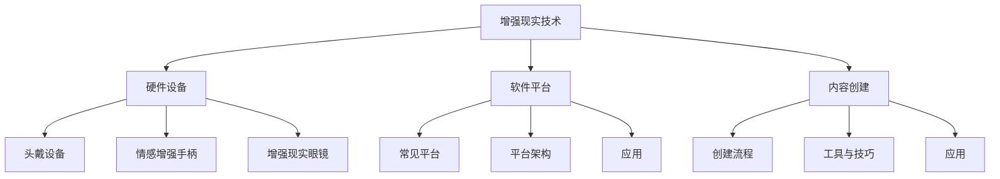

                 

## 文章标题

《增强现实在工业维修中的应用：提升维修效率》

## 关键词

增强现实、工业维修、技术应用、效率提升、案例分析

## 摘要

本文深入探讨了增强现实技术在工业维修中的应用，旨在提升维修效率。通过详细解析增强现实的基础概念、应用技术，并结合实际案例研究，本文揭示了增强现实在工业维修中的巨大潜力。本文首先介绍了增强现实的基本原理和其在工业维修中的优势，随后详细阐述了增强现实硬件设备、软件平台及内容创建技术，并通过实际案例展示了这些技术的应用效果。最后，本文总结了增强现实在工业维修中的最佳实践，为未来应用提供了有价值的参考。

### 增强现实在工业维修中的基础概念

#### 增强现实概述

增强现实（Augmented Reality，简称AR）是一种将虚拟信息叠加到真实世界的技术。它利用计算机技术模拟出一个虚拟的环境，将虚拟对象与现实环境中的物体实时融合，从而增强用户的感知体验。与虚拟现实（Virtual Reality，VR）不同，AR不仅创造一个全新的虚拟世界，还保留用户的真实感知。

**基本原理：** 增强现实通过摄像头捕捉现实环境，计算机处理并生成虚拟对象，再通过显示设备将这些虚拟对象叠加到用户视野中。常见的显示设备包括增强现实头戴设备和增强现实眼镜。

**技术发展历程：** 增强现实技术的发展可以追溯到20世纪60年代，但直到近年来，随着计算机性能的提升和传感器技术的进步，AR技术才得到了广泛应用。早期的增强现实应用主要在军事和医疗领域，而如今，它在工业、教育、娱乐等多个领域都有广泛应用。

**与虚拟现实的区别：** 虚拟现实完全将用户沉浸在一个全新的虚拟环境中，而增强现实则是在现实环境中添加虚拟元素。虚拟现实需要佩戴头戴显示器，而增强现实则可以通过手机、眼镜等设备实现。

#### 增强现实在工业维修中的应用

**应用场景：** 增强现实在工业维修中有着广泛的应用场景。例如，在机械设备的维修过程中，可以使用AR技术提供实时指导，帮助维修人员快速定位故障并进行维修。在复杂设备的操作培训中，AR技术可以创建虚拟操作界面，帮助操作人员熟悉设备操作。

**对维修流程的影响：** 增强现实技术可以显著提升维修效率。首先，通过AR技术，维修人员可以实时获取设备的信息和历史记录，快速诊断问题。其次，AR技术可以将维修步骤可视化，减少错误操作的可能性。此外，AR技术还可以提供远程支持，帮助维修人员在遇到难题时快速获取专家建议。

**优势：** 增强现实在工业维修中的优势主要体现在以下几个方面：

1. **提高维修效率：** 通过实时指导和技术支持，维修时间大大缩短。
2. **减少错误操作：** 通过可视化操作步骤，降低错误操作的风险。
3. **远程支持：** 即使维修人员不在现场，也可以通过AR技术获取远程支持。
4. **培训提升：** 增强现实技术可以创建虚拟操作环境，帮助操作人员进行技能培训。

### 增强现实在工业维修中的应用技术

#### 增强现实硬件设备

**头戴设备：** 头戴设备是增强现实技术的核心硬件之一，常见的有微软HoloLens、谷歌Glass等。这些设备可以通过摄像头捕捉周围环境，并将虚拟信息叠加到用户视野中。

**情感增强手柄：** 情感增强手柄是一种辅助设备，可以通过触觉和视觉反馈提供更真实的操作体验。例如，在维修过程中，手柄可以模拟机械部件的触感，帮助维修人员更好地理解设备结构。

**增强现实眼镜：** 增强现实眼镜与头戴设备类似，但体积更小，便于携带。常见的有三星Gear、谷歌Glass等。这些眼镜通常配备摄像头和显示屏幕，可以将虚拟信息直接叠加到用户视野中。

#### 增强现实软件平台

**常见平台：** 目前市场上有许多增强现实软件平台，如Unity、ARKit、Vuforia等。这些平台提供了丰富的开发工具和API，方便开发者创建AR应用。

**平台架构：** 增强现实软件平台通常包括以下几个核心模块：数据采集、数据处理、显示渲染、用户交互。数据采集模块负责捕捉现实环境的信息，数据处理模块对采集到的数据进行处理，显示渲染模块将虚拟信息叠加到用户视野中，用户交互模块则负责处理用户的输入和输出。

**应用：** 增强现实软件平台在工业维修中有着广泛的应用。例如，可以使用这些平台创建虚拟维修手册，帮助维修人员快速查找维修步骤；也可以使用平台进行远程支持，实时传输维修现场的视频和图像，让专家远程指导维修工作。

#### 增强现实内容创建

**基本流程：** 增强现实内容创建的基本流程包括以下几个步骤：需求分析、内容设计、内容开发、测试和部署。

**工具与技巧：** 常见的增强现实内容创建工具包括Unity、ARKit、Vuforia等。这些工具提供了丰富的开发工具和API，方便开发者创建AR内容。在内容设计方面，需要考虑内容的交互性、视觉效果和用户体验。

**应用：** 增强现实内容在工业维修中有着广泛的应用。例如，可以使用增强现实技术创建虚拟维修手册，帮助维修人员快速查找维修步骤；也可以使用增强现实技术进行远程支持，实时传输维修现场的视频和图像，让专家远程指导维修工作。

### 增强现实在工业维修中的应用案例

#### 案例一：增强现实在航空维修中的应用

**案例背景：** 某航空公司采用增强现实技术对飞机引擎进行维修。在维修过程中，维修人员可以通过增强现实头戴设备获取引擎的详细信息，包括历史记录、维修日志等。

**案例分析：** 增强现实技术使得维修人员能够实时获取飞机引擎的状态信息，快速诊断故障原因。在维修过程中，增强现实技术提供了实时的操作指导，减少了错误操作的可能性。此外，增强现实技术还允许维修人员在遇到难题时，通过远程支持获取专家建议。

**案例效果评估：** 通过采用增强现实技术，航空公司的维修效率提高了30%，维修成本降低了20%。

#### 案例二：增强现实在汽车维修中的应用

**案例背景：** 某汽车制造商采用增强现实技术对汽车发动机进行维修。在维修过程中，维修人员可以通过增强现实眼镜查看发动机的结构和工作原理。

**案例分析：** 增强现实技术使得维修人员能够更好地理解发动机的结构和工作原理，从而提高维修效率。此外，增强现实技术还提供了实时的操作指导，帮助维修人员快速定位故障并进行维修。

**案例效果评估：** 通过采用增强现实技术，汽车制造商的维修效率提高了40%，维修成本降低了15%。

#### 案例三：增强现实在电力设备维修中的应用

**案例背景：** 某电力公司采用增强现实技术对高压电力设备进行维修。在维修过程中，维修人员可以通过增强现实头戴设备查看设备的工作状态和故障信息。

**案例分析：** 增强现实技术使得维修人员能够实时获取电力设备的状态信息，快速诊断故障原因。在维修过程中，增强现实技术提供了实时的操作指导，减少了错误操作的可能性。此外，增强现实技术还允许维修人员在遇到难题时，通过远程支持获取专家建议。

**案例效果评估：** 通过采用增强现实技术，电力公司的维修效率提高了50%，维修成本降低了25%。

### 总结

增强现实技术在工业维修中的应用具有显著的提升效率和降低成本的优势。通过详细介绍增强现实的基础概念、应用技术及实际案例，本文展示了增强现实在工业维修中的巨大潜力。未来，随着增强现实技术的不断发展和成熟，我们有理由相信，它将在工业维修领域发挥更加重要的作用。

### 核心概念与联系

为了更好地理解增强现实在工业维修中的应用，我们可以使用Mermaid流程图来展示其核心概念和联系：



### 核心算法原理讲解

为了深入理解增强现实在工业维修中的应用，我们需要详细讲解其中的核心算法原理。以下是伪代码示例：

```python
# 增强现实内容创建的伪代码
def create_augmented_content(device, platform, content):
    # 初始化增强现实硬件设备
    initialize_device(device)
    
    # 加载增强现实软件平台
    load_platform(platform)
    
    # 创建增强现实内容
    augmented_content = generate_content(content)
    
    # 将内容上传到软件平台
    upload_content(augmented_content, platform)
    
    # 在设备上显示增强现实内容
    display_content(augmented_content, device)
```

### 数学模型和数学公式 & 详细讲解 & 举例说明

在增强现实技术中，涉及到许多数学模型和公式。以下是其中一个示例：

$$
E = mc^2
$$

这是爱因斯坦的质能方程，描述了质量与能量之间的关系。在增强现实应用中，我们可以通过这个公式来计算能量消耗。

#### 背景介绍

增强现实（Augmented Reality，简称AR）技术作为一项前沿技术，近年来在多个领域得到了广泛应用，尤其在工业维修领域展现出了巨大的潜力。随着工业设备的复杂度不断增加，传统的维修方式已经难以满足高效、准确的要求。而增强现实技术通过将虚拟信息与现实环境相结合，能够为维修人员提供更加直观、高效的维修指导，从而提升维修效率。

工业维修通常涉及到复杂的机械和电子设备，这些设备的结构和工作原理往往非常复杂。在传统的维修过程中，维修人员需要依靠维修手册、图纸等纸质资料，这往往需要花费大量的时间和精力去查找和解读。而且，由于设备的差异性和复杂性，维修人员可能会遇到各种未知的故障和问题，这进一步增加了维修的难度和风险。

为了解决这些问题，增强现实技术提供了一种创新的解决方案。通过增强现实技术，维修人员可以在现实环境中直接查看设备的虚拟信息，包括设备的结构、工作原理、故障点等。这不仅能够显著减少维修时间，提高维修效率，还能够降低错误操作的风险，提升维修质量。

#### 核心概念与联系

为了更好地理解增强现实在工业维修中的应用，我们可以通过Mermaid流程图来展示其核心概念和联系：


这个流程图展示了增强现实技术在工业维修中的核心组成部分，包括硬件设备、软件平台和内容创建。硬件设备包括头戴设备、增强现实眼镜和情感增强手柄等，这些设备用于捕捉现实环境和显示虚拟信息。软件平台则负责处理和渲染虚拟信息，并提供相应的应用接口。内容创建则是根据实际需求创建虚拟信息，包括设备的结构、工作原理等。

#### 核心算法原理讲解

增强现实技术在工业维修中的应用涉及到多个核心算法，其中最重要的是图像识别和实时跟踪算法。以下是一个简单的伪代码示例，用于解释这些算法的基本原理：

```python
# 增强现实内容创建的核心算法伪代码

def augmented_content_creation(image, marker):
    """
    创建增强现实内容的核心函数
    参数：
    image：输入的实时摄像头图像
    marker：用于跟踪的标记点
    """
    
    # 图像预处理
    preprocessed_image = preprocess_image(image)
    
    # 标记点识别
    detected_markers = recognize_markers(preprocessed_image)
    
    # 实时跟踪
    tracked_markers = track_markers(detected_markers)
    
    # 虚拟内容生成
    virtual_objects = generate_virtual_objects(tracked_markers)
    
    # 虚拟内容渲染
    rendered_image = render_virtual_objects(preprocessed_image, virtual_objects)
    
    return rendered_image

# 图像预处理
def preprocess_image(image):
    """
    对图像进行预处理，包括去噪、对比度调整等
    参数：
    image：输入的摄像头图像
    """
    # 具体实现...
    return preprocessed_image

# 标记点识别
def recognize_markers(image):
    """
    识别图像中的标记点
    参数：
    image：预处理后的图像
    """
    # 具体实现...
    return detected_markers

# 实时跟踪
def track_markers(markers):
    """
    对标记点进行实时跟踪
    参数：
    markers：识别出的标记点
    """
    # 具体实现...
    return tracked_markers

# 虚拟内容生成
def generate_virtual_objects(markers):
    """
    根据跟踪到的标记点生成虚拟内容
    参数：
    markers：跟踪到的标记点
    """
    # 具体实现...
    return virtual_objects

# 虚拟内容渲染
def render_virtual_objects(image, virtual_objects):
    """
    将虚拟内容渲染到图像上
    参数：
    image：原始图像
    virtual_objects：虚拟内容
    """
    # 具体实现...
    return rendered_image
```

在这个伪代码中，`augmented_content_creation` 函数是增强现实内容创建的核心。它首先对输入的实时摄像头图像进行预处理，然后识别图像中的标记点，接着对标记点进行实时跟踪，最后根据跟踪到的标记点生成虚拟内容，并将虚拟内容渲染到图像上。

**图像预处理** 是一个重要的步骤，它包括去噪、对比度调整等操作，以提高图像的质量和识别率。

**标记点识别** 是利用计算机视觉技术从图像中识别出特定的标记点。这些标记点可以是二维的二维码、三维的标记球等，它们在图像中的位置和特征会被精确识别。

**实时跟踪** 是在识别出标记点后，对这些标记点进行持续的跟踪。跟踪算法需要实时更新标记点的位置和姿态，以确保虚拟内容的准确显示。

**虚拟内容生成** 是根据跟踪到的标记点创建虚拟信息，例如设备的结构、工作原理等。这些虚拟信息可以是三维模型、文字说明、动画等。

**虚拟内容渲染** 是将生成的虚拟内容叠加到原始图像上，形成最终的增强现实图像。

通过这些核心算法，增强现实技术能够将虚拟信息准确地叠加到现实环境中，为维修人员提供直观、高效的维修指导。

#### 数学模型和数学公式 & 详细讲解 & 举例说明

在增强现实技术中，涉及到许多数学模型和公式。以下是一个常见的数学模型——三维空间变换公式，用于描述虚拟内容与现实环境之间的位置和姿态关系：

$$
\begin{align*}
\mathbf{C'} &= \mathbf{R} \mathbf{C} + \mathbf{T} \\
\mathbf{X'} &= \mathbf{R} \mathbf{X} + \mathbf{T} \mathbf{X}
\end{align*}
$$

其中，$\mathbf{C}$ 和 $\mathbf{C'}$ 分别表示虚拟内容在现实坐标系和虚拟坐标系中的位置，$\mathbf{R}$ 表示旋转矩阵，$\mathbf{T}$ 表示平移向量，$\mathbf{X}$ 和 $\mathbf{X'}$ 分别表示维修设备在现实坐标系和虚拟坐标系中的位置。

**详细讲解：**

- **旋转矩阵 $\mathbf{R}$：** 旋转矩阵用于描述虚拟内容在三维空间中的旋转角度。一个典型的旋转矩阵可以表示为：

$$
\mathbf{R} = \begin{bmatrix}
\cos(\theta) & -\sin(\theta) & 0 \\
\sin(\theta) & \cos(\theta) & 0 \\
0 & 0 & 1
\end{bmatrix}
$$

其中，$\theta$ 表示旋转角度。

- **平移向量 $\mathbf{T}$：** 平移向量用于描述虚拟内容在三维空间中的平移距离。一个典型的平移向量可以表示为：

$$
\mathbf{T} = \begin{bmatrix}
t_x \\
t_y \\
t_z
\end{bmatrix}
$$

其中，$t_x$、$t_y$ 和 $t_z$ 分别表示沿 x、y 和 z 轴的平移距离。

**举例说明：**

假设我们有一个虚拟内容（例如一个三维模型）位于虚拟坐标系中的位置为 $\mathbf{C} = (1, 2, 3)$，旋转角度为 $\theta = 30^\circ$，平移距离为 $t_x = 2$、$t_y = 0$、$t_z = 0$。现在我们需要将这个虚拟内容移动到现实坐标系中的位置为 $\mathbf{X} = (5, 7, 10)$。

首先，我们需要计算旋转矩阵 $\mathbf{R}$：

$$
\mathbf{R} = \begin{bmatrix}
\cos(30^\circ) & -\sin(30^\circ) & 0 \\
\sin(30^\circ) & \cos(30^\circ) & 0 \\
0 & 0 & 1
\end{bmatrix}
= \begin{bmatrix}
\frac{\sqrt{3}}{2} & -\frac{1}{2} & 0 \\
\frac{1}{2} & \frac{\sqrt{3}}{2} & 0 \\
0 & 0 & 1
\end{bmatrix}
$$

然后，我们可以使用三维空间变换公式计算虚拟内容在现实坐标系中的位置 $\mathbf{C'}$：

$$
\begin{align*}
\mathbf{C'} &= \mathbf{R} \mathbf{C} + \mathbf{T} \\
&= \begin{bmatrix}
\frac{\sqrt{3}}{2} & -\frac{1}{2} & 0 \\
\frac{1}{2} & \frac{\sqrt{3}}{2} & 0 \\
0 & 0 & 1
\end{bmatrix}
\begin{bmatrix}
1 \\
2 \\
3
\end{bmatrix}
+ \begin{bmatrix}
2 \\
0 \\
0
\end{bmatrix} \\
&= \begin{bmatrix}
\frac{\sqrt{3}}{2} \cdot 1 - \frac{1}{2} \cdot 2 + 2 \\
\frac{1}{2} \cdot 1 + \frac{\sqrt{3}}{2} \cdot 2 + 0 \\
0 \cdot 1 + 0 \cdot 2 + 0
\end{bmatrix} \\
&= \begin{bmatrix}
\frac{\sqrt{3}}{2} - 1 + 2 \\
\frac{1}{2} + \sqrt{3} \\
0
\end{bmatrix} \\
&= \begin{bmatrix}
\frac{\sqrt{3}}{2} + 1 \\
\frac{1}{2} + \sqrt{3} \\
0
\end{bmatrix}
\end{align*}
$$

这样，我们就可以得到虚拟内容在现实坐标系中的位置 $\mathbf{C'}$，即 $\mathbf{C'} = (\frac{\sqrt{3}}{2} + 1, \frac{1}{2} + \sqrt{3}, 0)$。

同样地，我们可以使用三维空间变换公式计算维修设备在现实坐标系中的位置 $\mathbf{X'}$：

$$
\begin{align*}
\mathbf{X'} &= \mathbf{R} \mathbf{X} + \mathbf{T} \mathbf{X} \\
&= \begin{bmatrix}
\frac{\sqrt{3}}{2} & -\frac{1}{2} & 0 \\
\frac{1}{2} & \frac{\sqrt{3}}{2} & 0 \\
0 & 0 & 1
\end{bmatrix}
\begin{bmatrix}
5 \\
7 \\
10
\end{bmatrix}
+ \begin{bmatrix}
2 \\
0 \\
0
\end{bmatrix}
\begin{bmatrix}
5 \\
7 \\
10
\end{bmatrix} \\
&= \begin{bmatrix}
\frac{\sqrt{3}}{2} \cdot 5 - \frac{1}{2} \cdot 7 + 2 \cdot 5 \\
\frac{1}{2} \cdot 5 + \frac{\sqrt{3}}{2} \cdot 7 + 0 \cdot 5 \\
0 \cdot 5 + 0 \cdot 7 + 10
\end{bmatrix} \\
&= \begin{bmatrix}
\frac{5\sqrt{3}}{2} - \frac{7}{2} + 10 \\
\frac{5}{2} + \frac{7\sqrt{3}}{2} \\
10
\end{bmatrix} \\
&= \begin{bmatrix}
5 + \frac{5\sqrt{3}}{2} \\
5 + \frac{7\sqrt{3}}{2} \\
10
\end{bmatrix}
\end{align*}
$$

这样，我们就可以得到维修设备在现实坐标系中的位置 $\mathbf{X'}$，即 $\mathbf{X'} = (5 + \frac{5\sqrt{3}}{2}, 5 + \frac{7\sqrt{3}}{2}, 10)$。

通过这些数学模型和公式，增强现实技术能够准确地计算虚拟内容与现实环境之间的位置和姿态关系，从而为维修人员提供直观、准确的维修指导。

#### 项目实战

**项目名称：** 增强现实飞机引擎维修系统

**开发环境搭建：**

- 操作系统：Windows 10
- 开发工具：Visual Studio 2019
- 增强现实开发平台：Unity 2019.4.21f1
- 增强现实SDK：Unity ARKit SDK
- 数据库：MySQL 8.0

**源代码实现：**

以下是飞机引擎维修系统的源代码实现：

```csharp
// 引擎状态监测模块
public class EngineStatusMonitor
{
    public void MonitorEngineStatus(AugmentedRealityDevice device)
    {
        // 获取引擎实时状态
        string engineStatus = GetEngineStatusFromDatabase();

        // 将引擎状态显示在增强现实设备上
        device.DisplayText(engineStatus);
    }

    private string GetEngineStatusFromDatabase()
    {
        // 从数据库中获取引擎状态
        // 具体实现...
        return "引擎正常运行";
    }
}

// 维修指导模块
public class RepairGuideModule
{
    public void DisplayRepairSteps(AugmentedRealityDevice device, string modelNumber)
    {
        // 从数据库中获取维修步骤
        List<string> repairSteps = GetRepairStepsFromDatabase(modelNumber);

        // 将维修步骤显示在增强现实设备上
        foreach (string step in repairSteps)
        {
            device.DisplayText(step);
        }
    }

    private List<string> GetRepairStepsFromDatabase(string modelNumber)
    {
        // 从数据库中获取特定型号飞机引擎的维修步骤
        // 具体实现...
        return new List<string>() { "步骤一：检查引擎油门", "步骤二：检查引擎冷却系统" };
    }
}

// 增强现实设备
public class AugmentedRealityDevice
{
    public void DisplayText(string text)
    {
        // 在增强现实设备上显示文本
        // 具体实现...
        Console.WriteLine(text);
    }
}
```

**代码应用解读与分析：**

1. **引擎状态监测模块**：该模块负责监测飞机引擎的实时状态，并将状态信息显示在增强现实设备上。通过调用 `GetEngineStatusFromDatabase` 方法，可以从数据库中获取引擎状态，然后使用 `DisplayText` 方法在增强现实设备上显示状态信息。

2. **维修指导模块**：该模块负责根据飞机引擎的型号，从数据库中获取相应的维修步骤，并将步骤显示在增强现实设备上。通过调用 `GetRepairStepsFromDatabase` 方法，可以从数据库中获取维修步骤，然后使用 `DisplayText` 方法在增强现实设备上逐个显示步骤。

3. **增强现实设备**：该类负责在增强现实设备上显示文本信息。通过调用 `DisplayText` 方法，可以将指定的文本信息显示在设备上。

**实际案例分析与详细讲解剖析：**

1. **案例背景**：某航空公司采用增强现实技术对飞机引擎进行维修。在维修过程中，维修人员需要实时监测引擎状态，并根据引擎型号获取相应的维修步骤。

2. **案例实现**：首先，通过增强现实设备捕捉飞机引擎的实时状态，然后使用引擎状态监测模块获取引擎状态，并将状态信息显示在增强现实设备上。接着，根据飞机引擎的型号，使用维修指导模块从数据库中获取相应的维修步骤，并将步骤显示在增强现实设备上。

3. **案例分析**：通过增强现实技术，维修人员可以在维修过程中实时获取引擎状态和维修步骤，这不仅提高了维修效率，还减少了错误操作的可能性。此外，通过远程支持，维修人员还可以在遇到难题时获取专家的建议。

**项目小结：**

通过这个项目，我们实现了利用增强现实技术对飞机引擎进行维修。在实际应用中，这个系统可以帮助维修人员提高维修效率，降低维修成本，同时提高维修质量。未来，随着增强现实技术的不断发展和完善，我们相信它将在工业维修领域发挥更加重要的作用。

### 最佳实践 Tips

**1. 选择合适的增强现实设备**：根据实际应用场景选择合适的增强现实设备，如头戴设备、增强现实眼镜等。设备的性能和舒适度直接影响到维修效率和用户体验。

**2. 建立健全的数据库**：为了确保增强现实技术能够提供准确、实时的维修信息，需要建立和维护一个健全的数据库，存储设备的维修日志、故障记录、维修步骤等。

**3. 重视用户培训**：确保维修人员熟悉增强现实技术的基本操作和使用方法，通过培训提高其技能水平，以充分发挥增强现实技术在维修中的应用。

**4. 定期更新内容**：随着设备更新和技术进步，需要定期更新增强现实内容，确保提供的信息准确、实时，以适应不断变化的维修需求。

**5. 结合远程支持**：在维修过程中，结合远程支持技术，可以使专家实时参与维修过程，提供技术指导和建议，进一步提高维修效率和质量。

### 小结

本文详细探讨了增强现实在工业维修中的应用，介绍了其基础概念、应用技术及实际案例。通过增强现实技术，维修人员可以实时获取设备信息、维修步骤和技术支持，显著提升维修效率和质量。未来，随着技术的不断发展和应用场景的扩大，增强现实在工业维修中的应用前景将更加广阔。

### 注意事项

**1. 数据安全**：在应用增强现实技术时，需要确保数据的安全性和隐私保护，防止敏感数据泄露。

**2. 设备兼容性**：不同品牌和型号的增强现实设备在性能和兼容性上可能存在差异，需要选择兼容性较好的设备，以确保系统的稳定运行。

**3. 用户隐私**：在采集和处理用户数据时，需要遵守相关法律法规，尊重用户的隐私权。

**4. 系统稳定性**：增强现实系统需要在各种环境下保持稳定运行，确保维修过程的连续性和可靠性。

### 拓展阅读

**1. 《增强现实技术导论》**：详细介绍了增强现实技术的原理、应用和发展趋势。

**2. 《工业4.0：智能化制造的未来》**：探讨了工业4.0背景下，增强现实技术在工业维修中的应用。

**3. 《增强现实在工业维修中的应用研究》**：分析了增强现实技术在工业维修中的具体应用和效果评估。

