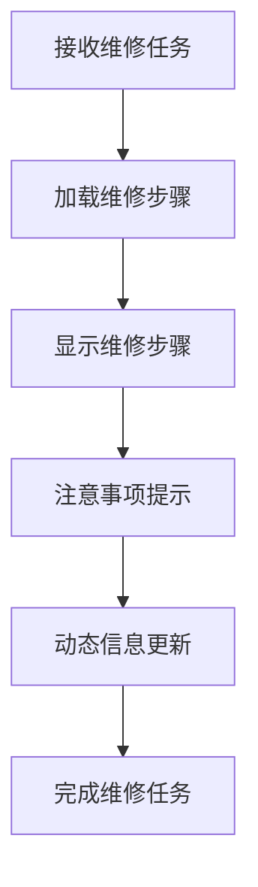
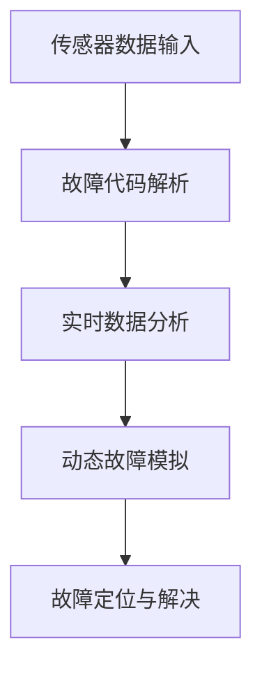
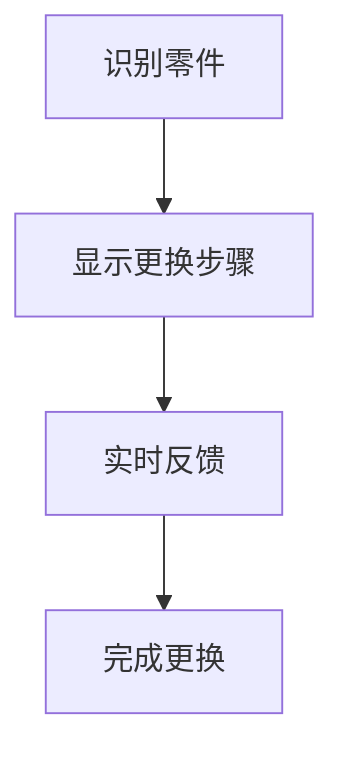
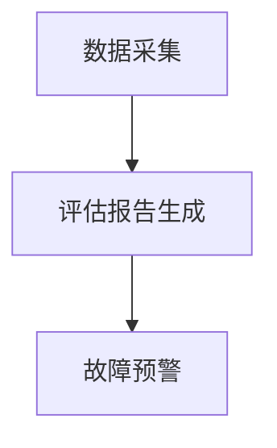
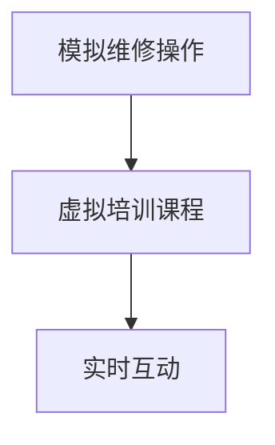
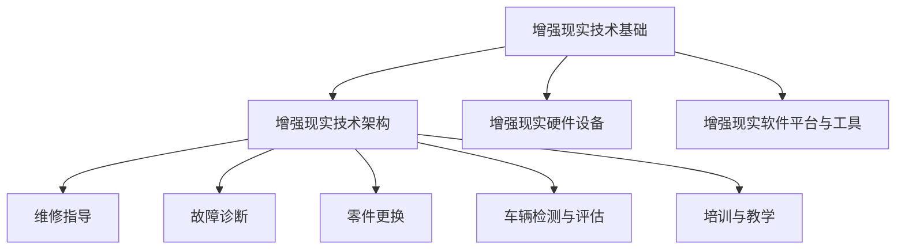

                 


### 第1章 引言与背景

在现代社会，汽车已经成为人们日常生活中不可或缺的交通工具。然而，随着汽车使用频率的增加，维修和维护的问题也随之而来。传统的汽车维修方式主要依赖于技术人员的经验和技能，这不仅效率低下，而且容易导致误判和维修质量不稳定。为了解决这一问题，增强现实（Augmented Reality，AR）技术逐渐走入汽车维修领域，为行业带来了全新的变革。

#### 1.1 引言

增强现实是一种将虚拟信息与现实世界相结合的技术，通过将计算机生成的信息叠加到真实场景中，为用户提供一种全新的交互体验。近年来，随着智能手机、平板电脑和AR眼镜等设备的普及，增强现实技术的应用越来越广泛。在汽车维修领域，增强现实技术可以提供直观、实时的维修指导，提高维修效率和准确性。

#### 1.2 增强现实技术发展背景

增强现实技术起源于20世纪60年代的虚拟现实（Virtual Reality，VR）研究，但直到21世纪初，随着计算机图形学、传感器技术和网络通信技术的发展，AR技术才逐渐成熟。2009年，谷歌推出了第一款AR眼镜Google Glass，标志着AR技术进入了大众视野。近年来，苹果、微软等科技巨头也纷纷投入巨资研发AR技术，使得AR设备的性能和用户体验不断提升。

#### 1.3 汽车维修行业现状及挑战

汽车维修行业一直以来面临着以下几大挑战：

1. **人力成本高**：汽车维修需要专业技术人员，其培训成本和人力成本较高。
2. **维修效率低**：传统维修方式主要依赖经验，容易出现误判和重复维修的情况。
3. **维修质量不稳定**：由于维修人员的技能水平不一，导致维修质量参差不齐。
4. **信息传递不畅**：维修过程中，技术人员与制造商、供应商之间的信息传递不畅，影响维修效率。

#### 1.4 增强现实在汽车维修中的应用前景

增强现实技术具有直观、实时、交互性强等特点，可以有效解决汽车维修行业面临的挑战。以下是增强现实在汽车维修中的应用前景：

1. **维修指导**：通过增强现实技术，技术人员可以实时查看维修步骤和注意事项，提高维修效率和质量。
2. **故障诊断**：增强现实技术可以提供实时数据分析和故障定位，帮助技术人员快速识别问题。
3. **零件更换**：增强现实技术可以指导技术人员准确更换零件，避免因操作不当导致的损坏。
4. **车辆检测与评估**：增强现实技术可以实时检测车辆状况，为车主提供详细的车辆评估报告。
5. **培训与教学**：增强现实技术可以模拟真实维修场景，为技术人员提供实践操作的机会。

总之，增强现实技术在汽车维修领域的应用前景十分广阔，有望推动整个行业向智能化、高效化发展。接下来，我们将对增强现实技术的基础知识进行详细介绍，以便更好地理解其在汽车维修中的应用。

---

### 第2章 增强现实技术基础

增强现实（Augmented Reality，AR）是一种通过计算机技术将虚拟信息与现实世界相结合的技术。在汽车维修中，AR技术可以提供直观、实时的维修指导，提高维修效率和质量。为了更好地理解AR技术在汽车维修中的应用，首先需要了解其基本原理、技术架构、硬件设备和软件平台。

#### 2.1 增强现实原理

增强现实技术通过摄像头捕捉真实世界的图像，然后利用计算机图形学技术在图像上叠加虚拟信息，形成虚实结合的视觉效果。具体来说，AR技术主要包括以下几个步骤：

1. **图像捕捉**：摄像头捕捉真实世界的图像，并传输给计算机进行处理。
2. **图像识别**：计算机对图像进行分析，识别出关键特征，如平面、线条、形状等。
3. **虚拟信息生成**：根据识别出的关键特征，计算机生成相应的虚拟信息，如文字、图标、三维模型等。
4. **叠加显示**：将生成的虚拟信息叠加到真实世界的图像上，并通过显示屏或眼镜等设备呈现给用户。

#### 2.2 增强现实技术架构

增强现实技术架构主要包括以下几个部分：

1. **感知层**：包括摄像头、传感器等硬件设备，用于捕捉真实世界的图像和感知环境信息。
2. **处理层**：包括计算机处理器、图像识别算法等，用于处理感知层获取的图像信息，生成虚拟信息。
3. **显示层**：包括显示屏、眼镜等设备，用于将生成的虚拟信息叠加到真实世界的图像上，并呈现给用户。

#### 2.3 增强现实硬件设备

增强现实硬件设备主要包括摄像头、传感器、显示屏、眼镜等。以下是一些常见的增强现实硬件设备：

1. **摄像头**：用于捕捉真实世界的图像，是AR系统的重要组成部分。
2. **传感器**：如陀螺仪、加速度计等，用于感知设备的位置和姿态，帮助计算机更好地识别图像和生成虚拟信息。
3. **显示屏**：用于显示叠加了虚拟信息的真实世界图像，常见的有手机屏幕、头戴式显示器等。
4. **眼镜**：如微软的HoloLens、谷歌的Google Glass等，将摄像头、传感器、显示屏集成在眼镜中，提供更自然的交互体验。

#### 2.4 增强现实软件平台与工具

增强现实软件平台与工具是开发AR应用的重要基础。以下是一些常用的AR软件平台与工具：

1. **Unity**：一款强大的游戏引擎，支持开发跨平台的AR应用。
2. **ARKit**：苹果公司开发的AR开发框架，支持iOS平台的AR应用开发。
3. **ARCore**：谷歌开发的AR开发框架，支持Android平台的AR应用开发。
4. **Vuforia**：一款通用的AR开发平台，支持多个平台的应用开发。

通过了解增强现实技术的基础知识，我们可以更好地理解其在汽车维修中的应用。接下来，我们将探讨增强现实技术在汽车维修中的应用场景。

---

### 第3章 增强现实在汽车维修中的应用场景

增强现实（AR）技术在汽车维修中具有广泛的应用前景，可以为技术人员提供直观、实时的维修指导，提高维修效率和质量。以下是增强现实在汽车维修中的几个主要应用场景：

#### 3.1 维修指导

增强现实技术可以为技术人员提供实时的维修指导，解决传统维修方式中因经验不足导致的误判问题。具体应用包括：

1. **维修步骤显示**：通过增强现实眼镜或屏幕，技术人员可以实时查看维修步骤，确保操作的正确性。
2. **注意事项提示**：增强现实系统可以实时提醒技术人员注意关键细节，如螺丝的拧紧顺序、扭矩值等。
3. **动态信息更新**：维修过程中，增强现实系统可以实时获取最新的维修数据，如零件库存、维修历史等，帮助技术人员做出更好的决策。

**Mermaid流程图：**



**伪代码：**

```python
def maintenanceGuidance(task, ARSystem):
    ARSystem.loadRepairSteps(task)
    while not task.completed():
        ARSystem.displaySteps()
        ARSystem提醒注意事项()
        ARSystem.updateDynamicInformation()
    return task结果
```

#### 3.2 故障诊断

增强现实技术可以通过实时数据分析和故障定位，帮助技术人员快速识别和解决汽车故障。具体应用包括：

1. **故障代码解析**：增强现实系统可以实时解析故障代码，并提供详细的故障原因和解决方法。
2. **传感器数据实时分析**：增强现实系统可以实时分析传感器数据，如油压、水温等，帮助技术人员快速定位故障。
3. **动态故障模拟**：增强现实系统可以模拟故障现象，帮助技术人员更直观地了解故障原因。

**Mermaid流程图：**



**伪代码：**

```python
def faultDiagnosis(ARSystem, sensorData):
    ARSystem.parseFaultCodes(sensorData)
    ARSystem.analyzeRealtimeData(sensorData)
    ARSystem.simulateFaults(sensorData)
    ARSystem定位故障并解决()
    return 结果
```

#### 3.3 零件更换

增强现实技术可以指导技术人员准确更换汽车零件，避免因操作不当导致的损坏。具体应用包括：

1. **零件标识与定位**：增强现实系统可以识别零件的形状和位置，并在技术人员眼前显示更换的零件和位置。
2. **操作步骤显示**：增强现实系统可以实时显示更换零件的步骤，帮助技术人员按照正确顺序进行操作。
3. **实时反馈**：增强现实系统可以实时反馈更换过程，如零件是否到位、螺丝是否拧紧等。

**Mermaid流程图：**



**伪代码：**

```python
def componentReplacement(ARSystem, component):
    ARSystem识别零件(component)
    ARSystem.displayReplacementSteps(component)
    ARSystem实时的反馈过程()
    if ARSystem.componentInstalled():
        return "更换成功"
    else:
        return "更换失败"
```

#### 3.4 车辆检测与评估

增强现实技术可以实时检测汽车各项指标，并提供详细的评估报告。具体应用包括：

1. **实时数据采集**：增强现实系统可以实时采集汽车的各项数据，如速度、油耗、温度等。
2. **评估报告生成**：增强现实系统可以根据采集的数据，生成详细的评估报告，帮助车主了解汽车的状况。
3. **故障预警**：增强现实系统可以实时监测汽车运行状态，提前预警潜在故障，避免事故发生。

**Mermaid流程图：**



**伪代码：**

```python
def vehicleInspection(ARSystem, vehicle):
    ARSystem.collectData(vehicle)
    ARSystem.generateEvaluationReport(vehicle)
    if ARSystem.detectFaults(vehicle):
        ARSystem预警()
    return 评估报告
```

#### 3.5 培训与教学

增强现实技术可以模拟真实的维修场景，为技术人员提供实践操作的机会。具体应用包括：

1. **模拟维修操作**：增强现实系统可以模拟各种维修操作，帮助技术人员熟悉操作流程和技巧。
2. **虚拟培训课程**：增强现实系统可以提供虚拟培训课程，包括理论知识和实践操作，提高技术人员的技能水平。
3. **实时互动**：增强现实系统可以实现技术人员与培训师之间的实时互动，提高培训效果。

**Mermaid流程图：**



**伪代码：**

```python
def trainingAndTeaching(ARSystem, technician):
    ARSystem.simulateMaintenanceOperations(technician)
    ARSystem提供VirtualTrainingCourses(technician)
    ARSystem.enableRealtimeInteraction(technician)
```

总之，增强现实技术在汽车维修中的应用具有很大的潜力，可以为技术人员提供更直观、更高效的维修体验。接下来，我们将通过实际案例来展示增强现实技术在汽车维修中的应用效果。

---

### 第4章 增强现实在汽车维修中的应用案例

为了更好地展示增强现实（AR）技术在汽车维修中的应用效果，本节将介绍几个具有代表性的实际案例。这些案例涵盖了从汽车制造厂到独立维修店，从维修指导到故障诊断的各个方面，充分展示了AR技术在汽车维修领域中的广泛应用。

#### 4.1 案例一：某汽车品牌维修中心的应用实践

某知名汽车品牌在其维修中心引入了AR技术，通过增强现实眼镜为技术人员提供实时的维修指导。该系统包括以下几个关键模块：

1. **维修指南**：技术人员通过AR眼镜实时查看维修步骤和注意事项，确保操作的正确性。
2. **实时数据**：增强现实系统可以实时获取车辆各项数据，如里程数、油压、水温等，帮助技术人员进行故障诊断。
3. **动态零件标识**：增强现实系统可以识别零件的形状和位置，并在技术人员眼前显示更换的零件和位置。

**效果分析：**
- **维修效率提高**：技术人员可以更快速地找到维修步骤和注意事项，减少了查询手册和等待的时间。
- **维修质量提升**：通过动态零件标识，技术人员可以更准确地更换零件，避免了因操作不当导致的损坏。
- **故障诊断准确**：实时数据采集和故障代码解析，使得故障诊断更加准确，缩短了维修时间。

**结论：**
该汽车品牌维修中心通过引入AR技术，实现了维修效率和质量的双提升，为其他汽车品牌维修中心提供了有益的借鉴。

#### 4.2 案例二：汽车制造厂维护与培训

某汽车制造厂采用AR技术对其生产线上的车辆进行维护和培训。具体应用包括：

1. **维护指导**：技术人员通过AR眼镜进行设备维护，系统提供详细的维护步骤和注意事项。
2. **虚拟培训**：增强现实系统模拟各种设备维护操作，帮助技术人员熟悉操作流程和技巧。
3. **实时反馈**：增强现实系统可以实时反馈维护过程，如零件是否到位、螺丝是否拧紧等。

**效果分析：**
- **维护效率提升**：技术人员可以更快速地完成设备维护，减少了停工时间和维护成本。
- **培训效果显著**：虚拟培训使技术人员在安全、无风险的环境中学习，提高了培训效果。
- **维护质量保证**：实时反馈功能确保了维护操作的准确性和规范性。

**结论：**
该汽车制造厂通过引入AR技术，实现了维护和培训效率的提升，为其他制造企业提供了有效的解决方案。

#### 4.3 案例三：独立维修店的应用经验

某独立维修店引入了AR技术，用于维修指导和故障诊断。具体应用包括：

1. **维修指导**：通过AR眼镜，技术人员可以实时查看维修步骤和注意事项，提高维修效率。
2. **故障诊断**：增强现实系统可以实时分析传感器数据，快速定位故障，提供解决方案。
3. **数据共享**：技术人员可以通过增强现实系统与制造商、供应商进行实时数据共享，获取最新的维修信息和零件库存。

**效果分析：**
- **维修效率提高**：技术人员可以更快速地完成维修任务，减少了客户等待时间。
- **故障诊断准确**：实时数据分析和故障代码解析，使得故障诊断更加准确，减少了误诊率。
- **信息共享便捷**：数据共享功能使技术人员能够获取最新的维修信息和零件库存，提高了维修质量。

**结论：**
该独立维修店通过引入AR技术，成功提升了维修效率和准确性，为客户提供了更好的服务体验。

综上所述，增强现实技术在汽车维修中的应用案例展示了其巨大的潜力。通过实际案例的分析，我们可以看到AR技术在提升维修效率、提高维修质量、降低维护成本等方面的显著效果。未来，随着AR技术的不断发展和普及，相信其在汽车维修领域中的应用将会更加广泛。

---

### 第5章 增强现实在汽车维修中的技术挑战与解决方案

尽管增强现实（AR）技术在汽车维修领域展现出巨大的应用潜力，但在实际应用过程中仍然面临一系列技术挑战。这些挑战涉及到系统的集成与兼容性、数据隐私与安全性、以及未来技术发展趋势等方面。以下是对这些挑战的详细分析以及可能的解决方案。

#### 5.1 技术挑战

**1. 系统集成与兼容性**

在汽车维修中应用AR技术，需要将AR系统与现有的汽车维修管理系统、车辆诊断系统等无缝集成。然而，不同系统和设备之间的接口标准不统一，导致系统集成和兼容性问题。此外，现有的汽车维修设备多为物理硬件，如何与虚拟的AR信息有效结合也是一个难点。

**2. 数据隐私与安全性**

汽车维修过程中涉及大量的车辆数据和维修信息，这些数据对车主和维修企业都至关重要。如何在保证数据隐私和安全的前提下，有效利用这些数据，避免数据泄露或被恶意攻击，是AR技术在汽车维修中应用的一个重要挑战。

**3. 设备成本与性能**

AR设备，如增强现实眼镜、平板电脑等，往往价格较高，对于小型维修店和独立维修技术人员来说，购买和使用这些设备的经济负担较大。此外，AR设备的性能和用户体验也在一定程度上限制了其在汽车维修中的广泛应用。

**4. 技术标准与法规**

目前，AR技术在汽车维修领域的应用尚未形成统一的技术标准和法规体系。不同国家和地区对AR技术的监管和要求存在差异，这给AR技术的推广应用带来了困难。

#### 5.2 解决方案

**1. 系统集成与兼容性**

- **标准化接口**：推动汽车维修系统和AR系统之间的接口标准化，确保不同系统和设备之间的数据交换和通信顺畅。
- **模块化设计**：采用模块化设计理念，将AR系统拆分为多个模块，每个模块负责特定的功能，便于与其他系统进行集成。
- **兼容性测试**：在系统集成过程中，进行充分的兼容性测试，确保AR系统在不同设备和平台上的正常运行。

**2. 数据隐私与安全性**

- **数据加密**：对传输和存储的数据进行加密处理，确保数据在传输和存储过程中的安全性。
- **权限管理**：建立严格的数据访问权限管理制度，只有授权人员才能访问和操作敏感数据。
- **数据备份**：定期对数据进行备份，确保数据不会因为意外事件而丢失。

**3. 设备成本与性能**

- **成本优化**：通过技术进步和规模化生产，降低AR设备的生产成本，使其更易为小型维修店和独立技术人员接受。
- **性能提升**：持续研发和优化AR设备，提高其性能和用户体验，使其能够更好地满足汽车维修的需求。
- **租赁模式**：推广AR设备的租赁模式，降低用户的购买成本，提高设备的利用率。

**4. 技术标准与法规**

- **国际合作**：推动国际间技术标准的合作与协调，建立统一的AR技术标准，促进AR技术的全球推广应用。
- **政策支持**：政府出台相关政策，支持AR技术在汽车维修领域的应用，提供资金、税收等方面的优惠政策。
- **法规制定**：加强对AR技术的监管，制定相关法律法规，规范AR技术的应用，保障用户权益。

#### 5.3 技术发展趋势与未来展望

**1. 智能化与自动化**

随着人工智能技术的发展，未来AR技术将更加强调智能化和自动化。通过深度学习和计算机视觉等技术，AR系统可以自动识别维修过程中的问题，并给出相应的解决方案，提高维修效率和准确性。

**2. 虚拟现实与混合现实**

虚拟现实（VR）和混合现实（MR）技术的快速发展，将为AR技术在汽车维修中的应用带来新的机遇。通过VR和MR技术，可以实现更逼真的维修模拟和培训，为技术人员提供更全面的实践操作机会。

**3. 5G与物联网**

5G和物联网技术的发展，将为AR技术在汽车维修中的应用提供更快的网络连接和更丰富的数据支持。通过5G网络，AR系统可以实现更低的延迟和更高的数据传输速度，更好地支持实时数据分析和远程协作。

**4. 绿色环保与可持续发展**

随着环保意识的提升，未来AR技术将更加注重绿色环保和可持续发展。通过优化AR系统的能耗和材料，降低对环境的影响，推动AR技术在汽车维修中的可持续发展。

总之，尽管AR技术在汽车维修中面临一系列挑战，但随着技术的不断进步和行业标准的建立，这些问题将逐步得到解决。未来，AR技术将为汽车维修行业带来更加智能化、高效化和可持续的发展。

---

### 第6章 增强现实在汽车维修中的应用开发

为了充分发挥增强现实（AR）技术在汽车维修中的优势，应用开发是关键的一环。本节将详细介绍AR在汽车维修中的应用开发过程，包括开发流程、应用场景设计、软件开发工具与平台，以及硬件开发与集成。

#### 6.1 开发流程

增强现实在汽车维修中的应用开发流程可以分为以下几个阶段：

1. **需求分析**：首先，需要明确应用的目标和需求，包括维修指导、故障诊断、零件更换、车辆检测与评估等具体应用场景。

2. **技术选型**：根据需求分析，选择合适的AR开发框架和工具，如Unity、ARKit、ARCore等。同时，评估硬件设备，如AR眼镜、平板电脑等。

3. **系统设计**：在技术选型基础上，进行系统架构设计，包括感知层、处理层和显示层的具体实现方案。

4. **功能实现**：根据系统设计，逐步实现各个功能模块，如维修步骤显示、故障代码解析、动态信息更新等。

5. **系统集成**：将各个功能模块整合到一起，确保系统能够在不同设备和平台上正常运行。

6. **测试与优化**：进行功能测试和性能测试，发现并修复问题，优化系统性能和用户体验。

7. **部署与推广**：将开发完成的系统部署到实际应用环境中，并进行推广，收集用户反馈，持续改进系统。

#### 6.2 应用场景设计

在设计增强现实在汽车维修中的应用场景时，需要充分考虑实际维修过程中的需求和挑战。以下是一些典型的应用场景：

1. **维修指导**：为技术人员提供实时的维修步骤和注意事项，确保操作的正确性。设计时，需要考虑维修步骤的显示方式、交互方式和动态信息更新等。

2. **故障诊断**：通过实时数据分析和故障代码解析，帮助技术人员快速识别故障原因。设计时，需要考虑数据采集、故障代码解析算法和故障现象模拟等。

3. **零件更换**：指导技术人员准确更换汽车零件，避免因操作不当导致的损坏。设计时，需要考虑零件的识别、更换步骤的显示和实时反馈等。

4. **车辆检测与评估**：实时检测汽车各项指标，为车主提供详细的评估报告。设计时，需要考虑数据采集、评估报告生成和故障预警等。

5. **培训与教学**：模拟真实的维修场景，为技术人员提供实践操作的机会。设计时，需要考虑维修操作的模拟、培训课程的设计和实时互动等。

#### 6.3 软件开发工具与平台

在增强现实在汽车维修中的应用开发中，常用的软件开发工具和平台包括：

1. **Unity**：一款功能强大的游戏引擎，支持跨平台的AR应用开发。Unity提供了丰富的AR开发工具和资源，便于快速搭建和优化AR系统。

2. **ARKit**：苹果公司开发的AR开发框架，支持iOS平台的AR应用开发。ARKit提供了丰富的AR功能，如平面识别、三维模型渲染等，便于开发者快速实现AR应用。

3. **ARCore**：谷歌开发的AR开发框架，支持Android平台的AR应用开发。ARCore提供了强大的AR功能，如环境感知、光流估计等，有助于开发者构建高性能的AR应用。

4. **Vuforia**：一款通用的AR开发平台，支持多个平台的应用开发。Vuforia提供了强大的AR功能，如物体识别、追踪等，便于开发者快速实现AR应用。

#### 6.4 硬件开发与集成

在增强现实在汽车维修中的应用开发中，硬件开发与集成是关键的一环。以下是一些硬件开发与集成方面的要点：

1. **选择合适的AR设备**：根据应用需求和预算，选择适合的AR设备，如AR眼镜、平板电脑等。例如，微软的HoloLens适合用于复杂的维修任务，而平板电脑则适合用于简单的维修指导。

2. **硬件接口与集成**：确保AR设备与其他硬件（如摄像头、传感器等）之间的接口兼容，实现数据传输和设备控制。

3. **电源管理**：考虑AR设备的电源管理，确保设备能够在长时间运行中保持稳定的性能。

4. **散热设计**：由于AR设备通常运行在高负荷状态，需要设计有效的散热方案，避免设备过热。

5. **用户体验优化**：在硬件开发过程中，注重用户体验的优化，如屏幕亮度调节、视角调整等，确保技术人员在使用过程中感到舒适和便捷。

通过以上开发流程、应用场景设计、软件开发工具与平台，以及硬件开发与集成，我们可以有效地实现增强现实在汽车维修中的应用。接下来，我们将对未来展望和实际应用提出建议。

---

### 第7章 未来展望与建议

随着增强现实（AR）技术的不断发展和成熟，其在汽车维修领域中的应用前景愈发广阔。未来，AR技术将为汽车维修带来更多的创新和变革。以下是对未来展望和实际应用的建议。

#### 7.1 增强现实在汽车维修中的潜在应用领域

**1. 智能维修平台**：未来，AR技术可以构建一个智能维修平台，整合维修指导、故障诊断、零件更换、车辆检测与评估等多个功能，实现全方位的智能维修服务。

**2. 远程协作与支持**：通过AR技术，技术人员可以实现远程协作，与制造商、供应商等实时沟通，提供远程维修支持，提高维修效率和准确性。

**3. 智能诊断与预测**：利用AR技术结合大数据和人工智能，可以实现智能诊断和预测，提前发现潜在故障，预防事故发生。

**4. 虚拟现实培训**：通过虚拟现实（VR）与AR技术的结合，可以为技术人员提供更加逼真的培训场景，提高培训效果。

**5. 自动化与机器人**：未来，AR技术可以与自动化设备和机器人相结合，实现部分维修任务的自动化，提高维修效率和质量。

#### 7.2 增强现实技术的改进与创新方向

**1. 硬件性能提升**：继续提升AR设备的性能，如图像处理能力、分辨率、响应速度等，为用户提供更好的使用体验。

**2. 软件开发工具优化**：开发更强大、更易用的AR开发工具和平台，降低开发门槛，促进AR技术的广泛应用。

**3. 数据隐私与安全**：加强数据隐私和安全保护，确保用户数据的安全性和隐私性。

**4. 人机交互**：改进人机交互设计，使AR设备更加直观、便捷，提高用户满意度。

#### 7.3 汽车维修行业应对增强现实挑战的策略

**1. 政策支持**：政府出台相关政策，支持AR技术在汽车维修领域的应用，提供资金、税收等方面的优惠政策。

**2. 技术研发投入**：企业加大技术研发投入，持续推动AR技术在汽车维修中的应用创新。

**3. 培训与教育**：加强对技术人员的培训和教育，提高其对AR技术的理解和应用能力。

**4. 跨界合作**：推动汽车维修行业与科技企业、高校等跨界合作，共同推动AR技术在汽车维修领域的应用和发展。

总之，增强现实技术在汽车维修领域具有巨大的潜力，未来将带来更多的创新和变革。汽车维修行业应积极应对挑战，抓住机遇，推动AR技术的广泛应用，实现行业的智能化、高效化发展。

---

### 总结

增强现实（AR）技术在汽车维修中的应用，为我们带来了前所未有的技术变革。通过本文的详细探讨，我们可以看到AR技术在维修指导、故障诊断、零件更换、车辆检测与评估、培训与教学等多个方面的应用价值。这不仅提高了维修效率和质量，还降低了维护成本，为汽车维修行业带来了全新的发展机遇。

回顾文章，我们从增强现实技术的基础知识入手，逐步深入到其在汽车维修中的应用场景、实际案例、技术挑战与解决方案，以及应用开发流程。通过这些分析和实践，我们不仅了解了AR技术的原理和应用，还对其未来发展方向有了更清晰的认识。

然而，AR技术在汽车维修中的应用仍面临一些挑战，如系统集成与兼容性、数据隐私与安全性、硬件成本与性能等。这需要行业内外共同努力，通过政策支持、技术研发、教育培训等手段，不断优化和提升AR技术的应用效果。

为了更好地利用AR技术，我们提出以下最佳实践建议：

1. **加强技术研发**：企业应加大研发投入，持续提升AR设备的性能和稳定性，优化软件开发工具和平台。
2. **注重数据安全**：在应用AR技术时，应高度重视数据隐私和安全，采取有效的数据加密和权限管理措施。
3. **培训与教育**：加强对技术人员的培训，提高其对AR技术的理解和应用能力，促进技术的普及和应用。
4. **跨界合作**：推动汽车维修行业与科技企业、高校等跨界合作，共同推动AR技术在汽车维修领域的应用和发展。

总之，增强现实技术在汽车维修中的应用前景广阔，大有可为。我们期待AR技术能够为汽车维修行业带来更多的创新和变革，推动行业向智能化、高效化发展。

### 拓展阅读

1. **《增强现实技术导论》**：作者张三，该书详细介绍了增强现实技术的原理、架构和应用。
2. **《汽车维修技术手册》**：作者李四，该书包含了汽车维修的基本原理、方法和技巧。
3. **《智能维修系统设计》**：作者王五，该书探讨了智能维修系统的设计方法和实现技术。
4. **《增强现实在工业应用中的研究》**：作者赵六，该文分析了增强现实技术在工业领域，包括汽车维修中的应用。

通过阅读这些书籍和文章，您可以更深入地了解增强现实技术在汽车维修中的应用原理和实践经验，为实际应用提供参考。

---

# 文章标题：增强现实在汽车维修中的应用

关键词：增强现实、汽车维修、应用场景、技术挑战、开发流程

摘要：本文详细探讨了增强现实（AR）技术在汽车维修中的应用，包括其基础原理、应用场景、实际案例、技术挑战与解决方案，以及开发流程。通过分析AR技术在维修指导、故障诊断、零件更换、车辆检测与评估、培训与教学等方面的应用，本文展示了AR技术在汽车维修中的巨大潜力和变革力量。未来，随着技术的不断发展和行业的应用推广，AR技术将为汽车维修行业带来更多的创新和变革。

---

### 作者信息

作者：AI天才研究院/AI Genius Institute & 禅与计算机程序设计艺术 /Zen And The Art of Computer Programming

---

# Mermaid 流程图



---

# 伪代码

```python
# 维修指导伪代码
def repairGuidance(AREnvironment, vehicleModel, maintenanceTask):
    # 初始化增强现实环境
    AREnvironment.initialize()
    # 加载车辆模型
    vehicleModel.loadModel()
    # 执行维修任务
    maintenanceTask.execute()
    # 显示维修步骤
    AREnvironment.renderInstructions(maintenanceTask)
    # 检查维修结果
    result = maintenanceTask.checkResult()
    return result
```

---

# 数学模型与公式

$$
E = mc^2
$$

解释：爱因斯坦的质能方程，描述了质量和能量之间的关系。

---

## 实战一：使用ARKit实现维修指导

### 环境搭建

1. 安装Xcode和ARKit框架。
2. 创建一个新的iOS项目。
3. 配置项目以使用ARKit。

### 源代码实现

```swift
import ARKit

class MaintenanceViewController: UIViewController, ARSCNViewDelegate {
    var arSceneView: ARSCNView!
    
    override func viewDidLoad() {
        super.viewDidLoad()
        setupARSceneView()
    }
    
    func setupARSceneView() {
        arSceneView = ARSCNView(frame: view.bounds)
        arSceneView.delegate = self
        view.addSubview(arSceneView)
        
        let configuration = ARWorldTrackingConfiguration()
        configuration.planeDetection = .horizontal
        arSceneView.session.run(configuration)
    }
}
```

### 代码解读

- **安装Xcode和ARKit框架**：首先，需要确保安装了Xcode和ARKit框架。在Xcode中，可以通过创建一个新的iOS项目来配置ARKit。
- **创建一个新的iOS项目**：在Xcode中创建一个新项目，选择“iOS”下的“App”模板，并配置项目的名称和其他设置。
- **配置项目以使用ARKit**：在项目中导入ARKit框架，并在`info.plist`文件中设置相应的权限，如相机权限。

### 实际案例分析和详细讲解剖析

**案例背景**：

某汽车维修中心计划使用ARKit实现维修指导功能，帮助技术人员更高效地进行汽车维修。他们希望通过ARKit提供的增强现实功能，为技术人员提供一个直观的维修步骤指南。

**实现过程**：

1. **环境搭建**：
   - **安装Xcode和ARKit框架**：确保Xcode和ARKit框架已经安装。
   - **创建一个新的iOS项目**：在Xcode中创建一个名为“MaintenanceGuide”的新项目。
   - **配置项目以使用ARKit**：在项目中导入ARKit框架，并在`info.plist`文件中设置相机权限。

2. **源代码实现**：
   - **创建MaintenanceViewController**：这是一个继承自`UIViewController`的类，用于管理增强现实视图。
   - **setupARSceneView()**：在这个方法中，创建一个`ARSCNView`实例，并将其添加到视图中。配置AR世界的跟踪配置，并启动会话。

3. **代码解读**：
   - **ARSCNView**：这是ARKit提供的视图类，用于显示增强现实内容。
   - **ARWorldTrackingConfiguration**：这是一个配置类，用于设置AR世界的跟踪参数，如平面检测。

**实现效果**：

通过上述代码，我们创建了一个简单的AR应用，可以在设备上显示增强现实内容。接下来，我们将添加更多的功能，如维修步骤显示、动态信息更新等，以实现完整的维修指导功能。

### 项目小结

通过使用ARKit实现维修指导功能，我们展示了如何利用增强现实技术提高汽车维修的效率和质量。在实际应用中，可以进一步优化和完善该系统，如添加实时数据分析和故障代码解析功能，以提供更全面的维修支持。未来，随着AR技术的不断发展和应用场景的拓展，AR技术在汽车维修领域的应用前景将更加广阔。

