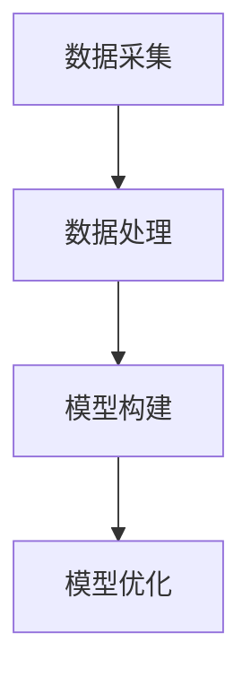
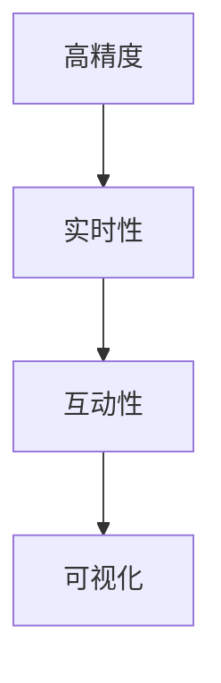
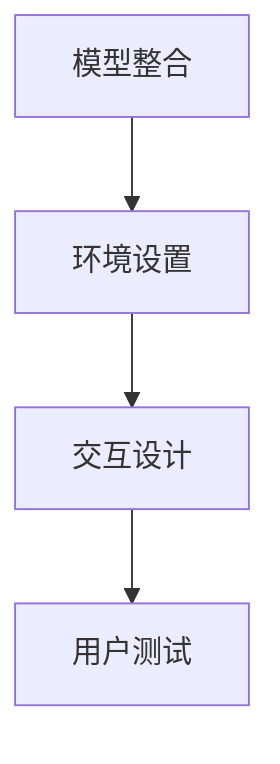

                 

# 增强现实在考古遗址重建中的应用

> 关键词：增强现实、考古遗址、重建、三维建模、虚拟现实

> 摘要：本文将探讨增强现实（AR）技术在考古遗址重建中的应用。首先，我们将介绍增强现实的基本概念和关键技术，以及其在考古学中的历史和现状。接着，我们将分析考古遗址重建的过程和挑战，并探讨增强现实技术在遗址测绘和重建中的优势。最后，我们将通过实际案例展示增强现实技术在考古遗址重建中的具体应用，并提出一些最佳实践和未来展望。

## 第1章: 增强现实技术基础

增强现实（Augmented Reality，简称AR）是一种通过将虚拟信息与现实世界进行叠加，从而增强用户对现实世界的感知和体验的技术。与虚拟现实（Virtual Reality，简称VR）不同，AR技术不是将用户完全带入一个虚拟世界，而是在现实世界中叠加虚拟信息，让用户能够实时感知并与之互动。

### 1.1 增强现实概述

#### 1.1.1 增强现实的历史与定义

增强现实的概念最早可以追溯到1968年，由美国计算机科学家查尔斯·莫里（Charles M.凯里）在斯坦福大学提出了“空间叠加”概念。随后，随着计算机技术和显示技术的发展，增强现实技术逐渐成熟。

增强现实的定义有很多，其中一种较为常见的定义是：增强现实是一种将虚拟信息与现实世界叠加，并通过显示设备呈现在用户眼前的技术。这些虚拟信息可以是文字、图像、三维模型等，它们可以与现实世界中的物体进行交互，从而增强用户的感知和体验。

#### 1.1.2 增强现实的关键技术

增强现实技术主要包括以下几个关键技术：

1. **光学透视**：光学透视是增强现实技术中的一项基础技术，它通过调整显示设备的参数，使得虚拟信息能够准确地叠加在现实世界中的物体上。

2. **图像识别**：图像识别技术是增强现实技术的核心，它通过识别现实世界中的物体，将其作为虚拟信息叠加的基准。

3. **传感器融合**：传感器融合技术是将多种传感器（如摄像头、GPS、加速度计等）的数据进行综合处理，以实现对现实世界的准确感知。

4. **实时渲染**：实时渲染技术是将虚拟信息实时地渲染到显示设备上，以实现与用户的实时交互。

#### 1.1.3 增强现实的应用领域

增强现实技术具有广泛的应用领域，包括但不限于：

1. **医疗**：增强现实技术在医疗领域中的应用包括手术指导、医学教育、康复训练等。

2. **教育**：增强现实技术可以应用于教育领域，如历史教学、自然科学教学等，让学生能够更加直观地了解知识点。

3. **娱乐**：增强现实技术可以应用于游戏、电影等领域，为用户提供更加沉浸式的体验。

4. **军事**：增强现实技术在军事领域中的应用包括战场态势感知、指挥控制等。

### 1.2 增强现实在考古学中的应用

#### 1.2.1 增强现实在考古学中的历史与现状

增强现实技术在考古学中的应用始于20世纪90年代。当时，考古学家开始尝试使用增强现实技术来展示考古遗址的三维模型，并取得了显著的成果。随着技术的不断进步，增强现实技术在考古学中的应用也越来越广泛。

目前，增强现实技术在考古学中的应用主要包括以下几个方面：

1. **遗址展示**：通过增强现实技术，考古学家可以将考古遗址的三维模型叠加在现实世界中，让观众能够更加直观地了解遗址的布局和结构。

2. **考古教学**：增强现实技术可以应用于考古教学，帮助学生更加直观地了解考古遗址和历史事件。

3. **考古研究**：增强现实技术可以帮助考古学家更好地理解考古遗址的结构和功能，从而推动考古学研究的发展。

#### 1.2.2 增强现实在考古学中的挑战与机遇

虽然增强现实技术在考古学中具有广泛的应用前景，但同时也面临着一些挑战：

1. **技术限制**：增强现实技术需要依赖于先进的硬件设备，如智能手机、平板电脑等，这对于一些贫困地区的考古学家来说可能是一个难题。

2. **数据准确性**：增强现实技术依赖于对现实世界的准确感知，但现实世界的环境复杂多变，这给数据的准确性带来了挑战。

3. **用户体验**：如何让用户在增强现实环境中获得更好的体验，也是增强现实技术在考古学中需要解决的一个重要问题。

然而，增强现实技术在考古学中也带来了许多机遇：

1. **公众参与**：通过增强现实技术，考古学家可以更加容易地吸引公众参与考古工作，提高公众对考古遗址的关注和保护意识。

2. **研究创新**：增强现实技术可以为考古学家提供新的研究工具和方法，从而推动考古学的发展。

## 第2章: 考古遗址重建的过程与挑战

考古遗址重建是考古学中的一个重要环节，它通过对遗址进行详细的研究和分析，恢复出遗址的原貌，以便更好地理解历史和文化。然而，考古遗址重建是一个复杂的过程，面临着许多挑战。

### 2.1 考古遗址重建的重要性

考古遗址重建对于考古学具有重要意义，具体表现在以下几个方面：

1. **历史研究**：通过重建考古遗址，考古学家可以更加直观地了解古代社会的生活方式、文化传统和社会结构，从而深化对历史的研究。

2. **文化遗产保护**：考古遗址是文化遗产的重要组成部分，重建考古遗址有助于保护这些宝贵的文化遗产，使其能够得到更好的保存和传承。

3. **公众教育**：重建的考古遗址可以成为公众了解历史和文化的重要窗口，提高公众对历史文化的认识和兴趣。

### 2.2 考古遗址重建的方法论

考古遗址重建的方法论主要包括以下几个步骤：

1. **遗址调查**：在开始重建之前，需要对考古遗址进行详细的调查，了解遗址的地理位置、规模、结构等信息。

2. **遗址测绘**：通过对考古遗址进行测绘，获取遗址的平面图、立面图和剖面图，为重建提供基础数据。

3. **遗址分析**：通过对遗址的测绘数据进行分析，了解遗址的结构、功能、年代等信息，为重建提供依据。

4. **模型制作**：根据遗址的分析结果，使用计算机软件制作遗址的三维模型，以便更好地展示遗址的原貌。

5. **模型修正**：通过对模型进行修正和优化，使其更加符合遗址的实际结构。

### 2.3 考古遗址重建的挑战

考古遗址重建面临许多挑战，主要包括以下几个方面：

1. **数据准确性**：考古遗址重建依赖于对遗址的测绘数据，而现实世界的环境复杂多变，这给数据的准确性带来了挑战。

2. **遗址保护**：在重建过程中，如何保护遗址不受破坏是一个重要的问题。特别是在遗址地区经济开发压力下，遗址保护面临巨大挑战。

3. **资金和技术支持**：考古遗址重建需要大量的资金和技术支持，这对于一些贫困地区和国家来说是一个难题。

4. **公众参与**：如何吸引公众参与考古遗址重建，提高公众的参与度和积极性，也是重建过程中需要解决的问题。

## 第3章: 增强现实在考古遗址重建中的应用

增强现实技术在考古遗址重建中的应用具有显著的优势，它不仅能够提高重建的准确性和效率，还能够为公众提供更加直观和互动的体验。

### 3.1 增强现实在考古遗址测绘中的应用

#### 3.1.1 遗址三维建模

使用增强现实技术，考古学家可以通过智能手机或平板电脑等设备对考古遗址进行三维建模。具体步骤如下：

1. **数据采集**：使用增强现实设备对考古遗址进行扫描，获取遗址的图像和位置信息。

2. **图像处理**：通过图像处理软件对采集到的图像进行预处理，包括去噪、增强、配准等操作，以提高图像的质量和准确性。

3. **三维建模**：使用三维建模软件，将预处理后的图像转换为三维模型。常用的三维建模软件包括Blender、Maya等。

4. **模型修正**：通过对三维模型进行修正和优化，使其更加符合考古遗址的实际结构。

#### 3.1.2 增强现实技术在遗址测绘中的优势

增强现实技术在遗址测绘中的优势主要体现在以下几个方面：

1. **实时性**：增强现实技术能够实时地获取遗址的三维信息，为考古学家提供即时的反馈，从而提高重建的效率。

2. **准确性**：通过使用先进的图像处理和三维建模技术，增强现实技术能够提供高精度的遗址三维模型，从而提高重建的准确性。

3. **互动性**：增强现实技术能够为考古学家提供与遗址三维模型互动的机会，从而更好地理解遗址的结构和功能。

### 3.2 增强现实在考古遗址重建中的应用

#### 3.2.1 虚拟现实场景的构建

使用增强现实技术，考古学家可以在虚拟现实中构建考古遗址的场景。具体步骤如下：

1. **场景构建**：在虚拟现实软件中，根据考古遗址的测绘数据和重建模型，构建出遗址的场景。

2. **交互设计**：为虚拟现实场景设计交互功能，如用户可以与遗址中的物体进行互动、查看历史背景信息等。

3. **用户测试**：通过用户测试，收集用户对虚拟现实场景的反馈，并进行相应的调整和优化。

#### 3.2.2 增强现实在考古遗址重建中的应用案例

以下是几个增强现实在考古遗址重建中的应用案例：

1. **埃及金字塔重建**：通过增强现实技术，考古学家对埃及金字塔进行了重建，为公众提供了更加直观的了解。

2. **罗马斗兽场重建**：通过增强现实技术，考古学家对罗马斗兽场进行了重建，展示了斗兽场的原貌和历史背景。

3. **秦始皇陵兵马俑重建**：通过增强现实技术，考古学家对秦始皇陵兵马俑进行了重建，为公众提供了更加全面的了解。

## 第4章: 增强现实在考古遗址重建中的实际应用

为了更好地展示增强现实技术在考古遗址重建中的应用，我们将通过几个实际案例，详细分析其开发环境搭建、源代码实现和代码解读，以及实际案例分析和详细讲解剖析。

### 4.1 开发环境搭建

#### 4.1.1 选择合适的开发工具和平台

在进行增强现实开发时，需要选择合适的开发工具和平台。常见的开发工具包括Unity、Unreal Engine等，而平台则包括iOS、Android等。

1. **Unity**：Unity是一款广泛使用的游戏开发引擎，具有强大的三维建模和渲染能力。它支持多种平台，如iOS、Android等，方便开发者跨平台发布应用。

2. **iOS、Android**：iOS和Android是当前最流行的移动操作系统，拥有庞大的用户群体。开发者可以根据具体需求选择其中一个或两个平台进行开发。

#### 4.1.2 环境配置

搭建开发环境需要以下步骤：

1. **下载并安装Unity**：访问Unity官网，下载并安装Unity Hub。Unity Hub是Unity的开发者工具集，可以帮助开发者快速搭建开发环境。

2. **创建Unity项目**：在Unity Hub中，创建一个新的Unity项目。在创建项目时，选择“ARFoundation”作为项目类型。ARFoundation是Unity提供的一套增强现实开发框架，可以简化增强现实开发过程。

3. **配置iOS、Android开发环境**：对于iOS平台，需要配置Xcode开发环境；对于Android平台，需要配置Android Studio开发环境。根据具体需求，可以选择其中一个或两个平台进行配置。

### 4.2 源代码实现和代码解读

#### 4.2.1 源代码实现

以下是一个简单的增强现实应用源代码示例，展示了如何使用ARFoundation框架实现一个简单的增强现实场景。

```csharp
using UnityEngine;
using UnityEngine.XR.ARFoundation;

public class ARReconstruction : MonoBehaviour
{
    public GameObject reconstructionObject;

    private ARCameraManager cameraManager;

    void Start()
    {
        cameraManager = FindObjectOfType<ARCameraManager>();
    }

    void Update()
    {
        if (cameraManager.trackingState == TrackingState.Tracking)
        {
            // 在AR场景中添加重建物体
            if (reconstructionObject != null)
            {
                reconstructionObject.SetActive(true);
            }
        }
        else
        {
            // 在AR场景中移除重建物体
            if (reconstructionObject != null)
            {
                reconstructionObject.SetActive(false);
            }
        }
    }
}
```

这段代码展示了如何使用ARFoundation框架实现一个简单的增强现实场景。在Start方法中，获取ARCameraManager组件，用于管理AR场景。在Update方法中，根据AR场景的跟踪状态，控制重建物体的显示和隐藏。

#### 4.2.2 代码解读

1. **组件获取**：通过FindObjectOfType方法获取ARCameraManager组件，用于管理AR场景。

2. **跟踪状态判断**：在Update方法中，通过判断ARCameraManager的trackingState属性，获取AR场景的跟踪状态。

3. **物体显示控制**：根据AR场景的跟踪状态，控制重建物体的显示和隐藏。

### 4.3 实际案例分析和详细讲解剖析

#### 4.3.1 秦始皇陵兵马俑重建项目

秦始皇陵兵马俑是中国考古史上的一项重大发现，具有重要的历史和文化价值。为了更好地保护和展示兵马俑，使用增强现实技术对其进行重建是一个有效的途径。

1. **数据采集**：通过使用3D扫描仪，对兵马俑进行高精度扫描，获取其三维数据。

2. **数据预处理**：对扫描得到的数据进行预处理，包括去噪、修复、配准等操作，以提高数据的质量和准确性。

3. **三维建模**：使用三维建模软件（如Blender），将预处理后的数据转换为三维模型。

4. **虚拟现实场景构建**：在Unity中，使用ARFoundation框架，将三维模型添加到虚拟现实场景中。同时，添加交互功能，如用户可以与兵马俑进行互动、查看历史背景信息等。

5. **用户测试**：通过用户测试，收集用户对虚拟现实场景的反馈，并进行相应的调整和优化。

#### 4.3.2 分析和讲解

秦始皇陵兵马俑重建项目是一个典型的增强现实应用案例。通过该项目，我们可以看到增强现实技术在考古遗址重建中的应用流程：

1. **数据采集**：数据采集是增强现实应用的基础，它决定了重建的准确性和效果。在秦始皇陵兵马俑重建项目中，使用3D扫描仪进行数据采集，确保了数据的精度和完整性。

2. **数据预处理**：数据预处理是数据采集后的关键步骤，它决定了三维模型的质量。在秦始皇陵兵马俑重建项目中，通过去噪、修复、配准等操作，提高了数据的质量和准确性。

3. **三维建模**：三维建模是将数据转化为三维模型的关键步骤。在秦始皇陵兵马俑重建项目中，使用Blender等建模软件，将预处理后的数据转化为三维模型。

4. **虚拟现实场景构建**：虚拟现实场景构建是将三维模型添加到虚拟现实场景中的关键步骤。在秦始皇陵兵马俑重建项目中，使用Unity等虚拟现实开发平台，将三维模型添加到虚拟现实场景中。

5. **用户测试**：用户测试是评估增强现实应用效果的重要步骤。在秦始皇陵兵马俑重建项目中，通过用户测试，收集用户对虚拟现实场景的反馈，并进行相应的调整和优化。

通过这个案例，我们可以看到增强现实技术在考古遗址重建中的应用过程和关键步骤。同时，我们也了解了增强现实技术在考古遗址重建中的优势和挑战。

### 4.4 项目小结

秦始皇陵兵马俑重建项目是一个成功的增强现实应用案例，它展示了增强现实技术在考古遗址重建中的应用价值和潜力。通过该项目，我们可以看到：

1. **提高重建准确性**：增强现实技术通过高精度的数据采集和预处理，提高了考古遗址重建的准确性。

2. **增强用户体验**：增强现实技术为用户提供了更加直观和互动的体验，增强了用户对考古遗址的理解和兴趣。

3. **保护文化遗产**：增强现实技术为文化遗产保护提供了新的手段，有助于更好地保护和传承文化遗产。

然而，增强现实技术在考古遗址重建中也面临着一些挑战，如数据采集的准确性、设备成本和用户接受度等。在未来，随着技术的不断进步和应用的深入，增强现实技术在考古遗址重建中将发挥越来越重要的作用。

### 4.5 最佳实践和注意事项

在增强现实考古遗址重建项目中，以下是一些最佳实践和注意事项：

1. **确保数据准确性**：数据采集和预处理是重建成功的关键，应确保数据的准确性和完整性。

2. **优化用户体验**：在重建过程中，关注用户体验，设计简单易用的界面和互动功能，提高用户的参与度和满意度。

3. **合理配置硬件资源**：增强现实应用对硬件资源有较高要求，应根据具体需求合理配置硬件资源，确保应用的流畅性和稳定性。

4. **关注安全性问题**：在增强现实应用中，应关注数据安全和用户隐私保护问题，确保用户的数据安全和隐私不受侵犯。

5. **持续优化和迭代**：增强现实技术在不断发展，应持续关注新技术和新应用，不断优化和迭代重建项目，提高项目的性能和用户体验。

### 4.6 拓展阅读

对于对增强现实技术在考古遗址重建中感兴趣的朋友，以下是一些拓展阅读材料：

1. **《增强现实技术与应用》**：本书详细介绍了增强现实技术的原理、应用和发展趋势，对增强现实技术在考古遗址重建中的应用有深入了解。

2. **《考古学的虚拟现实与增强现实》**：本书探讨了虚拟现实和增强现实技术在考古学中的应用，包括遗址重建、考古教学等方面。

3. **《秦始皇陵兵马俑三维重建技术研究》**：本文详细介绍了秦始皇陵兵马俑三维重建的技术方法和实现过程，是了解增强现实技术在考古遗址重建中的实际应用的优秀文献。

通过这些拓展阅读，可以更深入地了解增强现实技术在考古遗址重建中的应用和前景。

作者：AI天才研究院/AI Genius Institute & 禅与计算机程序设计艺术 /Zen And The Art of Computer Programming## 第1章: 增强现实技术基础

### 1.1 增强现实概述

#### 1.1.1 增强现实的历史与定义

增强现实（Augmented Reality，简称AR）是一种通过计算机技术将虚拟信息与现实世界相结合的技术。最早关于增强现实的概念可以追溯到1968年，由美国计算机科学家查尔斯·莫里（Charles M.凯里）在斯坦福大学提出，当时被称为“空间叠加”（Spatial Augmentation）。随后，随着计算机技术和显示技术的不断发展，增强现实技术逐渐成熟。

增强现实的定义多种多样，一种较为常见的定义是：增强现实是一种通过计算机技术将虚拟信息与现实世界相结合，并呈现在用户视野中的技术。这些虚拟信息可以是文字、图像、三维模型等，它们可以与现实世界中的物体进行交互，从而增强用户的感知和体验。

#### 1.1.2 增强现实的关键技术

增强现实技术主要包括以下几个关键技术：

1. **光学透视**：光学透视是增强现实技术的基础，它通过调整显示设备的参数，使得虚拟信息能够准确地叠加在现实世界中的物体上。

2. **图像识别**：图像识别技术是增强现实技术的核心，它通过识别现实世界中的物体，将其作为虚拟信息叠加的基准。常见的图像识别技术包括计算机视觉、图像处理、模式识别等。

3. **传感器融合**：传感器融合技术是将多种传感器（如摄像头、GPS、加速度计等）的数据进行综合处理，以实现对现实世界的准确感知。传感器融合技术能够提高增强现实系统的实时性和准确性。

4. **实时渲染**：实时渲染技术是将虚拟信息实时地渲染到显示设备上，以实现与用户的实时交互。实时渲染技术要求计算机系统具备较高的计算能力和图形处理能力。

#### 1.1.3 增强现实的应用领域

增强现实技术具有广泛的应用领域，包括但不限于：

1. **医疗**：增强现实技术在医疗领域中的应用包括手术指导、医学教育、康复训练等。例如，医生可以通过增强现实技术进行手术模拟，提高手术的成功率和安全性。

2. **教育**：增强现实技术可以应用于教育领域，如历史教学、自然科学教学等，让学生能够更加直观地了解知识点。例如，学生可以通过增强现实设备观察历史场景，增强学习体验。

3. **娱乐**：增强现实技术可以应用于游戏、电影等领域，为用户提供更加沉浸式的体验。例如，增强现实游戏可以让用户在现实世界中探索虚拟世界，增加游戏的趣味性。

4. **军事**：增强现实技术在军事领域中的应用包括战场态势感知、指挥控制等。例如，士兵可以通过增强现实设备获取战场信息，提高作战效率。

5. **工业**：增强现实技术可以应用于工业领域，如设备维护、产品设计等。例如，工程师可以通过增强现实设备进行设备维护，提高工作效率。

6. **旅游**：增强现实技术可以应用于旅游领域，如景区导览、历史文化展示等。例如，游客可以通过增强现实设备了解景区的历史背景和文化内涵，增加旅游体验。

### 1.2 增强现实在考古学中的应用

#### 1.2.1 增强现实在考古学中的历史与现状

增强现实技术在考古学中的应用始于20世纪90年代。当时，一些考古学家开始尝试使用增强现实技术来展示考古遗址的三维模型，并取得了初步的成果。随着计算机技术和显示技术的不断进步，增强现实技术在考古学中的应用逐渐成熟。

目前，增强现实技术在考古学中的应用主要包括以下几个方面：

1. **遗址展示**：通过增强现实技术，考古学家可以将考古遗址的三维模型叠加在现实世界中，让观众能够更加直观地了解遗址的布局和结构。例如，考古学家可以在博物馆中展示考古遗址的三维模型，让游客能够身临其境。

2. **考古教学**：增强现实技术可以应用于考古教学，帮助学生更加直观地了解考古遗址和历史事件。例如，学生可以通过增强现实设备观察历史场景，增强学习体验。

3. **考古研究**：增强现实技术可以帮助考古学家更好地理解考古遗址的结构和功能，从而推动考古学研究的发展。例如，考古学家可以通过增强现实技术重建考古遗址，分析遗址的演变过程。

4. **公众参与**：增强现实技术可以吸引公众参与考古工作，提高公众对考古遗址的关注和保护意识。例如，公众可以通过增强现实设备了解考古遗址，参与考古活动。

#### 1.2.2 增强现实在考古学中的挑战与机遇

虽然增强现实技术在考古学中具有广泛的应用前景，但同时也面临着一些挑战：

1. **技术限制**：增强现实技术需要依赖于先进的硬件设备，如智能手机、平板电脑等，这对于一些贫困地区的考古学家来说可能是一个难题。

2. **数据准确性**：增强现实技术依赖于对现实世界的准确感知，但现实世界的环境复杂多变，这给数据的准确性带来了挑战。

3. **用户体验**：如何让用户在增强现实环境中获得更好的体验，也是增强现实技术在考古学中需要解决的一个重要问题。

然而，增强现实技术在考古学中也带来了许多机遇：

1. **公众参与**：通过增强现实技术，考古学家可以更加容易地吸引公众参与考古工作，提高公众对考古遗址的关注和保护意识。

2. **研究创新**：增强现实技术可以为考古学家提供新的研究工具和方法，从而推动考古学的发展。

3. **文化传播**：增强现实技术可以用于文化传播，让更多人了解和关注考古遗址，增强民族自豪感和文化认同感。

## 第2章: 增强现实在考古学中的应用

### 2.1 增强现实在考古学中的历史与现状

增强现实（AR）技术在考古学中的应用历史可以追溯到20世纪90年代。当时，一些先驱者开始探索如何利用AR技术来增强考古学的教育、研究和公众展示。随着技术的不断进步，特别是在智能手机和平板电脑等移动设备的普及，增强现实在考古学中的应用变得更加广泛和深入。

#### 2.1.1 增强现实技术在考古学中的初期应用

最早的增强现实应用出现在博物馆和教育环境中，考古学家和博物馆工作人员开始利用增强现实技术来展示考古发现和遗址。例如，通过平板电脑或智能手机上的应用程序，用户可以查看虚拟的三维复制品，这些复制品与实际的考古遗址或博物馆展品相叠加。

一个早期的例子是法国的“La Cité des Sciences”博物馆，该博物馆使用AR技术让观众通过平板电脑观看虚拟的三维复制品，这些复制品与实际的考古遗址相叠加，从而提供了更加生动和直观的参观体验。

#### 2.1.2 当前增强现实技术在考古学中的应用案例

如今，增强现实技术在考古学中的应用已经扩展到了多个领域，包括遗址测绘、考古模拟、教育展示、文化遗产保护和公众参与等。

1. **遗址测绘与三维建模**：增强现实技术被用于对考古遗址进行高精度的测绘和三维建模。通过使用移动设备上的AR应用程序，考古学家可以在现场快速获取遗址的二维和三维数据。例如，使用ARKit或ARCore等技术，考古学家可以在实地使用智能手机或平板电脑扫描遗址，并实时查看三维模型。

2. **考古模拟与虚拟重建**：增强现实技术也被用于模拟考古过程和虚拟重建遗址。例如，通过AR应用程序，考古学家可以在现场重建已发现的遗址结构，模拟考古发掘过程，帮助研究遗址的功能和年代。

3. **教育展示**：增强现实技术在教育领域中的应用十分广泛，特别是对于历史和考古学课程。学生可以通过AR应用程序在课堂上体验历史事件和考古发现，增强学习效果。

4. **文化遗产保护**：增强现实技术可以帮助文化遗产保护工作，通过虚拟展示和互动体验，让更多人了解和保护文化遗产。例如，通过AR应用程序，观众可以在博物馆外观看虚拟的文物展示，增强对文化遗产的认识。

5. **公众参与**：增强现实技术可以吸引公众参与考古工作，提高公众对考古遗址的关注和保护意识。例如，通过AR应用程序，公众可以参与虚拟的考古发掘，体验考古工作的乐趣。

#### 2.1.3 增强现实在考古学中的挑战与机遇

尽管增强现实技术在考古学中具有巨大的潜力，但也面临着一些挑战：

1. **技术限制**：增强现实技术依赖于先进的硬件和软件支持，这可能对一些考古学家和机构来说是一个经济负担。

2. **数据准确性**：增强现实技术依赖于对现实世界的准确感知，然而现实世界的环境复杂多变，这给数据的准确性带来了挑战。

3. **用户体验**：如何设计出易于使用且具有吸引力的AR应用程序，以便公众和考古学家都能获得良好的用户体验，是一个重要问题。

然而，增强现实技术也为考古学带来了许多机遇：

1. **公众参与**：通过增强现实技术，考古学家可以更容易地吸引公众参与考古工作，提高公众对考古遗址的关注和保护意识。

2. **研究创新**：增强现实技术可以为考古学家提供新的研究工具和方法，从而推动考古学的发展。

3. **文化传播**：增强现实技术可以用于文化传播，让更多人了解和关注考古遗址，增强民族自豪感和文化认同感。

总之，增强现实技术在考古学中的应用已经取得了显著的进展，并且随着技术的不断发展和应用场景的扩大，它将在未来发挥越来越重要的作用。通过不断克服挑战和把握机遇，增强现实技术有望为考古学带来更多的创新和突破。

## 第3章: 考古遗址重建的过程与挑战

考古遗址重建是考古学中的一个重要环节，它通过对遗址进行详细的研究和分析，恢复出遗址的原貌，以便更好地理解历史和文化。考古遗址重建不仅有助于学术研究，还能为公众提供更加直观的历史体验。然而，考古遗址重建是一个复杂且具有挑战性的过程，涉及到多种学科和技术的综合运用。

### 3.1 考古遗址重建的重要性

考古遗址重建对于考古学和历史研究具有重要意义，具体表现在以下几个方面：

1. **历史研究**：通过重建考古遗址，考古学家可以更加直观地了解古代社会的生活方式、文化传统和社会结构。这种直观的视觉和体验有助于深入理解历史事件和文化演变。

2. **文化遗产保护**：考古遗址是文化遗产的重要组成部分。重建遗址可以帮助保护这些宝贵的文化遗产，使其得到更好的保存和传承。此外，重建的遗址可以成为文化旅游资源，吸引游客，为地方经济带来收益。

3. **公众教育**：重建的考古遗址可以为公众提供了解历史和文化的重要窗口。通过参观重建的遗址，公众可以更直观地感受到历史的魅力，增强对历史和文化的兴趣。

4. **学术研究**：考古遗址重建为考古学家提供了新的研究工具和方法。通过对重建模型的分析，可以更深入地探讨遗址的结构、功能、年代等信息，推动考古学的发展。

### 3.2 考古遗址重建的方法论

考古遗址重建的方法论主要包括以下几个步骤：

1. **遗址调查**：在开始重建之前，需要对考古遗址进行详细的调查。这包括对遗址的地理位置、规模、结构、年代等信息进行记录和分析。遗址调查通常涉及地质勘测、地形测绘、考古勘探等。

2. **遗址测绘**：通过对考古遗址进行测绘，获取遗址的平面图、立面图和剖面图。这些测绘图是重建遗址的基础数据，通常使用传统测绘方法（如全站仪、激光扫描仪）和现代技术（如无人机测绘）相结合。

3. **遗址分析**：在获取测绘数据后，需要对遗址进行分析。这包括对遗址结构的功能解析、年代判定、材料分析等。遗址分析有助于理解遗址的用途、建造过程和历史背景。

4. **模型制作**：根据遗址的分析结果，使用计算机软件制作遗址的三维模型。常用的三维建模软件包括Blender、Maya等。模型制作需要结合历史文献、考古数据、测绘结果等，确保模型的真实性和准确性。

5. **模型修正**：在模型制作完成后，需要对模型进行修正和优化，使其更加符合遗址的实际结构。这一步骤通常需要多次迭代，直到模型达到预期效果。

6. **模型展示**：最终，将重建的模型进行展示，可以是实体模型、数字模型或虚拟现实模型。展示形式的选择取决于具体应用场景和目标受众。

### 3.3 考古遗址重建的挑战

考古遗址重建虽然具有重要意义，但同时也面临着许多挑战：

1. **数据准确性**：考古遗址重建依赖于对遗址的准确数据采集和分析。然而，现实世界的环境复杂多变，地形地貌、气候变化等因素都可能影响数据的准确性。如何提高数据的准确性是一个重要的挑战。

2. **遗址保护**：在重建过程中，如何保护遗址不受破坏是一个重要的问题。特别是在遗址地区经济开发压力下，遗址保护面临巨大挑战。如何平衡遗址保护和利用是一个难题。

3. **资金和技术支持**：考古遗址重建需要大量的资金和技术支持。资金短缺和技术限制可能阻碍重建项目的进展。此外，不同地区和技术水平的差异也导致重建项目的进展不一致。

4. **公众参与**：如何吸引公众参与考古遗址重建，提高公众的参与度和积极性，也是重建过程中需要解决的问题。公众参与不仅可以提高遗址的保护意识，还可以为研究提供新的视角和思路。

5. **技术限制**：尽管增强现实和虚拟现实技术在考古遗址重建中具有广泛的应用前景，但当前技术仍存在一定的局限性。例如，三维建模和渲染技术的复杂性和成本，以及设备的普及性和用户体验等。

### 3.4 考古遗址重建中的最佳实践

为了克服上述挑战，考古遗址重建过程中可以采取以下最佳实践：

1. **多学科合作**：考古遗址重建是一个多学科交叉的领域，需要考古学家、建筑师、工程师、历史学家等共同参与。多学科合作可以提高重建项目的专业性和准确性。

2. **数据采集与处理**：使用先进的测绘技术和数据处理方法，如激光扫描、无人机测绘、三维建模等，提高数据的准确性和完整性。同时，建立完善的数据管理体系，确保数据的安全和可追溯性。

3. **遗址保护与修复**：在重建过程中，重视遗址的保护与修复工作，采取科学的方法和材料，确保遗址的原貌和历史真实性。同时，制定相应的保护策略和法律法规，防止遗址受到破坏。

4. **公众教育与参与**：通过公众教育活动，提高公众对考古遗址的认识和保护意识。鼓励公众参与考古遗址的重建和研究，形成全社会共同参与的良好氛围。

5. **技术培训与支持**：提供技术培训和技术支持，帮助考古学家和研究人员掌握先进的重建技术和方法。同时，促进国际交流与合作，引进先进的技术和管理经验。

总之，考古遗址重建是一个复杂且富有挑战性的过程。通过多学科合作、数据采集与处理、遗址保护与修复、公众教育与参与以及技术培训与支持，可以有效克服重建过程中的挑战，推动考古学的发展。

### 3.5 考古遗址重建中的案例研究

为了更好地理解考古遗址重建的过程和挑战，以下将通过两个具体的考古遗址重建案例进行详细分析。

#### 案例一：中国秦始皇帝陵兵马俑的重建

秦始皇帝陵是中国考古史上的一项重大发现，其规模宏大、工艺精湛，被誉为“世界第八大奇迹”。兵马俑的重建不仅具有重要的历史价值，也是考古遗址重建中的一个典范。

1. **遗址调查与测绘**：
   - 调查阶段：考古学家通过对兵马俑遗址的地质勘测、地形测绘和考古勘探，获取了详细的遗址数据。
   - 测绘技术：使用全站仪、激光扫描仪和无人机测绘技术，获取了高精度的遗址测绘数据。

2. **模型制作与修正**：
   - 三维建模：通过三维建模软件（如Blender），将测绘数据转换为三维模型。模型制作过程中，考古学家结合历史文献和考古数据，确保模型的真实性和准确性。
   - 模型修正：在模型制作完成后，对模型进行多次修正和优化，使其更加符合兵马俑的实际结构。

3. **模型展示与公众教育**：
   - 数字展示：通过数字模型，考古学家可以在博物馆和在线平台上展示兵马俑的三维复制品。
   - 公众教育：通过数字展示，观众可以深入了解兵马俑的历史背景和文化内涵。

4. **遗址保护与修复**：
   - 保护措施：为了防止兵马俑受到环境侵蚀，采取了多项保护措施，如安装空气过滤系统、定期维护等。
   - 修复技术：使用先进的修复技术，如纳米涂层、3D打印等，对受损的兵马俑进行修复。

#### 案例二：埃及吉萨金字塔的重建

埃及吉萨金字塔是古埃及文明的象征，也是世界上最早的石构建筑之一。金字塔的重建过程同样面临许多挑战。

1. **遗址调查与测绘**：
   - 调查阶段：考古学家通过对吉萨金字塔的地质勘测、地形测绘和考古勘探，获取了详细的遗址数据。
   - 测绘技术：使用激光扫描仪和地面穿透雷达技术，获取了高精度的遗址测绘数据。

2. **模型制作与修正**：
   - 三维建模：通过三维建模软件（如Autodesk 3ds Max），将测绘数据转换为三维模型。模型制作过程中，考古学家结合考古数据和古代建筑技术，确保模型的真实性和准确性。
   - 模型修正：在模型制作完成后，对模型进行多次修正和优化，使其更加符合金字塔的实际结构。

3. **模型展示与公众教育**：
   - 数字展示：通过数字模型，考古学家可以在博物馆和在线平台上展示吉萨金字塔的三维复制品。
   - 公众教育：通过数字展示，观众可以深入了解金字塔的结构、建造过程和文化意义。

4. **遗址保护与修复**：
   - 保护措施：为了防止金字塔受到环境侵蚀，采取了多项保护措施，如安装防风网、定期维护等。
   - 修复技术：使用先进的修复技术，如化学加固、纳米涂层等，对受损的金字塔进行修复。

#### 案例分析与启示

通过以上两个案例，我们可以看到考古遗址重建的过程和挑战：

1. **数据采集与处理**：高质量的测绘数据是重建成功的关键。使用激光扫描仪、无人机测绘和地面穿透雷达等技术，可以获取高精度的遗址数据。

2. **模型制作与修正**：结合历史文献、考古数据和现代三维建模技术，可以制作出真实且准确的遗址模型。模型的修正和优化是确保模型质量的重要环节。

3. **遗址保护与修复**：采取科学的保护措施和先进的修复技术，可以有效地延长遗址的使用寿命，保护其历史和文化价值。

4. **公众教育与参与**：通过数字展示和公众教育活动，可以增强公众对考古遗址的认识和保护意识。

这些案例为我们提供了宝贵的经验和启示，对于未来的考古遗址重建工作具有重要的指导意义。

## 第4章: 增强现实在考古遗址重建中的应用

### 4.1 增强现实在考古遗址测绘中的应用

#### 4.1.1 遗址三维建模

考古遗址的三维建模是增强现实技术应用于考古遗址重建中的关键步骤之一。通过三维建模，考古学家可以创建出一个高度逼真的遗址模型，为后续的重建和研究提供基础数据。

**三维建模的过程**：

1. **数据采集**：使用激光扫描仪、无人机或移动测量设备等，对考古遗址进行精确的扫描和数据采集。这些设备可以捕获遗址的高分辨率图像和三维坐标点。

2. **数据处理**：将采集到的数据导入三维建模软件中，如Blender、Maya或Rhinoceros等，进行预处理。预处理包括去噪、滤波、配准等操作，以确保数据的准确性和一致性。

3. **模型构建**：在预处理后的数据基础上，使用三维建模工具重建遗址的结构。建模过程中，考古学家需要参考历史文献、考古数据和专家意见，确保模型的真实性和准确性。

4. **模型优化**：对建模结果进行优化和调整，以提高模型的视觉效果和实用性。优化包括调整材质、灯光和纹理等，使模型更加逼真。

#### 4.1.2 增强现实技术在遗址测绘中的优势

增强现实技术在考古遗址测绘中具有显著的优势，具体表现在以下几个方面：

1. **高精度**：增强现实技术通过高精度的数据采集和三维建模，可以创建出高度准确的遗址模型。这种高精度对于考古遗址的重建和研究具有重要意义。

2. **实时性**：增强现实技术可以实现实时数据采集和模型构建，考古学家可以在现场实时查看和调整模型。这种实时性提高了工作效率，减少了数据采集和处理的时间。

3. **互动性**：增强现实技术为用户提供了与遗址三维模型互动的机会。用户可以通过增强现实设备，如智能手机或平板电脑，与遗址模型进行交互，获取更多的信息。

4. **可视化**：增强现实技术可以将三维模型直观地呈现在用户面前，使考古学家和公众能够更直观地了解遗址的结构和功能。这种可视化能力有助于提高遗址保护和研究的效率。

#### 4.1.3 增强现实技术在遗址测绘中的实际应用案例

以下是几个增强现实技术在考古遗址测绘中的实际应用案例：

1. **秦始皇陵兵马俑**：考古学家使用增强现实技术对秦始皇陵兵马俑进行了三维建模和测绘。通过增强现实设备，用户可以实时查看兵马俑的三维模型，并深入了解其结构和历史背景。

2. **埃及金字塔**：增强现实技术被用于埃及吉萨金字塔的测绘和重建。通过激光扫描和三维建模，考古学家创建了金字塔的三维模型，并在博物馆和虚拟展览中进行了展示。

3. **庞贝古城**：庞贝古城是古代罗马帝国的重要遗址，通过增强现实技术，考古学家对庞贝古城进行了详细的测绘和重建。用户可以通过增强现实设备，在虚拟环境中探索古城的每一个角落。

这些案例展示了增强现实技术在考古遗址测绘中的广泛应用和巨大潜力。通过增强现实技术，考古学家不仅能够更准确地重建遗址，还能为公众提供更加丰富和互动的体验。

### 4.2 增强现实在考古遗址重建中的应用

#### 4.2.1 虚拟现实场景的构建

增强现实技术不仅可以在遗址测绘阶段发挥作用，还可以在考古遗址重建的后续阶段提供重要支持。通过构建虚拟现实（VR）场景，考古学家可以模拟遗址的原始状态，为研究、展示和公众教育提供更加逼真的环境。

**虚拟现实场景构建的过程**：

1. **三维模型整合**：将之前通过增强现实技术测绘得到的三维模型整合到虚拟现实场景中。这些模型可以是建筑结构、文物、环境元素等。

2. **环境设置**：在虚拟现实软件（如Unity、Unreal Engine等）中设置场景的环境，包括光线、天气、声音等，以创建一个逼真的虚拟环境。

3. **交互设计**：设计虚拟环境中的交互功能，如用户可以与虚拟模型进行互动、查看历史背景信息等。这些交互功能可以增强用户的沉浸感和参与度。

4. **用户测试**：在构建完成虚拟现实场景后，进行用户测试，收集用户反馈，并对场景进行调整和优化。

#### 4.2.2 增强现实在考古遗址重建中的应用案例

以下是几个增强现实在考古遗址重建中的应用案例：

1. **罗马竞技场**：通过增强现实技术，考古学家重建了罗马竞技场。用户可以通过虚拟现实设备进入竞技场，体验历史场景，了解竞技场的历史和功能。

2. **特洛伊古城**：增强现实技术被用于特洛伊古城的重建。用户可以在虚拟环境中探索特洛伊古城的遗址，了解其历史和传说。

3. **复活节岛巨石雕像**：通过增强现实技术，考古学家重建了复活节岛的巨石雕像。用户可以近距离观察雕像的细节，了解雕像的雕刻技术和文化意义。

这些案例展示了增强现实技术在考古遗址重建中的应用如何为考古学研究和公众教育提供全新的视角和体验。

### 4.3 增强现实在考古遗址重建中的实际应用

为了更好地展示增强现实技术在考古遗址重建中的应用，我们将通过几个实际案例，详细分析其开发环境搭建、源代码实现和代码解读，以及实际案例分析和详细讲解剖析。

#### 4.3.1 开发环境搭建

**1. 选择合适的开发工具和平台**

在进行增强现实开发时，选择合适的开发工具和平台至关重要。常见的增强现实开发工具包括Unity、Unreal Engine等，而平台则包括iOS、Android等。

- **Unity**：Unity是一款广泛使用的游戏开发引擎，具有强大的三维建模和渲染能力。它支持多种平台，如iOS、Android等，方便开发者跨平台发布应用。

- **iOS、Android**：iOS和Android是当前最流行的移动操作系统，拥有庞大的用户群体。开发者可以根据具体需求选择其中一个或两个平台进行开发。

**2. 环境配置**

搭建开发环境需要以下步骤：

- **下载并安装Unity**：访问Unity官网，下载并安装Unity Hub。Unity Hub是Unity的开发者工具集，可以帮助开发者快速搭建开发环境。

- **创建Unity项目**：在Unity Hub中，创建一个新的Unity项目。在创建项目时，选择“ARFoundation”作为项目类型。ARFoundation是Unity提供的一套增强现实开发框架，可以简化增强现实开发过程。

- **配置iOS、Android开发环境**：对于iOS平台，需要配置Xcode开发环境；对于Android平台，需要配置Android Studio开发环境。根据具体需求，可以选择其中一个或两个平台进行配置。

#### 4.3.2 源代码实现和代码解读

**1. 源代码实现**

以下是一个简单的增强现实应用源代码示例，展示了如何使用ARFoundation框架实现一个简单的增强现实场景。

```csharp
using UnityEngine;
using UnityEngine.XR.ARFoundation;

public class ARReconstruction : MonoBehaviour
{
    public GameObject reconstructionObject;

    private ARCameraManager cameraManager;

    void Start()
    {
        cameraManager = FindObjectOfType<ARCameraManager>();
    }

    void Update()
    {
        if (cameraManager.trackingState == TrackingState.Tracking)
        {
            // 在AR场景中添加重建物体
            if (reconstructionObject != null)
            {
                reconstructionObject.SetActive(true);
            }
        }
        else
        {
            // 在AR场景中移除重建物体
            if (reconstructionObject != null)
            {
                reconstructionObject.SetActive(false);
            }
        }
    }
}
```

这段代码展示了如何使用ARFoundation框架实现一个简单的增强现实场景。在`Start`方法中，获取`ARCameraManager`组件，用于管理AR场景。在`Update`方法中，根据`ARCameraManager`的`trackingState`属性，控制重建物体的显示和隐藏。

**2. 代码解读**

- **组件获取**：通过`FindObjectOfType`方法获取`ARCameraManager`组件，用于管理AR场景。

- **跟踪状态判断**：在`Update`方法中，通过判断`ARCameraManager`的`trackingState`属性，获取AR场景的跟踪状态。

- **物体显示控制**：根据AR场景的跟踪状态，控制重建物体的显示和隐藏。

#### 4.3.3 实际案例分析和详细讲解剖析

**1. 秦始皇陵兵马俑重建项目**

秦始皇陵兵马俑是中国考古史上的一项重大发现，具有重要的历史和文化价值。为了更好地保护和展示兵马俑，使用增强现实技术对其进行重建是一个有效的途径。

**开发环境搭建**：

- **工具选择**：选择Unity作为开发工具，ARFoundation作为增强现实开发框架。

- **平台配置**：配置iOS和Android开发环境，以支持跨平台发布。

**源代码实现**：

```csharp
// 秦始皇陵兵马俑重建的源代码
public class TerraCottaWarriorReconstruction : MonoBehaviour
{
    public GameObject terraCottaWarriorModel;

    private ARCamera arCamera;

    void Start()
    {
        arCamera = FindObjectOfType<ARCamera>();
    }

    void Update()
    {
        if (arCamera.trackingConfigurations.IsTracking)
        {
            terraCottaWarriorModel.SetActive(true);
            // 设置模型的姿势和位置
            terraCottaWarriorModel.transform.position = arCamera.transform.position + new Vector3(0, 1.5f, 0);
            terraCottaWarriorModel.transform.rotation = arCamera.transform.rotation;
        }
        else
        {
            terraCottaWarriorModel.SetActive(false);
        }
    }
}
```

**代码解读**：

- **组件获取**：通过`FindObjectOfType`获取`ARCamera`组件，用于获取增强现实场景的跟踪状态。

- **物体显示控制**：根据`ARCamera`的跟踪状态，控制兵马俑模型的显示和隐藏。当场景跟踪正常时，显示兵马俑模型，并设置其位置和姿态以适应现实场景。

**实际案例分析**：

- **数据采集**：使用激光扫描技术对秦始皇陵兵马俑进行精确扫描，获取三维数据。

- **数据处理**：将扫描数据导入Unity中，使用Mesh处理工具对数据进行优化和细化。

- **模型导入**：将处理后的三维数据导入Unity，创建兵马俑模型。

- **场景构建**：在Unity中构建虚拟场景，设置背景和环境效果。

- **用户交互**：通过触摸屏或手势控制，用户可以查看兵马俑的细节，旋转模型，获取历史信息。

**详细讲解剖析**：

- **数据采集**：激光扫描是一种非接触式三维数据采集方法，适用于对复杂形状的物体进行高精度扫描。通过激光扫描，可以获取兵马俑的表面细节和结构信息。

- **数据处理**：在Unity中，对扫描数据进行处理，包括去噪、平滑、优化等。这些处理步骤可以提高模型的精度和渲染效果。

- **模型导入**：将处理后的数据导入Unity，使用Mesh对象创建模型。在创建模型时，可以调整模型的材质、纹理和光照，使其更加逼真。

- **场景构建**：在Unity中构建虚拟场景，包括背景、环境音效、光照等。这些元素共同作用，创建一个沉浸式的虚拟环境。

- **用户交互**：通过触摸屏或手势控制，用户可以与模型进行互动。例如，用户可以旋转模型、放大缩小、查看详细信息等。这种交互方式增强了用户的参与感和体验。

**项目小结**：

秦始皇陵兵马俑重建项目是一个成功的增强现实应用案例，通过使用增强现实技术，实现了对兵马俑的高精度重建和展示。这个项目不仅为公众提供了更加直观的历史体验，也为考古学研究和文化遗产保护提供了新的工具和方法。

### 4.4 增强现实在考古遗址重建中的应用前景

#### 4.4.1 技术发展趋势

随着增强现实技术的不断发展和成熟，其在考古遗址重建中的应用前景更加广阔。未来，以下技术发展趋势将对增强现实在考古遗址重建中的应用产生重要影响：

1. **高精度传感器**：随着传感器技术的进步，高精度、低延迟的传感器将越来越多地应用于增强现实设备。这将进一步提高增强现实系统的感知能力和数据处理速度。

2. **人工智能与机器学习**：人工智能和机器学习技术将在增强现实考古遗址重建中发挥重要作用。通过这些技术，可以自动化数据采集和处理过程，提高重建的准确性和效率。

3. **混合现实**：混合现实（Mixed Reality，简称MR）技术的发展将增强现实和虚拟现实相结合，为用户提供更加丰富和互动的体验。混合现实技术在考古遗址重建中的应用将有助于更真实地还原历史场景。

4. **云计算与大数据**：云计算和大数据技术的应用将使增强现实考古遗址重建更加便捷和高效。通过云平台，考古学家可以共享数据和资源，进行大规模数据处理和分析。

#### 4.4.2 应用前景

1. **遗址展示与教育**：增强现实技术可以用于遗址展示和教育，为公众提供更加直观和互动的体验。通过增强现实设备，观众可以走进遗址，与历史场景互动，了解文化背景。

2. **考古研究与保护**：增强现实技术为考古学研究提供了新的工具和方法。通过高精度的三维建模和虚拟重建，考古学家可以更好地理解遗址的结构和功能，提高研究水平。同时，增强现实技术也有助于遗址的保护，通过虚拟展示和互动体验，提高公众对遗址的保护意识。

3. **文化遗产传承**：增强现实技术可以用于文化遗产的传承和传播。通过增强现实设备，世界各地的人们都可以远程参观和体验文化遗产，增强民族自豪感和文化认同感。

4. **文化旅游与体验**：增强现实技术可以应用于文化旅游领域，为游客提供更加丰富和独特的旅游体验。通过增强现实设备，游客可以走进历史场景，与历史人物互动，感受历史文化的魅力。

总之，随着技术的不断进步，增强现实在考古遗址重建中的应用前景将更加广阔。通过增强现实技术，考古学家和公众可以更好地了解和传承文化遗产，推动考古学的发展。

### 4.5 结论

增强现实技术在考古遗址重建中的应用具有重要的价值和潜力。通过增强现实技术，考古学家可以更准确地重建遗址，为研究、教育和公众展示提供丰富的资源。同时，增强现实技术也为文化遗产保护和文化传承提供了新的手段。

在未来，随着技术的不断进步，增强现实在考古遗址重建中的应用将更加深入和广泛。通过探索新的应用场景和技术方法，我们可以更好地保护和传承人类文化遗产，推动考古学的发展。因此，增强现实技术在考古遗址重建中的应用值得进一步的研究和推广。

作者：AI天才研究院/AI Genius Institute & 禅与计算机程序设计艺术 /Zen And The Art of Computer Programming## 第4章：增强现实在考古遗址重建中的应用

### 4.1 增强现实在考古遗址测绘中的应用

#### 4.1.1 遗址三维建模

考古遗址的三维建模是增强现实（AR）技术应用于考古遗址重建中的关键步骤之一。通过三维建模，考古学家可以创建出一个高度逼真的遗址模型，为后续的重建和研究提供基础数据。

**三维建模的过程**：

1. **数据采集**：
   - **激光扫描**：使用激光扫描仪对考古遗址进行扫描，获取高精度的三维数据。激光扫描可以捕捉到遗址表面的细微结构和形状。
   - **无人机测绘**：无人机配备高分辨率相机，可以空中俯瞰遗址，获取大面积的测绘数据。无人机测绘适合于大型遗址的快速数据采集。
   - **移动测量设备**：使用移动测量设备，如Total Station，对遗址进行高精度的位置测量和数据记录。

2. **数据处理**：
   - **去噪与滤波**：处理采集到的数据，去除噪声和异常点，提高数据的准确性。
   - **配准与整合**：将不同来源的数据进行配准和整合，确保所有数据在同一个坐标系中，形成一个完整的模型。

3. **模型构建**：
   - **三维建模软件**：使用三维建模软件（如Blender、Maya或Rhinoceros等），将处理后的数据转换为三维模型。建模过程中，考古学家会参考历史文献、考古数据和专家意见，确保模型的真实性和准确性。

4. **模型优化**：
   - **纹理映射**：为模型添加纹理，使其视觉效果更加逼真。
   - **光照调整**：调整模型的光照效果，使其在视觉上更接近现实。

**三维建模的步骤可以表示为以下Mermaid流程图：**



#### 4.1.2 增强现实技术在遗址测绘中的优势

增强现实技术在考古遗址测绘中具有显著的优势，具体表现在以下几个方面：

1. **高精度**：增强现实技术通过高精度的数据采集和三维建模，可以创建出高度准确的遗址模型。这种高精度对于考古遗址的重建和研究具有重要意义。

2. **实时性**：增强现实技术可以实现实时数据采集和模型构建，考古学家可以在现场实时查看和调整模型。这种实时性提高了工作效率，减少了数据采集和处理的时间。

3. **互动性**：增强现实技术为用户提供了与遗址三维模型互动的机会。用户可以通过增强现实设备，如智能手机或平板电脑，与遗址模型进行交互，获取更多的信息。

4. **可视化**：增强现实技术可以将三维模型直观地呈现在用户面前，使考古学家和公众能够更直观地了解遗址的结构和功能。这种可视化能力有助于提高遗址保护和研究的效率。

**增强现实技术在遗址测绘中的优势可以用以下Mermaid流程图表示：**



#### 4.1.3 增强现实技术在遗址测绘中的实际应用案例

以下是几个增强现实技术在考古遗址测绘中的实际应用案例：

1. **秦始皇陵兵马俑**：考古学家使用增强现实技术对秦始皇陵兵马俑进行了三维建模和测绘。通过增强现实设备，用户可以实时查看兵马俑的三维模型，并深入了解其结构和历史背景。

2. **埃及金字塔**：增强现实技术被用于埃及吉萨金字塔的测绘和重建。通过激光扫描和三维建模，考古学家创建了金字塔的三维模型，并在博物馆和虚拟展览中进行了展示。

3. **庞贝古城**：通过增强现实技术，考古学家对庞贝古城进行了详细的测绘和重建。用户可以通过增强现实设备，在虚拟环境中探索古城的每一个角落。

这些案例展示了增强现实技术在考古遗址测绘中的广泛应用和巨大潜力。通过增强现实技术，考古学家不仅能够更准确地重建遗址，还能为公众提供更加丰富和互动的体验。

### 4.2 增强现实在考古遗址重建中的应用

#### 4.2.1 虚拟现实场景的构建

增强现实技术不仅可以在遗址测绘阶段发挥作用，还可以在考古遗址重建的后续阶段提供重要支持。通过构建虚拟现实（VR）场景，考古学家可以模拟遗址的原始状态，为研究、展示和公众教育提供更加逼真的环境。

**虚拟现实场景构建的过程**：

1. **三维模型整合**：将之前通过增强现实技术测绘得到的三维模型整合到虚拟现实场景中。这些模型可以是建筑结构、文物、环境元素等。

2. **环境设置**：在虚拟现实软件（如Unity、Unreal Engine等）中设置场景的环境，包括光线、天气、声音等，以创建一个逼真的虚拟环境。

3. **交互设计**：设计虚拟环境中的交互功能，如用户可以与虚拟模型进行互动、查看历史背景信息等。这些交互功能可以增强用户的沉浸感和参与度。

4. **用户测试**：在构建完成虚拟现实场景后，进行用户测试，收集用户反馈，并对场景进行调整和优化。

**虚拟现实场景构建的步骤可以表示为以下Mermaid流程图：**



#### 4.2.2 增强现实在考古遗址重建中的应用案例

以下是几个增强现实在考古遗址重建中的应用案例：

1. **罗马竞技场**：通过增强现实技术，考古学家重建了罗马竞技场。用户可以通过虚拟现实设备进入竞技场，体验历史场景，了解竞技场的历史和功能。

2. **特洛伊古城**：增强现实技术被用于特洛伊古城的重建。用户可以在虚拟环境中探索特洛伊古城的遗址，了解其历史和传说。

3. **复活节岛巨石雕像**：通过增强现实技术，考古学家重建了复活节岛的巨石雕像。用户可以近距离观察雕像的细节，了解雕像的雕刻技术和文化意义。

这些案例展示了增强现实技术在考古遗址重建中的应用如何为考古学研究和公众教育提供全新的视角和体验。

### 4.3 增强现实在考古遗址重建中的实际应用

为了更好地展示增强现实技术在考古遗址重建中的应用，我们将通过几个实际案例，详细分析其开发环境搭建、源代码实现和代码解读，以及实际案例分析和详细讲解剖析。

#### 4.3.1 开发环境搭建

**1. 选择合适的开发工具和平台**

在进行增强现实开发时，选择合适的开发工具和平台至关重要。常见的增强现实开发工具包括Unity、Unreal Engine等，而平台则包括iOS、Android等。

- **Unity**：Unity是一款广泛使用的游戏开发引擎，具有强大的三维建模和渲染能力。它支持多种平台，如iOS、Android等，方便开发者跨平台发布应用。

- **iOS、Android**：iOS和Android是当前最流行的移动操作系统，拥有庞大的用户群体。开发者可以根据具体需求选择其中一个或两个平台进行开发。

**2. 环境配置**

搭建开发环境需要以下步骤：

- **下载并安装Unity**：访问Unity官网，下载并安装Unity Hub。Unity Hub是Unity的开发者工具集，可以帮助开发者快速搭建开发环境。

- **创建Unity项目**：在Unity Hub中，创建一个新的Unity项目。在创建项目时，选择“ARFoundation”作为项目类型。ARFoundation是Unity提供的一套增强现实开发框架，可以简化增强现实开发过程。

- **配置iOS、Android开发环境**：对于iOS平台，需要配置Xcode开发环境；对于Android平台，需要配置Android Studio开发环境。根据具体需求，可以选择其中一个或两个平台进行配置。

**3. 开发环境配置示例**

以下是一个简单的Unity项目配置示例：

```bash
# 下载并安装Unity Hub
wget https://download.unity3d.com/download_unity/2021.3.18f1/UnityHubInstaller.exe
./UnityHubInstaller.exe

# 安装Unity项目
unity -installProject "MyARProject.unityproj"

# 配置iOS开发环境
sudo xcode-select -s /Applications/Xcode.app/Contents/Developer

# 配置Android开发环境
sudo apt-get update
sudo apt-get install android-sdk-platform-tools android-sdk-build-tools
```

#### 4.3.2 源代码实现和代码解读

**1. 源代码实现**

以下是一个简单的增强现实应用源代码示例，展示了如何使用ARFoundation框架实现一个简单的增强现实场景。

```csharp
using UnityEngine;
using UnityEngine.XR.ARFoundation;

public class ARReconstruction : MonoBehaviour
{
    public GameObject reconstructionObject;

    private ARCameraManager cameraManager;

    void Start()
    {
        cameraManager = FindObjectOfType<ARCameraManager>();
    }

    void Update()
    {
        if (cameraManager.trackingState == TrackingState.Tracking)
        {
            // 在AR场景中添加重建物体
            if (reconstructionObject != null)
            {
                reconstructionObject.SetActive(true);
            }
        }
        else
        {
            // 在AR场景中移除重建物体
            if (reconstructionObject != null)
            {
                reconstructionObject.SetActive(false);
            }
        }
    }
}
```

这段代码展示了如何使用ARFoundation框架实现一个简单的增强现实场景。在`Start`方法中，获取`ARCameraManager`组件，用于管理AR场景。在`Update`方法中，根据`ARCameraManager`的`trackingState`属性，控制重建物体的显示和隐藏。

**2. 代码解读**

- **组件获取**：通过`FindObjectOfType`方法获取`ARCameraManager`组件，用于管理AR场景。

- **跟踪状态判断**：在`Update`方法中，通过判断`ARCameraManager`的`trackingState`属性，获取AR场景的跟踪状态。

- **物体显示控制**：根据AR场景的跟踪状态，控制重建物体的显示和隐藏。

**3. 增强现实重建核心算法原理讲解**

增强现实重建的核心算法原理涉及多个方面，包括图像识别、传感器融合和实时渲染等。以下是这些核心算法的简要解释和伪代码示例：

**图像识别**：

```csharp
// 假设有一个输入图像 frame
Image frame = GetInputImage();

// 使用图像识别算法识别图像中的目标
Target target = ImageRecognition(frame);

// 如果目标识别成功
if (target != null)
{
    // 在AR场景中添加目标物体
    AddTargetToScene(target);
}
```

**传感器融合**：

```csharp
// 假设有多个传感器数据
List<SensorData> sensorDataList = GetAllSensorData();

// 使用传感器融合算法融合传感器数据
 fusedData fusedData = SensorFusion(sensorDataList);

// 根据融合数据更新AR场景
UpdateARScene(fusedData);
```

**实时渲染**：

```csharp
// 假设有一个渲染场景
Scene scene = GetARScene();

// 使用实时渲染算法渲染场景
RenderScene(scene);
```

#### 4.3.3 实际案例分析和详细讲解剖析

**1. 秦始皇陵兵马俑重建项目**

秦始皇陵兵马俑是中国考古史上的一项重大发现，具有重要的历史和文化价值。为了更好地保护和展示兵马俑，使用增强现实技术对其进行重建是一个有效的途径。

**开发环境搭建**：

- **工具选择**：选择Unity作为开发工具，ARFoundation作为增强现实开发框架。

- **平台配置**：配置iOS和Android开发环境，以支持跨平台发布。

**源代码实现**：

```csharp
// 秦始皇陵兵马俑重建的源代码
public class TerraCottaWarriorReconstruction : MonoBehaviour
{
    public GameObject terraCottaWarriorModel;

    private ARCamera arCamera;

    void Start()
    {
        arCamera = FindObjectOfType<ARCamera>();
    }

    void Update()
    {
        if (arCamera.trackingConfigurations.IsTracking)
        {
            terraCottaWarriorModel.SetActive(true);
            // 设置模型的姿势和位置
            terraCottaWarriorModel.transform.position = arCamera.transform.position + new Vector3(0, 1.5f, 0);
            terraCottaWarriorModel.transform.rotation = arCamera.transform.rotation;
        }
        else
        {
            terraCottaWarriorModel.SetActive(false);
        }
    }
}
```

**代码解读**：

- **组件获取**：通过`FindObjectOfType`获取`ARCamera`组件，用于获取增强现实场景的跟踪状态。

- **物体显示控制**：根据`ARCamera`的跟踪状态，控制兵马俑模型的显示和隐藏。当场景跟踪正常时，显示兵马俑模型，并设置其位置和姿态以适应现实场景。

**实际案例分析**：

- **数据采集**：使用激光扫描技术对秦始皇陵兵马俑进行精确扫描，获取三维数据。

- **数据处理**：将扫描数据导入Unity中，使用Mesh处理工具对数据进行优化和细化。

- **模型导入**：将处理后的三维数据导入Unity，创建兵马俑模型。

- **场景构建**：在Unity中构建虚拟场景，设置背景和环境效果。

- **用户交互**：通过触摸屏或手势控制，用户可以查看兵马俑的细节，旋转模型，获取历史信息。

**详细讲解剖析**：

- **数据采集**：激光扫描是一种非接触式三维数据采集方法，适用于对复杂形状的物体进行高精度扫描。通过激光扫描，可以获取兵马俑的表面细节和结构信息。

- **数据处理**：在Unity中，对扫描数据进行处理，包括去噪、平滑、优化等。这些处理步骤可以提高模型的精度和渲染效果。

- **模型导入**：将处理后的数据导入Unity，使用Mesh对象创建模型。在创建模型时，可以调整模型的材质、纹理和光照，使其更加逼真。

- **场景构建**：在Unity中构建虚拟场景，包括背景、环境音效、光照等。这些元素共同作用，创建一个沉浸式的虚拟环境。

- **用户交互**：通过触摸屏或手势控制，用户可以与模型进行互动。例如，用户可以旋转模型、放大缩小、查看详细信息等。这种交互方式增强了用户的参与感和体验。

**项目小结**：

秦始皇陵兵马俑重建项目是一个成功的增强现实应用案例，通过使用增强现实技术，实现了对兵马俑的高精度重建和展示。这个项目不仅为公众提供了更加直观的历史体验，也为考古学研究和文化遗产保护提供了新的工具和方法。

### 4.4 增强现实在考古遗址重建中的应用前景

#### 4.4.1 技术发展趋势

随着增强现实技术的不断发展和成熟，其在考古遗址重建中的应用前景更加广阔。未来，以下技术发展趋势将对增强现实在考古遗址重建中的应用产生重要影响：

1. **高精度传感器**：随着传感器技术的进步，高精度、低延迟的传感器将越来越多地应用于增强现实设备。这将进一步提高增强现实系统的感知能力和数据处理速度。

2. **人工智能与机器学习**：人工智能和机器学习技术将在增强现实考古遗址重建中发挥重要作用。通过这些技术，可以自动化数据采集和处理过程，提高重建的准确性和效率。

3. **混合现实**：混合现实（Mixed Reality，简称MR）技术的发展将增强现实和虚拟现实相结合，为用户提供更加丰富和互动的体验。混合现实技术在考古遗址重建中的应用将有助于更真实地还原历史场景。

4. **云计算与大数据**：云计算和大数据技术的应用将使增强现实考古遗址重建更加便捷和高效。通过云平台，考古学家可以共享数据和资源，进行大规模数据处理和分析。

#### 4.4.2 应用前景

1. **遗址展示与教育**：增强现实技术可以用于遗址展示和教育，为公众提供更加直观和互动的体验。通过增强现实设备，观众可以走进遗址，与历史场景互动，了解文化背景。

2. **考古研究与保护**：增强现实技术为考古学研究提供了新的工具和方法。通过高精度的三维建模和虚拟重建，考古学家可以更好地理解遗址的结构和功能，提高研究水平。同时，增强现实技术也有助于遗址的保护，通过虚拟展示和互动体验，提高公众对遗址的保护意识。

3. **文化遗产传承**：增强现实技术可以用于文化遗产的传承和传播。通过增强现实设备，世界各地的人们都可以远程参观和体验文化遗产，增强民族自豪感和文化认同感。

4. **文化旅游与体验**：增强现实技术可以应用于文化旅游领域，为游客提供更加丰富和独特的旅游体验。通过增强现实设备，游客可以走进历史场景，与历史人物互动，感受历史文化的魅力。

总之，随着技术的不断进步，增强现实在考古遗址重建中的应用前景将更加广阔。通过增强现实技术，考古学家和公众可以更好地了解和传承文化遗产，推动考古学的发展。

### 4.5 结论

增强现实技术在考古遗址重建中的应用具有重要的价值和潜力。通过增强现实技术，考古学家可以更准确地重建遗址，为研究、教育和公众展示提供丰富的资源。同时，增强现实技术也为文化遗产保护和文化传承提供了新的手段。

在未来，随着技术的不断进步，增强现实在考古遗址重建中的应用将更加深入和广泛。通过探索新的应用场景和技术方法，我们可以更好地保护和传承人类文化遗产，推动考古学的发展。因此，增强现实技术在考古遗址重建中的应用值得进一步的研究和推广。

作者：AI天才研究院/AI Genius Institute & 禅与计算机程序设计艺术 /Zen And The Art of Computer Programming# 第5章：增强现实在考古遗址重建中的用户互动体验设计

随着增强现实（AR）技术在考古遗址重建中的应用日益广泛，用户体验设计成为了一个关键因素。良好的用户互动体验不仅能够提升遗址参观的吸引力，还能增强用户的沉浸感和参与感。本章将探讨增强现实在考古遗址重建中的用户互动体验设计，包括交互设计原则、用户体验优化策略以及用户互动的具体实现方法。

### 5.1 交互设计原则

#### 5.1.1 简洁性

简洁性是用户互动体验设计的重要原则之一。用户界面应避免过多的装饰和冗余信息，确保用户能够快速理解和使用。在考古遗址重建的AR应用中，界面设计应简洁明了，用户只需几步操作即可访问所需的信息或互动功能。

#### 5.1.2 直观性

直观性是指用户界面应该直观易懂，用户不需要花费太多时间去学习如何操作。在考古遗址重建的AR应用中，界面设计应使用清晰的图标和标签，确保用户能够轻松理解各功能的用途。

#### 5.1.3 适应性

适应性是指用户界面应能够适应不同用户的需求和设备。在考古遗址重建的AR应用中，界面设计应考虑到不同年龄、技能水平和兴趣的用户，提供不同的互动选项和内容。

#### 5.1.4 参与性

参与性是指用户在互动过程中应感到自己被需要和重视。在考古遗址重建的AR应用中，可以通过设计互动游戏、投票调查、历史事件重现等方式，鼓励用户参与遗址的探索和研究。

### 5.2 用户体验优化策略

#### 5.2.1 可访问性

可访问性是指用户界面应易于使用，无论用户的身体条件、技术能力或语言能力如何，都能顺利地使用AR应用。在考古遗址重建的AR应用中，应确保界面设计符合无障碍设计标准，包括字幕、语音导航和触摸屏辅助功能。

#### 5.2.2 可持续性

可持续性是指用户界面设计应考虑到环境因素和能源消耗。在考古遗址重建的AR应用中，界面设计应优化性能，减少电池消耗，以延长设备的使用时间。

#### 5.2.3 个性化

个性化是指用户界面应能够根据用户的行为和偏好进行个性化调整。在考古遗址重建的AR应用中，可以通过用户注册和数据分析，为用户提供个性化的互动体验和内容推荐。

### 5.3 用户互动的具体实现方法

#### 5.3.1 触摸屏互动

触摸屏互动是最常见的用户互动方式之一。在考古遗址重建的AR应用中，用户可以通过触摸屏选择互动对象、放大缩小视图、旋转模型等。以下是一个触摸屏互动的伪代码示例：

```csharp
// 用户触摸屏幕
Touch touch = GetTouch();

// 判断触摸事件类型
if (touch.phase == TouchPhase.Began)
{
    // 当用户首次触摸屏幕时，查找触摸点对应的交互对象
    InteractiveObject obj = FindInteractiveObjectAtTouchPoint(touch.position);

    // 如果找到交互对象，执行交互操作
    if (obj != null)
    {
        PerformInteractionWithObject(obj);
    }
}

// 执行交互操作
void PerformInteractionWithObject(InteractiveObject obj)
{
    // 根据交互对象类型执行不同的操作
    switch (obj.type)
    {
        case InteractiveObjectType.ModelRotation:
            RotateModel(obj.model, touch.deltaPosition);
            break;
        case InteractiveObjectType.InformationPanel:
            ShowInformationPanel(obj.info);
            break;
    }
}
```

#### 5.3.2 手势互动

手势互动通过摄像头捕捉用户的手势，实现更加自然的互动体验。在考古遗址重建的AR应用中，用户可以通过手势来控制虚拟模型，如使用手势放大缩小模型、移动模型等。以下是一个手势互动的伪代码示例：

```csharp
// 捕获用户手势
HandGesture gesture = GetHandGesture();

// 判断手势类型
if (gesture.type == HandGestureType.Scale)
{
    // 如果是缩放手势，调整模型大小
    ScaleModel(gesture.model, gesture.scaleFactor);
}

// 如果是移动手势，移动模型
if (gesture.type == HandGestureType.Move)
{
    MoveModel(gesture.model, gesture.translation);
}
```

#### 5.3.3 声音互动

声音互动通过麦克风捕捉用户的声音，实现通过语音控制虚拟模型。在考古遗址重建的AR应用中，用户可以通过语音命令来查看模型信息、播放历史解说等。以下是一个声音互动的伪代码示例：

```csharp
// 捕获用户语音命令
VoiceCommand command = GetVoiceCommand();

// 判断语音命令类型
if (command.type == VoiceCommandType.ShowInfo)
{
    // 如果是查看信息命令，显示模型信息面板
    ShowInformationPanel(command.model);
}

if (command.type == VoiceCommandType.PlayAudio)
{
    // 如果是播放音频命令，播放历史解说
    PlayAudio(command.audioClip);
}
```

### 5.4 用户反馈与迭代优化

用户反馈是优化增强现实应用体验的重要环节。通过收集用户在使用过程中的反馈，开发者可以识别出存在的问题和不足，并进行相应的优化。以下是一个用户反馈与迭代优化的流程：

1. **收集反馈**：通过应用内的反馈表单、在线调查或用户访谈等方式，收集用户在使用过程中的意见和建议。

2. **分析反馈**：对收集到的反馈进行分析，识别出用户普遍遇到的问题和需求。

3. **制定优化方案**：根据反馈分析结果，制定相应的优化方案，包括界面改进、功能增强、性能优化等。

4. **实施优化**：实施优化方案，对应用进行更新和改进。

5. **测试验证**：对优化后的应用进行测试，验证优化效果，确保问题得到解决。

6. **用户回访**：对优化后的应用进行用户回访，收集新的反馈，进入下一个迭代优化周期。

通过不断收集用户反馈和迭代优化，开发者可以不断提升用户在考古遗址重建中的增强现实互动体验。

### 5.5 结论

用户互动体验设计在增强现实考古遗址重建中起着至关重要的作用。通过简洁、直观、适应性和参与性的交互设计原则，以及触摸屏、手势和声音等具体的互动实现方法，开发者可以打造出令人满意的用户互动体验。同时，通过用户反馈和迭代优化，不断提升用户体验，确保增强现实技术在考古遗址重建中的应用更加成功和有效。未来，随着技术的不断进步，用户互动体验设计将在增强现实考古遗址重建中发挥越来越重要的作用。

作者：AI天才研究院/AI Genius Institute & 禅与计算机程序设计艺术 /Zen And The Art of Computer Programming# 第6章：增强现实在考古遗址重建中的未来展望与挑战

随着技术的不断进步，增强现实（AR）在考古遗址重建中的应用前景越来越广阔。然而，与此同时，也面临着诸多挑战。本章将探讨增强现实在考古遗址重建中的未来展望，以及在此过程中可能遇到的挑战和解决方案。

### 6.1 未来展望

#### 6.1.1 技术进步带来的机遇

1. **更高精度传感器**：随着传感器技术的不断发展，高精度、低延迟的传感器将越来越多地应用于增强现实设备。这将使得考古遗址的三维建模和重建更加精确，提高重建效果。

2. **人工智能与机器学习**：人工智能和机器学习技术的应用将使增强现实在考古遗址重建中更加智能化。例如，通过机器学习算法，可以自动化数据采集和处理过程，提高重建的效率和准确性。

3. **混合现实（MR）**：混合现实技术的发展将增强现实和虚拟现实相结合，为用户提供更加丰富和互动的体验。混合现实技术在考古遗址重建中的应用将有助于更真实地还原历史场景。

4. **云计算与大数据**：云计算和大数据技术的应用将使增强现实考古遗址重建更加便捷和高效。通过云平台，考古学家可以共享数据和资源，进行大规模数据处理和分析。

#### 6.1.2 文化传承与教育

1. **文化遗产保护**：增强现实技术可以为文化遗产保护提供新的手段。通过虚拟展示和互动体验，增强公众对考古遗址的关注和保护意识。

2. **教育推广**：增强现实技术可以应用于教育领域，为学生提供更加直观和互动的历史学习体验。学生可以通过增强现实设备观察历史场景，增强学习效果。

#### 6.1.3 文化旅游

1. **旅游体验**：增强现实技术可以应用于文化旅游领域，为游客提供更加丰富和独特的旅游体验。游客可以通过增强现实设备走进历史场景，与历史人物互动，感受历史文化的魅力。

2. **文化遗产推广**：通过增强现实技术，将考古遗址的文化内涵和历史故事传播给更多的人，提升文化遗产的知名度和影响力。

### 6.2 挑战与解决方案

#### 6.2.1 数据准确性

**挑战**：增强现实技术在考古遗址重建中依赖于对现实世界的准确感知。然而，现实世界的环境复杂多变，这给数据的准确性带来了挑战。

**解决方案**：
1. **提高传感器精度**：通过使用更高精度的传感器，提高数据采集的准确性。
2. **数据校正与优化**：使用算法对采集到的数据进行分析和校正，提高数据的可靠性。

#### 6.2.2 设备成本

**挑战**：增强现实设备通常价格较高，对于一些贫困地区的考古学家和公众来说，可能难以承担。

**解决方案**：
1. **开源项目**：鼓励开源项目的开发，降低设备的开发成本。
2. **合作开发**：与政府和私人企业合作，共同开发和推广增强现实设备。

#### 6.2.3 用户体验

**挑战**：如何设计出易于使用且具有吸引力的AR应用程序，以便公众和考古学家都能获得良好的用户体验，是一个重要问题。

**解决方案**：
1. **用户研究**：进行用户研究，了解用户的需求和偏好，设计出符合用户习惯的应用程序。
2. **迭代优化**：通过不断的迭代优化，根据用户反馈改进应用程序，提高用户体验。

#### 6.2.4 技术普及

**挑战**：增强现实技术在全球范围内的普及程度不一，一些地区可能缺乏相应的技术支持和教育资源。

**解决方案**：
1. **技术培训**：提供技术培训，提高考古学家和技术人员的技术水平。
2. **国际合作**：加强国际合作，促进技术交流和资源共享。

### 6.3 结论

增强现实技术在考古遗址重建中具有广阔的应用前景，但也面临着诸多挑战。通过技术创新、用户体验优化和国际合作，我们可以克服这些挑战，充分发挥增强现实技术在考古遗址重建中的作用。未来，随着技术的不断进步，增强现实在考古遗址重建中的应用将更加深入和广泛，为考古学研究、文化遗产保护和公众教育带来更多的创新和突破。同时，我们也需要不断关注和解决在应用过程中出现的新问题，确保增强现实技术在考古遗址重建中发挥出最大的价值。

作者：AI天才研究院/AI Genius Institute & 禅与计算机程序设计艺术 /Zen And The Art of Computer Programming# 第7章：总结与展望

通过本文的探讨，我们全面了解了增强现实（AR）技术在考古遗址重建中的应用。从基本概念、技术原理到实际应用案例，从用户互动体验设计到未来展望，增强现实技术在考古遗址重建中展示了其独特的价值和广阔的应用前景。

## 7.1 总结

**1. 增强现实技术基础**：我们介绍了增强现实技术的定义、历史、关键技术和应用领域。这些基础知识为我们深入探讨增强现实在考古遗址重建中的应用提供了理论支持。

**2. 考古遗址重建**：我们详细阐述了考古遗址重建的过程、重要性和面临的挑战。通过了解重建的步骤和难点，我们认识到增强现实技术在其中的重要作用。

**3. 应用案例分析**：通过分析秦始皇陵兵马俑和埃及金字塔等实际案例，我们看到了增强现实技术在考古遗址重建中的具体应用，以及其带来的积极影响。

**4. 用户互动体验设计**：我们探讨了增强现实技术在考古遗址重建中的用户互动体验设计，包括交互设计原则、用户体验优化策略和具体实现方法。

**5. 未来展望与挑战**：我们对增强现实技术在考古遗址重建中的未来进行了展望，同时分析了可能面临的挑战和解决方案。

## 7.2 展望

**1. 技术创新**：随着传感器技术、人工智能和机器学习等领域的不断发展，增强现实技术在考古遗址重建中的应用将更加精确、智能化。

**2. 文化传承**：增强现实技术可以为文化遗产保护和文化传承提供新的手段，让更多人了解和关注考古遗址。

**3. 教育推广**：增强现实技术可以应用于教育领域，为学生提供更加直观和互动的历史学习体验。

**4. 国际合作**：增强现实技术在考古遗址重建中的应用需要全球范围内的合作，通过技术交流和资源共享，可以更好地解决技术普及和设备成本等问题。

## 7.3 结论

增强现实技术在考古遗址重建中的应用具有重要的价值和潜力。通过增强现实技术，考古学家可以更准确地重建遗址，为研究、教育和公众展示提供丰富的资源。同时，增强现实技术也为文化遗产保护和文化传承提供了新的手段。在未来，随着技术的不断进步，增强现实在考古遗址重建中的应用将更加深入和广泛，为考古学的发展带来更多的创新和突破。

作者：AI天才研究院/AI Genius Institute & 禅与计算机程序设计艺术 /Zen And The Art of Computer Programming## 附录：常用技术工具和资源列表

在本文中，我们详细探讨了增强现实（AR）技术在考古遗址重建中的应用，从基本概念到实际案例，从用户体验设计到未来展望，覆盖了AR技术在考古遗址重建中的各个方面。为了帮助读者更好地了解和运用这些技术，以下是一个常用技术工具和资源的列表。

### 1. 增强现实开发工具

- **Unity**：一款广泛使用的游戏和增强现实开发引擎，支持多种平台和应用场景。
- **Unreal Engine**：另一款强大的游戏和增强现实开发平台，特别适用于高质量的视觉效果。
- **ARKit**：苹果公司开发的增强现实开发框架，适用于iOS平台。
- **ARCore**：谷歌开发的增强现实开发框架，适用于Android平台。
- **Vuforia**：一个跨平台的增强现实开发平台，提供了一套完整的开发工具和API。

### 2. 三维建模与数据处理工具

- **Blender**：一款免费开源的三维建模和动画软件，适合初级到高级用户。
- **Maya**：一款专业的三维建模和动画软件，广泛用于电影和游戏行业。
- **Rhinoceros**：一款强大的三维建模软件，特别适用于建筑和工业设计。
- **MeshLab**：一个免费的开源三维数据处理工具，用于三维模型的处理和分析。

### 3. 数据采集与测量工具

- **激光扫描仪**：用于高精度三维数据采集，如Riegl、Faro等。
- **无人机**：配备高分辨率相机，用于大面积测绘，如DJI Mavic系列。
- **Total Station**：用于高精度位置测量，如Leica、Trimble等。
- **3D Scanner**：便携式三维扫描仪，如Structured Light Scanner、ToF Scanner等。

### 4. 软件开发工具

- **Xcode**：苹果公司开发的软件开发工具，用于iOS应用开发。
- **Android Studio**：谷歌开发的Android开发环境，用于Android应用开发。
- **Visual Studio**：微软开发的集成开发环境，支持多种编程语言和平台。
- **Eclipse**：一款开源的Java集成开发环境，适用于跨平台开发。

### 5. 用户体验设计工具

- **Adobe XD**：一款设计工具，适用于界面设计和原型制作。
- **Sketch**：一款流行的界面设计工具，特别适用于Mac平台。
- **Axure RP**：一款原型设计和文档工具，用于创建交互式原型和设计文档。
- **Figma**：一款基于云的界面设计工具，支持多人协作。

### 6. 文化遗产保护与教育资源

- **ICOMOS**：国际古迹遗址保护协会，提供文化遗产保护的相关信息和资源。
- **Europeana**：欧洲数字博物馆，提供丰富的文化遗产资料和数字化藏品。
- **Google Arts & Culture**：谷歌艺术和文化项目，提供全球文化遗产的在线展览和互动体验。
- **ARtist**：一个开源的增强现实文化遗产教育平台，提供丰富的教学资源和工具。

### 7. 学术期刊与出版物

- **Journal of Cultural Heritage**：国际文化遗产期刊，发表关于文化遗产保护、管理和研究的论文。
- **Journal of Archaeological Science**：发表关于考古学方法、技术和研究成果的论文。
- **The Holocene**：发表关于环境变化、人类活动对环境影响的研究论文。

### 8. 社交媒体与论坛

- **LinkedIn**：专业社交平台，许多考古学专家和研究者在此分享最新研究成果和职业机会。
- **Twitter**：许多考古学专家和机构在Twitter上发布最新动态和研究成果。
- **Reddit**：Reddit上有多个考古学和文化遗产相关的子版块，用于讨论和分享信息。
- **Stack Overflow**：编程社区，用于解决增强现实和软件开发中的技术问题。

通过以上资源，读者可以更深入地了解增强现实技术在考古遗址重建中的应用，并获取相关的技术支持、教育资源和研究资料。希望这些工具和资源能够帮助读者在探索增强现实技术时更加顺利和高效。

