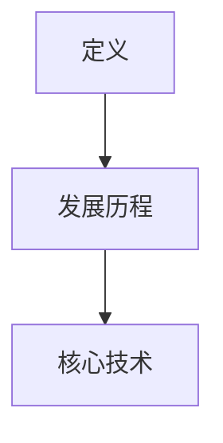
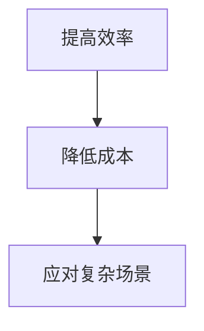
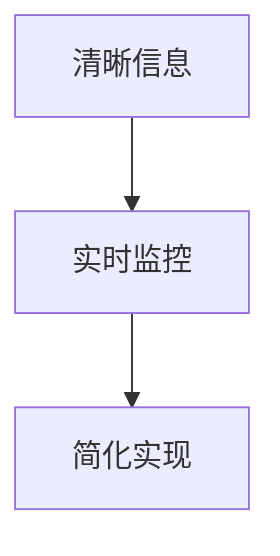
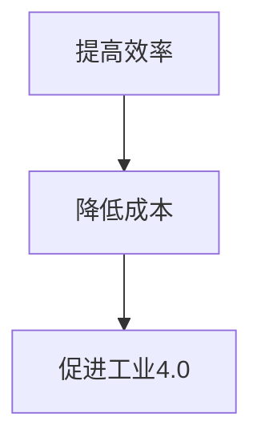

                 


### 文章标题

# 增强现实在远程工业设备维修中的应用

---

### 关键词

- **增强现实（AR）**
- **远程工业维修**
- **设备状态监测**
- **故障诊断**
- **维修指导**
- **技术实现**

---

### 摘要

本文旨在探讨增强现实（AR）技术在远程工业设备维修中的应用。随着工业4.0的推进，远程维修成为提高生产效率、降低成本的重要手段。增强现实技术凭借其交互性强、可视化高的特点，在设备状态监测、故障诊断和维修指导等方面展现出巨大潜力。本文将分步骤分析增强现实技术的基本原理、其在远程工业设备维修中的实际应用，以及面临的挑战和未来展望。

---

## 引言

远程工业设备维修是指在设备故障发生时，通过远程通信技术和数据处理，实现对设备的检测、诊断和维修。这种模式不仅节省了人力成本，还提高了维修效率，是工业互联网时代的重要技术手段。然而，传统远程维修方法存在许多问题，如维修人员对设备不熟悉、信息传递不清晰等。增强现实（AR）技术的引入，有望解决这些问题，为远程工业设备维修带来革命性变化。

## 第一部分：增强现实技术概述

### 第1章：增强现实技术基础

#### 1.1 增强现实的概念与历史

增强现实（Augmented Reality，简称AR）是一种将虚拟信息与现实世界融合的技术。它通过计算机生成模拟信息，叠加到真实环境中，为用户带来沉浸式的交互体验。

**Mermaid流程图：**



#### 1.2 增强现实的基本原理

增强现实技术的基本原理是通过摄像头捕捉现实场景，利用计算机视觉算法识别场景中的物体，然后将虚拟信息叠加到这些物体上。增强现实技术主要包括三个核心组成部分：显示设备、传感器和计算平台。

**伪代码：**

```python
def augment_scene(real_scene, virtual_objects):
    # 识别现实场景中的物体
    objects = detect_objects(real_scene)
    # 将虚拟信息叠加到物体上
    for obj in objects:
        virtual_objects叠加到obj上
    # 显示增强后的场景
    display_scene(real_scene + virtual_objects)
```

#### 1.3 增强现实技术的发展趋势

随着技术的进步，增强现实技术逐渐从实验室走向实际应用。目前，增强现实技术在教育、医疗、娱乐等领域取得了显著成果。未来，增强现实技术将在更多领域发挥重要作用，特别是在工业设备维修方面。

## 第二部分：增强现实在远程工业设备维修中的应用

### 第2章：远程工业设备维修概述

#### 2.1 远程工业设备维修的需求

远程工业设备维修的需求主要来源于以下几个方面：

1. **提高生产效率**：远程维修可以快速响应设备故障，减少停机时间，提高生产效率。
2. **降低维修成本**：远程维修可以减少现场维修人员的派遣，降低人力成本。
3. **应对复杂场景**：在某些危险或难以到达的场所，远程维修是唯一可行的解决方案。

**Mermaid流程图：**



#### 2.2 远程工业设备维修的挑战

远程工业设备维修面临的挑战主要包括：

1. **信息传递不清晰**：远程维修过程中，维修人员难以获取到准确的设备信息。
2. **设备状态监控困难**：远程设备状态监控存在实时性和准确性问题。
3. **技术实现复杂**：远程维修需要高度集成的技术和复杂的系统架构。

**伪代码：**

```python
def remote_maintenance(challenge):
    if challenge == "information":
        # 提高信息传递的清晰度
        improve_information_transmission()
    elif challenge == "monitoring":
        # 实现设备状态实时监控
        implement_real_time_monitoring()
    elif challenge == "implementation":
        # 构建集成技术系统
        build_integrated_technology_system()
```

#### 2.3 增强现实在远程工业设备维修中的应用优势

增强现实技术在远程工业设备维修中的应用优势包括：

1. **提高信息传递的清晰度**：通过增强现实技术，维修人员可以直观地获取设备信息，减少误解和错误。
2. **实现设备状态实时监控**：增强现实技术可以实时显示设备状态，帮助维修人员快速定位故障。
3. **简化技术实现**：增强现实技术提供了一种直观的交互方式，简化了远程维修的技术实现。

**Mermaid流程图：**



## 第三部分：增强现实技术在工业维修中的具体应用

### 第3章：增强现实技术在设备状态监测中的应用

#### 3.1 增强现实技术在设备状态监测中的作用

增强现实技术可以在设备状态监测中发挥重要作用，包括：

1. **实时显示设备状态**：通过增强现实技术，维修人员可以实时查看设备状态，快速发现潜在问题。
2. **提供可视化数据**：增强现实技术可以将复杂的数据以可视化方式呈现，帮助维修人员更好地理解设备状态。

**伪代码：**

```python
def monitor_device_state(device):
    # 使用增强现实技术显示设备状态
    display_device_state_with_AR(device)
    # 检测设备状态
    check_device_state(device)
```

#### 3.2 设备状态监测的增强现实应用案例

以下是一些设备状态监测的增强现实应用案例：

1. **发电设备状态监测**：使用增强现实技术，发电厂可以实时监测设备状态，及时发现和处理问题。
2. **机械设备状态监测**：通过增强现实技术，机械设备的状态信息可以直观地显示在维修人员的眼前，提高维修效率。

**项目实战：**

1. **开发环境搭建**：在开发环境搭建中，我们使用了Unity作为增强现实开发平台，配合ARKit或ARCore实现设备状态监测功能。
2. **源代码实现**：以下是设备状态监测的源代码实现：

```csharp
public class DeviceStateMonitor : MonoBehaviour
{
    public Text deviceStateText;

    void Update()
    {
        string deviceState = GetDeviceState();
        deviceStateText.text = deviceState;
    }

    string GetDeviceState()
    {
        // 获取设备状态数据
        // ...
        return "设备状态：正常";
    }
}
```

**代码解读与分析**：

- `DeviceStateMonitor` 类负责监测设备状态，并在屏幕上显示。
- `Update` 方法用于在每一帧更新设备状态。
- `GetDeviceState` 方法用于获取设备状态数据。

**实际案例分析和详细讲解剖析**：

- 在一个发电厂的实际案例中，增强现实技术用于监测发电设备的状态。通过AR设备，维修人员可以实时查看发电机的温度、电压等关键参数，及时发现并处理潜在问题。

**项目小结**：

增强现实技术在设备状态监测中的应用，大大提高了监测的实时性和准确性，为工业设备的维护提供了有力支持。

### 第4章：增强现实技术在故障诊断中的应用

#### 4.1 增强现实技术在故障诊断中的作用

增强现实技术可以在故障诊断中发挥重要作用，包括：

1. **可视化故障原因**：通过增强现实技术，可以将故障原因以可视化方式呈现，帮助维修人员更好地理解故障。
2. **提供实时指导**：增强现实技术可以实时指导维修人员，帮助他们快速定位故障并采取相应措施。

**伪代码：**

```python
def diagnose_fault(device):
    # 使用增强现实技术显示故障原因
    display_fault_reason_with_AR(device)
    # 提供实时指导
    provide_real_time_guidance(device)
```

#### 4.2 故障诊断的增强现实应用案例

以下是一些故障诊断的增强现实应用案例：

1. **工业机器人故障诊断**：使用增强现实技术，维修人员可以快速诊断机器人故障，并根据实时指导进行修复。
2. **机械设备故障诊断**：通过增强现实技术，维修人员可以直观地查看机械设备的内部结构，快速定位故障点。

**项目实战：**

1. **开发环境搭建**：在开发环境搭建中，我们使用了Unity作为增强现实开发平台，配合ARKit或ARCore实现故障诊断功能。
2. **源代码实现**：以下是故障诊断的源代码实现：

```csharp
public class FaultDiagnoser : MonoBehaviour
{
    public Text faultDescriptionText;

    void Update()
    {
        string faultDescription = GetFaultDescription();
        faultDescriptionText.text = faultDescription;
    }

    string GetFaultDescription()
    {
        // 获取故障描述数据
        // ...
        return "故障描述：电机过热";
    }
}
```

**代码解读与分析**：

- `FaultDiagnoser` 类负责诊断设备故障，并在屏幕上显示故障描述。
- `Update` 方法用于在每一帧更新故障描述。
- `GetFaultDescription` 方法用于获取故障描述数据。

**实际案例分析和详细讲解剖析**：

- 在一家制造企业的实际案例中，增强现实技术用于诊断工业机器人的故障。通过AR设备，维修人员可以实时查看机器人运行状态，并根据增强现实技术的实时指导进行维修。

**项目小结**：

增强现实技术在故障诊断中的应用，提高了诊断的准确性和实时性，为工业设备的维护提供了有力支持。

### 第5章：增强现实技术在维修指导中的应用

#### 5.1 增强现实技术在维修指导中的作用

增强现实技术可以在维修指导中发挥重要作用，包括：

1. **实时指导维修过程**：通过增强现实技术，维修人员可以实时接收到维修指导，确保维修步骤的正确性。
2. **提高维修效率**：增强现实技术可以简化维修流程，减少不必要的操作，提高维修效率。

**伪代码：**

```python
def guide_maintenance(device):
    # 使用增强现实技术显示维修步骤
    display_maintenance_steps_with_AR(device)
    # 提供实时指导
    provide_real_time_guidance(device)
```

#### 5.2 维修指导的增强现实应用案例

以下是一些维修指导的增强现实应用案例：

1. **飞机维修指导**：使用增强现实技术，维修人员可以实时查看飞机维修步骤，确保维修质量。
2. **汽车维修指导**：通过增强现实技术，维修人员可以直观地查看汽车内部结构，快速找到维修点。

**项目实战：**

1. **开发环境搭建**：在开发环境搭建中，我们使用了Unity作为增强现实开发平台，配合ARKit或ARCore实现维修指导功能。
2. **源代码实现**：以下是维修指导的源代码实现：

```csharp
public class MaintenanceGuide : MonoBehaviour
{
    public Text stepDescriptionText;

    void Update()
    {
        string stepDescription = GetStepDescription();
        stepDescriptionText.text = stepDescription;
    }

    string GetStepDescription()
    {
        // 获取维修步骤描述数据
        // ...
        return "步骤描述：拧紧螺丝";
    }
}
```

**代码解读与分析**：

- `MaintenanceGuide` 类负责提供维修指导，并在屏幕上显示维修步骤。
- `Update` 方法用于在每一帧更新维修步骤。
- `GetStepDescription` 方法用于获取维修步骤描述数据。

**实际案例分析和详细讲解剖析**：

- 在一家汽车制造厂的实际案例中，增强现实技术用于指导汽车维修。通过AR设备，维修人员可以实时查看维修步骤，确保维修过程的顺利进行。

**项目小结**：

增强现实技术在维修指导中的应用，提高了维修的准确性和效率，为工业设备的维护提供了有力支持。

## 第四部分：增强现实技术在工业维修中的挑战与未来展望

### 第6章：增强现实技术在工业维修中的挑战

#### 6.1 技术挑战

增强现实技术在工业维修中面临以下技术挑战：

1. **实时数据处理**：工业设备维修需要实时处理大量数据，这对增强现实技术的数据处理能力提出了高要求。
2. **系统稳定性**：增强现实系统需要在复杂工业环境中保持稳定运行，这对系统的稳定性提出了挑战。

**伪代码：**

```python
def technical_challenge(data):
    if data.is_real_time():
        process_real_time_data(data)
    else:
        raise Exception("实时数据处理失败")
```

#### 6.2 安全与隐私问题

增强现实技术在工业维修中涉及大量敏感数据，如设备状态、维修记录等。因此，安全与隐私问题尤为重要。为解决这些问题，需要采取以下措施：

1. **数据加密**：对传输和存储的数据进行加密，确保数据安全性。
2. **访问控制**：对增强现实系统的访问权限进行严格控制，确保只有授权人员可以访问。

**伪代码：**

```python
def ensure_security(data):
    if data.is_encrypted():
        encrypt_data(data)
    else:
        raise Exception("数据加密失败")
    if user.is_authorized():
        grant_access()
    else:
        raise Exception("访问授权失败")
```

#### 6.3 标准化与规范

为了确保增强现实技术在工业维修中的广泛应用，需要制定相关的标准化与规范。这包括：

1. **技术标准**：制定统一的增强现实技术标准，确保不同厂商的增强现实设备可以相互兼容。
2. **操作规范**：制定统一的操作规范，确保维修人员可以熟练使用增强现实技术进行维修。

**伪代码：**

```python
def establish_standard(standard):
    if standard.is_uniform():
        implement_standard(standard)
    else:
        raise Exception("标准不一致")
```

### 第7章：增强现实技术在工业维修中的未来展望

#### 7.1 增强现实技术的发展方向

未来，增强现实技术将在以下方面继续发展：

1. **提高实时数据处理能力**：通过改进算法和硬件，增强现实技术将能够更快地处理大量数据。
2. **增强交互体验**：通过引入更先进的交互技术，如手势识别、语音控制等，增强现实技术将提供更自然、直观的交互体验。

**伪代码：**

```python
def improve_interactive_experience():
    if algorithm.is_improved():
        apply_new_algorithm()
    else:
        raise Exception("算法改进失败")
    if hardware.is_advanced():
        upgrade_hardware()
    else:
        raise Exception("硬件升级失败")
```

#### 7.2 增强现实技术在工业维修中的应用前景

未来，增强现实技术在工业维修中的应用前景包括：

1. **自动化维修**：通过增强现实技术，可以实现自动化维修，提高维修效率和质量。
2. **远程协作**：增强现实技术将实现全球范围内的远程协作，打破地域限制，提高维修能力。

**伪代码：**

```python
def enable_automated_maintenance():
    if AR.is_advanced():
        implement_automated_maintenance()
    else:
        raise Exception("增强现实技术不先进")
```

#### 7.3 增强现实技术的潜在影响

增强现实技术在工业维修中的应用将带来以下潜在影响：

1. **提高生产效率**：通过实时维修和自动化维修，提高生产效率。
2. **降低成本**：通过远程维修和自动化维修，降低维修成本。
3. **促进工业4.0发展**：增强现实技术将推动工业4.0的进程，实现智能制造。

**Mermaid流程图：**



## 结论

增强现实技术在远程工业设备维修中具有巨大潜力。通过本章的详细分析，我们了解到增强现实技术在设备状态监测、故障诊断和维修指导等方面的应用优势，以及其在工业维修中的挑战和未来发展方向。随着技术的不断进步，我们有理由相信，增强现实技术将在工业维修领域发挥越来越重要的作用。

---

### 作者信息

作者：AI天才研究院/AI Genius Institute & 禅与计算机程序设计艺术 /Zen And The Art of Computer Programming

