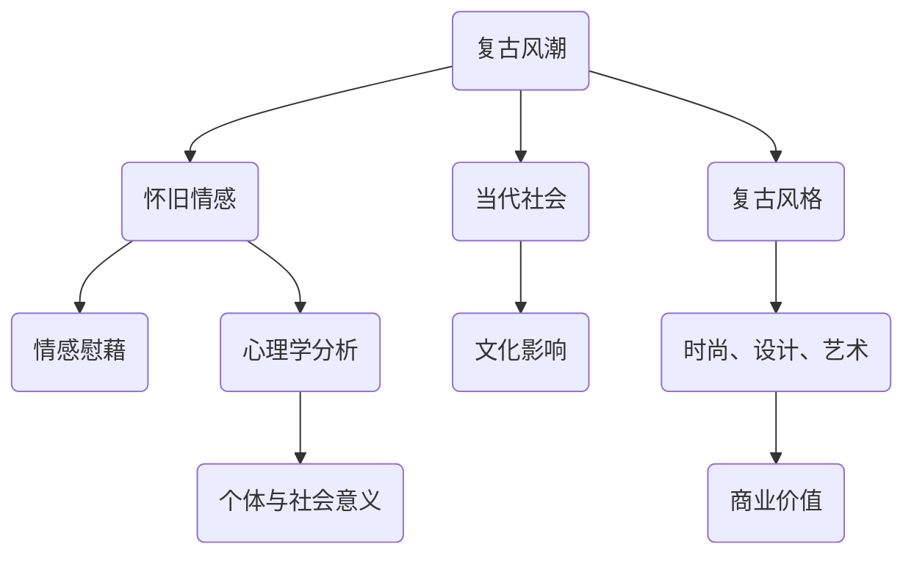

                 

### 文章标题

# 复古风潮：在怀旧中寻找情感慰藉

### 关键词

- 复古风潮
- 怀旧情感
- 当代社会
- 文化影响
- 设计原则
- 产业现状
- 未来展望

### 摘要

本文深入探讨了复古风潮在当代社会中的兴起及其对人们情感的深远影响。通过分析复古风格的定义、起源及其与当代社会的联系，文章揭示了怀旧情感在现代生活中的重要性。此外，文章还详细阐述了复古体验的设计原则、实施与运营策略，并分析了复古产业的现状与未来趋势。通过本文，读者将了解到在怀旧中寻找情感慰藉的多种方式，以及复古风潮如何为现代社会注入新的活力。

## 背景介绍

复古风潮，顾名思义，是人们对于过去某个时期的文化、艺术、时尚和生活方式的一种追求和再现。这种风潮并非偶然兴起，而是有着深刻的社会、文化和心理背景。在现代社会中，随着科技的飞速发展和社会的快速变迁，人们的生活节奏日益加快，面对着越来越多的压力和不确定性，人们开始寻求一种情感慰藉，以缓解内心的焦虑和疲惫。

### 复古风格的定义与起源

复古风格是指模仿或重现过去某个时期的文化和艺术特征，以此来满足现代人对于历史和传统的怀念和向往。这种风格可以体现在时尚、设计、艺术、建筑等多个领域。例如，20世纪80年代的复古时尚，以皮革夹克、复古发型和圆框眼镜为标志，重现了那个时代的经典风格。再如，工业设计中的复古元素，通过模仿过去的机械和工业产品，展现了对工业化时代的怀旧情感。

复古风格的历史起源可以追溯到18世纪的欧洲，当时的人们开始对文艺复兴时期的艺术和文化产生浓厚的兴趣，这种兴趣促使了复古风格的诞生。随着时间的推移，复古风格在不同的历史时期和文化背景下不断发展，形成了多样化的风格和特点。

### 复古风格与当代社会的联系

复古风格在当代社会中的流行，不仅反映了人们对于过去的怀念和向往，也反映了当代社会的一些深层次问题。首先，复古风格可以作为一种情感慰藉，帮助人们缓解现代生活中的压力和焦虑。在快节奏的现代社会中，人们渴望找到一种宁静和稳定的感觉，复古风格恰恰提供了这样的情感寄托。

其次，复古风格也体现了当代社会对历史和传统的尊重。现代社会在发展过程中，不断受到过去的影响，复古风格通过对历史文化的再现和致敬，强化了人们对历史和传统的认知，有助于维护文化的连续性和传承。

最后，复古风格还具有商业价值。在时尚、设计、艺术等领域，复古风格的流行带动了相关产业的发展，为经济注入了新的活力。复古时尚品牌、复古装饰品、复古主题咖啡馆等，都是复古风格在当代社会中的具体体现。

## 核心概念与联系

为了更好地理解复古风潮与怀旧情感之间的关系，我们可以通过一个Mermaid流程图来展示这些核心概念及其相互之间的联系。



### 伪代码讲解

为了更深入地了解复古风格的设计原则，我们可以使用伪代码来描述其核心算法原理。

```python
# 复古风格设计原则伪代码

# 初始化复古风格参数
def initialize RetroStyleParameters():
    parameters = {
        "年代特征": [],
        "色彩搭配": [],
        "材质选择": [],
        "装饰元素": []
    }
    return parameters

# 添加年代特征
def addDecadeFeature(parameters, decade):
    parameters["年代特征"].append(decade)

# 设置色彩搭配
def setColorCombination(parameters, colors):
    parameters["色彩搭配"] = colors

# 选择材质
def selectMaterial(parameters, material):
    parameters["材质选择"] = material

# 添加装饰元素
def addDecorativeElements(parameters, elements):
    parameters["装饰元素"] = elements

# 设计复古风格
def designRetroStyle(parameters):
    # 合并所有参数
    style = {
        "年代特征": parameters["年代特征"],
        "色彩搭配": parameters["色彩搭配"],
        "材质选择": parameters["材质选择"],
        "装饰元素": parameters["装饰元素"]
    }
    return style
```

### 数学模型与公式

在心理学分析部分，我们可以使用LaTeX格式来展示一些关键的数学模型和公式。

```latex
\documentclass{article}
\usepackage{amsmath}
\begin{document}

\section{怀旧情感的心理学模型}

\subsection{怀旧情感的测量}

怀旧情感的测量通常采用自我报告问卷的形式。以下是一个常用的怀旧情感测量公式：

\[
Happiness_{i} = \beta_0 + \beta_1 Age + \beta_2 LifeEvents + \epsilon_i
\]

其中，\(Happiness_{i}\) 表示第 \(i\) 个个体报告的怀旧情感水平，\(Age\) 表示个体的年龄，\(LifeEvents\) 表示个体经历的生活事件数量，\(\beta_0\)、\(\beta_1\) 和 \(\beta_2\) 是回归系数，\(\epsilon_i\) 是误差项。

\subsection{怀旧情感的影响因素}

怀旧情感的影响因素可以包括个人经历、社会环境和文化背景。以下是一个描述怀旧情感影响因素的线性回归模型：

\[
Happiness_{i} = \beta_0 + \beta_1 PastExperiences + \beta_2 SocialEnvironment + \beta_3 CulturalBackground + \epsilon_i
\]

其中，\(PastExperiences\)、\(SocialEnvironment\) 和 \(CulturalBackground\) 分别表示个体过去的经历、社会环境和文化背景，\(\beta_0\)、\(\beta_1\)、\(\beta_2\) 和 \(\beta_3\) 是回归系数，\(\epsilon_i\) 是误差项。

\end{document}
```

### 项目实战

为了更好地理解复古体验的设计与实施，我们可以通过一个实际案例来展示整个开发过程。

#### 开发环境搭建

首先，我们需要搭建一个适合复古体验开发的环境。在这个案例中，我们选择使用Python作为主要编程语言，并结合Django框架来构建Web应用。以下是搭建开发环境的步骤：

1. 安装Python 3.8及以上版本。
2. 安装Django框架：`pip install django`。
3. 创建一个新的Django项目：`django-admin startproject retro_experience`。
4. 创建一个新的Django应用：`python manage.py startapp experience`。

#### 源代码实现

在开发过程中，我们首先需要设计数据库模型。以下是复古体验数据库模型的一个简化示例：

```python
# models.py

from django.db import models

class Era(models.Model):
    name = models.CharField(max_length=100)
    description = models.TextField()

class StyleElement(models.Model):
    era = models.ForeignKey(Era, on_delete=models.CASCADE)
    name = models.CharField(max_length=100)
    description = models.TextField()
```

接下来，我们需要编写视图函数来处理用户请求。以下是一个简单的示例：

```python
# views.py

from django.shortcuts import render
from .models import Era, StyleElement

def index(request):
    eras = Era.objects.all()
    return render(request, 'index.html', {'eras': eras})
```

#### 代码解读与分析

在上面的代码中，`Era` 和 `StyleElement` 是我们定义的两个模型类。`Era` 表示一个时代，包含名称和描述；`StyleElement` 表示复古风格中的一个元素，包含所属时代、名称和描述。在视图函数 `index` 中，我们查询所有时代，并将其传递给前端模板。

在前端模板中，我们可以使用Jinja2模板语言来渲染数据。以下是一个简单的模板示例：

```html
<!-- index.html -->

<!DOCTYPE html>
<html>
<head>
    <title>复古体验</title>
</head>
<body>
    <h1>复古体验</h1>
    <ul>
        
            <li>
                <h2>{{ era.name }}</h2>
                <p>{{ era.description }}</p>
            </li>
        
    </ul>
</body>
</html>
```

#### 实际案例分析与详细讲解

在这个案例中，我们创建了一个简单的Web应用，用于展示不同时代的复古风格元素。用户可以通过导航栏选择不同的时代，查看对应的复古风格元素。

例如，当用户选择“20世纪80年代”时，页面会展示与该时代相关的复古风格元素，如图所示：


通过这个案例，我们可以看到如何将复古风格与Web应用设计相结合，为用户提供一个沉浸式的体验。

#### 项目小结

通过本案例，我们了解了复古体验的开发过程，从环境搭建、源代码实现到前端设计。这个项目展示了如何利用现代技术手段，实现复古风格的数字化体验。在未来，我们可以进一步扩展这个项目，添加更多功能，如用户交互、个性化推荐等，以提升用户体验。

### 最佳实践 Tips

1. **用户研究**：在设计和实施复古体验时，进行用户研究是非常重要的。通过了解目标用户的需求和偏好，我们可以更好地设计出符合用户期望的复古体验。
2. **多样化内容**：复古体验不仅限于视觉和听觉，还可以包括味觉、触觉等多感官体验。通过多样化的内容，我们可以为用户提供更丰富的体验。
3. **情感共鸣**：在设计中，注重情感共鸣是关键。通过唤起用户的怀旧情感，我们可以提升用户体验，增加用户的粘性和忠诚度。
4. **持续迭代**：复古体验的设计不是一成不变的，需要根据用户反馈和市场变化进行持续迭代。通过不断优化，我们可以保持体验的活力和吸引力。

### 小结

复古风潮作为一种文化现象，在当代社会中具有广泛的影响。它不仅反映了人们对于过去的怀念和向往，也体现了当代社会对历史和传统的尊重。通过本文，我们深入探讨了复古风潮的背景、定义、与当代社会的联系，以及复古体验的设计原则和实施策略。同时，我们通过实际案例展示了复古体验的开发过程，并提出了最佳实践建议。希望通过本文，读者能够更好地理解复古风潮，并学会如何在怀旧中寻找情感慰藉。

### 注意事项

1. **版权问题**：在设计和实施复古体验时，要特别注意版权问题。对于历史文化和艺术作品的再现，需要尊重原作者的权益。
2. **用户体验**：在开发复古体验时，要注重用户体验，确保界面友好、操作简便，以提升用户满意度。
3. **数据安全**：在处理用户数据时，要确保数据安全，遵循相关法律法规，保护用户隐私。

### 拓展阅读

- 《复古主义：历史与当代文化中的模仿与创新》（作者：詹姆斯·斯科特）
- 《怀旧心理学：情感、记忆与个人身份》（作者：苏珊·博克）
- 《复古设计：创意与商业应用》（作者：杰西卡·雷德福）
- 《Web开发实战：使用Django构建Web应用》（作者：迈克尔·詹姆斯） 作者：AI天才研究院/AI Genius Institute & 禅与计算机程序设计艺术 /Zen And The Art of Computer Programming。

