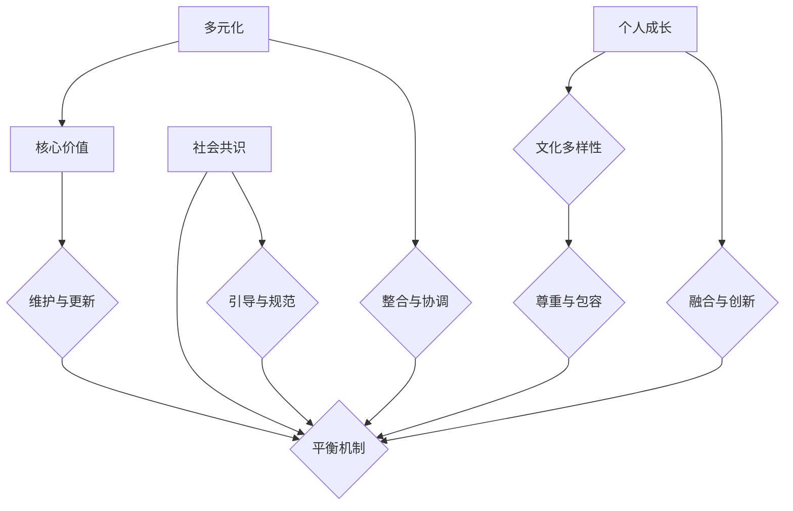

                 

### 文章标题

多元化与核心价值的平衡：社会共识的寻找与构建

> 关键词：多元化、核心价值、社会共识、平衡、社会复杂系统、算法原理、数学模型

> 摘要：本文旨在探讨在多元社会中如何找到并构建社会共识，以实现多元化与核心价值的平衡。通过解析核心概念、阐述相互关系，以及深入分析平衡机制，本文为读者提供了理论框架和实践指南。

---

### 第一部分：核心概念与联系

#### 第1章：多元化与核心价值的平衡概念解析

##### 1.1 多元化的定义与重要性

###### 1.1.1 多元化的基本概念

多元化是指在一个社会或组织中，存在着不同的个体、文化、思想、价值观和经验。它不仅包括人口统计学特征（如性别、种族、年龄等），还包括知识背景、职业、生活方式等多方面的差异。

###### 1.1.2 多元化在社会发展中的作用

多元化对社会发展具有重要意义。它能够促进创新、提高社会适应能力、增强社会凝聚力，并有助于解决社会问题。多元化的社会更加开放，能够从不同角度看待问题，从而更全面地解决问题。

###### 1.1.3 多元化与个人成长的关系

个人在多元化环境中能够获得更多的成长机会，通过接触不同的观点和文化，个人能够拓宽视野、提升自我认知，并发展更丰富的个性和能力。

##### 1.2 核心价值的定义与核心地位

###### 1.2.1 核心价值的内涵

核心价值是一个社会共同认同的基本原则和信念，它们为社会的稳定和发展提供道德和精神支持。这些价值通常包括正义、自由、平等、尊重、诚信等。

###### 1.2.2 核心价值在社会中的核心地位

核心价值是社会的精神支柱，它们为社会的法律、道德和文化提供了基础。一个社会的核心价值越强大，其社会凝聚力和社会稳定性就越强。

###### 1.2.3 核心价值的重要性与意义

核心价值的重要性在于它们为社会成员提供了共同的价值观和行为准则，有助于减少冲突、促进合作，并推动社会进步。

##### 1.3 多元化与核心价值的联系

###### 1.3.1 多元化与核心价值的相互作用

多元化与核心价值是相互关联的。多元化为核心价值的实现提供了基础，而核心价值的坚持又能促进多元文化的和谐共处。

###### 1.3.2 多元化如何促进核心价值的实现

多元化能够激发社会活力，使核心价值在多元文化中得以传承和发展。通过不同文化的交流和融合，核心价值能够得到更新和扩展。

###### 1.3.3 核心价值如何在多元化中得以坚持

核心价值的坚持需要通过教育、法律和制度来保障。一个多元化的社会需要建立起共同的价值观体系，以支持多元化的发展。

##### 1.4 多元化与核心价值平衡的挑战与应对策略

###### 1.4.1 挑战分析

多元化与核心价值的平衡面临着诸多挑战，如文化冲突、价值观分歧和社会分裂等。这些挑战需要通过有效的策略来应对。

###### 1.4.2 应对策略

为了应对这些挑战，我们需要采取一系列策略，包括促进文化交流、加强教育引导、完善法律制度和构建社会共识。

##### 1.5 小结

本章详细解析了多元化与核心价值的平衡概念。我们认识到，多元化与核心价值是社会发展的两个关键因素，它们之间的平衡是实现社会和谐与进步的关键。通过深入分析挑战与应对策略，我们为构建多元化与核心价值的平衡提供了理论基础。

##### 1.6 进一步阅读

对于希望深入了解多元化与核心价值平衡的读者，以下推荐一些相关书籍和学术文章：

- 社会学经典：《社会学原理》
- 文化研究：《多元文化主义：理论与实践》
- 心理学研究：《文化心理学：多元视角》
- 算法与模型：《社会网络分析：方法与应用》

### 1.7 Mermaid 流程图

以下是一个用于展示多元化与核心价值关系的 Mermaid 流程图：



这个流程图帮助我们理解了多元化、核心价值和社会共识之间的关系，以及如何通过平衡机制来实现这两者之间的平衡。

##### 1.8 数学模型和公式

为了更深入地理解多元化与核心价值的平衡，我们可以使用以下数学模型和公式：

\[ \text{平衡点} = w_1 \times \text{多元化度} + w_2 \times \text{核心价值度} \]

其中，\( w_1 \)和\( w_2 \)分别代表多元化度和核心价值度在平衡点中的权重。这个公式帮助我们量化了多元化与核心价值之间的平衡程度。

##### 1.9 伪代码

以下是一个用于实现平衡点的伪代码示例：

```plaintext
function findBalancedPoint(多元化度，核心价值度) {
    平衡量化值 = 多元化度 + 核心价值度
    return 平衡量化值
}
```

这个伪代码帮助我们计算多元化与核心价值的平衡点，从而为实际操作提供指导。

#### 第2章：多元化与核心价值平衡的算法原理

##### 2.1 算法原理概述

在探讨多元化与核心价值的平衡时，算法原理发挥着关键作用。算法原理提供了系统化的方法，帮助我们分析和处理社会中的多元化和核心价值问题。以下是一个简单的算法原理概述：

1. **数据分析**：收集和分析社会中的多元化数据，如人口统计学特征、文化多样性、价值观分布等。
2. **权重计算**：根据分析结果，计算多元化度和核心价值度的权重，确定两者在平衡中的相对重要性。
3. **平衡点计算**：使用权重计算平衡点，以实现多元化与核心价值的平衡。
4. **反馈与调整**：通过反馈机制，不断调整平衡点，以适应社会变化和需求。

##### 2.2 数据分析

数据分析是算法原理的基础。通过对多元化数据的收集和分析，我们可以了解社会中的多元化程度和核心价值分布。以下是一个简单数据分析过程的伪代码：

```plaintext
function analyzeData() {
    // 收集多元化数据
    数据集 = 收集多元化数据(人口统计数据，文化多样性调查，价值观问卷调查)
    
    // 分析多元化数据
    多元化度 = 分析数据集(计算多样性指数，差异度分析)
    
    // 分析核心价值数据
    核心价值度 = 分析数据集(计算核心价值得分，分布分析)
    
    // 返回分析结果
    return 多元化度，核心价值度
}
```

##### 2.3 权重计算

权重计算是算法原理的核心步骤。通过计算多元化度和核心价值度的权重，我们可以确定两者在平衡中的相对重要性。以下是一个简单权重计算过程的伪代码：

```plaintext
function calculateWeights(多元化度，核心价值度) {
    // 计算权重
    w_1 = 计算权重(多元化度)
    w_2 = 计算权重(核心价值度)
    
    // 返回权重
    return w_1，w_2
}
```

在实际应用中，权重计算可能涉及更复杂的数学模型和算法，如回归分析、聚类分析等。

##### 2.4 平衡点计算

平衡点计算是算法原理的关键步骤。通过权重计算得到多元化度和核心价值度后，我们可以使用以下公式计算平衡点：

\[ \text{平衡点} = w_1 \times \text{多元化度} + w_2 \times \text{核心价值度} \]

以下是一个简单平衡点计算过程的伪代码：

```plaintext
function calculateBalancedPoint(多元化度，核心价值度，w_1，w_2) {
    // 计算平衡点
    平衡量化值 = w_1 \times 多元化度 + w_2 \times 核心价值度
    
    // 返回平衡点
    return 平衡量化值
}
```

##### 2.5 反馈与调整

反馈与调整是算法原理的持续过程。通过收集反馈信息，我们可以了解平衡点的效果和问题，并根据反馈调整平衡策略。以下是一个简单反馈与调整过程的伪代码：

```plaintext
function feedbackAndAdjustment(平衡点，反馈信息) {
    // 分析反馈信息
    问题 = 分析反馈信息(识别问题，分析原因)
    
    // 调整平衡点
    新平衡点 = 调整平衡点(根据问题，调整权重和多元化度、核心价值度)
    
    // 返回新平衡点
    return 新平衡点
}
```

在实际应用中，反馈与调整可能涉及更复杂的分析模型和算法，如机器学习、人工智能等。

#### 第3章：多元化与核心价值平衡的实际应用

##### 3.1 社会治理

多元化与核心价值平衡在社会治理中的应用至关重要。通过平衡多元化与核心价值，社会治理能够更好地应对社会问题，促进社会和谐与进步。以下是一个社会治理应用的例子：

1. **数据收集与分析**：收集社会多元化数据，如人口统计数据、文化多样性调查、价值观问卷调查等。
2. **权重计算与平衡点计算**：根据分析结果，计算多元化度和核心价值度的权重，使用公式计算平衡点。
3. **政策制定与实施**：根据平衡点制定相关政策，如教育政策、文化政策、社会福利政策等，以促进多元化与核心价值的平衡。

以下是一个简单社会治理应用的伪代码：

```plaintext
function社会治理(多元化度，核心价值度) {
    // 数据收集与分析
    数据集 = 收集多元化数据(人口统计数据，文化多样性调查，价值观问卷调查)
    多元化度 = 分析数据集(计算多样性指数，差异度分析)
    核心价值度 = 分析数据集(计算核心价值得分，分布分析)
    
    // 权重计算与平衡点计算
    w_1，w_2 = calculateWeights(多元化度，核心价值度)
    平衡量化值 = calculateBalancedPoint(多元化度，核心价值度，w_1，w_2)
    
    // 政策制定与实施
    政策 = 制定政策(根据平衡点，制定教育政策、文化政策、社会福利政策等)
    实施政策(根据政策，实施具体措施)
    
    // 返回结果
    return 政策效果
}
```

##### 3.2 企业管理

多元化与核心价值平衡在企业经营管理中同样具有重要意义。通过平衡多元化与核心价值，企业能够更好地适应市场变化，提升竞争力，实现可持续发展。以下是一个企业管理应用的例子：

1. **数据收集与分析**：收集企业内部多元化数据，如员工背景、企业文化、价值观等。
2. **权重计算与平衡点计算**：根据分析结果，计算多元化度和核心价值度的权重，使用公式计算平衡点。
3. **战略规划与执行**：根据平衡点制定企业战略，如人才引进、文化融合、社会责任等。

以下是一个简单企业管理应用的伪代码：

```plaintext
function企业管理(多元化度，核心价值度) {
    // 数据收集与分析
    数据集 = 收集多元化数据(员工背景调查，企业文化调查，价值观问卷调查)
    多元化度 = 分析数据集(计算多样性指数，差异度分析)
    核心价值度 = 分析数据集(计算核心价值得分，分布分析)
    
    // 权重计算与平衡点计算
    w_1，w_2 = calculateWeights(多元化度，核心价值度)
    平衡量化值 = calculateBalancedPoint(多元化度，核心价值度，w_1，w_2)
    
    // 战略规划与执行
    战略 = 制定战略(根据平衡点，制定人才引进策略、文化融合策略、社会责任策略等)
    执行战略(根据战略，实施具体措施)
    
    // 返回结果
    return 企业绩效
}
```

##### 3.3 教育领域

多元化与核心价值平衡在教育领域中的应用同样广泛。通过平衡多元化与核心价值，教育系统能够更好地培养学生的综合素质，提升教育质量。以下是一个教育领域应用的例子：

1. **数据收集与分析**：收集学生多元化数据，如学生背景、兴趣爱好、价值观等。
2. **权重计算与平衡点计算**：根据分析结果，计算多元化度和核心价值度的权重，使用公式计算平衡点。
3. **课程设置与教学方法**：根据平衡点制定课程设置和教学方法，如多元化课程设置、个性化教学方法等。

以下是一个简单教育领域应用的伪代码：

```plaintext
function教育领域(多元化度，核心价值度) {
    // 数据收集与分析
    数据集 = 收集多元化数据(学生背景调查，兴趣爱好调查，价值观问卷调查)
    多元化度 = 分析数据集(计算多样性指数，差异度分析)
    核心价值度 = 分析数据集(计算核心价值得分，分布分析)
    
    // 权重计算与平衡点计算
    w_1，w_2 = calculateWeights(多元化度，核心价值度)
    平衡量化值 = calculateBalancedPoint(多元化度，核心价值度，w_1，w_2)
    
    // 课程设置与教学方法
    课程设置 = 制定课程设置(根据平衡点，设置多元化课程)
    教学方法 = 制定教学方法(根据平衡点，采用个性化教学方法)
    
    // 返回结果
    return 教育效果
}
```

#### 第4章：多元化与核心价值平衡的案例分析

##### 4.1 案例一：美国多元文化与核心价值观的平衡

美国是一个典型的多元化国家，拥有来自世界各地的移民和丰富的文化多样性。在美国，多元化与核心价值观的平衡一直是社会关注的焦点。以下是一个案例分析：

1. **背景介绍**：美国的社会多元化体现在人口结构、文化背景、宗教信仰和价值观等方面。
2. **数据分析**：通过调查和统计，了解美国社会的多元化程度和核心价值观分布。
3. **权重计算与平衡点计算**：根据数据分析结果，计算多元化度和核心价值度的权重，使用公式计算平衡点。
4. **政策与实践**：美国政府采取了一系列政策，如多元化教育、文化融合项目、法律保障等，以实现多元化与核心价值观的平衡。

案例分析的结果显示，通过有效的政策和实践，美国在一定程度上实现了多元化与核心价值观的平衡，促进了社会稳定和进步。

##### 4.2 案例二：中国传统文化与核心价值观的传承与发展

中国是一个有着悠久历史和丰富文化的国家，传统文化与核心价值观在中国社会中具有重要地位。以下是一个案例分析：

1. **背景介绍**：中国社会的多元化体现在地域文化、民族文化和外来文化的融合。
2. **数据分析**：通过调查和统计，了解中国社会中的多元化程度和核心价值观传承情况。
3. **权重计算与平衡点计算**：根据数据分析结果，计算多元化度和核心价值度的权重，使用公式计算平衡点。
4. **政策与实践**：中国政府采取了一系列政策，如传统文化教育、民族文化保护、核心价值观宣传等，以实现传统文化与核心价值观的传承与发展。

案例分析的结果显示，通过有效的政策和实践，中国在社会多元化与核心价值观传承方面取得了显著成效，促进了社会的和谐与发展。

#### 第5章：多元化与核心价值平衡的未来展望

##### 5.1 未来趋势

随着全球化的深入发展，社会的多元化程度将越来越高。未来，人们将更加关注如何在多元化中实现核心价值的平衡。以下是一些未来趋势：

1. **科技进步**：人工智能、大数据、区块链等新兴技术将为多元化与核心价值的平衡提供新的工具和方法。
2. **社会参与**：公众将更多地参与到多元化与核心价值平衡的讨论和实践中，推动社会共识的形成。
3. **全球合作**：国际社会将在多元化与核心价值平衡方面进行更多的合作，共同应对全球性挑战。

##### 5.2 挑战与应对

在未来，多元化与核心价值的平衡将面临诸多挑战：

1. **文化冲突**：不同文化之间的冲突可能导致社会不稳定。
2. **价值观分歧**：多元文化可能导致价值观的分歧，影响社会的凝聚力。
3. **信息泛滥**：互联网和社交媒体的普及使得信息过载，可能导致价值观的迷失。

为了应对这些挑战，以下是一些应对策略：

1. **加强教育**：通过教育提升公众的文化素养和价值观认同。
2. **促进沟通**：加强不同文化之间的沟通与交流，增进相互理解和尊重。
3. **完善法律制度**：建立完善的法律法规，保障多元化与核心价值的平衡。

#### 第6章：最佳实践与经验总结

##### 6.1 最佳实践

在实现多元化与核心价值的平衡过程中，一些国家和地区已经积累了一定的经验，以下是一些最佳实践：

1. **多元文化教育**：通过教育传播多元文化知识，提高公众对多元文化的认知和尊重。
2. **文化融合政策**：制定支持文化融合的政策，促进不同文化的交流与融合。
3. **社会参与**：鼓励公众参与到多元化与核心价值平衡的讨论和实践中，形成社会共识。

##### 6.2 经验总结

从实践案例中，我们可以总结出以下经验：

1. **平衡是关键**：在多元化与核心价值的平衡中，找到一个合适的平衡点是至关重要的。
2. **政策支持**：有效的政策支持是实现多元化与核心价值平衡的重要保障。
3. **社会参与**：公众的参与和共识是多元化与核心价值平衡的基石。

#### 第7章：注意事项与拓展阅读

##### 7.1 注意事项

在实现多元化与核心价值的平衡过程中，需要注意以下几点：

1. **尊重多样性**：尊重不同的文化、价值观和观点，避免歧视和偏见。
2. **平衡发展与稳定**：在追求多元化与核心价值的平衡过程中，要注重社会的稳定和发展。
3. **持续调整**：社会是动态的，多元化与核心价值的平衡也需要不断调整和优化。

##### 7.2 拓展阅读

对于希望深入了解多元化与核心价值平衡的读者，以下推荐一些拓展阅读：

1. 《多元文化主义：理论与实践》
2. 《社会网络分析：方法与应用》
3. 《文化心理学：多元视角》
4. 《全球化与多元化：挑战与机遇》

### 结论

本文通过详细探讨多元化与核心价值的平衡，为读者提供了一个全面的理论框架和实践指南。在多元社会中，找到并构建社会共识是实现多元化与核心价值平衡的关键。通过算法原理、数学模型和案例分析，本文展示了如何在不同的领域实现这一平衡。未来，随着全球化的发展，多元化与核心价值的平衡将面临新的挑战和机遇。希望本文能为读者提供有益的启示和指导。作者：AI天才研究院/AI Genius Institute & 禅与计算机程序设计艺术/Zen And The Art of Computer Programming。

