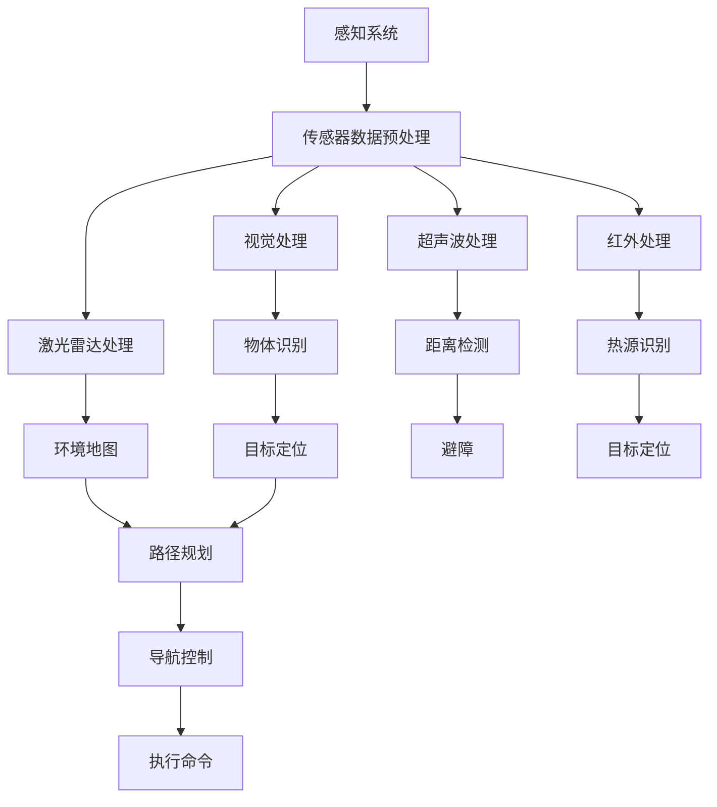

                 

### 《多功能机器人在灾难救援中的应用》

#### 关键词：
- 多功能机器人
- 灾难救援
- 感知与导航
- 决策与控制
- 人机交互
- 应用案例

#### 摘要：
本文深入探讨了多功能机器人在灾难救援中的应用，首先介绍了灾难救援的背景和类型，然后详细阐述了多功能机器人的定义、特点及其核心技术，如感知与导航、决策与控制和人机交互。接着，通过具体的应用案例，展示了多功能机器人在地震、洪水和山体滑坡等不同类型灾难救援中的实际应用效果，并提供了详细的技术实现和解构分析。最后，总结了最佳实践技巧，并提出了未来发展的方向。

----------------------------------------------------------------

### 第一部分：灾难救援与多功能机器人概述

#### 第1章：灾难救援背景

##### 1.1 灾害类型与救援需求

灾难救援是指在面对自然灾害或人为灾害时，采取的紧急救助措施，以减少人员伤亡和财产损失。常见的灾害类型包括地震、洪水、山体滑坡、火灾、爆炸、恐怖袭击等。每种灾害都有其特定的危害和救援需求。

- **地震救援**：主要目标是迅速定位受困人员，提供食物、水和医疗援助。
- **洪水救援**：需要及时转移受困群众，开辟逃生通道，并防止水源污染。
- **山体滑坡救援**：重点是搜索被困人员，并确保救援人员的安全。

##### 1.2 灾难救援技术的发展

灾难救援技术经历了从传统的人力搜索到现代化救援装备的演变。现代救援技术主要包括：

- **无人机侦查**：用于高空侦查和快速评估灾情。
- **生命探测仪**：通过声波、振动等方式探测地下生命迹象。
- **机械手臂**：用于开辟逃生通道和搬运重物。

然而，尽管现代技术提升了救援效率，但在一些极端环境下，救援工作仍然面临巨大挑战。这促使研究者探索更高级的救援工具，如多功能机器人。

### 第2章：多功能机器人的定义与特点

##### 2.1 多功能机器人的基本概念

多功能机器人是指能够执行多种任务，适应多种环境，并与其他机器人协同工作的智能机器人。它们通常具备以下特点：

- **多传感器集成**：如摄像头、激光雷达、超声波传感器等，用于感知周围环境。
- **自主导航**：利用导航算法，实现自主移动和路径规划。
- **多功能机械臂**：用于执行精细操作，如搬运物品、拆解障碍物等。
- **人机交互界面**：实现与操作者的实时通信和指令输入。

##### 2.2 多功能机器人的技术特点

多功能机器人的技术特点包括：

- **高可靠性**：在极端环境下保持稳定运行。
- **智能化**：具备自我学习和自适应能力。
- **灵活性**：能够适应不同的任务和环境。
- **协同性**：与其他机器人或救援人员高效协作。

##### 2.3 多功能机器人的分类

根据应用领域和任务需求，多功能机器人可以分为以下几类：

- **搜索救援机器人**：主要用于地震、洪水等灾害中的搜索和救援。
- **灾害评估机器人**：用于检测环境污染、评估灾害程度等。
- **工程维修机器人**：用于建筑物、桥梁等结构的检测和维修。
- **医疗服务机器人**：提供紧急医疗援助和护理服务。

#### 第3章：多功能机器人在灾难救援中的应用场景

##### 3.1 搜索与救援

在地震等灾害中，多功能机器人可以通过感知传感器快速识别受困人员，利用自主导航系统前往指定位置，并通过机械臂提供救援物资和医疗设备。以下是一个典型的应用场景：

- **感知阶段**：机器人通过摄像头、激光雷达等传感器扫描环境，识别建筑物倒塌区域和潜在的生命迹象。
- **导航阶段**：机器人利用SLAM（Simultaneous Localization and Mapping）算法，自主规划路径，避开障碍物，前往目标区域。
- **救援阶段**：机器人通过机械臂为受困人员提供食物、水和医疗援助，并将他们转移到安全区域。

##### 3.2 灾后评估

在洪水、火灾等灾害发生后，多功能机器人可以用于评估灾害程度，检测环境污染，为后续救援提供数据支持。以下是一个典型的应用场景：

- **灾害评估**：机器人通过搭载的多传感器，对受灾区域进行全方位扫描，生成三维地图，分析灾害范围和程度。
- **环境监测**：机器人检测空气和水源中的污染物，实时传输数据，为救援决策提供依据。
- **数据分析**：机器人将收集的数据进行分析，生成报告，为灾后重建提供指导。

##### 3.3 工程维修

在灾害发生后，建筑物、桥梁等结构可能受到损坏。多功能机器人可以用于检测和维修这些结构，确保救援通道的安全。以下是一个典型的应用场景：

- **结构检测**：机器人通过搭载的激光雷达和摄像头，对建筑结构进行扫描，检测裂缝、变形等安全隐患。
- **维修操作**：机器人利用机械臂，对受损结构进行修复，如加固墙体、更换桥梁部件等。
- **安全保障**：机器人确保救援通道的安全，为救援人员提供技术支持。

### 第二部分：核心技术

#### 第4章：机器人感知与导航

##### 4.1 感知技术原理

机器人的感知系统是其与环境交互的关键。主要感知技术包括：

- **摄像头**：用于获取视觉信息，识别物体、颜色和纹理。
- **激光雷达**：用于获取三维空间信息，构建环境地图。
- **超声波传感器**：用于检测物体距离和障碍物。
- **红外传感器**：用于检测热源和温度变化。

##### 4.2 导航算法

机器人的导航算法是实现自主移动的关键。常见的导航算法包括：

- **路径规划**：确定从起点到终点的最优路径。
- **SLAM**：同时实现定位和建图，适用于未知环境。
- **实时定位**：通过传感器数据，实时更新机器人位置。
- **避障算法**：避免与障碍物发生碰撞。

##### 4.3 多功能机器人感知与导航系统架构

以下是一个多功能机器人感知与导航系统的Mermaid流程图：



#### 第5章：机器人决策与控制

##### 4.1 决策算法原理

机器人的决策系统负责根据感知数据和环境信息，制定行动策略。常见的决策算法包括：

- **基于规则的决策**：通过预设的规则，进行简单逻辑判断。
- **基于模型的决策**：利用机器学习模型，预测环境变化和行动结果。
- **混合决策**：结合规则和模型，实现更复杂的决策。

##### 4.2 控制技术详解

机器人的控制技术是实现其动作执行的关键。主要控制技术包括：

- **PID控制**：通过比例、积分、微分三个参数，调整系统响应。
- **模型预测控制**：基于系统模型，预测未来状态，优化控制策略。
- **神经网络控制**：利用神经网络，实现复杂系统的自适应控制。

##### 4.3 伪代码：决策过程

以下是一个简单的伪代码，用于描述机器人的决策过程：

```pseudo
function decisionmaking(sensor_data, environment_data):
    if sensor_data contains "fire":
        action = "evacuation"
    else if environment_data indicates "explosive":
        action = "avoid"
    else if sensor_data contains "injured":
        action = "rescue"
    else:
        action = "monitor"
    return action
```

#### 第6章：机器人人机交互

##### 5.1 人机交互原理

人机交互（HRI）是指机器人与人类操作者之间的交互。主要交互原理包括：

- **语音交互**：通过语音识别和语音合成，实现人与机器人的对话。
- **手势识别**：通过计算机视觉，识别操作者的手势，实现非语言交互。
- **触觉反馈**：通过触觉传感器，反馈操作者触摸机器人的感觉。
- **虚拟现实**：通过虚拟现实技术，提供沉浸式的交互体验。

##### 5.2 交互界面设计

交互界面设计是确保人机交互流畅和高效的关键。主要设计原则包括：

- **直观性**：界面设计应简洁明了，易于操作。
- **一致性**：不同功能模块应保持一致性，便于用户学习。
- **灵活性**：界面设计应适应不同用户的需求和习惯。

##### 5.3 数学模型：交互效果评估

以下是一个简单的数学模型，用于评估人机交互效果：

$$
E = \frac{1}{N} \sum_{i=1}^{N} (r_i - t_i)^2
$$

其中，$E$ 是交互效果得分，$r_i$ 是用户实际操作的得分，$t_i$ 是用户预期操作的得分，$N$ 是用户操作的次数。

#### 第7章：多功能机器人在地震救援中的应用

##### 6.1 地震救援场景分析

地震救援通常包括搜索与救援、灾后评估和恢复三个阶段。多功能机器人在每个阶段都有其独特的应用。

- **搜索与救援**：在地震发生后，机器人可以快速进入灾区，利用感知系统识别倒塌的建筑物和潜在的生命迹象，通过自主导航系统前往目标区域，利用机械臂提供救援物资和医疗援助。
- **灾后评估**：机器人可以用于评估地震造成的破坏范围和程度，检测建筑物结构的安全性，为救援决策提供数据支持。
- **恢复**：在地震后的重建阶段，机器人可以用于建筑物的维修和重建工作，确保救援通道的安全。

##### 6.2 应用案例介绍

以下是一个地震救援机器人的应用案例：

- **感知阶段**：机器人通过摄像头、激光雷达和超声波传感器，扫描倒塌的建筑物，识别潜在的受困人员。
- **导航阶段**：机器人利用SLAM算法，自主规划路径，避开障碍物，前往目标区域。
- **救援阶段**：机器人通过机械臂，为受困人员提供食物、水和医疗援助，并将他们转移到安全区域。

##### 6.3 代码案例：地震救援机器人实现

以下是一个简单的地震救援机器人实现伪代码：

```pseudo
function search_and_rescue():
    while not found_injured:
        sensor_data = get_sensor_data()
        if sensor_data contains "injured":
            found_injured = true
        else:
            navigate_to(sensor_data)
    provide_aid(found_injured)
    if found_injured:
        rescue(injured)
    else:
        monitor_area()
```

#### 第8章：多功能机器人在洪水救援中的应用

##### 7.1 洪水救援场景分析

洪水救援通常包括人员转移、水源监测和灾害评估等任务。多功能机器人在这些任务中都有其独特的应用。

- **人员转移**：在洪水来袭时，机器人可以用于转移受困群众，开辟逃生通道。
- **水源监测**：机器人可以用于检测水源中的污染物，实时传输数据，为救援决策提供依据。
- **灾害评估**：机器人可以用于评估洪水的破坏范围和程度，为灾后重建提供数据支持。

##### 7.2 应用案例介绍

以下是一个洪水救援机器人的应用案例：

- **人员转移**：机器人通过自主导航系统，前往受困群众所在位置，利用机械臂将他们转移到安全区域。
- **水源监测**：机器人通过搭载的多传感器，检测水源中的污染物，实时传输数据，为救援决策提供依据。
- **灾害评估**：机器人通过扫描受灾区域，生成三维地图，分析洪水的破坏范围和程度。

##### 7.3 代码案例：洪水救援机器人实现

以下是一个简单的洪水救援机器人实现伪代码：

```pseudo
function flood_rescue():
    while not all_people_reached_safety:
        location = get_people_location()
        if location is "flooded":
            move_to(location)
            transfer_people()
        else:
            monitor_water_quality()
    assess_damage()
```

#### 第9章：多功能机器人在山体滑坡救援中的应用

##### 8.1 山体滑坡救援场景分析

山体滑坡救援通常包括搜索与救援、灾后评估和恢复三个阶段。多功能机器人在每个阶段都有其独特的应用。

- **搜索与救援**：在山体滑坡发生后，机器人可以快速进入滑坡区域，利用感知系统识别潜在的受困人员，通过自主导航系统前往目标区域，利用机械臂提供救援物资和医疗援助。
- **灾后评估**：机器人可以用于评估山体滑坡造成的破坏范围和程度，检测建筑物结构的安全性，为救援决策提供数据支持。
- **恢复**：在山体滑坡后的重建阶段，机器人可以用于建筑物的维修和重建工作，确保救援通道的安全。

##### 8.2 应用案例介绍

以下是一个山体滑坡救援机器人的应用案例：

- **感知阶段**：机器人通过摄像头、激光雷达和超声波传感器，扫描滑坡区域，识别潜在的受困人员。
- **导航阶段**：机器人利用SLAM算法，自主规划路径，避开障碍物，前往目标区域。
- **救援阶段**：机器人通过机械臂，为受困人员提供食物、水和医疗援助，并将他们转移到安全区域。

##### 8.3 代码案例：山体滑坡救援机器人实现

以下是一个简单的山体滑坡救援机器人实现伪代码：

```pseudo
function landslide_rescue():
    while not found_injured:
        sensor_data = get_sensor_data()
        if sensor_data contains "injured":
            found_injured = true
        else:
            navigate_to(sensor_data)
    provide_aid(found_injured)
    if found_injured:
        rescue(injured)
    else:
        monitor_area()
```

### 附录

#### 附录A：技术参考与资源

##### A.1 机器人感知与导航技术资源

- **视觉处理**：
  - OpenCV：https://opencv.org/
  - Dlib：https://dlib.net/
- **激光雷达处理**：
  - ROS Laser Driver：https://github.com/ros-drivers/laser_driver
  - PCL（Point Cloud Library）：https://pointcloudlibrary.org/
- **超声波处理**：
  -超声波传感器资料：https://www.ultrasonicsomes.com/
- **红外处理**：
  - TI红外传感器：https://www.ti.com/ir-sensors.html
- **SLAM算法**：
  - ORB-SLAM2：https://github.com/fernandobt/ORB_SLAM2
  - RTAB-Map：https://github.com/RTAB-Map/RTAB-Map

##### A.2 机器人决策与控制技术资源

- **PID控制**：
  - PID控制教程：https://www.controlguru.com/pid-controller-tutorial/
- **模型预测控制**：
  - MPC算法详解：https://mpc-algorithms.com/
- **神经网络控制**：
  - TensorFlow：https://www.tensorflow.org/
  - PyTorch：https://pytorch.org/

##### A.3 人机交互技术资源

- **语音交互**：
  - Google Assistant SDK：https://developers.google.com/assistant/sdk/guides
  - Amazon Alexa Skills Kit：https://developer.amazon.com/alexa-skills-kit
- **手势识别**：
  - OpenPose：https://openpose.org/
  - Handpose.js：https://handpose.js.org/
- **触觉反馈**：
  - PolyTouch：https://www.polytouch.com/
  - Haptic Technologies：https://www.haptech.com/

### 作者信息

作者：AI天才研究院/AI Genius Institute & 禅与计算机程序设计艺术/Zen And The Art of Computer Programming

----------------------------------------------------------------

### 总结与展望

本文详细介绍了多功能机器人在灾难救援中的应用，包括其定义、特点、核心技术以及在不同灾害类型中的具体应用场景。通过具体案例，我们展示了多功能机器人在地震、洪水和山体滑坡救援中的实际效果。这些机器人不仅提高了救援效率，减少了人员伤亡，还保障了救援人员的安全。

然而，多功能机器人在灾难救援中的应用仍然面临一些挑战。首先，环境复杂性和不确定性增加了机器人感知和导航的难度。其次，机器人的自主决策能力有限，无法应对所有突发情况。此外，机器人的可靠性和稳定性也需要进一步提升。

未来的研究方向包括：

1. **提高感知与导航能力**：通过结合多传感器数据，提升机器人在复杂环境中的感知和导航能力。
2. **增强决策与控制能力**：利用机器学习和人工智能技术，提升机器人在灾难救援中的自主决策和控制能力。
3. **优化人机交互**：通过改进人机交互界面，提高机器人与操作者的协同效率。
4. **跨领域应用**：探索多功能机器人在其他领域的应用，如医疗、农业和制造业。

总之，多功能机器人在灾难救援中的应用具有巨大的潜力和广阔的前景。通过不断的技术创新和应用探索，我们有望在灾难救援领域实现更高的效率和更低的成本，为人类社会的安全和发展做出更大贡献。

### 注意事项与最佳实践

在设计和应用多功能机器人进行灾难救援时，需要注意以下几点：

1. **安全性**：确保机器人能够在极端环境中稳定运行，并具备应对突发情况的能力。
2. **可靠性**：选择高质量的传感器和控制系统，确保机器人在各种条件下都能保持高效运作。
3. **人机交互**：优化人机交互界面，确保操作者能够轻松地控制机器人，并获取实时的反馈。
4. **训练与测试**：在实际应用前，对机器人进行充分的训练和测试，确保其性能满足要求。
5. **跨学科合作**：与救援专家、工程师和程序员等多学科团队合作，充分利用各自的专长，共同提升机器人性能。
6. **应急预案**：制定详细的应急预案，确保在灾难发生时，机器人能够快速响应并发挥最大作用。

通过遵循以上最佳实践，我们可以更好地发挥多功能机器人在灾难救援中的作用，为人类社会的安全和发展贡献力量。

### 拓展阅读

对于希望深入了解多功能机器人在灾难救援中的应用，以下是一些推荐的拓展阅读资源：

1. **书籍**：
   - 《机器人学：理论与实践》作者：John Leake
   - 《人工智能：一种现代的方法》作者：Stuart J. Russell 和 Peter Norvig
   - 《灾难管理：理论与实践》作者：Daniel P. Bolger

2. **学术论文**：
   - “Robotic Search and Rescue in Disaster Response: A Review”作者：R. Chugh, R. M. de la Rosa, and J. L. Montes
   - “Multi-Robot Systems for Disaster Response: A Survey”作者：Shahrzad Khosravi, Hani Hagras, and David Lund
   - “Human-Robot Interaction in Disaster Response”作者：Kai Wen, Gui-Rong Xue, and Yancheng Liu

3. **在线资源**：
   - IEEE Robotics and Automation Society：https://www.ieee-ras.org/
   - International Journal of Robotics Research：https://ijr.sagepub.com/
   - OpenCV官方文档：https://docs.opencv.org/opencv4/doc/tutorials/core/tutorial_core_videoio.html

通过阅读这些资源，您可以进一步了解多功能机器人在灾难救援中的应用现状、技术挑战和发展趋势。希望这些拓展阅读能够为您的学习与研究提供帮助。

