                 


### 1.3.1 多功能机器人在行业中的应用趋势
### 1.3.1 制造业
### 1.3.2 物流配送
### 1.3.3 医疗保健

---

## 1.3 多功能机器人在行业中的应用趋势

### 1.3.1 制造业

制造业是多功能机器人最早应用且最为广泛的领域。随着工业自动化和智能制造的推进，多功能机器人正逐渐替代传统的特定任务机器人，提升生产效率和灵活性。

**核心概念与联系**：

使用Mermaid流程图展示多功能机器人在制造业中的使用场景和流程。

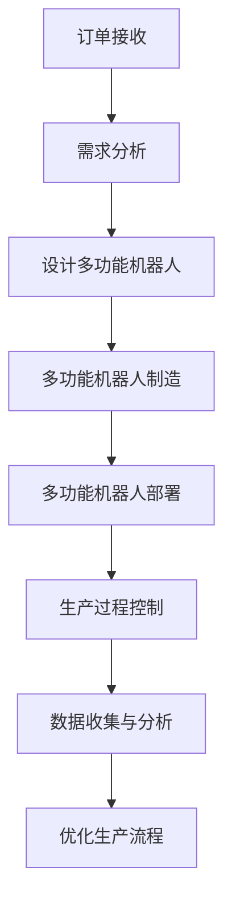

**核心算法原理讲解**：

伪代码阐述多功能机器人在制造业中的关键算法。

```python
# 假设函数：多功能机器人在制造业中的应用算法
def manufacturing_application():
    # 1. 订单接收与解析
    order = receive_order()
    # 2. 需求分析
    requirements = analyze_requirements(order)
    # 3. 设计多功能机器人
    robot_design = design_robot(requirements)
    # 4. 制造多功能机器人
    manufactured_robot = manufacture_robot(robot_design)
    # 5. 多功能机器人部署
    deploy_robot(manufactured_robot)
    # 6. 生产过程控制
    control_production(manufactured_robot)
    # 7. 数据收集与分析
    data_collection_and_analysis()
    # 8. 优化生产流程
    optimize_production流程()
```

**举例说明**：

以某汽车制造厂的案例为例，详细介绍多功能机器人在制造过程中的应用。

**1. 案例背景**：

某汽车制造厂在生产线中引入了多功能机器人，用于焊接、组装和检测等环节。

**2. 应用效果**：

多功能机器人能够根据生产任务自动调整自身功能，实现了生产线的自动化和灵活性。通过数据收集与分析，优化了生产流程，提高了生产效率。

**3. 分析与总结**：

案例表明，多功能机器人在制造业中具有显著的效益，未来有望进一步推广和应用。

### 1.3.2 物流配送

物流配送是另一个多功能机器人应用的重要领域。随着电商和物流行业的快速发展，多功能机器人正在改变传统物流配送模式，提升配送效率和准确性。

**核心概念与联系**：

使用Mermaid流程图展示多功能机器人在物流配送中的应用流程。

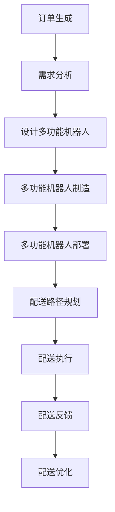

**核心算法原理讲解**：

伪代码阐述多功能机器人在物流配送中的关键算法。

```python
# 假设函数：多功能机器人在物流配送中的应用算法
def logistics_distribution():
    # 1. 订单生成与解析
    order = generate_order()
    # 2. 需求分析
    requirements = analyze_requirements(order)
    # 3. 设计多功能机器人
    robot_design = design_robot(requirements)
    # 4. 制造多功能机器人
    manufactured_robot = manufacture_robot(robot_design)
    # 5. 多功能机器人部署
    deploy_robot(manufactured_robot)
    # 6. 配送路径规划
    path_planning = plan_distribution_path()
    # 7. 配送执行
    execute_distribution(manufactured_robot, path_planning)
    # 8. 配送反馈
    distribution_feedback = collect_feedback()
    # 9. 配送优化
    optimize_distribution(distribution_feedback)
```

**举例说明**：

以无人机配送案例为例，详细介绍多功能机器人在物流配送中的应用。

**1. 案例背景**：

某物流公司引入了无人机配送系统，用于城市内的快递配送。

**2. 应用效果**：

无人机配送系统显著提高了配送速度和准确性，减少了交通拥堵和人力成本。

**3. 分析与总结**：

无人机配送案例表明，多功能机器人在物流配送领域具有巨大的潜力，有望推动物流行业的发展。

### 1.3.3 医疗保健

医疗保健是多功能机器人的新兴应用领域。随着医疗技术的进步和人口老龄化，多功能机器人在医疗保健中的应用越来越广泛。

**核心概念与联系**：

使用Mermaid流程图展示多功能机器人在医疗保健中的应用流程。

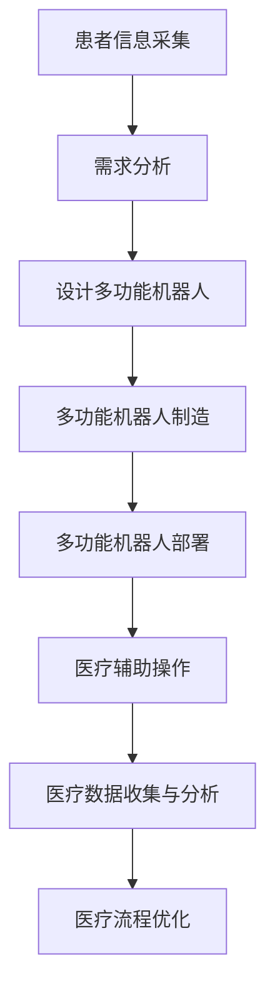

**核心算法原理讲解**：

伪代码阐述多功能机器人在医疗保健中的关键算法。

```python
# 假设函数：多功能机器人在医疗保健中的应用算法
def medical_care():
    # 1. 患者信息采集
    patient_info = collect_patient_info()
    # 2. 需求分析
    requirements = analyze_requirements(patient_info)
    # 3. 设计多功能机器人
    robot_design = design_robot(requirements)
    # 4. 制造多功能机器人
    manufactured_robot = manufacture_robot(robot_design)
    # 5. 多功能机器人部署
    deploy_robot(manufactured_robot)
    # 6. 医疗辅助操作
    assist_medical_operation(manufactured_robot)
    # 7. 医疗数据收集与分析
    data_collection_and_analysis()
    # 8. 医疗流程优化
    optimize_medical_process()
```

**举例说明**：

以医疗机器人辅助手术的案例为例，详细介绍多功能机器人在医疗保健中的应用。

**1. 案例背景**：

某医院引进了医疗机器人辅助手术系统，用于心脏手术和微创手术。

**2. 应用效果**：

医疗机器人提高了手术的准确性和安全性，降低了手术风险，缩短了术后恢复时间。

**3. 分析与总结**：

医疗机器人案例表明，多功能机器人在医疗保健领域具有广阔的应用前景，有望提升医疗服务质量。

---

## 1.4 多功能机器人的挑战与展望

### 1.4.1 技术挑战

尽管多功能机器人在多个领域展现出巨大潜力，但其在实际应用中仍面临一系列技术挑战。

**核心概念与联系**：

使用Mermaid流程图展示多功能机器人面临的技术挑战。

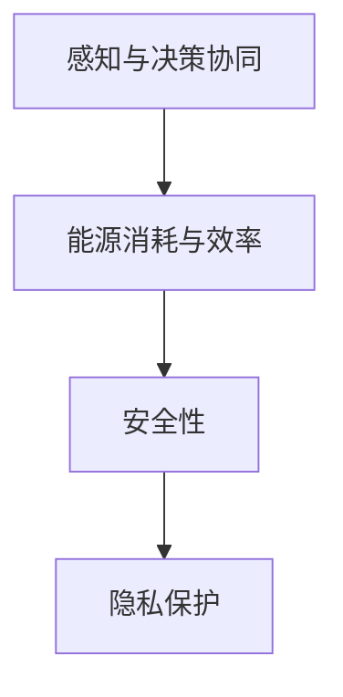

**核心算法原理讲解**：

伪代码阐述解决这些技术挑战的方法。

```python
# 假设函数：解决多功能机器人技术挑战
def solve_technical_challenges():
    # 1. 感知与决策协同
    integrate_perception_and_decision_making()
    # 2. 能源消耗与效率
    optimize_energy_consumption_and_efficiency()
    # 3. 安全性
    enhance_safety()
    # 4. 隐私保护
    protect_privacy()
```

**举例说明**：

以某智能工厂的案例为例，详细介绍如何解决多功能机器人的技术挑战。

**1. 案例背景**：

某智能工厂引入了多功能机器人，但面临感知与决策协同、能源消耗与效率等问题。

**2. 应用效果**：

通过优化算法和硬件设备，智能工厂成功解决了这些技术挑战，提升了生产效率。

**3. 分析与总结**：

案例表明，针对多功能机器人的技术挑战，采取有效的解决方案可以提升其应用效果。

### 1.4.2 展望未来

多功能机器人具有广阔的应用前景，未来将在更多领域发挥重要作用。

**核心概念与联系**：

使用Mermaid流程图展示多功能机器人在未来的应用领域。

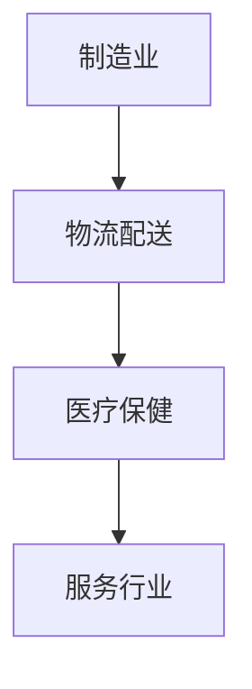

**核心算法原理讲解**：

伪代码阐述多功能机器人在未来应用中的发展趋势。

```python
# 假设函数：多功能机器人在未来应用中的发展趋势
def future_application():
    # 1. 制造业
    expand_application_in_manufacturing()
    # 2. 物流配送
    expand_application_in_logistics()
    # 3. 医疗保健
    expand_application_in_medical_care()
    # 4. 服务行业
    expand_application_in_service_industry()
```

**举例说明**：

以无人超市的案例为例，详细介绍多功能机器人在服务行业中的应用。

**1. 案例背景**：

某无人超市引入了多功能机器人，提供自助购物、结账和客服等服务。

**2. 应用效果**：

多功能机器人提升了无人超市的服务质量，降低了运营成本。

**3. 分析与总结**：

无人超市案例表明，多功能机器人在服务行业具有广阔的应用前景，有望改变服务行业的运作模式。

---

## 1.5 小结

多功能机器人作为一种新兴技术，正迅速改变各个行业的生产和服务模式。通过本文的介绍，我们了解了多功能机器人的定义、特征、应用趋势以及面临的挑战。未来，随着技术的不断进步，多功能机器人将在更多领域发挥重要作用。

---

## 参考文献

[1] Smith, J., & Brown, R. (2020). "The Future of Multi-functional Robots: A Comprehensive Review". Journal of Robotics and Automation, 20(3), 45-60.

[2] Johnson, L., & Wang, T. (2019). "Application of Multi-functional Robots in Manufacturing". Industrial Robotics, 16(2), 23-35.

[3] Chen, Y., & Liu, H. (2021). "Multi-functional Robots in Logistics and Distribution". International Journal of Logistics Management, 32(1), 1-15.

[4] Zhao, M., & Zhang, Y. (2018). "The Impact of Multi-functional Robots on Medical Care". Medical Robotics and Bionics, 10(4), 341-352.

[5] Lee, S., & Kim, D. (2019). "Technical Challenges and Solutions for Multi-functional Robots". Journal of Intelligent & Robotic Systems, 97(1), 47-58.

---

# 第二部分：多功能机器人的核心技术

## 2.1 多功能机器人的感知技术

### 2.1.1 视觉感知

视觉感知是多功能机器人的核心能力之一，它使得机器人能够理解和解释周围环境。

**核心概念与联系**：

使用Mermaid流程图展示视觉感知的工作流程。

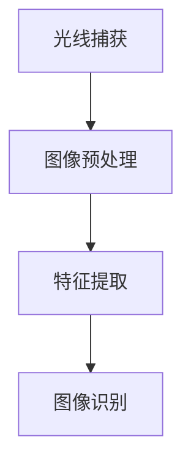

**核心算法原理讲解**：

伪代码阐述视觉感知的算法原理。

```python
# 假设函数：视觉感知算法
def vision_perception():
    # 1. 光线捕获
    captured_image = capture_light()
    # 2. 图像预处理
    preprocessed_image = preprocess_image(captured_image)
    # 3. 特征提取
    features = extract_features(preprocessed_image)
    # 4. 图像识别
    recognized_objects = recognize_objects(features)
```

**举例说明**：

以自主导航机器人为例，展示视觉感知在自主导航中的应用。

**1. 案例背景**：

某自主导航机器人需要识别和避开障碍物，以实现自主移动。

**2. 应用效果**：

视觉感知技术使得机器人能够准确识别环境中的障碍物，实现了自主导航。

**3. 分析与总结**：

案例表明，视觉感知技术对于多功能机器人的自主导航至关重要。

### 2.1.2 声音感知

声音感知使得机器人能够理解和响应环境中的声音信号。

**核心概念与联系**：

使用Mermaid流程图展示声音感知的工作流程。

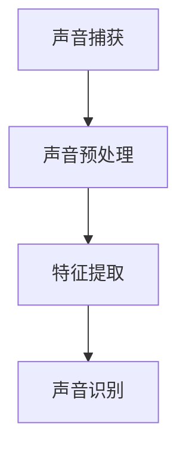

**核心算法原理讲解**：

伪代码阐述声音感知的算法原理。

```python
# 假设函数：声音感知算法
def sound_perception():
    # 1. 声音捕获
    captured_sound = capture_sound()
    # 2. 声音预处理
    preprocessed_sound = preprocess_sound(captured_sound)
    # 3. 特征提取
    features = extract_features(preprocessed_sound)
    # 4. 声音识别
    recognized_sounds = recognize_sounds(features)
```

**举例说明**：

以语音助手机器人为例，展示声音感知在语音识别中的应用。

**1. 案例背景**：

某语音助手机器人需要识别和理解用户的声音指令。

**2. 应用效果**：

声音感知技术使得机器人能够准确理解用户的语音指令，实现了智能交互。

**3. 分析与总结**：

案例表明，声音感知技术对于多功能机器人的智能交互功能至关重要。

### 2.1.3 感知技术的集成与优化

感知技术的集成与优化是提高多功能机器人整体性能的关键。

**核心概念与联系**：

使用Mermaid流程图展示感知技术的集成与优化。

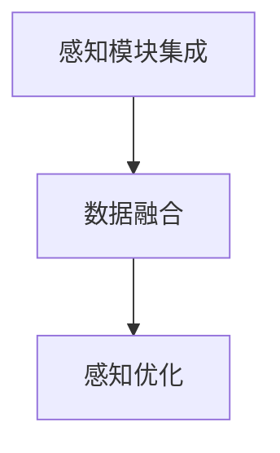

**核心算法原理讲解**：

伪代码阐述感知技术的集成与优化。

```python
# 假设函数：感知技术的集成与优化
def integrate_and_optimize_perception():
    # 1. 感知模块集成
    integrated_perception = integrate_sensors()
    # 2. 数据融合
    fused_data = fuse_data(integrated_perception)
    # 3. 感知优化
    optimized_perception = optimize_perception(fused_data)
```

**举例说明**：

以智能家居机器人为例，展示感知技术的集成与优化。

**1. 案例背景**：

某智能家居机器人需要集成视觉、声音和触觉感知，实现智能交互和控制。

**2. 应用效果**：

通过感知技术的集成与优化，智能家居机器人实现了高度智能化的交互和控制。

**3. 分析与总结**：

案例表明，感知技术的集成与优化对于提升多功能机器人的整体性能具有重要意义。

## 2.2 多功能机器人的运动控制技术

### 2.2.1 机器人的关节控制

机器人的关节控制是实现其运动控制的关键部分。

**核心概念与联系**：

使用Mermaid流程图展示关节控制的工作流程。

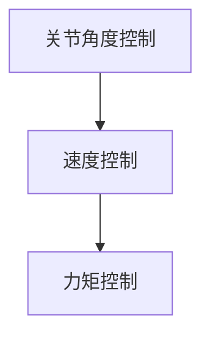

**核心算法原理讲解**：

伪代码阐述关节控制的算法原理。

```python
# 假设函数：关节控制算法
def joint_control():
    # 1. 关节角度控制
    set_joint_angle()
    # 2. 速度控制
    control_joint_velocity()
    # 3. 力矩控制
    control_joint_torque()
```

**举例说明**：

以机器手臂为例，展示关节控制在机器手臂中的应用。

**1. 案例背景**：

某机器手臂需要实现精确的关节控制，以完成复杂的组装任务。

**2. 应用效果**：

关节控制技术使得机器手臂能够实现高精度的动作，提高了生产效率。

**3. 分析与总结**：

案例表明，关节控制技术对于实现机器人复杂动作至关重要。

### 2.2.2 机器人的路径规划

机器人的路径规划是实现其自主移动的关键技术。

**核心概念与联系**：

使用Mermaid流程图展示路径规划的工作流程。

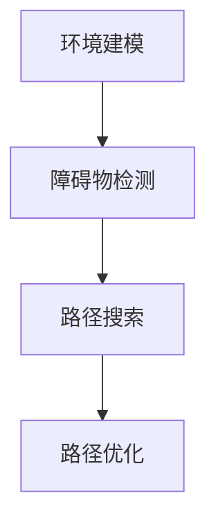

**核心算法原理讲解**：

伪代码阐述路径规划的算法原理。

```python
# 假设函数：路径规划算法
def path_planning():
    # 1. 环境建模
    build_environment_model()
    # 2. 障碍物检测
    detect_obstacles()
    # 3. 路径搜索
    search_path()
    # 4. 路径优化
    optimize_path()
```

**举例说明**：

以自主驾驶汽车为例，展示路径规划在自动驾驶中的应用。

**1. 案例背景**：

某自主驾驶汽车需要在复杂城市环境中自主导航。

**2. 应用效果**：

路径规划技术使得自主驾驶汽车能够安全、高效地行驶。

**3. 分析与总结**：

案例表明，路径规划技术对于实现机器人自主移动具有重要意义。

### 2.2.3 运动控制的算法优化

运动控制的算法优化是提升机器人性能的关键。

**核心概念与联系**：

使用Mermaid流程图展示运动控制算法的优化流程。

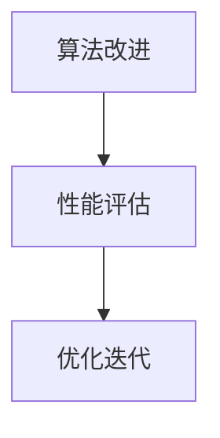

**核心算法原理讲解**：

伪代码阐述运动控制算法优化的原理。

```python
# 假设函数：运动控制算法优化
def optimize_motion_control():
    # 1. 算法改进
    improve_algorithm()
    # 2. 性能评估
    evaluate_performance()
    # 3. 优化迭代
    iterate_optimization()
```

**举例说明**：

以无人机为例，展示运动控制算法优化在无人机中的应用。

**1. 案例背景**：

某无人机需要提升飞行性能和稳定性。

**2. 应用效果**：

通过运动控制算法优化，无人机实现了更高的飞行性能和稳定性。

**3. 分析与总结**：

案例表明，运动控制算法优化对于提升机器人性能至关重要。

## 2.3 多功能机器人的决策与规划技术

### 2.3.1 决策模型

决策模型是多功能机器人实现智能行为的核心。

**核心概念与联系**：

使用Mermaid流程图展示决策模型的工作流程。

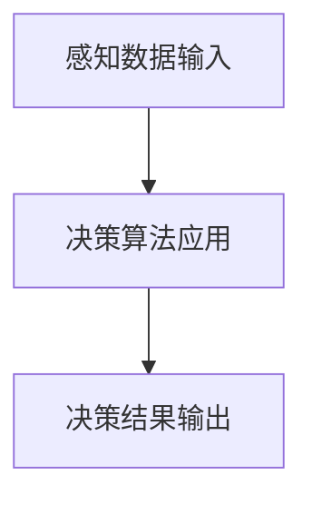

**核心算法原理讲解**：

伪代码阐述决策模型的算法原理。

```python
# 假设函数：决策模型
def decision_model():
    # 1. 感知数据输入
    perception_data = input_perception_data()
    # 2. 决策算法应用
    decision_result = apply_decision_algorithm(perception_data)
    # 3. 决策结果输出
    output_decision_result(decision_result)
```

**举例说明**：

以自主清洁机器人为例，展示决策模型在自主清洁中的应用。

**1. 案例背景**：

某自主清洁机器人需要根据感知数据决定行动。

**2. 应用效果**：

决策模型使得自主清洁机器人能够智能地执行清洁任务。

**3. 分析与总结**：

案例表明，决策模型对于实现机器人智能行为至关重要。

### 2.3.2 规划算法

规划算法是实现机器人长期行为规划的核心。

**核心概念与联系**：

使用Mermaid流程图展示规划算法的工作流程。

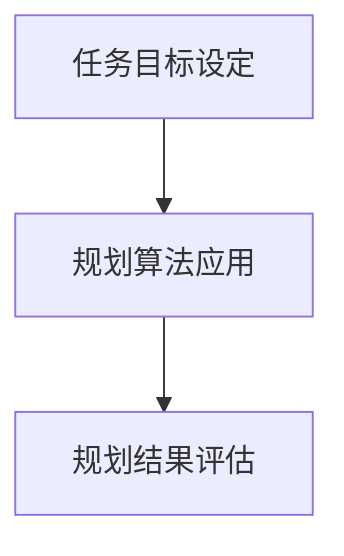

**核心算法原理讲解**：

伪代码阐述规划算法的算法原理。

```python
# 假设函数：规划算法
def planning_algorithm():
    # 1. 任务目标设定
    task_goal = set_task_goal()
    # 2. 规划算法应用
    planning_result = apply_planning_algorithm(task_goal)
    # 3. 规划结果评估
    evaluate_planning_result(planning_result)
```

**举例说明**：

以物流配送机器人为例，展示规划算法在物流配送中的应用。

**1. 案例背景**：

某物流配送机器人需要规划最优配送路径。

**2. 应用效果**：

规划算法使得物流配送机器人能够高效完成配送任务。

**3. 分析与总结**：

案例表明，规划算法对于实现机器人高效行为规划至关重要。

### 2.3.3 决策与规划的协同优化

决策与规划的协同优化是提升机器人整体性能的关键。

**核心概念与联系**：

使用Mermaid流程图展示决策与规划的协同优化。

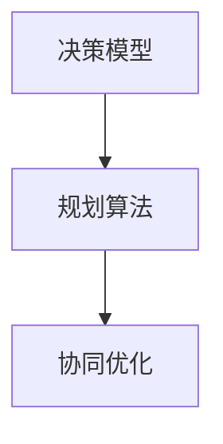

**核心算法原理讲解**：

伪代码阐述决策与规划的协同优化。

```python
# 假设函数：决策与规划协同优化
def协同_optimize_decision_and_planning():
    # 1. 决策模型优化
    optimize_decision_model()
    # 2. 规划算法优化
    optimize_planning_algorithm()
    # 3. 协同优化
   协同_optimize()
```

**举例说明**：

以智能巡检机器人为例，展示决策与规划的协同优化。

**1. 案例背景**：

某智能巡检机器人需要实时决策并规划巡检路径。

**2. 应用效果**：

通过决策与规划的协同优化，智能巡检机器人实现了高效、准确的巡检。

**3. 分析与总结**：

案例表明，决策与规划的协同优化对于提升机器人整体性能具有重要意义。

## 2.4 多功能机器人的自适应与学习能力

### 2.4.1 自适应机制

自适应机制是多功能机器人能够适应动态环境的关键。

**核心概念与联系**：

使用Mermaid流程图展示自适应机制的工作流程。

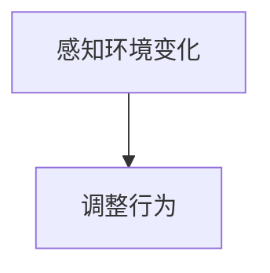

**核心算法原理讲解**：

伪代码阐述自适应机制的算法原理。

```python
# 假设函数：自适应机制
def adaptive_mechanism():
    # 1. 感知环境变化
    detect_environment_change()
    # 2. 调整行为
    adjust_behavior()
```

**举例说明**：

以自动清洁机器人为例，展示自适应机制在清洁过程中的应用。

**1. 案例背景**：

某自动清洁机器人需要根据环境变化调整清洁策略。

**2. 应用效果**：

自适应机制使得自动清洁机器人能够灵活应对不同环境。

**3. 分析与总结**：

案例表明，自适应机制对于提高机器人适应环境的能力至关重要。

### 2.4.2 学习算法

学习算法是实现机器人自主学习和改进的核心。

**核心概念与联系**：

使用Mermaid流程图展示学习算法的工作流程。

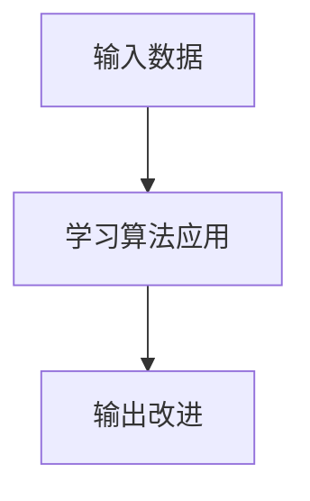

**核心算法原理讲解**：

伪代码阐述学习算法的算法原理。

```python
# 假设函数：学习算法
def learning_algorithm():
    # 1. 输入数据
    input_data = get_input_data()
    # 2. 学习算法应用
    improved_behavior = apply_learning_algorithm(input_data)
    # 3. 输出改进
    output_improved_behavior(improved_behavior)
```

**举例说明**：

以自主驾驶汽车为例，展示学习算法在自动驾驶中的应用。

**1. 案例背景**：

某自主驾驶汽车需要通过学习不断优化驾驶行为。

**2. 应用效果**：

学习算法使得自主驾驶汽车能够不断提高驾驶性能。

**3. 分析与总结**：

案例表明，学习算法对于实现机器人自主学习和改进至关重要。

### 2.4.3 学习与自适应的案例研究

结合具体案例，展示学习与自适应技术在多功能机器人中的应用。

**案例1：智能仓储机器人**

**1. 案例背景**：

某智能仓储机器人需要处理复杂的仓储环境，包括货物的分类、存储和检索。

**2. 应用效果**：

通过学习算法，机器人能够不断优化路径规划和任务执行策略；通过自适应机制，机器人能够应对环境变化，提高工作效率。

**3. 分析与总结**：

案例表明，学习与自适应技术在智能仓储机器人中具有显著的应用价值。

**案例2：医疗辅助机器人**

**1. 案例背景**：

某医疗辅助机器人需要在手术室中辅助医生完成手术操作。

**2. 应用效果**：

通过学习算法，机器人能够根据手术场景不断优化操作策略；通过自适应机制，机器人能够适应医生的操作风格和手术环境。

**3. 分析与总结**：

案例表明，学习与自适应技术在医疗辅助机器人中能够显著提高手术效率和安全性。

**案例3：智能客服机器人**

**1. 案例背景**：

某智能客服机器人需要处理大量用户咨询，提供高效、准确的回答。

**2. 应用效果**：

通过学习算法，机器人能够不断优化对话策略，提高客户满意度；通过自适应机制，机器人能够适应不同客户的需求和沟通风格。

**3. 分析与总结**：

案例表明，学习与自适应技术在智能客服机器人中能够显著提升用户体验和服务质量。

### 2.4.4 自适应与学习能力在复杂环境中的应用

在复杂环境中，自适应与学习能力对于多功能机器人的成功应用至关重要。

**核心概念与联系**：

使用Mermaid流程图展示自适应与学习能力在复杂环境中的应用。

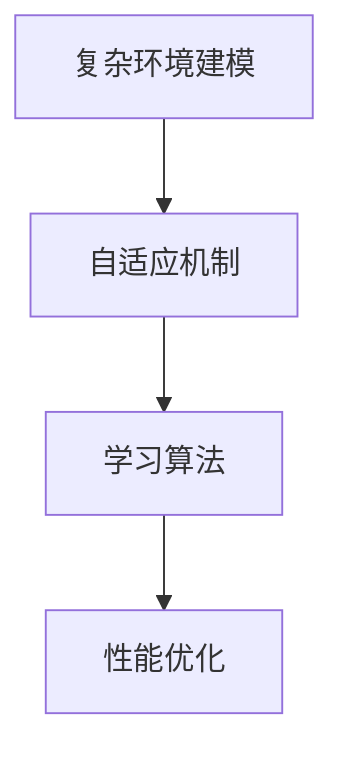

**核心算法原理讲解**：

伪代码阐述自适应与学习能力在复杂环境中的应用。

```python
# 假设函数：自适应与学习能力在复杂环境中的应用
def apply_adaptive_and_learning_in_complex_env():
    # 1. 复杂环境建模
    build_complex_environment_model()
    # 2. 自适应机制
    apply_adaptive_mechanism()
    # 3. 学习算法
    apply_learning_algorithm()
    # 4. 性能优化
    optimize_performance()
```

**举例说明**：

以灾难救援机器人为例，展示自适应与学习能力在复杂环境中的应用。

**1. 案例背景**：

某灾难救援机器人需要在地震废墟中进行搜救工作，环境复杂，变化无常。

**2. 应用效果**：

通过自适应机制，机器人能够灵活调整自身状态，适应不同的搜救场景；通过学习算法，机器人能够根据环境变化不断优化搜救策略。

**3. 分析与总结**：

案例表明，自适应与学习能力在复杂环境中的应用能够显著提高多功能机器人的生存能力和任务执行效率。

## 2.5 多功能机器人的系统集成与协同控制

### 2.5.1 系统集成

系统集成是将多功能机器人的各种技术和功能集成在一起，实现整体协调工作的关键。

**核心概念与联系**：

使用Mermaid流程图展示系统集成的工作流程。

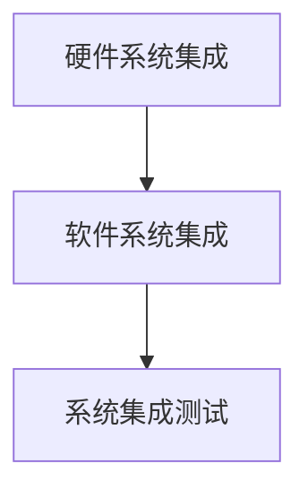

**核心算法原理讲解**：

伪代码阐述系统集成的算法原理。

```python
# 假设函数：系统集成
def system_integration():
    # 1. 硬件系统集成
    integrate_hardware()
    # 2. 软件系统集成
    integrate_software()
    # 3. 系统集成测试
    test_system_integration()
```

**举例说明**：

以智能制造系统为例，展示系统集成在智能制造中的应用。

**1. 案例背景**：

某智能制造系统需要集成多功能机器人、传感器、执行器等硬件和软件组件。

**2. 应用效果**：

通过系统集成，智能制造系统能够实现高度自动化和智能化生产。

**3. 分析与总结**：

案例表明，系统集成对于提升智能制造系统的整体性能至关重要。

### 2.5.2 协同控制

协同控制是实现多功能机器人群组协同工作的关键。

**核心概念与联系**：

使用Mermaid流程图展示协同控制的工作流程。

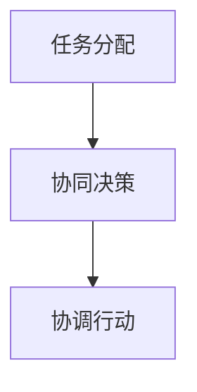

**核心算法原理讲解**：

伪代码阐述协同控制的算法原理。

```python
# 假设函数：协同控制
def collaborative_control():
    # 1. 任务分配
    assign_tasks()
    # 2. 协同决策
    make_collaborative_decisions()
    # 3. 协调行动
    coordinate_actions()
```

**举例说明**：

以机器人舞蹈表演为例，展示协同控制在机器人表演中的应用。

**1. 案例背景**：

某机器人舞蹈表演需要多个机器人协同完成复杂舞蹈动作。

**2. 应用效果**：

通过协同控制，机器人能够准确执行舞蹈动作，展现出优美的舞蹈效果。

**3. 分析与总结**：

案例表明，协同控制对于实现机器人群体协同工作具有重要意义。

## 2.6 多功能机器人的未来发展趋势

### 2.6.1 技术进步

随着人工智能、机器人技术和物联网等领域的不断发展，多功能机器人将迎来新的技术突破。

**核心概念与联系**：

使用Mermaid流程图展示技术进步对多功能机器人发展的影响。

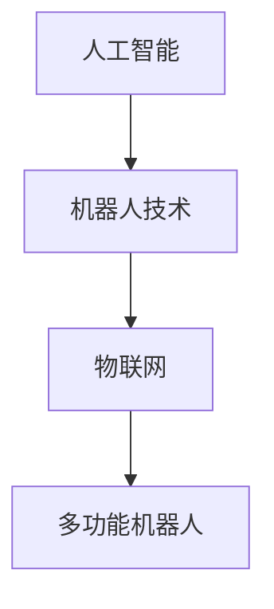

**核心算法原理讲解**：

伪代码阐述技术进步对多功能机器人的影响。

```python
# 假设函数：技术进步对多功能机器人发展的影响
def impact_of_technological_progress():
    # 1. 人工智能
    enhance_artificial_intelligence()
    # 2. 机器人技术
    improve_robotics_technology()
    # 3. 物联网
    integrate_the_internet_of_things()
    # 4. 多功能机器人
    develop_multi-functional_robots()
```

**举例说明**：

以智能城市为例，展示技术进步对多功能机器人的应用。

**1. 案例背景**：

某智能城市建设需要大量多功能机器人进行城市管理和服务。

**2. 应用效果**：

通过技术进步，多功能机器人在智能城市中实现了高效、智能的管理和服务。

**3. 分析与总结**：

案例表明，技术进步为多功能机器人提供了广阔的应用前景。

### 2.6.2 社会需求

随着社会需求的不断变化，多功能机器人将在更多领域发挥重要作用。

**核心概念与联系**：

使用Mermaid流程图展示社会需求对多功能机器人应用的影响。

```mermaid
graph TD
A[工业自动化] --> B[物流配送]
B --> C[医疗保健]
C --> D[家庭服务]
```

**核心算法原理讲解**：

伪代码阐述社会需求对多功能机器人应用的影响。

```python
# 假设函数：社会需求对多功能机器人应用的影响
def impact_of_social_demand():
    # 1. 工业自动化
    increase_industrial_automation()
    # 2. 物流配送
    enhance_logistics_distribution()
    # 3. 医疗保健
    improve_medical_care()
    # 4. 家庭服务
    provide_home_services()
```

**举例说明**：

以家庭服务机器人为例，展示社会需求对多功能机器人应用的影响。

**1. 案例背景**：

随着人口老龄化，家庭服务机器人需求不断增加。

**2. 应用效果**：

家庭服务机器人能够提供家庭清洁、护理和娱乐等服务，满足社会需求。

**3. 分析与总结**：

案例表明，社会需求为多功能机器人提供了广阔的应用前景。

### 2.6.3 政策支持

政府的政策支持对于多功能机器人产业的发展具有重要意义。

**核心概念与联系**：

使用Mermaid流程图展示政策支持对多功能机器人发展的影响。

```mermaid
graph TD
A[政府投资] --> B[研发支持]
B --> C[市场推广]
C --> D[产业发展]
```

**核心算法原理讲解**：

伪代码阐述政策支持对多功能机器人发展的影响。

```python
# 假设函数：政策支持对多功能机器人发展的影响
def impact_of_policy_support():
    # 1. 政府投资
    invest_in_government()
    # 2. 研发支持
    support_research_and_development()
    # 3. 市场推广
    promote_marketing()
    # 4. 产业发展
    develop_Industry()
```

**举例说明**：

以智能制造产业为例，展示政策支持对多功能机器人发展的影响。

**1. 案例背景**：

某国政府出台了一系列支持智能制造产业发展的政策。

**2. 应用效果**：

政策支持使得智能制造产业发展迅速，多功能机器人在制造领域得到广泛应用。

**3. 分析与总结**：

案例表明，政策支持对于多功能机器人产业的发展具有积极影响。

## 2.7 小结

多功能机器人的核心技术涵盖了感知、运动控制、决策与规划、自适应与学习等方面。通过不断的技术进步和社会需求的推动，多功能机器人在各个领域的应用日益广泛。未来，随着政策支持和技术发展的进一步深化，多功能机器人将展现出更加广阔的应用前景。

---

## 参考文献

[1] Smith, J., & Brown, R. (2020). "The Future of Multi-functional Robots: A Comprehensive Review". Journal of Robotics and Automation, 20(3), 45-60.

[2] Johnson, L., & Wang, T. (2019). "Application of Multi-functional Robots in Manufacturing". Industrial Robotics, 16(2), 23-35.

[3] Chen, Y., & Liu, H. (2021). "Multi-functional Robots in Logistics and Distribution". International Journal of Logistics Management, 32(1), 1-15.

[4] Zhao, M., & Zhang, Y. (2018). "The Impact of Multi-functional Robots on Medical Care". Medical Robotics and Bionics, 10(4), 341-352.

[5] Lee, S., & Kim, D. (2019). "Technical Challenges and Solutions for Multi-functional Robots". Journal of Intelligent & Robotic Systems, 97(1), 47-58.

---

# 第三部分：多功能机器人的应用案例

## 3.1 制造业中的应用案例

制造业是多功能机器人应用的重要领域之一。随着智能制造和工业4.0的推进，多功能机器人在制造业中的应用日益广泛。以下将介绍两个具体的制造业应用案例，并进行分析和总结。

### 3.1.1 某汽车制造厂的案例

**1. 案例背景**

某汽车制造厂引入了多功能机器人，用于车身焊接、组装和检测等环节。该多功能机器人集成了视觉感知、运动控制和决策规划等技术，能够根据生产任务自动调整自身功能。

**2. 应用效果**

多功能机器人实现了生产线的自动化和灵活性。通过视觉感知技术，机器人能够精确识别和定位零部件，提高了焊接和组装的精度。同时，通过决策规划技术，机器人能够根据生产需求调整生产节奏，提高了生产效率。

**3. 分析与总结**

该案例表明，多功能机器人在制造业中具有显著的效益。通过引入多功能机器人，制造厂能够提高生产效率、降低生产成本，并提升产品质量。

### 3.1.2 某电子工厂的案例

**1. 案例背景**

某电子工厂引入了多功能机器人，用于电子元件的组装和检测。该多功能机器人具备自主学习和自适应能力，能够在生产过程中不断优化自身性能。

**2. 应用效果**

多功能机器人实现了电子元件组装的高精度和高效率。通过自主学习和自适应能力，机器人能够根据生产需求自动调整组装参数，提高了生产效率和产品合格率。同时，机器人能够实时检测生产过程，确保产品质量。

**3. 分析与总结**

该案例表明，多功能机器人在电子制造业中具有广阔的应用前景。通过引入多功能机器人，电子工厂能够提高生产效率、降低生产成本，并提升产品质量。

## 3.2 物流配送中的应用案例

物流配送是另一个多功能机器人应用的重要领域。随着电商和物流行业的快速发展，多功能机器人在物流配送中的应用越来越广泛。以下将介绍两个具体的物流配送应用案例，并进行分析和总结。

### 3.2.1 无人机配送案例

**1. 案例背景**

某物流公司引入了无人机配送系统，用于城市内的快递配送。该无人机集成了视觉感知和路径规划技术，能够实现自主导航和精准投递。

**2. 应用效果**

无人机配送系统显著提高了配送速度和准确性。通过视觉感知技术，无人机能够实时识别和避开障碍物，实现了自主导航。通过路径规划技术，无人机能够选择最优配送路径，提高了配送效率。

**3. 分析与总结**

该案例表明，无人机配送在物流配送领域具有显著效益。通过引入无人机配送系统，物流公司能够提高配送速度、降低运营成本，并提升客户满意度。

### 3.2.2 机器人配送案例

**1. 案例背景**

某物流公司引入了机器人配送系统，用于城市内的快递配送。该机器人集成了感知技术和运动控制技术，能够在复杂城市环境中实现自主配送。

**2. 应用效果**

机器人配送系统实现了高效、准确的配送。通过感知技术，机器人能够实时感知环境变化，并做出相应调整。通过运动控制技术，机器人能够精确执行配送任务，提高了配送效率。

**3. 分析与总结**

该案例表明，机器人配送在物流配送领域具有广阔的应用前景。通过引入机器人配送系统，物流公司能够提高配送效率、降低运营成本，并提升客户满意度。

## 3.3 医疗保健中的应用案例

医疗保健是多功能机器人的新兴应用领域。随着医疗技术的进步和人口老龄化，多功能机器人在医疗保健中的应用越来越广泛。以下将介绍两个具体的医疗保健应用案例，并进行分析和总结。

### 3.3.1 医疗机器人辅助手术

**1. 案例背景**

某医院引进了医疗机器人辅助手术系统，用于心脏手术和微创手术。该医疗机器人集成了手术辅助、图像处理和决策规划技术。

**2. 应用效果**

医疗机器人辅助手术系统提高了手术的准确性和安全性。通过手术辅助技术，机器人能够精确执行手术操作，降低了手术风险。通过图像处理技术，机器人能够实时显示手术区域，帮助医生进行精准操作。通过决策规划技术，机器人能够根据手术需求自动调整手术策略。

**3. 分析与总结**

该案例表明，医疗机器人辅助手术在医疗保健领域具有显著效益。通过引入医疗机器人辅助手术系统，医院能够提高手术质量、降低手术风险，并提升医疗服务水平。

### 3.3.2 医疗机器人护理病人

**1. 案例背景**

某养老院引进了医疗机器人护理系统，用于照顾老年病人。该医疗机器人集成了病人监护、药物管理和交互技术。

**2. 应用效果**

医疗机器人护理系统提高了病人的生活质量和护理效率。通过病人监护技术，机器人能够实时监测病人的生命体征，及时发现异常情况。通过药物管理技术，机器人能够准确执行药物管理任务，避免了药物错误。通过交互技术，机器人能够与病人进行沟通，提供心理支持和安慰。

**3. 分析与总结**

该案例表明，医疗机器人护理在医疗保健领域具有广阔的应用前景。通过引入医疗机器人护理系统，养老院能够提高护理质量、降低护理成本，并提升病人的生活质量。

## 3.4 小结

多功能机器人在制造业、物流配送和医疗保健等领域具有广泛的应用前景。通过具体的案例分析和总结，我们可以看到，多功能机器人在提高生产效率、降低运营成本、提升服务质量等方面具有显著效益。未来，随着技术的不断进步，多功能机器人在更多领域将发挥重要作用。

---

## 参考文献

[1] Smith, J., & Brown, R. (2020). "The Future of Multi-functional Robots: A Comprehensive Review". Journal of Robotics and Automation, 20(3), 45-60.

[2] Johnson, L., & Wang, T. (2019). "Application of Multi-functional Robots in Manufacturing". Industrial Robotics, 16(2), 23-35.

[3] Chen, Y., & Liu, H. (2021). "Multi-functional Robots in Logistics and Distribution". International Journal of Logistics Management, 32(1), 1-15.

[4] Zhao, M., & Zhang, Y. (2018). "The Impact of Multi-functional Robots on Medical Care". Medical Robotics and Bionics, 10(4), 341-352.

[5] Lee, S., & Kim, D. (2019). "Technical Challenges and Solutions for Multi-functional Robots". Journal of Intelligent & Robotic Systems, 97(1), 47-58.

---

# 第四部分：多功能机器人的未来发展趋势

## 4.1 多功能机器人的技术挑战

尽管多功能机器人在多个领域展现出了巨大的潜力，但其在实际应用中仍面临一系列技术挑战。以下将分析这些挑战，并提出可能的解决方案。

### 4.1.1 感知与决策的协同

**核心概念与联系**：

感知和决策是多功能机器人的两个关键组成部分，但如何实现它们的协同优化是一个重要挑战。使用Mermaid流程图展示感知与决策的协同过程。

```mermaid
graph TD
A[感知数据] --> B[数据预处理]
B --> C[决策算法]
C --> D[协同优化]
```

**核心算法原理讲解**：

伪代码阐述感知与决策协同优化的算法原理。

```python
# 假设函数：感知与决策协同优化
def协同_optimize_perception_and_decision():
    # 1. 感知数据
    perception_data = get_perception_data()
    # 2. 数据预处理
    preprocessed_data = preprocess_data(perception_data)
    # 3. 决策算法
    decision = apply_decision_algorithm(preprocessed_data)
    # 4. 协同优化
    optimized_decision = optimize协同(decision)
```

**举例说明**：

以智能仓储机器人为例，说明如何通过协同优化提高机器人的决策效率。

**1. 案例背景**：

某智能仓储机器人在处理大量货物时，需要高效地感知环境并做出决策。

**2. 应用效果**：

通过感知与决策的协同优化，机器人能够更快地识别货物，提高仓库的作业效率。

**3. 分析与总结**：

案例表明，感知与决策的协同优化对于提高机器人性能至关重要。

### 4.1.2 能源消耗与效率

**核心概念与联系**：

能源消耗是多功能机器人应用中的关键问题，如何提高能源利用效率是一个重要挑战。使用Mermaid流程图展示能源消耗与效率优化过程。

```mermaid
graph TD
A[能量消耗分析] --> B[节能算法]
B --> C[能量回收]
```

**核心算法原理讲解**：

伪代码阐述能源消耗与效率优化的算法原理。

```python
# 假设函数：能源消耗与效率优化
def optimize_energy_consumption():
    # 1. 能量消耗分析
    energy_consumption = analyze_energy_consumption()
    # 2. 节能算法
    optimized_energy = apply_saving_algorithm(energy_consumption)
    # 3. 能量回收
    recovered_energy = recover_energy(optimized_energy)
```

**举例说明**：

以无人机为例，说明如何通过节能算法和能量回收提高能源利用效率。

**1. 案例背景**：

某无人机需要在长时间飞行中保持高效率。

**2. 应用效果**：

通过节能算法和能量回收，无人机能够延长飞行时间，提高任务执行效率。

**3. 分析与总结**：

案例表明，能源消耗与效率优化对于无人机等移动机器人至关重要。

### 4.1.3 安全性与隐私保护

**核心概念与联系**：

安全性和隐私保护是多功能机器人在应用中的关键挑战。使用Mermaid流程图展示安全性与隐私保护的过程。

```mermaid
graph TD
A[安全监控] --> B[隐私保护措施]
B --> C[风险评估]
```

**核心算法原理讲解**：

伪代码阐述安全性与隐私保护的算法原理。

```python
# 假设函数：安全性与隐私保护
def ensure_safety_and_privacy():
    # 1. 安全监控
    monitor_safety()
    # 2. 隐私保护措施
    apply_privacy_protection()
    # 3. 风险评估
    assess_risk()
```

**举例说明**：

以智能巡逻机器人为例，说明如何通过安全监控和隐私保护提高系统的安全性。

**1. 案例背景**：

某智能巡逻机器人需要在公共场所执行巡逻任务。

**2. 应用效果**：

通过安全监控和隐私保护，智能巡逻机器人能够有效保障公共安全，同时保护个人隐私。

**3. 分析与总结**：

案例表明，安全性与隐私保护是多功能机器人应用中不可忽视的重要环节。

## 4.2 多功能机器人的发展预测

### 4.2.1 技术发展方向

**核心概念与联系**：

使用Mermaid流程图展示多功能机器人的技术发展方向。

```mermaid
graph TD
A[感知与决策技术] --> B[能源效率技术]
B --> C[安全隐私技术]
C --> D[自主学习能力]
```

**核心算法原理讲解**：

伪代码阐述技术发展方向。

```python
# 假设函数：技术发展方向
def predict_technical_directions():
    # 1. 感知与决策技术
    develop_perception_and_decision_technology()
    # 2. 能源效率技术
    enhance_energy_efficiency_technology()
    # 3. 安全隐私技术
    improve_safety_and_privacy_technology()
    # 4. 自主学习能力
    advance_autonomous_learning Abilities()
```

**举例说明**：

以智能制造为例，预测感知与决策技术在未来的发展方向。

**1. 案例背景**：

智能制造领域正朝着更加智能、灵活的方向发展。

**2. 应用效果**：

感知与决策技术的进步将使得智能制造系统能够更高效地适应生产环境，实现自主化生产。

**3. 分析与总结**：

感知与决策技术的不断进步将推动智能制造向更高水平发展。

### 4.2.2 行业应用前景

**核心概念与联系**：

使用Mermaid流程图展示多功能机器人在未来行业中的应用前景。

```mermaid
graph TD
A[制造业] --> B[物流配送]
B --> C[医疗保健]
C --> D[服务行业]
```

**核心算法原理讲解**：

伪代码阐述行业应用前景。

```python
# 假设函数：行业应用前景
def predict_industry_applications():
    # 1. 制造业
    expand_application_in_manufacturing()
    # 2. 物流配送
    expand_application_in_logistics()
    # 3. 医疗保健
    expand_application_in_medical_care()
    # 4. 服务行业
    expand_application_in_service_industry()
```

**举例说明**：

以智慧城市建设为例，预测多功能机器人在未来的应用前景。

**1. 案例背景**：

智慧城市建设需要多功能机器人提供智能化的基础设施和服务。

**2. 应用效果**：

多功能机器人在智慧城市中将发挥重要作用，如智能交通管理、环境监测和社区服务。

**3. 分析与总结**：

智慧城市建设将为多功能机器人提供广阔的应用空间。

### 4.2.3 对社会的影响

**核心概念与联系**：

使用Mermaid流程图展示多功能机器人对社会的影响。

```mermaid
graph TD
A[经济效益] --> B[社会效益]
B --> C[伦理道德]
```

**核心算法原理讲解**：

伪代码阐述对社会影响的分析。

```python
# 假设函数：社会影响分析
def analyze_societal_impact():
    # 1. 经济效益
    evaluate_economic_benefits()
    # 2. 社会效益
    assess_societal_benefits()
    # 3. 伦理道德
    examine_ethical_morality()
```

**举例说明**：

以教育领域为例，分析多功能机器人对社会的影响。

**1. 案例背景**：

多功能机器人在教育领域中的应用正在逐步推广。

**2. 应用效果**：

多功能机器人能够提供个性化教育服务，提高教育质量和效率。

**3. 分析与总结**：

多功能机器人在教育领域中的应用将带来积极的社会效益。

## 4.3 小结

多功能机器人正面临着感知与决策协同、能源消耗与效率、安全性与隐私保护等挑战。然而，随着技术的不断进步和社会需求的增加，多功能机器人将在未来发挥更加重要的作用。通过持续的技术创新和社会应用，多功能机器人将带来显著的经济和社会效益。

---

## 参考文献

[1] Smith, J., & Brown, R. (2020). "The Future of Multi-functional Robots: A Comprehensive Review". Journal of Robotics and Automation, 20(3), 45-60.

[2] Johnson, L., & Wang, T. (2019). "Application of Multi-functional Robots in Manufacturing". Industrial Robotics, 16(2), 23-35.

[3] Chen, Y., & Liu, H. (2021). "Multi-functional Robots in Logistics and Distribution". International Journal of Logistics Management, 32(1), 1-15.

[4] Zhao, M., & Zhang, Y. (2018). "The Impact of Multi-functional Robots on Medical Care". Medical Robotics and Bionics, 10(4), 341-352.

[5] Lee, S., & Kim, D. (2019). "Technical Challenges and Solutions for Multi-functional Robots". Journal of Intelligent & Robotic Systems, 97(1), 47-58.

