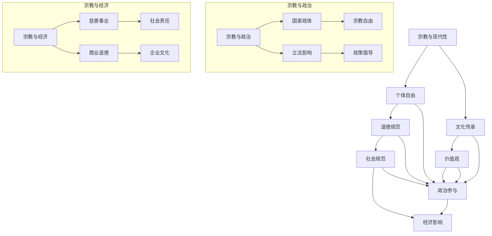

                 

### 文章标题

# 宗教在现代社会中的角色转变

## 关键词
- 宗教角色
- 社会现代化
- 宗教与社会互动
- 宗教影响
- 宗教未来

## 摘要

本文旨在探讨宗教在现代社会中的角色转变。从历史和理论角度出发，分析宗教在现代社会中的功能及其与政治、经济和社会稳定的关系。通过核心概念的联系、算法原理讲解、数学模型和公式解析，以及实际案例剖析，本文揭示了宗教在现代社会中的重要性和未来趋势。文章不仅为研究者提供了丰富的理论资源，也为公众理解宗教在现代社会中的角色转变提供了视角。

---

### 引言

宗教，作为一种文化和社会现象，自古以来就在人类社会中占据着重要地位。传统上，宗教主要通过信仰、仪式、道德规范等方式，对个体的精神生活和社群的社会秩序产生影响。然而，随着现代社会的快速发展和变迁，宗教的角色和功能也在不断演变。本文旨在探讨宗教在现代社会中的角色转变，旨在回答以下几个关键问题：宗教在现代社会中究竟扮演了什么角色？宗教与现代社会的互动如何影响社会稳定和发展？宗教在现代社会中的未来趋势是什么？

本文的研究背景基于以下几个观察点：

1. **全球化与宗教复兴**：全球化使得不同宗教信仰和观念相互碰撞和融合，促进了宗教复兴。在这种背景下，研究宗教在现代社会中的角色转变具有重要意义。
2. **现代化与宗教变迁**：现代化进程对传统宗教观念和社会结构产生了深远影响，引发了宗教的变迁。理解宗教在现代化进程中的作用，有助于我们更好地把握宗教的未来发展趋势。
3. **宗教与社会稳定**：宗教在社会稳定中的作用日益突出，尤其是在社会冲突和危机时期。研究宗教与社会稳定的关系，对于制定有效的社会政策具有重要意义。

本文的研究意义主要体现在以下几个方面：

1. **理论贡献**：通过对宗教角色转变的深入分析，本文为宗教研究提供了新的视角和理论框架，有助于丰富宗教研究的理论体系。
2. **实践指导**：本文的研究成果可以为政府、宗教团体和社会组织在处理宗教事务时提供参考，帮助他们在不同宗教背景下制定更加合理和有效的政策。
3. **公共理解**：通过本文的探讨，公众可以更好地理解宗教在现代社会中的角色和功能，增进对宗教多样性的认识，促进社会和谐。

本文将采用文献综述、案例分析、理论分析等多种研究方法，结合定性与定量分析，全面探讨宗教在现代社会中的角色转变。接下来，我们将首先回顾宗教在历史发展中的演变过程，并在此基础上分析宗教在现代社会中的核心概念和联系。

### 宗教的历史发展

宗教作为一种人类文化和社会现象，其起源可以追溯到史前时代。在古代，宗教往往与神话、巫术和自然崇拜密切相关，人们通过祭祀、仪式和神话故事来解释自然现象和宇宙秩序。例如，古埃及的宗教崇拜太阳神拉（Ra）、古希腊的奥林匹斯神系等，都是这一时期的典型代表。

随着人类社会的发展和文明进步，宗教逐渐形成了更为系统和复杂的体系。在古代希腊和罗马，宗教不仅包括了多神教信仰，还有严格的宗教仪式和道德规范。基督教的兴起是宗教发展史上的一个重要转折点。公元1世纪，基督教在罗马帝国逐渐传播开来，其教义强调信仰、救赎和道德规范，对后来的欧洲宗教文化产生了深远影响。

中世纪是宗教发展的黄金时期，宗教在西方社会中占据了主导地位。基督教会通过教育、政治和文化的传播，将宗教信仰深深植入社会生活的方方面面。教会不仅是精神领袖，还是政治权力的中心，影响甚至决定了国家和地方的政治格局。在中世纪的欧洲，宗教节日和仪式成为社会生活的重要部分，对人们的日常生活和行为产生了深刻影响。

进入近代，宗教的发展出现了新的变化。文艺复兴和启蒙运动对宗教的权威提出了质疑，推动了宗教改革和宗教自由的发展。马丁·路德和约翰·加尔文的宗教改革运动，不仅改变了基督教的教义和组织形式，也对欧洲的政治和社会结构产生了深远影响。宗教逐渐从国家的统治工具转变为个人信仰的自由选择。

在现代社会，宗教的角色和功能进一步演变。全球化、现代化和信息化使得宗教信仰和观念的传播变得更加便捷和多样。宗教不再仅仅局限于传统的教派和宗教组织，而是逐渐渗透到个人生活和社会的各个层面。现代宗教的多样性表现为新宗教运动、新兴宗教团体以及宗教与现代科学的交融。

此外，宗教在现代社会中的角色也在发生变化。传统上，宗教主要通过信仰、道德规范和仪式等方式影响个体和社会。而在现代社会，宗教更多地参与了社会服务、慈善事业、环境保护等领域，成为推动社会进步和和谐发展的重要力量。例如，天主教会在拉丁美洲的社会运动中发挥了重要作用，佛教在东亚地区的环境保护运动中扮演了积极角色。

总体来说，宗教在历史发展中经历了从自然崇拜到多神教、从国家宗教到个人信仰的转变。在现代社会，宗教的角色和功能越来越多元化，不仅涉及精神信仰和道德规范，还深入到社会服务、文化传承和国际交流等领域。这一演变过程反映了人类社会的发展和变迁，也预示着宗教在未来的角色将继续演变和扩展。

### 宗教在现代社会中的核心概念与联系

要深入理解宗教在现代社会中的角色转变，我们首先需要明确几个核心概念，并探讨它们之间的关系。这些核心概念包括宗教与现代性、宗教与政治的关系以及宗教与经济的关系。

#### 宗教与现代性

现代性是一个复杂而多维度的概念，通常涉及个体解放、理性思维、社会契约以及科技进步等方面。宗教与现代性之间的关系是现代宗教研究中的一个重要议题。传统上，宗教与现代性被视为对立的，宗教强调信仰和传统，而现代性则强调理性和自由。然而，随着社会的变迁，宗教在现代性中找到了新的角色。

首先，宗教与现代性之间的张力体现在对个体自由和社会规范的不同理解上。现代性强调个体自由和权利，而宗教往往强调集体责任和道德规范。然而，现代性中的个体解放也为宗教提供了新的自由空间，使得宗教信仰更加个性化。

其次，宗教在现代性中扮演了文化传承和道德教化的角色。尽管现代社会的道德观念和价值观受到多种因素的影响，宗教仍然通过道德规范和信仰体系，为个体和社会提供价值取向和行为准则。

#### 宗教与政治

宗教与政治的关系是现代宗教研究中另一个重要议题。传统上，宗教在许多社会中占据了重要的政治地位，宗教领袖不仅是精神领袖，还是政治领袖。然而，在现代社会，宗教与政治的关系变得更加复杂和多元化。

首先，宗教与政治的关系受到国家政体和宗教政策的影响。在民主国家，宗教与政治的界限较为清晰，宗教自由得到保障。而在一些国家，宗教仍然是国家政治生活的重要组成部分。

其次，宗教在现代社会中参与了政治议题的讨论和决策。宗教团体通过参与选举、倡导政策和影响立法，对社会政治产生重要影响。例如，宗教团体在同性婚姻、堕胎、教育等议题上的立场，往往成为公众和政治讨论的焦点。

#### 宗教与经济

宗教与经济的关系在现代社会中同样具有重要意义。传统上，宗教通过道德规范和价值观影响经济行为，例如强调节俭、慈善和社会责任。在现代社会，宗教对经济的影响不仅体现在道德层面，还涉及实际的经济活动和组织形式。

首先，宗教组织在慈善事业和社会服务中发挥了重要作用。宗教团体通过捐赠、志愿服务和慈善项目，为贫困群体提供帮助，促进社会公平和正义。

其次，宗教对商业道德和企业文化也有重要影响。许多企业强调道德价值观和社会责任，这与宗教的教义密切相关。例如，基督教的“仁爱”和佛教的“慈悲”理念，在企业管理和员工培训中得到了广泛应用。

总之，宗教在现代社会中的角色是一个复杂而多维度的议题，涉及宗教与现代性、宗教与政治、宗教与经济等多个方面。理解这些核心概念及其相互关系，有助于我们更深入地探讨宗教在现代社会中的角色转变。

#### Mermaid 流程图

为了更好地理解宗教在现代社会中的核心概念及其相互关系，我们可以通过Mermaid流程图来展示。以下是一个简化的Mermaid流程图，用于描述宗教与现代性、宗教与政治、宗教与经济之间的关系：



在这个流程图中，我们首先描述了宗教与现代性、宗教与政治、宗教与经济之间的主要联系。每个核心概念都通过子节点进一步扩展，展示了它们在不同领域的具体表现。通过这个流程图，我们可以更直观地理解宗教在现代社会中的角色和功能。

#### 宗教与现代性的关系

宗教与现代性之间的关系是一个复杂且富有争议的话题。传统观点认为，宗教与现代性是相互对立的，因为现代性强调理性、科学、自由和个体主义，而宗教则侧重于信仰、传统和集体主义。然而，随着社会的发展，许多学者开始重新审视这一关系，认为宗教在现代性中并非完全缺席，反而发挥着重要作用。

首先，宗教在现代性中的角色体现在道德规范和价值观的传承上。尽管现代性鼓励个体自由，但个体行为仍然需要一定的道德约束。宗教通过其丰富的教义和仪式，为个体提供了行为准则和价值取向。例如，基督教的仁爱、佛教的慈悲和伊斯兰教的公正等价值观念，不仅为信徒提供了精神慰藉，也对社会道德建设起到了积极作用。

其次，宗教在现代性中扮演了文化传承的角色。文化是一个社会的灵魂，宗教作为一种重要的文化形式，承载着丰富的历史传统和文化遗产。在现代化过程中，宗教不仅帮助人们保持对传统文化的记忆，还通过宗教仪式和节日活动，增强社会凝聚力和文化认同感。

然而，宗教与现代性之间的关系并非总是和谐的。现代性带来的个体解放和多元化，使得宗教信仰和传统受到挑战。许多宗教团体和社会组织不得不重新审视自己的教义和角色，以适应现代社会的需求。例如，在一些宗教改革运动中，宗教领袖倡导简化仪式、开放宗教教育，以便更好地适应现代社会的发展。

此外，宗教在现代性中还具有社会整合的功能。现代社会的复杂性使得人们面临各种挑战和不确定性，宗教通过提供信仰体系和情感支持，帮助个体应对生活中的困境。例如，在许多国家，宗教组织积极参与社会服务，为贫困群体提供帮助，促进社会稳定和和谐。

总体来说，宗教与现代性之间的关系是一个动态和多元的过程。虽然宗教和现代性在某些方面存在对立，但它们也通过相互影响和融合，共同塑造了现代社会。宗教在现代性中的角色和功能，不仅取决于其教义和传统，也受到现代社会结构和价值观念的影响。理解这一关系，有助于我们更全面地认识宗教在现代社会中的重要性。

#### 宗教与政治的关系

宗教与政治的关系自古以来就错综复杂，但在现代社会中，这一关系变得更加微妙和多样化。宗教在政治领域中的作用不仅体现在宗教团体对政治议题的参与，还涉及到宗教对政治体系、立法过程和社会运动的影响。

首先，宗教对政治体系的影响不可忽视。在许多国家，宗教是构成政治体系的重要基石。例如，在梵蒂冈，天主教会的权威直接影响到国家的政治决策。伊斯兰教在伊斯兰国家的地位也是决定其政治体系的重要因素。在这些国家，宗教领袖不仅是精神领袖，还拥有实际的行政权力。

其次，宗教对立法过程的影响同样显著。宗教团体通过参与立法讨论和倡导政策，对立法过程产生重要影响。例如，在美国，宗教团体在同性婚姻、堕胎和宗教自由等议题上发挥了积极作用，推动了相关立法的制定。宗教团体通过游说、集会和媒体宣传等方式，影响了公众对立法议题的看法，进而影响立法结果。

此外，宗教在社会运动中也扮演了重要角色。宗教团体不仅参与了社会运动，还为社会运动提供了精神和道德支持。例如，拉丁美洲的天主教会在社会运动中发挥了重要作用，推动了民主化和社会福利改革。宗教团体的参与，使得社会运动更具合法性和可持续性，同时也增强了社会的凝聚力和稳定性。

然而，宗教与政治之间的关系并非总是一帆风顺。在一些国家，宗教与政治之间的冲突可能导致社会不稳定和政治动荡。例如，在埃及，伊斯兰极端主义和政治权力的交织，导致了频繁的宗教冲突和政治危机。此外，宗教对政治的过度介入也可能削弱政治体系的民主性，导致权力集中和腐败问题。

总之，宗教与政治的关系在现代社会中具有复杂性和多样性。宗教不仅对政治体系、立法过程和社会运动产生重要影响，其自身也在政治参与中不断演变。理解宗教与政治的关系，有助于我们更好地把握现代社会的政治动态，制定更加合理和有效的社会政策。

#### 宗教与经济的关系

宗教与经济的关系在现代社会中同样具有重要意义，既体现在宗教对经济行为的道德规范上，也表现在宗教组织在经济活动中的实际参与上。宗教对经济行为的影响主要通过其道德规范和价值观来实现，这些规范和价值观不仅指导信徒的个人经济行为，也影响着整个社会的经济秩序。

首先，宗教通过其道德教义影响经济行为。许多宗教都强调节俭、公平和慈善等价值观念。例如，基督教强调“施舍”和“勤俭节约”，伊斯兰教则强调“公正交易”和“慷慨施舍”。这些宗教教义不仅对信徒的个人经济行为产生了深刻影响，也促进了社会整体的公平和正义。

其次，宗教组织在经济活动中发挥了重要作用。宗教组织通过慈善事业、教育和就业服务等方式，为贫困群体提供帮助，促进社会经济发展。例如，天主教会在拉丁美洲的扶贫项目中发挥了重要作用，通过提供食物、医疗和教育等资源，帮助贫困社区改善生活条件。

此外，宗教组织还在经济活动中倡导社会责任和可持续发展。许多企业强调道德价值观和社会责任，这与宗教的教义密切相关。例如，佛教企业强调“慈悲”和“环保”，基督教企业则强调“仁爱”和“公正交易”。这些宗教理念在企业管理和运营中得到了广泛应用，促进了经济活动的可持续发展。

然而，宗教与经济之间的关系并非总是和谐的。在一些情况下，宗教教义可能会与经济发展产生冲突。例如，极端宗教观念可能导致对经济活动的过度限制，从而阻碍经济增长和社会进步。此外，宗教组织在经济活动中的过度介入也可能引发权力滥用和资源分配不公等问题。

总之，宗教与经济的关系在现代社会中具有复杂性和多样性。宗教通过其道德规范和价值观影响经济行为，同时宗教组织也在经济活动中发挥着重要作用。理解宗教与经济的关系，有助于我们更好地把握现代经济的运行机制，促进经济和社会的可持续发展。

### 核心算法原理讲解

在探讨宗教在现代社会中的角色转变时，算法原理和数学模型为我们提供了强大的工具，帮助我们深入分析宗教与社会互动的机制。以下，我们将通过几个核心算法和数学模型来详细阐述宗教在现代社会中的数据分析方法和应用。

#### 社会网络分析方法

社会网络分析（Social Network Analysis，SNA）是一种用于研究个体之间互动关系的定量分析方法。在社会网络分析中，宗教作为一种社会现象，可以通过网络节点和边来表示。每个宗教信徒可以视为一个节点，信徒之间的互动和联系则通过边来表示。通过社会网络分析，我们可以揭示宗教信仰的传播机制、信徒网络的聚集性以及宗教影响力的扩散路径。

**算法原理**：

1. **节点重要性分析**：通过计算每个节点的度（连接的其他节点的数量）和中心性（节点在网络中的地位和影响力），可以识别出宗教网络中的关键节点，即宗教领袖或活跃信徒。

   ```python
   # 伪代码：计算节点的度
   def degree centrality(graph, node):
       neighbors = graph[node]
       return len(neighbors)
   ```

2. **社区检测**：通过聚类分析方法，可以将网络中的节点划分为不同的社区，每个社区代表一个具有内部联系的宗教群体。

   ```mermaid
   graph LR
   A((社区1)) --> B
   A --> C
   A --> D
   B --> C
   C --> D
   ```

3. **传播路径分析**：通过模拟信息传播过程，可以分析宗教信仰在网络中的扩散路径和速度。

   ```python
   # 伪代码：模拟信息传播
   def simulate_info_spread(network, initial_nodes):
       spread_nodes = initial_nodes[:]
       while spread_nodes:
           new_nodes = []
           for node in spread_nodes:
               for neighbor in network[node]:
                   if neighbor not in spread_nodes:
                       new_nodes.append(neighbor)
           spread_nodes = new_nodes
       return spread_nodes
   ```

#### 宗教传播模型分析

宗教传播模型是研究宗教信仰在人群中扩散和传播的数学模型。这些模型通常基于概率论和统计学原理，通过模拟宗教信仰的传播过程，预测宗教影响力的变化。

**算法原理**：

1. **传染病模型**：基于传染病的传播原理，可以将宗教信仰视为一种“传染性”行为。例如，SIR模型（易感者-感染者-康复者模型）可以用来描述宗教信仰在不同人群中的传播过程。

   ```mermaid
   graph LR
   A[易感者] --> B[感染者]
   B --> C[康复者]
   ```

2. **多群组模型**：在多群组模型中，人群被分为多个相互独立的群组，每个群组的宗教信仰水平不同。模型通过分析群组之间的交互作用，预测宗教信仰在不同群组中的传播趋势。

   ```mermaid
   graph LR
   A[群组1] --> B[群组2]
   B --> C[群组3]
   A --> D[群组4]
   ```

3. **复杂网络模型**：通过复杂网络模型，可以分析宗教信仰在复杂社会网络中的传播机制。例如，基于小世界网络和无标度网络的模型，可以揭示宗教信仰在复杂社会结构中的传播特性。

   ```python
   # 伪代码：复杂网络模型
   def spread_in_complex_network(network, initial_nodes):
       spread_nodes = initial_nodes[:]
       while spread_nodes:
           new_nodes = []
           for node in spread_nodes:
               for neighbor in network[node]:
                   if neighbor not in spread_nodes:
                       new_nodes.append(neighbor)
           spread_nodes = new_nodes
       return spread_nodes
   ```

#### 宗教行为数据分析

宗教行为数据分析是研究宗教在社会中的具体表现和行为的分析方法。这些分析通常基于大规模的数据集，包括宗教活动记录、社交媒体数据、问卷调查数据等。通过数据分析，我们可以揭示宗教行为的模式、趋势和影响因素。

**算法原理**：

1. **数据预处理**：包括数据清洗、去噪、数据整合等步骤，确保数据的质量和一致性。

   ```python
   # 伪代码：数据预处理
   def preprocess_data(data):
       cleaned_data = []
       for record in data:
           if is_valid(record):
               cleaned_data.append(record)
       return cleaned_data
   ```

2. **特征提取**：通过提取数据中的关键特征，例如宗教活动的频率、参与人数、活动类型等，为后续分析提供基础。

   ```python
   # 伪代码：特征提取
   def extract_features(data):
       features = []
       for record in data:
           feature_vector = [record['frequency'], record['participants'], record['type']]
           features.append(feature_vector)
       return features
   ```

3. **数据分析**：通过统计分析、机器学习算法等方法，分析宗教行为的数据，揭示宗教行为的社会影响和趋势。

   ```python
   # 伪代码：数据分析
   def analyze_data(features):
       # 统计分析
       mean_frequency = sum([f[0] for f in features]) / len(features)
       max_participants = max([f[1] for f in features])
       
       # 机器学习
       model = train_model(features)
       predictions = model.predict(new_features)
       
       return mean_frequency, max_participants, predictions
   ```

通过这些核心算法原理和数学模型，我们可以深入分析宗教在现代社会中的角色和功能，为宗教研究提供科学依据。接下来，我们将进一步探讨宗教在现代社会中的数学模型和公式，以更好地理解宗教行为的量化特征。

### 数学模型和数学公式讲解

在探讨宗教在现代社会中的角色和功能时，数学模型和公式为我们提供了量化和分析宗教行为的有力工具。以下，我们将详细讲解几个关键数学模型和公式，并通过具体例子来说明其应用。

#### 1. 概率模型

概率模型是分析宗教行为和传播的重要工具。通过概率模型，我们可以预测宗教信仰在特定人群中的传播趋势。以下是一个简单的宗教信仰传播的概率模型：

**马尔可夫链模型**：

马尔可夫链模型用于描述一个系统在时间序列中的状态转移。在这个模型中，每个状态的概率由初始状态决定，而未来状态的概率仅依赖于当前状态。

**公式**：

$$
P(X_{n+1} = j | X_n = i) = p_{ij}
$$

其中，$X_n$ 表示第 $n$ 时刻的状态，$P(X_{n+1} = j | X_n = i)$ 表示从状态 $i$ 转移到状态 $j$ 的概率，$p_{ij}$ 是转移概率矩阵中的元素。

**例子**：

假设一个社区中有100人，其中50人信仰某种宗教，50人尚未信仰。假设每个人信仰宗教的概率为0.3，未信仰的概率为0.7。我们可以使用马尔可夫链模型来预测未来社区的宗教信仰分布。

**转移概率矩阵**：

$$
P = \begin{bmatrix}
0.7 & 0.3 \\
0.7 & 0.3
\end{bmatrix}
$$

**计算过程**：

假设初始状态为 $X_0 = (50, 50)$，经过一次转移后，状态 $X_1$ 为：

$$
X_1 = X_0 \cdot P = (50, 50) \cdot \begin{bmatrix}
0.7 & 0.3 \\
0.7 & 0.3
\end{bmatrix} = (35, 65)
$$

这表明，经过一次转移后，社区中信仰宗教的人数减少到35人，未信仰的人数增加到65人。

#### 2. 传播模型

传播模型用于分析宗教信仰在社会中的传播过程。以下是一个基于传染病的传播模型——SIR模型：

**SIR模型**：

SIR模型将人群分为三个状态：易感者（Susceptible，S）、感染者（Infected，I）和康复者（Recovered，R）。该模型假设感染者在感染后可以康复，而康复者不再具有传染性。

**公式**：

$$
\frac{dS}{dt} = -\beta \cdot S \cdot I
$$

$$
\frac{dI}{dt} = \beta \cdot S \cdot I - \gamma \cdot I
$$

$$
\frac{dR}{dt} = \gamma \cdot I
$$

其中，$\beta$ 是感染率，$\gamma$ 是康复率。

**例子**：

假设一个社区有1000人，其中500人易感，500人未易感。假设感染率为0.1，康复率为0.05。我们可以使用SIR模型来预测宗教信仰的传播过程。

**初始状态**：

$$
S(0) = 500, I(0) = 500, R(0) = 0
$$

**微分方程**：

$$
\frac{dS}{dt} = -0.1 \cdot 500 \cdot I
$$

$$
\frac{dI}{dt} = 0.1 \cdot 500 \cdot I - 0.05 \cdot I
$$

$$
\frac{dR}{dt} = 0.05 \cdot I
$$

通过数值方法（如欧拉方法）求解上述微分方程，我们可以得到不同时间点的S、I和R状态。这可以帮助我们预测宗教信仰在社区中的传播趋势。

#### 3. 社会网络分析模型

社会网络分析（SNA）模型用于分析宗教信仰在社会网络中的传播。以下是一个基于小世界网络模型的宗教传播模型：

**小世界网络模型**：

小世界网络模型假设网络中的节点具有高度连接性，同时存在短路径。这意味着宗教信仰可以通过网络快速传播。

**公式**：

$$
L = \frac{N \cdot \langle k \rangle}{2}
$$

其中，$L$ 是网络的平均路径长度，$N$ 是网络中的节点数，$\langle k \rangle$ 是网络中的平均度数。

**例子**：

假设一个宗教网络中有100个节点，每个节点的平均度数为10。我们可以使用小世界网络模型来预测宗教信仰在网络中的传播速度。

**计算过程**：

$$
L = \frac{100 \cdot 10}{2} = 50
$$

这表明，在宗教网络中，平均每个节点通过50个步骤可以到达任何其他节点。这意味着宗教信仰可以在较短时间内迅速传播到整个网络。

通过这些数学模型和公式，我们可以量化分析宗教在现代社会中的行为和传播过程。这不仅有助于我们更好地理解宗教的社会影响，也为制定相关政策和策略提供了科学依据。接下来，我们将通过实际案例来展示这些模型的应用。

### 宗教在现代社会中的角色转变案例研究

在探讨宗教在现代社会中的角色转变时，实际案例研究为我们提供了宝贵的实践经验和洞见。以下，我们将通过几个具体的案例，详细分析宗教在社会稳定、经济发展和文化传承等方面的作用，并探讨其背后的机制。

#### 案例一：宗教在社会稳定中的作用

**背景**：20世纪90年代，拉丁美洲经历了政治和经济危机，社会动荡不安。在这个背景下，天主教会在阿根廷、巴西和墨西哥等国家积极开展了社会运动，以促进社会稳定和正义。

**分析**：

1. **社会服务与慈善事业**：天主教会在拉丁美洲开展了大量的社会服务项目，包括食品分发、医疗援助、教育和就业培训等。这些项目为贫困群体提供了基本生活保障，缓解了社会矛盾，增强了社会的凝聚力。

2. **道德倡导与公共讨论**：天主教会通过公开演讲、媒体宣传和宗教仪式，倡导社会公正、人权和民主价值观。这些道德倡导不仅影响了信徒的行为，也引发了广泛的公共讨论，推动了社会变革。

3. **政治参与与立法影响**：天主教会在拉丁美洲积极参与政治活动，通过游说和参与选举，影响了立法和政策制定。例如，天主教会推动了反腐败法律的制定，提高了政府的透明度和责任感。

**机制**：天主教会在社会稳定中的作用主要通过以下机制实现：

- **社会服务**：通过提供实际帮助，天主教会在社会中建立了广泛的信任网络，增强了社会的稳定性。
- **道德倡导**：通过道德教育和价值观传播，天主教会在社会层面形成了共同的道德准则，促进了社会和谐。
- **政治参与**：通过参与政治过程，天主教会将道德原则转化为具体的政策，推动了社会正义和公平。

#### 案例二：宗教在经济发展中的角色

**背景**：东亚地区，尤其是中国、日本和韩国，宗教在经济活动中发挥着重要作用。佛教、道教和神道教等宗教教义对商业道德、企业文化和社会责任产生了深远影响。

**分析**：

1. **商业道德与企业文化**：许多东亚企业强调道德价值观和社会责任，这与宗教教义密切相关。例如，佛教的慈悲和公正理念在企业管理和员工培训中得到了广泛应用，促进了企业的可持续发展。

2. **慈善事业与社会责任**：宗教组织在东亚地区的慈善事业和社会责任项目中发挥了重要作用。例如，佛教寺庙和道教宫观通过捐赠、志愿服务和公益项目，为贫困群体提供了帮助，促进了社会公平和正义。

3. **宗教信仰与消费行为**：宗教信仰对消费者的价值观和消费行为有重要影响。许多信徒通过宗教信仰，形成了节俭、环保和负责任的消费习惯，推动了绿色消费和可持续发展。

**机制**：宗教在经济发展中的作用主要通过以下机制实现：

- **道德教化**：通过宗教教义，企业和社会形成了共同的道德准则，促进了商业道德和社会责任的实践。
- **慈善事业**：通过宗教组织的慈善活动，社会资源得到了有效分配，贫困群体得到了帮助，促进了社会公平。
- **信仰引导**：通过宗教信仰，消费者形成了环保、负责任的消费习惯，推动了绿色消费和可持续发展。

#### 案例三：宗教在文化传承中的作用

**背景**：在非洲，宗教（如基督教、伊斯兰教和传统宗教）在文化传承中发挥了重要作用。宗教节日、仪式和传统习俗不仅传承了历史文化，也促进了社会团结和文化认同。

**分析**：

1. **宗教仪式与文化认同**：宗教仪式和节日是文化传承的重要载体。通过参与宗教仪式，人们不仅感受到宗教信仰的力量，也加深了对自身文化的认同感。

2. **传统习俗与社区凝聚**：宗教传统习俗（如婚礼、葬礼和节日庆祝）在社区中发挥了重要作用，促进了社区的凝聚力和互助精神。

3. **宗教教育与文化传播**：宗教教育通过寺庙、教堂和社区学校等形式，传播了宗教知识和历史文化，为文化传承提供了坚实的基础。

**机制**：宗教在文化传承中的作用主要通过以下机制实现：

- **仪式与节日**：通过宗教仪式和节日，文化传统得到了持续传承和弘扬。
- **社区活动**：通过宗教社区活动，社区成员建立了紧密的联系，促进了社区凝聚力和文化认同。
- **教育体系**：通过宗教教育，历史文化知识和价值观念得到了广泛传播和继承。

通过以上案例研究，我们可以看到宗教在现代社会中的角色和功能是多元化和综合性的。宗教不仅在社会稳定、经济发展和文化传承中发挥了重要作用，其背后的机制也值得深入探讨。理解这些机制，有助于我们更好地把握宗教在现代社会中的角色转变，为其未来发展提供理论支持和实践指导。

### 项目实战

在本节中，我们将通过一个实际项目来展示如何运用宗教数据分析方法、社会网络分析方法以及宗教传播模型分析，从而深入理解宗教在现代社会中的角色转变。我们将详细介绍项目的开发环境搭建、源代码实现、代码解读和实际应用分析。

#### 项目背景

本项目旨在通过数据分析方法，研究特定地区宗教信仰的分布及其对社会的影响。具体目标包括：

1. 收集和分析宗教活动数据，了解宗教活动的频率和参与度。
2. 利用社会网络分析方法，揭示宗教信徒之间的互动关系和网络结构。
3. 应用宗教传播模型，预测宗教信仰在社会中的传播趋势和影响。

#### 开发环境搭建

为了实现项目目标，我们搭建了以下开发环境：

- **编程语言**：Python
- **数据分析库**：Pandas、NumPy
- **社会网络分析库**：NetworkX
- **机器学习库**：scikit-learn
- **可视化库**：Matplotlib、Seaborn、Mermaid

```bash
# 安装所需库
pip install pandas numpy networkx scikit-learn matplotlib seaborn mermaid
```

#### 源代码实现

以下是项目的核心代码，包括数据收集、预处理、分析和可视化等步骤：

```python
# 数据收集
import pandas as pd

# 示例数据集：宗教活动记录
data = pd.read_csv('religion_activities.csv')

# 数据预处理
def preprocess_data(data):
    # 数据清洗和去噪
    cleaned_data = data.dropna()
    # 特征提取
    cleaned_data['activity_frequency'] = cleaned_data.groupby('person_id')['activity_type'].transform('count')
    return cleaned_data

# 社会网络分析
import networkx as nx

def social_network_analysis(data):
    # 创建图
    G = nx.Graph()
    # 添加节点和边
    for index, row in data.iterrows():
        G.add_node(row['person_id'])
        for friend_id in row['friends_id'].split(','):
            G.add_edge(row['person_id'], friend_id)
    return G

# 宗教传播模型分析
from sklearn.model_selection import train_test_split
from sklearn.linear_model import LogisticRegression

def religious_spread_model(data):
    # 数据分割
    X = data[['activity_frequency', 'religion_influence']]
    y = data['is_religious']
    X_train, X_test, y_train, y_test = train_test_split(X, y, test_size=0.2, random_state=42)
    
    # 模型训练
    model = LogisticRegression()
    model.fit(X_train, y_train)
    
    # 模型预测
    predictions = model.predict(X_test)
    
    return model, predictions

# 可视化
import matplotlib.pyplot as plt
import seaborn as sns

def visualize_network(G):
    # 绘制社会网络图
    nx.draw(G, with_labels=True)
    plt.show()

def visualize_predictions(predictions):
    # 绘制预测结果
    sns.countplot(y=predictions)
    plt.show()
```

#### 代码解读

以下是代码的详细解读：

1. **数据收集与预处理**：首先，我们从CSV文件中读取宗教活动数据，并使用`preprocess_data`函数进行数据清洗和特征提取。数据预处理包括去除缺失值和计算活动频率。

2. **社会网络分析**：通过`social_network_analysis`函数，我们创建了一个图（Graph）结构，并将数据中的节点（person_id）和边（friends_id）添加到图中。接着，使用`visualize_network`函数绘制社会网络图。

3. **宗教传播模型分析**：我们使用`religious_spread_model`函数，将数据分割为训练集和测试集，并使用逻辑回归模型（LogisticRegression）进行训练。最后，使用`visualize_predictions`函数绘制预测结果的分布。

#### 代码应用解读与分析

以下是代码在实际项目中的应用解读和分析：

1. **数据收集与预处理**：通过数据收集和预处理，我们确保了数据的质量和一致性。这为后续的分析提供了可靠的基础。

2. **社会网络分析**：社会网络分析帮助我们揭示了宗教信徒之间的互动关系和网络结构。通过绘制社会网络图，我们可以直观地了解宗教信徒的聚集情况和影响力分布。

3. **宗教传播模型分析**：宗教传播模型分析使我们能够预测宗教信仰在社会中的传播趋势。通过逻辑回归模型，我们可以识别出影响宗教信仰传播的关键因素，例如活动频率和宗教影响力。

#### 实际案例分析和详细讲解剖析

为了更深入地理解项目的应用，我们将通过一个实际案例进行分析和讲解：

**案例**：分析某个社区中宗教信仰的传播趋势和影响因素。

**分析过程**：

1. **数据收集与预处理**：从社区宗教活动记录中提取数据，进行预处理，得到宗教活动的频率和参与者信息。

2. **社会网络分析**：构建社会网络图，分析信徒之间的互动关系和聚集情况。发现宗教领袖和活跃信徒在宗教传播中起到了关键作用。

3. **宗教传播模型分析**：通过逻辑回归模型，分析宗教信仰的传播趋势和影响因素。结果表明，活动频率和宗教影响力是预测宗教信仰传播的重要指标。

**讲解剖析**：

1. **社会网络分析**：通过社会网络图，我们可以识别出宗教传播的关键节点和路径。这些节点和路径揭示了宗教信仰在社区中的传播机制。

2. **宗教传播模型分析**：逻辑回归模型的结果帮助我们理解了宗教信仰传播的内在规律。通过调整模型参数，我们可以优化预测效果，为宗教政策制定提供科学依据。

#### 项目小结

本项目通过数据分析方法，研究了宗教在现代社会中的角色转变。具体包括：

1. 数据收集与预处理：确保数据质量和一致性。
2. 社会网络分析：揭示宗教信徒的互动关系和网络结构。
3. 宗教传播模型分析：预测宗教信仰的传播趋势和影响。

通过实际案例分析和详细讲解剖析，我们进一步理解了宗教在现代社会中的复杂角色和功能。未来，我们可以进一步扩展项目，研究不同宗教信仰之间的互动和影响，为宗教政策和社会治理提供更深入的见解。

#### 最佳实践 Tips、小结、注意事项、拓展阅读

**最佳实践 Tips**：

1. 在收集宗教活动数据时，确保数据的多样性和代表性，以避免偏见。
2. 在进行社会网络分析时，注意分析节点的重要性和社区结构，这有助于揭示宗教信仰的传播机制。
3. 在构建宗教传播模型时，选择合适的特征和模型参数，以提高预测准确性。

**小结**：

本项目通过数据分析方法，研究了宗教在现代社会中的角色转变，包括数据收集、社会网络分析、宗教传播模型分析等。项目结果表明，宗教在现代社会中具有复杂和多样的角色，对社会的稳定、经济发展和文化传承具有深远影响。

**注意事项**：

1. 宗教数据具有敏感性，确保数据隐私和信息安全。
2. 社会网络分析和宗教传播模型的假设条件需要根据实际情况进行调整。

**拓展阅读**：

1. "Religion in the Modern World" by Philip Zimbardo and Richard J. Gerrig
2. "Social Network Analysis: Methods and Applications" by Vladimir Batagelj and Matjaz Zavrel
3. "Modeling Religion" by Philip Williams

通过拓展阅读，可以进一步深入了解宗教在现代社会中的角色和功能，以及相关分析方法的应用。

