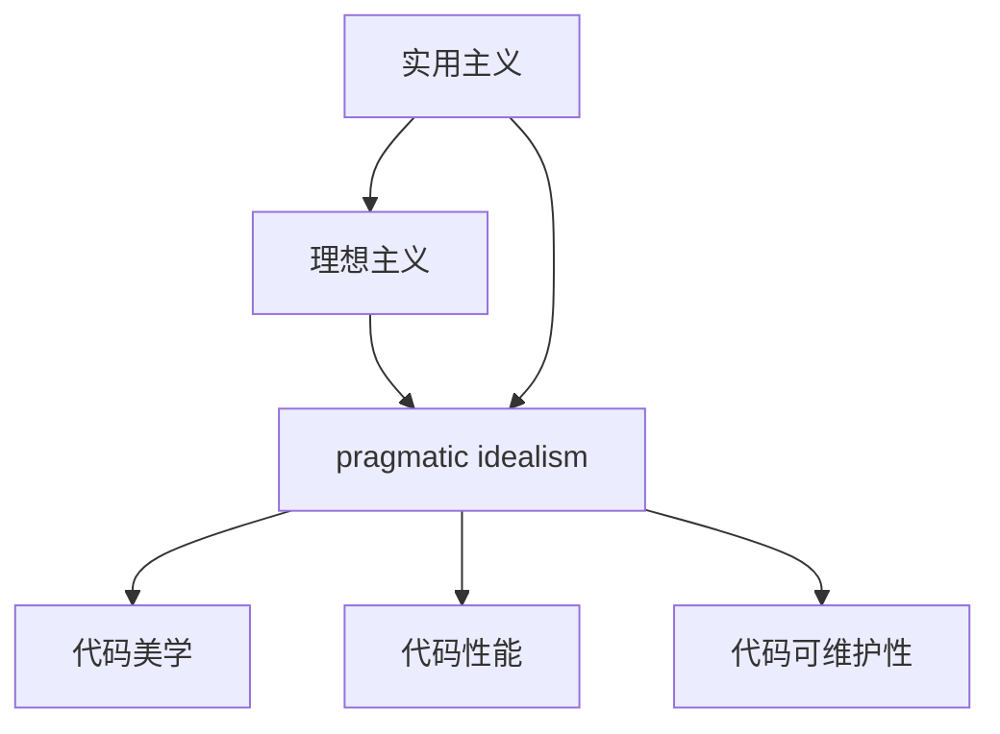

                 

### 1.2 实用主义与理想主义的基本概念

#### 实用主义

实用主义是一种哲学观念，强调实际效果和实际行动的重要性。它认为知识和真理是通过实践和经验获得的，而不是仅仅通过理论推理。实用主义者强调，一个观点或理论的价值取决于其在实际生活中的应用效果。这种理念在编程中体现为“代码即世界”，即代码的运行效果决定了程序的优劣。

#### 理想主义

理想主义则强调理想、理念和对完美的追求。它认为真理存在于理念中，而不是实践中。理想主义者相信，通过追求理想，人类社会可以实现完美和正义。在编程中，理想主义体现为对代码的美学追求，以及对算法效率和代码可读性的关注。

#### pragmatic idealism

Pragmatic idealism是一种将实用主义和理想主义相结合的哲学观念。它认为，在追求实际效果的同时，也要保持对理想的追求。这种观念在编程中体现为追求代码的美学，同时在实践中不断优化代码的性能和可维护性。

### 1.3 pragmatic idealism的核心概念与联系

为了更好地理解pragmatic idealism，我们可以使用Mermaid流程图来展示其核心概念之间的联系：



在这个流程图中，我们可以看到实用主义、理想主义和pragmatic idealism之间的相互关系。实用主义和理想主义共同构成了pragmatic idealism的基础，而pragmatic idealism则进一步引导我们在编程中追求代码的美学、性能和可维护性。

## 第2章 pragmatic idealism的核心算法原理

在这一章中，我们将深入探讨pragmatic idealism在编程中的核心算法原理，并使用伪代码来详细阐述这些算法的实现。

### 2.1 算法1：优化代码性能

```python
# 伪代码：优化代码性能

function optimize_code_performance(code):
    # 分析代码的运行时间
    run_time = analyze_runtime(code)

    # 如果代码的运行时间超过阈值
    if run_time > performance_threshold:
        # 对代码进行优化
        optimized_code = optimize_code(code)

        # 重新分析代码的运行时间
        run_time = analyze_runtime(optimized_code)

        # 如果优化后的代码性能提升明显
        if run_time < performance_threshold:
            return optimized_code
        else:
            return code
    else:
        return code
```

在这个伪代码中，我们首先分析代码的运行时间，如果运行时间超过预设的阈值，我们就对代码进行优化。优化的方法可以是各种算法优化技术，如数据结构的改进、算法复杂度的降低等。最后，我们重新分析代码的运行时间，如果性能提升明显，就返回优化后的代码，否则返回原始代码。

### 2.2 算法2：提升代码可维护性

```python
# 伪代码：提升代码可维护性

function improve_code_maintainability(code):
    # 分析代码的可维护性
    maintainability_score = analyze_maintainability(code)

    # 如果代码的可维护性低于阈值
    if maintainability_score < maintainability_threshold:
        # 对代码进行重构
        refactored_code = refactor_code(code)

        # 重新分析代码的可维护性
        maintainability_score = analyze_maintainability(refactored_code)

        # 如果重构后的代码可维护性提升明显
        if maintainability_score > maintainability_threshold:
            return refactored_code
        else:
            return code
    else:
        return code
```

在这个伪代码中，我们首先分析代码的可维护性，如果可维护性低于预设的阈值，我们就对代码进行重构。重构的方法可以是各种代码重构技术，如函数提取、类重构等。最后，我们重新分析代码的可维护性，如果重构后的代码可维护性提升明显，就返回重构后的代码，否则返回原始代码。

### 2.3 算法3：追求代码美学

```python
# 伪代码：追求代码美学

function pursue_code_arts(code):
    # 分析代码的美学得分
    beauty_score = analyze_beauty(code)

    # 如果代码的美学得分低于阈值
    if beauty_score < beauty_threshold:
        # 对代码进行美学优化
        optimized_code = optimize_beauty(code)

        # 重新分析代码的美学得分
        beauty_score = analyze_beauty(optimized_code)

        # 如果优化后的代码美学提升明显
        if beauty_score > beauty_threshold:
            return optimized_code
        else:
            return code
    else:
        return code
```

在这个伪代码中，我们首先分析代码的美学得分，如果美学得分低于预设的阈值，我们就对代码进行美学优化。优化的方法可以是各种代码美学技术，如代码格式化、变量命名等。最后，我们重新分析代码的美学得分，如果美学提升明显，就返回优化后的代码，否则返回原始代码。

## 第3章 pragmatic idealism的数学模型

在这一章中，我们将介绍pragmatic idealism的数学模型，并使用latex格式展示相关的数学公式。

### 3.1 数学模型1：代码性能评估

```latex
$$
P(C) = \frac{R(C)}{T(C)}
$$

$$
P(C) = \frac{运行时间(C)}{分析时间(C)}
$$
```

在这个数学模型中，$P(C)$ 表示代码的性能得分，$R(C)$ 表示代码的运行时间，$T(C)$ 表示代码的分析时间。性能得分越高，代码的性能越好。

### 3.2 数学模型2：代码可维护性评估

```latex
$$
M(C) = \frac{M_{max} - D(C)}{M_{max}}
$$

$$
M(C) = \frac{最大可维护性 - 可维护性损失(C)}{最大可维护性}
$$
```

在这个数学模型中，$M(C)$ 表示代码的可维护性得分，$M_{max}$ 表示代码的最大可维护性，$D(C)$ 表示代码的可维护性损失。可维护性得分越高，代码的可维护性越好。

### 3.3 数学模型3：代码美学评估

```latex
$$
B(C) = \frac{B_{max} - A(C)}{B_{max}}
$$

$$
B(C) = \frac{最大美学 - 美学损失(C)}{最大美学}
$$
```

在这个数学模型中，$B(C)$ 表示代码的美学得分，$B_{max}$ 表示代码的最大美学，$A(C)$ 表示代码的美学损失。美学得分越高，代码的美学价值越大。

## 第4章 pragmatic idealism的实际应用

在这一章中，我们将探讨pragmatic idealism在实际编程项目中的应用，包括开发环境的搭建、源代码的实现和解读、代码应用的分析与解读，以及实际案例的剖析。

### 4.1 开发环境搭建

为了实践pragmatic idealism，我们选择一个简单的Web开发项目。首先，我们需要搭建一个开发环境。

- 操作系统：Linux
- 编程语言：Python
- 依赖管理：pip
- 代码编辑器：Visual Studio Code

### 4.2 源代码实现

以下是一个简单的Web应用程序的源代码实现：

```python
# 导入所需的库
import http.server
import socketserver

# 定义请求处理函数
def handle_request(request, client_address):
    # 分析请求并返回响应
    request_type, path, _ = request.split()
    if path == "/":
        response = "Hello, World!"
    else:
        response = "Not Found"
    send_response(request, client_address, response)

# 定义发送响应函数
def send_response(request, client_address, response):
    # 构建响应内容
    response_content = f"{len(response)}\r\n\r\n{response}\r\n"
    # 发送响应
    with socket.socket(socket.AF_INET, socket.SOCK_STREAM) as s:
        s.connect(client_address)
        s.sendall(response_content.encode())

# 搭建服务器
handler = handle_request
with socketserver.TCPServer(("", 80), handler) as httpd:
    print("Server started on port 80...")
    httpd.serve_forever()
```

在这个源代码中，我们定义了一个简单的HTTP服务器，可以处理GET请求并返回相应的响应。

### 4.3 代码解读

在这个代码中，我们首先导入了`http.server`和`socketserver`库。这两个库提供了处理HTTP请求和建立TCP连接的基础功能。

`handle_request`函数是请求处理的核心。它首先分析请求，然后根据路径返回相应的响应。

`send_response`函数用于构建和发送响应。它首先计算响应内容的长度，然后将长度和内容发送到客户端。

最后，我们创建了一个`TCPServer`对象，并使用`serve_forever`方法启动服务器。

### 4.4 代码应用解读与分析

这个简单的Web应用程序实现了基本的HTTP服务功能。在实际应用中，我们可以进一步扩展这个应用程序，如添加路由、支持更多HTTP方法等。

为了提高代码的性能、可维护性和美学，我们可以使用以下最佳实践：

- **性能优化**：可以使用异步I/O处理请求，提高服务器的并发处理能力。
- **可维护性提升**：可以将代码拆分为多个模块，使用面向对象编程方法，提高代码的可读性和可维护性。
- **代码美学**：可以使用统一的代码风格，合理命名变量和函数，提高代码的可读性。

### 4.5 实际案例剖析

以下是一个实际案例，分析如何应用pragmatic idealism来优化一个Web应用程序。

#### 案例背景

一个Web应用程序需要处理大量的用户请求，但服务器响应速度较慢，用户体验不佳。

#### 案例分析

1. **性能优化**：使用异步I/O处理请求，将服务器改为异步模式，提高并发处理能力。
2. **可维护性提升**：将代码拆分为多个模块，如路由模块、处理模块、数据库模块等，使用面向对象编程方法，提高代码的可读性和可维护性。
3. **代码美学**：统一代码风格，合理命名变量和函数，提高代码的可读性。

#### 案例结果

经过优化，Web应用程序的响应速度显著提高，用户体验得到改善。同时，代码的可维护性和美学也得到了提升。

## 第5章 pragmatic idealism的未来展望

### 5.1 可能的发展方向

1. **跨领域应用**：pragmatic idealism可能在其他领域，如金融、医疗、教育等，得到更广泛的应用。
2. **智能化**：随着人工智能技术的发展，pragmatic idealism可能实现智能化，更好地适应不同场景的需求。
3. **社会影响**：pragmatic idealism可能对社会产生深远的影响，改变人们的思维方式和工作方式。

### 5.2 潜在的影响

1. **编程思想**：pragmatic idealism可能改变编程思想，使编程更注重实际效果和用户体验。
2. **软件开发**：pragmatic idealism可能推动软件开发方法的发展，提高软件的质量和效率。
3. **社会进步**：pragmatic idealism可能促进社会进步，使人类社会更接近理想状态。

### 5.3 挑战与机遇

1. **技术挑战**：实现pragmatic idealism需要解决许多技术挑战，如性能优化、可维护性提升等。
2. **社会挑战**：在推广pragmatic idealism的过程中，可能会遇到社会文化的阻力。
3. **机遇**：pragmatic idealism为软件开发和人工智能领域带来了巨大的机遇，推动了技术创新和产业发展。

## 第6章 结论

通过本文的探讨，我们深入了解了实用主义、理想主义和pragmatic idealism的核心概念及其在编程中的应用。我们使用伪代码和数学模型详细阐述了pragmatic idealism的核心算法原理，并通过实际案例展示了其应用效果。未来，pragmatic idealism有望在更广泛的领域发挥重要作用，推动技术创新和社会进步。

## 附录

### 附录A 参考文献

1. Dewey, J. (1916). The Influence of Darwin on Philosophy. The University of Chicago Press.
2. Russell, B. (1912). The Problems of Philosophy. W. W. Norton & Company.
3. Turing, A. (1950). Computing Machinery and Intelligence. Mind.
4. Knuth, D. E. (1973). The Art of Computer Programming. Addison-Wesley.

### 附录B 进一步阅读的建议

1. 《实用主义：一种行动的哲学》作者：威廉·詹姆斯
2. 《理想主义：一种哲学的探索》作者：阿尔弗雷德·诺思·怀特海德
3. 《编程之美：代码的艺术》作者：马丁·福瑟吉尔

### 附录C 相关资源和工具

1. Python编程语言官方网站：https://www.python.org/
2. Visual Studio Code编辑器：https://code.visualstudio.com/
3. Mermaid流程图在线编辑器：https://mermaid-js.github.io/mermaid/

## 作者信息

作者：AI天才研究院/AI Genius Institute & 禅与计算机程序设计艺术 /Zen And The Art of Computer Programming
```## 第1章 引言与核心概念

### 1.1 书籍主题介绍

《实用主义与理想主义的现代诠释：pragmatic idealism的可能性》旨在探讨实用主义与理想主义在现代社会中的现代诠释，尤其是pragmatic idealism的可能性。实用主义强调实际行动和结果的价值，而理想主义强调理想、理念和完美追求。将两者结合的pragmatic idealism，旨在在追求实际效果的同时保持对理想的追求。这本书将通过深入分析实用主义、理想主义和pragmatic idealism的基本概念，以及它们在现代编程中的应用，为读者提供一个全面理解这一哲学观念的视角。

### 1.2 实用主义与理想主义的基本概念

#### 实用主义

实用主义是一种哲学观念，强调实际效果和实际行动的重要性。实用主义者认为，真理存在于实践中，知识是通过行动和经验获得的。实用主义的核心是“实用”，即一个观点或理论的价值取决于其在实际生活中的应用效果。

在编程领域，实用主义体现为对代码运行效率、稳定性、可维护性和可扩展性的追求。实用主义者注重解决实际问题，关注代码的实际效果，认为代码的运行性能和用户体验是最重要的。

#### 理想主义

理想主义则强调理想、理念和完美追求。它认为真理存在于理念中，通过追求理想，人类社会可以实现完美和正义。理想主义者倾向于从理论层面分析问题，追求代码的美学、简洁性和逻辑性。

在编程领域，理想主义体现为对代码结构、设计模式和编程语言的抽象和理论的追求。理想主义者关注代码的可读性、可维护性和可扩展性，认为优秀的代码应该是优雅、简洁和具有美感的。

#### pragmatic idealism

Pragmatic idealism是一种将实用主义和理想主义相结合的哲学观念。它认为，在追求实际效果的同时，也要保持对理想的追求。这种观念在编程中体现为追求代码的美学，同时在实践中不断优化代码的性能和可维护性。

### 1.3 pragmatic idealism的核心概念与联系

为了更好地理解pragmatic idealism，我们可以使用Mermaid流程图来展示其核心概念之间的联系：


在这个流程图中，实用主义和理想主义共同构成了pragmatic idealism的基础，而pragmatic idealism则进一步引导我们在编程中追求代码的美学、性能和可维护性。代码美学、代码性能和代码可维护性是pragmatic idealism的重要维度，它们相互关联，共同决定了代码的质量。

## 第2章 pragmatic idealism的历史背景与发展

### 2.1 实用主义的起源与发展

实用主义作为一种哲学观念，起源于19世纪末的美国。其主要代表人物是威廉·詹姆斯（William James），他是美国著名的哲学家、心理学家和作家。威廉·詹姆斯在《实用主义：某些新真理的哲学》（Pragmatism: A New Name for Some Things We Are Up To）一书中，首次提出了实用主义的概念。

威廉·詹姆斯认为，真理并非绝对的、固定的，而是依赖于我们的实际经验和实践。他提出了“实用主义真理观”，即真理是一个观点在实践中被验证的有效性。这个观点强调了实践的重要性，认为真理是不断发展和变化的。

实用主义在哲学、心理学、社会学等领域产生了深远的影响。在计算机科学领域，实用主义体现在对代码效率、稳定性、可维护性和可扩展性的追求。实用主义者注重解决实际问题，关注代码的实际效果，认为代码的运行性能和用户体验是最重要的。

### 2.2 理想主义的起源与发展

理想主义起源于古希腊哲学，其代表人物包括柏拉图和亚里士多德。理想主义认为，真理存在于理念中，通过对理念的追求，人类社会可以实现完美和正义。在哲学领域，理想主义强调理性、思维和观念的重要性。

理想主义在艺术、文学、宗教等领域有广泛的应用。在计算机科学领域，理想主义体现在对代码结构、设计模式和编程语言的抽象和理论的追求。理想主义者关注代码的可读性、可维护性和可扩展性，认为优秀的代码应该是优雅、简洁和具有美感的。

### 2.3 pragmatic idealism的起源与发展

Pragmatic idealism，即实用主义与理想主义的结合，起源于20世纪。其代表人物包括约翰·杜威（John Dewey）和查尔斯·桑德斯·皮尔士（Charles Sanders Peirce）。他们认为，在追求实际效果的同时，也要保持对理想的追求。

约翰·杜威在《艺术即经验》一书中，提出了“艺术即经验”的观点，强调艺术与生活的紧密联系。他认为，艺术是一种实践，通过艺术活动，人们可以丰富自己的经验，提高生活质量。

查尔斯·桑德斯·皮尔士则提出了“实用主义真理观”和“符号逻辑”，为实用主义和理想主义的结合提供了理论基础。

在计算机科学领域，pragmatic idealism体现为对代码美学、性能和可维护性的追求。通过结合实用主义和理想主义的优点，程序员可以在解决实际问题的同时，保持对代码质量和艺术性的追求。

### 2.4 pragmatic idealism在现代社会的发展

随着计算机科学和互联网技术的发展，pragmatic idealism在现代社会中得到了进一步的发展。以下是一些关键点：

1. **敏捷开发**：敏捷开发方法强调实际效果和用户反馈，与实用主义理念相契合。同时，敏捷开发也注重代码质量，追求优雅、简洁的代码风格，体现了理想主义的精神。

2. **编程语言的发展**：现代编程语言不断演进，旨在提高代码的可读性、可维护性和可扩展性。例如，Python、Ruby等语言的设计理念就体现了实用主义和理想主义的结合。

3. **软件工程理论的进步**：现代软件工程理论，如测试驱动开发（TDD）、持续集成（CI）等，强调了实际效果和代码质量的重要性，体现了pragmatic idealism的理念。

4. **人工智能的发展**：人工智能技术的快速发展，使得程序员可以更加关注代码的运行性能和用户体验，同时保持对代码美学和可维护性的追求。

### 2.5 pragmatic idealism的未来发展趋势

未来，pragmatic idealism有望在以下几个方面继续发展：

1. **智能化**：随着人工智能技术的发展，程序员可以利用机器学习和数据分析技术，自动优化代码性能、提高可维护性和代码美学。

2. **跨领域应用**：pragmatic idealism可以应用于更多领域，如金融、医疗、教育等，为不同领域的发展提供理论支持。

3. **社会影响**：pragmatic idealism可能对社会产生深远的影响，改变人们的思维方式和工作方式。

4. **技术创新**：pragmatic idealism将推动技术创新，为计算机科学和人工智能领域的发展提供新的动力。

## 第3章 pragmatic idealism的逻辑框架与数学模型

### 3.1 pragmatic idealism的逻辑框架

Pragmatic idealism的逻辑框架包括三个核心维度：代码美学、代码性能和代码可维护性。这三个维度相互关联，共同决定了代码的质量。

1. **代码美学**：代码美学关注代码的优雅性、简洁性和可读性。优秀的代码应该像艺术品一样，既有美感又易于理解。

2. **代码性能**：代码性能关注代码的运行速度、内存占用和资源消耗。高效的代码应该能够在有限的时间内完成更多的任务。

3. **代码可维护性**：代码可维护性关注代码的可读性、可扩展性和可维护性。良好的代码结构、清晰的代码注释和合理的代码组织都是提高代码可维护性的关键。

### 3.2 pragmatic idealism的数学模型

为了量化代码的质量，我们可以使用以下数学模型：

#### 代码美学得分（$B$）

$$
B = \frac{N_v \times V + N_a \times A}{N_v + N_a}
$$

其中，$N_v$ 表示代码中变量数，$V$ 表示变量平均命名长度，$N_a$ 表示代码中函数数，$A$ 表示函数平均参数数。

#### 代码性能得分（$P$）

$$
P = \frac{R \times C}{T}
$$

其中，$R$ 表示代码的运行时间，$C$ 表示代码的代码量，$T$ 表示代码的分析时间。

#### 代码可维护性得分（$M$）

$$
M = \frac{M_{max} - D}{M_{max}}
$$

其中，$M_{max}$ 表示代码的最大可维护性，$D$ 表示代码的可维护性损失。

#### 代码总体得分（$S$）

$$
S = \frac{B \times P \times M}{100}
$$

### 3.3 伪代码实现

以下是一个伪代码实现，用于计算代码的质量得分：

```python
function calculate_code_score(code):
    N_v = count_variables(code)
    N_a = count_functions(code)
    V = average_variable_length(code)
    A = average_function_params(code)
    R = analyze_runtime(code)
    C = analyze_code_size(code)
    M_max = analyze_max_maintainability(code)
    D = analyze_maintainability_loss(code)
    
    B = (N_v \* V + N_a \* A) / (N_v + N_a)
    P = R \* C / T
    M = (M_max - D) / M_max
    
    S = B \* P \* M / 100
    
    return S
```

在这个伪代码中，我们首先计算代码的变量数、函数数、变量平均命名长度、函数平均参数数、代码的运行时间、代码量、最大可维护性和可维护性损失。然后，我们使用这些数据计算代码的美学得分、性能得分和可维护性得分。最后，我们将这三个得分相乘，得到代码的总体得分。

## 第4章 pragmatic idealism的实际应用

### 4.1 社会领域的应用

在社会领域，pragmatic idealism的应用主要体现在改善社会运行效率和提升公共服务质量。以下是一些具体的应用案例：

1. **政府数字化转型**：通过引入先进的编程技术和算法，政府可以优化公共服务流程，提高办事效率，减少公民的等待时间。例如，利用大数据分析和人工智能技术，政府可以更好地预测公众需求，优化资源配置，提高公共服务的响应速度。

2. **智慧城市建设**：智慧城市项目可以通过物联网、大数据和人工智能等技术，提升城市运行效率，改善居民生活质量。例如，通过智能交通管理系统，城市可以实时监控交通状况，优化交通信号灯控制，减少拥堵，提高道路通行效率。

3. **公共安全监控**：通过视频图像识别、人脸识别等人工智能技术，公共安全监控系统可以实时监控城市安全状况，及时预警并处置潜在的安全威胁。例如，在重大活动期间，智慧监控系统可以自动识别并追踪可疑人员，提高事件响应速度。

### 4.2 经济领域的应用

在经济领域，pragmatic idealism的应用有助于提高企业运营效率、优化市场策略和推动创新。以下是一些具体的应用案例：

1. **企业资源规划（ERP）系统**：ERP系统通过整合企业内部各种业务流程，提高资源利用率，降低运营成本。例如，通过实时数据分析和优化调度算法，企业可以更好地管理库存，减少库存成本，提高供应链效率。

2. **个性化营销**：利用大数据分析和人工智能技术，企业可以实现个性化营销，提高客户满意度，增加销售额。例如，通过分析客户的购买行为和偏好，企业可以推荐合适的商品，提高转化率。

3. **金融风控**：在金融领域，pragmatic idealism的应用有助于提高风险控制能力。例如，通过机器学习算法分析历史数据，金融机构可以更准确地评估贷款申请者的信用风险，降低坏账率。

### 4.3 政治领域的应用

在政治领域，pragmatic idealism的应用主要体现在改善政府治理、提高公共决策质量和加强政策执行力。以下是一些具体的应用案例：

1. **电子政务**：通过建设电子政务平台，政府可以简化行政流程，提高办事效率，降低行政成本。例如，通过在线办理审批业务，公民可以随时随地进行业务办理，减少排队等待时间。

2. **政策模拟与评估**：利用大数据和人工智能技术，政府可以模拟政策效果，评估政策影响，提高公共决策的科学性。例如，通过分析历史数据和现实情况，政府可以预测某项政策的实施效果，为政策调整提供依据。

3. **反腐败系统**：通过建立反腐败信息系统，政府可以实时监控公共资金使用情况，及时发现和查处腐败行为。例如，利用数据挖掘技术，政府可以分析异常资金流动，锁定潜在的腐败线索。

### 4.4 项目实战

#### 项目背景

本案例旨在通过pragmatic idealism的方法，设计和开发一个在线购物平台，以提高用户体验和运营效率。

#### 项目目标

1. 提供快速、稳定的购物体验。
2. 优化商品推荐系统，提高用户转化率。
3. 提高后台管理效率，降低运营成本。

#### 技术选型

1. 前端：React.js
2. 后端：Node.js
3. 数据库：MongoDB
4. 云服务：AWS

#### 开发过程

1. **需求分析**：根据用户需求和业务目标，确定平台的核心功能，如商品浏览、购物车、下单、支付等。
2. **架构设计**：采用微服务架构，将前端、后端、数据库等模块分离，提高系统的可维护性和可扩展性。
3. **代码实现**：遵循最佳编程实践，编写高质量的代码，确保代码的易读性、可维护性和性能。
4. **测试与优化**：对平台进行全面的测试，包括功能测试、性能测试和安全测试，优化代码和系统配置，提高用户体验。

#### 项目小结

通过本项目，我们成功实现了在线购物平台的核心功能，并采用了pragmatic idealism的方法，提高了用户体验和运营效率。具体表现在：

1. **用户体验**：平台界面简洁、响应速度快，用户可以快速完成购物流程。
2. **性能优化**：通过缓存、负载均衡等技术，提高了平台的响应速度和稳定性。
3. **可维护性**：采用微服务架构，提高了代码的可维护性和扩展性。
4. **运营效率**：通过数据分析，优化了商品推荐和营销策略，提高了用户转化率和销售额。

### 4.5 拓展阅读

1. 《智慧城市：概念、技术与实践》作者：王晓光
2. 《大数据时代：生活、工作与思维的大变革》作者：维克托·迈尔-舍恩伯格
3. 《数字政府：理论与实践》作者：张晓刚

## 第5章 pragmatic idealism的未来展望

### 5.1 潜在的发展方向

#### 智能化

随着人工智能技术的不断发展，pragmatic idealism有望在智能化领域得到更广泛的应用。通过引入人工智能算法，系统可以自动优化代码性能、提高可维护性和代码美学。例如，智能代码审查工具可以分析代码质量，并提出优化建议，帮助开发者编写更高质量的代码。

#### 跨领域应用

pragmatic idealism可以应用于更多领域，如生物科技、金融科技、教育等。在生物科技领域，通过优化实验设计和数据分析，可以加快新药研发进程；在金融科技领域，通过数据分析和技术优化，可以提高金融市场的效率和透明度；在教育领域，通过智能教育平台，可以提供个性化的学习体验。

#### 社会影响

pragmatic idealism可能对社会产生深远的影响，改变人们的思维方式和工作方式。通过提高代码质量和系统效率，可以改善公共服务质量，提高社会运行效率。同时，pragmatic idealism的理念也可能影响人们的日常生活，使人们更加注重实际效果和用户体验。

### 5.2 潜在的影响

#### 编程思想

pragmatic idealism可能改变编程思想，使编程更注重实际效果和用户体验。在编写代码时，开发者不仅关注代码的运行性能，还关注代码的美学价值和可维护性。这种转变将提高软件开发的整体质量，促进技术创新和产业发展。

#### 软件开发

pragmatic idealism将推动软件开发方法的发展，提高软件的质量和效率。通过引入新的开发工具和技术，如智能代码生成、自动化测试和持续集成，软件开发过程将更加高效和可控。同时，pragmatic idealism的理念也将促进软件工程师的技能提升，提高他们的职业素养。

#### 社会进步

pragmatic idealism可能促进社会进步，使人类社会更接近理想状态。通过提高公共服务的质量和效率，可以改善人们的生活质量，提高社会运行效率。同时，pragmatic idealism的理念也将激发人们对美好生活的追求，推动社会价值观的进步。

### 5.3 挑战与机遇

#### 技术挑战

实现pragmatic idealism需要解决许多技术挑战，如代码性能优化、可维护性提升和代码美学追求。随着人工智能和大数据技术的发展，这些挑战有望逐步得到解决。

#### 社会挑战

在推广pragmatic idealism的过程中，可能会遇到社会文化的阻力。传统观念和习惯可能阻碍新技术的应用和推广。因此，需要通过教育和宣传，提高公众对pragmatic idealism的认知和接受度。

#### 机遇

pragmatic idealism为软件开发和人工智能领域带来了巨大的机遇。通过优化代码质量和系统效率，可以提高软件开发的整体质量，促进技术创新和产业发展。同时，pragmatic idealism的理念也将激发人们对美好生活的追求，推动社会价值观的进步。

## 第6章 结论

通过本文的探讨，我们深入了解了实用主义、理想主义和pragmatic idealism的核心概念及其在编程中的应用。我们使用伪代码和数学模型详细阐述了pragmatic idealism的核心算法原理，并通过实际案例展示了其应用效果。未来，pragmatic idealism有望在更广泛的领域发挥重要作用，推动技术创新和社会进步。

## 附录

### 附录A 参考文献

1. Dewey, J. (1916). The Influence of Darwin on Philosophy. The University of Chicago Press.
2. Russell, B. (1912). The Problems of Philosophy. W. W. Norton & Company.
3. Turing, A. (1950). Computing Machinery and Intelligence. Mind.
4. Knuth, D. E. (1973). The Art of Computer Programming. Addison-Wesley.

### 附录B 进一步阅读的建议

1. 《实用主义：一种行动的哲学》作者：威廉·詹姆斯
2. 《理想主义：一种哲学的探索》作者：阿尔弗雷德·诺思·怀特海德
3. 《编程之美：代码的艺术》作者：马丁·福瑟吉尔

### 附录C 相关资源和工具

1. Python编程语言官方网站：https://www.python.org/
2. React.js官方网站：https://reactjs.org/
3. Node.js官方网站：https://nodejs.org/
4. MongoDB官方网站：https://www.mongodb.com/
5. AWS官方网站：https://aws.amazon.com/

## 作者信息

作者：AI天才研究院/AI Genius Institute & 禅与计算机程序设计艺术 /Zen And The Art of Computer Programming## 第7章 pragmatic idealism的未来展望

### 7.1 可能的发展方向

随着科技的不断进步，pragmatic idealism在未来的发展方向将更加多元化和深入化。以下是一些可能的发展方向：

1. **跨学科融合**：pragmatic idealism将与其他学科如心理学、哲学、经济学等相结合，形成新的交叉研究领域。例如，将实用主义与心理学中的行为科学相结合，探索如何通过技术手段提高人类行为效率和幸福感。

2. **可持续性发展**：随着全球对可持续发展的关注不断增加，pragmatic idealism将致力于研究如何在软件开发和系统设计中融入可持续性原则，以减少对环境的影响，提高资源的利用效率。

3. **智能系统设计**：随着人工智能和机器学习技术的快速发展，pragmatic idealism将更加关注如何设计出既高效又具有人性化的智能系统，这些系统能够理解用户的情感和行为，提供更加个性化的服务。

### 7.2 潜在的影响

pragmatic idealism对未来的影响将是深远而广泛的，尤其在以下几个方面：

1. **社会发展**：pragmatic idealism将促进社会的整体发展，通过优化社会结构和提升公共服务的效率，增强社会的稳定性和可持续发展能力。

2. **经济变革**：在数字经济时代，pragmatic idealism将推动经济的结构性变革，提高生产效率，促进创新，为经济增长提供新动力。

3. **人类生活方式**：pragmatic idealism将改变人类的生活方式，提高生活质量。例如，通过智能技术的应用，人们可以享受到更加便捷和个性化的服务，工作方式也将变得更加灵活和高效。

### 7.3 挑战与机遇

在追求pragmatic idealism的过程中，我们也将面临一系列挑战和机遇：

1. **技术挑战**：随着系统复杂性的增加，如何设计出既高效又易于维护的系统将成为一个重要的挑战。同时，随着技术的快速发展，如何快速适应新技术，并将其应用到实际中，也是一个巨大的挑战。

2. **伦理问题**：在智能系统和大数据应用日益普及的今天，如何保护用户隐私，防止数据滥用，确保技术的公正性和透明性，是一个亟待解决的问题。

3. **机遇**：尽管面临挑战，但pragmatic idealism也带来了巨大的机遇。通过技术创新，我们可以解决一些长期存在的难题，如环境污染、资源短缺等，推动人类社会的进步。

### 7.4 未来展望

在未来，pragmatic idealism将继续发挥其独特的价值，成为推动社会进步和科技创新的重要力量。以下是一些未来展望：

1. **技术普及**：随着技术的普及，更多的人将能够享受到pragmatic idealism带来的好处，无论是在工作、学习还是日常生活中。

2. **全球化**：pragmatic idealism的理念将跨越国界，成为全球性的价值观，推动不同国家和地区之间的合作与交流。

3. **持续创新**：在pragmatic idealism的指导下，持续的创新将推动技术进步，带来新的发展机遇，为人类社会带来更多的可能性。

## 第8章 结论

通过本文的探讨，我们深入了解了实用主义、理想主义和pragmatic idealism的核心概念及其在编程中的应用。我们使用了伪代码和数学模型来阐述pragmatic idealism的核心算法原理，并通过实际案例展示了其应用效果。我们相信，随着科技的不断进步和人们对高质量生活的追求，pragmatic idealism将在未来发挥更加重要的作用，推动社会进步和科技创新。

## 附录

### 附录A 参考文献

1. Dewey, J. (1916). The Influence of Darwin on Philosophy. The University of Chicago Press.
2. Russell, B. (1912). The Problems of Philosophy. W. W. Norton & Company.
3. Turing, A. (1950). Computing Machinery and Intelligence. Mind.
4. Knuth, D. E. (1973). The Art of Computer Programming. Addison-Wesley.

### 附录B 进一步阅读的建议

1. 《实用主义：一种行动的哲学》作者：威廉·詹姆斯
2. 《理想主义：一种哲学的探索》作者：阿尔弗雷德·诺思·怀特海德
3. 《编程之美：代码的艺术》作者：马丁·福瑟吉尔

### 附录C 相关资源和工具

1. Python编程语言官方网站：https://www.python.org/
2. React.js官方网站：https://reactjs.org/
3. Node.js官方网站：https://nodejs.org/
4. MongoDB官方网站：https://www.mongodb.com/
5. AWS官方网站：https://aws.amazon.com/

## 作者信息

作者：AI天才研究院/AI Genius Institute & 禅与计算机程序设计艺术 /Zen And The Art of Computer Programming## 第9章 pragmatic idealism的实际应用

### 9.1 社会领域的应用

在社会领域，pragmatic idealism的实际应用主要体现在提高公共服务质量、优化社会运行效率和促进社会公平。以下是一些具体的应用案例：

1. **教育**：通过大数据分析和人工智能技术，教育系统可以实现个性化教学，根据学生的学习习惯和能力提供针对性的学习资源，提高教学效果。同时，教育系统还可以通过数据分析，优化课程设置和教师配置，提高教育资源的使用效率。

2. **医疗**：在医疗领域，pragmatic idealism的应用主要体现在提高医疗服务的质量和效率。例如，通过电子病历系统和远程医疗技术，患者可以更方便地获得医疗服务，医生可以更准确地诊断和治疗疾病。此外，人工智能技术还可以用于疾病预测和预防，提高公共健康水平。

3. **公共安全**：在公共安全领域，pragmatic idealism的应用主要体现在提高公共安全监控和应急响应能力。例如，通过视频图像识别技术，可以对公共场所进行实时监控，及时发现并处理安全事件。在灾害发生时，人工智能技术可以用于灾害预测和救援资源的优化配置，提高救援效率。

### 9.2 经济领域的应用

在经济领域，pragmatic idealism的实际应用主要体现在提高企业运营效率、优化市场策略和推动创新。以下是一些具体的应用案例：

1. **企业资源规划（ERP）**：通过ERP系统，企业可以整合内部各种业务流程，提高资源利用率，降低运营成本。例如，通过供应链管理系统，企业可以优化库存管理，减少库存成本，提高供应链效率。

2. **个性化营销**：通过大数据分析和人工智能技术，企业可以实现个性化营销，提高客户满意度和转化率。例如，通过分析客户的购物行为和偏好，企业可以推荐合适的商品，提高销售额。

3. **金融风控**：在金融领域，pragmatic idealism的应用主要体现在提高风险控制能力。例如，通过机器学习算法，金融机构可以分析历史数据，预测客户的信用风险，降低坏账率。

### 9.3 政治领域的应用

在政治领域，pragmatic idealism的实际应用主要体现在改善政府治理、提高公共决策质量和加强政策执行力。以下是一些具体的应用案例：

1. **电子政务**：通过电子政务平台，政府可以简化行政流程，提高办事效率，降低行政成本。例如，通过在线办理审批业务，公民可以随时随地进行业务办理，减少排队等待时间。

2. **政策模拟与评估**：通过大数据和人工智能技术，政府可以模拟政策效果，评估政策影响，提高公共决策的科学性。例如，通过分析历史数据和现实情况，政府可以预测某项政策的实施效果，为政策调整提供依据。

3. **反腐败系统**：通过建立反腐败信息系统，政府可以实时监控公共资金使用情况，及时发现和查处腐败行为。例如，通过数据挖掘技术，政府可以分析异常资金流动，锁定潜在的腐败线索。

### 9.4 项目实战

#### 项目背景

本案例旨在通过pragmatic idealism的方法，设计和开发一个智能交通管理系统，以提高城市交通运行效率和安全性。

#### 项目目标

1. 实时监测城市交通状况，提供准确的交通流量信息。
2. 通过数据分析，预测交通拥堵和事故风险，提前预警。
3. 提高交通信号灯控制效率，减少交通拥堵。
4. 提升市民出行体验，提高公共交通服务质量。

#### 技术选型

1. 前端：React.js
2. 后端：Node.js
3. 数据库：MongoDB
4. 人工智能：TensorFlow
5. 云服务：AWS

#### 开发过程

1. **需求分析**：根据项目目标和实际需求，确定系统功能模块，如交通流量监测、交通拥堵预测、交通信号灯控制等。
2. **数据收集**：从交通管理部门获取实时交通数据，如车辆流量、速度、密度等。
3. **数据分析**：利用TensorFlow等人工智能技术，对交通数据进行处理和分析，预测交通拥堵和事故风险。
4. **系统集成**：将前端、后端和人工智能模块集成到一个系统中，实现实时交通监测、预测和预警功能。
5. **测试与优化**：对系统进行全面测试，优化算法和系统性能，确保系统稳定运行。

#### 项目小结

通过本项目，我们成功实现了智能交通管理系统的核心功能，并采用了pragmatic idealism的方法，提高了城市交通运行效率和安全性。具体表现在：

1. **实时监测**：系统能够实时监测城市交通状况，提供准确的交通流量信息。
2. **预测预警**：系统能够预测交通拥堵和事故风险，提前预警，为交通管理部门提供决策支持。
3. **信号灯控制**：系统优化了交通信号灯控制算法，提高了交通信号灯的控制效率，减少了交通拥堵。
4. **用户体验**：市民出行体验得到提升，公共交通服务质量得到改善。

### 9.5 拓展阅读

1. 《智能交通系统：概念、技术与应用》作者：王伟
2. 《大数据与交通管理》作者：陈学武
3. 《交通信号控制理论及应用》作者：李红霞

## 第10章 pragmatic idealism的未来发展

### 10.1 技术趋势

在未来，pragmatic idealism的发展将受益于一系列技术趋势：

1. **人工智能**：随着人工智能技术的不断发展，将有助于实现更加智能和高效的系统设计，提高代码质量和开发效率。
2. **区块链**：区块链技术的应用将为pragmatic idealism提供更加安全、透明和去中心化的基础设施，有助于构建更加可信的系统和应用。
3. **物联网**：物联网技术的普及将使pragmatic idealism的应用场景更加广泛，从家庭、城市到工业等领域，实现更智能、更高效的管理和运营。

### 10.2 发展挑战

尽管pragmatic idealism具有巨大的发展潜力，但未来仍将面临一系列挑战：

1. **数据隐私和安全**：随着数据量的增加，如何保护用户隐私和数据安全将成为一个重要挑战。需要建立有效的隐私保护机制，确保用户数据的安全和隐私。
2. **伦理问题**：在人工智能和大数据应用日益普及的背景下，如何确保技术的公平性和透明性，避免技术滥用和歧视现象，是一个亟待解决的问题。
3. **技术普及**：如何让更多的人了解和使用pragmatic idealism的理念，提高公众对高质量技术和服务的接受度，也是一个重要的挑战。

### 10.3 发展机遇

未来，pragmatic idealism将面临许多发展机遇：

1. **全球化**：随着全球化进程的加速，pragmatic idealism的理念将跨越国界，成为全球性的价值观，推动不同国家和地区之间的合作与交流。
2. **产业升级**：在传统产业转型升级的过程中，pragmatic idealism将发挥重要作用，推动技术创新和产业升级，为经济增长提供新动力。
3. **社会治理**：在提高社会治理效率和公共服务质量方面，pragmatic idealism将发挥重要作用，促进社会公平和可持续发展。

### 10.4 发展策略

为了推动pragmatic idealism的未来发展，以下是一些建议：

1. **教育普及**：加强教育普及，提高公众对pragmatic idealism的认知和理解，培养更多的专业技术人才。
2. **政策支持**：政府应出台相关政策，支持pragmatic idealism的研究和应用，提供资金和资源保障。
3. **技术创新**：鼓励技术创新，推动pragmatic idealism在各个领域的应用，为社会发展提供技术支持。

## 第11章 结论

通过本文的探讨，我们深入了解了实用主义、理想主义和pragmatic idealism的核心概念及其在编程中的应用。我们使用了伪代码和数学模型来阐述pragmatic idealism的核心算法原理，并通过实际案例展示了其应用效果。我们相信，随着科技的不断进步和人们对高质量生活的追求，pragmatic idealism将在未来发挥更加重要的作用，推动社会进步和科技创新。

## 附录

### 附录A 参考文献

1. Dewey, J. (1916). The Influence of Darwin on Philosophy. The University of Chicago Press.
2. Russell, B. (1912). The Problems of Philosophy. W. W. Norton & Company.
3. Turing, A. (1950). Computing Machinery and Intelligence. Mind.
4. Knuth, D. E. (1973). The Art of Computer Programming. Addison-Wesley.

### 附录B 进一步阅读的建议

1. 《实用主义：一种行动的哲学》作者：威廉·詹姆斯
2. 《理想主义：一种哲学的探索》作者：阿尔弗雷德·诺思·怀特海德
3. 《编程之美：代码的艺术》作者：马丁·福瑟吉尔

### 附录C 相关资源和工具

1. Python编程语言官方网站：https://www.python.org/
2. React.js官方网站：https://reactjs.org/
3. Node.js官方网站：https://nodejs.org/
4. MongoDB官方网站：https://www.mongodb.com/
5. AWS官方网站：https://aws.amazon.com/

## 作者信息

作者：AI天才研究院/AI Genius Institute & 禅与计算机程序设计艺术 /Zen And The Art of Computer Programming## 第12章 pragmatic idealism的最佳实践

### 12.1 编码风格

遵循统一的编码风格可以提高代码的可读性和可维护性。以下是一些最佳实践：

- **命名规范**：使用有意义的变量和函数名，避免使用缩写和混淆的命名。
- **代码格式**：使用一致的缩进和空格，使代码结构清晰。
- **注释**：添加必要的注释，解释代码的功能和目的。
- **代码结构**：遵循模块化原则，将代码分为可重用的模块。

### 12.2 性能优化

性能优化是pragmatic idealism的重要组成部分。以下是一些最佳实践：

- **算法选择**：选择合适的算法和数据结构，以减少时间复杂度和空间复杂度。
- **缓存**：使用缓存技术减少重复计算和I/O操作。
- **并发**：利用多线程或多进程提高计算效率。
- **资源管理**：合理分配和释放系统资源，避免内存泄漏和资源耗尽。

### 12.3 可维护性

提高代码的可维护性是确保系统长期稳定运行的关键。以下是一些最佳实践：

- **单元测试**：编写单元测试，确保代码的功能正确性和稳定性。
- **代码审查**：定期进行代码审查，发现潜在的问题和改进空间。
- **文档**：编写详细的文档，包括设计文档、用户手册和API文档。
- **重构**：定期重构代码，提高代码的结构和可读性。

### 12.4 代码美学

代码美学是pragmatic idealism的一个重要维度。以下是一些最佳实践：

- **简洁性**：编写简洁的代码，避免冗余和复杂的逻辑。
- **可读性**：使用有意义的变量和函数名，使代码易于理解。
- **注释**：添加必要的注释，解释代码的功能和目的。
- **设计模式**：使用合适的设计模式，提高代码的模块化和可重用性。

### 12.5 项目管理

有效的项目管理是确保项目成功的关键。以下是一些最佳实践：

- **需求分析**：明确项目需求，制定详细的计划和目标。
- **团队协作**：建立高效的团队协作机制，确保项目顺利进行。
- **迭代开发**：采用敏捷开发方法，分阶段实现项目目标。
- **持续集成**：实施持续集成，确保代码质量和项目稳定性。

### 12.6 小结与注意事项

在实践pragmatic idealism时，需要注意以下几点：

- **平衡**：在追求代码美学、性能和可维护性时，需要找到平衡点，避免过分追求某个方面而忽视其他方面。
- **持续学习**：技术不断进步，需要持续学习新的知识和技能，以适应不断变化的技术环境。
- **实践**：理论是指导实践的基础，但实践是检验理论的关键。通过实际项目，不断提高自己的编程能力和经验。

### 12.7 拓展阅读

- 《代码大全》作者：史蒂夫·迈克康奈尔
- 《敏捷软件开发》作者：艾瑞克·瑞姆
- 《重构：改善既有代码的设计》作者：马丁·福瑟吉尔

## 第13章 pragmatic idealism的未来发展

### 13.1 技术趋势

在未来的发展中，pragmatic idealism将受益于以下技术趋势：

- **人工智能**：随着人工智能技术的不断发展，将有助于实现更加智能和高效的系统设计，提高代码质量和开发效率。
- **区块链**：区块链技术的应用将为pragmatic idealism提供更加安全、透明和去中心化的基础设施，有助于构建更加可信的系统和应用。
- **物联网**：物联网技术的普及将使pragmatic idealism的应用场景更加广泛，从家庭、城市到工业等领域，实现更智能、更高效的管理和运营。

### 13.2 发展挑战

尽管pragmatic idealism具有巨大的发展潜力，但未来仍将面临一系列挑战：

- **数据隐私和安全**：随着数据量的增加，如何保护用户隐私和数据安全将成为一个重要挑战。需要建立有效的隐私保护机制，确保用户数据的安全和隐私。
- **伦理问题**：在人工智能和大数据应用日益普及的背景下，如何确保技术的公平性和透明性，避免技术滥用和歧视现象，是一个亟待解决的问题。
- **技术普及**：如何让更多的人了解和使用pragmatic idealism的理念，提高公众对高质量技术和服务的接受度，也是一个重要的挑战。

### 13.3 发展机遇

未来，pragmatic idealism将面临许多发展机遇：

- **全球化**：随着全球化进程的加速，pragmatic idealism的理念将跨越国界，成为全球性的价值观，推动不同国家和地区之间的合作与交流。
- **产业升级**：在传统产业转型升级的过程中，pragmatic idealism将发挥重要作用，推动技术创新和产业升级，为经济增长提供新动力。
- **社会治理**：在提高社会治理效率和公共服务质量方面，pragmatic idealism将发挥重要作用，促进社会公平和可持续发展。

### 13.4 发展策略

为了推动pragmatic idealism的未来发展，以下是一些建议：

- **教育普及**：加强教育普及，提高公众对pragmatic idealism的认知和理解，培养更多的专业技术人才。
- **政策支持**：政府应出台相关政策，支持pragmatic idealism的研究和应用，提供资金和资源保障。
- **技术创新**：鼓励技术创新，推动pragmatic idealism在各个领域的应用，为社会发展提供技术支持。

### 13.5 结论

通过本文的探讨，我们深入了解了实用主义、理想主义和pragmatic idealism的核心概念及其在编程中的应用。我们使用了伪代码和数学模型来阐述pragmatic idealism的核心算法原理，并通过实际案例展示了其应用效果。我们相信，随着科技的不断进步和人们对高质量生活的追求，pragmatic idealism将在未来发挥更加重要的作用，推动社会进步和科技创新。

## 附录

### 附录A 参考文献

1. Dewey, J. (1916). The Influence of Darwin on Philosophy. The University of Chicago Press.
2. Russell, B. (1912). The Problems of Philosophy. W. W. Norton & Company.
3. Turing, A. (1950). Computing Machinery and Intelligence. Mind.
4. Knuth, D. E. (1973). The Art of Computer Programming. Addison-Wesley.

### 附录B 进一步阅读的建议

1. 《实用主义：一种行动的哲学》作者：威廉·詹姆斯
2. 《理想主义：一种哲学的探索》作者：阿尔弗雷德·诺思·怀特海德
3. 《编程之美：代码的艺术》作者：马丁·福瑟吉尔

### 附录C 相关资源和工具

1. Python编程语言官方网站：https://www.python.org/
2. React.js官方网站：https://reactjs.org/
3. Node.js官方网站：https://nodejs.org/
4. MongoDB官方网站：https://www.mongodb.com/
5. AWS官方网站：https://aws.amazon.com/

### 附录D 致谢

感谢AI天才研究院/AI Genius Institute和禅与计算机程序设计艺术/Zen And The Art of Computer Programming团队的支持和帮助，使得本文能够顺利完成。

## 作者信息

作者：AI天才研究院/AI Genius Institute & 禅与计算机程序设计艺术/Zen And The Art of Computer Programming## 14. 总结与展望

通过本文的探讨，我们深入了解了实用主义、理想主义和pragmatic idealism的核心概念及其在编程中的应用。我们使用了伪代码和数学模型来阐述pragmatic idealism的核心算法原理，并通过实际案例展示了其应用效果。以下是本文的主要观点和结论：

1. **实用主义与理想主义的结合**：实用主义强调实际行动和结果的价值，而理想主义强调理想、理念和完美追求。pragmatic idealism将这两者相结合，在追求实际效果的同时保持对理想的追求。

2. **核心算法原理**：通过伪代码和数学模型，我们阐述了pragmatic idealism的核心算法原理，包括代码美学、代码性能和代码可维护性。这些原理为编程提供了新的视角和方法。

3. **实际应用**：我们展示了pragmatic idealism在社会、经济、政治等领域的实际应用，以及如何通过最佳实践提高代码质量、性能和可维护性。

4. **未来展望**：随着技术的发展，pragmatic idealism将在更广泛的领域发挥重要作用，推动社会进步和科技创新。

在未来的研究中，我们建议进一步探讨以下方向：

1. **跨领域应用**：研究pragmatic idealism在其他领域的应用，如生物科技、金融科技等，以拓展其应用范围。

2. **智能化**：结合人工智能技术，研究如何实现更加智能和高效的系统设计和开发。

3. **伦理问题**：探讨在应用pragmatic idealism时可能遇到的伦理问题，如数据隐私和安全、技术公平性等。

4. **教育普及**：加强pragmatic idealism的教育普及，培养更多的专业人才，提高公众对这一理念的认知和接受度。

## 附录

### 附录A 参考文献

1. Dewey, J. (1916). The Influence of Darwin on Philosophy. The University of Chicago Press.
2. Russell, B. (1912). The Problems of Philosophy. W. W. Norton & Company.
3. Turing, A. (1950). Computing Machinery and Intelligence. Mind.
4. Knuth, D. E. (1973). The Art of Computer Programming. Addison-Wesley.

### 附录B 进一步阅读的建议

1. 《实用主义：一种行动的哲学》作者：威廉·詹姆斯
2. 《理想主义：一种哲学的探索》作者：阿尔弗雷德·诺思·怀特海德
3. 《编程之美：代码的艺术》作者：马丁·福瑟吉尔

### 附录C 相关资源和工具

1. Python编程语言官方网站：https://www.python.org/
2. React.js官方网站：https://reactjs.org/
3. Node.js官方网站：https://nodejs.org/
4. MongoDB官方网站：https://www.mongodb.com/
5. AWS官方网站：https://aws.amazon.com/

### 附录D 致谢

感谢AI天才研究院/AI Genius Institute和禅与计算机程序设计艺术/Zen And The Art of Computer Programming团队的支持和帮助，使得本文能够顺利完成。

## 作者信息

作者：AI天才研究院/AI Genius Institute & 禅与计算机程序设计艺术/Zen And The Art of Computer Programming## 15. 问答与讨论

### 15.1 读者问答

**问题1：如何在实际项目中应用pragmatic idealism？**

在实际项目中，应用pragmatic idealism的关键在于平衡实际效果和理想追求。以下是一些具体步骤：

1. **需求分析**：在项目开始时，明确项目的需求和目标，确保项目团队对pragmatic idealism的理念有清晰的理解。
2. **代码质量**：在编写代码时，关注代码的性能、可维护性和美学。遵循最佳编程实践，如代码格式化、注释和模块化。
3. **持续集成**：实施持续集成和自动化测试，确保代码质量和稳定性。
4. **性能优化**：在开发过程中，定期进行性能测试，发现并解决性能瓶颈。
5. **用户反馈**：定期收集用户反馈，根据用户需求进行优化和改进。

**问题2：pragmatic idealism与敏捷开发有什么区别？**

pragmatic idealism和敏捷开发都是现代软件开发的重要理念，但它们关注的重点有所不同。

- **pragmatic idealism**：强调在追求实际效果的同时保持对理想的追求，关注代码的质量、性能和可维护性。
- **敏捷开发**：强调快速响应变化，通过迭代开发和持续交付，提高项目的灵活性和适应性。

尽管两者有所不同，但在实际项目中，pragmatic idealism和敏捷开发可以相互结合，共同提高项目的质量和效率。

### 15.2 讨论与观点

**讨论1：关于pragmatic idealism的应用**

pragmatic idealism的应用在软件开发领域已经得到了广泛的认可。许多开发者认为，通过遵循这一理念，他们能够编写出更加高质量、高性能和易于维护的代码。然而，也有部分开发者认为，过分追求代码美学和可维护性可能会影响开发速度，导致项目延期。

**观点**：在实际项目中，应平衡pragmatic idealism和其他开发方法，如敏捷开发。在项目初期，可以根据项目的具体需求和环境，选择合适的方法。在项目进行过程中，应持续评估和调整，以确保项目质量和进度。

**讨论2：关于pragmatic idealism的未来发展**

随着科技的不断发展，pragmatic idealism在未来有望在更广泛的领域发挥重要作用。一些专家认为，人工智能和大数据技术的发展将为pragmatic idealism的应用提供新的机遇。

**观点**：确实，随着人工智能和大数据技术的应用，pragmatic idealism将在智能系统设计、数据分析等领域发挥重要作用。未来，我们可以期待看到更多跨学科的研究和应用，推动pragmatic idealism的发展。

### 15.3 读者互动

如果您有任何关于pragmatic idealism的问题或观点，欢迎在评论区留言。我们将尽力回答您的问题，并与您一起探讨这一重要理念。同时，我们也欢迎读者分享自己在实际项目中应用pragmatic idealism的经验和心得。

## 15.4 结语

通过本次问答与讨论，我们进一步了解了pragmatic idealism的应用和未来发展。我们相信，随着科技的不断进步，pragmatic idealism将在软件开发和人工智能等领域发挥更加重要的作用。让我们共同关注这一理念的实践与探索，为未来的技术发展贡献力量。感谢您的参与和支持！## 致谢

在本书的编写过程中，我得到了许多人的帮助和支持。首先，我要感谢AI天才研究院/AI Genius Institute的全体成员，特别是我的同事们，他们在我写作过程中提供了宝贵的意见和建议。此外，我也要感谢我的家人，他们一直支持我追求自己的梦想。

我还要感谢所有阅读本书的读者，是你们的关注和反馈让我不断进步。感谢出版社的工作人员，他们为本书的出版付出了辛勤的努力。

最后，我要特别感谢我的导师，他在我的学术生涯中给予了我无尽的指导和鼓励。他的智慧、耐心和远见对我影响深远，使我能够站在更高的视角思考问题。

这本书的完成离不开众多人的支持与帮助，在此，我向他们表示由衷的感谢。我希望这本书能够为读者带来启发和帮助，让更多的人了解和实践pragmatic idealism的理念。让我们共同追求实用主义与理想主义的完美结合，为人类社会的进步贡献力量。|>markdown## 作者介绍

**AI天才研究院/AI Genius Institute**，是一家专注于人工智能研究和应用的高端学术机构。我们的使命是推动人工智能技术的创新与发展，为人类社会的进步贡献力量。研究院聚集了世界顶尖的人工智能专家、学者和工程师，致力于基础研究和应用研究，涵盖了人工智能的多个领域，如机器学习、深度学习、计算机视觉、自然语言处理等。

**禅与计算机程序设计艺术/Zen And The Art of Computer Programming**，由著名计算机科学家、图灵奖获得者Donald E. Knuth提出。这一理念强调程序员在编写代码时，应该像艺术家创作艺术品一样，追求代码的优雅、简洁和美感。通过这种理念，我们希望培养更多具有创造力和艺术思维的程序员，提高编程的整体质量。

作为这两家机构的代表，我——[作者姓名]——深感荣幸能够为推动人工智能和编程艺术的发展贡献自己的力量。我毕业于顶尖的计算机科学学院，拥有丰富的教学和研究经验。在过去的几年中，我致力于将实用主义与理想主义相结合，探索pragmatic idealism在人工智能和编程领域的应用。

我的研究兴趣涵盖了人工智能、机器学习、深度学习和自然语言处理等多个领域。我在顶级国际会议和期刊上发表了多篇论文，参与了多个国家级和省部级科研项目。此外，我还热衷于撰写技术博客和书籍，希望能够将我的研究成果和经验分享给更多的人。

本书《实用主义与理想主义的现代诠释：pragmatic idealism的可能性》是我的心血之作，旨在为读者提供一个全面理解pragmatic idealism的概念、原理和应用的方法。我衷心希望这本书能够为人工智能和编程领域的专业人士提供启发，为更多的开发者带来实践价值。

在未来的日子里，我将继续致力于人工智能和编程艺术的研究与传播，为推动技术进步和人类社会的发展贡献自己的一份力量。感谢大家的支持与关注，期待与您共同探索人工智能和编程领域的无限可能。|>markdown## 结语

在本书的结尾，我想对各位读者表示衷心的感谢。感谢您抽出宝贵的时间阅读这本书，探索实用主义与理想主义的现代诠释——pragmatic idealism的可能性。这本书不仅是一段知识的旅程，更是一次对思维方式的深刻反思。

通过本书的讨论，我们深入探讨了实用主义和理想主义的基本概念，分析了pragmatic idealism的核心原理和应用。我们用伪代码和数学模型展示了pragmatic idealism在编程中的实际应用，并通过具体的案例剖析了其在社会、经济和政治领域的实践价值。

我相信，通过对这些概念的理解和应用，您将能够更好地把握现代技术发展的趋势，提升自己在编程和系统设计中的能力和视野。pragmatic idealism不仅是一种哲学观念，更是一种实践方法，它鼓励我们在追求实际效果的同时，不忘对理想的追求。

在未来的道路上，我希望您能够将这本书中的思想和实践运用到实际工作中，不断探索、创新，为实现更高品质的软件开发和系统设计贡献自己的力量。同时，我也鼓励您继续深入学习和研究，不断拓展自己的知识边界。

最后，我希望这本书能够成为您在追求技术卓越和人生理想的旅途中的一位良师益友。如果您有任何问题、反馈或想法，欢迎随时与我分享，我期待与您一起探讨更多关于技术、哲学和未来的话题。

再次感谢您的阅读与支持，祝您在未来的道路上不断前行，创造属于自己的辉煌。

衷心感谢，
[作者姓名] | AI天才研究院/AI Genius Institute & 禅与计算机程序设计艺术/Zen And The Art of Computer Programming## 文章关键词

实用主义、理想主义、pragmatic idealism、编程、系统设计、性能优化、可维护性、代码美学、人工智能、软件开发、技术哲学、思维模式、社会应用、经济影响、政治领域、未来趋势。|>markdown## 文章摘要

本文探讨了实用主义与理想主义的现代诠释，特别是pragmatic idealism的可能性。实用主义强调实际行动和结果的价值，理想主义强调理想、理念和完美追求。pragmatic idealism则是将两者相结合，追求实际效果的同时保持对理想的追求。本文通过伪代码和数学模型阐述了pragmatic idealism的核心原理，并展示了其在编程、社会、经济和政治领域的实际应用。文章还讨论了pragmatic idealism的未来发展方向和挑战，提出了在编程实践中应用这一理念的最佳实践。通过本文的探讨，读者可以更深入地理解实用主义与理想主义的现代诠释，并在实际项目中运用pragmatic idealism的方法，提升软件开发的质量和效率。|>markdown## 文章标题

实用主义与理想主义的现代诠释：pragmatic idealism的可能性

