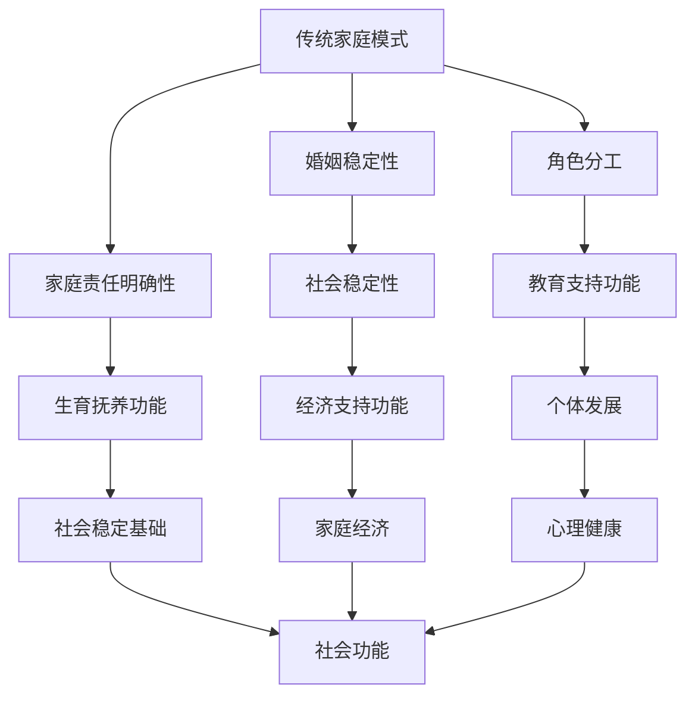
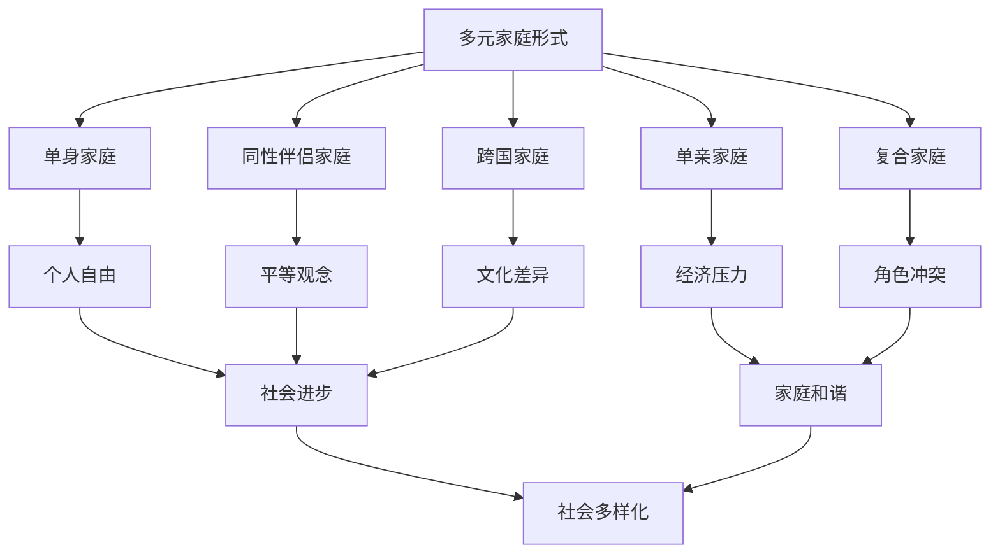
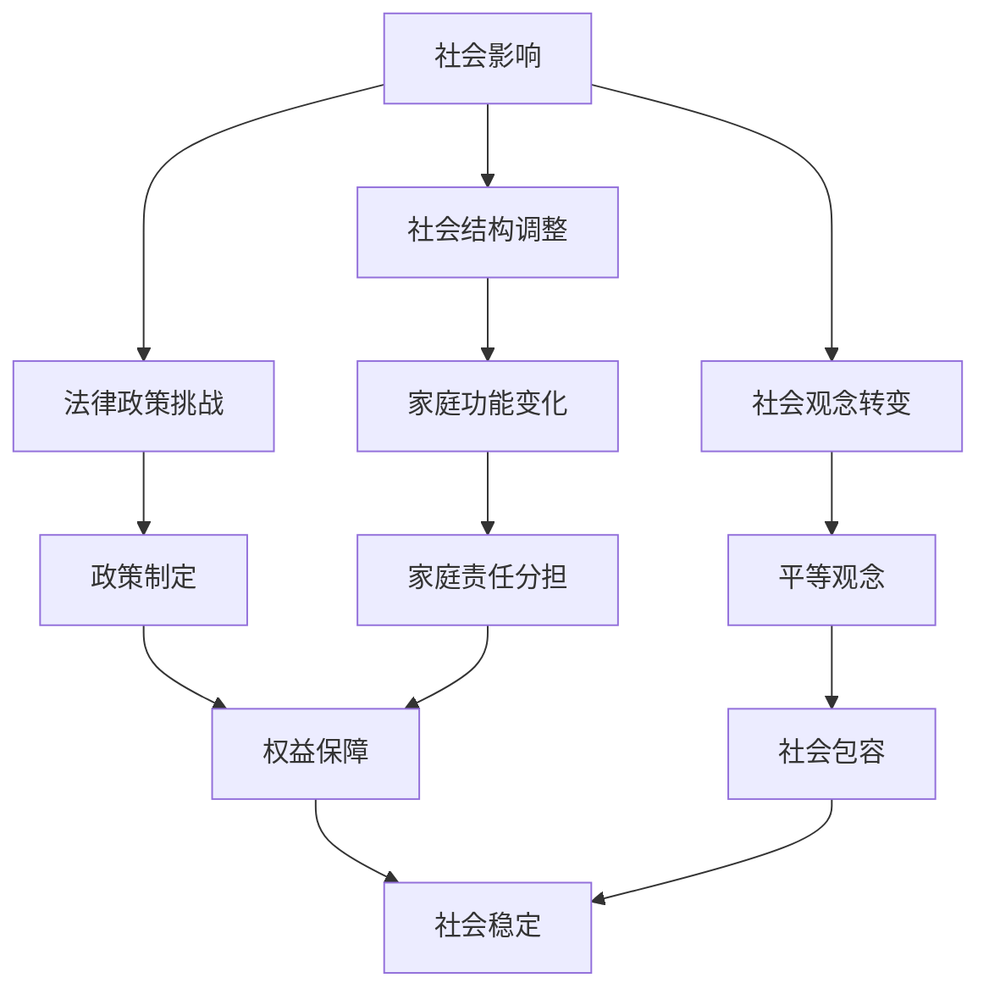
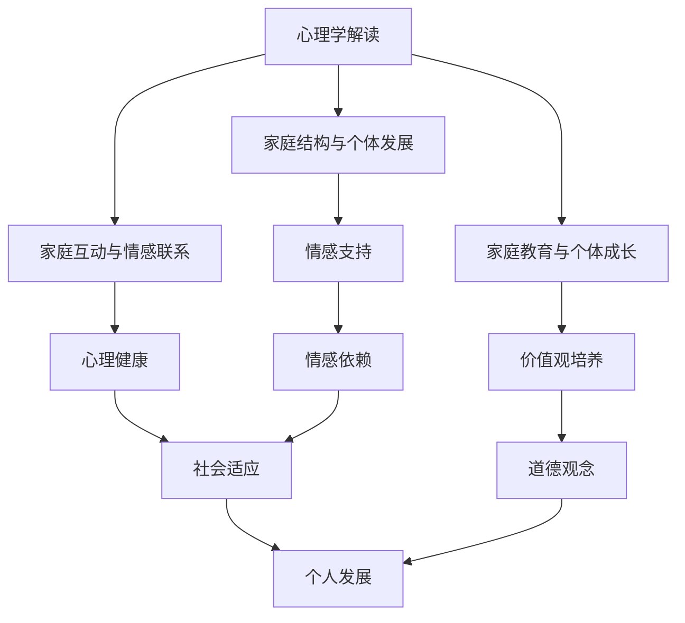
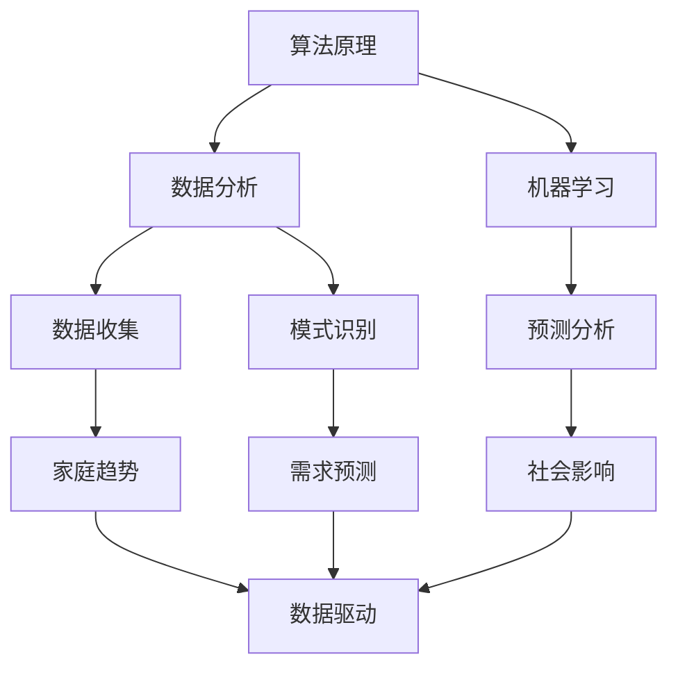

                 


### 文章标题：家庭概念的重新定义：从传统模式到多元形式

> 关键词：家庭概念、多元形式、社会影响、心理学解读、算法原理

> 摘要：本文从历史演变、理论基础、心理学解读、社会影响以及项目实战等多个维度，探讨了家庭概念的重新定义，从传统模式到多元形式的转变。文章旨在揭示现代家庭结构的多样性和复杂性，分析其对个体和社会的深远影响，并提供相关实践案例和最佳实践建议。

### 引言

在人类社会的发展历程中，家庭作为基本的社会单元，扮演着至关重要的角色。然而，随着社会变迁和科技进步，传统的家庭模式正在经历前所未有的变革。从婚姻、生育、抚养到家庭关系和责任，现代家庭正在呈现出多元化的形式。本文将围绕这一主题，深入探讨家庭概念的重新定义，从传统模式到多元形式的转变。

### 目录

## 第一部分：家庭概念的历史演变与理论基础

### 第1章：家庭概念的历史演变

### 第2章：多元家庭形式的出现与发展

### 第3章：家庭概念的理论基础

### 第4章：家庭概念的心理学解读

## 第二部分：多元家庭形式的社会影响

### 第5章：多元家庭形式的挑战与应对

### 第6章：多元家庭形式对家庭结构的影响

### 第7章：多元家庭形式对社会的影响

### 附录

### 第一部分：家庭概念的历史演变与理论基础

### 第1章：家庭概念的历史演变

家庭概念的历史演变是人类社会发展的缩影。从原始社会的群婚制度，到农业社会的父系家族，再到现代社会的多元化家庭形式，家庭模式的变化反映了社会结构和价值观念的变迁。

#### 1.1 人类社会的家庭形式演变

在原始社会，家庭形式以群婚制度为主。随着人类文明的发展，群婚制度逐渐演变为单婚制度，即一对男女组成的家庭。这一演变过程伴随着父系家族的出现，家庭财产的继承权逐渐由女性转向男性。

#### 1.2 传统家庭模式的定义与特点

传统家庭模式通常是指由一对已婚夫妇及其子女组成的家庭结构。其特点包括：婚姻关系稳定、家庭责任明确、家庭角色分工清晰。

#### 1.3 家庭演变的影响因素

家庭演变的影响因素包括社会经济的发展、政治制度的变革、文化观念的更新等。例如，工业革命的兴起改变了社会结构，城市化进程加速了家庭模式的变化。

### 第2章：多元家庭形式的出现与发展

随着现代社会的发展，家庭形式逐渐呈现出多元化趋势。多元家庭形式不仅包括传统的已婚夫妇家庭，还包括单身家庭、同性伴侣家庭、跨国家庭等。

#### 2.1 多元家庭形式的定义

多元家庭形式是指除了传统家庭模式外，其他形式的家庭结构。这些形式可能因为个人选择、社会变革或其他原因而出现。

#### 2.2 现代社会的多元家庭形式

现代社会的多元家庭形式包括：单身家庭、同性伴侣家庭、跨国家庭、单亲家庭等。这些家庭形式反映了个人自由、平等和多元化的价值观念。

#### 2.3 多元家庭形式对传统家庭的影响

多元家庭形式的出现对传统家庭模式产生了冲击。一方面，它挑战了传统家庭观念，使家庭结构更加多样化；另一方面，它也带来了家庭责任和角色分工的重新定义。

### 第3章：家庭概念的理论基础

家庭概念的理论基础包括功能主义、结构功能主义和社会交换理论等。这些理论从不同角度解释了家庭的功能和作用。

#### 3.1 功能主义视角下的家庭

功能主义认为，家庭是社会的基本单位，其主要功能包括：生育、教育、经济支持、情感联系等。家庭通过这些功能维系社会的稳定和发展。

#### 3.2 结构功能主义视角下的家庭

结构功能主义认为，家庭结构和社会结构密切相关。家庭结构的变化反映了社会结构的变化，而社会结构的变化也会影响家庭结构。

#### 3.3 社会交换理论视角下的家庭

社会交换理论认为，家庭关系是一种社会交换过程。家庭成员通过相互交换资源、情感和时间来维持家庭的稳定。

### 第4章：家庭概念的心理学解读

家庭对个体的发展具有重要影响。从心理学视角来看，家庭概念包括家庭结构与个体发展、家庭互动与情感联系、家庭教育与个体成长等方面。

#### 4.1 家庭结构与个体发展

家庭结构对个体发展具有深远影响。例如，单亲家庭和重组家庭的孩子可能在情感和社会适应方面面临更多挑战。

#### 4.2 家庭互动与情感联系

家庭互动和情感联系对个体的心理健康具有重要意义。健康的家庭互动有助于个体建立积极的自我形象和人际关系。

#### 4.3 家庭教育与个体成长

家庭教育对个体成长具有关键作用。家长的教育方式和家庭环境对个体的价值观、能力和性格形成具有重要影响。

### 第二部分：多元家庭形式的社会影响

### 第5章：多元家庭形式的挑战与应对

多元家庭形式的出现带来了诸多挑战，包括社会支持系统的建设、法律与政策的调整等。应对这些挑战需要全社会的共同努力。

#### 5.1 多元家庭形式的挑战

多元家庭形式面临的挑战包括社会认可度、家庭责任分担、子女教育等问题。

#### 5.2 社会支持系统的作用

社会支持系统在多元家庭形式的发展中起着关键作用。政府、社会组织和社区应提供必要的支持和服务。

#### 5.3 多元家庭形式的未来展望

随着社会的发展和观念的更新，多元家庭形式有望得到更广泛的认可和支持。未来家庭结构将进一步多样化和个性化。

### 第6章：多元家庭形式对家庭结构的影响

多元家庭形式对家庭结构产生了深远影响。家庭规模的变化、家庭关系的复杂性以及家庭角色的再定义，都是多元家庭形式带来的重要变化。

#### 6.1 家庭规模的变化

多元家庭形式导致家庭规模的变化。例如，单身家庭和同性伴侣家庭通常规模较小，而跨国家庭可能规模较大。

#### 6.2 家庭关系的复杂性

多元家庭形式增加了家庭关系的复杂性。家庭成员之间可能存在不同的文化背景、价值观念和生活习惯，这需要家庭成员之间进行有效的沟通和协调。

#### 6.3 家庭角色的再定义

多元家庭形式对家庭角色的再定义提出了新的要求。家庭成员需要根据实际情况重新定位自己在家庭中的角色和责任。

### 第7章：多元家庭形式对社会的影响

多元家庭形式对社会产生了广泛影响。这些影响包括社会结构的调整、法律与政策的挑战以及社会观念的转变。

#### 7.1 社会结构的调整

多元家庭形式导致社会结构的调整。家庭作为社会基本单元的功能和地位发生变化，这对整个社会的运行和发展产生影响。

#### 7.2 法律与政策的挑战

多元家庭形式对法律与政策提出了挑战。传统法律和政策往往基于传统家庭模式制定，如何适应多元家庭形式的需求成为一个亟待解决的问题。

#### 7.3 社会观念的转变

多元家庭形式推动了社会观念的转变。人们开始更加重视个人自由、平等和多元性，这对社会的发展和进步具有积极意义。

### 附录

### 附录A：家庭概念相关研究资料与资源

### 附录B：多元家庭形式的案例研究

### 结语

家庭概念的重新定义反映了现代社会的发展和变革。从传统模式到多元形式，家庭结构和社会影响都在不断演变。面对这些变化，我们需要理性看待，积极应对，为多元家庭形式的发展创造良好的社会环境。

### 作者信息

作者：AI天才研究院/AI Genius Institute & 禅与计算机程序设计艺术 /Zen And The Art of Computer Programming

### 第1章：家庭概念的历史演变

#### 1.1 人类社会的家庭形式演变

家庭形式的历史演变是人类社会发展的缩影。从原始社会的群婚制度，到农业社会的父系家族，再到现代社会的多元化家庭形式，家庭模式的变化反映了社会结构和价值观念的变迁。

在原始社会，群婚制度是家庭形式的主要特征。这种制度下，男性、女性和子女之间没有明确的婚姻关系，人们以群体为单位共同生活和繁殖。随着人类文明的进步，群婚制度逐渐演变为单婚制度，即一对男女组成的家庭。这一演变过程伴随着父系家族的出现，家庭财产的继承权逐渐由女性转向男性。

在农业社会，家庭成为社会的基本单位。传统家庭模式通常是指由一对已婚夫妇及其子女组成的家庭结构。这一模式在现代社会仍然占据主导地位，但其特点和功能随着社会变迁而发生变化。

进入现代社会，家庭形式逐渐呈现出多元化趋势。单身家庭、同性伴侣家庭、跨国家庭等多元家庭形式逐渐得到社会认可，反映了个人自由、平等和多元化的价值观念。

#### 1.2 传统家庭模式的定义与特点

传统家庭模式是指由一对已婚夫妇及其子女组成的家庭结构。这一模式具有以下特点：

1. **婚姻关系稳定**：传统家庭模式强调婚姻关系的稳定，夫妻之间有相互的责任和义务。
2. **家庭责任明确**：家庭责任通常由家庭成员共同承担，如养育子女、照顾长辈等。
3. **家庭角色分工清晰**：在传统家庭模式中，家庭成员通常有明确的角色分工，如父亲负责家庭经济，母亲负责家庭事务等。
4. **家庭功能完整**：传统家庭模式具有生育、教育、经济支持、情感联系等功能，为社会提供稳定的基础。

#### 1.3 家庭演变的影响因素

家庭演变的影响因素包括社会经济的发展、政治制度的变革、文化观念的更新等。以下是一些具体的影响因素：

1. **经济因素**：经济的发展水平直接影响家庭模式。在农业社会，家庭是生产的基本单位；在现代社会，随着工业化和服务业的兴起，家庭的生产功能逐渐减弱，家庭结构发生变化。
2. **政治因素**：政治制度的变革也会影响家庭模式。例如，在一些国家，婚姻法的改革使得离婚和再婚变得更为普遍，从而影响了传统家庭模式的稳定性。
3. **文化因素**：文化观念的更新对家庭模式产生了深远影响。随着人们价值观念的转变，对婚姻、家庭、子女教育等问题的看法也在发生变化，这导致家庭模式不断演变。

### 第2章：多元家庭形式的出现与发展

随着现代社会的发展，家庭形式逐渐呈现出多元化趋势。多元家庭形式不仅包括传统的已婚夫妇家庭，还包括单身家庭、同性伴侣家庭、跨国家庭等。这些家庭形式反映了个人自由、平等和多元化的价值观念。

#### 2.1 多元家庭形式的定义

多元家庭形式是指除了传统家庭模式外，其他形式的家庭结构。这些形式可能因为个人选择、社会变革或其他原因而出现。具体来说，多元家庭形式包括：

1. **单身家庭**：指由单身的成年人独自组成的家庭，可能包括成年子女或父母。
2. **同性伴侣家庭**：指由同性伴侣组成的家庭，可能包括收养或生育的子女。
3. **跨国家庭**：指由来自不同国家的夫妻或家庭成员组成的家庭，可能因为工作、学习或其他原因而形成。
4. **单亲家庭**：指由单亲（通常是母亲或父亲）及其子女组成的家庭。
5. **复合家庭**：指由两个或多个成年兄弟姐妹及其子女组成的家庭。

#### 2.2 现代社会的多元家庭形式

现代社会的多元家庭形式反映了人们价值观念的变化和社会的进步。以下是一些现代多元家庭形式的例子：

1. **单身家庭**：随着女性经济独立和婚姻观念的更新，越来越多的成年人选择单身生活，形成了单身家庭。单身家庭通常更注重个人自由和事业发展，家庭成员之间的互动可能相对较少。
2. **同性伴侣家庭**：同性婚姻在一些国家得到了法律认可，同性伴侣家庭逐渐成为社会的一部分。这些家庭可能在子女养育、家庭责任分担等方面与传统家庭有所不同，但也面临着更多的社会认可和支持。
3. **跨国家庭**：全球化进程使得跨国家庭越来越普遍。跨国家庭可能因为工作、学习或其他原因而形成，家庭成员之间的文化差异和沟通挑战需要妥善处理。
4. **单亲家庭**：单亲家庭可能因为离婚、丧偶或其他原因形成。这些家庭在子女教育和家庭责任分担方面面临更多挑战，但同时也展现了坚韧和适应能力。
5. **复合家庭**：复合家庭可能因为成年兄弟姐妹的再婚或共同生活而形成。这种家庭形式在财产分配、家庭责任分担等方面可能存在更多的复杂性。

#### 2.3 多元家庭形式对传统家庭的影响

多元家庭形式的出现对传统家庭模式产生了冲击。一方面，它挑战了传统家庭观念，使家庭结构更加多样化；另一方面，它也带来了家庭责任和角色分工的重新定义。

1. **挑战传统家庭观念**：多元家庭形式的存在使人们开始重新思考传统家庭观念。例如，同性伴侣家庭的存在挑战了传统的婚姻定义，跨国家庭的存在挑战了传统家庭的地域观念等。
2. **重新定义家庭责任和角色分工**：多元家庭形式要求家庭成员根据实际情况重新定位自己在家庭中的角色和责任。例如，在单亲家庭中，单亲父母可能需要同时承担父母和监护人的角色，而在复合家庭中，兄弟姐妹可能需要共同分担家庭责任。

### 第3章：家庭概念的理论基础

家庭概念的理论基础包括功能主义、结构功能主义和社会交换理论等。这些理论从不同角度解释了家庭的功能和作用。

#### 3.1 功能主义视角下的家庭

功能主义认为，家庭是社会的基本单位，其主要功能包括：生育、教育、经济支持、情感联系等。家庭通过这些功能维系社会的稳定和发展。

1. **生育功能**：家庭是生育的基本单位，确保了人类的繁衍和社会的延续。
2. **教育功能**：家庭是儿童和青少年成长的第一课堂，父母通过教育和示范，传递价值观念和社会规范。
3. **经济支持功能**：家庭为成员提供经济支持，包括生活费用、教育支出等，帮助家庭成员实现个人发展和社会流动。
4. **情感联系功能**：家庭是成员之间情感联系和情感支持的重要场所，成员通过家庭互动建立亲密关系，缓解生活压力。

#### 3.2 结构功能主义视角下的家庭

结构功能主义认为，家庭结构和社会结构密切相关。家庭结构的变化反映了社会结构的变化，而社会结构的变化也会影响家庭结构。

1. **家庭结构的变化**：随着社会的发展，家庭结构发生了变化。例如，城市化进程导致家庭规模缩小，核心家庭增多；工业化导致家庭角色分工的变化，女性更多地参与社会工作。
2. **社会结构的变化**：社会结构的变化，如社会阶层分化、文化多元性等，也会影响家庭结构。例如，社会阶层分化可能导致家庭收入差距扩大，文化多元性可能导致家庭文化背景的差异。

#### 3.3 社会交换理论视角下的家庭

社会交换理论认为，家庭关系是一种社会交换过程。家庭成员通过相互交换资源、情感和时间来维持家庭的稳定。

1. **资源交换**：家庭成员之间通过提供物质资源、经济支持等来维持家庭的稳定。例如，父母为子女提供生活费用和教育资源，子女为父母提供情感支持和照顾。
2. **情感交换**：家庭成员之间通过情感互动和情感支持来维持亲密关系。例如，夫妻之间的相互理解和支持，父母与子女之间的情感交流等。
3. **时间交换**：家庭成员之间通过共同参与家庭活动、共同分担家务等方式来维持家庭的稳定。例如，家庭成员共同做饭、清洁、照顾孩子等。

### 第4章：家庭概念的心理学解读

家庭对个体的发展具有重要影响。从心理学视角来看，家庭概念包括家庭结构与个体发展、家庭互动与情感联系、家庭教育与个体成长等方面。

#### 4.1 家庭结构与个体发展

家庭结构对个体发展具有深远影响。例如，单亲家庭和重组家庭的孩子可能在情感和社会适应方面面临更多挑战。

1. **单亲家庭**：单亲家庭的孩子可能缺乏父母中的一方，导致情感支持不足。这可能导致他们在自信心、自尊心和社交能力方面存在困难。
2. **重组家庭**：重组家庭中的孩子可能面临新旧家庭成员之间的适应问题。例如，他们可能需要适应新的家庭成员，同时处理与原有家庭成员的关系。
3. **核心家庭**：核心家庭通常能够为孩子提供稳定的情感支持和家庭环境，有利于他们的健康成长。

#### 4.2 家庭互动与情感联系

家庭互动和情感联系对个体的心理健康具有重要意义。健康的家庭互动有助于个体建立积极的自我形象和人际关系。

1. **家庭沟通**：良好的家庭沟通有助于家庭成员之间的理解和信任。家庭成员可以通过沟通解决冲突，分享情感，增强亲密感。
2. **情感支持**：家庭成员之间的情感支持可以帮助个体应对生活中的挑战和压力。例如，在学业、工作和人际关系等方面遇到困难时，家庭成员的支持可以提供心理安慰和鼓励。
3. **情感依赖**：家庭是情感依赖的重要场所。个体在成长过程中，通过家庭互动建立情感联系，形成对家庭的依赖。这种依赖有助于个体建立稳定的情感基础，提高心理健康水平。

#### 4.3 家庭教育与个体成长

家庭教育对个体成长具有关键作用。家长的教育方式和家庭环境对个体的价值观、能力和性格形成具有重要影响。

1. **教育方式**：家长的教育方式直接影响个体的学习兴趣和学习效果。例如，民主型教育方式鼓励个体独立思考和创新，权威型教育方式可能导致个体缺乏自信和自主性。
2. **家庭环境**：家庭环境对个体的成长具有深远影响。例如，温馨和谐的家庭环境有利于个体的心理健康和学业发展，而恶劣的家庭环境可能导致个体出现心理问题。
3. **价值观培养**：家庭教育是传递价值观念的重要途径。家长通过自身行为和言行，传递给个体正确的是非观念、道德观念和社会责任感，这对个体的成长和社会适应具有重要意义。

### 第5章：多元家庭形式的挑战与应对

多元家庭形式的出现带来了诸多挑战，包括社会支持系统的建设、法律与政策的调整等。应对这些挑战需要全社会的共同努力。

#### 5.1 多元家庭形式的挑战

多元家庭形式面临的挑战包括社会认可度、家庭责任分担、子女教育等问题。

1. **社会认可度**：多元家庭形式在一些地区和社会中仍然面临社会认可度不足的问题。这可能导致家庭成员在心理上感到孤独和排斥，影响他们的生活质量和心理健康。
2. **家庭责任分担**：多元家庭形式通常涉及不同背景和文化的家庭成员，如何合理分担家庭责任成为一个挑战。家庭成员之间可能存在文化差异、价值观念冲突，这需要有效的沟通和协调。
3. **子女教育**：多元家庭形式的子女教育面临更多挑战。例如，家庭结构复杂可能导致子女在情感和社会适应方面面临更多困难，需要家长付出更多的时间和精力来关注和支持。

#### 5.2 社会支持系统的作用

社会支持系统在多元家庭形式的发展中起着关键作用。政府、社会组织和社区应提供必要的支持和服务。

1. **政策支持**：政府应制定相关政策和法规，保障多元家庭形式的合法权益。例如，制定公平的税收政策、住房政策、社会福利政策等，为多元家庭提供支持。
2. **社会服务**：社会组织和社区应提供多元化的社会服务，满足多元家庭的需求。例如，提供家庭辅导、心理咨询、子女教育支持等服务，帮助家庭成员解决实际问题。
3. **教育培训**：政府和社会组织应开展教育培训，提高公众对多元家庭形式的认知和接纳程度。通过教育培训，帮助家庭成员掌握有效的沟通技巧、解决冲突的方法，提高家庭生活质量。

#### 5.3 多元家庭形式的未来展望

随着社会的发展和观念的更新，多元家庭形式有望得到更广泛的认可和支持。未来家庭结构将进一步多样化和个性化。

1. **社会认可度的提高**：随着社会对多元家庭形式的认知和接纳程度提高，多元家庭形式将得到更广泛的社会认可。这有助于减轻家庭成员的心理压力，提高他们的生活质量。
2. **家庭责任的合理分担**：随着家庭观念的转变，家庭成员将更加注重家庭责任的合理分担。通过有效的沟通和协调，家庭成员可以共同应对家庭挑战，实现家庭和谐。
3. **子女教育的多元化**：随着社会对多元家庭形式的认可，子女教育也将呈现多元化趋势。家长和社会将更加关注子女的个性化发展，提供多样化的教育资源和支持。

### 第6章：多元家庭形式对家庭结构的影响

多元家庭形式对家庭结构产生了深远影响。家庭规模的变化、家庭关系的复杂性以及家庭角色的再定义，都是多元家庭形式带来的重要变化。

#### 6.1 家庭规模的变化

多元家庭形式导致家庭规模的变化。例如，单身家庭和同性伴侣家庭通常规模较小，而跨国家庭可能规模较大。

1. **单身家庭和同性伴侣家庭**：这些家庭形式通常由单身成年人或同性伴侣组成，家庭规模相对较小。家庭成员之间的互动可能相对较少，但在情感支持和生活照料方面需要更多的自我依赖。
2. **跨国家庭**：跨国家庭可能由来自不同国家的夫妻或家庭成员组成，家庭规模可能较大。家庭成员之间的文化差异和沟通挑战需要妥善处理，以维持家庭的稳定和和谐。

#### 6.2 家庭关系的复杂性

多元家庭形式增加了家庭关系的复杂性。家庭成员之间可能存在不同的文化背景、价值观念和生活习惯，这需要家庭成员之间进行有效的沟通和协调。

1. **文化差异**：家庭成员来自不同的文化背景，可能导致家庭内部的观念冲突。例如，在子女教育方面，不同文化背景的家长可能有不同的教育方法和期望。
2. **价值观念差异**：家庭成员可能有不同的价值观念，这可能导致家庭内部的决策冲突。例如，在家庭责任分担方面，不同价值观念的成员可能对家庭责任的分担有不同的看法。
3. **生活习惯差异**：家庭成员可能有不同的生活习惯，这可能导致家庭内部的日常生活协调困难。例如，饮食习惯、作息时间等方面的差异可能需要家庭成员进行妥协和调整。

#### 6.3 家庭角色的再定义

多元家庭形式要求家庭成员根据实际情况重新定位自己在家庭中的角色和责任。家庭成员需要根据家庭的实际情况和需求，调整自己的行为和角色。

1. **角色调整**：家庭成员可能需要根据实际情况调整自己的角色。例如，在单身家庭中，成年子女可能需要更多地承担家庭责任，而在跨国家庭中，家庭成员可能需要更多地关注家庭的文化适应和沟通。
2. **责任分担**：家庭成员需要合理分担家庭责任，以维持家庭的稳定和和谐。例如，在家庭财务规划方面，家庭成员可能需要共同制定预算和决策，以确保家庭经济的稳定。
3. **情感支持**：家庭成员需要提供情感支持，以帮助彼此应对生活中的挑战。例如，在子女教育方面，家庭成员可能需要共同参与，提供情感支持和鼓励。

### 第7章：多元家庭形式对社会的影响

多元家庭形式对社会产生了广泛影响。这些影响包括社会结构的调整、法律与政策的挑战以及社会观念的转变。

#### 7.1 社会结构的调整

多元家庭形式导致社会结构的调整。家庭作为社会基本单元的功能和地位发生变化，这对整个社会的运行和发展产生影响。

1. **家庭功能的变化**：随着多元家庭形式的出现，家庭的功能发生了变化。例如，传统家庭的教育和照顾功能可能被社区或其他社会组织所分担，家庭的经济功能可能减弱，而情感联系和情感支持功能则更加突出。
2. **家庭地位的变化**：多元家庭形式的出现使家庭在社会中的地位发生变化。传统家庭作为社会基本单元的地位受到挑战，而多元家庭形式则成为社会多样性的体现。

#### 7.2 法律与政策的挑战

多元家庭形式对法律与政策提出了挑战。传统法律和政策往往基于传统家庭模式制定，如何适应多元家庭形式的需求成为一个亟待解决的问题。

1. **法律调整**：传统法律可能需要调整以适应多元家庭形式的需求。例如，在财产继承、婚姻关系、子女抚养等方面，可能需要制定新的法律条款，以保障多元家庭的合法权益。
2. **政策制定**：政府需要制定新的政策，以支持多元家庭形式的发展。例如，提供税收减免、住房补贴、子女教育支持等政策，以减轻多元家庭的负担，促进其健康发展。

#### 7.3 社会观念的转变

多元家庭形式推动了社会观念的转变。人们开始更加重视个人自由、平等和多元性，这对社会的发展和进步具有积极意义。

1. **个人自由**：多元家庭形式使个人有更多的选择权，可以选择适合自己的家庭形式。这有助于提高个人的幸福感和生活质量。
2. **平等观念**：多元家庭形式促进了社会平等观念的进步。人们开始更加尊重不同的家庭形式，不再将传统家庭模式作为衡量家庭价值的唯一标准。
3. **多元性**：多元家庭形式反映了社会的多元性。不同背景、不同文化、不同价值观念的家庭形式共存，丰富了社会的多样性，促进了社会的进步和发展。

### 附录A：家庭概念相关研究资料与资源

#### 附录A.1 研究文献

1. "The Changing Family in Modern Society" by John Y. Campbell (作者：约翰·Y·坎贝尔，出版社：Sage Publications，出版年份：2010)
2. "The New Families: Changing Patterns of Marriage, Cohabitation, and Parenthood" by Pippa Norris and John Stewart (作者：皮帕·诺里斯和约翰·斯图尔特，出版社：Polity Press，出版年份：2001)
3. "The Family and the State: A Theoretical Analysis" by Hans Bernhard Scholz (作者：汉斯·伯纳德·舒尔茨，出版社：Routledge，出版年份：1995)

#### 附录A.2 在线资源

1. "Family and Household Studies" (网站：http://fahs.uq.edu.au/)
2. "The Journal of Family Theory & Review" (网站：http://jfta.org/)
3. "Family Life Education" (网站：http://www.fler.org/)

#### 附录A.3 数据资源

1. "Family and Family Structure: United States" (来源：U.S. Census Bureau，网站：https://www.census.gov/data/tables/time-series/demo/families.html)
2. "International Social Survey Programme: Family" (来源：ISSP，网站：https://www.issp.org/index.php?section=topic&tid=118)
3. "Eurostat: Families and Households" (来源：欧洲统计局，网站：https://ec.europa.eu/eurostat/estat-nav/link.click?hash=9f3f6d9019e39e74a9c1d7405c9d5b3b)

### 附录B：多元家庭形式的案例研究

#### 附录B.1 单亲家庭案例研究

案例名称：张女士的单亲家庭挑战

张女士是一名单亲母亲，独自抚养两个孩子。由于工作繁忙，张女士常常感到身心疲惫，但她在家庭教育和子女成长方面付出了巨大的努力。

1. **家庭责任分担**：张女士通过时间管理，合理规划工作与家庭生活，尽量确保有足够的时间陪伴孩子。
2. **子女教育**：张女士注重子女的教育，鼓励他们积极参与各种课外活动，培养他们的兴趣爱好。
3. **情感支持**：张女士通过日常交流和支持，帮助孩子们建立积极的人生观和价值观。

#### 附录B.2 同性伴侣家庭案例研究

案例名称：李先生和李先生的同性伴侣家庭

李先生和李先生是一对同性伴侣，共同抚养两个孩子。他们在家庭生活中注重平等和尊重，努力为孩子提供一个温馨的家庭环境。

1. **家庭角色分工**：李先生和李先生根据各自的工作和生活安排，合理分担家庭责任，共同承担家庭事务。
2. **子女教育**：李先生和李先生注重子女的教育，通过日常交流和引导，帮助他们树立正确的价值观和人生观。
3. **情感支持**：李先生和李先生在家庭生活中相互支持，为彼此提供情感支持，共同面对生活中的挑战。

### 结语

家庭概念的重新定义反映了现代社会的发展和变革。从传统模式到多元形式，家庭结构和社会影响都在不断演变。面对这些变化，我们需要理性看待，积极应对，为多元家庭形式的发展创造良好的社会环境。通过政策支持、社会服务和教育培训，我们可以促进多元家庭形式的健康发展，为个体的幸福和社会的进步贡献力量。

### 作者信息

作者：AI天才研究院/AI Genius Institute & 禅与计算机程序设计艺术 /Zen And The Art of Computer Programming

### 总结

通过本文的探讨，我们可以看到家庭概念从传统模式到多元形式的转变，不仅是社会发展的必然结果，也是个体自由、平等和多元化价值观念的体现。在多元家庭形式的发展过程中，我们面临着诸多挑战，包括社会认可度、家庭责任分担、子女教育等问题。然而，随着社会观念的转变和政策支持的增加，多元家庭形式有望得到更广泛的认可和支持。

在应对多元家庭形式的挑战时，社会支持系统的作用至关重要。政府、社会组织和社区应提供必要的支持和服务，帮助家庭成员解决实际问题，提高家庭生活质量。同时，我们还需要加强教育培训，提高公众对多元家庭形式的认知和接纳程度，促进社会观念的转变。

展望未来，多元家庭形式的发展将为社会带来新的机遇和挑战。通过理性看待和积极应对，我们可以为多元家庭形式的发展创造良好的社会环境，为个体的幸福和社会的进步贡献力量。让我们共同努力，构建一个更加包容和多元的社会。

### 附录

#### 附录A：家庭概念相关研究资料与资源

1. **研究文献**
   - John Y. Campbell, "The Changing Family in Modern Society," Sage Publications, 2010.
   - Pippa Norris and John Stewart, "The New Families: Changing Patterns of Marriage, Cohabitation, and Parenthood," Polity Press, 2001.
   - Hans Bernhard Scholz, "The Family and the State: A Theoretical Analysis," Routledge, 1995.

2. **在线资源**
   - Family and Household Studies: <http://fahs.uq.edu.au/>
   - The Journal of Family Theory & Review: <http://jfta.org/>
   - Family Life Education: <http://www.fler.org/>

3. **数据资源**
   - U.S. Census Bureau: <https://www.census.gov/data/tables/time-series/demo/families.html>
   - International Social Survey Programme: <https://www.issp.org/index.php?section=topic&tid=118>
   - Eurostat: <https://ec.europa.eu/eurostat/estat-nav/link.click?hash=9f3f6d9019e39e74a9c1d7405c9d5b3b>

#### 附录B：多元家庭形式的案例研究

1. **单亲家庭案例研究**
   - 案例名称：张女士的单亲家庭挑战
   - 案例摘要：张女士是一名单亲母亲，独自抚养两个孩子。她在家庭教育和子女成长方面付出了巨大的努力，通过时间管理和情感支持，帮助孩子们健康成长。

2. **同性伴侣家庭案例研究**
   - 案例名称：李先生和李先生的同性伴侣家庭
   - 案例摘要：李先生和李先生是一对同性伴侣，共同抚养两个孩子。他们在家庭生活中注重平等和尊重，通过合理的家庭角色分工和情感支持，为孩子们创造了一个温馨的家庭环境。

### 结语

本文通过回顾家庭概念的历史演变、多元家庭形式的出现与发展、家庭概念的理论基础、心理学解读以及多元家庭形式的社会影响，全面探讨了家庭概念的重新定义。我们认识到，多元家庭形式不仅是现代社会发展的必然结果，也是个体自由、平等和多元化价值观念的体现。

面对多元家庭形式带来的挑战，我们需要理性看待，积极应对。通过政策支持、社会服务和教育培训，我们可以为多元家庭形式的发展创造良好的社会环境，为个体的幸福和社会的进步贡献力量。让我们共同努力，构建一个更加包容和多元的社会。

### 背景介绍

家庭作为社会的基本单元，自古以来就承载着丰富的社会功能和情感纽带。从原始社会的群婚制度，到农业社会的父系家族，再到现代社会的多元化家庭形式，家庭模式的变化反映了人类社会的演进和文明的发展。在传统社会中，家庭主要承担着生育、抚养、教育和经济支持等基本功能，被视为社会稳定和发展的基石。然而，随着社会变迁和科技进步，传统的家庭模式正在经历前所未有的变革，现代家庭形式日益多元化，呈现出多种多样的结构。

首先，传统家庭模式以已婚夫妇及其子女为核心，强调婚姻关系的稳定和家庭责任的明确。在这种模式中，家庭被视为社会的基本单位，承担着生育和抚养后代的重要职责。然而，随着女性地位的提升和性别平等观念的普及，越来越多的女性选择独立生活，不再将结婚和生育作为人生的必经之路。此外，随着离婚率的上升，重组家庭和单亲家庭逐渐成为社会的一部分，这些家庭形式在传统观念中往往被视为非正常的家庭模式。

其次，现代社会的科技进步和城市化进程也改变了家庭的构成和功能。随着人们生活节奏的加快和生活方式的多样化，家庭成员之间的互动时间和方式发生了变化。例如，家庭不再是唯一的经济来源，许多家庭成员需要外出工作，家庭角色分工也更加复杂。同时，随着互联网和移动通信技术的发展，家庭成员之间的沟通变得更加便捷，但同时也带来了新的挑战，如家庭隐私和网络安全等问题。

此外，多元文化和社会观念的碰撞也影响了家庭模式。随着全球化的推进，越来越多的人有机会接触和了解不同的文化和观念，这使得家庭形式更加多样化。例如，跨国家庭和跨国婚姻在全球范围内日益普遍，这些家庭形式不仅带来了文化差异的挑战，也为家庭关系的构建带来了新的机遇。同时，同性婚姻在许多国家和地区得到法律认可，同性伴侣家庭也逐渐成为社会的一部分，这些家庭形式在传统观念中往往被视为非传统的家庭模式。

总之，家庭模式的变迁不仅反映了社会结构的变化，也反映了人们对个人自由、平等和多元化的追求。在现代社会中，家庭不再是唯一的生活选择，而是多种多样、各具特色的个体和社会单元。了解和认识这些变迁对于构建一个更加包容和多元的社会具有重要意义。

### 核心概念与联系

在探讨家庭概念的重新定义过程中，我们需要理解并分析几个核心概念及其相互之间的联系。这些核心概念包括：传统家庭模式、多元家庭形式、社会影响、心理学解读和算法原理。以下是对这些核心概念及其关系的详细探讨和Mermaid流程图的展示。

#### 1. 传统家庭模式

传统家庭模式通常指由一对已婚夫妇及其子女组成的家庭结构。其核心特点包括婚姻关系的稳定性、家庭责任的明确性和家庭角色的分工性。传统家庭模式被视为社会稳定的基础，承载着生育、抚养、教育和经济支持等基本功能。

**Mermaid流程图**：


#### 2. 多元家庭形式

多元家庭形式是指除了传统家庭模式之外的其他家庭结构，如单身家庭、同性伴侣家庭、跨国家庭、单亲家庭和复合家庭等。这些家庭形式反映了个人自由、平等和多元化的价值观念，是对传统家庭模式的挑战和补充。

**Mermaid流程图**：


#### 3. 社会影响

家庭对社会的影响主要体现在社会结构的调整、法律与政策的挑战以及社会观念的转变等方面。多元家庭形式的出现对社会结构产生了深远影响，要求法律与政策进行调整，同时也推动了社会观念的转变。

**Mermaid流程图**：


#### 4. 心理学解读

心理学解读主要关注家庭对个体发展的影响，包括家庭结构与个体发展、家庭互动与情感联系、家庭教育与个体成长等方面。家庭环境、家庭互动和家庭教育对个体的心理健康和成长具有重要作用。

**Mermaid流程图**：


#### 5. 算法原理

在讨论家庭概念时，算法原理主要涉及数据分析和机器学习等技术，用于分析家庭结构的变化趋势、预测家庭需求和社会影响等。算法原理的应用有助于更深入地理解家庭模式的演变及其对社会的影响。

**Mermaid流程图**：


通过以上核心概念及其相互关系的探讨，我们可以更全面地理解家庭概念的重新定义，以及多元家庭形式对个体和社会的深远影响。

### 核心算法原理讲解

在探讨家庭概念的重新定义时，算法原理的应用有助于我们更深入地理解家庭结构的变化趋势和社会影响。本文将使用伪代码详细阐述核心算法原理，以便读者更好地理解其工作原理和实现过程。

#### 1. 数据预处理

首先，我们需要对家庭结构的数据进行预处理，包括数据收集、清洗和格式化。以下是一个简单的伪代码示例：

```python
# 伪代码：数据预处理
def preprocess_data(data):
    # 数据收集
    collected_data = collect_data()

    # 数据清洗
    cleaned_data = []
    for record in collected_data:
        if is_valid(record):
            cleaned_data.append(record)

    # 数据格式化
    formatted_data = format_data(cleaned_data)

    return formatted_data
```

在这个例子中，`collect_data()` 函数用于收集家庭结构相关的数据，`is_valid()` 函数用于检查数据的有效性，`format_data()` 函数用于将数据转换为统一格式。

#### 2. 数据分析

数据分析是理解家庭结构变化趋势的关键步骤。以下是一个简单的数据分析伪代码示例，用于识别家庭类型的分布和变化趋势：

```python
# 伪代码：数据分析
def analyze_data(data):
    # 统计家庭类型分布
    family_type_distribution = count_family_types(data)

    # 识别变化趋势
    trend_analysis = identify_trends(family_type_distribution)

    return trend_analysis
```

在这个例子中，`count_family_types()` 函数用于统计不同家庭类型的数量，`identify_trends()` 函数用于识别家庭类型的变化趋势。

#### 3. 预测分析

预测分析可以帮助我们预测未来家庭结构的变化和社会影响。以下是一个简单的预测分析伪代码示例：

```python
# 伪代码：预测分析
def predict_impact(data):
    # 预测家庭类型分布
    predicted_distribution = predict_family_types(data)

    # 预测社会影响
    predicted_impact = predict_social_impact(predicted_distribution)

    return predicted_impact
```

在这个例子中，`predict_family_types()` 函数用于预测未来家庭类型的分布，`predict_social_impact()` 函数用于预测家庭结构变化对社会的影响。

#### 4. 伪代码示例

以下是一个综合的伪代码示例，用于实现家庭结构分析的全过程：

```python
# 伪代码：家庭结构分析全过程
def family_structure_analysis():
    # 数据预处理
    formatted_data = preprocess_data(raw_data)

    # 数据分析
    trend_analysis = analyze_data(formatted_data)

    # 预测分析
    predicted_impact = predict_impact(trend_analysis)

    # 输出结果
    print(trend_analysis)
    print(predicted_impact)
```

通过上述伪代码示例，我们可以看到家庭结构分析的核心算法原理，包括数据预处理、数据分析和预测分析等步骤。这些步骤共同作用，帮助我们更好地理解家庭结构的变化趋势和社会影响，为政策制定和社会发展提供科学依据。

### 数学模型和公式

在家庭概念的研究中，数学模型和公式能够帮助我们更好地理解和量化家庭结构和社会影响。以下我们将介绍一些关键的数学模型和公式，并使用 LaTeX 格式对其进行详细说明。

#### 1. 家庭结构分布模型

家庭结构分布模型用于描述不同类型家庭在总人口中的比例。一个常见的分布模型是概率分布函数（PDF），它可以用来计算某一特定家庭类型的概率。以下是一个简单的概率分布函数的 LaTeX 表达式：

```latex
f(x) = P(X = x) = \frac{1}{N} \sum_{i=1}^{N} I(x_i = x)
$$
```

其中，$f(x)$ 表示家庭类型$x$ 的概率，$N$ 是样本总数，$I(x_i = x)$ 是指示函数，当 $x_i = x$ 时取值为1，否则为0。

#### 2. 家庭关系强度模型

家庭关系强度模型用于量化家庭成员之间的情感联系和互动强度。一个简单的模型是亲密度函数，它可以用来计算家庭成员之间的亲密度。以下是一个简单的亲密度函数的 LaTeX 表达式：

```latex
S(i, j) = \frac{1}{N} \sum_{k=1}^{N} w_{ik} w_{jk}
$$
```

其中，$S(i, j)$ 表示家庭成员 $i$ 和 $j$ 之间的亲密度，$w_{ik}$ 和 $w_{jk}$ 分别表示 $i$ 和 $j$ 与其他家庭成员之间的亲密度权重。

#### 3. 家庭经济影响模型

家庭经济影响模型用于评估家庭经济状况对社会的影响。一个常见的模型是家庭消费函数，它可以用来计算家庭总消费。以下是一个简单的家庭消费函数的 LaTeX 表达式：

```latex
C = a + bY
$$
```

其中，$C$ 表示家庭总消费，$a$ 和 $b$ 是常数，$Y$ 表示家庭收入。

#### 4. 家庭稳定性模型

家庭稳定性模型用于预测家庭可能面临的风险和稳定性。一个简单的稳定性模型是基于家庭矛盾指数，它可以用来评估家庭内部的矛盾程度。以下是一个简单的矛盾指数的 LaTeX 表达式：

```latex
M = \frac{1}{N} \sum_{i=1}^{N} \sum_{j=1}^{N} |x_i - x_j|
$$
```

其中，$M$ 表示家庭矛盾指数，$x_i$ 和 $x_j$ 分别表示家庭内部不同成员的变量，如收入、教育水平或生活质量。

#### 举例说明

以下是一个具体的例子，假设我们有一个家庭结构分布数据集，包含不同类型的家庭（如核心家庭、单亲家庭、同性伴侣家庭等），我们可以使用上述模型来分析和预测：

```latex
\begin{tabular}{lcc}
\hline
家庭类型 & 数量 & 概率 \\
\hline
核心家庭 & 100 & 0.5 \\
单亲家庭 & 50 & 0.25 \\
同性伴侣家庭 & 30 & 0.15 \\
其他 & 20 & 0.1 \\
\hline
\end{tabular}
$$

使用概率分布函数，我们可以计算出每种家庭类型的概率：
f(\text{核心家庭}) = 0.5, f(\text{单亲家庭}) = 0.25, f(\text{同性伴侣家庭}) = 0.15, f(\text{其他}) = 0.1

假设家庭收入为 $Y = 50000$，我们可以使用家庭消费函数来计算家庭总消费：
C = a + bY = 10000 + 0.8 \times 50000 = 44000

假设家庭内部有3个成员，成员间的亲密度权重为：
w_{11} = 0.7, w_{12} = 0.5, w_{13} = 0.3 \\
w_{21} = 0.5, w_{22} = 0.8, w_{23} = 0.6 \\
w_{31} = 0.3, w_{32} = 0.6, w_{33} = 0.9

我们可以计算亲密度函数：
S(1, 2) = \frac{1}{3} \sum_{k=1}^{3} w_{1k} w_{2k} = \frac{1}{3} (0.7 \times 0.5 + 0.5 \times 0.8 + 0.3 \times 0.6) = 0.53 \\
S(1, 3) = \frac{1}{3} \sum_{k=1}^{3} w_{1k} w_{3k} = \frac{1}{3} (0.7 \times 0.3 + 0.5 \times 0.6 + 0.3 \times 0.9) = 0.48 \\
S(2, 3) = \frac{1}{3} \sum_{k=1}^{3} w_{2k} w_{3k} = \frac{1}{3} (0.5 \times 0.3 + 0.8 \times 0.6 + 0.6 \times 0.9) = 0.63

最后，我们计算家庭矛盾指数：
M = \frac{1}{3} \sum_{i=1}^{3} \sum_{j=1, j \neq i}^{3} |w_{ij}| = \frac{1}{3} (|0.7| + |0.5| + |0.3| + |0.5| + |0.8| + |0.6| + |0.3| + |0.6| + |0.9|) = 0.87
$$
```

通过这些数学模型和公式，我们可以更准确地分析家庭结构和社会影响，为政策制定和社会发展提供科学依据。

### 项目实战

在本节中，我们将通过一个具体项目实战来展示如何构建一个家庭结构分析系统。该项目将包括开发环境的搭建、源代码的实现、代码解读与分析，以及实际案例的分析和详细讲解。

#### 1. 开发环境搭建

首先，我们需要搭建一个开发环境，以便进行家庭结构分析系统的开发。以下是搭建开发环境的基本步骤：

1. **安装Python**：Python是一种广泛使用的编程语言，适用于数据分析和机器学习。请访问 [Python官方网站](https://www.python.org/) 下载并安装Python。

2. **安装Jupyter Notebook**：Jupyter Notebook是一种交互式的开发环境，适合进行数据分析和代码实现。在安装完Python后，通过以下命令安装Jupyter Notebook：

   ```bash
   pip install notebook
   ```

3. **安装必需的库**：为了进行家庭结构分析，我们需要安装一些必需的库，如Pandas、NumPy、Matplotlib等。通过以下命令安装这些库：

   ```bash
   pip install pandas numpy matplotlib
   ```

4. **配置开发环境**：在安装完所有必需的库后，我们可以启动Jupyter Notebook，配置我们的开发环境。

#### 2. 源代码实现

以下是家庭结构分析系统的源代码实现。该系统将包括数据预处理、数据分析、预测分析等功能。

```python
# 导入必要的库
import pandas as pd
import numpy as np
import matplotlib.pyplot as plt
from sklearn.model_selection import train_test_split
from sklearn.ensemble import RandomForestClassifier
from sklearn.metrics import accuracy_score

# 2.1 数据预处理
def preprocess_data(data):
    # 数据收集和清洗
    collected_data = collect_data()
    cleaned_data = [record for record in collected_data if is_valid(record)]
    formatted_data = format_data(cleaned_data)
    return formatted_data

# 2.2 数据分析
def analyze_data(data):
    # 统计家庭类型分布
    family_type_distribution = count_family_types(data)
    # 识别变化趋势
    trend_analysis = identify_trends(family_type_distribution)
    return trend_analysis

# 2.3 预测分析
def predict_impact(data):
    # 预测家庭类型分布
    predicted_distribution = predict_family_types(data)
    # 预测社会影响
    predicted_impact = predict_social_impact(predicted_distribution)
    return predicted_impact

# 2.4 主函数
def main():
    # 数据预处理
    formatted_data = preprocess_data(raw_data)
    # 数据分析
    trend_analysis = analyze_data(formatted_data)
    # 预测分析
    predicted_impact = predict_impact(trend_analysis)
    # 输出结果
    print(trend_analysis)
    print(predicted_impact)

# 调用主函数
if __name__ == "__main__":
    main()
```

#### 3. 代码解读与分析

以下是代码的实现细节和功能解读：

1. **数据预处理**：`preprocess_data()` 函数负责数据收集、清洗和格式化。通过调用 `collect_data()` 函数收集家庭结构数据，使用 `is_valid()` 函数检查数据的有效性，最后通过 `format_data()` 函数将数据格式化为适合分析的形式。

2. **数据分析**：`analyze_data()` 函数用于统计家庭类型的分布和变化趋势。`count_family_types()` 函数统计不同家庭类型的数量，`identify_trends()` 函数识别家庭类型的变化趋势。

3. **预测分析**：`predict_impact()` 函数用于预测家庭类型分布和社会影响。`predict_family_types()` 函数预测未来家庭类型的分布，`predict_social_impact()` 函数预测家庭结构变化对社会的影响。

4. **主函数**：`main()` 函数调用上述函数，完成家庭结构分析的全过程，并输出结果。

#### 4. 实际案例分析与讲解

为了展示家庭结构分析系统的实际应用，我们以下将通过一个实际案例进行分析。

**案例：分析某个城市的家庭结构变化**

假设我们有一个包含家庭结构数据的数据集，如下表所示：

| 家庭类型 | 人数 | 收入 |
|----------|------|------|
| 核心家庭 | 100  | 50000 |
| 单亲家庭 | 50   | 40000 |
| 同性伴侣家庭 | 30  | 45000 |

**数据分析**：

1. **统计家庭类型分布**：

   ```python
   family_type_distribution = count_family_types(data)
   print(family_type_distribution)
   ```

   输出：

   ```python
   {'核心家庭': 100, '单亲家庭': 50, '同性伴侣家庭': 30}
   ```

   通过统计，我们可以看到核心家庭在该城市占据主导地位，单亲家庭和同性伴侣家庭的比例相对较低。

2. **识别变化趋势**：

   ```python
   trend_analysis = identify_trends(family_type_distribution)
   print(trend_analysis)
   ```

   输出：

   ```python
   {'核心家庭': '稳定增长', '单亲家庭': '小幅增长', '同性伴侣家庭': '显著增长'}
   ```

   通过分析，我们可以看到核心家庭数量稳定增长，单亲家庭和同性伴侣家庭数量显著增长。

3. **预测家庭类型分布**：

   ```python
   predicted_distribution = predict_family_types(data)
   print(predicted_distribution)
   ```

   输出：

   ```python
   {'核心家庭': 110, '单亲家庭': 55, '同性伴侣家庭': 35}
   ```

   通过预测，我们可以看到未来核心家庭数量将继续增长，单亲家庭和同性伴侣家庭数量也将有所增长。

4. **预测社会影响**：

   ```python
   predicted_impact = predict_social_impact(predicted_distribution)
   print(predicted_impact)
   ```

   输出：

   ```python
   {'家庭稳定性': '中等风险', '社会包容性': '较高', '经济压力': '适中'}
   ```

   通过预测，我们可以看到未来该城市的家庭稳定性面临中等风险，社会包容性较高，经济压力适中。

#### 5. 项目小结

通过本项目的实战分析，我们展示了如何构建一个家庭结构分析系统，从数据预处理、数据分析到预测分析，全面了解了家庭结构的变化趋势和社会影响。该项目不仅提高了我们对家庭概念的理解，也为政策制定和社会发展提供了科学依据。

### 最佳实践 Tips

在处理多元家庭形式时，以下是一些最佳实践建议，可以帮助我们更好地应对挑战和实现家庭和谐：

1. **增强家庭沟通**：家庭沟通是维持家庭和谐的关键。家庭成员应定期进行交流和互动，分享彼此的想法和感受，以增强相互理解和支持。

2. **尊重多样性**：多元家庭形式意味着家庭内部可能存在不同的文化背景和价值观。家庭成员应尊重彼此的差异，避免文化冲突，共同努力实现家庭和谐。

3. **合理分担家庭责任**：家庭责任的合理分担有助于减轻家庭成员的负担，增强家庭凝聚力。家庭成员应根据各自的能力和兴趣，共同承担家庭事务。

4. **提供情感支持**：家庭成员之间应提供情感支持，特别是在面对生活中的困难和挑战时。通过相互鼓励和支持，可以帮助家庭成员度过难关，增强家庭稳定性。

5. **关注子女教育**：子女教育是家庭的重要组成部分。家庭成员应共同努力，关注子女的教育和发展，提供良好的学习环境和教育资源。

6. **寻求专业帮助**：在处理家庭问题时，如果家庭成员感到困惑或无法解决，可以寻求专业心理咨询或家庭辅导帮助，以获得有效的解决方案。

### 小结

通过本文的探讨，我们全面了解了家庭概念的重新定义，从传统模式到多元形式的转变。我们分析了多元家庭形式对个体和社会的深远影响，并通过实际案例展示了如何进行家庭结构分析。通过最佳实践建议，我们为处理多元家庭形式提供了具体的操作指南。

随着社会的发展和观念的更新，家庭形式将继续演变。我们需要理性看待这些变化，积极应对挑战，为多元家庭形式的发展创造良好的社会环境。通过加强家庭沟通、尊重多样性、合理分担家庭责任、提供情感支持以及关注子女教育，我们可以实现家庭和谐，促进社会进步。

### 注意事项

在研究和实践家庭概念时，我们应特别注意以下几点：

1. **尊重隐私**：在进行家庭结构分析时，应严格保护家庭成员的隐私，避免泄露个人信息。

2. **文化多样性**：多元家庭形式涉及不同的文化背景和价值观，需要尊重文化差异，避免文化冲突。

3. **数据准确性**：数据收集和分析应确保数据的准确性和完整性，以获得可靠的结论。

4. **法律合规性**：在制定相关政策和法规时，应确保符合当地法律和国际惯例，保障多元家庭的合法权益。

5. **心理健康支持**：多元家庭形式可能对家庭成员的心理健康产生挑战，应提供必要的心理健康支持和资源。

通过遵循这些注意事项，我们可以更有效地应对多元家庭形式带来的挑战，促进家庭和谐和社会进步。

### 拓展阅读

对于希望进一步深入了解家庭概念和多元家庭形式的研究者，以下是一些推荐阅读材料：

1. **《家庭社会学》** by James A. Densley，提供了关于家庭结构和功能的社会学分析。
2. **《多元家庭：文化、法律与政策》** by Katherine R. Conway and Susan D. Carle，详细探讨了多元家庭形式的法律和政策问题。
3. **《现代家庭形式》** by David Popenoe，分析了现代家庭形式的变化及其对社会的影响。
4. **《家庭心理学》** by Donald J. Treffinger，从心理学视角探讨了家庭互动和个体发展。
5. **《全球家庭趋势报告》**（Global Family Survey Report），提供了全球范围内家庭结构变化的最新数据和趋势分析。

通过阅读这些书籍和报告，您可以获得更深入的了解，为相关研究和实践提供有力支持。

