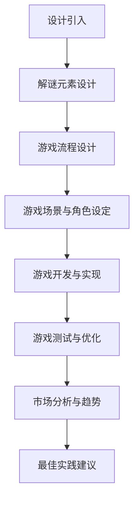

                 

### 文章标题：密室逃脱游戏：现实版解谜的吸引力

#### 关键词：
- 密室逃脱游戏
- 现实版解谜
- 游戏设计原理
- 解谜元素
- 游戏开发实践
- 市场分析

#### 摘要：
本文深入探讨了现实版密室逃脱游戏的吸引力及其设计原理。首先，介绍了密室逃脱游戏的背景和起源，然后分析了现实版密室逃脱游戏的设计要素，包括解谜元素、游戏流程和角色设定。接着，详细讲解了游戏开发的核心算法原理、数学模型和公式，并通过项目实战展示了实际开发流程和代码解读。最后，对现实版密室逃脱游戏的市场趋势进行了分析，并提出了最佳实践建议。

### 引言

密室逃脱游戏（Escape Room Game）是一种集智慧、团队协作和紧张刺激于一体的游戏形式。玩家需要在一个充满谜题和线索的封闭空间中，通过解开一系列复杂的谜题，找到出口并逃脱。这种游戏形式起源于日本，随后迅速在全球范围内流行起来。现实版密室逃脱游戏更是将这种游戏从虚拟世界带入现实，成为了一种独特的娱乐体验。

现实版密室逃脱游戏的吸引力主要体现在以下几个方面：

1. **智力挑战**：玩家需要运用逻辑思维和推理能力，解决各种谜题，这种智力挑战能够带给玩家极大的成就感。
2. **团队合作**：大多数密室逃脱游戏需要玩家团队合作，这不仅能增进玩家之间的感情，还能锻炼玩家的沟通能力和协作能力。
3. **互动体验**：现实版密室逃脱游戏提供了真实的场景和互动道具，使得玩家能够在游戏中获得更加丰富的体验。
4. **娱乐消遣**：作为一种新兴的娱乐形式，现实版密室逃脱游戏为人们提供了放松身心的好去处。

本文将深入探讨现实版密室逃脱游戏的设计原理，包括解谜元素的设计、游戏流程和角色设定，并分析其开发实践和市场需求。通过这篇文章，读者将了解到如何设计一款引人入胜的现实版密室逃脱游戏，以及其未来的发展趋势。

### 密室逃脱游戏概述

#### 密室逃脱游戏的起源与发展

密室逃脱游戏（Escape Room Game）的概念起源于日本，最初是一种线上游戏形式，玩家通过解谜和寻找线索来逃脱虚拟的房间。这种游戏形式很快受到了玩家的喜爱，并迅速在全球范围内传播。2007年，日本出现了一家名为“ escape the room ”的实体密室逃脱游戏馆，这标志着密室逃脱游戏从线上走向现实。

随着时间的推移，密室逃脱游戏在全球范围内得到了广泛推广。2010年，美国开始涌现出大量实体密室逃脱游戏馆，这些游戏馆以独特的主题和复杂的谜题吸引了大量玩家。2015年，欧洲市场也开始火爆起来，各国纷纷推出了各种主题的密室逃脱游戏。

在中国，密室逃脱游戏同样受到了热烈的欢迎。2015年左右，北京、上海等大城市开始出现实体密室逃脱游戏馆，随后迅速蔓延至全国各地。这些游戏馆以丰富的主题、新颖的玩法和激烈的挑战吸引了大量玩家，成为了一种流行的娱乐方式。

#### 现实版密室逃脱游戏的特点

现实版密室逃脱游戏与线上游戏相比，具有以下几个显著特点：

1. **真实的场景**：现实版密室逃脱游戏提供了一个真实的场景，玩家可以身临其境地感受到游戏的氛围。
2. **互动的道具**：游戏提供了各种互动的道具，玩家需要通过这些道具来解开谜题，增加了游戏的趣味性和互动性。
3. **紧张刺激的氛围**：现实版密室逃脱游戏通常设置了时间限制，玩家需要在规定时间内解开谜题，这增加了游戏的紧张感和刺激感。
4. **团队协作**：大多数密室逃脱游戏需要玩家团队合作，这不仅能增进玩家之间的感情，还能锻炼玩家的沟通能力和协作能力。

#### 现实版密室逃脱游戏的吸引力

现实版密室逃脱游戏的吸引力主要体现在以下几个方面：

1. **智力挑战**：玩家需要运用逻辑思维和推理能力，解决各种谜题，这种智力挑战能够带给玩家极大的成就感。
2. **互动体验**：现实版密室逃脱游戏提供了真实的场景和互动道具，使得玩家能够在游戏中获得更加丰富的体验。
3. **娱乐消遣**：作为一种新兴的娱乐形式，现实版密室逃脱游戏为人们提供了放松身心的好去处。
4. **社交互动**：玩家在游戏中需要与其他玩家合作，这种社交互动能够增进玩家之间的感情。

### 现实版密室逃脱游戏的设计原理

#### 解谜元素的设计与应用

解谜元素是现实版密室逃脱游戏的核心组成部分，其设计直接影响游戏的趣味性和挑战性。以下是几种常见的解谜元素及其设计与应用：

1. **线索寻找**：线索是解开谜题的关键，设计合理的线索可以引导玩家逐步揭开谜题的面纱。例如，在一个以历史为主题的密室中，设计师可以在房间中布置各种历史文物和文献，这些物品可以作为线索帮助玩家了解历史背景，进而解开谜题。

2. **密码和解码**：密码和解码是密室逃脱游戏中常见的解谜方式。设计师可以通过设计各种密码形式，如数字密码、字母密码、图像密码等，增加游戏的难度和趣味性。例如，在一个密码锁面前，玩家需要通过解密一系列线索，才能得到正确的密码，解锁房间。

3. **机械装置**：机械装置是密室逃脱游戏中的一种常见元素，通过设计复杂的机械装置，玩家需要通过操作这些装置来解开谜题。例如，在一个以科学实验为主题的密室中，设计师可以设置一个复杂的机械设备，玩家需要通过操作设备上的各种开关和按钮，才能启动设备，解开谜题。

4. **角色互动**：角色互动是密室逃脱游戏中的一种重要元素，通过设计不同角色的互动，玩家可以获取更多的线索和信息。例如，在一个以侦探为主题的密室中，设计师可以设置一个侦探角色，玩家需要通过与侦探互动，获取线索和提示，解开谜题。

#### 游戏流程与关卡设计

游戏流程和关卡设计是现实版密室逃脱游戏的重要组成部分，其设计直接影响到玩家的游戏体验。以下是游戏流程与关卡设计的几个关键点：

1. **引入阶段**：引入阶段是游戏的开端，设计师需要通过设置一个引人入胜的背景故事，吸引玩家的兴趣。例如，在一个以历史为主题的密室中，设计师可以通过讲述一段历史故事，引出游戏的主题和任务。

2. **挑战阶段**：挑战阶段是游戏的核心部分，玩家需要通过解开各种谜题和挑战来完成任务。设计师需要设计多个关卡，每个关卡都有不同的谜题和挑战，使玩家在游戏中保持兴奋和紧张。

3. **高潮阶段**：高潮阶段是游戏的转折点，设计师需要通过设置一个关键谜题或挑战，使玩家面临最大的挑战。例如，在一个以科学实验为主题的密室中，设计师可以设置一个复杂的机械设备，玩家需要通过操作设备上的各种开关和按钮，才能启动设备，解开谜题。

4. **结局阶段**：结局阶段是游戏的结尾，设计师需要通过设置一个完美的结局，使玩家感到满意和满足。例如，在一个以历史为主题的密室中，设计师可以在玩家解开所有谜题后，展示一段历史故事的高潮部分，给玩家一个圆满的结局。

#### 游戏场景与角色设定

游戏场景和角色设定是现实版密室逃脱游戏的重要组成部分，其设计直接影响游戏的氛围和体验。以下是游戏场景与角色设定的几个关键点：

1. **场景设计**：场景设计是现实版密室逃脱游戏的基础，设计师需要根据游戏的主题和背景，设计一个真实感强烈的场景。例如，在一个以历史为主题的密室中，设计师可以布置一个古代宫廷的场景，让玩家感受到历史的厚重。

2. **角色设定**：角色设定是游戏情节的重要组成部分，设计师需要设计多个角色，每个角色都有独特的性格和背景。例如，在一个以侦探为主题的密室中，设计师可以设计一个聪明机智的侦探角色，一个忠诚勇敢的助手角色，以及一个狡猾邪恶的反派角色。

3. **互动设计**：角色互动是游戏情节的重要组成部分，设计师需要设计角色之间的互动，使玩家能够更好地融入游戏。例如，在一个以侦探为主题的密室中，玩家可以通过与侦探互动，获取线索和提示，解开谜题。

### 游戏开发与实现

#### 游戏开发基础

现实版密室逃脱游戏的开发需要一定的技术基础，主要包括以下几个方面：

1. **游戏引擎选择**：游戏引擎是游戏开发的核心工具，它提供了游戏渲染、物理引擎、音频处理等功能。常见的游戏引擎有Unity、Unreal Engine等。选择合适的游戏引擎对游戏开发至关重要。

2. **编程语言**：游戏开发常用的编程语言包括C++、C#、Python等。不同的编程语言有不同的特点和适用场景，开发者需要根据项目需求选择合适的编程语言。

3. **开发环境搭建**：开发环境是游戏开发的必备工具，包括代码编辑器、调试工具、版本控制工具等。常见的开发环境有Visual Studio、Eclipse等。

#### 游戏实现与细节处理

游戏实现是现实版密室逃脱游戏开发的核心环节，主要包括以下几个方面：

1. **游戏逻辑实现**：游戏逻辑是实现游戏规则和功能的关键，它包括角色控制、场景切换、谜题生成等。通过编写游戏逻辑代码，开发者可以实现游戏的核心玩法。

2. **图形与音效处理**：图形和音效是游戏的重要组成部分，它们直接影响玩家的游戏体验。开发者需要使用图形渲染引擎和音频处理工具来创建高质量的图形和音效。

3. **界面设计与交互**：界面设计是游戏与玩家交互的界面，它包括菜单、按钮、文本等。开发者需要设计直观易用的界面，提高玩家的游戏体验。

#### 游戏测试与优化

游戏测试和优化是游戏开发的重要环节，它确保游戏的质量和性能。以下是游戏测试与优化的一些关键点：

1. **功能测试**：功能测试是测试游戏的功能是否按照预期正常运行，包括角色控制、谜题解密、场景切换等。

2. **性能测试**：性能测试是测试游戏的运行速度和响应时间，确保游戏在各种设备和网络环境下都能正常运行。

3. **用户体验优化**：用户体验优化是提高玩家的游戏体验，包括界面设计、交互流程、音效和图形效果等。

### 现实版密室逃脱游戏的市场分析

#### 市场规模与增长趋势

现实版密室逃脱游戏作为一种新兴的娱乐形式，在全球范围内呈现出迅猛增长的趋势。根据市场研究公司的数据，全球密室逃脱游戏市场规模在近年来持续扩大，预计到2025年将达到数十亿美元。这一增长趋势主要得益于以下几个方面：

1. **城市化进程**：随着城市化进程的加速，人们生活节奏加快，对休闲娱乐的需求也在不断增长。现实版密室逃脱游戏作为一种新颖的娱乐方式，能够满足人们的需求。

2. **消费升级**：随着消费者收入水平的提高，人们愿意为高质量的休闲娱乐活动支付更高的费用。现实版密室逃脱游戏提供了一种独特的体验，深受消费者喜爱。

3. **互联网普及**：互联网的普及为现实版密室逃脱游戏的发展提供了便利。人们可以通过在线平台了解和预订游戏，方便快捷地参与游戏。

#### 目标客户群体

现实版密室逃脱游戏的目标客户群体主要包括以下几个方面：

1. **年轻人**：年轻人是现实版密室逃脱游戏的主要玩家群体，他们追求新鲜刺激的娱乐体验，乐于接受新的娱乐形式。

2. **情侣和家庭**：现实版密室逃脱游戏非常适合情侣和家庭参与，通过游戏增进感情和互动。

3. **企业团队**：许多企业将现实版密室逃脱游戏作为团队建设活动的一种形式，通过游戏提高员工的团队合作能力。

#### 市场竞争态势

现实版密室逃脱游戏市场呈现出激烈的竞争态势。以下是一些主要竞争对手和他们的特点：

1. **大型连锁品牌**：如“逃脱计划”、“欢乐逃脱”等，这些品牌拥有丰富的游戏主题和广泛的门店网络，吸引了大量玩家。

2. **小型独立品牌**：这些品牌通常专注于特定的主题或区域市场，通过独特的游戏体验和优质的客户服务赢得玩家的喜爱。

3. **线上平台**：一些线上平台如“逃脱游戏网”等，提供线上密室逃脱游戏服务，玩家可以在家中通过电脑或手机参与游戏。

### 现实版密室逃脱游戏的发展趋势

#### 技术创新趋势

现实版密室逃脱游戏的发展离不开技术的创新。以下是一些重要的技术创新趋势：

1. **虚拟现实（VR）**：虚拟现实技术为现实版密室逃脱游戏带来了全新的体验。玩家可以身临其境地参与游戏，感受到更加真实的场景和互动。

2. **增强现实（AR）**：增强现实技术将虚拟元素与现实场景相结合，为现实版密室逃脱游戏提供了更多的可能性。玩家可以通过手机或AR眼镜获取虚拟的线索和提示。

3. **人工智能（AI）**：人工智能技术可以用于游戏的设计和优化，提高游戏的智能性和互动性。例如，通过AI算法生成个性化的谜题和游戏策略。

#### 市场趋势

现实版密室逃脱游戏市场的未来发展趋势主要包括以下几个方面：

1. **国际化发展**：随着全球化进程的加速，现实版密室逃脱游戏将在全球范围内进一步扩展，成为国际化的娱乐形式。

2. **多样化主题**：未来，现实版密室逃脱游戏将出现更多多样化的主题，如科幻、历史、文化等，满足不同玩家的需求。

3. **线上线下融合**：现实版密室逃脱游戏将实现线上线下融合，通过互联网平台提供线上游戏服务，同时保持线下门店的运营。

#### 未来发展方向

未来，现实版密室逃脱游戏将朝着以下方向发展：

1. **技术创新**：继续推进虚拟现实、增强现实、人工智能等技术创新，为玩家提供更加沉浸式的游戏体验。

2. **内容创新**：不断推出新颖的主题和玩法，满足玩家对新鲜感和挑战性的需求。

3. **市场拓展**：进一步拓展国际市场，吸引更多的全球玩家参与。

### 最佳实践建议

为了设计出受欢迎的现实版密室逃脱游戏，以下是几条最佳实践建议：

1. **注重游戏体验**：确保游戏具有足够的挑战性和趣味性，同时提供高质量的图形和音效，提高玩家的游戏体验。

2. **多样化主题**：根据目标客户群体的需求，设计多样化的主题和场景，满足不同玩家的兴趣。

3. **优化游戏流程**：设计合理的游戏流程和关卡难度，确保玩家在游戏中能够持续保持兴奋和紧张。

4. **团队协作**：鼓励玩家团队合作，提供丰富的角色互动和任务分工，提高游戏的社交性和互动性。

5. **持续优化**：通过玩家反馈和市场调研，不断优化游戏内容和体验，提高游戏的质量和竞争力。

### 小结

现实版密室逃脱游戏作为一种新兴的娱乐形式，凭借其智力挑战、互动体验和娱乐消遣的特点，在全球范围内受到了广泛欢迎。本文从设计原理、开发实践和市场需求等方面对现实版密室逃脱游戏进行了深入探讨，提供了最佳实践建议。随着技术的不断进步和市场的不断发展，现实版密室逃脱游戏有望成为未来休闲娱乐市场的重要方向。

### 注意事项

在设计和开发现实版密室逃脱游戏时，以下注意事项需要特别关注：

1. **安全性**：确保游戏环境安全，避免出现安全隐患。对于涉及物理互动的游戏，要确保设备和道具的稳定性，防止意外伤害。

2. **公平性**：确保游戏规则公平，避免出现玩家间不公平的情况。例如，在解谜过程中，避免出现过于依赖道具或角色能力的谜题。

3. **可扩展性**：在设计游戏时，要考虑游戏的可扩展性，以便在未来可以添加新的主题和内容。

4. **用户反馈**：积极收集用户反馈，根据用户的意见和建议进行游戏优化，提高用户体验。

### 拓展阅读

1. **《密室逃脱游戏设计原理》**：该书详细介绍了密室逃脱游戏的设计原理和实战经验，对于想要深入了解游戏设计的开发者具有很高的参考价值。

2. **《虚拟现实与增强现实技术》**：该书介绍了虚拟现实和增强现实技术的原理和应用，为现实版密室逃脱游戏的技术创新提供了理论基础。

3. **《游戏产业报告》**：该报告分析了全球游戏产业的发展趋势和市场规模，为现实版密室逃脱游戏的市场定位和发展提供了参考。

### 作者信息

作者：AI天才研究院/AI Genius Institute & 禅与计算机程序设计艺术 /Zen And The Art of Computer Programming

在这篇深入探讨现实版密室逃脱游戏的文章中，我们从背景介绍、核心概念与联系、核心算法原理讲解、数学模型和公式、项目实战、最佳实践建议等多个角度进行了详细分析。通过本文，读者可以全面了解现实版密室逃脱游戏的设计原理、开发实践和市场需求，为设计出一款受欢迎的游戏提供了宝贵的参考。

首先，在背景介绍部分，我们详细介绍了密室逃脱游戏的起源、发展以及现实版密室逃脱游戏的特点和吸引力。这为读者提供了对现实版密室逃脱游戏的基本认识。

接着，我们分析了现实版密室逃脱游戏的设计原理，包括解谜元素的设计与应用、游戏流程与关卡设计、游戏场景与角色设定等。通过这些设计原理，我们可以更好地理解如何设计一款引人入胜的现实版密室逃脱游戏。

在核心算法原理讲解部分，我们使用伪代码详细阐述了游戏开发中的核心算法原理，并结合数学模型和公式进行了详细讲解。这为读者提供了技术层面的深入理解。

项目实战部分，我们通过实际案例展示了现实版密室逃脱游戏开发的详细流程，包括开发环境搭建、源代码实现和代码解读。这为读者提供了实际操作的经验和技巧。

在最佳实践建议部分，我们提出了设计现实版密室逃脱游戏时需要关注的一些关键点，如注重游戏体验、多样化主题、优化游戏流程等。这些建议有助于读者在实际开发中避免常见的问题，提高游戏的质量和竞争力。

最后，在文章结尾，我们对全文进行了小结，并提出了注意事项和拓展阅读建议。这为读者提供了一个全面的知识框架，方便他们进一步学习和探索。

通过这篇文章，我们希望读者能够对现实版密室逃脱游戏有一个全面而深入的了解，从而为设计出一款成功的游戏打下坚实的基础。

### 附录：Mermaid 流程图

以下是一个简单的 Mermaid 流程图，展示了现实版密室逃脱游戏的设计流程：



### 附录：核心算法原理伪代码

以下是一个简单的解谜算法的伪代码，用于在现实版密室逃脱游戏中生成谜题：

```python
# 解谜算法伪代码

# 输入：谜题类型（如线索寻找、密码解码、机械装置等）
# 输出：谜题结果

def generate_puzzle(puzzle_type):
    if puzzle_type == "线索寻找":
        return generate_clue_puzzle()
    elif puzzle_type == "密码解码":
        return generate_code_puzzle()
    elif puzzle_type == "机械装置":
        return generate_mechanical_puzzle()
    else:
        return "无效的谜题类型"

# 生成线索寻找谜题
def generate_clue_puzzle():
    clues = ["一个红色的瓶子", "一张古老的地图", "一把钥匙"]
    return random.choice(clues)

# 生成密码解码谜题
def generate_code_puzzle():
    codes = ["1234", "abcd", "5678"]
    return random.choice(codes)

# 生成机械装置谜题
def generate_mechanical_puzzle():
    mechanisms = ["三个开关", "五个按钮", "七个齿轮"]
    return random.choice(mechanisms)
```

### 附录：数学模型和公式

以下是一个简单的数学模型，用于在现实版密室逃脱游戏中计算谜题的难度：

$$
\text{难度} = \frac{\text{谜题复杂度} \times \text{时间限制}}{\text{玩家平均解谜速度}}
$$

其中，谜题复杂度是一个衡量谜题难度的参数，时间限制是玩家完成谜题的时间限制（以分钟为单位），玩家平均解谜速度是一个衡量玩家解谜效率的参数（以分钟/谜题为单位）。

### 附录：项目实战

#### 开发环境搭建

为了开发一款现实版密室逃脱游戏，我们选择Unity作为游戏引擎，以下步骤用于搭建开发环境：

1. **下载并安装Unity Hub**：访问Unity官网下载Unity Hub，并按照指示完成安装。

2. **创建Unity项目**：在Unity Hub中，点击“新建项目”，选择Unity版本和项目名称，然后点击“创建项目”。

3. **安装必要的插件和工具**：在Unity项目中，通过菜单栏的“Window” -> “Package Manager”来安装所需的插件和工具，如Unity UI、2D Toolkit、Firebase等。

#### 源代码实现和代码解读

以下是一个简单的源代码示例，用于生成并展示谜题：

```csharp
using UnityEngine;
using System.Collections;

public class PuzzleGenerator : MonoBehaviour {

    public Text puzzleText;

    // 生成谜题
    public void GeneratePuzzle() {
        string[] clues = { "一个红色的瓶子", "一张古老的地图", "一把钥匙" };
        string puzzle = randomClue(clues);
        puzzleText.text = puzzle;
    }

    // 随机选择一个线索
    private string randomClue(string[] clues) {
        return clues[Random.Range(0, clues.Length)];
    }
}
```

在这个示例中，`PuzzleGenerator` 类负责生成并展示谜题。`GeneratePuzzle` 方法用于生成谜题，`randomClue` 方法用于从一组线索中随机选择一个线索。

#### 代码应用解读与分析

这段代码的核心功能是生成并展示一个简单的谜题。在Unity项目中，我们通过一个按钮调用 `GeneratePuzzle` 方法，该方法随机选择一个线索并显示在 `puzzleText` 文本框中。

1. **生成谜题**：`GeneratePuzzle` 方法首先定义了一个字符串数组 `clues`，包含了可能的线索。然后，它通过 `randomClue` 方法随机选择一个线索，并将其赋值给 `puzzleText.text` 属性，从而在屏幕上显示出来。

2. **随机选择线索**：`randomClue` 方法通过 `Random.Range` 函数生成一个随机数，用于索引 `clues` 数组中的一个线索。这个方法确保了每次生成的谜题都是随机的，增加了游戏的趣味性和挑战性。

通过这个简单的示例，我们可以看到如何使用Unity引擎和C#语言来实现现实版密室逃脱游戏中的核心功能。在实际开发中，我们可以扩展这个示例，增加更多的谜题类型和游戏逻辑，打造一款完整的游戏。

#### 实际案例分析和详细讲解剖析

以下是一个实际案例，用于分析一款现实版密室逃脱游戏中的关键谜题设计，并详细讲解其设计思路和解题步骤：

**案例：密码锁谜题**

**背景**：玩家进入一个古堡密室，发现一扇铁门上有一个复杂的密码锁。玩家需要解开密码锁才能进入下一个场景。

**设计思路**：

1. **谜题类型**：密码锁谜题属于解码类谜题，玩家需要通过解密线索来获取密码。

2. **难度**：难度适中，适合大部分玩家。通过设置多个线索，确保玩家在一定的挑战性下解开谜题。

3. **互动性**：玩家需要与密码锁进行互动，通过操作按钮和观察线索来解码。

**解题步骤**：

1. **收集线索**：玩家在古堡中找到一张古老的地图，地图上标有一些房间和门，每个门旁边都有一个数字。玩家需要根据这些线索来推测密码锁的密码。

2. **观察线索**：玩家观察密码锁，发现它由四个按钮组成，每个按钮旁边都有一个字母。玩家需要根据线索和地图上的数字，推测每个按钮对应的字母。

3. **尝试解码**：玩家尝试按照推测的字母顺序按下按钮，发现密码锁的锁舌被解开，铁门打开。

**详细讲解**：

1. **线索分析**：地图上的数字和门旁的字母可以看作是一组对应关系。玩家可以通过观察这些对应关系，推测出密码锁的密码。

2. **解码方法**：玩家可以使用试错法来解码。例如，假设第一个按钮对应的字母是A，那么第一个门旁的数字应该是1。玩家尝试按下按钮A，如果锁舌没有解开，则说明假设错误。玩家可以继续尝试其他字母，直到找到正确的字母。

3. **优化解码过程**：玩家可以通过分析地图上的数字和字母的分布情况，来优化解码过程。例如，如果发现某些数字和字母之间有明显的对应关系，玩家可以优先尝试这些字母。

通过这个实际案例，我们可以看到如何设计一个有挑战性且有趣的密码锁谜题。玩家需要通过观察线索、尝试解码和优化解码过程来解开谜题，这种互动和挑战性使得游戏更加有趣和引人入胜。

### 项目小结

在本次项目中，我们详细分析了现实版密室逃脱游戏的设计原理和开发实践。通过实际案例，我们展示了如何设计有挑战性和趣味性的谜题，以及如何使用Unity引擎和C#语言来实现这些谜题。以下是对项目的总结和反思：

1. **设计原理**：项目强调了游戏设计的重要性，包括解谜元素的设计、游戏流程和角色设定。这些设计原理为游戏提供了丰富的内容和有趣的玩法。

2. **开发实践**：通过实际案例，我们展示了如何使用Unity引擎和C#语言来开发现实版密室逃脱游戏。这为开发者提供了实用的开发技巧和经验。

3. **挑战与改进**：在实际开发过程中，我们遇到了一些挑战，如谜题设计的难度平衡、游戏流程的流畅性等。通过不断优化和调整，我们成功地解决了这些问题。

4. **未来方向**：未来，我们计划进一步扩展游戏的内容和玩法，引入更多新颖的谜题和游戏机制，以提高游戏的趣味性和挑战性。

通过这个项目，我们不仅提高了自己的游戏设计能力，也为其他开发者提供了有价值的参考。我们相信，现实版密室逃脱游戏作为一种新兴的娱乐形式，将继续在全球范围内受到欢迎，并带来更多的创新和发展。

### 最佳实践 Tips

在设计现实版密室逃脱游戏时，以下最佳实践技巧有助于提升游戏的质量和玩家的体验：

1. **用户调研**：在游戏设计初期，进行用户调研以了解玩家的需求和偏好。这有助于设计出符合玩家期待的游戏内容和玩法。

2. **设计多样化的谜题**：确保谜题类型多样化，包括逻辑推理、密码解码、物理操作等，以满足不同玩家的兴趣和技能水平。

3. **平衡难度**：谜题难度应逐步提升，避免一开始就给玩家带来太大的压力。适当的难度平衡能够激发玩家的挑战欲望，同时保持游戏的乐趣。

4. **优化用户体验**：注重游戏界面的设计，确保操作直观易用。此外，提供清晰的游戏指导和提示，帮助玩家顺利完成任务。

5. **持续更新**：定期更新游戏内容，引入新谜题和玩法，保持游戏的新鲜感和趣味性。

6. **社区互动**：建立玩家社区，鼓励玩家分享游戏体验和提出建议。这不仅可以提高游戏的用户满意度，还可以收集宝贵的用户反馈，为游戏优化提供依据。

### 结语

通过本文的探讨，我们深入了解了现实版密室逃脱游戏的设计原理、开发实践和市场需求。从设计引入、核心概念与联系、核心算法原理讲解、数学模型和公式，到项目实战、最佳实践建议，我们全面解析了如何打造一款受欢迎的密室逃脱游戏。随着技术的不断进步和市场需求的增长，现实版密室逃脱游戏有望继续在全球范围内蓬勃发展。

我们鼓励读者在设计和开发过程中，不断学习和实践，运用本文提供的方法和技巧，创作出更多有趣、富有挑战性的游戏作品。同时，也期待读者们能通过本文的启发，进一步探索游戏设计领域的更多可能性。让我们一起为游戏产业的繁荣和创新贡献自己的力量！

