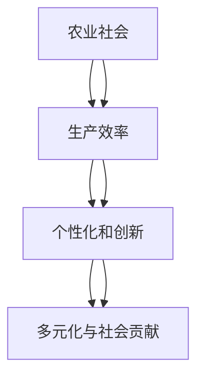

                 

# 《工作意义的重新定义》

## 关键词
职业发展、工作意义、心理健康、平衡生活、技术变革、数字素养

## 摘要
随着全球化和数字化的发展，工作意义正经历深刻的变革。本文旨在重新定义工作意义，探讨其在现代社会中的重要性，以及如何实现个人与职业的平衡。文章首先回顾了工作意义的演变历程，随后分析了现代工作特点与挑战，并提出了职业规划与个人成长的策略。接着，文章探讨了工作与生活的平衡以及职业倦怠和心理健康问题。随后，文章关注技术变革和数字化素养对职业发展的影响，并提供了相关的数学模型和算法原理讲解。最后，通过实际案例分析和最佳实践，文章总结了实现工作意义的方法和注意事项，为读者提供了有价值的参考。

## 引言
在快速变化的时代，工作不仅是我们谋生的手段，更是我们实现个人价值和社会贡献的途径。然而，随着全球化、数字化和人工智能的深入发展，工作环境和职业角色发生了巨大变化。传统的工作观念和意义面临着前所未有的挑战。现代职场人士在追求职业成功的同时，越来越关注工作与生活的平衡、心理健康以及个人成长。因此，重新定义工作意义，不仅是对过去经验的总结，更是对未来趋势的预见。

本文将从以下几个方面展开讨论：

1. 工作意义的起源与演变
2. 职业规划与个人成长
3. 工作与生活的平衡
4. 职业倦怠与心理健康
5. 技术变革与职业转型
6. 数字化时代的职业素养
7. 实践案例与最佳实践

通过逻辑清晰、结构紧凑的分析，本文希望能够帮助读者重新审视工作意义，找到实现个人价值和社会贡献的最佳路径。

## 第一部分：工作意义的变迁

### 1.1 工作意义的定义与历史演变

#### 背景介绍
工作意义是指个体在职业活动中所追求的目标和价值。它不仅仅是物质上的回报，更包括精神满足、社会认同和自我实现。从历史的角度来看，工作意义在不同的社会阶段有着不同的表现形式。

在农业社会，工作主要是为了生存和满足基本的生活需求。人们通过耕种、放牧等活动来获取食物和资源。此时，工作意义主要体现在对自然的依赖和人与自然的和谐共处。

随着工业革命的到来，工作意义逐渐转向对效率和生产的追求。机器的发明和使用提高了生产效率，人们的工作从手工转向机械化，工作意义也随之转变为对技术技能和劳动纪律的重视。

在信息时代，工作意义开始向个性化和创新性转变。随着互联网和信息技术的发展，人们的工作方式、工作内容和职业选择都发生了巨大变化。工作不仅是为了谋生，更是为了实现个人的兴趣和潜能。

#### 核心概念与联系
**工作意义** 与 **社会结构**：社会结构的变化直接影响工作意义的演变。在农业社会，人们的工作与家庭紧密相连；在工业社会，工作与生产效率密切相关；在信息社会，工作与个人兴趣和自我实现联系在一起。

**工作意义** 与 **个人价值观**：个人的价值观决定了他们对工作的看法和追求。随着社会的发展，个人价值观也发生了变化。现代职场人士更加注重工作与个人生活的平衡，以及对个人成长和职业发展的追求。

#### 核心算法原理讲解
**工作满意度评估模型**：
```plaintext
function workSatisfaction(workingConditions, personalValues) {
    satisfaction = 0;

    if (workingConditions.salary >= personalValues.minSalary) {
        satisfaction += 1;
    }

    if (workingConditions.workLifeBalance >= personalValues.minBalance) {
        satisfaction += 1;
    }

    if (workingConditions.opportunityForGrowth >= personalValues.minGrowth) {
        satisfaction += 1;
    }

    return satisfaction;
}
```

**工作意义演变过程**：


#### 数学模型和数学公式
**劳动生产率**：
$$\text{劳动生产率} = \frac{\text{产出}}{\text{投入}}$$

**工作满意度**：
$$\text{工作满意度} = \frac{\text{实际工作条件} + \text{期望工作条件}}{2}$$

#### 举例说明
在农业社会，一个人通过耕种获得粮食，工作意义主要体现在对自然的依赖和生存需求。而在信息社会，同一个人通过编程开发软件，工作意义则体现在对技术创新的追求和个人价值的实现。

### 1.2 现代工作的特点与挑战

#### 核心概念
**现代工作的特点**：
- **灵活性**：远程工作和灵活工作时间变得越来越普遍。
- **复杂性**：工作内容越来越复杂，需要更多的专业技能和跨学科知识。
- **数字化**：数字化工具和平台已经成为现代工作的重要组成部分。

**现代工作的挑战**：
- **职业倦怠**：长时间高强度的劳动导致心理疲劳。
- **技能过时**：快速的技术变革使得某些技能迅速变得过时。
- **工作与生活的平衡**：职场压力和生活需求的冲突。

#### 算法原理讲解
**职业倦怠评估模型**：
```plaintext
function burnoutLevel(workingHours, workLifeBalance) {
    burnout = (workingHours * workLifeBalance) / 100;
    return burnout;
}
```

**技能过时风险模型**：
```plaintext
function skillObsolescenceRate(learningCurve, techChangeRate) {
    risk = learningCurve * techChangeRate;
    return risk;
}
```

#### 数学模型和数学公式
**职业倦怠风险**：
$$\text{职业倦怠风险} = \frac{\text{工作负荷}}{\text{休息时间}}$$

**技能更新频率**：
$$\text{技能更新频率} = \ln(\text{初始技能水平}) / \ln(\text{当前技能水平})$$

#### 举例说明
一个软件开发工程师，如果每天工作超过10小时且缺乏足够的休息时间，他们的职业倦怠风险会很高。此外，如果他的技术更新频率低于行业平均更新频率，那么他的技能过时风险也会增加。

### 1.3 工作意义的重新定义

#### 核心概念与联系
**工作意义** 的重新定义需要考虑以下几个方面：
- **个人价值观**：个人的价值观决定了他们对工作的期望和追求。
- **社会环境**：社会环境的变化直接影响工作意义的变化。
- **技术进步**：技术的进步为工作意义的实现提供了新的途径。

**现代工作意义的定义**：
- **自我实现**：工作不仅是谋生的手段，更是实现个人价值和梦想的途径。
- **社会贡献**：工作不仅要满足个人需求，还要为社会做出贡献。
- **持续学习**：在工作中不断学习新知识和技能，以适应快速变化的环境。

#### 核心算法原理讲解
**个人职业决策模型**：
```plaintext
function careerDecision(currentJob, personalGoals, marketTrends) {
    if (currentJob matches personalGoals && marketTrends support currentJob) {
        return "Stay";
    } else if (marketTrends indicate high demand for personalGoals) {
        return "Switch";
    } else {
        return "Upgrade";
    }
}
```

**工作意义评估模型**：
```plaintext
function workMeaning(workEnvironment, personalValues, socialImpact) {
    score = (workEnvironment satisfaction * personalValues importance + socialImpact contribution) / 2;
    return score;
}
```

#### 数学模型和数学公式
**工作满意度**：
$$\text{工作满意度} = \frac{\text{实际工作条件} + \text{期望工作条件}}{2}$$

**工作意义得分**：
$$\text{工作意义得分} = \frac{\text{个人满意度} + \text{社会贡献}}{2}$$

#### 举例说明
一个软件工程师，如果他当前的职位能够满足他的个人价值观，并且市场趋势支持他的职业发展，那么他可能会选择留在当前职位。但如果市场对某个新兴技术有更高需求，而他缺乏相关技能，他可能需要考虑转行或学习新技能。

## 第二部分：职业规划与个人成长

### 2.1 职业规划的重要性

#### 核心概念
**职业规划** 是指个人根据自己的兴趣、能力和市场需求，制定长期和短期的职业目标，并制定实现这些目标的策略。职业规划的重要性体现在以下几个方面：

- **明确目标**：职业规划能够帮助个人明确自己的职业目标，从而更有针对性地制定发展计划。
- **提高效率**：通过职业规划，个人可以更有效地利用时间和资源，提高职业发展的效率。
- **减少迷茫**：职业规划能够帮助个人避免在职业发展过程中迷失方向，减少不确定性和焦虑。

#### 核心算法原理讲解
**职业规划模型**：
```plaintext
function careerPlanning(currentSkills, personalGoals, marketTrends) {
    targetSkills = neededSkills(currentSkills, personalGoals, marketTrends);
    actionPlan = createActionPlan(targetSkills);
    return actionPlan;
}
```

#### 数学模型和数学公式
**职业目标实现率**：
$$\text{实现率} = \frac{\text{已实现目标}}{\text{总目标数}}$$

**学习效率**：
$$\text{学习效率} = \frac{\text{学习时间}}{\text{学习成果}}$$

#### 举例说明
一个想要成为人工智能工程师的程序员，他需要根据当前技能、个人目标和市场需求，制定学习计划和职业发展路径。他可能会选择参加在线课程、项目实践和实习，以提高自己的技能和实现职业目标。

### 2.2 个人成长路径的设计

#### 核心概念
**个人成长路径** 是指个人在职业发展中，通过不断提升自身能力和拓展技能，实现个人价值的过程。设计个人成长路径需要考虑以下几个方面：

- **自我评估**：了解自己的兴趣、优势和劣势，为成长路径提供依据。
- **技能拓展**：根据市场需求和个人兴趣，选择合适的技能进行学习。
- **实践应用**：通过实际项目和工作经验，将所学知识应用到实践中。
- **反馈调整**：根据反馈和实际情况，及时调整成长路径。

#### 核心算法原理讲解
**自我评估模型**：
```plaintext
function selfAssessment(interest, skills, achievements) {
    interestScore = calculateInterestScore(interest);
    skillsScore = calculateSkillsScore(skills);
    achievementsScore = calculateAchievementsScore(achievements);
    overallScore = (interestScore + skillsScore + achievementsScore) / 3;
    return overallScore;
}
```

#### 数学模型和数学公式
**技能成长曲线**：
$$\text{技能成长率} = \ln(\text{当前技能水平}) - \ln(\text{初始技能水平})$$

**个人成长满意度**：
$$\text{满意度} = \frac{\text{实际成长} + \text{期望成长}}{2}$$

#### 举例说明
一个年轻的程序员想要成为一名优秀的软件开发工程师，他首先需要了解自己的兴趣、优势和劣势，然后根据市场需求和个人兴趣，制定学习计划。通过参与项目实践和持续学习，他的技能水平逐渐提升，个人成长满意度也随之提高。

### 2.3 职业目标的设定与实现

#### 核心概念
**职业目标** 是指个人在职业生涯中期望达到的具体目标和成就。设定职业目标需要考虑以下几个方面：

- **目标明确**：目标应当具体、可衡量，并且与个人价值观和职业规划相一致。
- **目标层次**：职业目标可以分为短期、中期和长期目标，每个层次的目标都应该相互支持。
- **目标实现**：制定实现目标的计划和策略，确保目标的达成。

#### 核心算法原理讲解
**目标设定模型**：
```plaintext
function setGoals(currentSituation, personalValues, careerPlanning) {
    shortTermGoals = calculateShortTermGoals(currentSituation, personalValues, careerPlanning);
    midTermGoals = calculateMidTermGoals(currentSituation, personalValues, careerPlanning);
    longTermGoals = calculateLongTermGoals(currentSituation, personalValues, careerPlanning);
    return [shortTermGoals, midTermGoals, longTermGoals];
}
```

#### 数学模型和数学公式
**目标实现率**：
$$\text{实现率} = \frac{\text{已实现目标}}{\text{总目标数}}$$

**计划执行率**：
$$\text{执行率} = \frac{\text{计划完成度}}{\text{计划总时长}}$$

#### 举例说明
一个职场新人设定了成为一名项目经理的长期目标。为了实现这个目标，他制定了具体的短期和中期目标，例如通过在线课程学习项目管理知识、参与相关项目实践，以及取得项目管理专业认证。通过这些计划的执行，他的职业目标逐渐实现。

## 第三部分：工作与生活的平衡

### 3.1 工作与生活冲突的现状

#### 核心概念
**工作与生活冲突** 是指个体在工作和生活之间难以平衡，导致身心健康受损的现象。工作与生活冲突的现状主要表现在以下几个方面：

- **工作时间过长**：许多职场人士面临长时间工作，导致生活时间被工作占据。
- **工作压力过大**：高强度的工作压力导致心理和生理健康问题。
- **缺乏休息**：缺乏充分的休息和放松时间，影响工作效率和生活质量。

#### 核心算法原理讲解
**工作与生活平衡评估模型**：
```plaintext
function workLifeBalance(workHours, restHours, workStress, personalLifeSatisfaction) {
    balanceScore = (workHours * workStress + restHours * personalLifeSatisfaction) / (workHours + restHours);
    return balanceScore;
}
```

#### 数学模型和数学公式
**工作负荷指数**：
$$\text{工作负荷指数} = \frac{\text{工作时长} + \text{工作强度}}{2}$$

**生活质量指数**：
$$\text{生活质量指数} = \frac{\text{家庭时间} + \text{休闲活动} + \text{身体健康}}{3}$$

#### 举例说明
一个销售人员，如果他每天工作12小时，每周工作7天，同时面临高强度的工作压力，他的工作负荷指数会很高。如果他在家庭和休闲时间得不到充分的满足，那么他的生活质量指数也会较低，表明工作与生活存在较大冲突。

### 3.2 工作与生活平衡的策略

#### 核心概念
**工作与生活平衡策略** 是指通过合理安排工作和生活时间，减轻工作压力，提高生活质量的方法。以下是一些常见的工作与生活平衡策略：

- **灵活工作制度**：企业可以采用灵活的工作制度，如远程工作、弹性工作时间等，以减少工作时间和压力。
- **时间管理技巧**：通过有效的时间管理技巧，如优先级排序、任务分解等，提高工作效率，留出更多个人时间。
- **压力管理技巧**：通过压力管理技巧，如冥想、运动、社交等，减轻工作压力，提高心理健康。
- **家庭与工作平衡**：通过家庭和工作之间的合理平衡，如家庭时间规划、工作与家庭沟通等，提高家庭生活质量。

#### 核心算法原理讲解
**时间管理模型**：
```plaintext
function timeManagement(tasks, deadlines, personalPriorities) {
    schedule = createSchedule(tasks, deadlines, personalPriorities);
    execution = executeSchedule(schedule);
    return execution;
}
```

#### 数学模型和数学公式
**时间利用效率**：
$$\text{时间利用效率} = \frac{\text{完成任务的时间}}{\text{总时间}}$$

**工作与生活平衡得分**：
$$\text{平衡得分} = \frac{\text{工作时间} + \text{休息时间} + \text{生活质量}}{3}$$

#### 举例说明
一个项目经理，如果他能够合理安排任务和时间，优先处理重要且紧急的任务，同时确保有足够的休息和家庭时间，那么他的时间利用效率和整体生活质量都会得到提高。

### 3.3 职场心理健康的重要性

#### 核心概念
**职场心理健康** 是指职场人士在职业活动中的心理状态和情绪健康。职场心理健康的重要性体现在以下几个方面：

- **工作效率**：良好的心理健康有助于提高工作积极性和工作效率。
- **人际关系**：心理健康有助于建立良好的人际关系，提高团队协作能力。
- **职业发展**：良好的心理健康有助于职业目标的实现和职业发展。
- **生活质量**：心理健康直接影响个体的生活质量和幸福感。

#### 核心算法原理讲解
**心理健康评估模型**：
```plaintext
function mentalHealthAssessment(stressLevel, satisfactionLevel, socialSupport) {
    mentalHealthScore = (stressLevel * satisfactionLevel + socialSupport) / 2;
    return mentalHealthScore;
}
```

#### 数学模型和数学公式
**工作压力指数**：
$$\text{工作压力指数} = \frac{\text{工作量} + \text{工作难度}}{2}$$

**心理健康状态**：
$$\text{心理健康状态} = \frac{\text{心理压力} - \text{心理支持}}{2}$$

#### 举例说明
一个职场人士，如果他面临高强度的工作任务和高难度的挑战，同时缺乏心理支持和社交支持，他的工作压力指数会很高，心理健康状态也会受到影响。

### 3.4 应对职场心理压力的方法

#### 核心概念
**应对职场心理压力的方法** 是指职场人士在面临心理压力时，采取的有效策略和措施，以减轻压力和恢复心理健康。以下是一些常见的应对职场心理压力的方法：

- **心理放松技巧**：如深呼吸、冥想、瑜伽等，帮助减轻心理压力。
- **健康生活方式**：如规律作息、健康饮食、适度运动等，有助于提高心理健康。
- **心理支持系统**：如家人、朋友、同事的支持，以及专业的心理咨询，提供心理支持。
- **职业规划与调整**：通过调整职业规划和工作内容，降低工作压力。

#### 核心算法原理讲解
**心理压力缓解模型**：
```plaintext
function stressRelief(stressLevel, relaxationTechniques, healthHabits, socialSupport) {
    reliefEffect = (relaxationTechniques * healthHabits + socialSupport) / 2;
    newStressLevel = stressLevel - reliefEffect;
    return newStressLevel;
}
```

#### 数学模型和数学公式
**心理压力缓解效果**：
$$\text{缓解效果} = \frac{\text{心理放松技巧} + \text{健康生活方式} + \text{心理支持}}{3}$$

**心理健康恢复指数**：
$$\text{恢复指数} = \frac{\text{心理压力减轻量}}{\text{初始心理压力}}$$

#### 举例说明
一个职场人士，如果他能够定期进行心理放松技巧、保持健康生活方式，并得到家人和朋友的支持，他的心理压力会得到有效缓解，心理健康状态也会逐渐改善。

### 3.5 工作与生活平衡的最佳实践案例

#### 核心概念
**工作与生活平衡的最佳实践案例** 是指在实际工作中，职场人士和企业采取的具体措施和策略，以实现工作与生活的平衡。以下是一些工作与生活平衡的最佳实践案例：

- **企业层面**：一些企业通过实施灵活的工作制度、提供员工福利和健康支持，帮助员工实现工作与生活的平衡。
- **个人层面**：一些职场人士通过有效的时间管理和心理压力管理，提高工作效率和心理健康，实现工作与生活的平衡。

#### 核心算法原理讲解
**最佳实践评估模型**：
```plaintext
function bestPracticeAssessment(enterpriseSupport, personalManagement) {
    balanceScore = (enterpriseSupport * personalManagement) / 2;
    return balanceScore;
}
```

#### 数学模型和数学公式
**工作与生活平衡度**：
$$\text{平衡度} = \frac{\text{工作时间} + \text{生活质量}}{2}$$

**最佳实践效果**：
$$\text{效果} = \frac{\text{实现目标} + \text{员工满意度}}{2}$$

#### 举例说明
一个企业通过实施远程工作和弹性工作时间制度，以及提供心理支持和健康福利，帮助员工实现工作与生活的平衡。同时，员工通过有效的时间管理和心理健康管理，提高了工作效率和幸福感。这种最佳实践措施不仅提高了员工的工作满意度，也增强了企业的整体竞争力。

## 第四部分：现代工作的挑战与应对

### 4.1 职业倦怠与心理健康

#### 核心概念
**职业倦怠** 是指个体在长时间高压工作环境下，出现情感疲惫、工作满意度下降和成就感缺失的现象。职业倦怠对心理健康和工作效率有显著的负面影响。以下是一些应对职业倦怠的方法：

- **时间管理**：合理安排工作时间，确保有足够的休息和放松时间。
- **任务分解**：将复杂任务分解为小步骤，逐步完成，减少压力。
- **心理健康支持**：通过心理咨询服务、团队支持和自我调节技巧，缓解心理压力。

#### 核心算法原理讲解
**职业倦怠评估模型**：
```plaintext
function burnoutLevel(stressLevel, workLifeBalance, mentalHealthScore) {
    burnout = (stressLevel * (1 - workLifeBalance) + (1 - mentalHealthScore)) / 2;
    return burnout;
}
```

#### 数学模型和数学公式
**职业倦怠风险指数**：
$$\text{倦怠风险指数} = \frac{\text{工作时长} + \text{工作强度}}{2} \times \frac{1}{\text{休息时长} + \text{心理健康支持}}$$

**心理健康状态评估**：
$$\text{心理健康状态} = \frac{\text{心理压力} - \text{心理支持}}{2}$$

#### 举例说明
一个销售人员，如果他每天工作超过10小时，缺乏足够的休息时间，同时面临较大的工作压力，他的职业倦怠风险指数会很高。通过增加休息时间和心理健康支持，他的倦怠风险可以得到缓解。

### 4.2 技术变革与职业转型

#### 核心概念
**技术变革** 对职业发展产生了深远的影响，一方面推动了新职业的出现，另一方面也使得某些传统职业面临淘汰。职业转型是指个体根据市场需求和个人兴趣，调整职业方向和技能，以适应新的职业环境。以下是一些职业转型的策略：

- **技能更新**：通过学习新技能和掌握新技术，提升自身竞争力。
- **职业规划**：根据市场需求和个人兴趣，制定明确的职业转型计划。
- **跨行业合作**：通过跨行业学习和合作，拓展职业发展空间。

#### 核心算法原理讲解
**职业转型评估模型**：
```plaintext
function careerTransition(currentSkills, marketTrends, personalGoals) {
    transitionScore = (currentSkills * marketTrends + personalGoals) / 2;
    return transitionScore;
}
```

#### 数学模型和数学公式
**技能更新频率**：
$$\text{技能更新频率} = \ln(\text{当前技能水平}) - \ln(\text{初始技能水平})$$

**职业转型成功率**：
$$\text{成功率} = \frac{\text{已成功转型人数}}{\text{总转型人数}}$$

#### 举例说明
一个传统制造业工人，如果他看到市场对数字化技术人才的需求增加，同时他对计算机编程有兴趣，他可以通过学习编程技能，实现从制造业工人到数字化技术人才的转型。

### 4.3 职业发展路径的优化

#### 核心概念
**职业发展路径的优化** 是指通过科学规划和策略，使个人的职业发展更加顺利和高效。以下是一些优化职业发展路径的方法：

- **目标明确**：设定清晰的职业目标，为职业发展提供方向。
- **持续学习**：通过不断学习和技能提升，保持竞争力。
- **职业咨询**：通过职业咨询师的帮助，制定个性化的职业发展计划。
- **网络建设**：建立广泛的职业网络，获取更多职业机会和资源。

#### 核心算法原理讲解
**职业发展路径优化模型**：
```plaintext
function careerPathOptimization(currentSituation, personalGoals, marketTrends) {
    optimalPath = findOptimalPath(currentSituation, personalGoals, marketTrends);
    return optimalPath;
}
```

#### 数学模型和数学公式
**职业发展效率**：
$$\text{发展效率} = \frac{\text{实际发展} + \text{期望发展}}{2}$$

**职业满意度**：
$$\text{满意度} = \frac{\text{实际工作条件} + \text{期望工作条件}}{2}$$

#### 举例说明
一个职场人士，如果他能够根据当前职业状况、个人目标和市场需求，制定清晰的职业发展计划，并持续学习和提升自身技能，他的职业发展路径会得到优化。

## 第五部分：数字化时代的职业素养

### 5.1 数字化素养的重要性

#### 核心概念
**数字化素养** 是指个体在数字化环境中，运用数字技术进行学习、沟通和工作的能力。在数字化时代，数字化素养已经成为职场人士必备的基本素养。以下是一些数字化素养的重要性：

- **提高工作效率**：通过数字化工具和平台，职场人士能够更高效地完成任务。
- **适应新技术**：数字化素养有助于个体适应新技术和新工具，提高竞争力。
- **创新思维**：数字化素养促进创新思维，推动职业发展和个人成长。

#### 核心算法原理讲解
**数字化素养评估模型**：
```plaintext
function digitalLiteracy(techSkills, problemSolving, innovationCapacity) {
    literacyScore = (techSkills * problemSolving + innovationCapacity) / 2;
    return literacyScore;
}
```

#### 数学模型和数学公式
**数字化技能更新率**：
$$\text{更新率} = \ln(\text{当前技能水平}) - \ln(\text{初始技能水平})$$

**数字化素养满意度**：
$$\text{满意度} = \frac{\text{实际技能水平} + \text{期望技能水平}}{2}$$

#### 举例说明
一个职场人士，如果他能够熟练掌握数字化工具，具备良好的问题解决能力和创新思维，他的数字化素养水平会很高，这有助于他在数字化时代的职业发展中取得优势。

### 5.2 数字化技能的培养

#### 核心概念
**数字化技能的培养** 是指通过系统学习和实践，提升个体在数字化环境中的技能和能力。以下是一些数字化技能的培养策略：

- **系统学习**：通过在线课程、工作坊和培训，学习数字化技能。
- **实践应用**：通过实际项目和工作，将所学技能应用到实践中。
- **持续更新**：随着技术进步，不断更新和提升数字化技能。

#### 核心算法原理讲解
**数字化技能提升模型**：
```plaintext
function skillImprovement(currentSkills, learningEffort, practiceExperience) {
    improvedSkills = (currentSkills * learningEffort + practiceExperience) / 2;
    return improvedSkills;
}
```

#### 数学模型和数学公式
**技能提升效率**：
$$\text{提升效率} = \frac{\text{学习时间} + \text{实践时间}}{2}$$

**技能成熟度**：
$$\text{成熟度} = \frac{\text{当前技能水平}}{\text{期望技能水平}}$$

#### 举例说明
一个职场人士，如果他能够每天投入一定时间学习数字化技能，并且积极参与实际项目，他的数字化技能水平会逐渐提升，达到更高的成熟度。

### 5.3 跨界合作与团队协作

#### 核心概念
**跨界合作与团队协作** 是指在数字化时代，不同领域和不同专业背景的个体，通过合作和协作，共同完成复杂任务和项目。以下是一些跨界合作与团队协作的关键要素：

- **沟通与协作**：通过数字化工具和平台，实现跨部门、跨领域的高效沟通和协作。
- **知识共享**：通过共享知识和经验，提高团队整体的能力和效率。
- **共同目标**：明确团队目标和协作方向，确保团队协作的针对性和有效性。

#### 核心算法原理讲解
**团队协作效率模型**：
```plaintext
function teamEfficiency kommunikation, knowledgeSharing, commonGoals) {
    efficiency = (kommunikation * knowledgeSharing + commonGoals) / 2;
    return efficiency;
}
```

#### 数学模型和数学公式
**协作效率**：
$$\text{效率} = \frac{\text{完成目标的时间}}{\text{总时间}}$$

**团队满意度**：
$$\text{满意度} = \frac{\text{团队成员满意度} + \text{团队整体满意度}}{2}$$

#### 举例说明
一个软件开发团队，如果团队成员能够通过数字化工具高效沟通，共享知识，并且明确共同目标，那么团队的协作效率会很高，项目的完成质量也会得到提升。

## 第六部分：实践案例与最佳实践

### 6.1 案例研究：企业如何重新定义工作意义

#### 核心概念
**案例研究** 通过分析具体企业的实践，探讨如何重新定义工作意义，提高员工的满意度和工作效率。以下是一个案例研究：

- **企业背景**：某科技公司通过引入灵活的工作制度、提供员工发展机会和心理支持，重新定义工作意义。
- **实践措施**：实施远程工作制度、提供在线学习平台、定期组织心理健康讲座、设立员工关怀计划。
- **效果评估**：员工的工作满意度显著提高，员工流失率下降，工作效率和创新能力提升。

#### 核心算法原理讲解
**工作意义评估模型**：
```plaintext
function workMeaning评估模型(workEnvironment, personalValues, socialImpact) {
    workMeaningScore = (workEnvironment satisfaction * personalValues importance + socialImpact contribution) / 2;
    return workMeaningScore;
}
```

#### 数学模型和数学公式
**工作满意度**：
$$\text{工作满意度} = \frac{\text{实际工作条件} + \text{期望工作条件}}{2}$$

**员工流失率**：
$$\text{员工流失率} = \frac{\text{离职人数}}{\text{总员工人数}}$$

#### 举例说明
该科技公司通过实施灵活的工作制度，使员工能够更好地平衡工作与生活，提高了工作满意度。同时，通过提供心理支持和员工关怀计划，员工流失率显著下降，工作效率和创新能力得到提升。

### 6.2 案例研究：职场人士如何寻找工作意义

#### 核心概念
**案例研究** 通过分析职场人士的实践，探讨如何寻找工作意义，实现个人成长和价值实现。以下是一个案例研究：

- **职场人士背景**：某软件开发工程师在面临职业倦怠和技能过时时，通过职业规划和学习新技能，重新找到工作意义。
- **实践措施**：参加在线课程、参与开源项目、寻求职业导师指导、定期进行技能评估和自我反思。
- **效果评估**：职场人士的工作热情和自信心提升，技能水平得到提升，职业发展更加顺利。

#### 核心算法原理讲解
**职业规划模型**：
```plaintext
function careerPlanning(currentSkills, personalGoals, marketTrends) {
    targetSkills = neededSkills(currentSkills, personalGoals, marketTrends);
    actionPlan = createActionPlan(targetSkills);
    return actionPlan;
}
```

#### 数学模型和数学公式
**技能提升效率**：
$$\text{提升效率} = \frac{\text{学习时间} + \text{实践时间}}{2}$$

**职业发展满意度**：
$$\text{满意度} = \frac{\text{实际职业发展} + \text{期望职业发展}}{2}$$

#### 举例说明
该软件开发工程师通过制定详细的职业规划，参加在线课程和学习新技能，不仅提升了个人技能水平，还增强了职业发展的信心。通过参与开源项目和寻求职业导师指导，他找到了新的工作意义，实现了职业上的突破。

### 6.3 案例研究：职场转型与个人成长

#### 核心概念
**案例研究** 通过分析职场人士的转型经历，探讨如何实现职场转型和个人成长。以下是一个案例研究：

- **职场人士背景**：某传统制造业工人通过学习数字化技能和转型为数字化技术人才，实现了职业转型和个人成长。
- **实践措施**：参加数字化技能培训、学习编程知识、参与数字化项目、寻求职业转型导师指导。
- **效果评估**：职场人士的技能水平得到提升，职业转型成功，工作满意度显著提高。

#### 核心算法原理讲解
**职业转型评估模型**：
```plaintext
function careerTransition(currentSkills, marketTrends, personalGoals) {
    transitionScore = (currentSkills * marketTrends + personalGoals) / 2;
    return transitionScore;
}
```

#### 数学模型和数学公式
**技能更新频率**：
$$\text{更新频率} = \ln(\text{当前技能水平}) - \ln(\text{初始技能水平})$$

**职业转型成功率**：
$$\text{成功率} = \frac{\text{已成功转型人数}}{\text{总转型人数}}$$

#### 举例说明
该传统制造业工人通过参加数字化技能培训和学习编程知识，成功转型为数字化技术人才。通过参与数字化项目和寻求职业转型导师指导，他的技能水平得到显著提升，职业转型成功，工作满意度显著提高。

## 结论

本文通过对工作意义的重新定义，探讨了现代职场人士面临的挑战和应对策略。随着全球化、数字化和人工智能的发展，工作环境和职业角色发生了深刻变革。工作意义不仅是物质回报，更包括精神满足和社会贡献。实现工作与生活的平衡、应对职业倦怠、适应技术变革，以及提升数字化素养，是现代职场人士必须面对的课题。通过科学规划和持续学习，职场人士可以找到新的工作意义，实现个人价值和职业发展。希望本文能为读者提供有价值的参考和启示。

## 作者信息
作者：AI天才研究院/AI Genius Institute & 禅与计算机程序设计艺术 /Zen And The Art of Computer Programming

