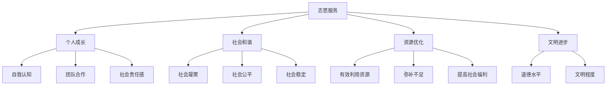

                 

### 文章标题

《志愿服务：在助人中找寻价值》

### 文章关键词

志愿服务，助人，价值，社会影响，个人成长，沟通与合作，心理健康，项目实战，持续发展。

### 文章摘要

本文旨在探讨志愿服务在现代社会中的重要性和价值。我们将从志愿服务的定义、历史、原则、组织、实施、沟通与合作、心理学与实践、评价与持续发展等方面，详细阐述志愿服务的核心概念和联系，并运用伪代码、数学模型和公式，以及实际案例，分析志愿服务的算法原理和实施方法。通过本文的阅读，读者将深入了解志愿服务的各个方面，并从中寻找属于自己的价值。

### 目录

1. **志愿服务的起源与发展**

   1.1 志愿服务的定义与核心价值

   1.2 志愿服务的历史与发展

   1.3 志愿服务的基本原则与类型

2. **志愿服务的组织与实施**

   2.1 志愿服务组织概述

   2.2 志愿服务项目的策划与设计

   2.3 志愿服务团队建设与管理

3. **志愿服务中的沟通与合作**

   3.1 志愿服务中的沟通技巧

   3.2 志愿服务中的团队合作

   3.3 志愿服务中的跨文化沟通

4. **志愿服务中的心理学与实践**

   4.1 志愿服务心理学

   4.2 志愿服务实践案例解析

   4.3 志愿服务中的个人成长

5. **志愿服务的评价与持续发展**

   5.1 志愿服务评价方法

   5.2 志愿服务品牌的建立与传播

   5.3 志愿服务的持续发展

6. **附录**

   6.1 志愿服务资源与工具

   6.2 志愿服务案例集锦

### 引言

志愿服务，一种无私奉献的行为，是现代社会中不可或缺的一部分。它不仅体现了人与人之间的互助精神，更是社会文明进步的重要标志。本文旨在探讨志愿服务的各个方面，从定义、历史、原则到组织、实施、沟通与合作、心理学与实践、评价与持续发展，力求为读者提供一个全面、系统的志愿服务分析框架。

我们将通过以下几个步骤进行分析和讨论：

- **志愿服务的定义与核心价值**：明确志愿服务的概念，探讨其在社会和个人生活中的重要性。
- **志愿服务的历史与发展**：回顾志愿服务的起源和发展历程，分析其在不同历史时期的特点和影响。
- **志愿服务的基本原则与类型**：介绍志愿服务的基本原则和类型，帮助读者更好地理解和参与志愿服务。
- **志愿服务的组织与实施**：详细阐述志愿服务组织的运作方式、项目策划与设计、团队建设与管理。
- **志愿服务中的沟通与合作**：探讨志愿服务中的沟通技巧、团队合作和跨文化沟通。
- **志愿服务中的心理学与实践**：分析志愿服务对个人心理和社会实践的影响。
- **志愿服务的评价与持续发展**：介绍志愿服务的评价方法、品牌建设与传播、持续发展策略。
- **附录**：提供志愿服务相关的资源与工具、案例集锦，以供读者参考和学习。

通过这些步骤，我们希望能够帮助读者更深入地理解志愿服务的内涵和外延，从而在助人过程中找寻到自己的价值。

### 1.1 志愿服务的定义与核心价值

志愿服务是一种无私奉献的行为，参与者不追求个人私利，而是出于对他人的关心和社会的责任感，自愿为他人和社会提供服务。志愿服务的核心价值在于它体现了人与人之间的互助精神，是社会和谐与进步的重要推动力。

**定义**：

志愿服务的定义可以概括为以下几点：

1. **自愿性**：参与者是出于自愿而非强制参与服务，这体现了个人对社会和他人的责任感。
2. **无偿性**：志愿服务是不收取报酬的行为，这是区分志愿服务与商业服务的显著特征。
3. **公益性**：志愿服务的目标是为了帮助他人、改善社会状况，而非追求个人或组织的利益。
4. **多样性**：志愿服务的内容和形式多种多样，包括教育、环保、扶贫、医疗等多个领域。

**核心价值**：

志愿服务在个人和社会层面具有深远的核心价值：

1. **个人成长**：参与志愿服务可以提升个人的自我认知、团队合作能力和社会责任感，促进个人全面发展。
2. **社会和谐**：志愿服务有助于增强社会的凝聚力和互信，促进社会公平和正义，维护社会稳定。
3. **资源优化**：志愿服务可以有效地利用社会资源，弥补政府和市场在公共服务方面的不足，提高社会整体福利水平。
4. **文明进步**：志愿服务是文明社会的重要标志，它反映了社会的道德水平和文明程度。

**关系架构**：

为了更清晰地理解志愿服务的核心价值，我们可以用Mermaid流程图来展示其与个人成长、社会和谐、资源优化和文明进步之间的关系。

通过以上定义和关系架构，我们可以看出，志愿服务不仅是一种行为，更是一种价值观的体现，它在个人成长、社会和谐、资源优化和文明进步等方面都发挥着重要作用。

### 1.2 志愿服务的历史与发展

志愿服务的历史可以追溯到古代社会的慈善行为和宗教活动。在中世纪的欧洲，宗教团体和修道院积极开展慈善救济活动，为贫病交加的人群提供帮助。这些早期的志愿服务行为虽然规模有限，但为后来的志愿服务发展奠定了基础。

**起源**：

志愿服务的起源可以追溯到19世纪。当时，工业革命带来了社会的剧烈变革，城市中的贫困现象日益严重。一些有识之士开始意识到，仅靠政府和市场力量无法解决社会问题，需要广泛动员社会力量来共同参与。在这样的背景下，志愿服务逐渐兴起。

**发展历程**：

1. **19世纪末至20世纪初**：这一时期，志愿服务在西方国家得到了快速发展。各种志愿者组织和慈善机构如雨后春笋般涌现，如美国红十字会、英国慈善协会等。这些组织不仅在救灾、医疗、教育等领域发挥了重要作用，还推动了志愿服务的制度化和规范化。

2. **20世纪中叶**：随着全球化和信息化的发展，志愿服务进入了国际化的阶段。各国志愿者组织和国际组织如联合国志愿者计划（UNV）等纷纷成立，志愿服务的理念和模式在全球范围内传播。这一时期，志愿服务逐渐从慈善行为上升为一种社会制度和价值观。

3. **21世纪初至今**：互联网技术的兴起为志愿服务带来了新的发展机遇。在线志愿服务平台、社交媒体和移动应用等新兴工具使得志愿服务的参与更加便捷和高效。同时，志愿服务领域也在不断扩展，涉及环境保护、科技创新、社会治理等多个领域。

**在中国的发展**：

中国的志愿服务起源于20世纪80年代。随着改革开放的推进，社会逐渐形成了一股志愿服务的热潮。1994年，中国青年志愿者协会正式成立，标志着中国志愿服务事业进入了一个新的发展阶段。近年来，中国的志愿服务得到了迅速发展，形成了多个全国性的志愿者组织，如中国志愿服务联合会、中国红十字基金会等。同时，各级政府也出台了一系列政策和措施，鼓励和支持志愿服务的发展。

**特点**：

1. **多样性**：志愿服务的内容和形式日益丰富，从传统的慈善救济到现代的公益项目，从线下的实地服务到线上的虚拟志愿服务，志愿服务的形式多样化。
2. **制度化**：志愿服务逐渐成为社会制度的一部分，政府、企业和社会组织纷纷参与其中，志愿服务的组织和管理更加规范化和专业化。
3. **国际化**：中国志愿服务积极参与国际交流与合作，与世界各国志愿者组织共同推动志愿服务的发展。

通过以上历史和发展历程的回顾，我们可以看到，志愿服务在经历了不同历史时期的演变后，已经成为现代社会不可或缺的一部分。志愿服务的理念和实践不仅推动了社会的进步，也为个人的成长提供了广阔的舞台。

### 1.3 志愿服务的基本原则与类型

志愿服务作为一种无私奉献的行为，其基本原则是确保其公益性和有效性。为了更好地实现志愿服务的目标，需要遵循一系列的基本原则，并且根据不同情境和需求，开展多样化的志愿服务类型。

**基本原则**：

1. **自愿性原则**：志愿服务必须建立在自愿的基础上，参与者是出于自愿而非强制参与。这体现了个人对社会和他人的责任感，也是志愿服务的核心价值之一。
2. **公益性原则**：志愿服务的目标是为了帮助他人、改善社会状况，而非追求个人或组织的利益。公益性质是志愿服务的本质特征，也是其区别于商业服务的重要标志。
3. **无偿性原则**：志愿服务是不收取报酬的行为，参与者不追求经济利益，而是出于对他人的关心和社会责任感。
4. **平等性原则**：志愿服务应当尊重服务对象的权利和尊严，确保服务的公平性和平等性，不论服务对象的社会地位、经济状况和背景。
5. **规范性原则**：志愿服务需要遵循一定的规范和标准，包括组织管理、项目策划、服务实施和评价等方面，以确保志愿服务的质量和效果。

**类型划分**：

根据不同的标准和需求，可以将志愿服务划分为多种类型：

1. **按领域划分**：
   - **教育类**：如支教、教育辅导、文化传承等，旨在提升教育水平和文化素质。
   - **环保类**：如植树造林、垃圾分类、环保宣传等，旨在保护环境、促进可持续发展。
   - **扶贫类**：如扶贫济困、慈善捐赠、贫困救助等，旨在帮助弱势群体，减少贫困现象。
   - **医疗类**：如医疗救助、健康宣教、疾病防治等，旨在提高医疗健康水平。
   - **社区服务类**：如社区建设、社区活动、邻里互助等，旨在促进社区和谐与发展。

2. **按形式划分**：
   - **线下志愿服务**：如实地服务、现场救助、社区活动等，直接面对服务对象，具有直观性。
   - **线上志愿服务**：如网络辅导、在线咨询、虚拟志愿者等，利用互联网技术进行远程服务，具有便捷性和高效性。

3. **按目标人群划分**：
   - **老年人服务**：如养老服务、健康关爱、生活援助等，旨在关爱老年人，提升其生活质量。
   - **儿童服务**：如教育辅导、兴趣培养、心理关怀等，旨在关爱儿童，促进其全面发展。
   - **残疾人服务**：如康复辅助、就业支持、生活援助等，旨在关爱残疾人，提高其社会参与度。
   - **特殊群体服务**：如贫困人口、流浪人员、犯罪人员等，旨在帮助这些特殊群体融入社会。

通过以上基本原则和类型划分，我们可以看到，志愿服务具有多样化的形式和目标，但无论哪种类型，都离不开自愿性、公益性、无偿性、平等性和规范性这些基本原则的指导。遵循这些原则，不仅能确保志愿服务的质量和效果，还能推动志愿服务的健康发展。

### 2.1 志愿服务组织概述

志愿服务组织是推动志愿服务活动的重要载体，它们通过组织、管理和服务过程，有效地将志愿者的力量汇聚起来，为社会发展和个人成长贡献力量。下面，我们将对志愿服务组织的定义、职责、类型和结构进行详细探讨。

**定义**：

志愿服务组织是指专门从事志愿服务活动的非营利性社会组织，它们通过整合社会资源，组织和协调志愿者，开展各种形式的志愿服务项目。志愿服务组织不仅为志愿者提供参与志愿服务的机会，还为志愿服务活动提供必要的支持和保障。

**职责**：

志愿服务组织的职责主要包括以下几个方面：

1. **招募与培训志愿者**：志愿服务组织需要招募具备一定技能和热情的志愿者，并通过培训提升志愿者的服务能力和素质。
2. **策划与组织志愿服务项目**：志愿服务组织需要根据社会需求和自身资源，策划和组织实施各种志愿服务项目，确保项目的有效性和可持续性。
3. **协调与服务对象**：志愿服务组织需要与志愿服务对象进行有效沟通，了解其需求和反馈，确保志愿服务能够真正满足服务对象的需要。
4. **资源管理与资金筹集**：志愿服务组织需要有效管理自身资源，包括资金、物资和人力等，并积极筹集资金，支持志愿服务项目的开展。
5. **评估与反馈**：志愿服务组织需要对志愿服务活动进行评估，收集志愿者和服务对象的反馈，不断优化服务流程和项目设计。

**类型**：

志愿服务组织的类型多样，主要包括以下几种：

1. **政府主导型**：这类组织通常由政府相关部门成立和主导，承担一定的公共服务职能。例如，中国的红十字会、志愿者协会等。
2. **民间组织型**：这类组织由社会团体或个人自发成立，独立运作，通常具有更强的灵活性和创新性。例如，各种民间公益组织和志愿者团体。
3. **企业赞助型**：这类组织由企业发起，通过企业资源和员工志愿者的参与，开展志愿服务项目。例如，企业的志愿者服务队和公益基金会等。
4. **国际组织型**：这类组织通常由国际性非政府组织或跨国公司成立，在全球范围内开展志愿服务活动。例如，国际红十字会、联合国志愿者计划等。

**结构**：

志愿服务组织的基本结构通常包括以下几个部分：

1. **决策层**：包括董事会、理事会等，负责组织战略规划、政策制定和重大事项决策。
2. **管理层**：包括执行董事、项目经理等，负责日常运营管理、项目执行和资源协调。
3. **志愿者团队**：由各类志愿者组成，根据项目需求和专业背景，提供相应的志愿服务。
4. **支持部门**：包括行政部、财务部、人力资源部等，负责后勤保障、资金管理和志愿者管理等。
5. **合作伙伴**：包括政府部门、企业、学校、社区等，为志愿服务组织提供资源支持和合作机会。

通过以上对志愿服务组织的定义、职责、类型和结构的介绍，我们可以看到，志愿服务组织在推动志愿服务活动方面发挥着关键作用。它们通过有效的组织和管理，将志愿者的力量转化为社会服务，为社会的和谐与进步做出了重要贡献。

### 2.2 志愿服务项目的策划与设计

志愿服务项目的策划与设计是确保志愿服务活动顺利进行、达到预期目标的关键环节。一个成功的志愿服务项目需要明确的目标、详细的计划、合理的时间安排和有效的资源管理。以下是志愿服务项目策划与设计的主要步骤和注意事项。

**步骤**：

1. **需求分析**：
   - **明确服务目标**：首先，需要明确志愿服务的目标，即希望通过志愿服务解决哪些社会问题或满足哪些社会需求。
   - **进行社会调查**：通过问卷调查、访谈、实地考察等方式，了解目标群体的需求，为项目设计提供依据。
   - **确定服务对象**：明确志愿服务的具体对象，如老年人、儿童、残疾人等。

2. **项目设计**：
   - **项目概述**：撰写项目概述，包括项目背景、目标、预期效果等。
   - **服务内容**：设计具体的服务内容，包括服务项目、服务流程、服务方式等。
   - **资源评估**：评估项目所需的资源，包括人力资源、物资资源、财务资源等。

3. **时间安排**：
   - **制定时间表**：根据项目需求，制定详细的时间表，明确每个阶段的时间节点和任务。
   - **灵活调整**：在项目实施过程中，可能需要根据实际情况对时间表进行调整，确保项目顺利进行。

4. **资源管理**：
   - **人力资源**：招募和培训志愿者，确保志愿者具备必要的技能和知识。
   - **物资资源**：准备必要的物资，如设备、材料等，确保项目的顺利进行。
   - **财务资源**：预算项目的资金需求，并积极筹集资金，确保项目的财务可持续性。

5. **风险评估**：
   - **识别风险**：识别可能影响项目实施的风险，如资源不足、志愿者流失、服务对象不满等。
   - **制定应对策略**：针对识别出的风险，制定相应的应对策略和预案，降低风险对项目的影响。

**注意事项**：

1. **明确目标**：项目设计前，需要明确项目的具体目标和预期效果，确保项目有明确的方向和目标。

2. **合理规划**：在项目设计过程中，需要合理规划时间、资源和任务，确保项目能够按计划顺利进行。

3. **志愿者管理**：志愿者的招募、培训和激励是项目成功的关键，需要建立有效的志愿者管理体系。

4. **反馈与调整**：在项目实施过程中，需要定期收集志愿者和服务对象的反馈，及时调整项目设计和执行策略。

5. **可持续性**：项目设计需要考虑项目的可持续性，确保项目在结束后的效果能够持续，避免短期效果。

通过以上步骤和注意事项，我们可以确保志愿服务项目的策划与设计科学、合理、有效，从而实现志愿服务的目标，为社会带来积极的影响。

### 2.3 志愿服务团队建设与管理

志愿服务团队是志愿服务项目成功实施的重要保障。一个高效的志愿服务团队不仅需要具备明确的组织结构，还需要有效的管理机制和持续的发展策略。以下将详细探讨志愿服务团队的组建、培训、激励与考核，以及持续发展的策略。

**组建**：

1. **确定团队目标**：在组建志愿服务团队前，需要明确团队的目标和使命，确保团队成员对团队的愿景有共同的认识。
2. **招募志愿者**：通过线上线下渠道，广泛招募具有热情和技能的志愿者。确保招募过程的公平、透明，避免歧视现象。
3. **评估与筛选**：对报名的志愿者进行评估和筛选，根据志愿服务项目的需求，选择合适的志愿者。
4. **组建团队结构**：根据志愿服务项目的特点和需求，设计合理的团队结构，包括领导层、管理层和执行层等。

**培训**：

1. **基础培训**：为新加入的志愿者提供基础培训，包括志愿服务理念、服务流程、安全知识等，确保志愿者了解和掌握基本的服务技能。
2. **专业培训**：针对不同领域的志愿服务，提供专业的培训课程，如医疗急救、环境保护、教育辅导等，提升志愿者的专业能力。
3. **持续学习**：鼓励团队成员不断学习，参加各类培训和研讨会，分享经验，提升团队的整体素质。

**激励与考核**：

1. **激励措施**：
   - **物质激励**：为志愿者提供适当的工作补贴、交通补贴等，改善志愿者的生活条件。
   - **精神激励**：通过表彰、荣誉证书、公开表扬等方式，对优秀志愿者进行表彰和奖励，激发志愿者的积极性。
   - **成长激励**：为志愿者提供职业发展机会，如晋升、转岗等，帮助志愿者实现个人成长。

2. **考核机制**：
   - **日常考核**：通过观察、反馈、评估等方式，对志愿者的日常表现进行考核，确保志愿服务的质量。
   - **定期评估**：定期对志愿服务团队进行整体评估，分析团队的运行情况，找出问题和不足，及时进行调整。

**持续发展**：

1. **团队文化建设**：打造积极向上、团结协作的团队文化，增强团队的凝聚力和归属感。
2. **资源保障**：确保志愿服务团队有充足的资源支持，包括资金、物资和人力资源等，为团队的发展提供保障。
3. **创新与发展**：鼓励团队进行创新，探索新的志愿服务模式和方法，不断提升团队的服务水平和社会影响力。
4. **社会合作**：与政府部门、企业、社区等建立合作关系，共同推动志愿服务的发展。

通过以上策略，我们可以有效地组建和管理志愿服务团队，提升志愿服务的质量和效果，为社会带来更多的正能量。

### 3.1 志愿服务中的沟通技巧

在志愿服务过程中，沟通技巧至关重要。有效的沟通不仅能够增强团队成员之间的合作，还能提高服务质量和效果，确保志愿服务项目的顺利进行。以下是一些关键的沟通技巧：

**倾听**：

倾听是沟通的基础。在志愿服务中，倾听不仅仅是听对方说什么，更重要的是理解对方的情感和需求。具体方法包括：

1. **全神贯注**：在与他人交流时，确保自己全身心投入，避免分心。
2. **肢体语言**：通过点头、眼神接触和适当的肢体动作，表达出你对对方的关注和理解。
3. **避免打断**：在对方讲话时，避免中途打断，等待对方讲完再回应。

**表达**：

清晰、准确的表达是有效沟通的关键。以下是一些建议：

1. **简洁明了**：用简单、直接的语言表达观点，避免使用过于复杂或晦涩的词汇。
2. **正面语言**：使用积极的语言，避免负面情绪和指责。例如，使用“我们可以一起解决这个问题”而不是“你总是做错”。
3. **适应听众**：根据听众的文化背景、知识水平和兴趣，调整表达方式和内容。

**反馈**：

及时、有效的反馈能够帮助双方更好地理解对方，修正错误，改进服务质量。以下是一些建议：

1. **具体反馈**：提供具体的反馈信息，指出对方做得好的地方和需要改进的地方，避免泛泛而谈。
2. **积极反馈**：即使是批评，也要保持积极的态度，指出改进的方法和方向。
3. **及时反馈**：在问题发生时，及时提供反馈，避免问题积压。

**跨文化沟通**：

在志愿服务中，可能会遇到来自不同文化背景的志愿者和服务对象。以下是一些建议：

1. **文化敏感**：了解不同文化的价值观、习俗和行为方式，避免文化冲突。
2. **开放心态**：尊重不同的观点和做法，避免主观臆断和偏见。
3. **适应对方**：尽量适应对方的文化习惯，使用对方熟悉和舒适的沟通方式。

通过以上沟通技巧，我们可以有效地提高志愿服务的沟通效果，增强团队合作，提升服务质量和满意度。

### 3.2 志愿服务中的团队合作

志愿服务通常需要多个志愿者的协作完成，因此团队合作在志愿服务中至关重要。有效的团队合作不仅能够提高志愿服务的质量，还能增强志愿者的归属感和满意度。以下是一些关键的团队合作原则和策略：

**基本原则**：

1. **目标一致性**：确保所有团队成员对志愿服务的目标和愿景有共同的理解和认同，这是团队合作的基础。
2. **角色明确**：每个团队成员都应明确自己的角色和职责，避免职责重叠和责任不明。
3. **相互尊重**：尊重团队成员的意见和贡献，建立相互信任和合作关系。
4. **分工合作**：根据团队成员的特长和兴趣，合理分工，发挥每个人的优势。

**策略**：

1. **沟通机制**：建立有效的沟通机制，确保信息的及时传递和共享。可以定期召开团队会议，讨论项目进展、问题和解决方案。
2. **冲突解决**：在团队合作过程中，难免会出现意见分歧和冲突。及时解决冲突，避免影响团队合作。可以采用以下策略：
   - **倾听和理解**：了解双方的立场和观点，避免直接对抗。
   - **寻求共识**：寻找双方都能接受的解决方案，达成共识。
   - **公正决策**：在冲突无法自行解决时，由团队领导或第三方进行公正的决策。

3. **激励与奖励**：对团队成员进行激励和奖励，提高团队合作积极性。可以设立团队奖励机制，对表现突出的成员进行表彰和奖励。

4. **团队建设**：定期组织团队建设活动，增强团队成员之间的交流和了解，提高团队的凝聚力。可以举办团队聚餐、户外拓展、培训等活动。

**实践案例**：

以某社区志愿服务项目为例，项目团队由不同背景的志愿者组成，包括大学生、企业员工和社区居民。项目目标是改善社区环境，提高居民的生活质量。

1. **明确目标和分工**：项目团队在初期会议中明确了项目目标，并制定了详细的工作计划。团队成员根据自己的特长和兴趣，分别负责环境清洁、社区活动策划、宣传推广等任务。

2. **有效沟通**：团队建立了每周例会的沟通机制，确保项目进展的及时反馈和问题解决。每次会议都由一位志愿者主持，确保会议的效率和效果。

3. **冲突解决**：在项目执行过程中，团队成员因活动安排和时间协调产生了分歧。团队领导及时介入，通过沟通和理解，最终找到了双方都能接受的解决方案。

4. **激励与奖励**：项目团队为每位成员设立了绩效评估标准，并根据评估结果进行奖励。同时，团队还定期举办团队建设活动，增强成员之间的合作和信任。

通过以上团队合作原则和策略，志愿服务项目不仅取得了显著的成果，还提高了团队成员的满意度和归属感，为后续的志愿服务活动奠定了坚实的基础。

### 3.3 志愿服务中的跨文化沟通

在志愿服务过程中，跨文化沟通是一个重要且具有挑战性的环节。由于不同文化背景的志愿者和服务对象存在差异，有效的跨文化沟通能力对于确保志愿服务的成功至关重要。以下将探讨跨文化沟通的挑战、策略和成功案例。

**挑战**：

1. **语言障碍**：语言是沟通的桥梁，但在志愿服务中，不同文化背景的志愿者和服务对象可能使用不同的语言，导致沟通障碍。解决这一挑战需要依赖翻译工具、多语言宣传材料等。
   
2. **价值观差异**：不同的文化背景下，人们的价值观、信仰和行为习惯可能存在显著差异。例如，某些文化可能重视集体主义，而另一些文化则更强调个人主义。这些差异可能导致误解和冲突，需要通过开放的心态和尊重来克服。

3. **非语言沟通**：文化差异不仅体现在语言上，还包括肢体语言、面部表情和姿态等非语言沟通方式。不了解这些非语言沟通的文化含义，可能导致沟通不畅。

4. **时间观念**：不同文化对时间的看法和重视程度不同。某些文化可能更加灵活，而另一些文化则非常重视准时。这可能导致沟通中的时间管理问题。

**策略**：

1. **文化敏感**：了解不同文化的背景和特点，增强文化敏感度。可以通过阅读相关书籍、参加文化交流活动等方式，提升对多元文化的理解和尊重。

2. **倾听和尊重**：倾听对方的文化观点和需求，避免主观判断和偏见。尊重文化差异，认可不同文化的重要性。

3. **开放心态**：保持开放的心态，愿意接受和学习新的文化知识。避免过度自我中心和偏见。

4. **适应对方**：尽量适应对方的文化习惯和沟通方式。在沟通中，使用对方熟悉和舒适的沟通风格和语言。

5. **专业培训**：为志愿者提供跨文化沟通的专业培训，提高其文化意识和沟通技巧。

**成功案例**：

以某国际志愿者组织在中国农村开展的健康教育项目为例，该项目旨在提高当地居民的健康意识和知识。

1. **语言适应**：项目团队聘请了当地的语言专家，为志愿者提供汉语培训，并制作了多语言的健康教育宣传材料。

2. **文化尊重**：项目团队在开展活动时，尊重当地的文化习俗和价值观，如避免在重要节日进行打扰，并邀请当地文化领袖参与项目。

3. **互动教学**：项目采用了互动式教学方法，结合图片、视频和实际操作，提高当地居民的学习兴趣和理解能力。

4. **成功反馈**：通过有效的跨文化沟通，项目得到了当地居民的高度评价，居民的健康知识水平显著提高。

通过以上案例，我们可以看到，在志愿服务中，跨文化沟通的关键在于理解、尊重和适应。通过有效的策略和措施，可以克服文化差异带来的挑战，确保志愿服务的成功。

### 4.1 志愿服务心理学

志愿服务不仅是一种行为，更是一种心理活动。它对参与者的心理健康有着深远的影响。通过深入了解志愿服务心理学，我们可以更好地理解参与者的动机、心理压力和心理健康促进。

**动机**：

志愿服务的动机多种多样，主要包括以下几种：

1. **内源性动机**：这类动机源于个人内心的需求，如自我实现、成就感、自我价值感等。例如，有些人参与志愿服务是为了帮助他人、改善社会状况，实现自我价值。
2. **外源性动机**：这类动机来源于外部因素，如社会压力、道德责任感、他人的期望等。例如，有些人参与志愿服务是为了获得社会认可、避免社会谴责，或者出于父母、老师的期望。
3. **混合型动机**：有些人的动机是内外源性的结合，既包括个人内在的需求，也包括外部因素的影响。

**心理压力**：

参与志愿服务可能会带来一定的心理压力，主要来源于以下几个方面：

1. **工作压力**：志愿服务往往需要投入大量的时间和精力，参与者可能会感到疲劳和压力。
2. **人际关系压力**：在志愿服务过程中，参与者需要与不同背景的人进行沟通和合作，可能会遇到误解、冲突等挑战。
3. **自我期望压力**：参与者可能会对自己的表现有较高的期望，担心无法达到预期效果，从而产生心理压力。

**应对策略**：

为了减轻志愿服务带来的心理压力，可以采取以下策略：

1. **时间管理**：合理安排时间，确保工作和生活的平衡。可以通过设定优先级、制定时间表等方式，提高时间利用效率。
2. **沟通技巧**：学习并运用有效的沟通技巧，如倾听、表达、反馈等，提高人际沟通的质量，减少误解和冲突。
3. **心理调适**：培养积极的心理态度，如乐观、自信、感恩等，通过正念、冥想等方式进行心理调适。
4. **社会支持**：寻求家人、朋友和专业人士的支持，分享志愿服务的经历和感受，获得心理上的支持和理解。

**心理健康促进**：

志愿服务对心理健康有显著的促进作用，主要体现在以下几个方面：

1. **情感满足**：通过帮助他人、改善社会状况，参与者可以获得情感上的满足，增强自我价值感。
2. **社交支持**：志愿服务提供了与他人互动的机会，有助于建立社交网络，提高社交技能，增强社会支持。
3. **认知发展**：参与志愿服务可以拓展视野，增加对社会的了解，促进认知发展。
4. **身心健康**：志愿服务有助于减轻心理压力，改善心理健康状况，提高身心健康水平。

通过以上分析，我们可以看到，志愿服务不仅对参与者的心理健康有着深远的影响，也是心理健康促进的重要途径。了解志愿服务心理学，可以帮助我们更好地参与志愿服务，享受志愿服务带来的心理收益。

### 4.2 志愿服务实践案例解析

为了更好地理解志愿服务的实际操作，以下是几个具体的志愿服务实践案例，对每个案例的背景、目标、实施过程、效果和挑战进行详细分析。

**案例1：某城市的社区环保志愿活动**

**背景**：

某城市的社区居民对环境问题越来越关注，希望改善居住环境，提高生活质量。社区居民委员会决定组织一次环保志愿活动，号召志愿者参与社区环境清洁和环保宣传。

**目标**：

- 提高社区居民的环保意识
- 改善社区环境，减少垃圾和污染
- 增强社区凝聚力

**实施过程**：

1. **项目策划**：社区居民委员会在前期进行了详细的需求分析，制定了环保志愿活动的具体方案，包括活动时间、地点、内容和人员分工。
2. **志愿者招募**：通过社区公告、社交媒体和志愿者平台，广泛招募志愿者，并在社区内进行宣传活动，提高活动的知名度。
3. **活动实施**：活动当天，志愿者分成多个小组，分别负责社区清洁、垃圾分类宣传和环保知识讲座。活动结束后，进行了总结和反馈，收集了居民的意见和建议。
4. **后续跟进**：社区委员会对活动效果进行了评估，并制定了后续的环保行动计划，如定期清洁活动和环保宣传，确保环保工作持续进行。

**效果**：

- 社区环境得到了显著改善，垃圾和污染问题得到了有效控制。
- 大部分居民对环保活动表示满意，环保意识得到了提高。
- 社区凝聚力得到了增强，居民之间的互动和合作更加密切。

**挑战**：

- 志愿者参与度不高，部分居民对活动不感兴趣。
- 活动组织和协调过程中出现了一些问题，如时间安排不合理、宣传力度不够等。

**案例2：某学校的支教活动**

**背景**：

某学校的学生们希望利用暑假时间，前往偏远地区进行支教活动，帮助当地孩子们接受更好的教育。

**目标**：

- 帮助偏远地区的孩子接受教育
- 提高学生的社会责任感和团队合作能力
- 促进城乡教育资源的均衡发展

**实施过程**：

1. **前期准备**：学生们在老师的指导下，制定了详细的支教计划，包括教学目标、教学内容和教学方法。
2. **志愿者招募**：通过校内宣传和志愿者平台，招募了多名志愿者，并对他们进行了教学培训和团队建设活动。
3. **活动实施**：在支教过程中，志愿者们根据当地孩子的实际情况，制定了个性化的教学方案，并积极参与课堂互动和课后辅导。
4. **总结和反馈**：支教结束后，学生们进行了总结和反馈，分享了支教经历和收获，并收集了当地老师和孩子们的反馈意见。

**效果**：

- 当地的孩子们在学业上取得了明显的进步，对学习产生了浓厚的兴趣。
- 学生们的社会责任感和团队合作能力得到了提升，综合素质得到了锻炼。
- 城乡教育资源差距得到了一定程度的改善，促进了教育公平。

**挑战**：

- 远程支教过程中，交通和住宿条件相对艰苦，志愿者需要适应恶劣的环境。
- 部分学生和当地老师的沟通存在障碍，需要更多的时间和耐心来建立信任关系。

**案例3：某企业的公益捐款活动**

**背景**：

某企业员工在得知家乡发生自然灾害后，决定开展一次公益捐款活动，为灾区人民提供帮助。

**目标**：

- 为灾区人民提供紧急救援和物资援助
- 增强企业的社会责任感和社会影响力
- 培养员工的公益意识和团队精神

**实施过程**：

1. **项目策划**：企业员工委员会制定了详细的捐款方案，包括捐款渠道、捐款目标、捐款用途等。
2. **宣传动员**：通过企业内部宣传、社交媒体和志愿者平台，广泛宣传捐款活动，动员员工积极参与。
3. **捐款收集**：在活动期间，员工可以通过线上捐款和现场捐款两种方式，参与捐款活动。
4. **善款使用**：企业对捐款进行了透明管理和使用，并及时向员工反馈捐款的使用情况和效果。

**效果**：

- 灾区人民得到了及时的救援和物资援助，生活得到了改善。
- 企业在社会上树立了良好的形象，增强了企业的社会责任感。
- 员工的公益意识和团队精神得到了提升，企业内部凝聚力增强。

**挑战**：

- 捐款过程中，部分员工对捐款用途存在质疑，需要更多透明和公开的沟通。
- 活动组织过程中，需要平衡工作与公益活动的冲突，确保活动不影响正常工作。

通过以上案例解析，我们可以看到，志愿服务实践涉及多个方面，从项目策划、实施到效果评估，每个环节都需要精心设计和执行。虽然过程中会面临各种挑战，但通过有效的策略和措施，志愿服务可以带来显著的社会效益和个人成长。

### 4.3 志愿服务中的个人成长

志愿服务不仅是帮助他人和社会的行动，也是参与者个人成长的重要途径。通过志愿服务，个人可以在多个方面获得成长和提升。

**技能提升**：

参与志愿服务可以帮助个人提升各种技能，如沟通能力、团队合作能力、项目管理能力等。例如，在志愿服务中，参与者需要与不同背景的人进行沟通和合作，这有助于提升沟通技巧和团队合作能力。此外，策划和实施志愿服务项目也需要项目管理能力，参与者可以通过实践不断学习和提升。

**社会责任感**：

志愿服务使参与者更加关注社会问题，增强社会责任感。通过实际行动，参与者能够深刻体会到自己在社会中的作用和责任，从而激发更多的社会参与热情。这种社会责任感的培养不仅有助于个人的成长，也有助于社会的和谐与进步。

**心理素质**：

志愿服务对参与者的心理素质也有显著影响。通过参与志愿服务，个人可以培养乐观、积极的心态，增强抗压能力和适应性。例如，在遇到困难和挑战时，参与者需要保持冷静和乐观，寻找解决问题的方法，这有助于提升个人的心理素质。

**人际关系**：

志愿服务提供了一个与人交往的平台，有助于拓展人际关系。参与者可以在志愿服务中结识来自不同背景、有着共同兴趣的人，建立起深厚的友谊。此外，志愿服务还有助于提升个人的社交能力和人际交往技巧，为个人的职业发展和生活提供更多机会。

**职业发展**：

志愿服务对职业发展也有积极作用。通过志愿服务，个人可以积累宝贵的实践经验，提升自己的综合素质。例如，参与社会服务和公益活动可以帮助个人建立良好的社会形象，增强求职竞争力。此外，志愿服务中的领导和组织能力也为个人的职业发展提供了重要支撑。

**成功案例**：

某大学生小明在大学期间积极参与各类志愿服务活动，包括支教、环保宣传、社区服务等。通过这些活动，他不仅提升了自己的沟通能力、团队合作能力和项目管理能力，还培养了强烈的社会责任感和心理素质。

1. **技能提升**：小明在支教活动中学会了如何与学生沟通和建立信任关系，提高了自己的教学技能。在环保宣传活动中，他学会了如何策划和执行一项公益项目，提升了项目管理能力。
2. **社会责任感**：小明通过志愿服务，深刻体会到自己在社会中的作用和责任，激发了他更多的社会参与热情。他开始关注社会问题，积极参与各类公益活动，为社会做出贡献。
3. **心理素质**：在志愿服务中，小明面对各种困难和挑战，但始终保持乐观和积极的心态。通过这些经历，他的抗压能力和适应性得到了显著提升。
4. **人际关系**：小明在志愿服务中结识了许多志同道合的朋友，拓展了人际关系。这些人际关系不仅为他提供了宝贵的支持和帮助，也为他的职业发展提供了更多机会。
5. **职业发展**：小明通过志愿服务积累了丰富的实践经验，提升了自己的综合素质。在求职过程中，他的志愿服务经历成为他的一大亮点，为他赢得了多个优质的工作机会。

通过小明的事例，我们可以看到，志愿服务对个人成长有着深远的影响。它不仅帮助个人提升技能、培养社会责任感、增强心理素质，还拓展人际关系和促进职业发展。因此，志愿服务不仅是帮助他人的行动，也是个人成长的重要途径。

### 5.1 志愿服务评价方法

志愿服务评价是衡量志愿服务质量和效果的重要手段。科学、合理的评价方法有助于提高志愿服务的水平，促进志愿服务的持续发展。以下将介绍几种常见的志愿服务评价方法，包括评价原则、指标体系和评价实施。

**评价原则**：

1. **客观性原则**：评价应当基于客观事实和数据，避免主观偏见和情感色彩。
2. **全面性原则**：评价应涵盖志愿服务的各个方面，包括服务质量、项目效果、志愿者表现等。
3. **公正性原则**：评价应当公正、公平，确保所有参与者和利益相关者都能获得公平的评价。
4. **持续改进原则**：评价不仅是为了评价过去，更是为了指导未来，通过评价发现问题和不足，推动志愿服务的持续改进。

**指标体系**：

志愿服务评价指标体系应包括以下方面：

1. **服务质量**：评价志愿服务的执行情况，包括服务内容、服务态度、服务效率等。
2. **项目效果**：评价志愿服务的实际效果，包括目标实现程度、社会影响、受益人数等。
3. **志愿者表现**：评价志愿者的工作表现，包括志愿者的积极性、责任心、专业能力等。
4. **资源利用**：评价志愿服务的资源利用效率，包括资金使用、物资管理、人力资源等。
5. **社会责任**：评价志愿服务对社会的影响，包括对社会问题解决、社会进步等方面的贡献。

**评价实施**：

1. **制定评价计划**：在开展志愿服务前，制定详细的评价计划，明确评价的目标、方法和时间节点。
2. **数据收集**：通过实地观察、问卷调查、访谈、数据分析等方式，收集志愿服务的相关数据。
3. **评价分析**：对收集到的数据进行分析和评估，识别志愿服务的优势和不足，并提出改进建议。
4. **反馈与改进**：将评价结果及时反馈给志愿者和服务组织，并根据评价结果进行改进和优化。

**实际案例**：

以某环保志愿服务项目为例，该项目旨在通过垃圾分类宣传和实践活动，提高社区居民的环保意识。

1. **评价计划**：项目组制定了详细的评价计划，包括评价目标、指标和方法。
2. **数据收集**：项目组通过问卷调查、访谈和实地观察等方式，收集了项目执行过程中的数据。
3. **评价分析**：根据收集到的数据，项目组分析了项目的服务质量、项目效果、志愿者表现和资源利用情况。
4. **反馈与改进**：项目组将评价结果反馈给志愿者和服务组织，提出了一系列改进措施，如优化宣传材料、提高志愿者培训水平等。

通过以上评价方法，我们可以确保志愿服务的质量和效果，推动志愿服务的持续发展。

### 5.2 志愿服务品牌的建立与传播

志愿服务品牌的建立与传播是提升志愿服务影响力、吸引更多志愿者和资源的重要手段。以下将探讨志愿服务品牌建立的策略、传播方法和实际操作步骤。

**品牌建立策略**：

1. **定位明确**：明确志愿服务品牌的定位，包括目标受众、品牌形象和价值主张。例如，可以定位为“关爱弱势群体”、“推动环境保护”或“促进教育公平”等。

2. **核心价值**：明确品牌的核心价值，即志愿服务品牌的独特卖点。核心价值应与组织的宗旨和目标相一致，如“无私奉献”、“专业高效”或“持续创新”等。

3. **差异化优势**：分析同类志愿服务品牌的差异，找到自己的差异化优势，如独特的服务领域、专业团队、创新模式等。

4. **社会责任**：强化品牌的社会责任，展示品牌在公益事业中的贡献和影响，提高品牌的社会认可度。

**传播方法**：

1. **线上传播**：
   - **社交媒体**：利用微博、微信、抖音等社交媒体平台，发布志愿服务活动动态、志愿者故事和成功案例，吸引关注和参与。
   - **官方网站**：建立专业的官方网站，展示品牌形象、服务项目、志愿者招募信息等，提高品牌的权威性和公信力。
   - **电子邮件**：定期发送电子邮件通讯，更新品牌动态、活动信息和服务成果，保持与志愿者的联系。

2. **线下传播**：
   - **宣传活动**：组织线下宣传活动，如志愿者招募会、公益展览、社区活动等，提高品牌的曝光度和知名度。
   - **合作媒体**：与报纸、电视、广播等传统媒体合作，发布志愿服务活动的报道和宣传，扩大品牌影响力。
   - **公益活动**：通过举办公益活动，如慈善晚会、环保行动、支教活动等，提升品牌的社会形象和影响力。

**实际操作步骤**：

1. **品牌设计**：设计品牌标志、宣传海报、宣传册等，统一品牌形象和视觉元素。

2. **内容策划**：策划一系列具有吸引力和教育意义的内容，如志愿者故事、项目介绍、成功案例等，用于线上和线下传播。

3. **渠道选择**：根据目标受众的特点和媒体使用习惯，选择合适的传播渠道，如社交媒体、官方网站、合作媒体等。

4. **传播执行**：根据策划的内容和渠道，制定具体的传播计划，并按照计划执行。

5. **效果评估**：定期评估传播效果，通过数据分析和志愿者反馈，了解传播活动的效果，并根据评估结果进行优化和调整。

通过以上策略和实际操作步骤，志愿服务品牌可以在短时间内建立起来，并通过有效的传播方法，提高品牌的社会影响力和知名度，吸引更多的志愿者和资源支持。

### 5.3 志愿服务的持续发展

志愿服务的持续发展是确保其长期影响和效果的关键。为了实现志愿服务的可持续发展，需要从政策支持、资金筹集、技术创新和人才培养等方面采取综合措施。

**政策支持**：

政府政策的支持是志愿服务持续发展的基石。政府可以通过制定法律法规、发布政策文件和设立专项资金等方式，鼓励和支持志愿服务的发展。例如，政府可以设立志愿服务奖励制度，对优秀志愿者和志愿服务组织进行表彰和奖励，激发志愿者的积极性和创造力。

**资金筹集**：

志愿服务的资金来源多样化，包括政府拨款、企业赞助、社会捐赠和个人捐款等。为了确保资金的稳定和可持续性，志愿服务组织需要建立完善的资金筹集机制。例如，可以通过定期举办公益募捐活动、与社会企业合作开展公益活动、利用互联网众筹平台等方式，拓宽资金来源渠道。

**技术创新**：

随着科技的发展，志愿服务也在不断进行技术创新。互联网、大数据和人工智能等技术为志愿服务提供了新的工具和手段。例如，通过互联网平台，志愿者可以更加便捷地注册、报名和参与志愿服务项目；大数据技术可以帮助志愿服务组织更好地分析和评估项目效果，优化服务流程；人工智能技术可以应用于志愿者管理、服务对象匹配等方面，提高志愿服务的效率和精准度。

**人才培养**：

志愿服务的持续发展离不开专业人才的培养。志愿服务组织可以通过培训课程、专业认证和人才交流等方式，提升志愿者的专业技能和服务水平。同时，志愿服务组织应关注志愿者个人的成长和发展，提供职业发展机会和晋升通道，激励志愿者长期参与志愿服务。

**实际案例**：

以某环保志愿服务组织为例，该组织通过以下措施实现了可持续发展：

1. **政策支持**：政府发布了《志愿服务条例》，为志愿服务提供了法律保障，并设立了专项资金支持环保志愿服务项目。
2. **资金筹集**：该组织通过与企业合作、举办公益活动、利用互联网众筹平台等方式，筹集了充足的资金，确保项目能够持续运行。
3. **技术创新**：该组织利用互联网平台发布环保志愿服务项目，通过大数据分析志愿者和服务对象的匹配度，提高了志愿服务的效率和效果。
4. **人才培养**：该组织定期为志愿者提供环保知识和专业技能培训，并通过人才交流项目，与国内外环保组织进行合作，提升志愿者的专业水平和国际视野。

通过以上措施，该环保志愿服务组织不仅实现了可持续发展，还取得了显著的社会效益，为环境保护事业做出了重要贡献。

### 附录A：志愿服务资源与工具

在志愿服务的开展过程中，有许多资源与工具可以帮助志愿者和服务组织更高效地运作。以下将介绍一些常用的志愿服务资源与工具，包括网站、平台、书籍和应用软件。

**网站**：

1. **志愿云**：这是一个全国性的志愿服务管理平台，提供志愿者注册、活动发布、数据统计等功能。
2. **志愿汇**：由共青团中央指导的志愿服务平台，提供志愿服务项目查询、志愿者招募和志愿服务记录等功能。
3. **志愿者联盟**：这是一个集合了国内外志愿服务组织和信息的平台，可以查找各种志愿服务机会。

**平台**：

1. **腾讯公益**：通过腾讯公益平台，可以发起公益项目、筹集善款，提供便捷的公益捐赠和志愿服务支持。
2. **支付宝公益**：支付宝公益平台提供公益捐款、志愿服务报名、公益资讯等功能，方便志愿者参与公益。
3. **水滴公益**：这是一个提供公益项目捐赠、志愿服务报名的公益平台，帮助个人和企业参与公益。

**书籍**：

1. **《志愿服务理论与实践》**：这是一本系统的志愿服务教材，涵盖了志愿服务的基本理论、实践方法和案例分析。
2. **《志愿服务管理》**：本书详细介绍了志愿服务管理的各个方面，包括志愿者管理、项目策划与实施等。
3. **《志愿服务心理学》**：这本书从心理学的角度探讨志愿服务的动机、心理压力和心理健康，为志愿服务提供了心理学支持。

**应用软件**：

1. **志愿汇APP**：这是一个为志愿者提供志愿服务报名、时间记录和积分兑换等功能的手机应用。
2. **志愿云APP**：该应用集成了志愿服务项目发布、志愿者招募、活动管理等功能，方便志愿服务组织的运作。
3. **微信小程序**：如“志愿广东”、“志愿北京”等，这些小程序提供了志愿服务项目查询、志愿者报名和活动资讯等功能。

通过使用这些资源与工具，志愿者和服务组织可以更加高效地开展志愿服务，实现资源的优化配置和服务的最大化效果。

### 附录B：志愿服务案例集锦

为了更好地理解和实践志愿服务，以下是几个国内外具有代表性的志愿服务案例，包括案例背景、具体实施过程、效果和影响。

**案例1：中国扶贫基金会——希望工程**

**背景**：

中国扶贫基金会于1989年发起“希望工程”，旨在通过捐资助学，帮助贫困地区的孩子接受教育。该计划面向全国范围内贫困家庭的学生，提供学费、书籍、校服等资助。

**实施过程**：

1. **需求调研**：通过实地走访、问卷调查等方式，了解贫困地区学生的具体需求和贫困程度。
2. **项目立项**：根据调研结果，确定资助对象和资助金额，制定详细的项目计划和实施方案。
3. **资金筹集**：通过社会捐赠、企业赞助、政府拨款等方式筹集资金。
4. **资金发放**：将筹集到的资金发放到贫困学生手中，确保资助金真正用于教育支出。

**效果**：

- 希望工程自成立以来，已资助了数百万名学生，改善了他们的教育条件，提高了贫困地区的教育水平。
- 受助学生不仅学业成绩显著提高，还培养了感恩意识和社会责任感。

**影响**：

- 希望工程极大地提升了社会对贫困地区教育问题的关注，推动了教育公平的实现。
- 激发了更多人参与公益事业，促进了社会的和谐与进步。

**案例2：美国红十字会——灾难救援**

**背景**：

美国红十字会成立于1881年，是全球最大的慈善组织之一。该组织在灾难救援方面有着丰富的经验和卓越的成就。

**实施过程**：

1. **紧急救援**：在自然灾害、事故等突发事件发生后，迅速组织救援队伍，提供紧急救援服务，如医疗救治、食品和水供应等。
2. **灾后重建**：在灾难发生后，协助受影响地区进行灾后重建工作，如修复房屋、重建基础设施、提供心理辅导等。
3. **长期支持**：在灾难发生后的数月或数年内，继续为受影响地区提供支持和援助，帮助其恢复正常生活。

**效果**：

- 美国红十字会在多次重大灾难中发挥了关键作用，挽救了无数生命，提供了及时、有效的救援和重建支持。
- 受助者的生活得到了显著改善，社会稳定性得到提升。

**影响**：

- 美国红十字会的灾难救援工作得到了国际社会的广泛认可，树立了全球慈善组织的典范。
- 激发了更多人参与公益和志愿服务，推动了全球慈善事业的发展。

**案例3：英国慈善协会——“天天慈善”项目**

**背景**：

英国慈善协会是一家历史悠久的慈善组织，致力于解决社会问题，提升公众福祉。其“天天慈善”项目通过小额捐款，帮助有需要的人。

**实施过程**：

1. **项目推广**：通过社交媒体、慈善晚会和宣传活动，推广“天天慈善”项目，吸引公众参与。
2. **小额捐款**：鼓励公众每天捐款1英镑，汇聚成庞大的善款，用于资助各类慈善项目。
3. **项目执行**：根据捐款金额和项目需求，资助各种慈善项目，如教育支持、医疗援助、社区服务等。

**效果**：

- “天天慈善”项目通过小额捐款，汇聚了巨大的善款，支持了数百个慈善项目。
- 受助者得到了实质性的帮助，生活得到了改善。

**影响**：

- “天天慈善”项目激发了公众的慈善意识，推动了社会慈善事业的发展。
- 为其他国家和地区提供了可借鉴的慈善模式。

通过以上案例，我们可以看到，志愿服务在不同领域和背景下，都取得了显著的社会效益。这些案例不仅展示了志愿服务的多样性和影响力，也为其他志愿服务项目提供了宝贵的经验和启示。

### 最佳实践 tips、小结、注意事项、拓展阅读

**最佳实践 tips**：

1. **明确目标和计划**：在参与志愿服务前，明确自己的目标和计划，确保志愿服务的方向和效果。
2. **注重沟通与合作**：与团队成员和服务对象保持有效沟通，建立良好的合作关系，提高志愿服务的效率和质量。
3. **注重安全和保护**：在志愿服务过程中，确保自身和他人的安全，遵守相关法律法规，避免因操作不当造成伤害。
4. **持续学习和反思**：不断学习和反思志愿服务的经验和教训，提升自己的专业技能和综合素质。

**小结**：

志愿服务是一种无私奉献的行为，对个人和社会都具有重要价值。通过参与志愿服务，个人可以提升技能、培养社会责任感、增强心理素质，同时为社会带来积极的影响。志愿服务的发展离不开政策支持、资金筹集、技术创新和人才培养等多方面的努力。

**注意事项**：

1. **遵守法律法规**：在志愿服务过程中，严格遵守相关法律法规，确保自身行为合法合规。
2. **尊重文化差异**：在跨文化志愿服务中，尊重服务对象的文化背景和习俗，避免文化冲突。
3. **注意资源管理**：合理规划和管理志愿服务的资源，确保志愿服务的可持续性和有效性。

**拓展阅读**：

1. 《志愿服务理论与实践》——详细介绍了志愿服务的基本理论、实践方法和案例分析。
2. 《志愿服务管理》——系统阐述了志愿服务管理的各个方面，包括志愿者管理、项目策划与实施等。
3. 《志愿服务心理学》——从心理学的角度探讨了志愿服务的动机、心理压力和心理健康。

通过以上最佳实践 tips、小结和注意事项，以及拓展阅读推荐，读者可以更好地参与志愿服务，从中获得成长和收获。同时，这些资源和信息也为志愿服务的发展提供了有益的参考。

