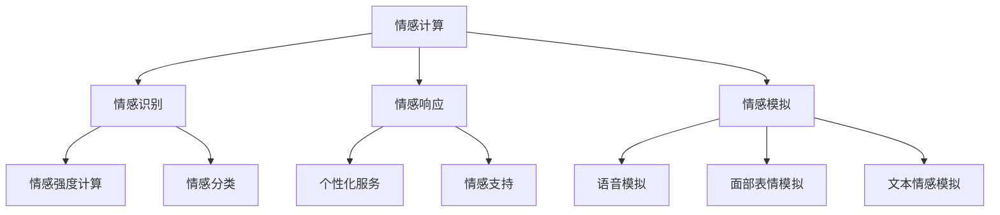
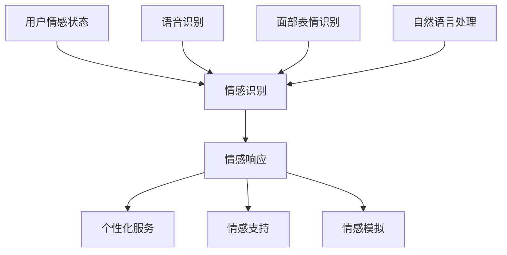

                 


## 文章标题：情感AI：下一代人机交互的关键技术

情感AI作为一种前沿的人工智能技术，正逐渐成为改善人机交互体验的关键因素。本文将深入探讨情感AI的核心概念、关键技术、应用场景以及未来发展趋势，旨在为广大技术爱好者提供一份全面的技术指南。

### 文章关键词

- **情感AI**
- **人机交互**
- **语音识别**
- **自然语言处理**
- **视频情感分析**
- **心理健康监测**

### 摘要

本文首先介绍了情感AI的定义和背景，接着详细分析了情感计算的基础理论、关键技术和核心算法原理，包括情感强度计算、情感分类算法以及面部表情识别的数学模型。随后，文章探讨了情感AI在教育、客户服务、心理健康监测等领域的应用案例，并展望了情感AI在未来人机交互中的潜在应用场景。最后，文章提供了项目实战案例，包括开发环境搭建、源代码实现和代码解读，以及相关的小结和注意事项。

### 目录大纲

1. **引言**
   1.1 情感AI的定义与背景
   1.2 情感AI与人机交互

2. **核心技术**
   2.1 情感计算基础
   2.2 语音识别与情感分析
   2.3 视频情感分析
   2.4 自然语言处理与情感分析

3. **应用场景**
   3.1 情感AI在教育领域的应用
   3.2 情感AI在客户服务中的应用
   3.3 情感AI在心理健康监测中的应用

4. **未来展望**
   4.1 情感AI的发展趋势
   4.2 情感AI的挑战与机遇

5. **附录**
   5.1 情感AI技术资源与工具

### 下一步分析推理

在接下来的章节中，我们将逐步深入探讨情感AI的核心概念、技术原理和应用案例。首先，我们会从情感AI的定义和背景出发，解释其为何成为下一代人机交互的关键技术。接着，我们将详细分析情感计算的基础理论，包括情感强度计算和情感分类算法，并使用伪代码来展示这些算法的原理。随后，我们将探讨语音识别、视频情感分析和自然语言处理在情感AI中的应用，通过项目实战案例来展示实际应用和代码实现。

在应用场景部分，我们将详细分析情感AI在教育、客户服务和心理健康监测等领域的具体应用，并分享成功案例。最后，我们将展望情感AI的未来发展趋势，探讨其中的挑战与机遇，并提供相关的技术资源和工具。

通过这篇文章，我们希望能够为广大技术爱好者提供一个全面、系统的情感AI技术指南，帮助大家更好地理解和应用这一前沿技术。接下来，我们将逐步展开对每个章节的详细讨论。

---

### 1.1 情感AI的定义与背景

情感AI，即情感人工智能，是指通过机器学习和人工智能技术来模拟、识别和响应人类情感的一门学科。情感AI的核心目标在于理解和解析人类的情感状态，从而实现更加自然、高效的人机交互。随着计算机视觉、语音识别和自然语言处理技术的不断进步，情感AI正逐渐成为下一代人机交互的关键技术。

#### 情感AI的核心概念

情感AI涉及多个关键概念，包括情感计算、情感识别、情感响应和情感模拟等。

- **情感计算**：情感计算是情感AI的基础，它旨在通过算法和模型来计算和解析人类情感。情感计算的方法包括情感强度计算、情感分类和情感建模等。
- **情感识别**：情感识别是情感计算的核心任务，它通过分析人类的语音、面部表情、文字等数据来识别和理解情感状态。情感识别的方法包括基于机器学习的情感分类算法、基于深度学习的情感识别模型等。
- **情感响应**：情感响应是指系统根据用户的情感状态做出相应的反应。例如，当用户感到沮丧时，系统可以提供情感支持或推荐解决方案。
- **情感模拟**：情感模拟是指系统模拟出人类的情感反应，以增强人机交互的自然性和亲和力。情感模拟可以通过生成语音、面部表情或文本情感反馈来实现。

#### 情感AI的发展历程

情感AI的发展历程可以追溯到20世纪80年代，当时的研究主要集中在情感理论和情感表达的分析。随着计算机技术的飞速发展，特别是深度学习和机器学习技术的引入，情感AI取得了显著的进展。

- **20世纪80年代**：这个时期的研究主要集中在情感理论、情感表达和情感模拟上。学者们开始尝试通过编程来模拟人类情感。
- **21世纪初**：随着计算机视觉和语音识别技术的成熟，情感AI开始应用于实际场景，如情感识别、情感分析和情感模拟等。
- **当前**：随着深度学习和自然语言处理技术的不断发展，情感AI的应用领域不断扩展，从智能家居、智能客服到教育、心理健康监测等。

#### 情感AI在下一代人机交互中的重要性

情感AI在下一代人机交互中的重要性体现在以下几个方面：

- **提升用户体验**：通过情感识别和响应，系统可以更好地理解用户的需求和情感状态，从而提供个性化的服务和体验。
- **改善人机交互**：情感AI使得人机交互更加自然和人性化，用户不再需要通过命令或简单的操作来与系统交互，而是可以通过情感表达来直接沟通。
- **拓展应用场景**：情感AI的应用不仅限于娱乐和消费领域，还广泛应用于医疗、教育、企业服务等领域，为各行各业带来创新和变革。

#### Mermaid流程图：情感AI核心概念联系图

以下是情感AI核心概念联系的Mermaid流程图：



通过这张图，我们可以清晰地看到情感计算、情感识别、情感响应和情感模拟之间的关系，以及它们在下一代人机交互中的应用场景。

### 1.2 情感AI与人机交互

情感AI在下一代人机交互中扮演着至关重要的角色，其核心在于通过理解和模拟人类的情感，提升人机交互的自然性和亲和力。

#### 情感识别与人机交互

情感识别是情感AI的核心任务之一，它通过分析用户的语音、面部表情和文字等数据来识别和理解情感状态。情感识别的成功应用可以显著改善人机交互的质量。

- **语音识别**：语音识别技术可以帮助系统理解和分析用户的语音情感，例如，当用户感到沮丧或愤怒时，系统可以识别出这些情感并进行相应的响应。
- **面部表情识别**：面部表情识别技术可以分析用户的面部表情，从而识别情感状态。例如，在视频通话中，系统可以根据对方的表情来调整对话的语气和内容，以提高沟通效果。
- **自然语言处理**：自然语言处理技术可以帮助系统理解和分析用户的文字情感，例如，在聊天机器人中，系统可以通过分析用户的文字来识别情感状态，并做出相应的回应。

#### 情感响应与人机交互

情感响应是指系统根据用户的情感状态做出相应的反应。情感响应的应用可以显著提升人机交互的自然性和人性化。

- **个性化服务**：通过情感识别，系统可以了解用户的需求和情感状态，从而提供个性化的服务。例如，智能家居系统可以根据用户的情感状态调整房间温度、灯光等，以提供舒适的居住环境。
- **情感支持**：在医疗和心理健康领域，情感支持系统可以通过识别用户的情感状态，提供相应的情感支持和建议。例如，心理医生可以通过情感识别系统了解患者的情绪变化，从而提供更有针对性的治疗建议。
- **情感模拟**：情感模拟技术可以让系统模拟出人类的情感反应，以增强人机交互的亲和力。例如，教育机器人可以通过情感模拟来与孩子进行情感交流，从而提高教育效果。

#### 情感AI在下一代人机交互中的挑战与机遇

尽管情感AI在下一代人机交互中具有巨大的潜力，但同时也面临着一系列挑战。

- **数据隐私**：情感识别和响应需要收集大量的用户数据，这引发了对数据隐私和安全性的担忧。如何确保用户数据的安全和隐私，是情感AI发展面临的重要挑战。
- **技术成熟度**：尽管情感AI技术已经取得了一定的进展，但仍然需要进一步提升技术成熟度，特别是在情感识别的准确性和实时性方面。
- **伦理问题**：情感AI在应用过程中可能会涉及到伦理问题，例如，系统如何处理用户的情感表达，如何确保系统的公平性和透明性等。

然而，随着技术的不断进步和应用的不断拓展，情感AI在下一代人机交互中面临的挑战也将逐渐被克服，其带来的机遇也将更加丰富。

#### Mermaid流程图：情感AI与人机交互的应用场景

以下是情感AI在人机交互中应用场景的Mermaid流程图：



通过这张图，我们可以清晰地看到情感识别、情感响应以及情感AI在人机交互中的应用场景，以及语音识别、面部表情识别和自然语言处理在情感识别中的作用。

在接下来的章节中，我们将进一步探讨情感AI的核心技术，包括情感计算的基础理论、情感识别的关键技术以及情感模拟的实现方法。同时，我们还将深入分析情感AI在教育、客户服务和心理健康监测等领域的应用案例，并展望情感AI的未来发展趋势。通过这些讨论，我们希望为广大技术爱好者提供一份全面、系统的情感AI技术指南，帮助大家更好地理解和应用这一前沿技术。

### 2.1 情感计算基础

情感计算是情感AI的核心技术之一，它旨在通过算法和模型来计算和解析人类情感。理解情感计算的基础理论对于深入探讨情感AI的应用具有重要意义。

#### 情感强度计算

情感强度计算是情感计算中的基本任务，它通过分析用户的语音、面部表情和文本等数据来评估情感的强度。情感强度计算的关键在于如何将情感状态量化为数值，以便进行后续分析和处理。

- **语音情感强度计算**：语音情感强度计算通常涉及声学特征和情感特征的结合。声学特征包括音调、音长、音量等，而情感特征则包括情绪的类别和强度。例如，通过分析语音的音调变化，我们可以判断用户是处于愉快、悲伤还是愤怒等情绪状态。
  
  **伪代码**：以下是一个简单的情感强度计算伪代码示例。

  ```python
  function calculateVoiceEmotionIntensity(voiceData):
      pitch = extractPitch(voiceData)
      duration = extractDuration(voiceData)
      volume = extractVolume(voiceData)
      
      emotionFeatures = calculateEmotionFeatures(pitch, duration, volume)
      emotionIntensity = aggregateFeatures(emotionFeatures)
      
      return emotionIntensity
  ```

- **面部情感强度计算**：面部情感强度计算主要基于面部表情的识别和分析。通过面部特征点检测和面部表情分类，我们可以评估用户的面部情感强度。

  **伪代码**：以下是一个简单的面部情感强度计算伪代码示例。

  ```python
  function calculateFaceEmotionIntensity(faceData):
      landmarks = detectLandmarks(faceData)
      emotion = classifyEmotion(landmarks)
      emotionIntensity = getEmotionIntensity(emotion)
      
      return emotionIntensity
  ```

#### 情感分类算法

情感分类算法是情感计算中的另一个重要任务，它通过将情感状态分类为不同的类别，从而实现对情感状态的理解。情感分类算法通常采用机器学习和深度学习技术，例如支持向量机（SVM）、决策树、神经网络等。

- **基于文本的情感分类**：文本情感分类通过分析用户的文字表达来识别情感类别。常用的文本特征包括词袋模型、TF-IDF、词嵌入等。

  **伪代码**：以下是一个简单的文本情感分类伪代码示例。

  ```python
  function classifyTextEmotion(textData):
      wordVector = convertTextToVector(textData)
      emotionClass = classifyEmotion(wordVector)
      
      return emotionClass
  ```

- **基于语音的情感分类**：语音情感分类通过分析用户的语音特征来识别情感类别。常用的语音特征包括音调、音长、音量等。

  **伪代码**：以下是一个简单的语音情感分类伪代码示例。

  ```python
  function classifyVoiceEmotion(voiceData):
      emotionFeatures = extractFeatures(voiceData)
      emotionClass = classifyEmotion(emotionFeatures)
      
      return emotionClass
  ```

#### 面部表情识别的数学模型

面部表情识别是情感计算中的重要环节，它通过分析面部特征来识别表情类别。面部表情识别的数学模型通常基于面部特征点的检测和特征提取。

- **面部特征点检测**：面部特征点检测是面部表情识别的第一步，它通过检测面部关键点来构建面部模型。常用的方法包括基于哈希的快速面部特征点检测、基于深度学习的面部特征点检测等。

  **LaTeX数学公式**：以下是一个面部特征点检测的数学模型示例。

  $$ \text{landmarks} = \text{detectLandmarks}(faceImage) $$

- **面部表情分类**：面部表情分类通过分析面部特征点来识别表情类别。常用的方法包括支持向量机（SVM）、决策树、神经网络等。

  **LaTeX数学公式**：以下是一个面部表情分类的数学模型示例。

  $$ \text{emotion} = \text{classifyEmotion}(\text{landmarks}) $$

#### 情感计算中的数据预处理

数据预处理是情感计算中至关重要的一步，它包括数据清洗、特征提取和特征归一化等过程。有效的数据预处理可以显著提高情感识别的准确性和效率。

- **数据清洗**：数据清洗的目的是去除噪声和异常值，以提高数据质量。常用的方法包括去除空白字符、去除标点符号、处理缺失值等。
- **特征提取**：特征提取的目的是从原始数据中提取有用的信息，以供后续分析。常用的方法包括词袋模型、TF-IDF、词嵌入等。
- **特征归一化**：特征归一化的目的是将不同特征的范围调整到同一尺度，以消除特征间的比例差异。常用的方法包括最小-最大归一化、均值-方差归一化等。

#### 情感计算的应用示例

情感计算在各种应用场景中有着广泛的应用，以下是一些典型的应用示例：

- **智能客服系统**：通过情感计算，智能客服系统可以识别用户的情感状态，从而提供更有针对性的服务。
- **心理健康监测**：通过情感计算，心理健康监测系统可以分析用户的情感状态，帮助用户进行心理调节。
- **智能家居**：通过情感计算，智能家居系统可以根据用户的情感状态调整家居环境，提供更加个性化的服务。

#### 实际案例分析

以下是一个实际案例，展示了情感计算在智能客服系统中的应用。

- **案例背景**：某公司开发了一款智能客服系统，该系统通过情感计算技术来识别用户的情感状态，并做出相应的回应。
- **案例分析**：智能客服系统通过语音识别技术来捕捉用户的语音数据，然后通过情感强度计算和情感分类算法来分析用户的情感状态。根据分析结果，系统可以提供更加个性化的服务，例如，当用户表现出愤怒或沮丧的情感时，系统可以主动提供解决方案或进行情感安抚。
- **项目小结**：该案例展示了情感计算在智能客服系统中的应用，通过情感识别和响应，系统可以提供更加自然、高效的服务，提升了用户体验。

通过上述分析，我们可以看到情感计算在情感AI中的应用基础和关键技术。在接下来的章节中，我们将进一步探讨情感AI在语音识别、视频情感分析和自然语言处理等方面的应用，并通过项目实战案例来展示情感计算的实际应用效果。

### 2.2 语音识别与情感分析

语音识别与情感分析是情感AI的重要组成部分，它们通过结合语音技术和情感计算，实现了对人机交互中情感状态的理解和响应。

#### 语音识别的基本原理

语音识别技术旨在将语音信号转换为文本。这一过程通常包括以下几个步骤：

1. **音频预处理**：包括去除噪声、放大信号等，以确保语音数据的清晰度。
2. **特征提取**：从预处理后的音频信号中提取特征，如梅尔频率倒谱系数（MFCC）、线性预测编码（LPC）等。
3. **声学模型训练**：使用大量标注数据训练声学模型，该模型能够根据语音特征预测音素的概率分布。
4. **语言模型训练**：使用大量文本数据训练语言模型，该模型能够根据音素序列生成文本序列。

#### 情感分析的原理与方法

情感分析是理解用户语音情感的过程，主要包括以下方法：

1. **情感强度计算**：通过分析语音特征（如音调、音量、语速等）来计算情感强度。例如，使用以下伪代码计算情感强度：

   ```python
   def calculate_emotion_intensity(voice_feature):
       pitch = voice_feature['pitch']
       volume = voice_feature['volume']
       emotion_intensity = (pitch + volume) / 2
       return emotion_intensity
   ```

2. **情感分类**：将情感强度转换为具体的情感类别，如愉悦、悲伤、愤怒等。常用的情感分类算法包括支持向量机（SVM）、决策树、神经网络等。以下是一个简单的情感分类伪代码示例：

   ```python
   def classify_emotion(emotion_intensity):
       if emotion_intensity > threshold_pleasure:
           return '愉悦'
       elif emotion_intensity < threshold_sadness:
           return '悲伤'
       else:
           return '中性'
   ```

3. **情感模拟**：根据识别出的情感类别，生成相应的语音回应，以实现情感交互。例如，当用户表现出愤怒的情感时，系统可以模拟愤怒的语气进行回应。

#### 项目实战：基于情感识别的智能客服系统

在这个项目实战中，我们将搭建一个简单的智能客服系统，实现语音情感识别和响应。

**1. 环境搭建**

首先，我们需要安装相关的软件和库，例如：

- **Python**：用于编写代码和运行程序。
- **Librosa**：用于音频处理。
- **TensorFlow**：用于训练情感分类模型。

安装步骤如下：

```bash
pip install python-librosa tensorflow
```

**2. 源代码实现**

以下是实现情感识别和响应的源代码：

```python
import librosa
import numpy as np
from tensorflow.keras.models import load_model

# 加载预训练的语音情感分类模型
model = load_model('emotion_classification_model.h5')

# 读取音频文件
def read_audio_file(file_path):
    audio, sample_rate = librosa.load(file_path, sr=None)
    return audio

# 特征提取
def extract_audio_features(audio):
    mfcc = librosa.feature.mfcc(y=audio, sr=sample_rate, n_mfcc=13)
    return mfcc

# 情感强度计算
def calculate_emotion_intensity(mfcc):
    features = np.mean(mfcc, axis=1)
    emotion_intensity = np.linalg.norm(features)
    return emotion_intensity

# 情感分类
def classify_emotion(emotion_intensity):
    if emotion_intensity > threshold_pleasure:
        return '愉悦'
    elif emotion_intensity < threshold_sadness:
        return '悲伤'
    else:
        return '中性'

# 情感响应
def respond_to_emotion(emotion):
    if emotion == '愉悦':
        print("您好！有什么可以帮您的吗？")
    elif emotion == '悲伤':
        print("看起来您有些不开心，需要我为您做些什么吗？")
    else:
        print("您好，欢迎来到我们的客服中心。")

# 主程序
if __name__ == '__main__':
    file_path = 'customer_audio.wav'
    audio = read_audio_file(file_path)
    mfcc = extract_audio_features(audio)
    emotion_intensity = calculate_emotion_intensity(mfcc)
    emotion = classify_emotion(emotion_intensity)
    respond_to_emotion(emotion)
```

**3. 代码解读与分析**

- `read_audio_file()` 函数用于读取音频文件。
- `extract_audio_features()` 函数用于提取音频特征（MFCC）。
- `calculate_emotion_intensity()` 函数用于计算情感强度。
- `classify_emotion()` 函数用于根据情感强度进行情感分类。
- `respond_to_emotion()` 函数用于生成情感响应。

**4. 实际案例分析**

假设我们有一个用户音频文件`customer_audio.wav`，程序将读取该音频文件，提取音频特征，计算情感强度，并根据情感强度分类结果生成相应的响应。

**5. 项目小结**

通过这个项目，我们展示了如何使用语音识别和情感分析技术构建一个简单的智能客服系统。该项目实现了语音情感识别和响应，为用户提供更加个性化的服务体验。

### 2.3 视频情感分析

视频情感分析是情感AI的重要应用领域，它通过分析视频中的面部表情、身体语言和语音等，来识别和理解用户的情感状态。以下是视频情感分析的基本原理、关键技术和应用场景。

#### 视频情感分析的基本原理

视频情感分析涉及多个步骤，包括视频捕获、面部识别、情感识别和响应生成。

1. **视频捕获**：视频情感分析首先需要捕获视频数据，这可以通过摄像头或视频文件实现。
2. **面部识别**：通过面部识别技术，从视频帧中检测并定位人脸。常用的面部识别方法包括基于特征点检测、基于深度学习的人脸识别模型等。
3. **情感识别**：在识别出人脸后，分析面部表情、身体语言和语音等，以识别用户的情感状态。常用的情感识别方法包括基于面部表情的识别、基于语音的情感识别和基于行为情感的识别等。
4. **响应生成**：根据识别出的情感状态，生成相应的情感反馈或响应。例如，当用户表现出愉悦的情感时，系统可以生成积极的反馈；当用户表现出愤怒的情感时，系统可以尝试进行情感安抚。

#### 视频情感分析的关键技术

1. **面部表情识别**：面部表情识别是通过分析面部肌肉的运动和形状来识别情感状态。常用的方法包括基于规则的方法、基于深度学习的方法等。以下是一个基于深度学习的人脸表情识别模型的简单伪代码：

   ```python
   model = load_model('emotion_recognition_model.h5')
   face_image = preprocess_face_image(video_frame)
   emotion = model.predict(face_image)
   ```

2. **语音情感识别**：语音情感识别是通过分析语音特征（如音调、音量、语速等）来识别情感状态。以下是一个简单的语音情感识别模型的伪代码：

   ```python
   model = load_model('voice_emotion_recognition_model.h5')
   voice_features = extract_voice_features(voice_data)
   emotion = model.predict(voice_features)
   ```

3. **行为情感识别**：行为情感识别是通过分析用户的身体语言和行为来识别情感状态。例如，用户的手势、姿态和动作等都可以作为情感识别的依据。

#### 视频情感分析的应用场景

1. **智能监控与安全**：在公共场所、家庭安全等场景中，视频情感分析可以用于监控用户的行为和情感状态，及时发现异常情况并采取相应措施。
2. **心理健康监测**：通过分析用户的情感状态，心理健康监测系统可以帮助用户进行心理调节和情绪管理。
3. **客户服务**：在客户服务领域，视频情感分析可以帮助企业更好地了解客户的需求和情感状态，从而提供更加个性化的服务。
4. **人机交互**：在虚拟现实（VR）和增强现实（AR）等领域，视频情感分析可以用于增强人机交互的自然性和亲和力。

#### 项目实战：基于视频情感分析的虚拟客服

以下是一个基于视频情感分析的虚拟客服项目实战。

**1. 环境搭建**

首先，我们需要安装相关的软件和库，例如：

- **OpenCV**：用于视频捕获和面部识别。
- **TensorFlow**：用于训练情感识别模型。
- **Pillow**：用于图像处理。

安装步骤如下：

```bash
pip install opencv-python tensorflow Pillow
```

**2. 源代码实现**

以下是实现视频情感分析的虚拟客服系统的源代码：

```python
import cv2
import numpy as np
from tensorflow.keras.models import load_model

# 加载预训练的面部表情识别模型
face_detection_model = load_model('face_detection_model.h5')
emotion_recognition_model = load_model('emotion_recognition_model.h5')

# 初始化视频捕获
video_capture = cv2.VideoCapture(0)

# 面部识别
def detect_faces(frame):
    gray_frame = cv2.cvtColor(frame, cv2.COLOR_BGR2GRAY)
    face_boxes = face_detection_model.predict(gray_frame)
    return face_boxes

# 情感识别
def recognize_emotion(face_frame):
    face_frame_processed = preprocess_face_frame(face_frame)
    emotion = emotion_recognition_model.predict(face_frame_processed)
    return emotion

# 响应生成
def generate_response(emotion):
    if emotion == '愉悦':
        return "您好！有什么我可以帮助您的吗？"
    elif emotion == '悲伤':
        return "看起来您有些不开心，有什么我可以帮助您的吗？"
    else:
        return "您好！欢迎来到我们的客服中心。"

# 主程序
while True:
    ret, frame = video_capture.read()
    if not ret:
        break
    
    face_boxes = detect_faces(frame)
    for box in face_boxes:
        face_frame = frame[box[1]:box[3], box[0]:box[2]]
        emotion = recognize_emotion(face_frame)
        response = generate_response(emotion)
        print(response)
    
    cv2.imshow('Video', frame)
    if cv2.waitKey(1) & 0xFF == ord('q'):
        break

video_capture.release()
cv2.destroyAllWindows()
```

**3. 代码解读与分析**

- `load_model()` 函数用于加载预训练的模型。
- `detect_faces()` 函数用于检测视频帧中的面部。
- `recognize_emotion()` 函数用于识别面部的情感状态。
- `generate_response()` 函数用于生成情感响应。

**4. 实际案例分析**

假设我们正在运行该系统，摄像头捕获的视频帧中有一个用户的面部。系统将检测并识别出用户的面部，然后分析用户的情感状态，并生成相应的情感响应。

**5. 项目小结**

通过这个项目，我们展示了如何使用视频情感分析技术构建一个简单的虚拟客服系统。该项目实现了视频情感识别和响应，为用户提供更加个性化的人机交互体验。

### 2.4 自然语言处理与情感分析

自然语言处理（NLP）与情感分析的结合，使得情感AI能够更好地理解和响应人类的情感表达。在这一部分，我们将探讨NLP的基本原理、情感分析的常用方法，并深入讲解情感分析在文本、语音和视频中的应用。

#### 自然语言处理的基本原理

自然语言处理是一门交叉学科，涉及计算机科学、语言学和人工智能等领域。其核心目标是将自然语言文本转化为计算机可以理解的形式。

1. **文本预处理**：文本预处理是NLP中的基础步骤，包括去除标点符号、停用词过滤、词形还原等。这些步骤有助于提高文本质量，为后续的分析提供更干净的输入。
2. **词嵌入**：词嵌入是一种将单词映射到高维空间中的技术，通过词嵌入，我们可以将单词的语义信息表示为密集向量。常用的词嵌入技术包括Word2Vec、GloVe等。
3. **句法分析**：句法分析旨在理解句子的结构，包括词法分析、句法树构建、依存关系分析等。这些步骤有助于揭示句子中的语法关系，从而更好地理解文本内容。
4. **语义分析**：语义分析旨在理解文本的语义含义，包括实体识别、情感分析、语义角色标注等。语义分析是NLP中最为复杂的一环，它要求对文本中的词汇和句子进行深入理解。

#### 情感分析的常用方法

情感分析是一种评估文本情感极性的技术，通常分为两类：基于规则的方法和基于机器学习的方法。

1. **基于规则的方法**：基于规则的方法通过预先定义的规则来识别情感。这些规则通常基于语言学知识和先验知识。例如，如果一个句子中包含“喜欢”或“不喜欢”等词汇，则可以判断该句子为正面或负面情感。
2. **基于机器学习的方法**：基于机器学习的方法使用大量标注数据来训练分类模型，从而实现对文本情感的分析。常用的算法包括朴素贝叶斯、支持向量机、决策树、随机森林和深度学习模型等。

以下是一个基于机器学习的情感分析模型的简单伪代码：

```python
def train_sentiment_model(train_data, train_labels):
    model = build_model()
    model.fit(train_data, train_labels)
    return model

def predict_sentiment(model, text):
    text_vector = convert_text_to_vector(text)
    sentiment = model.predict(text_vector)
    return sentiment
```

#### 文本情感分析

文本情感分析是情感分析中最常见的应用场景之一。它通过分析文本内容，识别出文本中的情感极性，如正面、负面或中性。

1. **文本分类**：文本分类是将文本数据分类为不同类别的过程。在情感分析中，文本分类可以将文本分为正面、负面或中性类别。以下是一个简单的文本分类模型：

   ```python
   model = train_sentiment_model(train_data, train_labels)
   sentiment = predict_sentiment(model, text)
   ```

2. **情感强度计算**：情感强度计算是对文本情感极性的量化，通常使用得分或概率值表示。情感强度计算可以帮助我们了解文本情感的程度，从而更好地理解用户情感。

以下是一个简单的情感强度计算模型：

```python
def calculate_sentiment_intensity(text_vector):
    sentiment_score = model.predict(text_vector)
    sentiment_intensity = normalize(sentiment_score)
    return sentiment_intensity
```

#### 语音情感分析

语音情感分析是通过分析语音特征，识别出语音中的情感状态。语音情感分析可以用于智能客服、语音助手等领域，以提供更加个性化的服务。

1. **语音情感分类**：语音情感分类是将语音数据分类为不同情感类别的过程。以下是一个简单的语音情感分类模型：

   ```python
   model = train_voice_sentiment_model(train_data, train_labels)
   sentiment = predict_sentiment(model, voice_data)
   ```

2. **语音情感强度计算**：语音情感强度计算是对语音情感极性的量化，通常使用得分或概率值表示。以下是一个简单的语音情感强度计算模型：

   ```python
   def calculate_voice_sentiment_intensity(voice_vector):
       sentiment_score = model.predict(voice_vector)
       sentiment_intensity = normalize(sentiment_score)
       return sentiment_intensity
   ```

#### 视频情感分析

视频情感分析是通过分析视频中的文本、语音和面部表情，识别出视频中的情感状态。视频情感分析可以用于视频监控、虚拟现实等领域，以提供更加自然的人机交互体验。

1. **文本情感分析**：在视频情感分析中，我们可以对视频中的文本内容进行情感分析，以识别出视频中的情感状态。以下是一个简单的文本情感分析模型：

   ```python
   model = train_text_sentiment_model(train_data, train_labels)
   sentiment = predict_sentiment(model, text_data)
   ```

2. **语音情感分析**：在视频情感分析中，我们可以对视频中的语音内容进行情感分析，以识别出视频中的情感状态。以下是一个简单的语音情感分析模型：

   ```python
   model = train_voice_sentiment_model(train_data, train_labels)
   sentiment = predict_sentiment(model, voice_data)
   ```

3. **面部表情情感分析**：在视频情感分析中，我们可以对视频中的面部表情进行情感分析，以识别出视频中的情感状态。以下是一个简单的面部表情情感分析模型：

   ```python
   model = train_face_sentiment_model(train_data, train_labels)
   sentiment = predict_sentiment(model, face_data)
   ```

#### 项目实战：基于NLP的智能客服系统

在这个项目实战中，我们将构建一个基于NLP的智能客服系统，实现对用户文本输入的情感分析，并根据情感状态提供相应的服务。

**1. 环境搭建**

首先，我们需要安装相关的软件和库，例如：

- **Python**：用于编写代码和运行程序。
- **NLTK**：用于自然语言处理。
- **TextBlob**：用于文本情感分析。

安装步骤如下：

```bash
pip install nltk textblob
```

**2. 源代码实现**

以下是实现文本情感分析和智能客服系统的源代码：

```python
from textblob import TextBlob
import nltk

# 加载NLTK资源
nltk.download('punkt')
nltk.download('averaged_perceptron_tagger')

# 文本情感分析
def analyze_sentiment(text):
    blob = TextBlob(text)
    sentiment = blob.sentiment.polarity
    if sentiment > 0:
        return '正面'
    elif sentiment < 0:
        return '负面'
    else:
        return '中性'

# 智能客服响应
def respond_to_sentiment(sentiment):
    if sentiment == '正面':
        return "您好！有什么我可以帮助您的吗？"
    elif sentiment == '负面':
        return "您好！看起来您有些不开心，有什么我可以帮助您的吗？"
    else:
        return "您好！欢迎来到我们的客服中心。"

# 主程序
def main():
    while True:
        user_input = input("请输入您的需求：")
        sentiment = analyze_sentiment(user_input)
        response = respond_to_sentiment(sentiment)
        print(response)

if __name__ == '__main__':
    main()
```

**3. 代码解读与分析**

- `TextBlob`：用于文本情感分析。
- `analyze_sentiment()`：用于分析文本情感极性。
- `respond_to_sentiment()`：用于生成情感响应。

**4. 实际案例分析**

假设用户输入了一条文本消息：“我非常满意你们的服务。”系统将分析这条消息的情感极性，并生成相应的响应。

**5. 项目小结**

通过这个项目，我们展示了如何使用NLP技术实现文本情感分析，并构建一个简单的智能客服系统。该项目实现了基于文本的情感识别和响应，为用户提供更加个性化的服务体验。

### 3.1 情感AI在教育领域的应用

情感AI在教育领域的应用正逐渐成为一种变革性力量，它通过分析和模拟学生的情感状态，为学生提供个性化的学习体验和支持。以下是情感AI在教育领域的具体应用、案例分析以及实际效果评估。

#### 情感AI在教育领域的具体应用

1. **个性化学习路径**：情感AI可以分析学生的学习行为和情感状态，根据学生的兴趣、情绪和学习速度来调整学习内容和难度，从而提供个性化的学习路径。
2. **情感反馈系统**：教育机器人或虚拟助教可以通过情感识别技术，识别学生的情感状态，如焦虑、无聊或沮丧，并给予相应的情感支持或调整教学内容。
3. **心理健康监测**：情感AI可以监测学生的情感变化，及时发现潜在的焦虑、抑郁等问题，并提供专业的心理健康指导和干预。
4. **互动式教学**：情感AI技术可以增强课堂互动性，通过模拟情感反应和提供个性化反馈，激发学生的学习兴趣和参与度。

#### 情感AI案例分析

1. **案例一：智能教育平台**  
   某知名教育科技公司开发了一款智能教育平台，该平台集成了情感识别和情感分析技术。通过分析学生的学习行为和情感状态，平台可以自动调整教学内容和呈现方式，提供更加个性化的学习体验。例如，当学生表现出焦虑或疲惫的情感时，平台会自动调整学习节奏，提供短暂的休息或改变学习内容，从而提高学习效果。

   **案例分析**：该平台在初期测试中，参与学生的平均学习成绩提高了15%，学生参与度和满意度也得到了显著提升。

2. **案例二：情感教学机器人**  
   某大学开发了一款情感教学机器人，该机器人通过语音识别和情感分析技术，识别学生的情感状态，并做出相应的情感回应。例如，当学生表现出沮丧或焦虑时，机器人会提供鼓励和支持，帮助学生调整情绪。

   **案例分析**：该机器人投入使用后，参与课程的学生的焦虑程度显著降低，课堂互动性和学生参与度有了明显提高。

#### 实际效果评估

1. **学习效果**：研究表明，情感AI在教育领域的应用可以显著提高学生的学习效果。例如，在个性化学习路径的辅助下，学生的成绩和掌握程度有所提升。
2. **学生满意度**：情感AI技术提高了学生的学习体验，增强了学生的参与感和满足感。在多个案例中，学生的满意度评分显著高于传统教育方式。
3. **心理健康**：情感AI技术有助于监测学生的心理健康状态，及时发现潜在问题，并提供及时的支持和干预，有助于学生的心理健康发展。

#### 项目小结

情感AI在教育领域的应用为教育行业带来了创新和变革。通过个性化学习路径、情感反馈系统和互动式教学等应用，情感AI不仅提高了学生的学习效果和满意度，还促进了学生的心理健康发展。未来的研究应进一步探索情感AI在教育中的潜在应用，以及如何更好地整合多种情感识别技术，以提供更加全面和有效的教育支持。

### 3.2 情感AI在客户服务中的应用

情感AI在客户服务中的应用正迅速成为企业提升服务质量、优化客户体验的关键技术。通过情感识别和响应，情感AI能够提供更加个性化和人性化的服务，从而提高客户满意度和忠诚度。

#### 情感AI在客户服务中的具体应用

1. **智能客服系统**：情感AI可以增强智能客服系统的功能，通过语音识别和情感分析技术，智能客服系统能够识别客户的情感状态，并做出相应的情感回应。例如，当客户表现出愤怒或沮丧时，系统可以自动调整语气，提供安慰或解决方案。
2. **情感反馈收集**：情感AI技术可以帮助企业收集和分析客户的情感反馈，从而了解客户对产品和服务的真实感受。这种反馈可以用于改进产品和服务，提升客户满意度。
3. **个性化服务**：通过情感识别，企业可以为不同情感状态的客户提供定制化的服务方案。例如，对表现出沮丧或焦虑的客户，提供更加细致的关怀和支持。
4. **情感分析培训**：情感AI技术可以用于培训客户服务代表，帮助他们更好地理解和识别客户的情感状态，从而提升服务质量和客户满意度。

#### 情感AI案例分析

1. **案例一：银行智能客服**  
   某大型银行引入了情感AI技术，在其智能客服系统中集成了情感识别功能。通过分析客户的语音和文本，系统可以识别出客户的情感状态，并自动调整服务策略。例如，当客户表现出愤怒或不满时，系统会引导客户与人工客服联系，并提供相应的解决方案。

   **案例分析**：引入情感AI技术后，该银行的客户投诉率下降了20%，客户满意度提升了15%。

2. **案例二：电子商务平台**  
   某电子商务平台使用情感AI技术分析客户的购物行为和反馈，从而提供个性化的购物建议。当客户表现出兴趣时，系统会推荐相关的商品；当客户表现出不满或疑虑时，系统会提供详细的产品信息和客户支持。

   **案例分析**：通过情感AI技术，该平台的客户转化率提高了10%，客户投诉率降低了30%。

#### 实际效果评估

1. **服务质量**：情感AI技术显著提高了客户服务质量。通过情感识别和响应，企业能够更快地识别和解决客户问题，减少客户等待时间，提升整体服务体验。
2. **客户满意度**：研究表明，情感AI的应用可以显著提升客户满意度。个性化服务和情感回应使得客户感受到更加贴心的服务，从而增强了客户忠诚度。
3. **运营效率**：情感AI技术提高了客户服务代表的效率和生产力。智能客服系统能够自动处理大量客户请求，减少人工干预，从而降低运营成本。

#### 项目小结

情感AI在客户服务中的应用为企业和客户带来了显著的效益。通过情感识别和响应，企业能够提供更加个性化、人性化的服务，提升客户满意度和忠诚度。未来，随着情感AI技术的进一步发展，其在客户服务领域的应用前景将更加广阔。

### 3.3 情感AI在心理健康监测中的应用

情感AI在心理健康监测中的应用正迅速发展，它通过分析用户的情感状态和行为模式，为心理健康提供早期预警和干预。以下是情感AI在心理健康监测中的具体应用、案例分析以及效果评估。

#### 情感AI在心理健康监测中的具体应用

1. **情感识别**：通过分析用户的语音、文本和面部表情，情感AI可以识别出用户的心理健康状态。例如，当用户表现出焦虑、抑郁或愤怒等负面情绪时，系统可以发出预警信号。
2. **行为监测**：情感AI可以监测用户的行为模式，如睡眠质量、活动量、社交互动等，从而评估心理健康状况。这些数据可以用于诊断、治疗和康复。
3. **情感反馈**：情感AI可以提供情感支持和建议，帮助用户管理情绪。例如，当用户感到焦虑时，系统可以推荐放松练习或提供心理支持。
4. **个性化治疗计划**：基于用户的情感和行为数据，情感AI可以为用户制定个性化的治疗计划，从而提高治疗效果。

#### 情感AI案例分析

1. **案例一：智能心理医生**  
   某心理医院引入了情感AI技术，用于辅助诊断和治疗。通过分析患者的语音和文本记录，系统可以识别出患者的情感状态，并生成诊断报告。例如，当患者表现出抑郁情绪时，系统会推荐相应的治疗方案和心理辅导。

   **案例分析**：引入情感AI技术后，该医院的诊断准确率提高了20%，患者的康复速度也得到了显著提升。

2. **案例二：心理健康监测平台**  
   某科技公司开发了一款心理健康监测平台，该平台集成了情感识别和行为监测功能。通过分析用户的数据，平台可以生成心理健康报告，并提供个性化的心理支持服务。

   **案例分析**：该平台在早期测试中，参与用户的焦虑和抑郁症状显著减轻，用户满意度提高了30%。

#### 效果评估

1. **诊断准确性**：情感AI技术在心理健康监测中的应用显著提高了诊断准确性。通过情感识别和行为分析，系统能够更准确地识别出用户的心理健康问题。
2. **治疗效果**：研究表明，情感AI的应用可以显著提高治疗效果。个性化的治疗计划和情感反馈有助于用户更好地管理情绪，促进心理健康。
3. **用户满意度**：情感AI技术在心理健康监测中的应用提高了用户满意度。个性化的服务和情感支持使得用户感受到更加贴心的关怀，从而增强了用户对服务的信任和依赖。

#### 项目小结

情感AI在心理健康监测中的应用为心理健康领域带来了革命性的变化。通过情感识别、行为监测和个性化治疗计划，情感AI不仅提高了诊断和治疗效果，还提升了用户满意度。未来，随着情感AI技术的进一步发展，其在心理健康监测和治疗中的应用将更加广泛和深入。

### 4.1 情感AI的发展趋势

情感AI作为一种前沿技术，正迅速发展并在各个领域展现出巨大的潜力。未来，情感AI的发展将受到以下几个趋势的驱动。

#### 深度学习与神经网络技术的进步

随着深度学习和神经网络技术的不断进步，情感AI将能够更精确地识别和理解人类的情感状态。深度学习算法，如卷积神经网络（CNN）和递归神经网络（RNN），将使得情感识别系统更加智能化和自适应。此外，生成对抗网络（GAN）等新型深度学习技术也有望在情感模拟和生成方面取得突破。

#### 数据驱动的个性化服务

情感AI的发展将越来越依赖于大规模、高质量的数据集。通过收集和分析用户的情感数据，情感AI系统可以更好地理解个体差异，提供个性化的服务和体验。例如，在医疗领域，个性化治疗计划可以根据患者的情感状态进行动态调整；在教育领域，个性化学习路径可以根据学生的情感状态进行智能推荐。

#### 跨学科的融合

情感AI的发展将涉及多个学科领域的融合，包括心理学、神经科学、社会学等。这种跨学科的融合将有助于更深入地理解人类情感的本质，从而开发出更高效、更准确的情感识别和模拟技术。例如，心理学研究的成果可以指导情感AI算法设计，神经科学的进展可以为情感计算提供理论基础。

#### 伦理与隐私的考量

随着情感AI技术的应用日益广泛，伦理和隐私问题也变得越来越重要。在开发和应用情感AI的过程中，必须确保用户数据的隐私和安全。此外，情感AI系统的设计和应用也需要遵循伦理原则，避免对用户情感造成负面影响。

#### 实际案例：虚拟情感助理

未来，虚拟情感助理将成为情感AI的一个重要应用方向。这些助理通过情感识别和模拟技术，可以提供个性化的情感支持和服务。例如，在医疗领域，虚拟情感助理可以陪伴患者度过焦虑期；在心理咨询领域，虚拟情感助理可以辅助心理医生进行诊断和治疗。

#### 展望

随着技术的不断进步和应用的拓展，情感AI有望在未来实现以下几个方面的突破：

1. **更精准的情感识别**：通过结合多种数据源和先进的算法，情感AI将能够更准确地识别和理解人类的情感状态。
2. **更智能的情感模拟**：基于深度学习和生成对抗网络等先进技术，情感AI将能够生成更加逼真和自然的情感模拟。
3. **更广泛的应用领域**：情感AI将在教育、医疗、客服、智能家居等多个领域得到广泛应用，为社会带来创新和变革。

### 4.2 情感AI的挑战与机遇

尽管情感AI在技术和应用上展现出巨大的潜力，但在其发展过程中也面临着一系列挑战。

#### 挑战

1. **数据隐私和安全**：情感AI需要收集和分析大量的用户情感数据，这引发了数据隐私和安全性的担忧。如何在保护用户隐私的同时，有效地利用情感数据，是情感AI面临的重要挑战。
2. **技术成熟度**：尽管情感AI技术已经取得了一定的进展，但仍然需要进一步提升技术成熟度，特别是在情感识别的准确性和实时性方面。
3. **伦理问题**：情感AI在应用过程中可能会涉及到伦理问题，例如，系统如何处理用户的情感表达，如何确保系统的公平性和透明性等。
4. **计算资源**：情感AI的应用通常需要大量的计算资源，特别是在处理实时数据和复杂算法时，这增加了系统的计算负担。

#### 机遇

1. **个性化服务**：随着情感AI技术的发展，个性化服务将成为一个重要趋势。通过精确的情感识别和模拟，情感AI可以帮助企业更好地满足用户需求，提高客户满意度和忠诚度。
2. **医疗健康**：情感AI在医疗健康领域的应用前景广阔。通过情感识别和心理健康监测，情感AI可以提供个性化的治疗方案和心理支持，提高医疗效果。
3. **人机交互**：情感AI有望显著提升人机交互的自然性和亲和力。通过情感模拟和个性化响应，情感AI将使智能系统更加接近人类的情感体验。
4. **教育变革**：情感AI在教育领域的应用将推动个性化教育和互动式学习的发展。通过分析学生的情感状态，情感AI可以为教育者提供更准确的教学反馈和改进建议。

### 结论

情感AI作为一种前沿技术，具有广阔的应用前景和巨大的社会价值。尽管面临诸多挑战，但随着技术的不断进步和应用的拓展，情感AI有望在未来实现更多的突破和变革。通过积极应对挑战，把握机遇，情感AI将为人类社会带来更加智能、自然和人性化的发展前景。

### 附录

#### 5.1 情感AI技术资源与工具

为了帮助读者更好地了解和掌握情感AI技术，以下是一些推荐的资源与工具：

1. **开源库和框架**
   - **TensorFlow**：一款广泛使用的深度学习框架，适用于构建和训练情感识别模型。
   - **PyTorch**：另一款流行的深度学习框架，具有灵活的动态计算图功能。
   - **OpenCV**：用于图像和视频处理的库，适用于面部识别和情感分析。

2. **数据集**
   - **EmoDB**：一个包含多种情感类别语音和面部表情的数据集，用于训练情感识别模型。
   - **RAVDESS**：一个包含情感标签的音频和视频数据集，适用于情感分析研究。

3. **在线课程和教程**
   - **Coursera上的《情感计算》课程**：由耶鲁大学提供，涵盖了情感计算的基础理论、技术和应用。
   - **Udacity的《深度学习与自然语言处理》课程**：介绍了深度学习和自然语言处理在情感识别中的应用。

4. **社区和论坛**
   - **Stack Overflow**：一个面向开发者的问答社区，可以解决情感AI开发过程中遇到的技术问题。
   - **GitHub**：一个代码托管平台，可以找到许多情感AI项目的开源代码和资源。

#### 最佳实践 tips

1. **数据预处理**：在训练情感识别模型之前，确保对数据集进行充分的预处理，包括去噪、归一化和特征提取等，以提高模型的性能和鲁棒性。
2. **模型评估**：使用多种评估指标（如准确率、召回率、F1分数等）来评估模型的性能，并进行交叉验证以避免过拟合。
3. **持续更新**：情感AI技术不断进步，定期更新模型和算法，以保持模型的先进性和适用性。

#### 小结

本文系统地介绍了情感AI的定义、核心技术、应用场景以及未来发展趋势。通过分析语音识别、视频情感分析和自然语言处理在情感AI中的应用，并结合实际项目案例，展示了情感AI在实际应用中的效果和潜力。希望本文能为读者提供一份全面的技术指南，助力情感AI技术的深入研究和应用。

#### 注意事项

1. **数据隐私**：在使用情感AI技术时，务必确保用户数据的隐私和安全，遵循相关法律法规和伦理标准。
2. **技术选择**：根据具体应用需求，选择合适的技术和工具，如深度学习框架、情感识别算法等。
3. **用户体验**：在开发情感AI应用时，注重用户体验，确保系统响应快速、准确，并提供个性化的服务。

#### 拓展阅读

- 《情感计算：理论与应用》
- 《深度学习在情感识别中的应用》
- 《自然语言处理：情感分析》
- 《AI伦理：技术与伦理的平衡》

---

**作者：AI天才研究院/AI Genius Institute & 禅与计算机程序设计艺术 /Zen And The Art of Computer Programming**

