                 

### 文章标题

《意义的个人建构与社会影响》

### 关键词

- 意义的建构
- 个人心理过程
- 社会互动
- 社会规范
- 社会变迁
- 实践应用

### 摘要

本文旨在探讨意义的个人建构与社会影响这一核心主题。首先，我们将从个人建构的角度出发，详细分析意义的建构理论、心理过程以及社会文化因素。接着，我们将转向意义建构在社会层面上的影响，探讨社会互动、社会规范和社会变迁等方面。最后，我们将结合实际案例，探讨意义的建构在心理健康、社会问题和文化多样性等领域的应用。通过这篇文章，我们希望能够为读者提供对意义建构与社会影响这一复杂问题的深入理解和思考。

----------------------------------------------------------------

## 第一部分：意义的个人建构

### 1.1 个人建构的概念与理论

**核心概念与联系**

意义的建构是个体对经验进行组织、解释和赋予意义的过程。这个过程涉及多个核心概念，如感知、认知、情感等。以下是一个Mermaid流程图，展示了这些概念之间的关系：

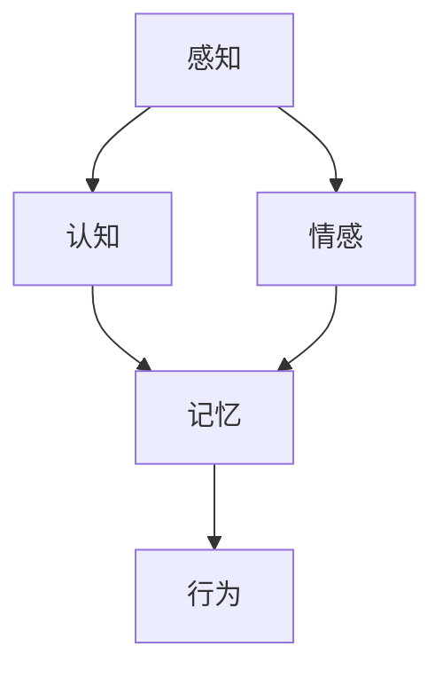

- **感知**：个体通过感官接收外部信息。
- **认知**：个体对感知信息进行加工、存储和提取。
- **情感**：个体对认知信息产生情感体验。
- **记忆**：个体将情感和认知信息存储在长期记忆中。
- **行为**：个体根据记忆中的信息和情感体验采取行动。

**核心算法原理讲解**

意义的建构过程可以被视为一种信息处理过程，其核心算法原理包括：

```plaintext
算法：意义建构
输入：感知信息、认知结构、情感状态
输出：意义构建结果

步骤：
1. 感知信息进入感知系统，进行初步处理。
2. 初步处理后的信息传递给认知系统，进行深度加工。
3. 认知系统对信息进行分类、存储和提取。
4. 情感系统对认知信息进行评估，产生情感体验。
5. 情感体验与认知信息结合，形成意义构建结果。
6. 意义构建结果指导个体的行为。
```

**数学模型和公式讲解**

为了更深入地理解意义的建构过程，我们可以使用以下数学模型和公式：

$$
M = f(P, C, E)
$$

其中，$M$代表意义构建结果，$P$代表感知信息，$C$代表认知结构，$E$代表情感状态，$f$代表意义构建函数。该公式表明，意义构建是感知、认知和情感三者的综合结果。

**举例说明**

假设一个个体感知到一只猫，认知系统将猫的图像进行分类存储，情感系统对该图像产生喜爱之情。那么，这个个体对猫的意义构建结果就是一只可爱的猫。

### 1.2 个人建构的心理过程

**核心概念与联系**

个人建构的心理过程包括感知、认知和情感等多个方面。以下是一个Mermaid流程图，展示了这些概念之间的关系：


- **感知**：个体通过感官接收外部信息。
- **认知**：个体对感知信息进行加工、存储和提取。
- **情感**：个体对认知信息产生情感体验。
- **记忆**：个体将情感和认知信息存储在长期记忆中。
- **行为**：个体根据记忆中的信息和情感体验采取行动。

**核心算法原理讲解**

个人建构的心理过程可以被视为一种信息处理过程，其核心算法原理包括：

```plaintext
算法：个人建构心理过程
输入：感知信息、认知结构、情感状态
输出：心理过程结果

步骤：
1. 感知信息进入感知系统，进行初步处理。
2. 初步处理后的信息传递给认知系统，进行深度加工。
3. 认知系统对信息进行分类、存储和提取。
4. 情感系统对认知信息进行评估，产生情感体验。
5. 情感体验与认知信息结合，形成心理过程结果。
6. 心理过程结果指导个体的行为。
```

**数学模型和公式讲解**

为了更深入地理解个人建构的心理过程，我们可以使用以下数学模型和公式：

$$
M = f(P, C, E)
$$

其中，$M$代表心理过程结果，$P$代表感知信息，$C$代表认知结构，$E$代表情感状态，$f$代表心理过程函数。该公式表明，心理过程是感知、认知和情感三者的综合结果。

**举例说明**

假设一个个体感知到一只猫，认知系统将猫的图像进行分类存储，情感系统对该图像产生喜爱之情。那么，这个个体对猫的心理过程结果就是喜爱一只猫。

### 1.3 社会文化因素与个人建构

**核心概念与联系**

社会文化因素对个人建构有着深远的影响。以下是一个Mermaid流程图，展示了社会文化因素与个人建构之间的关系：

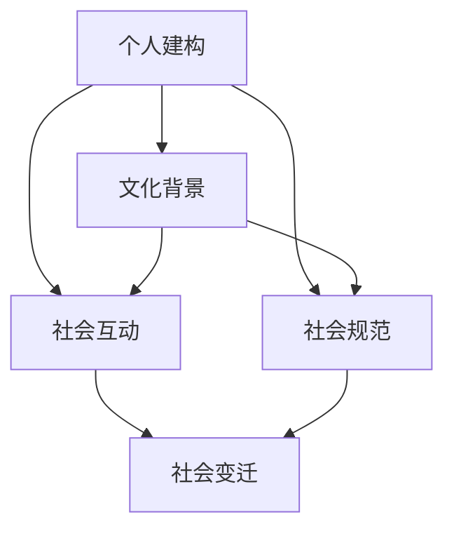

- **文化背景**：个体的文化背景对其建构过程产生影响。
- **社会互动**：个体在社会互动中建构意义。
- **社会规范**：社会规范影响个体的建构过程。
- **社会变迁**：社会变迁影响个体的建构过程。

**核心算法原理讲解**

社会文化因素对个人建构的影响可以被视为一种外部输入，其核心算法原理包括：

```plaintext
算法：社会文化因素影响个人建构
输入：文化背景、社会互动、社会规范
输出：个人建构结果

步骤：
1. 个体接收文化背景信息。
2. 个体参与社会互动，建构意义。
3. 个体遵守社会规范，影响建构过程。
4. 社会变迁影响个体的建构过程。
5. 文化背景、社会互动、社会规范和社会变迁共同作用，形成个人建构结果。
```

**数学模型和公式讲解**

为了更深入地理解社会文化因素对个人建构的影响，我们可以使用以下数学模型和公式：

$$
M = f(C, I, N, T)
$$

其中，$M$代表个人建构结果，$C$代表文化背景，$I$代表社会互动，$N$代表社会规范，$T$代表社会变迁，$f$代表建构函数。该公式表明，个人建构是文化背景、社会互动、社会规范和社会变迁的综合结果。

**举例说明**

假设一个个体出生在一个重视教育的社会背景下，参与社会互动时受到他人的尊重和鼓励，遵守社会规范并观察到社会变迁。那么，这个个体对教育的建构结果就是教育是一种提升个人价值和社会地位的重要途径。

### 1.4 个人建构的案例研究

**核心概念与联系**

个人建构的案例研究涉及多个核心概念，如个体经验、社会意义和建构过程等。以下是一个Mermaid流程图，展示了这些概念之间的关系：

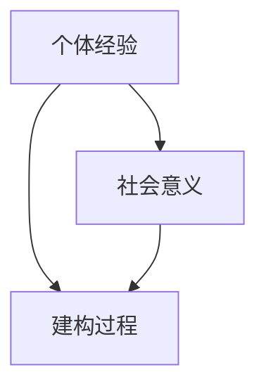

- **个体经验**：个体的生活经历对其建构过程产生影响。
- **社会意义**：个体对社会现象的建构和理解。
- **建构过程**：个体通过感知、认知和情感等过程建构意义。

**核心算法原理讲解**

个人建构的案例研究可以被视为一种信息处理过程，其核心算法原理包括：

```plaintext
算法：个人建构案例研究
输入：个体经验、社会意义、建构过程
输出：建构结果

步骤：
1. 收集个体经验，了解其生活背景。
2. 分析社会意义，理解个体对社会现象的看法。
3. 探索建构过程，了解个体如何组织和解释经验。
4. 综合个体经验、社会意义和建构过程，形成建构结果。
```

**数学模型和公式讲解**

为了更深入地理解个人建构的案例研究，我们可以使用以下数学模型和公式：

$$
M = f(E, S, P)
$$

其中，$M$代表建构结果，$E$代表个体经验，$S$代表社会意义，$P$代表建构过程，$f$代表建构函数。该公式表明，建构结果是个体经验、社会意义和建构过程的综合结果。

**举例说明**

假设一个个体经历了一次成功的事业晋升，社会意义是事业成功的重要标志，建构过程包括对晋升经历的回顾和反思。那么，这个个体对事业成功的建构结果就是事业成功是通过努力和智慧实现的。

### 1.5 意义建构的理论与实践应用

**核心概念与联系**

意义建构的理论与实践应用涉及多个核心概念，如心理健康、社会问题和跨文化建构等。以下是一个Mermaid流程图，展示了这些概念之间的关系：

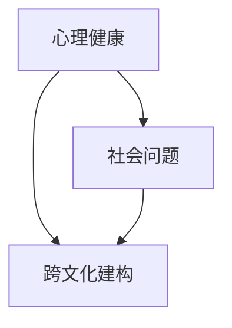

- **心理健康**：意义建构与心理健康密切相关。
- **社会问题**：意义建构在社会问题解决中发挥作用。
- **跨文化建构**：意义建构在不同文化背景下有所不同。

**核心算法原理讲解**

意义建构的理论与实践应用可以被视为一种跨学科整合过程，其核心算法原理包括：

```plaintext
算法：意义建构的理论与实践应用
输入：理论模型、实践案例、文化背景
输出：应用结果

步骤：
1. 确定理论模型，理解意义建构的基本原理。
2. 分析实践案例，了解意义建构在不同情境中的应用。
3. 考虑文化背景，适应不同文化环境下的意义建构。
4. 整合理论模型、实践案例和文化背景，形成应用结果。
```

**数学模型和公式讲解**

为了更深入地理解意义建构的理论与实践应用，我们可以使用以下数学模型和公式：

$$
M = f(T, C, P)
$$

其中，$M$代表应用结果，$T$代表理论模型，$C$代表文化背景，$P$代表实践案例，$f$代表应用函数。该公式表明，应用结果是理论模型、文化背景和实践案例的综合结果。

**举例说明**

假设一个心理学家使用意义建构理论来帮助患者解决心理问题，实践案例是患者的具体经历，文化背景是患者的文化环境。那么，这个心理学家对患者的治疗结果就是通过理解患者的意义建构过程，帮助他们重新构建积极的意义。

### 1.6 意义建构与心理健康

**核心概念与联系**

意义建构与心理健康之间存在密切联系。以下是一个Mermaid流程图，展示了这两个概念之间的关系：

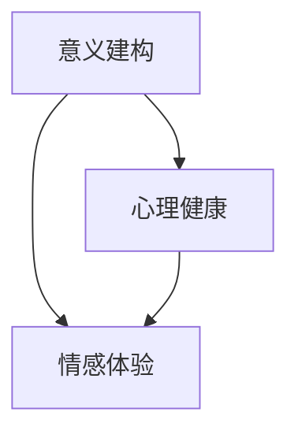

- **意义建构**：个体对经验的组织、解释和赋予意义的过程。
- **心理健康**：个体心理状态的健康和平衡。
- **情感体验**：意义建构过程中的情感体验对心理健康产生影响。

**核心算法原理讲解**

意义建构与心理健康的关系可以被视为一种相互影响的过程，其核心算法原理包括：

```plaintext
算法：意义建构与心理健康
输入：意义建构过程、心理健康状态
输出：心理健康结果

步骤：
1. 个体通过意义建构过程对经验进行组织和解释。
2. 意义建构过程中的情感体验影响心理健康状态。
3. 心理健康状况影响个体的意义建构过程。
4. 意义建构和心理健康相互影响，形成心理健康结果。
```

**数学模型和公式讲解**

为了更深入地理解意义建构与心理健康的关系，我们可以使用以下数学模型和公式：

$$
H = f(M, E)
$$

其中，$H$代表心理健康状态，$M$代表意义建构过程，$E$代表情感体验，$f$代表健康函数。该公式表明，心理健康状态是意义建构过程和情感体验的综合结果。

**举例说明**

假设一个个体在经历了一次失败之后，通过意义建构过程将失败视为成长的机会，情感体验是积极的。那么，这个个体的心理健康状态就是健康的。

### 1.7 意义建构与社会问题

**核心概念与联系**

意义建构与社会问题之间存在密切联系。以下是一个Mermaid流程图，展示了这两个概念之间的关系：

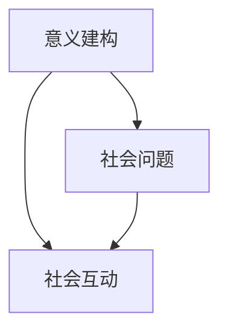

- **意义建构**：个体对经验的组织、解释和赋予意义的过程。
- **社会问题**：社会中存在的各种问题，如贫困、歧视、环境破坏等。
- **社会互动**：个体在社会互动中建构意义，解决社会问题。

**核心算法原理讲解**

意义建构与社会问题的关系可以被视为一种相互影响的过程，其核心算法原理包括：

```plaintext
算法：意义建构与社会问题
输入：意义建构过程、社会问题情境
输出：问题解决方案

步骤：
1. 个体通过意义建构过程对经验进行组织和解释。
2. 社会问题情境影响个体的意义建构过程。
3. 个体在社会互动中寻求解决问题的方法。
4. 意义建构和问题情境相互影响，形成问题解决方案。
```

**数学模型和公式讲解**

为了更深入地理解意义建构与社会问题的关系，我们可以使用以下数学模型和公式：

$$
S = f(M, P)
$$

其中，$S$代表问题解决方案，$M$代表意义建构过程，$P$代表社会问题情境，$f$代表问题解决函数。该公式表明，问题解决方案是意义建构过程和社会问题情境的综合结果。

**举例说明**

假设一个社区面临环境破坏的问题，个体通过意义建构过程将环境破坏视为一个严重的社会问题，并在社会互动中寻求解决方案。那么，这个社区对环境破坏的问题解决方案就是采取环保行动，共同保护环境。

### 1.8 意义建构与文化多样性

**核心概念与联系**

意义建构与文化多样性之间存在密切联系。以下是一个Mermaid流程图，展示了这两个概念之间的关系：

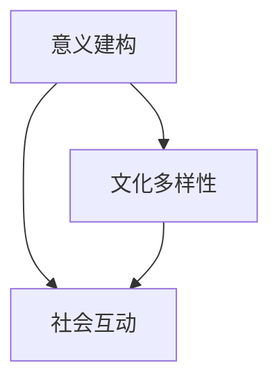

- **意义建构**：个体对经验的组织、解释和赋予意义的过程。
- **文化多样性**：不同文化之间的差异和多样性。
- **社会互动**：个体在社会互动中建构意义，适应文化多样性。

**核心算法原理讲解**

意义建构与文化多样性的关系可以被视为一种相互影响的过程，其核心算法原理包括：

```plaintext
算法：意义建构与文化多样性
输入：意义建构过程、文化多样性情境
输出：文化适应策略

步骤：
1. 个体通过意义建构过程对经验进行组织和解释。
2. 文化多样性情境影响个体的意义建构过程。
3. 个体在社会互动中寻求文化适应策略。
4. 意义建构和文化多样性情境相互影响，形成文化适应策略。
```

**数学模型和公式讲解**

为了更深入地理解意义建构与文化多样性的关系，我们可以使用以下数学模型和公式：

$$
A = f(M, D)
$$

其中，$A$代表文化适应策略，$M$代表意义建构过程，$D$代表文化多样性情境，$f$代表适应函数。该公式表明，文化适应策略是意义建构过程和文化多样性情境的综合结果。

**举例说明**

假设一个个体在一个多元文化的社区中生活，通过意义建构过程将文化多样性视为一种丰富的生活体验，并在社会互动中寻求适应策略。那么，这个个体对文化多样性的适应策略就是尊重和欣赏不同文化的独特之处。

### 1.9 意义建构的挑战与未来展望

**核心概念与联系**

意义建构的过程涉及多个挑战和未来展望。以下是一个Mermaid流程图，展示了这些概念之间的关系：

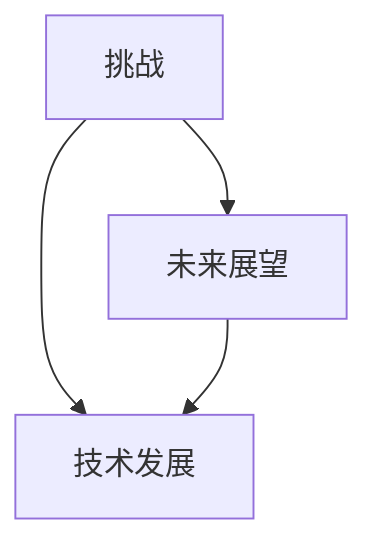

- **挑战**：意义建构过程中面临的各种难题。
- **未来展望**：意义建构技术的未来发展。
- **技术发展**：影响意义建构的技术进步。

**核心算法原理讲解**

意义建构的挑战与未来展望可以被视为一种动态变化的过程，其核心算法原理包括：

```plaintext
算法：意义建构的挑战与未来展望
输入：当前挑战、未来展望、技术发展
输出：解决方案与未来方向

步骤：
1. 识别当前意义建构面临的挑战。
2. 分析未来技术发展对意义建构的影响。
3. 探索解决方案，应对当前挑战。
4. 预测未来意义建构的发展方向。
```

**数学模型和公式讲解**

为了更深入地理解意义建构的挑战与未来展望，我们可以使用以下数学模型和公式：

$$
C = f(T, D)
$$

其中，$C$代表挑战，$T$代表技术发展，$D$代表当前状态，$f$代表挑战函数。该公式表明，挑战是技术发展和当前状态的综合结果。

$$
F = f(T, C)
$$

其中，$F$代表未来展望，$T$代表技术发展，$C$代表挑战，$f$代表展望函数。该公式表明，未来展望是技术发展和挑战的综合结果。

**举例说明**

假设当前意义建构面临技术发展的挑战，未来展望是技术进步将带来新的解决方案。那么，这个例子中解决方案就是利用新技术改进意义建构的过程，以应对当前的挑战。

## 第二部分：意义的社会影响

### 2.1 社会互动与意义建构

**核心概念与联系**

社会互动与意义建构之间存在密切联系。以下是一个Mermaid流程图，展示了这两个概念之间的关系：

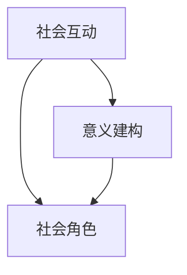

- **社会互动**：个体在社会环境中与他人交往的过程。
- **意义建构**：个体对经验的组织、解释和赋予意义的过程。
- **社会角色**：个体在社会互动中扮演的角色。

**核心算法原理讲解**

社会互动与意义建构的关系可以被视为一种相互影响的过程，其核心算法原理包括：

```plaintext
算法：社会互动与意义建构
输入：社会互动过程、意义建构过程
输出：共同意义建构结果

步骤：
1. 个体参与社会互动，获取互动经验。
2. 个体对互动经验进行意义建构。
3. 社会互动过程影响个体的意义建构。
4. 个体在社会互动中寻求共同意义建构。
```

**数学模型和公式讲解**

为了更深入地理解社会互动与意义建构的关系，我们可以使用以下数学模型和公式：

$$
M = f(I, S)
$$

其中，$M$代表共同意义建构结果，$I$代表社会互动过程，$S$代表意义建构过程，$f$代表建构函数。该公式表明，共同意义建构结果是社会互动过程和意义建构过程的综合结果。

**举例说明**

假设一个团队成员在会议中讨论一个项目，团队成员之间的互动和个人的意义建构过程共同形成了对项目的理解和共识。那么，这个团队对项目的共同意义建构结果就是对项目的目标和策略达成一致。

### 2.2 社会规范与意义建构

**核心概念与联系**

社会规范与意义建构之间存在紧密联系。以下是一个Mermaid流程图，展示了这两个概念之间的关系：

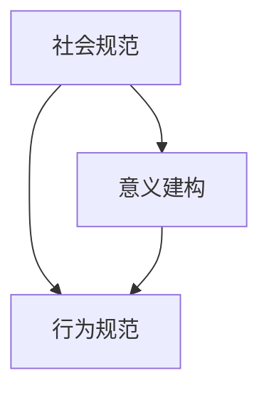

- **社会规范**：社会对个体行为的要求和期望。
- **意义建构**：个体对经验的组织、解释和赋予意义的过程。
- **行为规范**：社会规范对个体行为的指导和约束。

**核心算法原理讲解**

社会规范与意义建构的关系可以被视为一种相互影响的过程，其核心算法原理包括：

```plaintext
算法：社会规范与意义建构
输入：社会规范、意义建构过程
输出：规范指导下的意义建构结果

步骤：
1. 个体接收社会规范，了解行为要求。
2. 个体对经验进行意义建构，考虑社会规范。
3. 社会规范影响个体的意义建构过程。
4. 个体在社会规范指导下形成规范一致的意义建构结果。
```

**数学模型和公式讲解**

为了更深入地理解社会规范与意义建构的关系，我们可以使用以下数学模型和公式：

$$
M = f(N, P)
$$

其中，$M$代表规范指导下的意义建构结果，$N$代表社会规范，$P$代表意义建构过程，$f$代表建构函数。该公式表明，规范指导下的意义建构结果是社会规范和意义建构过程的综合结果。

**举例说明**

假设一个学生在考试中面对作弊的社会规范，学生在意义建构过程中考虑这一规范，最终决定遵守规范，诚实地面对考试。那么，这个学生在考试中的意义建构结果就是遵守考试规范，取得真实成绩。

### 2.3 社会影响与意义建构的理论与实践

**核心概念与联系**

社会影响与意义建构的理论与实践涉及多个核心概念，如社会结构、文化价值观和社会实践等。以下是一个Mermaid流程图，展示了这些概念之间的关系：

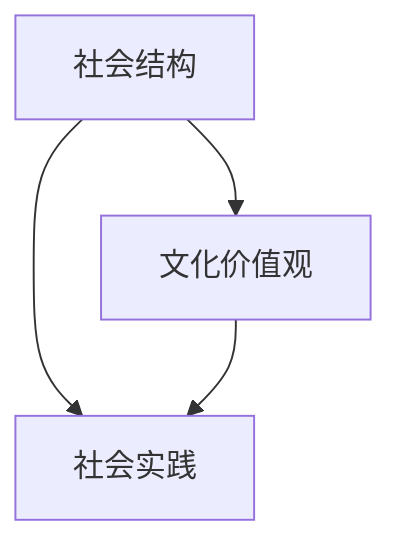

- **社会结构**：社会中的组织形式和关系网络。
- **文化价值观**：社会共同认可的基本信念和价值观。
- **社会实践**：社会成员在社会结构和文化价值观指导下进行的日常活动。

**核心算法原理讲解**

社会影响与意义建构的理论与实践可以被视为一种动态相互作用的过程，其核心算法原理包括：

```plaintext
算法：社会影响与意义建构
输入：社会结构、文化价值观、社会实践
输出：意义建构结果与社会影响分析

步骤：
1. 分析社会结构，了解社会关系和组织形式。
2. 确定文化价值观，理解社会的共同信念和价值观。
3. 考察社会实践，了解社会成员的日常活动。
4. 结合社会结构、文化价值观和社会实践，形成意义建构结果。
5. 分析意义建构结果对社会的影响，探讨社会变迁的可能性。
```

**数学模型和公式讲解**

为了更深入地理解社会影响与意义建构的理论与实践，我们可以使用以下数学模型和公式：

$$
M = f(S, C, P)
$$

其中，$M$代表意义建构结果，$S$代表社会结构，$C$代表文化价值观，$P$代表社会实践，$f$代表建构函数。该公式表明，意义建构结果是社会结构、文化价值观和社会实践的综合结果。

$$
I = f(M, S)
$$

其中，$I$代表意义建构结果对社会的影响，$M$代表意义建构结果，$S$代表社会结构，$f$代表影响函数。该公式表明，意义建构结果对社会的影响是社会结构和意义建构结果的综合结果。

**举例说明**

假设一个社会结构中存在性别不平等的现象，文化价值观强调男尊女卑，社会实践也反映出这一现象。通过意义建构，个体对社会性别角色产生理解，并可能采取行动推动社会变迁。那么，这个社会的意义建构结果就是对性别不平等现象的反思和批判，而社会影响就是性别平等意识的提升和社会结构的变革。

### 2.4 社会影响与意义建构的综合分析

**核心概念与联系**

社会影响与意义建构的综合分析涉及多个核心概念，如个体行为、社会结构和文化价值观等。以下是一个Mermaid流程图，展示了这些概念之间的关系：

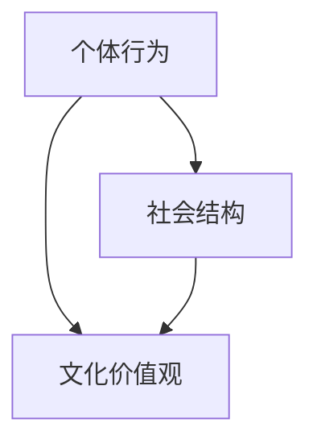

- **个体行为**：个体在社会中的行为表现。
- **社会结构**：社会中的组织形式和关系网络。
- **文化价值观**：社会共同认可的基本信念和价值观。

**核心算法原理讲解**

社会影响与意义建构的综合分析可以被视为一种系统分析过程，其核心算法原理包括：

```plaintext
算法：社会影响与意义建构的综合分析
输入：个体行为、社会结构、文化价值观
输出：意义建构结果与社会影响分析

步骤：
1. 收集个体行为的观察数据。
2. 分析社会结构，了解社会关系和组织形式。
3. 确定文化价值观，理解社会的共同信念和价值观。
4. 结合个体行为、社会结构和文化价值观，形成意义建构结果。
5. 分析意义建构结果对社会的影响，探讨社会变迁的可能性。
```

**数学模型和公式讲解**

为了更深入地理解社会影响与意义建构的综合分析，我们可以使用以下数学模型和公式：

$$
M = f(B, S, C)
$$

其中，$M$代表意义建构结果，$B$代表个体行为，$S$代表社会结构，$C$代表文化价值观，$f$代表建构函数。该公式表明，意义建构结果是个体行为、社会结构和文化价值观的综合结果。

$$
I = f(M, S)
$$

其中，$I$代表意义建构结果对社会的影响，$M$代表意义建构结果，$S$代表社会结构，$f$代表影响函数。该公式表明，意义建构结果对社会的影响是社会结构和意义建构结果的综合结果。

**举例说明**

假设一个社会结构中存在教育不平等等问题，文化价值观强调教育机会均等。通过意义建构，个体对社会教育不平等等现象产生认知，并可能采取行动推动社会改革。那么，这个社会的意义建构结果就是对教育平等的关注和追求，而社会影响就是教育机会的提升和社会结构的改善。

### 2.5 社会影响与意义建构的理论框架

**核心概念与联系**

社会影响与意义建构的理论框架涉及多个核心概念，如社会认知、符号互动和社会建构主义等。以下是一个Mermaid流程图，展示了这些概念之间的关系：

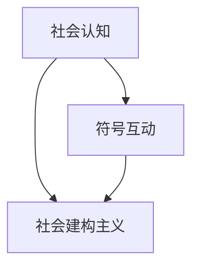

- **社会认知**：个体对社会信息的感知和理解。
- **符号互动**：个体通过符号交流进行的互动。
- **社会建构主义**：认为社会现实是通过个体的互动和意义建构过程产生的。

**核心算法原理讲解**

社会影响与意义建构的理论框架可以被视为一种多层次的交互过程，其核心算法原理包括：

```plaintext
算法：社会影响与意义建构的理论框架
输入：社会认知、符号互动、社会建构主义
输出：意义建构结果与社会影响分析

步骤：
1. 分析社会认知过程，理解个体如何感知和理解社会信息。
2. 研究符号互动过程，了解个体如何通过符号交流进行互动。
3. 应用社会建构主义理论，探讨社会现实是如何通过个体的互动和意义建构过程产生的。
4. 结合社会认知、符号互动和社会建构主义，形成意义建构结果。
5. 分析意义建构结果对社会的影响，探讨社会变迁的可能性。
```

**数学模型和公式讲解**

为了更深入地理解社会影响与意义建构的理论框架，我们可以使用以下数学模型和公式：

$$
M = f(C, I, D)
$$

其中，$M$代表意义建构结果，$C$代表社会认知，$I$代表符号互动，$D$代表社会建构主义，$f$代表建构函数。该公式表明，意义建构结果是社会认知、符号互动和社会建构主义

