                 

### 文章标题

《意义的个人诠释与社会共识的平衡》

> 关键词：个人意义、社会共识、价值观、个体自由、文化传承

> 摘要：本文从个体与社会的角度探讨意义的个人诠释与社会共识的平衡。首先分析人类对意义的追求及个人意义的重要性，接着阐述社会共识的形成和影响。随后，讨论个人诠释与社会共识之间的冲突与和谐，并提出平衡策略和实践方法。最后，展望意义诠释与共识的未来的发展趋势。

---

## 引言

在人类社会的不断发展中，意义始终是人们关注的焦点。每个人都在不断地探寻生活的意义，试图找到属于自己的价值观和目标。然而，随着社会结构的复杂化和多样性的增加，个人意义的诠释与社会共识之间常常产生冲突。如何在个人追求意义的过程中保持与社会共识的平衡，成为当代社会需要深入探讨的问题。

本文旨在从个体和社会两个层面，分析意义的个人诠释与社会共识的平衡问题。首先，我们将探讨人类对意义的追求及其背后的动机。接着，我们将详细阐述个人意义的定义与内涵，以及社会共识的概念与形成。在此基础上，我们将讨论个人诠释与社会共识之间的冲突与和谐，并探讨如何寻求平衡。最后，我们将对未来的意义诠释与共识的发展趋势进行展望。

## 第一部分：意义的个人探寻

### 第1章：意义探寻的起源与动机

#### 1.1 人类对意义的追求

人类对意义的追求可以追溯到早期人类文明的出现。在漫长的进化过程中，人类逐渐发展出对世界的认知，并开始思考自身的存在。随着社会结构的形成，人们对生活意义的探寻变得更加深入和多样化。

从生物学角度看，人类追求意义的行为可以被视为一种自我实现的驱动力。心理学家马斯洛提出的需求层次理论指出，人类在满足基本生理需求后，会追求更高层次的需求，包括安全、爱与归属、尊重和自我实现。其中，自我实现的需求涉及到对人生意义的追求。

#### 1.2 个人意义的重要性

个人意义对个体的心理健康和生活质量具有重要影响。首先，个人意义为个体提供了目标导向，使个体在生活中有动力和方向。其次，个人意义有助于个体在面对挫折和困难时保持积极的心态。研究表明，拥有明确人生意义的人更容易获得幸福感。

个人意义的定义与内涵

个人意义是每个人对生活目的和价值的理解。它涉及到多个维度，包括价值观、目标、使命和幸福感。

#### 1.3 社会共识对个人意义的影响

社会共识对个人意义具有重要影响。一方面，社会共识提供了共同的价值观和信仰，为个体提供了行为规范和指导。另一方面，社会共识可能会对个体的个人意义产生限制和约束。

例如，在某些社会和文化背景下，家庭和社会期望对个人的生活目标和职业选择产生强烈影响。这可能导致个体在追求个人意义时，不得不牺牲自己的价值观和兴趣。

### 第2章：个人意义的定义与内涵

#### 2.1 个人意义的多种维度

个人意义可以涵盖多个维度，包括价值观、目标、使命和幸福感。这些维度相互关联，共同构成了个人的意义体系。

- 价值观：价值观是个人对什么是有意义和重要的信念和态度。它们指导个人的行为和决策，影响个人的生活选择。
- 目标：目标是个体在实现个人意义的过程中设定的一系列具体目标。它们为个体提供了实现意义的途径和方向。
- 使命：使命是个人认为自己在世界上的角色和责任。它使个人感到自己的行为具有深远的意义和价值。
- 幸福感：幸福感是个人在实现个人意义的过程中获得的情感体验。它是衡量个人意义实现程度的重要指标。

#### 2.2 个体价值观的形成

个体价值观的形成受到多种因素的影响，包括家庭背景、文化环境、教育经历和社会互动等。以下是一个简单的 Mermaid 流程图，展示了个体价值观的形成过程：

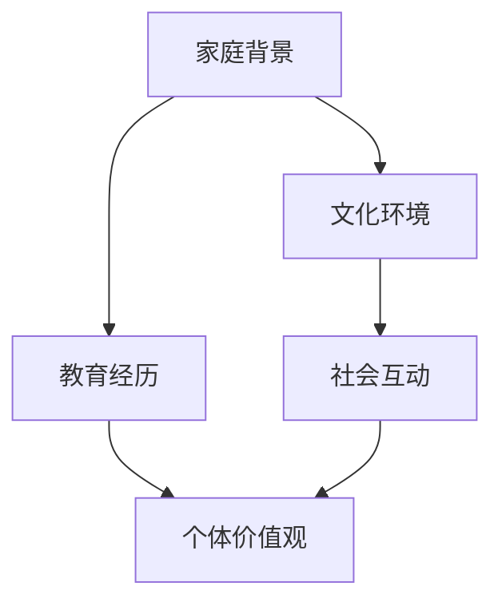

#### 2.3 个人意义与幸福感

个人意义与幸福感之间存在密切的关系。幸福感是个人在实现个人意义的过程中获得的情感体验。研究表明，拥有明确人生意义的人更容易感到幸福。

以下是一个简单的 Mermaid 流程图，展示了个人意义与幸福感之间的关系：

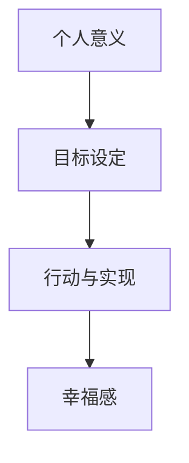

### 第3章：个人意义探索的方法

#### 3.1 内省与自我反思

内省与自我反思是个人意义探索的重要方法。通过内省，个体可以深入思考自己的内心世界，了解自己的价值观、目标和动机。以下是一个简单的伪代码，展示了内省与自我反思的过程：

```python
def introspection():
    # 思考个人的价值观和信仰
    think_about_values_and_beliefs()
    
    # 分析个人的行为和决策
    analyze_behaviors_and_decisions()
    
    # 检视个人的生活目标和追求
    review_life_goals_and_pursuits()
```

#### 3.2 与他人的交流与互动

与他人交流和互动是个人意义探索的另一个重要方法。通过与他人的交流和互动，个体可以了解不同的观点和价值观，从而拓宽自己的视野。以下是一个简单的 Mermaid 流程图，展示了与他人交流与互动的过程：

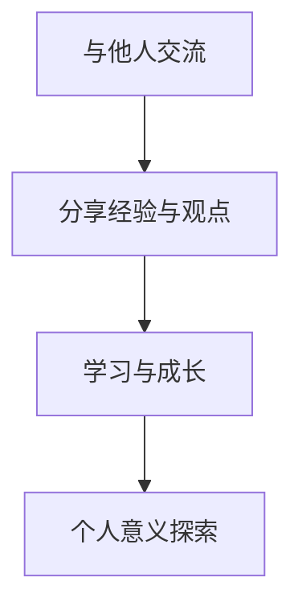

#### 3.3 实践与经历

实践与经历是个人意义探索的第三种方法。通过实际行动和经历，个体可以更好地了解自己的需求和兴趣，从而明确个人意义。以下是一个简单的伪代码，展示了实践与经历的过程：

```python
def practice_and_experience():
    # 设定实践目标和计划
    set_practice_goals_and_plans()
    
    # 进行实际行动和经历
    perform_actions_and_experiences()
    
    # 反思实践过程和结果
    reflect_on_practice_process_and_outcomes()
```

## 第二部分：社会共识的构建与影响

### 第4章：社会共识的概念与形成

#### 4.1 社会共识的定义

社会共识是指社会成员在长期互动和沟通过程中形成的共同理解和认同。它包括共同的价值观、信仰、规范和行为准则。

社会共识的形成是一个复杂的过程，涉及到多个方面的因素。以下是一个简单的 Mermaid 流程图，展示了社会共识的形成过程：

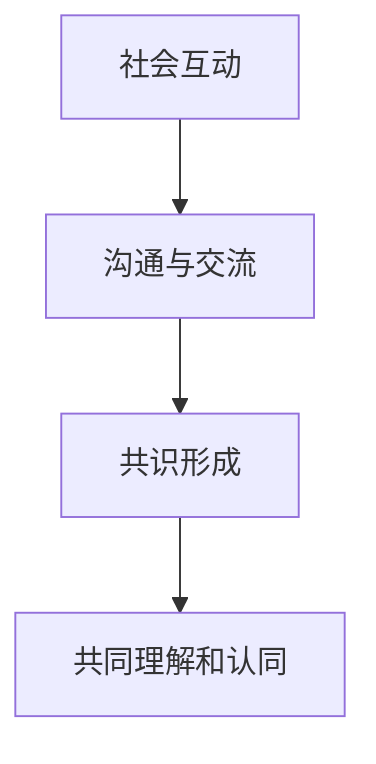

#### 4.2 社会共识的形成机制

社会共识的形成机制主要包括以下几个方面：

1. **教育与文化传承**：教育体系和文化传承是培养社会共识的重要途径。通过教育，个体可以了解和接受社会的共同价值观和行为准则。
2. **法律与制度**：法律和制度是社会共识的重要组成部分，它们为个体的行为提供了明确规范，并促使个体在社会中遵守共同规则。
3. **媒体与信息传播**：媒体和信息传播是塑造社会共识的重要手段。通过媒体的宣传和引导，个体可以接受和认同社会共识。

以下是一个简单的 Mermaid 流程图，展示了社会共识的形成机制：

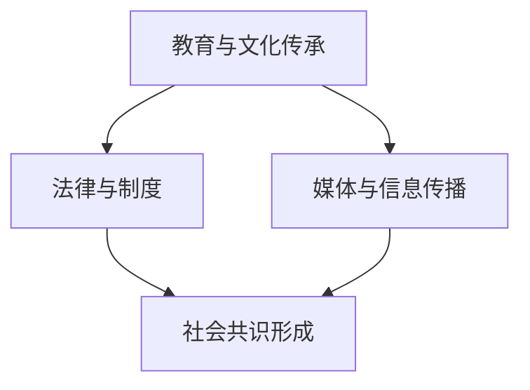

#### 4.3 社会共识的多样性

社会共识的多样性是现代社会的一个重要特征。不同文化、地区和群体之间存在着不同的社会共识。以下是一个简单的 Mermaid 流程图，展示了社会共识的多样性：

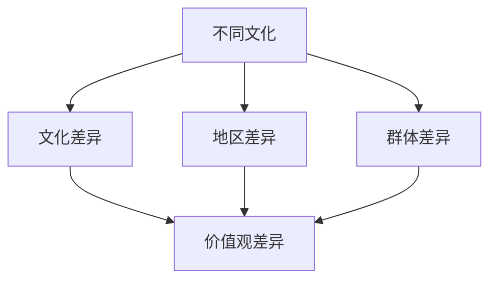

### 第5章：社会共识的作用与影响

#### 5.1 社会共识在文化传承中的作用

社会共识在文化传承中发挥着重要作用。通过社会共识，文化传统和价值观念得以传承和延续。以下是一个简单的 Mermaid 流程图，展示了社会共识在文化传承中的作用：

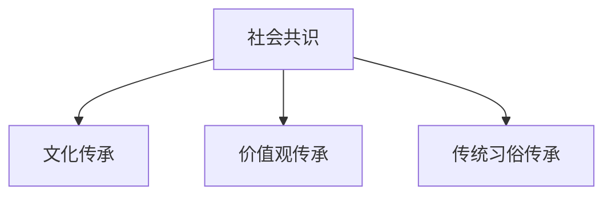

#### 5.2 社会共识对个体行为的规范

社会共识对个体行为具有规范作用。通过社会共识，个体可以了解在社会中应该遵守的行为准则和规范。以下是一个简单的 Mermaid 流程图，展示了社会共识对个体行为的规范作用：

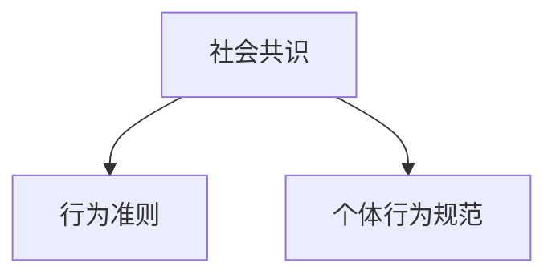

#### 5.3 社会共识对群体行为的影响

社会共识对群体行为具有深远的影响。通过社会共识，群体成员可以形成共同的行动目标和价值观，从而实现集体行动和协作。以下是一个简单的 Mermaid 流程图，展示了社会共识对群体行为的影响：

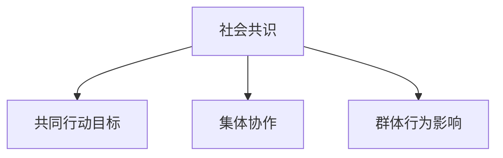

### 第6章：社会共识的挑战与变革

#### 6.1 社会共识的稳定与变革

社会共识的稳定与变革是现代社会面临的一个重要挑战。在全球化、多元化和信息化的发展背景下，社会共识的稳定性受到考验。以下是一个简单的 Mermaid 流程图，展示了社会共识的稳定与变革过程：

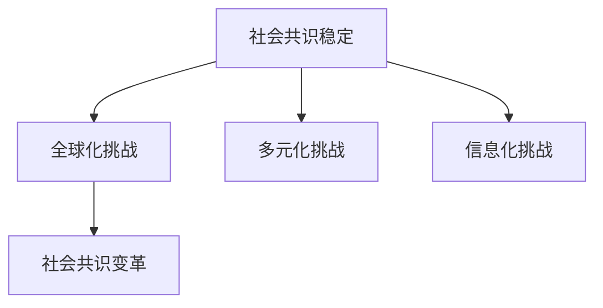

#### 6.2 社会共识的异化与危机

社会共识的异化与危机是现代社会可能面临的一个严重问题。当社会共识偏离了其初衷，可能导致社会分裂、冲突和不稳定。以下是一个简单的 Mermaid 流程图，展示了社会共识的异化与危机：

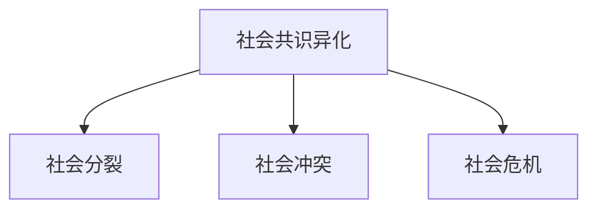

#### 6.3 促进社会共识的可持续性

为了促进社会共识的可持续性，需要采取一系列措施。以下是一个简单的 Mermaid 流程图，展示了促进社会共识可持续性的方法：

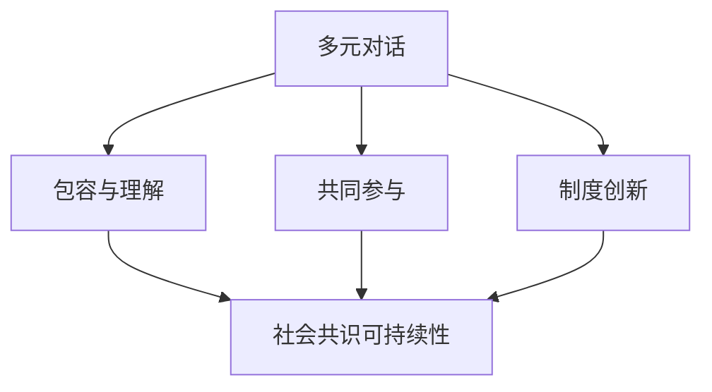

## 第三部分：意义的个人诠释与社会共识的平衡

### 第7章：个人诠释与社会共识的冲突与和谐

#### 7.1 个人诠释与社会共识的冲突现象

个人诠释与社会共识之间的冲突现象在社会中普遍存在。以下是一个简单的 Mermaid 流程图，展示了个人诠释与社会共识之间的冲突现象：

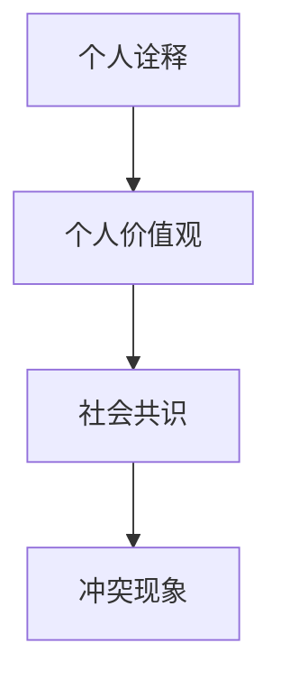

#### 7.2 寻求平衡的策略与方法

为了解决个人诠释与社会共识之间的冲突，需要采取一系列策略和方法。以下是一个简单的 Mermaid 流程图，展示了寻求平衡的策略与方法：

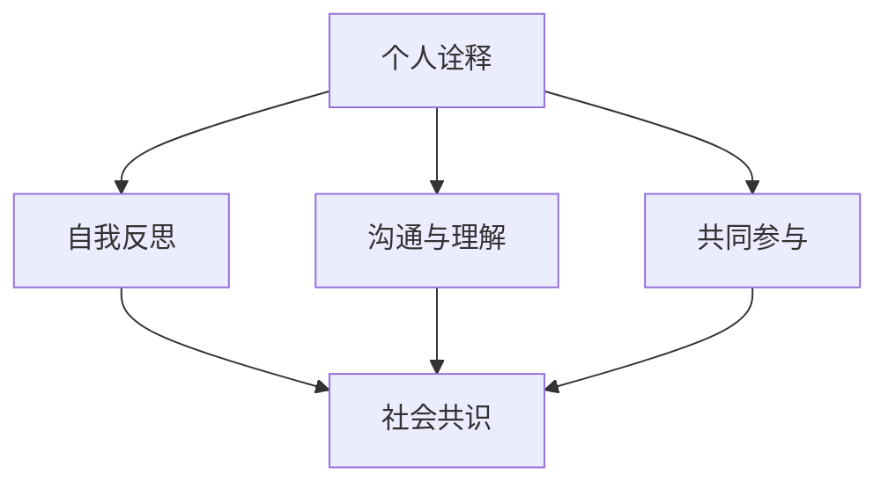

#### 7.3 社会共识与个人自由的关系

社会共识与个人自由之间存在一定的矛盾。在追求社会共识的过程中，个人自由可能会受到限制。以下是一个简单的 Mermaid 流程图，展示了社会共识与个人自由的关系：

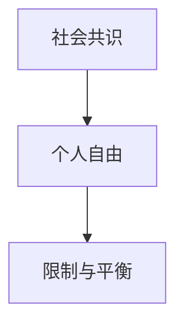

### 第8章：平衡意义诠释的策略与实践

#### 8.1 增进理解与对话的技巧

为了实现个人诠释与社会共识的平衡，需要提高个体之间的理解与对话能力。以下是一个简单的 Mermaid 流程图，展示了增进理解与对话的技巧：

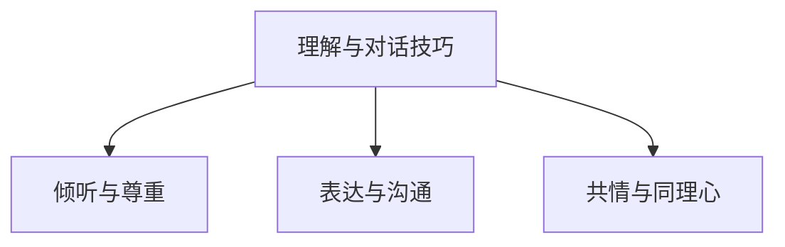

#### 8.2 促进社会包容与多元化的措施

促进社会包容与多元化是实现平衡的重要措施。以下是一个简单的 Mermaid 流程图，展示了促进社会包容与多元化的措施：

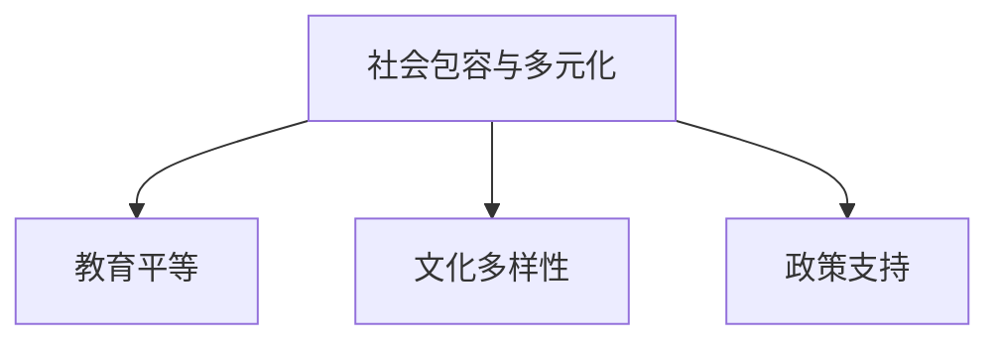

#### 8.3 培养个人与社会共识的适应性

为了实现个人诠释与社会共识的平衡，需要培养个人与社会共识的适应性。以下是一个简单的 Mermaid 流程图，展示了培养个人与社会共识的适应性：

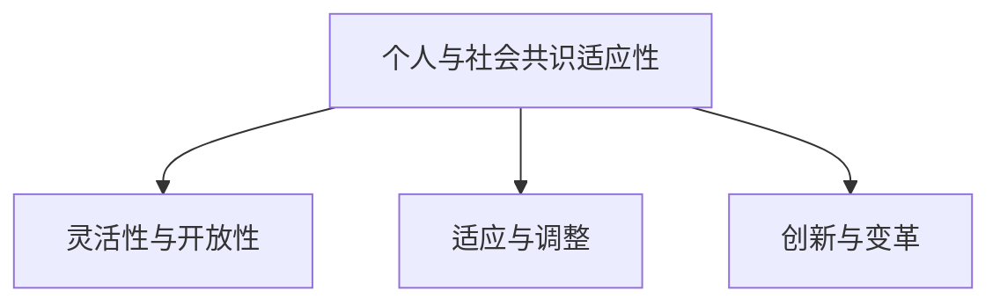

### 第9章：意义的个人诠释与社会共识的未来

#### 9.1 未来社会共识的挑战与机遇

随着科技的进步和社会变革，未来社会共识将面临新的挑战和机遇。以下是一个简单的 Mermaid 流程图，展示了未来社会共识的挑战与机遇：

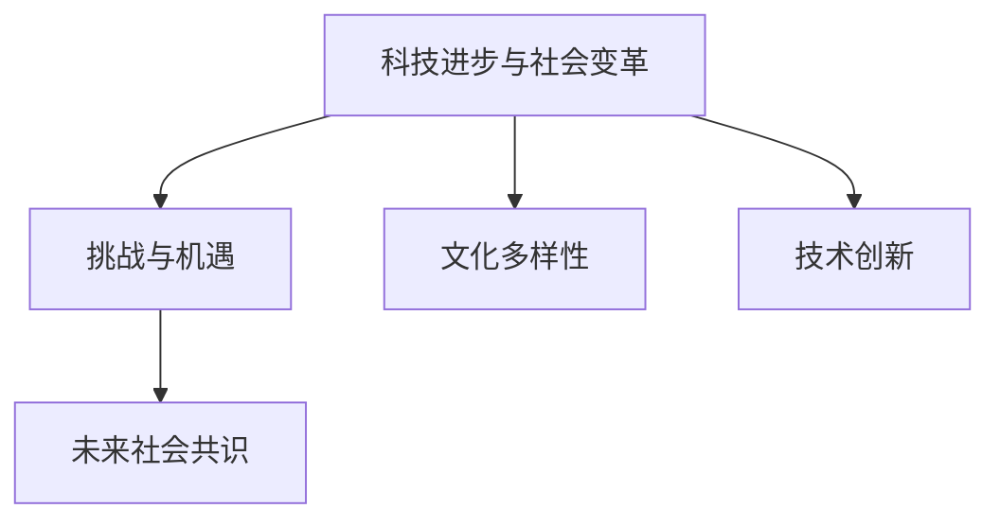

#### 9.2 个人意义在数字化时代的发展

在数字化时代，个人意义的探索和实现面临新的机遇和挑战。以下是一个简单的 Mermaid 流程图，展示了个人意义在数字化时代的发展：

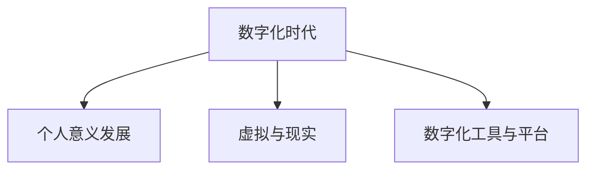

#### 9.3 构建更加和谐的意义平衡体系

为了实现个人诠释与社会共识的平衡，需要构建更加和谐的意义平衡体系。以下是一个简单的 Mermaid 流程图，展示了构建更加和谐的意义平衡体系的方法：

```mermaid
graph TD
    A[个人诠释] --> B[社会共识]
    B --> C[和谐平衡体系]
    A --> C
```

## 附录：相关研究综述与延伸阅读

### 附录1：意义研究领域的核心文献回顾

在本章中，我们将回顾意义研究领域的核心文献，探讨个人意义与社会共识的研究进展和重要发现。

1. **马歇尔·麦克卢汉（Marshall McLuhan）**  
   马歇尔·麦克卢汉是媒体理论家和未来学家，他的著作《媒体即信息》（The Medium is the Massage）对个人意义和社会共识的研究产生了深远影响。麦克卢汉提出，媒体不仅是传递信息的工具，更是塑造人类感知和认知的方式。这一观点为我们理解数字时代个人意义的演变提供了重要启示。

2. **卡尔·荣格（Carl Jung）**  
   瑞士心理学家卡尔·荣格是分析心理学的创始人之一，他对个体潜意识和个人意义的研究具有重要意义。荣格提出的“集体无意识”理论指出，个体经验和集体经验之间存在着深刻的联系。这一理论为我们理解个人意义如何在社会共识中形成提供了新的视角。

3. **埃德加·沙因（Edgar Schein）**  
   埃德加·沙因是组织行为学家，他的著作《组织文化与领导力》（Organizational Culture and Leadership）对组织和社会共识的研究产生了重要影响。沙因提出，组织文化是影响个人意义的重要因素，组织领导者需要关注如何塑造和维护有利的组织文化。

4. **克里斯·阿尔伯特（Chris Argyris）**  
   克里斯·阿尔伯特是一位著名的学习科学家，他的著作《单环学习和双环学习》（Single-Loop and Double-Loop Learning）探讨了个人意义与社会共识之间的关系。阿尔伯特提出，个体和组织需要通过双环学习来提高自我反思和适应能力，从而实现个人与社会共识的平衡。

### 附录2：社会共识研究的经典案例

在本章中，我们将介绍一些社会共识研究的经典案例，分析这些案例对社会共识的形成、影响和变革的启示。

1. **新加坡的教育体系**  
   新加坡的教育体系以其高效和高质量而闻名，这是新加坡政府长期坚持社会共识的结果。新加坡政府通过制定明确的教育目标和政策，培养社会成员的认同感和共同价值观，从而实现社会共识。这一案例表明，政策制定者在构建社会共识时需要明确目标，并采取有效的措施来推动共识的形成。

2. **印度的宗教多样性**  
   印度是一个宗教多样性非常明显的国家，不同宗教和信仰群体之间长期保持着相对和平的关系。这是印度社会共识的重要组成部分。印度政府通过法律和政策来保障宗教自由和多样性，同时推动不同宗教群体之间的对话和交流。这一案例表明，社会共识的构建需要尊重和包容多样性，通过法律和政策来保障社会的和谐与稳定。

3. **欧洲的欧盟**  
   欧洲联盟是一个由多个国家组成的政治和经济联盟，其社会共识的形成和维持面临着巨大的挑战。欧盟通过制定共同的法律和政策，促进成员国之间的合作和交流，推动社会共识的形成。然而，欧盟也面临着一些内部的矛盾和冲突，这表明社会共识的维持需要不断的努力和调整。这一案例表明，社会共识的构建需要多方参与和共同努力，同时需要灵活应对内部和外部的变化。

### 附录3：延伸阅读与参考资料

在本章中，我们提供了一些延伸阅读和参考资料，供读者进一步了解个人意义与社会共识的研究和实践。

1. **马歇尔·麦克卢汉（Marshall McLuhan）**，《媒体即信息》（The Medium is the Massage），1967年。  
2. **卡尔·荣格（Carl Jung）**，《集体无意识与个性化》（Collected Works of C.G. Jung），1968年。  
3. **埃德加·沙因（Edgar Schein）**，《组织文化与领导力》（Organizational Culture and Leadership），1990年。  
4. **克里斯·阿尔伯特（Chris Argyris）**，《单环学习和双环学习》（Single-Loop and Double-Loop Learning），1977年。  
5. **彼得·圣吉（Peter Senge）**，《第五项修炼》（The Fifth Discipline），1990年。  
6. **阿尔文·托夫勒（Alvin Toffler）**，《未来的冲击》（Future Shock），1970年。  
7. **理查德·塞勒（Richard Thaler）**，《行为的金融学》（Behavioral Finance），2000年。

### 作者信息

作者：AI天才研究院/AI Genius Institute & 禅与计算机程序设计艺术 /Zen And The Art of Computer Programming

---

通过本文，我们探讨了意义的个人诠释与社会共识的平衡问题，分析了个人意义的重要性、社会共识的构建与影响，以及如何在个人追求意义的过程中保持与社会共识的平衡。同时，我们提出了增进理解与对话、促进社会包容与多元化、培养个人与社会共识的适应性等策略和方法。在未来的研究中，我们可以进一步探讨数字化时代个人意义与社会共识的演变，以及如何通过技术创新和政策制定来促进社会共识的可持续性。通过不断的探索和实践，我们有望构建一个更加和谐的意义平衡体系，实现个人与社会共同发展。

