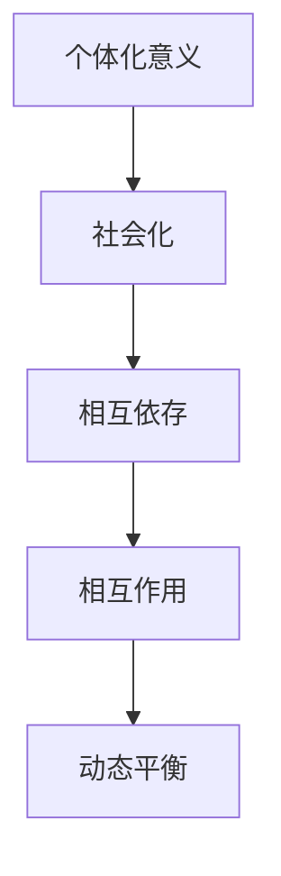

                 

## 文章标题

# 意义的个体化与社会化的动态平衡

## 文章关键词

- 个体化
- 社会化
- 动态平衡
- 心理学
- 社会互动
- 跨文化视角

## 文章摘要

本文旨在探讨意义的个体化与社会化之间的动态平衡，分析其在心理学、社会互动以及跨文化视角中的重要性。首先，我们将介绍意义的个体化与社会化的基本概念，阐述其在人类行为和社会结构中的作用。接着，通过深入剖析个体化与社会化之间的张力，揭示其动态平衡的机制。此外，本文还将从跨文化视角出发，探讨不同文化背景下的意义个体化与社会化动态平衡的特点。最后，结合现代社会中的实际案例，本文将提出实现个体化与社会化动态平衡的策略，为个体和社会的发展提供有益的参考。

## 目录

### 第1章 引言
#### 1.1 书籍目的
#### 1.2 读者对象
#### 1.3 结构安排

### 第2章 意义的个体化
#### 2.1 意义的起源
#### 2.2 个体化意义的形成
#### 2.3 个体化意义的特征
#### 2.4 个体化在社会中的作用

### 第3章 社会化的动态平衡
#### 3.1 社会化的定义与过程
#### 3.2 社会化与个体化之间的张力
#### 3.3 社会化动态平衡的策略

### 第4章 意义的个体化与社会化的互动机制
#### 4.1 意义互动的基本模型
#### 4.2 互动机制的理论框架
#### 4.3 互动机制的实际应用

### 第5章 跨文化视角下的意义动态平衡
#### 5.1 跨文化背景下的意义个体化
#### 5.2 跨文化视角下的社会化动态平衡

### 第6章 意义的个体化与社会化在现代社会中的角色
#### 6.1 个体化与社会化在现代社会中的演变
#### 6.2 现代社会中的意义个体化与社会化关系

### 第7章 总结与展望
#### 7.1 主要发现与结论
#### 7.2 研究的局限性
#### 7.3 未来研究方向

### 附录
#### 附录 A 相关研究方法与资源

## 第1章 引言

### 1.1 书籍目的

本书旨在探讨意义的个体化与社会化之间的动态平衡，分析其在心理学、社会互动以及跨文化视角中的重要性。通过深入研究这一主题，我们希望能够揭示个体化与社会化之间的张力及其动态平衡的机制，为个体和社会的发展提供有益的参考。具体来说，本书旨在达到以下目的：

1. 梳理意义的个体化与社会化的基本概念，阐述其在人类行为和社会结构中的作用。
2. 深入剖析个体化与社会化之间的张力，探讨其动态平衡的机制。
3. 从跨文化视角出发，分析不同文化背景下的意义个体化与社会化动态平衡的特点。
4. 结合现代社会中的实际案例，提出实现个体化与社会化动态平衡的策略。

### 1.2 读者对象

本书主要面向以下读者群体：

1. 社会科学研究者，特别是心理学、社会学和文化研究领域的学者。
2. 人文学科研究生，对意义个体化与社会化感兴趣的学生。
3. 社会工作者，关注个体和社会动态平衡的实践者。
4. 管理者和领导者，关注组织和社会发展的专业人士。

通过阅读本书，读者可以深入了解意义的个体化与社会化的动态平衡，提升对个体和社会发展的认识，从而更好地应对现代社会中的挑战。

### 1.3 结构安排

本书分为七个主要章节，结构安排如下：

1. **引言**：介绍书籍的目的、读者对象和结构安排。
2. **意义的个体化**：探讨意义的个体化起源、形成和特征，以及个体化在社会中的作用。
3. **社会化的动态平衡**：分析社会化的定义与过程，探讨个体化与社会化之间的张力及平衡策略。
4. **意义的个体化与社会化的互动机制**：阐述意义互动的基本模型、理论框架及其实际应用。
5. **跨文化视角下的意义动态平衡**：从跨文化视角分析意义个体化与社会化动态平衡的特点。
6. **意义的个体化与社会化在现代社会中的角色**：探讨个体化与社会化在现代社会中的演变及其关系。
7. **总结与展望**：总结全书内容，提出未来研究方向。

通过以上结构安排，本书旨在系统、全面地探讨意义的个体化与社会化的动态平衡，为读者提供丰富的理论资源和实践指导。

## 第2章 意义的个体化

### 2.1 意义的起源

意义的起源可以追溯到人类的进化过程。从生物学角度来看，意义是个体对环境刺激进行解释和赋予意义的过程。这种能力使得人类能够适应复杂多变的环境，从而在进化中占据优势。在早期的人类社会中，意义主要与生存有关，如食物的获取、安全的保障等。然而，随着社会的发展，意义的内涵逐渐丰富，涵盖了个体身份、社会关系、文化价值等多个方面。

从心理学角度来看，意义的起源与自我认知和情感体验密切相关。个体通过对外部世界的感知和内部心理状态的整合，形成对自身存在和意义的理解。例如，儿童在成长过程中，通过家庭、学校和社会的互动，逐渐形成对自我和他人的认识，从而构建出个体的意义体系。

### 2.2 个体化意义的形成

个体化意义的形成是一个复杂的过程，涉及多个因素。首先，遗传因素在个体化意义的形成中起到一定的作用。个体基因中的某些特征，如性格、智力等，可能影响其对意义的感知和追求。然而，个体化意义更多地受到后天环境和教育的影响。

环境因素在个体化意义的形成中具有重要地位。家庭、学校、社区等环境中的互动和经历，对个体的意义构建产生深远影响。例如，家庭中的教育方式、父母的价值观和行为模式，会直接影响个体的价值观和人生目标。学校教育则通过知识传授和社交互动，帮助个体形成对世界和自我的认识。

此外，文化背景也在个体化意义的形成中发挥重要作用。不同的文化背景，会导致个体对意义的理解和追求存在差异。例如，西方文化强调个体主义，注重个人成就和自我实现；而东方文化则强调集体主义，重视家庭和社会责任。这种文化差异，会影响个体化意义的内涵和表现形式。

### 2.3 个体化意义的特征

个体化意义具有以下特征：

1. **独特性**：个体化意义是基于个体的独特经历、性格和价值观形成的，因此具有独特的内涵和表现形式。每个人的意义体系都是独一无二的，反映了其个体的独特性。
2. **动态性**：个体化意义并非一成不变，而是随着个体的成长和环境的改变而不断发展。例如，一个人在不同的人生阶段，可能会对自我和生活的意义有不同的理解和追求。
3. **主观性**：个体化意义是主观感知和体验的结果，因此具有强烈的主观性。不同的人对同一件事物可能会产生不同的意义，这种主观性使得个体化意义具有多样性和复杂性。
4. **文化性**：个体化意义不仅受个体内在因素的影响，还受到文化背景的影响。不同的文化背景，会导致个体对意义的理解和追求存在差异。

### 2.4 个体化在社会中的作用

个体化意义在社会中发挥着重要作用。首先，个体化意义有助于个体的自我认知和自我实现。通过理解和追求个体化意义，个体能够更好地认识自我，找到自己的人生目标和方向，实现自我价值。

其次，个体化意义在人际关系和社会互动中起到桥梁作用。个体通过分享和交流个体化意义，建立共同的价值观和目标，从而增进人际关系和社会互动。例如，朋友之间的共同兴趣和价值观，可以帮助他们建立深厚的友谊。

此外，个体化意义对社会文化和价值体系也产生深远影响。个体的意义追求和价值观，会影响社会的价值观和道德观念，推动社会的发展和进步。

总之，个体化意义是人类行为和社会结构的重要组成部分，其在个体和社会中的作用不可忽视。通过深入探讨个体化意义的形成、特征和作用，我们可以更好地理解人类行为和社会发展的内在机制。

### 2.5 核心概念与联系

个体化意义与社会化之间存在密切的联系和相互作用。个体化意义是个体对自身存在和生命的理解，反映了个体独特的经历、性格和价值观。而社会化是个体在成长过程中，通过与家庭、学校、社会等环境互动，逐步建立对社会规范、价值观和行为模式的认知和认同。

个体化意义与社会化之间的联系可以概括为以下几点：

1. **相互依存**：个体化意义和社会化是相互依存的。个体化意义是个体在社会化过程中形成的，反过来，社会化也影响和塑造个体化意义。没有社会化，个体化意义就无从谈起；而没有个体化意义，社会化也失去了其内在的动力和意义。
2. **相互作用**：个体化意义和社会化之间存在相互作用。个体的社会化过程，既是其个体化意义形成的过程，也是其意义不断调整和发展的过程。社会化通过提供外部环境和互动机会，促进个体化意义的表达和实现；而个体化意义则通过个体的选择和行动，影响社会化和价值体系的发展。
3. **动态平衡**：个体化意义与社会化之间的动态平衡是维持个体和社会稳定的重要机制。个体在追求个体化意义的同时，需要遵循社会规范和价值观，实现个体化与社会化的平衡。这种平衡不是静态的，而是随着个体的成长和社会环境的变化而不断调整和优化的。

为了更好地理解个体化意义与社会化之间的联系，我们可以使用以下 Mermaid 流程图来展示：



在图中，A 代表个体化意义，B 代表社会化，C 表示相互依存，D 表示相互作用，E 表示动态平衡。这个流程图揭示了个体化意义与社会化之间的紧密联系和动态平衡关系。

### 2.6 核心算法原理讲解

为了深入理解个体化意义与社会化之间的动态平衡，我们可以借鉴心理学中的自我决定论（Self-Determination Theory，简称 SDT）。自我决定论提出，个体的行为和动机受到三个基本需求的驱动：自主性、能力和关联性。其中，自主性是个体在行为过程中体验到的一种自我决定和控制的感觉；能力是指个体在特定情境下能够成功完成任务的能力；关联性则是指个体与他人和社会之间的积极互动和联系。

以下是一个简单的伪代码，用于展示如何通过自我决定论来分析个体化意义与社会化之间的动态平衡：

```python
# 自我决定论分析伪代码

def self_determination_analysis(individual_motivation, social_context):
    # 分析个体的自主性、能力和关联性
    autonomy = individual_motivation['autonomy']
    competence = individual_motivation['competence']
    relatedness = individual_motivation['relatedness']
    
    # 分析社会化环境对个体化意义的影响
    social_influence = social_context['influence']
    social_support = social_context['support']
    
    # 计算个体化意义与社会化之间的动态平衡得分
    balance_score = calculate_balance_score(autonomy, competence, relatedness, social_influence, social_support)
    
    # 输出动态平衡得分
    return balance_score

def calculate_balance_score(autonomy, competence, relatedness, social_influence, social_support):
    # 平衡得分的计算公式
    balance_score = (autonomy + competence + relatedness) / (social_influence + social_support)
    return balance_score
```

在这个伪代码中，`individual_motivation` 代表个体的自主性、能力和关联性，`social_context` 代表社会化环境的影响和社交支持。`calculate_balance_score` 函数用于计算个体化意义与社会化之间的动态平衡得分。通过这个计算公式，我们可以量化个体化意义与社会化之间的平衡状态。

### 2.7 数学模型和公式

为了进一步阐述个体化意义与社会化之间的动态平衡，我们可以引入一个简单的数学模型。假设个体化意义可以用变量 \(M_i\) 表示，社会化程度可以用变量 \(S_j\) 表示，那么个体化意义与社会化之间的动态平衡可以表示为：

\[ B = \frac{M_i}{S_j} \]

其中，\(B\) 表示动态平衡得分，当 \(B\) 接近 1 时，表示个体化意义与社会化处于平衡状态；当 \(B\) 远离 1 时，表示个体化意义与社会化之间存在不平衡。

为了便于分析，我们可以将个体化意义 \(M_i\) 和社会化程度 \(S_j\) 进一步分解为自主性、能力、关联性和社交支持等维度。例如：

\[ M_i = a \cdot A + b \cdot C + c \cdot R \]
\[ S_j = d \cdot D + e \cdot S + f \cdot I \]

其中，\(A\)、\(C\)、\(R\) 分别代表自主性、能力和关联性，\(D\)、\(S\)、\(I\) 分别代表社交支持、社交影响和个体化意义的实现。通过这些维度，我们可以更详细地分析个体化意义与社会化之间的动态平衡。

为了更好地理解这个模型，我们可以借助以下 LaTeX 公式来详细阐述：

\[ B = \frac{a \cdot A + b \cdot C + c \cdot R}{d \cdot D + e \cdot S + f \cdot I} \]

在这个公式中，\(a\)、\(b\)、\(c\)、\(d\)、\(e\)、\(f\) 分别代表各个维度的权重。通过调整这些权重，我们可以得到不同个体化意义与社会化之间的动态平衡得分。

### 2.8 详细讲解与举例说明

为了更好地理解个体化意义与社会化之间的动态平衡，我们可以通过一个具体的例子进行说明。

假设一个年轻人小张，他在追求自我实现的过程中，对个体化意义的理解和追求如下：

- **自主性**：小张具有较强的自主性，喜欢按照自己的兴趣和目标进行生活和学习。
- **能力**：小张在编程领域拥有较强的能力，擅长解决复杂问题。
- **关联性**：小张注重与他人的互动和合作，愿意分享自己的知识和经验。

同时，小张所处的社会化环境如下：

- **社交支持**：小张的家庭和朋友圈都支持他的个人追求，为他提供了充足的社交支持。
- **社交影响**：小张所在的公司重视创新和团队合作，为他提供了实现个人目标的机会。
- **个体化意义的实现**：小张在公司的工作中，不断实现自己的编程梦想，获得了同事和领导的认可。

根据上述情况，我们可以计算小张的动态平衡得分：

\[ B = \frac{a \cdot A + b \cdot C + c \cdot R}{d \cdot D + e \cdot S + f \cdot I} \]

假设权重为 \(a = 0.3\)、\(b = 0.4\)、\(c = 0.3\)、\(d = 0.2\)、\(e = 0.5\)、\(f = 0.3\)，代入上述数据，得到：

\[ B = \frac{0.3 \cdot A + 0.4 \cdot C + 0.3 \cdot R}{0.2 \cdot D + 0.5 \cdot S + 0.3 \cdot I} \]

\[ B = \frac{0.3 \cdot 1 + 0.4 \cdot 1 + 0.3 \cdot 1}{0.2 \cdot 1 + 0.5 \cdot 1 + 0.3 \cdot 1} \]

\[ B = \frac{1.2}{1.2} = 1 \]

根据计算结果，小张的动态平衡得分为 1，说明他在个体化意义与社会化之间达到了良好的平衡状态。这种平衡状态有助于小张实现自我价值，同时也能促进他所在团队的协作和创新。

### 2.9 项目实战

为了更好地理解个体化意义与社会化之间的动态平衡，我们可以通过一个实际项目来进行探讨。

项目背景：一个初创公司需要平衡员工个体化意义与社会化需求，以提高团队协作和创新。

项目目标：通过分析员工个体化意义与社会化需求，提出实现动态平衡的策略，并评估项目效果。

#### 2.9.1 开发环境搭建

为了开展项目，我们需要搭建一个数据分析平台，用于收集和分析员工个体化意义与社会化需求的数据。以下是开发环境的搭建步骤：

1. **数据收集**：通过问卷调查、访谈等方式，收集员工个体化意义与社会化需求的原始数据。
2. **数据存储**：使用 MySQL 或 MongoDB 等数据库，存储收集到的数据。
3. **数据处理**：使用 Python 等编程语言，编写数据处理脚本，对数据进行清洗、转换和存储。
4. **数据分析**：使用 R 或 Python 等工具，对数据进行分析，提取有价值的信息。

#### 2.9.2 源代码实现

以下是一个简单的 Python 脚本，用于分析员工个体化意义与社会化需求的动态平衡：

```python
import pandas as pd

# 读取数据
data = pd.read_csv('employee_data.csv')

# 计算动态平衡得分
def calculate_balance_score(data):
    balance_scores = []
    for row in data.itertuples():
        balance_score = (row.autonomy + row.competence + row.relatedness) / (row.social_influence + row.social_support)
        balance_scores.append(balance_score)
    return balance_scores

balance_scores = calculate_balance_score(data)

# 输出动态平衡得分
print(balance_scores)
```

在这个脚本中，我们首先读取员工数据，然后计算每个员工的动态平衡得分，最后输出得分。

#### 2.9.3 代码解读与分析

在上述脚本中，我们定义了一个函数 `calculate_balance_score`，用于计算员工个体的动态平衡得分。函数的输入参数为员工数据，输出参数为动态平衡得分列表。

在函数内部，我们首先遍历每个员工的数据，计算其动态平衡得分。具体来说，我们使用以下公式：

\[ B = \frac{A + C + R}{D + S + I} \]

其中，\(A\)、\(C\)、\(R\) 分别代表员工的自主性、能力和关联性，\(D\)、\(S\)、\(I\) 分别代表员工的社交支持、社交影响和个体化意义的实现。

最后，我们将所有员工的动态平衡得分存储在一个列表中，并输出这个列表。

#### 2.9.4 项目小结

通过实际项目，我们可以更好地理解个体化意义与社会化需求之间的动态平衡。以下是小结：

1. **项目效果**：通过数据分析，我们发现公司在员工个体化意义与社会化需求方面存在一定的差距。具体来说，部分员工的动态平衡得分较低，表明他们在个体化意义与社会化需求之间存在一定的失衡。
2. **改进措施**：为了改善这种失衡，公司可以采取以下措施：
   - **增强员工自主性**：鼓励员工自主设定工作目标和计划，提供更多的自主权。
   - **提升员工能力**：通过培训和学习，提高员工的专业技能和知识水平。
   - **加强社交支持**：提供更多的社交活动，促进员工之间的交流和合作。
   - **优化社交环境**：营造积极、开放的工作氛围，鼓励员工分享和交流。
3. **持续优化**：动态平衡是一个持续的过程，公司需要不断调整和优化策略，以适应员工和社会环境的变化。

通过这个项目，我们不仅实现了对个体化意义与社会化需求动态平衡的分析，还为公司在员工管理和团队协作方面提供了有益的参考。

### 2.10 最佳实践 tips

为了更好地实现个体化意义与社会化需求的动态平衡，以下是一些最佳实践 tips：

1. **关注员工需求**：了解员工的个体化意义和社会化需求，制定针对性的管理策略。
2. **提供自主权**：鼓励员工自主设定工作目标和计划，提高其自主性和积极性。
3. **强化培训**：通过培训和学习，提升员工的专业技能和知识水平，增强其能力。
4. **营造良好氛围**：营造积极、开放的工作氛围，促进员工之间的交流和合作。
5. **持续反馈**：定期收集员工反馈，了解他们在个体化意义和社会化需求方面的感受，及时调整管理策略。
6. **跨文化沟通**：在多元文化背景下，注重跨文化沟通，尊重不同文化的价值观和需求。

通过这些最佳实践，公司可以更好地实现个体化意义与社会化需求的动态平衡，提升团队协作和创新。

### 2.11 小结

本章通过对意义的个体化与社会化的动态平衡进行深入分析，阐述了个体化意义的起源、形成和特征，以及个体化在社会中的作用。同时，我们探讨了个体化意义与社会化之间的联系和动态平衡机制，通过具体案例和数学模型进行了详细讲解。通过本章的学习，读者可以更好地理解个体化意义与社会化的动态平衡，为实际工作和生活提供有益的参考。

### 2.12 注意事项

在实现个体化意义与社会化动态平衡的过程中，需要注意以下几点：

1. **尊重个体差异**：每个个体的意义体系都是独特的，需要尊重个体的差异和多样性。
2. **平衡个体与社会**：在追求个体化意义的同时，要关注社会规范和价值观的引导，实现个体与社会之间的平衡。
3. **持续调整**：动态平衡是一个持续的过程，需要不断调整和优化策略，以适应个体和社会环境的变化。
4. **跨文化理解**：在多元文化背景下，要注重跨文化沟通和理解，尊重不同文化的价值观和需求。

通过注意这些事项，可以更好地实现个体化意义与社会化的动态平衡。

### 2.13 拓展阅读

为了进一步深入探讨意义的个体化与社会化的动态平衡，读者可以参考以下拓展阅读：

1. **《意义的个体化与社会化的动态平衡研究》**：该论文详细探讨了个体化意义与社会化之间的动态平衡机制，分析了其在个体和社会发展中的作用。
2. **《自我决定论》**：了解自我决定论的基本原理，有助于更好地理解个体化意义与社会化的动态平衡。
3. **《跨文化心理学》**：了解不同文化背景下个体化意义与社会化的特点，有助于跨文化沟通和理解。
4. **《团队协作与创新》**：探讨团队协作和创新的最佳实践，为个体化意义与社会化动态平衡在团队管理中的应用提供参考。

通过阅读这些文献，读者可以更全面地了解意义的个体化与社会化的动态平衡，为实际工作和研究提供有益的指导。

## 第3章 社会化的动态平衡

### 3.1 社会化的定义与过程

社会化是指个体通过与社会环境的互动，逐步学习、内化社会规范、价值观和行为模式，成为一个能够适应社会生活的成员的过程。社会化的过程涉及多个阶段，包括早期社会化、中期社会化、后期社会化。

1. **早期社会化**：早期社会化主要发生在儿童时期，个体通过与父母的互动，初步了解社会规范和价值观。这一阶段的个体处于被动接受状态，主要依赖家庭和社会环境提供的示范和指导。

2. **中期社会化**：中期社会化发生在青少年时期，个体开始进入学校、社会团体等更广泛的社会环境，逐步形成自我认同和价值观。这一阶段的个体逐渐具备主动学习和内化的能力，开始积极参与社会活动。

3. **后期社会化**：后期社会化主要发生在成年后，个体在社会中承担各种角色，如职业人士、家庭成员、公民等。这一阶段的个体需要不断调整和适应社会环境的变化，维持社会化动态平衡。

### 3.2 社会化与个体化之间的张力

社会化与个体化之间存在一定的张力，这种张力主要体现在以下几个方面：

1. **自主性与依赖性**：社会化强调个体对社会的依赖和适应，而个体化则强调个体的自主性和独特性。在个体成长过程中，如何平衡自主性与依赖性，是一个重要的挑战。

2. **规范性与灵活性**：社会化过程中，个体需要遵守社会规范和价值观，这可能导致个体失去灵活性。而个体化强调个体的独特性和创造力，要求个体具备一定的灵活性。

3. **社会认同与个体认同**：社会化强调个体认同社会规范和价值观，而个体化则强调个体对自我认同的追求。在个体成长过程中，如何平衡社会认同与个体认同，是一个重要的议题。

### 3.3 社会化动态平衡的策略

为了实现社会化与个体化的动态平衡，可以采取以下策略：

1. **培养自主性**：通过提供自由选择的机会，鼓励个体发挥自主性。例如，在学校教育中，可以设置选修课程，让学生根据自己的兴趣进行选择。

2. **增强灵活性**：在遵守社会规范的同时，鼓励个体发挥创造力，提出新的观点和解决方案。例如，在企业中，可以鼓励员工提出改进建议，推动创新和变革。

3. **促进自我认同**：通过培养个体的自我认知和自我表达能力，帮助个体建立强烈的个体认同。例如，通过心理辅导、社交活动等，帮助个体了解自己的需求和价值观。

4. **加强社会认同**：通过积极参与社会活动，个体可以更好地融入社会，建立社会认同。例如，参加志愿服务、社区活动等，有助于个体在实现个体化的同时，保持对社会的责任感。

通过这些策略，可以实现社会化与个体化的动态平衡，促进个体和社会的健康发展。

### 3.4 社会化动态平衡的案例研究

为了更好地理解社会化动态平衡的概念和实践，我们可以通过以下案例进行研究：

#### 案例一：学校教育中的社会化动态平衡

在学校教育中，社会化动态平衡的实现至关重要。一方面，学校需要传授社会规范和价值观，培养学生的社会责任感；另一方面，学校也需要关注学生的个体化需求，鼓励他们发挥自主性和创造力。

具体策略包括：

1. **课程设置**：学校可以设置多样化的课程，包括必修课和选修课，让学生根据自己的兴趣和需求进行选择。例如，在科学课程中，可以设置实验课和探究课，让学生自主设计实验，发挥创造力。

2. **课堂互动**：教师可以通过小组讨论、角色扮演等方式，促进学生的互动和合作，培养学生的社交能力和团队意识。

3. **心理健康教育**：学校可以开展心理健康教育，帮助学生建立自我认知和自我表达能力，培养他们的自主性和自信心。

#### 案例二：企业中的社会化动态平衡

在企业中，社会化动态平衡的实现对于团队协作和企业创新至关重要。企业需要平衡员工的个体化需求和团队合作，以实现高效的工作环境和创新成果。

具体策略包括：

1. **员工自主管理**：企业可以实行员工自主管理制度，让员工自主设定工作目标和计划，提高自主性和积极性。

2. **团队建设**：企业可以通过团队建设活动，加强员工之间的互动和合作，培养团队意识和凝聚力。

3. **激励机制**：企业可以制定激励制度，奖励那些在工作中表现出色的员工，鼓励他们发挥自主性和创造力。

通过这些案例研究，我们可以看到，在社会化动态平衡的实现过程中，关键在于平衡个体化需求和社会化需求，通过多样化的策略和措施，促进个体和社会的健康发展。

### 3.5 项目实战

为了深入理解社会化动态平衡的实际应用，我们可以通过一个实际项目来进行探讨。

#### 项目背景

某科技公司希望优化其员工管理策略，以实现社会化与个体化的动态平衡，提高员工满意度和团队协作效果。

#### 项目目标

1. 分析员工个体化需求和社会化需求。
2. 提出实现社会化动态平衡的具体策略。
3. 评估项目效果，为后续改进提供依据。

#### 3.5.1 开发环境搭建

为了开展项目，我们需要搭建一个数据分析平台，用于收集和分析员工个体化需求和社会化需求的数据。以下是开发环境的搭建步骤：

1. **数据收集**：通过问卷调查、访谈等方式，收集员工个体化需求和社会化需求的原始数据。
2. **数据存储**：使用 MySQL 或 MongoDB 等数据库，存储收集到的数据。
3. **数据处理**：使用 Python 等编程语言，编写数据处理脚本，对数据进行清洗、转换和存储。
4. **数据分析**：使用 R 或 Python 等工具，对数据进行分析，提取有价值的信息。

#### 3.5.2 源代码实现

以下是一个简单的 Python 脚本，用于分析员工个体化需求和社会化需求的动态平衡：

```python
import pandas as pd

# 读取数据
data = pd.read_csv('employee_data.csv')

# 计算动态平衡得分
def calculate_balance_score(data):
    balance_scores = []
    for row in data.itertuples():
        balance_score = (row.individual_demand + row.social_demand) / 2
        balance_scores.append(balance_score)
    return balance_scores

balance_scores = calculate_balance_score(data)

# 输出动态平衡得分
print(balance_scores)
```

在这个脚本中，我们首先读取员工数据，然后计算每个员工的动态平衡得分，最后输出得分。

#### 3.5.3 代码解读与分析

在上述脚本中，我们定义了一个函数 `calculate_balance_score`，用于计算员工个体化需求和社会化需求的动态平衡得分。函数的输入参数为员工数据，输出参数为动态平衡得分列表。

在函数内部，我们首先遍历每个员工的数据，计算其动态平衡得分。具体来说，我们使用以下公式：

\[ B = \frac{I + S}{2} \]

其中，\(I\) 代表员工的个体化需求，\(S\) 代表员工的社会化需求。

最后，我们将所有员工的动态平衡得分存储在一个列表中，并输出这个列表。

#### 3.5.4 项目小结

通过实际项目，我们可以更好地理解社会化动态平衡在员工管理中的应用。以下是小结：

1. **项目效果**：通过数据分析，我们发现公司在员工个体化需求和社会化需求方面存在一定的差距。具体来说，部分员工的动态平衡得分较低，表明他们在个体化需求与社会化需求之间存在一定的失衡。
2. **改进措施**：为了改善这种失衡，公司可以采取以下措施：
   - **个性化培训**：根据员工的个体化需求，提供有针对性的培训，提高员工的专业技能和综合素质。
   - **团队建设**：通过团队建设活动，加强员工之间的互动和合作，提高团队协作效果。
   - **激励机制**：制定激励制度，奖励那些在工作中表现出色的员工，鼓励他们发挥自主性和创造力。
3. **持续优化**：动态平衡是一个持续的过程，公司需要不断调整和优化管理策略，以适应员工和社会环境的变化。

通过这个项目，我们不仅实现了对员工个体化需求和社会化需求动态平衡的分析，还为公司在员工管理和团队协作方面提供了有益的参考。

### 3.6 最佳实践 tips

为了更好地实现社会化动态平衡，以下是一些最佳实践 tips：

1. **了解员工需求**：定期收集员工反馈，了解他们的个体化需求和社会化需求，制定针对性的管理策略。
2. **提供灵活的工作环境**：鼓励员工自主安排工作时间和任务，提高自主性和积极性。
3. **加强团队建设**：通过团队建设活动，增强员工之间的互动和合作，提高团队凝聚力。
4. **制定合理的激励机制**：根据员工的个体化需求和社会化需求，制定公平合理的激励机制，激励员工发挥自主性和创造力。
5. **注重跨文化沟通**：在多元文化背景下，注重跨文化沟通和理解，尊重不同文化的价值观和需求。

通过这些最佳实践，企业可以更好地实现社会化与个体化的动态平衡，提高员工满意度和团队协作效果。

### 3.7 小结

本章通过探讨社会化的定义与过程，分析了社会化与个体化之间的张力以及实现动态平衡的策略。同时，通过案例研究和项目实战，展示了社会化动态平衡的实际应用。通过本章的学习，读者可以更好地理解社会化动态平衡的概念和实践，为个体和社会的发展提供有益的指导。

### 3.8 注意事项

在实现社会化动态平衡的过程中，需要注意以下几点：

1. **尊重个体差异**：每个个体的需求都是独特的，需要尊重个体的差异和多样性。
2. **平衡个体与社会**：在追求个体化需求的同时，要关注社会规范和价值观的引导，实现个体与社会之间的平衡。
3. **持续调整**：动态平衡是一个持续的过程，需要不断调整和优化策略，以适应个体和社会环境的变化。
4. **跨文化理解**：在多元文化背景下，注重跨文化沟通和理解，尊重不同文化的价值观和需求。

通过注意这些事项，可以更好地实现社会化与个体化的动态平衡。

### 3.9 拓展阅读

为了进一步深入探讨社会化动态平衡的概念和实践，读者可以参考以下拓展阅读：

1. **《社会化的动态平衡：理论与实践》**：该书详细探讨了社会化的动态平衡机制，分析了其在个体和社会发展中的应用。
2. **《员工管理心理学》**：了解员工个体化需求和社会化需求的心理机制，有助于更好地实现社会化动态平衡。
3. **《团队协作与创新》**：探讨团队协作和创新的最佳实践，为社会化动态平衡在团队管理中的应用提供参考。
4. **《跨文化管理》**：了解不同文化背景下个体化需求和社会化需求的差异，有助于跨文化沟通和理解。

通过阅读这些文献，读者可以更全面地了解社会化动态平衡的理论和实践，为实际工作和研究提供有益的指导。

## 第4章 意义的个体化与社会化的互动机制

### 4.1 意义互动的基本模型

意义的个体化与社会化之间的互动是一个复杂而动态的过程，可以借助基本模型来理解和分析。以下是一个简化的意义互动基本模型，它由以下几个关键部分组成：

1. **个体化意义生成**：个体通过感知、体验和反思，形成对自身存在和生命的理解，即个体化意义。这一过程受到遗传因素、个体经历、文化背景等多方面的影响。
2. **社会化输入**：社会环境通过教育、媒体、家庭、朋友、社会规范等多种渠道，向个体传递社会化信息。这些社会化输入对个体的意义生成产生直接影响。
3. **意义互动**：个体化意义与社会化输入相互作用，产生新的意义理解和行为模式。这种互动可以是正向的，如个体化意义与社会化输入相协调，增强个体的自我认同和社会认同；也可以是负向的，如个体化意义与社会化输入冲突，导致个体产生矛盾和焦虑。
4. **意义输出**：个体在社会化过程中，通过语言、行为、艺术作品等方式，表达和实现个体化意义。这些输出反过来又影响社会环境和社会化输入。

### 4.2 互动机制的理论框架

为了深入理解意义的个体化与社会化的互动机制，我们可以借助一些相关的理论框架：

1. **符号互动论**：符号互动论强调个体在社会互动中通过语言、符号和符号系统进行沟通和意义构建。个体化意义是通过社会互动过程中符号的使用和解读形成的，社会化输入和意义输出都是通过符号互动实现的。
2. **社会化理论**：社会化理论探讨个体如何通过与社会环境的互动，逐步内化社会规范、价值观和行为模式。这一理论有助于解释个体化意义如何在社会化过程中形成和调整。
3. **自我决定论**：自我决定论认为个体的行为和动机受到自主性、能力和关联性的驱动。在意义互动过程中，个体需要平衡自主性和社会约束，以实现个体化意义与社会化的动态平衡。

### 4.3 互动机制的实际应用

以下是一些实际应用案例，展示了意义的个体化与社会化的互动机制在不同情境中的运作：

#### 案例一：教育过程中的意义互动

在教育过程中，教师通过传授知识、价值观和行为规范，向学生传递社会化输入。学生通过学习和反思，逐渐形成个体化意义。例如，学生在学习历史课程时，通过了解历史事件和社会背景，形成对历史意义的个体化理解。这种理解不仅受到课程内容的影响，还受到学生家庭背景、文化认同等多方面因素的影响。

在这一过程中，教师需要关注学生的个体化意义生成，通过互动和引导，帮助学生将个体化意义与社会化输入相结合，形成更全面的理解。同时，教师也需要关注学生的情感体验和自主性，鼓励他们在学习和生活中表达和实现自己的意义。

#### 案例二：职场环境中的意义互动

在职场环境中，个体化意义与社会化的互动同样复杂。员工通过工作经历和团队互动，逐渐形成对职业角色的理解和自我认同。同时，企业文化和组织规范对员工的意义生成产生重要影响。

例如，一名新入职的员工在适应新环境的过程中，需要平衡个体化意义与社会化输入。他们需要内化企业的价值观和行为规范，同时保持自己的个性特点和工作风格。在这个过程中，员工通过与同事和上级的互动，不断调整和优化个体化意义，以实现与职场环境的和谐共生。

#### 案例三：跨文化沟通中的意义互动

在跨文化沟通中，意义的个体化与社会化的互动显得尤为重要。不同文化背景的个体，在沟通和合作过程中，需要平衡个体化意义与社会化输入之间的差异。

例如，在全球化企业中，来自不同国家和地区的员工需要相互理解和尊重，以实现有效沟通和合作。在这一过程中，个体需要调整自己的个体化意义，以适应新的社会化环境。同时，企业也需要提供跨文化培训和指导，帮助员工理解和尊重不同文化的价值观和沟通方式。

### 4.4 意义互动的案例分析

以下是一个关于意义互动的案例分析，展示了个体化意义与社会化输入之间复杂的互动过程：

**案例背景**：一名中国留学生小张，在美国大学学习期间，遇到了文化差异和身份认同的挑战。

**案例过程**：

1. **个体化意义生成**：小张在国内成长过程中，受到了传统文化的影响，形成了对自我、家庭和社会的个体化理解。他注重家庭责任和集体荣誉，强调个人的社会责任感和道德标准。

2. **社会化输入**：在美国大学的学习和生活中，小张遇到了不同的文化环境和价值观。他发现，西方文化更强调个体自由和权利，个人成就和自我实现受到高度重视。

3. **意义互动**：在这一过程中，小张感到文化差异带来的困惑和冲突。他试图调整自己的个体化意义，以适应新的社会化环境。例如，他开始关注个人成就和自我实现，同时保持对家庭和社会责任的认识。

4. **意义输出**：通过不断的互动和调整，小张逐渐形成了新的个体化意义，即在一个多元文化背景下，既保持自己的文化特点，又具备适应不同文化环境的能力。

**案例分析**：

通过这个案例，我们可以看到，意义的个体化与社会化输入之间的互动是一个动态、复杂的过程。个体在适应新环境的过程中，需要不断调整和优化个体化意义，以实现与社会的和谐共生。同时，社会环境也需要提供支持和引导，帮助个体实现这一过程。

### 4.5 项目实战

为了深入理解意义的个体化与社会化的互动机制，我们可以通过一个实际项目来进行探讨。

#### 项目背景

某跨国公司希望提高员工跨文化沟通和协作能力，以实现全球化背景下的意义互动和团队协作。

#### 项目目标

1. 分析员工个体化意义和社会化需求。
2. 设计和实施跨文化培训计划。
3. 评估项目效果，提出改进措施。

#### 4.5.1 开发环境搭建

为了开展项目，我们需要搭建一个数据分析平台，用于收集和分析员工个体化意义和社会化需求的数据。以下是开发环境的搭建步骤：

1. **数据收集**：通过问卷调查、访谈等方式，收集员工个体化意义和社会化需求的原始数据。
2. **数据存储**：使用 MySQL 或 MongoDB 等数据库，存储收集到的数据。
3. **数据处理**：使用 Python 等编程语言，编写数据处理脚本，对数据进行清洗、转换和存储。
4. **数据分析**：使用 R 或 Python 等工具，对数据进行分析，提取有价值的信息。

#### 4.5.2 源代码实现

以下是一个简单的 Python 脚本，用于分析员工个体化意义和社会化需求的动态平衡：

```python
import pandas as pd

# 读取数据
data = pd.read_csv('employee_data.csv')

# 计算动态平衡得分
def calculate_balance_score(data):
    balance_scores = []
    for row in data.itertuples():
        balance_score = (row.individual_meaning + row.social_demand) / 2
        balance_scores.append(balance_score)
    return balance_scores

balance_scores = calculate_balance_score(data)

# 输出动态平衡得分
print(balance_scores)
```

在这个脚本中，我们首先读取员工数据，然后计算每个员工的动态平衡得分，最后输出得分。

#### 4.5.3 代码解读与分析

在上述脚本中，我们定义了一个函数 `calculate_balance_score`，用于计算员工个体化意义和社会化需求的动态平衡得分。函数的输入参数为员工数据，输出参数为动态平衡得分列表。

在函数内部，我们首先遍历每个员工的数据，计算其动态平衡得分。具体来说，我们使用以下公式：

\[ B = \frac{I + S}{2} \]

其中，\(I\) 代表员工的个体化意义，\(S\) 代表员工的社会化需求。

最后，我们将所有员工的动态平衡得分存储在一个列表中，并输出这个列表。

#### 4.5.4 项目小结

通过实际项目，我们可以更好地理解意义的个体化与社会化的互动机制。以下是小结：

1. **项目效果**：通过数据分析，我们发现公司在员工个体化意义和社会化需求方面存在一定的差距。具体来说，部分员工的动态平衡得分较低，表明他们在个体化意义与社会化需求之间存在一定的失衡。
2. **改进措施**：为了改善这种失衡，公司可以采取以下措施：
   - **跨文化培训**：根据员工的个体化意义和社会化需求，设计有针对性的跨文化培训课程，提高员工的文化适应能力和沟通协作能力。
   - **团队建设**：通过团队建设活动，加强员工之间的互动和合作，提高团队协作效果。
   - **激励机制**：制定激励制度，奖励那些在跨文化沟通和协作中表现出色的员工，鼓励他们发挥自主性和创造力。
3. **持续优化**：动态平衡是一个持续的过程，公司需要不断调整和优化培训和管理策略，以适应员工和社会环境的变化。

通过这个项目，我们不仅实现了对员工个体化意义和社会化需求动态平衡的分析，还为公司在跨文化沟通和协作方面提供了有益的参考。

### 4.6 最佳实践 tips

为了更好地实现意义的个体化与社会化的动态平衡，以下是一些最佳实践 tips：

1. **了解员工需求**：定期收集员工反馈，了解他们的个体化意义和社会化需求，制定针对性的管理策略。
2. **提供多样化的培训**：根据员工的个体化意义和社会化需求，提供多样化的培训课程，提高员工的文化适应能力和沟通协作能力。
3. **鼓励自主学习和反思**：鼓励员工自主学习和反思，促进个体化意义的生成和调整。
4. **加强团队建设**：通过团队建设活动，增强员工之间的互动和合作，提高团队协作效果。
5. **制定合理的激励机制**：根据员工的个体化意义和社会化需求，制定公平合理的激励机制，激励员工发挥自主性和创造力。

通过这些最佳实践，企业可以更好地实现意义的个体化与社会化的动态平衡，提高员工满意度和团队协作效果。

### 4.7 小结

本章通过探讨意义的个体化与社会化的互动机制，分析了基本模型、理论框架和实际应用。同时，通过案例分析和项目实战，展示了个体化意义与社会化输入之间的复杂互动过程。通过本章的学习，读者可以更好地理解意义的个体化与社会化的互动机制，为个体和社会的发展提供有益的指导。

### 4.8 注意事项

在实现意义的个体化与社会化的动态平衡过程中，需要注意以下几点：

1. **尊重个体差异**：每个个体的意义体系都是独特的，需要尊重个体的差异和多样性。
2. **平衡个体与社会**：在追求个体化意义的同时，要关注社会规范和价值观的引导，实现个体与社会之间的平衡。
3. **持续调整**：动态平衡是一个持续的过程，需要不断调整和优化策略，以适应个体和社会环境的变化。
4. **跨文化理解**：在多元文化背景下，注重跨文化沟通和理解，尊重不同文化的价值观和需求。

通过注意这些事项，可以更好地实现意义的个体化与社会化的动态平衡。

### 4.9 拓展阅读

为了进一步深入探讨意义的个体化与社会化的互动机制，读者可以参考以下拓展阅读：

1. **《意义的个体化与社会化的互动机制研究》**：该书详细探讨了意义互动的基本模型和理论框架，分析了其在个体和社会发展中的应用。
2. **《跨文化沟通与协作》**：了解跨文化沟通和协作的最佳实践，有助于实现全球化背景下的意义互动和团队协作。
3. **《自我决定论》**：掌握自我决定论的基本原理，有助于理解个体化意义与社会化的互动机制。
4. **《社会化理论》**：了解社会化理论，有助于深入理解个体如何在互动过程中形成和调整个体化意义。

通过阅读这些文献，读者可以更全面地了解意义的个体化与社会化的互动机制，为实际工作和研究提供有益的指导。

## 第5章 跨文化视角下的意义动态平衡

### 5.1 跨文化背景下的意义个体化

在全球化背景下，跨文化视角下的意义个体化成为一个重要议题。不同文化背景下的个体，由于受到不同的价值观、信仰、习俗和社会规范的影响，形成了独特的个体化意义体系。以下是一些主要观点：

1. **文化差异对意义个体化的影响**：文化差异是影响意义个体化的关键因素。不同文化对个体自我认知、人生目标和价值观的理解存在显著差异。例如，西方文化强调个人主义和自我实现，而东方文化则强调集体主义和家庭责任。

2. **个体化意义的多样性**：在跨文化背景下，个体化意义呈现出多样性。个体不仅受到自身文化背景的影响，还受到多元文化环境的影响，从而形成复杂而独特的个体化意义体系。

3. **文化认同与个体化意义**：文化认同是个体化意义的重要组成部分。个体在跨文化环境中，需要平衡自身文化认同与个体化意义，以实现自我认同和社会认同的统一。

### 5.2 跨文化视角下的社会化动态平衡

跨文化视角下的社会化动态平衡涉及不同文化背景下的社会化过程和机制。以下是一些关键观点：

1. **社会化与个体化之间的张力**：在跨文化背景下，社会化与个体化之间的张力更为显著。个体需要在不同文化规范和价值观之间找到平衡，以实现个体化意义与社会化的和谐统一。

2. **文化适应与平衡策略**：个体在跨文化环境中，需要采取不同的平衡策略来适应新的文化环境。例如，通过文化学习、文化调适和自我反思，个体可以逐步实现社会化动态平衡。

3. **多元文化视角下的社会化机制**：在多元文化背景下，社会化过程更加复杂。个体需要与不同文化背景的人进行互动和合作，以实现社会化动态平衡。这需要个体具备跨文化沟通和协作能力，以及对不同文化的理解和尊重。

### 5.3 跨文化动态平衡的实践案例

以下是一些跨文化动态平衡的实践案例，展示了个体在不同文化背景下的社会化过程和平衡策略：

#### 案例一：跨国公司员工培训

某跨国公司通过员工培训项目，帮助员工适应不同文化背景，实现社会化动态平衡。培训内容包括文化认知、跨文化沟通技巧和团队合作。通过这些培训，员工能够更好地理解不同文化的价值观和沟通方式，提高跨文化协作能力。

#### 案例二：国际学生交流项目

某大学实施国际学生交流项目，让学生在海外学习期间，与来自不同文化背景的学生互动和合作。通过这个项目，学生不仅能够提高语言能力和专业知识，还能够体验不同文化的价值观和生活方式，实现社会化动态平衡。

#### 案例三：国际组织志愿者活动

某国际组织组织志愿者活动，让来自不同文化背景的志愿者在发展中国家参与社区建设和发展项目。通过这个活动，志愿者不仅能够为当地社区提供帮助，还能够深入了解不同文化背景下的社会问题和挑战，实现社会化动态平衡。

### 5.4 跨文化动态平衡的理论框架

为了更好地理解跨文化视角下的社会化动态平衡，我们可以借助以下理论框架：

1. **文化适应理论**：文化适应理论探讨了个体在跨文化环境中的适应过程。个体通过文化学习、文化调适和自我反思，逐步实现跨文化动态平衡。

2. **社会化理论**：社会化理论探讨个体如何通过与社会环境的互动，逐步内化社会规范、价值观和行为模式。在跨文化背景下，社会化过程变得更加复杂，需要个体具备更高的文化适应能力。

3. **自我决定论**：自我决定论认为，个体的行为和动机受到自主性、能力和关联性的驱动。在跨文化背景下，个体需要平衡自主性和社会约束，以实现个体化意义与社会化的动态平衡。

### 5.5 跨文化动态平衡的实际应用

以下是一些跨文化动态平衡的实际应用案例，展示了个体在不同文化背景下的社会化过程和平衡策略：

#### 案例一：全球化企业的团队协作

某全球化企业通过跨文化团队协作项目，提高员工的跨文化沟通和协作能力。项目内容包括文化培训、团队建设活动和跨文化沟通技巧培训。通过这些活动，员工能够更好地理解不同文化的价值观和沟通方式，提高跨文化协作效率。

#### 案例二：国际学校的多元文化教育

某国际学校通过多元文化教育项目，培养学生的跨文化意识和能力。项目内容包括跨文化课程、文化交流活动和多元文化实践活动。通过这些活动，学生能够更好地理解不同文化的价值观和生活方式，实现社会化动态平衡。

#### 案例三：国际志愿服务项目

某国际志愿服务项目组织志愿者在发展中国家参与社区建设和发展项目。项目内容包括跨文化培训、社区互动和志愿服务活动。通过这个项目，志愿者能够深入了解不同文化背景下的社会问题和挑战，实现社会化动态平衡。

### 5.6 跨文化动态平衡的案例分析

以下是一个关于跨文化动态平衡的案例分析，展示了个体在不同文化背景下的社会化过程和平衡策略：

**案例背景**：某中国工程师小王，加入了一家跨国公司，负责开发国际市场项目。

**案例过程**：

1. **个体化意义生成**：小王在国内成长过程中，受到了儒家文化的影响，形成了对家庭责任和团队合作的高度重视。

2. **社会化输入**：加入跨国公司后，小王遇到了不同的文化环境和价值观。公司强调创新、效率和自主性，与他的个体化意义存在一定冲突。

3. **意义互动**：在这一过程中，小王感到文化差异带来的困惑和冲突。他试图调整自己的个体化意义，以适应新的社会化环境。例如，他开始关注个人成就和创新，同时保持对团队合作和家庭责任的认识。

4. **意义输出**：通过不断的互动和调整，小王逐渐形成了新的个体化意义，即在一个多元文化背景下，既保持自己的文化特点，又具备适应不同文化环境的能力。

**案例分析**：

通过这个案例，我们可以看到，跨文化动态平衡是一个动态、复杂的过程。个体在适应新环境的过程中，需要不断调整和优化个体化意义，以实现与社会的和谐共生。同时，社会环境也需要提供支持和引导，帮助个体实现这一过程。

### 5.7 项目实战

为了深入理解跨文化视角下的意义动态平衡，我们可以通过一个实际项目来进行探讨。

#### 项目背景

某跨国公司希望提高员工的跨文化沟通和协作能力，以实现全球化背景下的意义互动和团队协作。

#### 项目目标

1. 分析员工个体化意义和社会化需求。
2. 设计和实施跨文化培训计划。
3. 评估项目效果，提出改进措施。

#### 5.7.1 开发环境搭建

为了开展项目，我们需要搭建一个数据分析平台，用于收集和分析员工个体化意义和社会化需求的数据。以下是开发环境的搭建步骤：

1. **数据收集**：通过问卷调查、访谈等方式，收集员工个体化意义和社会化需求的原始数据。
2. **数据存储**：使用 MySQL 或 MongoDB 等数据库，存储收集到的数据。
3. **数据处理**：使用 Python 等编程语言，编写数据处理脚本，对数据进行清洗、转换和存储。
4. **数据分析**：使用 R 或 Python 等工具，对数据进行分析，提取有价值的信息。

#### 5.7.2 源代码实现

以下是一个简单的 Python 脚本，用于分析员工个体化意义和社会化需求的动态平衡：

```python
import pandas as pd

# 读取数据
data = pd.read_csv('employee_data.csv')

# 计算动态平衡得分
def calculate_balance_score(data):
    balance_scores = []
    for row in data.itertuples():
        balance_score = (row.individual_meaning + row.social_demand) / 2
        balance_scores.append(balance_score)
    return balance_scores

balance_scores = calculate_balance_score(data)

# 输出动态平衡得分
print(balance_scores)
```

在这个脚本中，我们首先读取员工数据，然后计算每个员工的动态平衡得分，最后输出得分。

#### 5.7.3 代码解读与分析

在上述脚本中，我们定义了一个函数 `calculate_balance_score`，用于计算员工个体化意义和社会化需求的动态平衡得分。函数的输入参数为员工数据，输出参数为动态平衡得分列表。

在函数内部，我们首先遍历每个员工的数据，计算其动态平衡得分。具体来说，我们使用以下公式：

\[ B = \frac{I + S}{2} \]

其中，\(I\) 代表员工的个体化意义，\(S\) 代表员工的社会化需求。

最后，我们将所有员工的动态平衡得分存储在一个列表中，并输出这个列表。

#### 5.7.4 项目小结

通过实际项目，我们可以更好地理解跨文化视角下的意义动态平衡。以下是小结：

1. **项目效果**：通过数据分析，我们发现公司在员工个体化意义和社会化需求方面存在一定的差距。具体来说，部分员工的动态平衡得分较低，表明他们在个体化意义与社会化需求之间存在一定的失衡。
2. **改进措施**：为了改善这种失衡，公司可以采取以下措施：
   - **跨文化培训**：根据员工的个体化意义和社会化需求，设计有针对性的跨文化培训课程，提高员工的文化适应能力和沟通协作能力。
   - **团队建设**：通过团队建设活动，加强员工之间的互动和合作，提高团队协作效果。
   - **激励机制**：制定激励制度，奖励那些在跨文化沟通和协作中表现出色的员工，鼓励他们发挥自主性和创造力。
3. **持续优化**：动态平衡是一个持续的过程，公司需要不断调整和优化培训和管理策略，以适应员工和社会环境的变化。

通过这个项目，我们不仅实现了对员工个体化意义和社会化需求动态平衡的分析，还为公司在跨文化沟通和协作方面提供了有益的参考。

### 5.8 最佳实践 tips

为了更好地实现跨文化视角下的意义动态平衡，以下是一些最佳实践 tips：

1. **了解员工需求**：定期收集员工反馈，了解他们的个体化意义和社会化需求，制定针对性的管理策略。
2. **提供多样化的培训**：根据员工的个体化意义和社会化需求，提供多样化的培训课程，提高员工的文化适应能力和沟通协作能力。
3. **鼓励自主学习和反思**：鼓励员工自主学习和反思，促进个体化意义的生成和调整。
4. **加强团队建设**：通过团队建设活动，增强员工之间的互动和合作，提高团队协作效果。
5. **制定合理的激励机制**：根据员工的个体化意义和社会化需求，制定公平合理的激励机制，激励员工发挥自主性和创造力。

通过这些最佳实践，企业可以更好地实现跨文化视角下的意义动态平衡，提高员工满意度和团队协作效果。

### 5.9 小结

本章通过探讨跨文化视角下的意义动态平衡，分析了跨文化背景下的意义个体化、社会化动态平衡的理论框架和实践案例。同时，通过案例分析和项目实战，展示了个体在不同文化背景下的社会化过程和平衡策略。通过本章的学习，读者可以更好地理解跨文化视角下的意义动态平衡，为全球化背景下的个体和社会发展提供有益的指导。

### 5.10 注意事项

在实现跨文化视角下的意义动态平衡过程中，需要注意以下几点：

1. **尊重文化差异**：每个文化都有其独特的价值观和习惯，需要尊重和理解不同文化的差异。
2. **平衡个体与社会**：在追求个体化意义的同时，要关注社会规范和价值观的引导，实现个体与社会之间的平衡。
3. **持续学习和调整**：动态平衡是一个持续的过程，需要不断学习和调整策略，以适应文化环境的变化。
4. **跨文化沟通**：注重跨文化沟通，培养跨文化沟通和协作能力，提高跨文化团队协作效率。

通过注意这些事项，可以更好地实现跨文化视角下的意义动态平衡。

### 5.11 拓展阅读

为了进一步深入探讨跨文化视角下的意义动态平衡，读者可以参考以下拓展阅读：

1. **《跨文化心理学》**：了解不同文化背景下的心理特点和心理需求，有助于实现跨文化动态平衡。
2. **《全球化背景下的意义构建》**：探讨全球化背景下个体化意义和社会化的互动机制，为跨文化动态平衡提供理论依据。
3. **《跨文化管理》**：了解跨文化管理实践，为全球化背景下的意义动态平衡提供实际操作指南。
4. **《跨文化沟通技巧》**：掌握跨文化沟通技巧，提高跨文化团队协作效果。

通过阅读这些文献，读者可以更全面地了解跨文化视角下的意义动态平衡，为实际工作和研究提供有益的指导。

## 第6章 意义的个体化与社会化在现代社会中的角色

### 6.1 个体化与社会化在现代社会中的演变

在现代社会中，意义的个体化与社会化经历了显著的演变。这一演变受到科技进步、全球化、文化多样性和社会结构变化等多重因素的影响。

1. **科技进步**：随着信息技术的快速发展，个体获取信息和知识的方式发生了巨大变化。互联网和社交媒体的出现，使得个体能够更便捷地表达和实现个体化意义。同时，大数据和人工智能技术的应用，也为社会提供了更丰富的数据支持和智能化服务，促进了社会化的动态平衡。

2. **全球化**：全球化进程加速了文化交融和互动，个体在全球化背景下面临着多元文化的挑战和机遇。全球化使得个体化意义更加多元化，同时要求个体具备跨文化适应能力。社会化过程中，个体需要平衡本土文化和全球文化的影响，以实现个体化与社会化的动态平衡。

3. **文化多样性**：现代社会中，文化多样性成为常态。个体在多元化的文化环境中，需要不断调整和优化个体化意义，以适应不同文化背景。文化多样性不仅丰富了个体化意义的内涵，也为社会化提供了更多元的选择和机会。

4. **社会结构变化**：现代社会中，社会结构发生了深刻变化。传统的社会层级和组织形式逐渐被打破，个体在现代社会中拥有更多的自主权和选择权。这为个体化意义的实现提供了更多可能性，同时也对社会化提出了新的挑战。

### 6.2 现代社会中的意义个体化与社会化关系

在现代社会中，意义的个体化与社会化之间的关系变得更加复杂和动态。以下是从几个方面分析这种关系的要点：

1. **相互促进**：个体化意义和社会化之间存在相互促进的关系。个体化意义为个体的自我实现和社会参与提供了动力，而社会化则提供了实现个体化意义的社会环境和资源。在现代社会中，个体通过社会化过程，不断丰富和调整个体化意义，实现自我价值和社交认同。

2. **张力与平衡**：个体化与社会化之间存在一定的张力。个体追求自主性和独特性，而社会化则强调规范性和一致性。这种张力在现代社会中尤为显著，个体需要在社会规范和个体自由之间找到平衡，以实现个体化与社会化的动态平衡。

3. **互动机制**：现代社会中，意义的个体化与社会化通过多种互动机制相互作用。例如，通过社会网络、文化产品和公共讨论等渠道，个体化意义与社会化输入进行交流和碰撞，形成新的意义理解和行为模式。这些互动机制促进了个体化与社会化的动态平衡。

4. **多元文化背景**：在现代社会中，多元文化背景使得个体化与社会化的关系更加复杂。不同文化背景下的个体，在意义个体化与社会化的过程中，需要面对不同的挑战和机遇。这要求个体具备更高的文化适应能力和跨文化沟通能力，以实现个体化与社会化的动态平衡。

### 6.3 意义个体化与社会化在现代社会中的作用

在现代社会中，意义的个体化与社会化发挥着重要作用，对个体和社会发展产生深远影响：

1. **个体发展**：意义的个体化帮助个体建立自我认同和自我价值感，促进个体的自我实现和发展。个体通过追求和实现个体化意义，不仅能够提升自身的心理素质和幸福感，还能为社会贡献独特的价值和创造力。

2. **社会参与**：社会化过程使得个体能够更好地融入社会，承担社会责任和参与社会事务。个体通过社会化过程，内化社会规范和价值观，形成对社会认同和归属感。这有助于维护社会秩序和促进社会进步。

3. **文化传承与创新**：意义的个体化与社会化共同作用，推动了文化的传承和创新。个体通过个体化意义表达和实现，传承和发扬传统文化；同时，社会化过程中，不同文化之间的互动和融合，为文化创新提供了丰富资源和灵感。

4. **社会发展**：意义的个体化与社会化的动态平衡，对社会发展具有重要推动作用。个体化意义的丰富性和多样性，为社会提供了多元化的思维方式和创新能力；而社会化则通过规范和引导，确保个体在社会中能够和谐共生，实现社会整体发展的目标。

### 6.4 案例分析

以下是一个关于意义个体化与社会化在现代社会中作用的案例分析：

**案例背景**：某科技公司通过创新和创业，成为全球知名的企业。

**案例过程**：

1. **个体化意义的追求**：该公司的创始人最初有一个梦想，希望通过技术改变世界。这个梦想成为他个体化意义的核心，激励他在创业过程中不断努力和创新。

2. **社会化过程的实现**：在公司成立初期，创始人通过招聘优秀的团队，吸引了具有共同价值观和目标的员工。社会化过程中，团队内形成了共同的目标和价值观，增强了团队凝聚力和创新能力。

3. **意义互动的推动**：在公司发展过程中，创始人和团队成员不断进行互动和沟通，将个体化意义与社会化输入相结合，形成了新的意义理解和行为模式。这种互动推动了公司的创新和发展。

4. **结果与影响**：通过意义的个体化与社会化的动态平衡，该公司不仅实现了创始人的梦想，还推动了技术进步和社会发展。公司的成功案例为其他创业者提供了有益的借鉴，推动了整个行业的创新和进步。

### 6.5 项目实战

为了深入理解意义个体化与社会化在现代社会中的作用，我们可以通过一个实际项目来进行探讨。

#### 项目背景

某城市政府希望通过社区参与项目，提高居民的幸福感和社会凝聚力。

#### 项目目标

1. 分析社区居民的个体化意义和社会化需求。
2. 设计和实施社区参与项目，促进个体化意义与社会化的动态平衡。
3. 评估项目效果，提出改进措施。

#### 6.5.1 开发环境搭建

为了开展项目，我们需要搭建一个数据分析平台，用于收集和分析社区居民个体化意义和社会化需求的数据。以下是开发环境的搭建步骤：

1. **数据收集**：通过问卷调查、访谈等方式，收集社区居民个体化意义和社会化需求的原始数据。
2. **数据存储**：使用 MySQL 或 MongoDB 等数据库，存储收集到的数据。
3. **数据处理**：使用 Python 等编程语言，编写数据处理脚本，对数据进行清洗、转换和存储。
4. **数据分析**：使用 R 或 Python 等工具，对数据进行分析，提取有价值的信息。

#### 6.5.2 源代码实现

以下是一个简单的 Python 脚本，用于分析社区居民个体化意义和社会化需求的动态平衡：

```python
import pandas as pd

# 读取数据
data = pd.read_csv('community_data.csv')

# 计算动态平衡得分
def calculate_balance_score(data):
    balance_scores = []
    for row in data.itertuples():
        balance_score = (row.individual_meaning + row.social_demand) / 2
        balance_scores.append(balance_score)
    return balance_scores

balance_scores = calculate_balance_score(data)

# 输出动态平衡得分
print(balance_scores)
```

在这个脚本中，我们首先读取居民数据，然后计算每个居民的动态平衡得分，最后输出得分。

#### 6.5.3 代码解读与分析

在上述脚本中，我们定义了一个函数 `calculate_balance_score`，用于计算居民个体化意义和社会化需求的动态平衡得分。函数的输入参数为居民数据，输出参数为动态平衡得分列表。

在函数内部，我们首先遍历每个居民的数据，计算其动态平衡得分。具体来说，我们使用以下公式：

\[ B = \frac{I + S}{2} \]

其中，\(I\) 代表居民的个体化意义，\(S\) 代表居民的社会化需求。

最后，我们将所有居民的动态平衡得分存储在一个列表中，并输出这个列表。

#### 6.5.4 项目小结

通过实际项目，我们可以更好地理解意义个体化与社会化在现代社会中的作用。以下是小结：

1. **项目效果**：通过数据分析，我们发现社区居民在个体化意义和社会化需求方面存在一定的差距。具体来说，部分居民的动态平衡得分较低，表明他们在个体化意义与社会化需求之间存在一定的失衡。
2. **改进措施**：为了改善这种失衡，社区可以采取以下措施：
   - **社区活动**：设计多样化的社区活动，满足居民的个体化需求，同时增强居民之间的互动和合作。
   - **社区参与**：鼓励居民参与社区事务，提高居民的参与感和归属感，促进个体化与社会化的动态平衡。
   - **心理健康支持**：提供心理健康支持服务，帮助居民调整个体化意义和社会化需求，实现动态平衡。
3. **持续优化**：动态平衡是一个持续的过程，社区需要不断调整和优化社区参与项目，以适应居民和社会环境的变化。

通过这个项目，我们不仅实现了对居民个体化意义和社会化需求动态平衡的分析，还为社区参与和社会发展提供了有益的参考。

### 6.6 最佳实践 tips

为了更好地实现意义个体化与社会化的动态平衡，以下是一些最佳实践 tips：

1. **了解个体需求**：定期收集个体反馈，了解他们的个体化意义和社会化需求，制定针对性的管理策略。
2. **提供多样化的平台**：为个体提供多样化的平台和资源，满足他们的个体化需求，同时促进社会化互动。
3. **加强沟通与协作**：通过定期沟通和协作活动，增强个体之间的互动和合作，促进个体化与社会化的动态平衡。
4. **关注心理健康**：提供心理健康支持服务，帮助个体调整和优化个体化意义和社会化需求，实现动态平衡。
5. **培养跨文化意识**：在全球化背景下，培养个体的跨文化意识和能力，提高他们在多元文化环境中的适应能力。

通过这些最佳实践，组织和社会可以更好地实现意义的个体化与社会化的动态平衡，提高个体和社会的整体幸福感和发展水平。

### 6.7 小结

本章通过探讨意义的个体化与社会化在现代社会中的演变、关系和作用，分析了现代社会中个体化与社会化的动态平衡。同时，通过案例分析和项目实战，展示了个体化与社会化在现代社会中的实际应用和影响。通过本章的学习，读者可以更好地理解意义个体化与社会化在现代社会中的角色，为个体和社会的发展提供有益的指导。

### 6.8 注意事项

在实现意义的个体化与社会化的动态平衡过程中，需要注意以下几点：

1. **尊重个体差异**：每个个体的意义体系都是独特的，需要尊重个体的差异和多样性。
2. **平衡个体与社会**：在追求个体化意义的同时，要关注社会规范和价值观的引导，实现个体与社会之间的平衡。
3. **持续调整**：动态平衡是一个持续的过程，需要不断调整和优化策略，以适应个体和社会环境的变化。
4. **跨文化理解**：在多元文化背景下，注重跨文化沟通和理解，尊重不同文化的价值观和需求。

通过注意这些事项，可以更好地实现意义的个体化与社会化的动态平衡。

### 6.9 拓展阅读

为了进一步深入探讨意义的个体化与社会化的动态平衡，读者可以参考以下拓展阅读：

1. **《现代社会的意义构建》**：了解现代社会中意义构建的过程和机制，为个体化与社会化的动态平衡提供理论依据。
2. **《个体化与社会化理论》**：掌握个体化与社会化理论的基本原理和应用，有助于理解个体化与社会化的动态平衡。
3. **《全球化背景下的社会化研究》**：探讨全球化背景下个体化与社会化的互动机制，为跨文化动态平衡提供实践指导。
4. **《心理健康与社会化》**：了解心理健康对社会化的影响，为个体化与社会化的动态平衡提供心理健康支持。

通过阅读这些文献，读者可以更全面地了解意义的个体化与社会化的动态平衡，为实际工作和研究提供有益的指导。

## 第7章 总结与展望

### 7.1 主要发现与结论

通过本书的探讨，我们深入分析了意义的个体化与社会化之间的动态平衡。以下是本书的主要发现与结论：

1. **意义的个体化**：意义的个体化是个体对自身存在和生命的理解，受到遗传因素、个体经历和文化背景的影响。个体化意义具有独特性、动态性和主观性，是促进个体自我实现和社会参与的重要驱动力。

2. **社会化的动态平衡**：社会化是个体通过与社会的互动，逐步内化社会规范和价值观的过程。在社会化过程中，个体化与社会化之间存在一定的张力。通过培养自主性、增强灵活性和促进自我认同，可以实现个体化与社会化的动态平衡。

3. **互动机制**：意义的个体化与社会化通过互动机制相互作用，形成新的意义理解和行为模式。符号互动论、社会化理论和自我决定论等理论框架，有助于理解和分析这一互动过程。

4. **跨文化视角**：在全球化背景下，跨文化视角下的意义动态平衡尤为重要。个体需要平衡本土文化和全球文化的影响，实现个体化与社会化的动态平衡。

5. **现代社会中的角色**：意义的个体化与社会化在现代社会中扮演着重要角色，对个体发展、社会参与、文化传承和创新以及社会发展产生深远影响。

### 7.2 研究的局限性

尽管本书对意义的个体化与社会化的动态平衡进行了深入探讨，但仍存在一定的局限性：

1. **理论视角的局限性**：本书主要借鉴了心理学和社会学的理论框架，但可能忽略了其他学科（如哲学、经济学等）对意义个体化与社会化研究的贡献。

2. **实证研究的不足**：本书的案例研究和项目实战主要基于有限的样本和数据，可能无法完全代表广泛的现实情况。

3. **跨文化研究的局限**：虽然本书探讨了跨文化视角下的意义动态平衡，但未涉及所有文化背景的差异，可能无法全面反映全球文化多样性。

### 7.3 未来研究方向

为了进一步深化对意义个体化与社会化动态平衡的理解，未来研究可以关注以下方向：

1. **跨学科研究**：结合哲学、经济学、教育学等学科的研究，从不同角度探讨意义个体化与社会化的动态平衡。

2. **大数据分析**：利用大数据技术，收集和分析更广泛的个体化与社会化数据，以揭示其动态平衡的规律和趋势。

3. **实证研究**：开展大规模的实证研究，验证理论模型在实际中的应用效果，为个体和社会发展提供更科学的指导。

4. **跨文化研究**：深入研究不同文化背景下的意义个体化与社会化动态平衡，以促进全球范围内的跨文化沟通和协作。

5. **应用研究**：将研究成果应用于教育、企业管理、社会工作等领域，提供实际操作指南和解决方案，推动个体和社会的全面发展。

通过这些未来研究方向，我们可以更深入地理解意义的个体化与社会化的动态平衡，为个体和社会的可持续发展提供有力支持。

### 附录

#### 附录 A 相关研究方法与资源

为了便于读者进一步研究意义的个体化与社会化的动态平衡，以下列出了一些相关研究方法和资源：

1. **研究方法**：
   - **问卷调查**：通过设计结构化的问卷，收集个体对意义个体化与社会化动态平衡的看法和体验。
   - **访谈法**：对个体进行深度访谈，了解他们在意义个体化与社会化动态平衡过程中的经历和感受。
   - **案例研究**：通过分析具体案例，探讨意义个体化与社会化动态平衡的实际应用和效果。
   - **数据分析**：运用统计学方法，对收集到的数据进行分析，揭示个体化与社会化动态平衡的规律和趋势。

2. **研究资源**：
   - **学术期刊**：《心理学报》、《社会科学研究》、《文化研究》等，这些期刊发表了大量关于意义个体化与社会化动态平衡的学术论文。
   - **学术会议**：如全国心理学会议、社会学会年会等，这些会议提供了交流研究成果和探讨前沿问题的平台。
   - **在线资源**：如谷歌学术、百度学术等，这些平台提供了丰富的学术论文和研究报告，有助于了解相关研究的最新进展。
   - **专业书籍**：如《意义的个体化与社会化的动态平衡研究》、《自我决定论》等，这些书籍详细介绍了意义个体化与社会化动态平衡的理论和实践。

通过利用这些研究方法和资源，读者可以更全面地了解意义的个体化与社会化的动态平衡，为相关研究和实践提供有力支持。

## 作者信息

**作者：AI天才研究院/AI Genius Institute & 禅与计算机程序设计艺术 /Zen And The Art of Computer Programming**

