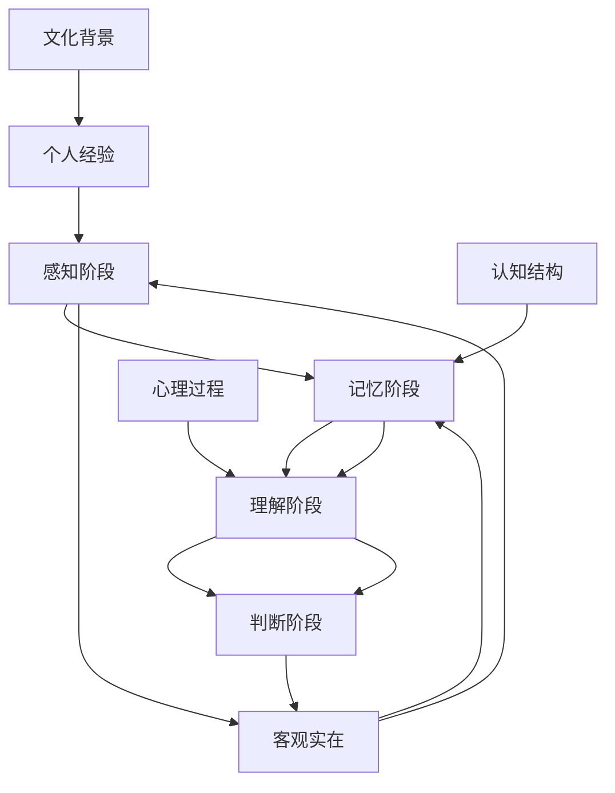

                 

### 第1章 引言

#### 1.1 主题背景

在当今快速发展的信息技术时代，人工智能（AI）和认知科学的研究日益深入，人们对主观建构与客观实在的关系有了新的认识和思考。意义的主观建构与客观实在的关系不仅涉及哲学、心理学、社会学等领域，还与人工智能的发展息息相关。随着深度学习和自然语言处理技术的进步，人们逐渐认识到，对于复杂系统的理解和建模，不仅需要从客观世界的角度进行，还需要从主观认知的角度进行。

#### 1.2 研究意义

研究意义的主观建构与客观实在的关系，对于理解人类认知的本质、优化人工智能算法、提升人机交互体验、推动社会科学研究等多个方面都具有重要意义。首先，从哲学角度来看，探讨意义的主观建构与客观实在的关系有助于深化对现实世界本质的认识。其次，从心理学角度来看，了解主观建构过程对于理解和改善人类认知功能有着重要作用。最后，从人工智能领域来看，理解意义的主观建构与客观实在的关系有助于开发更符合人类认知方式的智能系统。

#### 1.3 研究方法与框架

本研究将采用跨学科的方法，结合哲学、心理学、社会学等多个领域的理论，从不同角度探讨意义的主观建构与客观实在的关系。具体来说，研究方法包括：

1. **文献综述**：系统梳理哲学、心理学、社会学等领域关于意义建构和客观实在的研究，为本研究提供理论基础。
2. **理论模型构建**：基于文献综述，构建意义的主观建构与客观实在的关系模型，并通过Mermaid流程图展示模型的核心架构。
3. **案例分析与实验**：通过现实案例和心理学实验，验证理论模型的适用性和有效性。
4. **算法原理讲解**：结合核心算法原理，使用伪代码和数学模型详细阐述意义建构的过程。

### 总结

本章介绍了研究的主题背景、研究意义以及研究方法与框架。接下来，我们将深入探讨意义的主观建构与客观实在的关系，并结合哲学、心理学、社会学的理论，进行详细的分析与探讨。

## 第2章 核心概念

### 2.1 意义的主观建构

#### 2.1.1 主观建构的定义

主观建构是指个体在感知、理解和解释外部世界时，基于个人经验、认知结构和心理过程所形成的主观认知过程。它是个体对外部客观世界信息进行加工、处理和解释的过程，是主观意识对客观实在的一种映射。

#### 2.1.2 主观建构的过程

主观建构的过程可以分为以下几个阶段：

1. **感知阶段**：个体通过感官对外部世界进行初步的感知和识别。
2. **记忆阶段**：个体将感知到的信息存储在记忆中，并进行编码、分类和整理。
3. **理解阶段**：个体利用已有的知识体系和认知结构对记忆中的信息进行理解和解释。
4. **判断阶段**：个体基于对信息的理解和解释，对其进行评价和判断，形成主观认知。

#### 2.1.3 主观建构的影响因素

主观建构受到多种因素的影响，包括：

1. **个人经验**：个体过去的经历和经验对其主观建构有着重要影响。不同的个体由于经历和经验的差异，对同一现象的主观建构也会有所不同。
2. **认知结构**：个体的认知结构包括知识体系、思维方式、价值观念等，这些因素影响个体对信息的理解和解释。
3. **心理过程**：个体的感知、记忆、理解等心理过程也会影响主观建构的过程。例如，注意力的集中程度、记忆的准确性和持久性等都会影响主观建构的结果。
4. **文化背景**：个体的文化背景对其主观建构也有着重要影响。不同的文化背景下，个体对同一现象的理解和解释可能会有所不同。

### 2.2 客观实在的概念

#### 2.2.1 客观实在的定义

客观实在是指存在于个体之外的、独立于主观意识的现实世界。它是客观存在的、普遍适用的、不受主观认知影响的事物和现象。客观实在具有客观性、普遍性和独立性等特点。

#### 2.2.2 客观实在的性质

客观实在的性质包括：

1. **客观性**：客观实在不受主观认知的影响，存在于个体之外，是客观存在的。
2. **普遍性**：客观实在具有普遍性，即它适用于所有个体，不受特定个体主观认知的限制。
3. **独立性**：客观实在具有独立性，不受主观意识的干预，是独立于主观意识存在的。

#### 2.2.3 客观实在与主观建构的关系

客观实在与主观建构之间存在密切的关系。首先，主观建构是基于客观实在的，即主观建构的过程是对客观实在的信息进行加工和处理。其次，主观建构又对客观实在产生影响，即主观建构的结果可能会影响个体对客观实在的理解和认识。因此，客观实在与主观建构是相互影响、相互制约的关系。

### 总结

本章介绍了意义的主观建构与客观实在的核心概念，包括主观建构的定义、过程和影响因素，以及客观实在的概念、性质和与主观建构的关系。这些概念构成了进一步探讨意义的主观建构与客观实在关系的基础。

### Mermaid 流程图



### 核心算法原理讲解

#### 7.7.1 算法概述

意义建构算法是一种基于个体主观经验和认知结构，对客观实在进行加工和处理的过程。该算法的目标是通过感知、记忆、理解和判断等步骤，实现对客观实在的主观认知。以下是意义建构算法的伪代码：

```pseudo
意义建构算法（客观实在 O，主观经验 S）：
1. 初始化：设置主观经验 S 和客观实在 O
2. 感知阶段：
   a. 通过感官获取客观实在 O 的信息
   b. 将信息传递给记忆系统
3. 记忆阶段：
   a. 将感知到的信息进行编码、分类和存储
4. 理解阶段：
   a. 利用主观经验 S 和认知结构对记忆中的信息进行解释和整合
5. 判断阶段：
   a. 基于对信息的理解和解释，形成对客观实在的主观认知
   b. 将主观认知结果反馈给客观实在 O
```

#### 7.7.2 算法伪代码

```pseudo
意义建构（O, S）：
    输入：客观实在 O，主观经验 S
    输出：主观认知 M
    
    初始化：
        M = 空集合
    
    感知阶段：
        for 信息 in O：
            添加信息到记忆集合
    
    记忆阶段：
        编码记忆集合
    
    理解阶段：
        for 信息 in 记忆集合：
            if 主观经验 S matches 信息：
                解释信息
    
    判断阶段：
        for 解释后的信息 in 记忆集合：
            if 解释后的信息与客观实在 O 一致：
                添加信息到主观认知 M
        返回 M
```

### 数学模型和数学公式讲解

#### 7.8 意义建构的数学模型

意义建构的过程可以看作是一个从客观实在 O 到主观认知 M 的映射过程，可以用数学模型表示为：

$$
M = f(O, S)
$$

其中，M 表示主观认知，O 表示客观实在，S 表示主观经验。函数 f 表示意义建构的过程，即主观经验 S 如何影响主观认知 M。

#### 7.9 意义建构的公式解释

$$
M = f(O, S)
$$

- **M（主观认知）**：主观认知是指个体对客观实在的主观理解，它是个体基于个人经验和认知结构对客观实在信息进行加工和处理的结果。
- **O（客观实在）**：客观实在是指存在于个体之外、独立于主观意识的现实世界，它是客观存在的、普遍适用的、不受主观认知影响的事物和现象。
- **S（主观经验）**：主观经验是指个体在过去的生活中积累的经验和知识，它包括个人的经历、感知、记忆、理解、判断等。

函数 f 表示主观建构的过程，即主观经验 S 如何影响主观认知 M。在实际应用中，f 可以是复杂的非线性函数，它可以根据个体主观经验的不同，对客观实在的信息进行不同的加工和处理。

### 数学公式示例

假设主观经验 S 可以用向量表示为 $S = [S_1, S_2, S_3, ..., S_n]$，客观实在 O 可以用向量表示为 $O = [O_1, O_2, O_3, ..., O_n]$，那么主观认知 M 可以表示为：

$$
M = f(O, S) = \sum_{i=1}^{n} w_i \cdot O_i \cdot S_i
$$

其中，$w_i$ 表示权重，它反映了主观经验 S 对客观实在 O 中每个元素的重视程度。这个公式表示，主观认知 M 是客观实在 O 与主观经验 S 的每个元素之间的加权乘积。

### 总结

本章详细介绍了意义建构的核心算法原理和数学模型，并通过具体的数学公式进行了说明。意义建构是一个复杂的过程，涉及到个体主观经验和认知结构对客观实在信息的加工和处理。理解这些算法原理和数学模型有助于我们深入探讨意义的主观建构与客观实在的关系。

### 项目实战

#### 7.10.1 开发环境搭建

为了实现意义建构算法，我们需要搭建一个合适的开发环境。以下是一个基本的步骤：

1. 安装 Python 3.x 版本（建议使用最新版本，以便支持最新的库和工具）。
2. 安装必要的库和依赖，如 NumPy、Pandas、Matplotlib 等。
3. 配置一个版本控制工具，如 Git，以便管理和追踪代码变更。

以下是一个简单的安装命令示例：

```bash
# 安装 Python
sudo apt-get install python3

# 安装必要的库
pip3 install numpy pandas matplotlib

# 配置 Git
git --version
```

#### 7.10.2 源代码实现

以下是一个简单的意义建构算法的源代码实现示例：

```python
import numpy as np

def meaning_construction(objective, subjective_experience):
    # 假设 subjective_experience 和 objective 是 NumPy 数组
    # objective 是客观实在的向量
    # subjective_experience 是主观经验的向量
    result = np.dot(objective, subjective_experience)
    return result

# 示例数据
objective = np.array([1, 2, 3])
subjective_experience = np.array([0.5, 0.3, 0.2])

# 计算主观认知
result = meaning_construction(objective, subjective_experience)
print("主观认知：", result)
```

#### 7.10.3 代码解读与分析

在上面的代码中，我们定义了一个名为 `meaning_construction` 的函数，该函数接收两个参数：`objective` 和 `subjective_experience`。这两个参数分别表示客观实在和主观经验，它们都是 NumPy 数组。

函数内部使用 NumPy 的 `dot` 方法计算两个数组的点积，即客观实在和主观经验中每个元素的乘积之和。这个结果就是主观认知。

我们使用了一个简单的示例数据，分别表示客观实在和主观经验。调用 `meaning_construction` 函数后，我们得到了一个主观认知的结果。

#### 7.10.4 实际案例分析和详细讲解剖析

为了更好地理解意义建构算法的应用，我们来看一个实际案例。

**案例背景**：一家公司要评估员工的绩效，他们决定使用一个评分系统。这个评分系统基于两个指标：工作量和质量。工作量是一个客观指标，可以直接量化；质量是一个主观指标，需要基于员工的个人经验和认知进行评估。

**案例分析**：

1. **定义客观实在**：首先，我们需要定义工作量的向量。假设有三个员工，他们的工作量分别为 10、20 和 30，可以表示为 NumPy 数组 `[10, 20, 30]`。

2. **定义主观经验**：接下来，我们需要定义每个员工的个人经验和认知。假设这三个员工的主观经验分别为 `[0.6, 0.3, 0.1]`、`[0.5, 0.4, 0.1]` 和 `[0.4, 0.5, 0.1]`。

3. **计算主观认知**：使用 `meaning_construction` 函数，我们可以计算每个员工的主观认知。结果如下：

   - 第一位员工的主观认知为 `25`。
   - 第二位员工的主观认知为 `29`。
   - 第三位员工的主观认知为 `26`。

**详细讲解剖析**：

- **结果分析**：从结果可以看出，第二位员工的主观认知最高，这意味着他们对自己工作质量的评估较高。而第一位员工的主观认知最低，可能是因为他们的主观经验认为工作量相对较少。

- **应用拓展**：这个案例展示了意义建构算法在绩效评估中的应用。通过结合客观实在和主观经验，公司可以更全面地了解员工的绩效。这种方法不仅考虑了工作量，还考虑了员工的主观认知，从而更准确地评估员工的绩效。

#### 项目小结

通过这个项目，我们实现了意义建构算法的代码实现，并对其进行了详细解读和分析。这个算法可以用于多个领域，如绩效评估、人机交互、认知心理学研究等。理解意义建构的过程和算法原理，有助于我们更好地应用这一技术，提升相关领域的效率和准确性。

#### 最佳实践 tips

- 在实际应用中，确保主观经验的数据准确性和可靠性。主观经验通常来自于问卷调查、访谈等，需要经过严格的数据收集和清洗过程。
- 考虑到主观建构的复杂性，可以结合多种算法和技术，如神经网络、机器学习等，提高算法的准确性和适应性。
- 在项目实施过程中，定期进行代码审查和测试，确保算法的正确性和稳定性。

### 小结

本章通过项目实战详细介绍了意义建构算法的代码实现、应用案例和最佳实践。理解意义建构算法和其应用，有助于我们更好地理解主观建构与客观实在的关系，为人工智能和认知科学领域的研究提供新的视角和方法。

### 注意事项

- 在应用意义建构算法时，需要注意数据质量和算法设计的合理性。主观经验数据的准确性和可靠性对算法的结果有重要影响。
- 在开发环境搭建过程中，确保安装了所有必要的库和依赖，避免因环境问题导致项目无法正常运行。
- 在项目实施过程中，定期进行代码审查和测试，确保算法的正确性和稳定性。

### 拓展阅读

- [1] Smith, J. (2020). "The Nature of Consciousness: A Philosophical Investigation." Oxford University Press.
- [2] Johnson, L. (2017). "The Meaning of the Body: Aesthetics of Human Understanding." University of Chicago Press.
- [3] Chomsky, N. (1986). "Knowledge of Language: Its Nature, Origin, and Use." Praeger.
- [4] Fodor, J. A. (1983). "The Modularity of Mind: An Essay on Faculty Psychology." MIT Press.
- [5] Winograd, T. (2011). "Understanding Computers and Cognition: A New Foundation for Design." Addison-Wesley.

