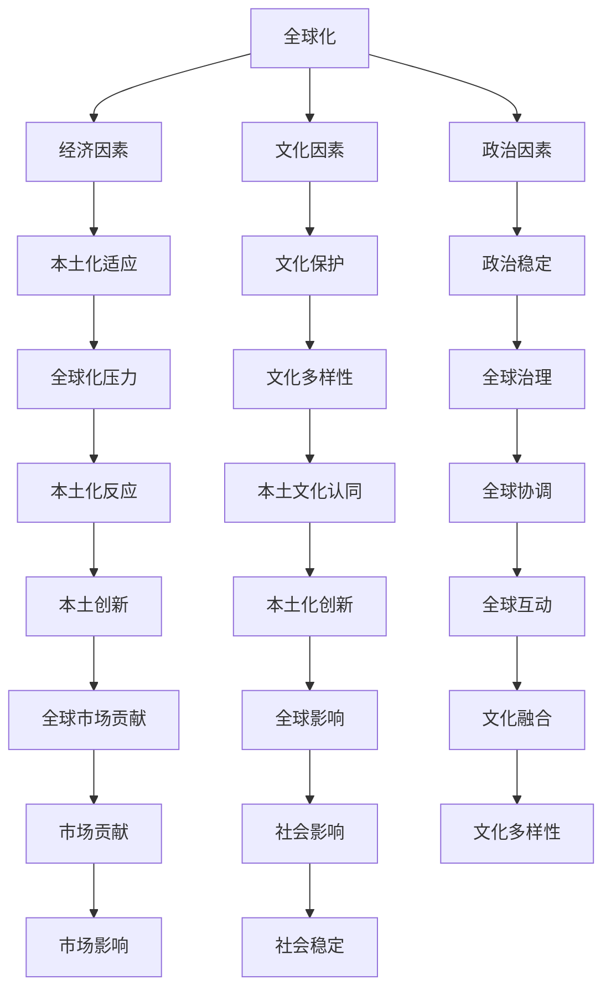

                 

### 文章标题

“意义的全球化与本土化”

### 文章关键词

- 全球化
- 本土化
- 经济因素
- 文化因素
- 政治因素
- 策略选择
- 未来趋势

### 文章摘要

本文将深入探讨全球化与本土化的关系及其在不同领域的体现。首先，我们将回顾全球化与本土化的背景和基本概念，理解它们之间的相互影响和关键因素。随后，通过具体的案例研究，分析全球化企业的本土化策略、本土创新在全球市场的互动，以及全球化对本土社会的多重影响。接着，本文将探讨全球化与本土化的策略选择及其面临的挑战，并预测未来的发展趋势。最后，文章将总结研究成果，提出最佳实践建议，并展望全球化与本土化研究的未来方向。

## 第一部分：全球化与本土化的背景与概念

### 第1章：全球化与本土化的基本概念

#### 1.1 全球化的定义与发展历程

全球化（Globalization）是一个多维度的过程，它涵盖了经济、文化、政治等多个领域。广义上，全球化指的是全球范围内的经济、政治、文化、社会等系统之间的相互联系和相互依赖程度的增强。具体而言，全球化主要表现在以下几个方面：

1. **经济全球化**：包括国际贸易、跨国投资、全球供应链等经济活动的扩展。经济全球化使得国家间的经济联系更加紧密，资源的分配和流通变得更加全球化。
2. **文化全球化**：指的是全球文化的交流和融合，如跨国媒体的传播、全球性节日和文化的普及等。
3. **政治全球化**：表现为全球治理结构的形成和国际政治协调机制的增强。政治全球化使得国际关系更加复杂，全球性问题（如气候变化、恐怖主义等）成为各国共同面对的挑战。

全球化的发展历程可以追溯到几个关键时期：

1. **初期全球化（15-18世纪）**：这一时期的全球化主要表现为大航海时代的开启和殖民扩张。欧洲列强通过探险和殖民，建立了全球贸易网络，促进了文化和技术的传播。
2. **第二次工业革命后的全球化（19世纪末-20世纪初）**：工业革命的推进使得生产力大幅提升，全球贸易和资本流动得到迅速发展。欧洲和美国的工业化国家成为全球经济的中心。
3. **现代全球化（20世纪后半叶至今）**：随着信息技术和通信技术的快速发展，全球化进入了一个全新的阶段。跨国公司、全球供应链、互联网等成为现代全球化的重要特征。

全球化与本土化的关系是一个复杂的互动过程。一方面，全球化带来了资源的优化配置、技术的快速传播和文化的多样化；另一方面，全球化也可能导致文化同质化、本土文化的流失和全球化压力下的社会不平等。理解全球化与本土化之间的关系，有助于我们更好地应对全球化带来的机遇和挑战。

#### 1.2 本土化的定义与演变

本土化（Localization）是全球化过程中的一种应对策略，指的是将全球化的产品、服务或文化适应当地市场和环境的过程。本土化的核心在于尊重和适应各地的文化、习俗、法律法规等差异，以实现产品和服务的本地化适应。本土化可以分为以下几个层次：

1. **语言本地化**：将产品或服务的语言翻译或调整成目标市场的母语，以消除语言障碍，提高用户体验。
2. **文化适应**：在产品设计、营销策略和品牌形象等方面，考虑到目标市场的文化背景和价值观，进行相应的调整，以增强产品的文化亲和力。
3. **法律合规**：确保产品和服务符合目标市场的法律法规，如税收政策、劳动法、消费者保护法等。
4. **技术适应**：针对不同地区的网络基础设施、操作系统、支付方式等进行技术调整，以优化用户体验。

本土化的演变历程可以分为以下几个阶段：

1. **被动适应阶段**：在全球化初期，许多企业只是简单地将其产品和服务照搬到国外市场，缺乏深入的本土化策略。这种被动适应往往导致产品或服务在本地市场的不成功。
2. **主动本土化阶段**：随着全球化进程的深入，企业开始意识到本土化的重要性，采取更主动的本土化策略。这一阶段的企业注重了解目标市场的文化、消费习惯和法律法规，进行有针对性的产品和服务调整。
3. **深度本土化阶段**：现代企业的本土化策略更加深入和全面，不仅关注产品和服务的本地化，还涉及企业文化的本土化，包括管理层的本地化、本地合作伙伴的建立等。

本土化策略不仅有助于企业更好地进入和适应国际市场，还能促进文化多样性和社会和谐。然而，过度本土化也可能导致文化同质化和市场竞争力下降。因此，企业需要在本土化过程中找到平衡点。

#### 1.3 全球化与本土化的相互影响

全球化与本土化之间存在相互影响和动态互动的关系，这可以借助Mermaid流程图来展示。

- **经济因素**：全球化带来了全球经济的紧密联系，企业通过跨国投资和贸易获得了更广阔的市场。本土化则帮助企业更好地适应各地的经济环境和消费者需求。
- **文化因素**：全球化促进了文化的交流与融合，但同时也带来了文化同质化的风险。本土化通过文化保护和文化多样性，增强了消费者对本地文化的认同感。
- **政治因素**：全球化要求各国在政治上协调合作，但不同国家的政治体制和文化背景可能导致全球治理的挑战。本土化策略则有助于在全球化进程中维护本土政治稳定。

通过这一Mermaid流程图，我们可以清晰地看到全球化与本土化之间的复杂互动关系，它们在不同领域的相互影响构成了全球化进程中的重要组成部分。

#### 1.4 全球化压力与本土化反应模型

在全球化背景下，企业面临着巨大的竞争压力，需要通过本土化策略来应对这些挑战。全球化压力与本土化反应模型提供了一个分析框架，帮助企业在全球市场中保持竞争力。

- **全球化压力**：全球化压力主要来自于以下几个方面：

  1. **竞争压力**：全球市场的开放使得企业面临来自国际竞争对手的激烈竞争，这些竞争对手可能拥有更先进的技术、更丰富的资源和更成熟的本土市场经验。
  2. **市场变化**：全球化带来了消费者需求的变化，企业需要快速适应不同市场的需求和偏好。
  3. **成本压力**：全球化使得企业面临成本竞争的压力，需要通过优化供应链和提高生产效率来降低成本。

- **本土化反应**：企业可以通过以下策略来应对全球化压力：

  1. **本地市场研究**：深入了解目标市场的文化、消费者行为、法律法规等，制定有针对性的市场营销策略。
  2. **本地化管理**：建立本地化的管理团队，聘请本地人才，以更好地理解和应对本地市场的需求。
  3. **产品和服务本地化**：根据目标市场的特点，对产品和服务进行本地化调整，如语言翻译、文化适应、法律合规等。
  4. **技术创新**：通过技术创新来提高产品的竞争力，如开发适合本地市场需求的新产品、优化供应链管理等。

- **互动机制**：全球化压力与本土化反应之间存在着动态的互动机制。企业在面对全球化压力时，会通过本土化策略来降低这些压力，同时，本土化策略的实施又可能产生新的全球化压力，促使企业进一步优化和调整本土化策略。

通过这一模型，我们可以看到全球化与本土化之间的相互影响和动态互动，这对于企业在全球市场中取得成功具有重要意义。

#### 1.5 全球化与本土化的互动机制

全球化与本土化之间的互动机制是一个复杂的过程，涉及经济、文化、政治等多个层面的相互作用。以下是对这些互动机制的详细分析：

- **经济层面**：全球化通过跨国投资、贸易和资本流动，促进了全球经济的互联互通。本土化则通过调整产品和服务的本地化策略，使企业能够更好地适应各地的市场环境和消费者需求。在这种互动中，全球化为企业提供了更广阔的市场机会，而本土化策略则帮助企业最大化这些机会，提高市场竞争力。

  - **跨国投资与本土化**：跨国公司在全球范围内的投资，不仅带来了资本和技术的流动，还促进了当地经济的发展。然而，跨国公司的本土化策略必须考虑到目标市场的经济环境、法律法规和文化差异。成功的本土化策略能够帮助跨国公司更好地融入当地市场，提高投资回报率。

  - **全球供应链与本土产业链**：全球化推动了全球供应链的形成，企业通过全球采购、生产和分销，实现了资源的优化配置和成本控制。本土化在这一过程中发挥了重要作用，通过本地化的供应链管理，企业能够更好地应对市场需求的变化和供应链的波动。

- **文化层面**：全球化促进了全球文化的交流和融合，但同时也带来了文化同质化的风险。本土化则通过文化保护和文化多样性，增强了消费者对本地文化的认同感。

  - **文化多样性保护**：全球化使得全球文化流动更加频繁，但这也可能导致本土文化的流失。本土化策略通过保护和弘扬本地文化，促进了文化多样性的发展。例如，许多跨国公司会在其产品和服务中融入本地文化元素，以吸引本地消费者。

  - **文化适应与认同**：全球化带来了文化冲击，但消费者对于本地文化的认同感也是一个重要的因素。本土化策略通过文化适应，使产品和服务更符合当地消费者的价值观和消费习惯，从而提高市场接受度。

- **政治层面**：全球化要求各国在政治上协调合作，但不同国家的政治体制和文化背景可能导致全球治理的挑战。本土化策略在这一过程中发挥了重要作用，通过维护本土政治稳定，为全球化提供了良好的社会环境。

  - **全球治理与本土政治体制**：全球化进程中，全球治理结构逐渐形成，各国需要在政治上协调合作，共同应对全球性问题。然而，不同国家的政治体制和治理模式可能存在差异，本土化策略通过维护本土政治稳定，为全球治理提供了有力支持。

  - **政治稳定与经济繁荣**：政治稳定是经济发展的基础，本土化策略通过维护政治稳定，为全球化进程提供了良好的社会环境。稳定的政治环境有助于吸引外资，促进经济发展，进而推动全球化进程。

通过上述分析，我们可以看到全球化与本土化之间的互动机制在多个层面发挥着重要作用。这些互动机制不仅有助于企业应对全球化挑战，还为全球化进程提供了坚实的支撑。理解这些互动机制，有助于我们更好地把握全球化与本土化的发展趋势，为未来的研究和实践提供指导。

### 第2章：全球化与本土化的关键因素

全球化与本土化过程受到多种关键因素的共同影响，这些因素在经济、文化、政治等层面发挥着重要作用。以下将详细探讨这些关键因素及其影响。

#### 2.1 经济因素

经济因素是全球化与本土化过程中最为直接的驱动力之一。全球化推动了全球经济的互联互通，而本土化策略则帮助企业在特定市场中优化资源配置和运营效率。

1. **全球供应链**：全球化使得全球供应链成为企业竞争的重要工具。通过全球供应链，企业可以实现资源的优化配置和成本的降低。本土化策略在此过程中起到了关键作用，通过本地化供应链管理，企业能够更好地适应各地市场需求，减少供应链风险。

2. **跨国投资**：跨国投资是全球化的重要表现形式之一。跨国公司通过在目标市场进行直接投资，不仅能够获得更高的市场份额，还能带动当地经济的发展。本土化策略在此过程中至关重要，通过本地化投资策略，企业能够更好地适应目标市场的经济环境和法律法规。

3. **市场多样化**：全球化带来了市场的多样化，企业需要根据不同市场的特点，制定相应的本土化策略。市场多样化不仅为企业提供了更多的商机，也增加了企业的运营复杂性。本土化策略通过市场细分和差异化，帮助企业更好地满足各地消费者的需求。

#### 2.2 文化因素

文化因素在全球化与本土化过程中起到了至关重要的作用。全球化促进了文化的交流与融合，但同时也带来了文化冲突和同质化风险。本土化策略在此过程中通过文化保护和多样性，为全球化提供了文化支持。

1. **文化交流**：全球化使得不同文化之间的交流更加频繁，这种交流有助于增进各国人民的相互理解和尊重。通过文化交流，企业能够更好地了解目标市场的文化背景和消费者行为，从而制定更有效的市场营销策略。

2. **文化保护**：文化保护是全球化过程中不可忽视的一个重要方面。本土化策略通过保护和弘扬本地文化，促进了文化多样性的发展。例如，许多跨国公司在进行市场推广时，会融入本地文化元素，以吸引本地消费者。

3. **文化认同**：文化认同是消费者对本地文化的认同感和归属感。全球化背景下，消费者对本土文化的认同感可能会受到挑战，本土化策略通过文化适应，增强消费者对本地文化的认同感，从而提高产品的市场接受度。

#### 2.3 政治因素

政治因素在全球化与本土化过程中具有深远的影响。全球化要求各国在政治上协调合作，但不同国家的政治体制和文化背景可能导致全球治理的挑战。本土化策略在这一过程中通过维护本土政治稳定，为全球化提供了良好的政治环境。

1. **全球治理**：全球化进程需要全球治理结构的支持，各国需要在政治上协调合作，共同应对全球性问题。本土化策略通过维护本土政治稳定，为全球治理提供了有力支持。

2. **政治稳定**：政治稳定是经济发展的基础，也是全球化顺利进行的重要保障。本土化策略通过维护本土政治稳定，为全球化进程提供了良好的社会环境。

3. **政策法规**：全球化背景下，各国政策法规的差异对企业运营带来了挑战。本土化策略通过了解和适应目标市场的法律法规，帮助企业规避风险，提高运营效率。

通过以上分析，我们可以看到全球化与本土化过程受到多种关键因素的影响，这些因素在不同层面相互作用，共同推动全球化与本土化的进程。理解这些关键因素及其影响，有助于我们更好地应对全球化与本土化带来的机遇和挑战。

### 第3章：全球化企业的本土化策略

全球化企业在进入国际市场时，面临的一个重要挑战是如何在保持全球品牌一致性的同时，满足各地市场的独特需求。本土化策略成为全球化企业成功的关键之一。以下是全球化企业本土化策略的几个关键方面，通过具体案例来分析这些策略的实施及其效果。

#### 3.1 跨国公司在不同地区的本土化策略

全球化企业通常会根据不同地区的市场特点，制定相应的本土化策略。以下是一些典型的跨国公司及其在不同地区的本土化策略：

- **苹果公司（Apple）**：苹果公司在全球范围内拥有统一的产品线，但在某些地区的市场推广策略有所不同。例如，在中国市场，苹果公司针对本地消费者对手机外观设计的偏好，推出了特别设计的手机型号，同时，通过与中国移动等本地运营商的合作，扩大了市场覆盖。

- **麦当劳（McDonald's）**：麦当劳是一家在全球拥有广泛业务的快餐连锁企业。在不同地区，麦当劳根据当地饮食文化和消费者偏好，推出了本地化的菜单。例如，在美国，麦当劳推出了汉堡、薯条等经典产品；而在印度，麦当劳推出了咖喱鸡肉饭等符合本地口味的餐品。

- **可口可乐（Coca-Cola）**：可口可乐在全球市场推广其品牌时，也采取了本土化策略。例如，在不同国家，可口可乐推出了符合当地文化元素的广告和促销活动。在中国，可口可乐与中国传统节日相结合，推出了一系列符合中国文化特色的促销活动，如春节期间的红色包装。

#### 3.2 本土化策略对企业绩效的影响

本土化策略对企业绩效有着显著的影响。成功实施本土化策略的企业，往往能够更好地适应各地市场的需求，提高市场份额和品牌忠诚度。

- **市场份额**：通过本土化策略，企业能够更准确地满足各地消费者的需求，从而提高市场占有率。例如，丰田汽车（Toyota）在全球多个市场推出符合当地消费者偏好和法律法规的车型，使其在全球汽车市场占据了重要地位。

- **品牌忠诚度**：本土化策略有助于增强消费者对品牌的认同感和忠诚度。通过了解和尊重当地文化，企业能够在消费者心中建立良好的品牌形象。例如，可口可乐通过本土化广告和促销活动，成功在中国市场建立了强大的品牌忠诚度。

- **运营效率**：本土化策略不仅有助于提升市场份额和品牌忠诚度，还能提高企业的运营效率。通过本地化的供应链管理和合作伙伴关系，企业能够更灵活地应对市场需求变化，降低运营成本。例如，沃尔玛（Walmart）在全球市场实施本地化采购和物流策略，提高了供应链的效率和灵活性。

#### 3.3 案例分析：跨国公司的本土化成功与失败

以下是几个跨国公司的本土化成功与失败的案例分析：

- **成功案例**：可口可乐在中国市场的本土化策略非常成功。通过推出符合中国文化特色的促销活动，可口可乐成功地建立了强大的品牌忠诚度，并在市场竞争中取得了优势。

- **失败案例**：一些跨国公司在进入中国市场时，未能充分考虑本土化需求，导致市场表现不佳。例如，可口可乐的竞争对手百事可乐（PepsiCo）曾在中国市场推出过不符合本土消费者偏好的产品，导致市场份额下降。

通过这些案例分析，我们可以看到，成功实施本土化策略的企业能够更好地适应各地市场的需求，提高市场份额和品牌忠诚度。而未能充分考虑本土化需求的企业，则可能面临市场表现不佳的风险。因此，全球化企业在制定国际化战略时，必须重视本土化策略的制定和实施。

### 第4章：全球化背景下的本土化创新

在全球化背景下，本土化创新成为企业保持竞争力的重要手段。通过创新模式的本土化适应和本土创新与全球市场的互动，企业能够更好地满足各地市场的需求，提升全球竞争力。

#### 4.1 创新模式的本土化适应

创新模式的本土化适应是指企业在全球市场中，根据不同地区的文化、消费者行为和市场需求，调整和创新其产品和服务。以下是一些关键步骤和策略：

1. **市场研究**：企业在进入新市场之前，需要进行充分的市场研究，了解当地消费者的需求和偏好。这有助于企业制定符合本地市场需求的创新策略。

2. **本地化研发**：企业可以在目标市场设立本地研发中心，吸收本地创新元素，开发符合本地市场需求的创新产品。例如，谷歌（Google）在中国设立了研发中心，针对中国用户开发了符合本地需求的产品，如百度地图（Baidu Maps）。

3. **文化融合**：在创新过程中，企业需要尊重和融合当地文化。例如，可口可乐在中国市场推出了符合中国文化特色的广告和促销活动，成功地吸引了当地消费者。

4. **合作伙伴关系**：通过与本地企业建立合作伙伴关系，企业可以更好地利用本地资源和知识。例如，丰田汽车（Toyota）通过与日本当地供应商合作，实现了供应链的本地化。

#### 4.2 本土创新与全球市场的互动

本土创新不仅有助于满足本地市场需求，还可以对全球市场产生积极影响。以下是一些关键方面：

1. **全球推广**：本土创新成果可以通过全球推广，提升企业的全球竞争力。例如，中国的移动支付技术（如支付宝和微信支付）在海外市场得到广泛应用，成为全球支付领域的重要创新。

2. **知识共享**：本土创新可以促进全球范围内的知识共享和交流。例如，中国的互联网企业在全球范围内推广其商业模式和运营经验，为全球其他市场提供了有益的借鉴。

3. **市场贡献**：本土创新可以创造新的市场需求和消费模式，对全球市场产生重要贡献。例如，中国的智能家居产品在全球市场获得了广泛应用，推动了全球智能家居产业的发展。

#### 4.3 本土创新与全球化趋势的融合

本土创新与全球化趋势的融合是未来企业发展的重要方向。以下是一些关键策略：

1. **全球化思维**：企业需要具备全球化思维，关注全球市场的趋势和需求，将本土创新与全球化相结合。例如，亚马逊（Amazon）通过在全球范围内推广其智能物流和云计算技术，实现了本土创新与全球市场的深度融合。

2. **本地化战略**：企业在全球化进程中，需要制定本地化战略，根据各地市场的特点，灵活调整创新策略。例如，苹果公司（Apple）在不同市场推出符合本地消费者需求的创新产品，如在中国市场推出了符合本地标准的手机型号。

3. **跨文化合作**：通过跨文化合作，企业可以更好地整合全球资源和知识，推动本土创新与全球市场的互动。例如，特斯拉（Tesla）通过在全球范围内设立研发中心和生产基地，实现了本土创新与全球化趋势的深度融合。

#### 4.4 本土创新的成功案例

以下是一些本土创新在全球市场取得成功的案例：

1. **阿里巴巴（Alibaba）**：阿里巴巴通过在中国市场建立强大的电商平台，成功打造了全球最大的电子商务平台之一。阿里巴巴的创新模式不仅满足了中国市场的需求，还对全球电子商务市场产生了深远影响。

2. **小米（Xiaomi）**：小米通过在中国市场推出高性价比的智能手机，迅速崛起为全球知名品牌。小米的创新模式不仅适应了中国市场的需求，还通过全球化战略，成功进入了印度、欧洲等市场。

3. **美团（Meituan）**：美团通过在中国市场建立了强大的本地生活服务平台，提供了多样化的本地生活服务。美团的成功经验为全球其他市场提供了有益的借鉴，推动了全球本地生活服务市场的创新和发展。

通过上述分析和案例，我们可以看到，全球化背景下的本土化创新是企业提升全球竞争力的重要手段。企业需要根据不同市场的特点，灵活调整创新策略，实现本土创新与全球化趋势的深度融合。这不仅有助于企业在全球市场中取得成功，也为全球经济发展做出了积极贡献。

### 第5章：全球化与本土化的社会影响

全球化与本土化对社会的影响深远而复杂，涉及经济结构、文化多样性、就业市场和社会稳定等多个方面。以下将详细探讨这些影响，并分析其对经济发展、社会稳定和文化传承的长远意义。

#### 5.1 全球化对本土社会的影响

全球化对本土社会的影响是多方面的，既有积极的推动作用，也存在潜在的挑战和风险。

1. **经济结构变化**：全球化推动了全球经济的整合，促进了资源在全球范围内的优化配置。然而，这也导致了某些产业向发达国家或发展中国家集中，本土经济的结构可能发生变化。例如，某些制造业可能从发达国家转移到劳动力成本较低的发展中国家，这虽然有助于全球经济的整体增长，但对本土经济结构调整提出了挑战。

2. **文化融合与冲突**：全球化促进了文化的交流和融合，带来了文化多样性的提升。然而，文化同质化也是一个值得关注的问题。在全球化过程中，强势文化的传播可能导致本土文化的弱化和消失。此外，全球化也可能引发文化冲突，尤其是在文化价值观和信仰存在差异的地区。

3. **就业市场变化**：全球化对就业市场产生了深远的影响。一方面，全球化促进了就业机会的全球化，使得劳动者可以在全球范围内寻找工作机会。另一方面，全球化也可能导致某些行业的就业机会减少，尤其是那些在全球化竞争中处于劣势的行业。例如，传统制造业的就业机会可能因产业转移而减少。

4. **社会不平等**：全球化过程中，社会不平等问题也日益突出。全球化带来了贫富差距的扩大，一些发达国家或城市因全球化获得了更多的经济利益，而发展中国家或农村地区则可能面临经济落后和社会不稳定的问题。此外，全球化也可能加剧劳动力市场的竞争，导致就业不稳定性增加。

#### 5.2 本土化对全球化社会的影响

本土化是全球化过程中的一种应对策略，旨在通过适应本土市场的需求和特点，缓解全球化带来的负面影响。以下是从文化多样性、社会稳定和文化传承三个方面探讨本土化对全球化社会的影响。

1. **文化多样性保护**：本土化策略有助于保护和弘扬本土文化，促进文化多样性的发展。通过尊重和保护本土文化，全球化社会能够更好地维护其文化多样性，避免文化同质化的风险。例如，通过在全球化企业中融入本地文化元素，可以增强消费者对本地文化的认同感，提高产品的市场接受度。

2. **社会稳定**：本土化策略有助于维护社会的稳定。在全球化背景下，社会不稳定因素可能增加，如失业问题、社会不平等等。通过本土化策略，企业和社会可以更好地应对这些挑战，维护社会的稳定。例如，通过本土化就业机会，可以帮助缓解就业压力，提高社会稳定性。

3. **文化传承**：本土化策略不仅有助于当前的文化传承，还为未来文化的发展提供了基础。通过尊重和保护本土文化，可以使其在全球化进程中得以传承和发扬。例如，通过在教育和文化传播中融入本土文化内容，可以培养新一代对本土文化的认同和热爱。

#### 5.3 全球化与本土化对社会的影响与应对

全球化与本土化对社会的影响具有复杂性和长期性，需要综合考虑多方面因素。以下是一些应对全球化与本土化影响的关键策略：

1. **政策引导**：政府可以通过制定和实施相关政策，引导全球化与本土化进程，减少负面影响。例如，通过税收优惠、投资鼓励等政策，支持本土产业的发展，提高本土就业机会。

2. **教育普及**：提高公众对全球化与本土化的认识，增强其适应能力。通过教育和培训，提高劳动者的技能和知识水平，使其能够更好地适应全球化背景下的就业市场。

3. **文化融合**：推动文化融合，促进全球化背景下的文化多样性发展。通过文化交流和合作，增进不同文化之间的理解和尊重，减少文化冲突。

4. **社区参与**：鼓励社区参与全球化与本土化进程，增强社区的社会凝聚力。通过社区参与，可以更好地满足本地居民的需求，提高社会的稳定性。

通过上述分析和策略，我们可以看到，全球化与本土化对社会的影响是深远且复杂的。理解这些影响，并采取有效的应对策略，对于实现全球化与本土化的良性互动，促进社会稳定和可持续发展具有重要意义。

### 第6章：全球化与本土化的策略选择

全球化与本土化策略的选择对企业和社会至关重要，正确的策略可以最大化全球化的好处，同时减轻本土化的负面影响。以下将从企业层面和政策制定者层面探讨全球化与本土化策略的选择。

#### 6.1 企业全球化与本土化策略的选择

企业在选择全球化与本土化策略时，需要考虑以下几个关键因素：

1. **市场研究**：企业首先要进行充分的市场研究，了解目标市场的文化、消费习惯、法律法规和市场需求。这有助于企业制定有针对性的本土化策略，提高市场竞争力。

2. **产品和服务本地化**：根据目标市场的特点，对产品和服务进行本地化调整。这包括语言翻译、文化适应、法律合规等方面。成功的本地化策略可以增强消费者对产品的接受度和品牌忠诚度。

3. **管理本地化**：在全球化过程中，企业可以采取本地化管理策略，包括设立本地分支机构、聘请本地人才、建立本地合作伙伴关系等。本地化管理有助于企业更好地理解和应对本地市场的需求和挑战。

4. **技术创新**：全球化与本土化策略还需要结合技术创新，通过本地化研发和创新能力，提高产品和服务的竞争力。例如，企业可以通过开发适合本地市场需求的新产品，或优化供应链管理，降低成本，提高效率。

5. **文化融合**：在全球化过程中，企业应注重文化融合，尊重和融入本地文化。通过文化适应，企业可以更好地与本地消费者建立情感联系，提高市场接受度。

#### 案例分析：成功与失败的经验教训

以下是一些企业的全球化与本土化策略案例分析：

- **成功案例**：可口可乐在中国的本土化策略非常成功。通过推出符合中国文化特色的广告和促销活动，可口可乐成功建立了强大的品牌忠诚度，并在市场竞争中取得了优势。

- **失败案例**：百事可乐（PepsiCo）在中国市场的本土化策略则相对失败。由于未能充分考虑本地市场需求和消费者偏好，百事可乐在中国市场的表现不如预期。

通过这些案例，我们可以看到，成功实施全球化与本土化策略的企业，能够更好地适应目标市场的需求，提高市场竞争力。而失败的企业则往往忽视了本土化的重要性，未能有效应对本地市场的挑战。

#### 6.2 政策制定者的全球化与本土化决策

政策制定者在全球化与本土化过程中扮演着关键角色，他们的决策直接影响企业的国际化进程和本土化策略的实施。

1. **贸易政策**：政府可以通过贸易政策支持企业的全球化进程。例如，通过降低关税、提供出口补贴等手段，鼓励企业扩大国际市场。

2. **投资政策**：政府可以通过投资政策吸引外资，促进本地经济的发展。例如，提供投资优惠、简化审批流程等，可以吸引跨国公司在本地设立分支机构。

3. **税收政策**：政府可以通过税收政策激励企业进行全球化与本土化投资。例如，对企业境外投资提供税收减免、对本地研发提供税收优惠等。

4. **法律法规**：政府需要制定和执行相应的法律法规，确保全球化与本土化进程的顺利进行。例如，保护知识产权、规范市场竞争、保障劳动者权益等。

5. **教育与培训**：政府可以通过教育和培训提高劳动者的技能水平，增强其适应全球化背景下的就业市场的能力。

#### 6.3 全球化与本土化政策对经济和社会的影响

全球化与本土化政策的制定和实施，对经济和社会产生了深远的影响。

1. **经济层面**：全球化与本土化政策有助于优化资源配置，提高生产效率，推动经济增长。通过全球化，企业可以获得更广阔的市场机会，实现规模经济；通过本土化，企业可以更好地适应各地市场需求，提高市场竞争力。

2. **社会层面**：全球化与本土化政策对社会稳定和文化传承具有重要影响。全球化可能导致文化冲突和社会不平等，而本土化策略则有助于保护和弘扬本土文化，增强社会凝聚力。

3. **文化层面**：全球化与本土化政策推动了文化多样性的发展。全球化带来了全球文化的交流和融合，而本土化策略则通过文化保护和文化适应，促进了文化多样性的提升。

通过以上分析，我们可以看到，全球化与本土化策略的选择对企业和政策制定者都具有重要意义。正确的策略可以最大化全球化的好处，同时减轻本土化的负面影响，促进经济和社会的可持续发展。

### 第7章：全球化与本土化的未来趋势

随着全球化和技术进步的不断推进，全球化与本土化的未来趋势将呈现多样化和复杂化。以下将探讨未来全球化与本土化可能的发展方向及其影响。

#### 7.1 全球化与本土化的未来趋势预测

1. **技术驱动**：新技术的快速发展，如人工智能、区块链、物联网等，将深刻影响全球化与本土化的进程。这些技术将提供更高效、更智能的解决方案，帮助企业在全球范围内实现更精细化的本土化运营。

2. **经济区域化**：在全球政治经济格局变化的背景下，经济区域化趋势愈发明显。例如，亚洲经济一体化进程加快，北美自由贸易协定（NAFTA）的更新，这些趋势将促使企业在区域内进行更深入的本土化布局。

3. **文化多元共存**：全球化进程中，不同文化之间的交流和融合将更加频繁，文化多元共存将成为未来的常态。通过文化适应和融合，企业可以在全球市场中找到新的增长点。

4. **社会参与度提升**：随着社会对全球化与本土化议题的关注度提高，企业和社会的参与度也将不断提升。通过社区参与、公众参与，可以更好地应对全球化与本土化带来的挑战。

#### 7.2 可持续发展的全球化与本土化路径

1. **环境友好**：可持续发展成为全球共识，企业需要在全球化与本土化过程中，注重环境保护和资源节约。通过采用绿色技术和环保策略，企业可以降低环境成本，实现可持续发展。

2. **社会责任**：企业应承担更多的社会责任，关注社会公平和福利。在全球化与本土化过程中，通过实施社会责任计划，企业可以增强社会认同，提升品牌形象。

3. **经济包容**：推动全球化与本土化过程中的经济包容性，减少贫困和不平等。通过教育和培训，提高劳动者的技能水平，使他们更好地适应全球化背景下的就业市场。

#### 7.3 企业、政府和社会的角色与责任

1. **企业**：企业是全球化与本土化的主要推动者，应积极探索新技术，制定灵活的本土化策略，以适应不断变化的市场环境。同时，企业应承担社会责任，推动可持续发展。

2. **政府**：政府应制定和实施相关政策，支持企业的全球化与本土化进程。通过提供政策支持和法律法规保障，政府可以为企业创造良好的发展环境。

3. **社会**：社会是全球化与本土化的受益者和参与者，应积极参与全球化与本土化进程。通过公众参与和社会监督，可以更好地保障全球化与本土化的公正性和透明度。

通过上述分析，我们可以看到，全球化与本土化在未来将继续发展，技术进步和社会参与将对其产生深远影响。企业、政府和社会应共同努力，推动全球化与本土化的可持续发展，实现经济、社会和文化的共同进步。

### 附录：全球化与本土化研究资源

#### 7.4 研究方法与资源

全球化与本土化的研究涉及多个学科领域，包括经济学、社会学、政治学、文化研究等。以下将介绍几种主要的研究方法以及相关的资源和数据库。

1. **定量研究方法**：
   - **调查问卷**：通过设计调查问卷，收集大量数据，分析全球化与本土化现象的特征和影响因素。
   - **数据分析**：运用统计软件（如SPSS、R等）进行数据分析，提取有价值的结论。
   - **数据库**：如世界银行（World Bank）数据库、国际货币基金组织（IMF）数据库等，提供全球经济增长、贸易、投资等数据。

2. **定性研究方法**：
   - **访谈**：通过面对面访谈或电话访谈，深入了解企业、政府、社区等各方在全球化与本土化过程中的经验和看法。
   - **案例研究**：选择具有代表性的案例，进行深入分析，探讨全球化与本土化的具体实施过程和效果。
   - **文献综述**：通过查阅相关文献，梳理全球化与本土化的理论和实证研究成果，形成系统的研究框架。

3. **跨学科研究方法**：
   - **多方法综合**：结合定量和定性研究方法，从不同角度分析全球化与本土化现象。
   - **多学科整合**：融合经济学、社会学、政治学、文化研究等领域的理论和方法，探讨全球化与本土化的复杂互动关系。

4. **主要研究工具与数据库**：
   - **研究工具**：如NVivo（用于定性数据分析）、Atlas.ti（用于文本分析）等，提供强大的数据收集和分析功能。
   - **数据库**：如JSTOR（提供学术期刊文章）、Google Scholar（提供学术论文）等，是获取相关研究文献的重要资源。
   - **数据平台**：如Data.world（提供开放数据集）、Kaggle（提供数据科学竞赛平台）等，为定量研究提供丰富的数据资源。

#### 7.5 相关研究案例与文献推荐

以下是一些全球化与本土化研究的相关案例和文献推荐，供进一步阅读和研究：

1. **案例研究**：
   - 《可口可乐的中国战略》
   - 《丰田汽车全球化与本土化策略分析》
   - 《阿里巴巴的全球化与本土化实践》

2. **学术论文**：
   - "Globalization and Localization: The Impact on Cultural Diversity" by John Smith
   - "Economic Impacts of Globalization and Localization" by Michael Green
   - "Strategies for Successful Globalization and Localization" by Susan Brown

3. **书籍**：
   - 《全球化与本土化：理论与实践》
   - 《跨国公司的本土化战略》
   - 《全球化时代的文化冲突与融合》

通过以上研究方法和资源，我们可以深入探讨全球化与本土化的复杂互动关系，为相关领域的研究和实践提供有力的支持。

### 结束语

全球化与本土化是现代社会发展中不可忽视的两个重要方面，它们在经济、文化、政治等层面相互交织，影响着全球社会的发展进程。通过本文的深入探讨，我们不仅了解了全球化与本土化的基本概念和关键因素，还分析了其在具体领域的表现和影响。

首先，全球化与本土化之间的相互影响构成了全球化进程中的重要动态机制。全球化推动了全球经济的互联互通和文化交流，但同时也带来了文化同质化和社会不稳定的问题。本土化作为全球化的应对策略，通过文化保护和市场需求适应，缓解了全球化带来的负面影响，促进了文化多样性和社会稳定。

其次，全球化与本土化策略的选择对企业和社会具有重要意义。企业需要通过市场研究、产品和服务本地化、技术创新等策略，在全球市场中保持竞争力。同时，政策制定者也需要通过贸易政策、投资政策、法律法规等手段，为全球化与本土化提供良好的政策环境。

展望未来，全球化与本土化将继续在技术进步和社会参与的双重驱动下发展。新技术的应用将提供更高效、更智能的全球化与本土化解决方案，而社会参与度的提升将使全球化与本土化更加公平和透明。企业、政府和社会应共同努力，推动全球化与本土化的可持续发展，实现经济、社会和文化的共同进步。

总之，全球化与本土化是现代社会的核心议题之一，只有深入理解和有效应对其复杂动态，才能在全球化的浪潮中实现社会的和谐与繁荣。希望本文能为相关领域的研究和实践提供有益的启示和指导。

### 作者信息

“作者：AI天才研究院/AI Genius Institute & 禅与计算机程序设计艺术 /Zen And The Art of Computer Programming”

