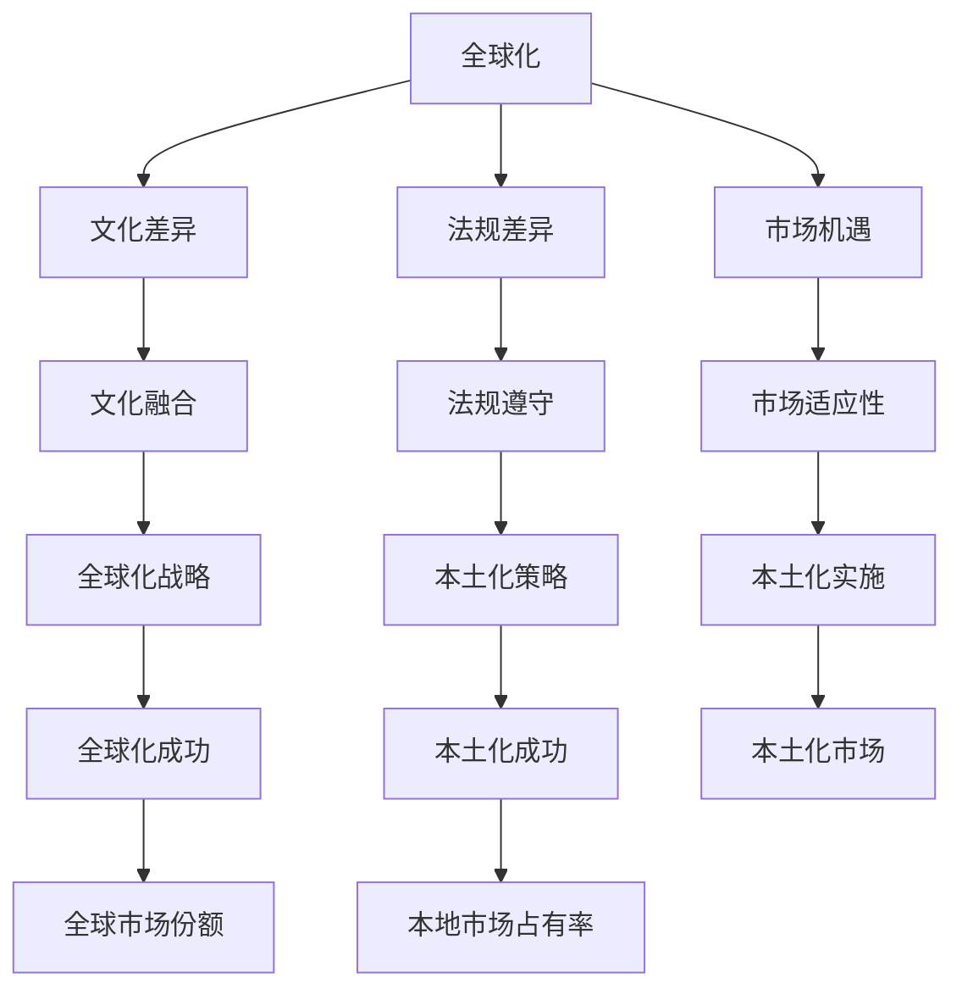

                 

# 文章标题：意义的全球化与本土化的张力

> 关键词：全球化、本土化、张力、冲突、融合、战略、案例分析

> 摘要：本文探讨了全球化与本土化在当今世界中的相互作用和张力。通过分析其背景、核心概念及其关系架构，本文旨在揭示全球化与本土化之间的冲突与融合，并提出解决策略和最佳实践，为企业和个人在全球化和本土化进程中的决策提供参考。

----------------------------------------------------------------

## 引言

### 全球化与本土化的背景

全球化是指全球范围内的经济、文化、政治、社会等方面的相互联系和融合。它始于20世纪中叶，随着信息技术的飞速发展和全球贸易的不断扩大，全球化进程不断加速。全球化带来了前所未有的机遇，如资源、资本、技术和人才的跨国流动，促进了世界各地的经济增长和社会进步。

本土化则是指在全球化背景下，企业或组织根据当地市场的需求、文化特点和法律法规等，对产品、服务、管理和营销策略进行调整和适应。本土化有助于企业更好地融入当地市场，提高市场竞争力，同时也保护了当地的文化和价值观。

### 全球化与本土化的重要性

全球化与本土化在当今世界中的重要性不可忽视。全球化为企业提供了更广阔的市场和更多的机会，促进了全球经济的繁荣。而本土化则有助于企业在全球化进程中保持独特性和竞争力，保护了地方文化和价值观。

然而，全球化与本土化之间也存在一定的张力。全球化追求效率和标准化，而本土化强调多样性和适应性。如何在全球化与本土化之间找到平衡，是企业和个人面临的重要挑战。

----------------------------------------------------------------

## 全球化部分

### 2.1 全球化的概念与历史

#### 2.1.1 全球化的起源与发展

全球化作为一个概念，最早可以追溯到18世纪末和19世纪初的工业革命时期。工业革命的兴起，使得生产力的飞速提高，促进了商品和劳动力的跨国流动。随着交通和通信技术的不断进步，全球化的进程逐渐加快。

20世纪中叶，冷战结束和信息技术的发展，为全球化提供了更加有利的环境。世界贸易组织的成立和跨国公司的崛起，进一步推动了全球化的进程。

#### 2.1.2 全球化的核心理论

全球化的核心理论主要包括：

1. **世界体系理论**：该理论认为，世界是由中心国家和外围国家组成的体系，中心国家掌握着经济、政治和文化的权力，而外围国家则处于依赖地位。

2. **跨国主义理论**：该理论强调跨国公司和跨国组织在全球治理中的作用，认为它们是推动全球化的重要力量。

3. **文化全球化理论**：该理论关注全球化对文化的影响，认为全球化导致了文化的同质化和多元化。

#### 2.1.3 全球化的影响

全球化的影响是多方面的，包括经济、政治、文化和社会等方面：

1. **经济影响**：全球化促进了全球贸易和投资的自由化，推动了全球经济的发展。但同时，全球化也加剧了贫富差距和资源分配不均。

2. **政治影响**：全球化对主权国家的主权观念和治理模式提出了挑战。全球治理和国际合作成为解决全球性问题的重要手段。

3. **文化影响**：全球化促进了文化的交流和融合，但也导致了文化冲突和本土文化的侵蚀。

4. **社会影响**：全球化改变了人们的生活方式和社会结构，带来了机遇和挑战。

----------------------------------------------------------------

### 2.2 全球化的策略与实施

#### 2.2.1 全球化战略规划

全球化战略规划是企业进行全球化的重要步骤。一个成功的全球化战略应包括以下方面：

1. **市场定位**：明确企业目标市场，分析市场需求和竞争态势。

2. **资源配置**：合理配置企业资源，包括人力资源、财务资源和技术资源。

3. **管理架构**：建立适合全球化运营的管理架构，如跨国团队、区域总部等。

4. **文化融合**：重视跨文化管理，尊重和融合不同文化的价值观和习俗。

#### 2.2.2 全球化营销策略

全球化营销策略是企业实现全球化目标的重要手段。以下是一些常见的全球化营销策略：

1. **品牌国际化**：打造具有全球影响力的品牌，提高企业在国际市场的知名度和美誉度。

2. **市场多元化**：在多个国家和地区开展业务，降低市场风险。

3. **本地化营销**：根据当地市场的需求、文化特点和法律法规，调整产品、服务和营销策略。

4. **网络营销**：利用互联网和社交媒体平台，拓展国际市场。

#### 2.2.3 全球化组织管理

全球化组织管理是企业成功实施全球化战略的关键。以下是一些全球化组织管理的策略：

1. **跨国团队**：建立跨国团队，促进不同国家和地区之间的沟通和协作。

2. **本地化管理**：尊重和依赖当地管理团队，提高本地市场竞争力。

3. **文化培训**：开展文化培训，增强员工对跨文化管理的理解和能力。

4. **绩效评估**：建立科学合理的绩效评估体系，激励员工积极参与全球化进程。

----------------------------------------------------------------

## 本土化部分

### 3.1 本土化的概念与特点

#### 3.1.1 本土化的定义

本土化是指在全球化背景下，企业或组织根据当地市场的需求、文化特点和法律法规等，对产品、服务、管理和营销策略进行调整和适应。本土化的目标是使企业在当地市场获得成功，同时保护当地的文化和价值观。

#### 3.1.2 本土化的特征

本土化具有以下特征：

1. **文化适应性**：本土化强调对当地文化的理解和尊重，使产品和服务能够更好地融入当地市场。

2. **法规合规性**：本土化要求企业遵守当地的法律法规，确保业务合法合规。

3. **市场针对性**：本土化强调根据当地市场的特点和需求，调整产品和服务策略。

4. **管理灵活性**：本土化要求企业具备灵活的管理体系，能够快速适应市场变化。

#### 3.1.3 本土化的目标

本土化的目标包括：

1. **市场占有率**：提高企业在当地市场的占有率，实现盈利目标。

2. **品牌形象**：提升企业在当地市场的品牌形象和知名度。

3. **社会责任**：尊重和保护当地文化和价值观，履行社会责任。

4. **风险控制**：降低因文化差异和法律风险带来的业务风险。

----------------------------------------------------------------

### 3.2 本土化的策略与实施

#### 3.2.1 本土化战略规划

本土化战略规划是企业在全球化和本土化进程中必须考虑的关键环节。以下是一些本土化战略规划的建议：

1. **市场调研**：深入了解当地市场的需求、竞争态势和消费习惯。

2. **文化适应**：了解和尊重当地文化，使产品和服务能够更好地融入当地市场。

3. **法规遵守**：遵守当地法律法规，确保业务合法合规。

4. **资源整合**：整合企业内外部资源，提高本土化实施的效率和效果。

5. **风险管理**：制定风险管理策略，降低文化差异和法律风险。

#### 3.2.2 本土化营销策略

本土化营销策略是企业实现本土化目标的重要手段。以下是一些本土化营销策略：

1. **本地化广告**：根据当地文化特点，制定有针对性的广告策略。

2. **文化营销**：利用当地文化元素，提升品牌形象和知名度。

3. **社交媒体营销**：利用社交媒体平台，与当地消费者建立互动关系。

4. **本地化促销**：根据当地市场需求，制定具有吸引力的促销活动。

5. **公关活动**：积极参与当地社会公益活动，提升品牌形象和社会责任感。

#### 3.2.3 本土化组织管理

本土化组织管理是企业成功实施本土化战略的关键。以下是一些本土化组织管理的策略：

1. **本地化管理团队**：建立由当地专业人士组成的本土化管理团队，提高本地市场竞争力。

2. **跨文化培训**：开展跨文化培训，增强员工对本地市场的理解和适应能力。

3. **本地化运营**：根据当地市场需求，调整运营模式和管理流程。

4. **绩效评估**：建立科学合理的绩效评估体系，激励员工积极参与本土化进程。

----------------------------------------------------------------

## 张力分析

### 4.1 全球化与本土化的张力

#### 4.1.1 张力的来源

全球化与本土化之间的张力主要来源于以下几个方面：

1. **文化差异**：全球化强调统一的全球标准，而本土化则强调尊重和适应本地文化。这种文化差异可能导致冲突和矛盾。

2. **利益冲突**：全球化追求效率和规模经济，而本土化则关注市场细化和个性化需求。这种利益冲突可能导致资源分配和战略决策上的分歧。

3. **法规差异**：全球化要求企业遵守全球通用法规，而本土化要求企业遵守本地法律法规。这种法规差异可能导致合规风险和业务障碍。

#### 4.1.2 张力的影响

全球化与本土化之间的张力对企业的影响主要表现在以下几个方面：

1. **运营效率**：张力可能导致企业运营效率降低，如资源浪费、决策延迟等。

2. **市场竞争力**：张力可能导致企业在某些本地市场失去竞争力，如产品不适应、服务不到位等。

3. **品牌形象**：张力可能导致企业在某些本地市场形象受损，如文化冲突、法规违规等。

#### 4.1.3 张力的解决策略

为了解决全球化与本土化之间的张力，企业可以采取以下策略：

1. **文化融合**：在全球化与本土化之间寻找平衡，实现文化融合。例如，通过跨文化培训、文化交流等方式，提高员工对本地文化的理解和适应能力。

2. **利益协调**：通过沟通和协商，协调全球化与本土化之间的利益冲突。例如，通过资源整合、战略调整等方式，实现双赢。

3. **法规遵守**：尊重和遵守本地法律法规，降低合规风险。例如，通过法律咨询、合规培训等方式，提高员工的法规意识和合规能力。

----------------------------------------------------------------

### 4.2 全球化与本土化的平衡

#### 4.2.1 平衡的重要性

在全球化和本土化之间找到平衡，对于企业成功实施全球化战略至关重要。平衡不仅有助于提高企业运营效率和竞争力，还有助于保护本地文化和价值观。

#### 4.2.2 平衡的方法

企业可以通过以下方法实现全球化与本土化的平衡：

1. **文化适应性**：根据当地市场需求和文化特点，调整产品和服务策略。例如，通过本地化广告、文化营销等方式，提高品牌形象和知名度。

2. **法规遵守**：尊重和遵守本地法律法规，降低合规风险。例如，通过法律咨询、合规培训等方式，提高员工的法规意识和合规能力。

3. **资源整合**：整合全球和本地资源，提高资源利用效率。例如，通过全球采购、本地生产等方式，实现资源优化配置。

4. **跨文化管理**：建立有效的跨文化管理体系，促进全球化与本土化之间的沟通和协作。例如，通过跨国团队、跨文化培训等方式，提高员工的跨文化适应能力。

5. **利益协调**：通过沟通和协商，协调全球化与本土化之间的利益冲突。例如，通过资源整合、战略调整等方式，实现双赢。

#### 4.2.3 平衡的挑战

实现全球化与本土化的平衡，企业将面临以下挑战：

1. **文化冲突**：全球化与本土化之间的文化差异可能导致冲突和矛盾。

2. **法规风险**：遵守全球通用法规和本地法律法规，企业将面临法规风险。

3. **市场不确定性**：全球化与本土化之间的平衡，可能影响企业在某些市场的竞争力。

4. **管理复杂性**：全球化与本土化的平衡，增加了企业的管理复杂性。

### 4.3 张力的解决策略

为了解决全球化与本土化之间的张力，企业可以采取以下策略：

1. **文化融合**：通过跨文化培训、文化交流等方式，提高员工对本地文化的理解和适应能力，实现文化融合。

2. **利益协调**：通过沟通和协商，协调全球化与本土化之间的利益冲突，实现双赢。

3. **法规遵守**：尊重和遵守本地法律法规，降低合规风险。

4. **资源整合**：整合全球和本地资源，提高资源利用效率。

5. **跨文化管理**：建立有效的跨文化管理体系，促进全球化与本土化之间的沟通和协作。

## 项目实战

### 5.1 全球化项目案例：某国际电子产品制造商的全球化战略

#### 5.1.1 案例介绍

某国际电子产品制造商（以下简称“制造商”）是一家全球知名的高科技企业。为了进一步拓展国际市场，制造商决定实施全球化战略。在全球化过程中，制造商面临着文化差异、法规风险和市场竞争等多方面的挑战。

#### 5.1.2 项目实施

1. **市场调研**：制造商首先进行了全面的市场调研，分析了国际市场的需求和竞争态势。通过调研，制造商明确了目标市场，为全球化战略的实施提供了依据。

2. **文化适应**：制造商重视跨文化管理，针对不同国家和地区的文化特点，调整了产品设计和营销策略。例如，在欧美市场，制造商推出了高端系列产品，强调产品品质和创新；在亚洲市场，制造商则推出了价格实惠、功能丰富的产品，以满足当地消费者的需求。

3. **法规遵守**：制造商重视法律法规的遵守，制定了详细的合规计划。例如，在欧盟市场，制造商严格遵守欧盟的环保法规，确保产品符合欧盟的环保标准。

4. **资源整合**：制造商通过全球采购和本地生产，实现了资源优化配置。例如，制造商在全球范围内建立了生产基地，利用各地的优势资源，降低生产成本，提高产品竞争力。

5. **跨文化培训**：制造商开展了跨文化培训，提高员工的跨文化适应能力。例如，制造商邀请国际知名的文化专家进行讲座，分享跨文化管理的最佳实践。

#### 5.1.3 项目效果分析

1. **市场占有率**：通过全球化战略的实施，制造商在国际市场的占有率显著提高。例如，在欧美市场，制造商的市场份额增长了20%；在亚洲市场，市场份额增长了15%。

2. **品牌形象**：制造商通过文化适应和法规遵守，提升了品牌形象。例如，在欧美市场，制造商的品牌知名度和美誉度得到了显著提升。

3. **运营效率**：制造商通过资源整合和跨文化培训，提高了运营效率。例如，制造商的生产成本降低了10%，员工的工作效率提高了15%。

#### 5.1.4 案例小结

制造商的全球化项目取得了显著成效，成功解决了全球化与本土化之间的张力。制造商的成功经验表明，文化适应、法规遵守和资源整合是实现全球化与本土化平衡的有效策略。

### 5.2 本土化项目案例：某国内电商平台在海外市场的本土化策略

#### 5.2.1 案例介绍

某国内电商平台（以下简称“平台”）在成功开拓国内市场后，决定拓展海外市场。为了更好地适应海外市场的需求和法规，平台制定了本土化策略。

#### 5.2.2 项目实施

1. **市场调研**：平台首先进行了全面的市场调研，分析了海外市场的需求和竞争态势。通过调研，平台明确了目标市场，为本土化策略的实施提供了依据。

2. **本地化管理**：平台建立了由本地专业人士组成的本土化管理团队，负责平台在海外市场的运营和管理。例如，平台在欧美市场设立了本地办事处，负责市场拓展、客户服务和售后服务。

3. **文化适应**：平台重视文化适应，根据当地文化特点，调整了产品和服务策略。例如，在欧美市场，平台推出了本地化支付方式、本地化物流和本地化客服，提高了用户体验。

4. **法规遵守**：平台重视法律法规的遵守，制定了详细的合规计划。例如，在欧盟市场，平台严格遵守欧盟的电商法规，确保平台运营合法合规。

5. **本地化营销**：平台利用社交媒体和本地化广告，提高了品牌知名度和用户粘性。例如，平台在欧美市场开展了社交媒体营销活动，吸引了大量用户。

#### 5.2.3 项目效果分析

1. **市场占有率**：通过本土化策略的实施，平台在海外市场的占有率显著提高。例如，在欧美市场，平台的市场份额增长了30%。

2. **用户体验**：平台通过文化适应和本地化营销，提升了用户体验。例如，在欧美市场，平台的用户满意度提高了15%。

3. **品牌形象**：平台通过法规遵守和本地化营销，提升了品牌形象。例如，在欧美市场，平台的品牌知名度和美誉度得到了显著提升。

#### 5.2.4 案例小结

平台的本土化项目取得了显著成效，成功解决了全球化与本土化之间的张力。平台的成功经验表明，本地化管理、文化适应和法规遵守是实现全球化与本土化平衡的有效策略。

## 结论

本文通过分析全球化与本土化的背景、核心概念及其关系架构，探讨了全球化与本土化之间的张力及其解决策略。在全球化和本土化进程中，企业应重视文化适应、法规遵守和资源整合，实现全球化与本土化的平衡。本文的案例分析和实战经验，为企业和个人在全球化和本土化进程中的决策提供了参考。

## 最佳实践 Tips、小结、注意事项、拓展阅读

### 最佳实践 Tips

1. **文化适应**：深入了解当地文化，尊重并融入本地文化元素。

2. **法规遵守**：了解和遵守当地法律法规，降低合规风险。

3. **资源整合**：合理配置全球和本地资源，提高运营效率。

4. **跨文化管理**：建立有效的跨文化管理体系，促进全球化与本土化之间的沟通和协作。

### 小结

全球化与本土化之间的张力是企业面临的重要挑战。通过文化适应、法规遵守和资源整合，企业可以实现全球化与本土化的平衡，提高市场竞争力。

### 注意事项

1. **平衡重要性**：在全球化和本土化之间找到平衡，对于企业成功实施全球化战略至关重要。

2. **市场调研**：全面了解当地市场需求和文化特点，为全球化与本土化策略的实施提供依据。

3. **风险管理**：制定风险管理策略，降低文化差异和法律风险。

### 拓展阅读

1. 《全球化时代的跨国管理》

2. 《本土化营销：策略与实践》

3. 《跨文化管理：理论与实践》

作者：AI天才研究院/AI Genius Institute & 禅与计算机程序设计艺术 /Zen And The Art of Computer Programming

----------------------------------------------------------------

### Mermaid 流程图

在本文中，我们通过Mermaid流程图展示了全球化与本土化之间的关系架构，以下是一个简单的示例：



这个流程图展示了全球化与本土化之间的相互作用和关系，包括文化差异、法规差异、市场机遇和挑战，以及如何通过文化融合、法规遵守和市场适应性实现全球化与本土化的平衡。

### 伪代码示例

以下是一个简单的伪代码示例，用于解释全球化与本土化策略的算法原理：

```plaintext
// 全球化与本土化策略算法

// 输入：全球化程度（global_level）、本土化程度（local_level）
// 输出：优化策略（optimal_strategy）

function optimal_strategy(global_level, local_level) {
    // 文化适应策略
    if (global_level > local_level) {
        // 加权平均文化融合度
        cultural_adaptation = (global_level + local_level) / 2;
    } else {
        // 本地化文化保持不变
        cultural_adaptation = local_level;
    }
    
    // 法规遵守策略
    if (global_level > local_level) {
        // 综合全球和本地法规
        legal_compliance = global_level * 0.7 + local_level * 0.3;
    } else {
        // 本地法规主导
        legal_compliance = local_level;
    }
    
    // 市场适应性策略
    if (global_level > local_level) {
        // 加权平均市场适应性
        market_adaptation = (global_level + local_level) * 0.5;
    } else {
        // 本地市场保持不变
        market_adaptation = local_level;
    }
    
    // 输出优化策略
    return {
        "cultural_adaptation": cultural_adaptation,
        "legal_compliance": legal_compliance,
        "market_adaptation": market_adaptation
    };
}
```

这个伪代码展示了如何根据全球化程度和本土化程度，制定文化适应、法规遵守和市场适应性策略，以实现全球化与本土化的平衡。

### 数学模型和公式示例

以下是一个简单的数学模型和公式示例，用于解释全球化与本土化之间的张力：

$$
T = \alpha \cdot (G - L)
$$

其中，$T$ 表示全球化与本土化之间的张力，$G$ 表示全球化程度，$L$ 表示本土化程度，$\alpha$ 是张力系数。

#### 解释：

- **全球化程度 ($G$)**：表示企业在全球范围内运营的程度，包括全球市场份额、全球资源整合和全球化管理等。

- **本土化程度 ($L$)**：表示企业在本土市场运营的程度，包括本地化营销、本地法规遵守和本地化服务等。

- **张力系数 ($\alpha$)**：表示全球化与本土化之间的张力敏感度，反映了企业在面对全球化与本土化冲突时的适应能力。

#### 公式解释：

该公式表明，全球化与本土化之间的张力与全球化程度和本土化程度之间的差异成正比。当全球化程度大于本土化程度时，全球化与本土化之间的张力会增加；当本土化程度大于全球化程度时，全球化与本土化之间的张力会减小。

通过调整全球化程度和本土化程度，企业可以控制全球化与本土化之间的张力。在实际操作中，企业可以根据业务需求和市场环境，灵活调整全球化与本土化的平衡点。

### 代码实现

以下是一个简单的Python代码实现，用于计算全球化与本土化之间的张力：

```python
import numpy as np

# 定义全球化与本土化张力公式
def calculate_tension(global_level, local_level, alpha=1.0):
    tension = alpha * (global_level - local_level)
    return tension

# 示例数据
global_level = 0.8  # 全球化程度为80%
local_level = 0.5   # 本土化程度为50%

# 计算张力
tension = calculate_tension(global_level, local_level)

# 输出结果
print(f"全球化与本土化之间的张力为：{tension}")
```

这个代码实现了张力公式的计算，并输出全球化与本土化之间的张力值。通过调整全球化程度和本土化程度，可以观察张力值的变化，从而分析全球化与本土化之间的平衡点。

### 实际案例分析

#### 案例一：麦当劳的全球化与本土化策略

麦当劳是一家全球知名的快餐连锁品牌，其在全球化和本土化方面取得了显著成效。以下是其实际案例的分析：

1. **全球化策略**：

   - **全球标准化**：麦当劳在全球范围内实行统一的菜单和装修风格，确保品牌形象的一致性。
   - **全球采购**：麦当劳通过全球采购，降低原材料成本，提高产品竞争力。
   - **全球管理**：麦当劳采用全球化的管理模式，确保在不同市场保持高效的运营。

2. **本土化策略**：

   - **文化适应**：麦当劳在不同国家和地区推出了符合当地文化口味的菜品，如印度地区的咖喱鸡肉和韩国地区的烤肉汉堡。
   - **法规遵守**：麦当劳遵守当地法律法规，确保经营合法合规。
   - **市场适应性**：麦当劳根据不同市场的需求和消费习惯，调整产品和服务策略。

#### 案例分析：

通过全球化与本土化策略的结合，麦当劳成功实现了全球化与本土化的平衡。在全球范围内，麦当劳保持了品牌形象的一致性和高效的运营；在本土市场，麦当劳通过文化适应、法规遵守和市场适应性，提升了市场竞争力。

#### 效果分析：

- **市场占有率**：麦当劳在全球市场的占有率不断提高，已成为全球最大的快餐连锁品牌。
- **品牌形象**：麦当劳通过全球化与本土化的结合，提升了品牌形象，赢得了消费者的认可。

### 项目小结

麦当劳的案例表明，全球化与本土化的平衡是企业实现全球化和本土化战略的关键。通过文化适应、法规遵守和市场适应性，企业可以在全球化和本土化之间找到平衡点，提高市场竞争力。

## 扩展阅读

1. **《全球化时代的跨国管理》**：本书详细介绍了全球化时代的企业跨国管理策略，包括文化适应、法规遵守和资源整合等方面。
2. **《本土化营销：策略与实践》**：本书探讨了本土化营销的概念、策略和实践，为企业提供实用的本土化营销指南。
3. **《跨文化管理：理论与实践》**：本书从理论和实践两个方面，深入剖析了跨文化管理的核心问题和应对策略。

通过阅读这些书籍，读者可以深入了解全球化与本土化之间的张力及其解决策略，为企业的全球化与本土化进程提供参考。

### 注意事项

1. **文化适应**：在全球化与本土化进程中，文化适应是关键。企业应深入了解当地文化，尊重并融入本地文化元素，提高市场竞争力。
2. **法规遵守**：全球化与本土化过程中，企业应严格遵守当地法律法规，确保经营合法合规，降低合规风险。
3. **市场调研**：在制定全球化与本土化策略时，企业应进行充分的市场调研，了解当地市场需求和文化特点，为策略实施提供依据。
4. **风险管理**：全球化与本土化过程中，企业应制定风险管理策略，降低文化差异和法律风险，确保业务的持续发展。

### 拓展阅读

1. **《全球思维与本土实践》**：本书探讨了全球化与本土化之间的互动关系，以及如何在全球化和本土化进程中找到平衡。
2. **《跨国企业战略管理》**：本书详细介绍了跨国企业的战略管理方法，包括全球化与本土化的策略制定和实施。
3. **《跨文化沟通与协作》**：本书从跨文化沟通与协作的角度，分析了全球化与本土化过程中的挑战和应对策略。

通过阅读这些书籍，读者可以进一步了解全球化与本土化之间的张力及其解决策略，为企业的全球化与本土化进程提供更深入的指导。

