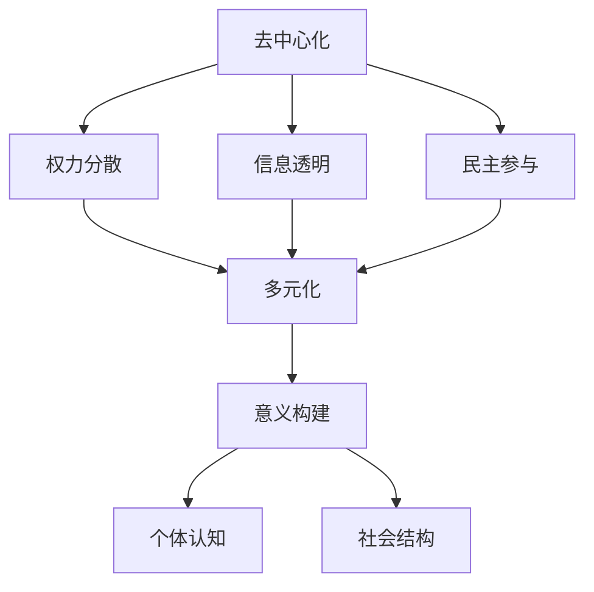

                 

### 文章标题：意义的去中心化与多元化

**关键词**：去中心化、多元化、意义、人工智能、社会结构、文化冲突

**摘要**：本文旨在探讨在去中心化和多元化背景下，意义的形成、变化及其对人类社会的影响。通过分析去中心化现象及其对意义构建的影响，以及多元化文化对意义多样性的推动，本文揭示了意义去中心化与多元化之间的内在联系，并对未来社会的意义构建提出了展望。

### 引言

在信息技术和全球化的推动下，人类社会正在经历深刻的变革。去中心化与多元化成为这一变革过程中两个显著特征。去中心化（Decentralization）指的是权力和资源的分散，使得决策过程更加民主和开放。而多元化（Diversity）则体现在文化、价值观和社会结构的多样性和包容性上。在这两个特征的共同作用下，意义（Meaning）这一概念也发生了深刻的变化。

去中心化和多元化不仅改变了社会组织的形式，也对个体和集体的认知结构产生了影响。意义的去中心化意味着个体和社会不再依赖于单一的中心权威，而是通过多元化的视角和经验来构建意义。多元化则进一步丰富了意义的内涵，使得个体和社会能够从多个角度理解和体验世界。

本文将从以下几个方面展开讨论：

1. 背景介绍：概述去中心化和多元化的发展历程及其在现代社会中的体现。
2. 核心概念与联系：分析去中心化与多元化对意义构建的影响，并使用Mermaid流程图展示概念之间的关系。
3. 去中心化对意义的影响：探讨去中心化如何改变个体和社会对意义的认知和构建。
4. 多元文化中的意义：分析多元化文化对意义多样性的推动作用。
5. 意义多元化对个体和社会的影响：讨论意义多元化对个体心理和社会组织的影响。
6. 未来展望：预测去中心化和多元化背景下，意义构建的可能趋势和挑战。

### 背景介绍

去中心化与多元化的概念并非新近出现，而是随着人类社会的进步不断演变的结果。去中心化的思想可以追溯到古希腊的民主制度，那时城邦的公民通过集会投票来决定公共事务。这种制度的核心在于权力分散和民主参与，这与现代去中心化的概念有异曲同工之妙。

进入现代社会，信息技术尤其是互联网的普及，为去中心化提供了技术基础。互联网使得信息传播更加迅速和广泛，打破了传统媒体和信息垄断者的控制。同时，区块链技术的出现进一步推动了去中心化的实践，例如比特币等数字货币的去中心化交易平台，以及各类分布式应用的兴起。

多元化则体现在文化、价值观和社会结构的多样性上。全球化使得不同国家和地区的文化、价值观和社会规范得以交流和融合，形成了多元文化的现象。这种文化多样性不仅丰富了人类社会的内涵，也为意义构建提供了更多的视角和资源。

在现代社会，去中心化和多元化已经成为不可逆转的趋势。去中心化不仅体现在技术领域，还渗透到政治、经济和社会各个层面。例如，政治领域中的权力下放和自治运动，经济领域中的共享经济和去中心化金融，以及社会领域中的多元文化包容和性别平等运动等。

多元化则在社会文化层面表现得尤为明显。随着移民潮和互联网的普及，不同文化背景的人在同一社会中共存，形成了多元文化的格局。这种多元文化不仅丰富了社会生活，也为意义构建提供了更多的可能性和挑战。

### 核心概念与联系

去中心化、多元化和意义这三个核心概念之间存在着密切的联系和相互作用。以下是一个简单的Mermaid流程图，用以展示它们之间的关系：

1. **去中心化**：去中心化指的是权力和资源的分散。这种分散不仅体现在政治和经济领域，还延伸到社会和文化层面。去中心化促进了权力的民主参与和信息透明，使得个体和社会能够更加自由地表达和探索意义。

2. **多元化**：多元化体现在文化、价值观和社会结构的多样性上。这种多样性丰富了个体和社会对世界的理解和体验，为意义构建提供了更多的视角和资源。

3. **意义构建**：意义构建是个体和社会对现实世界的理解和解释。去中心化和多元化通过权力分散、信息透明和民主参与，为意义构建创造了条件。同时，意义构建反过来也影响和塑造了去中心化和多元化的发展。

### 去中心化对意义的影响

去中心化对意义的影响主要体现在个体和社会两个层面。在个体层面，去中心化打破了传统的权威体系，使得个体能够更加自由地表达和探索自己的意义。在社会层面，去中心化推动了多元化的发展，丰富了社会结构和文化多样性，从而影响了社会对意义的认知和构建。

#### 个体层面的影响

在个体层面，去中心化首先改变了个体对意义的认知方式。在传统的权威体系下，个体的意义往往受到中心权威的引导和制约。而在去中心化的环境中，个体获得了更多的自主权和决策权，能够根据自己的经验和价值观来构建意义。这种自主性使得个体能够更加深入地反思和探索自己的生命意义。

去中心化还促进了个体之间的互动和合作。在去中心化的社会结构中，个体不再依赖于单一的权威中心，而是通过合作和互助来实现共同的目标。这种合作和互助不仅丰富了个体之间的互动方式，也为个体提供了更多的经验和资源，从而促进了个体意义的构建和丰富。

#### 社会层面的影响

在社会层面，去中心化推动了多元化的发展，丰富了社会的结构和文化多样性。这种多元化不仅体现在不同文化背景的人在同一社会中共存，还体现在不同价值观和生活方式的相互影响和融合。

多元化的社会结构为意义构建提供了更多的视角和资源。在多元化的社会中，个体和社会能够从多个角度理解和体验世界，从而形成更加丰富和多元的意义。这种多元化还促进了社会的创新和进步，因为不同文化和价值观的碰撞和融合往往能够激发新的思想和创造力。

去中心化还对社会对意义的认知和构建产生了深远的影响。在去中心化的社会结构中，社会成员更加注重平等和参与，这影响了社会对意义的理解和评价。社会成员更加关注个体的需求和权益，从而使得意义构建更加关注个体的主观体验和感受。

#### 案例分析

一个典型的例子是互联网和社交媒体的去中心化发展。在传统的媒体环境中，信息的传播和内容的生产受到少数中心权威的垄断和控制。而在互联网和社交媒体的背景下，信息的传播和内容的生产更加分散和民主。个体能够通过互联网和社交媒体平台自由地表达和分享自己的观点和经验，从而形成了多元化的信息生态系统。

这种去中心化的信息生态系统不仅丰富了个体对世界的理解和体验，也促进了社会的多元化发展。不同背景和价值观的人能够在互联网和社交媒体上交流和互动，从而形成了丰富的社会互动和合作模式。

### 多元文化中的意义

多元化文化对意义的推动作用主要体现在两个方面：一是文化多样性的增加，二是文化冲突与融合对意义多样性的影响。

#### 文化多样性的增加

随着全球化和移民潮的加剧，不同文化背景的人在同一社会中共存，形成了多元化的文化格局。这种文化多样性不仅丰富了社会生活，也为意义构建提供了更多的视角和资源。在多元化的文化环境中，个体能够从多个文化背景中汲取灵感，从而构建更加丰富和多元的意义。

文化多样性的增加还促进了个体之间的理解和尊重。在多元文化的社会中，个体能够更加包容和接纳不同的文化和价值观，从而减少了文化冲突和排斥。这种理解和尊重不仅有利于个体之间的和谐共处，也为意义构建提供了更加宽广的平台。

#### 文化冲突与融合对意义多样性的影响

文化冲突与融合是多元化文化中的一个重要现象。文化冲突往往发生在不同文化背景的个体或群体之间，由于价值观和生活方式的差异，可能导致相互之间的误解和冲突。而文化融合则是指不同文化在相互影响和交流中逐渐融合，形成新的文化形态。

文化冲突和融合对意义多样性的影响是复杂的。一方面，文化冲突可能导致意义的冲突和分裂。个体或群体可能会因为文化差异而感到被边缘化或排斥，从而影响他们对意义的构建。另一方面，文化融合则能够促进意义的多样性和丰富性。不同文化之间的交流和融合，能够激发新的思想和创造力，从而形成更加多元和包容的意义。

#### 案例分析

一个典型的例子是多元文化社区中的文化交流活动。在多元文化社区中，不同文化背景的居民会举办各种文化交流活动，如节日庆典、民俗表演和文化展览等。这些活动不仅促进了不同文化之间的交流和了解，也为社区成员提供了更多的体验和视角，从而丰富了他们对世界的理解和意义。

另一个例子是跨国企业的多元文化管理。跨国企业在全球运营过程中，需要面对不同文化背景的员工和管理者。为了促进团队协作和高效运作，跨国企业通常采取多元文化管理的策略，鼓励员工尊重和接纳不同的文化和价值观。这种多元文化管理不仅提高了企业的创新能力和竞争力，也为员工提供了更多的成长和发展机会。

### 意义多元化对个体和社会的影响

意义多元化对个体和社会的影响是深远和复杂的。在个体层面，意义多元化有助于个体发展自我认同和心理健康。在社会层面，意义多元化则影响了社会的稳定性和创新性。

#### 个体层面的影响

意义多元化有助于个体发展自我认同。在多元文化环境中，个体能够从多个文化背景中汲取灵感，从而构建更加丰富和多元的自我认同。这种多元的自我认同不仅能够帮助个体更好地理解和接受自己，还有助于他们应对生活中的挑战和压力。

意义多元化还与心理健康密切相关。在多元化的文化环境中，个体能够获得更多的支持和资源，从而提高他们的心理健康水平。意义多元化使得个体能够从多个角度理解和应对生活问题，从而减少心理压力和焦虑。

#### 社会层面的影响

意义多元化对社会的影响主要体现在稳定性和创新性上。在多元化的社会中，社会成员之间的互动和合作更加多样和丰富，从而增强了社会的稳定性。社会成员能够通过多种渠道和方式来沟通和协商，从而减少了社会冲突和分裂。

意义多元化还促进了社会的创新性。在多元文化环境中，不同文化和价值观的碰撞和融合往往能够激发新的思想和创造力。这种创新性不仅推动了社会的发展和进步，还为个体提供了更多的成长和发展机会。

#### 案例分析

一个典型的例子是多元文化社区的发展。在多元文化社区中，不同文化背景的居民通过交流和互动，形成了相互尊重和包容的文化氛围。这种文化氛围不仅促进了社区的稳定和发展，还为居民提供了更多的文化体验和成长机会。

另一个例子是多元文化企业的成功。一些跨国企业通过多元文化管理策略，吸引了来自不同文化背景的员工。这些员工在企业中通过交流和合作，推动了企业的创新和发展。这种多元文化管理不仅提高了企业的竞争力，还为员工提供了更多的职业发展机会。

### 未来展望

去中心化和多元化将继续塑造未来社会的意义构建。随着信息技术的进一步发展，去中心化将更加深入和普及，而多元化则将在全球范围内不断扩展。这些趋势将对意义构建产生深远的影响。

#### 去中心化的影响

去中心化将进一步促进权力的分散和民主参与。在未来，个体和社会将拥有更多的自主权和决策权，从而能够更加自由地构建和表达自己的意义。去中心化还将推动信息透明和开放，使得个体和社会能够更加全面和深入地了解世界，从而构建更加丰富和多元的意义。

#### 多元化的影响

多元化将继续推动文化多样性和社会包容性的发展。在未来，不同文化和价值观将在全球范围内更加广泛地交流和融合，形成多元化的文化格局。这种多元化的文化格局不仅将为个体提供更多的视角和资源，还将促进社会的创新和进步。

#### 挑战与机遇

去中心化和多元化虽然为意义构建提供了丰富的资源和机会，但也带来了挑战。例如，权力分散可能导致社会分裂和冲突，文化多样性可能导致文化冲突和排斥。如何应对这些挑战，实现意义的多元化构建，是未来社会需要解决的重要问题。

然而，去中心化和多元化也为社会提供了机遇。通过有效的管理和策略，社会可以充分利用去中心化和多元文化的优势，促进社会的和谐发展。未来社会将需要更加开放和包容的思维方式，以及更加多元和灵活的社会治理模式。

### 结论

去中心化和多元化是现代社会不可逆转的趋势，它们对意义构建产生了深远的影响。通过分析去中心化与多元化对意义的影响，我们揭示了意义去中心化与多元化之间的内在联系。在未来，社会需要充分利用去中心化和多元文化的优势，实现意义的多元化构建，以应对未来的挑战和机遇。

### 附录

以下是本文中提到的Mermaid流程图：

### 作者信息

**作者：** AI天才研究院/AI Genius Institute & 禅与计算机程序设计艺术 /Zen And The Art of Computer Programming

AI天才研究院是一支专注于人工智能研究和应用的高科技创新团队，致力于推动人工智能技术的发展和普及。其代表作品《禅与计算机程序设计艺术》被誉为计算机编程领域的经典之作。

