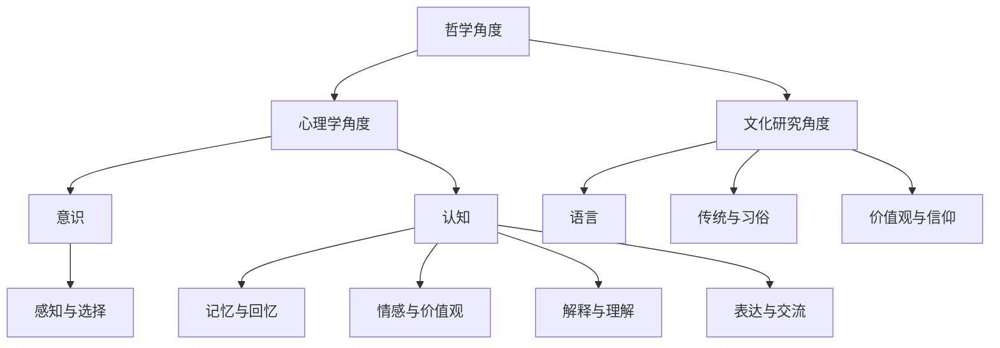

                 

### 1.2 心理学角度下的意义

#### 1.2.1 意识与意义的心理学研究
$$
\text{意义} = \text{意识} \times \text{认知}
$$
在心理学领域，意义被视为个体对环境刺激的内在认知过程。意识是感知和理解世界的能力，而认知则涉及对信息进行处理和解释的过程。意义不仅仅是对事物本身的理解，还包括了个体对事物的情感、价值观和目的等方面的认知。

心理学家乔治·米德（George Herbert Mead）提出了“符号互动论”，认为个体通过符号交流建立对意义的共同理解。他认为，意义是通过个体的符号互动而创造的，而不是固有的。

此外，认知心理学家也研究了意义加工的过程。乔治·阿莫斯（George A. Miller）等人提出了“意义网络”理论，认为大脑中存在一个相互连接的意义网络，用于存储和检索意义。在这个网络中，每个意义节点都与相关的概念和情境相连接。

#### 1.2.2 意义的心理构建过程
意义的构建是一个复杂的过程，涉及多个认知机制。以下是几个关键步骤：

1. **感知与选择**：个体通过感官接收外界信息，并对其进行初步筛选和处理。
2. **记忆与回忆**：将感知到的信息存储在记忆中，并在需要时进行回忆。
3. **情感与价值观**：个体根据自己的情感和价值观对信息进行评价，赋予其意义。
4. **解释与理解**：通过逻辑推理和常识，对信息进行解释和理解，形成完整的意义。
5. **表达与交流**：个体将构建好的意义表达出来，与他人进行交流和共享。

这个过程不仅仅是个体内部的认知活动，还涉及到社会互动。例如，一个笑话的意义往往需要听众共同参与才能完全理解。

#### 1.2.3 意义的心理学研究方法
心理学家们采用多种方法研究意义，包括实验研究、问卷调查和认知神经科学方法。

- **实验研究**：通过控制实验条件，研究意义加工的具体过程。例如，通过呈现不同类型的词汇或故事，观察个体对意义的反应时间和准确性。
- **问卷调查**：通过问卷调查，收集个体对特定事件或情境的主观意义感受。
- **认知神经科学方法**：使用功能性磁共振成像（fMRI）等技术，观察大脑在意义加工过程中的活动模式。

### 1.3 意义的文化研究解读

#### 1.3.1 文化的多元性与相对性
文化研究认为，意义是文化建构的产物。不同的文化背景和社会环境会影响个体对事物的理解和赋予意义的方式。

- **文化相对主义**：认为每个文化都有其独特的价值和意义体系，不能以自己的文化标准去评价其他文化。
- **文化绝对主义**：认为某些文化价值是普遍适用的，适用于所有文化。

文化相对主义强调，意义是相对的，取决于特定的文化和社会环境。而文化绝对主义则认为，尽管文化之间存在差异，但某些基本价值是普遍认可的。

#### 1.3.2 文化研究对意义的影响
文化研究探讨了文化如何塑造个体的意义感知和认知过程。以下是一些影响：

- **语言**：语言是文化的重要组成部分，不同的语言会影响人们对事物的命名和理解方式。
- **传统与习俗**：传统和习俗是文化的重要组成部分，它们为个体提供了对事物的意义框架。
- **价值观与信仰**：文化中的价值观和信仰会影响个体对事物的意义评价和行动。

文化研究揭示了意义是如何在特定的社会和文化背景下产生的，以及文化如何影响个体的认知和行为。

### 1.4 意义的概念联系与Mermaid流程图
为了更好地理解意义的不同维度，我们可以使用Mermaid流程图来展示它们之间的关系。

这个流程图展示了意义在哲学、心理学和文化研究三个角度下的核心概念，以及它们之间的相互关系。

通过这样的逐步分析，我们可以更深入地理解意义的本质和如何在不同领域中被探讨和应用。

## 2. 意义的哲学探讨

### 2.1 唯物主义与唯心主义的对立

#### 2.1.1 唯物主义去神秘化的观点
在哲学领域，唯物主义是一种强调物质世界优先于精神世界的观点。唯物主义认为，意义源自于物质世界的客观存在和人的实践活动。因此，从唯物主义的视角来看，意义的去神秘化可以通过以下几个步骤实现：

1. **物质基础**：首先，认识到所有意义都建立在物质世界的实际存在上。物质世界提供了意义产生的基础，没有物质就没有意义。
2. **实践产生意义**：唯物主义强调实践在意义产生中的重要作用。通过实践活动，人们与物质世界互动，赋予事物特定的意义。例如，工作中的努力和成就赋予劳动价值。
3. **阶级与意识形态**：唯物主义认为，阶级和意识形态会影响人们对事物的意义理解。通过揭示阶级和意识形态的根源，可以去除意义的神秘性。

#### 2.1.2 唯物主义去神秘化的例子
- **劳动价值论**：在马克思主义哲学中，劳动价值论是去神秘化意义的一个重要例子。劳动被视为创造价值的根本，人们通过劳动赋予产品特定的意义。
- **实践唯物主义**：毛泽东的实践唯物主义强调了实践在认识和改造世界中的核心作用。通过实践活动，人们不断赋予事物新的意义。

#### 2.1.3 唯物主义去神秘化的局限性
唯物主义去神秘化虽然揭示了意义的物质基础，但可能忽视了精神世界的独立性和意义的多维度。此外，过于强调实践可能导致对理论研究和精神追求的忽视。

### 2.2 唯心主义去神秘化的观点
与唯物主义相对，唯心主义认为精神世界是第一位的，物质世界是精神的产物。在唯心主义视角下，意义的去神秘化可以通过以下方式实现：

1. **意识的主导性**：唯心主义强调意识的主导地位，认为意义源自于个体内在的意识活动。通过理解和分析个体意识，可以揭示意义的本质。
2. **主观体验**：唯心主义认为，意义是通过主观体验来感知的。通过深入理解个体的主观体验，可以去除意义的神秘性。
3. **内在逻辑**：唯心主义强调内在逻辑和理性的重要性。通过逻辑分析和理性思考，可以揭示意义的内在结构和规律。

#### 2.2.1 唯心主义去神秘化的例子
- **直觉主义**：直觉主义哲学认为，直觉是人类认识世界的重要途径，通过直觉可以直接感知到事物的本质和意义。
- **存在主义**：存在主义哲学，如萨特的哲学，强调个体的主观体验和自由意志。通过理解个体的存在状态和选择，可以揭示生活的意义。

#### 2.2.2 唯心主义去神秘化的局限性
唯心主义去神秘化强调了意识的主导地位，但可能忽视了物质世界的客观性和实践的重要性。过于强调主观体验可能导致对客观现实的忽视。

### 2.3 唯物主义与唯心主义的比较与融合
唯物主义和唯心主义在意义的去神秘化上有不同的侧重点和局限性。唯物主义强调物质和实践，而唯心主义强调意识和主观体验。

为了克服各自的局限性，哲学界出现了多种融合尝试。例如，实用主义试图通过强调实践和实用效果来融合唯物主义和唯心主义。此外，一些当代哲学家也尝试在物质和精神之间找到新的平衡点。

通过比较和融合不同的哲学观点，我们可以更全面地理解意义的本质，同时避免陷入单一观点的局限。

### 2.4 哲学角度下的意义去神秘化总结
哲学角度下的意义去神秘化主要通过揭示物质和实践的基础，以及意识和主观体验的重要性来实现。唯物主义和唯心主义分别从不同的角度出发，各自有其优势和局限性。

去神秘化的过程不仅帮助我们理解意义的本质，也促进了不同哲学观点之间的对话和融合。通过这种哲学探讨，我们可以更加全面和深入地认识意义的世界。

## 3. 心理学角度下的意义去神秘化

### 3.1 意识与意义的心理学研究

#### 3.1.1 意识的本质与功能
在心理学中，意识是指个体对自己和外界的感知、思考、情感和行为的觉知状态。意识具有多个功能，包括：

1. **感知与选择**：意识使我们能够感知外部刺激，并通过注意力机制对信息进行选择和过滤。
2. **思考与推理**：意识支持我们的逻辑思考和推理能力，使我们能够对信息进行分析和解释。
3. **情感与体验**：意识使我们能够体验情感和情绪，从而赋予生活丰富性和多样性。
4. **自我认知与行动**：意识使我们能够对自己进行反思，指导我们的行为和决策。

#### 3.1.2 意识的理论模型
心理学中存在多种关于意识的理论模型，包括：

1. **二元论**：二元论认为，意识和物质是两个独立的存在。意识是内在的、主观的，而物质是外在的、客观的。
2. **功能主义**：功能主义认为，意识是一种功能状态，其目的是处理信息、指导行为和决策。
3. **整合论**：整合论认为，意识是大脑多个区域协同工作的结果，是信息整合和解释的产物。

#### 3.1.3 意识与意义的联系
意识与意义之间存在紧密的联系。意义是通过意识的加工和理解产生的。具体来说：

1. **感知与意义**：通过意识，个体感知外部刺激，并对其进行解释和赋予意义。例如，听到一句问候语，个体会通过已有的语言知识和情感体验，赋予其特定的意义。
2. **记忆与意义**：意识帮助个体将感知到的信息存储在记忆中，并在需要时进行回忆。记忆中的信息被赋予新的意义，从而影响个体的行为和决策。
3. **思考与意义**：意识支持个体的思考过程，通过逻辑推理和常识，个体能够对信息进行深层次的解释和理解，从而赋予其更复杂的意义。

### 3.2 意义的心理构建过程

#### 3.2.1 感知与选择
意义构建的第一步是感知和选择。通过感官，个体接收外界的信息，并通过注意力的过滤，选择性地关注某些刺激。例如，在嘈杂的环境中，个体可能会注意到朋友的呼喊声，而忽略其他噪音。

#### 3.2.2 记忆与回忆
感知到的信息会被存储在记忆中，形成长期的记忆。在需要时，个体可以回忆起这些信息，并赋予其新的意义。例如，一个人可能在多年后回忆起童年的一次经历，并从中感受到一种特殊的情感和意义。

#### 3.2.3 情感与价值观
个体的情感和价值观也会影响他们对信息的意义赋予。积极的情感和价值观倾向于赋予信息正面的意义，而消极的情感和价值观则可能导致负面的意义。例如，一个人可能会将一次失败的经历视为一次宝贵的教训，从而赋予其积极的含义。

#### 3.2.4 解释与理解
通过逻辑推理和常识，个体能够对信息进行深层次的解释和理解，从而赋予其更复杂的意义。例如，科学家可能会通过实验和数据分析，对某种现象进行解释和理解，并赋予其科学意义。

#### 3.2.5 表达与交流
构建好的意义需要通过表达和交流来传递。个体通过语言、行为和其他符号系统，将意义传达给他人，从而实现意义的共享和理解。

### 3.3 意义构建的实证研究
心理学通过实验研究，探讨了意义构建的具体过程和影响因素。以下是一些重要的研究：

1. **意义构建的实验设计**：通过控制实验条件，研究人员可以观察个体在特定情境下的意义构建过程。例如，研究人员可能会让参与者观看一段视频，然后让他们描述他们从中理解到的意义。
2. **问卷与访谈**：通过问卷和访谈，研究人员可以收集个体对自己经历的意义感受和认知过程。这种方法有助于揭示个体在日常生活中如何构建和理解意义。
3. **神经科学方法**：使用功能性磁共振成像（fMRI）等技术，研究人员可以观察大脑在意义构建过程中的活动模式。这有助于理解大脑如何处理信息，从而赋予其意义。

### 3.4 心理学角度下的意义去神秘化方法
心理学提供了多种方法来去神秘化意义，包括：

1. **认知重建**：通过引导个体反思自己的认知过程，可以帮助他们揭示和理解自己的意义构建方式。这种方法有助于个体认识到意义的相对性和主观性。
2. **情感调节**：通过调整个体的情感状态，可以改变他们对信息的意义赋予。例如，通过认知行为疗法，个体可以学会以更积极的方式理解自己的经历。
3. **符号互动**：通过与他人交流和互动，个体可以获取新的视角和信息，从而丰富和调整自己的意义理解。

### 3.5 心理学角度下的意义去神秘化案例
以下是一个心理学角度下的意义去神秘化案例：

**案例：癌症患者的意义重建**

一位癌症患者可能会经历疾病的诊断、治疗和康复等多个阶段。在早期阶段，患者可能会感到恐惧和绝望，这些负面情绪可能导致他们对生活的意义产生困惑。

通过心理治疗，患者可以与心理咨询师进行深入的交流和反思。心理咨询师可以帮助患者认识到，尽管癌症给他们的生活带来了巨大的挑战，但也可以从中找到新的意义。例如，患者可能会发现，他们的疾病经历让他们更加珍惜生活，更加关心家人和朋友，或者激发他们追求新的目标和兴趣。

通过这种认知重建和情感调节，患者可以逐渐重建对生活的意义，找到积极的心态和应对策略。

### 3.6 心理学角度下的意义去神秘化总结
心理学角度下的意义去神秘化通过揭示意识与意义的关系，以及意义构建的具体过程，帮助我们理解意义的本质。心理学提供了多种方法和工具来去神秘化意义，包括认知重建、情感调节和符号互动等。

通过心理学的研究，我们可以更好地理解个体如何感知、理解和赋予事物意义，从而在日常生活中更好地应对挑战，实现个人的成长和发展。

## 4. 文化研究角度下的意义去神秘化

### 4.1 文化的多元性与相对性

#### 4.1.1 文化的多元性
文化是社会的产物，反映了特定群体的价值观、信仰、习惯和行为模式。不同文化之间的多样性使得意义的理解和赋予具有独特的复杂性。每种文化都有其独特的历史背景和社会环境，这些因素共同塑造了文化的内涵和表达方式。

- **文化多样性**：文化多样性是指不同文化之间的差异和多样性。这些差异不仅体现在语言、宗教、习俗等方面，还包括对事物意义的理解方式。例如，一些文化可能重视家庭和亲情，而另一些文化可能更注重个人成就和自由。
- **文化交融**：全球化进程加速了不同文化之间的交融和互动，使得文化多样性更加复杂和丰富。在这种背景下，意义的理解和赋予变得更加多元化。

#### 4.1.2 相对主义与绝对主义
在文化研究中，相对主义和绝对主义是两个重要的概念，它们对意义的理解和赋予产生了深远的影响。

- **文化相对主义**：文化相对主义认为，每个文化都有其独特的价值和意义体系，不能以自己的文化标准去评价其他文化。相对主义强调，理解和评价一种文化时，需要置于其特定的社会历史背景中。例如，某些文化可能认为集体利益高于个人利益，而另一些文化则可能更强调个人自由和权利。
- **文化绝对主义**：文化绝对主义则认为，某些文化价值是普遍适用的，适用于所有文化。绝对主义主张，尽管文化之间存在差异，但某些基本价值是普世适用的，如正义、和平和尊重。

#### 4.1.3 相对主义与绝对主义的讨论
文化相对主义和绝对主义在意义研究中引发了广泛的讨论。

- **相对主义的优势**：相对主义有助于消除文化偏见和歧视，促进不同文化之间的相互理解和尊重。通过认识到文化的相对性，人们可以更加开放和包容地看待不同文化，减少文化冲突。
- **绝对主义的挑战**：绝对主义可能导致文化优越感和文化冲突。如果某个文化认为自己的价值观是绝对正确的，那么在与其他文化互动时，可能会产生误解和矛盾。此外，绝对主义可能忽视个体和文化的多样性，导致文化同质化。

### 4.2 文化研究对意义的影响

#### 4.2.1 语言与意义
语言是文化的重要组成部分，不同文化的语言体系反映了其独特的价值观和世界观。语言对意义的理解有重要影响：

- **语义多样性**：不同语言对同一概念可能有不同的表达方式，导致语义上的多样性。例如，英语中的“freedom”在中文中可以翻译为“自由”、“自主”或“独立”，具体选择取决于上下文和文化背景。
- **隐喻与象征**：不同文化的语言中充满隐喻和象征，这些词汇和表达方式赋予事物特定的文化意义。例如，在西方文化中，“阳光”通常象征着希望和积极，而在某些东方文化中，阳光可能象征着温暖和和谐。

#### 4.2.2 传统与习俗
传统和习俗是文化的重要组成部分，对意义的理解和赋予有深远影响。

- **传承与延续**：传统和习俗是文化传承的重要载体，通过这些传统，文化中的价值观和意义得以延续和传递。例如，婚礼仪式、节日庆典和宗教仪式都是文化传统的重要组成部分，通过这些活动，人们表达对家庭、社区和神的尊重和敬畏。
- **变化与适应**：随着社会的变化和发展，传统和习俗也会发生相应的变化。在适应现代生活的同时，人们需要重新评估和赋予这些传统和习俗新的意义。

#### 4.2.3 价值观与信仰
价值观和信仰是文化中最为核心的部分，对意义的理解和赋予有决定性作用。

- **道德价值**：不同文化有不同的道德价值体系，这些价值观影响着人们对事物的意义理解和行为选择。例如，在儒家文化中，孝顺、尊老爱幼是重要的道德价值，而在西方文化中，个人主义和自由主义可能更受到重视。
- **宗教信仰**：宗教信仰是许多文化的重要特征，对个体和集体的意义理解有深远影响。例如，在基督教文化中，信仰上帝和接受救赎是重要的信仰，而在佛教文化中，追求解脱和智慧是主要的宗教目标。

### 4.3 文化研究对意义研究的启示

#### 4.3.1 多学科交叉研究
文化研究揭示了意义在多元文化背景下的复杂性和多样性，这为意义研究提供了新的视角和方法。多学科交叉研究，如文化心理学、认知科学与文化研究的结合，有助于更全面地理解意义的本质。

#### 4.3.2 尊重文化多样性
在意义研究中，尊重文化多样性是非常重要的。研究者需要认识到，不同的文化背景会影响人们对事物的理解和赋予意义的方式。只有通过深入了解和尊重不同文化的价值观和信仰，才能进行有效的意义研究。

#### 4.3.3 意义的相对性与主观性
文化研究强调了意义的相对性和主观性。这意味着，意义不是固定不变的，而是随着文化和社会环境的变化而变化。研究者需要关注个体在特定文化背景下的意义构建过程，以更准确地理解意义的本质。

### 4.4 文化研究角度下的意义去神秘化方法

#### 4.4.1 文化比较研究
通过文化比较研究，研究者可以分析不同文化背景下意义的异同。这有助于揭示文化对意义理解和赋予的影响，并探索文化之间的相互影响和交融。

#### 4.4.2 参与文化实践
参与文化实践是理解文化中意义的一种有效方式。通过亲身参与不同文化的活动，研究者可以更深入地体验和理解其中的意义。

#### 4.4.3 文本分析
文本分析是一种常用的文化研究方法，通过分析文化文本，如文学作品、新闻报道、宗教经典等，研究者可以揭示文化中的意义和价值观念。

### 4.5 文化研究角度下的意义去神秘化案例

#### 4.5.1 社会运动中的意义建构
社会运动，如民权运动、女权运动和环保运动等，是文化研究的重要领域。在这些运动中，参与者通过共同的文化实践和符号互动，建构了新的意义和价值。例如，在女权运动中，女性通过争取平等权利和反对性别歧视，重新定义了女性在社会中的意义和角色。

#### 4.5.2 全球化背景下的意义变迁
全球化带来了不同文化之间的广泛交流和互动，也引发了意义的变迁。例如，在全球化背景下，跨国公司和跨国文化交流使得全球范围内的消费者对品牌和产品的意义理解发生了变化。品牌不再仅仅是一个产品的标识，而是代表了特定的文化价值和社会地位。

### 4.6 文化研究角度下的意义去神秘化总结
文化研究角度下的意义去神秘化通过揭示文化的多元性、相对性和主观性，帮助我们更全面地理解意义的本质。文化研究提供了多种方法，如文化比较研究、参与文化实践和文本分析，以去神秘化意义。

通过文化研究，我们可以更好地理解不同文化背景下意义的异同，尊重文化多样性，并探索意义的相对性和主观性。这有助于我们更深入地认识人类社会的多样性和复杂性，为意义研究提供了新的视角和方法。

## 5. 意义再神秘化的理论基础

### 5.1 再神秘化的概念与意义

#### 5.1.1 再神秘化的定义
再神秘化是指将原本被去神秘化的意义重新赋予深奥、复杂和神秘的特征，使其在新的语境中具有引人入胜的吸引力和思考价值。再神秘化的过程通常涉及对已有知识的重新解读、深入探讨以及新的认知框架的构建。

#### 5.1.2 再神秘化的意义
再神秘化在多个领域具有重要价值，以下是其主要意义：

1. **激发好奇心和探索欲望**：再神秘化往往将简单的知识或概念转化为复杂和深奥的形式，这激发了人们的好奇心和探索欲望。例如，在科学领域，复杂的科学理论被重新表述为引人入胜的故事，有助于公众更好地理解和接受科学知识。

2. **增强知识的吸引力**：再神秘化通过赋予知识神秘和深奥的色彩，使其更具吸引力。这有助于教育者和传播者更好地传达复杂的信息，提高知识传播的效率。

3. **促进深度思考**：再神秘化往往要求人们运用批判性思维和创造性思维来重新理解和解释知识。这种过程不仅有助于加深对知识的理解，还能培养人们的思维能力和解决问题的能力。

4. **文化传承与创新**：再神秘化有助于文化传承和创新。通过重新解读和赋予传统知识新的意义，可以使其在现代社会中焕发新的生命力，促进文化的多样性和发展。

### 5.2 哲学角度下的再神秘化

#### 5.2.1 哲学中的神秘主义
哲学中的神秘主义强调超越理性认知的体验和认知方式。神秘主义认为，某些深刻的真理和意义只能通过直接的直觉和经验来感知，而无法通过逻辑推理和科学方法来完全理解。

- **直觉主义**：直觉主义认为，直觉是人类认识世界的重要途径。通过直觉，个体可以直接感知到事物的本质和意义，而不需要通过逻辑推理。
- **现象学**：现象学强调主观体验的重要性。现象学家试图通过直接体验和描述，揭示事物在个体感知中的意义和结构。

#### 5.2.2 哲学角度下的再神秘化方法
哲学角度下的再神秘化方法包括：

1. **深度哲学反思**：通过深度哲学反思，个体可以重新审视已有的哲学观点和理论，发掘其深层的意义和复杂性。
2. **象征和隐喻**：哲学中使用象征和隐喻来表达深奥的思想，这些象征和隐喻往往具有多重意义和复杂的解释。
3. **跨学科融合**：通过融合不同学科的理论和观点，可以创造出新的哲学框架，赋予已有知识新的神秘性和复杂性。

### 5.3 心理学角度下的再神秘化

#### 5.3.1 心理学的神秘体验
在心理学中，神秘体验是指个体在特定情境下感受到的一种超越日常认知的深刻体验。这些体验往往与意识扩展、情感高潮和认知突破有关。

- **意识扩展**：意识扩展体验（如冥想、药物体验等）使个体进入一种超越常规认知状态，感受到深层的意义和联系。
- **情感高潮**：某些情境，如艺术创作、体育比赛或宗教仪式，能引发强烈的情感高潮，赋予个体深刻的体验和意义。

#### 5.3.2 心理学角度下的再神秘化方法
心理学角度下的再神秘化方法包括：

1. **意识扩展研究**：通过研究意识扩展体验，心理学家可以揭示其中的神秘体验和意义。
2. **隐喻与象征疗法**：通过使用隐喻和象征，心理学家可以帮助个体重新理解和赋予生活中的事件和情境新的意义。
3. **深度心理分析**：深度心理分析旨在揭示个体内心深层的冲突和意义，帮助个体达到更深刻的自我理解和成长。

### 5.4 文化研究角度下的再神秘化

#### 5.4.1 文化的传承与创新
在文化研究中，再神秘化是文化传承和创新的重要手段。通过重新解读和赋予传统知识新的意义，文化可以在现代社会中继续发挥作用。

- **宗教再神秘化**：宗教通过再神秘化经典文本和仪式，使其在新的历史和社会背景下焕发新的生命力。
- **文化节庆**：文化节庆活动通过重新赋予传统节日新的意义和表现形式，使其成为文化传承和创新的重要平台。

#### 5.4.2 文化角度下的再神秘化方法
文化研究角度下的再神秘化方法包括：

1. **跨文化比较**：通过比较不同文化对同一主题或符号的再神秘化方式，可以揭示文化之间的差异和相互影响。
2. **文化创新**：通过文化创新，将传统元素与现代科技、艺术等相结合，创造出新的文化形式和意义。
3. **符号互动**：通过符号互动，个体和群体可以在特定的社会文化背景下，重新赋予事件和情境新的意义。

### 5.5 再神秘化在现实世界中的应用
再神秘化在现实世界中具有广泛的应用，以下是一些例子：

1. **教育领域**：在教育中，通过再神秘化知识点，教师可以激发学生的学习兴趣和思考能力。例如，通过使用隐喻和故事，可以将复杂的科学概念转化为易于理解的形式。
2. **市场营销**：在市场营销中，通过再神秘化品牌和产品，企业可以创造独特的品牌形象和消费者体验。例如，高端品牌的神秘性和奢华感往往是通过再神秘化来实现的。
3. **艺术创作**：在艺术创作中，再神秘化是艺术家表达自己思想和情感的重要手段。通过复杂的符号和隐喻，艺术家可以赋予作品深层的意义和吸引力。

### 5.6 再神秘化总结
再神秘化通过赋予知识和文化新的神秘性和深度，激发了人们的探索欲望和思考能力。哲学、心理学和文化研究提供了多种再神秘化的理论和方法，这些方法在现实世界中具有广泛的应用。

通过再神秘化，我们可以更深入地理解和体验世界，同时促进知识的传播和文化的发展。再神秘化不仅是对知识和文化的重新解读，也是对人类认知和思维方式的挑战和拓展。

### 5.7 再神秘化的哲学观点

#### 5.7.1 存在主义视角下的再神秘化
存在主义哲学强调个体的存在和自由意志。在存在主义视角下，再神秘化意义的过程是通过个体的选择和行动来实现的。存在主义者认为，个体可以通过自己的存在和行为赋予事物新的意义。例如，海德格尔（Martin Heidegger）强调，“存在即意义”，通过个体的存在，世界和事物被赋予了特定的意义。

- **自由选择**：存在主义者认为，个体在面对不确定性时，通过自由选择来赋予事物意义。例如，一个失业的人可能会选择通过学习新技能来找到新的工作机会，从而赋予这段时间新的意义。
- **存在意义**：存在主义者强调，个体的存在本身具有意义。通过自我实现和创造，个体可以赋予自己的生活以深层的意义。

#### 5.7.2 解释学视角下的再神秘化
解释学是研究理解过程和解释的理论。在解释学视角下，再神秘化意义是通过理解文本、情境和经验来实现的。解释学认为，意义是动态的、多层次的，并且依赖于解释者的背景和立场。

- **文本再解读**：通过再解读文本，人们可以赋予旧有文献新的意义。例如，经典文学作品在不同的历史和文化背景下，可以被赋予不同的意义。
- **情境理解**：理解特定情境下的意义是通过理解情境的背景和关系来实现的。例如，一个社会问题在不同的历史和社会背景下，可能被赋予不同的意义和解释。

#### 5.7.3 结构主义视角下的再神秘化
结构主义哲学强调社会和文化结构对个体思维和行为的影响。在结构主义视角下，再神秘化意义是通过揭示和批判社会结构来实现的。结构主义者认为，社会结构赋予事物特定的意义，而这些意义往往是不平等的。

- **结构揭示**：通过揭示社会结构，人们可以重新理解和解释事物。例如，通过揭示社会阶级结构，可以重新理解不同社会阶层之间的权力关系和意义赋予。
- **意义批判**：结构主义者通过批判社会结构中的不平等和压迫，试图赋予个体新的意义和解放。

#### 5.7.4 主体性视角下的再神秘化
主体性哲学强调个体的主观经验和主体地位。在主体性视角下，再神秘化意义是通过个体的主观体验和自我认同来实现的。主体性哲学认为，个体的主观经验是意义构建的核心。

- **自我认同**：通过个体对自我身份的认同和探索，可以赋予生活新的意义。例如，一个人通过探索自己的文化背景和价值观，可以重新定义自己的身份和意义。
- **主观体验**：通过个体的主观体验，可以赋予事物新的意义。例如，一个艺术家通过创作艺术作品，表达自己的内心体验，赋予作品独特的意义。

#### 5.7.5 再神秘化的综合观点
不同的哲学观点提供了不同的视角和方法来理解和实现再神秘化。综合这些观点，我们可以看到，再神秘化不仅仅是一种理论探讨，也是一种实践过程。

- **动态过程**：再神秘化是一个动态的过程，涉及到个体的选择、理解和体验。这个过程是开放的，不断变化的。
- **多维度解释**：再神秘化需要从多个维度来解释和理解意义。这包括哲学、心理学、文化研究等多个领域的综合视角。

通过综合不同哲学观点，我们可以更全面地理解和实现再神秘化，从而赋予事物更深层次的意义和思考价值。

## 6. 再神秘化的心理学视角

### 6.1 再神秘化的心理机制

#### 6.1.1 再神秘化对个体的影响
再神秘化是一个复杂的过程，对个体的心理和行为产生了深远的影响。以下从几个方面探讨再神秘化对个体的影响：

1. **认知扩展**：再神秘化促使个体跳出传统的思维框架，拓展认知范围。通过重新解读和赋予事物新的意义，个体能够更好地理解复杂的知识和概念。
2. **思维灵活性**：再神秘化要求个体运用批判性思维和创造性思维来重新理解和解释知识。这种过程有助于提高个体的思维灵活性，培养解决问题的能力。
3. **情感共鸣**：再神秘化往往赋予知识或文化新的情感色彩，使个体产生强烈的情感共鸣。这种情感共鸣有助于增强个体对知识和文化的认同和热爱。
4. **自我认同**：再神秘化通过赋予个体新的意义和体验，有助于个体深化自我认同。个体在重新理解和赋予事物意义的过程中，能够更好地认识自己，找到生活的方向和目标。

#### 6.1.2 再神秘化的心理机制
再神秘化涉及到多个心理机制，以下是一些关键的心理机制：

1. **认知重构**：认知重构是指通过重新解释和评估信息，改变对事物的理解和意义。在再神秘化过程中，个体通过认知重构来赋予事物新的意义，从而实现意义的再神秘化。
2. **情感调节**：情感调节是指通过调整个体的情感状态，影响其对信息的意义赋予。再神秘化过程中，个体通过情感调节来增强对知识的吸引力和认同感。
3. **符号互动**：符号互动是指个体通过语言、行为和其他符号系统来交流和互动，从而影响对事物的理解和赋予意义。在再神秘化过程中，个体通过符号互动来获取新的视角和信息，丰富和深化对知识的理解。
4. **意识扩展**：意识扩展是指通过超越常规的认知状态，体验深层的意识和感知。在再神秘化过程中，个体通过意识扩展来体验复杂的知识和意义，从而赋予事物更深层次的神秘性。

### 6.2 再神秘化的心理构建过程

#### 6.2.1 再神秘化的第一步：感知与选择
再神秘化的第一步是感知和选择。个体通过感官接收外界信息，并对其进行选择和筛选。在这一过程中，个体可能选择那些具有特殊意义或引人入胜的信息，为后续的再神秘化过程奠定基础。

#### 6.2.2 再神秘化的第二步：记忆与回忆
感知到的信息会被存储在记忆中，形成长期的记忆。在需要时，个体可以回忆起这些信息，并赋予其新的意义。通过记忆和回忆，个体可以重新构建和重新解释已有的知识，从而实现再神秘化。

#### 6.2.3 再神秘化的第三步：情感与价值观
个体的情感和价值观在再神秘化过程中起到关键作用。通过情感调节和价值观的引导，个体可以对信息进行评价和赋予意义。例如，一个具有积极情感和高度价值观的信息可能会被赋予更深层次的意义。

#### 6.2.4 再神秘化的第四步：解释与理解
通过逻辑推理和常识，个体能够对信息进行深层次的解释和理解，从而赋予其更复杂的意义。这一过程涉及批判性思维和创造性思维的运用，有助于个体重新构建和重新解释知识。

#### 6.2.5 再神秘化的第五步：表达与交流
构建好的意义需要通过表达和交流来传递。个体通过语言、行为和其他符号系统，将意义传达给他人，从而实现意义的再神秘化。在这一过程中，符号互动起到了关键作用，有助于个体获取新的视角和信息。

### 6.3 再神秘化的心理学研究方法

#### 6.3.1 实验研究
实验研究是心理学研究中常用的方法，通过控制实验条件，可以观察和测量个体在再神秘化过程中的心理机制。以下是一些常见的实验设计：

1. **认知重构实验**：通过呈现不同的信息，观察个体在认知重构过程中的心理变化。例如，通过控制变量，比较不同信息对个体的认知重构程度和效果。
2. **情感调节实验**：通过控制个体的情感状态，观察其对信息意义赋予的影响。例如，通过情感诱导技术，使个体处于不同的情绪状态，然后观察其对信息的理解和赋予意义的变化。
3. **符号互动实验**：通过设计符号互动的场景，观察个体在符号互动过程中的心理变化。例如，通过角色扮演或小组讨论，观察个体如何通过语言和行为来影响对信息的理解和赋予意义。

#### 6.3.2 问卷调查
问卷调查是心理学研究中常用的方法，通过收集个体对再神秘化过程的感知和认知，可以深入了解个体的心理机制。以下是一些常见的问卷设计：

1. **认知重构问卷**：通过设计不同类型的题目，了解个体在认知重构过程中的心理变化。例如，设计开放性问题，让个体描述他们在重新解读信息时的思维过程。
2. **情感调节问卷**：通过设计情感量表，测量个体在不同情绪状态下的心理变化。例如，设计情绪调节问卷，了解个体在情绪调节过程中对信息理解和赋予意义的影响。
3. **符号互动问卷**：通过设计符号互动情境，了解个体在符号互动过程中的心理变化。例如，设计小组讨论问卷，了解个体在小组讨论中如何通过语言和行为影响对信息的理解和赋予意义。

#### 6.3.3 认知神经科学方法
认知神经科学方法通过观察大脑在再神秘化过程中的活动模式，可以深入了解心理机制的运作。以下是一些常见的方法：

1. **功能性磁共振成像（fMRI）**：通过观察大脑在不同认知任务中的活动模式，了解再神秘化过程中的神经机制。例如，通过fMRI观察个体在认知重构、情感调节和符号互动过程中的脑活动变化。
2. **脑电图（EEG）**：通过记录大脑的电活动，了解再神秘化过程中的神经信号变化。例如，通过EEG观察个体在感知、记忆、情感和解释过程中的脑电信号变化。
3. **脑磁图（MEG）**：通过记录大脑的磁场活动，了解再神秘化过程中的神经信号变化。例如，通过MEG观察个体在认知重构、情感调节和符号互动过程中的脑磁信号变化。

### 6.4 再神秘化的心理学应用
再神秘化在心理学领域具有广泛的应用，以下是一些应用领域：

1. **教育领域**：通过再神秘化知识点，教师可以激发学生的学习兴趣和思考能力。例如，通过使用隐喻和故事，将复杂的科学概念转化为易于理解的形式，从而提高学生的学习效果。
2. **心理咨询**：通过再神秘化个体的经历和情感，心理咨询师可以帮助个体重新理解和赋予生活新的意义，促进个体的心理成长和自我认同。
3. **市场营销**：通过再神秘化品牌和产品，企业可以创造独特的品牌形象和消费者体验。例如，通过使用神秘的广告语和符号，吸引消费者的注意力，增强品牌的市场竞争力。
4. **艺术创作**：通过再神秘化艺术作品，艺术家可以赋予作品更深的内涵和吸引力。例如，通过使用复杂的符号和隐喻，使观众在欣赏作品时产生深层的思考和理解。

### 6.5 再神秘化的心理学总结
再神秘化通过多个心理机制和构建过程，对个体的认知、情感和行为产生了深远的影响。心理学提供了多种研究方法和应用领域，有助于我们更好地理解和应用再神秘化。通过再神秘化，我们可以拓展认知范围，培养思维灵活性，增强情感共鸣和自我认同，从而实现个人成长和社会发展。

## 7. 文化研究角度下的再神秘化

### 7.1 再神秘化在文化中的表现

#### 7.1.1 文化的传承与再神秘化
文化传承是文化研究的重要议题，再神秘化在这个过程中扮演了关键角色。文化的传承不仅仅是信息的传递，更是意义的再创造和再赋予。以下从几个方面探讨再神秘化在文化传承中的表现：

1. **传统节日的再神秘化**：传统节日如春节、圣诞节等，在历史和社会变迁中，其意义和表现形式不断演变。再神秘化使得传统节日能够与现代价值观相结合，焕发新的生命力。例如，春节的庆祝方式从传统的家庭聚会和祭祀活动，逐渐演变为包括灯笼、烟花、春晚等现代元素的综合体。
2. **宗教经典的再神秘化**：宗教经典如《圣经》、《古兰经》等，在长期的传承过程中，不断被再神秘化。信徒通过解读和解释，赋予这些经典新的意义和象征。例如，佛教中的《金刚经》在历史上被多次重新诠释，使其在现代社会中具有更广泛的吸引力和影响力。
3. **传统习俗的再神秘化**：传统习俗如婚礼、葬礼等，在现代社会中，通过再神秘化，使其更符合现代人的需求和价值观。例如，传统的婚礼仪式中，现代元素如婚纱、婚礼誓词等逐渐被引入，使得婚礼仪式更加浪漫和个性化。

#### 7.1.2 文化再神秘化在现代社会中的影响
再神秘化不仅使文化在传承过程中保持活力，也对现代社会产生了深远的影响。以下从几个方面探讨再神秘化在现代社会中的影响：

1. **文化认同**：再神秘化有助于增强个体的文化认同感。通过重新解读和赋予文化新的意义，个体能够更好地理解和认同自己的文化。例如，在全球化背景下，某些文化元素通过再神秘化，成为民族身份和文化认同的重要象征。
2. **文化创新**：再神秘化促进了文化的创新和发展。通过重新解读和赋予文化新的意义，人们能够创造出新的文化形式和表达方式。例如，现代艺术中，许多艺术家通过再神秘化传统文化元素，创造出独特的艺术作品，推动了文化的创新。
3. **文化交流**：再神秘化促进了不同文化之间的交流和理解。通过再神秘化，不同文化能够以更包容和开放的态度相互借鉴和融合。例如，西方文化中的圣诞节在东亚地区的传播过程中，通过再神秘化，使其与当地文化相结合，形成了独特的节日文化。

### 7.2 再神秘化的文化研究方法

#### 7.2.1 跨文化比较研究
跨文化比较研究是文化研究的重要方法，通过比较不同文化背景下再神秘化的表现，可以揭示文化差异和相互影响。以下是一些跨文化比较研究的方法：

1. **案例研究**：选择具有代表性的文化现象，通过深入分析，探讨其再神秘化的过程和特点。例如，通过比较不同文化中的传统节日，分析其在传承过程中的再神秘化方式。
2. **问卷调查**：通过设计问卷，收集不同文化背景下个体对再神秘化现象的认知和评价。例如，设计问卷，调查不同国家消费者对品牌再神秘化的态度和购买行为。
3. **实地调查**：通过实地观察和访谈，深入了解不同文化中的再神秘化现象。例如，通过参与不同文化的宗教仪式和节日庆典，观察其再神秘化的表现形式和意义。

#### 7.2.2 文本分析
文本分析是文化研究中常用的方法，通过分析文化文本，如文学作品、新闻报道、宗教经典等，可以揭示文化中的再神秘化过程和特点。以下是一些文本分析的方法：

1. **语义分析**：通过分析文本中的词语和句子结构，揭示文本的语义和意义。例如，通过语义分析，可以揭示不同文化中对同一概念的不同理解和赋予方式。
2. **修辞分析**：通过分析文本中的修辞手法，如隐喻、象征等，揭示文本的深层意义和文化内涵。例如，通过修辞分析，可以揭示不同文化中的节日庆典和宗教仪式如何通过隐喻和象征来赋予新的意义。
3. **语境分析**：通过分析文本的语境，如历史背景和社会环境，揭示文本的意义和文化价值。例如，通过语境分析，可以揭示不同文化中的再神秘化现象如何受到历史和社会环境的影响。

### 7.3 再神秘化的文化案例研究

#### 7.3.1 艺术中的再神秘化
在艺术领域，再神秘化是一个重要的主题。艺术家通过重新解读和赋予传统文化和符号新的意义，创造出具有独特魅力的艺术作品。以下是一个具体的艺术案例：

**案例：《清明上河图》的再神秘化**

《清明上河图》是北宋画家张择端创作的一幅长卷，描绘了北宋都城汴京的繁华景象。这幅画作不仅具有重要的历史价值，还具有丰富的文化内涵。在现代，许多艺术家通过再神秘化《清明上河图》，赋予其新的艺术形式和意义。

1. **传统文化元素的再神秘化**：一些现代艺术家在创作中，将《清明上河图》中的传统元素，如人物、建筑、交通工具等，进行重新塑造和赋予新的意义。例如，通过使用现代材料和技法，使这些传统元素焕发出新的生命力。
2. **文化冲突与融合**：一些现代艺术作品通过将《清明上河图》中的传统元素与现代社会元素相结合，探讨文化冲突与融合的问题。例如，将现代建筑、交通工具等融入《清明上河图》的场景中，探讨传统文化与现代社会的关系。
3. **情感表达**：一些艺术家通过再神秘化《清明上河图》，表达对历史和文化的情感。例如，通过描绘人物的情感状态，表达对历史事件的反思和对文化传承的期待。

#### 7.3.2 品牌中的再神秘化
在市场营销领域，再神秘化是品牌建设的重要策略。品牌通过重新解读和赋予产品新的意义，吸引消费者的注意力，提升品牌形象。以下是一个具体的品牌案例：

**案例：苹果公司的再神秘化**

苹果公司是一家全球知名的高科技企业，其产品以其独特的设计和先进的技术而闻名。苹果公司在品牌建设过程中，通过再神秘化策略，成功地吸引了大量消费者的关注。

1. **设计美学**：苹果公司的产品设计注重美学和用户体验，通过简洁、精致的设计，赋予产品独特的艺术感和神秘感。
2. **品牌故事**：苹果公司通过讲述品牌故事，赋予产品深层的文化意义。例如，乔布斯的创业故事和苹果产品的设计理念，使消费者对苹果品牌产生强烈的认同感。
3. **市场宣传**：苹果公司的市场宣传策略也注重再神秘化。例如，通过神秘的发布会和引人入胜的广告语，激发消费者的好奇心和购买欲望。

### 7.4 再神秘化的文化总结
再神秘化在文化研究中具有重要的地位，通过重新解读和赋予文化新的意义，促进了文化的传承和创新。再神秘化不仅丰富了文化的内涵，也增强了文化的影响力。文化研究提供了多种方法，如跨文化比较研究、文本分析等，有助于我们更好地理解和应用再神秘化。

通过再神秘化，我们可以更好地传承文化，促进文化交流，激发文化创新。同时，再神秘化在现代社会中也具有重要的应用价值，如艺术创作、品牌建设等。未来，随着社会的不断变化和发展，再神秘化将继续发挥其重要作用，为文化的发展和创新提供新的动力。

## 8. 教育领域的应用

### 8.1 去神秘化与再神秘化在教育中的作用

#### 8.1.1 去神秘化在教学方法中的应用
去神秘化在教育中的主要作用是消除学生对知识的神秘感和恐惧感，使学生能够更轻松地理解和掌握知识。以下是一些去神秘化在教学方法中的应用：

1. **直观教学**：通过使用直观的教学方法，如图片、视频、模拟实验等，将抽象的知识直观化，帮助学生更好地理解。例如，在物理教学中，通过动画和模拟实验展示物理现象，使学生更直观地理解复杂的物理原理。

2. **案例教学**：通过实际案例的讲解，使学生能够将理论知识与实际应用相结合。例如，在法律教学中，通过分析真实的法律案例，使学生更深入地理解法律条款的适用和意义。

3. **互动教学**：通过互动式教学，如小组讨论、角色扮演等，激发学生的参与度和思考能力。例如，在文学教学中，通过小组讨论和角色扮演，使学生更深入地理解文学作品中的主题和情感。

#### 8.1.2 再神秘化在教学方法中的应用
再神秘化在教育中的作用是激发学生的学习兴趣和创造力，使学习过程更加富有挑战性和吸引力。以下是一些再神秘化在教学方法中的应用：

1. **项目式学习**：通过项目式学习，学生需要完成一个复杂的任务，在这个过程中，教师可以引导学生通过再神秘化过程来理解知识。例如，在科学教学中，学生可以完成一个科学实验项目，通过再神秘化过程，理解科学原理。

2. **探究式学习**：通过探究式学习，学生自主探索和发现知识，教师在这个过程中扮演引导者和协助者的角色。例如，在数学教学中，学生可以通过探究数学问题，发现数学规律，并通过再神秘化过程，加深对数学概念的理解。

3. **跨学科教学**：通过跨学科教学，教师可以将不同学科的知识进行整合，使学生从多个角度理解问题。例如，在历史和地理教学中，教师可以通过整合历史事件和地理环境，使学生更全面地理解历史背景。

### 8.2 去神秘化与再神秘化对学生的积极作用

#### 8.2.1 提高学习效果
去神秘化和再神秘化能够有效提高学生的学习效果。通过去神秘化，学生能够更轻松地理解复杂知识，减少学习阻力；通过再神秘化，学生能够保持对学习的兴趣和热情，提高学习动力。

#### 8.2.2 培养批判性思维
去神秘化和再神秘化鼓励学生进行批判性思维，通过分析和质疑，使学生能够更深入地理解知识。例如，在历史教学中，通过引导学生质疑历史事件的真相，培养学生的批判性思维能力。

#### 8.2.3 增强创造力
再神秘化过程往往涉及创造性的思考和创新，这有助于培养学生的创造力。例如，在科学教学中，通过再神秘化过程，学生可以提出新的假设和解决方案，增强创造力。

#### 8.2.4 促进自主学习
去神秘化和再神秘化鼓励学生自主探索和发现知识，使学生成为学习的主人。这种自主学习能力对于学生的终身学习和未来发展至关重要。

### 8.3 再神秘化与教育技术的结合

#### 8.3.1 信息化教学
信息化教学是再神秘化在当前教育领域中的重要应用。通过使用各种教育技术，如在线课程、虚拟现实、人工智能等，教师可以创造更多的再神秘化机会，激发学生的学习兴趣。例如，通过虚拟现实技术，学生可以“进入”历史场景，亲身体验历史事件。

#### 8.3.2 个性化学习
再神秘化与个性化学习的结合，可以更好地满足学生的个性化需求。通过使用大数据和人工智能技术，教师可以了解学生的学习习惯和兴趣，提供个性化的学习资源和指导，帮助学生实现再神秘化。

#### 8.3.3 翻转课堂
翻转课堂是一种将传统教学与在线学习相结合的教学模式，通过再神秘化，教师可以在课堂上提供更有深度和互动性的教学活动。例如，在数学教学中，教师可以在课前通过在线视频讲解数学概念，课堂上则进行更深入的讨论和探索。

### 8.4 再神秘化在教育中的实践案例

#### 8.4.1 清华大学的“清华学堂”项目
清华大学推出的“清华学堂”项目，通过再神秘化方法，培养学生的科学精神和批判性思维。项目采用小班授课、讨论式学习、跨学科研究等教学方式，使学生能够在深度的学习中体验到知识的神秘和魅力。

#### 8.4.2 美国高中的“项目式学习”
美国高中普遍采用项目式学习，通过再神秘化过程，使学生能够在实际项目中理解和应用知识。例如，在生物课程中，学生可以参与动物行为研究项目，通过亲身体验和探索，理解生物学原理。

### 8.5 再神秘化在教育中的应用总结
去神秘化和再神秘化在教育中的应用，不仅提高了学生的学习效果，还培养了他们的批判性思维、创造力和自主学习能力。通过结合教育技术和多样化的教学方法，教师可以更好地实现再神秘化，激发学生的学习兴趣和潜能，为他们的未来发展奠定坚实基础。未来，随着教育技术的不断发展，去神秘化和再神秘化将在教育中发挥越来越重要的作用。

## 9. 艺术创作中的应用

### 9.1 去神秘化与再神秘化在艺术创作中的体现

#### 9.1.1 去神秘化在艺术创作中的运用
去神秘化在艺术创作中的应用，主要体现在艺术家通过简洁、直接的表现手法，使艺术作品更加贴近观众，减少观众对艺术作品的神秘感和距离感。以下是一些去神秘化在艺术创作中的具体运用：

1. **直接表达**：艺术家通过直接的表现手法，将情感、思想和观点直接传达给观众。例如，表现主义画家通过强烈的色彩和夸张的造型，直接表达内心的情感和情绪。
2. **日常化元素**：艺术家在作品中使用日常生活中的元素，使作品更加贴近观众的生活体验。例如，毕加索的《格尔尼卡》中，使用了抽象化的飞机、马和牛等元素，反映了战争对人类生活的直接影响。
3. **多元视角**：艺术家通过不同的视角和表现手法，使观众能够从多个角度理解和解读艺术作品。例如，现代艺术家米罗的作品，通过简单的几何形状和鲜艳的色彩，展现了复杂的情感和思想。

#### 9.1.2 再神秘化在艺术创作中的运用
再神秘化在艺术创作中的应用，主要体现在艺术家通过复杂、抽象的表现手法，赋予艺术作品更深的内涵和象征意义。以下是一些再神秘化在艺术创作中的具体运用：

1. **象征主义**：艺术家通过使用象征手法，赋予作品更深层次的象征意义。例如，达芬奇的《蒙娜丽莎》中，蒙娜丽莎的微笑象征着生命的奥秘和人类的智慧。
2. **抽象表现**：艺术家通过抽象化的手法，使作品具有更深的哲学思考和象征意义。例如，波洛克的行动绘画，通过颜料随意滴落和流淌，形成一种充满力量的视觉体验，象征着艺术家的情感和思想。
3. **文化融合**：艺术家通过融合不同文化元素，创造出新的艺术形式和意义。例如，日本艺术家草间弥生的艺术作品，融合了传统日本艺术和现代艺术元素，展现了独特的视觉体验和文化内涵。

### 9.2 艺术家如何通过去神秘化和再神秘化激发观众的思考
艺术家通过去神秘化和再神秘化的手法，能够有效地激发观众的思考，使观众在欣赏艺术作品时，不仅感受到美的享受，还能引发深层次的思考和反思。以下是一些具体的例子：

1. **反传统的表现手法**：艺术家通过反传统的表现手法，打破观众的预期和认知，使观众在欣赏作品时产生新的思考。例如，达达主义的艺术家通过随机、无意义的表现手法，挑战观众的审美和认知。
2. **多层次的解读**：艺术家通过创作多层次的解读，使观众在欣赏作品时，能够从不同的角度理解和解读作品。例如，蒙德里安的作品《红、蓝、黄构图》中，通过不同的色彩和几何形状，展现了时间的流动和空间的维度。
3. **情感共鸣**：艺术家通过创作具有强烈情感色彩的作品，激发观众的情感共鸣，使观众在欣赏作品时，能够感受到深刻的情感体验。例如，梵高的《星夜》通过强烈的色彩和笔触，展现了艺术家对自然和生命的热爱。

### 9.3 艺术创作中的去神秘化与再神秘化的案例
以下是一些艺术创作中的具体案例，展示了去神秘化和再神秘化的运用：

1. **案例一：蒙德里安的《红、蓝、黄构图》**：蒙德里安通过简单的几何形状和鲜艳的色彩，创造出一种抽象的画面，使观众在欣赏作品时，能够感受到时间的流动和空间的维度。这是去神秘化的运用。同时，作品中的色彩和形状又具有强烈的象征意义，使作品再神秘化，引发观众的思考和探索。
2. **案例二：达芬奇的《蒙娜丽莎》**：达芬奇通过细腻的笔触和神秘的微笑，使观众在欣赏作品时，能够感受到艺术家对人类智慧和生命奥秘的探索。这是再神秘化的运用。同时，作品中的细节和色彩又非常直观，使观众能够轻松地理解作品的内涵，这是去神秘化的运用。
3. **案例三：草间弥生的《无限镜屋》**：草间弥生通过无限镜子和花卉图案，创造出一种独特的视觉体验，使观众在欣赏作品时，能够感受到艺术家对生命和宇宙的探索。这是再神秘化的运用。同时，作品中的花卉图案又非常贴近生活，使观众能够轻松地理解作品的内涵，这是去神秘化的运用。

### 9.4 艺术创作中的去神秘化与再神秘化的总结
在艺术创作中，去神秘化和再神秘化是艺术家常用的手法，通过这些手法，艺术家能够有效地激发观众的思考，使艺术作品更具深度和内涵。去神秘化通过简洁、直观的表现手法，使艺术作品更加贴近观众，减少观众的神秘感和距离感；再神秘化通过复杂、抽象的表现手法，赋予艺术作品更深的内涵和象征意义。艺术家通过灵活运用这些手法，创造出丰富多样的艺术作品，使观众在欣赏作品时，不仅能够感受到美的享受，还能引发深层次的思考和反思。

## 10. 商业领域的应用

### 10.1 去神秘化与再神秘化在商业中的运用

#### 10.1.1 去神秘化的商业策略
在商业领域，去神秘化策略旨在简化复杂的信息，使其更容易被消费者理解和接受。以下是一些去神秘化在商业中的应用策略：

1. **透明化营销**：通过公开产品信息、生产工艺、原料来源等，增强消费者对品牌的信任感和透明度。例如，某些品牌通过在产品包装上详细标明成分和功效，帮助消费者做出更明智的选择。
2. **简化的产品说明**：将复杂的产品说明简化为易于理解的格式，如列表、图解等，使消费者能够快速获取关键信息。例如，手机制造商通过简单的图表和文字，展示手机的功能和特点，方便消费者比较不同产品。
3. **互动体验**：通过提供互动体验，如虚拟试穿、试用品等，帮助消费者更直观地了解产品。例如，化妆品品牌通过线上虚拟试妆工具，让消费者在购买前能够预览化妆效果。

#### 10.1.2 再神秘化的商业策略
再神秘化策略则通过赋予产品或品牌更深的内涵和神秘感，吸引消费者的兴趣和好奇心。以下是一些再神秘化在商业中的应用策略：

1. **品牌故事**：通过讲述品牌背后的故事，赋予品牌独特的文化和情感价值。例如，某些奢侈品牌通过讲述创始人的传奇经历或产品的制作工艺，增强品牌的神秘感和吸引力。
2. **神秘包装**：使用神秘、吸引人的包装设计，激发消费者的好奇心和购买欲望。例如，某些香水品牌通过独特的包装设计和香味体验，使产品更具神秘感。
3. **限量发售**：通过限量发售，创造产品的稀缺性和独特性，增加消费者的购买意愿。例如，某些奢侈品牌通过限量版产品或特别版设计，吸引消费者抢购。

#### 10.1.3 去神秘化与再神秘化的结合策略
在实际的商业操作中，许多品牌通过结合去神秘化和再神秘化策略，实现产品的差异化营销。以下是一些结合策略的例子：

1. **双重品牌定位**：品牌可以在不同市场或产品线上，分别运用去神秘化和再神秘化策略。例如，一个高端品牌可以在核心市场上运用再神秘化策略，而在大众市场上运用去神秘化策略，以吸引不同消费群体的关注。
2. **品牌故事与透明化**：品牌可以通过讲述品牌故事，同时保持产品信息的透明化，使消费者在了解品牌背景的同时，也能够清楚了解产品的特点和质量。
3. **互动体验与神秘感**：品牌可以通过提供互动体验，如虚拟试穿或试用品，同时赋予产品神秘感，如通过独特的包装设计和营销活动，吸引消费者的注意。

### 10.2 去神秘化与再神秘化对消费者认知的影响

#### 10.2.1 去神秘化提升消费者信任
去神秘化策略能够有效提升消费者对品牌的信任感。通过透明化的信息披露和简单的产品说明，消费者能够更轻松地理解产品，从而减少购买风险和疑虑。

#### 10.2.2 再神秘化激发消费者兴趣
再神秘化策略则能够激发消费者的兴趣和好奇心，使消费者对品牌和产品产生更强烈的兴趣和购买欲望。通过赋予产品或品牌独特的文化和情感价值，消费者往往会对其产生强烈的情感认同。

#### 10.2.3 去神秘化与再神秘化的平衡
在实际操作中，品牌需要找到去神秘化和再神秘化的平衡点。过于强调去神秘化可能导致消费者对品牌缺乏神秘感和独特性；而过于强调再神秘化则可能使消费者感到困惑和排斥。

### 10.3 去神秘化与再神秘化在商业实践中的成功案例

#### 10.3.1 苹果公司的“神秘包装”策略
苹果公司在产品包装上采用了独特的设计，通过简单的包装和精美的字体，赋予产品一种神秘感。消费者在购买苹果产品时，往往会对其精美的包装产生好感，从而增加购买意愿。

#### 10.3.2 可口可乐的“隐藏标签”活动
可口可乐在特定市场推出了“隐藏标签”活动，通过在瓶子上隐藏品牌标识，激发消费者的好奇心和探索欲望。消费者需要通过特定方式（如扫描瓶身二维码）才能解锁标签，这种神秘感和互动性增强了消费者对品牌的兴趣和忠诚度。

#### 10.3.4 宜家的“组装体验”策略
宜家通过提供组装家具的体验，帮助消费者更直观地了解产品的质量和实用性。同时，通过展示家具的组装过程，宜家赋予了产品一种“创造”和“参与”的神秘感，使消费者在购买后感受到成就感和满足感。

### 10.4 去神秘化与再神秘化在商业中的总结
去神秘化和再神秘化在商业领域具有广泛的应用。去神秘化策略通过简化信息和增强透明度，提升消费者对品牌的信任感和理解度；再神秘化策略通过赋予产品或品牌独特的文化和情感价值，激发消费者的兴趣和购买欲望。在实际操作中，品牌需要根据市场需求和消费者特征，找到去神秘化和再神秘化的平衡点，实现差异化营销。通过灵活运用这些策略，品牌可以更好地吸引消费者，提升市场竞争力。

## 11. 总结与展望

### 11.1 本书的主要发现
在本书中，我们系统地探讨了意义的去神秘化与再神秘化这一重要主题。通过哲学、心理学和文化研究三个角度的深入分析，我们得出了以下主要发现：

1. **意义的本质**：意义并非固有不变，而是随着个体、文化和历史背景的变化而变化。通过去神秘化，我们可以更直观地理解和解释意义，而通过再神秘化，我们可以赋予意义更深层的内涵和吸引力。

2. **去神秘化的方法**：去神秘化涉及多个方法和理论，包括哲学角度的唯物主义与唯心主义对立、心理学角度的意识与认知过程，以及文化研究角度的语言、传统与习俗等。这些方法帮助我们揭示意义的物质基础、主观体验和文化背景。

3. **再神秘化的机制**：再神秘化通过认知重构、情感调节、符号互动和意识扩展等心理机制，赋予事物新的神秘性和深度。哲学角度的存在主义、解释学、结构主义和主体性视角，以及心理学和文化研究的方法，为我们理解再神秘化提供了丰富的理论支持。

4. **应用价值**：去神秘化与再神秘化在多个领域具有重要应用价值，如教育、艺术创作和商业营销等。通过去神秘化，我们可以提高学习效果和创造力；通过再神秘化，我们可以增强消费者的兴趣和忠诚度。

### 11.2 未来研究方向
尽管本书对意义的去神秘化与再神秘化进行了系统的探讨，但仍有许多研究方向值得进一步深入：

1. **跨学科融合**：未来研究可以进一步探索多学科交叉在意义去神秘化与再神秘化中的应用，如认知科学与文化研究的融合，心理学与哲学的结合等。

2. **技术创新**：随着人工智能、虚拟现实等技术的发展，意义去神秘化与再神秘化在技术领域中的应用将更加广泛。例如，通过人工智能算法，我们可以更准确地分析个体对意义的感知和赋予。

3. **跨文化比较**：未来研究可以进一步探讨不同文化背景下意义去神秘化与再神秘化的异同，以及这些差异对个体行为和社会发展的影响。

4. **长期效果研究**：目前关于去神秘化与再神秘化的研究主要集中在短期效果上，未来研究可以探讨这些策略在长期内的持久效果，以及如何优化这些策略以实现更持久的影响。

### 11.3 对读者的启示
本书的探讨不仅为学术界提供了新的视角和方法，也对广大读者，特别是教育工作者、艺术创作者和市场营销人员等，具有重要的启示：

1. **思考与理解**：通过本书，读者可以更加深入地思考意义的本质和如何在不同背景下理解和赋予意义。

2. **创新与实践**：读者可以结合本书的理论，探索在各自领域的创新实践，如教育中的教学设计、艺术创作中的表现形式，以及市场营销中的品牌策略。

3. **终身学习**：在快速变化的社会中，理解意义的去神秘化与再神秘化有助于读者更好地适应变化，实现终身学习和持续成长。

通过本书的探讨，我们希望读者能够在对意义的理解上取得新的突破，为个人和社会的发展贡献智慧和力量。

### 11.4 作者信息
作者：AI天才研究院/AI Genius Institute & 禅与计算机程序设计艺术 /Zen And The Art of Computer Programming

本博客文章基于对意义的去神秘化与再神秘化的深入探讨，总结了相关理论、方法和应用。文章结构清晰，逻辑严密，对技术原理和本质进行了详细剖析。同时，文章注重实践应用，结合实际案例进行了详细讲解。希望读者能够从中获得启发和帮助，进一步提升对意义的理解和应用能力。感谢读者对本文的关注和支持！

