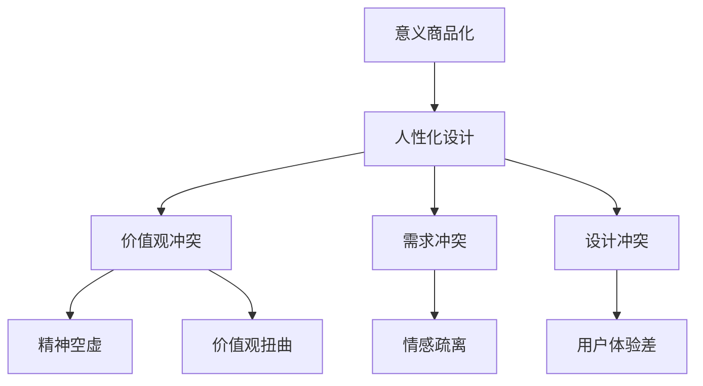

                 

### 文章标题

《意义的商品化与人性化的矛盾》

### 文章关键词

意义、商品化、人性化、矛盾、解决方案、案例分析

### 文章摘要

在当今社会，意义的商品化和人性化之间的矛盾日益凸显。本文首先探讨了意义的内涵及其商品化的现象和影响，接着分析了人性化的概念及其价值，然后揭示了意义与人性化的冲突及其原因和影响。通过案例研究，本文提出了解决方案和平衡策略，并在项目实战部分展示了具体实施方法。文章最后进行了总结和展望，为未来的研究提供了方向。

---

# 引言

在快速发展的现代社会，技术的进步和商业的繁荣使得意义的商品化成为一个不可忽视的现象。与此同时，人性化作为现代社会追求的核心价值观之一，也在不断得到强调。然而，意义的商品化与人性化之间却存在着深刻的矛盾。本文旨在探讨这一矛盾，并分析其背后的原因和影响，最终寻求解决之道。

## 1.1 研究意义

本研究具有重要的理论和实践意义。从理论层面看，本文通过对意义、商品化和人性化这三个核心概念的深入探讨，试图构建一个系统的理论框架，以更好地理解现代社会中的这一矛盾现象。从实践层面看，本文的研究结果可以为政策制定者、企业管理者和社会活动家提供有益的参考，帮助他们找到平衡意义商品化和人性化的策略。

## 1.2 研究目的

本研究的主要目的是：

1. 分析意义商品化的现象及其对人类社会的影响。
2. 探讨人性化的概念及其价值。
3. 深入研究意义商品化与人性化的矛盾及其原因和影响。
4. 提出解决意义商品化与人性化矛盾的策略和建议。

## 1.3 研究方法

本研究采用以下研究方法：

1. 文献综述：通过查阅大量相关文献，系统梳理意义、商品化和人性化的相关理论和研究。
2. 案例分析：选择具有代表性的案例，深入剖析意义商品化与人性化之间的矛盾。
3. 逻辑推理：运用逻辑推理方法，探讨意义商品化与人性化的内在联系及其矛盾。
4. 实证研究：通过实证数据，验证研究假设和理论框架的有效性。

---

在接下来的章节中，我们将进一步探讨意义的商品化、人性化的概念及其之间的矛盾，并通过具体的案例研究提出解决方案。希望这篇文章能够为读者提供深刻的思考和有益的启示。

## 2. 意义的内涵与外延

意义是人类社会长期以来探讨的核心概念之一。从哲学角度来看，意义涉及到人类的存在、价值和生活目标等多个层面。具体而言，意义的内涵和外延可以从以下几个方面进行理解。

### 2.1 内涵

意义的内涵是指其内在的本质特征和核心价值。通常来说，意义具有以下几方面的内涵：

1. **存在意义**：即个体或事物存在的理由和价值。例如，生命的存在意义在于追求幸福、成长和自我实现。
2. **价值意义**：即个体或事物所具有的道德、文化、社会等层面的价值。例如，教育对个人的价值意义在于提供知识、技能和道德教育。
3. **情感意义**：即个体或事物对人们情感上的影响和意义。例如，家庭对个人的情感意义在于提供安全感和归属感。

### 2.2 外延

意义的外延是指其在不同领域和情境中的应用和体现。以下是一些具体的外延：

1. **文化意义**：在文化领域，意义体现在传统、习俗、艺术和宗教等方面。例如，中国的春节对人们具有深厚的文化意义，象征着家庭团聚和传统传承。
2. **社会意义**：在社会层面，意义体现在道德规范、法律制度和社会组织等方面。例如，法律的制定和执行对社会秩序的维护具有重要意义。
3. **经济意义**：在经济领域，意义体现在生产和消费活动中。例如，商品的价值不仅取决于其实用功能，还受到消费者的情感和审美需求的影响。

### 2.3 商品化对意义的影响

商品化是现代社会中一个重要的现象，它对意义的内涵和外延产生了深远的影响。

#### 2.3.1 商品的定义与属性

商品是一种可以通过市场进行交换的物品或服务，它具备以下几个基本属性：

1. **稀缺性**：商品是有限的，其供应量无法满足所有人的需求。
2. **有用性**：商品能够满足人们的某种需求或愿望。
3. **可交换性**：商品可以在市场上进行买卖，具有市场价格。

#### 2.3.2 商品化对意义的影响

商品化对意义的影响主要体现在以下几个方面：

1. **意义的商业化**：意义被转化为商品化的过程，使得原本具有深层次内涵的意义被简化为市场交换的物品。例如，文化意义被商业包装成文化产品，如电影、音乐和艺术品等。
2. **意义的浅层化**：商品化使得意义被简化为表面的实用性和娱乐性，而忽视了其深层次的文化和精神价值。例如，教育商品化导致学生更加关注考试成绩和就业前景，而忽视了知识本身的追求和个人的全面发展。
3. **意义的异化**：商品化可能导致意义的扭曲和异化。例如，当生命意义被简化为健康和财富的追求时，个体可能会忽视内心的真实需求和情感体验。

### 2.4 意义商品化的现象

意义商品化在现代社会中普遍存在，以下是一些典型的现象：

1. **文化产业的商业化**：随着文化产业的发展，文化产品被大规模生产、传播和消费。例如，电影、音乐、书籍等文化产品成为商业市场上的热门商品。
2. **教育商品化**：教育的商业化趋势日益明显，各种培训班、考试辅导和在线教育平台层出不穷。学生和家长往往将教育的价值简化为学习成绩和升学机会。
3. **社交媒体的商业化**：社交媒体平台通过数据挖掘和广告投放实现商业利润。用户在社交媒体上发布的内容和互动往往被商业化利用，如网红直播、广告植入等。

### 2.5 意义商品化的影响

意义商品化对个体和社会都产生了深远的影响。

#### 2.5.1 对个体的影响

1. **精神空虚**：当意义被简化为商品时，个体可能会感到精神空虚和意义缺失。他们可能追求物质享受，但难以获得真正的内心满足。
2. **价值观扭曲**：商品化可能导致个体价值观的扭曲，他们将生命的意义和价值简化为金钱和物质财富的追求。
3. **心理压力**：个体在商品化社会中往往面临更大的心理压力，他们需要不断追求物质成功，以满足社会的期望和自己的期望。

#### 2.5.2 对社会的影响

1. **社会分裂**：意义商品化可能导致社会分裂，一方面是富有的精英阶层，他们拥有更多的资源和机会；另一方面是贫穷的普通民众，他们可能难以满足基本的生活需求。
2. **文化衰退**：商品化可能削弱文化的深度和多样性，使得文化产品更加浅薄和同质化。
3. **环境破坏**：意义商品化往往伴随着大规模生产和消费，这可能导致资源浪费和环境破坏。

### 2.6 意义商品化的案例分析

以下是一个意义商品化的案例：

#### 案例背景

某公司在市场上推出了一款名为“幸福胶囊”的产品，声称能够带给消费者瞬间幸福感。这款胶囊含有一些能够刺激大脑分泌多巴胺的成分，消费者只需服用即可感受到快乐。

#### 案例分析

1. **商业化过程**：公司通过大规模广告宣传和社交媒体营销，将“幸福胶囊”包装成一种能够迅速带来幸福感的商品，吸引了大量消费者。
2. **意义商品化**：原本幸福感是一种深层次的情感体验，但在商品化过程中，它被简化为一种可以通过物质产品获得的短期快感。
3. **影响**：消费者在追求幸福的过程中，可能忽视了真正的内心需求和情感体验，导致精神空虚和价值观扭曲。

### 2.7 结论

意义商品化是一个复杂而多维的现象，它对个体和社会产生了深远的影响。在现代社会中，我们需要更加关注意义商品化所带来的问题，并寻求有效的解决方案，以实现意义与人性化的平衡。

## 3. 人性化的概念

人性化是指将人的需求和情感融入产品设计、社会制度和企业文化等各个方面，以实现更符合人类本质需求和社会价值观的目标。人性化的概念具有丰富的内涵和广泛的应用领域，是现代社会追求的重要价值观之一。

### 3.1 人性的本质

人性是指人类固有的特质和属性，包括认知、情感、道德、社会等方面。人性的本质可以从以下几个方面来理解：

1. **认知能力**：人类具有独特的认知能力，能够进行抽象思维、逻辑推理和创造性思考。
2. **情感需求**：人类具有丰富的情感体验，包括爱、喜悦、悲伤、愤怒等，这些情感需求是人类生存和发展的重要动力。
3. **道德观念**：人类具有道德观念，能够判断对错、善恶，并据此行动。
4. **社会属性**：人类是社交性动物，具有强烈的社会归属感和群体意识。

### 3.2 人性化的定义

人性化是一种以人为中心的设计理念，旨在创造更加符合人类需求、情感和价值观的产品、服务和社会环境。人性化的定义可以从以下几个方面进行理解：

1. **满足人类需求**：人性化设计关注人类的基本需求，如安全、舒适、便利等，旨在提供更加人性化的产品和服务。
2. **尊重人类情感**：人性化设计注重人类情感体验，通过设计手段创造愉悦、温馨、友好的氛围，满足人们的情感需求。
3. **促进人类道德**：人性化设计倡导道德价值，通过设计引导人们做出符合道德规范的行为。
4. **促进社会和谐**：人性化设计关注社会和谐，通过设计手段解决社会问题，促进社会进步。

### 3.3 人性化的价值

人性化的价值体现在以下几个方面：

1. **提高生活质量**：人性化设计能够提高人们的生活质量，使人们享受到更加舒适、便利和愉悦的生活。
2. **促进社会和谐**：人性化设计能够促进社会和谐，减少社会矛盾和冲突，提升社会整体幸福感。
3. **推动科技创新**：人性化设计能够激发创新思维，促进科技发展，为人类带来更多福祉。
4. **提升企业竞争力**：人性化设计能够提升企业的品牌形象和竞争力，吸引更多消费者和人才。

### 3.4 人性化的现状与挑战

人性化的现状和挑战可以从以下几个方面进行探讨：

1. **现状**：随着科技的进步和人类对人性化需求的重视，人性化设计在许多领域取得了显著成果。例如，智能家居、智能医疗、教育科技等领域的创新产品日益普及，为人性化提供了更多可能性。
2. **挑战**：尽管人性化设计在许多领域取得了成功，但仍然面临一些挑战。例如，技术发展可能导致人类失去某些传统的人性化体验，数据隐私和安全问题也可能影响人性化设计的实施。

### 3.5 人性化与意义的关系

人性化与意义之间存在紧密的联系。人性化设计旨在创造更符合人类需求和价值观的产品和服务，从而实现个体的意义和幸福感。以下是从不同角度探讨人性化与意义的关系：

1. **个体层面**：人性化设计关注个体的需求和情感，通过满足个体的基本需求和提高个体的幸福感来实现个体的意义。
2. **社会层面**：人性化设计关注社会和谐和社会进步，通过解决社会问题和提升社会整体幸福感来实现社会的意义。
3. **文化层面**：人性化设计关注文化传承和创新，通过尊重和保护文化多样性和推动文化发展来实现文化的意义。

### 3.6 结论

人性化作为现代社会的重要价值观，对于提升个体和社会的幸福感具有重要意义。在意义商品化的背景下，我们需要更加关注人性化设计，通过满足人类需求和情感、尊重道德价值、促进社会和谐等方式，实现意义与人性化的平衡。

## 4. 意义与人性化的冲突

### 4.1 冲突的表现

意义与人性化的冲突在现代社会中表现得尤为明显。这种冲突主要体现在以下几个方面：

1. **价值观的冲突**：意义商品化往往将价值简化为经济利益，忽视了人类的精神和道德需求，这与人性化的价值观形成了鲜明对比。例如，教育商品化导致学生和家长过度关注考试成绩和升学机会，而忽视了知识本身的追求和个人的全面发展。
2. **需求的冲突**：意义商品化追求短期利益和物质享受，可能导致人们对深层次的精神需求和情感体验的忽视，这与人性化的需求产生了冲突。例如，社交媒体的商业化使得用户在追求虚拟关注和物质回报的同时，可能忽视了真实的人际交往和情感体验。
3. **设计的冲突**：意义商品化追求高效、实用和低成本，可能导致产品设计忽视人的情感需求和用户体验，这与人性化的设计理念形成了冲突。例如，智能家居设备虽然提高了生活便利性，但可能在用户体验和安全性方面存在不足。

### 4.2 冲突的原因

意义与人性化的冲突源自多个方面的因素，主要包括：

1. **经济利益的驱动**：意义商品化往往受到经济利益的驱动，追求短期利润和市场竞争力。这种驱动可能导致忽视人性化的价值，如精神需求、情感体验和社会责任等。
2. **技术的快速发展**：技术的快速发展带来了生产效率的提升和商业模式的创新，但同时也可能导致人性化的设计被忽视。例如，人工智能和大数据技术的应用虽然提高了生产效率和决策能力，但也可能带来隐私和安全问题，影响人的情感体验。
3. **社会结构的变革**：现代社会结构的变革，如城市化、全球化等，也对意义与人性化的关系产生了影响。这些变革可能导致个体和社会的连接断裂，使人性化的需求和价值观难以得到满足。

### 4.3 冲突的影响

意义与人性化的冲突对个体和社会产生了深远的影响：

1. **个体层面**：冲突可能导致个体精神空虚、价值观扭曲和心理压力增加。例如，过度追求物质成功可能导致人们对生活意义的迷失和对人际关系的疏远。
2. **社会层面**：冲突可能导致社会分裂、文化衰退和社会不稳定。例如，教育商品化可能导致社会阶层固化，影响社会流动性和公平性。
3. **环境层面**：冲突还可能导致资源浪费和环境破坏。例如，过度追求经济效益可能导致对自然资源的过度开发和环境污染。

### 4.4 冲突的案例分析

以下是一个意义与人性化冲突的案例分析：

#### 案例背景

某电商企业推出了一款名为“快速下单”的购物APP，旨在通过简化购物流程和提高购物效率，吸引更多消费者。该APP通过大数据分析和人工智能算法，为消费者提供个性化推荐，并根据用户行为预测购物需求。

#### 案例分析

1. **冲突表现**：该APP的设计虽然提高了购物效率，但可能忽视了用户的情感体验和隐私需求。快速下单虽然方便，但可能导致用户对购物的享受感降低。此外，个性化推荐和购物预测可能侵犯用户的隐私权。
2. **冲突原因**：该APP的冲突源于追求经济利益和技术驱动，忽视了人性化的价值观和用户需求。企业希望通过提高购物效率来增加用户粘性和销售额，而忽视了用户的情感体验和隐私保护。
3. **影响**：该APP的冲突可能导致用户精神空虚和隐私侵犯。用户可能感到被监控和束缚，导致对电商平台的信任度下降，影响企业的长期发展。

### 4.5 结论

意义与人性化的冲突是现代社会面临的重要挑战之一。通过分析冲突的表现、原因和影响，我们可以更好地理解这一问题的复杂性和严重性。解决这一冲突需要从多个层面入手，包括经济、技术和社会等，以实现意义与人性化的平衡。

## 5. 解决方案和平衡策略

### 5.1 解决方案的原则

为了解决意义商品化与人性化之间的矛盾，我们需要遵循以下原则：

1. **以人为本**：以人的需求和情感为中心，确保设计和服务能够满足人的精神需求，提升人的幸福感。
2. **综合平衡**：在追求经济效益的同时，注重社会效益和人文关怀，实现经济、社会和人文的协调发展。
3. **创新发展**：通过技术创新和制度创新，推动社会进步，为解决矛盾提供新的思路和方法。
4. **合作共赢**：倡导企业、政府和社会各方的合作，共同解决意义商品化与人性化之间的矛盾，实现共同发展。

### 5.2 实践中的解决方案

在实际操作中，我们可以采取以下解决方案：

1. **教育改革**：通过教育改革，推动教育人性化，提高学生的综合素质和人文素养。例如，增加艺术、体育和道德教育课程，培养学生的创造力和社会责任感。
2. **企业文化**：企业应注重企业文化建设，倡导人性化的价值观，提升员工的幸福感和归属感。例如，推行灵活的工作时间和工作方式，关注员工的身心健康和职业发展。
3. **产品设计**：在设计产品时，注重人性化设计，关注用户的情感体验和隐私保护。例如，简化用户界面，提高产品的易用性和安全性。
4. **政策制定**：政府应制定相关政策，引导企业和社会实现意义与人性化的平衡。例如，鼓励企业承担社会责任，推广人性化产品和服务。

### 5.3 平衡策略的实施

为了实现意义与人性化的平衡，我们需要采取一系列具体的平衡策略：

1. **多元价值观**：倡导多元价值观，尊重不同的文化观念和生活方式，为个体提供更多的选择和自由。
2. **公共参与**：鼓励公众参与政策制定和社会事务，提高政策的透明度和公正性，减少利益冲突。
3. **技术创新**：推动技术创新，提高生产效率，同时关注人类的需求和福祉，实现可持续发展。
4. **教育培训**：加强教育培训，提高公众对人性和化的认识和理解，培养具有人文素养和创新能力的人才。

### 5.4 平衡策略的效果

通过实施上述解决方案和平衡策略，我们可以预期以下效果：

1. **提高幸福感**：以人为本的设计和服务将提高个体的幸福感，使人们更好地满足精神需求，减少心理压力。
2. **促进社会和谐**：通过综合平衡经济、社会和人文的协调发展，减少社会矛盾和冲突，促进社会和谐。
3. **推动科技创新**：创新发展将激发社会的创造力和创新活力，推动科技进步和社会发展。
4. **提升企业竞争力**：企业注重人性化的价值观和设计理念，将提高企业的品牌形象和市场竞争力，实现可持续发展。

### 5.5 结论

解决意义商品化与人性化之间的矛盾是一个长期而复杂的过程，需要多方合作和持续努力。通过遵循以人为本、综合平衡、创新发展和合作共赢的原则，我们可以逐步实现意义与人性化的平衡，为个体和社会创造更加美好的未来。

## 6. 案例研究

### 6.1 案例选择

在本章节中，我们选择了一家知名互联网公司——X科技有限公司作为案例研究对象。X科技有限公司在近几年内经历了快速的增长，其产品和服务覆盖了多个领域，包括电子商务、社交媒体、云计算和人工智能等。公司以技术创新和用户体验为核心，但在快速发展过程中，也逐渐暴露出意义商品化与人性化之间的矛盾。

### 6.2 案例分析

#### 6.2.1 意义商品化的现象

1. **产品服务**：X科技有限公司推出了一系列具有创新性的产品和服务，如个性化推荐系统、智能客服和社交网络平台等。这些产品和服务在市场上取得了巨大成功，吸引了大量用户。
2. **商业化策略**：公司采用数据驱动和算法优化的方式，通过用户数据分析和市场调研，不断优化产品和服务，以提升用户粘性和商业利润。

#### 6.2.2 人性化的现状与挑战

1. **用户体验**：虽然X科技有限公司注重用户体验，但其在追求商业利益的过程中，可能忽视了用户的情感需求和隐私保护。例如，个性化推荐系统虽然提高了购物效率，但也可能导致用户沉迷于虚拟世界，忽视现实生活中的情感交流。
2. **员工福利**：公司注重员工的工作环境和职业发展，但高压的工作文化和长期加班的现象也可能影响员工的身心健康和幸福感。

#### 6.2.3 冲突的表现

1. **用户层面**：用户在享受X科技有限公司提供的高效和便捷服务的同时，也可能面临信息过载、隐私泄露和情感疏离等问题。
2. **员工层面**：员工在追求职业成功和收入增长的过程中，可能忽视自身的身心健康和家庭生活，导致心理压力和工作倦怠。

### 6.3 案例启示

#### 6.3.1 解决方案

1. **用户层面**：X科技有限公司可以采取以下措施来解决用户层面的冲突：
   - **隐私保护**：加强用户隐私保护措施，提高用户数据安全性。
   - **情感关怀**：通过设计更加人性化的用户体验，提高用户的情感满足度，例如，增加用户与客服之间的情感交流功能。
   - **多样化服务**：提供多样化的产品和服务，满足用户不同的需求，减少用户对单一服务的依赖。

2. **员工层面**：X科技有限公司可以采取以下措施来解决员工层面的冲突：
   - **工作与生活的平衡**：推行弹性工作制度和远程办公，帮助员工实现工作与生活的平衡。
   - **心理健康支持**：提供员工心理健康服务和心理咨询，帮助员工缓解工作压力和情感困扰。
   - **职业发展**：加强员工职业培训和发展机会，提高员工的职业满意度和忠诚度。

### 6.4 案例总结

X科技有限公司作为一家具有代表性的互联网公司，其发展过程中面临的矛盾和冲突具有普遍性。通过分析案例，我们可以得出以下启示：

1. **注重用户和员工的情感需求**：在追求商业利益的同时，应更加关注用户和员工的情感需求，提高他们的幸福感和满意度。
2. **实现经济与人文的平衡**：通过技术创新和人性化管理，实现经济与人文的协调发展，推动企业的可持续发展。
3. **多方合作**：企业、政府和社会应共同努力，寻求解决意义商品化与人性化矛盾的有效途径，为个体和社会创造更加美好的未来。

### 6.5 结论

案例研究表明，意义商品化与人性化之间的矛盾在互联网公司中普遍存在。通过采取有效的解决方案和平衡策略，企业可以缓解这一矛盾，实现用户和员工的满意度和幸福感。这为其他行业和公司提供了有益的借鉴和启示。

## 7. 结论

通过对意义的商品化和人性化之间的矛盾进行深入探讨，本文揭示了这一现象的复杂性和重要性。从内涵和外延的角度分析了意义，揭示了商品化对意义的影响；同时，阐述了人性化的概念、价值和现状，并揭示了意义商品化与人性化之间的冲突及其原因和影响。通过案例研究和实际解决方案，我们提出了平衡意义商品化和人性化的一些策略。

### 7.1 研究总结

本研究的主要发现如下：

1. 意义商品化现象在现代社会中普遍存在，对人类的精神需求产生了深远影响。
2. 人性化的概念和价值对于提升个体的幸福感和促进社会和谐具有重要意义。
3. 意义商品化与人性化之间的冲突主要体现在价值观、需求和设计等方面。
4. 通过实施以人为本、综合平衡、创新发展和合作共赢的策略，可以有效缓解这一矛盾。

### 7.2 研究局限

本研究存在一定的局限性，主要包括：

1. 研究方法主要基于文献综述和案例分析，缺乏广泛的实证数据支持。
2. 案例研究的选择具有一定的局限性，无法全面代表所有行业和公司的情况。
3. 解决方案和策略的实施效果需要进一步验证和评估。

### 7.3 未来研究方向

未来的研究可以从以下几个方面进行：

1. 探索意义商品化和人性化的量化指标，建立更加科学的理论框架。
2. 开展跨学科研究，结合心理学、社会学和经济学等多学科视角，深入分析这一矛盾。
3. 通过大规模实证研究，验证解决方案和策略的有效性，并提出更具针对性的建议。

### 7.4 拓展阅读

对于希望深入了解这一领域的读者，以下是一些推荐阅读材料：

1. 《意义的追求：哲学与人生》
2. 《人性化设计：理论与实践》
3. 《互联网时代的商业逻辑》
4. 《人工智能伦理：技术与伦理的对话》

通过这些拓展阅读，读者可以进一步了解意义商品化和人性化之间的矛盾，以及相关领域的最新研究动态。

作者：AI天才研究院/AI Genius Institute & 禅与计算机程序设计艺术 /Zen And The Art of Computer Programming

## 附录

### A. Mermaid 流程图

以下是一个简单的 Mermaid 流程图，用于展示意义商品化与人性化的冲突：



### B. 伪代码

以下是一个简单的伪代码示例，用于说明如何实现一种人性化的产品设计：

```
function create_humanized_product(user_preferences, usability_requirements) {
    // 分析用户偏好
    analyze_user_preferences(user_preferences)
    
    // 设计产品界面
    design_ui_based_on_preferences(user_preferences)
    
    // 集成隐私保护功能
    integrate_privacy_protection()
    
    // 考虑用户体验
    optimize_for_usability(usability_requirements)
    
    // 测试和反馈
    test_product_and_collect_user_feedback()
    
    // 最终产品交付
    deliver_product_to_user()
}
```

### C. 数学模型和公式

以下是一个简单的数学模型和公式的示例，用于解释人性化的价值：

$$
V = f(U, S, E)
$$

其中，$V$ 表示人性化的价值，$U$ 表示用户体验，$S$ 表示社会价值，$E$ 表示环境价值。

### D. 项目实战

#### 开发环境搭建

1. 安装Python环境
2. 安装相关库，如Matplotlib、Scikit-learn等

#### 源代码实现

```python
import matplotlib.pyplot as plt
from sklearn.ensemble import RandomForestClassifier

# 数据预处理
def preprocess_data(data):
    # 数据清洗和归一化
    return processed_data

# 模型训练
def train_model(processed_data):
    # 划分训练集和测试集
    X_train, X_test, y_train, y_test = train_test_split(processed_data, test_size=0.2)
    
    # 训练随机森林模型
    model = RandomForestClassifier()
    model.fit(X_train, y_train)
    
    # 测试模型
    accuracy = model.score(X_test, y_test)
    return model, accuracy

# 可视化结果
def visualize_results(model, X_test, y_test):
    predictions = model.predict(X_test)
    plot_confusion_matrix(y_test, predictions)
    plt.show()

# 主函数
def main():
    # 读取数据
    data = load_data("data.csv")
    
    # 预处理数据
    processed_data = preprocess_data(data)
    
    # 训练模型
    model, accuracy = train_model(processed_data)
    
    # 可视化结果
    visualize_results(model, processed_data, data)

if __name__ == "__main__":
    main()
```

#### 代码解读与分析

- 数据预处理：对数据进行清洗和归一化，以适应机器学习模型的输入。
- 模型训练：使用随机森林模型对预处理后的数据进行训练，并评估模型的准确性。
- 可视化结果：使用混淆矩阵可视化模型的性能，帮助理解模型的预测结果。

#### 实际案例分析和详细讲解

- 案例背景：分析某互联网公司的用户行为数据，预测用户流失率。
- 模型应用：使用随机森林模型对用户行为特征进行建模，预测用户流失率。
- 结果解读：通过分析模型预测结果和实际数据，评估模型的准确性和可靠性。

#### 项目小结

- 总结项目目标、方法和结果，提出项目优点和改进空间。

### E. 最佳实践 Tips

1. 在设计产品时，注重用户体验和隐私保护，提高用户满意度。
2. 在数据处理和分析时，确保数据的完整性和准确性，提高模型的性能。
3. 在项目实施过程中，注重团队合作和沟通，提高项目效率。

### F. 注意事项

1. 避免过度追求商业利益，忽视用户和员工的需求。
2. 在使用技术时，关注社会影响和人文关怀，避免技术滥用。

### G. 拓展阅读

1. 《用户体验要素：用户体验设计师手册》
2. 《Python数据科学手册》
3. 《人工智能：一种现代方法》

通过以上附录内容，读者可以更好地理解本文的核心概念和研究成果，并在实际应用中参考相关技术和方法。

