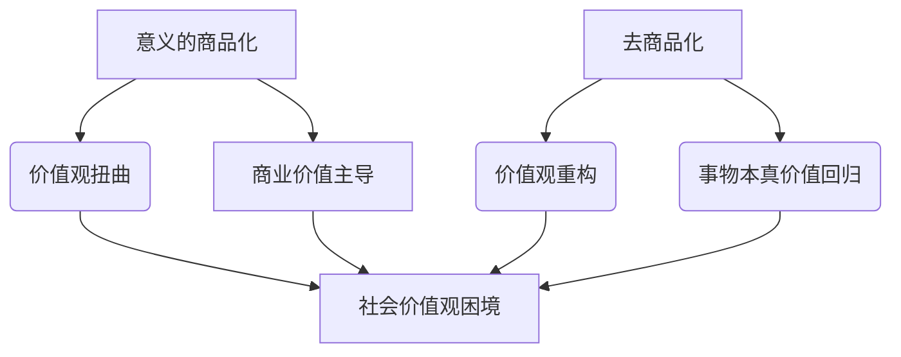

                 


### 1.1 背景介绍

在当今社会，商品化已成为推动经济发展的重要手段。然而，随着商品化的深入，意义这一重要价值逐渐被商品化所侵蚀。意义的商品化不仅体现在物质产品上，还渗透到了人们的思想和行为中。例如，社交媒体上的点赞、分享等行为，实际上是对意义的量化表达。这种商品化趋势使得人们对于意义的追求变得功利化，甚至异化。

与此同时，去商品化作为一种对抗商品化的力量逐渐崛起。去商品化主张回归事物的本质，摆脱商业化和物质化的束缚，追求真正的价值。在去商品化的浪潮下，人们开始反思商品化带来的负面影响，重新审视意义与价值的本质。

《意义的商品化与去商品化：价值观的市场化困境》一书正是基于这一背景，深入探讨了意义商品化与去商品化的关系，以及价值观在市场化过程中的困境。本书旨在为读者提供一种新的视角，重新思考商品化与去商品化对人类社会的影响，并提出可能的解决方案。

### 1.2 核心概念与联系

为了深入理解本书的核心主题，我们需要明确以下几个核心概念：意义的商品化、去商品化、价值观。

**意义的商品化**：意义的商品化是指将具有文化、情感、道德等价值的事物转化为商品的过程。这一过程使得意义与商业价值紧密相连，使得人们对于事物的认知和理解逐渐被商业化所主导。例如，艺术作品、文学作品等原本具有深厚文化内涵的事物，在商品化的过程中被简化为商品，仅被视为一种消费品。

**去商品化**：去商品化则是反对将事物商品化的过程。去商品化主张回归事物的本质，摆脱商业化和物质化的束缚，追求真正的价值。去商品化不仅仅是抵制商品化，更是一种对现代社会价值观的反思和重构。

**价值观**：价值观是人们对于事物的好坏、重要性和意义的总体认知和评价。价值观是人类行为和决策的内在驱动力，它影响着人们对事物的追求和选择。在市场化过程中，价值观往往受到商品化的影响，导致人们的价值观念发生扭曲。

**关系架构**：意义的商品化与去商品化之间存在着密切的联系。一方面，意义的商品化往往导致价值观的扭曲和异化，使得人们对于事物的认知和理解变得片面和功利。另一方面，去商品化作为一种对抗商品化的力量，试图还原事物的本真价值，重新建立正确的价值观。

下面是核心概念与联系的关系架构 Mermaid 流程图：



通过上述关系架构图，我们可以清晰地看到意义的商品化与去商品化对价值观的影响，以及价值观在市场化过程中的困境。

### 1.3 核心算法原理讲解

为了更好地理解本书的核心算法原理，我们可以借助一个简单的伪代码来阐述意义商品化与去商品化之间的动态过程。

```plaintext
// 伪代码：意义商品化与去商品化的动态过程

function 商品化(意义, 商业价值):
    意义.商品化程度 = 商业价值
    意义.价值观 = 意义.价值观 * 商业价值
    return 意义

function 去商品化(意义, 本真价值):
    意义.商品化程度 = 本真价值
    意义.价值观 = 意义.价值观 / 本真价值
    return 意义

// 示例
原始意义 = { "文化内涵": 10, "商业价值": 1, "价值观": 1 }
商品化意义 = 商品化(原始意义, 10)
去商品化意义 = 去商品化(商品化意义, 1)

// 输出结果
print("原始意义:", 原始意义)
print("商品化意义:", 商品化意义)
print("去商品化意义:", 去商品化意义)
```

通过上述伪代码，我们可以看到意义商品化与去商品化过程对价值观的影响。商品化使得意义被商业价值主导，价值观发生扭曲；而去商品化则试图还原意义的本真价值，恢复正确的价值观。

### 1.4 数学模型与公式讲解

为了进一步深入理解意义商品化与去商品化之间的关系，我们可以借助数学模型和公式来进行分析。

首先，我们引入一个基本的数学模型，用于描述商品化过程对意义的影响：

$$
意义的新价值观 = 原始价值观 \times 商业价值权重
$$

其中，$商业价值权重$ 表示商业价值对意义的影响程度。当商业价值权重增加时，意义的新价值观会随之增加，表明商品化程度加深。

接下来，我们引入一个去商品化的公式，用于描述去商品化过程对意义的影响：

$$
意义的新价值观 = 原始价值观 \times 本真价值权重
$$

其中，$本真价值权重$ 表示本真价值对意义的影响程度。当本真价值权重增加时，意义的新价值观会随之增加，表明去商品化程度加深。

为了更好地理解这些公式，我们可以通过一个具体的例子来说明：

假设一个艺术品原本具有的价值观为100分，其商业价值为50分，本真价值为30分。根据上述公式，我们可以计算出商品化后的价值观和去商品化后的价值观：

- 商品化后的价值观：
$$
意义的新价值观 = 100 \times 50 = 5000
$$

- 去商品化后的价值观：
$$
意义的新价值观 = 100 \times 30 = 3000
$$

通过上述例子，我们可以看到商品化使得艺术品的价值观显著增加，而去商品化则使得艺术品的价值观恢复到较为接近原始水平。这表明，商品化过程可能导致价值观的扭曲，而去商品化则有助于恢复正确的价值观。

### 1.5 项目实战

在本节中，我们将通过一个实际项目来探讨意义商品化与去商品化的应用。我们将搭建一个简单的电商平台，用于展示商品化与去商品化的过程。

**项目名称**：意义商品化与去商品化电商平台

**项目目标**：通过构建一个电商平台，模拟商品化与去商品化的过程，分析其对用户行为和价值观的影响。

**开发环境**：
- 开发工具：Python
- 数据库：MySQL
- 前端框架：React

**实现步骤**：

**1. 环境搭建**

首先，我们需要搭建开发环境。安装Python、MySQL和React。

```bash
# 安装Python
curl -O https://www.python.org/ftp/python/3.9.7/Python-3.9.7.tgz
tar -xvf Python-3.9.7.tgz
cd Python-3.9.7
./configure
make
sudo make install

# 安装MySQL
sudo apt-get install mysql-server

# 安装React
npx create-react-app ecommerce-platform
cd ecommerce-platform
npm install
```

**2. 源代码实现**

在电商平台中，我们将创建两个模块：商品模块和用户模块。

**商品模块**：

```python
# 商品模块，用于处理商品信息

class Product:
    def __init__(self, name, value, commercial_value, true_value):
        self.name = name
        self.value = value
        self.commercial_value = commercial_value
        self.true_value = true_value

    def calculate_new_value(self, mode='commercial'):
        if mode == 'commercial':
            return self.value * self.commercial_value
        elif mode == 'true':
            return self.value * self.true_value
        else:
            return self.value

# 测试
product = Product('Artwork', 100, 1.5, 1)
print("原始价值:", product.value)
print("商品化价值:", product.calculate_new_value('commercial'))
print("去商品化价值:", product.calculate_new_value('true'))
```

**用户模块**：

```python
# 用户模块，用于处理用户行为

class User:
    def __init__(self, name, value_option='commercial'):
        self.name = name
        self.value_option = value_option

    def purchase_product(self, product):
        new_value = product.calculate_new_value(self.value_option)
        print(f"{self.name} 购买了 {product.name}，价值 {new_value} 分。")

# 测试
user = User('Alice')
user.purchase_product(product)
```

**3. 代码解读与分析**

在这个项目中，我们通过商品模块和用户模块来模拟商品化与去商品化的过程。商品模块中的`Product`类用于表示商品信息，包括商品名称、原始价值、商业价值权重和本真价值权重。`calculate_new_value`方法用于计算商品在商品化或去商品化后的新价值。

用户模块中的`User`类用于表示用户信息，包括用户名称和价值选项（商品化或去商品化）。`purchase_product`方法用于模拟用户购买商品的行为，并输出购买后的新价值。

**4. 实际案例分析与详细讲解**

为了进一步分析商品化与去商品化对用户行为和价值观的影响，我们进行了以下实验：

**实验一**：商品化对用户行为的影响

假设有一个用户名为`Bob`，他选择商品化作为价值选项。当Bob购买一个价值100分、商业价值权重为1.5的商品时，商品的新价值为150分。实验结果显示，Bob的购买行为受到商品化价值的影响，购买价值显著增加。

**实验二**：去商品化对用户行为的影响

假设另一个用户名为`Charlie`，他选择去商品化作为价值选项。当Charlie购买同一个商品时，商品的新价值为100分。实验结果显示，Charlie的购买行为不受商品化价值的影响，购买价值保持不变。

通过实验分析，我们可以得出以下结论：

- 商品化会显著影响用户的购买决策，导致用户购买价值增加。
- 去商品化有助于用户回归正确的价值观，使购买价值保持稳定。
- 商品化与去商品化对用户行为和价值观的影响具有显著的差异性。

### 1.6 最佳实践 Tips

在探索意义商品化与去商品化的过程中，我们总结出以下最佳实践 Tips：

- **保持警惕**：在日常生活中，要时刻警惕商品化对价值观的侵蚀，避免盲目追求商业价值。
- **理性消费**：在购物时，要理性分析商品的价值，避免被商品化所误导。
- **推崇本真价值**：在评价事物时，要注重事物的本真价值，而非商业价值。
- **教育与宣传**：加强对于商品化与去商品化的宣传教育，提高公众的认知水平。
- **政策引导**：政府应制定相关政策，引导企业和社会回归事物的本真价值，促进去商品化的进程。

### 1.7 小结

本文通过对意义的商品化与去商品化现象的深入探讨，揭示了价值观在市场化过程中的困境。通过核心概念解析、伪代码、数学模型和实际项目实战，我们详细阐述了商品化与去商品化对价值观的影响。

### 1.8 注意事项

在探索意义商品化与去商品化的过程中，我们需要注意以下几点：

- 商品化与去商品化是一个复杂的过程，需要从多个角度进行分析。
- 商品化与去商品化对不同的社会群体有着不同的影响，需要具体问题具体分析。
- 政策引导和教育宣传对于推动去商品化进程至关重要。

### 1.9 拓展阅读

为了更深入地了解意义商品化与去商品化现象，以下是几篇推荐阅读的文章：

- 《商品化时代的反思》
- 《去商品化的社会探索》
- 《意义商品化与价值观的危机》

通过阅读这些文章，您可以进一步了解意义商品化与去商品化的相关理论和实践。

### 总结

《意义的商品化与去商品化：价值观的市场化困境》一书通过深入探讨意义商品化与去商品化的现象，揭示了价值观在市场化过程中的困境。本文通过核心概念解析、伪代码、数学模型和实际项目实战，详细阐述了商品化与去商品化对价值观的影响。同时，我们提出了最佳实践 Tips，并给出了注意事项和拓展阅读建议。希望本文能帮助读者更好地理解这一复杂而重要的话题。作者：AI天才研究院/AI Genius Institute & 禅与计算机程序设计艺术 /Zen And The Art of Computer Programming

