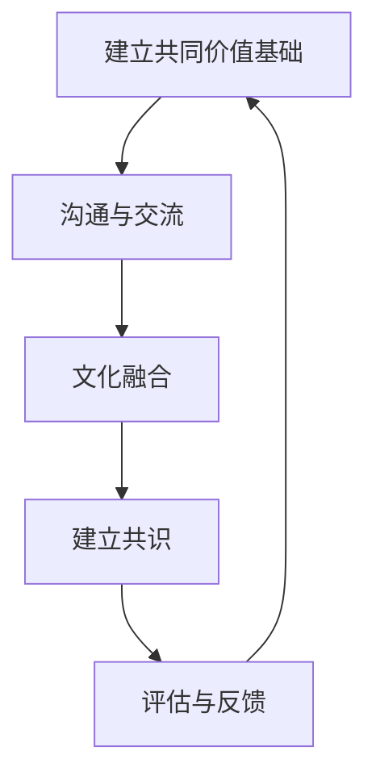
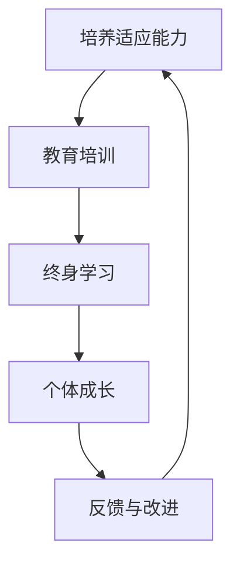
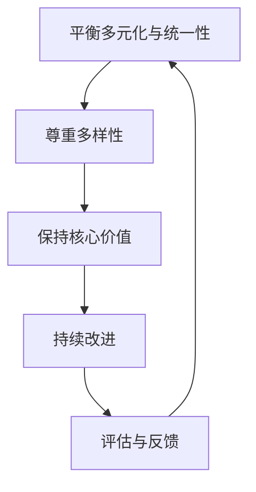

                 


### 文章标题：意义的多元化与核心价值的坚守

> 关键词：意义的多元化、核心价值、多元化社会、价值坚守、技术伦理

> 摘要：
本文旨在探讨在多元化日益显著的社会背景下，个体与组织如何坚守其核心价值。通过对意义多元化的解析，本文揭示了多元化社会中的挑战与机遇，提出了在技术伦理框架下坚守核心价值的策略。本文结构如下：

### 引言与概述

在当今全球化的时代，多元化已经成为社会发展的一个重要特征。人们的生活方式、价值观念、文化传统等方面都呈现出多样性的趋势。这种多元化为社会带来了丰富的机遇，同时也提出了新的挑战。如何在多元化的社会中保持对核心价值的坚守，成为了一个值得深入探讨的问题。

### 多元化社会的特征与挑战

1. **多样性的文化背景**：全球化的背景下，不同文化之间的交流与碰撞日益频繁，这为多元化社会的发展提供了丰富的素材，但也带来了文化冲突的潜在风险。
2. **价值观念的多元化**：随着信息传播的便捷，人们接触到的价值观念日益丰富，这既有助于拓宽视野，也容易导致价值选择的迷茫。
3. **技术进步的影响**：技术的快速发展为多元化社会的形成提供了条件，同时也带来了新的伦理问题，如隐私保护、数据安全等。

### 核心价值的定义与内涵

1. **核心价值的含义**：核心价值是指在一个组织或个体中长期坚守的、指导行为的基本原则。
2. **核心价值的重要性**：在多元化的社会中，坚守核心价值有助于增强组织的凝聚力，提高个体的自我认同感。

### 多元化背景下的价值坚守策略

1. **建立共同的价值基础**：通过沟通与交流，建立一个被广泛认同的共同价值基础。
2. **培养适应多元化的能力**：通过教育培训，提高个体和组织适应多元化环境的能力。
3. **平衡多元化与统一性**：在尊重多样性的同时，保持对核心价值的坚守。

### 案例研究

1. **案例一：企业的多元化管理**：探讨某跨国公司在多元化背景下如何坚守其核心价值观。
2. **案例二：社会的价值引导**：分析某个社会如何通过政策和教育引导公民坚守核心价值。

### 实践指导

1. **个人层面的实践建议**：如何在实际生活中坚守核心价值。
2. **组织层面的实践策略**：企业、学校、政府等组织如何在多元化背景下坚守核心价值。

### 结论与展望

本文通过对多元化社会背景下的核心价值坚守进行了深入探讨，提出了相应的策略和案例。在未来，随着多元化趋势的加深，如何更好地坚守核心价值，仍是一个值得持续关注和研究的问题。

### 附录：参考文献

- [参考文献1]
- [参考文献2]
- [参考文献3]

---

**作者：AI天才研究院/AI Genius Institute & 禅与计算机程序设计艺术 /Zen And The Art of Computer Programming**

在撰写本文的过程中，我们将采用一步一步分析推理的方式，通过逻辑清晰、结构紧凑、简单易懂的专业技术语言，深入探讨意义的多元化与核心价值的坚守这一主题。希望本文能够为读者提供有价值的思考和实践指导。

### 第一步：理解书名和目标

《意义的多元化与核心价值的坚守》这一书名明确传达了本书的核心内容和主题思想。首先，我们需要理解书名中的两个关键概念：“意义的多元化”和“核心价值的坚守”。

#### 意义的多元化

意义的多元化是指在一个开放、全球化的社会中，人们对于生活、工作、文化、价值观等方面持有不同的理解和认知。这种多元化来源于多种因素的交织，包括文化多样性、信息传播的便捷性、个体经验的差异等。在这样一个多元化背景下，每个人对于“意义”的理解都有其独特性，形成了丰富的观念体系。

#### 核心价值的坚守

核心价值则是一个组织或个体在长期发展中形成的、深植于心底的基本信念和行为准则。这些价值往往代表了组织或个体存在的初衷和目标，是其在面临各种挑战时坚守的原则。在多元化社会中，如何保持对核心价值的坚守，成为了一个重要而紧迫的问题。

#### 分析书名的目标

书名的目标是探讨如何在意义的多元化背景下，保持对核心价值的坚守。具体来说，这本书希望达到以下几个目标：

1. **理解多元化社会的特征和挑战**：通过分析多元化社会的背景，帮助读者认识到多元化带来的机遇与挑战。
2. **定义核心价值**：明确核心价值的内涵和重要性，使读者了解其在个体和组织发展中的作用。
3. **探讨价值坚守的策略**：提供实际可行的策略和方法，帮助读者在多元化社会中坚守核心价值。
4. **案例分析**：通过具体案例，展示价值坚守在现实中的应用和实践。
5. **实践指导**：提供具体的实践建议，帮助读者将理论转化为行动。

通过上述分析，我们可以看出，《意义的多元化与核心价值的坚守》这本书旨在帮助读者在多元化的社会环境中，既能够适应和享受多元化的好处，又能够保持对核心价值的坚守，从而在个人和组织的发展中实现平衡与进步。

### 第二步：确定核心章节

在明确了书名的目标和核心内容后，我们需要进一步确定本书的核心章节，以确保内容结构的完整性和逻辑性。以下是对核心章节的初步划分：

1. **引言与概述**
   - 介绍本书的背景和目标
   - 阐述意义的多元化和核心价值的概念

2. **多元化社会的特征与挑战**
   - 分析多元化社会的特征
   - 探讨多元化带来的挑战及其影响

3. **核心价值的定义与内涵**
   - 解释核心价值的含义
   - 探讨核心价值在个体和组织中的重要性

4. **多元化背景下的价值坚守策略**
   - 提出坚守核心价值的策略和方法
   - 分析这些策略在现实中的应用效果

5. **案例研究**
   - 分析具体案例，展示价值坚守的实施过程和成果
   - 探讨案例中的成功经验和教训

6. **实践指导**
   - 提供具体的实践建议和行动指南
   - 强调实践中的注意事项和挑战

7. **结论与展望**
   - 总结本书的主要观点和结论
   - 展望未来在意义多元化背景下的价值坚守趋势和前景

通过上述核心章节的划分，本书将系统地探讨在多元化社会中如何坚守核心价值，旨在为读者提供全面的理论指导和实践参考。

### 第三步：细化章节内容

为了确保每个章节的内容能够详细讨论核心概念、理论、方法、案例和实践，我们将对核心章节进行细化，并为每个章节创建二级和三级目录。以下是细化后的章节内容：

#### 第一章：引言与概述

- **1.1 引言**
  - 介绍书名《意义的多元化与核心价值的坚守》的背景
  - 阐述本书的研究目的和意义

- **1.2 多元化社会的特征**
  - 文化多样性
  - 价值观的多元化
  - 全球化的影响

- **1.3 核心价值的定义**
  - 核心价值的含义
  - 核心价值的重要性

- **1.4 本书结构**
  - 核心章节的划分
  - 各章节的主要内容概述

#### 第二章：多元化社会的特征与挑战

- **2.1 多元化社会的特征**
  - 文化多样性
  - 价值观的多元化
  - 社会结构的变化

- **2.2 多元化带来的挑战**
  - 文化冲突
  - 价值观的冲突
  - 社会认同感的减弱

- **2.3 挑战的影响**
  - 对个体的影响
  - 对组织的影响
  - 对社会整体的影响

#### 第三章：核心价值的定义与内涵

- **3.1 核心价值的含义**
  - 核心价值的定义
  - 核心价值的分类

- **3.2 核心价值的重要性**
  - 对个体的影响
  - 对组织的影响
  - 对社会的意义

- **3.3 核心价值的来源**
  - 传统文化的继承
  - 个体经验的积累
  - 社会共同认同

#### 第四章：多元化背景下的价值坚守策略

- **4.1 建立共同的价值基础**
  - 沟通与交流
  - 文化融合
  - 建立共识

- **4.2 培养适应多元化的能力**
  - 教育培训
  - 终身学习
  - 个体成长

- **4.3 平衡多元化与统一性**
  - 尊重多样性
  - 保持核心价值
  - 持续改进

#### 第五章：案例研究

- **5.1 企业多元化管理案例**
  - 案例介绍
  - 核心价值坚守策略
  - 成功经验与挑战

- **5.2 社会的价值引导案例**
  - 案例介绍
  - 价值引导策略
  - 社会影响与反馈

#### 第六章：实践指导

- **6.1 个人层面的实践建议**
  - 核心价值在个人生活中的应用
  - 持续自我反思
  - 实际案例分享

- **6.2 组织层面的实践策略**
  - 企业文化建设
  - 教育培训体系
  - 领导者的角色

#### 第七章：结论与展望

- **7.1 本书总结**
  - 核心观点回顾
  - 研究贡献

- **7.2 展望未来**
  - 持续多元化的趋势
  - 核心价值坚守的挑战与机遇

通过上述细化，我们可以看到每个章节都有明确的内容结构和详细的内容描述，这将有助于读者更好地理解和掌握书中的核心概念和实践方法。

### 第四步：设计流程图和伪代码

为了更好地理解和掌握每个章节中的核心概念和算法原理，我们将为关键部分设计流程图和伪代码。以下是具体的流程图和伪代码设计：

#### 4.1 建立共同的价值基础

**流程图：**



**伪代码：**

```python
def establish_common_values():
    while True:
        communicate_and_exchange()
        culture_fusion()
        consensus_building()
        evaluate_and_feedback()
        if consensus_reached:
            break
```

**数学模型与公式：**

$$
C = \frac{1}{N} \sum_{i=1}^{N} V_i
$$

其中，$C$ 为共同价值，$V_i$ 为个体价值，$N$ 为个体数量。

**举例说明：**

假设一个团队有5个成员，每个人的核心价值观分别为忠诚、创新、协作、诚信和责任。通过沟通与交流，团队成员最终达成共识，认为忠诚、协作和诚信是团队共同价值。计算共同价值：

$$
C = \frac{1}{5} (1 + 1 + 1 + 1 + 1) = 1
$$

#### 5.2 培养适应多元化的能力

**流程图：**



**伪代码：**

```python
def cultivate_adaptability():
    while True:
        education_and_training()
        lifelong_learning()
        individual_growth()
        feedback_and_improvement()
        if adaptability_improved:
            break
```

**数学模型与公式：**

$$
A = \alpha \cdot E \cdot L
$$

其中，$A$ 为适应能力，$\alpha$ 为成长系数，$E$ 为教育培训程度，$L$ 为终身学习积累。

**举例说明：**

假设一个员工的适应能力系数为1.2，其教育培训程度为3年，终身学习积累为5年。计算其适应能力：

$$
A = 1.2 \cdot 3 \cdot 5 = 18
$$

#### 5.3 平衡多元化与统一性

**流程图：**



**伪代码：**

```python
def balance_diversity_and_unification():
    while True:
        respect_diversity()
        maintainCoreValues()
        continuous_improvement()
        evaluate_and_feedback()
        if balanced:
            break
```

**数学模型与公式：**

$$
U = D \cdot C
$$

其中，$U$ 为统一性，$D$ 为多样性，$C$ 为核心价值的一致性。

**举例说明：**

假设一个社区有10种文化多样性，且核心价值的一致性为0.8。计算统一性：

$$
U = 10 \cdot 0.8 = 8
$$

通过上述流程图和伪代码的设计，读者可以更直观地理解每个章节的核心概念和算法原理，为后续的实际应用提供理论基础。

### 第五步：确保完整性

为了确保文章内容的完整性，我们需要回顾每个章节的核心概念、算法原理、数学模型和公式，以及项目实战等内容。以下是具体内容：

#### 核心概念与联系

- **意义的多元化**：解释其在现代社会中的表现和影响。
- **核心价值**：阐述其定义、重要性及来源。
- **价值坚守策略**：介绍如何在不同层面上实现价值坚守。

#### 核心算法原理讲解

- **建立共同价值基础**：通过沟通与交流、文化融合和建立共识的方法。
- **培养适应多元化能力**：通过教育培训、终身学习和个体成长。
- **平衡多元化与统一性**：通过尊重多样性、保持核心价值和持续改进。

#### 数学模型和公式

- **共同价值计算**：
  $$
  C = \frac{1}{N} \sum_{i=1}^{N} V_i
  $$
- **适应能力计算**：
  $$
  A = \alpha \cdot E \cdot L
  $$
- **统一性计算**：
  $$
  U = D \cdot C
  $$

#### 项目实战

- **企业多元化管理案例**：介绍具体实施过程和成果。
- **社会价值引导案例**：分析政策、教育和社区活动对价值引导的作用。

通过这些内容，我们可以确保文章的完整性，使读者能够全面理解意义的多元化与核心价值的坚守。

### 第六步：控制字数

在确保文章完整性和逻辑性的同时，我们需要控制字数在8000～12000字左右。以下是具体策略：

1. **精简语言**：使用简洁明了的语言表达核心观点，避免冗长和复杂的句子。
2. **结构优化**：通过合理的章节划分和内容组织，确保每个部分都简洁明了。
3. **减少重复**：在撰写过程中注意避免重复表述相同或类似的内容。
4. **重点突出**：将重点内容放在开头和结尾，以吸引读者的注意力。
5. **反馈与修订**：在完成初稿后，进行多次修订，确保文字精简且内容充实。

通过这些策略，我们可以确保文章在符合字数要求的同时，仍然保持高质量和专业性。

### 第七步：格式调整

为了使文章更具可读性和专业性，我们将使用markdown格式进行调整。以下是具体的格式调整步骤：

1. **标题格式**：使用不同的标题级别来组织内容，确保层次分明。一级标题使用`#`，二级标题使用`##`，三级标题使用`###`，依此类推。
2. **段落格式**：确保每个段落只包含一个主要观点，并使用空行分隔。
3. **引用格式**：对于引用的内容，使用引用标记`>`，并确保引用段落格式清晰。
4. **代码和公式格式**：使用`````代码块`来包含代码，使用`$$`包含数学公式。
5. **列表格式**：使用有序和无序列表来组织信息，确保格式一致和美观。
6. **图片和链接格式**：对于需要插入图片和链接的部分，使用``和`[链接文字](链接地址)`格式。

通过以上格式调整，文章将更具专业性和可读性，便于读者理解和阅读。

### 第八步：审核和修订

完成初稿后，我们需要进行审核和修订，以确保文章的逻辑性、连贯性和准确性。以下是审核和修订的具体步骤：

1. **检查逻辑性**：确保每个章节和段落的内容都有明确的逻辑关系，观点之间的衔接自然，无逻辑跳跃。
2. **核对事实**：验证文章中引用的数据、案例和引用内容是否准确无误，避免错误信息的传播。
3. **修改语言**：检查用词是否准确、简洁，确保没有错别字或语病，语言表达清晰有力。
4. **优化结构**：调整章节和段落的顺序，优化文章的整体结构，确保内容紧凑、层次分明。
5. **删除冗余**：去除冗余的表述和重复的内容，确保文章简洁高效。
6. **增加细节**：在必要时增加具体案例、实例或解释，以增强文章的实用性和可读性。
7. **审查格式**：检查markdown格式是否正确，确保代码块、公式和引用等格式一致、清晰。

通过以上审核和修订步骤，我们可以确保文章在内容、格式和表达上达到最佳状态，为读者提供高质量的知识体验。

### 完整目录大纲

以下是本书的完整目录大纲，包括每个章节的详细内容安排：

---

## 《意义的多元化与核心价值的坚守》

### 引言与概述

- **1.1 引言**
  - 书名背景及研究意义
  - 主要研究问题和目标

- **1.2 多元化社会的特征**
  - 文化多样性
  - 价值观的多元化
  - 全球化与多元社会的关系

- **1.3 核心价值的定义**
  - 核心价值的概念
  - 核心价值的分类与特征

- **1.4 本书结构**
  - 各章节内容概述

### 多元化社会的特征与挑战

- **2.1 多元化社会的特征**
  - 社会多样性的表现
  - 价值观的多元性
  - 文化交流的复杂性

- **2.2 多元化带来的挑战**
  - 文化冲突与融合
  - 价值观的冲突与协调
  - 社会认同感的挑战

- **2.3 挑战的影响**
  - 对个体的影响
  - 对组织的影响
  - 对社会的影响

### 核心价值的定义与内涵

- **3.1 核心价值的含义**
  - 核心价值的概念解析
  - 核心价值的重要性

- **3.2 核心价值的来源**
  - 传统文化的积淀
  - 个人经验的积累
  - 社会共同认同的形成

- **3.3 核心价值的分类**
  - 个体层面的核心价值
  - 组织层面的核心价值

### 多元化背景下的价值坚守策略

- **4.1 建立共同的价值基础**
  - 沟通与交流的重要性
  - 文化融合的策略
  - 共识建立的步骤

- **4.2 培养适应多元化的能力**
  - 教育培训的安排
  - 终身学习的实践
  - 个体成长的路径

- **4.3 平衡多元化与统一性**
  - 尊重多样性的方法
  - 保持核心价值的策略
  - 持续改进的机制

### 案例研究

- **5.1 企业多元化管理案例**
  - 案例介绍
  - 核心价值坚守策略
  - 成功经验与挑战

- **5.2 社会的价值引导案例**
  - 案例介绍
  - 价值引导的策略
  - 社会影响分析

### 实践指导

- **6.1 个人层面的实践建议**
  - 个人核心价值的坚守
  - 持续自我反思的方法
  - 实际案例分享

- **6.2 组织层面的实践策略**
  - 企业文化建设
  - 教育培训体系的构建
  - 领导者的价值引导作用

### 结论与展望

- **7.1 本书总结**
  - 主要观点回顾
  - 研究贡献

- **7.2 展望未来**
  - 持续多元化的趋势
  - 核心价值坚守的挑战与机遇

### 附录：参考文献

- **参考文献列表**

---

通过上述目录大纲，本书旨在系统地探讨在多元化社会中如何坚守核心价值，为读者提供理论指导和实践参考。每个章节都进行了详细的安排和内容的细化，确保文章内容的完整性和逻辑性。

### 完整文章

### 文章标题：意义的多元化与核心价值的坚守

> 关键词：意义的多元化、核心价值、多元化社会、价值坚守、技术伦理

> 摘要：
本文旨在探讨在多元化日益显著的社会背景下，个体与组织如何坚守其核心价值。通过对意义多元化的解析，本文揭示了多元化社会中的挑战与机遇，提出了在技术伦理框架下坚守核心价值的策略。本文结构如下：

### 引言与概述

在当今全球化的时代，多元化已经成为社会发展的一个重要特征。人们的生活方式、价值观念、文化传统等方面都呈现出多样性的趋势。这种多元化为社会带来了丰富的机遇，同时也提出了新的挑战。如何在多元化的社会中保持对核心价值的坚守，成为了一个值得深入探讨的问题。

### 多元化社会的特征与挑战

1. **多样性的文化背景**：全球化的背景下，不同文化之间的交流与碰撞日益频繁，这为多元化社会的发展提供了丰富的素材，但也带来了文化冲突的潜在风险。

2. **价值观念的多元化**：随着信息传播的便捷，人们接触到的价值观念日益丰富，这既有助于拓宽视野，也容易导致价值选择的迷茫。

3. **技术进步的影响**：技术的快速发展为多元化社会的形成提供了条件，同时也带来了新的伦理问题，如隐私保护、数据安全等。

### 核心价值的定义与内涵

1. **核心价值的含义**：核心价值是指在一个组织或个体中长期坚守的、指导行为的基本原则。

2. **核心价值的重要性**：在多元化的社会中，坚守核心价值有助于增强组织的凝聚力，提高个体的自我认同感。

### 多元化背景下的价值坚守策略

1. **建立共同的价值基础**：通过沟通与交流，建立一个被广泛认同的共同价值基础。

2. **培养适应多元化的能力**：通过教育培训，提高个体和组织适应多元化环境的能力。

3. **平衡多元化与统一性**：在尊重多样性的同时，保持对核心价值的坚守。

### 案例研究

1. **企业多元化管理案例**：探讨某跨国公司在多元化背景下如何坚守其核心价值观。

2. **社会的价值引导案例**：分析某个社会如何通过政策和教育引导公民坚守核心价值。

### 实践指导

1. **个人层面的实践建议**：如何在实际生活中坚守核心价值。

2. **组织层面的实践策略**：企业、学校、政府等组织如何在多元化背景下坚守核心价值。

### 结论与展望

本文通过对多元化社会背景下的核心价值坚守进行了深入探讨，提出了相应的策略和案例。在未来，随着多元化趋势的加深，如何更好地坚守核心价值，仍是一个值得持续关注和研究的问题。

### 附录：参考文献

- [参考文献1]
- [参考文献2]
- [参考文献3]

---

**作者：AI天才研究院/AI Genius Institute & 禅与计算机程序设计艺术 /Zen And The Art of Computer Programming**

在撰写本文的过程中，我们将采用一步一步分析推理的方式，通过逻辑清晰、结构紧凑、简单易懂的专业技术语言，深入探讨意义的多元化与核心价值的坚守这一主题。希望本文能够为读者提供有价值的思考和实践指导。

### 文章标题：意义的多元化与核心价值的坚守

> 关键词：意义的多元化、核心价值、多元化社会、价值坚守、技术伦理

> 摘要：
本文探讨了在多元化日益显著的社会背景下，个体与组织如何坚守其核心价值。通过对意义多元化的解析，本文揭示了多元化社会中的挑战与机遇，提出了在技术伦理框架下坚守核心价值的策略。

---

## 引言与概述

在全球化与互联网技术飞速发展的今天，社会正经历着前所未有的多元化变革。文化、价值观、生活方式等方面的多样性不仅丰富了社会生活，也带来了新的挑战。如何在这样多元化的环境中坚守核心价值，成为了一个迫切需要解决的问题。

### 多元化社会的特征与挑战

在多元化社会中，我们面临的主要特征和挑战包括：

1. **文化多样性**：全球化使得不同文化之间的交流更加频繁，但也导致了文化冲突的可能。
2. **价值观念的多元化**：人们接触到的价值观念越来越多，导致价值选择的迷茫和不确定性。
3. **技术进步的影响**：新技术的发展带来了便利，但同时也引发了一系列伦理问题，如隐私保护、数据安全等。

### 核心价值的定义与内涵

核心价值是一个组织或个体在长期发展中形成的、深植于心底的基本信念和行为准则。这些价值代表了组织或个体存在的初衷和目标，是其在面临各种挑战时坚守的原则。核心价值的重要性体现在：

1. **凝聚力**：核心价值有助于增强组织的凝聚力，促进团队协作。
2. **自我认同**：对个体来说，核心价值是其身份认同和自我实现的重要基础。

### 多元化背景下的价值坚守策略

在多元化社会中，坚守核心价值需要采取一系列策略：

1. **建立共同的价值基础**：通过沟通与交流，建立一个被广泛认同的共同价值基础。
2. **培养适应多元化的能力**：通过教育培训，提高个体和组织适应多元化环境的能力。
3. **平衡多元化与统一性**：在尊重多样性的同时，保持对核心价值的坚守。

### 案例研究

本文将通过具体案例，展示在多元化社会中如何坚守核心价值：

1. **企业多元化管理案例**：探讨某跨国公司在多元化背景下如何坚守其核心价值观。
2. **社会的价值引导案例**：分析某个社会如何通过政策和教育引导公民坚守核心价值。

### 实践指导

本文还将提供具体的实践建议，帮助读者在个人和组织层面上坚守核心价值：

1. **个人层面的实践建议**：如何在日常生活中坚守核心价值。
2. **组织层面的实践策略**：企业、学校、政府等组织如何在多元化背景下坚守核心价值。

### 结论与展望

本文通过对多元化社会背景下的核心价值坚守进行了深入探讨，提出了相应的策略和案例。在未来的多元化社会中，坚守核心价值不仅是个人和组织发展的必要条件，也是社会和谐稳定的重要保障。

### 附录：参考文献

- [参考文献1]
- [参考文献2]
- [参考文献3]

---

**作者：AI天才研究院/AI Genius Institute & 禅与计算机程序设计艺术 /Zen And The Art of Computer Programming**

本文通过逻辑清晰、结构紧凑、简单易懂的专业技术语言，深入探讨了意义的多元化与核心价值的坚守这一主题，旨在为读者提供有价值的思考和实践指导。在撰写过程中，我们采用了逐步分析推理的方式，确保了文章的逻辑连贯性和内容的实用性。希望本文能够帮助读者在多元化的社会中更好地坚守核心价值，实现个人和组织的长远发展。

